# ZAREWA ALUMINIUM AND PLASTICS LTD

## COMPLETE ERP THESIS, SYSTEM OF OPERATIONS, USER MANUAL, JOB DESCRIPTIONS, HR COMPENDIUM & COMMERCIAL DOSSIER

| Field | Value |
| --- | --- |
| Document ID | ZAREWA-ERP-THESIS-SOP-MANUAL-2026 |
| Version | 1.0 — Code-Extracted Super Manual |
| Generated | 2026-07-24T22:11:52.019Z |
| Classification | Internal + Academic + Commercial (assemble as needed) |
| Sources | Zarewa-backend-main + Zarewa-frontend-main (live code & docs) |
| Target length | 50,000 lines |
| Company | Zarewa Aluminium and Plastics Ltd (Zarewa Industries) |
| Stack | React 19 + Vite + Express 5 + MySQL |
| Branches | BR-KD Kaduna (HQ), BR-YL Yola, BR-MDG Maiduguri |

This single master file is intentionally multi-audience. Read it as a thesis on enterprise systems in Nigerian manufacturing, as an SOP for daily operations, as a user manual for each desk, as HR job descriptions and welfare guidance, as customer-service standards, and as a commercial narrative for selling or defending the Zarewa ERP. Every operational claim is grounded in routes, roles, permissions, tables, and procedures found in the repositories.

Assembled volumes below interleave newly synthesised analysis with verbatim project documentation. Where the live system has gaps (for example, maintenance HTTP surface incompleteness), the gap is stated explicitly rather than hidden.

## MASTER TABLE OF CONTENTS (VOLUMES)

1. Volume I — Thesis framing: problem, significance, methodology (code-as-ethnography)
2. Volume II — Commercial dossier: what Zarewa ERP is and why it sells
3. Volume III — Company, products, customers, branches, document identity
4. Volume IV — Architecture, security, RBAC, data model overview
5. Volume V — Job descriptions, welfare, and how to excel in each role
6. Volume VI — Department SOPs and user manuals (desk-by-desk)
7. Volume VII — Permission encyclopedia
8. Volume VIII — HTTP API catalogue (operator-oriented)
9. Volume IX — Data dictionary (tables)
10. Volume X — Challenges, problems, comments, known gaps, suggestions
11. Volume XI — Customer service, staff conduct, directors’ cadence
12. Volume XII — Training curricula and scenario matrix
13. Volume XIII — Verbatim SOP corpus (frontend docs/SOP)
14. Volume XIV — Verbatim backend & extended documentation corpus
15. Volume XV — Appendices, glossaries, revision & usage guide

# VOLUME I — THESIS FRAMING

## I.1 Research problem

Manufacturing distributors in emerging markets often run sales books, store cards, and payroll on disconnected tools. The result is unverifiable stock, unreconciled cash, and management decisions based on WhatsApp summaries. Zarewa ERP is a counter-example: a single system of record spanning quotation, cashier clearance, coil-level inventory, production conversion, GL policy, HR, and executive decisioning.

## I.2 Significance

- Academic: demonstrates socio-technical design of SoD, branch isolation, and revenue recognition (AP1c) in a real plant context.
- Operational: reduces leakage between paid money, produced metres, and delivered goods.
- Governance: creates auditable artefacts (QT/CL/PJ/RCP/PO/…) suitable for board and external review.
- HR: embeds employee lifecycle in the same control environment as cash and stock.

## I.3 Methodology — code as primary source

This dossier treats the repositories as ethnographic primary sources. Role keys are taken from `server/auth.js` ROLE_DEFINITIONS; permission catalogues from auth + `hrPermissionKeys.js`; routes from `httpApi.js`, `hrApi.js`, `mobileApi.js`; tables from `schemaSql.js`; UI maps from `src/App.jsx` and module access policies; procedures from `docs/SOP/*` and backend runbooks. Claims that cannot be evidenced in code or project docs are labelled as recommendations.

## I.4 Research questions

1. How does Zarewa encode segregation of duties across sales, cashier, manager, and MD?
2. How are physical coils and stone materials made digitally accountable?
3. How does payment gating protect working capital before production and delivery?
4. How do HR and executive benefits remain inside the same RBAC fabric?
5. Where do process and platform gaps remain, and what should improve next?

## I.5 Thesis-style chapter map (for academic extraction)

| Thesis chapter | Extract from this dossier |
| --- | --- |
| Literature / industry context | Volume II commercial + manufacturing product sections |
| System design | Volumes III–IV |
| Organisational roles | Volume V |
| Process analysis | Volumes VI, XII, XIII |
| Evaluation / limitations | Volume X |
| Conclusion / recommendations | Volume X suggestions + XV |

### I.6 Method note 1 — evidence discipline

When describing procedure cluster 1, cite (a) the operator screen route, (b) the permission key that gates the button, (c) the API route that mutates state, (d) the table(s) written, and (e) the SOP section that trains the human. If any one of these five is missing, classify the feature as partial and list it under Volume X.

- Prefer system statuses (Pending, Cleared, Running, Completed) over informal language.
- Prefer document IDs (PREFIX-BRANCH-YY-NNNN) in examples.
- Prefer NGN amounts and metre/kg units as used in production.
- Prefer branch codes KD, YL, MDG rather than free-text city names alone.
- Prefer role keys (`sales_manager`) alongside human titles (Branch Manager).

### I.6 Method note 2 — evidence discipline

When describing procedure cluster 2, cite (a) the operator screen route, (b) the permission key that gates the button, (c) the API route that mutates state, (d) the table(s) written, and (e) the SOP section that trains the human. If any one of these five is missing, classify the feature as partial and list it under Volume X.

- Prefer system statuses (Pending, Cleared, Running, Completed) over informal language.
- Prefer document IDs (PREFIX-BRANCH-YY-NNNN) in examples.
- Prefer NGN amounts and metre/kg units as used in production.
- Prefer branch codes KD, YL, MDG rather than free-text city names alone.
- Prefer role keys (`sales_manager`) alongside human titles (Branch Manager).

### I.6 Method note 3 — evidence discipline

When describing procedure cluster 3, cite (a) the operator screen route, (b) the permission key that gates the button, (c) the API route that mutates state, (d) the table(s) written, and (e) the SOP section that trains the human. If any one of these five is missing, classify the feature as partial and list it under Volume X.

- Prefer system statuses (Pending, Cleared, Running, Completed) over informal language.
- Prefer document IDs (PREFIX-BRANCH-YY-NNNN) in examples.
- Prefer NGN amounts and metre/kg units as used in production.
- Prefer branch codes KD, YL, MDG rather than free-text city names alone.
- Prefer role keys (`sales_manager`) alongside human titles (Branch Manager).

### I.6 Method note 4 — evidence discipline

When describing procedure cluster 4, cite (a) the operator screen route, (b) the permission key that gates the button, (c) the API route that mutates state, (d) the table(s) written, and (e) the SOP section that trains the human. If any one of these five is missing, classify the feature as partial and list it under Volume X.

- Prefer system statuses (Pending, Cleared, Running, Completed) over informal language.
- Prefer document IDs (PREFIX-BRANCH-YY-NNNN) in examples.
- Prefer NGN amounts and metre/kg units as used in production.
- Prefer branch codes KD, YL, MDG rather than free-text city names alone.
- Prefer role keys (`sales_manager`) alongside human titles (Branch Manager).

### I.6 Method note 5 — evidence discipline

When describing procedure cluster 5, cite (a) the operator screen route, (b) the permission key that gates the button, (c) the API route that mutates state, (d) the table(s) written, and (e) the SOP section that trains the human. If any one of these five is missing, classify the feature as partial and list it under Volume X.

- Prefer system statuses (Pending, Cleared, Running, Completed) over informal language.
- Prefer document IDs (PREFIX-BRANCH-YY-NNNN) in examples.
- Prefer NGN amounts and metre/kg units as used in production.
- Prefer branch codes KD, YL, MDG rather than free-text city names alone.
- Prefer role keys (`sales_manager`) alongside human titles (Branch Manager).

### I.6 Method note 6 — evidence discipline

When describing procedure cluster 6, cite (a) the operator screen route, (b) the permission key that gates the button, (c) the API route that mutates state, (d) the table(s) written, and (e) the SOP section that trains the human. If any one of these five is missing, classify the feature as partial and list it under Volume X.

- Prefer system statuses (Pending, Cleared, Running, Completed) over informal language.
- Prefer document IDs (PREFIX-BRANCH-YY-NNNN) in examples.
- Prefer NGN amounts and metre/kg units as used in production.
- Prefer branch codes KD, YL, MDG rather than free-text city names alone.
- Prefer role keys (`sales_manager`) alongside human titles (Branch Manager).

### I.6 Method note 7 — evidence discipline

When describing procedure cluster 7, cite (a) the operator screen route, (b) the permission key that gates the button, (c) the API route that mutates state, (d) the table(s) written, and (e) the SOP section that trains the human. If any one of these five is missing, classify the feature as partial and list it under Volume X.

- Prefer system statuses (Pending, Cleared, Running, Completed) over informal language.
- Prefer document IDs (PREFIX-BRANCH-YY-NNNN) in examples.
- Prefer NGN amounts and metre/kg units as used in production.
- Prefer branch codes KD, YL, MDG rather than free-text city names alone.
- Prefer role keys (`sales_manager`) alongside human titles (Branch Manager).

### I.6 Method note 8 — evidence discipline

When describing procedure cluster 8, cite (a) the operator screen route, (b) the permission key that gates the button, (c) the API route that mutates state, (d) the table(s) written, and (e) the SOP section that trains the human. If any one of these five is missing, classify the feature as partial and list it under Volume X.

- Prefer system statuses (Pending, Cleared, Running, Completed) over informal language.
- Prefer document IDs (PREFIX-BRANCH-YY-NNNN) in examples.
- Prefer NGN amounts and metre/kg units as used in production.
- Prefer branch codes KD, YL, MDG rather than free-text city names alone.
- Prefer role keys (`sales_manager`) alongside human titles (Branch Manager).

### I.6 Method note 9 — evidence discipline

When describing procedure cluster 9, cite (a) the operator screen route, (b) the permission key that gates the button, (c) the API route that mutates state, (d) the table(s) written, and (e) the SOP section that trains the human. If any one of these five is missing, classify the feature as partial and list it under Volume X.

- Prefer system statuses (Pending, Cleared, Running, Completed) over informal language.
- Prefer document IDs (PREFIX-BRANCH-YY-NNNN) in examples.
- Prefer NGN amounts and metre/kg units as used in production.
- Prefer branch codes KD, YL, MDG rather than free-text city names alone.
- Prefer role keys (`sales_manager`) alongside human titles (Branch Manager).

### I.6 Method note 10 — evidence discipline

When describing procedure cluster 10, cite (a) the operator screen route, (b) the permission key that gates the button, (c) the API route that mutates state, (d) the table(s) written, and (e) the SOP section that trains the human. If any one of these five is missing, classify the feature as partial and list it under Volume X.

- Prefer system statuses (Pending, Cleared, Running, Completed) over informal language.
- Prefer document IDs (PREFIX-BRANCH-YY-NNNN) in examples.
- Prefer NGN amounts and metre/kg units as used in production.
- Prefer branch codes KD, YL, MDG rather than free-text city names alone.
- Prefer role keys (`sales_manager`) alongside human titles (Branch Manager).

### I.6 Method note 11 — evidence discipline

When describing procedure cluster 11, cite (a) the operator screen route, (b) the permission key that gates the button, (c) the API route that mutates state, (d) the table(s) written, and (e) the SOP section that trains the human. If any one of these five is missing, classify the feature as partial and list it under Volume X.

- Prefer system statuses (Pending, Cleared, Running, Completed) over informal language.
- Prefer document IDs (PREFIX-BRANCH-YY-NNNN) in examples.
- Prefer NGN amounts and metre/kg units as used in production.
- Prefer branch codes KD, YL, MDG rather than free-text city names alone.
- Prefer role keys (`sales_manager`) alongside human titles (Branch Manager).

### I.6 Method note 12 — evidence discipline

When describing procedure cluster 12, cite (a) the operator screen route, (b) the permission key that gates the button, (c) the API route that mutates state, (d) the table(s) written, and (e) the SOP section that trains the human. If any one of these five is missing, classify the feature as partial and list it under Volume X.

- Prefer system statuses (Pending, Cleared, Running, Completed) over informal language.
- Prefer document IDs (PREFIX-BRANCH-YY-NNNN) in examples.
- Prefer NGN amounts and metre/kg units as used in production.
- Prefer branch codes KD, YL, MDG rather than free-text city names alone.
- Prefer role keys (`sales_manager`) alongside human titles (Branch Manager).

### I.6 Method note 13 — evidence discipline

When describing procedure cluster 13, cite (a) the operator screen route, (b) the permission key that gates the button, (c) the API route that mutates state, (d) the table(s) written, and (e) the SOP section that trains the human. If any one of these five is missing, classify the feature as partial and list it under Volume X.

- Prefer system statuses (Pending, Cleared, Running, Completed) over informal language.
- Prefer document IDs (PREFIX-BRANCH-YY-NNNN) in examples.
- Prefer NGN amounts and metre/kg units as used in production.
- Prefer branch codes KD, YL, MDG rather than free-text city names alone.
- Prefer role keys (`sales_manager`) alongside human titles (Branch Manager).

### I.6 Method note 14 — evidence discipline

When describing procedure cluster 14, cite (a) the operator screen route, (b) the permission key that gates the button, (c) the API route that mutates state, (d) the table(s) written, and (e) the SOP section that trains the human. If any one of these five is missing, classify the feature as partial and list it under Volume X.

- Prefer system statuses (Pending, Cleared, Running, Completed) over informal language.
- Prefer document IDs (PREFIX-BRANCH-YY-NNNN) in examples.
- Prefer NGN amounts and metre/kg units as used in production.
- Prefer branch codes KD, YL, MDG rather than free-text city names alone.
- Prefer role keys (`sales_manager`) alongside human titles (Branch Manager).

### I.6 Method note 15 — evidence discipline

When describing procedure cluster 15, cite (a) the operator screen route, (b) the permission key that gates the button, (c) the API route that mutates state, (d) the table(s) written, and (e) the SOP section that trains the human. If any one of these five is missing, classify the feature as partial and list it under Volume X.

- Prefer system statuses (Pending, Cleared, Running, Completed) over informal language.
- Prefer document IDs (PREFIX-BRANCH-YY-NNNN) in examples.
- Prefer NGN amounts and metre/kg units as used in production.
- Prefer branch codes KD, YL, MDG rather than free-text city names alone.
- Prefer role keys (`sales_manager`) alongside human titles (Branch Manager).

### I.6 Method note 16 — evidence discipline

When describing procedure cluster 16, cite (a) the operator screen route, (b) the permission key that gates the button, (c) the API route that mutates state, (d) the table(s) written, and (e) the SOP section that trains the human. If any one of these five is missing, classify the feature as partial and list it under Volume X.

- Prefer system statuses (Pending, Cleared, Running, Completed) over informal language.
- Prefer document IDs (PREFIX-BRANCH-YY-NNNN) in examples.
- Prefer NGN amounts and metre/kg units as used in production.
- Prefer branch codes KD, YL, MDG rather than free-text city names alone.
- Prefer role keys (`sales_manager`) alongside human titles (Branch Manager).

### I.6 Method note 17 — evidence discipline

When describing procedure cluster 17, cite (a) the operator screen route, (b) the permission key that gates the button, (c) the API route that mutates state, (d) the table(s) written, and (e) the SOP section that trains the human. If any one of these five is missing, classify the feature as partial and list it under Volume X.

- Prefer system statuses (Pending, Cleared, Running, Completed) over informal language.
- Prefer document IDs (PREFIX-BRANCH-YY-NNNN) in examples.
- Prefer NGN amounts and metre/kg units as used in production.
- Prefer branch codes KD, YL, MDG rather than free-text city names alone.
- Prefer role keys (`sales_manager`) alongside human titles (Branch Manager).

### I.6 Method note 18 — evidence discipline

When describing procedure cluster 18, cite (a) the operator screen route, (b) the permission key that gates the button, (c) the API route that mutates state, (d) the table(s) written, and (e) the SOP section that trains the human. If any one of these five is missing, classify the feature as partial and list it under Volume X.

- Prefer system statuses (Pending, Cleared, Running, Completed) over informal language.
- Prefer document IDs (PREFIX-BRANCH-YY-NNNN) in examples.
- Prefer NGN amounts and metre/kg units as used in production.
- Prefer branch codes KD, YL, MDG rather than free-text city names alone.
- Prefer role keys (`sales_manager`) alongside human titles (Branch Manager).

### I.6 Method note 19 — evidence discipline

When describing procedure cluster 19, cite (a) the operator screen route, (b) the permission key that gates the button, (c) the API route that mutates state, (d) the table(s) written, and (e) the SOP section that trains the human. If any one of these five is missing, classify the feature as partial and list it under Volume X.

- Prefer system statuses (Pending, Cleared, Running, Completed) over informal language.
- Prefer document IDs (PREFIX-BRANCH-YY-NNNN) in examples.
- Prefer NGN amounts and metre/kg units as used in production.
- Prefer branch codes KD, YL, MDG rather than free-text city names alone.
- Prefer role keys (`sales_manager`) alongside human titles (Branch Manager).

### I.6 Method note 20 — evidence discipline

When describing procedure cluster 20, cite (a) the operator screen route, (b) the permission key that gates the button, (c) the API route that mutates state, (d) the table(s) written, and (e) the SOP section that trains the human. If any one of these five is missing, classify the feature as partial and list it under Volume X.

- Prefer system statuses (Pending, Cleared, Running, Completed) over informal language.
- Prefer document IDs (PREFIX-BRANCH-YY-NNNN) in examples.
- Prefer NGN amounts and metre/kg units as used in production.
- Prefer branch codes KD, YL, MDG rather than free-text city names alone.
- Prefer role keys (`sales_manager`) alongside human titles (Branch Manager).

### I.6 Method note 21 — evidence discipline

When describing procedure cluster 21, cite (a) the operator screen route, (b) the permission key that gates the button, (c) the API route that mutates state, (d) the table(s) written, and (e) the SOP section that trains the human. If any one of these five is missing, classify the feature as partial and list it under Volume X.

- Prefer system statuses (Pending, Cleared, Running, Completed) over informal language.
- Prefer document IDs (PREFIX-BRANCH-YY-NNNN) in examples.
- Prefer NGN amounts and metre/kg units as used in production.
- Prefer branch codes KD, YL, MDG rather than free-text city names alone.
- Prefer role keys (`sales_manager`) alongside human titles (Branch Manager).

### I.6 Method note 22 — evidence discipline

When describing procedure cluster 22, cite (a) the operator screen route, (b) the permission key that gates the button, (c) the API route that mutates state, (d) the table(s) written, and (e) the SOP section that trains the human. If any one of these five is missing, classify the feature as partial and list it under Volume X.

- Prefer system statuses (Pending, Cleared, Running, Completed) over informal language.
- Prefer document IDs (PREFIX-BRANCH-YY-NNNN) in examples.
- Prefer NGN amounts and metre/kg units as used in production.
- Prefer branch codes KD, YL, MDG rather than free-text city names alone.
- Prefer role keys (`sales_manager`) alongside human titles (Branch Manager).

### I.6 Method note 23 — evidence discipline

When describing procedure cluster 23, cite (a) the operator screen route, (b) the permission key that gates the button, (c) the API route that mutates state, (d) the table(s) written, and (e) the SOP section that trains the human. If any one of these five is missing, classify the feature as partial and list it under Volume X.

- Prefer system statuses (Pending, Cleared, Running, Completed) over informal language.
- Prefer document IDs (PREFIX-BRANCH-YY-NNNN) in examples.
- Prefer NGN amounts and metre/kg units as used in production.
- Prefer branch codes KD, YL, MDG rather than free-text city names alone.
- Prefer role keys (`sales_manager`) alongside human titles (Branch Manager).

### I.6 Method note 24 — evidence discipline

When describing procedure cluster 24, cite (a) the operator screen route, (b) the permission key that gates the button, (c) the API route that mutates state, (d) the table(s) written, and (e) the SOP section that trains the human. If any one of these five is missing, classify the feature as partial and list it under Volume X.

- Prefer system statuses (Pending, Cleared, Running, Completed) over informal language.
- Prefer document IDs (PREFIX-BRANCH-YY-NNNN) in examples.
- Prefer NGN amounts and metre/kg units as used in production.
- Prefer branch codes KD, YL, MDG rather than free-text city names alone.
- Prefer role keys (`sales_manager`) alongside human titles (Branch Manager).

### I.6 Method note 25 — evidence discipline

When describing procedure cluster 25, cite (a) the operator screen route, (b) the permission key that gates the button, (c) the API route that mutates state, (d) the table(s) written, and (e) the SOP section that trains the human. If any one of these five is missing, classify the feature as partial and list it under Volume X.

- Prefer system statuses (Pending, Cleared, Running, Completed) over informal language.
- Prefer document IDs (PREFIX-BRANCH-YY-NNNN) in examples.
- Prefer NGN amounts and metre/kg units as used in production.
- Prefer branch codes KD, YL, MDG rather than free-text city names alone.
- Prefer role keys (`sales_manager`) alongside human titles (Branch Manager).

### I.6 Method note 26 — evidence discipline

When describing procedure cluster 26, cite (a) the operator screen route, (b) the permission key that gates the button, (c) the API route that mutates state, (d) the table(s) written, and (e) the SOP section that trains the human. If any one of these five is missing, classify the feature as partial and list it under Volume X.

- Prefer system statuses (Pending, Cleared, Running, Completed) over informal language.
- Prefer document IDs (PREFIX-BRANCH-YY-NNNN) in examples.
- Prefer NGN amounts and metre/kg units as used in production.
- Prefer branch codes KD, YL, MDG rather than free-text city names alone.
- Prefer role keys (`sales_manager`) alongside human titles (Branch Manager).

### I.6 Method note 27 — evidence discipline

When describing procedure cluster 27, cite (a) the operator screen route, (b) the permission key that gates the button, (c) the API route that mutates state, (d) the table(s) written, and (e) the SOP section that trains the human. If any one of these five is missing, classify the feature as partial and list it under Volume X.

- Prefer system statuses (Pending, Cleared, Running, Completed) over informal language.
- Prefer document IDs (PREFIX-BRANCH-YY-NNNN) in examples.
- Prefer NGN amounts and metre/kg units as used in production.
- Prefer branch codes KD, YL, MDG rather than free-text city names alone.
- Prefer role keys (`sales_manager`) alongside human titles (Branch Manager).

### I.6 Method note 28 — evidence discipline

When describing procedure cluster 28, cite (a) the operator screen route, (b) the permission key that gates the button, (c) the API route that mutates state, (d) the table(s) written, and (e) the SOP section that trains the human. If any one of these five is missing, classify the feature as partial and list it under Volume X.

- Prefer system statuses (Pending, Cleared, Running, Completed) over informal language.
- Prefer document IDs (PREFIX-BRANCH-YY-NNNN) in examples.
- Prefer NGN amounts and metre/kg units as used in production.
- Prefer branch codes KD, YL, MDG rather than free-text city names alone.
- Prefer role keys (`sales_manager`) alongside human titles (Branch Manager).

### I.6 Method note 29 — evidence discipline

When describing procedure cluster 29, cite (a) the operator screen route, (b) the permission key that gates the button, (c) the API route that mutates state, (d) the table(s) written, and (e) the SOP section that trains the human. If any one of these five is missing, classify the feature as partial and list it under Volume X.

- Prefer system statuses (Pending, Cleared, Running, Completed) over informal language.
- Prefer document IDs (PREFIX-BRANCH-YY-NNNN) in examples.
- Prefer NGN amounts and metre/kg units as used in production.
- Prefer branch codes KD, YL, MDG rather than free-text city names alone.
- Prefer role keys (`sales_manager`) alongside human titles (Branch Manager).

### I.6 Method note 30 — evidence discipline

When describing procedure cluster 30, cite (a) the operator screen route, (b) the permission key that gates the button, (c) the API route that mutates state, (d) the table(s) written, and (e) the SOP section that trains the human. If any one of these five is missing, classify the feature as partial and list it under Volume X.

- Prefer system statuses (Pending, Cleared, Running, Completed) over informal language.
- Prefer document IDs (PREFIX-BRANCH-YY-NNNN) in examples.
- Prefer NGN amounts and metre/kg units as used in production.
- Prefer branch codes KD, YL, MDG rather than free-text city names alone.
- Prefer role keys (`sales_manager`) alongside human titles (Branch Manager).

### I.6 Method note 31 — evidence discipline

When describing procedure cluster 31, cite (a) the operator screen route, (b) the permission key that gates the button, (c) the API route that mutates state, (d) the table(s) written, and (e) the SOP section that trains the human. If any one of these five is missing, classify the feature as partial and list it under Volume X.

- Prefer system statuses (Pending, Cleared, Running, Completed) over informal language.
- Prefer document IDs (PREFIX-BRANCH-YY-NNNN) in examples.
- Prefer NGN amounts and metre/kg units as used in production.
- Prefer branch codes KD, YL, MDG rather than free-text city names alone.
- Prefer role keys (`sales_manager`) alongside human titles (Branch Manager).

### I.6 Method note 32 — evidence discipline

When describing procedure cluster 32, cite (a) the operator screen route, (b) the permission key that gates the button, (c) the API route that mutates state, (d) the table(s) written, and (e) the SOP section that trains the human. If any one of these five is missing, classify the feature as partial and list it under Volume X.

- Prefer system statuses (Pending, Cleared, Running, Completed) over informal language.
- Prefer document IDs (PREFIX-BRANCH-YY-NNNN) in examples.
- Prefer NGN amounts and metre/kg units as used in production.
- Prefer branch codes KD, YL, MDG rather than free-text city names alone.
- Prefer role keys (`sales_manager`) alongside human titles (Branch Manager).

### I.6 Method note 33 — evidence discipline

When describing procedure cluster 33, cite (a) the operator screen route, (b) the permission key that gates the button, (c) the API route that mutates state, (d) the table(s) written, and (e) the SOP section that trains the human. If any one of these five is missing, classify the feature as partial and list it under Volume X.

- Prefer system statuses (Pending, Cleared, Running, Completed) over informal language.
- Prefer document IDs (PREFIX-BRANCH-YY-NNNN) in examples.
- Prefer NGN amounts and metre/kg units as used in production.
- Prefer branch codes KD, YL, MDG rather than free-text city names alone.
- Prefer role keys (`sales_manager`) alongside human titles (Branch Manager).

### I.6 Method note 34 — evidence discipline

When describing procedure cluster 34, cite (a) the operator screen route, (b) the permission key that gates the button, (c) the API route that mutates state, (d) the table(s) written, and (e) the SOP section that trains the human. If any one of these five is missing, classify the feature as partial and list it under Volume X.

- Prefer system statuses (Pending, Cleared, Running, Completed) over informal language.
- Prefer document IDs (PREFIX-BRANCH-YY-NNNN) in examples.
- Prefer NGN amounts and metre/kg units as used in production.
- Prefer branch codes KD, YL, MDG rather than free-text city names alone.
- Prefer role keys (`sales_manager`) alongside human titles (Branch Manager).

### I.6 Method note 35 — evidence discipline

When describing procedure cluster 35, cite (a) the operator screen route, (b) the permission key that gates the button, (c) the API route that mutates state, (d) the table(s) written, and (e) the SOP section that trains the human. If any one of these five is missing, classify the feature as partial and list it under Volume X.

- Prefer system statuses (Pending, Cleared, Running, Completed) over informal language.
- Prefer document IDs (PREFIX-BRANCH-YY-NNNN) in examples.
- Prefer NGN amounts and metre/kg units as used in production.
- Prefer branch codes KD, YL, MDG rather than free-text city names alone.
- Prefer role keys (`sales_manager`) alongside human titles (Branch Manager).

### I.6 Method note 36 — evidence discipline

When describing procedure cluster 36, cite (a) the operator screen route, (b) the permission key that gates the button, (c) the API route that mutates state, (d) the table(s) written, and (e) the SOP section that trains the human. If any one of these five is missing, classify the feature as partial and list it under Volume X.

- Prefer system statuses (Pending, Cleared, Running, Completed) over informal language.
- Prefer document IDs (PREFIX-BRANCH-YY-NNNN) in examples.
- Prefer NGN amounts and metre/kg units as used in production.
- Prefer branch codes KD, YL, MDG rather than free-text city names alone.
- Prefer role keys (`sales_manager`) alongside human titles (Branch Manager).

### I.6 Method note 37 — evidence discipline

When describing procedure cluster 37, cite (a) the operator screen route, (b) the permission key that gates the button, (c) the API route that mutates state, (d) the table(s) written, and (e) the SOP section that trains the human. If any one of these five is missing, classify the feature as partial and list it under Volume X.

- Prefer system statuses (Pending, Cleared, Running, Completed) over informal language.
- Prefer document IDs (PREFIX-BRANCH-YY-NNNN) in examples.
- Prefer NGN amounts and metre/kg units as used in production.
- Prefer branch codes KD, YL, MDG rather than free-text city names alone.
- Prefer role keys (`sales_manager`) alongside human titles (Branch Manager).

### I.6 Method note 38 — evidence discipline

When describing procedure cluster 38, cite (a) the operator screen route, (b) the permission key that gates the button, (c) the API route that mutates state, (d) the table(s) written, and (e) the SOP section that trains the human. If any one of these five is missing, classify the feature as partial and list it under Volume X.

- Prefer system statuses (Pending, Cleared, Running, Completed) over informal language.
- Prefer document IDs (PREFIX-BRANCH-YY-NNNN) in examples.
- Prefer NGN amounts and metre/kg units as used in production.
- Prefer branch codes KD, YL, MDG rather than free-text city names alone.
- Prefer role keys (`sales_manager`) alongside human titles (Branch Manager).

### I.6 Method note 39 — evidence discipline

When describing procedure cluster 39, cite (a) the operator screen route, (b) the permission key that gates the button, (c) the API route that mutates state, (d) the table(s) written, and (e) the SOP section that trains the human. If any one of these five is missing, classify the feature as partial and list it under Volume X.

- Prefer system statuses (Pending, Cleared, Running, Completed) over informal language.
- Prefer document IDs (PREFIX-BRANCH-YY-NNNN) in examples.
- Prefer NGN amounts and metre/kg units as used in production.
- Prefer branch codes KD, YL, MDG rather than free-text city names alone.
- Prefer role keys (`sales_manager`) alongside human titles (Branch Manager).

### I.6 Method note 40 — evidence discipline

When describing procedure cluster 40, cite (a) the operator screen route, (b) the permission key that gates the button, (c) the API route that mutates state, (d) the table(s) written, and (e) the SOP section that trains the human. If any one of these five is missing, classify the feature as partial and list it under Volume X.

- Prefer system statuses (Pending, Cleared, Running, Completed) over informal language.
- Prefer document IDs (PREFIX-BRANCH-YY-NNNN) in examples.
- Prefer NGN amounts and metre/kg units as used in production.
- Prefer branch codes KD, YL, MDG rather than free-text city names alone.
- Prefer role keys (`sales_manager`) alongside human titles (Branch Manager).

# VOLUME II — COMMERCIAL DOSSIER (SELLING THE APP)

## II.1 Elevator narrative

Zarewa ERP is the digital factory and commercial office of Zarewa Aluminium and Plastics Ltd. It sells trust: every roofing metre quoted, paid, produced, and delivered can be traced, and every naira can be cleared, reconciled, and reported.

## II.2 Value propositions

| Capability | Buyer outcome |
| --- | --- |
| Quote-to-cash-to-coil traceability | Every QT links through receipts, cutting lists, production jobs, deliveries, and GL. |
| Manufacturing-grade inventory | Coil lots, stone flatsheet, accessories, WIP, and variance thresholds designed for roofing plants. |
| Real Nigerian multi-branch ops | Kaduna HQ + Yola + Maiduguri with branch-scoped documents and global suppliers. |
| Hard segregation of duties | Sales ≠ Cashier ≠ Approver ≠ Payer; edit dual-control; refund MD threshold. |
| Executive command centre | MD/CEO decide queues, intelligence, finance pulse, customer trace. |
| Full HR inside the same ERP | Leave, loans, payroll approvals, discipline, exit, executive benefits. |
| Policy-true accounting | AP1c deposit-until-produced, AP2, AP3 costing, bank recon, period locks. |
| Office workspace collaboration | Threads, rooms, notices, forum, work-item SLA inbox. |
| AI help layered on SOP | Zare assistant, knowledge center, page tours grounded in procedures. |
| Mobile field path | Bearer auth quotes and approvals API for companion apps. |

## II.3 Buyer personas

| Persona | Pain | Demo path |
| --- | --- | --- |
| Managing Director | Flying blind across branches | /exec Decide + Trace + Intelligence |
| Branch Manager | Approvals scattered in chat | /manager PAC |
| Finance Manager | Unclear revenue & bank position | /accounting + AP policies |
| Cashier | Pressure without evidence trail | /accounts desk clearance |
| Store / Production | Coil identity chaos | /operations coil profile |
| HR / GM HR | Payroll & exit off-system | /hr payroll + exit |
| IT Admin | Fragile spreadsheets | /settings + audit + deploy docs |

## II.4 Competitive positioning notes

- Not a generic SME accounting pack — coil density, conversion QC, and deposit-until-produced are domain-specific.
- Not only HR or only inventory — the economic chain is unified.
- Implementation advantage: SOPs already code-aligned, reducing change-management cost.

### II.5 Demo script beat 1

Beat 1: Narrate one object moving across desks. Example pattern: Customer → QT → RCP pending → Cashier Cleared → CL at ≥70% paid → PJ coil allocate → conversion check → DLV under payment gate → GL/treasury artefacts → optional refund dual control. Emphasise who was allowed to click at each step and which permission key enforced it.

- Show the wrong-role denial screen (`/access-denied`) once — buyers remember SoD when they see it fail safely.
- Show branch switch danger: same customer pattern on YL vs KD.
- Show MD threshold behaviour on refunds (₦1,000,000).
- Show report packs suitable for board PDF export.
- Show Zare help tour as embedded training reducing consultant dependency.

### II.5 Demo script beat 2

Beat 2: Narrate one object moving across desks. Example pattern: Customer → QT → RCP pending → Cashier Cleared → CL at ≥70% paid → PJ coil allocate → conversion check → DLV under payment gate → GL/treasury artefacts → optional refund dual control. Emphasise who was allowed to click at each step and which permission key enforced it.

- Show the wrong-role denial screen (`/access-denied`) once — buyers remember SoD when they see it fail safely.
- Show branch switch danger: same customer pattern on YL vs KD.
- Show MD threshold behaviour on refunds (₦1,000,000).
- Show report packs suitable for board PDF export.
- Show Zare help tour as embedded training reducing consultant dependency.

### II.5 Demo script beat 3

Beat 3: Narrate one object moving across desks. Example pattern: Customer → QT → RCP pending → Cashier Cleared → CL at ≥70% paid → PJ coil allocate → conversion check → DLV under payment gate → GL/treasury artefacts → optional refund dual control. Emphasise who was allowed to click at each step and which permission key enforced it.

- Show the wrong-role denial screen (`/access-denied`) once — buyers remember SoD when they see it fail safely.
- Show branch switch danger: same customer pattern on YL vs KD.
- Show MD threshold behaviour on refunds (₦1,000,000).
- Show report packs suitable for board PDF export.
- Show Zare help tour as embedded training reducing consultant dependency.

### II.5 Demo script beat 4

Beat 4: Narrate one object moving across desks. Example pattern: Customer → QT → RCP pending → Cashier Cleared → CL at ≥70% paid → PJ coil allocate → conversion check → DLV under payment gate → GL/treasury artefacts → optional refund dual control. Emphasise who was allowed to click at each step and which permission key enforced it.

- Show the wrong-role denial screen (`/access-denied`) once — buyers remember SoD when they see it fail safely.
- Show branch switch danger: same customer pattern on YL vs KD.
- Show MD threshold behaviour on refunds (₦1,000,000).
- Show report packs suitable for board PDF export.
- Show Zare help tour as embedded training reducing consultant dependency.

### II.5 Demo script beat 5

Beat 5: Narrate one object moving across desks. Example pattern: Customer → QT → RCP pending → Cashier Cleared → CL at ≥70% paid → PJ coil allocate → conversion check → DLV under payment gate → GL/treasury artefacts → optional refund dual control. Emphasise who was allowed to click at each step and which permission key enforced it.

- Show the wrong-role denial screen (`/access-denied`) once — buyers remember SoD when they see it fail safely.
- Show branch switch danger: same customer pattern on YL vs KD.
- Show MD threshold behaviour on refunds (₦1,000,000).
- Show report packs suitable for board PDF export.
- Show Zare help tour as embedded training reducing consultant dependency.

### II.5 Demo script beat 6

Beat 6: Narrate one object moving across desks. Example pattern: Customer → QT → RCP pending → Cashier Cleared → CL at ≥70% paid → PJ coil allocate → conversion check → DLV under payment gate → GL/treasury artefacts → optional refund dual control. Emphasise who was allowed to click at each step and which permission key enforced it.

- Show the wrong-role denial screen (`/access-denied`) once — buyers remember SoD when they see it fail safely.
- Show branch switch danger: same customer pattern on YL vs KD.
- Show MD threshold behaviour on refunds (₦1,000,000).
- Show report packs suitable for board PDF export.
- Show Zare help tour as embedded training reducing consultant dependency.

### II.5 Demo script beat 7

Beat 7: Narrate one object moving across desks. Example pattern: Customer → QT → RCP pending → Cashier Cleared → CL at ≥70% paid → PJ coil allocate → conversion check → DLV under payment gate → GL/treasury artefacts → optional refund dual control. Emphasise who was allowed to click at each step and which permission key enforced it.

- Show the wrong-role denial screen (`/access-denied`) once — buyers remember SoD when they see it fail safely.
- Show branch switch danger: same customer pattern on YL vs KD.
- Show MD threshold behaviour on refunds (₦1,000,000).
- Show report packs suitable for board PDF export.
- Show Zare help tour as embedded training reducing consultant dependency.

### II.5 Demo script beat 8

Beat 8: Narrate one object moving across desks. Example pattern: Customer → QT → RCP pending → Cashier Cleared → CL at ≥70% paid → PJ coil allocate → conversion check → DLV under payment gate → GL/treasury artefacts → optional refund dual control. Emphasise who was allowed to click at each step and which permission key enforced it.

- Show the wrong-role denial screen (`/access-denied`) once — buyers remember SoD when they see it fail safely.
- Show branch switch danger: same customer pattern on YL vs KD.
- Show MD threshold behaviour on refunds (₦1,000,000).
- Show report packs suitable for board PDF export.
- Show Zare help tour as embedded training reducing consultant dependency.

### II.5 Demo script beat 9

Beat 9: Narrate one object moving across desks. Example pattern: Customer → QT → RCP pending → Cashier Cleared → CL at ≥70% paid → PJ coil allocate → conversion check → DLV under payment gate → GL/treasury artefacts → optional refund dual control. Emphasise who was allowed to click at each step and which permission key enforced it.

- Show the wrong-role denial screen (`/access-denied`) once — buyers remember SoD when they see it fail safely.
- Show branch switch danger: same customer pattern on YL vs KD.
- Show MD threshold behaviour on refunds (₦1,000,000).
- Show report packs suitable for board PDF export.
- Show Zare help tour as embedded training reducing consultant dependency.

### II.5 Demo script beat 10

Beat 10: Narrate one object moving across desks. Example pattern: Customer → QT → RCP pending → Cashier Cleared → CL at ≥70% paid → PJ coil allocate → conversion check → DLV under payment gate → GL/treasury artefacts → optional refund dual control. Emphasise who was allowed to click at each step and which permission key enforced it.

- Show the wrong-role denial screen (`/access-denied`) once — buyers remember SoD when they see it fail safely.
- Show branch switch danger: same customer pattern on YL vs KD.
- Show MD threshold behaviour on refunds (₦1,000,000).
- Show report packs suitable for board PDF export.
- Show Zare help tour as embedded training reducing consultant dependency.

### II.5 Demo script beat 11

Beat 11: Narrate one object moving across desks. Example pattern: Customer → QT → RCP pending → Cashier Cleared → CL at ≥70% paid → PJ coil allocate → conversion check → DLV under payment gate → GL/treasury artefacts → optional refund dual control. Emphasise who was allowed to click at each step and which permission key enforced it.

- Show the wrong-role denial screen (`/access-denied`) once — buyers remember SoD when they see it fail safely.
- Show branch switch danger: same customer pattern on YL vs KD.
- Show MD threshold behaviour on refunds (₦1,000,000).
- Show report packs suitable for board PDF export.
- Show Zare help tour as embedded training reducing consultant dependency.

### II.5 Demo script beat 12

Beat 12: Narrate one object moving across desks. Example pattern: Customer → QT → RCP pending → Cashier Cleared → CL at ≥70% paid → PJ coil allocate → conversion check → DLV under payment gate → GL/treasury artefacts → optional refund dual control. Emphasise who was allowed to click at each step and which permission key enforced it.

- Show the wrong-role denial screen (`/access-denied`) once — buyers remember SoD when they see it fail safely.
- Show branch switch danger: same customer pattern on YL vs KD.
- Show MD threshold behaviour on refunds (₦1,000,000).
- Show report packs suitable for board PDF export.
- Show Zare help tour as embedded training reducing consultant dependency.

### II.5 Demo script beat 13

Beat 13: Narrate one object moving across desks. Example pattern: Customer → QT → RCP pending → Cashier Cleared → CL at ≥70% paid → PJ coil allocate → conversion check → DLV under payment gate → GL/treasury artefacts → optional refund dual control. Emphasise who was allowed to click at each step and which permission key enforced it.

- Show the wrong-role denial screen (`/access-denied`) once — buyers remember SoD when they see it fail safely.
- Show branch switch danger: same customer pattern on YL vs KD.
- Show MD threshold behaviour on refunds (₦1,000,000).
- Show report packs suitable for board PDF export.
- Show Zare help tour as embedded training reducing consultant dependency.

### II.5 Demo script beat 14

Beat 14: Narrate one object moving across desks. Example pattern: Customer → QT → RCP pending → Cashier Cleared → CL at ≥70% paid → PJ coil allocate → conversion check → DLV under payment gate → GL/treasury artefacts → optional refund dual control. Emphasise who was allowed to click at each step and which permission key enforced it.

- Show the wrong-role denial screen (`/access-denied`) once — buyers remember SoD when they see it fail safely.
- Show branch switch danger: same customer pattern on YL vs KD.
- Show MD threshold behaviour on refunds (₦1,000,000).
- Show report packs suitable for board PDF export.
- Show Zare help tour as embedded training reducing consultant dependency.

### II.5 Demo script beat 15

Beat 15: Narrate one object moving across desks. Example pattern: Customer → QT → RCP pending → Cashier Cleared → CL at ≥70% paid → PJ coil allocate → conversion check → DLV under payment gate → GL/treasury artefacts → optional refund dual control. Emphasise who was allowed to click at each step and which permission key enforced it.

- Show the wrong-role denial screen (`/access-denied`) once — buyers remember SoD when they see it fail safely.
- Show branch switch danger: same customer pattern on YL vs KD.
- Show MD threshold behaviour on refunds (₦1,000,000).
- Show report packs suitable for board PDF export.
- Show Zare help tour as embedded training reducing consultant dependency.

### II.5 Demo script beat 16

Beat 16: Narrate one object moving across desks. Example pattern: Customer → QT → RCP pending → Cashier Cleared → CL at ≥70% paid → PJ coil allocate → conversion check → DLV under payment gate → GL/treasury artefacts → optional refund dual control. Emphasise who was allowed to click at each step and which permission key enforced it.

- Show the wrong-role denial screen (`/access-denied`) once — buyers remember SoD when they see it fail safely.
- Show branch switch danger: same customer pattern on YL vs KD.
- Show MD threshold behaviour on refunds (₦1,000,000).
- Show report packs suitable for board PDF export.
- Show Zare help tour as embedded training reducing consultant dependency.

### II.5 Demo script beat 17

Beat 17: Narrate one object moving across desks. Example pattern: Customer → QT → RCP pending → Cashier Cleared → CL at ≥70% paid → PJ coil allocate → conversion check → DLV under payment gate → GL/treasury artefacts → optional refund dual control. Emphasise who was allowed to click at each step and which permission key enforced it.

- Show the wrong-role denial screen (`/access-denied`) once — buyers remember SoD when they see it fail safely.
- Show branch switch danger: same customer pattern on YL vs KD.
- Show MD threshold behaviour on refunds (₦1,000,000).
- Show report packs suitable for board PDF export.
- Show Zare help tour as embedded training reducing consultant dependency.

### II.5 Demo script beat 18

Beat 18: Narrate one object moving across desks. Example pattern: Customer → QT → RCP pending → Cashier Cleared → CL at ≥70% paid → PJ coil allocate → conversion check → DLV under payment gate → GL/treasury artefacts → optional refund dual control. Emphasise who was allowed to click at each step and which permission key enforced it.

- Show the wrong-role denial screen (`/access-denied`) once — buyers remember SoD when they see it fail safely.
- Show branch switch danger: same customer pattern on YL vs KD.
- Show MD threshold behaviour on refunds (₦1,000,000).
- Show report packs suitable for board PDF export.
- Show Zare help tour as embedded training reducing consultant dependency.

### II.5 Demo script beat 19

Beat 19: Narrate one object moving across desks. Example pattern: Customer → QT → RCP pending → Cashier Cleared → CL at ≥70% paid → PJ coil allocate → conversion check → DLV under payment gate → GL/treasury artefacts → optional refund dual control. Emphasise who was allowed to click at each step and which permission key enforced it.

- Show the wrong-role denial screen (`/access-denied`) once — buyers remember SoD when they see it fail safely.
- Show branch switch danger: same customer pattern on YL vs KD.
- Show MD threshold behaviour on refunds (₦1,000,000).
- Show report packs suitable for board PDF export.
- Show Zare help tour as embedded training reducing consultant dependency.

### II.5 Demo script beat 20

Beat 20: Narrate one object moving across desks. Example pattern: Customer → QT → RCP pending → Cashier Cleared → CL at ≥70% paid → PJ coil allocate → conversion check → DLV under payment gate → GL/treasury artefacts → optional refund dual control. Emphasise who was allowed to click at each step and which permission key enforced it.

- Show the wrong-role denial screen (`/access-denied`) once — buyers remember SoD when they see it fail safely.
- Show branch switch danger: same customer pattern on YL vs KD.
- Show MD threshold behaviour on refunds (₦1,000,000).
- Show report packs suitable for board PDF export.
- Show Zare help tour as embedded training reducing consultant dependency.

### II.5 Demo script beat 21

Beat 21: Narrate one object moving across desks. Example pattern: Customer → QT → RCP pending → Cashier Cleared → CL at ≥70% paid → PJ coil allocate → conversion check → DLV under payment gate → GL/treasury artefacts → optional refund dual control. Emphasise who was allowed to click at each step and which permission key enforced it.

- Show the wrong-role denial screen (`/access-denied`) once — buyers remember SoD when they see it fail safely.
- Show branch switch danger: same customer pattern on YL vs KD.
- Show MD threshold behaviour on refunds (₦1,000,000).
- Show report packs suitable for board PDF export.
- Show Zare help tour as embedded training reducing consultant dependency.

### II.5 Demo script beat 22

Beat 22: Narrate one object moving across desks. Example pattern: Customer → QT → RCP pending → Cashier Cleared → CL at ≥70% paid → PJ coil allocate → conversion check → DLV under payment gate → GL/treasury artefacts → optional refund dual control. Emphasise who was allowed to click at each step and which permission key enforced it.

- Show the wrong-role denial screen (`/access-denied`) once — buyers remember SoD when they see it fail safely.
- Show branch switch danger: same customer pattern on YL vs KD.
- Show MD threshold behaviour on refunds (₦1,000,000).
- Show report packs suitable for board PDF export.
- Show Zare help tour as embedded training reducing consultant dependency.

### II.5 Demo script beat 23

Beat 23: Narrate one object moving across desks. Example pattern: Customer → QT → RCP pending → Cashier Cleared → CL at ≥70% paid → PJ coil allocate → conversion check → DLV under payment gate → GL/treasury artefacts → optional refund dual control. Emphasise who was allowed to click at each step and which permission key enforced it.

- Show the wrong-role denial screen (`/access-denied`) once — buyers remember SoD when they see it fail safely.
- Show branch switch danger: same customer pattern on YL vs KD.
- Show MD threshold behaviour on refunds (₦1,000,000).
- Show report packs suitable for board PDF export.
- Show Zare help tour as embedded training reducing consultant dependency.

### II.5 Demo script beat 24

Beat 24: Narrate one object moving across desks. Example pattern: Customer → QT → RCP pending → Cashier Cleared → CL at ≥70% paid → PJ coil allocate → conversion check → DLV under payment gate → GL/treasury artefacts → optional refund dual control. Emphasise who was allowed to click at each step and which permission key enforced it.

- Show the wrong-role denial screen (`/access-denied`) once — buyers remember SoD when they see it fail safely.
- Show branch switch danger: same customer pattern on YL vs KD.
- Show MD threshold behaviour on refunds (₦1,000,000).
- Show report packs suitable for board PDF export.
- Show Zare help tour as embedded training reducing consultant dependency.

### II.5 Demo script beat 25

Beat 25: Narrate one object moving across desks. Example pattern: Customer → QT → RCP pending → Cashier Cleared → CL at ≥70% paid → PJ coil allocate → conversion check → DLV under payment gate → GL/treasury artefacts → optional refund dual control. Emphasise who was allowed to click at each step and which permission key enforced it.

- Show the wrong-role denial screen (`/access-denied`) once — buyers remember SoD when they see it fail safely.
- Show branch switch danger: same customer pattern on YL vs KD.
- Show MD threshold behaviour on refunds (₦1,000,000).
- Show report packs suitable for board PDF export.
- Show Zare help tour as embedded training reducing consultant dependency.

# VOLUME III — COMPANY, PRODUCTS, CUSTOMERS, IDENTITY

## III.1 Legal and trading identity

Zarewa Aluminium and Plastics Ltd (trading as Zarewa Industries) manufactures and distributes aluminium/aluzinc roofing sheets, stone-coated tiles, and accessories across Northern and North-East Nigeria, with HQ in Kaduna and factories in Yola and Maiduguri.

## III.2 Branches (system)

| Branch ID | Code | Name | Role |
| --- | --- | --- | --- |
| BR-KD | KD | Kaduna | HQ, default workspace, primary sales office |
| BR-YL | YL | Yola Factory | Manufacturing |
| BR-MDG | MDG | Maiduguri Factory | Manufacturing |

Legacy IDs BR-KAD/BR-YOL/BR-MAI map into the above. Deprecated Jalingo references may appear in HR history only.

## III.3 Products and units

- Long-span / step-tile sheets — tracked in metres; produced from coil kg.
- Stone-coated flatsheet — m² with dedicated quotation/fulfillment rules.
- Accessories — discrete stock movements and PO line types.
- Services (transport/installation) — quotable lines.
- Money — NGN (₦). Dual amount entry recommended ≥ ₦100,000 on cashier paths.

## III.4 Customers

Customers are branch-scoped CRM records with quotations, receipts, CRM interactions, optional staff linkage, credit exceptions, and staff-purchase credit paths. The customer dashboard assembles AR, orders, activity, and printable packs.

## III.5 Document numbering

Format `PREFIX-BRANCH-YY-NNNN` (see SOP master index). Traceability language is part of staff culture, not only IT.

### III.6 Document practice — QT (Quotation)

Operators should speak document IDs aloud in handovers (“Clear QT-KD-26-0042”) so cashier, store, and manager share one referent. Never recycle IDs. When an ID is Void/Expired/Cancelled, leave it visible in history for audit rather than deleting evidence.

1. Create Quotation only in the correct branch workspace.
2. Link related documents rather than duplicating lines in chat.
3. Before approval, open the ID and verify amounts, metres, and customer.
4. After completion, ensure downstream status changed (e.g., CL Finished, PJ Completed).
5. On dispute, export timeline / reports rather than rewriting memory.

### III.6 Document practice — CL (Cutting list)

Operators should speak document IDs aloud in handovers (“Clear CL-KD-26-0042”) so cashier, store, and manager share one referent. Never recycle IDs. When an ID is Void/Expired/Cancelled, leave it visible in history for audit rather than deleting evidence.

1. Create Cutting list only in the correct branch workspace.
2. Link related documents rather than duplicating lines in chat.
3. Before approval, open the ID and verify amounts, metres, and customer.
4. After completion, ensure downstream status changed (e.g., CL Finished, PJ Completed).
5. On dispute, export timeline / reports rather than rewriting memory.

### III.6 Document practice — PJ (Production job)

Operators should speak document IDs aloud in handovers (“Clear PJ-KD-26-0042”) so cashier, store, and manager share one referent. Never recycle IDs. When an ID is Void/Expired/Cancelled, leave it visible in history for audit rather than deleting evidence.

1. Create Production job only in the correct branch workspace.
2. Link related documents rather than duplicating lines in chat.
3. Before approval, open the ID and verify amounts, metres, and customer.
4. After completion, ensure downstream status changed (e.g., CL Finished, PJ Completed).
5. On dispute, export timeline / reports rather than rewriting memory.

### III.6 Document practice — DLV (Delivery)

Operators should speak document IDs aloud in handovers (“Clear DLV-KD-26-0042”) so cashier, store, and manager share one referent. Never recycle IDs. When an ID is Void/Expired/Cancelled, leave it visible in history for audit rather than deleting evidence.

1. Create Delivery only in the correct branch workspace.
2. Link related documents rather than duplicating lines in chat.
3. Before approval, open the ID and verify amounts, metres, and customer.
4. After completion, ensure downstream status changed (e.g., CL Finished, PJ Completed).
5. On dispute, export timeline / reports rather than rewriting memory.

### III.6 Document practice — RCP (Receipt)

Operators should speak document IDs aloud in handovers (“Clear RCP-KD-26-0042”) so cashier, store, and manager share one referent. Never recycle IDs. When an ID is Void/Expired/Cancelled, leave it visible in history for audit rather than deleting evidence.

1. Create Receipt only in the correct branch workspace.
2. Link related documents rather than duplicating lines in chat.
3. Before approval, open the ID and verify amounts, metres, and customer.
4. After completion, ensure downstream status changed (e.g., CL Finished, PJ Completed).
5. On dispute, export timeline / reports rather than rewriting memory.

### III.6 Document practice — PO (Purchase order)

Operators should speak document IDs aloud in handovers (“Clear PO-KD-26-0042”) so cashier, store, and manager share one referent. Never recycle IDs. When an ID is Void/Expired/Cancelled, leave it visible in history for audit rather than deleting evidence.

1. Create Purchase order only in the correct branch workspace.
2. Link related documents rather than duplicating lines in chat.
3. Before approval, open the ID and verify amounts, metres, and customer.
4. After completion, ensure downstream status changed (e.g., CL Finished, PJ Completed).
5. On dispute, export timeline / reports rather than rewriting memory.

### III.6 Document practice — IT (In-transit load)

Operators should speak document IDs aloud in handovers (“Clear IT-KD-26-0042”) so cashier, store, and manager share one referent. Never recycle IDs. When an ID is Void/Expired/Cancelled, leave it visible in history for audit rather than deleting evidence.

1. Create In-transit load only in the correct branch workspace.
2. Link related documents rather than duplicating lines in chat.
3. Before approval, open the ID and verify amounts, metres, and customer.
4. After completion, ensure downstream status changed (e.g., CL Finished, PJ Completed).
5. On dispute, export timeline / reports rather than rewriting memory.

### III.6 Document practice — MINT (Material incident)

Operators should speak document IDs aloud in handovers (“Clear MINT-KD-26-0042”) so cashier, store, and manager share one referent. Never recycle IDs. When an ID is Void/Expired/Cancelled, leave it visible in history for audit rather than deleting evidence.

1. Create Material incident only in the correct branch workspace.
2. Link related documents rather than duplicating lines in chat.
3. Before approval, open the ID and verify amounts, metres, and customer.
4. After completion, ensure downstream status changed (e.g., CL Finished, PJ Completed).
5. On dispute, export timeline / reports rather than rewriting memory.

### III.6 Document practice — BD (Bank deposit)

Operators should speak document IDs aloud in handovers (“Clear BD-KD-26-0042”) so cashier, store, and manager share one referent. Never recycle IDs. When an ID is Void/Expired/Cancelled, leave it visible in history for audit rather than deleting evidence.

1. Create Bank deposit only in the correct branch workspace.
2. Link related documents rather than duplicating lines in chat.
3. Before approval, open the ID and verify amounts, metres, and customer.
4. After completion, ensure downstream status changed (e.g., CL Finished, PJ Completed).
5. On dispute, export timeline / reports rather than rewriting memory.

### III.6 Document practice — WI (Work item)

Operators should speak document IDs aloud in handovers (“Clear WI-KD-26-0042”) so cashier, store, and manager share one referent. Never recycle IDs. When an ID is Void/Expired/Cancelled, leave it visible in history for audit rather than deleting evidence.

1. Create Work item only in the correct branch workspace.
2. Link related documents rather than duplicating lines in chat.
3. Before approval, open the ID and verify amounts, metres, and customer.
4. After completion, ensure downstream status changed (e.g., CL Finished, PJ Completed).
5. On dispute, export timeline / reports rather than rewriting memory.

### III.6 Document practice — MACH (Machine)

Operators should speak document IDs aloud in handovers (“Clear MACH-KD-26-0042”) so cashier, store, and manager share one referent. Never recycle IDs. When an ID is Void/Expired/Cancelled, leave it visible in history for audit rather than deleting evidence.

1. Create Machine only in the correct branch workspace.
2. Link related documents rather than duplicating lines in chat.
3. Before approval, open the ID and verify amounts, metres, and customer.
4. After completion, ensure downstream status changed (e.g., CL Finished, PJ Completed).
5. On dispute, export timeline / reports rather than rewriting memory.

### III.6 Document practice — MXWO (Maintenance work order)

Operators should speak document IDs aloud in handovers (“Clear MXWO-KD-26-0042”) so cashier, store, and manager share one referent. Never recycle IDs. When an ID is Void/Expired/Cancelled, leave it visible in history for audit rather than deleting evidence.

1. Create Maintenance work order only in the correct branch workspace.
2. Link related documents rather than duplicating lines in chat.
3. Before approval, open the ID and verify amounts, metres, and customer.
4. After completion, ensure downstream status changed (e.g., CL Finished, PJ Completed).
5. On dispute, export timeline / reports rather than rewriting memory.

# VOLUME IV — ARCHITECTURE, SECURITY, RBAC

## IV.1 Stack

- Frontend: React 19, Vite, React Router, TanStack Query, Tailwind — `Zarewa-frontend-main`.
- Backend: Node.js Express 5 API — `Zarewa-backend-main/server`.
- Data: MySQL via `mysqlDatabase.js` / `db.js` (schema historically SQLite-shaped).
- Auth web: cookie sessions + CSRF; mobile: Bearer access/refresh tokens.
- Optional: Firebase Google sign-in; OpenAI-compatible Zare AI help.

## IV.2 Core commercial state machine

Quote → Pay → Cutting list → Production → Delivery → (Refund). Payment statuses Unpaid/Partial/Paid; receipt clearance Pending clearance/Cleared/Reversed; jobs Planned/Running/Completed/Cancelled; PO Pending→Approved→On loading→In Transit→Received.

## IV.3 Roles inventory (from code)

| Role key | Label |
| --- | --- |
| admin | System Administrator |
| md | Managing Director |
| finance_manager | Accountant / Head of Accounts |
| cashier | Cashier |
| sales_manager | Branch Manager |
| sales_staff | Sales Officer |
| hr_portal_only | HR Portal Only (Self-Service Staff) |
| hr_admin | HR / Admin |
| gmhr | GM HR |
| operations_officer | Operations Officer / Store Keeper |
| ceo | Chief Executive Officer |
| chairman | Chairman |
| viewer | Read-only Viewer |

## IV.4 Permission count

Extracted 125 permission keys and 851 HTTP route registrations and 135 baseline tables.

### IV.5 Module control surface — Sales Office

**Route:** /sales  ·  **SOP:** SOP-01  ·  **Purpose:** Customer acquisition, quotations, payment capture, cutting lists, refunds.

**Primary actors:** sales_staff, sales_manager, md

- Entry is permission-filtered in the sidebar and route guards.
- Mutations require auth + permission + branch scope (+ period lock where finance).
- Help tours and role training guides encode the intended happy path.
- Exceptions flow through work items / manager PAC / exec Decide.
- Reporting surfaces summarise the module without bypassing SoD.

### IV.5 Module control surface — Cashier / Finance Desk

**Route:** /accounts  ·  **SOP:** SOP-02  ·  **Purpose:** Receipt confirmation, advances, deposits, payouts.

**Primary actors:** cashier, finance_manager

- Entry is permission-filtered in the sidebar and route guards.
- Mutations require auth + permission + branch scope (+ period lock where finance).
- Help tours and role training guides encode the intended happy path.
- Exceptions flow through work items / manager PAC / exec Decide.
- Reporting surfaces summarise the module without bypassing SoD.

### IV.5 Module control surface — Accounting Desk

**Route:** /accounting  ·  **SOP:** SOP-03  ·  **Purpose:** GL, policies AP1c–AP3, reconciliation, period close.

**Primary actors:** finance_manager, md

- Entry is permission-filtered in the sidebar and route guards.
- Mutations require auth + permission + branch scope (+ period lock where finance).
- Help tours and role training guides encode the intended happy path.
- Exceptions flow through work items / manager PAC / exec Decide.
- Reporting surfaces summarise the module without bypassing SoD.

### IV.5 Module control surface — Operations & Store

**Route:** /operations  ·  **SOP:** SOP-04  ·  **Purpose:** Inventory, coils, GRN, material exceptions, deliveries.

**Primary actors:** operations_officer, sales_manager

- Entry is permission-filtered in the sidebar and route guards.
- Mutations require auth + permission + branch scope (+ period lock where finance).
- Help tours and role training guides encode the intended happy path.
- Exceptions flow through work items / manager PAC / exec Decide.
- Reporting surfaces summarise the module without bypassing SoD.

### IV.5 Module control surface — Production

**Route:** /operations (Production line)  ·  **SOP:** SOP-05  ·  **Purpose:** Jobs, coil allocation, conversion QC, completion.

**Primary actors:** operations_officer, sales_manager

- Entry is permission-filtered in the sidebar and route guards.
- Mutations require auth + permission + branch scope (+ period lock where finance).
- Help tours and role training guides encode the intended happy path.
- Exceptions flow through work items / manager PAC / exec Decide.
- Reporting surfaces summarise the module without bypassing SoD.

### IV.5 Module control surface — Procurement

**Route:** /procurement  ·  **SOP:** SOP-06  ·  **Purpose:** Suppliers, POs, transport, in-transit, payables.

**Primary actors:** md, operations_officer, finance_manager

- Entry is permission-filtered in the sidebar and route guards.
- Mutations require auth + permission + branch scope (+ period lock where finance).
- Help tours and role training guides encode the intended happy path.
- Exceptions flow through work items / manager PAC / exec Decide.
- Reporting surfaces summarise the module without bypassing SoD.

### IV.5 Module control surface — Human Resources

**Route:** /hr  ·  **SOP:** SOP-07  ·  **Purpose:** People lifecycle, payroll, discipline, exit.

**Primary actors:** hr_admin, gmhr, sales_manager

- Entry is permission-filtered in the sidebar and route guards.
- Mutations require auth + permission + branch scope (+ period lock where finance).
- Help tours and role training guides encode the intended happy path.
- Exceptions flow through work items / manager PAC / exec Decide.
- Reporting surfaces summarise the module without bypassing SoD.

### IV.5 Module control surface — Executive Office

**Route:** /exec  ·  **SOP:** SOP-08  ·  **Purpose:** Command centre, decisions, intelligence, finance pulse.

**Primary actors:** md, ceo, chairman

- Entry is permission-filtered in the sidebar and route guards.
- Mutations require auth + permission + branch scope (+ period lock where finance).
- Help tours and role training guides encode the intended happy path.
- Exceptions flow through work items / manager PAC / exec Decide.
- Reporting surfaces summarise the module without bypassing SoD.

### IV.5 Module control surface — Maintenance

**Route:** Office memos / work items (SOP-09)  ·  **SOP:** SOP-09  ·  **Purpose:** Machines, plans, work orders, meters.

**Primary actors:** operations_officer, admin

- Entry is permission-filtered in the sidebar and route guards.
- Mutations require auth + permission + branch scope (+ period lock where finance).
- Help tours and role training guides encode the intended happy path.
- Exceptions flow through work items / manager PAC / exec Decide.
- Reporting surfaces summarise the module without bypassing SoD.

### IV.5 Module control surface — Office Administration

**Route:** /  ·  **SOP:** SOP-10  ·  **Purpose:** Workspace, records, notices, edit approvals, forum.

**Primary actors:** all with office.use

- Entry is permission-filtered in the sidebar and route guards.
- Mutations require auth + permission + branch scope (+ period lock where finance).
- Help tours and role training guides encode the intended happy path.
- Exceptions flow through work items / manager PAC / exec Decide.
- Reporting surfaces summarise the module without bypassing SoD.

# VOLUME V — JOB DESCRIPTIONS, WELFARE, EXCELLENCE

Each role below is written as an HR-ready job description plus a practical excellence manual. Pair with ANNEX-G HR policies for leave, loans, discipline, and exit.

## V.admin — System Administrator

| Item | Detail |
| --- | --- |
| Role key | admin |
| Display title | System Administrator |
| Default home | /settings |
| Reports to | Managing Director / IT governance |
| System source | server/auth.js ROLE_DEFINITIONS |

### Purpose

Owns platform configuration, user provisioning, master data integrity, governance limits, and emergency recovery procedures across all Zarewa branches.

### Daily responsibilities

1. Review failed logins and locked accounts
2. Confirm branch workspace assignments for new staff
3. Scan Edit Approvals queue for stuck dual-control items
4. Verify health endpoints and overnight migration status with IT
5. Audit orphaned sessions and force password resets when requested by HR/MD

### Weekly responsibilities

1. Reconcile role assignments against HR staff status (active / separating / separated)
2. Review Settings → Governance and org policy changes
3. Rotate demo/seed credentials if any remain in non-production
4. Backup verification with IT (MySQL dumps, SPA deploy checksums)

### Monthly responsibilities

1. Permission matrix spot-check against RBAC docs
2. Admin data reset drills only on designated test databases
3. Access review with MD for privileged accounts (admin, md, ceo, chairman)

### Primary screens

- /settings
- /edit-approvals
- /reports
- /exec
- /hr

### How to do this job best

1. Never grant custom `*` permissions to non-admin roles — the system ignores escalation attempts for a reason.
2. Always confirm branch scope before mutating master catalogues that look global.
3. Document every emergency unlock in the audit log narrative fields.
4. Pair with HR on exit clearance so logins are disabled the same day as final clear.

### Challenges & failure modes

1. Pressure to share admin passwords during outages — refuse; create time-boxed emergency accounts instead.
2. Users requesting permissions they do not understand; map requests to job descriptions first.
3. Documentation drift between README (legacy SQLite mentions) and live MySQL runtime.

### Competencies

- Literacy in document IDs and status languages of the ERP
- Comfort with NGN cash controls and evidence attachment culture
- Respect for segregation of duties even under customer pressure
- Branch awareness (KD/YL/MDG) before posting
- Willingness to use Zare help / SOP instead of shadow processes

### Welfare & dignity at work (role lens)

- Use /my-profile for leave and payslips rather than informal side deals.
- Report harassment or unsafe instructions through HR incident channels.
- Working overtime on month-end/payroll should be planned — not silent heroics.
- Health & safety on the production floor overrides system speed.
- Directors and managers must not demand password sharing as a “welfare shortcut”.

### Customer service expectations for this role

- Speak with document facts, not guesses.
- Escalate rather than invent discounts or gate bypasses.
- Close the loop: every customer promise should map to a QT/CL/DLV status.
- Protect privacy of other customers’ ledgers.
- Hand over cleanly at shift change using IDs and pending queues.

### Onboarding checklist

1. Receive login from Admin; complete forced password change.
2. Complete role training guide modal.
3. Confirm workspace branch.
4. Shadow a competent peer on two live transactions.
5. Read the matching SOP chapter; acknowledge HR handbook if required.
6. Perform first supervised mutation; review audit trail with supervisor.

### Performance signals

- Queue age (PAC / desk / HR requests) trending down
- Error/reversal rate
- Documentation completeness on exceptions
- Customer complaint rate linked to this desk
- Audit exceptions attributable to this role

#### Sample week-1 focus plan — System Administrator

Week 1 emphasis for System Administrator: stabilise core queue, coach one junior behaviour, and eliminate one recurring exception type. Record outcomes in office notes or manager review, not only in chat.

1. Monday: inventory open items on /settings.
2. Tuesday: clear oldest aging item with full evidence.
3. Wednesday: pair-review one risky transaction with a peer role (SoD).
4. Thursday: refresh one SOP subsection relevant to recent errors.
5. Friday: write a short branch note on what broke and what was fixed.

#### Sample week-2 focus plan — System Administrator

Week 2 emphasis for System Administrator: stabilise core queue, coach one junior behaviour, and eliminate one recurring exception type. Record outcomes in office notes or manager review, not only in chat.

1. Monday: inventory open items on /settings.
2. Tuesday: clear oldest aging item with full evidence.
3. Wednesday: pair-review one risky transaction with a peer role (SoD).
4. Thursday: refresh one SOP subsection relevant to recent errors.
5. Friday: write a short branch note on what broke and what was fixed.

#### Sample week-3 focus plan — System Administrator

Week 3 emphasis for System Administrator: stabilise core queue, coach one junior behaviour, and eliminate one recurring exception type. Record outcomes in office notes or manager review, not only in chat.

1. Monday: inventory open items on /settings.
2. Tuesday: clear oldest aging item with full evidence.
3. Wednesday: pair-review one risky transaction with a peer role (SoD).
4. Thursday: refresh one SOP subsection relevant to recent errors.
5. Friday: write a short branch note on what broke and what was fixed.

#### Sample week-4 focus plan — System Administrator

Week 4 emphasis for System Administrator: stabilise core queue, coach one junior behaviour, and eliminate one recurring exception type. Record outcomes in office notes or manager review, not only in chat.

1. Monday: inventory open items on /settings.
2. Tuesday: clear oldest aging item with full evidence.
3. Wednesday: pair-review one risky transaction with a peer role (SoD).
4. Thursday: refresh one SOP subsection relevant to recent errors.
5. Friday: write a short branch note on what broke and what was fixed.

## V.md — Managing Director

| Item | Detail |
| --- | --- |
| Role key | md |
| Display title | Managing Director |
| Default home | /exec |
| Reports to | Board / Chairman / CEO (governance) |
| System source | server/auth.js ROLE_DEFINITIONS |

### Purpose

Executive owner of commercial, procurement, pricing exceptions, high-value refunds, payroll MD sign-off, inter-branch loans, and org-wide performance.

### Daily responsibilities

1. Open Command Centre → Today / Decide and clear MD-owned approvals
2. Scan Review alerts and fraud-indicator signals
3. Check Intelligence for coil / working-capital risk
4. Approve or reject price exceptions and refunds above ₦1,000,000 threshold
5. Spot-check branch manager PAC queues for aging items

### Weekly responsibilities

1. MD operations pack and governance pack review
2. Procurement PO pipeline and material pricing workbook review
3. Payroll MD approval window with GM HR / Finance
4. Inter-branch loan proposals and repayments

### Monthly responsibilities

1. Month-end executive pack with Finance Manager
2. Branch performance comparison KD / YL / MDG
3. Reserve policy and credit exception limit review
4. Executive HR benefits / scholarship / domestic cohort oversight

### Primary screens

- /exec
- /procurement
- /executive-hr
- /reports
- /manager

### How to do this job best

1. Decide with documents open — quotation, production status, and payment trail before overriding gates.
2. Use Trace tab for customer-level investigation instead of ad-hoc spreadsheet pulls.
3. Keep dual control: do not ask cashiers to pay refunds you have not formally approved in-system.

### Challenges & failure modes

1. Bypassing production/payment gates verbally creates audit holes; always use system overrides.
2. Below-floor pricing is MD-only — resist informal BM approvals (deprecated endpoints).
3. All-branches rollup can hide a struggling branch; drill into YL and MDG weekly.

### Competencies

- Literacy in document IDs and status languages of the ERP
- Comfort with NGN cash controls and evidence attachment culture
- Respect for segregation of duties even under customer pressure
- Branch awareness (KD/YL/MDG) before posting
- Willingness to use Zare help / SOP instead of shadow processes

### Welfare & dignity at work (role lens)

- Use /my-profile for leave and payslips rather than informal side deals.
- Report harassment or unsafe instructions through HR incident channels.
- Working overtime on month-end/payroll should be planned — not silent heroics.
- Health & safety on the production floor overrides system speed.
- Directors and managers must not demand password sharing as a “welfare shortcut”.

### Customer service expectations for this role

- Speak with document facts, not guesses.
- Escalate rather than invent discounts or gate bypasses.
- Close the loop: every customer promise should map to a QT/CL/DLV status.
- Protect privacy of other customers’ ledgers.
- Hand over cleanly at shift change using IDs and pending queues.

### Onboarding checklist

1. Receive login from Admin; complete forced password change.
2. Complete role training guide modal.
3. Confirm workspace branch.
4. Shadow a competent peer on two live transactions.
5. Read the matching SOP chapter; acknowledge HR handbook if required.
6. Perform first supervised mutation; review audit trail with supervisor.

### Performance signals

- Queue age (PAC / desk / HR requests) trending down
- Error/reversal rate
- Documentation completeness on exceptions
- Customer complaint rate linked to this desk
- Audit exceptions attributable to this role

#### Sample week-1 focus plan — Managing Director

Week 1 emphasis for Managing Director: stabilise core queue, coach one junior behaviour, and eliminate one recurring exception type. Record outcomes in office notes or manager review, not only in chat.

1. Monday: inventory open items on /exec.
2. Tuesday: clear oldest aging item with full evidence.
3. Wednesday: pair-review one risky transaction with a peer role (SoD).
4. Thursday: refresh one SOP subsection relevant to recent errors.
5. Friday: write a short branch note on what broke and what was fixed.

#### Sample week-2 focus plan — Managing Director

Week 2 emphasis for Managing Director: stabilise core queue, coach one junior behaviour, and eliminate one recurring exception type. Record outcomes in office notes or manager review, not only in chat.

1. Monday: inventory open items on /exec.
2. Tuesday: clear oldest aging item with full evidence.
3. Wednesday: pair-review one risky transaction with a peer role (SoD).
4. Thursday: refresh one SOP subsection relevant to recent errors.
5. Friday: write a short branch note on what broke and what was fixed.

#### Sample week-3 focus plan — Managing Director

Week 3 emphasis for Managing Director: stabilise core queue, coach one junior behaviour, and eliminate one recurring exception type. Record outcomes in office notes or manager review, not only in chat.

1. Monday: inventory open items on /exec.
2. Tuesday: clear oldest aging item with full evidence.
3. Wednesday: pair-review one risky transaction with a peer role (SoD).
4. Thursday: refresh one SOP subsection relevant to recent errors.
5. Friday: write a short branch note on what broke and what was fixed.

#### Sample week-4 focus plan — Managing Director

Week 4 emphasis for Managing Director: stabilise core queue, coach one junior behaviour, and eliminate one recurring exception type. Record outcomes in office notes or manager review, not only in chat.

1. Monday: inventory open items on /exec.
2. Tuesday: clear oldest aging item with full evidence.
3. Wednesday: pair-review one risky transaction with a peer role (SoD).
4. Thursday: refresh one SOP subsection relevant to recent errors.
5. Friday: write a short branch note on what broke and what was fixed.

## V.finance_manager — Accountant / Head of Accounts

| Item | Detail |
| --- | --- |
| Role key | finance_manager |
| Display title | Accountant / Head of Accounts |
| Default home | /accounting |
| Reports to | Managing Director |
| System source | server/auth.js ROLE_DEFINITIONS |

### Purpose

Owns GL integrity, AP1c–AP3 policies, bank reconciliation, period locks, treasury oversight, creditor/debtor registers, and month-end close.

### Daily responsibilities

1. Accounting desk overview: exceptions and next actions
2. Receipt clearance backlog with cashiers
3. Bank deposits and reconciliation status
4. AP settlements pending decision/pay
5. Flag uncleared receipts blocking finance strict mode

### Weekly responsibilities

1. Trial balance and AP2/AP3 diagnostic reports
2. Inter-branch loan accounting completeness
3. Payroll handoff readiness from HR
4. Fraud indicator pack with MD

### Monthly responsibilities

1. Period lock after close checklist
2. Fixed assets and depreciation review
3. Branch P&L and costing readiness (AP3)
4. Governance pack contribution

### Primary screens

- /accounting
- /accounts
- /reports
- /edit-approvals

### How to do this job best

1. Never unlock periods casually — require written MD/IT request with scope.
2. Treat AP1c deposit-until-produced as policy, not optional aesthetics.
3. Segregate: prepare vs approve vs pay across finance_manager / cashier / MD.

### Challenges & failure modes

1. Sales pressure to clear receipts without bank evidence.
2. Cross-branch posts without finance.cross_branch_post permission.
3. Legacy dual desks (/accounts vs /accounting) confuse staff; coach by role.

### Competencies

- Literacy in document IDs and status languages of the ERP
- Comfort with NGN cash controls and evidence attachment culture
- Respect for segregation of duties even under customer pressure
- Branch awareness (KD/YL/MDG) before posting
- Willingness to use Zare help / SOP instead of shadow processes

### Welfare & dignity at work (role lens)

- Use /my-profile for leave and payslips rather than informal side deals.
- Report harassment or unsafe instructions through HR incident channels.
- Working overtime on month-end/payroll should be planned — not silent heroics.
- Health & safety on the production floor overrides system speed.
- Directors and managers must not demand password sharing as a “welfare shortcut”.

### Customer service expectations for this role

- Speak with document facts, not guesses.
- Escalate rather than invent discounts or gate bypasses.
- Close the loop: every customer promise should map to a QT/CL/DLV status.
- Protect privacy of other customers’ ledgers.
- Hand over cleanly at shift change using IDs and pending queues.

### Onboarding checklist

1. Receive login from Admin; complete forced password change.
2. Complete role training guide modal.
3. Confirm workspace branch.
4. Shadow a competent peer on two live transactions.
5. Read the matching SOP chapter; acknowledge HR handbook if required.
6. Perform first supervised mutation; review audit trail with supervisor.

### Performance signals

- Queue age (PAC / desk / HR requests) trending down
- Error/reversal rate
- Documentation completeness on exceptions
- Customer complaint rate linked to this desk
- Audit exceptions attributable to this role

#### Sample week-1 focus plan — Accountant / Head of Accounts

Week 1 emphasis for Accountant / Head of Accounts: stabilise core queue, coach one junior behaviour, and eliminate one recurring exception type. Record outcomes in office notes or manager review, not only in chat.

1. Monday: inventory open items on /accounting.
2. Tuesday: clear oldest aging item with full evidence.
3. Wednesday: pair-review one risky transaction with a peer role (SoD).
4. Thursday: refresh one SOP subsection relevant to recent errors.
5. Friday: write a short branch note on what broke and what was fixed.

#### Sample week-2 focus plan — Accountant / Head of Accounts

Week 2 emphasis for Accountant / Head of Accounts: stabilise core queue, coach one junior behaviour, and eliminate one recurring exception type. Record outcomes in office notes or manager review, not only in chat.

1. Monday: inventory open items on /accounting.
2. Tuesday: clear oldest aging item with full evidence.
3. Wednesday: pair-review one risky transaction with a peer role (SoD).
4. Thursday: refresh one SOP subsection relevant to recent errors.
5. Friday: write a short branch note on what broke and what was fixed.

#### Sample week-3 focus plan — Accountant / Head of Accounts

Week 3 emphasis for Accountant / Head of Accounts: stabilise core queue, coach one junior behaviour, and eliminate one recurring exception type. Record outcomes in office notes or manager review, not only in chat.

1. Monday: inventory open items on /accounting.
2. Tuesday: clear oldest aging item with full evidence.
3. Wednesday: pair-review one risky transaction with a peer role (SoD).
4. Thursday: refresh one SOP subsection relevant to recent errors.
5. Friday: write a short branch note on what broke and what was fixed.

#### Sample week-4 focus plan — Accountant / Head of Accounts

Week 4 emphasis for Accountant / Head of Accounts: stabilise core queue, coach one junior behaviour, and eliminate one recurring exception type. Record outcomes in office notes or manager review, not only in chat.

1. Monday: inventory open items on /accounting.
2. Tuesday: clear oldest aging item with full evidence.
3. Wednesday: pair-review one risky transaction with a peer role (SoD).
4. Thursday: refresh one SOP subsection relevant to recent errors.
5. Friday: write a short branch note on what broke and what was fixed.

## V.cashier — Cashier

| Item | Detail |
| --- | --- |
| Role key | cashier |
| Display title | Cashier |
| Default home | /accounts |
| Reports to | Finance Manager / Branch Manager (operational) |
| System source | server/auth.js ROLE_DEFINITIONS |

### Purpose

Confirms customer receipts, handles advances, bank deposits, and authorised payouts. Does not own sales quotation creation.

### Daily responsibilities

1. Open Finance desk and clear Pending clearance receipts
2. Match bank/POS/transfer evidence before Cleared status
3. Process approved refund payouts awaiting pay
4. Record bank deposits and allocations
5. Dual-entry for amounts ≥ ₦100,000

### Weekly responsibilities

1. Reconcile desk totals with Finance Manager
2. Review reversed receipts and reasons
3. Advance linkage audit with Sales

### Monthly responsibilities

1. Contribute to month-end cash & bank pack
2. Training refresh on dual control and SoD

### Primary screens

- /accounts?tab=desk
- /accounts?tab=receipts

### How to do this job best

1. Never clear a receipt you cannot evidence.
2. Refuse to both request and pay the same refund.
3. Keep the desk queue empty before close of day.

### Challenges & failure modes

1. Sales officers asking for silent clearance.
2. Cash vs transfer mix-ups on customer claims.
3. Blocked sales module access is intentional — do not share sales logins.

### Competencies

- Literacy in document IDs and status languages of the ERP
- Comfort with NGN cash controls and evidence attachment culture
- Respect for segregation of duties even under customer pressure
- Branch awareness (KD/YL/MDG) before posting
- Willingness to use Zare help / SOP instead of shadow processes

### Welfare & dignity at work (role lens)

- Use /my-profile for leave and payslips rather than informal side deals.
- Report harassment or unsafe instructions through HR incident channels.
- Working overtime on month-end/payroll should be planned — not silent heroics.
- Health & safety on the production floor overrides system speed.
- Directors and managers must not demand password sharing as a “welfare shortcut”.

### Customer service expectations for this role

- Speak with document facts, not guesses.
- Escalate rather than invent discounts or gate bypasses.
- Close the loop: every customer promise should map to a QT/CL/DLV status.
- Protect privacy of other customers’ ledgers.
- Hand over cleanly at shift change using IDs and pending queues.

### Onboarding checklist

1. Receive login from Admin; complete forced password change.
2. Complete role training guide modal.
3. Confirm workspace branch.
4. Shadow a competent peer on two live transactions.
5. Read the matching SOP chapter; acknowledge HR handbook if required.
6. Perform first supervised mutation; review audit trail with supervisor.

### Performance signals

- Queue age (PAC / desk / HR requests) trending down
- Error/reversal rate
- Documentation completeness on exceptions
- Customer complaint rate linked to this desk
- Audit exceptions attributable to this role

#### Sample week-1 focus plan — Cashier

Week 1 emphasis for Cashier: stabilise core queue, coach one junior behaviour, and eliminate one recurring exception type. Record outcomes in office notes or manager review, not only in chat.

1. Monday: inventory open items on /accounts.
2. Tuesday: clear oldest aging item with full evidence.
3. Wednesday: pair-review one risky transaction with a peer role (SoD).
4. Thursday: refresh one SOP subsection relevant to recent errors.
5. Friday: write a short branch note on what broke and what was fixed.

#### Sample week-2 focus plan — Cashier

Week 2 emphasis for Cashier: stabilise core queue, coach one junior behaviour, and eliminate one recurring exception type. Record outcomes in office notes or manager review, not only in chat.

1. Monday: inventory open items on /accounts.
2. Tuesday: clear oldest aging item with full evidence.
3. Wednesday: pair-review one risky transaction with a peer role (SoD).
4. Thursday: refresh one SOP subsection relevant to recent errors.
5. Friday: write a short branch note on what broke and what was fixed.

#### Sample week-3 focus plan — Cashier

Week 3 emphasis for Cashier: stabilise core queue, coach one junior behaviour, and eliminate one recurring exception type. Record outcomes in office notes or manager review, not only in chat.

1. Monday: inventory open items on /accounts.
2. Tuesday: clear oldest aging item with full evidence.
3. Wednesday: pair-review one risky transaction with a peer role (SoD).
4. Thursday: refresh one SOP subsection relevant to recent errors.
5. Friday: write a short branch note on what broke and what was fixed.

#### Sample week-4 focus plan — Cashier

Week 4 emphasis for Cashier: stabilise core queue, coach one junior behaviour, and eliminate one recurring exception type. Record outcomes in office notes or manager review, not only in chat.

1. Monday: inventory open items on /accounts.
2. Tuesday: clear oldest aging item with full evidence.
3. Wednesday: pair-review one risky transaction with a peer role (SoD).
4. Thursday: refresh one SOP subsection relevant to recent errors.
5. Friday: write a short branch note on what broke and what was fixed.

## V.sales_manager — Branch Manager

| Item | Detail |
| --- | --- |
| Role key | sales_manager |
| Display title | Branch Manager |
| Default home | /manager |
| Reports to | Managing Director |
| System source | server/auth.js ROLE_DEFINITIONS |

### Purpose

Runs the branch: sales quality, production gates, refund approvals (below MD threshold), credit exceptions, stock register review, and team HR endorsements.

### Daily responsibilities

1. Manager Today pulse + Priority Action Center
2. Clear quotation clearance / production gate items
3. Approve eligible refunds; escalate ≥ ₦1,000,000 to MD
4. Review material incidents and conversion QC flags
5. Team attendance / leave endorsements in /team-hr

### Weekly responsibilities

1. Branch operations and performance tabs
2. Stock register BM review
3. Credit exception portfolio
4. Coach sales officers on quote quality and follow-ups (days 5–9)

### Monthly responsibilities

1. Branch health score / checklist completion
2. Staff purchase credit oversight
3. Contribute to MD weekly packs with clean queues

### Primary screens

- /manager
- /sales
- /team-hr
- /operations
- /reports

### How to do this job best

1. Do not approve below-floor prices — escalate to MD price exception.
2. Production gate overrides require payment context and written reason.
3. Never self-approve and self-pay refunds.

### Challenges & failure modes

1. Aging PAC items destroy customer trust.
2. Pressure to release unpaid production.
3. Accounting desk is out of scope — route finance questions correctly.

### Competencies

- Literacy in document IDs and status languages of the ERP
- Comfort with NGN cash controls and evidence attachment culture
- Respect for segregation of duties even under customer pressure
- Branch awareness (KD/YL/MDG) before posting
- Willingness to use Zare help / SOP instead of shadow processes

### Welfare & dignity at work (role lens)

- Use /my-profile for leave and payslips rather than informal side deals.
- Report harassment or unsafe instructions through HR incident channels.
- Working overtime on month-end/payroll should be planned — not silent heroics.
- Health & safety on the production floor overrides system speed.
- Directors and managers must not demand password sharing as a “welfare shortcut”.

### Customer service expectations for this role

- Speak with document facts, not guesses.
- Escalate rather than invent discounts or gate bypasses.
- Close the loop: every customer promise should map to a QT/CL/DLV status.
- Protect privacy of other customers’ ledgers.
- Hand over cleanly at shift change using IDs and pending queues.

### Onboarding checklist

1. Receive login from Admin; complete forced password change.
2. Complete role training guide modal.
3. Confirm workspace branch.
4. Shadow a competent peer on two live transactions.
5. Read the matching SOP chapter; acknowledge HR handbook if required.
6. Perform first supervised mutation; review audit trail with supervisor.

### Performance signals

- Queue age (PAC / desk / HR requests) trending down
- Error/reversal rate
- Documentation completeness on exceptions
- Customer complaint rate linked to this desk
- Audit exceptions attributable to this role

#### Sample week-1 focus plan — Branch Manager

Week 1 emphasis for Branch Manager: stabilise core queue, coach one junior behaviour, and eliminate one recurring exception type. Record outcomes in office notes or manager review, not only in chat.

1. Monday: inventory open items on /manager.
2. Tuesday: clear oldest aging item with full evidence.
3. Wednesday: pair-review one risky transaction with a peer role (SoD).
4. Thursday: refresh one SOP subsection relevant to recent errors.
5. Friday: write a short branch note on what broke and what was fixed.

#### Sample week-2 focus plan — Branch Manager

Week 2 emphasis for Branch Manager: stabilise core queue, coach one junior behaviour, and eliminate one recurring exception type. Record outcomes in office notes or manager review, not only in chat.

1. Monday: inventory open items on /manager.
2. Tuesday: clear oldest aging item with full evidence.
3. Wednesday: pair-review one risky transaction with a peer role (SoD).
4. Thursday: refresh one SOP subsection relevant to recent errors.
5. Friday: write a short branch note on what broke and what was fixed.

#### Sample week-3 focus plan — Branch Manager

Week 3 emphasis for Branch Manager: stabilise core queue, coach one junior behaviour, and eliminate one recurring exception type. Record outcomes in office notes or manager review, not only in chat.

1. Monday: inventory open items on /manager.
2. Tuesday: clear oldest aging item with full evidence.
3. Wednesday: pair-review one risky transaction with a peer role (SoD).
4. Thursday: refresh one SOP subsection relevant to recent errors.
5. Friday: write a short branch note on what broke and what was fixed.

#### Sample week-4 focus plan — Branch Manager

Week 4 emphasis for Branch Manager: stabilise core queue, coach one junior behaviour, and eliminate one recurring exception type. Record outcomes in office notes or manager review, not only in chat.

1. Monday: inventory open items on /manager.
2. Tuesday: clear oldest aging item with full evidence.
3. Wednesday: pair-review one risky transaction with a peer role (SoD).
4. Thursday: refresh one SOP subsection relevant to recent errors.
5. Friday: write a short branch note on what broke and what was fixed.

## V.sales_staff — Sales Officer

| Item | Detail |
| --- | --- |
| Role key | sales_staff |
| Display title | Sales Officer |
| Default home | / |
| Reports to | Branch Manager |
| System source | server/auth.js ROLE_DEFINITIONS |

### Purpose

Creates customers and quotations, records payments for cashier clearance, raises cutting lists when payment gates allow, and requests refunds.

### Daily responsibilities

1. Follow up quotations aged 5–9 days before expiry (10-day validity)
2. Create accurate quotes with correct gauge/colour/metres
3. Post receipts / advances correctly for cashier confirmation
4. Raise cutting lists only when paid fraction meets branch rule (default 70%)
5. Update CRM notes on customer dashboard

### Weekly responsibilities

1. Clean Pending / Partial payment pipeline
2. Reconcile customer promises vs ledger
3. Review refundable quotations with BM

### Monthly responsibilities

1. Customer portfolio hygiene (duplicates, wrong phones)
2. Training on stone-coated vs coil policies

### Primary screens

- /sales
- /customers
- /

### How to do this job best

1. Quote truthfully — material rules and line integrity errors protect margin.
2. Never promise delivery before payment gate / production completion.
3. Use Zare help tours before inventing workarounds.

### Challenges & failure modes

1. Customers demanding production on deposits below gate.
2. Price fights below floor — escalate, do not freehand.
3. Mixing staff-purchase credit with normal retail incorrectly.

### Competencies

- Literacy in document IDs and status languages of the ERP
- Comfort with NGN cash controls and evidence attachment culture
- Respect for segregation of duties even under customer pressure
- Branch awareness (KD/YL/MDG) before posting
- Willingness to use Zare help / SOP instead of shadow processes

### Welfare & dignity at work (role lens)

- Use /my-profile for leave and payslips rather than informal side deals.
- Report harassment or unsafe instructions through HR incident channels.
- Working overtime on month-end/payroll should be planned — not silent heroics.
- Health & safety on the production floor overrides system speed.
- Directors and managers must not demand password sharing as a “welfare shortcut”.

### Customer service expectations for this role

- Speak with document facts, not guesses.
- Escalate rather than invent discounts or gate bypasses.
- Close the loop: every customer promise should map to a QT/CL/DLV status.
- Protect privacy of other customers’ ledgers.
- Hand over cleanly at shift change using IDs and pending queues.

### Onboarding checklist

1. Receive login from Admin; complete forced password change.
2. Complete role training guide modal.
3. Confirm workspace branch.
4. Shadow a competent peer on two live transactions.
5. Read the matching SOP chapter; acknowledge HR handbook if required.
6. Perform first supervised mutation; review audit trail with supervisor.

### Performance signals

- Queue age (PAC / desk / HR requests) trending down
- Error/reversal rate
- Documentation completeness on exceptions
- Customer complaint rate linked to this desk
- Audit exceptions attributable to this role

#### Sample week-1 focus plan — Sales Officer

Week 1 emphasis for Sales Officer: stabilise core queue, coach one junior behaviour, and eliminate one recurring exception type. Record outcomes in office notes or manager review, not only in chat.

1. Monday: inventory open items on /.
2. Tuesday: clear oldest aging item with full evidence.
3. Wednesday: pair-review one risky transaction with a peer role (SoD).
4. Thursday: refresh one SOP subsection relevant to recent errors.
5. Friday: write a short branch note on what broke and what was fixed.

#### Sample week-2 focus plan — Sales Officer

Week 2 emphasis for Sales Officer: stabilise core queue, coach one junior behaviour, and eliminate one recurring exception type. Record outcomes in office notes or manager review, not only in chat.

1. Monday: inventory open items on /.
2. Tuesday: clear oldest aging item with full evidence.
3. Wednesday: pair-review one risky transaction with a peer role (SoD).
4. Thursday: refresh one SOP subsection relevant to recent errors.
5. Friday: write a short branch note on what broke and what was fixed.

#### Sample week-3 focus plan — Sales Officer

Week 3 emphasis for Sales Officer: stabilise core queue, coach one junior behaviour, and eliminate one recurring exception type. Record outcomes in office notes or manager review, not only in chat.

1. Monday: inventory open items on /.
2. Tuesday: clear oldest aging item with full evidence.
3. Wednesday: pair-review one risky transaction with a peer role (SoD).
4. Thursday: refresh one SOP subsection relevant to recent errors.
5. Friday: write a short branch note on what broke and what was fixed.

#### Sample week-4 focus plan — Sales Officer

Week 4 emphasis for Sales Officer: stabilise core queue, coach one junior behaviour, and eliminate one recurring exception type. Record outcomes in office notes or manager review, not only in chat.

1. Monday: inventory open items on /.
2. Tuesday: clear oldest aging item with full evidence.
3. Wednesday: pair-review one risky transaction with a peer role (SoD).
4. Thursday: refresh one SOP subsection relevant to recent errors.
5. Friday: write a short branch note on what broke and what was fixed.

## V.hr_portal_only — HR Portal Only (Self-Service Staff)

| Item | Detail |
| --- | --- |
| Role key | hr_portal_only |
| Display title | HR Portal Only (Self-Service Staff) |
| Default home | /my-profile |
| Reports to | Line manager / HR |
| System source | server/auth.js ROLE_DEFINITIONS |

### Purpose

Self-service access for profile, leave, loans, payslips, documents, and policies without ERP operational modules.

### Daily responsibilities

1. Check notices
2. Submit leave/loan accurately
3. Update personal documents

### Weekly responsibilities

1. Confirm attendance views
2. Read new policies

### Monthly responsibilities

1. Download payslip
2. Benefit / ID card checks

### Primary screens

- /my-profile

### How to do this job best

1. Submit complete requests first time.
2. Acknowledge handbooks promptly.

### Challenges & failure modes

1. Using someone else’s login — forbidden.
2. Expecting sales/finance screens — out of scope for this role.

### Competencies

- Literacy in document IDs and status languages of the ERP
- Comfort with NGN cash controls and evidence attachment culture
- Respect for segregation of duties even under customer pressure
- Branch awareness (KD/YL/MDG) before posting
- Willingness to use Zare help / SOP instead of shadow processes

### Welfare & dignity at work (role lens)

- Use /my-profile for leave and payslips rather than informal side deals.
- Report harassment or unsafe instructions through HR incident channels.
- Working overtime on month-end/payroll should be planned — not silent heroics.
- Health & safety on the production floor overrides system speed.
- Directors and managers must not demand password sharing as a “welfare shortcut”.

### Customer service expectations for this role

- Speak with document facts, not guesses.
- Escalate rather than invent discounts or gate bypasses.
- Close the loop: every customer promise should map to a QT/CL/DLV status.
- Protect privacy of other customers’ ledgers.
- Hand over cleanly at shift change using IDs and pending queues.

### Onboarding checklist

1. Receive login from Admin; complete forced password change.
2. Complete role training guide modal.
3. Confirm workspace branch.
4. Shadow a competent peer on two live transactions.
5. Read the matching SOP chapter; acknowledge HR handbook if required.
6. Perform first supervised mutation; review audit trail with supervisor.

### Performance signals

- Queue age (PAC / desk / HR requests) trending down
- Error/reversal rate
- Documentation completeness on exceptions
- Customer complaint rate linked to this desk
- Audit exceptions attributable to this role

#### Sample week-1 focus plan — HR Portal Only (Self-Service Staff)

Week 1 emphasis for HR Portal Only (Self-Service Staff): stabilise core queue, coach one junior behaviour, and eliminate one recurring exception type. Record outcomes in office notes or manager review, not only in chat.

1. Monday: inventory open items on /my-profile.
2. Tuesday: clear oldest aging item with full evidence.
3. Wednesday: pair-review one risky transaction with a peer role (SoD).
4. Thursday: refresh one SOP subsection relevant to recent errors.
5. Friday: write a short branch note on what broke and what was fixed.

#### Sample week-2 focus plan — HR Portal Only (Self-Service Staff)

Week 2 emphasis for HR Portal Only (Self-Service Staff): stabilise core queue, coach one junior behaviour, and eliminate one recurring exception type. Record outcomes in office notes or manager review, not only in chat.

1. Monday: inventory open items on /my-profile.
2. Tuesday: clear oldest aging item with full evidence.
3. Wednesday: pair-review one risky transaction with a peer role (SoD).
4. Thursday: refresh one SOP subsection relevant to recent errors.
5. Friday: write a short branch note on what broke and what was fixed.

#### Sample week-3 focus plan — HR Portal Only (Self-Service Staff)

Week 3 emphasis for HR Portal Only (Self-Service Staff): stabilise core queue, coach one junior behaviour, and eliminate one recurring exception type. Record outcomes in office notes or manager review, not only in chat.

1. Monday: inventory open items on /my-profile.
2. Tuesday: clear oldest aging item with full evidence.
3. Wednesday: pair-review one risky transaction with a peer role (SoD).
4. Thursday: refresh one SOP subsection relevant to recent errors.
5. Friday: write a short branch note on what broke and what was fixed.

#### Sample week-4 focus plan — HR Portal Only (Self-Service Staff)

Week 4 emphasis for HR Portal Only (Self-Service Staff): stabilise core queue, coach one junior behaviour, and eliminate one recurring exception type. Record outcomes in office notes or manager review, not only in chat.

1. Monday: inventory open items on /my-profile.
2. Tuesday: clear oldest aging item with full evidence.
3. Wednesday: pair-review one risky transaction with a peer role (SoD).
4. Thursday: refresh one SOP subsection relevant to recent errors.
5. Friday: write a short branch note on what broke and what was fixed.

## V.hr_admin — HR / Admin

| Item | Detail |
| --- | --- |
| Role key | hr_admin |
| Display title | HR / Admin |
| Default home | /hr |
| Reports to | GM HR / MD |
| System source | server/auth.js ROLE_DEFINITIONS |

### Purpose

Runs employee lifecycle: directory, leave, loans, attendance, payroll prepare, discipline, letters, recruiting, and exit clearance coordination.

### Daily responsibilities

1. HR notifications and request queue
2. Attendance / daily roll exceptions
3. Leave and loan HR reviews
4. Onboarding logins coordination with Admin

### Weekly responsibilities

1. Payroll prepare cycle checkpoints
2. Discipline / incident case progression
3. Recruiting pipeline updates

### Monthly responsibilities

1. Payroll run with GM/MD approvals then finance pay
2. Exit clearance completions
3. Policy acknowledgement tracking

### Primary screens

- /hr
- /team-hr
- /my-profile

### How to do this job best

1. Keep cohorts correct: branch_ops, mining_div, hq_admin, scholarship, chairman_staffs.
2. Sensitive payroll views require proper permission — do not export casually.
3. Align separation status with IT login disable.

### Challenges & failure modes

1. Managers endorsing late.
2. Exceptional loans without MD path.
3. Portal-only users needing coaching on /my-profile.

### Competencies

- Literacy in document IDs and status languages of the ERP
- Comfort with NGN cash controls and evidence attachment culture
- Respect for segregation of duties even under customer pressure
- Branch awareness (KD/YL/MDG) before posting
- Willingness to use Zare help / SOP instead of shadow processes

### Welfare & dignity at work (role lens)

- Use /my-profile for leave and payslips rather than informal side deals.
- Report harassment or unsafe instructions through HR incident channels.
- Working overtime on month-end/payroll should be planned — not silent heroics.
- Health & safety on the production floor overrides system speed.
- Directors and managers must not demand password sharing as a “welfare shortcut”.

### Customer service expectations for this role

- Speak with document facts, not guesses.
- Escalate rather than invent discounts or gate bypasses.
- Close the loop: every customer promise should map to a QT/CL/DLV status.
- Protect privacy of other customers’ ledgers.
- Hand over cleanly at shift change using IDs and pending queues.

### Onboarding checklist

1. Receive login from Admin; complete forced password change.
2. Complete role training guide modal.
3. Confirm workspace branch.
4. Shadow a competent peer on two live transactions.
5. Read the matching SOP chapter; acknowledge HR handbook if required.
6. Perform first supervised mutation; review audit trail with supervisor.

### Performance signals

- Queue age (PAC / desk / HR requests) trending down
- Error/reversal rate
- Documentation completeness on exceptions
- Customer complaint rate linked to this desk
- Audit exceptions attributable to this role

#### Sample week-1 focus plan — HR / Admin

Week 1 emphasis for HR / Admin: stabilise core queue, coach one junior behaviour, and eliminate one recurring exception type. Record outcomes in office notes or manager review, not only in chat.

1. Monday: inventory open items on /hr.
2. Tuesday: clear oldest aging item with full evidence.
3. Wednesday: pair-review one risky transaction with a peer role (SoD).
4. Thursday: refresh one SOP subsection relevant to recent errors.
5. Friday: write a short branch note on what broke and what was fixed.

#### Sample week-2 focus plan — HR / Admin

Week 2 emphasis for HR / Admin: stabilise core queue, coach one junior behaviour, and eliminate one recurring exception type. Record outcomes in office notes or manager review, not only in chat.

1. Monday: inventory open items on /hr.
2. Tuesday: clear oldest aging item with full evidence.
3. Wednesday: pair-review one risky transaction with a peer role (SoD).
4. Thursday: refresh one SOP subsection relevant to recent errors.
5. Friday: write a short branch note on what broke and what was fixed.

#### Sample week-3 focus plan — HR / Admin

Week 3 emphasis for HR / Admin: stabilise core queue, coach one junior behaviour, and eliminate one recurring exception type. Record outcomes in office notes or manager review, not only in chat.

1. Monday: inventory open items on /hr.
2. Tuesday: clear oldest aging item with full evidence.
3. Wednesday: pair-review one risky transaction with a peer role (SoD).
4. Thursday: refresh one SOP subsection relevant to recent errors.
5. Friday: write a short branch note on what broke and what was fixed.

#### Sample week-4 focus plan — HR / Admin

Week 4 emphasis for HR / Admin: stabilise core queue, coach one junior behaviour, and eliminate one recurring exception type. Record outcomes in office notes or manager review, not only in chat.

1. Monday: inventory open items on /hr.
2. Tuesday: clear oldest aging item with full evidence.
3. Wednesday: pair-review one risky transaction with a peer role (SoD).
4. Thursday: refresh one SOP subsection relevant to recent errors.
5. Friday: write a short branch note on what broke and what was fixed.

## V.gmhr — GM HR

| Item | Detail |
| --- | --- |
| Role key | gmhr |
| Display title | GM HR |
| Default home | /hr |
| Reports to | MD / CEO |
| System source | server/auth.js ROLE_DEFINITIONS |

### Purpose

Final HR governance: GM approvals on requests and payroll, compliance, and escalation of sensitive cases.

### Daily responsibilities

1. GM approve queue
2. Escalated discipline / exit
3. Payroll GM stage when open

### Weekly responsibilities

1. Compliance pack
2. Org chart / designation health
3. Cross-branch HR fairness review

### Monthly responsibilities

1. Payroll GM → MD handshake
2. Benefits exceptions with Executive HR
3. Policy updates

### Primary screens

- /hr
- /executive-hr

### How to do this job best

1. Do not rubber-stamp payroll without exception report.
2. Separate GM approve from MD final where policy requires.

### Challenges & failure modes

1. Bottleneck risk if travelling — delegate only via proper role, not password sharing.

### Competencies

- Literacy in document IDs and status languages of the ERP
- Comfort with NGN cash controls and evidence attachment culture
- Respect for segregation of duties even under customer pressure
- Branch awareness (KD/YL/MDG) before posting
- Willingness to use Zare help / SOP instead of shadow processes

### Welfare & dignity at work (role lens)

- Use /my-profile for leave and payslips rather than informal side deals.
- Report harassment or unsafe instructions through HR incident channels.
- Working overtime on month-end/payroll should be planned — not silent heroics.
- Health & safety on the production floor overrides system speed.
- Directors and managers must not demand password sharing as a “welfare shortcut”.

### Customer service expectations for this role

- Speak with document facts, not guesses.
- Escalate rather than invent discounts or gate bypasses.
- Close the loop: every customer promise should map to a QT/CL/DLV status.
- Protect privacy of other customers’ ledgers.
- Hand over cleanly at shift change using IDs and pending queues.

### Onboarding checklist

1. Receive login from Admin; complete forced password change.
2. Complete role training guide modal.
3. Confirm workspace branch.
4. Shadow a competent peer on two live transactions.
5. Read the matching SOP chapter; acknowledge HR handbook if required.
6. Perform first supervised mutation; review audit trail with supervisor.

### Performance signals

- Queue age (PAC / desk / HR requests) trending down
- Error/reversal rate
- Documentation completeness on exceptions
- Customer complaint rate linked to this desk
- Audit exceptions attributable to this role

#### Sample week-1 focus plan — GM HR

Week 1 emphasis for GM HR: stabilise core queue, coach one junior behaviour, and eliminate one recurring exception type. Record outcomes in office notes or manager review, not only in chat.

1. Monday: inventory open items on /hr.
2. Tuesday: clear oldest aging item with full evidence.
3. Wednesday: pair-review one risky transaction with a peer role (SoD).
4. Thursday: refresh one SOP subsection relevant to recent errors.
5. Friday: write a short branch note on what broke and what was fixed.

#### Sample week-2 focus plan — GM HR

Week 2 emphasis for GM HR: stabilise core queue, coach one junior behaviour, and eliminate one recurring exception type. Record outcomes in office notes or manager review, not only in chat.

1. Monday: inventory open items on /hr.
2. Tuesday: clear oldest aging item with full evidence.
3. Wednesday: pair-review one risky transaction with a peer role (SoD).
4. Thursday: refresh one SOP subsection relevant to recent errors.
5. Friday: write a short branch note on what broke and what was fixed.

#### Sample week-3 focus plan — GM HR

Week 3 emphasis for GM HR: stabilise core queue, coach one junior behaviour, and eliminate one recurring exception type. Record outcomes in office notes or manager review, not only in chat.

1. Monday: inventory open items on /hr.
2. Tuesday: clear oldest aging item with full evidence.
3. Wednesday: pair-review one risky transaction with a peer role (SoD).
4. Thursday: refresh one SOP subsection relevant to recent errors.
5. Friday: write a short branch note on what broke and what was fixed.

#### Sample week-4 focus plan — GM HR

Week 4 emphasis for GM HR: stabilise core queue, coach one junior behaviour, and eliminate one recurring exception type. Record outcomes in office notes or manager review, not only in chat.

1. Monday: inventory open items on /hr.
2. Tuesday: clear oldest aging item with full evidence.
3. Wednesday: pair-review one risky transaction with a peer role (SoD).
4. Thursday: refresh one SOP subsection relevant to recent errors.
5. Friday: write a short branch note on what broke and what was fixed.

## V.operations_officer — Operations Officer / Store Keeper

| Item | Detail |
| --- | --- |
| Role key | operations_officer |
| Display title | Operations Officer / Store Keeper |
| Default home | /operations |
| Reports to | Branch Manager / Production lead |
| System source | server/auth.js ROLE_DEFINITIONS |

### Purpose

Owns GRN, coil lots, stock movements, material incidents, production line execution support, and delivery release coordination.

### Daily responsibilities

1. Receive in-transit / PO goods into coil and stock registers
2. Allocate coils to production jobs accurately
3. Log damage / short-land / incidents immediately
4. Advance production jobs Planned → Running → Completed
5. Prepare deliveries only when payment gate allows

### Weekly responsibilities

1. Stock register line clearance (PENDING / CLEARED / ADJUSTED / QUERY)
2. Thin coil (<85 kg) and variance reviews
3. Material request fulfilment

### Monthly responsibilities

1. Cycle count support for stock-coil-as-at reports
2. Coil master data cleanup with BM

### Primary screens

- /operations
- /operations/coils/:coilNo
- /operations/material-exceptions

### How to do this job best

1. Never silently adjust kg without incident or clearance trail.
2. Conversion variance >5% metres needs manager review.
3. Stone flatsheet and accessories have dedicated flows — do not force coil logic.

### Challenges & failure modes

1. Yard reality vs system coil identity mismatches.
2. Pressure to skip GRN and book finished goods.
3. Maintenance machine HTTP API gaps — use office work items / memos when needed.

### Competencies

- Literacy in document IDs and status languages of the ERP
- Comfort with NGN cash controls and evidence attachment culture
- Respect for segregation of duties even under customer pressure
- Branch awareness (KD/YL/MDG) before posting
- Willingness to use Zare help / SOP instead of shadow processes

### Welfare & dignity at work (role lens)

- Use /my-profile for leave and payslips rather than informal side deals.
- Report harassment or unsafe instructions through HR incident channels.
- Working overtime on month-end/payroll should be planned — not silent heroics.
- Health & safety on the production floor overrides system speed.
- Directors and managers must not demand password sharing as a “welfare shortcut”.

### Customer service expectations for this role

- Speak with document facts, not guesses.
- Escalate rather than invent discounts or gate bypasses.
- Close the loop: every customer promise should map to a QT/CL/DLV status.
- Protect privacy of other customers’ ledgers.
- Hand over cleanly at shift change using IDs and pending queues.

### Onboarding checklist

1. Receive login from Admin; complete forced password change.
2. Complete role training guide modal.
3. Confirm workspace branch.
4. Shadow a competent peer on two live transactions.
5. Read the matching SOP chapter; acknowledge HR handbook if required.
6. Perform first supervised mutation; review audit trail with supervisor.

### Performance signals

- Queue age (PAC / desk / HR requests) trending down
- Error/reversal rate
- Documentation completeness on exceptions
- Customer complaint rate linked to this desk
- Audit exceptions attributable to this role

#### Sample week-1 focus plan — Operations Officer / Store Keeper

Week 1 emphasis for Operations Officer / Store Keeper: stabilise core queue, coach one junior behaviour, and eliminate one recurring exception type. Record outcomes in office notes or manager review, not only in chat.

1. Monday: inventory open items on /operations.
2. Tuesday: clear oldest aging item with full evidence.
3. Wednesday: pair-review one risky transaction with a peer role (SoD).
4. Thursday: refresh one SOP subsection relevant to recent errors.
5. Friday: write a short branch note on what broke and what was fixed.

#### Sample week-2 focus plan — Operations Officer / Store Keeper

Week 2 emphasis for Operations Officer / Store Keeper: stabilise core queue, coach one junior behaviour, and eliminate one recurring exception type. Record outcomes in office notes or manager review, not only in chat.

1. Monday: inventory open items on /operations.
2. Tuesday: clear oldest aging item with full evidence.
3. Wednesday: pair-review one risky transaction with a peer role (SoD).
4. Thursday: refresh one SOP subsection relevant to recent errors.
5. Friday: write a short branch note on what broke and what was fixed.

#### Sample week-3 focus plan — Operations Officer / Store Keeper

Week 3 emphasis for Operations Officer / Store Keeper: stabilise core queue, coach one junior behaviour, and eliminate one recurring exception type. Record outcomes in office notes or manager review, not only in chat.

1. Monday: inventory open items on /operations.
2. Tuesday: clear oldest aging item with full evidence.
3. Wednesday: pair-review one risky transaction with a peer role (SoD).
4. Thursday: refresh one SOP subsection relevant to recent errors.
5. Friday: write a short branch note on what broke and what was fixed.

#### Sample week-4 focus plan — Operations Officer / Store Keeper

Week 4 emphasis for Operations Officer / Store Keeper: stabilise core queue, coach one junior behaviour, and eliminate one recurring exception type. Record outcomes in office notes or manager review, not only in chat.

1. Monday: inventory open items on /operations.
2. Tuesday: clear oldest aging item with full evidence.
3. Wednesday: pair-review one risky transaction with a peer role (SoD).
4. Thursday: refresh one SOP subsection relevant to recent errors.
5. Friday: write a short branch note on what broke and what was fixed.

## V.ceo — Chief Executive Officer

| Item | Detail |
| --- | --- |
| Role key | ceo |
| Display title | Chief Executive Officer |
| Default home | /exec |
| Reports to | Board / Chairman |
| System source | server/auth.js ROLE_DEFINITIONS |

### Purpose

Strategic oversight via Command Centre and Executive HR (scholarship / domestic cohorts), with management reporting.

### Daily responsibilities

1. Command Centre Review / Intelligence
2. Critical Decide items

### Weekly responsibilities

1. Executive packs
2. Cross-branch risk

### Monthly responsibilities

1. Board narrative from system packs
2. Executive benefits oversight

### Primary screens

- /exec
- /executive-hr
- /reports

### How to do this job best

1. Prefer system Trace over offline summaries.
2. Keep CEO sidebar focus — avoid operational noise.

### Challenges & failure modes

1. Over-operating into cashier tasks — delegate.

### Competencies

- Literacy in document IDs and status languages of the ERP
- Comfort with NGN cash controls and evidence attachment culture
- Respect for segregation of duties even under customer pressure
- Branch awareness (KD/YL/MDG) before posting
- Willingness to use Zare help / SOP instead of shadow processes

### Welfare & dignity at work (role lens)

- Use /my-profile for leave and payslips rather than informal side deals.
- Report harassment or unsafe instructions through HR incident channels.
- Working overtime on month-end/payroll should be planned — not silent heroics.
- Health & safety on the production floor overrides system speed.
- Directors and managers must not demand password sharing as a “welfare shortcut”.

### Customer service expectations for this role

- Speak with document facts, not guesses.
- Escalate rather than invent discounts or gate bypasses.
- Close the loop: every customer promise should map to a QT/CL/DLV status.
- Protect privacy of other customers’ ledgers.
- Hand over cleanly at shift change using IDs and pending queues.

### Onboarding checklist

1. Receive login from Admin; complete forced password change.
2. Complete role training guide modal.
3. Confirm workspace branch.
4. Shadow a competent peer on two live transactions.
5. Read the matching SOP chapter; acknowledge HR handbook if required.
6. Perform first supervised mutation; review audit trail with supervisor.

### Performance signals

- Queue age (PAC / desk / HR requests) trending down
- Error/reversal rate
- Documentation completeness on exceptions
- Customer complaint rate linked to this desk
- Audit exceptions attributable to this role

#### Sample week-1 focus plan — Chief Executive Officer

Week 1 emphasis for Chief Executive Officer: stabilise core queue, coach one junior behaviour, and eliminate one recurring exception type. Record outcomes in office notes or manager review, not only in chat.

1. Monday: inventory open items on /exec.
2. Tuesday: clear oldest aging item with full evidence.
3. Wednesday: pair-review one risky transaction with a peer role (SoD).
4. Thursday: refresh one SOP subsection relevant to recent errors.
5. Friday: write a short branch note on what broke and what was fixed.

#### Sample week-2 focus plan — Chief Executive Officer

Week 2 emphasis for Chief Executive Officer: stabilise core queue, coach one junior behaviour, and eliminate one recurring exception type. Record outcomes in office notes or manager review, not only in chat.

1. Monday: inventory open items on /exec.
2. Tuesday: clear oldest aging item with full evidence.
3. Wednesday: pair-review one risky transaction with a peer role (SoD).
4. Thursday: refresh one SOP subsection relevant to recent errors.
5. Friday: write a short branch note on what broke and what was fixed.

#### Sample week-3 focus plan — Chief Executive Officer

Week 3 emphasis for Chief Executive Officer: stabilise core queue, coach one junior behaviour, and eliminate one recurring exception type. Record outcomes in office notes or manager review, not only in chat.

1. Monday: inventory open items on /exec.
2. Tuesday: clear oldest aging item with full evidence.
3. Wednesday: pair-review one risky transaction with a peer role (SoD).
4. Thursday: refresh one SOP subsection relevant to recent errors.
5. Friday: write a short branch note on what broke and what was fixed.

#### Sample week-4 focus plan — Chief Executive Officer

Week 4 emphasis for Chief Executive Officer: stabilise core queue, coach one junior behaviour, and eliminate one recurring exception type. Record outcomes in office notes or manager review, not only in chat.

1. Monday: inventory open items on /exec.
2. Tuesday: clear oldest aging item with full evidence.
3. Wednesday: pair-review one risky transaction with a peer role (SoD).
4. Thursday: refresh one SOP subsection relevant to recent errors.
5. Friday: write a short branch note on what broke and what was fixed.

## V.chairman — Chairman

| Item | Detail |
| --- | --- |
| Role key | chairman |
| Display title | Chairman |
| Default home | /exec |
| Reports to | Board |
| System source | server/auth.js ROLE_DEFINITIONS |

### Purpose

Governance-level visibility and chairman staff / benefits oversight aligned with executive HR permissions.

### Daily responsibilities

1. High-level Review alerts
2. Sensitive executive HR items

### Weekly responsibilities

1. Governance pack
2. Chairman staff cohort

### Monthly responsibilities

1. Strategic performance conversation with MD/CEO using system packs

### Primary screens

- /exec
- /executive-hr

### How to do this job best

1. Use read paths; avoid informal operational overrides.

### Challenges & failure modes

1. Requests for shadow spreadsheets — insist on ERP reports.

### Competencies

- Literacy in document IDs and status languages of the ERP
- Comfort with NGN cash controls and evidence attachment culture
- Respect for segregation of duties even under customer pressure
- Branch awareness (KD/YL/MDG) before posting
- Willingness to use Zare help / SOP instead of shadow processes

### Welfare & dignity at work (role lens)

- Use /my-profile for leave and payslips rather than informal side deals.
- Report harassment or unsafe instructions through HR incident channels.
- Working overtime on month-end/payroll should be planned — not silent heroics.
- Health & safety on the production floor overrides system speed.
- Directors and managers must not demand password sharing as a “welfare shortcut”.

### Customer service expectations for this role

- Speak with document facts, not guesses.
- Escalate rather than invent discounts or gate bypasses.
- Close the loop: every customer promise should map to a QT/CL/DLV status.
- Protect privacy of other customers’ ledgers.
- Hand over cleanly at shift change using IDs and pending queues.

### Onboarding checklist

1. Receive login from Admin; complete forced password change.
2. Complete role training guide modal.
3. Confirm workspace branch.
4. Shadow a competent peer on two live transactions.
5. Read the matching SOP chapter; acknowledge HR handbook if required.
6. Perform first supervised mutation; review audit trail with supervisor.

### Performance signals

- Queue age (PAC / desk / HR requests) trending down
- Error/reversal rate
- Documentation completeness on exceptions
- Customer complaint rate linked to this desk
- Audit exceptions attributable to this role

#### Sample week-1 focus plan — Chairman

Week 1 emphasis for Chairman: stabilise core queue, coach one junior behaviour, and eliminate one recurring exception type. Record outcomes in office notes or manager review, not only in chat.

1. Monday: inventory open items on /exec.
2. Tuesday: clear oldest aging item with full evidence.
3. Wednesday: pair-review one risky transaction with a peer role (SoD).
4. Thursday: refresh one SOP subsection relevant to recent errors.
5. Friday: write a short branch note on what broke and what was fixed.

#### Sample week-2 focus plan — Chairman

Week 2 emphasis for Chairman: stabilise core queue, coach one junior behaviour, and eliminate one recurring exception type. Record outcomes in office notes or manager review, not only in chat.

1. Monday: inventory open items on /exec.
2. Tuesday: clear oldest aging item with full evidence.
3. Wednesday: pair-review one risky transaction with a peer role (SoD).
4. Thursday: refresh one SOP subsection relevant to recent errors.
5. Friday: write a short branch note on what broke and what was fixed.

#### Sample week-3 focus plan — Chairman

Week 3 emphasis for Chairman: stabilise core queue, coach one junior behaviour, and eliminate one recurring exception type. Record outcomes in office notes or manager review, not only in chat.

1. Monday: inventory open items on /exec.
2. Tuesday: clear oldest aging item with full evidence.
3. Wednesday: pair-review one risky transaction with a peer role (SoD).
4. Thursday: refresh one SOP subsection relevant to recent errors.
5. Friday: write a short branch note on what broke and what was fixed.

#### Sample week-4 focus plan — Chairman

Week 4 emphasis for Chairman: stabilise core queue, coach one junior behaviour, and eliminate one recurring exception type. Record outcomes in office notes or manager review, not only in chat.

1. Monday: inventory open items on /exec.
2. Tuesday: clear oldest aging item with full evidence.
3. Wednesday: pair-review one risky transaction with a peer role (SoD).
4. Thursday: refresh one SOP subsection relevant to recent errors.
5. Friday: write a short branch note on what broke and what was fixed.

## V.viewer — Read-only Viewer

| Item | Detail |
| --- | --- |
| Role key | viewer |
| Display title | Read-only Viewer |
| Default home | / |
| Reports to | Sponsoring executive |
| System source | server/auth.js ROLE_DEFINITIONS |

### Purpose

Minimal dashboard.view access for observation without mutation rights.

### Daily responsibilities

1. View assigned dashboards only

### Weekly responsibilities

1. Report observations to sponsor

### Monthly responsibilities

1. Access necessity review

### Primary screens

- /

### How to do this job best

1. Do not borrow mutating accounts.

### Challenges & failure modes

1. Frustration at lack of buttons — by design.

### Competencies

- Literacy in document IDs and status languages of the ERP
- Comfort with NGN cash controls and evidence attachment culture
- Respect for segregation of duties even under customer pressure
- Branch awareness (KD/YL/MDG) before posting
- Willingness to use Zare help / SOP instead of shadow processes

### Welfare & dignity at work (role lens)

- Use /my-profile for leave and payslips rather than informal side deals.
- Report harassment or unsafe instructions through HR incident channels.
- Working overtime on month-end/payroll should be planned — not silent heroics.
- Health & safety on the production floor overrides system speed.
- Directors and managers must not demand password sharing as a “welfare shortcut”.

### Customer service expectations for this role

- Speak with document facts, not guesses.
- Escalate rather than invent discounts or gate bypasses.
- Close the loop: every customer promise should map to a QT/CL/DLV status.
- Protect privacy of other customers’ ledgers.
- Hand over cleanly at shift change using IDs and pending queues.

### Onboarding checklist

1. Receive login from Admin; complete forced password change.
2. Complete role training guide modal.
3. Confirm workspace branch.
4. Shadow a competent peer on two live transactions.
5. Read the matching SOP chapter; acknowledge HR handbook if required.
6. Perform first supervised mutation; review audit trail with supervisor.

### Performance signals

- Queue age (PAC / desk / HR requests) trending down
- Error/reversal rate
- Documentation completeness on exceptions
- Customer complaint rate linked to this desk
- Audit exceptions attributable to this role

#### Sample week-1 focus plan — Read-only Viewer

Week 1 emphasis for Read-only Viewer: stabilise core queue, coach one junior behaviour, and eliminate one recurring exception type. Record outcomes in office notes or manager review, not only in chat.

1. Monday: inventory open items on /.
2. Tuesday: clear oldest aging item with full evidence.
3. Wednesday: pair-review one risky transaction with a peer role (SoD).
4. Thursday: refresh one SOP subsection relevant to recent errors.
5. Friday: write a short branch note on what broke and what was fixed.

#### Sample week-2 focus plan — Read-only Viewer

Week 2 emphasis for Read-only Viewer: stabilise core queue, coach one junior behaviour, and eliminate one recurring exception type. Record outcomes in office notes or manager review, not only in chat.

1. Monday: inventory open items on /.
2. Tuesday: clear oldest aging item with full evidence.
3. Wednesday: pair-review one risky transaction with a peer role (SoD).
4. Thursday: refresh one SOP subsection relevant to recent errors.
5. Friday: write a short branch note on what broke and what was fixed.

#### Sample week-3 focus plan — Read-only Viewer

Week 3 emphasis for Read-only Viewer: stabilise core queue, coach one junior behaviour, and eliminate one recurring exception type. Record outcomes in office notes or manager review, not only in chat.

1. Monday: inventory open items on /.
2. Tuesday: clear oldest aging item with full evidence.
3. Wednesday: pair-review one risky transaction with a peer role (SoD).
4. Thursday: refresh one SOP subsection relevant to recent errors.
5. Friday: write a short branch note on what broke and what was fixed.

#### Sample week-4 focus plan — Read-only Viewer

Week 4 emphasis for Read-only Viewer: stabilise core queue, coach one junior behaviour, and eliminate one recurring exception type. Record outcomes in office notes or manager review, not only in chat.

1. Monday: inventory open items on /.
2. Tuesday: clear oldest aging item with full evidence.
3. Wednesday: pair-review one risky transaction with a peer role (SoD).
4. Thursday: refresh one SOP subsection relevant to recent errors.
5. Friday: write a short branch note on what broke and what was fixed.

# VOLUME VI — DEPARTMENT USER MANUALS

## VI.sales — Sales Office user manual

Customer acquisition, quotations, payment capture, cutting lists, refunds.

Primary route: `/sales`. Governing SOP: SOP-01.

### Who uses it

- sales_staff — Sales Officer
- sales_manager — Branch Manager
- md — Managing Director

### Entry criteria

1. Valid session; password change completed if required.
2. Correct workspace branch selected.
3. Required module permission present (see moduleAccess / RBAC).
4. Understanding of upstream documents needed for this desk.

### Standard operating rhythm

1. Open the module home and read KPI / exception strips.
2. Work oldest blocking item first (cash, gate, or safety).
3. Mutate via official modals — not by editing exported spreadsheets.
4. Confirm downstream status changed.
5. Leave a CRM/office note when customer impact exists.

### Best-practice patterns

- One job per transaction; do not bundle unrelated edits.
- If the system rejects a post, read the error code — it is usually a control, not a bug.
- Use print/export packs for external stakeholders.
- Call Zare “Tour this page” after UI releases.

### Common mistakes

- Wrong branch workspace
- Skipping cashier clearance
- Forcing production without payment gate authority
- Duplicate customers / suppliers
- Using another person’s login

#### Sales Office — detailed operator drill 1

Drill 1 for Sales Office: practise the happy path and one failure path. On the failure path, capture the exact UI message, the permission involved, and the correct escalation role (md).

1. Prepare sample data in a training branch/database only.
2. Execute the positive path to completion statuses.
3. Attempt the negative path (missing permission, insufficient payment, locked period).
4. Verify audit_log / work item / notification side effects.
5. Reset training data via approved admin procedures only.

#### Sales Office — detailed operator drill 2

Drill 2 for Sales Office: practise the happy path and one failure path. On the failure path, capture the exact UI message, the permission involved, and the correct escalation role (md).

1. Prepare sample data in a training branch/database only.
2. Execute the positive path to completion statuses.
3. Attempt the negative path (missing permission, insufficient payment, locked period).
4. Verify audit_log / work item / notification side effects.
5. Reset training data via approved admin procedures only.

#### Sales Office — detailed operator drill 3

Drill 3 for Sales Office: practise the happy path and one failure path. On the failure path, capture the exact UI message, the permission involved, and the correct escalation role (md).

1. Prepare sample data in a training branch/database only.
2. Execute the positive path to completion statuses.
3. Attempt the negative path (missing permission, insufficient payment, locked period).
4. Verify audit_log / work item / notification side effects.
5. Reset training data via approved admin procedures only.

#### Sales Office — detailed operator drill 4

Drill 4 for Sales Office: practise the happy path and one failure path. On the failure path, capture the exact UI message, the permission involved, and the correct escalation role (md).

1. Prepare sample data in a training branch/database only.
2. Execute the positive path to completion statuses.
3. Attempt the negative path (missing permission, insufficient payment, locked period).
4. Verify audit_log / work item / notification side effects.
5. Reset training data via approved admin procedures only.

#### Sales Office — detailed operator drill 5

Drill 5 for Sales Office: practise the happy path and one failure path. On the failure path, capture the exact UI message, the permission involved, and the correct escalation role (md).

1. Prepare sample data in a training branch/database only.
2. Execute the positive path to completion statuses.
3. Attempt the negative path (missing permission, insufficient payment, locked period).
4. Verify audit_log / work item / notification side effects.
5. Reset training data via approved admin procedures only.

#### Sales Office — detailed operator drill 6

Drill 6 for Sales Office: practise the happy path and one failure path. On the failure path, capture the exact UI message, the permission involved, and the correct escalation role (md).

1. Prepare sample data in a training branch/database only.
2. Execute the positive path to completion statuses.
3. Attempt the negative path (missing permission, insufficient payment, locked period).
4. Verify audit_log / work item / notification side effects.
5. Reset training data via approved admin procedures only.

#### Sales Office — detailed operator drill 7

Drill 7 for Sales Office: practise the happy path and one failure path. On the failure path, capture the exact UI message, the permission involved, and the correct escalation role (md).

1. Prepare sample data in a training branch/database only.
2. Execute the positive path to completion statuses.
3. Attempt the negative path (missing permission, insufficient payment, locked period).
4. Verify audit_log / work item / notification side effects.
5. Reset training data via approved admin procedures only.

#### Sales Office — detailed operator drill 8

Drill 8 for Sales Office: practise the happy path and one failure path. On the failure path, capture the exact UI message, the permission involved, and the correct escalation role (md).

1. Prepare sample data in a training branch/database only.
2. Execute the positive path to completion statuses.
3. Attempt the negative path (missing permission, insufficient payment, locked period).
4. Verify audit_log / work item / notification side effects.
5. Reset training data via approved admin procedures only.

#### Sales Office — detailed operator drill 9

Drill 9 for Sales Office: practise the happy path and one failure path. On the failure path, capture the exact UI message, the permission involved, and the correct escalation role (md).

1. Prepare sample data in a training branch/database only.
2. Execute the positive path to completion statuses.
3. Attempt the negative path (missing permission, insufficient payment, locked period).
4. Verify audit_log / work item / notification side effects.
5. Reset training data via approved admin procedures only.

#### Sales Office — detailed operator drill 10

Drill 10 for Sales Office: practise the happy path and one failure path. On the failure path, capture the exact UI message, the permission involved, and the correct escalation role (md).

1. Prepare sample data in a training branch/database only.
2. Execute the positive path to completion statuses.
3. Attempt the negative path (missing permission, insufficient payment, locked period).
4. Verify audit_log / work item / notification side effects.
5. Reset training data via approved admin procedures only.

#### Sales Office — detailed operator drill 11

Drill 11 for Sales Office: practise the happy path and one failure path. On the failure path, capture the exact UI message, the permission involved, and the correct escalation role (md).

1. Prepare sample data in a training branch/database only.
2. Execute the positive path to completion statuses.
3. Attempt the negative path (missing permission, insufficient payment, locked period).
4. Verify audit_log / work item / notification side effects.
5. Reset training data via approved admin procedures only.

#### Sales Office — detailed operator drill 12

Drill 12 for Sales Office: practise the happy path and one failure path. On the failure path, capture the exact UI message, the permission involved, and the correct escalation role (md).

1. Prepare sample data in a training branch/database only.
2. Execute the positive path to completion statuses.
3. Attempt the negative path (missing permission, insufficient payment, locked period).
4. Verify audit_log / work item / notification side effects.
5. Reset training data via approved admin procedures only.

#### Sales Office — detailed operator drill 13

Drill 13 for Sales Office: practise the happy path and one failure path. On the failure path, capture the exact UI message, the permission involved, and the correct escalation role (md).

1. Prepare sample data in a training branch/database only.
2. Execute the positive path to completion statuses.
3. Attempt the negative path (missing permission, insufficient payment, locked period).
4. Verify audit_log / work item / notification side effects.
5. Reset training data via approved admin procedures only.

#### Sales Office — detailed operator drill 14

Drill 14 for Sales Office: practise the happy path and one failure path. On the failure path, capture the exact UI message, the permission involved, and the correct escalation role (md).

1. Prepare sample data in a training branch/database only.
2. Execute the positive path to completion statuses.
3. Attempt the negative path (missing permission, insufficient payment, locked period).
4. Verify audit_log / work item / notification side effects.
5. Reset training data via approved admin procedures only.

#### Sales Office — detailed operator drill 15

Drill 15 for Sales Office: practise the happy path and one failure path. On the failure path, capture the exact UI message, the permission involved, and the correct escalation role (md).

1. Prepare sample data in a training branch/database only.
2. Execute the positive path to completion statuses.
3. Attempt the negative path (missing permission, insufficient payment, locked period).
4. Verify audit_log / work item / notification side effects.
5. Reset training data via approved admin procedures only.

#### Sales Office — detailed operator drill 16

Drill 16 for Sales Office: practise the happy path and one failure path. On the failure path, capture the exact UI message, the permission involved, and the correct escalation role (md).

1. Prepare sample data in a training branch/database only.
2. Execute the positive path to completion statuses.
3. Attempt the negative path (missing permission, insufficient payment, locked period).
4. Verify audit_log / work item / notification side effects.
5. Reset training data via approved admin procedures only.

#### Sales Office — detailed operator drill 17

Drill 17 for Sales Office: practise the happy path and one failure path. On the failure path, capture the exact UI message, the permission involved, and the correct escalation role (md).

1. Prepare sample data in a training branch/database only.
2. Execute the positive path to completion statuses.
3. Attempt the negative path (missing permission, insufficient payment, locked period).
4. Verify audit_log / work item / notification side effects.
5. Reset training data via approved admin procedures only.

#### Sales Office — detailed operator drill 18

Drill 18 for Sales Office: practise the happy path and one failure path. On the failure path, capture the exact UI message, the permission involved, and the correct escalation role (md).

1. Prepare sample data in a training branch/database only.
2. Execute the positive path to completion statuses.
3. Attempt the negative path (missing permission, insufficient payment, locked period).
4. Verify audit_log / work item / notification side effects.
5. Reset training data via approved admin procedures only.

#### Sales Office — detailed operator drill 19

Drill 19 for Sales Office: practise the happy path and one failure path. On the failure path, capture the exact UI message, the permission involved, and the correct escalation role (md).

1. Prepare sample data in a training branch/database only.
2. Execute the positive path to completion statuses.
3. Attempt the negative path (missing permission, insufficient payment, locked period).
4. Verify audit_log / work item / notification side effects.
5. Reset training data via approved admin procedures only.

#### Sales Office — detailed operator drill 20

Drill 20 for Sales Office: practise the happy path and one failure path. On the failure path, capture the exact UI message, the permission involved, and the correct escalation role (md).

1. Prepare sample data in a training branch/database only.
2. Execute the positive path to completion statuses.
3. Attempt the negative path (missing permission, insufficient payment, locked period).
4. Verify audit_log / work item / notification side effects.
5. Reset training data via approved admin procedures only.

## VI.cashier — Cashier / Finance Desk user manual

Receipt confirmation, advances, deposits, payouts.

Primary route: `/accounts`. Governing SOP: SOP-02.

### Who uses it

- cashier — Cashier
- finance_manager — Accountant / Head of Accounts

### Entry criteria

1. Valid session; password change completed if required.
2. Correct workspace branch selected.
3. Required module permission present (see moduleAccess / RBAC).
4. Understanding of upstream documents needed for this desk.

### Standard operating rhythm

1. Open the module home and read KPI / exception strips.
2. Work oldest blocking item first (cash, gate, or safety).
3. Mutate via official modals — not by editing exported spreadsheets.
4. Confirm downstream status changed.
5. Leave a CRM/office note when customer impact exists.

### Best-practice patterns

- One job per transaction; do not bundle unrelated edits.
- If the system rejects a post, read the error code — it is usually a control, not a bug.
- Use print/export packs for external stakeholders.
- Call Zare “Tour this page” after UI releases.

### Common mistakes

- Wrong branch workspace
- Skipping cashier clearance
- Forcing production without payment gate authority
- Duplicate customers / suppliers
- Using another person’s login

#### Cashier / Finance Desk — detailed operator drill 1

Drill 1 for Cashier / Finance Desk: practise the happy path and one failure path. On the failure path, capture the exact UI message, the permission involved, and the correct escalation role (finance_manager).

1. Prepare sample data in a training branch/database only.
2. Execute the positive path to completion statuses.
3. Attempt the negative path (missing permission, insufficient payment, locked period).
4. Verify audit_log / work item / notification side effects.
5. Reset training data via approved admin procedures only.

#### Cashier / Finance Desk — detailed operator drill 2

Drill 2 for Cashier / Finance Desk: practise the happy path and one failure path. On the failure path, capture the exact UI message, the permission involved, and the correct escalation role (finance_manager).

1. Prepare sample data in a training branch/database only.
2. Execute the positive path to completion statuses.
3. Attempt the negative path (missing permission, insufficient payment, locked period).
4. Verify audit_log / work item / notification side effects.
5. Reset training data via approved admin procedures only.

#### Cashier / Finance Desk — detailed operator drill 3

Drill 3 for Cashier / Finance Desk: practise the happy path and one failure path. On the failure path, capture the exact UI message, the permission involved, and the correct escalation role (finance_manager).

1. Prepare sample data in a training branch/database only.
2. Execute the positive path to completion statuses.
3. Attempt the negative path (missing permission, insufficient payment, locked period).
4. Verify audit_log / work item / notification side effects.
5. Reset training data via approved admin procedures only.

#### Cashier / Finance Desk — detailed operator drill 4

Drill 4 for Cashier / Finance Desk: practise the happy path and one failure path. On the failure path, capture the exact UI message, the permission involved, and the correct escalation role (finance_manager).

1. Prepare sample data in a training branch/database only.
2. Execute the positive path to completion statuses.
3. Attempt the negative path (missing permission, insufficient payment, locked period).
4. Verify audit_log / work item / notification side effects.
5. Reset training data via approved admin procedures only.

#### Cashier / Finance Desk — detailed operator drill 5

Drill 5 for Cashier / Finance Desk: practise the happy path and one failure path. On the failure path, capture the exact UI message, the permission involved, and the correct escalation role (finance_manager).

1. Prepare sample data in a training branch/database only.
2. Execute the positive path to completion statuses.
3. Attempt the negative path (missing permission, insufficient payment, locked period).
4. Verify audit_log / work item / notification side effects.
5. Reset training data via approved admin procedures only.

#### Cashier / Finance Desk — detailed operator drill 6

Drill 6 for Cashier / Finance Desk: practise the happy path and one failure path. On the failure path, capture the exact UI message, the permission involved, and the correct escalation role (finance_manager).

1. Prepare sample data in a training branch/database only.
2. Execute the positive path to completion statuses.
3. Attempt the negative path (missing permission, insufficient payment, locked period).
4. Verify audit_log / work item / notification side effects.
5. Reset training data via approved admin procedures only.

#### Cashier / Finance Desk — detailed operator drill 7

Drill 7 for Cashier / Finance Desk: practise the happy path and one failure path. On the failure path, capture the exact UI message, the permission involved, and the correct escalation role (finance_manager).

1. Prepare sample data in a training branch/database only.
2. Execute the positive path to completion statuses.
3. Attempt the negative path (missing permission, insufficient payment, locked period).
4. Verify audit_log / work item / notification side effects.
5. Reset training data via approved admin procedures only.

#### Cashier / Finance Desk — detailed operator drill 8

Drill 8 for Cashier / Finance Desk: practise the happy path and one failure path. On the failure path, capture the exact UI message, the permission involved, and the correct escalation role (finance_manager).

1. Prepare sample data in a training branch/database only.
2. Execute the positive path to completion statuses.
3. Attempt the negative path (missing permission, insufficient payment, locked period).
4. Verify audit_log / work item / notification side effects.
5. Reset training data via approved admin procedures only.

#### Cashier / Finance Desk — detailed operator drill 9

Drill 9 for Cashier / Finance Desk: practise the happy path and one failure path. On the failure path, capture the exact UI message, the permission involved, and the correct escalation role (finance_manager).

1. Prepare sample data in a training branch/database only.
2. Execute the positive path to completion statuses.
3. Attempt the negative path (missing permission, insufficient payment, locked period).
4. Verify audit_log / work item / notification side effects.
5. Reset training data via approved admin procedures only.

#### Cashier / Finance Desk — detailed operator drill 10

Drill 10 for Cashier / Finance Desk: practise the happy path and one failure path. On the failure path, capture the exact UI message, the permission involved, and the correct escalation role (finance_manager).

1. Prepare sample data in a training branch/database only.
2. Execute the positive path to completion statuses.
3. Attempt the negative path (missing permission, insufficient payment, locked period).
4. Verify audit_log / work item / notification side effects.
5. Reset training data via approved admin procedures only.

#### Cashier / Finance Desk — detailed operator drill 11

Drill 11 for Cashier / Finance Desk: practise the happy path and one failure path. On the failure path, capture the exact UI message, the permission involved, and the correct escalation role (finance_manager).

1. Prepare sample data in a training branch/database only.
2. Execute the positive path to completion statuses.
3. Attempt the negative path (missing permission, insufficient payment, locked period).
4. Verify audit_log / work item / notification side effects.
5. Reset training data via approved admin procedures only.

#### Cashier / Finance Desk — detailed operator drill 12

Drill 12 for Cashier / Finance Desk: practise the happy path and one failure path. On the failure path, capture the exact UI message, the permission involved, and the correct escalation role (finance_manager).

1. Prepare sample data in a training branch/database only.
2. Execute the positive path to completion statuses.
3. Attempt the negative path (missing permission, insufficient payment, locked period).
4. Verify audit_log / work item / notification side effects.
5. Reset training data via approved admin procedures only.

#### Cashier / Finance Desk — detailed operator drill 13

Drill 13 for Cashier / Finance Desk: practise the happy path and one failure path. On the failure path, capture the exact UI message, the permission involved, and the correct escalation role (finance_manager).

1. Prepare sample data in a training branch/database only.
2. Execute the positive path to completion statuses.
3. Attempt the negative path (missing permission, insufficient payment, locked period).
4. Verify audit_log / work item / notification side effects.
5. Reset training data via approved admin procedures only.

#### Cashier / Finance Desk — detailed operator drill 14

Drill 14 for Cashier / Finance Desk: practise the happy path and one failure path. On the failure path, capture the exact UI message, the permission involved, and the correct escalation role (finance_manager).

1. Prepare sample data in a training branch/database only.
2. Execute the positive path to completion statuses.
3. Attempt the negative path (missing permission, insufficient payment, locked period).
4. Verify audit_log / work item / notification side effects.
5. Reset training data via approved admin procedures only.

#### Cashier / Finance Desk — detailed operator drill 15

Drill 15 for Cashier / Finance Desk: practise the happy path and one failure path. On the failure path, capture the exact UI message, the permission involved, and the correct escalation role (finance_manager).

1. Prepare sample data in a training branch/database only.
2. Execute the positive path to completion statuses.
3. Attempt the negative path (missing permission, insufficient payment, locked period).
4. Verify audit_log / work item / notification side effects.
5. Reset training data via approved admin procedures only.

#### Cashier / Finance Desk — detailed operator drill 16

Drill 16 for Cashier / Finance Desk: practise the happy path and one failure path. On the failure path, capture the exact UI message, the permission involved, and the correct escalation role (finance_manager).

1. Prepare sample data in a training branch/database only.
2. Execute the positive path to completion statuses.
3. Attempt the negative path (missing permission, insufficient payment, locked period).
4. Verify audit_log / work item / notification side effects.
5. Reset training data via approved admin procedures only.

#### Cashier / Finance Desk — detailed operator drill 17

Drill 17 for Cashier / Finance Desk: practise the happy path and one failure path. On the failure path, capture the exact UI message, the permission involved, and the correct escalation role (finance_manager).

1. Prepare sample data in a training branch/database only.
2. Execute the positive path to completion statuses.
3. Attempt the negative path (missing permission, insufficient payment, locked period).
4. Verify audit_log / work item / notification side effects.
5. Reset training data via approved admin procedures only.

#### Cashier / Finance Desk — detailed operator drill 18

Drill 18 for Cashier / Finance Desk: practise the happy path and one failure path. On the failure path, capture the exact UI message, the permission involved, and the correct escalation role (finance_manager).

1. Prepare sample data in a training branch/database only.
2. Execute the positive path to completion statuses.
3. Attempt the negative path (missing permission, insufficient payment, locked period).
4. Verify audit_log / work item / notification side effects.
5. Reset training data via approved admin procedures only.

#### Cashier / Finance Desk — detailed operator drill 19

Drill 19 for Cashier / Finance Desk: practise the happy path and one failure path. On the failure path, capture the exact UI message, the permission involved, and the correct escalation role (finance_manager).

1. Prepare sample data in a training branch/database only.
2. Execute the positive path to completion statuses.
3. Attempt the negative path (missing permission, insufficient payment, locked period).
4. Verify audit_log / work item / notification side effects.
5. Reset training data via approved admin procedures only.

#### Cashier / Finance Desk — detailed operator drill 20

Drill 20 for Cashier / Finance Desk: practise the happy path and one failure path. On the failure path, capture the exact UI message, the permission involved, and the correct escalation role (finance_manager).

1. Prepare sample data in a training branch/database only.
2. Execute the positive path to completion statuses.
3. Attempt the negative path (missing permission, insufficient payment, locked period).
4. Verify audit_log / work item / notification side effects.
5. Reset training data via approved admin procedures only.

## VI.accounting — Accounting Desk user manual

GL, policies AP1c–AP3, reconciliation, period close.

Primary route: `/accounting`. Governing SOP: SOP-03.

### Who uses it

- finance_manager — Accountant / Head of Accounts
- md — Managing Director

### Entry criteria

1. Valid session; password change completed if required.
2. Correct workspace branch selected.
3. Required module permission present (see moduleAccess / RBAC).
4. Understanding of upstream documents needed for this desk.

### Standard operating rhythm

1. Open the module home and read KPI / exception strips.
2. Work oldest blocking item first (cash, gate, or safety).
3. Mutate via official modals — not by editing exported spreadsheets.
4. Confirm downstream status changed.
5. Leave a CRM/office note when customer impact exists.

### Best-practice patterns

- One job per transaction; do not bundle unrelated edits.
- If the system rejects a post, read the error code — it is usually a control, not a bug.
- Use print/export packs for external stakeholders.
- Call Zare “Tour this page” after UI releases.

### Common mistakes

- Wrong branch workspace
- Skipping cashier clearance
- Forcing production without payment gate authority
- Duplicate customers / suppliers
- Using another person’s login

#### Accounting Desk — detailed operator drill 1

Drill 1 for Accounting Desk: practise the happy path and one failure path. On the failure path, capture the exact UI message, the permission involved, and the correct escalation role (md).

1. Prepare sample data in a training branch/database only.
2. Execute the positive path to completion statuses.
3. Attempt the negative path (missing permission, insufficient payment, locked period).
4. Verify audit_log / work item / notification side effects.
5. Reset training data via approved admin procedures only.

#### Accounting Desk — detailed operator drill 2

Drill 2 for Accounting Desk: practise the happy path and one failure path. On the failure path, capture the exact UI message, the permission involved, and the correct escalation role (md).

1. Prepare sample data in a training branch/database only.
2. Execute the positive path to completion statuses.
3. Attempt the negative path (missing permission, insufficient payment, locked period).
4. Verify audit_log / work item / notification side effects.
5. Reset training data via approved admin procedures only.

#### Accounting Desk — detailed operator drill 3

Drill 3 for Accounting Desk: practise the happy path and one failure path. On the failure path, capture the exact UI message, the permission involved, and the correct escalation role (md).

1. Prepare sample data in a training branch/database only.
2. Execute the positive path to completion statuses.
3. Attempt the negative path (missing permission, insufficient payment, locked period).
4. Verify audit_log / work item / notification side effects.
5. Reset training data via approved admin procedures only.

#### Accounting Desk — detailed operator drill 4

Drill 4 for Accounting Desk: practise the happy path and one failure path. On the failure path, capture the exact UI message, the permission involved, and the correct escalation role (md).

1. Prepare sample data in a training branch/database only.
2. Execute the positive path to completion statuses.
3. Attempt the negative path (missing permission, insufficient payment, locked period).
4. Verify audit_log / work item / notification side effects.
5. Reset training data via approved admin procedures only.

#### Accounting Desk — detailed operator drill 5

Drill 5 for Accounting Desk: practise the happy path and one failure path. On the failure path, capture the exact UI message, the permission involved, and the correct escalation role (md).

1. Prepare sample data in a training branch/database only.
2. Execute the positive path to completion statuses.
3. Attempt the negative path (missing permission, insufficient payment, locked period).
4. Verify audit_log / work item / notification side effects.
5. Reset training data via approved admin procedures only.

#### Accounting Desk — detailed operator drill 6

Drill 6 for Accounting Desk: practise the happy path and one failure path. On the failure path, capture the exact UI message, the permission involved, and the correct escalation role (md).

1. Prepare sample data in a training branch/database only.
2. Execute the positive path to completion statuses.
3. Attempt the negative path (missing permission, insufficient payment, locked period).
4. Verify audit_log / work item / notification side effects.
5. Reset training data via approved admin procedures only.

#### Accounting Desk — detailed operator drill 7

Drill 7 for Accounting Desk: practise the happy path and one failure path. On the failure path, capture the exact UI message, the permission involved, and the correct escalation role (md).

1. Prepare sample data in a training branch/database only.
2. Execute the positive path to completion statuses.
3. Attempt the negative path (missing permission, insufficient payment, locked period).
4. Verify audit_log / work item / notification side effects.
5. Reset training data via approved admin procedures only.

#### Accounting Desk — detailed operator drill 8

Drill 8 for Accounting Desk: practise the happy path and one failure path. On the failure path, capture the exact UI message, the permission involved, and the correct escalation role (md).

1. Prepare sample data in a training branch/database only.
2. Execute the positive path to completion statuses.
3. Attempt the negative path (missing permission, insufficient payment, locked period).
4. Verify audit_log / work item / notification side effects.
5. Reset training data via approved admin procedures only.

#### Accounting Desk — detailed operator drill 9

Drill 9 for Accounting Desk: practise the happy path and one failure path. On the failure path, capture the exact UI message, the permission involved, and the correct escalation role (md).

1. Prepare sample data in a training branch/database only.
2. Execute the positive path to completion statuses.
3. Attempt the negative path (missing permission, insufficient payment, locked period).
4. Verify audit_log / work item / notification side effects.
5. Reset training data via approved admin procedures only.

#### Accounting Desk — detailed operator drill 10

Drill 10 for Accounting Desk: practise the happy path and one failure path. On the failure path, capture the exact UI message, the permission involved, and the correct escalation role (md).

1. Prepare sample data in a training branch/database only.
2. Execute the positive path to completion statuses.
3. Attempt the negative path (missing permission, insufficient payment, locked period).
4. Verify audit_log / work item / notification side effects.
5. Reset training data via approved admin procedures only.

#### Accounting Desk — detailed operator drill 11

Drill 11 for Accounting Desk: practise the happy path and one failure path. On the failure path, capture the exact UI message, the permission involved, and the correct escalation role (md).

1. Prepare sample data in a training branch/database only.
2. Execute the positive path to completion statuses.
3. Attempt the negative path (missing permission, insufficient payment, locked period).
4. Verify audit_log / work item / notification side effects.
5. Reset training data via approved admin procedures only.

#### Accounting Desk — detailed operator drill 12

Drill 12 for Accounting Desk: practise the happy path and one failure path. On the failure path, capture the exact UI message, the permission involved, and the correct escalation role (md).

1. Prepare sample data in a training branch/database only.
2. Execute the positive path to completion statuses.
3. Attempt the negative path (missing permission, insufficient payment, locked period).
4. Verify audit_log / work item / notification side effects.
5. Reset training data via approved admin procedures only.

#### Accounting Desk — detailed operator drill 13

Drill 13 for Accounting Desk: practise the happy path and one failure path. On the failure path, capture the exact UI message, the permission involved, and the correct escalation role (md).

1. Prepare sample data in a training branch/database only.
2. Execute the positive path to completion statuses.
3. Attempt the negative path (missing permission, insufficient payment, locked period).
4. Verify audit_log / work item / notification side effects.
5. Reset training data via approved admin procedures only.

#### Accounting Desk — detailed operator drill 14

Drill 14 for Accounting Desk: practise the happy path and one failure path. On the failure path, capture the exact UI message, the permission involved, and the correct escalation role (md).

1. Prepare sample data in a training branch/database only.
2. Execute the positive path to completion statuses.
3. Attempt the negative path (missing permission, insufficient payment, locked period).
4. Verify audit_log / work item / notification side effects.
5. Reset training data via approved admin procedures only.

#### Accounting Desk — detailed operator drill 15

Drill 15 for Accounting Desk: practise the happy path and one failure path. On the failure path, capture the exact UI message, the permission involved, and the correct escalation role (md).

1. Prepare sample data in a training branch/database only.
2. Execute the positive path to completion statuses.
3. Attempt the negative path (missing permission, insufficient payment, locked period).
4. Verify audit_log / work item / notification side effects.
5. Reset training data via approved admin procedures only.

#### Accounting Desk — detailed operator drill 16

Drill 16 for Accounting Desk: practise the happy path and one failure path. On the failure path, capture the exact UI message, the permission involved, and the correct escalation role (md).

1. Prepare sample data in a training branch/database only.
2. Execute the positive path to completion statuses.
3. Attempt the negative path (missing permission, insufficient payment, locked period).
4. Verify audit_log / work item / notification side effects.
5. Reset training data via approved admin procedures only.

#### Accounting Desk — detailed operator drill 17

Drill 17 for Accounting Desk: practise the happy path and one failure path. On the failure path, capture the exact UI message, the permission involved, and the correct escalation role (md).

1. Prepare sample data in a training branch/database only.
2. Execute the positive path to completion statuses.
3. Attempt the negative path (missing permission, insufficient payment, locked period).
4. Verify audit_log / work item / notification side effects.
5. Reset training data via approved admin procedures only.

#### Accounting Desk — detailed operator drill 18

Drill 18 for Accounting Desk: practise the happy path and one failure path. On the failure path, capture the exact UI message, the permission involved, and the correct escalation role (md).

1. Prepare sample data in a training branch/database only.
2. Execute the positive path to completion statuses.
3. Attempt the negative path (missing permission, insufficient payment, locked period).
4. Verify audit_log / work item / notification side effects.
5. Reset training data via approved admin procedures only.

#### Accounting Desk — detailed operator drill 19

Drill 19 for Accounting Desk: practise the happy path and one failure path. On the failure path, capture the exact UI message, the permission involved, and the correct escalation role (md).

1. Prepare sample data in a training branch/database only.
2. Execute the positive path to completion statuses.
3. Attempt the negative path (missing permission, insufficient payment, locked period).
4. Verify audit_log / work item / notification side effects.
5. Reset training data via approved admin procedures only.

#### Accounting Desk — detailed operator drill 20

Drill 20 for Accounting Desk: practise the happy path and one failure path. On the failure path, capture the exact UI message, the permission involved, and the correct escalation role (md).

1. Prepare sample data in a training branch/database only.
2. Execute the positive path to completion statuses.
3. Attempt the negative path (missing permission, insufficient payment, locked period).
4. Verify audit_log / work item / notification side effects.
5. Reset training data via approved admin procedures only.

## VI.operations — Operations & Store user manual

Inventory, coils, GRN, material exceptions, deliveries.

Primary route: `/operations`. Governing SOP: SOP-04.

### Who uses it

- operations_officer — Operations Officer / Store Keeper
- sales_manager — Branch Manager

### Entry criteria

1. Valid session; password change completed if required.
2. Correct workspace branch selected.
3. Required module permission present (see moduleAccess / RBAC).
4. Understanding of upstream documents needed for this desk.

### Standard operating rhythm

1. Open the module home and read KPI / exception strips.
2. Work oldest blocking item first (cash, gate, or safety).
3. Mutate via official modals — not by editing exported spreadsheets.
4. Confirm downstream status changed.
5. Leave a CRM/office note when customer impact exists.

### Best-practice patterns

- One job per transaction; do not bundle unrelated edits.
- If the system rejects a post, read the error code — it is usually a control, not a bug.
- Use print/export packs for external stakeholders.
- Call Zare “Tour this page” after UI releases.

### Common mistakes

- Wrong branch workspace
- Skipping cashier clearance
- Forcing production without payment gate authority
- Duplicate customers / suppliers
- Using another person’s login

#### Operations & Store — detailed operator drill 1

Drill 1 for Operations & Store: practise the happy path and one failure path. On the failure path, capture the exact UI message, the permission involved, and the correct escalation role (sales_manager).

1. Prepare sample data in a training branch/database only.
2. Execute the positive path to completion statuses.
3. Attempt the negative path (missing permission, insufficient payment, locked period).
4. Verify audit_log / work item / notification side effects.
5. Reset training data via approved admin procedures only.

#### Operations & Store — detailed operator drill 2

Drill 2 for Operations & Store: practise the happy path and one failure path. On the failure path, capture the exact UI message, the permission involved, and the correct escalation role (sales_manager).

1. Prepare sample data in a training branch/database only.
2. Execute the positive path to completion statuses.
3. Attempt the negative path (missing permission, insufficient payment, locked period).
4. Verify audit_log / work item / notification side effects.
5. Reset training data via approved admin procedures only.

#### Operations & Store — detailed operator drill 3

Drill 3 for Operations & Store: practise the happy path and one failure path. On the failure path, capture the exact UI message, the permission involved, and the correct escalation role (sales_manager).

1. Prepare sample data in a training branch/database only.
2. Execute the positive path to completion statuses.
3. Attempt the negative path (missing permission, insufficient payment, locked period).
4. Verify audit_log / work item / notification side effects.
5. Reset training data via approved admin procedures only.

#### Operations & Store — detailed operator drill 4

Drill 4 for Operations & Store: practise the happy path and one failure path. On the failure path, capture the exact UI message, the permission involved, and the correct escalation role (sales_manager).

1. Prepare sample data in a training branch/database only.
2. Execute the positive path to completion statuses.
3. Attempt the negative path (missing permission, insufficient payment, locked period).
4. Verify audit_log / work item / notification side effects.
5. Reset training data via approved admin procedures only.

#### Operations & Store — detailed operator drill 5

Drill 5 for Operations & Store: practise the happy path and one failure path. On the failure path, capture the exact UI message, the permission involved, and the correct escalation role (sales_manager).

1. Prepare sample data in a training branch/database only.
2. Execute the positive path to completion statuses.
3. Attempt the negative path (missing permission, insufficient payment, locked period).
4. Verify audit_log / work item / notification side effects.
5. Reset training data via approved admin procedures only.

#### Operations & Store — detailed operator drill 6

Drill 6 for Operations & Store: practise the happy path and one failure path. On the failure path, capture the exact UI message, the permission involved, and the correct escalation role (sales_manager).

1. Prepare sample data in a training branch/database only.
2. Execute the positive path to completion statuses.
3. Attempt the negative path (missing permission, insufficient payment, locked period).
4. Verify audit_log / work item / notification side effects.
5. Reset training data via approved admin procedures only.

#### Operations & Store — detailed operator drill 7

Drill 7 for Operations & Store: practise the happy path and one failure path. On the failure path, capture the exact UI message, the permission involved, and the correct escalation role (sales_manager).

1. Prepare sample data in a training branch/database only.
2. Execute the positive path to completion statuses.
3. Attempt the negative path (missing permission, insufficient payment, locked period).
4. Verify audit_log / work item / notification side effects.
5. Reset training data via approved admin procedures only.

#### Operations & Store — detailed operator drill 8

Drill 8 for Operations & Store: practise the happy path and one failure path. On the failure path, capture the exact UI message, the permission involved, and the correct escalation role (sales_manager).

1. Prepare sample data in a training branch/database only.
2. Execute the positive path to completion statuses.
3. Attempt the negative path (missing permission, insufficient payment, locked period).
4. Verify audit_log / work item / notification side effects.
5. Reset training data via approved admin procedures only.

#### Operations & Store — detailed operator drill 9

Drill 9 for Operations & Store: practise the happy path and one failure path. On the failure path, capture the exact UI message, the permission involved, and the correct escalation role (sales_manager).

1. Prepare sample data in a training branch/database only.
2. Execute the positive path to completion statuses.
3. Attempt the negative path (missing permission, insufficient payment, locked period).
4. Verify audit_log / work item / notification side effects.
5. Reset training data via approved admin procedures only.

#### Operations & Store — detailed operator drill 10

Drill 10 for Operations & Store: practise the happy path and one failure path. On the failure path, capture the exact UI message, the permission involved, and the correct escalation role (sales_manager).

1. Prepare sample data in a training branch/database only.
2. Execute the positive path to completion statuses.
3. Attempt the negative path (missing permission, insufficient payment, locked period).
4. Verify audit_log / work item / notification side effects.
5. Reset training data via approved admin procedures only.

#### Operations & Store — detailed operator drill 11

Drill 11 for Operations & Store: practise the happy path and one failure path. On the failure path, capture the exact UI message, the permission involved, and the correct escalation role (sales_manager).

1. Prepare sample data in a training branch/database only.
2. Execute the positive path to completion statuses.
3. Attempt the negative path (missing permission, insufficient payment, locked period).
4. Verify audit_log / work item / notification side effects.
5. Reset training data via approved admin procedures only.

#### Operations & Store — detailed operator drill 12

Drill 12 for Operations & Store: practise the happy path and one failure path. On the failure path, capture the exact UI message, the permission involved, and the correct escalation role (sales_manager).

1. Prepare sample data in a training branch/database only.
2. Execute the positive path to completion statuses.
3. Attempt the negative path (missing permission, insufficient payment, locked period).
4. Verify audit_log / work item / notification side effects.
5. Reset training data via approved admin procedures only.

#### Operations & Store — detailed operator drill 13

Drill 13 for Operations & Store: practise the happy path and one failure path. On the failure path, capture the exact UI message, the permission involved, and the correct escalation role (sales_manager).

1. Prepare sample data in a training branch/database only.
2. Execute the positive path to completion statuses.
3. Attempt the negative path (missing permission, insufficient payment, locked period).
4. Verify audit_log / work item / notification side effects.
5. Reset training data via approved admin procedures only.

#### Operations & Store — detailed operator drill 14

Drill 14 for Operations & Store: practise the happy path and one failure path. On the failure path, capture the exact UI message, the permission involved, and the correct escalation role (sales_manager).

1. Prepare sample data in a training branch/database only.
2. Execute the positive path to completion statuses.
3. Attempt the negative path (missing permission, insufficient payment, locked period).
4. Verify audit_log / work item / notification side effects.
5. Reset training data via approved admin procedures only.

#### Operations & Store — detailed operator drill 15

Drill 15 for Operations & Store: practise the happy path and one failure path. On the failure path, capture the exact UI message, the permission involved, and the correct escalation role (sales_manager).

1. Prepare sample data in a training branch/database only.
2. Execute the positive path to completion statuses.
3. Attempt the negative path (missing permission, insufficient payment, locked period).
4. Verify audit_log / work item / notification side effects.
5. Reset training data via approved admin procedures only.

#### Operations & Store — detailed operator drill 16

Drill 16 for Operations & Store: practise the happy path and one failure path. On the failure path, capture the exact UI message, the permission involved, and the correct escalation role (sales_manager).

1. Prepare sample data in a training branch/database only.
2. Execute the positive path to completion statuses.
3. Attempt the negative path (missing permission, insufficient payment, locked period).
4. Verify audit_log / work item / notification side effects.
5. Reset training data via approved admin procedures only.

#### Operations & Store — detailed operator drill 17

Drill 17 for Operations & Store: practise the happy path and one failure path. On the failure path, capture the exact UI message, the permission involved, and the correct escalation role (sales_manager).

1. Prepare sample data in a training branch/database only.
2. Execute the positive path to completion statuses.
3. Attempt the negative path (missing permission, insufficient payment, locked period).
4. Verify audit_log / work item / notification side effects.
5. Reset training data via approved admin procedures only.

#### Operations & Store — detailed operator drill 18

Drill 18 for Operations & Store: practise the happy path and one failure path. On the failure path, capture the exact UI message, the permission involved, and the correct escalation role (sales_manager).

1. Prepare sample data in a training branch/database only.
2. Execute the positive path to completion statuses.
3. Attempt the negative path (missing permission, insufficient payment, locked period).
4. Verify audit_log / work item / notification side effects.
5. Reset training data via approved admin procedures only.

#### Operations & Store — detailed operator drill 19

Drill 19 for Operations & Store: practise the happy path and one failure path. On the failure path, capture the exact UI message, the permission involved, and the correct escalation role (sales_manager).

1. Prepare sample data in a training branch/database only.
2. Execute the positive path to completion statuses.
3. Attempt the negative path (missing permission, insufficient payment, locked period).
4. Verify audit_log / work item / notification side effects.
5. Reset training data via approved admin procedures only.

#### Operations & Store — detailed operator drill 20

Drill 20 for Operations & Store: practise the happy path and one failure path. On the failure path, capture the exact UI message, the permission involved, and the correct escalation role (sales_manager).

1. Prepare sample data in a training branch/database only.
2. Execute the positive path to completion statuses.
3. Attempt the negative path (missing permission, insufficient payment, locked period).
4. Verify audit_log / work item / notification side effects.
5. Reset training data via approved admin procedures only.

## VI.production — Production user manual

Jobs, coil allocation, conversion QC, completion.

Primary route: `/operations (Production line)`. Governing SOP: SOP-05.

### Who uses it

- operations_officer — Operations Officer / Store Keeper
- sales_manager — Branch Manager

### Entry criteria

1. Valid session; password change completed if required.
2. Correct workspace branch selected.
3. Required module permission present (see moduleAccess / RBAC).
4. Understanding of upstream documents needed for this desk.

### Standard operating rhythm

1. Open the module home and read KPI / exception strips.
2. Work oldest blocking item first (cash, gate, or safety).
3. Mutate via official modals — not by editing exported spreadsheets.
4. Confirm downstream status changed.
5. Leave a CRM/office note when customer impact exists.

### Best-practice patterns

- One job per transaction; do not bundle unrelated edits.
- If the system rejects a post, read the error code — it is usually a control, not a bug.
- Use print/export packs for external stakeholders.
- Call Zare “Tour this page” after UI releases.

### Common mistakes

- Wrong branch workspace
- Skipping cashier clearance
- Forcing production without payment gate authority
- Duplicate customers / suppliers
- Using another person’s login

#### Production — detailed operator drill 1

Drill 1 for Production: practise the happy path and one failure path. On the failure path, capture the exact UI message, the permission involved, and the correct escalation role (sales_manager).

1. Prepare sample data in a training branch/database only.
2. Execute the positive path to completion statuses.
3. Attempt the negative path (missing permission, insufficient payment, locked period).
4. Verify audit_log / work item / notification side effects.
5. Reset training data via approved admin procedures only.

#### Production — detailed operator drill 2

Drill 2 for Production: practise the happy path and one failure path. On the failure path, capture the exact UI message, the permission involved, and the correct escalation role (sales_manager).

1. Prepare sample data in a training branch/database only.
2. Execute the positive path to completion statuses.
3. Attempt the negative path (missing permission, insufficient payment, locked period).
4. Verify audit_log / work item / notification side effects.
5. Reset training data via approved admin procedures only.

#### Production — detailed operator drill 3

Drill 3 for Production: practise the happy path and one failure path. On the failure path, capture the exact UI message, the permission involved, and the correct escalation role (sales_manager).

1. Prepare sample data in a training branch/database only.
2. Execute the positive path to completion statuses.
3. Attempt the negative path (missing permission, insufficient payment, locked period).
4. Verify audit_log / work item / notification side effects.
5. Reset training data via approved admin procedures only.

#### Production — detailed operator drill 4

Drill 4 for Production: practise the happy path and one failure path. On the failure path, capture the exact UI message, the permission involved, and the correct escalation role (sales_manager).

1. Prepare sample data in a training branch/database only.
2. Execute the positive path to completion statuses.
3. Attempt the negative path (missing permission, insufficient payment, locked period).
4. Verify audit_log / work item / notification side effects.
5. Reset training data via approved admin procedures only.

#### Production — detailed operator drill 5

Drill 5 for Production: practise the happy path and one failure path. On the failure path, capture the exact UI message, the permission involved, and the correct escalation role (sales_manager).

1. Prepare sample data in a training branch/database only.
2. Execute the positive path to completion statuses.
3. Attempt the negative path (missing permission, insufficient payment, locked period).
4. Verify audit_log / work item / notification side effects.
5. Reset training data via approved admin procedures only.

#### Production — detailed operator drill 6

Drill 6 for Production: practise the happy path and one failure path. On the failure path, capture the exact UI message, the permission involved, and the correct escalation role (sales_manager).

1. Prepare sample data in a training branch/database only.
2. Execute the positive path to completion statuses.
3. Attempt the negative path (missing permission, insufficient payment, locked period).
4. Verify audit_log / work item / notification side effects.
5. Reset training data via approved admin procedures only.

#### Production — detailed operator drill 7

Drill 7 for Production: practise the happy path and one failure path. On the failure path, capture the exact UI message, the permission involved, and the correct escalation role (sales_manager).

1. Prepare sample data in a training branch/database only.
2. Execute the positive path to completion statuses.
3. Attempt the negative path (missing permission, insufficient payment, locked period).
4. Verify audit_log / work item / notification side effects.
5. Reset training data via approved admin procedures only.

#### Production — detailed operator drill 8

Drill 8 for Production: practise the happy path and one failure path. On the failure path, capture the exact UI message, the permission involved, and the correct escalation role (sales_manager).

1. Prepare sample data in a training branch/database only.
2. Execute the positive path to completion statuses.
3. Attempt the negative path (missing permission, insufficient payment, locked period).
4. Verify audit_log / work item / notification side effects.
5. Reset training data via approved admin procedures only.

#### Production — detailed operator drill 9

Drill 9 for Production: practise the happy path and one failure path. On the failure path, capture the exact UI message, the permission involved, and the correct escalation role (sales_manager).

1. Prepare sample data in a training branch/database only.
2. Execute the positive path to completion statuses.
3. Attempt the negative path (missing permission, insufficient payment, locked period).
4. Verify audit_log / work item / notification side effects.
5. Reset training data via approved admin procedures only.

#### Production — detailed operator drill 10

Drill 10 for Production: practise the happy path and one failure path. On the failure path, capture the exact UI message, the permission involved, and the correct escalation role (sales_manager).

1. Prepare sample data in a training branch/database only.
2. Execute the positive path to completion statuses.
3. Attempt the negative path (missing permission, insufficient payment, locked period).
4. Verify audit_log / work item / notification side effects.
5. Reset training data via approved admin procedures only.

#### Production — detailed operator drill 11

Drill 11 for Production: practise the happy path and one failure path. On the failure path, capture the exact UI message, the permission involved, and the correct escalation role (sales_manager).

1. Prepare sample data in a training branch/database only.
2. Execute the positive path to completion statuses.
3. Attempt the negative path (missing permission, insufficient payment, locked period).
4. Verify audit_log / work item / notification side effects.
5. Reset training data via approved admin procedures only.

#### Production — detailed operator drill 12

Drill 12 for Production: practise the happy path and one failure path. On the failure path, capture the exact UI message, the permission involved, and the correct escalation role (sales_manager).

1. Prepare sample data in a training branch/database only.
2. Execute the positive path to completion statuses.
3. Attempt the negative path (missing permission, insufficient payment, locked period).
4. Verify audit_log / work item / notification side effects.
5. Reset training data via approved admin procedures only.

#### Production — detailed operator drill 13

Drill 13 for Production: practise the happy path and one failure path. On the failure path, capture the exact UI message, the permission involved, and the correct escalation role (sales_manager).

1. Prepare sample data in a training branch/database only.
2. Execute the positive path to completion statuses.
3. Attempt the negative path (missing permission, insufficient payment, locked period).
4. Verify audit_log / work item / notification side effects.
5. Reset training data via approved admin procedures only.

#### Production — detailed operator drill 14

Drill 14 for Production: practise the happy path and one failure path. On the failure path, capture the exact UI message, the permission involved, and the correct escalation role (sales_manager).

1. Prepare sample data in a training branch/database only.
2. Execute the positive path to completion statuses.
3. Attempt the negative path (missing permission, insufficient payment, locked period).
4. Verify audit_log / work item / notification side effects.
5. Reset training data via approved admin procedures only.

#### Production — detailed operator drill 15

Drill 15 for Production: practise the happy path and one failure path. On the failure path, capture the exact UI message, the permission involved, and the correct escalation role (sales_manager).

1. Prepare sample data in a training branch/database only.
2. Execute the positive path to completion statuses.
3. Attempt the negative path (missing permission, insufficient payment, locked period).
4. Verify audit_log / work item / notification side effects.
5. Reset training data via approved admin procedures only.

#### Production — detailed operator drill 16

Drill 16 for Production: practise the happy path and one failure path. On the failure path, capture the exact UI message, the permission involved, and the correct escalation role (sales_manager).

1. Prepare sample data in a training branch/database only.
2. Execute the positive path to completion statuses.
3. Attempt the negative path (missing permission, insufficient payment, locked period).
4. Verify audit_log / work item / notification side effects.
5. Reset training data via approved admin procedures only.

#### Production — detailed operator drill 17

Drill 17 for Production: practise the happy path and one failure path. On the failure path, capture the exact UI message, the permission involved, and the correct escalation role (sales_manager).

1. Prepare sample data in a training branch/database only.
2. Execute the positive path to completion statuses.
3. Attempt the negative path (missing permission, insufficient payment, locked period).
4. Verify audit_log / work item / notification side effects.
5. Reset training data via approved admin procedures only.

#### Production — detailed operator drill 18

Drill 18 for Production: practise the happy path and one failure path. On the failure path, capture the exact UI message, the permission involved, and the correct escalation role (sales_manager).

1. Prepare sample data in a training branch/database only.
2. Execute the positive path to completion statuses.
3. Attempt the negative path (missing permission, insufficient payment, locked period).
4. Verify audit_log / work item / notification side effects.
5. Reset training data via approved admin procedures only.

#### Production — detailed operator drill 19

Drill 19 for Production: practise the happy path and one failure path. On the failure path, capture the exact UI message, the permission involved, and the correct escalation role (sales_manager).

1. Prepare sample data in a training branch/database only.
2. Execute the positive path to completion statuses.
3. Attempt the negative path (missing permission, insufficient payment, locked period).
4. Verify audit_log / work item / notification side effects.
5. Reset training data via approved admin procedures only.

#### Production — detailed operator drill 20

Drill 20 for Production: practise the happy path and one failure path. On the failure path, capture the exact UI message, the permission involved, and the correct escalation role (sales_manager).

1. Prepare sample data in a training branch/database only.
2. Execute the positive path to completion statuses.
3. Attempt the negative path (missing permission, insufficient payment, locked period).
4. Verify audit_log / work item / notification side effects.
5. Reset training data via approved admin procedures only.

## VI.procurement — Procurement user manual

Suppliers, POs, transport, in-transit, payables.

Primary route: `/procurement`. Governing SOP: SOP-06.

### Who uses it

- md — Managing Director
- operations_officer — Operations Officer / Store Keeper
- finance_manager — Accountant / Head of Accounts

### Entry criteria

1. Valid session; password change completed if required.
2. Correct workspace branch selected.
3. Required module permission present (see moduleAccess / RBAC).
4. Understanding of upstream documents needed for this desk.

### Standard operating rhythm

1. Open the module home and read KPI / exception strips.
2. Work oldest blocking item first (cash, gate, or safety).
3. Mutate via official modals — not by editing exported spreadsheets.
4. Confirm downstream status changed.
5. Leave a CRM/office note when customer impact exists.

### Best-practice patterns

- One job per transaction; do not bundle unrelated edits.
- If the system rejects a post, read the error code — it is usually a control, not a bug.
- Use print/export packs for external stakeholders.
- Call Zare “Tour this page” after UI releases.

### Common mistakes

- Wrong branch workspace
- Skipping cashier clearance
- Forcing production without payment gate authority
- Duplicate customers / suppliers
- Using another person’s login

#### Procurement — detailed operator drill 1

Drill 1 for Procurement: practise the happy path and one failure path. On the failure path, capture the exact UI message, the permission involved, and the correct escalation role (finance_manager).

1. Prepare sample data in a training branch/database only.
2. Execute the positive path to completion statuses.
3. Attempt the negative path (missing permission, insufficient payment, locked period).
4. Verify audit_log / work item / notification side effects.
5. Reset training data via approved admin procedures only.

#### Procurement — detailed operator drill 2

Drill 2 for Procurement: practise the happy path and one failure path. On the failure path, capture the exact UI message, the permission involved, and the correct escalation role (finance_manager).

1. Prepare sample data in a training branch/database only.
2. Execute the positive path to completion statuses.
3. Attempt the negative path (missing permission, insufficient payment, locked period).
4. Verify audit_log / work item / notification side effects.
5. Reset training data via approved admin procedures only.

#### Procurement — detailed operator drill 3

Drill 3 for Procurement: practise the happy path and one failure path. On the failure path, capture the exact UI message, the permission involved, and the correct escalation role (finance_manager).

1. Prepare sample data in a training branch/database only.
2. Execute the positive path to completion statuses.
3. Attempt the negative path (missing permission, insufficient payment, locked period).
4. Verify audit_log / work item / notification side effects.
5. Reset training data via approved admin procedures only.

#### Procurement — detailed operator drill 4

Drill 4 for Procurement: practise the happy path and one failure path. On the failure path, capture the exact UI message, the permission involved, and the correct escalation role (finance_manager).

1. Prepare sample data in a training branch/database only.
2. Execute the positive path to completion statuses.
3. Attempt the negative path (missing permission, insufficient payment, locked period).
4. Verify audit_log / work item / notification side effects.
5. Reset training data via approved admin procedures only.

#### Procurement — detailed operator drill 5

Drill 5 for Procurement: practise the happy path and one failure path. On the failure path, capture the exact UI message, the permission involved, and the correct escalation role (finance_manager).

1. Prepare sample data in a training branch/database only.
2. Execute the positive path to completion statuses.
3. Attempt the negative path (missing permission, insufficient payment, locked period).
4. Verify audit_log / work item / notification side effects.
5. Reset training data via approved admin procedures only.

#### Procurement — detailed operator drill 6

Drill 6 for Procurement: practise the happy path and one failure path. On the failure path, capture the exact UI message, the permission involved, and the correct escalation role (finance_manager).

1. Prepare sample data in a training branch/database only.
2. Execute the positive path to completion statuses.
3. Attempt the negative path (missing permission, insufficient payment, locked period).
4. Verify audit_log / work item / notification side effects.
5. Reset training data via approved admin procedures only.

#### Procurement — detailed operator drill 7

Drill 7 for Procurement: practise the happy path and one failure path. On the failure path, capture the exact UI message, the permission involved, and the correct escalation role (finance_manager).

1. Prepare sample data in a training branch/database only.
2. Execute the positive path to completion statuses.
3. Attempt the negative path (missing permission, insufficient payment, locked period).
4. Verify audit_log / work item / notification side effects.
5. Reset training data via approved admin procedures only.

#### Procurement — detailed operator drill 8

Drill 8 for Procurement: practise the happy path and one failure path. On the failure path, capture the exact UI message, the permission involved, and the correct escalation role (finance_manager).

1. Prepare sample data in a training branch/database only.
2. Execute the positive path to completion statuses.
3. Attempt the negative path (missing permission, insufficient payment, locked period).
4. Verify audit_log / work item / notification side effects.
5. Reset training data via approved admin procedures only.

#### Procurement — detailed operator drill 9

Drill 9 for Procurement: practise the happy path and one failure path. On the failure path, capture the exact UI message, the permission involved, and the correct escalation role (finance_manager).

1. Prepare sample data in a training branch/database only.
2. Execute the positive path to completion statuses.
3. Attempt the negative path (missing permission, insufficient payment, locked period).
4. Verify audit_log / work item / notification side effects.
5. Reset training data via approved admin procedures only.

#### Procurement — detailed operator drill 10

Drill 10 for Procurement: practise the happy path and one failure path. On the failure path, capture the exact UI message, the permission involved, and the correct escalation role (finance_manager).

1. Prepare sample data in a training branch/database only.
2. Execute the positive path to completion statuses.
3. Attempt the negative path (missing permission, insufficient payment, locked period).
4. Verify audit_log / work item / notification side effects.
5. Reset training data via approved admin procedures only.

#### Procurement — detailed operator drill 11

Drill 11 for Procurement: practise the happy path and one failure path. On the failure path, capture the exact UI message, the permission involved, and the correct escalation role (finance_manager).

1. Prepare sample data in a training branch/database only.
2. Execute the positive path to completion statuses.
3. Attempt the negative path (missing permission, insufficient payment, locked period).
4. Verify audit_log / work item / notification side effects.
5. Reset training data via approved admin procedures only.

#### Procurement — detailed operator drill 12

Drill 12 for Procurement: practise the happy path and one failure path. On the failure path, capture the exact UI message, the permission involved, and the correct escalation role (finance_manager).

1. Prepare sample data in a training branch/database only.
2. Execute the positive path to completion statuses.
3. Attempt the negative path (missing permission, insufficient payment, locked period).
4. Verify audit_log / work item / notification side effects.
5. Reset training data via approved admin procedures only.

#### Procurement — detailed operator drill 13

Drill 13 for Procurement: practise the happy path and one failure path. On the failure path, capture the exact UI message, the permission involved, and the correct escalation role (finance_manager).

1. Prepare sample data in a training branch/database only.
2. Execute the positive path to completion statuses.
3. Attempt the negative path (missing permission, insufficient payment, locked period).
4. Verify audit_log / work item / notification side effects.
5. Reset training data via approved admin procedures only.

#### Procurement — detailed operator drill 14

Drill 14 for Procurement: practise the happy path and one failure path. On the failure path, capture the exact UI message, the permission involved, and the correct escalation role (finance_manager).

1. Prepare sample data in a training branch/database only.
2. Execute the positive path to completion statuses.
3. Attempt the negative path (missing permission, insufficient payment, locked period).
4. Verify audit_log / work item / notification side effects.
5. Reset training data via approved admin procedures only.

#### Procurement — detailed operator drill 15

Drill 15 for Procurement: practise the happy path and one failure path. On the failure path, capture the exact UI message, the permission involved, and the correct escalation role (finance_manager).

1. Prepare sample data in a training branch/database only.
2. Execute the positive path to completion statuses.
3. Attempt the negative path (missing permission, insufficient payment, locked period).
4. Verify audit_log / work item / notification side effects.
5. Reset training data via approved admin procedures only.

#### Procurement — detailed operator drill 16

Drill 16 for Procurement: practise the happy path and one failure path. On the failure path, capture the exact UI message, the permission involved, and the correct escalation role (finance_manager).

1. Prepare sample data in a training branch/database only.
2. Execute the positive path to completion statuses.
3. Attempt the negative path (missing permission, insufficient payment, locked period).
4. Verify audit_log / work item / notification side effects.
5. Reset training data via approved admin procedures only.

#### Procurement — detailed operator drill 17

Drill 17 for Procurement: practise the happy path and one failure path. On the failure path, capture the exact UI message, the permission involved, and the correct escalation role (finance_manager).

1. Prepare sample data in a training branch/database only.
2. Execute the positive path to completion statuses.
3. Attempt the negative path (missing permission, insufficient payment, locked period).
4. Verify audit_log / work item / notification side effects.
5. Reset training data via approved admin procedures only.

#### Procurement — detailed operator drill 18

Drill 18 for Procurement: practise the happy path and one failure path. On the failure path, capture the exact UI message, the permission involved, and the correct escalation role (finance_manager).

1. Prepare sample data in a training branch/database only.
2. Execute the positive path to completion statuses.
3. Attempt the negative path (missing permission, insufficient payment, locked period).
4. Verify audit_log / work item / notification side effects.
5. Reset training data via approved admin procedures only.

#### Procurement — detailed operator drill 19

Drill 19 for Procurement: practise the happy path and one failure path. On the failure path, capture the exact UI message, the permission involved, and the correct escalation role (finance_manager).

1. Prepare sample data in a training branch/database only.
2. Execute the positive path to completion statuses.
3. Attempt the negative path (missing permission, insufficient payment, locked period).
4. Verify audit_log / work item / notification side effects.
5. Reset training data via approved admin procedures only.

#### Procurement — detailed operator drill 20

Drill 20 for Procurement: practise the happy path and one failure path. On the failure path, capture the exact UI message, the permission involved, and the correct escalation role (finance_manager).

1. Prepare sample data in a training branch/database only.
2. Execute the positive path to completion statuses.
3. Attempt the negative path (missing permission, insufficient payment, locked period).
4. Verify audit_log / work item / notification side effects.
5. Reset training data via approved admin procedures only.

## VI.hr — Human Resources user manual

People lifecycle, payroll, discipline, exit.

Primary route: `/hr`. Governing SOP: SOP-07.

### Who uses it

- hr_admin — HR / Admin
- gmhr — GM HR
- sales_manager — Branch Manager

### Entry criteria

1. Valid session; password change completed if required.
2. Correct workspace branch selected.
3. Required module permission present (see moduleAccess / RBAC).
4. Understanding of upstream documents needed for this desk.

### Standard operating rhythm

1. Open the module home and read KPI / exception strips.
2. Work oldest blocking item first (cash, gate, or safety).
3. Mutate via official modals — not by editing exported spreadsheets.
4. Confirm downstream status changed.
5. Leave a CRM/office note when customer impact exists.

### Best-practice patterns

- One job per transaction; do not bundle unrelated edits.
- If the system rejects a post, read the error code — it is usually a control, not a bug.
- Use print/export packs for external stakeholders.
- Call Zare “Tour this page” after UI releases.

### Common mistakes

- Wrong branch workspace
- Skipping cashier clearance
- Forcing production without payment gate authority
- Duplicate customers / suppliers
- Using another person’s login

#### Human Resources — detailed operator drill 1

Drill 1 for Human Resources: practise the happy path and one failure path. On the failure path, capture the exact UI message, the permission involved, and the correct escalation role (sales_manager).

1. Prepare sample data in a training branch/database only.
2. Execute the positive path to completion statuses.
3. Attempt the negative path (missing permission, insufficient payment, locked period).
4. Verify audit_log / work item / notification side effects.
5. Reset training data via approved admin procedures only.

#### Human Resources — detailed operator drill 2

Drill 2 for Human Resources: practise the happy path and one failure path. On the failure path, capture the exact UI message, the permission involved, and the correct escalation role (sales_manager).

1. Prepare sample data in a training branch/database only.
2. Execute the positive path to completion statuses.
3. Attempt the negative path (missing permission, insufficient payment, locked period).
4. Verify audit_log / work item / notification side effects.
5. Reset training data via approved admin procedures only.

#### Human Resources — detailed operator drill 3

Drill 3 for Human Resources: practise the happy path and one failure path. On the failure path, capture the exact UI message, the permission involved, and the correct escalation role (sales_manager).

1. Prepare sample data in a training branch/database only.
2. Execute the positive path to completion statuses.
3. Attempt the negative path (missing permission, insufficient payment, locked period).
4. Verify audit_log / work item / notification side effects.
5. Reset training data via approved admin procedures only.

#### Human Resources — detailed operator drill 4

Drill 4 for Human Resources: practise the happy path and one failure path. On the failure path, capture the exact UI message, the permission involved, and the correct escalation role (sales_manager).

1. Prepare sample data in a training branch/database only.
2. Execute the positive path to completion statuses.
3. Attempt the negative path (missing permission, insufficient payment, locked period).
4. Verify audit_log / work item / notification side effects.
5. Reset training data via approved admin procedures only.

#### Human Resources — detailed operator drill 5

Drill 5 for Human Resources: practise the happy path and one failure path. On the failure path, capture the exact UI message, the permission involved, and the correct escalation role (sales_manager).

1. Prepare sample data in a training branch/database only.
2. Execute the positive path to completion statuses.
3. Attempt the negative path (missing permission, insufficient payment, locked period).
4. Verify audit_log / work item / notification side effects.
5. Reset training data via approved admin procedures only.

#### Human Resources — detailed operator drill 6

Drill 6 for Human Resources: practise the happy path and one failure path. On the failure path, capture the exact UI message, the permission involved, and the correct escalation role (sales_manager).

1. Prepare sample data in a training branch/database only.
2. Execute the positive path to completion statuses.
3. Attempt the negative path (missing permission, insufficient payment, locked period).
4. Verify audit_log / work item / notification side effects.
5. Reset training data via approved admin procedures only.

#### Human Resources — detailed operator drill 7

Drill 7 for Human Resources: practise the happy path and one failure path. On the failure path, capture the exact UI message, the permission involved, and the correct escalation role (sales_manager).

1. Prepare sample data in a training branch/database only.
2. Execute the positive path to completion statuses.
3. Attempt the negative path (missing permission, insufficient payment, locked period).
4. Verify audit_log / work item / notification side effects.
5. Reset training data via approved admin procedures only.

#### Human Resources — detailed operator drill 8

Drill 8 for Human Resources: practise the happy path and one failure path. On the failure path, capture the exact UI message, the permission involved, and the correct escalation role (sales_manager).

1. Prepare sample data in a training branch/database only.
2. Execute the positive path to completion statuses.
3. Attempt the negative path (missing permission, insufficient payment, locked period).
4. Verify audit_log / work item / notification side effects.
5. Reset training data via approved admin procedures only.

#### Human Resources — detailed operator drill 9

Drill 9 for Human Resources: practise the happy path and one failure path. On the failure path, capture the exact UI message, the permission involved, and the correct escalation role (sales_manager).

1. Prepare sample data in a training branch/database only.
2. Execute the positive path to completion statuses.
3. Attempt the negative path (missing permission, insufficient payment, locked period).
4. Verify audit_log / work item / notification side effects.
5. Reset training data via approved admin procedures only.

#### Human Resources — detailed operator drill 10

Drill 10 for Human Resources: practise the happy path and one failure path. On the failure path, capture the exact UI message, the permission involved, and the correct escalation role (sales_manager).

1. Prepare sample data in a training branch/database only.
2. Execute the positive path to completion statuses.
3. Attempt the negative path (missing permission, insufficient payment, locked period).
4. Verify audit_log / work item / notification side effects.
5. Reset training data via approved admin procedures only.

#### Human Resources — detailed operator drill 11

Drill 11 for Human Resources: practise the happy path and one failure path. On the failure path, capture the exact UI message, the permission involved, and the correct escalation role (sales_manager).

1. Prepare sample data in a training branch/database only.
2. Execute the positive path to completion statuses.
3. Attempt the negative path (missing permission, insufficient payment, locked period).
4. Verify audit_log / work item / notification side effects.
5. Reset training data via approved admin procedures only.

#### Human Resources — detailed operator drill 12

Drill 12 for Human Resources: practise the happy path and one failure path. On the failure path, capture the exact UI message, the permission involved, and the correct escalation role (sales_manager).

1. Prepare sample data in a training branch/database only.
2. Execute the positive path to completion statuses.
3. Attempt the negative path (missing permission, insufficient payment, locked period).
4. Verify audit_log / work item / notification side effects.
5. Reset training data via approved admin procedures only.

#### Human Resources — detailed operator drill 13

Drill 13 for Human Resources: practise the happy path and one failure path. On the failure path, capture the exact UI message, the permission involved, and the correct escalation role (sales_manager).

1. Prepare sample data in a training branch/database only.
2. Execute the positive path to completion statuses.
3. Attempt the negative path (missing permission, insufficient payment, locked period).
4. Verify audit_log / work item / notification side effects.
5. Reset training data via approved admin procedures only.

#### Human Resources — detailed operator drill 14

Drill 14 for Human Resources: practise the happy path and one failure path. On the failure path, capture the exact UI message, the permission involved, and the correct escalation role (sales_manager).

1. Prepare sample data in a training branch/database only.
2. Execute the positive path to completion statuses.
3. Attempt the negative path (missing permission, insufficient payment, locked period).
4. Verify audit_log / work item / notification side effects.
5. Reset training data via approved admin procedures only.

#### Human Resources — detailed operator drill 15

Drill 15 for Human Resources: practise the happy path and one failure path. On the failure path, capture the exact UI message, the permission involved, and the correct escalation role (sales_manager).

1. Prepare sample data in a training branch/database only.
2. Execute the positive path to completion statuses.
3. Attempt the negative path (missing permission, insufficient payment, locked period).
4. Verify audit_log / work item / notification side effects.
5. Reset training data via approved admin procedures only.

#### Human Resources — detailed operator drill 16

Drill 16 for Human Resources: practise the happy path and one failure path. On the failure path, capture the exact UI message, the permission involved, and the correct escalation role (sales_manager).

1. Prepare sample data in a training branch/database only.
2. Execute the positive path to completion statuses.
3. Attempt the negative path (missing permission, insufficient payment, locked period).
4. Verify audit_log / work item / notification side effects.
5. Reset training data via approved admin procedures only.

#### Human Resources — detailed operator drill 17

Drill 17 for Human Resources: practise the happy path and one failure path. On the failure path, capture the exact UI message, the permission involved, and the correct escalation role (sales_manager).

1. Prepare sample data in a training branch/database only.
2. Execute the positive path to completion statuses.
3. Attempt the negative path (missing permission, insufficient payment, locked period).
4. Verify audit_log / work item / notification side effects.
5. Reset training data via approved admin procedures only.

#### Human Resources — detailed operator drill 18

Drill 18 for Human Resources: practise the happy path and one failure path. On the failure path, capture the exact UI message, the permission involved, and the correct escalation role (sales_manager).

1. Prepare sample data in a training branch/database only.
2. Execute the positive path to completion statuses.
3. Attempt the negative path (missing permission, insufficient payment, locked period).
4. Verify audit_log / work item / notification side effects.
5. Reset training data via approved admin procedures only.

#### Human Resources — detailed operator drill 19

Drill 19 for Human Resources: practise the happy path and one failure path. On the failure path, capture the exact UI message, the permission involved, and the correct escalation role (sales_manager).

1. Prepare sample data in a training branch/database only.
2. Execute the positive path to completion statuses.
3. Attempt the negative path (missing permission, insufficient payment, locked period).
4. Verify audit_log / work item / notification side effects.
5. Reset training data via approved admin procedures only.

#### Human Resources — detailed operator drill 20

Drill 20 for Human Resources: practise the happy path and one failure path. On the failure path, capture the exact UI message, the permission involved, and the correct escalation role (sales_manager).

1. Prepare sample data in a training branch/database only.
2. Execute the positive path to completion statuses.
3. Attempt the negative path (missing permission, insufficient payment, locked period).
4. Verify audit_log / work item / notification side effects.
5. Reset training data via approved admin procedures only.

## VI.exec — Executive Office user manual

Command centre, decisions, intelligence, finance pulse.

Primary route: `/exec`. Governing SOP: SOP-08.

### Who uses it

- md — Managing Director
- ceo — Chief Executive Officer
- chairman — Chairman

### Entry criteria

1. Valid session; password change completed if required.
2. Correct workspace branch selected.
3. Required module permission present (see moduleAccess / RBAC).
4. Understanding of upstream documents needed for this desk.

### Standard operating rhythm

1. Open the module home and read KPI / exception strips.
2. Work oldest blocking item first (cash, gate, or safety).
3. Mutate via official modals — not by editing exported spreadsheets.
4. Confirm downstream status changed.
5. Leave a CRM/office note when customer impact exists.

### Best-practice patterns

- One job per transaction; do not bundle unrelated edits.
- If the system rejects a post, read the error code — it is usually a control, not a bug.
- Use print/export packs for external stakeholders.
- Call Zare “Tour this page” after UI releases.

### Common mistakes

- Wrong branch workspace
- Skipping cashier clearance
- Forcing production without payment gate authority
- Duplicate customers / suppliers
- Using another person’s login

#### Executive Office — detailed operator drill 1

Drill 1 for Executive Office: practise the happy path and one failure path. On the failure path, capture the exact UI message, the permission involved, and the correct escalation role (chairman).

1. Prepare sample data in a training branch/database only.
2. Execute the positive path to completion statuses.
3. Attempt the negative path (missing permission, insufficient payment, locked period).
4. Verify audit_log / work item / notification side effects.
5. Reset training data via approved admin procedures only.

#### Executive Office — detailed operator drill 2

Drill 2 for Executive Office: practise the happy path and one failure path. On the failure path, capture the exact UI message, the permission involved, and the correct escalation role (chairman).

1. Prepare sample data in a training branch/database only.
2. Execute the positive path to completion statuses.
3. Attempt the negative path (missing permission, insufficient payment, locked period).
4. Verify audit_log / work item / notification side effects.
5. Reset training data via approved admin procedures only.

#### Executive Office — detailed operator drill 3

Drill 3 for Executive Office: practise the happy path and one failure path. On the failure path, capture the exact UI message, the permission involved, and the correct escalation role (chairman).

1. Prepare sample data in a training branch/database only.
2. Execute the positive path to completion statuses.
3. Attempt the negative path (missing permission, insufficient payment, locked period).
4. Verify audit_log / work item / notification side effects.
5. Reset training data via approved admin procedures only.

#### Executive Office — detailed operator drill 4

Drill 4 for Executive Office: practise the happy path and one failure path. On the failure path, capture the exact UI message, the permission involved, and the correct escalation role (chairman).

1. Prepare sample data in a training branch/database only.
2. Execute the positive path to completion statuses.
3. Attempt the negative path (missing permission, insufficient payment, locked period).
4. Verify audit_log / work item / notification side effects.
5. Reset training data via approved admin procedures only.

#### Executive Office — detailed operator drill 5

Drill 5 for Executive Office: practise the happy path and one failure path. On the failure path, capture the exact UI message, the permission involved, and the correct escalation role (chairman).

1. Prepare sample data in a training branch/database only.
2. Execute the positive path to completion statuses.
3. Attempt the negative path (missing permission, insufficient payment, locked period).
4. Verify audit_log / work item / notification side effects.
5. Reset training data via approved admin procedures only.

#### Executive Office — detailed operator drill 6

Drill 6 for Executive Office: practise the happy path and one failure path. On the failure path, capture the exact UI message, the permission involved, and the correct escalation role (chairman).

1. Prepare sample data in a training branch/database only.
2. Execute the positive path to completion statuses.
3. Attempt the negative path (missing permission, insufficient payment, locked period).
4. Verify audit_log / work item / notification side effects.
5. Reset training data via approved admin procedures only.

#### Executive Office — detailed operator drill 7

Drill 7 for Executive Office: practise the happy path and one failure path. On the failure path, capture the exact UI message, the permission involved, and the correct escalation role (chairman).

1. Prepare sample data in a training branch/database only.
2. Execute the positive path to completion statuses.
3. Attempt the negative path (missing permission, insufficient payment, locked period).
4. Verify audit_log / work item / notification side effects.
5. Reset training data via approved admin procedures only.

#### Executive Office — detailed operator drill 8

Drill 8 for Executive Office: practise the happy path and one failure path. On the failure path, capture the exact UI message, the permission involved, and the correct escalation role (chairman).

1. Prepare sample data in a training branch/database only.
2. Execute the positive path to completion statuses.
3. Attempt the negative path (missing permission, insufficient payment, locked period).
4. Verify audit_log / work item / notification side effects.
5. Reset training data via approved admin procedures only.

#### Executive Office — detailed operator drill 9

Drill 9 for Executive Office: practise the happy path and one failure path. On the failure path, capture the exact UI message, the permission involved, and the correct escalation role (chairman).

1. Prepare sample data in a training branch/database only.
2. Execute the positive path to completion statuses.
3. Attempt the negative path (missing permission, insufficient payment, locked period).
4. Verify audit_log / work item / notification side effects.
5. Reset training data via approved admin procedures only.

#### Executive Office — detailed operator drill 10

Drill 10 for Executive Office: practise the happy path and one failure path. On the failure path, capture the exact UI message, the permission involved, and the correct escalation role (chairman).

1. Prepare sample data in a training branch/database only.
2. Execute the positive path to completion statuses.
3. Attempt the negative path (missing permission, insufficient payment, locked period).
4. Verify audit_log / work item / notification side effects.
5. Reset training data via approved admin procedures only.

#### Executive Office — detailed operator drill 11

Drill 11 for Executive Office: practise the happy path and one failure path. On the failure path, capture the exact UI message, the permission involved, and the correct escalation role (chairman).

1. Prepare sample data in a training branch/database only.
2. Execute the positive path to completion statuses.
3. Attempt the negative path (missing permission, insufficient payment, locked period).
4. Verify audit_log / work item / notification side effects.
5. Reset training data via approved admin procedures only.

#### Executive Office — detailed operator drill 12

Drill 12 for Executive Office: practise the happy path and one failure path. On the failure path, capture the exact UI message, the permission involved, and the correct escalation role (chairman).

1. Prepare sample data in a training branch/database only.
2. Execute the positive path to completion statuses.
3. Attempt the negative path (missing permission, insufficient payment, locked period).
4. Verify audit_log / work item / notification side effects.
5. Reset training data via approved admin procedures only.

#### Executive Office — detailed operator drill 13

Drill 13 for Executive Office: practise the happy path and one failure path. On the failure path, capture the exact UI message, the permission involved, and the correct escalation role (chairman).

1. Prepare sample data in a training branch/database only.
2. Execute the positive path to completion statuses.
3. Attempt the negative path (missing permission, insufficient payment, locked period).
4. Verify audit_log / work item / notification side effects.
5. Reset training data via approved admin procedures only.

#### Executive Office — detailed operator drill 14

Drill 14 for Executive Office: practise the happy path and one failure path. On the failure path, capture the exact UI message, the permission involved, and the correct escalation role (chairman).

1. Prepare sample data in a training branch/database only.
2. Execute the positive path to completion statuses.
3. Attempt the negative path (missing permission, insufficient payment, locked period).
4. Verify audit_log / work item / notification side effects.
5. Reset training data via approved admin procedures only.

#### Executive Office — detailed operator drill 15

Drill 15 for Executive Office: practise the happy path and one failure path. On the failure path, capture the exact UI message, the permission involved, and the correct escalation role (chairman).

1. Prepare sample data in a training branch/database only.
2. Execute the positive path to completion statuses.
3. Attempt the negative path (missing permission, insufficient payment, locked period).
4. Verify audit_log / work item / notification side effects.
5. Reset training data via approved admin procedures only.

#### Executive Office — detailed operator drill 16

Drill 16 for Executive Office: practise the happy path and one failure path. On the failure path, capture the exact UI message, the permission involved, and the correct escalation role (chairman).

1. Prepare sample data in a training branch/database only.
2. Execute the positive path to completion statuses.
3. Attempt the negative path (missing permission, insufficient payment, locked period).
4. Verify audit_log / work item / notification side effects.
5. Reset training data via approved admin procedures only.

#### Executive Office — detailed operator drill 17

Drill 17 for Executive Office: practise the happy path and one failure path. On the failure path, capture the exact UI message, the permission involved, and the correct escalation role (chairman).

1. Prepare sample data in a training branch/database only.
2. Execute the positive path to completion statuses.
3. Attempt the negative path (missing permission, insufficient payment, locked period).
4. Verify audit_log / work item / notification side effects.
5. Reset training data via approved admin procedures only.

#### Executive Office — detailed operator drill 18

Drill 18 for Executive Office: practise the happy path and one failure path. On the failure path, capture the exact UI message, the permission involved, and the correct escalation role (chairman).

1. Prepare sample data in a training branch/database only.
2. Execute the positive path to completion statuses.
3. Attempt the negative path (missing permission, insufficient payment, locked period).
4. Verify audit_log / work item / notification side effects.
5. Reset training data via approved admin procedures only.

#### Executive Office — detailed operator drill 19

Drill 19 for Executive Office: practise the happy path and one failure path. On the failure path, capture the exact UI message, the permission involved, and the correct escalation role (chairman).

1. Prepare sample data in a training branch/database only.
2. Execute the positive path to completion statuses.
3. Attempt the negative path (missing permission, insufficient payment, locked period).
4. Verify audit_log / work item / notification side effects.
5. Reset training data via approved admin procedures only.

#### Executive Office — detailed operator drill 20

Drill 20 for Executive Office: practise the happy path and one failure path. On the failure path, capture the exact UI message, the permission involved, and the correct escalation role (chairman).

1. Prepare sample data in a training branch/database only.
2. Execute the positive path to completion statuses.
3. Attempt the negative path (missing permission, insufficient payment, locked period).
4. Verify audit_log / work item / notification side effects.
5. Reset training data via approved admin procedures only.

## VI.maintenance — Maintenance user manual

Machines, plans, work orders, meters.

Primary route: `Office memos / work items (SOP-09)`. Governing SOP: SOP-09.

### Who uses it

- operations_officer — Operations Officer / Store Keeper
- admin — System Administrator

### Entry criteria

1. Valid session; password change completed if required.
2. Correct workspace branch selected.
3. Required module permission present (see moduleAccess / RBAC).
4. Understanding of upstream documents needed for this desk.

### Standard operating rhythm

1. Open the module home and read KPI / exception strips.
2. Work oldest blocking item first (cash, gate, or safety).
3. Mutate via official modals — not by editing exported spreadsheets.
4. Confirm downstream status changed.
5. Leave a CRM/office note when customer impact exists.

### Best-practice patterns

- One job per transaction; do not bundle unrelated edits.
- If the system rejects a post, read the error code — it is usually a control, not a bug.
- Use print/export packs for external stakeholders.
- Call Zare “Tour this page” after UI releases.

### Common mistakes

- Wrong branch workspace
- Skipping cashier clearance
- Forcing production without payment gate authority
- Duplicate customers / suppliers
- Using another person’s login

#### Maintenance — detailed operator drill 1

Drill 1 for Maintenance: practise the happy path and one failure path. On the failure path, capture the exact UI message, the permission involved, and the correct escalation role (admin).

1. Prepare sample data in a training branch/database only.
2. Execute the positive path to completion statuses.
3. Attempt the negative path (missing permission, insufficient payment, locked period).
4. Verify audit_log / work item / notification side effects.
5. Reset training data via approved admin procedures only.

#### Maintenance — detailed operator drill 2

Drill 2 for Maintenance: practise the happy path and one failure path. On the failure path, capture the exact UI message, the permission involved, and the correct escalation role (admin).

1. Prepare sample data in a training branch/database only.
2. Execute the positive path to completion statuses.
3. Attempt the negative path (missing permission, insufficient payment, locked period).
4. Verify audit_log / work item / notification side effects.
5. Reset training data via approved admin procedures only.

#### Maintenance — detailed operator drill 3

Drill 3 for Maintenance: practise the happy path and one failure path. On the failure path, capture the exact UI message, the permission involved, and the correct escalation role (admin).

1. Prepare sample data in a training branch/database only.
2. Execute the positive path to completion statuses.
3. Attempt the negative path (missing permission, insufficient payment, locked period).
4. Verify audit_log / work item / notification side effects.
5. Reset training data via approved admin procedures only.

#### Maintenance — detailed operator drill 4

Drill 4 for Maintenance: practise the happy path and one failure path. On the failure path, capture the exact UI message, the permission involved, and the correct escalation role (admin).

1. Prepare sample data in a training branch/database only.
2. Execute the positive path to completion statuses.
3. Attempt the negative path (missing permission, insufficient payment, locked period).
4. Verify audit_log / work item / notification side effects.
5. Reset training data via approved admin procedures only.

#### Maintenance — detailed operator drill 5

Drill 5 for Maintenance: practise the happy path and one failure path. On the failure path, capture the exact UI message, the permission involved, and the correct escalation role (admin).

1. Prepare sample data in a training branch/database only.
2. Execute the positive path to completion statuses.
3. Attempt the negative path (missing permission, insufficient payment, locked period).
4. Verify audit_log / work item / notification side effects.
5. Reset training data via approved admin procedures only.

#### Maintenance — detailed operator drill 6

Drill 6 for Maintenance: practise the happy path and one failure path. On the failure path, capture the exact UI message, the permission involved, and the correct escalation role (admin).

1. Prepare sample data in a training branch/database only.
2. Execute the positive path to completion statuses.
3. Attempt the negative path (missing permission, insufficient payment, locked period).
4. Verify audit_log / work item / notification side effects.
5. Reset training data via approved admin procedures only.

#### Maintenance — detailed operator drill 7

Drill 7 for Maintenance: practise the happy path and one failure path. On the failure path, capture the exact UI message, the permission involved, and the correct escalation role (admin).

1. Prepare sample data in a training branch/database only.
2. Execute the positive path to completion statuses.
3. Attempt the negative path (missing permission, insufficient payment, locked period).
4. Verify audit_log / work item / notification side effects.
5. Reset training data via approved admin procedures only.

#### Maintenance — detailed operator drill 8

Drill 8 for Maintenance: practise the happy path and one failure path. On the failure path, capture the exact UI message, the permission involved, and the correct escalation role (admin).

1. Prepare sample data in a training branch/database only.
2. Execute the positive path to completion statuses.
3. Attempt the negative path (missing permission, insufficient payment, locked period).
4. Verify audit_log / work item / notification side effects.
5. Reset training data via approved admin procedures only.

#### Maintenance — detailed operator drill 9

Drill 9 for Maintenance: practise the happy path and one failure path. On the failure path, capture the exact UI message, the permission involved, and the correct escalation role (admin).

1. Prepare sample data in a training branch/database only.
2. Execute the positive path to completion statuses.
3. Attempt the negative path (missing permission, insufficient payment, locked period).
4. Verify audit_log / work item / notification side effects.
5. Reset training data via approved admin procedures only.

#### Maintenance — detailed operator drill 10

Drill 10 for Maintenance: practise the happy path and one failure path. On the failure path, capture the exact UI message, the permission involved, and the correct escalation role (admin).

1. Prepare sample data in a training branch/database only.
2. Execute the positive path to completion statuses.
3. Attempt the negative path (missing permission, insufficient payment, locked period).
4. Verify audit_log / work item / notification side effects.
5. Reset training data via approved admin procedures only.

#### Maintenance — detailed operator drill 11

Drill 11 for Maintenance: practise the happy path and one failure path. On the failure path, capture the exact UI message, the permission involved, and the correct escalation role (admin).

1. Prepare sample data in a training branch/database only.
2. Execute the positive path to completion statuses.
3. Attempt the negative path (missing permission, insufficient payment, locked period).
4. Verify audit_log / work item / notification side effects.
5. Reset training data via approved admin procedures only.

#### Maintenance — detailed operator drill 12

Drill 12 for Maintenance: practise the happy path and one failure path. On the failure path, capture the exact UI message, the permission involved, and the correct escalation role (admin).

1. Prepare sample data in a training branch/database only.
2. Execute the positive path to completion statuses.
3. Attempt the negative path (missing permission, insufficient payment, locked period).
4. Verify audit_log / work item / notification side effects.
5. Reset training data via approved admin procedures only.

#### Maintenance — detailed operator drill 13

Drill 13 for Maintenance: practise the happy path and one failure path. On the failure path, capture the exact UI message, the permission involved, and the correct escalation role (admin).

1. Prepare sample data in a training branch/database only.
2. Execute the positive path to completion statuses.
3. Attempt the negative path (missing permission, insufficient payment, locked period).
4. Verify audit_log / work item / notification side effects.
5. Reset training data via approved admin procedures only.

#### Maintenance — detailed operator drill 14

Drill 14 for Maintenance: practise the happy path and one failure path. On the failure path, capture the exact UI message, the permission involved, and the correct escalation role (admin).

1. Prepare sample data in a training branch/database only.
2. Execute the positive path to completion statuses.
3. Attempt the negative path (missing permission, insufficient payment, locked period).
4. Verify audit_log / work item / notification side effects.
5. Reset training data via approved admin procedures only.

#### Maintenance — detailed operator drill 15

Drill 15 for Maintenance: practise the happy path and one failure path. On the failure path, capture the exact UI message, the permission involved, and the correct escalation role (admin).

1. Prepare sample data in a training branch/database only.
2. Execute the positive path to completion statuses.
3. Attempt the negative path (missing permission, insufficient payment, locked period).
4. Verify audit_log / work item / notification side effects.
5. Reset training data via approved admin procedures only.

#### Maintenance — detailed operator drill 16

Drill 16 for Maintenance: practise the happy path and one failure path. On the failure path, capture the exact UI message, the permission involved, and the correct escalation role (admin).

1. Prepare sample data in a training branch/database only.
2. Execute the positive path to completion statuses.
3. Attempt the negative path (missing permission, insufficient payment, locked period).
4. Verify audit_log / work item / notification side effects.
5. Reset training data via approved admin procedures only.

#### Maintenance — detailed operator drill 17

Drill 17 for Maintenance: practise the happy path and one failure path. On the failure path, capture the exact UI message, the permission involved, and the correct escalation role (admin).

1. Prepare sample data in a training branch/database only.
2. Execute the positive path to completion statuses.
3. Attempt the negative path (missing permission, insufficient payment, locked period).
4. Verify audit_log / work item / notification side effects.
5. Reset training data via approved admin procedures only.

#### Maintenance — detailed operator drill 18

Drill 18 for Maintenance: practise the happy path and one failure path. On the failure path, capture the exact UI message, the permission involved, and the correct escalation role (admin).

1. Prepare sample data in a training branch/database only.
2. Execute the positive path to completion statuses.
3. Attempt the negative path (missing permission, insufficient payment, locked period).
4. Verify audit_log / work item / notification side effects.
5. Reset training data via approved admin procedures only.

#### Maintenance — detailed operator drill 19

Drill 19 for Maintenance: practise the happy path and one failure path. On the failure path, capture the exact UI message, the permission involved, and the correct escalation role (admin).

1. Prepare sample data in a training branch/database only.
2. Execute the positive path to completion statuses.
3. Attempt the negative path (missing permission, insufficient payment, locked period).
4. Verify audit_log / work item / notification side effects.
5. Reset training data via approved admin procedures only.

#### Maintenance — detailed operator drill 20

Drill 20 for Maintenance: practise the happy path and one failure path. On the failure path, capture the exact UI message, the permission involved, and the correct escalation role (admin).

1. Prepare sample data in a training branch/database only.
2. Execute the positive path to completion statuses.
3. Attempt the negative path (missing permission, insufficient payment, locked period).
4. Verify audit_log / work item / notification side effects.
5. Reset training data via approved admin procedures only.

## VI.office — Office Administration user manual

Workspace, records, notices, edit approvals, forum.

Primary route: `/`. Governing SOP: SOP-10.

### Who uses it

- all with office.use — all with office.use

### Entry criteria

1. Valid session; password change completed if required.
2. Correct workspace branch selected.
3. Required module permission present (see moduleAccess / RBAC).
4. Understanding of upstream documents needed for this desk.

### Standard operating rhythm

1. Open the module home and read KPI / exception strips.
2. Work oldest blocking item first (cash, gate, or safety).
3. Mutate via official modals — not by editing exported spreadsheets.
4. Confirm downstream status changed.
5. Leave a CRM/office note when customer impact exists.

### Best-practice patterns

- One job per transaction; do not bundle unrelated edits.
- If the system rejects a post, read the error code — it is usually a control, not a bug.
- Use print/export packs for external stakeholders.
- Call Zare “Tour this page” after UI releases.

### Common mistakes

- Wrong branch workspace
- Skipping cashier clearance
- Forcing production without payment gate authority
- Duplicate customers / suppliers
- Using another person’s login

#### Office Administration — detailed operator drill 1

Drill 1 for Office Administration: practise the happy path and one failure path. On the failure path, capture the exact UI message, the permission involved, and the correct escalation role (all with office.use).

1. Prepare sample data in a training branch/database only.
2. Execute the positive path to completion statuses.
3. Attempt the negative path (missing permission, insufficient payment, locked period).
4. Verify audit_log / work item / notification side effects.
5. Reset training data via approved admin procedures only.

#### Office Administration — detailed operator drill 2

Drill 2 for Office Administration: practise the happy path and one failure path. On the failure path, capture the exact UI message, the permission involved, and the correct escalation role (all with office.use).

1. Prepare sample data in a training branch/database only.
2. Execute the positive path to completion statuses.
3. Attempt the negative path (missing permission, insufficient payment, locked period).
4. Verify audit_log / work item / notification side effects.
5. Reset training data via approved admin procedures only.

#### Office Administration — detailed operator drill 3

Drill 3 for Office Administration: practise the happy path and one failure path. On the failure path, capture the exact UI message, the permission involved, and the correct escalation role (all with office.use).

1. Prepare sample data in a training branch/database only.
2. Execute the positive path to completion statuses.
3. Attempt the negative path (missing permission, insufficient payment, locked period).
4. Verify audit_log / work item / notification side effects.
5. Reset training data via approved admin procedures only.

#### Office Administration — detailed operator drill 4

Drill 4 for Office Administration: practise the happy path and one failure path. On the failure path, capture the exact UI message, the permission involved, and the correct escalation role (all with office.use).

1. Prepare sample data in a training branch/database only.
2. Execute the positive path to completion statuses.
3. Attempt the negative path (missing permission, insufficient payment, locked period).
4. Verify audit_log / work item / notification side effects.
5. Reset training data via approved admin procedures only.

#### Office Administration — detailed operator drill 5

Drill 5 for Office Administration: practise the happy path and one failure path. On the failure path, capture the exact UI message, the permission involved, and the correct escalation role (all with office.use).

1. Prepare sample data in a training branch/database only.
2. Execute the positive path to completion statuses.
3. Attempt the negative path (missing permission, insufficient payment, locked period).
4. Verify audit_log / work item / notification side effects.
5. Reset training data via approved admin procedures only.

#### Office Administration — detailed operator drill 6

Drill 6 for Office Administration: practise the happy path and one failure path. On the failure path, capture the exact UI message, the permission involved, and the correct escalation role (all with office.use).

1. Prepare sample data in a training branch/database only.
2. Execute the positive path to completion statuses.
3. Attempt the negative path (missing permission, insufficient payment, locked period).
4. Verify audit_log / work item / notification side effects.
5. Reset training data via approved admin procedures only.

#### Office Administration — detailed operator drill 7

Drill 7 for Office Administration: practise the happy path and one failure path. On the failure path, capture the exact UI message, the permission involved, and the correct escalation role (all with office.use).

1. Prepare sample data in a training branch/database only.
2. Execute the positive path to completion statuses.
3. Attempt the negative path (missing permission, insufficient payment, locked period).
4. Verify audit_log / work item / notification side effects.
5. Reset training data via approved admin procedures only.

#### Office Administration — detailed operator drill 8

Drill 8 for Office Administration: practise the happy path and one failure path. On the failure path, capture the exact UI message, the permission involved, and the correct escalation role (all with office.use).

1. Prepare sample data in a training branch/database only.
2. Execute the positive path to completion statuses.
3. Attempt the negative path (missing permission, insufficient payment, locked period).
4. Verify audit_log / work item / notification side effects.
5. Reset training data via approved admin procedures only.

#### Office Administration — detailed operator drill 9

Drill 9 for Office Administration: practise the happy path and one failure path. On the failure path, capture the exact UI message, the permission involved, and the correct escalation role (all with office.use).

1. Prepare sample data in a training branch/database only.
2. Execute the positive path to completion statuses.
3. Attempt the negative path (missing permission, insufficient payment, locked period).
4. Verify audit_log / work item / notification side effects.
5. Reset training data via approved admin procedures only.

#### Office Administration — detailed operator drill 10

Drill 10 for Office Administration: practise the happy path and one failure path. On the failure path, capture the exact UI message, the permission involved, and the correct escalation role (all with office.use).

1. Prepare sample data in a training branch/database only.
2. Execute the positive path to completion statuses.
3. Attempt the negative path (missing permission, insufficient payment, locked period).
4. Verify audit_log / work item / notification side effects.
5. Reset training data via approved admin procedures only.

#### Office Administration — detailed operator drill 11

Drill 11 for Office Administration: practise the happy path and one failure path. On the failure path, capture the exact UI message, the permission involved, and the correct escalation role (all with office.use).

1. Prepare sample data in a training branch/database only.
2. Execute the positive path to completion statuses.
3. Attempt the negative path (missing permission, insufficient payment, locked period).
4. Verify audit_log / work item / notification side effects.
5. Reset training data via approved admin procedures only.

#### Office Administration — detailed operator drill 12

Drill 12 for Office Administration: practise the happy path and one failure path. On the failure path, capture the exact UI message, the permission involved, and the correct escalation role (all with office.use).

1. Prepare sample data in a training branch/database only.
2. Execute the positive path to completion statuses.
3. Attempt the negative path (missing permission, insufficient payment, locked period).
4. Verify audit_log / work item / notification side effects.
5. Reset training data via approved admin procedures only.

#### Office Administration — detailed operator drill 13

Drill 13 for Office Administration: practise the happy path and one failure path. On the failure path, capture the exact UI message, the permission involved, and the correct escalation role (all with office.use).

1. Prepare sample data in a training branch/database only.
2. Execute the positive path to completion statuses.
3. Attempt the negative path (missing permission, insufficient payment, locked period).
4. Verify audit_log / work item / notification side effects.
5. Reset training data via approved admin procedures only.

#### Office Administration — detailed operator drill 14

Drill 14 for Office Administration: practise the happy path and one failure path. On the failure path, capture the exact UI message, the permission involved, and the correct escalation role (all with office.use).

1. Prepare sample data in a training branch/database only.
2. Execute the positive path to completion statuses.
3. Attempt the negative path (missing permission, insufficient payment, locked period).
4. Verify audit_log / work item / notification side effects.
5. Reset training data via approved admin procedures only.

#### Office Administration — detailed operator drill 15

Drill 15 for Office Administration: practise the happy path and one failure path. On the failure path, capture the exact UI message, the permission involved, and the correct escalation role (all with office.use).

1. Prepare sample data in a training branch/database only.
2. Execute the positive path to completion statuses.
3. Attempt the negative path (missing permission, insufficient payment, locked period).
4. Verify audit_log / work item / notification side effects.
5. Reset training data via approved admin procedures only.

#### Office Administration — detailed operator drill 16

Drill 16 for Office Administration: practise the happy path and one failure path. On the failure path, capture the exact UI message, the permission involved, and the correct escalation role (all with office.use).

1. Prepare sample data in a training branch/database only.
2. Execute the positive path to completion statuses.
3. Attempt the negative path (missing permission, insufficient payment, locked period).
4. Verify audit_log / work item / notification side effects.
5. Reset training data via approved admin procedures only.

#### Office Administration — detailed operator drill 17

Drill 17 for Office Administration: practise the happy path and one failure path. On the failure path, capture the exact UI message, the permission involved, and the correct escalation role (all with office.use).

1. Prepare sample data in a training branch/database only.
2. Execute the positive path to completion statuses.
3. Attempt the negative path (missing permission, insufficient payment, locked period).
4. Verify audit_log / work item / notification side effects.
5. Reset training data via approved admin procedures only.

#### Office Administration — detailed operator drill 18

Drill 18 for Office Administration: practise the happy path and one failure path. On the failure path, capture the exact UI message, the permission involved, and the correct escalation role (all with office.use).

1. Prepare sample data in a training branch/database only.
2. Execute the positive path to completion statuses.
3. Attempt the negative path (missing permission, insufficient payment, locked period).
4. Verify audit_log / work item / notification side effects.
5. Reset training data via approved admin procedures only.

#### Office Administration — detailed operator drill 19

Drill 19 for Office Administration: practise the happy path and one failure path. On the failure path, capture the exact UI message, the permission involved, and the correct escalation role (all with office.use).

1. Prepare sample data in a training branch/database only.
2. Execute the positive path to completion statuses.
3. Attempt the negative path (missing permission, insufficient payment, locked period).
4. Verify audit_log / work item / notification side effects.
5. Reset training data via approved admin procedures only.

#### Office Administration — detailed operator drill 20

Drill 20 for Office Administration: practise the happy path and one failure path. On the failure path, capture the exact UI message, the permission involved, and the correct escalation role (all with office.use).

1. Prepare sample data in a training branch/database only.
2. Execute the positive path to completion statuses.
3. Attempt the negative path (missing permission, insufficient payment, locked period).
4. Verify audit_log / work item / notification side effects.
5. Reset training data via approved admin procedures only.

# VOLUME VII — PERMISSION ENCYCLOPEDIA

The following 125 keys were extracted from backend auth and HR permission catalogues. Interpret each key as a contract: UI may hide a control, but the API must still enforce the key.

### VII.1 `*`

| Field | Value |
| --- | --- |
| Permission key | * |
| Domain prefix | wildcard |
| Enforcement | requirePermission / requireHrAny on API + module guards on UI |
| Danger if mis-granted | High |

Operational meaning: ability relating to “ ”. Grant only through ROLE_DEFINITIONS bundles or carefully reviewed custom permissions_json (custom `*` cannot escalate non-admin).

- Verify on a staging user before production grant.
- Re-test after role template changes.
- For HR keys, confirm cohort and sensitive payroll rules.
- For finance keys, confirm period lock and dual-control interactions.
- Document business justification in IT/HR ticket.

1. Identify job task that failed without this permission.
2. Confirm no SoD conflict (request vs approve vs pay).
3. Assign via role preferentially, not one-off custom sprawl.
4. Monitor audit trail for first week of use.
5. Remove promptly on transfer/exit.

### VII.2 `accounting.desk.view`

| Field | Value |
| --- | --- |
| Permission key | accounting.desk.view |
| Domain prefix | accounting |
| Enforcement | requirePermission / requireHrAny on API + module guards on UI |
| Danger if mis-granted | Medium |

Operational meaning: ability relating to “accounting desk view”. Grant only through ROLE_DEFINITIONS bundles or carefully reviewed custom permissions_json (custom `*` cannot escalate non-admin).

- Verify on a staging user before production grant.
- Re-test after role template changes.
- For HR keys, confirm cohort and sensitive payroll rules.
- For finance keys, confirm period lock and dual-control interactions.
- Document business justification in IT/HR ticket.

1. Identify job task that failed without this permission.
2. Confirm no SoD conflict (request vs approve vs pay).
3. Assign via role preferentially, not one-off custom sprawl.
4. Monitor audit trail for first week of use.
5. Remove promptly on transfer/exit.

### VII.3 `accounting.gl.view`

| Field | Value |
| --- | --- |
| Permission key | accounting.gl.view |
| Domain prefix | accounting |
| Enforcement | requirePermission / requireHrAny on API + module guards on UI |
| Danger if mis-granted | Medium |

Operational meaning: ability relating to “accounting gl view”. Grant only through ROLE_DEFINITIONS bundles or carefully reviewed custom permissions_json (custom `*` cannot escalate non-admin).

- Verify on a staging user before production grant.
- Re-test after role template changes.
- For HR keys, confirm cohort and sensitive payroll rules.
- For finance keys, confirm period lock and dual-control interactions.
- Document business justification in IT/HR ticket.

1. Identify job task that failed without this permission.
2. Confirm no SoD conflict (request vs approve vs pay).
3. Assign via role preferentially, not one-off custom sprawl.
4. Monitor audit trail for first week of use.
5. Remove promptly on transfer/exit.

### VII.4 `accounting.reconciliation.view`

| Field | Value |
| --- | --- |
| Permission key | accounting.reconciliation.view |
| Domain prefix | accounting |
| Enforcement | requirePermission / requireHrAny on API + module guards on UI |
| Danger if mis-granted | Medium |

Operational meaning: ability relating to “accounting reconciliation view”. Grant only through ROLE_DEFINITIONS bundles or carefully reviewed custom permissions_json (custom `*` cannot escalate non-admin).

- Verify on a staging user before production grant.
- Re-test after role template changes.
- For HR keys, confirm cohort and sensitive payroll rules.
- For finance keys, confirm period lock and dual-control interactions.
- Document business justification in IT/HR ticket.

1. Identify job task that failed without this permission.
2. Confirm no SoD conflict (request vs approve vs pay).
3. Assign via role preferentially, not one-off custom sprawl.
4. Monitor audit trail for first week of use.
5. Remove promptly on transfer/exit.

### VII.5 `ai.knowledge.manage`

| Field | Value |
| --- | --- |
| Permission key | ai.knowledge.manage |
| Domain prefix | ai |
| Enforcement | requirePermission / requireHrAny on API + module guards on UI |
| Danger if mis-granted | Medium |

Operational meaning: ability relating to “ai knowledge manage”. Grant only through ROLE_DEFINITIONS bundles or carefully reviewed custom permissions_json (custom `*` cannot escalate non-admin).

- Verify on a staging user before production grant.
- Re-test after role template changes.
- For HR keys, confirm cohort and sensitive payroll rules.
- For finance keys, confirm period lock and dual-control interactions.
- Document business justification in IT/HR ticket.

1. Identify job task that failed without this permission.
2. Confirm no SoD conflict (request vs approve vs pay).
3. Assign via role preferentially, not one-off custom sprawl.
4. Monitor audit trail for first week of use.
5. Remove promptly on transfer/exit.

### VII.6 `ai.knowledge.view`

| Field | Value |
| --- | --- |
| Permission key | ai.knowledge.view |
| Domain prefix | ai |
| Enforcement | requirePermission / requireHrAny on API + module guards on UI |
| Danger if mis-granted | Medium |

Operational meaning: ability relating to “ai knowledge view”. Grant only through ROLE_DEFINITIONS bundles or carefully reviewed custom permissions_json (custom `*` cannot escalate non-admin).

- Verify on a staging user before production grant.
- Re-test after role template changes.
- For HR keys, confirm cohort and sensitive payroll rules.
- For finance keys, confirm period lock and dual-control interactions.
- Document business justification in IT/HR ticket.

1. Identify job task that failed without this permission.
2. Confirm no SoD conflict (request vs approve vs pay).
3. Assign via role preferentially, not one-off custom sprawl.
4. Monitor audit trail for first week of use.
5. Remove promptly on transfer/exit.

### VII.7 `ai.proposals.manage`

| Field | Value |
| --- | --- |
| Permission key | ai.proposals.manage |
| Domain prefix | ai |
| Enforcement | requirePermission / requireHrAny on API + module guards on UI |
| Danger if mis-granted | Medium |

Operational meaning: ability relating to “ai proposals manage”. Grant only through ROLE_DEFINITIONS bundles or carefully reviewed custom permissions_json (custom `*` cannot escalate non-admin).

- Verify on a staging user before production grant.
- Re-test after role template changes.
- For HR keys, confirm cohort and sensitive payroll rules.
- For finance keys, confirm period lock and dual-control interactions.
- Document business justification in IT/HR ticket.

1. Identify job task that failed without this permission.
2. Confirm no SoD conflict (request vs approve vs pay).
3. Assign via role preferentially, not one-off custom sprawl.
4. Monitor audit trail for first week of use.
5. Remove promptly on transfer/exit.

### VII.8 `ai.proposals.view`

| Field | Value |
| --- | --- |
| Permission key | ai.proposals.view |
| Domain prefix | ai |
| Enforcement | requirePermission / requireHrAny on API + module guards on UI |
| Danger if mis-granted | Medium |

Operational meaning: ability relating to “ai proposals view”. Grant only through ROLE_DEFINITIONS bundles or carefully reviewed custom permissions_json (custom `*` cannot escalate non-admin).

- Verify on a staging user before production grant.
- Re-test after role template changes.
- For HR keys, confirm cohort and sensitive payroll rules.
- For finance keys, confirm period lock and dual-control interactions.
- Document business justification in IT/HR ticket.

1. Identify job task that failed without this permission.
2. Confirm no SoD conflict (request vs approve vs pay).
3. Assign via role preferentially, not one-off custom sprawl.
4. Monitor audit trail for first week of use.
5. Remove promptly on transfer/exit.

### VII.9 `ai.query.access`

| Field | Value |
| --- | --- |
| Permission key | ai.query.access |
| Domain prefix | ai |
| Enforcement | requirePermission / requireHrAny on API + module guards on UI |
| Danger if mis-granted | Medium |

Operational meaning: ability relating to “ai query access”. Grant only through ROLE_DEFINITIONS bundles or carefully reviewed custom permissions_json (custom `*` cannot escalate non-admin).

- Verify on a staging user before production grant.
- Re-test after role template changes.
- For HR keys, confirm cohort and sensitive payroll rules.
- For finance keys, confirm period lock and dual-control interactions.
- Document business justification in IT/HR ticket.

1. Identify job task that failed without this permission.
2. Confirm no SoD conflict (request vs approve vs pay).
3. Assign via role preferentially, not one-off custom sprawl.
4. Monitor audit trail for first week of use.
5. Remove promptly on transfer/exit.

### VII.10 `assets.custody.manage`

| Field | Value |
| --- | --- |
| Permission key | assets.custody.manage |
| Domain prefix | assets |
| Enforcement | requirePermission / requireHrAny on API + module guards on UI |
| Danger if mis-granted | Medium |

Operational meaning: ability relating to “assets custody manage”. Grant only through ROLE_DEFINITIONS bundles or carefully reviewed custom permissions_json (custom `*` cannot escalate non-admin).

- Verify on a staging user before production grant.
- Re-test after role template changes.
- For HR keys, confirm cohort and sensitive payroll rules.
- For finance keys, confirm period lock and dual-control interactions.
- Document business justification in IT/HR ticket.

1. Identify job task that failed without this permission.
2. Confirm no SoD conflict (request vs approve vs pay).
3. Assign via role preferentially, not one-off custom sprawl.
4. Monitor audit trail for first week of use.
5. Remove promptly on transfer/exit.

### VII.11 `audit.view`

| Field | Value |
| --- | --- |
| Permission key | audit.view |
| Domain prefix | audit |
| Enforcement | requirePermission / requireHrAny on API + module guards on UI |
| Danger if mis-granted | Medium |

Operational meaning: ability relating to “audit view”. Grant only through ROLE_DEFINITIONS bundles or carefully reviewed custom permissions_json (custom `*` cannot escalate non-admin).

- Verify on a staging user before production grant.
- Re-test after role template changes.
- For HR keys, confirm cohort and sensitive payroll rules.
- For finance keys, confirm period lock and dual-control interactions.
- Document business justification in IT/HR ticket.

1. Identify job task that failed without this permission.
2. Confirm no SoD conflict (request vs approve vs pay).
3. Assign via role preferentially, not one-off custom sprawl.
4. Monitor audit trail for first week of use.
5. Remove promptly on transfer/exit.

### VII.12 `cashier.desk.view`

| Field | Value |
| --- | --- |
| Permission key | cashier.desk.view |
| Domain prefix | cashier |
| Enforcement | requirePermission / requireHrAny on API + module guards on UI |
| Danger if mis-granted | Medium |

Operational meaning: ability relating to “cashier desk view”. Grant only through ROLE_DEFINITIONS bundles or carefully reviewed custom permissions_json (custom `*` cannot escalate non-admin).

- Verify on a staging user before production grant.
- Re-test after role template changes.
- For HR keys, confirm cohort and sensitive payroll rules.
- For finance keys, confirm period lock and dual-control interactions.
- Document business justification in IT/HR ticket.

1. Identify job task that failed without this permission.
2. Confirm no SoD conflict (request vs approve vs pay).
3. Assign via role preferentially, not one-off custom sprawl.
4. Monitor audit trail for first week of use.
5. Remove promptly on transfer/exit.

### VII.13 `cashier.receipts.confirm`

| Field | Value |
| --- | --- |
| Permission key | cashier.receipts.confirm |
| Domain prefix | cashier |
| Enforcement | requirePermission / requireHrAny on API + module guards on UI |
| Danger if mis-granted | Medium |

Operational meaning: ability relating to “cashier receipts confirm”. Grant only through ROLE_DEFINITIONS bundles or carefully reviewed custom permissions_json (custom `*` cannot escalate non-admin).

- Verify on a staging user before production grant.
- Re-test after role template changes.
- For HR keys, confirm cohort and sensitive payroll rules.
- For finance keys, confirm period lock and dual-control interactions.
- Document business justification in IT/HR ticket.

1. Identify job task that failed without this permission.
2. Confirm no SoD conflict (request vs approve vs pay).
3. Assign via role preferentially, not one-off custom sprawl.
4. Monitor audit trail for first week of use.
5. Remove promptly on transfer/exit.

### VII.14 `customers.manage`

| Field | Value |
| --- | --- |
| Permission key | customers.manage |
| Domain prefix | customers |
| Enforcement | requirePermission / requireHrAny on API + module guards on UI |
| Danger if mis-granted | Medium |

Operational meaning: ability relating to “customers manage”. Grant only through ROLE_DEFINITIONS bundles or carefully reviewed custom permissions_json (custom `*` cannot escalate non-admin).

- Verify on a staging user before production grant.
- Re-test after role template changes.
- For HR keys, confirm cohort and sensitive payroll rules.
- For finance keys, confirm period lock and dual-control interactions.
- Document business justification in IT/HR ticket.

1. Identify job task that failed without this permission.
2. Confirm no SoD conflict (request vs approve vs pay).
3. Assign via role preferentially, not one-off custom sprawl.
4. Monitor audit trail for first week of use.
5. Remove promptly on transfer/exit.

### VII.15 `dashboard.view`

| Field | Value |
| --- | --- |
| Permission key | dashboard.view |
| Domain prefix | dashboard |
| Enforcement | requirePermission / requireHrAny on API + module guards on UI |
| Danger if mis-granted | Medium |

Operational meaning: ability relating to “dashboard view”. Grant only through ROLE_DEFINITIONS bundles or carefully reviewed custom permissions_json (custom `*` cannot escalate non-admin).

- Verify on a staging user before production grant.
- Re-test after role template changes.
- For HR keys, confirm cohort and sensitive payroll rules.
- For finance keys, confirm period lock and dual-control interactions.
- Document business justification in IT/HR ticket.

1. Identify job task that failed without this permission.
2. Confirm no SoD conflict (request vs approve vs pay).
3. Assign via role preferentially, not one-off custom sprawl.
4. Monitor audit trail for first week of use.
5. Remove promptly on transfer/exit.

### VII.16 `deliveries.manage`

| Field | Value |
| --- | --- |
| Permission key | deliveries.manage |
| Domain prefix | deliveries |
| Enforcement | requirePermission / requireHrAny on API + module guards on UI |
| Danger if mis-granted | Medium |

Operational meaning: ability relating to “deliveries manage”. Grant only through ROLE_DEFINITIONS bundles or carefully reviewed custom permissions_json (custom `*` cannot escalate non-admin).

- Verify on a staging user before production grant.
- Re-test after role template changes.
- For HR keys, confirm cohort and sensitive payroll rules.
- For finance keys, confirm period lock and dual-control interactions.
- Document business justification in IT/HR ticket.

1. Identify job task that failed without this permission.
2. Confirm no SoD conflict (request vs approve vs pay).
3. Assign via role preferentially, not one-off custom sprawl.
4. Monitor audit trail for first week of use.
5. Remove promptly on transfer/exit.

### VII.17 `exec.dashboard.view`

| Field | Value |
| --- | --- |
| Permission key | exec.dashboard.view |
| Domain prefix | exec |
| Enforcement | requirePermission / requireHrAny on API + module guards on UI |
| Danger if mis-granted | Medium |

Operational meaning: ability relating to “exec dashboard view”. Grant only through ROLE_DEFINITIONS bundles or carefully reviewed custom permissions_json (custom `*` cannot escalate non-admin).

- Verify on a staging user before production grant.
- Re-test after role template changes.
- For HR keys, confirm cohort and sensitive payroll rules.
- For finance keys, confirm period lock and dual-control interactions.
- Document business justification in IT/HR ticket.

1. Identify job task that failed without this permission.
2. Confirm no SoD conflict (request vs approve vs pay).
3. Assign via role preferentially, not one-off custom sprawl.
4. Monitor audit trail for first week of use.
5. Remove promptly on transfer/exit.

### VII.18 `expenses.create`

| Field | Value |
| --- | --- |
| Permission key | expenses.create |
| Domain prefix | expenses |
| Enforcement | requirePermission / requireHrAny on API + module guards on UI |
| Danger if mis-granted | Medium |

Operational meaning: ability relating to “expenses create”. Grant only through ROLE_DEFINITIONS bundles or carefully reviewed custom permissions_json (custom `*` cannot escalate non-admin).

- Verify on a staging user before production grant.
- Re-test after role template changes.
- For HR keys, confirm cohort and sensitive payroll rules.
- For finance keys, confirm period lock and dual-control interactions.
- Document business justification in IT/HR ticket.

1. Identify job task that failed without this permission.
2. Confirm no SoD conflict (request vs approve vs pay).
3. Assign via role preferentially, not one-off custom sprawl.
4. Monitor audit trail for first week of use.
5. Remove promptly on transfer/exit.

### VII.19 `finance.approve`

| Field | Value |
| --- | --- |
| Permission key | finance.approve |
| Domain prefix | finance |
| Enforcement | requirePermission / requireHrAny on API + module guards on UI |
| Danger if mis-granted | High |

Operational meaning: ability relating to “finance approve”. Grant only through ROLE_DEFINITIONS bundles or carefully reviewed custom permissions_json (custom `*` cannot escalate non-admin).

- Verify on a staging user before production grant.
- Re-test after role template changes.
- For HR keys, confirm cohort and sensitive payroll rules.
- For finance keys, confirm period lock and dual-control interactions.
- Document business justification in IT/HR ticket.

1. Identify job task that failed without this permission.
2. Confirm no SoD conflict (request vs approve vs pay).
3. Assign via role preferentially, not one-off custom sprawl.
4. Monitor audit trail for first week of use.
5. Remove promptly on transfer/exit.

### VII.20 `finance.cross_branch_post`

| Field | Value |
| --- | --- |
| Permission key | finance.cross_branch_post |
| Domain prefix | finance |
| Enforcement | requirePermission / requireHrAny on API + module guards on UI |
| Danger if mis-granted | High |

Operational meaning: ability relating to “finance cross_branch_post”. Grant only through ROLE_DEFINITIONS bundles or carefully reviewed custom permissions_json (custom `*` cannot escalate non-admin).

- Verify on a staging user before production grant.
- Re-test after role template changes.
- For HR keys, confirm cohort and sensitive payroll rules.
- For finance keys, confirm period lock and dual-control interactions.
- Document business justification in IT/HR ticket.

1. Identify job task that failed without this permission.
2. Confirm no SoD conflict (request vs approve vs pay).
3. Assign via role preferentially, not one-off custom sprawl.
4. Monitor audit trail for first week of use.
5. Remove promptly on transfer/exit.

### VII.21 `finance.manager`

| Field | Value |
| --- | --- |
| Permission key | finance.manager |
| Domain prefix | finance |
| Enforcement | requirePermission / requireHrAny on API + module guards on UI |
| Danger if mis-granted | High |

Operational meaning: ability relating to “finance manager”. Grant only through ROLE_DEFINITIONS bundles or carefully reviewed custom permissions_json (custom `*` cannot escalate non-admin).

- Verify on a staging user before production grant.
- Re-test after role template changes.
- For HR keys, confirm cohort and sensitive payroll rules.
- For finance keys, confirm period lock and dual-control interactions.
- Document business justification in IT/HR ticket.

1. Identify job task that failed without this permission.
2. Confirm no SoD conflict (request vs approve vs pay).
3. Assign via role preferentially, not one-off custom sprawl.
4. Monitor audit trail for first week of use.
5. Remove promptly on transfer/exit.

### VII.22 `finance.pay`

| Field | Value |
| --- | --- |
| Permission key | finance.pay |
| Domain prefix | finance |
| Enforcement | requirePermission / requireHrAny on API + module guards on UI |
| Danger if mis-granted | High |

Operational meaning: ability relating to “finance pay”. Grant only through ROLE_DEFINITIONS bundles or carefully reviewed custom permissions_json (custom `*` cannot escalate non-admin).

- Verify on a staging user before production grant.
- Re-test after role template changes.
- For HR keys, confirm cohort and sensitive payroll rules.
- For finance keys, confirm period lock and dual-control interactions.
- Document business justification in IT/HR ticket.

1. Identify job task that failed without this permission.
2. Confirm no SoD conflict (request vs approve vs pay).
3. Assign via role preferentially, not one-off custom sprawl.
4. Monitor audit trail for first week of use.
5. Remove promptly on transfer/exit.

### VII.23 `finance.post`

| Field | Value |
| --- | --- |
| Permission key | finance.post |
| Domain prefix | finance |
| Enforcement | requirePermission / requireHrAny on API + module guards on UI |
| Danger if mis-granted | High |

Operational meaning: ability relating to “finance post”. Grant only through ROLE_DEFINITIONS bundles or carefully reviewed custom permissions_json (custom `*` cannot escalate non-admin).

- Verify on a staging user before production grant.
- Re-test after role template changes.
- For HR keys, confirm cohort and sensitive payroll rules.
- For finance keys, confirm period lock and dual-control interactions.
- Document business justification in IT/HR ticket.

1. Identify job task that failed without this permission.
2. Confirm no SoD conflict (request vs approve vs pay).
3. Assign via role preferentially, not one-off custom sprawl.
4. Monitor audit trail for first week of use.
5. Remove promptly on transfer/exit.

### VII.24 `finance.reverse`

| Field | Value |
| --- | --- |
| Permission key | finance.reverse |
| Domain prefix | finance |
| Enforcement | requirePermission / requireHrAny on API + module guards on UI |
| Danger if mis-granted | High |

Operational meaning: ability relating to “finance reverse”. Grant only through ROLE_DEFINITIONS bundles or carefully reviewed custom permissions_json (custom `*` cannot escalate non-admin).

- Verify on a staging user before production grant.
- Re-test after role template changes.
- For HR keys, confirm cohort and sensitive payroll rules.
- For finance keys, confirm period lock and dual-control interactions.
- Document business justification in IT/HR ticket.

1. Identify job task that failed without this permission.
2. Confirm no SoD conflict (request vs approve vs pay).
3. Assign via role preferentially, not one-off custom sprawl.
4. Monitor audit trail for first week of use.
5. Remove promptly on transfer/exit.

### VII.25 `finance.view`

| Field | Value |
| --- | --- |
| Permission key | finance.view |
| Domain prefix | finance |
| Enforcement | requirePermission / requireHrAny on API + module guards on UI |
| Danger if mis-granted | High |

Operational meaning: ability relating to “finance view”. Grant only through ROLE_DEFINITIONS bundles or carefully reviewed custom permissions_json (custom `*` cannot escalate non-admin).

- Verify on a staging user before production grant.
- Re-test after role template changes.
- For HR keys, confirm cohort and sensitive payroll rules.
- For finance keys, confirm period lock and dual-control interactions.
- Document business justification in IT/HR ticket.

1. Identify job task that failed without this permission.
2. Confirm no SoD conflict (request vs approve vs pay).
3. Assign via role preferentially, not one-off custom sprawl.
4. Monitor audit trail for first week of use.
5. Remove promptly on transfer/exit.

### VII.26 `hq.view_all_branches`

| Field | Value |
| --- | --- |
| Permission key | hq.view_all_branches |
| Domain prefix | hq |
| Enforcement | requirePermission / requireHrAny on API + module guards on UI |
| Danger if mis-granted | Medium |

Operational meaning: ability relating to “hq view_all_branches”. Grant only through ROLE_DEFINITIONS bundles or carefully reviewed custom permissions_json (custom `*` cannot escalate non-admin).

- Verify on a staging user before production grant.
- Re-test after role template changes.
- For HR keys, confirm cohort and sensitive payroll rules.
- For finance keys, confirm period lock and dual-control interactions.
- Document business justification in IT/HR ticket.

1. Identify job task that failed without this permission.
2. Confirm no SoD conflict (request vs approve vs pay).
3. Assign via role preferentially, not one-off custom sprawl.
4. Monitor audit trail for first week of use.
5. Remove promptly on transfer/exit.

### VII.27 `hr.absence.manage`

| Field | Value |
| --- | --- |
| Permission key | hr.absence.manage |
| Domain prefix | hr |
| Enforcement | requirePermission / requireHrAny on API + module guards on UI |
| Danger if mis-granted | High |

Operational meaning: ability relating to “hr absence manage”. Grant only through ROLE_DEFINITIONS bundles or carefully reviewed custom permissions_json (custom `*` cannot escalate non-admin).

- Verify on a staging user before production grant.
- Re-test after role template changes.
- For HR keys, confirm cohort and sensitive payroll rules.
- For finance keys, confirm period lock and dual-control interactions.
- Document business justification in IT/HR ticket.

1. Identify job task that failed without this permission.
2. Confirm no SoD conflict (request vs approve vs pay).
3. Assign via role preferentially, not one-off custom sprawl.
4. Monitor audit trail for first week of use.
5. Remove promptly on transfer/exit.

### VII.28 `hr.absence.review`

| Field | Value |
| --- | --- |
| Permission key | hr.absence.review |
| Domain prefix | hr |
| Enforcement | requirePermission / requireHrAny on API + module guards on UI |
| Danger if mis-granted | High |

Operational meaning: ability relating to “hr absence review”. Grant only through ROLE_DEFINITIONS bundles or carefully reviewed custom permissions_json (custom `*` cannot escalate non-admin).

- Verify on a staging user before production grant.
- Re-test after role template changes.
- For HR keys, confirm cohort and sensitive payroll rules.
- For finance keys, confirm period lock and dual-control interactions.
- Document business justification in IT/HR ticket.

1. Identify job task that failed without this permission.
2. Confirm no SoD conflict (request vs approve vs pay).
3. Assign via role preferentially, not one-off custom sprawl.
4. Monitor audit trail for first week of use.
5. Remove promptly on transfer/exit.

### VII.29 `hr.absence.view`

| Field | Value |
| --- | --- |
| Permission key | hr.absence.view |
| Domain prefix | hr |
| Enforcement | requirePermission / requireHrAny on API + module guards on UI |
| Danger if mis-granted | High |

Operational meaning: ability relating to “hr absence view”. Grant only through ROLE_DEFINITIONS bundles or carefully reviewed custom permissions_json (custom `*` cannot escalate non-admin).

- Verify on a staging user before production grant.
- Re-test after role template changes.
- For HR keys, confirm cohort and sensitive payroll rules.
- For finance keys, confirm period lock and dual-control interactions.
- Document business justification in IT/HR ticket.

1. Identify job task that failed without this permission.
2. Confirm no SoD conflict (request vs approve vs pay).
3. Assign via role preferentially, not one-off custom sprawl.
4. Monitor audit trail for first week of use.
5. Remove promptly on transfer/exit.

### VII.30 `hr.attendance.manage`

| Field | Value |
| --- | --- |
| Permission key | hr.attendance.manage |
| Domain prefix | hr |
| Enforcement | requirePermission / requireHrAny on API + module guards on UI |
| Danger if mis-granted | High |

Operational meaning: ability relating to “hr attendance manage”. Grant only through ROLE_DEFINITIONS bundles or carefully reviewed custom permissions_json (custom `*` cannot escalate non-admin).

- Verify on a staging user before production grant.
- Re-test after role template changes.
- For HR keys, confirm cohort and sensitive payroll rules.
- For finance keys, confirm period lock and dual-control interactions.
- Document business justification in IT/HR ticket.

1. Identify job task that failed without this permission.
2. Confirm no SoD conflict (request vs approve vs pay).
3. Assign via role preferentially, not one-off custom sprawl.
4. Monitor audit trail for first week of use.
5. Remove promptly on transfer/exit.

### VII.31 `hr.attendance.mark`

| Field | Value |
| --- | --- |
| Permission key | hr.attendance.mark |
| Domain prefix | hr |
| Enforcement | requirePermission / requireHrAny on API + module guards on UI |
| Danger if mis-granted | High |

Operational meaning: ability relating to “hr attendance mark”. Grant only through ROLE_DEFINITIONS bundles or carefully reviewed custom permissions_json (custom `*` cannot escalate non-admin).

- Verify on a staging user before production grant.
- Re-test after role template changes.
- For HR keys, confirm cohort and sensitive payroll rules.
- For finance keys, confirm period lock and dual-control interactions.
- Document business justification in IT/HR ticket.

1. Identify job task that failed without this permission.
2. Confirm no SoD conflict (request vs approve vs pay).
3. Assign via role preferentially, not one-off custom sprawl.
4. Monitor audit trail for first week of use.
5. Remove promptly on transfer/exit.

### VII.32 `hr.attendance.upload`

| Field | Value |
| --- | --- |
| Permission key | hr.attendance.upload |
| Domain prefix | hr |
| Enforcement | requirePermission / requireHrAny on API + module guards on UI |
| Danger if mis-granted | High |

Operational meaning: ability relating to “hr attendance upload”. Grant only through ROLE_DEFINITIONS bundles or carefully reviewed custom permissions_json (custom `*` cannot escalate non-admin).

- Verify on a staging user before production grant.
- Re-test after role template changes.
- For HR keys, confirm cohort and sensitive payroll rules.
- For finance keys, confirm period lock and dual-control interactions.
- Document business justification in IT/HR ticket.

1. Identify job task that failed without this permission.
2. Confirm no SoD conflict (request vs approve vs pay).
3. Assign via role preferentially, not one-off custom sprawl.
4. Monitor audit trail for first week of use.
5. Remove promptly on transfer/exit.

### VII.33 `hr.benefits.manage`

| Field | Value |
| --- | --- |
| Permission key | hr.benefits.manage |
| Domain prefix | hr |
| Enforcement | requirePermission / requireHrAny on API + module guards on UI |
| Danger if mis-granted | High |

Operational meaning: ability relating to “hr benefits manage”. Grant only through ROLE_DEFINITIONS bundles or carefully reviewed custom permissions_json (custom `*` cannot escalate non-admin).

- Verify on a staging user before production grant.
- Re-test after role template changes.
- For HR keys, confirm cohort and sensitive payroll rules.
- For finance keys, confirm period lock and dual-control interactions.
- Document business justification in IT/HR ticket.

1. Identify job task that failed without this permission.
2. Confirm no SoD conflict (request vs approve vs pay).
3. Assign via role preferentially, not one-off custom sprawl.
4. Monitor audit trail for first week of use.
5. Remove promptly on transfer/exit.

### VII.34 `hr.branch.endorse_staff`

| Field | Value |
| --- | --- |
| Permission key | hr.branch.endorse_staff |
| Domain prefix | hr |
| Enforcement | requirePermission / requireHrAny on API + module guards on UI |
| Danger if mis-granted | High |

Operational meaning: ability relating to “hr branch endorse_staff”. Grant only through ROLE_DEFINITIONS bundles or carefully reviewed custom permissions_json (custom `*` cannot escalate non-admin).

- Verify on a staging user before production grant.
- Re-test after role template changes.
- For HR keys, confirm cohort and sensitive payroll rules.
- For finance keys, confirm period lock and dual-control interactions.
- Document business justification in IT/HR ticket.

1. Identify job task that failed without this permission.
2. Confirm no SoD conflict (request vs approve vs pay).
3. Assign via role preferentially, not one-off custom sprawl.
4. Monitor audit trail for first week of use.
5. Remove promptly on transfer/exit.

### VII.35 `hr.branch_contribution.mark`

| Field | Value |
| --- | --- |
| Permission key | hr.branch_contribution.mark |
| Domain prefix | hr |
| Enforcement | requirePermission / requireHrAny on API + module guards on UI |
| Danger if mis-granted | High |

Operational meaning: ability relating to “hr branch_contribution mark”. Grant only through ROLE_DEFINITIONS bundles or carefully reviewed custom permissions_json (custom `*` cannot escalate non-admin).

- Verify on a staging user before production grant.
- Re-test after role template changes.
- For HR keys, confirm cohort and sensitive payroll rules.
- For finance keys, confirm period lock and dual-control interactions.
- Document business justification in IT/HR ticket.

1. Identify job task that failed without this permission.
2. Confirm no SoD conflict (request vs approve vs pay).
3. Assign via role preferentially, not one-off custom sprawl.
4. Monitor audit trail for first week of use.
5. Remove promptly on transfer/exit.

### VII.36 `hr.chairman.manage`

| Field | Value |
| --- | --- |
| Permission key | hr.chairman.manage |
| Domain prefix | hr |
| Enforcement | requirePermission / requireHrAny on API + module guards on UI |
| Danger if mis-granted | High |

Operational meaning: ability relating to “hr chairman manage”. Grant only through ROLE_DEFINITIONS bundles or carefully reviewed custom permissions_json (custom `*` cannot escalate non-admin).

- Verify on a staging user before production grant.
- Re-test after role template changes.
- For HR keys, confirm cohort and sensitive payroll rules.
- For finance keys, confirm period lock and dual-control interactions.
- Document business justification in IT/HR ticket.

1. Identify job task that failed without this permission.
2. Confirm no SoD conflict (request vs approve vs pay).
3. Assign via role preferentially, not one-off custom sprawl.
4. Monitor audit trail for first week of use.
5. Remove promptly on transfer/exit.

### VII.37 `hr.compliance`

| Field | Value |
| --- | --- |
| Permission key | hr.compliance |
| Domain prefix | hr |
| Enforcement | requirePermission / requireHrAny on API + module guards on UI |
| Danger if mis-granted | High |

Operational meaning: ability relating to “hr compliance”. Grant only through ROLE_DEFINITIONS bundles or carefully reviewed custom permissions_json (custom `*` cannot escalate non-admin).

- Verify on a staging user before production grant.
- Re-test after role template changes.
- For HR keys, confirm cohort and sensitive payroll rules.
- For finance keys, confirm period lock and dual-control interactions.
- Document business justification in IT/HR ticket.

1. Identify job task that failed without this permission.
2. Confirm no SoD conflict (request vs approve vs pay).
3. Assign via role preferentially, not one-off custom sprawl.
4. Monitor audit trail for first week of use.
5. Remove promptly on transfer/exit.

### VII.38 `hr.daily_roll.mark`

| Field | Value |
| --- | --- |
| Permission key | hr.daily_roll.mark |
| Domain prefix | hr |
| Enforcement | requirePermission / requireHrAny on API + module guards on UI |
| Danger if mis-granted | High |

Operational meaning: ability relating to “hr daily_roll mark”. Grant only through ROLE_DEFINITIONS bundles or carefully reviewed custom permissions_json (custom `*` cannot escalate non-admin).

- Verify on a staging user before production grant.
- Re-test after role template changes.
- For HR keys, confirm cohort and sensitive payroll rules.
- For finance keys, confirm period lock and dual-control interactions.
- Document business justification in IT/HR ticket.

1. Identify job task that failed without this permission.
2. Confirm no SoD conflict (request vs approve vs pay).
3. Assign via role preferentially, not one-off custom sprawl.
4. Monitor audit trail for first week of use.
5. Remove promptly on transfer/exit.

### VII.39 `hr.deductions.manage`

| Field | Value |
| --- | --- |
| Permission key | hr.deductions.manage |
| Domain prefix | hr |
| Enforcement | requirePermission / requireHrAny on API + module guards on UI |
| Danger if mis-granted | High |

Operational meaning: ability relating to “hr deductions manage”. Grant only through ROLE_DEFINITIONS bundles or carefully reviewed custom permissions_json (custom `*` cannot escalate non-admin).

- Verify on a staging user before production grant.
- Re-test after role template changes.
- For HR keys, confirm cohort and sensitive payroll rules.
- For finance keys, confirm period lock and dual-control interactions.
- Document business justification in IT/HR ticket.

1. Identify job task that failed without this permission.
2. Confirm no SoD conflict (request vs approve vs pay).
3. Assign via role preferentially, not one-off custom sprawl.
4. Monitor audit trail for first week of use.
5. Remove promptly on transfer/exit.

### VII.40 `hr.directory.view`

| Field | Value |
| --- | --- |
| Permission key | hr.directory.view |
| Domain prefix | hr |
| Enforcement | requirePermission / requireHrAny on API + module guards on UI |
| Danger if mis-granted | High |

Operational meaning: ability relating to “hr directory view”. Grant only through ROLE_DEFINITIONS bundles or carefully reviewed custom permissions_json (custom `*` cannot escalate non-admin).

- Verify on a staging user before production grant.
- Re-test after role template changes.
- For HR keys, confirm cohort and sensitive payroll rules.
- For finance keys, confirm period lock and dual-control interactions.
- Document business justification in IT/HR ticket.

1. Identify job task that failed without this permission.
2. Confirm no SoD conflict (request vs approve vs pay).
3. Assign via role preferentially, not one-off custom sprawl.
4. Monitor audit trail for first week of use.
5. Remove promptly on transfer/exit.

### VII.41 `hr.discipline.manage`

| Field | Value |
| --- | --- |
| Permission key | hr.discipline.manage |
| Domain prefix | hr |
| Enforcement | requirePermission / requireHrAny on API + module guards on UI |
| Danger if mis-granted | High |

Operational meaning: ability relating to “hr discipline manage”. Grant only through ROLE_DEFINITIONS bundles or carefully reviewed custom permissions_json (custom `*` cannot escalate non-admin).

- Verify on a staging user before production grant.
- Re-test after role template changes.
- For HR keys, confirm cohort and sensitive payroll rules.
- For finance keys, confirm period lock and dual-control interactions.
- Document business justification in IT/HR ticket.

1. Identify job task that failed without this permission.
2. Confirm no SoD conflict (request vs approve vs pay).
3. Assign via role preferentially, not one-off custom sprawl.
4. Monitor audit trail for first week of use.
5. Remove promptly on transfer/exit.

### VII.42 `hr.exceptional_loan.approve`

| Field | Value |
| --- | --- |
| Permission key | hr.exceptional_loan.approve |
| Domain prefix | hr |
| Enforcement | requirePermission / requireHrAny on API + module guards on UI |
| Danger if mis-granted | High |

Operational meaning: ability relating to “hr exceptional_loan approve”. Grant only through ROLE_DEFINITIONS bundles or carefully reviewed custom permissions_json (custom `*` cannot escalate non-admin).

- Verify on a staging user before production grant.
- Re-test after role template changes.
- For HR keys, confirm cohort and sensitive payroll rules.
- For finance keys, confirm period lock and dual-control interactions.
- Document business justification in IT/HR ticket.

1. Identify job task that failed without this permission.
2. Confirm no SoD conflict (request vs approve vs pay).
3. Assign via role preferentially, not one-off custom sprawl.
4. Monitor audit trail for first week of use.
5. Remove promptly on transfer/exit.

### VII.43 `hr.executive.benefits.export`

| Field | Value |
| --- | --- |
| Permission key | hr.executive.benefits.export |
| Domain prefix | hr |
| Enforcement | requirePermission / requireHrAny on API + module guards on UI |
| Danger if mis-granted | High |

Operational meaning: ability relating to “hr executive benefits export”. Grant only through ROLE_DEFINITIONS bundles or carefully reviewed custom permissions_json (custom `*` cannot escalate non-admin).

- Verify on a staging user before production grant.
- Re-test after role template changes.
- For HR keys, confirm cohort and sensitive payroll rules.
- For finance keys, confirm period lock and dual-control interactions.
- Document business justification in IT/HR ticket.

1. Identify job task that failed without this permission.
2. Confirm no SoD conflict (request vs approve vs pay).
3. Assign via role preferentially, not one-off custom sprawl.
4. Monitor audit trail for first week of use.
5. Remove promptly on transfer/exit.

### VII.44 `hr.executive.benefits.manage`

| Field | Value |
| --- | --- |
| Permission key | hr.executive.benefits.manage |
| Domain prefix | hr |
| Enforcement | requirePermission / requireHrAny on API + module guards on UI |
| Danger if mis-granted | High |

Operational meaning: ability relating to “hr executive benefits manage”. Grant only through ROLE_DEFINITIONS bundles or carefully reviewed custom permissions_json (custom `*` cannot escalate non-admin).

- Verify on a staging user before production grant.
- Re-test after role template changes.
- For HR keys, confirm cohort and sensitive payroll rules.
- For finance keys, confirm period lock and dual-control interactions.
- Document business justification in IT/HR ticket.

1. Identify job task that failed without this permission.
2. Confirm no SoD conflict (request vs approve vs pay).
3. Assign via role preferentially, not one-off custom sprawl.
4. Monitor audit trail for first week of use.
5. Remove promptly on transfer/exit.

### VII.45 `hr.executive.benefits.view`

| Field | Value |
| --- | --- |
| Permission key | hr.executive.benefits.view |
| Domain prefix | hr |
| Enforcement | requirePermission / requireHrAny on API + module guards on UI |
| Danger if mis-granted | High |

Operational meaning: ability relating to “hr executive benefits view”. Grant only through ROLE_DEFINITIONS bundles or carefully reviewed custom permissions_json (custom `*` cannot escalate non-admin).

- Verify on a staging user before production grant.
- Re-test after role template changes.
- For HR keys, confirm cohort and sensitive payroll rules.
- For finance keys, confirm period lock and dual-control interactions.
- Document business justification in IT/HR ticket.

1. Identify job task that failed without this permission.
2. Confirm no SoD conflict (request vs approve vs pay).
3. Assign via role preferentially, not one-off custom sprawl.
4. Monitor audit trail for first week of use.
5. Remove promptly on transfer/exit.

### VII.46 `hr.executive.view`

| Field | Value |
| --- | --- |
| Permission key | hr.executive.view |
| Domain prefix | hr |
| Enforcement | requirePermission / requireHrAny on API + module guards on UI |
| Danger if mis-granted | High |

Operational meaning: ability relating to “hr executive view”. Grant only through ROLE_DEFINITIONS bundles or carefully reviewed custom permissions_json (custom `*` cannot escalate non-admin).

- Verify on a staging user before production grant.
- Re-test after role template changes.
- For HR keys, confirm cohort and sensitive payroll rules.
- For finance keys, confirm period lock and dual-control interactions.
- Document business justification in IT/HR ticket.

1. Identify job task that failed without this permission.
2. Confirm no SoD conflict (request vs approve vs pay).
3. Assign via role preferentially, not one-off custom sprawl.
4. Monitor audit trail for first week of use.
5. Remove promptly on transfer/exit.

### VII.47 `hr.exit.admin_clear`

| Field | Value |
| --- | --- |
| Permission key | hr.exit.admin_clear |
| Domain prefix | hr |
| Enforcement | requirePermission / requireHrAny on API + module guards on UI |
| Danger if mis-granted | High |

Operational meaning: ability relating to “hr exit admin_clear”. Grant only through ROLE_DEFINITIONS bundles or carefully reviewed custom permissions_json (custom `*` cannot escalate non-admin).

- Verify on a staging user before production grant.
- Re-test after role template changes.
- For HR keys, confirm cohort and sensitive payroll rules.
- For finance keys, confirm period lock and dual-control interactions.
- Document business justification in IT/HR ticket.

1. Identify job task that failed without this permission.
2. Confirm no SoD conflict (request vs approve vs pay).
3. Assign via role preferentially, not one-off custom sprawl.
4. Monitor audit trail for first week of use.
5. Remove promptly on transfer/exit.

### VII.48 `hr.exit.final_clear`

| Field | Value |
| --- | --- |
| Permission key | hr.exit.final_clear |
| Domain prefix | hr |
| Enforcement | requirePermission / requireHrAny on API + module guards on UI |
| Danger if mis-granted | High |

Operational meaning: ability relating to “hr exit final_clear”. Grant only through ROLE_DEFINITIONS bundles or carefully reviewed custom permissions_json (custom `*` cannot escalate non-admin).

- Verify on a staging user before production grant.
- Re-test after role template changes.
- For HR keys, confirm cohort and sensitive payroll rules.
- For finance keys, confirm period lock and dual-control interactions.
- Document business justification in IT/HR ticket.

1. Identify job task that failed without this permission.
2. Confirm no SoD conflict (request vs approve vs pay).
3. Assign via role preferentially, not one-off custom sprawl.
4. Monitor audit trail for first week of use.
5. Remove promptly on transfer/exit.

### VII.49 `hr.exit.finance_clear`

| Field | Value |
| --- | --- |
| Permission key | hr.exit.finance_clear |
| Domain prefix | hr |
| Enforcement | requirePermission / requireHrAny on API + module guards on UI |
| Danger if mis-granted | High |

Operational meaning: ability relating to “hr exit finance_clear”. Grant only through ROLE_DEFINITIONS bundles or carefully reviewed custom permissions_json (custom `*` cannot escalate non-admin).

- Verify on a staging user before production grant.
- Re-test after role template changes.
- For HR keys, confirm cohort and sensitive payroll rules.
- For finance keys, confirm period lock and dual-control interactions.
- Document business justification in IT/HR ticket.

1. Identify job task that failed without this permission.
2. Confirm no SoD conflict (request vs approve vs pay).
3. Assign via role preferentially, not one-off custom sprawl.
4. Monitor audit trail for first week of use.
5. Remove promptly on transfer/exit.

### VII.50 `hr.exit.initiate`

| Field | Value |
| --- | --- |
| Permission key | hr.exit.initiate |
| Domain prefix | hr |
| Enforcement | requirePermission / requireHrAny on API + module guards on UI |
| Danger if mis-granted | High |

Operational meaning: ability relating to “hr exit initiate”. Grant only through ROLE_DEFINITIONS bundles or carefully reviewed custom permissions_json (custom `*` cannot escalate non-admin).

- Verify on a staging user before production grant.
- Re-test after role template changes.
- For HR keys, confirm cohort and sensitive payroll rules.
- For finance keys, confirm period lock and dual-control interactions.
- Document business justification in IT/HR ticket.

1. Identify job task that failed without this permission.
2. Confirm no SoD conflict (request vs approve vs pay).
3. Assign via role preferentially, not one-off custom sprawl.
4. Monitor audit trail for first week of use.
5. Remove promptly on transfer/exit.

### VII.51 `hr.exit.view`

| Field | Value |
| --- | --- |
| Permission key | hr.exit.view |
| Domain prefix | hr |
| Enforcement | requirePermission / requireHrAny on API + module guards on UI |
| Danger if mis-granted | High |

Operational meaning: ability relating to “hr exit view”. Grant only through ROLE_DEFINITIONS bundles or carefully reviewed custom permissions_json (custom `*` cannot escalate non-admin).

- Verify on a staging user before production grant.
- Re-test after role template changes.
- For HR keys, confirm cohort and sensitive payroll rules.
- For finance keys, confirm period lock and dual-control interactions.
- Document business justification in IT/HR ticket.

1. Identify job task that failed without this permission.
2. Confirm no SoD conflict (request vs approve vs pay).
3. Assign via role preferentially, not one-off custom sprawl.
4. Monitor audit trail for first week of use.
5. Remove promptly on transfer/exit.

### VII.52 `hr.incident.create`

| Field | Value |
| --- | --- |
| Permission key | hr.incident.create |
| Domain prefix | hr |
| Enforcement | requirePermission / requireHrAny on API + module guards on UI |
| Danger if mis-granted | High |

Operational meaning: ability relating to “hr incident create”. Grant only through ROLE_DEFINITIONS bundles or carefully reviewed custom permissions_json (custom `*` cannot escalate non-admin).

- Verify on a staging user before production grant.
- Re-test after role template changes.
- For HR keys, confirm cohort and sensitive payroll rules.
- For finance keys, confirm period lock and dual-control interactions.
- Document business justification in IT/HR ticket.

1. Identify job task that failed without this permission.
2. Confirm no SoD conflict (request vs approve vs pay).
3. Assign via role preferentially, not one-off custom sprawl.
4. Monitor audit trail for first week of use.
5. Remove promptly on transfer/exit.

### VII.53 `hr.incidents.manage`

| Field | Value |
| --- | --- |
| Permission key | hr.incidents.manage |
| Domain prefix | hr |
| Enforcement | requirePermission / requireHrAny on API + module guards on UI |
| Danger if mis-granted | High |

Operational meaning: ability relating to “hr incidents manage”. Grant only through ROLE_DEFINITIONS bundles or carefully reviewed custom permissions_json (custom `*` cannot escalate non-admin).

- Verify on a staging user before production grant.
- Re-test after role template changes.
- For HR keys, confirm cohort and sensitive payroll rules.
- For finance keys, confirm period lock and dual-control interactions.
- Document business justification in IT/HR ticket.

1. Identify job task that failed without this permission.
2. Confirm no SoD conflict (request vs approve vs pay).
3. Assign via role preferentially, not one-off custom sprawl.
4. Monitor audit trail for first week of use.
5. Remove promptly on transfer/exit.

### VII.54 `hr.incidents.view`

| Field | Value |
| --- | --- |
| Permission key | hr.incidents.view |
| Domain prefix | hr |
| Enforcement | requirePermission / requireHrAny on API + module guards on UI |
| Danger if mis-granted | High |

Operational meaning: ability relating to “hr incidents view”. Grant only through ROLE_DEFINITIONS bundles or carefully reviewed custom permissions_json (custom `*` cannot escalate non-admin).

- Verify on a staging user before production grant.
- Re-test after role template changes.
- For HR keys, confirm cohort and sensitive payroll rules.
- For finance keys, confirm period lock and dual-control interactions.
- Document business justification in IT/HR ticket.

1. Identify job task that failed without this permission.
2. Confirm no SoD conflict (request vs approve vs pay).
3. Assign via role preferentially, not one-off custom sprawl.
4. Monitor audit trail for first week of use.
5. Remove promptly on transfer/exit.

### VII.55 `hr.leave.endorse`

| Field | Value |
| --- | --- |
| Permission key | hr.leave.endorse |
| Domain prefix | hr |
| Enforcement | requirePermission / requireHrAny on API + module guards on UI |
| Danger if mis-granted | High |

Operational meaning: ability relating to “hr leave endorse”. Grant only through ROLE_DEFINITIONS bundles or carefully reviewed custom permissions_json (custom `*` cannot escalate non-admin).

- Verify on a staging user before production grant.
- Re-test after role template changes.
- For HR keys, confirm cohort and sensitive payroll rules.
- For finance keys, confirm period lock and dual-control interactions.
- Document business justification in IT/HR ticket.

1. Identify job task that failed without this permission.
2. Confirm no SoD conflict (request vs approve vs pay).
3. Assign via role preferentially, not one-off custom sprawl.
4. Monitor audit trail for first week of use.
5. Remove promptly on transfer/exit.

### VII.56 `hr.leave.manage`

| Field | Value |
| --- | --- |
| Permission key | hr.leave.manage |
| Domain prefix | hr |
| Enforcement | requirePermission / requireHrAny on API + module guards on UI |
| Danger if mis-granted | High |

Operational meaning: ability relating to “hr leave manage”. Grant only through ROLE_DEFINITIONS bundles or carefully reviewed custom permissions_json (custom `*` cannot escalate non-admin).

- Verify on a staging user before production grant.
- Re-test after role template changes.
- For HR keys, confirm cohort and sensitive payroll rules.
- For finance keys, confirm period lock and dual-control interactions.
- Document business justification in IT/HR ticket.

1. Identify job task that failed without this permission.
2. Confirm no SoD conflict (request vs approve vs pay).
3. Assign via role preferentially, not one-off custom sprawl.
4. Monitor audit trail for first week of use.
5. Remove promptly on transfer/exit.

### VII.57 `hr.letters.approve`

| Field | Value |
| --- | --- |
| Permission key | hr.letters.approve |
| Domain prefix | hr |
| Enforcement | requirePermission / requireHrAny on API + module guards on UI |
| Danger if mis-granted | High |

Operational meaning: ability relating to “hr letters approve”. Grant only through ROLE_DEFINITIONS bundles or carefully reviewed custom permissions_json (custom `*` cannot escalate non-admin).

- Verify on a staging user before production grant.
- Re-test after role template changes.
- For HR keys, confirm cohort and sensitive payroll rules.
- For finance keys, confirm period lock and dual-control interactions.
- Document business justification in IT/HR ticket.

1. Identify job task that failed without this permission.
2. Confirm no SoD conflict (request vs approve vs pay).
3. Assign via role preferentially, not one-off custom sprawl.
4. Monitor audit trail for first week of use.
5. Remove promptly on transfer/exit.

### VII.58 `hr.letters.generate`

| Field | Value |
| --- | --- |
| Permission key | hr.letters.generate |
| Domain prefix | hr |
| Enforcement | requirePermission / requireHrAny on API + module guards on UI |
| Danger if mis-granted | High |

Operational meaning: ability relating to “hr letters generate”. Grant only through ROLE_DEFINITIONS bundles or carefully reviewed custom permissions_json (custom `*` cannot escalate non-admin).

- Verify on a staging user before production grant.
- Re-test after role template changes.
- For HR keys, confirm cohort and sensitive payroll rules.
- For finance keys, confirm period lock and dual-control interactions.
- Document business justification in IT/HR ticket.

1. Identify job task that failed without this permission.
2. Confirm no SoD conflict (request vs approve vs pay).
3. Assign via role preferentially, not one-off custom sprawl.
4. Monitor audit trail for first week of use.
5. Remove promptly on transfer/exit.

### VII.59 `hr.loan.disburse`

| Field | Value |
| --- | --- |
| Permission key | hr.loan.disburse |
| Domain prefix | hr |
| Enforcement | requirePermission / requireHrAny on API + module guards on UI |
| Danger if mis-granted | High |

Operational meaning: ability relating to “hr loan disburse”. Grant only through ROLE_DEFINITIONS bundles or carefully reviewed custom permissions_json (custom `*` cannot escalate non-admin).

- Verify on a staging user before production grant.
- Re-test after role template changes.
- For HR keys, confirm cohort and sensitive payroll rules.
- For finance keys, confirm period lock and dual-control interactions.
- Document business justification in IT/HR ticket.

1. Identify job task that failed without this permission.
2. Confirm no SoD conflict (request vs approve vs pay).
3. Assign via role preferentially, not one-off custom sprawl.
4. Monitor audit trail for first week of use.
5. Remove promptly on transfer/exit.

### VII.60 `hr.loan.endorse`

| Field | Value |
| --- | --- |
| Permission key | hr.loan.endorse |
| Domain prefix | hr |
| Enforcement | requirePermission / requireHrAny on API + module guards on UI |
| Danger if mis-granted | High |

Operational meaning: ability relating to “hr loan endorse”. Grant only through ROLE_DEFINITIONS bundles or carefully reviewed custom permissions_json (custom `*` cannot escalate non-admin).

- Verify on a staging user before production grant.
- Re-test after role template changes.
- For HR keys, confirm cohort and sensitive payroll rules.
- For finance keys, confirm period lock and dual-control interactions.
- Document business justification in IT/HR ticket.

1. Identify job task that failed without this permission.
2. Confirm no SoD conflict (request vs approve vs pay).
3. Assign via role preferentially, not one-off custom sprawl.
4. Monitor audit trail for first week of use.
5. Remove promptly on transfer/exit.

### VII.61 `hr.loan_maintain`

| Field | Value |
| --- | --- |
| Permission key | hr.loan_maintain |
| Domain prefix | hr |
| Enforcement | requirePermission / requireHrAny on API + module guards on UI |
| Danger if mis-granted | High |

Operational meaning: ability relating to “hr loan_maintain”. Grant only through ROLE_DEFINITIONS bundles or carefully reviewed custom permissions_json (custom `*` cannot escalate non-admin).

- Verify on a staging user before production grant.
- Re-test after role template changes.
- For HR keys, confirm cohort and sensitive payroll rules.
- For finance keys, confirm period lock and dual-control interactions.
- Document business justification in IT/HR ticket.

1. Identify job task that failed without this permission.
2. Confirm no SoD conflict (request vs approve vs pay).
3. Assign via role preferentially, not one-off custom sprawl.
4. Monitor audit trail for first week of use.
5. Remove promptly on transfer/exit.

### VII.62 `hr.loans.manage`

| Field | Value |
| --- | --- |
| Permission key | hr.loans.manage |
| Domain prefix | hr |
| Enforcement | requirePermission / requireHrAny on API + module guards on UI |
| Danger if mis-granted | High |

Operational meaning: ability relating to “hr loans manage”. Grant only through ROLE_DEFINITIONS bundles or carefully reviewed custom permissions_json (custom `*` cannot escalate non-admin).

- Verify on a staging user before production grant.
- Re-test after role template changes.
- For HR keys, confirm cohort and sensitive payroll rules.
- For finance keys, confirm period lock and dual-control interactions.
- Document business justification in IT/HR ticket.

1. Identify job task that failed without this permission.
2. Confirm no SoD conflict (request vs approve vs pay).
3. Assign via role preferentially, not one-off custom sprawl.
4. Monitor audit trail for first week of use.
5. Remove promptly on transfer/exit.

### VII.63 `hr.my_attendance.view`

| Field | Value |
| --- | --- |
| Permission key | hr.my_attendance.view |
| Domain prefix | hr |
| Enforcement | requirePermission / requireHrAny on API + module guards on UI |
| Danger if mis-granted | High |

Operational meaning: ability relating to “hr my_attendance view”. Grant only through ROLE_DEFINITIONS bundles or carefully reviewed custom permissions_json (custom `*` cannot escalate non-admin).

- Verify on a staging user before production grant.
- Re-test after role template changes.
- For HR keys, confirm cohort and sensitive payroll rules.
- For finance keys, confirm period lock and dual-control interactions.
- Document business justification in IT/HR ticket.

1. Identify job task that failed without this permission.
2. Confirm no SoD conflict (request vs approve vs pay).
3. Assign via role preferentially, not one-off custom sprawl.
4. Monitor audit trail for first week of use.
5. Remove promptly on transfer/exit.

### VII.64 `hr.my_documents.view`

| Field | Value |
| --- | --- |
| Permission key | hr.my_documents.view |
| Domain prefix | hr |
| Enforcement | requirePermission / requireHrAny on API + module guards on UI |
| Danger if mis-granted | High |

Operational meaning: ability relating to “hr my_documents view”. Grant only through ROLE_DEFINITIONS bundles or carefully reviewed custom permissions_json (custom `*` cannot escalate non-admin).

- Verify on a staging user before production grant.
- Re-test after role template changes.
- For HR keys, confirm cohort and sensitive payroll rules.
- For finance keys, confirm period lock and dual-control interactions.
- Document business justification in IT/HR ticket.

1. Identify job task that failed without this permission.
2. Confirm no SoD conflict (request vs approve vs pay).
3. Assign via role preferentially, not one-off custom sprawl.
4. Monitor audit trail for first week of use.
5. Remove promptly on transfer/exit.

### VII.65 `hr.my_leave.request`

| Field | Value |
| --- | --- |
| Permission key | hr.my_leave.request |
| Domain prefix | hr |
| Enforcement | requirePermission / requireHrAny on API + module guards on UI |
| Danger if mis-granted | High |

Operational meaning: ability relating to “hr my_leave request”. Grant only through ROLE_DEFINITIONS bundles or carefully reviewed custom permissions_json (custom `*` cannot escalate non-admin).

- Verify on a staging user before production grant.
- Re-test after role template changes.
- For HR keys, confirm cohort and sensitive payroll rules.
- For finance keys, confirm period lock and dual-control interactions.
- Document business justification in IT/HR ticket.

1. Identify job task that failed without this permission.
2. Confirm no SoD conflict (request vs approve vs pay).
3. Assign via role preferentially, not one-off custom sprawl.
4. Monitor audit trail for first week of use.
5. Remove promptly on transfer/exit.

### VII.66 `hr.my_loan.request`

| Field | Value |
| --- | --- |
| Permission key | hr.my_loan.request |
| Domain prefix | hr |
| Enforcement | requirePermission / requireHrAny on API + module guards on UI |
| Danger if mis-granted | High |

Operational meaning: ability relating to “hr my_loan request”. Grant only through ROLE_DEFINITIONS bundles or carefully reviewed custom permissions_json (custom `*` cannot escalate non-admin).

- Verify on a staging user before production grant.
- Re-test after role template changes.
- For HR keys, confirm cohort and sensitive payroll rules.
- For finance keys, confirm period lock and dual-control interactions.
- Document business justification in IT/HR ticket.

1. Identify job task that failed without this permission.
2. Confirm no SoD conflict (request vs approve vs pay).
3. Assign via role preferentially, not one-off custom sprawl.
4. Monitor audit trail for first week of use.
5. Remove promptly on transfer/exit.

### VII.67 `hr.my_payslip.view`

| Field | Value |
| --- | --- |
| Permission key | hr.my_payslip.view |
| Domain prefix | hr |
| Enforcement | requirePermission / requireHrAny on API + module guards on UI |
| Danger if mis-granted | High |

Operational meaning: ability relating to “hr my_payslip view”. Grant only through ROLE_DEFINITIONS bundles or carefully reviewed custom permissions_json (custom `*` cannot escalate non-admin).

- Verify on a staging user before production grant.
- Re-test after role template changes.
- For HR keys, confirm cohort and sensitive payroll rules.
- For finance keys, confirm period lock and dual-control interactions.
- Document business justification in IT/HR ticket.

1. Identify job task that failed without this permission.
2. Confirm no SoD conflict (request vs approve vs pay).
3. Assign via role preferentially, not one-off custom sprawl.
4. Monitor audit trail for first week of use.
5. Remove promptly on transfer/exit.

### VII.68 `hr.my_profile.view`

| Field | Value |
| --- | --- |
| Permission key | hr.my_profile.view |
| Domain prefix | hr |
| Enforcement | requirePermission / requireHrAny on API + module guards on UI |
| Danger if mis-granted | High |

Operational meaning: ability relating to “hr my_profile view”. Grant only through ROLE_DEFINITIONS bundles or carefully reviewed custom permissions_json (custom `*` cannot escalate non-admin).

- Verify on a staging user before production grant.
- Re-test after role template changes.
- For HR keys, confirm cohort and sensitive payroll rules.
- For finance keys, confirm period lock and dual-control interactions.
- Document business justification in IT/HR ticket.

1. Identify job task that failed without this permission.
2. Confirm no SoD conflict (request vs approve vs pay).
3. Assign via role preferentially, not one-off custom sprawl.
4. Monitor audit trail for first week of use.
5. Remove promptly on transfer/exit.

### VII.69 `hr.payroll.export`

| Field | Value |
| --- | --- |
| Permission key | hr.payroll.export |
| Domain prefix | hr |
| Enforcement | requirePermission / requireHrAny on API + module guards on UI |
| Danger if mis-granted | High |

Operational meaning: ability relating to “hr payroll export”. Grant only through ROLE_DEFINITIONS bundles or carefully reviewed custom permissions_json (custom `*` cannot escalate non-admin).

- Verify on a staging user before production grant.
- Re-test after role template changes.
- For HR keys, confirm cohort and sensitive payroll rules.
- For finance keys, confirm period lock and dual-control interactions.
- Document business justification in IT/HR ticket.

1. Identify job task that failed without this permission.
2. Confirm no SoD conflict (request vs approve vs pay).
3. Assign via role preferentially, not one-off custom sprawl.
4. Monitor audit trail for first week of use.
5. Remove promptly on transfer/exit.

### VII.70 `hr.payroll.gm_approve`

| Field | Value |
| --- | --- |
| Permission key | hr.payroll.gm_approve |
| Domain prefix | hr |
| Enforcement | requirePermission / requireHrAny on API + module guards on UI |
| Danger if mis-granted | High |

Operational meaning: ability relating to “hr payroll gm_approve”. Grant only through ROLE_DEFINITIONS bundles or carefully reviewed custom permissions_json (custom `*` cannot escalate non-admin).

- Verify on a staging user before production grant.
- Re-test after role template changes.
- For HR keys, confirm cohort and sensitive payroll rules.
- For finance keys, confirm period lock and dual-control interactions.
- Document business justification in IT/HR ticket.

1. Identify job task that failed without this permission.
2. Confirm no SoD conflict (request vs approve vs pay).
3. Assign via role preferentially, not one-off custom sprawl.
4. Monitor audit trail for first week of use.
5. Remove promptly on transfer/exit.

### VII.71 `hr.payroll.manage`

| Field | Value |
| --- | --- |
| Permission key | hr.payroll.manage |
| Domain prefix | hr |
| Enforcement | requirePermission / requireHrAny on API + module guards on UI |
| Danger if mis-granted | High |

Operational meaning: ability relating to “hr payroll manage”. Grant only through ROLE_DEFINITIONS bundles or carefully reviewed custom permissions_json (custom `*` cannot escalate non-admin).

- Verify on a staging user before production grant.
- Re-test after role template changes.
- For HR keys, confirm cohort and sensitive payroll rules.
- For finance keys, confirm period lock and dual-control interactions.
- Document business justification in IT/HR ticket.

1. Identify job task that failed without this permission.
2. Confirm no SoD conflict (request vs approve vs pay).
3. Assign via role preferentially, not one-off custom sprawl.
4. Monitor audit trail for first week of use.
5. Remove promptly on transfer/exit.

### VII.72 `hr.payroll.md_approve`

| Field | Value |
| --- | --- |
| Permission key | hr.payroll.md_approve |
| Domain prefix | hr |
| Enforcement | requirePermission / requireHrAny on API + module guards on UI |
| Danger if mis-granted | High |

Operational meaning: ability relating to “hr payroll md_approve”. Grant only through ROLE_DEFINITIONS bundles or carefully reviewed custom permissions_json (custom `*` cannot escalate non-admin).

- Verify on a staging user before production grant.
- Re-test after role template changes.
- For HR keys, confirm cohort and sensitive payroll rules.
- For finance keys, confirm period lock and dual-control interactions.
- Document business justification in IT/HR ticket.

1. Identify job task that failed without this permission.
2. Confirm no SoD conflict (request vs approve vs pay).
3. Assign via role preferentially, not one-off custom sprawl.
4. Monitor audit trail for first week of use.
5. Remove promptly on transfer/exit.

### VII.73 `hr.payroll.pay`

| Field | Value |
| --- | --- |
| Permission key | hr.payroll.pay |
| Domain prefix | hr |
| Enforcement | requirePermission / requireHrAny on API + module guards on UI |
| Danger if mis-granted | High |

Operational meaning: ability relating to “hr payroll pay”. Grant only through ROLE_DEFINITIONS bundles or carefully reviewed custom permissions_json (custom `*` cannot escalate non-admin).

- Verify on a staging user before production grant.
- Re-test after role template changes.
- For HR keys, confirm cohort and sensitive payroll rules.
- For finance keys, confirm period lock and dual-control interactions.
- Document business justification in IT/HR ticket.

1. Identify job task that failed without this permission.
2. Confirm no SoD conflict (request vs approve vs pay).
3. Assign via role preferentially, not one-off custom sprawl.
4. Monitor audit trail for first week of use.
5. Remove promptly on transfer/exit.

### VII.74 `hr.payroll.prepare`

| Field | Value |
| --- | --- |
| Permission key | hr.payroll.prepare |
| Domain prefix | hr |
| Enforcement | requirePermission / requireHrAny on API + module guards on UI |
| Danger if mis-granted | High |

Operational meaning: ability relating to “hr payroll prepare”. Grant only through ROLE_DEFINITIONS bundles or carefully reviewed custom permissions_json (custom `*` cannot escalate non-admin).

- Verify on a staging user before production grant.
- Re-test after role template changes.
- For HR keys, confirm cohort and sensitive payroll rules.
- For finance keys, confirm period lock and dual-control interactions.
- Document business justification in IT/HR ticket.

1. Identify job task that failed without this permission.
2. Confirm no SoD conflict (request vs approve vs pay).
3. Assign via role preferentially, not one-off custom sprawl.
4. Monitor audit trail for first week of use.
5. Remove promptly on transfer/exit.

### VII.75 `hr.payroll.view_sensitive`

| Field | Value |
| --- | --- |
| Permission key | hr.payroll.view_sensitive |
| Domain prefix | hr |
| Enforcement | requirePermission / requireHrAny on API + module guards on UI |
| Danger if mis-granted | High |

Operational meaning: ability relating to “hr payroll view_sensitive”. Grant only through ROLE_DEFINITIONS bundles or carefully reviewed custom permissions_json (custom `*` cannot escalate non-admin).

- Verify on a staging user before production grant.
- Re-test after role template changes.
- For HR keys, confirm cohort and sensitive payroll rules.
- For finance keys, confirm period lock and dual-control interactions.
- Document business justification in IT/HR ticket.

1. Identify job task that failed without this permission.
2. Confirm no SoD conflict (request vs approve vs pay).
3. Assign via role preferentially, not one-off custom sprawl.
4. Monitor audit trail for first week of use.
5. Remove promptly on transfer/exit.

### VII.76 `hr.recovery.manage`

| Field | Value |
| --- | --- |
| Permission key | hr.recovery.manage |
| Domain prefix | hr |
| Enforcement | requirePermission / requireHrAny on API + module guards on UI |
| Danger if mis-granted | High |

Operational meaning: ability relating to “hr recovery manage”. Grant only through ROLE_DEFINITIONS bundles or carefully reviewed custom permissions_json (custom `*` cannot escalate non-admin).

- Verify on a staging user before production grant.
- Re-test after role template changes.
- For HR keys, confirm cohort and sensitive payroll rules.
- For finance keys, confirm period lock and dual-control interactions.
- Document business justification in IT/HR ticket.

1. Identify job task that failed without this permission.
2. Confirm no SoD conflict (request vs approve vs pay).
3. Assign via role preferentially, not one-off custom sprawl.
4. Monitor audit trail for first week of use.
5. Remove promptly on transfer/exit.

### VII.77 `hr.reports.view`

| Field | Value |
| --- | --- |
| Permission key | hr.reports.view |
| Domain prefix | hr |
| Enforcement | requirePermission / requireHrAny on API + module guards on UI |
| Danger if mis-granted | High |

Operational meaning: ability relating to “hr reports view”. Grant only through ROLE_DEFINITIONS bundles or carefully reviewed custom permissions_json (custom `*` cannot escalate non-admin).

- Verify on a staging user before production grant.
- Re-test after role template changes.
- For HR keys, confirm cohort and sensitive payroll rules.
- For finance keys, confirm period lock and dual-control interactions.
- Document business justification in IT/HR ticket.

1. Identify job task that failed without this permission.
2. Confirm no SoD conflict (request vs approve vs pay).
3. Assign via role preferentially, not one-off custom sprawl.
4. Monitor audit trail for first week of use.
5. Remove promptly on transfer/exit.

### VII.78 `hr.requests.final_approve`

| Field | Value |
| --- | --- |
| Permission key | hr.requests.final_approve |
| Domain prefix | hr |
| Enforcement | requirePermission / requireHrAny on API + module guards on UI |
| Danger if mis-granted | High |

Operational meaning: ability relating to “hr requests final_approve”. Grant only through ROLE_DEFINITIONS bundles or carefully reviewed custom permissions_json (custom `*` cannot escalate non-admin).

- Verify on a staging user before production grant.
- Re-test after role template changes.
- For HR keys, confirm cohort and sensitive payroll rules.
- For finance keys, confirm period lock and dual-control interactions.
- Document business justification in IT/HR ticket.

1. Identify job task that failed without this permission.
2. Confirm no SoD conflict (request vs approve vs pay).
3. Assign via role preferentially, not one-off custom sprawl.
4. Monitor audit trail for first week of use.
5. Remove promptly on transfer/exit.

### VII.79 `hr.requests.gm_approve`

| Field | Value |
| --- | --- |
| Permission key | hr.requests.gm_approve |
| Domain prefix | hr |
| Enforcement | requirePermission / requireHrAny on API + module guards on UI |
| Danger if mis-granted | High |

Operational meaning: ability relating to “hr requests gm_approve”. Grant only through ROLE_DEFINITIONS bundles or carefully reviewed custom permissions_json (custom `*` cannot escalate non-admin).

- Verify on a staging user before production grant.
- Re-test after role template changes.
- For HR keys, confirm cohort and sensitive payroll rules.
- For finance keys, confirm period lock and dual-control interactions.
- Document business justification in IT/HR ticket.

1. Identify job task that failed without this permission.
2. Confirm no SoD conflict (request vs approve vs pay).
3. Assign via role preferentially, not one-off custom sprawl.
4. Monitor audit trail for first week of use.
5. Remove promptly on transfer/exit.

### VII.80 `hr.requests.hr_review`

| Field | Value |
| --- | --- |
| Permission key | hr.requests.hr_review |
| Domain prefix | hr |
| Enforcement | requirePermission / requireHrAny on API + module guards on UI |
| Danger if mis-granted | High |

Operational meaning: ability relating to “hr requests hr_review”. Grant only through ROLE_DEFINITIONS bundles or carefully reviewed custom permissions_json (custom `*` cannot escalate non-admin).

- Verify on a staging user before production grant.
- Re-test after role template changes.
- For HR keys, confirm cohort and sensitive payroll rules.
- For finance keys, confirm period lock and dual-control interactions.
- Document business justification in IT/HR ticket.

1. Identify job task that failed without this permission.
2. Confirm no SoD conflict (request vs approve vs pay).
3. Assign via role preferentially, not one-off custom sprawl.
4. Monitor audit trail for first week of use.
5. Remove promptly on transfer/exit.

### VII.81 `hr.requests.review`

| Field | Value |
| --- | --- |
| Permission key | hr.requests.review |
| Domain prefix | hr |
| Enforcement | requirePermission / requireHrAny on API + module guards on UI |
| Danger if mis-granted | High |

Operational meaning: ability relating to “hr requests review”. Grant only through ROLE_DEFINITIONS bundles or carefully reviewed custom permissions_json (custom `*` cannot escalate non-admin).

- Verify on a staging user before production grant.
- Re-test after role template changes.
- For HR keys, confirm cohort and sensitive payroll rules.
- For finance keys, confirm period lock and dual-control interactions.
- Document business justification in IT/HR ticket.

1. Identify job task that failed without this permission.
2. Confirm no SoD conflict (request vs approve vs pay).
3. Assign via role preferentially, not one-off custom sprawl.
4. Monitor audit trail for first week of use.
5. Remove promptly on transfer/exit.

### VII.82 `hr.salary_structure.approve`

| Field | Value |
| --- | --- |
| Permission key | hr.salary_structure.approve |
| Domain prefix | hr |
| Enforcement | requirePermission / requireHrAny on API + module guards on UI |
| Danger if mis-granted | High |

Operational meaning: ability relating to “hr salary_structure approve”. Grant only through ROLE_DEFINITIONS bundles or carefully reviewed custom permissions_json (custom `*` cannot escalate non-admin).

- Verify on a staging user before production grant.
- Re-test after role template changes.
- For HR keys, confirm cohort and sensitive payroll rules.
- For finance keys, confirm period lock and dual-control interactions.
- Document business justification in IT/HR ticket.

1. Identify job task that failed without this permission.
2. Confirm no SoD conflict (request vs approve vs pay).
3. Assign via role preferentially, not one-off custom sprawl.
4. Monitor audit trail for first week of use.
5. Remove promptly on transfer/exit.

### VII.83 `hr.self`

| Field | Value |
| --- | --- |
| Permission key | hr.self |
| Domain prefix | hr |
| Enforcement | requirePermission / requireHrAny on API + module guards on UI |
| Danger if mis-granted | High |

Operational meaning: ability relating to “hr self”. Grant only through ROLE_DEFINITIONS bundles or carefully reviewed custom permissions_json (custom `*` cannot escalate non-admin).

- Verify on a staging user before production grant.
- Re-test after role template changes.
- For HR keys, confirm cohort and sensitive payroll rules.
- For finance keys, confirm period lock and dual-control interactions.
- Document business justification in IT/HR ticket.

1. Identify job task that failed without this permission.
2. Confirm no SoD conflict (request vs approve vs pay).
3. Assign via role preferentially, not one-off custom sprawl.
4. Monitor audit trail for first week of use.
5. Remove promptly on transfer/exit.

### VII.84 `hr.settings.manage`

| Field | Value |
| --- | --- |
| Permission key | hr.settings.manage |
| Domain prefix | hr |
| Enforcement | requirePermission / requireHrAny on API + module guards on UI |
| Danger if mis-granted | High |

Operational meaning: ability relating to “hr settings manage”. Grant only through ROLE_DEFINITIONS bundles or carefully reviewed custom permissions_json (custom `*` cannot escalate non-admin).

- Verify on a staging user before production grant.
- Re-test after role template changes.
- For HR keys, confirm cohort and sensitive payroll rules.
- For finance keys, confirm period lock and dual-control interactions.
- Document business justification in IT/HR ticket.

1. Identify job task that failed without this permission.
2. Confirm no SoD conflict (request vs approve vs pay).
3. Assign via role preferentially, not one-off custom sprawl.
4. Monitor audit trail for first week of use.
5. Remove promptly on transfer/exit.

### VII.85 `hr.special_beneficiary.manage`

| Field | Value |
| --- | --- |
| Permission key | hr.special_beneficiary.manage |
| Domain prefix | hr |
| Enforcement | requirePermission / requireHrAny on API + module guards on UI |
| Danger if mis-granted | High |

Operational meaning: ability relating to “hr special_beneficiary manage”. Grant only through ROLE_DEFINITIONS bundles or carefully reviewed custom permissions_json (custom `*` cannot escalate non-admin).

- Verify on a staging user before production grant.
- Re-test after role template changes.
- For HR keys, confirm cohort and sensitive payroll rules.
- For finance keys, confirm period lock and dual-control interactions.
- Document business justification in IT/HR ticket.

1. Identify job task that failed without this permission.
2. Confirm no SoD conflict (request vs approve vs pay).
3. Assign via role preferentially, not one-off custom sprawl.
4. Monitor audit trail for first week of use.
5. Remove promptly on transfer/exit.

### VII.86 `hr.special_increment.approve`

| Field | Value |
| --- | --- |
| Permission key | hr.special_increment.approve |
| Domain prefix | hr |
| Enforcement | requirePermission / requireHrAny on API + module guards on UI |
| Danger if mis-granted | High |

Operational meaning: ability relating to “hr special_increment approve”. Grant only through ROLE_DEFINITIONS bundles or carefully reviewed custom permissions_json (custom `*` cannot escalate non-admin).

- Verify on a staging user before production grant.
- Re-test after role template changes.
- For HR keys, confirm cohort and sensitive payroll rules.
- For finance keys, confirm period lock and dual-control interactions.
- Document business justification in IT/HR ticket.

1. Identify job task that failed without this permission.
2. Confirm no SoD conflict (request vs approve vs pay).
3. Assign via role preferentially, not one-off custom sprawl.
4. Monitor audit trail for first week of use.
5. Remove promptly on transfer/exit.

### VII.87 `hr.staff.import`

| Field | Value |
| --- | --- |
| Permission key | hr.staff.import |
| Domain prefix | hr |
| Enforcement | requirePermission / requireHrAny on API + module guards on UI |
| Danger if mis-granted | High |

Operational meaning: ability relating to “hr staff import”. Grant only through ROLE_DEFINITIONS bundles or carefully reviewed custom permissions_json (custom `*` cannot escalate non-admin).

- Verify on a staging user before production grant.
- Re-test after role template changes.
- For HR keys, confirm cohort and sensitive payroll rules.
- For finance keys, confirm period lock and dual-control interactions.
- Document business justification in IT/HR ticket.

1. Identify job task that failed without this permission.
2. Confirm no SoD conflict (request vs approve vs pay).
3. Assign via role preferentially, not one-off custom sprawl.
4. Monitor audit trail for first week of use.
5. Remove promptly on transfer/exit.

### VII.88 `hr.staff.manage`

| Field | Value |
| --- | --- |
| Permission key | hr.staff.manage |
| Domain prefix | hr |
| Enforcement | requirePermission / requireHrAny on API + module guards on UI |
| Danger if mis-granted | High |

Operational meaning: ability relating to “hr staff manage”. Grant only through ROLE_DEFINITIONS bundles or carefully reviewed custom permissions_json (custom `*` cannot escalate non-admin).

- Verify on a staging user before production grant.
- Re-test after role template changes.
- For HR keys, confirm cohort and sensitive payroll rules.
- For finance keys, confirm period lock and dual-control interactions.
- Document business justification in IT/HR ticket.

1. Identify job task that failed without this permission.
2. Confirm no SoD conflict (request vs approve vs pay).
3. Assign via role preferentially, not one-off custom sprawl.
4. Monitor audit trail for first week of use.
5. Remove promptly on transfer/exit.

### VII.89 `hr.team.view`

| Field | Value |
| --- | --- |
| Permission key | hr.team.view |
| Domain prefix | hr |
| Enforcement | requirePermission / requireHrAny on API + module guards on UI |
| Danger if mis-granted | High |

Operational meaning: ability relating to “hr team view”. Grant only through ROLE_DEFINITIONS bundles or carefully reviewed custom permissions_json (custom `*` cannot escalate non-admin).

- Verify on a staging user before production grant.
- Re-test after role template changes.
- For HR keys, confirm cohort and sensitive payroll rules.
- For finance keys, confirm period lock and dual-control interactions.
- Document business justification in IT/HR ticket.

1. Identify job task that failed without this permission.
2. Confirm no SoD conflict (request vs approve vs pay).
3. Assign via role preferentially, not one-off custom sprawl.
4. Monitor audit trail for first week of use.
5. Remove promptly on transfer/exit.

### VII.90 `hr.transfer.recommend`

| Field | Value |
| --- | --- |
| Permission key | hr.transfer.recommend |
| Domain prefix | hr |
| Enforcement | requirePermission / requireHrAny on API + module guards on UI |
| Danger if mis-granted | High |

Operational meaning: ability relating to “hr transfer recommend”. Grant only through ROLE_DEFINITIONS bundles or carefully reviewed custom permissions_json (custom `*` cannot escalate non-admin).

- Verify on a staging user before production grant.
- Re-test after role template changes.
- For HR keys, confirm cohort and sensitive payroll rules.
- For finance keys, confirm period lock and dual-control interactions.
- Document business justification in IT/HR ticket.

1. Identify job task that failed without this permission.
2. Confirm no SoD conflict (request vs approve vs pay).
3. Assign via role preferentially, not one-off custom sprawl.
4. Monitor audit trail for first week of use.
5. Remove promptly on transfer/exit.

### VII.91 `hr.transfers.manage`

| Field | Value |
| --- | --- |
| Permission key | hr.transfers.manage |
| Domain prefix | hr |
| Enforcement | requirePermission / requireHrAny on API + module guards on UI |
| Danger if mis-granted | High |

Operational meaning: ability relating to “hr transfers manage”. Grant only through ROLE_DEFINITIONS bundles or carefully reviewed custom permissions_json (custom `*` cannot escalate non-admin).

- Verify on a staging user before production grant.
- Re-test after role template changes.
- For HR keys, confirm cohort and sensitive payroll rules.
- For finance keys, confirm period lock and dual-control interactions.
- Document business justification in IT/HR ticket.

1. Identify job task that failed without this permission.
2. Confirm no SoD conflict (request vs approve vs pay).
3. Assign via role preferentially, not one-off custom sprawl.
4. Monitor audit trail for first week of use.
5. Remove promptly on transfer/exit.

### VII.92 `inter_branch_loan.md_approve`

| Field | Value |
| --- | --- |
| Permission key | inter_branch_loan.md_approve |
| Domain prefix | inter_branch_loan |
| Enforcement | requirePermission / requireHrAny on API + module guards on UI |
| Danger if mis-granted | Medium |

Operational meaning: ability relating to “inter_branch_loan md_approve”. Grant only through ROLE_DEFINITIONS bundles or carefully reviewed custom permissions_json (custom `*` cannot escalate non-admin).

- Verify on a staging user before production grant.
- Re-test after role template changes.
- For HR keys, confirm cohort and sensitive payroll rules.
- For finance keys, confirm period lock and dual-control interactions.
- Document business justification in IT/HR ticket.

1. Identify job task that failed without this permission.
2. Confirm no SoD conflict (request vs approve vs pay).
3. Assign via role preferentially, not one-off custom sprawl.
4. Monitor audit trail for first week of use.
5. Remove promptly on transfer/exit.

### VII.93 `inventory.adjust`

| Field | Value |
| --- | --- |
| Permission key | inventory.adjust |
| Domain prefix | inventory |
| Enforcement | requirePermission / requireHrAny on API + module guards on UI |
| Danger if mis-granted | Medium |

Operational meaning: ability relating to “inventory adjust”. Grant only through ROLE_DEFINITIONS bundles or carefully reviewed custom permissions_json (custom `*` cannot escalate non-admin).

- Verify on a staging user before production grant.
- Re-test after role template changes.
- For HR keys, confirm cohort and sensitive payroll rules.
- For finance keys, confirm period lock and dual-control interactions.
- Document business justification in IT/HR ticket.

1. Identify job task that failed without this permission.
2. Confirm no SoD conflict (request vs approve vs pay).
3. Assign via role preferentially, not one-off custom sprawl.
4. Monitor audit trail for first week of use.
5. Remove promptly on transfer/exit.

### VII.94 `inventory.receive`

| Field | Value |
| --- | --- |
| Permission key | inventory.receive |
| Domain prefix | inventory |
| Enforcement | requirePermission / requireHrAny on API + module guards on UI |
| Danger if mis-granted | Medium |

Operational meaning: ability relating to “inventory receive”. Grant only through ROLE_DEFINITIONS bundles or carefully reviewed custom permissions_json (custom `*` cannot escalate non-admin).

- Verify on a staging user before production grant.
- Re-test after role template changes.
- For HR keys, confirm cohort and sensitive payroll rules.
- For finance keys, confirm period lock and dual-control interactions.
- Document business justification in IT/HR ticket.

1. Identify job task that failed without this permission.
2. Confirm no SoD conflict (request vs approve vs pay).
3. Assign via role preferentially, not one-off custom sprawl.
4. Monitor audit trail for first week of use.
5. Remove promptly on transfer/exit.

### VII.95 `material_incidents.approve`

| Field | Value |
| --- | --- |
| Permission key | material_incidents.approve |
| Domain prefix | material_incidents |
| Enforcement | requirePermission / requireHrAny on API + module guards on UI |
| Danger if mis-granted | Medium |

Operational meaning: ability relating to “material_incidents approve”. Grant only through ROLE_DEFINITIONS bundles or carefully reviewed custom permissions_json (custom `*` cannot escalate non-admin).

- Verify on a staging user before production grant.
- Re-test after role template changes.
- For HR keys, confirm cohort and sensitive payroll rules.
- For finance keys, confirm period lock and dual-control interactions.
- Document business justification in IT/HR ticket.

1. Identify job task that failed without this permission.
2. Confirm no SoD conflict (request vs approve vs pay).
3. Assign via role preferentially, not one-off custom sprawl.
4. Monitor audit trail for first week of use.
5. Remove promptly on transfer/exit.

### VII.96 `material_incidents.create`

| Field | Value |
| --- | --- |
| Permission key | material_incidents.create |
| Domain prefix | material_incidents |
| Enforcement | requirePermission / requireHrAny on API + module guards on UI |
| Danger if mis-granted | Medium |

Operational meaning: ability relating to “material_incidents create”. Grant only through ROLE_DEFINITIONS bundles or carefully reviewed custom permissions_json (custom `*` cannot escalate non-admin).

- Verify on a staging user before production grant.
- Re-test after role template changes.
- For HR keys, confirm cohort and sensitive payroll rules.
- For finance keys, confirm period lock and dual-control interactions.
- Document business justification in IT/HR ticket.

1. Identify job task that failed without this permission.
2. Confirm no SoD conflict (request vs approve vs pay).
3. Assign via role preferentially, not one-off custom sprawl.
4. Monitor audit trail for first week of use.
5. Remove promptly on transfer/exit.

### VII.97 `md.price_exception.approve`

| Field | Value |
| --- | --- |
| Permission key | md.price_exception.approve |
| Domain prefix | md |
| Enforcement | requirePermission / requireHrAny on API + module guards on UI |
| Danger if mis-granted | Medium |

Operational meaning: ability relating to “md price_exception approve”. Grant only through ROLE_DEFINITIONS bundles or carefully reviewed custom permissions_json (custom `*` cannot escalate non-admin).

- Verify on a staging user before production grant.
- Re-test after role template changes.
- For HR keys, confirm cohort and sensitive payroll rules.
- For finance keys, confirm period lock and dual-control interactions.
- Document business justification in IT/HR ticket.

1. Identify job task that failed without this permission.
2. Confirm no SoD conflict (request vs approve vs pay).
3. Assign via role preferentially, not one-off custom sprawl.
4. Monitor audit trail for first week of use.
5. Remove promptly on transfer/exit.

### VII.98 `notices.manage`

| Field | Value |
| --- | --- |
| Permission key | notices.manage |
| Domain prefix | notices |
| Enforcement | requirePermission / requireHrAny on API + module guards on UI |
| Danger if mis-granted | Medium |

Operational meaning: ability relating to “notices manage”. Grant only through ROLE_DEFINITIONS bundles or carefully reviewed custom permissions_json (custom `*` cannot escalate non-admin).

- Verify on a staging user before production grant.
- Re-test after role template changes.
- For HR keys, confirm cohort and sensitive payroll rules.
- For finance keys, confirm period lock and dual-control interactions.
- Document business justification in IT/HR ticket.

1. Identify job task that failed without this permission.
2. Confirm no SoD conflict (request vs approve vs pay).
3. Assign via role preferentially, not one-off custom sprawl.
4. Monitor audit trail for first week of use.
5. Remove promptly on transfer/exit.

### VII.99 `office.use`

| Field | Value |
| --- | --- |
| Permission key | office.use |
| Domain prefix | office |
| Enforcement | requirePermission / requireHrAny on API + module guards on UI |
| Danger if mis-granted | Medium |

Operational meaning: ability relating to “office use”. Grant only through ROLE_DEFINITIONS bundles or carefully reviewed custom permissions_json (custom `*` cannot escalate non-admin).

- Verify on a staging user before production grant.
- Re-test after role template changes.
- For HR keys, confirm cohort and sensitive payroll rules.
- For finance keys, confirm period lock and dual-control interactions.
- Document business justification in IT/HR ticket.

1. Identify job task that failed without this permission.
2. Confirm no SoD conflict (request vs approve vs pay).
3. Assign via role preferentially, not one-off custom sprawl.
4. Monitor audit trail for first week of use.
5. Remove promptly on transfer/exit.

### VII.100 `operations.manage`

| Field | Value |
| --- | --- |
| Permission key | operations.manage |
| Domain prefix | operations |
| Enforcement | requirePermission / requireHrAny on API + module guards on UI |
| Danger if mis-granted | Medium |

Operational meaning: ability relating to “operations manage”. Grant only through ROLE_DEFINITIONS bundles or carefully reviewed custom permissions_json (custom `*` cannot escalate non-admin).

- Verify on a staging user before production grant.
- Re-test after role template changes.
- For HR keys, confirm cohort and sensitive payroll rules.
- For finance keys, confirm period lock and dual-control interactions.
- Document business justification in IT/HR ticket.

1. Identify job task that failed without this permission.
2. Confirm no SoD conflict (request vs approve vs pay).
3. Assign via role preferentially, not one-off custom sprawl.
4. Monitor audit trail for first week of use.
5. Remove promptly on transfer/exit.

### VII.101 `operations.view`

| Field | Value |
| --- | --- |
| Permission key | operations.view |
| Domain prefix | operations |
| Enforcement | requirePermission / requireHrAny on API + module guards on UI |
| Danger if mis-granted | Medium |

Operational meaning: ability relating to “operations view”. Grant only through ROLE_DEFINITIONS bundles or carefully reviewed custom permissions_json (custom `*` cannot escalate non-admin).

- Verify on a staging user before production grant.
- Re-test after role template changes.
- For HR keys, confirm cohort and sensitive payroll rules.
- For finance keys, confirm period lock and dual-control interactions.
- Document business justification in IT/HR ticket.

1. Identify job task that failed without this permission.
2. Confirm no SoD conflict (request vs approve vs pay).
3. Assign via role preferentially, not one-off custom sprawl.
4. Monitor audit trail for first week of use.
5. Remove promptly on transfer/exit.

### VII.102 `period.manage`

| Field | Value |
| --- | --- |
| Permission key | period.manage |
| Domain prefix | period |
| Enforcement | requirePermission / requireHrAny on API + module guards on UI |
| Danger if mis-granted | Medium |

Operational meaning: ability relating to “period manage”. Grant only through ROLE_DEFINITIONS bundles or carefully reviewed custom permissions_json (custom `*` cannot escalate non-admin).

- Verify on a staging user before production grant.
- Re-test after role template changes.
- For HR keys, confirm cohort and sensitive payroll rules.
- For finance keys, confirm period lock and dual-control interactions.
- Document business justification in IT/HR ticket.

1. Identify job task that failed without this permission.
2. Confirm no SoD conflict (request vs approve vs pay).
3. Assign via role preferentially, not one-off custom sprawl.
4. Monitor audit trail for first week of use.
5. Remove promptly on transfer/exit.

### VII.103 `pricing.manage`

| Field | Value |
| --- | --- |
| Permission key | pricing.manage |
| Domain prefix | pricing |
| Enforcement | requirePermission / requireHrAny on API + module guards on UI |
| Danger if mis-granted | Medium |

Operational meaning: ability relating to “pricing manage”. Grant only through ROLE_DEFINITIONS bundles or carefully reviewed custom permissions_json (custom `*` cannot escalate non-admin).

- Verify on a staging user before production grant.
- Re-test after role template changes.
- For HR keys, confirm cohort and sensitive payroll rules.
- For finance keys, confirm period lock and dual-control interactions.
- Document business justification in IT/HR ticket.

1. Identify job task that failed without this permission.
2. Confirm no SoD conflict (request vs approve vs pay).
3. Assign via role preferentially, not one-off custom sprawl.
4. Monitor audit trail for first week of use.
5. Remove promptly on transfer/exit.

### VII.104 `pricing.policy.manage`

| Field | Value |
| --- | --- |
| Permission key | pricing.policy.manage |
| Domain prefix | pricing |
| Enforcement | requirePermission / requireHrAny on API + module guards on UI |
| Danger if mis-granted | Medium |

Operational meaning: ability relating to “pricing policy manage”. Grant only through ROLE_DEFINITIONS bundles or carefully reviewed custom permissions_json (custom `*` cannot escalate non-admin).

- Verify on a staging user before production grant.
- Re-test after role template changes.
- For HR keys, confirm cohort and sensitive payroll rules.
- For finance keys, confirm period lock and dual-control interactions.
- Document business justification in IT/HR ticket.

1. Identify job task that failed without this permission.
2. Confirm no SoD conflict (request vs approve vs pay).
3. Assign via role preferentially, not one-off custom sprawl.
4. Monitor audit trail for first week of use.
5. Remove promptly on transfer/exit.

### VII.105 `procurement.manage`

| Field | Value |
| --- | --- |
| Permission key | procurement.manage |
| Domain prefix | procurement |
| Enforcement | requirePermission / requireHrAny on API + module guards on UI |
| Danger if mis-granted | Medium |

Operational meaning: ability relating to “procurement manage”. Grant only through ROLE_DEFINITIONS bundles or carefully reviewed custom permissions_json (custom `*` cannot escalate non-admin).

- Verify on a staging user before production grant.
- Re-test after role template changes.
- For HR keys, confirm cohort and sensitive payroll rules.
- For finance keys, confirm period lock and dual-control interactions.
- Document business justification in IT/HR ticket.

1. Identify job task that failed without this permission.
2. Confirm no SoD conflict (request vs approve vs pay).
3. Assign via role preferentially, not one-off custom sprawl.
4. Monitor audit trail for first week of use.
5. Remove promptly on transfer/exit.

### VII.106 `procurement.view`

| Field | Value |
| --- | --- |
| Permission key | procurement.view |
| Domain prefix | procurement |
| Enforcement | requirePermission / requireHrAny on API + module guards on UI |
| Danger if mis-granted | Medium |

Operational meaning: ability relating to “procurement view”. Grant only through ROLE_DEFINITIONS bundles or carefully reviewed custom permissions_json (custom `*` cannot escalate non-admin).

- Verify on a staging user before production grant.
- Re-test after role template changes.
- For HR keys, confirm cohort and sensitive payroll rules.
- For finance keys, confirm period lock and dual-control interactions.
- Document business justification in IT/HR ticket.

1. Identify job task that failed without this permission.
2. Confirm no SoD conflict (request vs approve vs pay).
3. Assign via role preferentially, not one-off custom sprawl.
4. Monitor audit trail for first week of use.
5. Remove promptly on transfer/exit.

### VII.107 `production.manage`

| Field | Value |
| --- | --- |
| Permission key | production.manage |
| Domain prefix | production |
| Enforcement | requirePermission / requireHrAny on API + module guards on UI |
| Danger if mis-granted | Medium |

Operational meaning: ability relating to “production manage”. Grant only through ROLE_DEFINITIONS bundles or carefully reviewed custom permissions_json (custom `*` cannot escalate non-admin).

- Verify on a staging user before production grant.
- Re-test after role template changes.
- For HR keys, confirm cohort and sensitive payroll rules.
- For finance keys, confirm period lock and dual-control interactions.
- Document business justification in IT/HR ticket.

1. Identify job task that failed without this permission.
2. Confirm no SoD conflict (request vs approve vs pay).
3. Assign via role preferentially, not one-off custom sprawl.
4. Monitor audit trail for first week of use.
5. Remove promptly on transfer/exit.

### VII.108 `production.release`

| Field | Value |
| --- | --- |
| Permission key | production.release |
| Domain prefix | production |
| Enforcement | requirePermission / requireHrAny on API + module guards on UI |
| Danger if mis-granted | Medium |

Operational meaning: ability relating to “production release”. Grant only through ROLE_DEFINITIONS bundles or carefully reviewed custom permissions_json (custom `*` cannot escalate non-admin).

- Verify on a staging user before production grant.
- Re-test after role template changes.
- For HR keys, confirm cohort and sensitive payroll rules.
- For finance keys, confirm period lock and dual-control interactions.
- Document business justification in IT/HR ticket.

1. Identify job task that failed without this permission.
2. Confirm no SoD conflict (request vs approve vs pay).
3. Assign via role preferentially, not one-off custom sprawl.
4. Monitor audit trail for first week of use.
5. Remove promptly on transfer/exit.

### VII.109 `purchase_orders.manage`

| Field | Value |
| --- | --- |
| Permission key | purchase_orders.manage |
| Domain prefix | purchase_orders |
| Enforcement | requirePermission / requireHrAny on API + module guards on UI |
| Danger if mis-granted | Medium |

Operational meaning: ability relating to “purchase_orders manage”. Grant only through ROLE_DEFINITIONS bundles or carefully reviewed custom permissions_json (custom `*` cannot escalate non-admin).

- Verify on a staging user before production grant.
- Re-test after role template changes.
- For HR keys, confirm cohort and sensitive payroll rules.
- For finance keys, confirm period lock and dual-control interactions.
- Document business justification in IT/HR ticket.

1. Identify job task that failed without this permission.
2. Confirm no SoD conflict (request vs approve vs pay).
3. Assign via role preferentially, not one-off custom sprawl.
4. Monitor audit trail for first week of use.
5. Remove promptly on transfer/exit.

### VII.110 `quotations.manage`

| Field | Value |
| --- | --- |
| Permission key | quotations.manage |
| Domain prefix | quotations |
| Enforcement | requirePermission / requireHrAny on API + module guards on UI |
| Danger if mis-granted | Medium |

Operational meaning: ability relating to “quotations manage”. Grant only through ROLE_DEFINITIONS bundles or carefully reviewed custom permissions_json (custom `*` cannot escalate non-admin).

- Verify on a staging user before production grant.
- Re-test after role template changes.
- For HR keys, confirm cohort and sensitive payroll rules.
- For finance keys, confirm period lock and dual-control interactions.
- Document business justification in IT/HR ticket.

1. Identify job task that failed without this permission.
2. Confirm no SoD conflict (request vs approve vs pay).
3. Assign via role preferentially, not one-off custom sprawl.
4. Monitor audit trail for first week of use.
5. Remove promptly on transfer/exit.

### VII.111 `receipts.post`

| Field | Value |
| --- | --- |
| Permission key | receipts.post |
| Domain prefix | receipts |
| Enforcement | requirePermission / requireHrAny on API + module guards on UI |
| Danger if mis-granted | Medium |

Operational meaning: ability relating to “receipts post”. Grant only through ROLE_DEFINITIONS bundles or carefully reviewed custom permissions_json (custom `*` cannot escalate non-admin).

- Verify on a staging user before production grant.
- Re-test after role template changes.
- For HR keys, confirm cohort and sensitive payroll rules.
- For finance keys, confirm period lock and dual-control interactions.
- Document business justification in IT/HR ticket.

1. Identify job task that failed without this permission.
2. Confirm no SoD conflict (request vs approve vs pay).
3. Assign via role preferentially, not one-off custom sprawl.
4. Monitor audit trail for first week of use.
5. Remove promptly on transfer/exit.

### VII.112 `refunds.approve`

| Field | Value |
| --- | --- |
| Permission key | refunds.approve |
| Domain prefix | refunds |
| Enforcement | requirePermission / requireHrAny on API + module guards on UI |
| Danger if mis-granted | Medium |

Operational meaning: ability relating to “refunds approve”. Grant only through ROLE_DEFINITIONS bundles or carefully reviewed custom permissions_json (custom `*` cannot escalate non-admin).

- Verify on a staging user before production grant.
- Re-test after role template changes.
- For HR keys, confirm cohort and sensitive payroll rules.
- For finance keys, confirm period lock and dual-control interactions.
- Document business justification in IT/HR ticket.

1. Identify job task that failed without this permission.
2. Confirm no SoD conflict (request vs approve vs pay).
3. Assign via role preferentially, not one-off custom sprawl.
4. Monitor audit trail for first week of use.
5. Remove promptly on transfer/exit.

### VII.113 `refunds.request`

| Field | Value |
| --- | --- |
| Permission key | refunds.request |
| Domain prefix | refunds |
| Enforcement | requirePermission / requireHrAny on API + module guards on UI |
| Danger if mis-granted | Medium |

Operational meaning: ability relating to “refunds request”. Grant only through ROLE_DEFINITIONS bundles or carefully reviewed custom permissions_json (custom `*` cannot escalate non-admin).

- Verify on a staging user before production grant.
- Re-test after role template changes.
- For HR keys, confirm cohort and sensitive payroll rules.
- For finance keys, confirm period lock and dual-control interactions.
- Document business justification in IT/HR ticket.

1. Identify job task that failed without this permission.
2. Confirm no SoD conflict (request vs approve vs pay).
3. Assign via role preferentially, not one-off custom sprawl.
4. Monitor audit trail for first week of use.
5. Remove promptly on transfer/exit.

### VII.114 `reports.view`

| Field | Value |
| --- | --- |
| Permission key | reports.view |
| Domain prefix | reports |
| Enforcement | requirePermission / requireHrAny on API + module guards on UI |
| Danger if mis-granted | Medium |

Operational meaning: ability relating to “reports view”. Grant only through ROLE_DEFINITIONS bundles or carefully reviewed custom permissions_json (custom `*` cannot escalate non-admin).

- Verify on a staging user before production grant.
- Re-test after role template changes.
- For HR keys, confirm cohort and sensitive payroll rules.
- For finance keys, confirm period lock and dual-control interactions.
- Document business justification in IT/HR ticket.

1. Identify job task that failed without this permission.
2. Confirm no SoD conflict (request vs approve vs pay).
3. Assign via role preferentially, not one-off custom sprawl.
4. Monitor audit trail for first week of use.
5. Remove promptly on transfer/exit.

### VII.115 `sales.manage`

| Field | Value |
| --- | --- |
| Permission key | sales.manage |
| Domain prefix | sales |
| Enforcement | requirePermission / requireHrAny on API + module guards on UI |
| Danger if mis-granted | Medium |

Operational meaning: ability relating to “sales manage”. Grant only through ROLE_DEFINITIONS bundles or carefully reviewed custom permissions_json (custom `*` cannot escalate non-admin).

- Verify on a staging user before production grant.
- Re-test after role template changes.
- For HR keys, confirm cohort and sensitive payroll rules.
- For finance keys, confirm period lock and dual-control interactions.
- Document business justification in IT/HR ticket.

1. Identify job task that failed without this permission.
2. Confirm no SoD conflict (request vs approve vs pay).
3. Assign via role preferentially, not one-off custom sprawl.
4. Monitor audit trail for first week of use.
5. Remove promptly on transfer/exit.

### VII.116 `sales.manager`

| Field | Value |
| --- | --- |
| Permission key | sales.manager |
| Domain prefix | sales |
| Enforcement | requirePermission / requireHrAny on API + module guards on UI |
| Danger if mis-granted | Medium |

Operational meaning: ability relating to “sales manager”. Grant only through ROLE_DEFINITIONS bundles or carefully reviewed custom permissions_json (custom `*` cannot escalate non-admin).

- Verify on a staging user before production grant.
- Re-test after role template changes.
- For HR keys, confirm cohort and sensitive payroll rules.
- For finance keys, confirm period lock and dual-control interactions.
- Document business justification in IT/HR ticket.

1. Identify job task that failed without this permission.
2. Confirm no SoD conflict (request vs approve vs pay).
3. Assign via role preferentially, not one-off custom sprawl.
4. Monitor audit trail for first week of use.
5. Remove promptly on transfer/exit.

### VII.117 `sales.staff`

| Field | Value |
| --- | --- |
| Permission key | sales.staff |
| Domain prefix | sales |
| Enforcement | requirePermission / requireHrAny on API + module guards on UI |
| Danger if mis-granted | Medium |

Operational meaning: ability relating to “sales staff”. Grant only through ROLE_DEFINITIONS bundles or carefully reviewed custom permissions_json (custom `*` cannot escalate non-admin).

- Verify on a staging user before production grant.
- Re-test after role template changes.
- For HR keys, confirm cohort and sensitive payroll rules.
- For finance keys, confirm period lock and dual-control interactions.
- Document business justification in IT/HR ticket.

1. Identify job task that failed without this permission.
2. Confirm no SoD conflict (request vs approve vs pay).
3. Assign via role preferentially, not one-off custom sprawl.
4. Monitor audit trail for first week of use.
5. Remove promptly on transfer/exit.

### VII.118 `sales.view`

| Field | Value |
| --- | --- |
| Permission key | sales.view |
| Domain prefix | sales |
| Enforcement | requirePermission / requireHrAny on API + module guards on UI |
| Danger if mis-granted | Medium |

Operational meaning: ability relating to “sales view”. Grant only through ROLE_DEFINITIONS bundles or carefully reviewed custom permissions_json (custom `*` cannot escalate non-admin).

- Verify on a staging user before production grant.
- Re-test after role template changes.
- For HR keys, confirm cohort and sensitive payroll rules.
- For finance keys, confirm period lock and dual-control interactions.
- Document business justification in IT/HR ticket.

1. Identify job task that failed without this permission.
2. Confirm no SoD conflict (request vs approve vs pay).
3. Assign via role preferentially, not one-off custom sprawl.
4. Monitor audit trail for first week of use.
5. Remove promptly on transfer/exit.

### VII.119 `session.account_locked`

| Field | Value |
| --- | --- |
| Permission key | session.account_locked |
| Domain prefix | session |
| Enforcement | requirePermission / requireHrAny on API + module guards on UI |
| Danger if mis-granted | Medium |

Operational meaning: ability relating to “session account_locked”. Grant only through ROLE_DEFINITIONS bundles or carefully reviewed custom permissions_json (custom `*` cannot escalate non-admin).

- Verify on a staging user before production grant.
- Re-test after role template changes.
- For HR keys, confirm cohort and sensitive payroll rules.
- For finance keys, confirm period lock and dual-control interactions.
- Document business justification in IT/HR ticket.

1. Identify job task that failed without this permission.
2. Confirm no SoD conflict (request vs approve vs pay).
3. Assign via role preferentially, not one-off custom sprawl.
4. Monitor audit trail for first week of use.
5. Remove promptly on transfer/exit.

### VII.120 `session.login_failed`

| Field | Value |
| --- | --- |
| Permission key | session.login_failed |
| Domain prefix | session |
| Enforcement | requirePermission / requireHrAny on API + module guards on UI |
| Danger if mis-granted | Medium |

Operational meaning: ability relating to “session login_failed”. Grant only through ROLE_DEFINITIONS bundles or carefully reviewed custom permissions_json (custom `*` cannot escalate non-admin).

- Verify on a staging user before production grant.
- Re-test after role template changes.
- For HR keys, confirm cohort and sensitive payroll rules.
- For finance keys, confirm period lock and dual-control interactions.
- Document business justification in IT/HR ticket.

1. Identify job task that failed without this permission.
2. Confirm no SoD conflict (request vs approve vs pay).
3. Assign via role preferentially, not one-off custom sprawl.
4. Monitor audit trail for first week of use.
5. Remove promptly on transfer/exit.

### VII.121 `settings.manage`

| Field | Value |
| --- | --- |
| Permission key | settings.manage |
| Domain prefix | settings |
| Enforcement | requirePermission / requireHrAny on API + module guards on UI |
| Danger if mis-granted | Medium |

Operational meaning: ability relating to “settings manage”. Grant only through ROLE_DEFINITIONS bundles or carefully reviewed custom permissions_json (custom `*` cannot escalate non-admin).

- Verify on a staging user before production grant.
- Re-test after role template changes.
- For HR keys, confirm cohort and sensitive payroll rules.
- For finance keys, confirm period lock and dual-control interactions.
- Document business justification in IT/HR ticket.

1. Identify job task that failed without this permission.
2. Confirm no SoD conflict (request vs approve vs pay).
3. Assign via role preferentially, not one-off custom sprawl.
4. Monitor audit trail for first week of use.
5. Remove promptly on transfer/exit.

### VII.122 `settings.view`

| Field | Value |
| --- | --- |
| Permission key | settings.view |
| Domain prefix | settings |
| Enforcement | requirePermission / requireHrAny on API + module guards on UI |
| Danger if mis-granted | Medium |

Operational meaning: ability relating to “settings view”. Grant only through ROLE_DEFINITIONS bundles or carefully reviewed custom permissions_json (custom `*` cannot escalate non-admin).

- Verify on a staging user before production grant.
- Re-test after role template changes.
- For HR keys, confirm cohort and sensitive payroll rules.
- For finance keys, confirm period lock and dual-control interactions.
- Document business justification in IT/HR ticket.

1. Identify job task that failed without this permission.
2. Confirm no SoD conflict (request vs approve vs pay).
3. Assign via role preferentially, not one-off custom sprawl.
4. Monitor audit trail for first week of use.
5. Remove promptly on transfer/exit.

### VII.123 `suppliers.manage`

| Field | Value |
| --- | --- |
| Permission key | suppliers.manage |
| Domain prefix | suppliers |
| Enforcement | requirePermission / requireHrAny on API + module guards on UI |
| Danger if mis-granted | Medium |

Operational meaning: ability relating to “suppliers manage”. Grant only through ROLE_DEFINITIONS bundles or carefully reviewed custom permissions_json (custom `*` cannot escalate non-admin).

- Verify on a staging user before production grant.
- Re-test after role template changes.
- For HR keys, confirm cohort and sensitive payroll rules.
- For finance keys, confirm period lock and dual-control interactions.
- Document business justification in IT/HR ticket.

1. Identify job task that failed without this permission.
2. Confirm no SoD conflict (request vs approve vs pay).
3. Assign via role preferentially, not one-off custom sprawl.
4. Monitor audit trail for first week of use.
5. Remove promptly on transfer/exit.

### VII.124 `treasury.manage`

| Field | Value |
| --- | --- |
| Permission key | treasury.manage |
| Domain prefix | treasury |
| Enforcement | requirePermission / requireHrAny on API + module guards on UI |
| Danger if mis-granted | Medium |

Operational meaning: ability relating to “treasury manage”. Grant only through ROLE_DEFINITIONS bundles or carefully reviewed custom permissions_json (custom `*` cannot escalate non-admin).

- Verify on a staging user before production grant.
- Re-test after role template changes.
- For HR keys, confirm cohort and sensitive payroll rules.
- For finance keys, confirm period lock and dual-control interactions.
- Document business justification in IT/HR ticket.

1. Identify job task that failed without this permission.
2. Confirm no SoD conflict (request vs approve vs pay).
3. Assign via role preferentially, not one-off custom sprawl.
4. Monitor audit trail for first week of use.
5. Remove promptly on transfer/exit.

### VII.125 `treasury.reserve_policy.manage`

| Field | Value |
| --- | --- |
| Permission key | treasury.reserve_policy.manage |
| Domain prefix | treasury |
| Enforcement | requirePermission / requireHrAny on API + module guards on UI |
| Danger if mis-granted | Medium |

Operational meaning: ability relating to “treasury reserve_policy manage”. Grant only through ROLE_DEFINITIONS bundles or carefully reviewed custom permissions_json (custom `*` cannot escalate non-admin).

- Verify on a staging user before production grant.
- Re-test after role template changes.
- For HR keys, confirm cohort and sensitive payroll rules.
- For finance keys, confirm period lock and dual-control interactions.
- Document business justification in IT/HR ticket.

1. Identify job task that failed without this permission.
2. Confirm no SoD conflict (request vs approve vs pay).
3. Assign via role preferentially, not one-off custom sprawl.
4. Monitor audit trail for first week of use.
5. Remove promptly on transfer/exit.

# VOLUME VIII — HTTP API CATALOGUE (OPERATOR-ORIENTED)

Extracted 851 route registrations. This catalogue is not a replacement for OpenAPI; it is a human index linking technical endpoints to operational meaning.

#### VIII.1 DELETE /api/controls/period-locks/:periodKey

- **Area:** Platform
- **Method:** DELETE
- **Path:** `/api/controls/period-locks/:periodKey`
- **Operator note:** Invoke only through the official UI unless you are IT performing a controlled integration test. Mutations require session/Bearer auth, CSRF on cookie sessions, and the matching permission.
- **Failure handling:** Expect JSON `{ ok: false, code, error }`; do not retry blindly on 403/409 — fix role, branch, or state machine first.
- **Related desks:** Platform module screens; see Volumes V–VI for human procedures that should precede any direct API use.

#### VIII.2 DELETE /api/customers/:customerId

- **Area:** Sales/Cash
- **Method:** DELETE
- **Path:** `/api/customers/:customerId`
- **Operator note:** Invoke only through the official UI unless you are IT performing a controlled integration test. Mutations require session/Bearer auth, CSRF on cookie sessions, and the matching permission.
- **Failure handling:** Expect JSON `{ ok: false, code, error }`; do not retry blindly on 403/409 — fix role, branch, or state machine first.
- **Related desks:** Sales/Cash module screens; see Volumes V–VI for human procedures that should precede any direct API use.

#### VIII.3 DELETE /api/cutting-lists/:id

- **Area:** Platform
- **Method:** DELETE
- **Path:** `/api/cutting-lists/:id`
- **Operator note:** Invoke only through the official UI unless you are IT performing a controlled integration test. Mutations require session/Bearer auth, CSRF on cookie sessions, and the matching permission.
- **Failure handling:** Expect JSON `{ ok: false, code, error }`; do not retry blindly on 403/409 — fix role, branch, or state machine first.
- **Related desks:** Platform module screens; see Volumes V–VI for human procedures that should precede any direct API use.

#### VIII.4 DELETE /api/expenses/:expenseId

- **Area:** Platform
- **Method:** DELETE
- **Path:** `/api/expenses/:expenseId`
- **Operator note:** Invoke only through the official UI unless you are IT performing a controlled integration test. Mutations require session/Bearer auth, CSRF on cookie sessions, and the matching permission.
- **Failure handling:** Expect JSON `{ ok: false, code, error }`; do not retry blindly on 403/409 — fix role, branch, or state machine first.
- **Related desks:** Platform module screens; see Volumes V–VI for human procedures that should precede any direct API use.

#### VIII.5 DELETE /api/hr/chairman/expenses/:id

- **Area:** HR
- **Method:** DELETE
- **Path:** `/api/hr/chairman/expenses/:id`
- **Operator note:** Invoke only through the official UI unless you are IT performing a controlled integration test. Mutations require session/Bearer auth, CSRF on cookie sessions, and the matching permission.
- **Failure handling:** Expect JSON `{ ok: false, code, error }`; do not retry blindly on 403/409 — fix role, branch, or state machine first.
- **Related desks:** HR module screens; see Volumes V–VI for human procedures that should precede any direct API use.

#### VIII.6 DELETE /api/hr/chairman/school-fees/:id

- **Area:** HR
- **Method:** DELETE
- **Path:** `/api/hr/chairman/school-fees/:id`
- **Operator note:** Invoke only through the official UI unless you are IT performing a controlled integration test. Mutations require session/Bearer auth, CSRF on cookie sessions, and the matching permission.
- **Failure handling:** Expect JSON `{ ok: false, code, error }`; do not retry blindly on 403/409 — fix role, branch, or state machine first.
- **Related desks:** HR module screens; see Volumes V–VI for human procedures that should precede any direct API use.

#### VIII.7 DELETE /api/hr/departments/:id

- **Area:** HR
- **Method:** DELETE
- **Path:** `/api/hr/departments/:id`
- **Operator note:** Invoke only through the official UI unless you are IT performing a controlled integration test. Mutations require session/Bearer auth, CSRF on cookie sessions, and the matching permission.
- **Failure handling:** Expect JSON `{ ok: false, code, error }`; do not retry blindly on 403/409 — fix role, branch, or state machine first.
- **Related desks:** HR module screens; see Volumes V–VI for human procedures that should precede any direct API use.

#### VIII.8 DELETE /api/hr/designations/:id

- **Area:** HR
- **Method:** DELETE
- **Path:** `/api/hr/designations/:id`
- **Operator note:** Invoke only through the official UI unless you are IT performing a controlled integration test. Mutations require session/Bearer auth, CSRF on cookie sessions, and the matching permission.
- **Failure handling:** Expect JSON `{ ok: false, code, error }`; do not retry blindly on 403/409 — fix role, branch, or state machine first.
- **Related desks:** HR module screens; see Volumes V–VI for human procedures that should precede any direct API use.

#### VIII.9 DELETE /api/hr/discipline-cases/:id/responsibility/:partyId

- **Area:** HR
- **Method:** DELETE
- **Path:** `/api/hr/discipline-cases/:id/responsibility/:partyId`
- **Operator note:** Invoke only through the official UI unless you are IT performing a controlled integration test. Mutations require session/Bearer auth, CSRF on cookie sessions, and the matching permission.
- **Failure handling:** Expect JSON `{ ok: false, code, error }`; do not retry blindly on 403/409 — fix role, branch, or state machine first.
- **Related desks:** HR module screens; see Volumes V–VI for human procedures that should precede any direct API use.

#### VIII.10 DELETE /api/hr/executive/expenses/:id

- **Area:** HR
- **Method:** DELETE
- **Path:** `/api/hr/executive/expenses/:id`
- **Operator note:** Invoke only through the official UI unless you are IT performing a controlled integration test. Mutations require session/Bearer auth, CSRF on cookie sessions, and the matching permission.
- **Failure handling:** Expect JSON `{ ok: false, code, error }`; do not retry blindly on 403/409 — fix role, branch, or state machine first.
- **Related desks:** HR module screens; see Volumes V–VI for human procedures that should precede any direct API use.

#### VIII.11 DELETE /api/hr/executive/school-fees/:id

- **Area:** HR
- **Method:** DELETE
- **Path:** `/api/hr/executive/school-fees/:id`
- **Operator note:** Invoke only through the official UI unless you are IT performing a controlled integration test. Mutations require session/Bearer auth, CSRF on cookie sessions, and the matching permission.
- **Failure handling:** Expect JSON `{ ok: false, code, error }`; do not retry blindly on 403/409 — fix role, branch, or state machine first.
- **Related desks:** HR module screens; see Volumes V–VI for human procedures that should precede any direct API use.

#### VIII.12 DELETE /api/hr/requests/:requestId

- **Area:** HR
- **Method:** DELETE
- **Path:** `/api/hr/requests/:requestId`
- **Operator note:** Invoke only through the official UI unless you are IT performing a controlled integration test. Mutations require session/Bearer auth, CSRF on cookie sessions, and the matching permission.
- **Failure handling:** Expect JSON `{ ok: false, code, error }`; do not retry blindly on 403/409 — fix role, branch, or state machine first.
- **Related desks:** HR module screens; see Volumes V–VI for human procedures that should precede any direct API use.

#### VIII.13 DELETE /api/hr/salary-matrix/:id

- **Area:** HR
- **Method:** DELETE
- **Path:** `/api/hr/salary-matrix/:id`
- **Operator note:** Invoke only through the official UI unless you are IT performing a controlled integration test. Mutations require session/Bearer auth, CSRF on cookie sessions, and the matching permission.
- **Failure handling:** Expect JSON `{ ok: false, code, error }`; do not retry blindly on 403/409 — fix role, branch, or state machine first.
- **Related desks:** HR module screens; see Volumes V–VI for human procedures that should precede any direct API use.

#### VIII.14 DELETE /api/hr/staff/:userId

- **Area:** HR
- **Method:** DELETE
- **Path:** `/api/hr/staff/:userId`
- **Operator note:** Invoke only through the official UI unless you are IT performing a controlled integration test. Mutations require session/Bearer auth, CSRF on cookie sessions, and the matching permission.
- **Failure handling:** Expect JSON `{ ok: false, code, error }`; do not retry blindly on 403/409 — fix role, branch, or state machine first.
- **Related desks:** HR module screens; see Volumes V–VI for human procedures that should precede any direct API use.

#### VIII.15 DELETE /api/hr/staff/:userId/documents/:docId

- **Area:** HR
- **Method:** DELETE
- **Path:** `/api/hr/staff/:userId/documents/:docId`
- **Operator note:** Invoke only through the official UI unless you are IT performing a controlled integration test. Mutations require session/Bearer auth, CSRF on cookie sessions, and the matching permission.
- **Failure handling:** Expect JSON `{ ok: false, code, error }`; do not retry blindly on 403/409 — fix role, branch, or state machine first.
- **Related desks:** HR module screens; see Volumes V–VI for human procedures that should precede any direct API use.

#### VIII.16 DELETE /api/hr/staff/directory-views/:viewId

- **Area:** HR
- **Method:** DELETE
- **Path:** `/api/hr/staff/directory-views/:viewId`
- **Operator note:** Invoke only through the official UI unless you are IT performing a controlled integration test. Mutations require session/Bearer auth, CSRF on cookie sessions, and the matching permission.
- **Failure handling:** Expect JSON `{ ok: false, code, error }`; do not retry blindly on 403/409 — fix role, branch, or state machine first.
- **Related desks:** HR module screens; see Volumes V–VI for human procedures that should precede any direct API use.

#### VIII.17 DELETE /api/hr/training-records/:recordId

- **Area:** HR
- **Method:** DELETE
- **Path:** `/api/hr/training-records/:recordId`
- **Operator note:** Invoke only through the official UI unless you are IT performing a controlled integration test. Mutations require session/Bearer auth, CSRF on cookie sessions, and the matching permission.
- **Failure handling:** Expect JSON `{ ok: false, code, error }`; do not retry blindly on 403/409 — fix role, branch, or state machine first.
- **Related desks:** HR module screens; see Volumes V–VI for human procedures that should precede any direct API use.

#### VIII.18 DELETE /api/office/compose-drafts/:draftId

- **Area:** Office
- **Method:** DELETE
- **Path:** `/api/office/compose-drafts/:draftId`
- **Operator note:** Invoke only through the official UI unless you are IT performing a controlled integration test. Mutations require session/Bearer auth, CSRF on cookie sessions, and the matching permission.
- **Failure handling:** Expect JSON `{ ok: false, code, error }`; do not retry blindly on 403/409 — fix role, branch, or state machine first.
- **Related desks:** Office module screens; see Volumes V–VI for human procedures that should precede any direct API use.

#### VIII.19 DELETE /api/payment-requests/:requestId/rollout-dup

- **Area:** Platform
- **Method:** DELETE
- **Path:** `/api/payment-requests/:requestId/rollout-dup`
- **Operator note:** Invoke only through the official UI unless you are IT performing a controlled integration test. Mutations require session/Bearer auth, CSRF on cookie sessions, and the matching permission.
- **Failure handling:** Expect JSON `{ ok: false, code, error }`; do not retry blindly on 403/409 — fix role, branch, or state machine first.
- **Related desks:** Platform module screens; see Volumes V–VI for human procedures that should precede any direct API use.

#### VIII.20 DELETE /api/pricing/material-sheet/rows/:id

- **Area:** Platform
- **Method:** DELETE
- **Path:** `/api/pricing/material-sheet/rows/:id`
- **Operator note:** Invoke only through the official UI unless you are IT performing a controlled integration test. Mutations require session/Bearer auth, CSRF on cookie sessions, and the matching permission.
- **Failure handling:** Expect JSON `{ ok: false, code, error }`; do not retry blindly on 403/409 — fix role, branch, or state machine first.
- **Related desks:** Platform module screens; see Volumes V–VI for human procedures that should precede any direct API use.

#### VIII.21 DELETE /api/pricing/price-list/:id

- **Area:** Platform
- **Method:** DELETE
- **Path:** `/api/pricing/price-list/:id`
- **Operator note:** Invoke only through the official UI unless you are IT performing a controlled integration test. Mutations require session/Bearer auth, CSRF on cookie sessions, and the matching permission.
- **Failure handling:** Expect JSON `{ ok: false, code, error }`; do not retry blindly on 403/409 — fix role, branch, or state machine first.
- **Related desks:** Platform module screens; see Volumes V–VI for human procedures that should precede any direct API use.

#### VIII.22 DELETE /api/quotations/:id

- **Area:** Sales/Cash
- **Method:** DELETE
- **Path:** `/api/quotations/:id`
- **Operator note:** Invoke only through the official UI unless you are IT performing a controlled integration test. Mutations require session/Bearer auth, CSRF on cookie sessions, and the matching permission.
- **Failure handling:** Expect JSON `{ ok: false, code, error }`; do not retry blindly on 403/409 — fix role, branch, or state machine first.
- **Related desks:** Sales/Cash module screens; see Volumes V–VI for human procedures that should precede any direct API use.

#### VIII.23 DELETE /api/receipts/:id

- **Area:** Sales/Cash
- **Method:** DELETE
- **Path:** `/api/receipts/:id`
- **Operator note:** Invoke only through the official UI unless you are IT performing a controlled integration test. Mutations require session/Bearer auth, CSRF on cookie sessions, and the matching permission.
- **Failure handling:** Expect JSON `{ ok: false, code, error }`; do not retry blindly on 403/409 — fix role, branch, or state machine first.
- **Related desks:** Sales/Cash module screens; see Volumes V–VI for human procedures that should precede any direct API use.

#### VIII.24 DELETE /api/setup/:kind/:id

- **Area:** Platform
- **Method:** DELETE
- **Path:** `/api/setup/:kind/:id`
- **Operator note:** Invoke only through the official UI unless you are IT performing a controlled integration test. Mutations require session/Bearer auth, CSRF on cookie sessions, and the matching permission.
- **Failure handling:** Expect JSON `{ ok: false, code, error }`; do not retry blindly on 403/409 — fix role, branch, or state machine first.
- **Related desks:** Platform module screens; see Volumes V–VI for human procedures that should precede any direct API use.

#### VIII.25 DELETE /api/suppliers/:supplierId

- **Area:** Procurement
- **Method:** DELETE
- **Path:** `/api/suppliers/:supplierId`
- **Operator note:** Invoke only through the official UI unless you are IT performing a controlled integration test. Mutations require session/Bearer auth, CSRF on cookie sessions, and the matching permission.
- **Failure handling:** Expect JSON `{ ok: false, code, error }`; do not retry blindly on 403/409 — fix role, branch, or state machine first.
- **Related desks:** Procurement module screens; see Volumes V–VI for human procedures that should precede any direct API use.

#### VIII.26 DELETE /api/transport-agents/:id

- **Area:** Platform
- **Method:** DELETE
- **Path:** `/api/transport-agents/:id`
- **Operator note:** Invoke only through the official UI unless you are IT performing a controlled integration test. Mutations require session/Bearer auth, CSRF on cookie sessions, and the matching permission.
- **Failure handling:** Expect JSON `{ ok: false, code, error }`; do not retry blindly on 403/409 — fix role, branch, or state machine first.
- **Related desks:** Platform module screens; see Volumes V–VI for human procedures that should precede any direct API use.

#### VIII.27 DELETE /api/treasury/accounts/:id

- **Area:** Finance
- **Method:** DELETE
- **Path:** `/api/treasury/accounts/:id`
- **Operator note:** Invoke only through the official UI unless you are IT performing a controlled integration test. Mutations require session/Bearer auth, CSRF on cookie sessions, and the matching permission.
- **Failure handling:** Expect JSON `{ ok: false, code, error }`; do not retry blindly on 403/409 — fix role, branch, or state machine first.
- **Related desks:** Finance module screens; see Volumes V–VI for human procedures that should precede any direct API use.

#### VIII.28 DELETE /api/treasury/transfer/:batchId

- **Area:** Finance
- **Method:** DELETE
- **Path:** `/api/treasury/transfer/:batchId`
- **Operator note:** Invoke only through the official UI unless you are IT performing a controlled integration test. Mutations require session/Bearer auth, CSRF on cookie sessions, and the matching permission.
- **Failure handling:** Expect JSON `{ ok: false, code, error }`; do not retry blindly on 403/409 — fix role, branch, or state machine first.
- **Related desks:** Finance module screens; see Volumes V–VI for human procedures that should precede any direct API use.

#### VIII.29 DELETE /api/users/:id

- **Area:** Platform
- **Method:** DELETE
- **Path:** `/api/users/:id`
- **Operator note:** Invoke only through the official UI unless you are IT performing a controlled integration test. Mutations require session/Bearer auth, CSRF on cookie sessions, and the matching permission.
- **Failure handling:** Expect JSON `{ ok: false, code, error }`; do not retry blindly on 403/409 — fix role, branch, or state machine first.
- **Related desks:** Platform module screens; see Volumes V–VI for human procedures that should precede any direct API use.

#### VIII.30 DELETE /api/workspace/rooms/:roomId/messages/:messageId

- **Area:** Office
- **Method:** DELETE
- **Path:** `/api/workspace/rooms/:roomId/messages/:messageId`
- **Operator note:** Invoke only through the official UI unless you are IT performing a controlled integration test. Mutations require session/Bearer auth, CSRF on cookie sessions, and the matching permission.
- **Failure handling:** Expect JSON `{ ok: false, code, error }`; do not retry blindly on 403/409 — fix role, branch, or state machine first.
- **Related desks:** Office module screens; see Volumes V–VI for human procedures that should precede any direct API use.

#### VIII.31 GET /api/accounting/assets

- **Area:** Finance
- **Method:** GET
- **Path:** `/api/accounting/assets`
- **Operator note:** Invoke only through the official UI unless you are IT performing a controlled integration test. Mutations require session/Bearer auth, CSRF on cookie sessions, and the matching permission.
- **Failure handling:** Expect JSON `{ ok: false, code, error }`; do not retry blindly on 403/409 — fix role, branch, or state machine first.
- **Related desks:** Finance module screens; see Volumes V–VI for human procedures that should precede any direct API use.

#### VIII.32 GET /api/accounting/creditors

- **Area:** Finance
- **Method:** GET
- **Path:** `/api/accounting/creditors`
- **Operator note:** Invoke only through the official UI unless you are IT performing a controlled integration test. Mutations require session/Bearer auth, CSRF on cookie sessions, and the matching permission.
- **Failure handling:** Expect JSON `{ ok: false, code, error }`; do not retry blindly on 403/409 — fix role, branch, or state machine first.
- **Related desks:** Finance module screens; see Volumes V–VI for human procedures that should precede any direct API use.

#### VIII.33 GET /api/accounting/debtors

- **Area:** Finance
- **Method:** GET
- **Path:** `/api/accounting/debtors`
- **Operator note:** Invoke only through the official UI unless you are IT performing a controlled integration test. Mutations require session/Bearer auth, CSRF on cookie sessions, and the matching permission.
- **Failure handling:** Expect JSON `{ ok: false, code, error }`; do not retry blindly on 403/409 — fix role, branch, or state machine first.
- **Related desks:** Finance module screens; see Volumes V–VI for human procedures that should precede any direct API use.

#### VIII.34 GET /api/accounting/register-lines/:lineId/settlement-capacity

- **Area:** Finance
- **Method:** GET
- **Path:** `/api/accounting/register-lines/:lineId/settlement-capacity`
- **Operator note:** Invoke only through the official UI unless you are IT performing a controlled integration test. Mutations require session/Bearer auth, CSRF on cookie sessions, and the matching permission.
- **Failure handling:** Expect JSON `{ ok: false, code, error }`; do not retry blindly on 403/409 — fix role, branch, or state machine first.
- **Related desks:** Finance module screens; see Volumes V–VI for human procedures that should precede any direct API use.

#### VIII.35 GET /api/accounting/settlements

- **Area:** Finance
- **Method:** GET
- **Path:** `/api/accounting/settlements`
- **Operator note:** Invoke only through the official UI unless you are IT performing a controlled integration test. Mutations require session/Bearer auth, CSRF on cookie sessions, and the matching permission.
- **Failure handling:** Expect JSON `{ ok: false, code, error }`; do not retry blindly on 403/409 — fix role, branch, or state machine first.
- **Related desks:** Finance module screens; see Volumes V–VI for human procedures that should precede any direct API use.

#### VIII.36 GET /api/accounting/settlements/:settlementId

- **Area:** Finance
- **Method:** GET
- **Path:** `/api/accounting/settlements/:settlementId`
- **Operator note:** Invoke only through the official UI unless you are IT performing a controlled integration test. Mutations require session/Bearer auth, CSRF on cookie sessions, and the matching permission.
- **Failure handling:** Expect JSON `{ ok: false, code, error }`; do not retry blindly on 403/409 — fix role, branch, or state machine first.
- **Related desks:** Finance module screens; see Volumes V–VI for human procedures that should precede any direct API use.

#### VIII.37 GET /api/admin/data-reset-presets

- **Area:** Platform
- **Method:** GET
- **Path:** `/api/admin/data-reset-presets`
- **Operator note:** Invoke only through the official UI unless you are IT performing a controlled integration test. Mutations require session/Bearer auth, CSRF on cookie sessions, and the matching permission.
- **Failure handling:** Expect JSON `{ ok: false, code, error }`; do not retry blindly on 403/409 — fix role, branch, or state machine first.
- **Related desks:** Platform module screens; see Volumes V–VI for human procedures that should precede any direct API use.

#### VIII.38 GET /api/admin/finance-live-profile

- **Area:** Finance
- **Method:** GET
- **Path:** `/api/admin/finance-live-profile`
- **Operator note:** Invoke only through the official UI unless you are IT performing a controlled integration test. Mutations require session/Bearer auth, CSRF on cookie sessions, and the matching permission.
- **Failure handling:** Expect JSON `{ ok: false, code, error }`; do not retry blindly on 403/409 — fix role, branch, or state machine first.
- **Related desks:** Finance module screens; see Volumes V–VI for human procedures that should precede any direct API use.

#### VIII.39 GET /api/admin/permission-overrides-audit

- **Area:** Platform
- **Method:** GET
- **Path:** `/api/admin/permission-overrides-audit`
- **Operator note:** Invoke only through the official UI unless you are IT performing a controlled integration test. Mutations require session/Bearer auth, CSRF on cookie sessions, and the matching permission.
- **Failure handling:** Expect JSON `{ ok: false, code, error }`; do not retry blindly on 403/409 — fix role, branch, or state machine first.
- **Related desks:** Platform module screens; see Volumes V–VI for human procedures that should precede any direct API use.

#### VIII.40 GET /api/admin/quotations/line-integrity-audit

- **Area:** Sales/Cash
- **Method:** GET
- **Path:** `/api/admin/quotations/line-integrity-audit`
- **Operator note:** Invoke only through the official UI unless you are IT performing a controlled integration test. Mutations require session/Bearer auth, CSRF on cookie sessions, and the matching permission.
- **Failure handling:** Expect JSON `{ ok: false, code, error }`; do not retry blindly on 403/409 — fix role, branch, or state machine first.
- **Related desks:** Sales/Cash module screens; see Volumes V–VI for human procedures that should precede any direct API use.

#### VIII.41 GET /api/admin/security/active-sessions

- **Area:** Platform
- **Method:** GET
- **Path:** `/api/admin/security/active-sessions`
- **Operator note:** Invoke only through the official UI unless you are IT performing a controlled integration test. Mutations require session/Bearer auth, CSRF on cookie sessions, and the matching permission.
- **Failure handling:** Expect JSON `{ ok: false, code, error }`; do not retry blindly on 403/409 — fix role, branch, or state machine first.
- **Related desks:** Platform module screens; see Volumes V–VI for human procedures that should precede any direct API use.

#### VIII.42 GET /api/admin/security/login-summary

- **Area:** Platform
- **Method:** GET
- **Path:** `/api/admin/security/login-summary`
- **Operator note:** Invoke only through the official UI unless you are IT performing a controlled integration test. Mutations require session/Bearer auth, CSRF on cookie sessions, and the matching permission.
- **Failure handling:** Expect JSON `{ ok: false, code, error }`; do not retry blindly on 403/409 — fix role, branch, or state machine first.
- **Related desks:** Platform module screens; see Volumes V–VI for human procedures that should precede any direct API use.

#### VIII.43 GET /api/advance-deposits

- **Area:** Platform
- **Method:** GET
- **Path:** `/api/advance-deposits`
- **Operator note:** Invoke only through the official UI unless you are IT performing a controlled integration test. Mutations require session/Bearer auth, CSRF on cookie sessions, and the matching permission.
- **Failure handling:** Expect JSON `{ ok: false, code, error }`; do not retry blindly on 403/409 — fix role, branch, or state machine first.
- **Related desks:** Platform module screens; see Volumes V–VI for human procedures that should precede any direct API use.

#### VIII.44 GET /api/ai/status

- **Area:** Platform
- **Method:** GET
- **Path:** `/api/ai/status`
- **Operator note:** Invoke only through the official UI unless you are IT performing a controlled integration test. Mutations require session/Bearer auth, CSRF on cookie sessions, and the matching permission.
- **Failure handling:** Expect JSON `{ ok: false, code, error }`; do not retry blindly on 403/409 — fix role, branch, or state machine first.
- **Related desks:** Platform module screens; see Volumes V–VI for human procedures that should precede any direct API use.

#### VIII.45 GET /api/analytics/business-intelligence

- **Area:** Platform
- **Method:** GET
- **Path:** `/api/analytics/business-intelligence`
- **Operator note:** Invoke only through the official UI unless you are IT performing a controlled integration test. Mutations require session/Bearer auth, CSRF on cookie sessions, and the matching permission.
- **Failure handling:** Expect JSON `{ ok: false, code, error }`; do not retry blindly on 403/409 — fix role, branch, or state machine first.
- **Related desks:** Platform module screens; see Volumes V–VI for human procedures that should precede any direct API use.

#### VIII.46 GET /api/analytics/business-intelligence/export

- **Area:** Platform
- **Method:** GET
- **Path:** `/api/analytics/business-intelligence/export`
- **Operator note:** Invoke only through the official UI unless you are IT performing a controlled integration test. Mutations require session/Bearer auth, CSRF on cookie sessions, and the matching permission.
- **Failure handling:** Expect JSON `{ ok: false, code, error }`; do not retry blindly on 403/409 — fix role, branch, or state machine first.
- **Related desks:** Platform module screens; see Volumes V–VI for human procedures that should precede any direct API use.

#### VIII.47 GET /api/assets/:assetId/custody-timeline

- **Area:** Platform
- **Method:** GET
- **Path:** `/api/assets/:assetId/custody-timeline`
- **Operator note:** Invoke only through the official UI unless you are IT performing a controlled integration test. Mutations require session/Bearer auth, CSRF on cookie sessions, and the matching permission.
- **Failure handling:** Expect JSON `{ ok: false, code, error }`; do not retry blindly on 403/409 — fix role, branch, or state machine first.
- **Related desks:** Platform module screens; see Volumes V–VI for human procedures that should precede any direct API use.

#### VIII.48 GET /api/audit-log

- **Area:** Platform
- **Method:** GET
- **Path:** `/api/audit-log`
- **Operator note:** Invoke only through the official UI unless you are IT performing a controlled integration test. Mutations require session/Bearer auth, CSRF on cookie sessions, and the matching permission.
- **Failure handling:** Expect JSON `{ ok: false, code, error }`; do not retry blindly on 403/409 — fix role, branch, or state machine first.
- **Related desks:** Platform module screens; see Volumes V–VI for human procedures that should precede any direct API use.

#### VIII.49 GET /api/audit/export.ndjson

- **Area:** Platform
- **Method:** GET
- **Path:** `/api/audit/export.ndjson`
- **Operator note:** Invoke only through the official UI unless you are IT performing a controlled integration test. Mutations require session/Bearer auth, CSRF on cookie sessions, and the matching permission.
- **Failure handling:** Expect JSON `{ ok: false, code, error }`; do not retry blindly on 403/409 — fix role, branch, or state machine first.
- **Related desks:** Platform module screens; see Volumes V–VI for human procedures that should precede any direct API use.

#### VIII.50 GET /api/audit/verify-chain

- **Area:** Platform
- **Method:** GET
- **Path:** `/api/audit/verify-chain`
- **Operator note:** Invoke only through the official UI unless you are IT performing a controlled integration test. Mutations require session/Bearer auth, CSRF on cookie sessions, and the matching permission.
- **Failure handling:** Expect JSON `{ ok: false, code, error }`; do not retry blindly on 403/409 — fix role, branch, or state machine first.
- **Related desks:** Platform module screens; see Volumes V–VI for human procedures that should precede any direct API use.

#### VIII.51 GET /api/bank-deposits

- **Area:** Platform
- **Method:** GET
- **Path:** `/api/bank-deposits`
- **Operator note:** Invoke only through the official UI unless you are IT performing a controlled integration test. Mutations require session/Bearer auth, CSRF on cookie sessions, and the matching permission.
- **Failure handling:** Expect JSON `{ ok: false, code, error }`; do not retry blindly on 403/409 — fix role, branch, or state machine first.
- **Related desks:** Platform module screens; see Volumes V–VI for human procedures that should precede any direct API use.

#### VIII.52 GET /api/bank-deposits/:depositId

- **Area:** Platform
- **Method:** GET
- **Path:** `/api/bank-deposits/:depositId`
- **Operator note:** Invoke only through the official UI unless you are IT performing a controlled integration test. Mutations require session/Bearer auth, CSRF on cookie sessions, and the matching permission.
- **Failure handling:** Expect JSON `{ ok: false, code, error }`; do not retry blindly on 403/409 — fix role, branch, or state machine first.
- **Related desks:** Platform module screens; see Volumes V–VI for human procedures that should precede any direct API use.

#### VIII.53 GET /api/bank-deposits/exceptions/duplicates

- **Area:** Platform
- **Method:** GET
- **Path:** `/api/bank-deposits/exceptions/duplicates`
- **Operator note:** Invoke only through the official UI unless you are IT performing a controlled integration test. Mutations require session/Bearer auth, CSRF on cookie sessions, and the matching permission.
- **Failure handling:** Expect JSON `{ ok: false, code, error }`; do not retry blindly on 403/409 — fix role, branch, or state machine first.
- **Related desks:** Platform module screens; see Volumes V–VI for human procedures that should precede any direct API use.

#### VIII.54 GET /api/bank-reconciliation

- **Area:** Platform
- **Method:** GET
- **Path:** `/api/bank-reconciliation`
- **Operator note:** Invoke only through the official UI unless you are IT performing a controlled integration test. Mutations require session/Bearer auth, CSRF on cookie sessions, and the matching permission.
- **Failure handling:** Expect JSON `{ ok: false, code, error }`; do not retry blindly on 403/409 — fix role, branch, or state machine first.
- **Related desks:** Platform module screens; see Volumes V–VI for human procedures that should precede any direct API use.

#### VIII.55 GET /api/bootstrap

- **Area:** Platform
- **Method:** GET
- **Path:** `/api/bootstrap`
- **Operator note:** Invoke only through the official UI unless you are IT performing a controlled integration test. Mutations require session/Bearer auth, CSRF on cookie sessions, and the matching permission.
- **Failure handling:** Expect JSON `{ ok: false, code, error }`; do not retry blindly on 403/409 — fix role, branch, or state machine first.
- **Related desks:** Platform module screens; see Volumes V–VI for human procedures that should precede any direct API use.

#### VIII.56 GET /api/branches/strict-audit

- **Area:** Platform
- **Method:** GET
- **Path:** `/api/branches/strict-audit`
- **Operator note:** Invoke only through the official UI unless you are IT performing a controlled integration test. Mutations require session/Bearer auth, CSRF on cookie sessions, and the matching permission.
- **Failure handling:** Expect JSON `{ ok: false, code, error }`; do not retry blindly on 403/409 — fix role, branch, or state machine first.
- **Related desks:** Platform module screens; see Volumes V–VI for human procedures that should precede any direct API use.

#### VIII.57 GET /api/coil-control/coil-damage/pending

- **Area:** Operations/Production
- **Method:** GET
- **Path:** `/api/coil-control/coil-damage/pending`
- **Operator note:** Invoke only through the official UI unless you are IT performing a controlled integration test. Mutations require session/Bearer auth, CSRF on cookie sessions, and the matching permission.
- **Failure handling:** Expect JSON `{ ok: false, code, error }`; do not retry blindly on 403/409 — fix role, branch, or state machine first.
- **Related desks:** Operations/Production module screens; see Volumes V–VI for human procedures that should precede any direct API use.

#### VIII.58 GET /api/coil-control/events

- **Area:** Operations/Production
- **Method:** GET
- **Path:** `/api/coil-control/events`
- **Operator note:** Invoke only through the official UI unless you are IT performing a controlled integration test. Mutations require session/Bearer auth, CSRF on cookie sessions, and the matching permission.
- **Failure handling:** Expect JSON `{ ok: false, code, error }`; do not retry blindly on 403/409 — fix role, branch, or state machine first.
- **Related desks:** Operations/Production module screens; see Volumes V–VI for human procedures that should precede any direct API use.

#### VIII.59 GET /api/coil-lots/:coilNo/production-holders

- **Area:** Operations/Production
- **Method:** GET
- **Path:** `/api/coil-lots/:coilNo/production-holders`
- **Operator note:** Invoke only through the official UI unless you are IT performing a controlled integration test. Mutations require session/Bearer auth, CSRF on cookie sessions, and the matching permission.
- **Failure handling:** Expect JSON `{ ok: false, code, error }`; do not retry blindly on 403/409 — fix role, branch, or state machine first.
- **Related desks:** Operations/Production module screens; see Volumes V–VI for human procedures that should precede any direct API use.

#### VIII.60 GET /api/coil-lots/book-reconciliation-issues

- **Area:** Operations/Production
- **Method:** GET
- **Path:** `/api/coil-lots/book-reconciliation-issues`
- **Operator note:** Invoke only through the official UI unless you are IT performing a controlled integration test. Mutations require session/Bearer auth, CSRF on cookie sessions, and the matching permission.
- **Failure handling:** Expect JSON `{ ok: false, code, error }`; do not retry blindly on 403/409 — fix role, branch, or state machine first.
- **Related desks:** Operations/Production module screens; see Volumes V–VI for human procedures that should precede any direct API use.

#### VIII.61 GET /api/coil-lots/search

- **Area:** Operations/Production
- **Method:** GET
- **Path:** `/api/coil-lots/search`
- **Operator note:** Invoke only through the official UI unless you are IT performing a controlled integration test. Mutations require session/Bearer auth, CSRF on cookie sessions, and the matching permission.
- **Failure handling:** Expect JSON `{ ok: false, code, error }`; do not retry blindly on 403/409 — fix role, branch, or state machine first.
- **Related desks:** Operations/Production module screens; see Volumes V–VI for human procedures that should precede any direct API use.

#### VIII.62 GET /api/controls/period-locks

- **Area:** Platform
- **Method:** GET
- **Path:** `/api/controls/period-locks`
- **Operator note:** Invoke only through the official UI unless you are IT performing a controlled integration test. Mutations require session/Bearer auth, CSRF on cookie sessions, and the matching permission.
- **Failure handling:** Expect JSON `{ ok: false, code, error }`; do not retry blindly on 403/409 — fix role, branch, or state machine first.
- **Related desks:** Platform module screens; see Volumes V–VI for human procedures that should precede any direct API use.

#### VIII.63 GET /api/credit-exceptions

- **Area:** Platform
- **Method:** GET
- **Path:** `/api/credit-exceptions`
- **Operator note:** Invoke only through the official UI unless you are IT performing a controlled integration test. Mutations require session/Bearer auth, CSRF on cookie sessions, and the matching permission.
- **Failure handling:** Expect JSON `{ ok: false, code, error }`; do not retry blindly on 403/409 — fix role, branch, or state machine first.
- **Related desks:** Platform module screens; see Volumes V–VI for human procedures that should precede any direct API use.

#### VIII.64 GET /api/credit-exceptions/policy

- **Area:** Platform
- **Method:** GET
- **Path:** `/api/credit-exceptions/policy`
- **Operator note:** Invoke only through the official UI unless you are IT performing a controlled integration test. Mutations require session/Bearer auth, CSRF on cookie sessions, and the matching permission.
- **Failure handling:** Expect JSON `{ ok: false, code, error }`; do not retry blindly on 403/409 — fix role, branch, or state machine first.
- **Related desks:** Platform module screens; see Volumes V–VI for human procedures that should precede any direct API use.

#### VIII.65 GET /api/customers

- **Area:** Sales/Cash
- **Method:** GET
- **Path:** `/api/customers`
- **Operator note:** Invoke only through the official UI unless you are IT performing a controlled integration test. Mutations require session/Bearer auth, CSRF on cookie sessions, and the matching permission.
- **Failure handling:** Expect JSON `{ ok: false, code, error }`; do not retry blindly on 403/409 — fix role, branch, or state machine first.
- **Related desks:** Sales/Cash module screens; see Volumes V–VI for human procedures that should precede any direct API use.

#### VIII.66 GET /api/customers/:customerId

- **Area:** Sales/Cash
- **Method:** GET
- **Path:** `/api/customers/:customerId`
- **Operator note:** Invoke only through the official UI unless you are IT performing a controlled integration test. Mutations require session/Bearer auth, CSRF on cookie sessions, and the matching permission.
- **Failure handling:** Expect JSON `{ ok: false, code, error }`; do not retry blindly on 403/409 — fix role, branch, or state machine first.
- **Related desks:** Sales/Cash module screens; see Volumes V–VI for human procedures that should precede any direct API use.

#### VIII.67 GET /api/customers/:customerId/interactions

- **Area:** Sales/Cash
- **Method:** GET
- **Path:** `/api/customers/:customerId/interactions`
- **Operator note:** Invoke only through the official UI unless you are IT performing a controlled integration test. Mutations require session/Bearer auth, CSRF on cookie sessions, and the matching permission.
- **Failure handling:** Expect JSON `{ ok: false, code, error }`; do not retry blindly on 403/409 — fix role, branch, or state machine first.
- **Related desks:** Sales/Cash module screens; see Volumes V–VI for human procedures that should precede any direct API use.

#### VIII.68 GET /api/customers/:customerId/payment-integrity

- **Area:** Sales/Cash
- **Method:** GET
- **Path:** `/api/customers/:customerId/payment-integrity`
- **Operator note:** Invoke only through the official UI unless you are IT performing a controlled integration test. Mutations require session/Bearer auth, CSRF on cookie sessions, and the matching permission.
- **Failure handling:** Expect JSON `{ ok: false, code, error }`; do not retry blindly on 403/409 — fix role, branch, or state machine first.
- **Related desks:** Sales/Cash module screens; see Volumes V–VI for human procedures that should precede any direct API use.

#### VIII.69 GET /api/customers/:customerId/summary

- **Area:** Sales/Cash
- **Method:** GET
- **Path:** `/api/customers/:customerId/summary`
- **Operator note:** Invoke only through the official UI unless you are IT performing a controlled integration test. Mutations require session/Bearer auth, CSRF on cookie sessions, and the matching permission.
- **Failure handling:** Expect JSON `{ ok: false, code, error }`; do not retry blindly on 403/409 — fix role, branch, or state machine first.
- **Related desks:** Sales/Cash module screens; see Volumes V–VI for human procedures that should precede any direct API use.

#### VIII.70 GET /api/customers/staff-link-options

- **Area:** Sales/Cash
- **Method:** GET
- **Path:** `/api/customers/staff-link-options`
- **Operator note:** Invoke only through the official UI unless you are IT performing a controlled integration test. Mutations require session/Bearer auth, CSRF on cookie sessions, and the matching permission.
- **Failure handling:** Expect JSON `{ ok: false, code, error }`; do not retry blindly on 403/409 — fix role, branch, or state machine first.
- **Related desks:** Sales/Cash module screens; see Volumes V–VI for human procedures that should precede any direct API use.

#### VIII.71 GET /api/cutting-lists/:id/production/coil-allocations

- **Area:** Operations/Production
- **Method:** GET
- **Path:** `/api/cutting-lists/:id/production/coil-allocations`
- **Operator note:** Invoke only through the official UI unless you are IT performing a controlled integration test. Mutations require session/Bearer auth, CSRF on cookie sessions, and the matching permission.
- **Failure handling:** Expect JSON `{ ok: false, code, error }`; do not retry blindly on 403/409 — fix role, branch, or state machine first.
- **Related desks:** Operations/Production module screens; see Volumes V–VI for human procedures that should precede any direct API use.

#### VIII.72 GET /api/dashboard/summary

- **Area:** Platform
- **Method:** GET
- **Path:** `/api/dashboard/summary`
- **Operator note:** Invoke only through the official UI unless you are IT performing a controlled integration test. Mutations require session/Bearer auth, CSRF on cookie sessions, and the matching permission.
- **Failure handling:** Expect JSON `{ ok: false, code, error }`; do not retry blindly on 403/409 — fix role, branch, or state machine first.
- **Related desks:** Platform module screens; see Volumes V–VI for human procedures that should precede any direct API use.

#### VIII.73 GET /api/deliveries

- **Area:** Operations/Production
- **Method:** GET
- **Path:** `/api/deliveries`
- **Operator note:** Invoke only through the official UI unless you are IT performing a controlled integration test. Mutations require session/Bearer auth, CSRF on cookie sessions, and the matching permission.
- **Failure handling:** Expect JSON `{ ok: false, code, error }`; do not retry blindly on 403/409 — fix role, branch, or state machine first.
- **Related desks:** Operations/Production module screens; see Volumes V–VI for human procedures that should precede any direct API use.

#### VIII.74 GET /api/deliveries/:id/payment-release-check

- **Area:** Operations/Production
- **Method:** GET
- **Path:** `/api/deliveries/:id/payment-release-check`
- **Operator note:** Invoke only through the official UI unless you are IT performing a controlled integration test. Mutations require session/Bearer auth, CSRF on cookie sessions, and the matching permission.
- **Failure handling:** Expect JSON `{ ok: false, code, error }`; do not retry blindly on 403/409 — fix role, branch, or state machine first.
- **Related desks:** Operations/Production module screens; see Volumes V–VI for human procedures that should precede any direct API use.

#### VIII.75 GET /api/edit-approvals/:id

- **Area:** Platform
- **Method:** GET
- **Path:** `/api/edit-approvals/:id`
- **Operator note:** Invoke only through the official UI unless you are IT performing a controlled integration test. Mutations require session/Bearer auth, CSRF on cookie sessions, and the matching permission.
- **Failure handling:** Expect JSON `{ ok: false, code, error }`; do not retry blindly on 403/409 — fix role, branch, or state machine first.
- **Related desks:** Platform module screens; see Volumes V–VI for human procedures that should precede any direct API use.

#### VIII.76 GET /api/edit-approvals/pending

- **Area:** Platform
- **Method:** GET
- **Path:** `/api/edit-approvals/pending`
- **Operator note:** Invoke only through the official UI unless you are IT performing a controlled integration test. Mutations require session/Bearer auth, CSRF on cookie sessions, and the matching permission.
- **Failure handling:** Expect JSON `{ ok: false, code, error }`; do not retry blindly on 403/409 — fix role, branch, or state machine first.
- **Related desks:** Platform module screens; see Volumes V–VI for human procedures that should precede any direct API use.

#### VIII.77 GET /api/exec/customers

- **Area:** Executive
- **Method:** GET
- **Path:** `/api/exec/customers`
- **Operator note:** Invoke only through the official UI unless you are IT performing a controlled integration test. Mutations require session/Bearer auth, CSRF on cookie sessions, and the matching permission.
- **Failure handling:** Expect JSON `{ ok: false, code, error }`; do not retry blindly on 403/409 — fix role, branch, or state machine first.
- **Related desks:** Executive module screens; see Volumes V–VI for human procedures that should precede any direct API use.

#### VIII.78 GET /api/exec/customers/:customerId/brief

- **Area:** Executive
- **Method:** GET
- **Path:** `/api/exec/customers/:customerId/brief`
- **Operator note:** Invoke only through the official UI unless you are IT performing a controlled integration test. Mutations require session/Bearer auth, CSRF on cookie sessions, and the matching permission.
- **Failure handling:** Expect JSON `{ ok: false, code, error }`; do not retry blindly on 403/409 — fix role, branch, or state machine first.
- **Related desks:** Executive module screens; see Volumes V–VI for human procedures that should precede any direct API use.

#### VIII.79 GET /api/exec/dashboard

- **Area:** Executive
- **Method:** GET
- **Path:** `/api/exec/dashboard`
- **Operator note:** Invoke only through the official UI unless you are IT performing a controlled integration test. Mutations require session/Bearer auth, CSRF on cookie sessions, and the matching permission.
- **Failure handling:** Expect JSON `{ ok: false, code, error }`; do not retry blindly on 403/409 — fix role, branch, or state machine first.
- **Related desks:** Executive module screens; see Volumes V–VI for human procedures that should precede any direct API use.

#### VIII.80 GET /api/exec/reserve-policy

- **Area:** Executive
- **Method:** GET
- **Path:** `/api/exec/reserve-policy`
- **Operator note:** Invoke only through the official UI unless you are IT performing a controlled integration test. Mutations require session/Bearer auth, CSRF on cookie sessions, and the matching permission.
- **Failure handling:** Expect JSON `{ ok: false, code, error }`; do not retry blindly on 403/409 — fix role, branch, or state machine first.
- **Related desks:** Executive module screens; see Volumes V–VI for human procedures that should precede any direct API use.

#### VIII.81 GET /api/exec/review-note

- **Area:** Executive
- **Method:** GET
- **Path:** `/api/exec/review-note`
- **Operator note:** Invoke only through the official UI unless you are IT performing a controlled integration test. Mutations require session/Bearer auth, CSRF on cookie sessions, and the matching permission.
- **Failure handling:** Expect JSON `{ ok: false, code, error }`; do not retry blindly on 403/409 — fix role, branch, or state machine first.
- **Related desks:** Executive module screens; see Volumes V–VI for human procedures that should precede any direct API use.

#### VIII.82 GET /api/exec/summary

- **Area:** Executive
- **Method:** GET
- **Path:** `/api/exec/summary`
- **Operator note:** Invoke only through the official UI unless you are IT performing a controlled integration test. Mutations require session/Bearer auth, CSRF on cookie sessions, and the matching permission.
- **Failure handling:** Expect JSON `{ ok: false, code, error }`; do not retry blindly on 403/409 — fix role, branch, or state machine first.
- **Related desks:** Executive module screens; see Volumes V–VI for human procedures that should precede any direct API use.

#### VIII.83 GET /api/exec/trace

- **Area:** Executive
- **Method:** GET
- **Path:** `/api/exec/trace`
- **Operator note:** Invoke only through the official UI unless you are IT performing a controlled integration test. Mutations require session/Bearer auth, CSRF on cookie sessions, and the matching permission.
- **Failure handling:** Expect JSON `{ ok: false, code, error }`; do not retry blindly on 403/409 — fix role, branch, or state machine first.
- **Related desks:** Executive module screens; see Volumes V–VI for human procedures that should precede any direct API use.

#### VIII.84 GET /api/expense-categories

- **Area:** Platform
- **Method:** GET
- **Path:** `/api/expense-categories`
- **Operator note:** Invoke only through the official UI unless you are IT performing a controlled integration test. Mutations require session/Bearer auth, CSRF on cookie sessions, and the matching permission.
- **Failure handling:** Expect JSON `{ ok: false, code, error }`; do not retry blindly on 403/409 — fix role, branch, or state machine first.
- **Related desks:** Platform module screens; see Volumes V–VI for human procedures that should precede any direct API use.

#### VIII.85 GET /api/expenses/:expenseId/category-reclass-preview

- **Area:** Platform
- **Method:** GET
- **Path:** `/api/expenses/:expenseId/category-reclass-preview`
- **Operator note:** Invoke only through the official UI unless you are IT performing a controlled integration test. Mutations require session/Bearer auth, CSRF on cookie sessions, and the matching permission.
- **Failure handling:** Expect JSON `{ ok: false, code, error }`; do not retry blindly on 403/409 — fix role, branch, or state machine first.
- **Related desks:** Platform module screens; see Volumes V–VI for human procedures that should precede any direct API use.

#### VIII.86 GET /api/finance/ap-inventory-gl-alignment

- **Area:** Finance
- **Method:** GET
- **Path:** `/api/finance/ap-inventory-gl-alignment`
- **Operator note:** Invoke only through the official UI unless you are IT performing a controlled integration test. Mutations require session/Bearer auth, CSRF on cookie sessions, and the matching permission.
- **Failure handling:** Expect JSON `{ ok: false, code, error }`; do not retry blindly on 403/409 — fix role, branch, or state machine first.
- **Related desks:** Finance module screens; see Volumes V–VI for human procedures that should precede any direct API use.

#### VIII.87 GET /api/finance/ap1c-dry-run

- **Area:** Finance
- **Method:** GET
- **Path:** `/api/finance/ap1c-dry-run`
- **Operator note:** Invoke only through the official UI unless you are IT performing a controlled integration test. Mutations require session/Bearer auth, CSRF on cookie sessions, and the matching permission.
- **Failure handling:** Expect JSON `{ ok: false, code, error }`; do not retry blindly on 403/409 — fix role, branch, or state machine first.
- **Related desks:** Finance module screens; see Volumes V–VI for human procedures that should precede any direct API use.

#### VIII.88 GET /api/finance/ap1c-reclass-preview

- **Area:** Finance
- **Method:** GET
- **Path:** `/api/finance/ap1c-reclass-preview`
- **Operator note:** Invoke only through the official UI unless you are IT performing a controlled integration test. Mutations require session/Bearer auth, CSRF on cookie sessions, and the matching permission.
- **Failure handling:** Expect JSON `{ ok: false, code, error }`; do not retry blindly on 403/409 — fix role, branch, or state machine first.
- **Related desks:** Finance module screens; see Volumes V–VI for human procedures that should precede any direct API use.

#### VIII.89 GET /api/finance/ap2-ap-rebuild-preview

- **Area:** Finance
- **Method:** GET
- **Path:** `/api/finance/ap2-ap-rebuild-preview`
- **Operator note:** Invoke only through the official UI unless you are IT performing a controlled integration test. Mutations require session/Bearer auth, CSRF on cookie sessions, and the matching permission.
- **Failure handling:** Expect JSON `{ ok: false, code, error }`; do not retry blindly on 403/409 — fix role, branch, or state machine first.
- **Related desks:** Finance module screens; see Volumes V–VI for human procedures that should precede any direct API use.

#### VIII.90 GET /api/finance/ap2-supplier-diagnostics

- **Area:** Finance
- **Method:** GET
- **Path:** `/api/finance/ap2-supplier-diagnostics`
- **Operator note:** Invoke only through the official UI unless you are IT performing a controlled integration test. Mutations require session/Bearer auth, CSRF on cookie sessions, and the matching permission.
- **Failure handling:** Expect JSON `{ ok: false, code, error }`; do not retry blindly on 403/409 — fix role, branch, or state machine first.
- **Related desks:** Finance module screens; see Volumes V–VI for human procedures that should precede any direct API use.

#### VIII.91 GET /api/finance/ap3-branch-pl

- **Area:** Finance
- **Method:** GET
- **Path:** `/api/finance/ap3-branch-pl`
- **Operator note:** Invoke only through the official UI unless you are IT performing a controlled integration test. Mutations require session/Bearer auth, CSRF on cookie sessions, and the matching permission.
- **Failure handling:** Expect JSON `{ ok: false, code, error }`; do not retry blindly on 403/409 — fix role, branch, or state machine first.
- **Related desks:** Finance module screens; see Volumes V–VI for human procedures that should precede any direct API use.

#### VIII.92 GET /api/finance/ap3-costing-readiness

- **Area:** Finance
- **Method:** GET
- **Path:** `/api/finance/ap3-costing-readiness`
- **Operator note:** Invoke only through the official UI unless you are IT performing a controlled integration test. Mutations require session/Bearer auth, CSRF on cookie sessions, and the matching permission.
- **Failure handling:** Expect JSON `{ ok: false, code, error }`; do not retry blindly on 403/409 — fix role, branch, or state machine first.
- **Related desks:** Finance module screens; see Volumes V–VI for human procedures that should precede any direct API use.

#### VIII.93 GET /api/finance/ap3-material-cost-report

- **Area:** Finance
- **Method:** GET
- **Path:** `/api/finance/ap3-material-cost-report`
- **Operator note:** Invoke only through the official UI unless you are IT performing a controlled integration test. Mutations require session/Bearer auth, CSRF on cookie sessions, and the matching permission.
- **Failure handling:** Expect JSON `{ ok: false, code, error }`; do not retry blindly on 403/409 — fix role, branch, or state machine first.
- **Related desks:** Finance module screens; see Volumes V–VI for human procedures that should precede any direct API use.

#### VIII.94 GET /api/finance/control-tie-out

- **Area:** Finance
- **Method:** GET
- **Path:** `/api/finance/control-tie-out`
- **Operator note:** Invoke only through the official UI unless you are IT performing a controlled integration test. Mutations require session/Bearer auth, CSRF on cookie sessions, and the matching permission.
- **Failure handling:** Expect JSON `{ ok: false, code, error }`; do not retry blindly on 403/409 — fix role, branch, or state machine first.
- **Related desks:** Finance module screens; see Volumes V–VI for human procedures that should precede any direct API use.

#### VIII.95 GET /api/finance/cutover-plan

- **Area:** Finance
- **Method:** GET
- **Path:** `/api/finance/cutover-plan`
- **Operator note:** Invoke only through the official UI unless you are IT performing a controlled integration test. Mutations require session/Bearer auth, CSRF on cookie sessions, and the matching permission.
- **Failure handling:** Expect JSON `{ ok: false, code, error }`; do not retry blindly on 403/409 — fix role, branch, or state machine first.
- **Related desks:** Finance module screens; see Volumes V–VI for human procedures that should precede any direct API use.

#### VIII.96 GET /api/finance/depreciation/preview

- **Area:** Finance
- **Method:** GET
- **Path:** `/api/finance/depreciation/preview`
- **Operator note:** Invoke only through the official UI unless you are IT performing a controlled integration test. Mutations require session/Bearer auth, CSRF on cookie sessions, and the matching permission.
- **Failure handling:** Expect JSON `{ ok: false, code, error }`; do not retry blindly on 403/409 — fix role, branch, or state machine first.
- **Related desks:** Finance module screens; see Volumes V–VI for human procedures that should precede any direct API use.

#### VIII.97 GET /api/finance/desk-overview

- **Area:** Finance
- **Method:** GET
- **Path:** `/api/finance/desk-overview`
- **Operator note:** Invoke only through the official UI unless you are IT performing a controlled integration test. Mutations require session/Bearer auth, CSRF on cookie sessions, and the matching permission.
- **Failure handling:** Expect JSON `{ ok: false, code, error }`; do not retry blindly on 403/409 — fix role, branch, or state machine first.
- **Related desks:** Finance module screens; see Volumes V–VI for human procedures that should precede any direct API use.

#### VIII.98 GET /api/finance/inventory-valuation-report

- **Area:** Finance
- **Method:** GET
- **Path:** `/api/finance/inventory-valuation-report`
- **Operator note:** Invoke only through the official UI unless you are IT performing a controlled integration test. Mutations require session/Bearer auth, CSRF on cookie sessions, and the matching permission.
- **Failure handling:** Expect JSON `{ ok: false, code, error }`; do not retry blindly on 403/409 — fix role, branch, or state machine first.
- **Related desks:** Finance module screens; see Volumes V–VI for human procedures that should precede any direct API use.

#### VIII.99 GET /api/finance/month-end-close

- **Area:** Finance
- **Method:** GET
- **Path:** `/api/finance/month-end-close`
- **Operator note:** Invoke only through the official UI unless you are IT performing a controlled integration test. Mutations require session/Bearer auth, CSRF on cookie sessions, and the matching permission.
- **Failure handling:** Expect JSON `{ ok: false, code, error }`; do not retry blindly on 403/409 — fix role, branch, or state machine first.
- **Related desks:** Finance module screens; see Volumes V–VI for human procedures that should precede any direct API use.

#### VIII.100 GET /api/finance/opening-balance/status

- **Area:** Finance
- **Method:** GET
- **Path:** `/api/finance/opening-balance/status`
- **Operator note:** Invoke only through the official UI unless you are IT performing a controlled integration test. Mutations require session/Bearer auth, CSRF on cookie sessions, and the matching permission.
- **Failure handling:** Expect JSON `{ ok: false, code, error }`; do not retry blindly on 403/409 — fix role, branch, or state machine first.
- **Related desks:** Finance module screens; see Volumes V–VI for human procedures that should precede any direct API use.

#### VIII.101 GET /api/finance/opening-pack

- **Area:** Finance
- **Method:** GET
- **Path:** `/api/finance/opening-pack`
- **Operator note:** Invoke only through the official UI unless you are IT performing a controlled integration test. Mutations require session/Bearer auth, CSRF on cookie sessions, and the matching permission.
- **Failure handling:** Expect JSON `{ ok: false, code, error }`; do not retry blindly on 403/409 — fix role, branch, or state machine first.
- **Related desks:** Finance module screens; see Volumes V–VI for human procedures that should precede any direct API use.

#### VIII.102 GET /api/finance/opening-pack/status

- **Area:** Finance
- **Method:** GET
- **Path:** `/api/finance/opening-pack/status`
- **Operator note:** Invoke only through the official UI unless you are IT performing a controlled integration test. Mutations require session/Bearer auth, CSRF on cookie sessions, and the matching permission.
- **Failure handling:** Expect JSON `{ ok: false, code, error }`; do not retry blindly on 403/409 — fix role, branch, or state machine first.
- **Related desks:** Finance module screens; see Volumes V–VI for human procedures that should precede any direct API use.

#### VIII.103 GET /api/finance/payroll-runs/:runId/gl-status

- **Area:** Finance
- **Method:** GET
- **Path:** `/api/finance/payroll-runs/:runId/gl-status`
- **Operator note:** Invoke only through the official UI unless you are IT performing a controlled integration test. Mutations require session/Bearer auth, CSRF on cookie sessions, and the matching permission.
- **Failure handling:** Expect JSON `{ ok: false, code, error }`; do not retry blindly on 403/409 — fix role, branch, or state machine first.
- **Related desks:** Finance module screens; see Volumes V–VI for human procedures that should precede any direct API use.

#### VIII.104 GET /api/finance/reconciliation-pack

- **Area:** Finance
- **Method:** GET
- **Path:** `/api/finance/reconciliation-pack`
- **Operator note:** Invoke only through the official UI unless you are IT performing a controlled integration test. Mutations require session/Bearer auth, CSRF on cookie sessions, and the matching permission.
- **Failure handling:** Expect JSON `{ ok: false, code, error }`; do not retry blindly on 403/409 — fix role, branch, or state machine first.
- **Related desks:** Finance module screens; see Volumes V–VI for human procedures that should precede any direct API use.

#### VIII.105 GET /api/finance/staff-obligations-due

- **Area:** Finance
- **Method:** GET
- **Path:** `/api/finance/staff-obligations-due`
- **Operator note:** Invoke only through the official UI unless you are IT performing a controlled integration test. Mutations require session/Bearer auth, CSRF on cookie sessions, and the matching permission.
- **Failure handling:** Expect JSON `{ ok: false, code, error }`; do not retry blindly on 403/409 — fix role, branch, or state machine first.
- **Related desks:** Finance module screens; see Volumes V–VI for human procedures that should precede any direct API use.

#### VIII.106 GET /api/finance/staff-recoveries-due

- **Area:** Finance
- **Method:** GET
- **Path:** `/api/finance/staff-recoveries-due`
- **Operator note:** Invoke only through the official UI unless you are IT performing a controlled integration test. Mutations require session/Bearer auth, CSRF on cookie sessions, and the matching permission.
- **Failure handling:** Expect JSON `{ ok: false, code, error }`; do not retry blindly on 403/409 — fix role, branch, or state machine first.
- **Related desks:** Finance module screens; see Volumes V–VI for human procedures that should precede any direct API use.

#### VIII.107 GET /api/finance/statements-pack

- **Area:** Finance
- **Method:** GET
- **Path:** `/api/finance/statements-pack`
- **Operator note:** Invoke only through the official UI unless you are IT performing a controlled integration test. Mutations require session/Bearer auth, CSRF on cookie sessions, and the matching permission.
- **Failure handling:** Expect JSON `{ ok: false, code, error }`; do not retry blindly on 403/409 — fix role, branch, or state machine first.
- **Related desks:** Finance module screens; see Volumes V–VI for human procedures that should precede any direct API use.

#### VIII.108 GET /api/finance/supplier-advance-report

- **Area:** Finance
- **Method:** GET
- **Path:** `/api/finance/supplier-advance-report`
- **Operator note:** Invoke only through the official UI unless you are IT performing a controlled integration test. Mutations require session/Bearer auth, CSRF on cookie sessions, and the matching permission.
- **Failure handling:** Expect JSON `{ ok: false, code, error }`; do not retry blindly on 403/409 — fix role, branch, or state machine first.
- **Related desks:** Finance module screens; see Volumes V–VI for human procedures that should precede any direct API use.

#### VIII.109 GET /api/finance/trial-exceptions

- **Area:** Finance
- **Method:** GET
- **Path:** `/api/finance/trial-exceptions`
- **Operator note:** Invoke only through the official UI unless you are IT performing a controlled integration test. Mutations require session/Bearer auth, CSRF on cookie sessions, and the matching permission.
- **Failure handling:** Expect JSON `{ ok: false, code, error }`; do not retry blindly on 403/409 — fix role, branch, or state machine first.
- **Related desks:** Finance module screens; see Volumes V–VI for human procedures that should precede any direct API use.

#### VIII.110 GET /api/forum/topics

- **Area:** Platform
- **Method:** GET
- **Path:** `/api/forum/topics`
- **Operator note:** Invoke only through the official UI unless you are IT performing a controlled integration test. Mutations require session/Bearer auth, CSRF on cookie sessions, and the matching permission.
- **Failure handling:** Expect JSON `{ ok: false, code, error }`; do not retry blindly on 403/409 — fix role, branch, or state machine first.
- **Related desks:** Platform module screens; see Volumes V–VI for human procedures that should precede any direct API use.

#### VIII.111 GET /api/gl/accounts

- **Area:** Finance
- **Method:** GET
- **Path:** `/api/gl/accounts`
- **Operator note:** Invoke only through the official UI unless you are IT performing a controlled integration test. Mutations require session/Bearer auth, CSRF on cookie sessions, and the matching permission.
- **Failure handling:** Expect JSON `{ ok: false, code, error }`; do not retry blindly on 403/409 — fix role, branch, or state machine first.
- **Related desks:** Finance module screens; see Volumes V–VI for human procedures that should precede any direct API use.

#### VIII.112 GET /api/gl/activity

- **Area:** Finance
- **Method:** GET
- **Path:** `/api/gl/activity`
- **Operator note:** Invoke only through the official UI unless you are IT performing a controlled integration test. Mutations require session/Bearer auth, CSRF on cookie sessions, and the matching permission.
- **Failure handling:** Expect JSON `{ ok: false, code, error }`; do not retry blindly on 403/409 — fix role, branch, or state machine first.
- **Related desks:** Finance module screens; see Volumes V–VI for human procedures that should precede any direct API use.

#### VIII.113 GET /api/gl/journals

- **Area:** Finance
- **Method:** GET
- **Path:** `/api/gl/journals`
- **Operator note:** Invoke only through the official UI unless you are IT performing a controlled integration test. Mutations require session/Bearer auth, CSRF on cookie sessions, and the matching permission.
- **Failure handling:** Expect JSON `{ ok: false, code, error }`; do not retry blindly on 403/409 — fix role, branch, or state machine first.
- **Related desks:** Finance module screens; see Volumes V–VI for human procedures that should precede any direct API use.

#### VIII.114 GET /api/gl/journals/:journalId/lines

- **Area:** Finance
- **Method:** GET
- **Path:** `/api/gl/journals/:journalId/lines`
- **Operator note:** Invoke only through the official UI unless you are IT performing a controlled integration test. Mutations require session/Bearer auth, CSRF on cookie sessions, and the matching permission.
- **Failure handling:** Expect JSON `{ ok: false, code, error }`; do not retry blindly on 403/409 — fix role, branch, or state machine first.
- **Related desks:** Finance module screens; see Volumes V–VI for human procedures that should precede any direct API use.

#### VIII.115 GET /api/gl/trial-balance

- **Area:** Finance
- **Method:** GET
- **Path:** `/api/gl/trial-balance`
- **Operator note:** Invoke only through the official UI unless you are IT performing a controlled integration test. Mutations require session/Bearer auth, CSRF on cookie sessions, and the matching permission.
- **Failure handling:** Expect JSON `{ ok: false, code, error }`; do not retry blindly on 403/409 — fix role, branch, or state machine first.
- **Related desks:** Finance module screens; see Volumes V–VI for human procedures that should precede any direct API use.

#### VIII.116 GET /api/help/admin/dashboard

- **Area:** Platform
- **Method:** GET
- **Path:** `/api/help/admin/dashboard`
- **Operator note:** Invoke only through the official UI unless you are IT performing a controlled integration test. Mutations require session/Bearer auth, CSRF on cookie sessions, and the matching permission.
- **Failure handling:** Expect JSON `{ ok: false, code, error }`; do not retry blindly on 403/409 — fix role, branch, or state machine first.
- **Related desks:** Platform module screens; see Volumes V–VI for human procedures that should precede any direct API use.

#### VIII.117 GET /api/help/admin/gaps

- **Area:** Platform
- **Method:** GET
- **Path:** `/api/help/admin/gaps`
- **Operator note:** Invoke only through the official UI unless you are IT performing a controlled integration test. Mutations require session/Bearer auth, CSRF on cookie sessions, and the matching permission.
- **Failure handling:** Expect JSON `{ ok: false, code, error }`; do not retry blindly on 403/409 — fix role, branch, or state machine first.
- **Related desks:** Platform module screens; see Volumes V–VI for human procedures that should precede any direct API use.

#### VIII.118 GET /api/help/personalization

- **Area:** Platform
- **Method:** GET
- **Path:** `/api/help/personalization`
- **Operator note:** Invoke only through the official UI unless you are IT performing a controlled integration test. Mutations require session/Bearer auth, CSRF on cookie sessions, and the matching permission.
- **Failure handling:** Expect JSON `{ ok: false, code, error }`; do not retry blindly on 403/409 — fix role, branch, or state machine first.
- **Related desks:** Platform module screens; see Volumes V–VI for human procedures that should precede any direct API use.

#### VIII.119 GET /api/help/status

- **Area:** Platform
- **Method:** GET
- **Path:** `/api/help/status`
- **Operator note:** Invoke only through the official UI unless you are IT performing a controlled integration test. Mutations require session/Bearer auth, CSRF on cookie sessions, and the matching permission.
- **Failure handling:** Expect JSON `{ ok: false, code, error }`; do not retry blindly on 403/409 — fix role, branch, or state machine first.
- **Related desks:** Platform module screens; see Volumes V–VI for human procedures that should precede any direct API use.

#### VIII.120 GET /api/hr/absence-reports

- **Area:** HR
- **Method:** GET
- **Path:** `/api/hr/absence-reports`
- **Operator note:** Invoke only through the official UI unless you are IT performing a controlled integration test. Mutations require session/Bearer auth, CSRF on cookie sessions, and the matching permission.
- **Failure handling:** Expect JSON `{ ok: false, code, error }`; do not retry blindly on 403/409 — fix role, branch, or state machine first.
- **Related desks:** HR module screens; see Volumes V–VI for human procedures that should precede any direct API use.

#### VIII.121 GET /api/hr/absence-reports/alerts

- **Area:** HR
- **Method:** GET
- **Path:** `/api/hr/absence-reports/alerts`
- **Operator note:** Invoke only through the official UI unless you are IT performing a controlled integration test. Mutations require session/Bearer auth, CSRF on cookie sessions, and the matching permission.
- **Failure handling:** Expect JSON `{ ok: false, code, error }`; do not retry blindly on 403/409 — fix role, branch, or state machine first.
- **Related desks:** HR module screens; see Volumes V–VI for human procedures that should precede any direct API use.

#### VIII.122 GET /api/hr/analytics/attendance-trends

- **Area:** HR
- **Method:** GET
- **Path:** `/api/hr/analytics/attendance-trends`
- **Operator note:** Invoke only through the official UI unless you are IT performing a controlled integration test. Mutations require session/Bearer auth, CSRF on cookie sessions, and the matching permission.
- **Failure handling:** Expect JSON `{ ok: false, code, error }`; do not retry blindly on 403/409 — fix role, branch, or state machine first.
- **Related desks:** HR module screens; see Volumes V–VI for human procedures that should precede any direct API use.

#### VIII.123 GET /api/hr/analytics/dashboard

- **Area:** HR
- **Method:** GET
- **Path:** `/api/hr/analytics/dashboard`
- **Operator note:** Invoke only through the official UI unless you are IT performing a controlled integration test. Mutations require session/Bearer auth, CSRF on cookie sessions, and the matching permission.
- **Failure handling:** Expect JSON `{ ok: false, code, error }`; do not retry blindly on 403/409 — fix role, branch, or state machine first.
- **Related desks:** HR module screens; see Volumes V–VI for human procedures that should precede any direct API use.

#### VIII.124 GET /api/hr/analytics/headcount

- **Area:** HR
- **Method:** GET
- **Path:** `/api/hr/analytics/headcount`
- **Operator note:** Invoke only through the official UI unless you are IT performing a controlled integration test. Mutations require session/Bearer auth, CSRF on cookie sessions, and the matching permission.
- **Failure handling:** Expect JSON `{ ok: false, code, error }`; do not retry blindly on 403/409 — fix role, branch, or state machine first.
- **Related desks:** HR module screens; see Volumes V–VI for human procedures that should precede any direct API use.

#### VIII.125 GET /api/hr/analytics/loan-portfolio

- **Area:** HR
- **Method:** GET
- **Path:** `/api/hr/analytics/loan-portfolio`
- **Operator note:** Invoke only through the official UI unless you are IT performing a controlled integration test. Mutations require session/Bearer auth, CSRF on cookie sessions, and the matching permission.
- **Failure handling:** Expect JSON `{ ok: false, code, error }`; do not retry blindly on 403/409 — fix role, branch, or state machine first.
- **Related desks:** HR module screens; see Volumes V–VI for human procedures that should precede any direct API use.

#### VIII.126 GET /api/hr/analytics/turnover-trend

- **Area:** HR
- **Method:** GET
- **Path:** `/api/hr/analytics/turnover-trend`
- **Operator note:** Invoke only through the official UI unless you are IT performing a controlled integration test. Mutations require session/Bearer auth, CSRF on cookie sessions, and the matching permission.
- **Failure handling:** Expect JSON `{ ok: false, code, error }`; do not retry blindly on 403/409 — fix role, branch, or state machine first.
- **Related desks:** HR module screens; see Volumes V–VI for human procedures that should precede any direct API use.

#### VIII.127 GET /api/hr/appraisal-cycles

- **Area:** HR
- **Method:** GET
- **Path:** `/api/hr/appraisal-cycles`
- **Operator note:** Invoke only through the official UI unless you are IT performing a controlled integration test. Mutations require session/Bearer auth, CSRF on cookie sessions, and the matching permission.
- **Failure handling:** Expect JSON `{ ok: false, code, error }`; do not retry blindly on 403/409 — fix role, branch, or state machine first.
- **Related desks:** HR module screens; see Volumes V–VI for human procedures that should precede any direct API use.

#### VIII.128 GET /api/hr/appraisal-cycles/:cycleId/forms

- **Area:** HR
- **Method:** GET
- **Path:** `/api/hr/appraisal-cycles/:cycleId/forms`
- **Operator note:** Invoke only through the official UI unless you are IT performing a controlled integration test. Mutations require session/Bearer auth, CSRF on cookie sessions, and the matching permission.
- **Failure handling:** Expect JSON `{ ok: false, code, error }`; do not retry blindly on 403/409 — fix role, branch, or state machine first.
- **Related desks:** HR module screens; see Volumes V–VI for human procedures that should precede any direct API use.

#### VIII.129 GET /api/hr/attendance/daily-roll

- **Area:** HR
- **Method:** GET
- **Path:** `/api/hr/attendance/daily-roll`
- **Operator note:** Invoke only through the official UI unless you are IT performing a controlled integration test. Mutations require session/Bearer auth, CSRF on cookie sessions, and the matching permission.
- **Failure handling:** Expect JSON `{ ok: false, code, error }`; do not retry blindly on 403/409 — fix role, branch, or state machine first.
- **Related desks:** HR module screens; see Volumes V–VI for human procedures that should precede any direct API use.

#### VIII.130 GET /api/hr/attendance/deduction-preview

- **Area:** HR
- **Method:** GET
- **Path:** `/api/hr/attendance/deduction-preview`
- **Operator note:** Invoke only through the official UI unless you are IT performing a controlled integration test. Mutations require session/Bearer auth, CSRF on cookie sessions, and the matching permission.
- **Failure handling:** Expect JSON `{ ok: false, code, error }`; do not retry blindly on 403/409 — fix role, branch, or state machine first.
- **Related desks:** HR module screens; see Volumes V–VI for human procedures that should precede any direct API use.

#### VIII.131 GET /api/hr/attendance/no-show-alerts

- **Area:** HR
- **Method:** GET
- **Path:** `/api/hr/attendance/no-show-alerts`
- **Operator note:** Invoke only through the official UI unless you are IT performing a controlled integration test. Mutations require session/Bearer auth, CSRF on cookie sessions, and the matching permission.
- **Failure handling:** Expect JSON `{ ok: false, code, error }`; do not retry blindly on 403/409 — fix role, branch, or state machine first.
- **Related desks:** HR module screens; see Volumes V–VI for human procedures that should precede any direct API use.

#### VIII.132 GET /api/hr/attendance/uploads

- **Area:** HR
- **Method:** GET
- **Path:** `/api/hr/attendance/uploads`
- **Operator note:** Invoke only through the official UI unless you are IT performing a controlled integration test. Mutations require session/Bearer auth, CSRF on cookie sessions, and the matching permission.
- **Failure handling:** Expect JSON `{ ok: false, code, error }`; do not retry blindly on 403/409 — fix role, branch, or state machine first.
- **Related desks:** HR module screens; see Volumes V–VI for human procedures that should precede any direct API use.

#### VIII.133 GET /api/hr/audit-events

- **Area:** HR
- **Method:** GET
- **Path:** `/api/hr/audit-events`
- **Operator note:** Invoke only through the official UI unless you are IT performing a controlled integration test. Mutations require session/Bearer auth, CSRF on cookie sessions, and the matching permission.
- **Failure handling:** Expect JSON `{ ok: false, code, error }`; do not retry blindly on 403/409 — fix role, branch, or state machine first.
- **Related desks:** HR module screens; see Volumes V–VI for human procedures that should precede any direct API use.

#### VIII.134 GET /api/hr/beneficiaries

- **Area:** HR
- **Method:** GET
- **Path:** `/api/hr/beneficiaries`
- **Operator note:** Invoke only through the official UI unless you are IT performing a controlled integration test. Mutations require session/Bearer auth, CSRF on cookie sessions, and the matching permission.
- **Failure handling:** Expect JSON `{ ok: false, code, error }`; do not retry blindly on 403/409 — fix role, branch, or state machine first.
- **Related desks:** HR module screens; see Volumes V–VI for human procedures that should precede any direct API use.

#### VIII.135 GET /api/hr/benefit-payments

- **Area:** HR
- **Method:** GET
- **Path:** `/api/hr/benefit-payments`
- **Operator note:** Invoke only through the official UI unless you are IT performing a controlled integration test. Mutations require session/Bearer auth, CSRF on cookie sessions, and the matching permission.
- **Failure handling:** Expect JSON `{ ok: false, code, error }`; do not retry blindly on 403/409 — fix role, branch, or state machine first.
- **Related desks:** HR module screens; see Volumes V–VI for human procedures that should precede any direct API use.

#### VIII.136 GET /api/hr/branch-contributions

- **Area:** HR
- **Method:** GET
- **Path:** `/api/hr/branch-contributions`
- **Operator note:** Invoke only through the official UI unless you are IT performing a controlled integration test. Mutations require session/Bearer auth, CSRF on cookie sessions, and the matching permission.
- **Failure handling:** Expect JSON `{ ok: false, code, error }`; do not retry blindly on 403/409 — fix role, branch, or state machine first.
- **Related desks:** HR module screens; see Volumes V–VI for human procedures that should precede any direct API use.

#### VIII.137 GET /api/hr/branch-transfers

- **Area:** HR
- **Method:** GET
- **Path:** `/api/hr/branch-transfers`
- **Operator note:** Invoke only through the official UI unless you are IT performing a controlled integration test. Mutations require session/Bearer auth, CSRF on cookie sessions, and the matching permission.
- **Failure handling:** Expect JSON `{ ok: false, code, error }`; do not retry blindly on 403/409 — fix role, branch, or state machine first.
- **Related desks:** HR module screens; see Volumes V–VI for human procedures that should precede any direct API use.

#### VIII.138 GET /api/hr/chairman/expenses

- **Area:** HR
- **Method:** GET
- **Path:** `/api/hr/chairman/expenses`
- **Operator note:** Invoke only through the official UI unless you are IT performing a controlled integration test. Mutations require session/Bearer auth, CSRF on cookie sessions, and the matching permission.
- **Failure handling:** Expect JSON `{ ok: false, code, error }`; do not retry blindly on 403/409 — fix role, branch, or state machine first.
- **Related desks:** HR module screens; see Volumes V–VI for human procedures that should precede any direct API use.

#### VIII.139 GET /api/hr/chairman/school-fees

- **Area:** HR
- **Method:** GET
- **Path:** `/api/hr/chairman/school-fees`
- **Operator note:** Invoke only through the official UI unless you are IT performing a controlled integration test. Mutations require session/Bearer auth, CSRF on cookie sessions, and the matching permission.
- **Failure handling:** Expect JSON `{ ok: false, code, error }`; do not retry blindly on 403/409 — fix role, branch, or state machine first.
- **Related desks:** HR module screens; see Volumes V–VI for human procedures that should precede any direct API use.

#### VIII.140 GET /api/hr/compensation-insights

- **Area:** HR
- **Method:** GET
- **Path:** `/api/hr/compensation-insights`
- **Operator note:** Invoke only through the official UI unless you are IT performing a controlled integration test. Mutations require session/Bearer auth, CSRF on cookie sessions, and the matching permission.
- **Failure handling:** Expect JSON `{ ok: false, code, error }`; do not retry blindly on 403/409 — fix role, branch, or state machine first.
- **Related desks:** HR module screens; see Volumes V–VI for human procedures that should precede any direct API use.

#### VIII.141 GET /api/hr/compensation/matrix-lookup

- **Area:** HR
- **Method:** GET
- **Path:** `/api/hr/compensation/matrix-lookup`
- **Operator note:** Invoke only through the official UI unless you are IT performing a controlled integration test. Mutations require session/Bearer auth, CSRF on cookie sessions, and the matching permission.
- **Failure handling:** Expect JSON `{ ok: false, code, error }`; do not retry blindly on 403/409 — fix role, branch, or state machine first.
- **Related desks:** HR module screens; see Volumes V–VI for human procedures that should precede any direct API use.

#### VIII.142 GET /api/hr/compensation/variance-types

- **Area:** HR
- **Method:** GET
- **Path:** `/api/hr/compensation/variance-types`
- **Operator note:** Invoke only through the official UI unless you are IT performing a controlled integration test. Mutations require session/Bearer auth, CSRF on cookie sessions, and the matching permission.
- **Failure handling:** Expect JSON `{ ok: false, code, error }`; do not retry blindly on 403/409 — fix role, branch, or state machine first.
- **Related desks:** HR module screens; see Volumes V–VI for human procedures that should precede any direct API use.

#### VIII.143 GET /api/hr/dashboard

- **Area:** HR
- **Method:** GET
- **Path:** `/api/hr/dashboard`
- **Operator note:** Invoke only through the official UI unless you are IT performing a controlled integration test. Mutations require session/Bearer auth, CSRF on cookie sessions, and the matching permission.
- **Failure handling:** Expect JSON `{ ok: false, code, error }`; do not retry blindly on 403/409 — fix role, branch, or state machine first.
- **Related desks:** HR module screens; see Volumes V–VI for human procedures that should precede any direct API use.

#### VIII.144 GET /api/hr/dashboard/alerts

- **Area:** HR
- **Method:** GET
- **Path:** `/api/hr/dashboard/alerts`
- **Operator note:** Invoke only through the official UI unless you are IT performing a controlled integration test. Mutations require session/Bearer auth, CSRF on cookie sessions, and the matching permission.
- **Failure handling:** Expect JSON `{ ok: false, code, error }`; do not retry blindly on 403/409 — fix role, branch, or state machine first.
- **Related desks:** HR module screens; see Volumes V–VI for human procedures that should precede any direct API use.

#### VIII.145 GET /api/hr/departments

- **Area:** HR
- **Method:** GET
- **Path:** `/api/hr/departments`
- **Operator note:** Invoke only through the official UI unless you are IT performing a controlled integration test. Mutations require session/Bearer auth, CSRF on cookie sessions, and the matching permission.
- **Failure handling:** Expect JSON `{ ok: false, code, error }`; do not retry blindly on 403/409 — fix role, branch, or state machine first.
- **Related desks:** HR module screens; see Volumes V–VI for human procedures that should precede any direct API use.

#### VIII.146 GET /api/hr/designations

- **Area:** HR
- **Method:** GET
- **Path:** `/api/hr/designations`
- **Operator note:** Invoke only through the official UI unless you are IT performing a controlled integration test. Mutations require session/Bearer auth, CSRF on cookie sessions, and the matching permission.
- **Failure handling:** Expect JSON `{ ok: false, code, error }`; do not retry blindly on 403/409 — fix role, branch, or state machine first.
- **Related desks:** HR module screens; see Volumes V–VI for human procedures that should precede any direct API use.

#### VIII.147 GET /api/hr/designations/:id/tenure-eligibility

- **Area:** HR
- **Method:** GET
- **Path:** `/api/hr/designations/:id/tenure-eligibility`
- **Operator note:** Invoke only through the official UI unless you are IT performing a controlled integration test. Mutations require session/Bearer auth, CSRF on cookie sessions, and the matching permission.
- **Failure handling:** Expect JSON `{ ok: false, code, error }`; do not retry blindly on 403/409 — fix role, branch, or state machine first.
- **Related desks:** HR module screens; see Volumes V–VI for human procedures that should precede any direct API use.

#### VIII.148 GET /api/hr/disciplinary-events

- **Area:** HR
- **Method:** GET
- **Path:** `/api/hr/disciplinary-events`
- **Operator note:** Invoke only through the official UI unless you are IT performing a controlled integration test. Mutations require session/Bearer auth, CSRF on cookie sessions, and the matching permission.
- **Failure handling:** Expect JSON `{ ok: false, code, error }`; do not retry blindly on 403/409 — fix role, branch, or state machine first.
- **Related desks:** HR module screens; see Volumes V–VI for human procedures that should precede any direct API use.

#### VIII.149 GET /api/hr/discipline-cases

- **Area:** HR
- **Method:** GET
- **Path:** `/api/hr/discipline-cases`
- **Operator note:** Invoke only through the official UI unless you are IT performing a controlled integration test. Mutations require session/Bearer auth, CSRF on cookie sessions, and the matching permission.
- **Failure handling:** Expect JSON `{ ok: false, code, error }`; do not retry blindly on 403/409 — fix role, branch, or state machine first.
- **Related desks:** HR module screens; see Volumes V–VI for human procedures that should precede any direct API use.

#### VIII.150 GET /api/hr/discipline-cases/:id

- **Area:** HR
- **Method:** GET
- **Path:** `/api/hr/discipline-cases/:id`
- **Operator note:** Invoke only through the official UI unless you are IT performing a controlled integration test. Mutations require session/Bearer auth, CSRF on cookie sessions, and the matching permission.
- **Failure handling:** Expect JSON `{ ok: false, code, error }`; do not retry blindly on 403/409 — fix role, branch, or state machine first.
- **Related desks:** HR module screens; see Volumes V–VI for human procedures that should precede any direct API use.

#### VIII.151 GET /api/hr/discipline-cases/:id/audit

- **Area:** HR
- **Method:** GET
- **Path:** `/api/hr/discipline-cases/:id/audit`
- **Operator note:** Invoke only through the official UI unless you are IT performing a controlled integration test. Mutations require session/Bearer auth, CSRF on cookie sessions, and the matching permission.
- **Failure handling:** Expect JSON `{ ok: false, code, error }`; do not retry blindly on 403/409 — fix role, branch, or state machine first.
- **Related desks:** HR module screens; see Volumes V–VI for human procedures that should precede any direct API use.

#### VIII.152 GET /api/hr/discipline-cases/:id/closure-check

- **Area:** HR
- **Method:** GET
- **Path:** `/api/hr/discipline-cases/:id/closure-check`
- **Operator note:** Invoke only through the official UI unless you are IT performing a controlled integration test. Mutations require session/Bearer auth, CSRF on cookie sessions, and the matching permission.
- **Failure handling:** Expect JSON `{ ok: false, code, error }`; do not retry blindly on 403/409 — fix role, branch, or state machine first.
- **Related desks:** HR module screens; see Volumes V–VI for human procedures that should precede any direct API use.

#### VIII.153 GET /api/hr/discipline-cases/:id/recovery-schedules

- **Area:** HR
- **Method:** GET
- **Path:** `/api/hr/discipline-cases/:id/recovery-schedules`
- **Operator note:** Invoke only through the official UI unless you are IT performing a controlled integration test. Mutations require session/Bearer auth, CSRF on cookie sessions, and the matching permission.
- **Failure handling:** Expect JSON `{ ok: false, code, error }`; do not retry blindly on 403/409 — fix role, branch, or state machine first.
- **Related desks:** HR module screens; see Volumes V–VI for human procedures that should precede any direct API use.

#### VIII.154 GET /api/hr/discipline-cases/:id/responsibility

- **Area:** HR
- **Method:** GET
- **Path:** `/api/hr/discipline-cases/:id/responsibility`
- **Operator note:** Invoke only through the official UI unless you are IT performing a controlled integration test. Mutations require session/Bearer auth, CSRF on cookie sessions, and the matching permission.
- **Failure handling:** Expect JSON `{ ok: false, code, error }`; do not retry blindly on 403/409 — fix role, branch, or state machine first.
- **Related desks:** HR module screens; see Volumes V–VI for human procedures that should precede any direct API use.

#### VIII.155 GET /api/hr/discipline-cases/dashboard

- **Area:** HR
- **Method:** GET
- **Path:** `/api/hr/discipline-cases/dashboard`
- **Operator note:** Invoke only through the official UI unless you are IT performing a controlled integration test. Mutations require session/Bearer auth, CSRF on cookie sessions, and the matching permission.
- **Failure handling:** Expect JSON `{ ok: false, code, error }`; do not retry blindly on 403/409 — fix role, branch, or state machine first.
- **Related desks:** HR module screens; see Volumes V–VI for human procedures that should precede any direct API use.

#### VIII.156 GET /api/hr/employment-letters

- **Area:** HR
- **Method:** GET
- **Path:** `/api/hr/employment-letters`
- **Operator note:** Invoke only through the official UI unless you are IT performing a controlled integration test. Mutations require session/Bearer auth, CSRF on cookie sessions, and the matching permission.
- **Failure handling:** Expect JSON `{ ok: false, code, error }`; do not retry blindly on 403/409 — fix role, branch, or state machine first.
- **Related desks:** HR module screens; see Volumes V–VI for human procedures that should precede any direct API use.

#### VIII.157 GET /api/hr/employment-letters/:letterId/docx

- **Area:** HR
- **Method:** GET
- **Path:** `/api/hr/employment-letters/:letterId/docx`
- **Operator note:** Invoke only through the official UI unless you are IT performing a controlled integration test. Mutations require session/Bearer auth, CSRF on cookie sessions, and the matching permission.
- **Failure handling:** Expect JSON `{ ok: false, code, error }`; do not retry blindly on 403/409 — fix role, branch, or state machine first.
- **Related desks:** HR module screens; see Volumes V–VI for human procedures that should precede any direct API use.

#### VIII.158 GET /api/hr/employment-letters/:letterId/pdf

- **Area:** HR
- **Method:** GET
- **Path:** `/api/hr/employment-letters/:letterId/pdf`
- **Operator note:** Invoke only through the official UI unless you are IT performing a controlled integration test. Mutations require session/Bearer auth, CSRF on cookie sessions, and the matching permission.
- **Failure handling:** Expect JSON `{ ok: false, code, error }`; do not retry blindly on 403/409 — fix role, branch, or state machine first.
- **Related desks:** HR module screens; see Volumes V–VI for human procedures that should precede any direct API use.

#### VIII.159 GET /api/hr/employment-letters/:letterId/preview

- **Area:** HR
- **Method:** GET
- **Path:** `/api/hr/employment-letters/:letterId/preview`
- **Operator note:** Invoke only through the official UI unless you are IT performing a controlled integration test. Mutations require session/Bearer auth, CSRF on cookie sessions, and the matching permission.
- **Failure handling:** Expect JSON `{ ok: false, code, error }`; do not retry blindly on 403/409 — fix role, branch, or state machine first.
- **Related desks:** HR module screens; see Volumes V–VI for human procedures that should precede any direct API use.

#### VIII.160 GET /api/hr/engagement/open

- **Area:** HR
- **Method:** GET
- **Path:** `/api/hr/engagement/open`
- **Operator note:** Invoke only through the official UI unless you are IT performing a controlled integration test. Mutations require session/Bearer auth, CSRF on cookie sessions, and the matching permission.
- **Failure handling:** Expect JSON `{ ok: false, code, error }`; do not retry blindly on 403/409 — fix role, branch, or state machine first.
- **Related desks:** HR module screens; see Volumes V–VI for human procedures that should precede any direct API use.

#### VIII.161 GET /api/hr/engagement/surveys

- **Area:** HR
- **Method:** GET
- **Path:** `/api/hr/engagement/surveys`
- **Operator note:** Invoke only through the official UI unless you are IT performing a controlled integration test. Mutations require session/Bearer auth, CSRF on cookie sessions, and the matching permission.
- **Failure handling:** Expect JSON `{ ok: false, code, error }`; do not retry blindly on 403/409 — fix role, branch, or state machine first.
- **Related desks:** HR module screens; see Volumes V–VI for human procedures that should precede any direct API use.

#### VIII.162 GET /api/hr/engagement/surveys/:surveyId/summary

- **Area:** HR
- **Method:** GET
- **Path:** `/api/hr/engagement/surveys/:surveyId/summary`
- **Operator note:** Invoke only through the official UI unless you are IT performing a controlled integration test. Mutations require session/Bearer auth, CSRF on cookie sessions, and the matching permission.
- **Failure handling:** Expect JSON `{ ok: false, code, error }`; do not retry blindly on 403/409 — fix role, branch, or state machine first.
- **Related desks:** HR module screens; see Volumes V–VI for human procedures that should precede any direct API use.

#### VIII.163 GET /api/hr/executive/beneficiaries

- **Area:** HR
- **Method:** GET
- **Path:** `/api/hr/executive/beneficiaries`
- **Operator note:** Invoke only through the official UI unless you are IT performing a controlled integration test. Mutations require session/Bearer auth, CSRF on cookie sessions, and the matching permission.
- **Failure handling:** Expect JSON `{ ok: false, code, error }`; do not retry blindly on 403/409 — fix role, branch, or state machine first.
- **Related desks:** HR module screens; see Volumes V–VI for human procedures that should precede any direct API use.

#### VIII.164 GET /api/hr/executive/dashboard

- **Area:** HR
- **Method:** GET
- **Path:** `/api/hr/executive/dashboard`
- **Operator note:** Invoke only through the official UI unless you are IT performing a controlled integration test. Mutations require session/Bearer auth, CSRF on cookie sessions, and the matching permission.
- **Failure handling:** Expect JSON `{ ok: false, code, error }`; do not retry blindly on 403/409 — fix role, branch, or state machine first.
- **Related desks:** HR module screens; see Volumes V–VI for human procedures that should precede any direct API use.

#### VIII.165 GET /api/hr/executive/domestic-dashboard

- **Area:** HR
- **Method:** GET
- **Path:** `/api/hr/executive/domestic-dashboard`
- **Operator note:** Invoke only through the official UI unless you are IT performing a controlled integration test. Mutations require session/Bearer auth, CSRF on cookie sessions, and the matching permission.
- **Failure handling:** Expect JSON `{ ok: false, code, error }`; do not retry blindly on 403/409 — fix role, branch, or state machine first.
- **Related desks:** HR module screens; see Volumes V–VI for human procedures that should precede any direct API use.

#### VIII.166 GET /api/hr/executive/domestic-staff

- **Area:** HR
- **Method:** GET
- **Path:** `/api/hr/executive/domestic-staff`
- **Operator note:** Invoke only through the official UI unless you are IT performing a controlled integration test. Mutations require session/Bearer auth, CSRF on cookie sessions, and the matching permission.
- **Failure handling:** Expect JSON `{ ok: false, code, error }`; do not retry blindly on 403/409 — fix role, branch, or state machine first.
- **Related desks:** HR module screens; see Volumes V–VI for human procedures that should precede any direct API use.

#### VIII.167 GET /api/hr/executive/domestic-staff/:id/statement.pdf

- **Area:** HR
- **Method:** GET
- **Path:** `/api/hr/executive/domestic-staff/:id/statement.pdf`
- **Operator note:** Invoke only through the official UI unless you are IT performing a controlled integration test. Mutations require session/Bearer auth, CSRF on cookie sessions, and the matching permission.
- **Failure handling:** Expect JSON `{ ok: false, code, error }`; do not retry blindly on 403/409 — fix role, branch, or state machine first.
- **Related desks:** HR module screens; see Volumes V–VI for human procedures that should precede any direct API use.

#### VIII.168 GET /api/hr/executive/expenses

- **Area:** HR
- **Method:** GET
- **Path:** `/api/hr/executive/expenses`
- **Operator note:** Invoke only through the official UI unless you are IT performing a controlled integration test. Mutations require session/Bearer auth, CSRF on cookie sessions, and the matching permission.
- **Failure handling:** Expect JSON `{ ok: false, code, error }`; do not retry blindly on 403/409 — fix role, branch, or state machine first.
- **Related desks:** HR module screens; see Volumes V–VI for human procedures that should precede any direct API use.

#### VIII.169 GET /api/hr/executive/family-dashboard

- **Area:** HR
- **Method:** GET
- **Path:** `/api/hr/executive/family-dashboard`
- **Operator note:** Invoke only through the official UI unless you are IT performing a controlled integration test. Mutations require session/Bearer auth, CSRF on cookie sessions, and the matching permission.
- **Failure handling:** Expect JSON `{ ok: false, code, error }`; do not retry blindly on 403/409 — fix role, branch, or state machine first.
- **Related desks:** HR module screens; see Volumes V–VI for human procedures that should precede any direct API use.

#### VIII.170 GET /api/hr/executive/payments

- **Area:** HR
- **Method:** GET
- **Path:** `/api/hr/executive/payments`
- **Operator note:** Invoke only through the official UI unless you are IT performing a controlled integration test. Mutations require session/Bearer auth, CSRF on cookie sessions, and the matching permission.
- **Failure handling:** Expect JSON `{ ok: false, code, error }`; do not retry blindly on 403/409 — fix role, branch, or state machine first.
- **Related desks:** HR module screens; see Volumes V–VI for human procedures that should precede any direct API use.

#### VIII.171 GET /api/hr/executive/payments/:id

- **Area:** HR
- **Method:** GET
- **Path:** `/api/hr/executive/payments/:id`
- **Operator note:** Invoke only through the official UI unless you are IT performing a controlled integration test. Mutations require session/Bearer auth, CSRF on cookie sessions, and the matching permission.
- **Failure handling:** Expect JSON `{ ok: false, code, error }`; do not retry blindly on 403/409 — fix role, branch, or state machine first.
- **Related desks:** HR module screens; see Volumes V–VI for human procedures that should precede any direct API use.

#### VIII.172 GET /api/hr/executive/reports/:kind

- **Area:** HR
- **Method:** GET
- **Path:** `/api/hr/executive/reports/:kind`
- **Operator note:** Invoke only through the official UI unless you are IT performing a controlled integration test. Mutations require session/Bearer auth, CSRF on cookie sessions, and the matching permission.
- **Failure handling:** Expect JSON `{ ok: false, code, error }`; do not retry blindly on 403/409 — fix role, branch, or state machine first.
- **Related desks:** HR module screens; see Volumes V–VI for human procedures that should precede any direct API use.

#### VIII.173 GET /api/hr/executive/school-fees

- **Area:** HR
- **Method:** GET
- **Path:** `/api/hr/executive/school-fees`
- **Operator note:** Invoke only through the official UI unless you are IT performing a controlled integration test. Mutations require session/Bearer auth, CSRF on cookie sessions, and the matching permission.
- **Failure handling:** Expect JSON `{ ok: false, code, error }`; do not retry blindly on 403/409 — fix role, branch, or state machine first.
- **Related desks:** HR module screens; see Volumes V–VI for human procedures that should precede any direct API use.

#### VIII.174 GET /api/hr/executive/stipends

- **Area:** HR
- **Method:** GET
- **Path:** `/api/hr/executive/stipends`
- **Operator note:** Invoke only through the official UI unless you are IT performing a controlled integration test. Mutations require session/Bearer auth, CSRF on cookie sessions, and the matching permission.
- **Failure handling:** Expect JSON `{ ok: false, code, error }`; do not retry blindly on 403/409 — fix role, branch, or state machine first.
- **Related desks:** HR module screens; see Volumes V–VI for human procedures that should precede any direct API use.

#### VIII.175 GET /api/hr/exit-clearance

- **Area:** HR
- **Method:** GET
- **Path:** `/api/hr/exit-clearance`
- **Operator note:** Invoke only through the official UI unless you are IT performing a controlled integration test. Mutations require session/Bearer auth, CSRF on cookie sessions, and the matching permission.
- **Failure handling:** Expect JSON `{ ok: false, code, error }`; do not retry blindly on 403/409 — fix role, branch, or state machine first.
- **Related desks:** HR module screens; see Volumes V–VI for human procedures that should precede any direct API use.

#### VIII.176 GET /api/hr/exit-clearance/:id

- **Area:** HR
- **Method:** GET
- **Path:** `/api/hr/exit-clearance/:id`
- **Operator note:** Invoke only through the official UI unless you are IT performing a controlled integration test. Mutations require session/Bearer auth, CSRF on cookie sessions, and the matching permission.
- **Failure handling:** Expect JSON `{ ok: false, code, error }`; do not retry blindly on 403/409 — fix role, branch, or state machine first.
- **Related desks:** HR module screens; see Volumes V–VI for human procedures that should precede any direct API use.

#### VIII.177 GET /api/hr/exit-clearance/:id/interview

- **Area:** HR
- **Method:** GET
- **Path:** `/api/hr/exit-clearance/:id/interview`
- **Operator note:** Invoke only through the official UI unless you are IT performing a controlled integration test. Mutations require session/Bearer auth, CSRF on cookie sessions, and the matching permission.
- **Failure handling:** Expect JSON `{ ok: false, code, error }`; do not retry blindly on 403/409 — fix role, branch, or state machine first.
- **Related desks:** HR module screens; see Volumes V–VI for human procedures that should precede any direct API use.

#### VIII.178 GET /api/hr/exit-clearance/:id/pdf

- **Area:** HR
- **Method:** GET
- **Path:** `/api/hr/exit-clearance/:id/pdf`
- **Operator note:** Invoke only through the official UI unless you are IT performing a controlled integration test. Mutations require session/Bearer auth, CSRF on cookie sessions, and the matching permission.
- **Failure handling:** Expect JSON `{ ok: false, code, error }`; do not retry blindly on 403/409 — fix role, branch, or state machine first.
- **Related desks:** HR module screens; see Volumes V–VI for human procedures that should precede any direct API use.

#### VIII.179 GET /api/hr/grievances

- **Area:** HR
- **Method:** GET
- **Path:** `/api/hr/grievances`
- **Operator note:** Invoke only through the official UI unless you are IT performing a controlled integration test. Mutations require session/Bearer auth, CSRF on cookie sessions, and the matching permission.
- **Failure handling:** Expect JSON `{ ok: false, code, error }`; do not retry blindly on 403/409 — fix role, branch, or state machine first.
- **Related desks:** HR module screens; see Volumes V–VI for human procedures that should precede any direct API use.

#### VIII.180 GET /api/hr/health

- **Area:** HR
- **Method:** GET
- **Path:** `/api/hr/health`
- **Operator note:** Invoke only through the official UI unless you are IT performing a controlled integration test. Mutations require session/Bearer auth, CSRF on cookie sessions, and the matching permission.
- **Failure handling:** Expect JSON `{ ok: false, code, error }`; do not retry blindly on 403/409 — fix role, branch, or state machine first.
- **Related desks:** HR module screens; see Volumes V–VI for human procedures that should precede any direct API use.

#### VIII.181 GET /api/hr/id-cards

- **Area:** HR
- **Method:** GET
- **Path:** `/api/hr/id-cards`
- **Operator note:** Invoke only through the official UI unless you are IT performing a controlled integration test. Mutations require session/Bearer auth, CSRF on cookie sessions, and the matching permission.
- **Failure handling:** Expect JSON `{ ok: false, code, error }`; do not retry blindly on 403/409 — fix role, branch, or state machine first.
- **Related desks:** HR module screens; see Volumes V–VI for human procedures that should precede any direct API use.

#### VIII.182 GET /api/hr/inbox-summary

- **Area:** HR
- **Method:** GET
- **Path:** `/api/hr/inbox-summary`
- **Operator note:** Invoke only through the official UI unless you are IT performing a controlled integration test. Mutations require session/Bearer auth, CSRF on cookie sessions, and the matching permission.
- **Failure handling:** Expect JSON `{ ok: false, code, error }`; do not retry blindly on 403/409 — fix role, branch, or state machine first.
- **Related desks:** HR module screens; see Volumes V–VI for human procedures that should precede any direct API use.

#### VIII.183 GET /api/hr/incident-memos

- **Area:** HR
- **Method:** GET
- **Path:** `/api/hr/incident-memos`
- **Operator note:** Invoke only through the official UI unless you are IT performing a controlled integration test. Mutations require session/Bearer auth, CSRF on cookie sessions, and the matching permission.
- **Failure handling:** Expect JSON `{ ok: false, code, error }`; do not retry blindly on 403/409 — fix role, branch, or state machine first.
- **Related desks:** HR module screens; see Volumes V–VI for human procedures that should precede any direct API use.

#### VIII.184 GET /api/hr/leave/balances

- **Area:** HR
- **Method:** GET
- **Path:** `/api/hr/leave/balances`
- **Operator note:** Invoke only through the official UI unless you are IT performing a controlled integration test. Mutations require session/Bearer auth, CSRF on cookie sessions, and the matching permission.
- **Failure handling:** Expect JSON `{ ok: false, code, error }`; do not retry blindly on 403/409 — fix role, branch, or state machine first.
- **Related desks:** HR module screens; see Volumes V–VI for human procedures that should precede any direct API use.

#### VIII.185 GET /api/hr/leave/calendar

- **Area:** HR
- **Method:** GET
- **Path:** `/api/hr/leave/calendar`
- **Operator note:** Invoke only through the official UI unless you are IT performing a controlled integration test. Mutations require session/Bearer auth, CSRF on cookie sessions, and the matching permission.
- **Failure handling:** Expect JSON `{ ok: false, code, error }`; do not retry blindly on 403/409 — fix role, branch, or state machine first.
- **Related desks:** HR module screens; see Volumes V–VI for human procedures that should precede any direct API use.

#### VIII.186 GET /api/hr/loan-schedule-issues

- **Area:** HR
- **Method:** GET
- **Path:** `/api/hr/loan-schedule-issues`
- **Operator note:** Invoke only through the official UI unless you are IT performing a controlled integration test. Mutations require session/Bearer auth, CSRF on cookie sessions, and the matching permission.
- **Failure handling:** Expect JSON `{ ok: false, code, error }`; do not retry blindly on 403/409 — fix role, branch, or state machine first.
- **Related desks:** HR module screens; see Volumes V–VI for human procedures that should precede any direct API use.

#### VIII.187 GET /api/hr/loans/exceptional-queue

- **Area:** HR
- **Method:** GET
- **Path:** `/api/hr/loans/exceptional-queue`
- **Operator note:** Invoke only through the official UI unless you are IT performing a controlled integration test. Mutations require session/Bearer auth, CSRF on cookie sessions, and the matching permission.
- **Failure handling:** Expect JSON `{ ok: false, code, error }`; do not retry blindly on 403/409 — fix role, branch, or state machine first.
- **Related desks:** HR module screens; see Volumes V–VI for human procedures that should precede any direct API use.

#### VIII.188 GET /api/hr/me

- **Area:** HR
- **Method:** GET
- **Path:** `/api/hr/me`
- **Operator note:** Invoke only through the official UI unless you are IT performing a controlled integration test. Mutations require session/Bearer auth, CSRF on cookie sessions, and the matching permission.
- **Failure handling:** Expect JSON `{ ok: false, code, error }`; do not retry blindly on 403/409 — fix role, branch, or state machine first.
- **Related desks:** HR module screens; see Volumes V–VI for human procedures that should precede any direct API use.

#### VIII.189 GET /api/hr/me/attendance-summary

- **Area:** HR
- **Method:** GET
- **Path:** `/api/hr/me/attendance-summary`
- **Operator note:** Invoke only through the official UI unless you are IT performing a controlled integration test. Mutations require session/Bearer auth, CSRF on cookie sessions, and the matching permission.
- **Failure handling:** Expect JSON `{ ok: false, code, error }`; do not retry blindly on 403/409 — fix role, branch, or state machine first.
- **Related desks:** HR module screens; see Volumes V–VI for human procedures that should precede any direct API use.

#### VIII.190 GET /api/hr/me/domestic-statement.pdf

- **Area:** HR
- **Method:** GET
- **Path:** `/api/hr/me/domestic-statement.pdf`
- **Operator note:** Invoke only through the official UI unless you are IT performing a controlled integration test. Mutations require session/Bearer auth, CSRF on cookie sessions, and the matching permission.
- **Failure handling:** Expect JSON `{ ok: false, code, error }`; do not retry blindly on 403/409 — fix role, branch, or state machine first.
- **Related desks:** HR module screens; see Volumes V–VI for human procedures that should precede any direct API use.

#### VIII.191 GET /api/hr/me/domestic-summary

- **Area:** HR
- **Method:** GET
- **Path:** `/api/hr/me/domestic-summary`
- **Operator note:** Invoke only through the official UI unless you are IT performing a controlled integration test. Mutations require session/Bearer auth, CSRF on cookie sessions, and the matching permission.
- **Failure handling:** Expect JSON `{ ok: false, code, error }`; do not retry blindly on 403/409 — fix role, branch, or state machine first.
- **Related desks:** HR module screens; see Volumes V–VI for human procedures that should precede any direct API use.

#### VIII.192 GET /api/hr/me/scholarship-statement.pdf

- **Area:** HR
- **Method:** GET
- **Path:** `/api/hr/me/scholarship-statement.pdf`
- **Operator note:** Invoke only through the official UI unless you are IT performing a controlled integration test. Mutations require session/Bearer auth, CSRF on cookie sessions, and the matching permission.
- **Failure handling:** Expect JSON `{ ok: false, code, error }`; do not retry blindly on 403/409 — fix role, branch, or state machine first.
- **Related desks:** HR module screens; see Volumes V–VI for human procedures that should precede any direct API use.

#### VIII.193 GET /api/hr/me/scholarship-summary

- **Area:** HR
- **Method:** GET
- **Path:** `/api/hr/me/scholarship-summary`
- **Operator note:** Invoke only through the official UI unless you are IT performing a controlled integration test. Mutations require session/Bearer auth, CSRF on cookie sessions, and the matching permission.
- **Failure handling:** Expect JSON `{ ok: false, code, error }`; do not retry blindly on 403/409 — fix role, branch, or state machine first.
- **Related desks:** HR module screens; see Volumes V–VI for human procedures that should precede any direct API use.

#### VIII.194 GET /api/hr/me/school-profile

- **Area:** HR
- **Method:** GET
- **Path:** `/api/hr/me/school-profile`
- **Operator note:** Invoke only through the official UI unless you are IT performing a controlled integration test. Mutations require session/Bearer auth, CSRF on cookie sessions, and the matching permission.
- **Failure handling:** Expect JSON `{ ok: false, code, error }`; do not retry blindly on 403/409 — fix role, branch, or state machine first.
- **Related desks:** HR module screens; see Volumes V–VI for human procedures that should precede any direct API use.

#### VIII.195 GET /api/hr/my/discipline-cases

- **Area:** HR
- **Method:** GET
- **Path:** `/api/hr/my/discipline-cases`
- **Operator note:** Invoke only through the official UI unless you are IT performing a controlled integration test. Mutations require session/Bearer auth, CSRF on cookie sessions, and the matching permission.
- **Failure handling:** Expect JSON `{ ok: false, code, error }`; do not retry blindly on 403/409 — fix role, branch, or state machine first.
- **Related desks:** HR module screens; see Volumes V–VI for human procedures that should precede any direct API use.

#### VIII.196 GET /api/hr/my/recovery-schedules

- **Area:** HR
- **Method:** GET
- **Path:** `/api/hr/my/recovery-schedules`
- **Operator note:** Invoke only through the official UI unless you are IT performing a controlled integration test. Mutations require session/Bearer auth, CSRF on cookie sessions, and the matching permission.
- **Failure handling:** Expect JSON `{ ok: false, code, error }`; do not retry blindly on 403/409 — fix role, branch, or state machine first.
- **Related desks:** HR module screens; see Volumes V–VI for human procedures that should precede any direct API use.

#### VIII.197 GET /api/hr/notification-summary

- **Area:** HR
- **Method:** GET
- **Path:** `/api/hr/notification-summary`
- **Operator note:** Invoke only through the official UI unless you are IT performing a controlled integration test. Mutations require session/Bearer auth, CSRF on cookie sessions, and the matching permission.
- **Failure handling:** Expect JSON `{ ok: false, code, error }`; do not retry blindly on 403/409 — fix role, branch, or state machine first.
- **Related desks:** HR module screens; see Volumes V–VI for human procedures that should precede any direct API use.

#### VIII.198 GET /api/hr/notifications

- **Area:** HR
- **Method:** GET
- **Path:** `/api/hr/notifications`
- **Operator note:** Invoke only through the official UI unless you are IT performing a controlled integration test. Mutations require session/Bearer auth, CSRF on cookie sessions, and the matching permission.
- **Failure handling:** Expect JSON `{ ok: false, code, error }`; do not retry blindly on 403/409 — fix role, branch, or state machine first.
- **Related desks:** HR module screens; see Volumes V–VI for human procedures that should precede any direct API use.

#### VIII.199 GET /api/hr/obligation-accounts

- **Area:** HR
- **Method:** GET
- **Path:** `/api/hr/obligation-accounts`
- **Operator note:** Invoke only through the official UI unless you are IT performing a controlled integration test. Mutations require session/Bearer auth, CSRF on cookie sessions, and the matching permission.
- **Failure handling:** Expect JSON `{ ok: false, code, error }`; do not retry blindly on 403/409 — fix role, branch, or state machine first.
- **Related desks:** HR module screens; see Volumes V–VI for human procedures that should precede any direct API use.

#### VIII.200 GET /api/hr/obligation-accounts/:accountId

- **Area:** HR
- **Method:** GET
- **Path:** `/api/hr/obligation-accounts/:accountId`
- **Operator note:** Invoke only through the official UI unless you are IT performing a controlled integration test. Mutations require session/Bearer auth, CSRF on cookie sessions, and the matching permission.
- **Failure handling:** Expect JSON `{ ok: false, code, error }`; do not retry blindly on 403/409 — fix role, branch, or state machine first.
- **Related desks:** HR module screens; see Volumes V–VI for human procedures that should precede any direct API use.

#### VIII.201 GET /api/hr/obligation-accounts/:accountId/disbursement-voucher.pdf

- **Area:** HR
- **Method:** GET
- **Path:** `/api/hr/obligation-accounts/:accountId/disbursement-voucher.pdf`
- **Operator note:** Invoke only through the official UI unless you are IT performing a controlled integration test. Mutations require session/Bearer auth, CSRF on cookie sessions, and the matching permission.
- **Failure handling:** Expect JSON `{ ok: false, code, error }`; do not retry blindly on 403/409 — fix role, branch, or state machine first.
- **Related desks:** HR module screens; see Volumes V–VI for human procedures that should precede any direct API use.

#### VIII.202 GET /api/hr/obligation-accounts/:accountId/statement.pdf

- **Area:** HR
- **Method:** GET
- **Path:** `/api/hr/obligation-accounts/:accountId/statement.pdf`
- **Operator note:** Invoke only through the official UI unless you are IT performing a controlled integration test. Mutations require session/Bearer auth, CSRF on cookie sessions, and the matching permission.
- **Failure handling:** Expect JSON `{ ok: false, code, error }`; do not retry blindly on 403/409 — fix role, branch, or state machine first.
- **Related desks:** HR module screens; see Volumes V–VI for human procedures that should precede any direct API use.

#### VIII.203 GET /api/hr/obligation-accounts/:accountId/transactions/:txId/receipt.pdf

- **Area:** HR
- **Method:** GET
- **Path:** `/api/hr/obligation-accounts/:accountId/transactions/:txId/receipt.pdf`
- **Operator note:** Invoke only through the official UI unless you are IT performing a controlled integration test. Mutations require session/Bearer auth, CSRF on cookie sessions, and the matching permission.
- **Failure handling:** Expect JSON `{ ok: false, code, error }`; do not retry blindly on 403/409 — fix role, branch, or state machine first.
- **Related desks:** HR module screens; see Volumes V–VI for human procedures that should precede any direct API use.

#### VIII.204 GET /api/hr/operational-readiness

- **Area:** HR
- **Method:** GET
- **Path:** `/api/hr/operational-readiness`
- **Operator note:** Invoke only through the official UI unless you are IT performing a controlled integration test. Mutations require session/Bearer auth, CSRF on cookie sessions, and the matching permission.
- **Failure handling:** Expect JSON `{ ok: false, code, error }`; do not retry blindly on 403/409 — fix role, branch, or state machine first.
- **Related desks:** HR module screens; see Volumes V–VI for human procedures that should precede any direct API use.

#### VIII.205 GET /api/hr/org-chart

- **Area:** HR
- **Method:** GET
- **Path:** `/api/hr/org-chart`
- **Operator note:** Invoke only through the official UI unless you are IT performing a controlled integration test. Mutations require session/Bearer auth, CSRF on cookie sessions, and the matching permission.
- **Failure handling:** Expect JSON `{ ok: false, code, error }`; do not retry blindly on 403/409 — fix role, branch, or state machine first.
- **Related desks:** HR module screens; see Volumes V–VI for human procedures that should precede any direct API use.

#### VIII.206 GET /api/hr/org-chart/export.csv

- **Area:** HR
- **Method:** GET
- **Path:** `/api/hr/org-chart/export.csv`
- **Operator note:** Invoke only through the official UI unless you are IT performing a controlled integration test. Mutations require session/Bearer auth, CSRF on cookie sessions, and the matching permission.
- **Failure handling:** Expect JSON `{ ok: false, code, error }`; do not retry blindly on 403/409 — fix role, branch, or state machine first.
- **Related desks:** HR module screens; see Volumes V–VI for human procedures that should precede any direct API use.

#### VIII.207 GET /api/hr/org/catalog-meta

- **Area:** HR
- **Method:** GET
- **Path:** `/api/hr/org/catalog-meta`
- **Operator note:** Invoke only through the official UI unless you are IT performing a controlled integration test. Mutations require session/Bearer auth, CSRF on cookie sessions, and the matching permission.
- **Failure handling:** Expect JSON `{ ok: false, code, error }`; do not retry blindly on 403/409 — fix role, branch, or state machine first.
- **Related desks:** HR module screens; see Volumes V–VI for human procedures that should precede any direct API use.

#### VIII.208 GET /api/hr/org/office-coverage

- **Area:** HR
- **Method:** GET
- **Path:** `/api/hr/org/office-coverage`
- **Operator note:** Invoke only through the official UI unless you are IT performing a controlled integration test. Mutations require session/Bearer auth, CSRF on cookie sessions, and the matching permission.
- **Failure handling:** Expect JSON `{ ok: false, code, error }`; do not retry blindly on 403/409 — fix role, branch, or state machine first.
- **Related desks:** HR module screens; see Volumes V–VI for human procedures that should precede any direct API use.

#### VIII.209 GET /api/hr/payroll-runs

- **Area:** HR
- **Method:** GET
- **Path:** `/api/hr/payroll-runs`
- **Operator note:** Invoke only through the official UI unless you are IT performing a controlled integration test. Mutations require session/Bearer auth, CSRF on cookie sessions, and the matching permission.
- **Failure handling:** Expect JSON `{ ok: false, code, error }`; do not retry blindly on 403/409 — fix role, branch, or state machine first.
- **Related desks:** HR module screens; see Volumes V–VI for human procedures that should precede any direct API use.

#### VIII.210 GET /api/hr/payroll-runs/:runId

- **Area:** HR
- **Method:** GET
- **Path:** `/api/hr/payroll-runs/:runId`
- **Operator note:** Invoke only through the official UI unless you are IT performing a controlled integration test. Mutations require session/Bearer auth, CSRF on cookie sessions, and the matching permission.
- **Failure handling:** Expect JSON `{ ok: false, code, error }`; do not retry blindly on 403/409 — fix role, branch, or state machine first.
- **Related desks:** HR module screens; see Volumes V–VI for human procedures that should precede any direct API use.

#### VIII.211 GET /api/hr/payroll-runs/:runId/bonus-requests

- **Area:** HR
- **Method:** GET
- **Path:** `/api/hr/payroll-runs/:runId/bonus-requests`
- **Operator note:** Invoke only through the official UI unless you are IT performing a controlled integration test. Mutations require session/Bearer auth, CSRF on cookie sessions, and the matching permission.
- **Failure handling:** Expect JSON `{ ok: false, code, error }`; do not retry blindly on 403/409 — fix role, branch, or state machine first.
- **Related desks:** HR module screens; see Volumes V–VI for human procedures that should precede any direct API use.

#### VIII.212 GET /api/hr/payroll-runs/:runId/export/approval-report

- **Area:** HR
- **Method:** GET
- **Path:** `/api/hr/payroll-runs/:runId/export/approval-report`
- **Operator note:** Invoke only through the official UI unless you are IT performing a controlled integration test. Mutations require session/Bearer auth, CSRF on cookie sessions, and the matching permission.
- **Failure handling:** Expect JSON `{ ok: false, code, error }`; do not retry blindly on 403/409 — fix role, branch, or state machine first.
- **Related desks:** HR module screens; see Volumes V–VI for human procedures that should precede any direct API use.

#### VIII.213 GET /api/hr/payroll-runs/:runId/export/bank-upload

- **Area:** HR
- **Method:** GET
- **Path:** `/api/hr/payroll-runs/:runId/export/bank-upload`
- **Operator note:** Invoke only through the official UI unless you are IT performing a controlled integration test. Mutations require session/Bearer auth, CSRF on cookie sessions, and the matching permission.
- **Failure handling:** Expect JSON `{ ok: false, code, error }`; do not retry blindly on 403/409 — fix role, branch, or state machine first.
- **Related desks:** HR module screens; see Volumes V–VI for human procedures that should precede any direct API use.

#### VIII.214 GET /api/hr/payroll-runs/:runId/export/gl

- **Area:** HR
- **Method:** GET
- **Path:** `/api/hr/payroll-runs/:runId/export/gl`
- **Operator note:** Invoke only through the official UI unless you are IT performing a controlled integration test. Mutations require session/Bearer auth, CSRF on cookie sessions, and the matching permission.
- **Failure handling:** Expect JSON `{ ok: false, code, error }`; do not retry blindly on 403/409 — fix role, branch, or state machine first.
- **Related desks:** HR module screens; see Volumes V–VI for human procedures that should precede any direct API use.

#### VIII.215 GET /api/hr/payroll-runs/:runId/export/hr-approval

- **Area:** HR
- **Method:** GET
- **Path:** `/api/hr/payroll-runs/:runId/export/hr-approval`
- **Operator note:** Invoke only through the official UI unless you are IT performing a controlled integration test. Mutations require session/Bearer auth, CSRF on cookie sessions, and the matching permission.
- **Failure handling:** Expect JSON `{ ok: false, code, error }`; do not retry blindly on 403/409 — fix role, branch, or state machine first.
- **Related desks:** HR module screens; see Volumes V–VI for human procedures that should precede any direct API use.

#### VIII.216 GET /api/hr/payroll-runs/:runId/export/payslips

- **Area:** HR
- **Method:** GET
- **Path:** `/api/hr/payroll-runs/:runId/export/payslips`
- **Operator note:** Invoke only through the official UI unless you are IT performing a controlled integration test. Mutations require session/Bearer auth, CSRF on cookie sessions, and the matching permission.
- **Failure handling:** Expect JSON `{ ok: false, code, error }`; do not retry blindly on 403/409 — fix role, branch, or state machine first.
- **Related desks:** HR module screens; see Volumes V–VI for human procedures that should precede any direct API use.

#### VIII.217 GET /api/hr/payroll-runs/:runId/export/payslips-pdf

- **Area:** HR
- **Method:** GET
- **Path:** `/api/hr/payroll-runs/:runId/export/payslips-pdf`
- **Operator note:** Invoke only through the official UI unless you are IT performing a controlled integration test. Mutations require session/Bearer auth, CSRF on cookie sessions, and the matching permission.
- **Failure handling:** Expect JSON `{ ok: false, code, error }`; do not retry blindly on 403/409 — fix role, branch, or state machine first.
- **Related desks:** HR module screens; see Volumes V–VI for human procedures that should precede any direct API use.

#### VIII.218 GET /api/hr/payroll-runs/:runId/export/statutory

- **Area:** HR
- **Method:** GET
- **Path:** `/api/hr/payroll-runs/:runId/export/statutory`
- **Operator note:** Invoke only through the official UI unless you are IT performing a controlled integration test. Mutations require session/Bearer auth, CSRF on cookie sessions, and the matching permission.
- **Failure handling:** Expect JSON `{ ok: false, code, error }`; do not retry blindly on 403/409 — fix role, branch, or state machine first.
- **Related desks:** HR module screens; see Volumes V–VI for human procedures that should precede any direct API use.

#### VIII.219 GET /api/hr/payroll-runs/:runId/export/treasury

- **Area:** HR
- **Method:** GET
- **Path:** `/api/hr/payroll-runs/:runId/export/treasury`
- **Operator note:** Invoke only through the official UI unless you are IT performing a controlled integration test. Mutations require session/Bearer auth, CSRF on cookie sessions, and the matching permission.
- **Failure handling:** Expect JSON `{ ok: false, code, error }`; do not retry blindly on 403/409 — fix role, branch, or state machine first.
- **Related desks:** HR module screens; see Volumes V–VI for human procedures that should precede any direct API use.

#### VIII.220 GET /api/hr/payroll-runs/:runId/lines

- **Area:** HR
- **Method:** GET
- **Path:** `/api/hr/payroll-runs/:runId/lines`
- **Operator note:** Invoke only through the official UI unless you are IT performing a controlled integration test. Mutations require session/Bearer auth, CSRF on cookie sessions, and the matching permission.
- **Failure handling:** Expect JSON `{ ok: false, code, error }`; do not retry blindly on 403/409 — fix role, branch, or state machine first.
- **Related desks:** HR module screens; see Volumes V–VI for human procedures that should precede any direct API use.

#### VIII.221 GET /api/hr/payroll-runs/:runId/missing-bank

- **Area:** HR
- **Method:** GET
- **Path:** `/api/hr/payroll-runs/:runId/missing-bank`
- **Operator note:** Invoke only through the official UI unless you are IT performing a controlled integration test. Mutations require session/Bearer auth, CSRF on cookie sessions, and the matching permission.
- **Failure handling:** Expect JSON `{ ok: false, code, error }`; do not retry blindly on 403/409 — fix role, branch, or state machine first.
- **Related desks:** HR module screens; see Volumes V–VI for human procedures that should precede any direct API use.

#### VIII.222 GET /api/hr/payroll-runs/:runId/paye-alerts

- **Area:** HR
- **Method:** GET
- **Path:** `/api/hr/payroll-runs/:runId/paye-alerts`
- **Operator note:** Invoke only through the official UI unless you are IT performing a controlled integration test. Mutations require session/Bearer auth, CSRF on cookie sessions, and the matching permission.
- **Failure handling:** Expect JSON `{ ok: false, code, error }`; do not retry blindly on 403/409 — fix role, branch, or state machine first.
- **Related desks:** HR module screens; see Volumes V–VI for human procedures that should precede any direct API use.

#### VIII.223 GET /api/hr/payroll-runs/:runId/payslips/:userId/pdf

- **Area:** HR
- **Method:** GET
- **Path:** `/api/hr/payroll-runs/:runId/payslips/:userId/pdf`
- **Operator note:** Invoke only through the official UI unless you are IT performing a controlled integration test. Mutations require session/Bearer auth, CSRF on cookie sessions, and the matching permission.
- **Failure handling:** Expect JSON `{ ok: false, code, error }`; do not retry blindly on 403/409 — fix role, branch, or state machine first.
- **Related desks:** HR module screens; see Volumes V–VI for human procedures that should precede any direct API use.

#### VIII.224 GET /api/hr/payroll-runs/:runId/reconciliation

- **Area:** HR
- **Method:** GET
- **Path:** `/api/hr/payroll-runs/:runId/reconciliation`
- **Operator note:** Invoke only through the official UI unless you are IT performing a controlled integration test. Mutations require session/Bearer auth, CSRF on cookie sessions, and the matching permission.
- **Failure handling:** Expect JSON `{ ok: false, code, error }`; do not retry blindly on 403/409 — fix role, branch, or state machine first.
- **Related desks:** HR module screens; see Volumes V–VI for human procedures that should precede any direct API use.

#### VIII.225 GET /api/hr/payroll-runs/:runId/totals

- **Area:** HR
- **Method:** GET
- **Path:** `/api/hr/payroll-runs/:runId/totals`
- **Operator note:** Invoke only through the official UI unless you are IT performing a controlled integration test. Mutations require session/Bearer auth, CSRF on cookie sessions, and the matching permission.
- **Failure handling:** Expect JSON `{ ok: false, code, error }`; do not retry blindly on 403/409 — fix role, branch, or state machine first.
- **Related desks:** HR module screens; see Volumes V–VI for human procedures that should precede any direct API use.

#### VIII.226 GET /api/hr/payroll-runs/:runId/variance-alerts

- **Area:** HR
- **Method:** GET
- **Path:** `/api/hr/payroll-runs/:runId/variance-alerts`
- **Operator note:** Invoke only through the official UI unless you are IT performing a controlled integration test. Mutations require session/Bearer auth, CSRF on cookie sessions, and the matching permission.
- **Failure handling:** Expect JSON `{ ok: false, code, error }`; do not retry blindly on 403/409 — fix role, branch, or state machine first.
- **Related desks:** HR module screens; see Volumes V–VI for human procedures that should precede any direct API use.

#### VIII.227 GET /api/hr/payroll-runs/drafts

- **Area:** HR
- **Method:** GET
- **Path:** `/api/hr/payroll-runs/drafts`
- **Operator note:** Invoke only through the official UI unless you are IT performing a controlled integration test. Mutations require session/Bearer auth, CSRF on cookie sessions, and the matching permission.
- **Failure handling:** Expect JSON `{ ok: false, code, error }`; do not retry blindly on 403/409 — fix role, branch, or state machine first.
- **Related desks:** HR module screens; see Volumes V–VI for human procedures that should precede any direct API use.

#### VIII.228 GET /api/hr/payroll-runs/finance-queue

- **Area:** HR
- **Method:** GET
- **Path:** `/api/hr/payroll-runs/finance-queue`
- **Operator note:** Invoke only through the official UI unless you are IT performing a controlled integration test. Mutations require session/Bearer auth, CSRF on cookie sessions, and the matching permission.
- **Failure handling:** Expect JSON `{ ok: false, code, error }`; do not retry blindly on 403/409 — fix role, branch, or state machine first.
- **Related desks:** HR module screens; see Volumes V–VI for human procedures that should precede any direct API use.

#### VIII.229 GET /api/hr/payslips

- **Area:** HR
- **Method:** GET
- **Path:** `/api/hr/payslips`
- **Operator note:** Invoke only through the official UI unless you are IT performing a controlled integration test. Mutations require session/Bearer auth, CSRF on cookie sessions, and the matching permission.
- **Failure handling:** Expect JSON `{ ok: false, code, error }`; do not retry blindly on 403/409 — fix role, branch, or state machine first.
- **Related desks:** HR module screens; see Volumes V–VI for human procedures that should precede any direct API use.

#### VIII.230 GET /api/hr/performance-recognitions

- **Area:** HR
- **Method:** GET
- **Path:** `/api/hr/performance-recognitions`
- **Operator note:** Invoke only through the official UI unless you are IT performing a controlled integration test. Mutations require session/Bearer auth, CSRF on cookie sessions, and the matching permission.
- **Failure handling:** Expect JSON `{ ok: false, code, error }`; do not retry blindly on 403/409 — fix role, branch, or state machine first.
- **Related desks:** HR module screens; see Volumes V–VI for human procedures that should precede any direct API use.

#### VIII.231 GET /api/hr/policy-config

- **Area:** HR
- **Method:** GET
- **Path:** `/api/hr/policy-config`
- **Operator note:** Invoke only through the official UI unless you are IT performing a controlled integration test. Mutations require session/Bearer auth, CSRF on cookie sessions, and the matching permission.
- **Failure handling:** Expect JSON `{ ok: false, code, error }`; do not retry blindly on 403/409 — fix role, branch, or state machine first.
- **Related desks:** HR module screens; see Volumes V–VI for human procedures that should precede any direct API use.

#### VIII.232 GET /api/hr/policy-documents/:key

- **Area:** HR
- **Method:** GET
- **Path:** `/api/hr/policy-documents/:key`
- **Operator note:** Invoke only through the official UI unless you are IT performing a controlled integration test. Mutations require session/Bearer auth, CSRF on cookie sessions, and the matching permission.
- **Failure handling:** Expect JSON `{ ok: false, code, error }`; do not retry blindly on 403/409 — fix role, branch, or state machine first.
- **Related desks:** HR module screens; see Volumes V–VI for human procedures that should precede any direct API use.

#### VIII.233 GET /api/hr/policy-reference

- **Area:** HR
- **Method:** GET
- **Path:** `/api/hr/policy-reference`
- **Operator note:** Invoke only through the official UI unless you are IT performing a controlled integration test. Mutations require session/Bearer auth, CSRF on cookie sessions, and the matching permission.
- **Failure handling:** Expect JSON `{ ok: false, code, error }`; do not retry blindly on 403/409 — fix role, branch, or state machine first.
- **Related desks:** HR module screens; see Volumes V–VI for human procedures that should precede any direct API use.

#### VIII.234 GET /api/hr/policy-requirements

- **Area:** HR
- **Method:** GET
- **Path:** `/api/hr/policy-requirements`
- **Operator note:** Invoke only through the official UI unless you are IT performing a controlled integration test. Mutations require session/Bearer auth, CSRF on cookie sessions, and the matching permission.
- **Failure handling:** Expect JSON `{ ok: false, code, error }`; do not retry blindly on 403/409 — fix role, branch, or state machine first.
- **Related desks:** HR module screens; see Volumes V–VI for human procedures that should precede any direct API use.

#### VIII.235 GET /api/hr/profile-work-queue

- **Area:** HR
- **Method:** GET
- **Path:** `/api/hr/profile-work-queue`
- **Operator note:** Invoke only through the official UI unless you are IT performing a controlled integration test. Mutations require session/Bearer auth, CSRF on cookie sessions, and the matching permission.
- **Failure handling:** Expect JSON `{ ok: false, code, error }`; do not retry blindly on 403/409 — fix role, branch, or state machine first.
- **Related desks:** HR module screens; see Volumes V–VI for human procedures that should precede any direct API use.

#### VIII.236 GET /api/hr/public-holidays

- **Area:** HR
- **Method:** GET
- **Path:** `/api/hr/public-holidays`
- **Operator note:** Invoke only through the official UI unless you are IT performing a controlled integration test. Mutations require session/Bearer auth, CSRF on cookie sessions, and the matching permission.
- **Failure handling:** Expect JSON `{ ok: false, code, error }`; do not retry blindly on 403/409 — fix role, branch, or state machine first.
- **Related desks:** HR module screens; see Volumes V–VI for human procedures that should precede any direct API use.

#### VIII.237 GET /api/hr/recruiting/applicants/:applicantId/prefill

- **Area:** HR
- **Method:** GET
- **Path:** `/api/hr/recruiting/applicants/:applicantId/prefill`
- **Operator note:** Invoke only through the official UI unless you are IT performing a controlled integration test. Mutations require session/Bearer auth, CSRF on cookie sessions, and the matching permission.
- **Failure handling:** Expect JSON `{ ok: false, code, error }`; do not retry blindly on 403/409 — fix role, branch, or state machine first.
- **Related desks:** HR module screens; see Volumes V–VI for human procedures that should precede any direct API use.

#### VIII.238 GET /api/hr/recruiting/interview-criteria

- **Area:** HR
- **Method:** GET
- **Path:** `/api/hr/recruiting/interview-criteria`
- **Operator note:** Invoke only through the official UI unless you are IT performing a controlled integration test. Mutations require session/Bearer auth, CSRF on cookie sessions, and the matching permission.
- **Failure handling:** Expect JSON `{ ok: false, code, error }`; do not retry blindly on 403/409 — fix role, branch, or state machine first.
- **Related desks:** HR module screens; see Volumes V–VI for human procedures that should precede any direct API use.

#### VIII.239 GET /api/hr/recruiting/jobs

- **Area:** HR
- **Method:** GET
- **Path:** `/api/hr/recruiting/jobs`
- **Operator note:** Invoke only through the official UI unless you are IT performing a controlled integration test. Mutations require session/Bearer auth, CSRF on cookie sessions, and the matching permission.
- **Failure handling:** Expect JSON `{ ok: false, code, error }`; do not retry blindly on 403/409 — fix role, branch, or state machine first.
- **Related desks:** HR module screens; see Volumes V–VI for human procedures that should precede any direct API use.

#### VIII.240 GET /api/hr/recruiting/jobs/:jobId/applicants

- **Area:** HR
- **Method:** GET
- **Path:** `/api/hr/recruiting/jobs/:jobId/applicants`
- **Operator note:** Invoke only through the official UI unless you are IT performing a controlled integration test. Mutations require session/Bearer auth, CSRF on cookie sessions, and the matching permission.
- **Failure handling:** Expect JSON `{ ok: false, code, error }`; do not retry blindly on 403/409 — fix role, branch, or state machine first.
- **Related desks:** HR module screens; see Volumes V–VI for human procedures that should precede any direct API use.

#### VIII.241 GET /api/hr/reports/catalog

- **Area:** HR
- **Method:** GET
- **Path:** `/api/hr/reports/catalog`
- **Operator note:** Invoke only through the official UI unless you are IT performing a controlled integration test. Mutations require session/Bearer auth, CSRF on cookie sessions, and the matching permission.
- **Failure handling:** Expect JSON `{ ok: false, code, error }`; do not retry blindly on 403/409 — fix role, branch, or state machine first.
- **Related desks:** HR module screens; see Volumes V–VI for human procedures that should precede any direct API use.

#### VIII.242 GET /api/hr/reports/export/:kind

- **Area:** HR
- **Method:** GET
- **Path:** `/api/hr/reports/export/:kind`
- **Operator note:** Invoke only through the official UI unless you are IT performing a controlled integration test. Mutations require session/Bearer auth, CSRF on cookie sessions, and the matching permission.
- **Failure handling:** Expect JSON `{ ok: false, code, error }`; do not retry blindly on 403/409 — fix role, branch, or state machine first.
- **Related desks:** HR module screens; see Volumes V–VI for human procedures that should precede any direct API use.

#### VIII.243 GET /api/hr/reports/preview/:kind

- **Area:** HR
- **Method:** GET
- **Path:** `/api/hr/reports/preview/:kind`
- **Operator note:** Invoke only through the official UI unless you are IT performing a controlled integration test. Mutations require session/Bearer auth, CSRF on cookie sessions, and the matching permission.
- **Failure handling:** Expect JSON `{ ok: false, code, error }`; do not retry blindly on 403/409 — fix role, branch, or state machine first.
- **Related desks:** HR module screens; see Volumes V–VI for human procedures that should precede any direct API use.

#### VIII.244 GET /api/hr/reports/promotion-due

- **Area:** HR
- **Method:** GET
- **Path:** `/api/hr/reports/promotion-due`
- **Operator note:** Invoke only through the official UI unless you are IT performing a controlled integration test. Mutations require session/Bearer auth, CSRF on cookie sessions, and the matching permission.
- **Failure handling:** Expect JSON `{ ok: false, code, error }`; do not retry blindly on 403/409 — fix role, branch, or state machine first.
- **Related desks:** HR module screens; see Volumes V–VI for human procedures that should precede any direct API use.

#### VIII.245 GET /api/hr/reports/salary-variance

- **Area:** HR
- **Method:** GET
- **Path:** `/api/hr/reports/salary-variance`
- **Operator note:** Invoke only through the official UI unless you are IT performing a controlled integration test. Mutations require session/Bearer auth, CSRF on cookie sessions, and the matching permission.
- **Failure handling:** Expect JSON `{ ok: false, code, error }`; do not retry blindly on 403/409 — fix role, branch, or state machine first.
- **Related desks:** HR module screens; see Volumes V–VI for human procedures that should precede any direct API use.

#### VIII.246 GET /api/hr/reports/summary

- **Area:** HR
- **Method:** GET
- **Path:** `/api/hr/reports/summary`
- **Operator note:** Invoke only through the official UI unless you are IT performing a controlled integration test. Mutations require session/Bearer auth, CSRF on cookie sessions, and the matching permission.
- **Failure handling:** Expect JSON `{ ok: false, code, error }`; do not retry blindly on 403/409 — fix role, branch, or state machine first.
- **Related desks:** HR module screens; see Volumes V–VI for human procedures that should precede any direct API use.

#### VIII.247 GET /api/hr/requests

- **Area:** HR
- **Method:** GET
- **Path:** `/api/hr/requests`
- **Operator note:** Invoke only through the official UI unless you are IT performing a controlled integration test. Mutations require session/Bearer auth, CSRF on cookie sessions, and the matching permission.
- **Failure handling:** Expect JSON `{ ok: false, code, error }`; do not retry blindly on 403/409 — fix role, branch, or state machine first.
- **Related desks:** HR module screens; see Volumes V–VI for human procedures that should precede any direct API use.

#### VIII.248 GET /api/hr/salary-changes/recent

- **Area:** HR
- **Method:** GET
- **Path:** `/api/hr/salary-changes/recent`
- **Operator note:** Invoke only through the official UI unless you are IT performing a controlled integration test. Mutations require session/Bearer auth, CSRF on cookie sessions, and the matching permission.
- **Failure handling:** Expect JSON `{ ok: false, code, error }`; do not retry blindly on 403/409 — fix role, branch, or state machine first.
- **Related desks:** HR module screens; see Volumes V–VI for human procedures that should precede any direct API use.

#### VIII.249 GET /api/hr/salary-matrix

- **Area:** HR
- **Method:** GET
- **Path:** `/api/hr/salary-matrix`
- **Operator note:** Invoke only through the official UI unless you are IT performing a controlled integration test. Mutations require session/Bearer auth, CSRF on cookie sessions, and the matching permission.
- **Failure handling:** Expect JSON `{ ok: false, code, error }`; do not retry blindly on 403/409 — fix role, branch, or state machine first.
- **Related desks:** HR module screens; see Volumes V–VI for human procedures that should precede any direct API use.

#### VIII.250 GET /api/hr/salary-welfare-snapshot

- **Area:** HR
- **Method:** GET
- **Path:** `/api/hr/salary-welfare-snapshot`
- **Operator note:** Invoke only through the official UI unless you are IT performing a controlled integration test. Mutations require session/Bearer auth, CSRF on cookie sessions, and the matching permission.
- **Failure handling:** Expect JSON `{ ok: false, code, error }`; do not retry blindly on 403/409 — fix role, branch, or state machine first.
- **Related desks:** HR module screens; see Volumes V–VI for human procedures that should precede any direct API use.

#### VIII.251 GET /api/hr/settings/letter-references

- **Area:** HR
- **Method:** GET
- **Path:** `/api/hr/settings/letter-references`
- **Operator note:** Invoke only through the official UI unless you are IT performing a controlled integration test. Mutations require session/Bearer auth, CSRF on cookie sessions, and the matching permission.
- **Failure handling:** Expect JSON `{ ok: false, code, error }`; do not retry blindly on 403/409 — fix role, branch, or state machine first.
- **Related desks:** HR module screens; see Volumes V–VI for human procedures that should precede any direct API use.

#### VIII.252 GET /api/hr/settings/staff-numbering

- **Area:** HR
- **Method:** GET
- **Path:** `/api/hr/settings/staff-numbering`
- **Operator note:** Invoke only through the official UI unless you are IT performing a controlled integration test. Mutations require session/Bearer auth, CSRF on cookie sessions, and the matching permission.
- **Failure handling:** Expect JSON `{ ok: false, code, error }`; do not retry blindly on 403/409 — fix role, branch, or state machine first.
- **Related desks:** HR module screens; see Volumes V–VI for human procedures that should precede any direct API use.

#### VIII.253 GET /api/hr/staff

- **Area:** HR
- **Method:** GET
- **Path:** `/api/hr/staff`
- **Operator note:** Invoke only through the official UI unless you are IT performing a controlled integration test. Mutations require session/Bearer auth, CSRF on cookie sessions, and the matching permission.
- **Failure handling:** Expect JSON `{ ok: false, code, error }`; do not retry blindly on 403/409 — fix role, branch, or state machine first.
- **Related desks:** HR module screens; see Volumes V–VI for human procedures that should precede any direct API use.

#### VIII.254 GET /api/hr/staff-import/duplicates

- **Area:** HR
- **Method:** GET
- **Path:** `/api/hr/staff-import/duplicates`
- **Operator note:** Invoke only through the official UI unless you are IT performing a controlled integration test. Mutations require session/Bearer auth, CSRF on cookie sessions, and the matching permission.
- **Failure handling:** Expect JSON `{ ok: false, code, error }`; do not retry blindly on 403/409 — fix role, branch, or state machine first.
- **Related desks:** HR module screens; see Volumes V–VI for human procedures that should precede any direct API use.

#### VIII.255 GET /api/hr/staff-import/runs

- **Area:** HR
- **Method:** GET
- **Path:** `/api/hr/staff-import/runs`
- **Operator note:** Invoke only through the official UI unless you are IT performing a controlled integration test. Mutations require session/Bearer auth, CSRF on cookie sessions, and the matching permission.
- **Failure handling:** Expect JSON `{ ok: false, code, error }`; do not retry blindly on 403/409 — fix role, branch, or state machine first.
- **Related desks:** HR module screens; see Volumes V–VI for human procedures that should precede any direct API use.

#### VIII.256 GET /api/hr/staff-import/template

- **Area:** HR
- **Method:** GET
- **Path:** `/api/hr/staff-import/template`
- **Operator note:** Invoke only through the official UI unless you are IT performing a controlled integration test. Mutations require session/Bearer auth, CSRF on cookie sessions, and the matching permission.
- **Failure handling:** Expect JSON `{ ok: false, code, error }`; do not retry blindly on 403/409 — fix role, branch, or state machine first.
- **Related desks:** HR module screens; see Volumes V–VI for human procedures that should precede any direct API use.

#### VIII.257 GET /api/hr/staff/:userId

- **Area:** HR
- **Method:** GET
- **Path:** `/api/hr/staff/:userId`
- **Operator note:** Invoke only through the official UI unless you are IT performing a controlled integration test. Mutations require session/Bearer auth, CSRF on cookie sessions, and the matching permission.
- **Failure handling:** Expect JSON `{ ok: false, code, error }`; do not retry blindly on 403/409 — fix role, branch, or state machine first.
- **Related desks:** HR module screens; see Volumes V–VI for human procedures that should precede any direct API use.

#### VIII.258 GET /api/hr/staff/:userId/activity-summary

- **Area:** HR
- **Method:** GET
- **Path:** `/api/hr/staff/:userId/activity-summary`
- **Operator note:** Invoke only through the official UI unless you are IT performing a controlled integration test. Mutations require session/Bearer auth, CSRF on cookie sessions, and the matching permission.
- **Failure handling:** Expect JSON `{ ok: false, code, error }`; do not retry blindly on 403/409 — fix role, branch, or state machine first.
- **Related desks:** HR module screens; see Volumes V–VI for human procedures that should precede any direct API use.

#### VIII.259 GET /api/hr/staff/:userId/appraisal-summary

- **Area:** HR
- **Method:** GET
- **Path:** `/api/hr/staff/:userId/appraisal-summary`
- **Operator note:** Invoke only through the official UI unless you are IT performing a controlled integration test. Mutations require session/Bearer auth, CSRF on cookie sessions, and the matching permission.
- **Failure handling:** Expect JSON `{ ok: false, code, error }`; do not retry blindly on 403/409 — fix role, branch, or state machine first.
- **Related desks:** HR module screens; see Volumes V–VI for human procedures that should precede any direct API use.

#### VIII.260 GET /api/hr/staff/:userId/audit-events

- **Area:** HR
- **Method:** GET
- **Path:** `/api/hr/staff/:userId/audit-events`
- **Operator note:** Invoke only through the official UI unless you are IT performing a controlled integration test. Mutations require session/Bearer auth, CSRF on cookie sessions, and the matching permission.
- **Failure handling:** Expect JSON `{ ok: false, code, error }`; do not retry blindly on 403/409 — fix role, branch, or state machine first.
- **Related desks:** HR module screens; see Volumes V–VI for human procedures that should precede any direct API use.

#### VIII.261 GET /api/hr/staff/:userId/disciplinary-summary

- **Area:** HR
- **Method:** GET
- **Path:** `/api/hr/staff/:userId/disciplinary-summary`
- **Operator note:** Invoke only through the official UI unless you are IT performing a controlled integration test. Mutations require session/Bearer auth, CSRF on cookie sessions, and the matching permission.
- **Failure handling:** Expect JSON `{ ok: false, code, error }`; do not retry blindly on 403/409 — fix role, branch, or state machine first.
- **Related desks:** HR module screens; see Volumes V–VI for human procedures that should precede any direct API use.

#### VIII.262 GET /api/hr/staff/:userId/discipline-payroll-blocks

- **Area:** HR
- **Method:** GET
- **Path:** `/api/hr/staff/:userId/discipline-payroll-blocks`
- **Operator note:** Invoke only through the official UI unless you are IT performing a controlled integration test. Mutations require session/Bearer auth, CSRF on cookie sessions, and the matching permission.
- **Failure handling:** Expect JSON `{ ok: false, code, error }`; do not retry blindly on 403/409 — fix role, branch, or state machine first.
- **Related desks:** HR module screens; see Volumes V–VI for human procedures that should precede any direct API use.

#### VIII.263 GET /api/hr/staff/:userId/documents

- **Area:** HR
- **Method:** GET
- **Path:** `/api/hr/staff/:userId/documents`
- **Operator note:** Invoke only through the official UI unless you are IT performing a controlled integration test. Mutations require session/Bearer auth, CSRF on cookie sessions, and the matching permission.
- **Failure handling:** Expect JSON `{ ok: false, code, error }`; do not retry blindly on 403/409 — fix role, branch, or state machine first.
- **Related desks:** HR module screens; see Volumes V–VI for human procedures that should precede any direct API use.

#### VIII.264 GET /api/hr/staff/:userId/documents/:docId/download

- **Area:** HR
- **Method:** GET
- **Path:** `/api/hr/staff/:userId/documents/:docId/download`
- **Operator note:** Invoke only through the official UI unless you are IT performing a controlled integration test. Mutations require session/Bearer auth, CSRF on cookie sessions, and the matching permission.
- **Failure handling:** Expect JSON `{ ok: false, code, error }`; do not retry blindly on 403/409 — fix role, branch, or state machine first.
- **Related desks:** HR module screens; see Volumes V–VI for human procedures that should precede any direct API use.

#### VIII.265 GET /api/hr/staff/:userId/feedback

- **Area:** HR
- **Method:** GET
- **Path:** `/api/hr/staff/:userId/feedback`
- **Operator note:** Invoke only through the official UI unless you are IT performing a controlled integration test. Mutations require session/Bearer auth, CSRF on cookie sessions, and the matching permission.
- **Failure handling:** Expect JSON `{ ok: false, code, error }`; do not retry blindly on 403/409 — fix role, branch, or state machine first.
- **Related desks:** HR module screens; see Volumes V–VI for human procedures that should precede any direct API use.

#### VIII.266 GET /api/hr/staff/:userId/lifecycle

- **Area:** HR
- **Method:** GET
- **Path:** `/api/hr/staff/:userId/lifecycle`
- **Operator note:** Invoke only through the official UI unless you are IT performing a controlled integration test. Mutations require session/Bearer auth, CSRF on cookie sessions, and the matching permission.
- **Failure handling:** Expect JSON `{ ok: false, code, error }`; do not retry blindly on 403/409 — fix role, branch, or state machine first.
- **Related desks:** HR module screens; see Volumes V–VI for human procedures that should precede any direct API use.

#### VIII.267 GET /api/hr/staff/:userId/loan-schedule

- **Area:** HR
- **Method:** GET
- **Path:** `/api/hr/staff/:userId/loan-schedule`
- **Operator note:** Invoke only through the official UI unless you are IT performing a controlled integration test. Mutations require session/Bearer auth, CSRF on cookie sessions, and the matching permission.
- **Failure handling:** Expect JSON `{ ok: false, code, error }`; do not retry blindly on 403/409 — fix role, branch, or state machine first.
- **Related desks:** HR module screens; see Volumes V–VI for human procedures that should precede any direct API use.

#### VIII.268 GET /api/hr/staff/:userId/money-summary

- **Area:** HR
- **Method:** GET
- **Path:** `/api/hr/staff/:userId/money-summary`
- **Operator note:** Invoke only through the official UI unless you are IT performing a controlled integration test. Mutations require session/Bearer auth, CSRF on cookie sessions, and the matching permission.
- **Failure handling:** Expect JSON `{ ok: false, code, error }`; do not retry blindly on 403/409 — fix role, branch, or state machine first.
- **Related desks:** HR module screens; see Volumes V–VI for human procedures that should precede any direct API use.

#### VIII.269 GET /api/hr/staff/:userId/promotion-readiness

- **Area:** HR
- **Method:** GET
- **Path:** `/api/hr/staff/:userId/promotion-readiness`
- **Operator note:** Invoke only through the official UI unless you are IT performing a controlled integration test. Mutations require session/Bearer auth, CSRF on cookie sessions, and the matching permission.
- **Failure handling:** Expect JSON `{ ok: false, code, error }`; do not retry blindly on 403/409 — fix role, branch, or state machine first.
- **Related desks:** HR module screens; see Volumes V–VI for human procedures that should precede any direct API use.

#### VIII.270 GET /api/hr/staff/:userId/registration-form.pdf

- **Area:** HR
- **Method:** GET
- **Path:** `/api/hr/staff/:userId/registration-form.pdf`
- **Operator note:** Invoke only through the official UI unless you are IT performing a controlled integration test. Mutations require session/Bearer auth, CSRF on cookie sessions, and the matching permission.
- **Failure handling:** Expect JSON `{ ok: false, code, error }`; do not retry blindly on 403/409 — fix role, branch, or state machine first.
- **Related desks:** HR module screens; see Volumes V–VI for human procedures that should precede any direct API use.

#### VIII.271 GET /api/hr/staff/:userId/role-hints

- **Area:** HR
- **Method:** GET
- **Path:** `/api/hr/staff/:userId/role-hints`
- **Operator note:** Invoke only through the official UI unless you are IT performing a controlled integration test. Mutations require session/Bearer auth, CSRF on cookie sessions, and the matching permission.
- **Failure handling:** Expect JSON `{ ok: false, code, error }`; do not retry blindly on 403/409 — fix role, branch, or state machine first.
- **Related desks:** HR module screens; see Volumes V–VI for human procedures that should precede any direct API use.

#### VIII.272 GET /api/hr/staff/:userId/salary-history

- **Area:** HR
- **Method:** GET
- **Path:** `/api/hr/staff/:userId/salary-history`
- **Operator note:** Invoke only through the official UI unless you are IT performing a controlled integration test. Mutations require session/Bearer auth, CSRF on cookie sessions, and the matching permission.
- **Failure handling:** Expect JSON `{ ok: false, code, error }`; do not retry blindly on 403/409 — fix role, branch, or state machine first.
- **Related desks:** HR module screens; see Volumes V–VI for human procedures that should precede any direct API use.

#### VIII.273 GET /api/hr/staff/:userId/severance-preview

- **Area:** HR
- **Method:** GET
- **Path:** `/api/hr/staff/:userId/severance-preview`
- **Operator note:** Invoke only through the official UI unless you are IT performing a controlled integration test. Mutations require session/Bearer auth, CSRF on cookie sessions, and the matching permission.
- **Failure handling:** Expect JSON `{ ok: false, code, error }`; do not retry blindly on 403/409 — fix role, branch, or state machine first.
- **Related desks:** HR module screens; see Volumes V–VI for human procedures that should precede any direct API use.

#### VIII.274 GET /api/hr/staff/:userId/skills

- **Area:** HR
- **Method:** GET
- **Path:** `/api/hr/staff/:userId/skills`
- **Operator note:** Invoke only through the official UI unless you are IT performing a controlled integration test. Mutations require session/Bearer auth, CSRF on cookie sessions, and the matching permission.
- **Failure handling:** Expect JSON `{ ok: false, code, error }`; do not retry blindly on 403/409 — fix role, branch, or state machine first.
- **Related desks:** HR module screens; see Volumes V–VI for human procedures that should precede any direct API use.

#### VIII.275 GET /api/hr/staff/:userId/tenure

- **Area:** HR
- **Method:** GET
- **Path:** `/api/hr/staff/:userId/tenure`
- **Operator note:** Invoke only through the official UI unless you are IT performing a controlled integration test. Mutations require session/Bearer auth, CSRF on cookie sessions, and the matching permission.
- **Failure handling:** Expect JSON `{ ok: false, code, error }`; do not retry blindly on 403/409 — fix role, branch, or state machine first.
- **Related desks:** HR module screens; see Volumes V–VI for human procedures that should precede any direct API use.

#### VIII.276 GET /api/hr/staff/directory

- **Area:** HR
- **Method:** GET
- **Path:** `/api/hr/staff/directory`
- **Operator note:** Invoke only through the official UI unless you are IT performing a controlled integration test. Mutations require session/Bearer auth, CSRF on cookie sessions, and the matching permission.
- **Failure handling:** Expect JSON `{ ok: false, code, error }`; do not retry blindly on 403/409 — fix role, branch, or state machine first.
- **Related desks:** HR module screens; see Volumes V–VI for human procedures that should precede any direct API use.

#### VIII.277 GET /api/hr/staff/directory-views

- **Area:** HR
- **Method:** GET
- **Path:** `/api/hr/staff/directory-views`
- **Operator note:** Invoke only through the official UI unless you are IT performing a controlled integration test. Mutations require session/Bearer auth, CSRF on cookie sessions, and the matching permission.
- **Failure handling:** Expect JSON `{ ok: false, code, error }`; do not retry blindly on 403/409 — fix role, branch, or state machine first.
- **Related desks:** HR module screens; see Volumes V–VI for human procedures that should precede any direct API use.

#### VIII.278 GET /api/hr/staff/sales-customer-link-stats

- **Area:** HR
- **Method:** GET
- **Path:** `/api/hr/staff/sales-customer-link-stats`
- **Operator note:** Invoke only through the official UI unless you are IT performing a controlled integration test. Mutations require session/Bearer auth, CSRF on cookie sessions, and the matching permission.
- **Failure handling:** Expect JSON `{ ok: false, code, error }`; do not retry blindly on 403/409 — fix role, branch, or state machine first.
- **Related desks:** HR module screens; see Volumes V–VI for human procedures that should precede any direct API use.

#### VIII.279 GET /api/hr/staff/temporary-alerts

- **Area:** HR
- **Method:** GET
- **Path:** `/api/hr/staff/temporary-alerts`
- **Operator note:** Invoke only through the official UI unless you are IT performing a controlled integration test. Mutations require session/Bearer auth, CSRF on cookie sessions, and the matching permission.
- **Failure handling:** Expect JSON `{ ok: false, code, error }`; do not retry blindly on 403/409 — fix role, branch, or state machine first.
- **Related desks:** HR module screens; see Volumes V–VI for human procedures that should precede any direct API use.

#### VIII.280 GET /api/hr/team/summary

- **Area:** HR
- **Method:** GET
- **Path:** `/api/hr/team/summary`
- **Operator note:** Invoke only through the official UI unless you are IT performing a controlled integration test. Mutations require session/Bearer auth, CSRF on cookie sessions, and the matching permission.
- **Failure handling:** Expect JSON `{ ok: false, code, error }`; do not retry blindly on 403/409 — fix role, branch, or state machine first.
- **Related desks:** HR module screens; see Volumes V–VI for human procedures that should precede any direct API use.

#### VIII.281 GET /api/hr/templates/guarantor-form

- **Area:** HR
- **Method:** GET
- **Path:** `/api/hr/templates/guarantor-form`
- **Operator note:** Invoke only through the official UI unless you are IT performing a controlled integration test. Mutations require session/Bearer auth, CSRF on cookie sessions, and the matching permission.
- **Failure handling:** Expect JSON `{ ok: false, code, error }`; do not retry blindly on 403/409 — fix role, branch, or state machine first.
- **Related desks:** HR module screens; see Volumes V–VI for human procedures that should precede any direct API use.

#### VIII.282 GET /api/hr/templates/staff-registration-form.pdf

- **Area:** HR
- **Method:** GET
- **Path:** `/api/hr/templates/staff-registration-form.pdf`
- **Operator note:** Invoke only through the official UI unless you are IT performing a controlled integration test. Mutations require session/Bearer auth, CSRF on cookie sessions, and the matching permission.
- **Failure handling:** Expect JSON `{ ok: false, code, error }`; do not retry blindly on 403/409 — fix role, branch, or state machine first.
- **Related desks:** HR module screens; see Volumes V–VI for human procedures that should precede any direct API use.

#### VIII.283 GET /api/hr/training-records

- **Area:** HR
- **Method:** GET
- **Path:** `/api/hr/training-records`
- **Operator note:** Invoke only through the official UI unless you are IT performing a controlled integration test. Mutations require session/Bearer auth, CSRF on cookie sessions, and the matching permission.
- **Failure handling:** Expect JSON `{ ok: false, code, error }`; do not retry blindly on 403/409 — fix role, branch, or state machine first.
- **Related desks:** HR module screens; see Volumes V–VI for human procedures that should precede any direct API use.

#### VIII.284 GET /api/hr/transfer-recommendations

- **Area:** HR
- **Method:** GET
- **Path:** `/api/hr/transfer-recommendations`
- **Operator note:** Invoke only through the official UI unless you are IT performing a controlled integration test. Mutations require session/Bearer auth, CSRF on cookie sessions, and the matching permission.
- **Failure handling:** Expect JSON `{ ok: false, code, error }`; do not retry blindly on 403/409 — fix role, branch, or state machine first.
- **Related desks:** HR module screens; see Volumes V–VI for human procedures that should precede any direct API use.

#### VIII.285 GET /api/hr/transfer-requests

- **Area:** HR
- **Method:** GET
- **Path:** `/api/hr/transfer-requests`
- **Operator note:** Invoke only through the official UI unless you are IT performing a controlled integration test. Mutations require session/Bearer auth, CSRF on cookie sessions, and the matching permission.
- **Failure handling:** Expect JSON `{ ok: false, code, error }`; do not retry blindly on 403/409 — fix role, branch, or state machine first.
- **Related desks:** HR module screens; see Volumes V–VI for human procedures that should precede any direct API use.

#### VIII.286 GET /api/in-transit-loads

- **Area:** Platform
- **Method:** GET
- **Path:** `/api/in-transit-loads`
- **Operator note:** Invoke only through the official UI unless you are IT performing a controlled integration test. Mutations require session/Bearer auth, CSRF on cookie sessions, and the matching permission.
- **Failure handling:** Expect JSON `{ ok: false, code, error }`; do not retry blindly on 403/409 — fix role, branch, or state machine first.
- **Related desks:** Platform module screens; see Volumes V–VI for human procedures that should precede any direct API use.

#### VIII.287 GET /api/incidents

- **Area:** Platform
- **Method:** GET
- **Path:** `/api/incidents`
- **Operator note:** Invoke only through the official UI unless you are IT performing a controlled integration test. Mutations require session/Bearer auth, CSRF on cookie sessions, and the matching permission.
- **Failure handling:** Expect JSON `{ ok: false, code, error }`; do not retry blindly on 403/409 — fix role, branch, or state machine first.
- **Related desks:** Platform module screens; see Volumes V–VI for human procedures that should precede any direct API use.

#### VIII.288 GET /api/incidents/:id

- **Area:** Platform
- **Method:** GET
- **Path:** `/api/incidents/:id`
- **Operator note:** Invoke only through the official UI unless you are IT performing a controlled integration test. Mutations require session/Bearer auth, CSRF on cookie sessions, and the matching permission.
- **Failure handling:** Expect JSON `{ ok: false, code, error }`; do not retry blindly on 403/409 — fix role, branch, or state machine first.
- **Related desks:** Platform module screens; see Volumes V–VI for human procedures that should precede any direct API use.

#### VIII.289 GET /api/incidents/:id/audit-full

- **Area:** Platform
- **Method:** GET
- **Path:** `/api/incidents/:id/audit-full`
- **Operator note:** Invoke only through the official UI unless you are IT performing a controlled integration test. Mutations require session/Bearer auth, CSRF on cookie sessions, and the matching permission.
- **Failure handling:** Expect JSON `{ ok: false, code, error }`; do not retry blindly on 403/409 — fix role, branch, or state machine first.
- **Related desks:** Platform module screens; see Volumes V–VI for human procedures that should precede any direct API use.

#### VIII.290 GET /api/incidents/:id/audit-full/pdf

- **Area:** Platform
- **Method:** GET
- **Path:** `/api/incidents/:id/audit-full/pdf`
- **Operator note:** Invoke only through the official UI unless you are IT performing a controlled integration test. Mutations require session/Bearer auth, CSRF on cookie sessions, and the matching permission.
- **Failure handling:** Expect JSON `{ ok: false, code, error }`; do not retry blindly on 403/409 — fix role, branch, or state machine first.
- **Related desks:** Platform module screens; see Volumes V–VI for human procedures that should precede any direct API use.

#### VIII.291 GET /api/inter-branch-loans

- **Area:** Platform
- **Method:** GET
- **Path:** `/api/inter-branch-loans`
- **Operator note:** Invoke only through the official UI unless you are IT performing a controlled integration test. Mutations require session/Bearer auth, CSRF on cookie sessions, and the matching permission.
- **Failure handling:** Expect JSON `{ ok: false, code, error }`; do not retry blindly on 403/409 — fix role, branch, or state machine first.
- **Related desks:** Platform module screens; see Volumes V–VI for human procedures that should precede any direct API use.

#### VIII.292 GET /api/inter-branch-loans/:loanId

- **Area:** Platform
- **Method:** GET
- **Path:** `/api/inter-branch-loans/:loanId`
- **Operator note:** Invoke only through the official UI unless you are IT performing a controlled integration test. Mutations require session/Bearer auth, CSRF on cookie sessions, and the matching permission.
- **Failure handling:** Expect JSON `{ ok: false, code, error }`; do not retry blindly on 403/409 — fix role, branch, or state machine first.
- **Related desks:** Platform module screens; see Volumes V–VI for human procedures that should precede any direct API use.

#### VIII.293 GET /api/inventory/product-movements/:productId

- **Area:** Operations/Production
- **Method:** GET
- **Path:** `/api/inventory/product-movements/:productId`
- **Operator note:** Invoke only through the official UI unless you are IT performing a controlled integration test. Mutations require session/Bearer auth, CSRF on cookie sessions, and the matching permission.
- **Failure handling:** Expect JSON `{ ok: false, code, error }`; do not retry blindly on 403/409 — fix role, branch, or state machine first.
- **Related desks:** Operations/Production module screens; see Volumes V–VI for human procedures that should precede any direct API use.

#### VIII.294 GET /api/inventory/snapshot

- **Area:** Operations/Production
- **Method:** GET
- **Path:** `/api/inventory/snapshot`
- **Operator note:** Invoke only through the official UI unless you are IT performing a controlled integration test. Mutations require session/Bearer auth, CSRF on cookie sessions, and the matching permission.
- **Failure handling:** Expect JSON `{ ok: false, code, error }`; do not retry blindly on 403/409 — fix role, branch, or state machine first.
- **Related desks:** Operations/Production module screens; see Volumes V–VI for human procedures that should precede any direct API use.

#### VIII.295 GET /api/ledger

- **Area:** Platform
- **Method:** GET
- **Path:** `/api/ledger`
- **Operator note:** Invoke only through the official UI unless you are IT performing a controlled integration test. Mutations require session/Bearer auth, CSRF on cookie sessions, and the matching permission.
- **Failure handling:** Expect JSON `{ ok: false, code, error }`; do not retry blindly on 403/409 — fix role, branch, or state machine first.
- **Related desks:** Platform module screens; see Volumes V–VI for human procedures that should precede any direct API use.

#### VIII.296 GET /api/management/attention

- **Area:** Platform
- **Method:** GET
- **Path:** `/api/management/attention`
- **Operator note:** Invoke only through the official UI unless you are IT performing a controlled integration test. Mutations require session/Bearer auth, CSRF on cookie sessions, and the matching permission.
- **Failure handling:** Expect JSON `{ ok: false, code, error }`; do not retry blindly on 403/409 — fix role, branch, or state machine first.
- **Related desks:** Platform module screens; see Volumes V–VI for human procedures that should precede any direct API use.

#### VIII.297 GET /api/management/items

- **Area:** Platform
- **Method:** GET
- **Path:** `/api/management/items`
- **Operator note:** Invoke only through the official UI unless you are IT performing a controlled integration test. Mutations require session/Bearer auth, CSRF on cookie sessions, and the matching permission.
- **Failure handling:** Expect JSON `{ ok: false, code, error }`; do not retry blindly on 403/409 — fix role, branch, or state machine first.
- **Related desks:** Platform module screens; see Volumes V–VI for human procedures that should precede any direct API use.

#### VIII.298 GET /api/management/po-audit

- **Area:** Platform
- **Method:** GET
- **Path:** `/api/management/po-audit`
- **Operator note:** Invoke only through the official UI unless you are IT performing a controlled integration test. Mutations require session/Bearer auth, CSRF on cookie sessions, and the matching permission.
- **Failure handling:** Expect JSON `{ ok: false, code, error }`; do not retry blindly on 403/409 — fix role, branch, or state machine first.
- **Related desks:** Platform module screens; see Volumes V–VI for human procedures that should precede any direct API use.

#### VIII.299 GET /api/management/quotation-audit

- **Area:** Sales/Cash
- **Method:** GET
- **Path:** `/api/management/quotation-audit`
- **Operator note:** Invoke only through the official UI unless you are IT performing a controlled integration test. Mutations require session/Bearer auth, CSRF on cookie sessions, and the matching permission.
- **Failure handling:** Expect JSON `{ ok: false, code, error }`; do not retry blindly on 403/409 — fix role, branch, or state machine first.
- **Related desks:** Sales/Cash module screens; see Volumes V–VI for human procedures that should precede any direct API use.

#### VIII.300 GET /api/material-incidents

- **Area:** Platform
- **Method:** GET
- **Path:** `/api/material-incidents`
- **Operator note:** Invoke only through the official UI unless you are IT performing a controlled integration test. Mutations require session/Bearer auth, CSRF on cookie sessions, and the matching permission.
- **Failure handling:** Expect JSON `{ ok: false, code, error }`; do not retry blindly on 403/409 — fix role, branch, or state machine first.
- **Related desks:** Platform module screens; see Volumes V–VI for human procedures that should precede any direct API use.

#### VIII.301 GET /api/material-incidents/:id

- **Area:** Platform
- **Method:** GET
- **Path:** `/api/material-incidents/:id`
- **Operator note:** Invoke only through the official UI unless you are IT performing a controlled integration test. Mutations require session/Bearer auth, CSRF on cookie sessions, and the matching permission.
- **Failure handling:** Expect JSON `{ ok: false, code, error }`; do not retry blindly on 403/409 — fix role, branch, or state machine first.
- **Related desks:** Platform module screens; see Volumes V–VI for human procedures that should precede any direct API use.

#### VIII.302 GET /api/material-incidents/:id/attachments/:attachmentId

- **Area:** Platform
- **Method:** GET
- **Path:** `/api/material-incidents/:id/attachments/:attachmentId`
- **Operator note:** Invoke only through the official UI unless you are IT performing a controlled integration test. Mutations require session/Bearer auth, CSRF on cookie sessions, and the matching permission.
- **Failure handling:** Expect JSON `{ ok: false, code, error }`; do not retry blindly on 403/409 — fix role, branch, or state machine first.
- **Related desks:** Platform module screens; see Volumes V–VI for human procedures that should precede any direct API use.

#### VIII.303 GET /api/material-incidents/:id/print-payload

- **Area:** Platform
- **Method:** GET
- **Path:** `/api/material-incidents/:id/print-payload`
- **Operator note:** Invoke only through the official UI unless you are IT performing a controlled integration test. Mutations require session/Bearer auth, CSRF on cookie sessions, and the matching permission.
- **Failure handling:** Expect JSON `{ ok: false, code, error }`; do not retry blindly on 403/409 — fix role, branch, or state machine first.
- **Related desks:** Platform module screens; see Volumes V–VI for human procedures that should precede any direct API use.

#### VIII.304 GET /api/material-incidents/pool-summary

- **Area:** Platform
- **Method:** GET
- **Path:** `/api/material-incidents/pool-summary`
- **Operator note:** Invoke only through the official UI unless you are IT performing a controlled integration test. Mutations require session/Bearer auth, CSRF on cookie sessions, and the matching permission.
- **Failure handling:** Expect JSON `{ ok: false, code, error }`; do not retry blindly on 403/409 — fix role, branch, or state machine first.
- **Related desks:** Platform module screens; see Volumes V–VI for human procedures that should precede any direct API use.

#### VIII.305 GET /api/material-incidents/reports/aging

- **Area:** Reports
- **Method:** GET
- **Path:** `/api/material-incidents/reports/aging`
- **Operator note:** Invoke only through the official UI unless you are IT performing a controlled integration test. Mutations require session/Bearer auth, CSRF on cookie sessions, and the matching permission.
- **Failure handling:** Expect JSON `{ ok: false, code, error }`; do not retry blindly on 403/409 — fix role, branch, or state machine first.
- **Related desks:** Reports module screens; see Volumes V–VI for human procedures that should precede any direct API use.

#### VIII.306 GET /api/material-incidents/reports/loss

- **Area:** Reports
- **Method:** GET
- **Path:** `/api/material-incidents/reports/loss`
- **Operator note:** Invoke only through the official UI unless you are IT performing a controlled integration test. Mutations require session/Bearer auth, CSRF on cookie sessions, and the matching permission.
- **Failure handling:** Expect JSON `{ ok: false, code, error }`; do not retry blindly on 403/409 — fix role, branch, or state machine first.
- **Related desks:** Reports module screens; see Volumes V–VI for human procedures that should precede any direct API use.

#### VIII.307 GET /api/material-incidents/reports/reconciliation

- **Area:** Reports
- **Method:** GET
- **Path:** `/api/material-incidents/reports/reconciliation`
- **Operator note:** Invoke only through the official UI unless you are IT performing a controlled integration test. Mutations require session/Bearer auth, CSRF on cookie sessions, and the matching permission.
- **Failure handling:** Expect JSON `{ ok: false, code, error }`; do not retry blindly on 403/409 — fix role, branch, or state machine first.
- **Related desks:** Reports module screens; see Volumes V–VI for human procedures that should precede any direct API use.

#### VIII.308 GET /api/material-requests

- **Area:** Platform
- **Method:** GET
- **Path:** `/api/material-requests`
- **Operator note:** Invoke only through the official UI unless you are IT performing a controlled integration test. Mutations require session/Bearer auth, CSRF on cookie sessions, and the matching permission.
- **Failure handling:** Expect JSON `{ ok: false, code, error }`; do not retry blindly on 403/409 — fix role, branch, or state machine first.
- **Related desks:** Platform module screens; see Volumes V–VI for human procedures that should precede any direct API use.

#### VIII.309 GET /api/mobile/approvals

- **Area:** Mobile
- **Method:** GET
- **Path:** `/api/mobile/approvals`
- **Operator note:** Invoke only through the official UI unless you are IT performing a controlled integration test. Mutations require session/Bearer auth, CSRF on cookie sessions, and the matching permission.
- **Failure handling:** Expect JSON `{ ok: false, code, error }`; do not retry blindly on 403/409 — fix role, branch, or state machine first.
- **Related desks:** Mobile module screens; see Volumes V–VI for human procedures that should precede any direct API use.

#### VIII.310 GET /api/mobile/approvals/:id

- **Area:** Mobile
- **Method:** GET
- **Path:** `/api/mobile/approvals/:id`
- **Operator note:** Invoke only through the official UI unless you are IT performing a controlled integration test. Mutations require session/Bearer auth, CSRF on cookie sessions, and the matching permission.
- **Failure handling:** Expect JSON `{ ok: false, code, error }`; do not retry blindly on 403/409 — fix role, branch, or state machine first.
- **Related desks:** Mobile module screens; see Volumes V–VI for human procedures that should precede any direct API use.

#### VIII.311 GET /api/mobile/health

- **Area:** Mobile
- **Method:** GET
- **Path:** `/api/mobile/health`
- **Operator note:** Invoke only through the official UI unless you are IT performing a controlled integration test. Mutations require session/Bearer auth, CSRF on cookie sessions, and the matching permission.
- **Failure handling:** Expect JSON `{ ok: false, code, error }`; do not retry blindly on 403/409 — fix role, branch, or state machine first.
- **Related desks:** Mobile module screens; see Volumes V–VI for human procedures that should precede any direct API use.

#### VIII.312 GET /api/mobile/home

- **Area:** Mobile
- **Method:** GET
- **Path:** `/api/mobile/home`
- **Operator note:** Invoke only through the official UI unless you are IT performing a controlled integration test. Mutations require session/Bearer auth, CSRF on cookie sessions, and the matching permission.
- **Failure handling:** Expect JSON `{ ok: false, code, error }`; do not retry blindly on 403/409 — fix role, branch, or state machine first.
- **Related desks:** Mobile module screens; see Volumes V–VI for human procedures that should precede any direct API use.

#### VIII.313 GET /api/mobile/quotes

- **Area:** Mobile
- **Method:** GET
- **Path:** `/api/mobile/quotes`
- **Operator note:** Invoke only through the official UI unless you are IT performing a controlled integration test. Mutations require session/Bearer auth, CSRF on cookie sessions, and the matching permission.
- **Failure handling:** Expect JSON `{ ok: false, code, error }`; do not retry blindly on 403/409 — fix role, branch, or state machine first.
- **Related desks:** Mobile module screens; see Volumes V–VI for human procedures that should precede any direct API use.

#### VIII.314 GET /api/mobile/quotes/:id

- **Area:** Mobile
- **Method:** GET
- **Path:** `/api/mobile/quotes/:id`
- **Operator note:** Invoke only through the official UI unless you are IT performing a controlled integration test. Mutations require session/Bearer auth, CSRF on cookie sessions, and the matching permission.
- **Failure handling:** Expect JSON `{ ok: false, code, error }`; do not retry blindly on 403/409 — fix role, branch, or state machine first.
- **Related desks:** Mobile module screens; see Volumes V–VI for human procedures that should precede any direct API use.

#### VIII.315 GET /api/mobile/quotes/form-options

- **Area:** Mobile
- **Method:** GET
- **Path:** `/api/mobile/quotes/form-options`
- **Operator note:** Invoke only through the official UI unless you are IT performing a controlled integration test. Mutations require session/Bearer auth, CSRF on cookie sessions, and the matching permission.
- **Failure handling:** Expect JSON `{ ok: false, code, error }`; do not retry blindly on 403/409 — fix role, branch, or state machine first.
- **Related desks:** Mobile module screens; see Volumes V–VI for human procedures that should precede any direct API use.

#### VIII.316 GET /api/mobile/session

- **Area:** Mobile
- **Method:** GET
- **Path:** `/api/mobile/session`
- **Operator note:** Invoke only through the official UI unless you are IT performing a controlled integration test. Mutations require session/Bearer auth, CSRF on cookie sessions, and the matching permission.
- **Failure handling:** Expect JSON `{ ok: false, code, error }`; do not retry blindly on 403/409 — fix role, branch, or state machine first.
- **Related desks:** Mobile module screens; see Volumes V–VI for human procedures that should precede any direct API use.

#### VIII.317 GET /api/office/compose-drafts

- **Area:** Office
- **Method:** GET
- **Path:** `/api/office/compose-drafts`
- **Operator note:** Invoke only through the official UI unless you are IT performing a controlled integration test. Mutations require session/Bearer auth, CSRF on cookie sessions, and the matching permission.
- **Failure handling:** Expect JSON `{ ok: false, code, error }`; do not retry blindly on 403/409 — fix role, branch, or state machine first.
- **Related desks:** Office module screens; see Volumes V–VI for human procedures that should precede any direct API use.

#### VIII.318 GET /api/office/compose-templates

- **Area:** Office
- **Method:** GET
- **Path:** `/api/office/compose-templates`
- **Operator note:** Invoke only through the official UI unless you are IT performing a controlled integration test. Mutations require session/Bearer auth, CSRF on cookie sessions, and the matching permission.
- **Failure handling:** Expect JSON `{ ok: false, code, error }`; do not retry blindly on 403/409 — fix role, branch, or state machine first.
- **Related desks:** Office module screens; see Volumes V–VI for human procedures that should precede any direct API use.

#### VIII.319 GET /api/office/directory

- **Area:** Office
- **Method:** GET
- **Path:** `/api/office/directory`
- **Operator note:** Invoke only through the official UI unless you are IT performing a controlled integration test. Mutations require session/Bearer auth, CSRF on cookie sessions, and the matching permission.
- **Failure handling:** Expect JSON `{ ok: false, code, error }`; do not retry blindly on 403/409 — fix role, branch, or state machine first.
- **Related desks:** Office module screens; see Volumes V–VI for human procedures that should precede any direct API use.

#### VIII.320 GET /api/office/filing

- **Area:** Office
- **Method:** GET
- **Path:** `/api/office/filing`
- **Operator note:** Invoke only through the official UI unless you are IT performing a controlled integration test. Mutations require session/Bearer auth, CSRF on cookie sessions, and the matching permission.
- **Failure handling:** Expect JSON `{ ok: false, code, error }`; do not retry blindly on 403/409 — fix role, branch, or state machine first.
- **Related desks:** Office module screens; see Volumes V–VI for human procedures that should precede any direct API use.

#### VIII.321 GET /api/office/inter-branch-requests

- **Area:** Office
- **Method:** GET
- **Path:** `/api/office/inter-branch-requests`
- **Operator note:** Invoke only through the official UI unless you are IT performing a controlled integration test. Mutations require session/Bearer auth, CSRF on cookie sessions, and the matching permission.
- **Failure handling:** Expect JSON `{ ok: false, code, error }`; do not retry blindly on 403/409 — fix role, branch, or state machine first.
- **Related desks:** Office module screens; see Volumes V–VI for human procedures that should precede any direct API use.

#### VIII.322 GET /api/office/summary

- **Area:** Office
- **Method:** GET
- **Path:** `/api/office/summary`
- **Operator note:** Invoke only through the official UI unless you are IT performing a controlled integration test. Mutations require session/Bearer auth, CSRF on cookie sessions, and the matching permission.
- **Failure handling:** Expect JSON `{ ok: false, code, error }`; do not retry blindly on 403/409 — fix role, branch, or state machine first.
- **Related desks:** Office module screens; see Volumes V–VI for human procedures that should precede any direct API use.

#### VIII.323 GET /api/office/threads

- **Area:** Office
- **Method:** GET
- **Path:** `/api/office/threads`
- **Operator note:** Invoke only through the official UI unless you are IT performing a controlled integration test. Mutations require session/Bearer auth, CSRF on cookie sessions, and the matching permission.
- **Failure handling:** Expect JSON `{ ok: false, code, error }`; do not retry blindly on 403/409 — fix role, branch, or state machine first.
- **Related desks:** Office module screens; see Volumes V–VI for human procedures that should precede any direct API use.

#### VIII.324 GET /api/office/threads/:threadId

- **Area:** Office
- **Method:** GET
- **Path:** `/api/office/threads/:threadId`
- **Operator note:** Invoke only through the official UI unless you are IT performing a controlled integration test. Mutations require session/Bearer auth, CSRF on cookie sessions, and the matching permission.
- **Failure handling:** Expect JSON `{ ok: false, code, error }`; do not retry blindly on 403/409 — fix role, branch, or state machine first.
- **Related desks:** Office module screens; see Volumes V–VI for human procedures that should precede any direct API use.

#### VIII.325 GET /api/office/threads/:threadId/filing

- **Area:** Office
- **Method:** GET
- **Path:** `/api/office/threads/:threadId/filing`
- **Operator note:** Invoke only through the official UI unless you are IT performing a controlled integration test. Mutations require session/Bearer auth, CSRF on cookie sessions, and the matching permission.
- **Failure handling:** Expect JSON `{ ok: false, code, error }`; do not retry blindly on 403/409 — fix role, branch, or state machine first.
- **Related desks:** Office module screens; see Volumes V–VI for human procedures that should precede any direct API use.

#### VIII.326 GET /api/office/threads/:threadId/timeline

- **Area:** Office
- **Method:** GET
- **Path:** `/api/office/threads/:threadId/timeline`
- **Operator note:** Invoke only through the official UI unless you are IT performing a controlled integration test. Mutations require session/Bearer auth, CSRF on cookie sessions, and the matching permission.
- **Failure handling:** Expect JSON `{ ok: false, code, error }`; do not retry blindly on 403/409 — fix role, branch, or state machine first.
- **Related desks:** Office module screens; see Volumes V–VI for human procedures that should precede any direct API use.

#### VIII.327 GET /api/office/threads/:threadId/versions

- **Area:** Office
- **Method:** GET
- **Path:** `/api/office/threads/:threadId/versions`
- **Operator note:** Invoke only through the official UI unless you are IT performing a controlled integration test. Mutations require session/Bearer auth, CSRF on cookie sessions, and the matching permission.
- **Failure handling:** Expect JSON `{ ok: false, code, error }`; do not retry blindly on 403/409 — fix role, branch, or state machine first.
- **Related desks:** Office module screens; see Volumes V–VI for human procedures that should precede any direct API use.

#### VIII.328 GET /api/official-notices

- **Area:** Platform
- **Method:** GET
- **Path:** `/api/official-notices`
- **Operator note:** Invoke only through the official UI unless you are IT performing a controlled integration test. Mutations require session/Bearer auth, CSRF on cookie sessions, and the matching permission.
- **Failure handling:** Expect JSON `{ ok: false, code, error }`; do not retry blindly on 403/409 — fix role, branch, or state machine first.
- **Related desks:** Platform module screens; see Volumes V–VI for human procedures that should precede any direct API use.

#### VIII.329 GET /api/org/governance-limits

- **Area:** Platform
- **Method:** GET
- **Path:** `/api/org/governance-limits`
- **Operator note:** Invoke only through the official UI unless you are IT performing a controlled integration test. Mutations require session/Bearer auth, CSRF on cookie sessions, and the matching permission.
- **Failure handling:** Expect JSON `{ ok: false, code, error }`; do not retry blindly on 403/409 — fix role, branch, or state machine first.
- **Related desks:** Platform module screens; see Volumes V–VI for human procedures that should precede any direct API use.

#### VIII.330 GET /api/payment-requests/:requestId

- **Area:** Platform
- **Method:** GET
- **Path:** `/api/payment-requests/:requestId`
- **Operator note:** Invoke only through the official UI unless you are IT performing a controlled integration test. Mutations require session/Bearer auth, CSRF on cookie sessions, and the matching permission.
- **Failure handling:** Expect JSON `{ ok: false, code, error }`; do not retry blindly on 403/409 — fix role, branch, or state machine first.
- **Related desks:** Platform module screens; see Volumes V–VI for human procedures that should precede any direct API use.

#### VIII.331 GET /api/payment-requests/:requestId/attachment

- **Area:** Platform
- **Method:** GET
- **Path:** `/api/payment-requests/:requestId/attachment`
- **Operator note:** Invoke only through the official UI unless you are IT performing a controlled integration test. Mutations require session/Bearer auth, CSRF on cookie sessions, and the matching permission.
- **Failure handling:** Expect JSON `{ ok: false, code, error }`; do not retry blindly on 403/409 — fix role, branch, or state machine first.
- **Related desks:** Platform module screens; see Volumes V–VI for human procedures that should precede any direct API use.

#### VIII.332 GET /api/payment-requests/:requestId/category-reclass-preview

- **Area:** Platform
- **Method:** GET
- **Path:** `/api/payment-requests/:requestId/category-reclass-preview`
- **Operator note:** Invoke only through the official UI unless you are IT performing a controlled integration test. Mutations require session/Bearer auth, CSRF on cookie sessions, and the matching permission.
- **Failure handling:** Expect JSON `{ ok: false, code, error }`; do not retry blindly on 403/409 — fix role, branch, or state machine first.
- **Related desks:** Platform module screens; see Volumes V–VI for human procedures that should precede any direct API use.

#### VIII.333 GET /api/payment-requests/:requestId/gl-preview

- **Area:** Finance
- **Method:** GET
- **Path:** `/api/payment-requests/:requestId/gl-preview`
- **Operator note:** Invoke only through the official UI unless you are IT performing a controlled integration test. Mutations require session/Bearer auth, CSRF on cookie sessions, and the matching permission.
- **Failure handling:** Expect JSON `{ ok: false, code, error }`; do not retry blindly on 403/409 — fix role, branch, or state machine first.
- **Related desks:** Finance module screens; see Volumes V–VI for human procedures that should precede any direct API use.

#### VIII.334 GET /api/pricing/customer-price-book.html

- **Area:** Sales/Cash
- **Method:** GET
- **Path:** `/api/pricing/customer-price-book.html`
- **Operator note:** Invoke only through the official UI unless you are IT performing a controlled integration test. Mutations require session/Bearer auth, CSRF on cookie sessions, and the matching permission.
- **Failure handling:** Expect JSON `{ ok: false, code, error }`; do not retry blindly on 403/409 — fix role, branch, or state machine first.
- **Related desks:** Sales/Cash module screens; see Volumes V–VI for human procedures that should precede any direct API use.

#### VIII.335 GET /api/pricing/material-sheet

- **Area:** Platform
- **Method:** GET
- **Path:** `/api/pricing/material-sheet`
- **Operator note:** Invoke only through the official UI unless you are IT performing a controlled integration test. Mutations require session/Bearer auth, CSRF on cookie sessions, and the matching permission.
- **Failure handling:** Expect JSON `{ ok: false, code, error }`; do not retry blindly on 403/409 — fix role, branch, or state machine first.
- **Related desks:** Platform module screens; see Volumes V–VI for human procedures that should precede any direct API use.

#### VIII.336 GET /api/pricing/material-sheet/events

- **Area:** Platform
- **Method:** GET
- **Path:** `/api/pricing/material-sheet/events`
- **Operator note:** Invoke only through the official UI unless you are IT performing a controlled integration test. Mutations require session/Bearer auth, CSRF on cookie sessions, and the matching permission.
- **Failure handling:** Expect JSON `{ ok: false, code, error }`; do not retry blindly on 403/409 — fix role, branch, or state machine first.
- **Related desks:** Platform module screens; see Volumes V–VI for human procedures that should precede any direct API use.

#### VIII.337 GET /api/pricing/material-workbook-all.html

- **Area:** Platform
- **Method:** GET
- **Path:** `/api/pricing/material-workbook-all.html`
- **Operator note:** Invoke only through the official UI unless you are IT performing a controlled integration test. Mutations require session/Bearer auth, CSRF on cookie sessions, and the matching permission.
- **Failure handling:** Expect JSON `{ ok: false, code, error }`; do not retry blindly on 403/409 — fix role, branch, or state machine first.
- **Related desks:** Platform module screens; see Volumes V–VI for human procedures that should precede any direct API use.

#### VIII.338 GET /api/pricing/material-workbook-print-extras

- **Area:** Platform
- **Method:** GET
- **Path:** `/api/pricing/material-workbook-print-extras`
- **Operator note:** Invoke only through the official UI unless you are IT performing a controlled integration test. Mutations require session/Bearer auth, CSRF on cookie sessions, and the matching permission.
- **Failure handling:** Expect JSON `{ ok: false, code, error }`; do not retry blindly on 403/409 — fix role, branch, or state machine first.
- **Related desks:** Platform module screens; see Volumes V–VI for human procedures that should precede any direct API use.

#### VIII.339 GET /api/pricing/policy

- **Area:** Platform
- **Method:** GET
- **Path:** `/api/pricing/policy`
- **Operator note:** Invoke only through the official UI unless you are IT performing a controlled integration test. Mutations require session/Bearer auth, CSRF on cookie sessions, and the matching permission.
- **Failure handling:** Expect JSON `{ ok: false, code, error }`; do not retry blindly on 403/409 — fix role, branch, or state machine first.
- **Related desks:** Platform module screens; see Volumes V–VI for human procedures that should precede any direct API use.

#### VIII.340 GET /api/pricing/price-list

- **Area:** Platform
- **Method:** GET
- **Path:** `/api/pricing/price-list`
- **Operator note:** Invoke only through the official UI unless you are IT performing a controlled integration test. Mutations require session/Bearer auth, CSRF on cookie sessions, and the matching permission.
- **Failure handling:** Expect JSON `{ ok: false, code, error }`; do not retry blindly on 403/409 — fix role, branch, or state machine first.
- **Related desks:** Platform module screens; see Volumes V–VI for human procedures that should precede any direct API use.

#### VIII.341 GET /api/pricing/price-list/export.csv

- **Area:** Platform
- **Method:** GET
- **Path:** `/api/pricing/price-list/export.csv`
- **Operator note:** Invoke only through the official UI unless you are IT performing a controlled integration test. Mutations require session/Bearer auth, CSRF on cookie sessions, and the matching permission.
- **Failure handling:** Expect JSON `{ ok: false, code, error }`; do not retry blindly on 403/409 — fix role, branch, or state machine first.
- **Related desks:** Platform module screens; see Volumes V–VI for human procedures that should precede any direct API use.

#### VIII.342 GET /api/pricing/resolve

- **Area:** Platform
- **Method:** GET
- **Path:** `/api/pricing/resolve`
- **Operator note:** Invoke only through the official UI unless you are IT performing a controlled integration test. Mutations require session/Bearer auth, CSRF on cookie sessions, and the matching permission.
- **Failure handling:** Expect JSON `{ ok: false, code, error }`; do not retry blindly on 403/409 — fix role, branch, or state machine first.
- **Related desks:** Platform module screens; see Volumes V–VI for human procedures that should precede any direct API use.

#### VIII.343 GET /api/procurement/dashboard/alerts

- **Area:** Procurement
- **Method:** GET
- **Path:** `/api/procurement/dashboard/alerts`
- **Operator note:** Invoke only through the official UI unless you are IT performing a controlled integration test. Mutations require session/Bearer auth, CSRF on cookie sessions, and the matching permission.
- **Failure handling:** Expect JSON `{ ok: false, code, error }`; do not retry blindly on 403/409 — fix role, branch, or state machine first.
- **Related desks:** Procurement module screens; see Volumes V–VI for human procedures that should precede any direct API use.

#### VIII.344 GET /api/procurement/dashboard/coil-risk

- **Area:** Procurement
- **Method:** GET
- **Path:** `/api/procurement/dashboard/coil-risk`
- **Operator note:** Invoke only through the official UI unless you are IT performing a controlled integration test. Mutations require session/Bearer auth, CSRF on cookie sessions, and the matching permission.
- **Failure handling:** Expect JSON `{ ok: false, code, error }`; do not retry blindly on 403/409 — fix role, branch, or state machine first.
- **Related desks:** Procurement module screens; see Volumes V–VI for human procedures that should precede any direct API use.

#### VIII.345 GET /api/procurement/dashboard/payables-aging

- **Area:** Procurement
- **Method:** GET
- **Path:** `/api/procurement/dashboard/payables-aging`
- **Operator note:** Invoke only through the official UI unless you are IT performing a controlled integration test. Mutations require session/Bearer auth, CSRF on cookie sessions, and the matching permission.
- **Failure handling:** Expect JSON `{ ok: false, code, error }`; do not retry blindly on 403/409 — fix role, branch, or state machine first.
- **Related desks:** Procurement module screens; see Volumes V–VI for human procedures that should precede any direct API use.

#### VIII.346 GET /api/procurement/dashboard/spend-trend

- **Area:** Procurement
- **Method:** GET
- **Path:** `/api/procurement/dashboard/spend-trend`
- **Operator note:** Invoke only through the official UI unless you are IT performing a controlled integration test. Mutations require session/Bearer auth, CSRF on cookie sessions, and the matching permission.
- **Failure handling:** Expect JSON `{ ok: false, code, error }`; do not retry blindly on 403/409 — fix role, branch, or state machine first.
- **Related desks:** Procurement module screens; see Volumes V–VI for human procedures that should precede any direct API use.

#### VIII.347 GET /api/procurement/dashboard/summary

- **Area:** Procurement
- **Method:** GET
- **Path:** `/api/procurement/dashboard/summary`
- **Operator note:** Invoke only through the official UI unless you are IT performing a controlled integration test. Mutations require session/Bearer auth, CSRF on cookie sessions, and the matching permission.
- **Failure handling:** Expect JSON `{ ok: false, code, error }`; do not retry blindly on 403/409 — fix role, branch, or state machine first.
- **Related desks:** Procurement module screens; see Volumes V–VI for human procedures that should precede any direct API use.

#### VIII.348 GET /api/procurement/dashboard/supplier-scorecard

- **Area:** Procurement
- **Method:** GET
- **Path:** `/api/procurement/dashboard/supplier-scorecard`
- **Operator note:** Invoke only through the official UI unless you are IT performing a controlled integration test. Mutations require session/Bearer auth, CSRF on cookie sessions, and the matching permission.
- **Failure handling:** Expect JSON `{ ok: false, code, error }`; do not retry blindly on 403/409 — fix role, branch, or state machine first.
- **Related desks:** Procurement module screens; see Volumes V–VI for human procedures that should precede any direct API use.

#### VIII.349 GET /api/production-jobs/:jobId/coil-allocations

- **Area:** Operations/Production
- **Method:** GET
- **Path:** `/api/production-jobs/:jobId/coil-allocations`
- **Operator note:** Invoke only through the official UI unless you are IT performing a controlled integration test. Mutations require session/Bearer auth, CSRF on cookie sessions, and the matching permission.
- **Failure handling:** Expect JSON `{ ok: false, code, error }`; do not retry blindly on 403/409 — fix role, branch, or state machine first.
- **Related desks:** Operations/Production module screens; see Volumes V–VI for human procedures that should precede any direct API use.

#### VIII.350 GET /api/production-jobs/:jobId/intel

- **Area:** Operations/Production
- **Method:** GET
- **Path:** `/api/production-jobs/:jobId/intel`
- **Operator note:** Invoke only through the official UI unless you are IT performing a controlled integration test. Mutations require session/Bearer auth, CSRF on cookie sessions, and the matching permission.
- **Failure handling:** Expect JSON `{ ok: false, code, error }`; do not retry blindly on 403/409 — fix role, branch, or state machine first.
- **Related desks:** Operations/Production module screens; see Volumes V–VI for human procedures that should precede any direct API use.

#### VIII.351 GET /api/production/conversion-reason-options

- **Area:** Operations/Production
- **Method:** GET
- **Path:** `/api/production/conversion-reason-options`
- **Operator note:** Invoke only through the official UI unless you are IT performing a controlled integration test. Mutations require session/Bearer auth, CSRF on cookie sessions, and the matching permission.
- **Failure handling:** Expect JSON `{ ok: false, code, error }`; do not retry blindly on 403/409 — fix role, branch, or state machine first.
- **Related desks:** Operations/Production module screens; see Volumes V–VI for human procedures that should precede any direct API use.

#### VIII.352 GET /api/quotations

- **Area:** Sales/Cash
- **Method:** GET
- **Path:** `/api/quotations`
- **Operator note:** Invoke only through the official UI unless you are IT performing a controlled integration test. Mutations require session/Bearer auth, CSRF on cookie sessions, and the matching permission.
- **Failure handling:** Expect JSON `{ ok: false, code, error }`; do not retry blindly on 403/409 — fix role, branch, or state machine first.
- **Related desks:** Sales/Cash module screens; see Volumes V–VI for human procedures that should precede any direct API use.

#### VIII.353 GET /api/quotations/:id

- **Area:** Sales/Cash
- **Method:** GET
- **Path:** `/api/quotations/:id`
- **Operator note:** Invoke only through the official UI unless you are IT performing a controlled integration test. Mutations require session/Bearer auth, CSRF on cookie sessions, and the matching permission.
- **Failure handling:** Expect JSON `{ ok: false, code, error }`; do not retry blindly on 403/409 — fix role, branch, or state machine first.
- **Related desks:** Sales/Cash module screens; see Volumes V–VI for human procedures that should precede any direct API use.

#### VIII.354 GET /api/quotations/:id/credit-status

- **Area:** Sales/Cash
- **Method:** GET
- **Path:** `/api/quotations/:id/credit-status`
- **Operator note:** Invoke only through the official UI unless you are IT performing a controlled integration test. Mutations require session/Bearer auth, CSRF on cookie sessions, and the matching permission.
- **Failure handling:** Expect JSON `{ ok: false, code, error }`; do not retry blindly on 403/409 — fix role, branch, or state machine first.
- **Related desks:** Sales/Cash module screens; see Volumes V–VI for human procedures that should precede any direct API use.

#### VIII.355 GET /api/quotations/:id/lifecycle-timeline

- **Area:** Sales/Cash
- **Method:** GET
- **Path:** `/api/quotations/:id/lifecycle-timeline`
- **Operator note:** Invoke only through the official UI unless you are IT performing a controlled integration test. Mutations require session/Bearer auth, CSRF on cookie sessions, and the matching permission.
- **Failure handling:** Expect JSON `{ ok: false, code, error }`; do not retry blindly on 403/409 — fix role, branch, or state machine first.
- **Related desks:** Sales/Cash module screens; see Volumes V–VI for human procedures that should precede any direct API use.

#### VIII.356 GET /api/quotations/:id/pricing-violations

- **Area:** Sales/Cash
- **Method:** GET
- **Path:** `/api/quotations/:id/pricing-violations`
- **Operator note:** Invoke only through the official UI unless you are IT performing a controlled integration test. Mutations require session/Bearer auth, CSRF on cookie sessions, and the matching permission.
- **Failure handling:** Expect JSON `{ ok: false, code, error }`; do not retry blindly on 403/409 — fix role, branch, or state machine first.
- **Related desks:** Sales/Cash module screens; see Volumes V–VI for human procedures that should precede any direct API use.

#### VIII.357 GET /api/quotations/:id/staff-purchase-status

- **Area:** Sales/Cash
- **Method:** GET
- **Path:** `/api/quotations/:id/staff-purchase-status`
- **Operator note:** Invoke only through the official UI unless you are IT performing a controlled integration test. Mutations require session/Bearer auth, CSRF on cookie sessions, and the matching permission.
- **Failure handling:** Expect JSON `{ ok: false, code, error }`; do not retry blindly on 403/409 — fix role, branch, or state machine first.
- **Related desks:** Sales/Cash module screens; see Volumes V–VI for human procedures that should precede any direct API use.

#### VIII.358 GET /api/refunds

- **Area:** Sales/Cash
- **Method:** GET
- **Path:** `/api/refunds`
- **Operator note:** Invoke only through the official UI unless you are IT performing a controlled integration test. Mutations require session/Bearer auth, CSRF on cookie sessions, and the matching permission.
- **Failure handling:** Expect JSON `{ ok: false, code, error }`; do not retry blindly on 403/409 — fix role, branch, or state machine first.
- **Related desks:** Sales/Cash module screens; see Volumes V–VI for human procedures that should precede any direct API use.

#### VIII.359 GET /api/refunds/:refundId

- **Area:** Sales/Cash
- **Method:** GET
- **Path:** `/api/refunds/:refundId`
- **Operator note:** Invoke only through the official UI unless you are IT performing a controlled integration test. Mutations require session/Bearer auth, CSRF on cookie sessions, and the matching permission.
- **Failure handling:** Expect JSON `{ ok: false, code, error }`; do not retry blindly on 403/409 — fix role, branch, or state machine first.
- **Related desks:** Sales/Cash module screens; see Volumes V–VI for human procedures that should precede any direct API use.

#### VIII.360 GET /api/refunds/eligibility-check

- **Area:** Sales/Cash
- **Method:** GET
- **Path:** `/api/refunds/eligibility-check`
- **Operator note:** Invoke only through the official UI unless you are IT performing a controlled integration test. Mutations require session/Bearer auth, CSRF on cookie sessions, and the matching permission.
- **Failure handling:** Expect JSON `{ ok: false, code, error }`; do not retry blindly on 403/409 — fix role, branch, or state machine first.
- **Related desks:** Sales/Cash module screens; see Volumes V–VI for human procedures that should precede any direct API use.

#### VIII.361 GET /api/refunds/eligible-quotations

- **Area:** Sales/Cash
- **Method:** GET
- **Path:** `/api/refunds/eligible-quotations`
- **Operator note:** Invoke only through the official UI unless you are IT performing a controlled integration test. Mutations require session/Bearer auth, CSRF on cookie sessions, and the matching permission.
- **Failure handling:** Expect JSON `{ ok: false, code, error }`; do not retry blindly on 403/409 — fix role, branch, or state machine first.
- **Related desks:** Sales/Cash module screens; see Volumes V–VI for human procedures that should precede any direct API use.

#### VIII.362 GET /api/refunds/intelligence

- **Area:** Sales/Cash
- **Method:** GET
- **Path:** `/api/refunds/intelligence`
- **Operator note:** Invoke only through the official UI unless you are IT performing a controlled integration test. Mutations require session/Bearer auth, CSRF on cookie sessions, and the matching permission.
- **Failure handling:** Expect JSON `{ ok: false, code, error }`; do not retry blindly on 403/409 — fix role, branch, or state machine first.
- **Related desks:** Sales/Cash module screens; see Volumes V–VI for human procedures that should precede any direct API use.

#### VIII.363 GET /api/reports/ar-as-at

- **Area:** Reports
- **Method:** GET
- **Path:** `/api/reports/ar-as-at`
- **Operator note:** Invoke only through the official UI unless you are IT performing a controlled integration test. Mutations require session/Bearer auth, CSRF on cookie sessions, and the matching permission.
- **Failure handling:** Expect JSON `{ ok: false, code, error }`; do not retry blindly on 403/409 — fix role, branch, or state machine first.
- **Related desks:** Reports module screens; see Volumes V–VI for human procedures that should precede any direct API use.

#### VIII.364 GET /api/reports/conversion-summary

- **Area:** Reports
- **Method:** GET
- **Path:** `/api/reports/conversion-summary`
- **Operator note:** Invoke only through the official UI unless you are IT performing a controlled integration test. Mutations require session/Bearer auth, CSRF on cookie sessions, and the matching permission.
- **Failure handling:** Expect JSON `{ ok: false, code, error }`; do not retry blindly on 403/409 — fix role, branch, or state machine first.
- **Related desks:** Reports module screens; see Volumes V–VI for human procedures that should precede any direct API use.

#### VIII.365 GET /api/reports/daily-pack

- **Area:** Reports
- **Method:** GET
- **Path:** `/api/reports/daily-pack`
- **Operator note:** Invoke only through the official UI unless you are IT performing a controlled integration test. Mutations require session/Bearer auth, CSRF on cookie sessions, and the matching permission.
- **Failure handling:** Expect JSON `{ ok: false, code, error }`; do not retry blindly on 403/409 — fix role, branch, or state machine first.
- **Related desks:** Reports module screens; see Volumes V–VI for human procedures that should precede any direct API use.

#### VIII.366 GET /api/reports/expense-category-exceptions

- **Area:** Reports
- **Method:** GET
- **Path:** `/api/reports/expense-category-exceptions`
- **Operator note:** Invoke only through the official UI unless you are IT performing a controlled integration test. Mutations require session/Bearer auth, CSRF on cookie sessions, and the matching permission.
- **Failure handling:** Expect JSON `{ ok: false, code, error }`; do not retry blindly on 403/409 — fix role, branch, or state machine first.
- **Related desks:** Reports module screens; see Volumes V–VI for human procedures that should precede any direct API use.

#### VIII.367 GET /api/reports/expense-category-monthly-alert

- **Area:** Reports
- **Method:** GET
- **Path:** `/api/reports/expense-category-monthly-alert`
- **Operator note:** Invoke only through the official UI unless you are IT performing a controlled integration test. Mutations require session/Bearer auth, CSRF on cookie sessions, and the matching permission.
- **Failure handling:** Expect JSON `{ ok: false, code, error }`; do not retry blindly on 403/409 — fix role, branch, or state machine first.
- **Related desks:** Reports module screens; see Volumes V–VI for human procedures that should precede any direct API use.

#### VIII.368 GET /api/reports/expense-category-others-trend

- **Area:** Reports
- **Method:** GET
- **Path:** `/api/reports/expense-category-others-trend`
- **Operator note:** Invoke only through the official UI unless you are IT performing a controlled integration test. Mutations require session/Bearer auth, CSRF on cookie sessions, and the matching permission.
- **Failure handling:** Expect JSON `{ ok: false, code, error }`; do not retry blindly on 403/409 — fix role, branch, or state machine first.
- **Related desks:** Reports module screens; see Volumes V–VI for human procedures that should precede any direct API use.

#### VIII.369 GET /api/reports/expenses-pack

- **Area:** Reports
- **Method:** GET
- **Path:** `/api/reports/expenses-pack`
- **Operator note:** Invoke only through the official UI unless you are IT performing a controlled integration test. Mutations require session/Bearer auth, CSRF on cookie sessions, and the matching permission.
- **Failure handling:** Expect JSON `{ ok: false, code, error }`; do not retry blindly on 403/409 — fix role, branch, or state machine first.
- **Related desks:** Reports module screens; see Volumes V–VI for human procedures that should precede any direct API use.

#### VIII.370 GET /api/reports/fraud-indicators

- **Area:** Reports
- **Method:** GET
- **Path:** `/api/reports/fraud-indicators`
- **Operator note:** Invoke only through the official UI unless you are IT performing a controlled integration test. Mutations require session/Bearer auth, CSRF on cookie sessions, and the matching permission.
- **Failure handling:** Expect JSON `{ ok: false, code, error }`; do not retry blindly on 403/409 — fix role, branch, or state machine first.
- **Related desks:** Reports module screens; see Volumes V–VI for human procedures that should precede any direct API use.

#### VIII.371 GET /api/reports/governance-pack

- **Area:** Reports
- **Method:** GET
- **Path:** `/api/reports/governance-pack`
- **Operator note:** Invoke only through the official UI unless you are IT performing a controlled integration test. Mutations require session/Bearer auth, CSRF on cookie sessions, and the matching permission.
- **Failure handling:** Expect JSON `{ ok: false, code, error }`; do not retry blindly on 403/409 — fix role, branch, or state machine first.
- **Related desks:** Reports module screens; see Volumes V–VI for human procedures that should precede any direct API use.

#### VIII.372 GET /api/reports/material-transaction

- **Area:** Reports
- **Method:** GET
- **Path:** `/api/reports/material-transaction`
- **Operator note:** Invoke only through the official UI unless you are IT performing a controlled integration test. Mutations require session/Bearer auth, CSRF on cookie sessions, and the matching permission.
- **Failure handling:** Expect JSON `{ ok: false, code, error }`; do not retry blindly on 403/409 — fix role, branch, or state machine first.
- **Related desks:** Reports module screens; see Volumes V–VI for human procedures that should precede any direct API use.

#### VIII.373 GET /api/reports/md-operations-pack

- **Area:** Reports
- **Method:** GET
- **Path:** `/api/reports/md-operations-pack`
- **Operator note:** Invoke only through the official UI unless you are IT performing a controlled integration test. Mutations require session/Bearer auth, CSRF on cookie sessions, and the matching permission.
- **Failure handling:** Expect JSON `{ ok: false, code, error }`; do not retry blindly on 403/409 — fix role, branch, or state machine first.
- **Related desks:** Reports module screens; see Volumes V–VI for human procedures that should precede any direct API use.

#### VIII.374 GET /api/reports/pending-approvals

- **Area:** Reports
- **Method:** GET
- **Path:** `/api/reports/pending-approvals`
- **Operator note:** Invoke only through the official UI unless you are IT performing a controlled integration test. Mutations require session/Bearer auth, CSRF on cookie sessions, and the matching permission.
- **Failure handling:** Expect JSON `{ ok: false, code, error }`; do not retry blindly on 403/409 — fix role, branch, or state machine first.
- **Related desks:** Reports module screens; see Volumes V–VI for human procedures that should precede any direct API use.

#### VIII.375 GET /api/reports/production-status

- **Area:** Operations/Production
- **Method:** GET
- **Path:** `/api/reports/production-status`
- **Operator note:** Invoke only through the official UI unless you are IT performing a controlled integration test. Mutations require session/Bearer auth, CSRF on cookie sessions, and the matching permission.
- **Failure handling:** Expect JSON `{ ok: false, code, error }`; do not retry blindly on 403/409 — fix role, branch, or state machine first.
- **Related desks:** Operations/Production module screens; see Volumes V–VI for human procedures that should precede any direct API use.

#### VIII.376 GET /api/reports/production-transaction

- **Area:** Operations/Production
- **Method:** GET
- **Path:** `/api/reports/production-transaction`
- **Operator note:** Invoke only through the official UI unless you are IT performing a controlled integration test. Mutations require session/Bearer auth, CSRF on cookie sessions, and the matching permission.
- **Failure handling:** Expect JSON `{ ok: false, code, error }`; do not retry blindly on 403/409 — fix role, branch, or state machine first.
- **Related desks:** Operations/Production module screens; see Volumes V–VI for human procedures that should precede any direct API use.

#### VIII.377 GET /api/reports/purchase-register

- **Area:** Procurement
- **Method:** GET
- **Path:** `/api/reports/purchase-register`
- **Operator note:** Invoke only through the official UI unless you are IT performing a controlled integration test. Mutations require session/Bearer auth, CSRF on cookie sessions, and the matching permission.
- **Failure handling:** Expect JSON `{ ok: false, code, error }`; do not retry blindly on 403/409 — fix role, branch, or state machine first.
- **Related desks:** Procurement module screens; see Volumes V–VI for human procedures that should precede any direct API use.

#### VIII.378 GET /api/reports/purchases

- **Area:** Procurement
- **Method:** GET
- **Path:** `/api/reports/purchases`
- **Operator note:** Invoke only through the official UI unless you are IT performing a controlled integration test. Mutations require session/Bearer auth, CSRF on cookie sessions, and the matching permission.
- **Failure handling:** Expect JSON `{ ok: false, code, error }`; do not retry blindly on 403/409 — fix role, branch, or state machine first.
- **Related desks:** Procurement module screens; see Volumes V–VI for human procedures that should precede any direct API use.

#### VIII.379 GET /api/reports/receipts-register

- **Area:** Sales/Cash
- **Method:** GET
- **Path:** `/api/reports/receipts-register`
- **Operator note:** Invoke only through the official UI unless you are IT performing a controlled integration test. Mutations require session/Bearer auth, CSRF on cookie sessions, and the matching permission.
- **Failure handling:** Expect JSON `{ ok: false, code, error }`; do not retry blindly on 403/409 — fix role, branch, or state machine first.
- **Related desks:** Sales/Cash module screens; see Volumes V–VI for human procedures that should precede any direct API use.

#### VIII.380 GET /api/reports/refunds-pack

- **Area:** Sales/Cash
- **Method:** GET
- **Path:** `/api/reports/refunds-pack`
- **Operator note:** Invoke only through the official UI unless you are IT performing a controlled integration test. Mutations require session/Bearer auth, CSRF on cookie sessions, and the matching permission.
- **Failure handling:** Expect JSON `{ ok: false, code, error }`; do not retry blindly on 403/409 — fix role, branch, or state machine first.
- **Related desks:** Sales/Cash module screens; see Volumes V–VI for human procedures that should precede any direct API use.

#### VIII.381 GET /api/reports/revenue-production

- **Area:** Reports
- **Method:** GET
- **Path:** `/api/reports/revenue-production`
- **Operator note:** Invoke only through the official UI unless you are IT performing a controlled integration test. Mutations require session/Bearer auth, CSRF on cookie sessions, and the matching permission.
- **Failure handling:** Expect JSON `{ ok: false, code, error }`; do not retry blindly on 403/409 — fix role, branch, or state machine first.
- **Related desks:** Reports module screens; see Volumes V–VI for human procedures that should precede any direct API use.

#### VIII.382 GET /api/reports/sales-bridge

- **Area:** Reports
- **Method:** GET
- **Path:** `/api/reports/sales-bridge`
- **Operator note:** Invoke only through the official UI unless you are IT performing a controlled integration test. Mutations require session/Bearer auth, CSRF on cookie sessions, and the matching permission.
- **Failure handling:** Expect JSON `{ ok: false, code, error }`; do not retry blindly on 403/409 — fix role, branch, or state machine first.
- **Related desks:** Reports module screens; see Volumes V–VI for human procedures that should precede any direct API use.

#### VIII.383 GET /api/reports/stock-coil-as-at

- **Area:** Operations/Production
- **Method:** GET
- **Path:** `/api/reports/stock-coil-as-at`
- **Operator note:** Invoke only through the official UI unless you are IT performing a controlled integration test. Mutations require session/Bearer auth, CSRF on cookie sessions, and the matching permission.
- **Failure handling:** Expect JSON `{ ok: false, code, error }`; do not retry blindly on 403/409 — fix role, branch, or state machine first.
- **Related desks:** Operations/Production module screens; see Volumes V–VI for human procedures that should precede any direct API use.

#### VIII.384 GET /api/reports/summary

- **Area:** Reports
- **Method:** GET
- **Path:** `/api/reports/summary`
- **Operator note:** Invoke only through the official UI unless you are IT performing a controlled integration test. Mutations require session/Bearer auth, CSRF on cookie sessions, and the matching permission.
- **Failure handling:** Expect JSON `{ ok: false, code, error }`; do not retry blindly on 403/409 — fix role, branch, or state machine first.
- **Related desks:** Reports module screens; see Volumes V–VI for human procedures that should precede any direct API use.

#### VIII.385 GET /api/reports/weekly-pack

- **Area:** Reports
- **Method:** GET
- **Path:** `/api/reports/weekly-pack`
- **Operator note:** Invoke only through the official UI unless you are IT performing a controlled integration test. Mutations require session/Bearer auth, CSRF on cookie sessions, and the matching permission.
- **Failure handling:** Expect JSON `{ ok: false, code, error }`; do not retry blindly on 403/409 — fix role, branch, or state machine first.
- **Related desks:** Reports module screens; see Volumes V–VI for human procedures that should precede any direct API use.

#### VIII.386 GET /api/roles

- **Area:** Platform
- **Method:** GET
- **Path:** `/api/roles`
- **Operator note:** Invoke only through the official UI unless you are IT performing a controlled integration test. Mutations require session/Bearer auth, CSRF on cookie sessions, and the matching permission.
- **Failure handling:** Expect JSON `{ ok: false, code, error }`; do not retry blindly on 403/409 — fix role, branch, or state machine first.
- **Related desks:** Platform module screens; see Volumes V–VI for human procedures that should precede any direct API use.

#### VIII.387 GET /api/sales/dashboard/alerts

- **Area:** Platform
- **Method:** GET
- **Path:** `/api/sales/dashboard/alerts`
- **Operator note:** Invoke only through the official UI unless you are IT performing a controlled integration test. Mutations require session/Bearer auth, CSRF on cookie sessions, and the matching permission.
- **Failure handling:** Expect JSON `{ ok: false, code, error }`; do not retry blindly on 403/409 — fix role, branch, or state machine first.
- **Related desks:** Platform module screens; see Volumes V–VI for human procedures that should precede any direct API use.

#### VIII.388 GET /api/sales/dashboard/demand-mix

- **Area:** Platform
- **Method:** GET
- **Path:** `/api/sales/dashboard/demand-mix`
- **Operator note:** Invoke only through the official UI unless you are IT performing a controlled integration test. Mutations require session/Bearer auth, CSRF on cookie sessions, and the matching permission.
- **Failure handling:** Expect JSON `{ ok: false, code, error }`; do not retry blindly on 403/409 — fix role, branch, or state machine first.
- **Related desks:** Platform module screens; see Volumes V–VI for human procedures that should precede any direct API use.

#### VIII.389 GET /api/sales/dashboard/receivables-aging

- **Area:** Platform
- **Method:** GET
- **Path:** `/api/sales/dashboard/receivables-aging`
- **Operator note:** Invoke only through the official UI unless you are IT performing a controlled integration test. Mutations require session/Bearer auth, CSRF on cookie sessions, and the matching permission.
- **Failure handling:** Expect JSON `{ ok: false, code, error }`; do not retry blindly on 403/409 — fix role, branch, or state machine first.
- **Related desks:** Platform module screens; see Volumes V–VI for human procedures that should precede any direct API use.

#### VIII.390 GET /api/sales/dashboard/revenue-trend

- **Area:** Platform
- **Method:** GET
- **Path:** `/api/sales/dashboard/revenue-trend`
- **Operator note:** Invoke only through the official UI unless you are IT performing a controlled integration test. Mutations require session/Bearer auth, CSRF on cookie sessions, and the matching permission.
- **Failure handling:** Expect JSON `{ ok: false, code, error }`; do not retry blindly on 403/409 — fix role, branch, or state machine first.
- **Related desks:** Platform module screens; see Volumes V–VI for human procedures that should precede any direct API use.

#### VIII.391 GET /api/sales/dashboard/summary

- **Area:** Platform
- **Method:** GET
- **Path:** `/api/sales/dashboard/summary`
- **Operator note:** Invoke only through the official UI unless you are IT performing a controlled integration test. Mutations require session/Bearer auth, CSRF on cookie sessions, and the matching permission.
- **Failure handling:** Expect JSON `{ ok: false, code, error }`; do not retry blindly on 403/409 — fix role, branch, or state machine first.
- **Related desks:** Platform module screens; see Volumes V–VI for human procedures that should precede any direct API use.

#### VIII.392 GET /api/sales/dashboard/top-customers

- **Area:** Platform
- **Method:** GET
- **Path:** `/api/sales/dashboard/top-customers`
- **Operator note:** Invoke only through the official UI unless you are IT performing a controlled integration test. Mutations require session/Bearer auth, CSRF on cookie sessions, and the matching permission.
- **Failure handling:** Expect JSON `{ ok: false, code, error }`; do not retry blindly on 403/409 — fix role, branch, or state machine first.
- **Related desks:** Platform module screens; see Volumes V–VI for human procedures that should precede any direct API use.

#### VIII.393 GET /api/security/gate-pass-events

- **Area:** Platform
- **Method:** GET
- **Path:** `/api/security/gate-pass-events`
- **Operator note:** Invoke only through the official UI unless you are IT performing a controlled integration test. Mutations require session/Bearer auth, CSRF on cookie sessions, and the matching permission.
- **Failure handling:** Expect JSON `{ ok: false, code, error }`; do not retry blindly on 403/409 — fix role, branch, or state machine first.
- **Related desks:** Platform module screens; see Volumes V–VI for human procedures that should precede any direct API use.

#### VIII.394 GET /api/session

- **Area:** Platform
- **Method:** GET
- **Path:** `/api/session`
- **Operator note:** Invoke only through the official UI unless you are IT performing a controlled integration test. Mutations require session/Bearer auth, CSRF on cookie sessions, and the matching permission.
- **Failure handling:** Expect JSON `{ ok: false, code, error }`; do not retry blindly on 403/409 — fix role, branch, or state machine first.
- **Related desks:** Platform module screens; see Volumes V–VI for human procedures that should precede any direct API use.

#### VIII.395 GET /api/settings/integration-api-keys

- **Area:** Platform
- **Method:** GET
- **Path:** `/api/settings/integration-api-keys`
- **Operator note:** Invoke only through the official UI unless you are IT performing a controlled integration test. Mutations require session/Bearer auth, CSRF on cookie sessions, and the matching permission.
- **Failure handling:** Expect JSON `{ ok: false, code, error }`; do not retry blindly on 403/409 — fix role, branch, or state machine first.
- **Related desks:** Platform module screens; see Volumes V–VI for human procedures that should precede any direct API use.

#### VIII.396 GET /api/setup

- **Area:** Platform
- **Method:** GET
- **Path:** `/api/setup`
- **Operator note:** Invoke only through the official UI unless you are IT performing a controlled integration test. Mutations require session/Bearer auth, CSRF on cookie sessions, and the matching permission.
- **Failure handling:** Expect JSON `{ ok: false, code, error }`; do not retry blindly on 403/409 — fix role, branch, or state machine first.
- **Related desks:** Platform module screens; see Volumes V–VI for human procedures that should precede any direct API use.

#### VIII.397 GET /api/staff-purchase-credits

- **Area:** Platform
- **Method:** GET
- **Path:** `/api/staff-purchase-credits`
- **Operator note:** Invoke only through the official UI unless you are IT performing a controlled integration test. Mutations require session/Bearer auth, CSRF on cookie sessions, and the matching permission.
- **Failure handling:** Expect JSON `{ ok: false, code, error }`; do not retry blindly on 403/409 — fix role, branch, or state machine first.
- **Related desks:** Platform module screens; see Volumes V–VI for human procedures that should precede any direct API use.

#### VIII.398 GET /api/staff-purchase-credits/my-quotations

- **Area:** Platform
- **Method:** GET
- **Path:** `/api/staff-purchase-credits/my-quotations`
- **Operator note:** Invoke only through the official UI unless you are IT performing a controlled integration test. Mutations require session/Bearer auth, CSRF on cookie sessions, and the matching permission.
- **Failure handling:** Expect JSON `{ ok: false, code, error }`; do not retry blindly on 403/409 — fix role, branch, or state machine first.
- **Related desks:** Platform module screens; see Volumes V–VI for human procedures that should precede any direct API use.

#### VIII.399 GET /api/staff-purchase-credits/pending-count

- **Area:** Platform
- **Method:** GET
- **Path:** `/api/staff-purchase-credits/pending-count`
- **Operator note:** Invoke only through the official UI unless you are IT performing a controlled integration test. Mutations require session/Bearer auth, CSRF on cookie sessions, and the matching permission.
- **Failure handling:** Expect JSON `{ ok: false, code, error }`; do not retry blindly on 403/409 — fix role, branch, or state machine first.
- **Related desks:** Platform module screens; see Volumes V–VI for human procedures that should precede any direct API use.

#### VIII.400 GET /api/stock-register

- **Area:** Operations/Production
- **Method:** GET
- **Path:** `/api/stock-register`
- **Operator note:** Invoke only through the official UI unless you are IT performing a controlled integration test. Mutations require session/Bearer auth, CSRF on cookie sessions, and the matching permission.
- **Failure handling:** Expect JSON `{ ok: false, code, error }`; do not retry blindly on 403/409 — fix role, branch, or state machine first.
- **Related desks:** Operations/Production module screens; see Volumes V–VI for human procedures that should precede any direct API use.

#### VIII.401 GET /api/stock-register/inbox

- **Area:** Operations/Production
- **Method:** GET
- **Path:** `/api/stock-register/inbox`
- **Operator note:** Invoke only through the official UI unless you are IT performing a controlled integration test. Mutations require session/Bearer auth, CSRF on cookie sessions, and the matching permission.
- **Failure handling:** Expect JSON `{ ok: false, code, error }`; do not retry blindly on 403/409 — fix role, branch, or state machine first.
- **Related desks:** Operations/Production module screens; see Volumes V–VI for human procedures that should precede any direct API use.

#### VIII.402 GET /api/stock-register/line-detail

- **Area:** Operations/Production
- **Method:** GET
- **Path:** `/api/stock-register/line-detail`
- **Operator note:** Invoke only through the official UI unless you are IT performing a controlled integration test. Mutations require session/Bearer auth, CSRF on cookie sessions, and the matching permission.
- **Failure handling:** Expect JSON `{ ok: false, code, error }`; do not retry blindly on 403/409 — fix role, branch, or state machine first.
- **Related desks:** Operations/Production module screens; see Volumes V–VI for human procedures that should precede any direct API use.

#### VIII.403 GET /api/stock-register/workflow

- **Area:** Operations/Production
- **Method:** GET
- **Path:** `/api/stock-register/workflow`
- **Operator note:** Invoke only through the official UI unless you are IT performing a controlled integration test. Mutations require session/Bearer auth, CSRF on cookie sessions, and the matching permission.
- **Failure handling:** Expect JSON `{ ok: false, code, error }`; do not retry blindly on 403/409 — fix role, branch, or state machine first.
- **Related desks:** Operations/Production module screens; see Volumes V–VI for human procedures that should precede any direct API use.

#### VIII.404 GET /api/suppliers

- **Area:** Procurement
- **Method:** GET
- **Path:** `/api/suppliers`
- **Operator note:** Invoke only through the official UI unless you are IT performing a controlled integration test. Mutations require session/Bearer auth, CSRF on cookie sessions, and the matching permission.
- **Failure handling:** Expect JSON `{ ok: false, code, error }`; do not retry blindly on 403/409 — fix role, branch, or state machine first.
- **Related desks:** Procurement module screens; see Volumes V–VI for human procedures that should precede any direct API use.

#### VIII.405 GET /api/suppliers/:supplierId/agreements/:attachmentId/file

- **Area:** Procurement
- **Method:** GET
- **Path:** `/api/suppliers/:supplierId/agreements/:attachmentId/file`
- **Operator note:** Invoke only through the official UI unless you are IT performing a controlled integration test. Mutations require session/Bearer auth, CSRF on cookie sessions, and the matching permission.
- **Failure handling:** Expect JSON `{ ok: false, code, error }`; do not retry blindly on 403/409 — fix role, branch, or state machine first.
- **Related desks:** Procurement module screens; see Volumes V–VI for human procedures that should precede any direct API use.

#### VIII.406 GET /api/transport-agents

- **Area:** Platform
- **Method:** GET
- **Path:** `/api/transport-agents`
- **Operator note:** Invoke only through the official UI unless you are IT performing a controlled integration test. Mutations require session/Bearer auth, CSRF on cookie sessions, and the matching permission.
- **Failure handling:** Expect JSON `{ ok: false, code, error }`; do not retry blindly on 403/409 — fix role, branch, or state machine first.
- **Related desks:** Platform module screens; see Volumes V–VI for human procedures that should precede any direct API use.

#### VIII.407 GET /api/users

- **Area:** Platform
- **Method:** GET
- **Path:** `/api/users`
- **Operator note:** Invoke only through the official UI unless you are IT performing a controlled integration test. Mutations require session/Bearer auth, CSRF on cookie sessions, and the matching permission.
- **Failure handling:** Expect JSON `{ ok: false, code, error }`; do not retry blindly on 403/409 — fix role, branch, or state machine first.
- **Related desks:** Platform module screens; see Volumes V–VI for human procedures that should precede any direct API use.

#### VIII.408 GET /api/users/zero-audit-candidates

- **Area:** Platform
- **Method:** GET
- **Path:** `/api/users/zero-audit-candidates`
- **Operator note:** Invoke only through the official UI unless you are IT performing a controlled integration test. Mutations require session/Bearer auth, CSRF on cookie sessions, and the matching permission.
- **Failure handling:** Expect JSON `{ ok: false, code, error }`; do not retry blindly on 403/409 — fix role, branch, or state machine first.
- **Related desks:** Platform module screens; see Volumes V–VI for human procedures that should precede any direct API use.

#### VIII.409 GET /api/work-items

- **Area:** Office
- **Method:** GET
- **Path:** `/api/work-items`
- **Operator note:** Invoke only through the official UI unless you are IT performing a controlled integration test. Mutations require session/Bearer auth, CSRF on cookie sessions, and the matching permission.
- **Failure handling:** Expect JSON `{ ok: false, code, error }`; do not retry blindly on 403/409 — fix role, branch, or state machine first.
- **Related desks:** Office module screens; see Volumes V–VI for human procedures that should precede any direct API use.

#### VIII.410 GET /api/work-items/:workItemId

- **Area:** Office
- **Method:** GET
- **Path:** `/api/work-items/:workItemId`
- **Operator note:** Invoke only through the official UI unless you are IT performing a controlled integration test. Mutations require session/Bearer auth, CSRF on cookie sessions, and the matching permission.
- **Failure handling:** Expect JSON `{ ok: false, code, error }`; do not retry blindly on 403/409 — fix role, branch, or state machine first.
- **Related desks:** Office module screens; see Volumes V–VI for human procedures that should precede any direct API use.

#### VIII.411 GET /api/work-items/:workItemId/related

- **Area:** Office
- **Method:** GET
- **Path:** `/api/work-items/:workItemId/related`
- **Operator note:** Invoke only through the official UI unless you are IT performing a controlled integration test. Mutations require session/Bearer auth, CSRF on cookie sessions, and the matching permission.
- **Failure handling:** Expect JSON `{ ok: false, code, error }`; do not retry blindly on 403/409 — fix role, branch, or state machine first.
- **Related desks:** Office module screens; see Volumes V–VI for human procedures that should precede any direct API use.

#### VIII.412 GET /api/work-items/:workItemId/timeline

- **Area:** Office
- **Method:** GET
- **Path:** `/api/work-items/:workItemId/timeline`
- **Operator note:** Invoke only through the official UI unless you are IT performing a controlled integration test. Mutations require session/Bearer auth, CSRF on cookie sessions, and the matching permission.
- **Failure handling:** Expect JSON `{ ok: false, code, error }`; do not retry blindly on 403/409 — fix role, branch, or state machine first.
- **Related desks:** Office module screens; see Volumes V–VI for human procedures that should precede any direct API use.

#### VIII.413 GET /api/workspace/${domain}-snapshot

- **Area:** Office
- **Method:** GET
- **Path:** `/api/workspace/${domain}-snapshot`
- **Operator note:** Invoke only through the official UI unless you are IT performing a controlled integration test. Mutations require session/Bearer auth, CSRF on cookie sessions, and the matching permission.
- **Failure handling:** Expect JSON `{ ok: false, code, error }`; do not retry blindly on 403/409 — fix role, branch, or state machine first.
- **Related desks:** Office module screens; see Volumes V–VI for human procedures that should precede any direct API use.

#### VIII.414 GET /api/workspace/activity

- **Area:** Office
- **Method:** GET
- **Path:** `/api/workspace/activity`
- **Operator note:** Invoke only through the official UI unless you are IT performing a controlled integration test. Mutations require session/Bearer auth, CSRF on cookie sessions, and the matching permission.
- **Failure handling:** Expect JSON `{ ok: false, code, error }`; do not retry blindly on 403/409 — fix role, branch, or state machine first.
- **Related desks:** Office module screens; see Volumes V–VI for human procedures that should precede any direct API use.

#### VIII.415 GET /api/workspace/counts

- **Area:** Office
- **Method:** GET
- **Path:** `/api/workspace/counts`
- **Operator note:** Invoke only through the official UI unless you are IT performing a controlled integration test. Mutations require session/Bearer auth, CSRF on cookie sessions, and the matching permission.
- **Failure handling:** Expect JSON `{ ok: false, code, error }`; do not retry blindly on 403/409 — fix role, branch, or state machine first.
- **Related desks:** Office module screens; see Volumes V–VI for human procedures that should precede any direct API use.

#### VIII.416 GET /api/workspace/delta

- **Area:** Office
- **Method:** GET
- **Path:** `/api/workspace/delta`
- **Operator note:** Invoke only through the official UI unless you are IT performing a controlled integration test. Mutations require session/Bearer auth, CSRF on cookie sessions, and the matching permission.
- **Failure handling:** Expect JSON `{ ok: false, code, error }`; do not retry blindly on 403/409 — fix role, branch, or state machine first.
- **Related desks:** Office module screens; see Volumes V–VI for human procedures that should precede any direct API use.

#### VIII.417 GET /api/workspace/monitoring

- **Area:** Office
- **Method:** GET
- **Path:** `/api/workspace/monitoring`
- **Operator note:** Invoke only through the official UI unless you are IT performing a controlled integration test. Mutations require session/Bearer auth, CSRF on cookie sessions, and the matching permission.
- **Failure handling:** Expect JSON `{ ok: false, code, error }`; do not retry blindly on 403/409 — fix role, branch, or state machine first.
- **Related desks:** Office module screens; see Volumes V–VI for human procedures that should precede any direct API use.

#### VIII.418 GET /api/workspace/presence

- **Area:** Office
- **Method:** GET
- **Path:** `/api/workspace/presence`
- **Operator note:** Invoke only through the official UI unless you are IT performing a controlled integration test. Mutations require session/Bearer auth, CSRF on cookie sessions, and the matching permission.
- **Failure handling:** Expect JSON `{ ok: false, code, error }`; do not retry blindly on 403/409 — fix role, branch, or state machine first.
- **Related desks:** Office module screens; see Volumes V–VI for human procedures that should precede any direct API use.

#### VIII.419 GET /api/workspace/realtime

- **Area:** Office
- **Method:** GET
- **Path:** `/api/workspace/realtime`
- **Operator note:** Invoke only through the official UI unless you are IT performing a controlled integration test. Mutations require session/Bearer auth, CSRF on cookie sessions, and the matching permission.
- **Failure handling:** Expect JSON `{ ok: false, code, error }`; do not retry blindly on 403/409 — fix role, branch, or state machine first.
- **Related desks:** Office module screens; see Volumes V–VI for human procedures that should precede any direct API use.

#### VIII.420 GET /api/workspace/revision

- **Area:** Office
- **Method:** GET
- **Path:** `/api/workspace/revision`
- **Operator note:** Invoke only through the official UI unless you are IT performing a controlled integration test. Mutations require session/Bearer auth, CSRF on cookie sessions, and the matching permission.
- **Failure handling:** Expect JSON `{ ok: false, code, error }`; do not retry blindly on 403/409 — fix role, branch, or state machine first.
- **Related desks:** Office module screens; see Volumes V–VI for human procedures that should precede any direct API use.

#### VIII.421 GET /api/workspace/rooms

- **Area:** Office
- **Method:** GET
- **Path:** `/api/workspace/rooms`
- **Operator note:** Invoke only through the official UI unless you are IT performing a controlled integration test. Mutations require session/Bearer auth, CSRF on cookie sessions, and the matching permission.
- **Failure handling:** Expect JSON `{ ok: false, code, error }`; do not retry blindly on 403/409 — fix role, branch, or state machine first.
- **Related desks:** Office module screens; see Volumes V–VI for human procedures that should precede any direct API use.

#### VIII.422 GET /api/workspace/rooms/:roomId/messages

- **Area:** Office
- **Method:** GET
- **Path:** `/api/workspace/rooms/:roomId/messages`
- **Operator note:** Invoke only through the official UI unless you are IT performing a controlled integration test. Mutations require session/Bearer auth, CSRF on cookie sessions, and the matching permission.
- **Failure handling:** Expect JSON `{ ok: false, code, error }`; do not retry blindly on 403/409 — fix role, branch, or state machine first.
- **Related desks:** Office module screens; see Volumes V–VI for human procedures that should precede any direct API use.

#### VIII.423 GET /api/workspace/search

- **Area:** Office
- **Method:** GET
- **Path:** `/api/workspace/search`
- **Operator note:** Invoke only through the official UI unless you are IT performing a controlled integration test. Mutations require session/Bearer auth, CSRF on cookie sessions, and the matching permission.
- **Failure handling:** Expect JSON `{ ok: false, code, error }`; do not retry blindly on 403/409 — fix role, branch, or state machine first.
- **Related desks:** Office module screens; see Volumes V–VI for human procedures that should precede any direct API use.

#### VIII.424 PATCH /api/accounting/assets/:assetId

- **Area:** Finance
- **Method:** PATCH
- **Path:** `/api/accounting/assets/:assetId`
- **Operator note:** Invoke only through the official UI unless you are IT performing a controlled integration test. Mutations require session/Bearer auth, CSRF on cookie sessions, and the matching permission.
- **Failure handling:** Expect JSON `{ ok: false, code, error }`; do not retry blindly on 403/409 — fix role, branch, or state machine first.
- **Related desks:** Finance module screens; see Volumes V–VI for human procedures that should precede any direct API use.

#### VIII.425 PATCH /api/accounting/register-lines/:lineId

- **Area:** Finance
- **Method:** PATCH
- **Path:** `/api/accounting/register-lines/:lineId`
- **Operator note:** Invoke only through the official UI unless you are IT performing a controlled integration test. Mutations require session/Bearer auth, CSRF on cookie sessions, and the matching permission.
- **Failure handling:** Expect JSON `{ ok: false, code, error }`; do not retry blindly on 403/409 — fix role, branch, or state machine first.
- **Related desks:** Finance module screens; see Volumes V–VI for human procedures that should precede any direct API use.

#### VIII.426 PATCH /api/bank-deposits/:depositId/release-reservation

- **Area:** Platform
- **Method:** PATCH
- **Path:** `/api/bank-deposits/:depositId/release-reservation`
- **Operator note:** Invoke only through the official UI unless you are IT performing a controlled integration test. Mutations require session/Bearer auth, CSRF on cookie sessions, and the matching permission.
- **Failure handling:** Expect JSON `{ ok: false, code, error }`; do not retry blindly on 403/409 — fix role, branch, or state machine first.
- **Related desks:** Platform module screens; see Volumes V–VI for human procedures that should precede any direct API use.

#### VIII.427 PATCH /api/bank-deposits/:depositId/reserve

- **Area:** Platform
- **Method:** PATCH
- **Path:** `/api/bank-deposits/:depositId/reserve`
- **Operator note:** Invoke only through the official UI unless you are IT performing a controlled integration test. Mutations require session/Bearer auth, CSRF on cookie sessions, and the matching permission.
- **Failure handling:** Expect JSON `{ ok: false, code, error }`; do not retry blindly on 403/409 — fix role, branch, or state machine first.
- **Related desks:** Platform module screens; see Volumes V–VI for human procedures that should precede any direct API use.

#### VIII.428 PATCH /api/bank-reconciliation/:lineId

- **Area:** Platform
- **Method:** PATCH
- **Path:** `/api/bank-reconciliation/:lineId`
- **Operator note:** Invoke only through the official UI unless you are IT performing a controlled integration test. Mutations require session/Bearer auth, CSRF on cookie sessions, and the matching permission.
- **Failure handling:** Expect JSON `{ ok: false, code, error }`; do not retry blindly on 403/409 — fix role, branch, or state machine first.
- **Related desks:** Platform module screens; see Volumes V–VI for human procedures that should precede any direct API use.

#### VIII.429 PATCH /api/branches/:branchId/cutting-threshold

- **Area:** Platform
- **Method:** PATCH
- **Path:** `/api/branches/:branchId/cutting-threshold`
- **Operator note:** Invoke only through the official UI unless you are IT performing a controlled integration test. Mutations require session/Bearer auth, CSRF on cookie sessions, and the matching permission.
- **Failure handling:** Expect JSON `{ ok: false, code, error }`; do not retry blindly on 403/409 — fix role, branch, or state machine first.
- **Related desks:** Platform module screens; see Volumes V–VI for human procedures that should precede any direct API use.

#### VIII.430 PATCH /api/coil-lots/:coilNo/location

- **Area:** Operations/Production
- **Method:** PATCH
- **Path:** `/api/coil-lots/:coilNo/location`
- **Operator note:** Invoke only through the official UI unless you are IT performing a controlled integration test. Mutations require session/Bearer auth, CSRF on cookie sessions, and the matching permission.
- **Failure handling:** Expect JSON `{ ok: false, code, error }`; do not retry blindly on 403/409 — fix role, branch, or state machine first.
- **Related desks:** Operations/Production module screens; see Volumes V–VI for human procedures that should precede any direct API use.

#### VIII.431 PATCH /api/coil-lots/:coilNo/master-data

- **Area:** Operations/Production
- **Method:** PATCH
- **Path:** `/api/coil-lots/:coilNo/master-data`
- **Operator note:** Invoke only through the official UI unless you are IT performing a controlled integration test. Mutations require session/Bearer auth, CSRF on cookie sessions, and the matching permission.
- **Failure handling:** Expect JSON `{ ok: false, code, error }`; do not retry blindly on 403/409 — fix role, branch, or state machine first.
- **Related desks:** Operations/Production module screens; see Volumes V–VI for human procedures that should precede any direct API use.

#### VIII.432 PATCH /api/coil-lots/:coilNo/stock-form

- **Area:** Operations/Production
- **Method:** PATCH
- **Path:** `/api/coil-lots/:coilNo/stock-form`
- **Operator note:** Invoke only through the official UI unless you are IT performing a controlled integration test. Mutations require session/Bearer auth, CSRF on cookie sessions, and the matching permission.
- **Failure handling:** Expect JSON `{ ok: false, code, error }`; do not retry blindly on 403/409 — fix role, branch, or state machine first.
- **Related desks:** Operations/Production module screens; see Volumes V–VI for human procedures that should precede any direct API use.

#### VIII.433 PATCH /api/coil-requests/:id/acknowledge

- **Area:** Operations/Production
- **Method:** PATCH
- **Path:** `/api/coil-requests/:id/acknowledge`
- **Operator note:** Invoke only through the official UI unless you are IT performing a controlled integration test. Mutations require session/Bearer auth, CSRF on cookie sessions, and the matching permission.
- **Failure handling:** Expect JSON `{ ok: false, code, error }`; do not retry blindly on 403/409 — fix role, branch, or state machine first.
- **Related desks:** Operations/Production module screens; see Volumes V–VI for human procedures that should precede any direct API use.

#### VIII.434 PATCH /api/customers/:customerId

- **Area:** Sales/Cash
- **Method:** PATCH
- **Path:** `/api/customers/:customerId`
- **Operator note:** Invoke only through the official UI unless you are IT performing a controlled integration test. Mutations require session/Bearer auth, CSRF on cookie sessions, and the matching permission.
- **Failure handling:** Expect JSON `{ ok: false, code, error }`; do not retry blindly on 403/409 — fix role, branch, or state machine first.
- **Related desks:** Sales/Cash module screens; see Volumes V–VI for human procedures that should precede any direct API use.

#### VIII.435 PATCH /api/cutting-lists/:id

- **Area:** Platform
- **Method:** PATCH
- **Path:** `/api/cutting-lists/:id`
- **Operator note:** Invoke only through the official UI unless you are IT performing a controlled integration test. Mutations require session/Bearer auth, CSRF on cookie sessions, and the matching permission.
- **Failure handling:** Expect JSON `{ ok: false, code, error }`; do not retry blindly on 403/409 — fix role, branch, or state machine first.
- **Related desks:** Platform module screens; see Volumes V–VI for human procedures that should precede any direct API use.

#### VIII.436 PATCH /api/cutting-lists/:id/production/manager-review-signoff

- **Area:** Operations/Production
- **Method:** PATCH
- **Path:** `/api/cutting-lists/:id/production/manager-review-signoff`
- **Operator note:** Invoke only through the official UI unless you are IT performing a controlled integration test. Mutations require session/Bearer auth, CSRF on cookie sessions, and the matching permission.
- **Failure handling:** Expect JSON `{ ok: false, code, error }`; do not retry blindly on 403/409 — fix role, branch, or state machine first.
- **Related desks:** Operations/Production module screens; see Volumes V–VI for human procedures that should precede any direct API use.

#### VIII.437 PATCH /api/hr/absence-reports/:id/close

- **Area:** HR
- **Method:** PATCH
- **Path:** `/api/hr/absence-reports/:id/close`
- **Operator note:** Invoke only through the official UI unless you are IT performing a controlled integration test. Mutations require session/Bearer auth, CSRF on cookie sessions, and the matching permission.
- **Failure handling:** Expect JSON `{ ok: false, code, error }`; do not retry blindly on 403/409 — fix role, branch, or state machine first.
- **Related desks:** HR module screens; see Volumes V–VI for human procedures that should precede any direct API use.

#### VIII.438 PATCH /api/hr/absence-reports/:id/review

- **Area:** HR
- **Method:** PATCH
- **Path:** `/api/hr/absence-reports/:id/review`
- **Operator note:** Invoke only through the official UI unless you are IT performing a controlled integration test. Mutations require session/Bearer auth, CSRF on cookie sessions, and the matching permission.
- **Failure handling:** Expect JSON `{ ok: false, code, error }`; do not retry blindly on 403/409 — fix role, branch, or state machine first.
- **Related desks:** HR module screens; see Volumes V–VI for human procedures that should precede any direct API use.

#### VIII.439 PATCH /api/hr/discipline-cases/:id

- **Area:** HR
- **Method:** PATCH
- **Path:** `/api/hr/discipline-cases/:id`
- **Operator note:** Invoke only through the official UI unless you are IT performing a controlled integration test. Mutations require session/Bearer auth, CSRF on cookie sessions, and the matching permission.
- **Failure handling:** Expect JSON `{ ok: false, code, error }`; do not retry blindly on 403/409 — fix role, branch, or state machine first.
- **Related desks:** HR module screens; see Volumes V–VI for human procedures that should precede any direct API use.

#### VIII.440 PATCH /api/hr/employment-letters/:letterId/gm-review

- **Area:** HR
- **Method:** PATCH
- **Path:** `/api/hr/employment-letters/:letterId/gm-review`
- **Operator note:** Invoke only through the official UI unless you are IT performing a controlled integration test. Mutations require session/Bearer auth, CSRF on cookie sessions, and the matching permission.
- **Failure handling:** Expect JSON `{ ok: false, code, error }`; do not retry blindly on 403/409 — fix role, branch, or state machine first.
- **Related desks:** HR module screens; see Volumes V–VI for human procedures that should precede any direct API use.

#### VIII.441 PATCH /api/hr/employment-letters/:letterId/hr-review

- **Area:** HR
- **Method:** PATCH
- **Path:** `/api/hr/employment-letters/:letterId/hr-review`
- **Operator note:** Invoke only through the official UI unless you are IT performing a controlled integration test. Mutations require session/Bearer auth, CSRF on cookie sessions, and the matching permission.
- **Failure handling:** Expect JSON `{ ok: false, code, error }`; do not retry blindly on 403/409 — fix role, branch, or state machine first.
- **Related desks:** HR module screens; see Volumes V–VI for human procedures that should precede any direct API use.

#### VIII.442 PATCH /api/hr/employment-letters/:letterId/md-approve

- **Area:** HR
- **Method:** PATCH
- **Path:** `/api/hr/employment-letters/:letterId/md-approve`
- **Operator note:** Invoke only through the official UI unless you are IT performing a controlled integration test. Mutations require session/Bearer auth, CSRF on cookie sessions, and the matching permission.
- **Failure handling:** Expect JSON `{ ok: false, code, error }`; do not retry blindly on 403/409 — fix role, branch, or state machine first.
- **Related desks:** HR module screens; see Volumes V–VI for human procedures that should precede any direct API use.

#### VIII.443 PATCH /api/hr/engagement/surveys/:surveyId

- **Area:** HR
- **Method:** PATCH
- **Path:** `/api/hr/engagement/surveys/:surveyId`
- **Operator note:** Invoke only through the official UI unless you are IT performing a controlled integration test. Mutations require session/Bearer auth, CSRF on cookie sessions, and the matching permission.
- **Failure handling:** Expect JSON `{ ok: false, code, error }`; do not retry blindly on 403/409 — fix role, branch, or state machine first.
- **Related desks:** HR module screens; see Volumes V–VI for human procedures that should precede any direct API use.

#### VIII.444 PATCH /api/hr/exit-clearance/:id/admin-clear

- **Area:** HR
- **Method:** PATCH
- **Path:** `/api/hr/exit-clearance/:id/admin-clear`
- **Operator note:** Invoke only through the official UI unless you are IT performing a controlled integration test. Mutations require session/Bearer auth, CSRF on cookie sessions, and the matching permission.
- **Failure handling:** Expect JSON `{ ok: false, code, error }`; do not retry blindly on 403/409 — fix role, branch, or state machine first.
- **Related desks:** HR module screens; see Volumes V–VI for human procedures that should precede any direct API use.

#### VIII.445 PATCH /api/hr/exit-clearance/:id/finance-clear

- **Area:** HR
- **Method:** PATCH
- **Path:** `/api/hr/exit-clearance/:id/finance-clear`
- **Operator note:** Invoke only through the official UI unless you are IT performing a controlled integration test. Mutations require session/Bearer auth, CSRF on cookie sessions, and the matching permission.
- **Failure handling:** Expect JSON `{ ok: false, code, error }`; do not retry blindly on 403/409 — fix role, branch, or state machine first.
- **Related desks:** HR module screens; see Volumes V–VI for human procedures that should precede any direct API use.

#### VIII.446 PATCH /api/hr/exit-clearance/:id/hr-final-clear

- **Area:** HR
- **Method:** PATCH
- **Path:** `/api/hr/exit-clearance/:id/hr-final-clear`
- **Operator note:** Invoke only through the official UI unless you are IT performing a controlled integration test. Mutations require session/Bearer auth, CSRF on cookie sessions, and the matching permission.
- **Failure handling:** Expect JSON `{ ok: false, code, error }`; do not retry blindly on 403/409 — fix role, branch, or state machine first.
- **Related desks:** HR module screens; see Volumes V–VI for human procedures that should precede any direct API use.

#### VIII.447 PATCH /api/hr/exit-clearance/:id/items/:itemId

- **Area:** HR
- **Method:** PATCH
- **Path:** `/api/hr/exit-clearance/:id/items/:itemId`
- **Operator note:** Invoke only through the official UI unless you are IT performing a controlled integration test. Mutations require session/Bearer auth, CSRF on cookie sessions, and the matching permission.
- **Failure handling:** Expect JSON `{ ok: false, code, error }`; do not retry blindly on 403/409 — fix role, branch, or state machine first.
- **Related desks:** HR module screens; see Volumes V–VI for human procedures that should precede any direct API use.

#### VIII.448 PATCH /api/hr/grievances/:id

- **Area:** HR
- **Method:** PATCH
- **Path:** `/api/hr/grievances/:id`
- **Operator note:** Invoke only through the official UI unless you are IT performing a controlled integration test. Mutations require session/Bearer auth, CSRF on cookie sessions, and the matching permission.
- **Failure handling:** Expect JSON `{ ok: false, code, error }`; do not retry blindly on 403/409 — fix role, branch, or state machine first.
- **Related desks:** HR module screens; see Volumes V–VI for human procedures that should precede any direct API use.

#### VIII.449 PATCH /api/hr/id-cards/:id

- **Area:** HR
- **Method:** PATCH
- **Path:** `/api/hr/id-cards/:id`
- **Operator note:** Invoke only through the official UI unless you are IT performing a controlled integration test. Mutations require session/Bearer auth, CSRF on cookie sessions, and the matching permission.
- **Failure handling:** Expect JSON `{ ok: false, code, error }`; do not retry blindly on 403/409 — fix role, branch, or state machine first.
- **Related desks:** HR module screens; see Volumes V–VI for human procedures that should precede any direct API use.

#### VIII.450 PATCH /api/hr/loans/:requestId

- **Area:** HR
- **Method:** PATCH
- **Path:** `/api/hr/loans/:requestId`
- **Operator note:** Invoke only through the official UI unless you are IT performing a controlled integration test. Mutations require session/Bearer auth, CSRF on cookie sessions, and the matching permission.
- **Failure handling:** Expect JSON `{ ok: false, code, error }`; do not retry blindly on 403/409 — fix role, branch, or state machine first.
- **Related desks:** HR module screens; see Volumes V–VI for human procedures that should precede any direct API use.

#### VIII.451 PATCH /api/hr/me/profile

- **Area:** HR
- **Method:** PATCH
- **Path:** `/api/hr/me/profile`
- **Operator note:** Invoke only through the official UI unless you are IT performing a controlled integration test. Mutations require session/Bearer auth, CSRF on cookie sessions, and the matching permission.
- **Failure handling:** Expect JSON `{ ok: false, code, error }`; do not retry blindly on 403/409 — fix role, branch, or state machine first.
- **Related desks:** HR module screens; see Volumes V–VI for human procedures that should precede any direct API use.

#### VIII.452 PATCH /api/hr/my/discipline-cases/:id/response

- **Area:** HR
- **Method:** PATCH
- **Path:** `/api/hr/my/discipline-cases/:id/response`
- **Operator note:** Invoke only through the official UI unless you are IT performing a controlled integration test. Mutations require session/Bearer auth, CSRF on cookie sessions, and the matching permission.
- **Failure handling:** Expect JSON `{ ok: false, code, error }`; do not retry blindly on 403/409 — fix role, branch, or state machine first.
- **Related desks:** HR module screens; see Volumes V–VI for human procedures that should precede any direct API use.

#### VIII.453 PATCH /api/hr/notifications/:notificationId/read

- **Area:** HR
- **Method:** PATCH
- **Path:** `/api/hr/notifications/:notificationId/read`
- **Operator note:** Invoke only through the official UI unless you are IT performing a controlled integration test. Mutations require session/Bearer auth, CSRF on cookie sessions, and the matching permission.
- **Failure handling:** Expect JSON `{ ok: false, code, error }`; do not retry blindly on 403/409 — fix role, branch, or state machine first.
- **Related desks:** HR module screens; see Volumes V–VI for human procedures that should precede any direct API use.

#### VIII.454 PATCH /api/hr/obligation-accounts/:accountId/maintenance

- **Area:** HR
- **Method:** PATCH
- **Path:** `/api/hr/obligation-accounts/:accountId/maintenance`
- **Operator note:** Invoke only through the official UI unless you are IT performing a controlled integration test. Mutations require session/Bearer auth, CSRF on cookie sessions, and the matching permission.
- **Failure handling:** Expect JSON `{ ok: false, code, error }`; do not retry blindly on 403/409 — fix role, branch, or state machine first.
- **Related desks:** HR module screens; see Volumes V–VI for human procedures that should precede any direct API use.

#### VIII.455 PATCH /api/hr/obligation-accounts/:accountId/pause

- **Area:** HR
- **Method:** PATCH
- **Path:** `/api/hr/obligation-accounts/:accountId/pause`
- **Operator note:** Invoke only through the official UI unless you are IT performing a controlled integration test. Mutations require session/Bearer auth, CSRF on cookie sessions, and the matching permission.
- **Failure handling:** Expect JSON `{ ok: false, code, error }`; do not retry blindly on 403/409 — fix role, branch, or state machine first.
- **Related desks:** HR module screens; see Volumes V–VI for human procedures that should precede any direct API use.

#### VIII.456 PATCH /api/hr/payroll-runs/:runId

- **Area:** HR
- **Method:** PATCH
- **Path:** `/api/hr/payroll-runs/:runId`
- **Operator note:** Invoke only through the official UI unless you are IT performing a controlled integration test. Mutations require session/Bearer auth, CSRF on cookie sessions, and the matching permission.
- **Failure handling:** Expect JSON `{ ok: false, code, error }`; do not retry blindly on 403/409 — fix role, branch, or state machine first.
- **Related desks:** HR module screens; see Volumes V–VI for human procedures that should precede any direct API use.

#### VIII.457 PATCH /api/hr/payroll-runs/:runId/lines/:userId

- **Area:** HR
- **Method:** PATCH
- **Path:** `/api/hr/payroll-runs/:runId/lines/:userId`
- **Operator note:** Invoke only through the official UI unless you are IT performing a controlled integration test. Mutations require session/Bearer auth, CSRF on cookie sessions, and the matching permission.
- **Failure handling:** Expect JSON `{ ok: false, code, error }`; do not retry blindly on 403/409 — fix role, branch, or state machine first.
- **Related desks:** HR module screens; see Volumes V–VI for human procedures that should precede any direct API use.

#### VIII.458 PATCH /api/hr/payroll-runs/:runId/lines/:userId/hold

- **Area:** HR
- **Method:** PATCH
- **Path:** `/api/hr/payroll-runs/:runId/lines/:userId/hold`
- **Operator note:** Invoke only through the official UI unless you are IT performing a controlled integration test. Mutations require session/Bearer auth, CSRF on cookie sessions, and the matching permission.
- **Failure handling:** Expect JSON `{ ok: false, code, error }`; do not retry blindly on 403/409 — fix role, branch, or state machine first.
- **Related desks:** HR module screens; see Volumes V–VI for human procedures that should precede any direct API use.

#### VIII.459 PATCH /api/hr/policy-config

- **Area:** HR
- **Method:** PATCH
- **Path:** `/api/hr/policy-config`
- **Operator note:** Invoke only through the official UI unless you are IT performing a controlled integration test. Mutations require session/Bearer auth, CSRF on cookie sessions, and the matching permission.
- **Failure handling:** Expect JSON `{ ok: false, code, error }`; do not retry blindly on 403/409 — fix role, branch, or state machine first.
- **Related desks:** HR module screens; see Volumes V–VI for human procedures that should precede any direct API use.

#### VIII.460 PATCH /api/hr/recovery-schedules/:id

- **Area:** HR
- **Method:** PATCH
- **Path:** `/api/hr/recovery-schedules/:id`
- **Operator note:** Invoke only through the official UI unless you are IT performing a controlled integration test. Mutations require session/Bearer auth, CSRF on cookie sessions, and the matching permission.
- **Failure handling:** Expect JSON `{ ok: false, code, error }`; do not retry blindly on 403/409 — fix role, branch, or state machine first.
- **Related desks:** HR module screens; see Volumes V–VI for human procedures that should precede any direct API use.

#### VIII.461 PATCH /api/hr/recruiting/applicants/:applicantId

- **Area:** HR
- **Method:** PATCH
- **Path:** `/api/hr/recruiting/applicants/:applicantId`
- **Operator note:** Invoke only through the official UI unless you are IT performing a controlled integration test. Mutations require session/Bearer auth, CSRF on cookie sessions, and the matching permission.
- **Failure handling:** Expect JSON `{ ok: false, code, error }`; do not retry blindly on 403/409 — fix role, branch, or state machine first.
- **Related desks:** HR module screens; see Volumes V–VI for human procedures that should precede any direct API use.

#### VIII.462 PATCH /api/hr/recruiting/jobs/:jobId

- **Area:** HR
- **Method:** PATCH
- **Path:** `/api/hr/recruiting/jobs/:jobId`
- **Operator note:** Invoke only through the official UI unless you are IT performing a controlled integration test. Mutations require session/Bearer auth, CSRF on cookie sessions, and the matching permission.
- **Failure handling:** Expect JSON `{ ok: false, code, error }`; do not retry blindly on 403/409 — fix role, branch, or state machine first.
- **Related desks:** HR module screens; see Volumes V–VI for human procedures that should precede any direct API use.

#### VIII.463 PATCH /api/hr/requests/:requestId/branch-endorse

- **Area:** HR
- **Method:** PATCH
- **Path:** `/api/hr/requests/:requestId/branch-endorse`
- **Operator note:** Invoke only through the official UI unless you are IT performing a controlled integration test. Mutations require session/Bearer auth, CSRF on cookie sessions, and the matching permission.
- **Failure handling:** Expect JSON `{ ok: false, code, error }`; do not retry blindly on 403/409 — fix role, branch, or state machine first.
- **Related desks:** HR module screens; see Volumes V–VI for human procedures that should precede any direct API use.

#### VIII.464 PATCH /api/hr/requests/:requestId/gm-hr-review

- **Area:** HR
- **Method:** PATCH
- **Path:** `/api/hr/requests/:requestId/gm-hr-review`
- **Operator note:** Invoke only through the official UI unless you are IT performing a controlled integration test. Mutations require session/Bearer auth, CSRF on cookie sessions, and the matching permission.
- **Failure handling:** Expect JSON `{ ok: false, code, error }`; do not retry blindly on 403/409 — fix role, branch, or state machine first.
- **Related desks:** HR module screens; see Volumes V–VI for human procedures that should precede any direct API use.

#### VIII.465 PATCH /api/hr/requests/:requestId/hr-review

- **Area:** HR
- **Method:** PATCH
- **Path:** `/api/hr/requests/:requestId/hr-review`
- **Operator note:** Invoke only through the official UI unless you are IT performing a controlled integration test. Mutations require session/Bearer auth, CSRF on cookie sessions, and the matching permission.
- **Failure handling:** Expect JSON `{ ok: false, code, error }`; do not retry blindly on 403/409 — fix role, branch, or state machine first.
- **Related desks:** HR module screens; see Volumes V–VI for human procedures that should precede any direct API use.

#### VIII.466 PATCH /api/hr/requests/:requestId/manager-review

- **Area:** HR
- **Method:** PATCH
- **Path:** `/api/hr/requests/:requestId/manager-review`
- **Operator note:** Invoke only through the official UI unless you are IT performing a controlled integration test. Mutations require session/Bearer auth, CSRF on cookie sessions, and the matching permission.
- **Failure handling:** Expect JSON `{ ok: false, code, error }`; do not retry blindly on 403/409 — fix role, branch, or state machine first.
- **Related desks:** HR module screens; see Volumes V–VI for human procedures that should precede any direct API use.

#### VIII.467 PATCH /api/hr/requests/:requestId/submit

- **Area:** HR
- **Method:** PATCH
- **Path:** `/api/hr/requests/:requestId/submit`
- **Operator note:** Invoke only through the official UI unless you are IT performing a controlled integration test. Mutations require session/Bearer auth, CSRF on cookie sessions, and the matching permission.
- **Failure handling:** Expect JSON `{ ok: false, code, error }`; do not retry blindly on 403/409 — fix role, branch, or state machine first.
- **Related desks:** HR module screens; see Volumes V–VI for human procedures that should precede any direct API use.

#### VIII.468 PATCH /api/hr/staff/:userId

- **Area:** HR
- **Method:** PATCH
- **Path:** `/api/hr/staff/:userId`
- **Operator note:** Invoke only through the official UI unless you are IT performing a controlled integration test. Mutations require session/Bearer auth, CSRF on cookie sessions, and the matching permission.
- **Failure handling:** Expect JSON `{ ok: false, code, error }`; do not retry blindly on 403/409 — fix role, branch, or state machine first.
- **Related desks:** HR module screens; see Volumes V–VI for human procedures that should precede any direct API use.

#### VIII.469 PATCH /api/hr/staff/:userId/documents/:docId/verify

- **Area:** HR
- **Method:** PATCH
- **Path:** `/api/hr/staff/:userId/documents/:docId/verify`
- **Operator note:** Invoke only through the official UI unless you are IT performing a controlled integration test. Mutations require session/Bearer auth, CSRF on cookie sessions, and the matching permission.
- **Failure handling:** Expect JSON `{ ok: false, code, error }`; do not retry blindly on 403/409 — fix role, branch, or state machine first.
- **Related desks:** HR module screens; see Volumes V–VI for human procedures that should precede any direct API use.

#### VIII.470 PATCH /api/hr/staff/:userId/lifecycle/separation

- **Area:** HR
- **Method:** PATCH
- **Path:** `/api/hr/staff/:userId/lifecycle/separation`
- **Operator note:** Invoke only through the official UI unless you are IT performing a controlled integration test. Mutations require session/Bearer auth, CSRF on cookie sessions, and the matching permission.
- **Failure handling:** Expect JSON `{ ok: false, code, error }`; do not retry blindly on 403/409 — fix role, branch, or state machine first.
- **Related desks:** HR module screens; see Volumes V–VI for human procedures that should precede any direct API use.

#### VIII.471 PATCH /api/hr/staff/:userId/lifecycle/tasks

- **Area:** HR
- **Method:** PATCH
- **Path:** `/api/hr/staff/:userId/lifecycle/tasks`
- **Operator note:** Invoke only through the official UI unless you are IT performing a controlled integration test. Mutations require session/Bearer auth, CSRF on cookie sessions, and the matching permission.
- **Failure handling:** Expect JSON `{ ok: false, code, error }`; do not retry blindly on 403/409 — fix role, branch, or state machine first.
- **Related desks:** HR module screens; see Volumes V–VI for human procedures that should precede any direct API use.

#### VIII.472 PATCH /api/hr/staff/:userId/passport-photo

- **Area:** HR
- **Method:** PATCH
- **Path:** `/api/hr/staff/:userId/passport-photo`
- **Operator note:** Invoke only through the official UI unless you are IT performing a controlled integration test. Mutations require session/Bearer auth, CSRF on cookie sessions, and the matching permission.
- **Failure handling:** Expect JSON `{ ok: false, code, error }`; do not retry blindly on 403/409 — fix role, branch, or state machine first.
- **Related desks:** HR module screens; see Volumes V–VI for human procedures that should precede any direct API use.

#### VIII.473 PATCH /api/hr/staff/:userId/salary-hold

- **Area:** HR
- **Method:** PATCH
- **Path:** `/api/hr/staff/:userId/salary-hold`
- **Operator note:** Invoke only through the official UI unless you are IT performing a controlled integration test. Mutations require session/Bearer auth, CSRF on cookie sessions, and the matching permission.
- **Failure handling:** Expect JSON `{ ok: false, code, error }`; do not retry blindly on 403/409 — fix role, branch, or state machine first.
- **Related desks:** HR module screens; see Volumes V–VI for human procedures that should precede any direct API use.

#### VIII.474 PATCH /api/hr/transfer-recommendations/:id

- **Area:** HR
- **Method:** PATCH
- **Path:** `/api/hr/transfer-recommendations/:id`
- **Operator note:** Invoke only through the official UI unless you are IT performing a controlled integration test. Mutations require session/Bearer auth, CSRF on cookie sessions, and the matching permission.
- **Failure handling:** Expect JSON `{ ok: false, code, error }`; do not retry blindly on 403/409 — fix role, branch, or state machine first.
- **Related desks:** HR module screens; see Volumes V–VI for human procedures that should precede any direct API use.

#### VIII.475 PATCH /api/hr/transfer-requests/:id

- **Area:** HR
- **Method:** PATCH
- **Path:** `/api/hr/transfer-requests/:id`
- **Operator note:** Invoke only through the official UI unless you are IT performing a controlled integration test. Mutations require session/Bearer auth, CSRF on cookie sessions, and the matching permission.
- **Failure handling:** Expect JSON `{ ok: false, code, error }`; do not retry blindly on 403/409 — fix role, branch, or state machine first.
- **Related desks:** HR module screens; see Volumes V–VI for human procedures that should precede any direct API use.

#### VIII.476 PATCH /api/management/targets

- **Area:** Platform
- **Method:** PATCH
- **Path:** `/api/management/targets`
- **Operator note:** Invoke only through the official UI unless you are IT performing a controlled integration test. Mutations require session/Bearer auth, CSRF on cookie sessions, and the matching permission.
- **Failure handling:** Expect JSON `{ ok: false, code, error }`; do not retry blindly on 403/409 — fix role, branch, or state machine first.
- **Related desks:** Platform module screens; see Volumes V–VI for human procedures that should precede any direct API use.

#### VIII.477 PATCH /api/material-incidents/:id

- **Area:** Platform
- **Method:** PATCH
- **Path:** `/api/material-incidents/:id`
- **Operator note:** Invoke only through the official UI unless you are IT performing a controlled integration test. Mutations require session/Bearer auth, CSRF on cookie sessions, and the matching permission.
- **Failure handling:** Expect JSON `{ ok: false, code, error }`; do not retry blindly on 403/409 — fix role, branch, or state machine first.
- **Related desks:** Platform module screens; see Volumes V–VI for human procedures that should precede any direct API use.

#### VIII.478 PATCH /api/mobile/quotes/:id

- **Area:** Mobile
- **Method:** PATCH
- **Path:** `/api/mobile/quotes/:id`
- **Operator note:** Invoke only through the official UI unless you are IT performing a controlled integration test. Mutations require session/Bearer auth, CSRF on cookie sessions, and the matching permission.
- **Failure handling:** Expect JSON `{ ok: false, code, error }`; do not retry blindly on 403/409 — fix role, branch, or state machine first.
- **Related desks:** Mobile module screens; see Volumes V–VI for human procedures that should precede any direct API use.

#### VIII.479 PATCH /api/office/threads/:threadId

- **Area:** Office
- **Method:** PATCH
- **Path:** `/api/office/threads/:threadId`
- **Operator note:** Invoke only through the official UI unless you are IT performing a controlled integration test. Mutations require session/Bearer auth, CSRF on cookie sessions, and the matching permission.
- **Failure handling:** Expect JSON `{ ok: false, code, error }`; do not retry blindly on 403/409 — fix role, branch, or state machine first.
- **Related desks:** Office module screens; see Volumes V–VI for human procedures that should precede any direct API use.

#### VIII.480 PATCH /api/org/governance-limits

- **Area:** Platform
- **Method:** PATCH
- **Path:** `/api/org/governance-limits`
- **Operator note:** Invoke only through the official UI unless you are IT performing a controlled integration test. Mutations require session/Bearer auth, CSRF on cookie sessions, and the matching permission.
- **Failure handling:** Expect JSON `{ ok: false, code, error }`; do not retry blindly on 403/409 — fix role, branch, or state machine first.
- **Related desks:** Platform module screens; see Volumes V–VI for human procedures that should precede any direct API use.

#### VIII.481 PATCH /api/payment-requests/:requestId

- **Area:** Platform
- **Method:** PATCH
- **Path:** `/api/payment-requests/:requestId`
- **Operator note:** Invoke only through the official UI unless you are IT performing a controlled integration test. Mutations require session/Bearer auth, CSRF on cookie sessions, and the matching permission.
- **Failure handling:** Expect JSON `{ ok: false, code, error }`; do not retry blindly on 403/409 — fix role, branch, or state machine first.
- **Related desks:** Platform module screens; see Volumes V–VI for human procedures that should precede any direct API use.

#### VIII.482 PATCH /api/pricing/policy

- **Area:** Platform
- **Method:** PATCH
- **Path:** `/api/pricing/policy`
- **Operator note:** Invoke only through the official UI unless you are IT performing a controlled integration test. Mutations require session/Bearer auth, CSRF on cookie sessions, and the matching permission.
- **Failure handling:** Expect JSON `{ ok: false, code, error }`; do not retry blindly on 403/409 — fix role, branch, or state machine first.
- **Related desks:** Platform module screens; see Volumes V–VI for human procedures that should precede any direct API use.

#### VIII.483 PATCH /api/production-jobs/:jobId/manager-review-signoff

- **Area:** Operations/Production
- **Method:** PATCH
- **Path:** `/api/production-jobs/:jobId/manager-review-signoff`
- **Operator note:** Invoke only through the official UI unless you are IT performing a controlled integration test. Mutations require session/Bearer auth, CSRF on cookie sessions, and the matching permission.
- **Failure handling:** Expect JSON `{ ok: false, code, error }`; do not retry blindly on 403/409 — fix role, branch, or state machine first.
- **Related desks:** Operations/Production module screens; see Volumes V–VI for human procedures that should precede any direct API use.

#### VIII.484 PATCH /api/production-jobs/:jobId/status

- **Area:** Operations/Production
- **Method:** PATCH
- **Path:** `/api/production-jobs/:jobId/status`
- **Operator note:** Invoke only through the official UI unless you are IT performing a controlled integration test. Mutations require session/Bearer auth, CSRF on cookie sessions, and the matching permission.
- **Failure handling:** Expect JSON `{ ok: false, code, error }`; do not retry blindly on 403/409 — fix role, branch, or state machine first.
- **Related desks:** Operations/Production module screens; see Volumes V–VI for human procedures that should precede any direct API use.

#### VIII.485 PATCH /api/purchase-orders/:poId

- **Area:** Procurement
- **Method:** PATCH
- **Path:** `/api/purchase-orders/:poId`
- **Operator note:** Invoke only through the official UI unless you are IT performing a controlled integration test. Mutations require session/Bearer auth, CSRF on cookie sessions, and the matching permission.
- **Failure handling:** Expect JSON `{ ok: false, code, error }`; do not retry blindly on 403/409 — fix role, branch, or state machine first.
- **Related desks:** Procurement module screens; see Volumes V–VI for human procedures that should precede any direct API use.

#### VIII.486 PATCH /api/purchase-orders/:poId/invoice

- **Area:** Procurement
- **Method:** PATCH
- **Path:** `/api/purchase-orders/:poId/invoice`
- **Operator note:** Invoke only through the official UI unless you are IT performing a controlled integration test. Mutations require session/Bearer auth, CSRF on cookie sessions, and the matching permission.
- **Failure handling:** Expect JSON `{ ok: false, code, error }`; do not retry blindly on 403/409 — fix role, branch, or state machine first.
- **Related desks:** Procurement module screens; see Volumes V–VI for human procedures that should precede any direct API use.

#### VIII.487 PATCH /api/purchase-orders/:poId/link-transport

- **Area:** Procurement
- **Method:** PATCH
- **Path:** `/api/purchase-orders/:poId/link-transport`
- **Operator note:** Invoke only through the official UI unless you are IT performing a controlled integration test. Mutations require session/Bearer auth, CSRF on cookie sessions, and the matching permission.
- **Failure handling:** Expect JSON `{ ok: false, code, error }`; do not retry blindly on 403/409 — fix role, branch, or state machine first.
- **Related desks:** Procurement module screens; see Volumes V–VI for human procedures that should precede any direct API use.

#### VIII.488 PATCH /api/purchase-orders/:poId/status

- **Area:** Procurement
- **Method:** PATCH
- **Path:** `/api/purchase-orders/:poId/status`
- **Operator note:** Invoke only through the official UI unless you are IT performing a controlled integration test. Mutations require session/Bearer auth, CSRF on cookie sessions, and the matching permission.
- **Failure handling:** Expect JSON `{ ok: false, code, error }`; do not retry blindly on 403/409 — fix role, branch, or state machine first.
- **Related desks:** Procurement module screens; see Volumes V–VI for human procedures that should precede any direct API use.

#### VIII.489 PATCH /api/purchase-orders/:poId/transport-paid

- **Area:** Procurement
- **Method:** PATCH
- **Path:** `/api/purchase-orders/:poId/transport-paid`
- **Operator note:** Invoke only through the official UI unless you are IT performing a controlled integration test. Mutations require session/Bearer auth, CSRF on cookie sessions, and the matching permission.
- **Failure handling:** Expect JSON `{ ok: false, code, error }`; do not retry blindly on 403/409 — fix role, branch, or state machine first.
- **Related desks:** Procurement module screens; see Volumes V–VI for human procedures that should precede any direct API use.

#### VIII.490 PATCH /api/quotations/:id

- **Area:** Sales/Cash
- **Method:** PATCH
- **Path:** `/api/quotations/:id`
- **Operator note:** Invoke only through the official UI unless you are IT performing a controlled integration test. Mutations require session/Bearer auth, CSRF on cookie sessions, and the matching permission.
- **Failure handling:** Expect JSON `{ ok: false, code, error }`; do not retry blindly on 403/409 — fix role, branch, or state machine first.
- **Related desks:** Sales/Cash module screens; see Volumes V–VI for human procedures that should precede any direct API use.

#### VIII.491 PATCH /api/quotations/:id/refunds-blocked

- **Area:** Sales/Cash
- **Method:** PATCH
- **Path:** `/api/quotations/:id/refunds-blocked`
- **Operator note:** Invoke only through the official UI unless you are IT performing a controlled integration test. Mutations require session/Bearer auth, CSRF on cookie sessions, and the matching permission.
- **Failure handling:** Expect JSON `{ ok: false, code, error }`; do not retry blindly on 403/409 — fix role, branch, or state machine first.
- **Related desks:** Sales/Cash module screens; see Volumes V–VI for human procedures that should precede any direct API use.

#### VIII.492 PATCH /api/quotations/:quotationId/bm-price-exception

- **Area:** Sales/Cash
- **Method:** PATCH
- **Path:** `/api/quotations/:quotationId/bm-price-exception`
- **Operator note:** Invoke only through the official UI unless you are IT performing a controlled integration test. Mutations require session/Bearer auth, CSRF on cookie sessions, and the matching permission.
- **Failure handling:** Expect JSON `{ ok: false, code, error }`; do not retry blindly on 403/409 — fix role, branch, or state machine first.
- **Related desks:** Sales/Cash module screens; see Volumes V–VI for human procedures that should precede any direct API use.

#### VIII.493 PATCH /api/quotations/:quotationId/md-price-exception

- **Area:** Sales/Cash
- **Method:** PATCH
- **Path:** `/api/quotations/:quotationId/md-price-exception`
- **Operator note:** Invoke only through the official UI unless you are IT performing a controlled integration test. Mutations require session/Bearer auth, CSRF on cookie sessions, and the matching permission.
- **Failure handling:** Expect JSON `{ ok: false, code, error }`; do not retry blindly on 403/409 — fix role, branch, or state machine first.
- **Related desks:** Sales/Cash module screens; see Volumes V–VI for human procedures that should precede any direct API use.

#### VIII.494 PATCH /api/quotations/:quotationId/md-price-exception-approve

- **Area:** Sales/Cash
- **Method:** PATCH
- **Path:** `/api/quotations/:quotationId/md-price-exception-approve`
- **Operator note:** Invoke only through the official UI unless you are IT performing a controlled integration test. Mutations require session/Bearer auth, CSRF on cookie sessions, and the matching permission.
- **Failure handling:** Expect JSON `{ ok: false, code, error }`; do not retry blindly on 403/409 — fix role, branch, or state machine first.
- **Related desks:** Sales/Cash module screens; see Volumes V–VI for human procedures that should precede any direct API use.

#### VIII.495 PATCH /api/quotations/:quotationId/md-price-exception-confirm

- **Area:** Sales/Cash
- **Method:** PATCH
- **Path:** `/api/quotations/:quotationId/md-price-exception-confirm`
- **Operator note:** Invoke only through the official UI unless you are IT performing a controlled integration test. Mutations require session/Bearer auth, CSRF on cookie sessions, and the matching permission.
- **Failure handling:** Expect JSON `{ ok: false, code, error }`; do not retry blindly on 403/409 — fix role, branch, or state machine first.
- **Related desks:** Sales/Cash module screens; see Volumes V–VI for human procedures that should precede any direct API use.

#### VIII.496 PATCH /api/sales-receipts/:receiptId/bank-confirmation

- **Area:** Platform
- **Method:** PATCH
- **Path:** `/api/sales-receipts/:receiptId/bank-confirmation`
- **Operator note:** Invoke only through the official UI unless you are IT performing a controlled integration test. Mutations require session/Bearer auth, CSRF on cookie sessions, and the matching permission.
- **Failure handling:** Expect JSON `{ ok: false, code, error }`; do not retry blindly on 403/409 — fix role, branch, or state machine first.
- **Related desks:** Platform module screens; see Volumes V–VI for human procedures that should precede any direct API use.

#### VIII.497 PATCH /api/sales-receipts/:receiptId/finance-settlement

- **Area:** Finance
- **Method:** PATCH
- **Path:** `/api/sales-receipts/:receiptId/finance-settlement`
- **Operator note:** Invoke only through the official UI unless you are IT performing a controlled integration test. Mutations require session/Bearer auth, CSRF on cookie sessions, and the matching permission.
- **Failure handling:** Expect JSON `{ ok: false, code, error }`; do not retry blindly on 403/409 — fix role, branch, or state machine first.
- **Related desks:** Finance module screens; see Volumes V–VI for human procedures that should precede any direct API use.

#### VIII.498 PATCH /api/session/dashboard-prefs

- **Area:** Platform
- **Method:** PATCH
- **Path:** `/api/session/dashboard-prefs`
- **Operator note:** Invoke only through the official UI unless you are IT performing a controlled integration test. Mutations require session/Bearer auth, CSRF on cookie sessions, and the matching permission.
- **Failure handling:** Expect JSON `{ ok: false, code, error }`; do not retry blindly on 403/409 — fix role, branch, or state machine first.
- **Related desks:** Platform module screens; see Volumes V–VI for human procedures that should precede any direct API use.

#### VIII.499 PATCH /api/session/profile

- **Area:** Platform
- **Method:** PATCH
- **Path:** `/api/session/profile`
- **Operator note:** Invoke only through the official UI unless you are IT performing a controlled integration test. Mutations require session/Bearer auth, CSRF on cookie sessions, and the matching permission.
- **Failure handling:** Expect JSON `{ ok: false, code, error }`; do not retry blindly on 403/409 — fix role, branch, or state machine first.
- **Related desks:** Platform module screens; see Volumes V–VI for human procedures that should precede any direct API use.

#### VIII.500 PATCH /api/session/workspace

- **Area:** Office
- **Method:** PATCH
- **Path:** `/api/session/workspace`
- **Operator note:** Invoke only through the official UI unless you are IT performing a controlled integration test. Mutations require session/Bearer auth, CSRF on cookie sessions, and the matching permission.
- **Failure handling:** Expect JSON `{ ok: false, code, error }`; do not retry blindly on 403/409 — fix role, branch, or state machine first.
- **Related desks:** Office module screens; see Volumes V–VI for human procedures that should precede any direct API use.

#### VIII.501 PATCH /api/settings/integration-api-keys/:id/revoke

- **Area:** Platform
- **Method:** PATCH
- **Path:** `/api/settings/integration-api-keys/:id/revoke`
- **Operator note:** Invoke only through the official UI unless you are IT performing a controlled integration test. Mutations require session/Bearer auth, CSRF on cookie sessions, and the matching permission.
- **Failure handling:** Expect JSON `{ ok: false, code, error }`; do not retry blindly on 403/409 — fix role, branch, or state machine first.
- **Related desks:** Platform module screens; see Volumes V–VI for human procedures that should precede any direct API use.

#### VIII.502 PATCH /api/setup/:kind/:id

- **Area:** Platform
- **Method:** PATCH
- **Path:** `/api/setup/:kind/:id`
- **Operator note:** Invoke only through the official UI unless you are IT performing a controlled integration test. Mutations require session/Bearer auth, CSRF on cookie sessions, and the matching permission.
- **Failure handling:** Expect JSON `{ ok: false, code, error }`; do not retry blindly on 403/409 — fix role, branch, or state machine first.
- **Related desks:** Platform module screens; see Volumes V–VI for human procedures that should precede any direct API use.

#### VIII.503 PATCH /api/setup/org-manager-targets

- **Area:** Platform
- **Method:** PATCH
- **Path:** `/api/setup/org-manager-targets`
- **Operator note:** Invoke only through the official UI unless you are IT performing a controlled integration test. Mutations require session/Bearer auth, CSRF on cookie sessions, and the matching permission.
- **Failure handling:** Expect JSON `{ ok: false, code, error }`; do not retry blindly on 403/409 — fix role, branch, or state machine first.
- **Related desks:** Platform module screens; see Volumes V–VI for human procedures that should precede any direct API use.

#### VIII.504 PATCH /api/suppliers/:supplierId

- **Area:** Procurement
- **Method:** PATCH
- **Path:** `/api/suppliers/:supplierId`
- **Operator note:** Invoke only through the official UI unless you are IT performing a controlled integration test. Mutations require session/Bearer auth, CSRF on cookie sessions, and the matching permission.
- **Failure handling:** Expect JSON `{ ok: false, code, error }`; do not retry blindly on 403/409 — fix role, branch, or state machine first.
- **Related desks:** Procurement module screens; see Volumes V–VI for human procedures that should precede any direct API use.

#### VIII.505 PATCH /api/transport-agents/:id

- **Area:** Platform
- **Method:** PATCH
- **Path:** `/api/transport-agents/:id`
- **Operator note:** Invoke only through the official UI unless you are IT performing a controlled integration test. Mutations require session/Bearer auth, CSRF on cookie sessions, and the matching permission.
- **Failure handling:** Expect JSON `{ ok: false, code, error }`; do not retry blindly on 403/409 — fix role, branch, or state machine first.
- **Related desks:** Platform module screens; see Volumes V–VI for human procedures that should precede any direct API use.

#### VIII.506 PATCH /api/treasury/movements/:movementId/expense-out-correction

- **Area:** Finance
- **Method:** PATCH
- **Path:** `/api/treasury/movements/:movementId/expense-out-correction`
- **Operator note:** Invoke only through the official UI unless you are IT performing a controlled integration test. Mutations require session/Bearer auth, CSRF on cookie sessions, and the matching permission.
- **Failure handling:** Expect JSON `{ ok: false, code, error }`; do not retry blindly on 403/409 — fix role, branch, or state machine first.
- **Related desks:** Finance module screens; see Volumes V–VI for human procedures that should precede any direct API use.

#### VIII.507 PATCH /api/treasury/movements/:movementId/ledger-receipt-correction

- **Area:** Finance
- **Method:** PATCH
- **Path:** `/api/treasury/movements/:movementId/ledger-receipt-correction`
- **Operator note:** Invoke only through the official UI unless you are IT performing a controlled integration test. Mutations require session/Bearer auth, CSRF on cookie sessions, and the matching permission.
- **Failure handling:** Expect JSON `{ ok: false, code, error }`; do not retry blindly on 403/409 — fix role, branch, or state machine first.
- **Related desks:** Finance module screens; see Volumes V–VI for human procedures that should precede any direct API use.

#### VIII.508 PATCH /api/treasury/transfer/:batchId

- **Area:** Finance
- **Method:** PATCH
- **Path:** `/api/treasury/transfer/:batchId`
- **Operator note:** Invoke only through the official UI unless you are IT performing a controlled integration test. Mutations require session/Bearer auth, CSRF on cookie sessions, and the matching permission.
- **Failure handling:** Expect JSON `{ ok: false, code, error }`; do not retry blindly on 403/409 — fix role, branch, or state machine first.
- **Related desks:** Finance module screens; see Volumes V–VI for human procedures that should precede any direct API use.

#### VIII.509 PATCH /api/users/:id/password

- **Area:** Platform
- **Method:** PATCH
- **Path:** `/api/users/:id/password`
- **Operator note:** Invoke only through the official UI unless you are IT performing a controlled integration test. Mutations require session/Bearer auth, CSRF on cookie sessions, and the matching permission.
- **Failure handling:** Expect JSON `{ ok: false, code, error }`; do not retry blindly on 403/409 — fix role, branch, or state machine first.
- **Related desks:** Platform module screens; see Volumes V–VI for human procedures that should precede any direct API use.

#### VIII.510 PATCH /api/users/:id/permissions

- **Area:** Platform
- **Method:** PATCH
- **Path:** `/api/users/:id/permissions`
- **Operator note:** Invoke only through the official UI unless you are IT performing a controlled integration test. Mutations require session/Bearer auth, CSRF on cookie sessions, and the matching permission.
- **Failure handling:** Expect JSON `{ ok: false, code, error }`; do not retry blindly on 403/409 — fix role, branch, or state machine first.
- **Related desks:** Platform module screens; see Volumes V–VI for human procedures that should precede any direct API use.

#### VIII.511 PATCH /api/users/:id/role

- **Area:** Platform
- **Method:** PATCH
- **Path:** `/api/users/:id/role`
- **Operator note:** Invoke only through the official UI unless you are IT performing a controlled integration test. Mutations require session/Bearer auth, CSRF on cookie sessions, and the matching permission.
- **Failure handling:** Expect JSON `{ ok: false, code, error }`; do not retry blindly on 403/409 — fix role, branch, or state machine first.
- **Related desks:** Platform module screens; see Volumes V–VI for human procedures that should precede any direct API use.

#### VIII.512 PATCH /api/users/:id/status

- **Area:** Platform
- **Method:** PATCH
- **Path:** `/api/users/:id/status`
- **Operator note:** Invoke only through the official UI unless you are IT performing a controlled integration test. Mutations require session/Bearer auth, CSRF on cookie sessions, and the matching permission.
- **Failure handling:** Expect JSON `{ ok: false, code, error }`; do not retry blindly on 403/409 — fix role, branch, or state machine first.
- **Related desks:** Platform module screens; see Volumes V–VI for human procedures that should precede any direct API use.

#### VIII.513 PATCH /api/workspace/app-users/:userId/department

- **Area:** Office
- **Method:** PATCH
- **Path:** `/api/workspace/app-users/:userId/department`
- **Operator note:** Invoke only through the official UI unless you are IT performing a controlled integration test. Mutations require session/Bearer auth, CSRF on cookie sessions, and the matching permission.
- **Failure handling:** Expect JSON `{ ok: false, code, error }`; do not retry blindly on 403/409 — fix role, branch, or state machine first.
- **Related desks:** Office module screens; see Volumes V–VI for human procedures that should precede any direct API use.

#### VIII.514 PATCH /api/workspace/app-users/:userId/workspace-branch

- **Area:** Office
- **Method:** PATCH
- **Path:** `/api/workspace/app-users/:userId/workspace-branch`
- **Operator note:** Invoke only through the official UI unless you are IT performing a controlled integration test. Mutations require session/Bearer auth, CSRF on cookie sessions, and the matching permission.
- **Failure handling:** Expect JSON `{ ok: false, code, error }`; do not retry blindly on 403/409 — fix role, branch, or state machine first.
- **Related desks:** Office module screens; see Volumes V–VI for human procedures that should precede any direct API use.

#### VIII.515 PATCH /api/workspace/rooms/:roomId/messages/:messageId

- **Area:** Office
- **Method:** PATCH
- **Path:** `/api/workspace/rooms/:roomId/messages/:messageId`
- **Operator note:** Invoke only through the official UI unless you are IT performing a controlled integration test. Mutations require session/Bearer auth, CSRF on cookie sessions, and the matching permission.
- **Failure handling:** Expect JSON `{ ok: false, code, error }`; do not retry blindly on 403/409 — fix role, branch, or state machine first.
- **Related desks:** Office module screens; see Volumes V–VI for human procedures that should precede any direct API use.

#### VIII.516 POST /api/accounting/assets

- **Area:** Finance
- **Method:** POST
- **Path:** `/api/accounting/assets`
- **Operator note:** Invoke only through the official UI unless you are IT performing a controlled integration test. Mutations require session/Bearer auth, CSRF on cookie sessions, and the matching permission.
- **Failure handling:** Expect JSON `{ ok: false, code, error }`; do not retry blindly on 403/409 — fix role, branch, or state machine first.
- **Related desks:** Finance module screens; see Volumes V–VI for human procedures that should precede any direct API use.

#### VIII.517 POST /api/accounting/assets/:assetId/dispose

- **Area:** Finance
- **Method:** POST
- **Path:** `/api/accounting/assets/:assetId/dispose`
- **Operator note:** Invoke only through the official UI unless you are IT performing a controlled integration test. Mutations require session/Bearer auth, CSRF on cookie sessions, and the matching permission.
- **Failure handling:** Expect JSON `{ ok: false, code, error }`; do not retry blindly on 403/409 — fix role, branch, or state machine first.
- **Related desks:** Finance module screens; see Volumes V–VI for human procedures that should precede any direct API use.

#### VIII.518 POST /api/accounting/register-lines

- **Area:** Finance
- **Method:** POST
- **Path:** `/api/accounting/register-lines`
- **Operator note:** Invoke only through the official UI unless you are IT performing a controlled integration test. Mutations require session/Bearer auth, CSRF on cookie sessions, and the matching permission.
- **Failure handling:** Expect JSON `{ ok: false, code, error }`; do not retry blindly on 403/409 — fix role, branch, or state machine first.
- **Related desks:** Finance module screens; see Volumes V–VI for human procedures that should precede any direct API use.

#### VIII.519 POST /api/accounting/register-lines/:lineId/clear

- **Area:** Finance
- **Method:** POST
- **Path:** `/api/accounting/register-lines/:lineId/clear`
- **Operator note:** Invoke only through the official UI unless you are IT performing a controlled integration test. Mutations require session/Bearer auth, CSRF on cookie sessions, and the matching permission.
- **Failure handling:** Expect JSON `{ ok: false, code, error }`; do not retry blindly on 403/409 — fix role, branch, or state machine first.
- **Related desks:** Finance module screens; see Volumes V–VI for human procedures that should precede any direct API use.

#### VIII.520 POST /api/accounting/register-lines/:lineId/settlements

- **Area:** Finance
- **Method:** POST
- **Path:** `/api/accounting/register-lines/:lineId/settlements`
- **Operator note:** Invoke only through the official UI unless you are IT performing a controlled integration test. Mutations require session/Bearer auth, CSRF on cookie sessions, and the matching permission.
- **Failure handling:** Expect JSON `{ ok: false, code, error }`; do not retry blindly on 403/409 — fix role, branch, or state machine first.
- **Related desks:** Finance module screens; see Volumes V–VI for human procedures that should precede any direct API use.

#### VIII.521 POST /api/accounting/settlements/:settlementId/decision

- **Area:** Finance
- **Method:** POST
- **Path:** `/api/accounting/settlements/:settlementId/decision`
- **Operator note:** Invoke only through the official UI unless you are IT performing a controlled integration test. Mutations require session/Bearer auth, CSRF on cookie sessions, and the matching permission.
- **Failure handling:** Expect JSON `{ ok: false, code, error }`; do not retry blindly on 403/409 — fix role, branch, or state machine first.
- **Related desks:** Finance module screens; see Volumes V–VI for human procedures that should precede any direct API use.

#### VIII.522 POST /api/accounting/settlements/:settlementId/pay

- **Area:** Finance
- **Method:** POST
- **Path:** `/api/accounting/settlements/:settlementId/pay`
- **Operator note:** Invoke only through the official UI unless you are IT performing a controlled integration test. Mutations require session/Bearer auth, CSRF on cookie sessions, and the matching permission.
- **Failure handling:** Expect JSON `{ ok: false, code, error }`; do not retry blindly on 403/409 — fix role, branch, or state machine first.
- **Related desks:** Finance module screens; see Volumes V–VI for human procedures that should precede any direct API use.

#### VIII.523 POST /api/accounting/settlements/:settlementId/withdraw

- **Area:** Finance
- **Method:** POST
- **Path:** `/api/accounting/settlements/:settlementId/withdraw`
- **Operator note:** Invoke only through the official UI unless you are IT performing a controlled integration test. Mutations require session/Bearer auth, CSRF on cookie sessions, and the matching permission.
- **Failure handling:** Expect JSON `{ ok: false, code, error }`; do not retry blindly on 403/409 — fix role, branch, or state machine first.
- **Related desks:** Finance module screens; see Volumes V–VI for human procedures that should precede any direct API use.

#### VIII.524 POST /api/accounts-payable/:apId/pay

- **Area:** Platform
- **Method:** POST
- **Path:** `/api/accounts-payable/:apId/pay`
- **Operator note:** Invoke only through the official UI unless you are IT performing a controlled integration test. Mutations require session/Bearer auth, CSRF on cookie sessions, and the matching permission.
- **Failure handling:** Expect JSON `{ ok: false, code, error }`; do not retry blindly on 403/409 — fix role, branch, or state machine first.
- **Related desks:** Platform module screens; see Volumes V–VI for human procedures that should precede any direct API use.

#### VIII.525 POST /api/admin/data-reset

- **Area:** Platform
- **Method:** POST
- **Path:** `/api/admin/data-reset`
- **Operator note:** Invoke only through the official UI unless you are IT performing a controlled integration test. Mutations require session/Bearer auth, CSRF on cookie sessions, and the matching permission.
- **Failure handling:** Expect JSON `{ ok: false, code, error }`; do not retry blindly on 403/409 — fix role, branch, or state machine first.
- **Related desks:** Platform module screens; see Volumes V–VI for human procedures that should precede any direct API use.

#### VIII.526 POST /api/admin/reapply-finance-reconciled-receipts

- **Area:** Platform
- **Method:** POST
- **Path:** `/api/admin/reapply-finance-reconciled-receipts`
- **Operator note:** Invoke only through the official UI unless you are IT performing a controlled integration test. Mutations require session/Bearer auth, CSRF on cookie sessions, and the matching permission.
- **Failure handling:** Expect JSON `{ ok: false, code, error }`; do not retry blindly on 403/409 — fix role, branch, or state machine first.
- **Related desks:** Platform module screens; see Volumes V–VI for human procedures that should precede any direct API use.

#### VIII.527 POST /api/admin/reconcile-sales-derived

- **Area:** Platform
- **Method:** POST
- **Path:** `/api/admin/reconcile-sales-derived`
- **Operator note:** Invoke only through the official UI unless you are IT performing a controlled integration test. Mutations require session/Bearer auth, CSRF on cookie sessions, and the matching permission.
- **Failure handling:** Expect JSON `{ ok: false, code, error }`; do not retry blindly on 403/409 — fix role, branch, or state machine first.
- **Related desks:** Platform module screens; see Volumes V–VI for human procedures that should precede any direct API use.

#### VIII.528 POST /api/ai/chat

- **Area:** Platform
- **Method:** POST
- **Path:** `/api/ai/chat`
- **Operator note:** Invoke only through the official UI unless you are IT performing a controlled integration test. Mutations require session/Bearer auth, CSRF on cookie sessions, and the matching permission.
- **Failure handling:** Expect JSON `{ ok: false, code, error }`; do not retry blindly on 403/409 — fix role, branch, or state machine first.
- **Related desks:** Platform module screens; see Volumes V–VI for human procedures that should precede any direct API use.

#### VIII.529 POST /api/assets/custody-events

- **Area:** Platform
- **Method:** POST
- **Path:** `/api/assets/custody-events`
- **Operator note:** Invoke only through the official UI unless you are IT performing a controlled integration test. Mutations require session/Bearer auth, CSRF on cookie sessions, and the matching permission.
- **Failure handling:** Expect JSON `{ ok: false, code, error }`; do not retry blindly on 403/409 — fix role, branch, or state machine first.
- **Related desks:** Platform module screens; see Volumes V–VI for human procedures that should precede any direct API use.

#### VIII.530 POST /api/bank-deposits

- **Area:** Platform
- **Method:** POST
- **Path:** `/api/bank-deposits`
- **Operator note:** Invoke only through the official UI unless you are IT performing a controlled integration test. Mutations require session/Bearer auth, CSRF on cookie sessions, and the matching permission.
- **Failure handling:** Expect JSON `{ ok: false, code, error }`; do not retry blindly on 403/409 — fix role, branch, or state machine first.
- **Related desks:** Platform module screens; see Volumes V–VI for human procedures that should precede any direct API use.

#### VIII.531 POST /api/bank-deposits/:depositId/merge

- **Area:** Platform
- **Method:** POST
- **Path:** `/api/bank-deposits/:depositId/merge`
- **Operator note:** Invoke only through the official UI unless you are IT performing a controlled integration test. Mutations require session/Bearer auth, CSRF on cookie sessions, and the matching permission.
- **Failure handling:** Expect JSON `{ ok: false, code, error }`; do not retry blindly on 403/409 — fix role, branch, or state machine first.
- **Related desks:** Platform module screens; see Volumes V–VI for human procedures that should precede any direct API use.

#### VIII.532 POST /api/bank-deposits/:depositId/reclass

- **Area:** Platform
- **Method:** POST
- **Path:** `/api/bank-deposits/:depositId/reclass`
- **Operator note:** Invoke only through the official UI unless you are IT performing a controlled integration test. Mutations require session/Bearer auth, CSRF on cookie sessions, and the matching permission.
- **Failure handling:** Expect JSON `{ ok: false, code, error }`; do not retry blindly on 403/409 — fix role, branch, or state machine first.
- **Related desks:** Platform module screens; see Volumes V–VI for human procedures that should precede any direct API use.

#### VIII.533 POST /api/bank-deposits/:depositId/reverse

- **Area:** Platform
- **Method:** POST
- **Path:** `/api/bank-deposits/:depositId/reverse`
- **Operator note:** Invoke only through the official UI unless you are IT performing a controlled integration test. Mutations require session/Bearer auth, CSRF on cookie sessions, and the matching permission.
- **Failure handling:** Expect JSON `{ ok: false, code, error }`; do not retry blindly on 403/409 — fix role, branch, or state machine first.
- **Related desks:** Platform module screens; see Volumes V–VI for human procedures that should precede any direct API use.

#### VIII.534 POST /api/bank-reconciliation

- **Area:** Platform
- **Method:** POST
- **Path:** `/api/bank-reconciliation`
- **Operator note:** Invoke only through the official UI unless you are IT performing a controlled integration test. Mutations require session/Bearer auth, CSRF on cookie sessions, and the matching permission.
- **Failure handling:** Expect JSON `{ ok: false, code, error }`; do not retry blindly on 403/409 — fix role, branch, or state machine first.
- **Related desks:** Platform module screens; see Volumes V–VI for human procedures that should precede any direct API use.

#### VIII.535 POST /api/bank-reconciliation/:lineId/approve-variance

- **Area:** Platform
- **Method:** POST
- **Path:** `/api/bank-reconciliation/:lineId/approve-variance`
- **Operator note:** Invoke only through the official UI unless you are IT performing a controlled integration test. Mutations require session/Bearer auth, CSRF on cookie sessions, and the matching permission.
- **Failure handling:** Expect JSON `{ ok: false, code, error }`; do not retry blindly on 403/409 — fix role, branch, or state machine first.
- **Related desks:** Platform module screens; see Volumes V–VI for human procedures that should precede any direct API use.

#### VIII.536 POST /api/bank-reconciliation/import

- **Area:** Platform
- **Method:** POST
- **Path:** `/api/bank-reconciliation/import`
- **Operator note:** Invoke only through the official UI unless you are IT performing a controlled integration test. Mutations require session/Bearer auth, CSRF on cookie sessions, and the matching permission.
- **Failure handling:** Expect JSON `{ ok: false, code, error }`; do not retry blindly on 403/409 — fix role, branch, or state machine first.
- **Related desks:** Platform module screens; see Volumes V–VI for human procedures that should precede any direct API use.

#### VIII.537 POST /api/bank-reconciliation/import-csv

- **Area:** Platform
- **Method:** POST
- **Path:** `/api/bank-reconciliation/import-csv`
- **Operator note:** Invoke only through the official UI unless you are IT performing a controlled integration test. Mutations require session/Bearer auth, CSRF on cookie sessions, and the matching permission.
- **Failure handling:** Expect JSON `{ ok: false, code, error }`; do not retry blindly on 403/409 — fix role, branch, or state machine first.
- **Related desks:** Platform module screens; see Volumes V–VI for human procedures that should precede any direct API use.

#### VIII.538 POST /api/coil-control/coil-damage

- **Area:** Operations/Production
- **Method:** POST
- **Path:** `/api/coil-control/coil-damage`
- **Operator note:** Invoke only through the official UI unless you are IT performing a controlled integration test. Mutations require session/Bearer auth, CSRF on cookie sessions, and the matching permission.
- **Failure handling:** Expect JSON `{ ok: false, code, error }`; do not retry blindly on 403/409 — fix role, branch, or state machine first.
- **Related desks:** Operations/Production module screens; see Volumes V–VI for human procedures that should precede any direct API use.

#### VIII.539 POST /api/coil-control/ledger-adjustment

- **Area:** Operations/Production
- **Method:** POST
- **Path:** `/api/coil-control/ledger-adjustment`
- **Operator note:** Invoke only through the official UI unless you are IT performing a controlled integration test. Mutations require session/Bearer auth, CSRF on cookie sessions, and the matching permission.
- **Failure handling:** Expect JSON `{ ok: false, code, error }`; do not retry blindly on 403/409 — fix role, branch, or state machine first.
- **Related desks:** Operations/Production module screens; see Volumes V–VI for human procedures that should precede any direct API use.

#### VIII.540 POST /api/coil-control/open-head-trim

- **Area:** Operations/Production
- **Method:** POST
- **Path:** `/api/coil-control/open-head-trim`
- **Operator note:** Invoke only through the official UI unless you are IT performing a controlled integration test. Mutations require session/Bearer auth, CSRF on cookie sessions, and the matching permission.
- **Failure handling:** Expect JSON `{ ok: false, code, error }`; do not retry blindly on 403/409 — fix role, branch, or state machine first.
- **Related desks:** Operations/Production module screens; see Volumes V–VI for human procedures that should precede any direct API use.

#### VIII.541 POST /api/coil-control/return-inward

- **Area:** Operations/Production
- **Method:** POST
- **Path:** `/api/coil-control/return-inward`
- **Operator note:** Invoke only through the official UI unless you are IT performing a controlled integration test. Mutations require session/Bearer auth, CSRF on cookie sessions, and the matching permission.
- **Failure handling:** Expect JSON `{ ok: false, code, error }`; do not retry blindly on 403/409 — fix role, branch, or state machine first.
- **Related desks:** Operations/Production module screens; see Volumes V–VI for human procedures that should precede any direct API use.

#### VIII.542 POST /api/coil-control/return-outward

- **Area:** Operations/Production
- **Method:** POST
- **Path:** `/api/coil-control/return-outward`
- **Operator note:** Invoke only through the official UI unless you are IT performing a controlled integration test. Mutations require session/Bearer auth, CSRF on cookie sessions, and the matching permission.
- **Failure handling:** Expect JSON `{ ok: false, code, error }`; do not retry blindly on 403/409 — fix role, branch, or state machine first.
- **Related desks:** Operations/Production module screens; see Volumes V–VI for human procedures that should precede any direct API use.

#### VIII.543 POST /api/coil-control/supplier-defect

- **Area:** Procurement
- **Method:** POST
- **Path:** `/api/coil-control/supplier-defect`
- **Operator note:** Invoke only through the official UI unless you are IT performing a controlled integration test. Mutations require session/Bearer auth, CSRF on cookie sessions, and the matching permission.
- **Failure handling:** Expect JSON `{ ok: false, code, error }`; do not retry blindly on 403/409 — fix role, branch, or state machine first.
- **Related desks:** Procurement module screens; see Volumes V–VI for human procedures that should precede any direct API use.

#### VIII.544 POST /api/coil-lots/:coilNo/finish-roll

- **Area:** Operations/Production
- **Method:** POST
- **Path:** `/api/coil-lots/:coilNo/finish-roll`
- **Operator note:** Invoke only through the official UI unless you are IT performing a controlled integration test. Mutations require session/Bearer auth, CSRF on cookie sessions, and the matching permission.
- **Failure handling:** Expect JSON `{ ok: false, code, error }`; do not retry blindly on 403/409 — fix role, branch, or state machine first.
- **Related desks:** Operations/Production module screens; see Volumes V–VI for human procedures that should precede any direct API use.

#### VIII.545 POST /api/coil-lots/:coilNo/recalculate-production-stock

- **Area:** Operations/Production
- **Method:** POST
- **Path:** `/api/coil-lots/:coilNo/recalculate-production-stock`
- **Operator note:** Invoke only through the official UI unless you are IT performing a controlled integration test. Mutations require session/Bearer auth, CSRF on cookie sessions, and the matching permission.
- **Failure handling:** Expect JSON `{ ok: false, code, error }`; do not retry blindly on 403/409 — fix role, branch, or state machine first.
- **Related desks:** Operations/Production module screens; see Volumes V–VI for human procedures that should precede any direct API use.

#### VIII.546 POST /api/coil-lots/:coilNo/reconcile-reservation

- **Area:** Operations/Production
- **Method:** POST
- **Path:** `/api/coil-lots/:coilNo/reconcile-reservation`
- **Operator note:** Invoke only through the official UI unless you are IT performing a controlled integration test. Mutations require session/Bearer auth, CSRF on cookie sessions, and the matching permission.
- **Failure handling:** Expect JSON `{ ok: false, code, error }`; do not retry blindly on 403/409 — fix role, branch, or state machine first.
- **Related desks:** Operations/Production module screens; see Volumes V–VI for human procedures that should precede any direct API use.

#### VIII.547 POST /api/coil-lots/:coilNo/return-material

- **Area:** Operations/Production
- **Method:** POST
- **Path:** `/api/coil-lots/:coilNo/return-material`
- **Operator note:** Invoke only through the official UI unless you are IT performing a controlled integration test. Mutations require session/Bearer auth, CSRF on cookie sessions, and the matching permission.
- **Failure handling:** Expect JSON `{ ok: false, code, error }`; do not retry blindly on 403/409 — fix role, branch, or state machine first.
- **Related desks:** Operations/Production module screens; see Volumes V–VI for human procedures that should precede any direct API use.

#### VIII.548 POST /api/coil-lots/:coilNo/scrap

- **Area:** Operations/Production
- **Method:** POST
- **Path:** `/api/coil-lots/:coilNo/scrap`
- **Operator note:** Invoke only through the official UI unless you are IT performing a controlled integration test. Mutations require session/Bearer auth, CSRF on cookie sessions, and the matching permission.
- **Failure handling:** Expect JSON `{ ok: false, code, error }`; do not retry blindly on 403/409 — fix role, branch, or state machine first.
- **Related desks:** Operations/Production module screens; see Volumes V–VI for human procedures that should precede any direct API use.

#### VIII.549 POST /api/coil-lots/:coilNo/split

- **Area:** Operations/Production
- **Method:** POST
- **Path:** `/api/coil-lots/:coilNo/split`
- **Operator note:** Invoke only through the official UI unless you are IT performing a controlled integration test. Mutations require session/Bearer auth, CSRF on cookie sessions, and the matching permission.
- **Failure handling:** Expect JSON `{ ok: false, code, error }`; do not retry blindly on 403/409 — fix role, branch, or state machine first.
- **Related desks:** Operations/Production module screens; see Volumes V–VI for human procedures that should precede any direct API use.

#### VIII.550 POST /api/coil-lots/import

- **Area:** Operations/Production
- **Method:** POST
- **Path:** `/api/coil-lots/import`
- **Operator note:** Invoke only through the official UI unless you are IT performing a controlled integration test. Mutations require session/Bearer auth, CSRF on cookie sessions, and the matching permission.
- **Failure handling:** Expect JSON `{ ok: false, code, error }`; do not retry blindly on 403/409 — fix role, branch, or state machine first.
- **Related desks:** Operations/Production module screens; see Volumes V–VI for human procedures that should precede any direct API use.

#### VIII.551 POST /api/coil-requests

- **Area:** Operations/Production
- **Method:** POST
- **Path:** `/api/coil-requests`
- **Operator note:** Invoke only through the official UI unless you are IT performing a controlled integration test. Mutations require session/Bearer auth, CSRF on cookie sessions, and the matching permission.
- **Failure handling:** Expect JSON `{ ok: false, code, error }`; do not retry blindly on 403/409 — fix role, branch, or state machine first.
- **Related desks:** Operations/Production module screens; see Volumes V–VI for human procedures that should precede any direct API use.

#### VIII.552 POST /api/controls/period-locks

- **Area:** Platform
- **Method:** POST
- **Path:** `/api/controls/period-locks`
- **Operator note:** Invoke only through the official UI unless you are IT performing a controlled integration test. Mutations require session/Bearer auth, CSRF on cookie sessions, and the matching permission.
- **Failure handling:** Expect JSON `{ ok: false, code, error }`; do not retry blindly on 403/409 — fix role, branch, or state machine first.
- **Related desks:** Platform module screens; see Volumes V–VI for human procedures that should precede any direct API use.

#### VIII.553 POST /api/credit-exceptions

- **Area:** Platform
- **Method:** POST
- **Path:** `/api/credit-exceptions`
- **Operator note:** Invoke only through the official UI unless you are IT performing a controlled integration test. Mutations require session/Bearer auth, CSRF on cookie sessions, and the matching permission.
- **Failure handling:** Expect JSON `{ ok: false, code, error }`; do not retry blindly on 403/409 — fix role, branch, or state machine first.
- **Related desks:** Platform module screens; see Volumes V–VI for human procedures that should precede any direct API use.

#### VIII.554 POST /api/credit-exceptions/:id/decision

- **Area:** Platform
- **Method:** POST
- **Path:** `/api/credit-exceptions/:id/decision`
- **Operator note:** Invoke only through the official UI unless you are IT performing a controlled integration test. Mutations require session/Bearer auth, CSRF on cookie sessions, and the matching permission.
- **Failure handling:** Expect JSON `{ ok: false, code, error }`; do not retry blindly on 403/409 — fix role, branch, or state machine first.
- **Related desks:** Platform module screens; see Volumes V–VI for human procedures that should precede any direct API use.

#### VIII.555 POST /api/credit-exceptions/:id/revoke

- **Area:** Platform
- **Method:** POST
- **Path:** `/api/credit-exceptions/:id/revoke`
- **Operator note:** Invoke only through the official UI unless you are IT performing a controlled integration test. Mutations require session/Bearer auth, CSRF on cookie sessions, and the matching permission.
- **Failure handling:** Expect JSON `{ ok: false, code, error }`; do not retry blindly on 403/409 — fix role, branch, or state machine first.
- **Related desks:** Platform module screens; see Volumes V–VI for human procedures that should precede any direct API use.

#### VIII.556 POST /api/customers

- **Area:** Sales/Cash
- **Method:** POST
- **Path:** `/api/customers`
- **Operator note:** Invoke only through the official UI unless you are IT performing a controlled integration test. Mutations require session/Bearer auth, CSRF on cookie sessions, and the matching permission.
- **Failure handling:** Expect JSON `{ ok: false, code, error }`; do not retry blindly on 403/409 — fix role, branch, or state machine first.
- **Related desks:** Sales/Cash module screens; see Volumes V–VI for human procedures that should precede any direct API use.

#### VIII.557 POST /api/customers/:customerId/interactions

- **Area:** Sales/Cash
- **Method:** POST
- **Path:** `/api/customers/:customerId/interactions`
- **Operator note:** Invoke only through the official UI unless you are IT performing a controlled integration test. Mutations require session/Bearer auth, CSRF on cookie sessions, and the matching permission.
- **Failure handling:** Expect JSON `{ ok: false, code, error }`; do not retry blindly on 403/409 — fix role, branch, or state machine first.
- **Related desks:** Sales/Cash module screens; see Volumes V–VI for human procedures that should precede any direct API use.

#### VIII.558 POST /api/cutting-lists

- **Area:** Platform
- **Method:** POST
- **Path:** `/api/cutting-lists`
- **Operator note:** Invoke only through the official UI unless you are IT performing a controlled integration test. Mutations require session/Bearer auth, CSRF on cookie sessions, and the matching permission.
- **Failure handling:** Expect JSON `{ ok: false, code, error }`; do not retry blindly on 403/409 — fix role, branch, or state machine first.
- **Related desks:** Platform module screens; see Volumes V–VI for human procedures that should precede any direct API use.

#### VIII.559 POST /api/cutting-lists/:id/clear-production-hold

- **Area:** Platform
- **Method:** POST
- **Path:** `/api/cutting-lists/:id/clear-production-hold`
- **Operator note:** Invoke only through the official UI unless you are IT performing a controlled integration test. Mutations require session/Bearer auth, CSRF on cookie sessions, and the matching permission.
- **Failure handling:** Expect JSON `{ ok: false, code, error }`; do not retry blindly on 403/409 — fix role, branch, or state machine first.
- **Related desks:** Platform module screens; see Volumes V–VI for human procedures that should precede any direct API use.

#### VIII.560 POST /api/cutting-lists/:id/production/allocations

- **Area:** Operations/Production
- **Method:** POST
- **Path:** `/api/cutting-lists/:id/production/allocations`
- **Operator note:** Invoke only through the official UI unless you are IT performing a controlled integration test. Mutations require session/Bearer auth, CSRF on cookie sessions, and the matching permission.
- **Failure handling:** Expect JSON `{ ok: false, code, error }`; do not retry blindly on 403/409 — fix role, branch, or state machine first.
- **Related desks:** Operations/Production module screens; see Volumes V–VI for human procedures that should precede any direct API use.

#### VIII.561 POST /api/cutting-lists/:id/production/complete

- **Area:** Operations/Production
- **Method:** POST
- **Path:** `/api/cutting-lists/:id/production/complete`
- **Operator note:** Invoke only through the official UI unless you are IT performing a controlled integration test. Mutations require session/Bearer auth, CSRF on cookie sessions, and the matching permission.
- **Failure handling:** Expect JSON `{ ok: false, code, error }`; do not retry blindly on 403/409 — fix role, branch, or state machine first.
- **Related desks:** Operations/Production module screens; see Volumes V–VI for human procedures that should precede any direct API use.

#### VIII.562 POST /api/cutting-lists/:id/production/conversion-preview

- **Area:** Operations/Production
- **Method:** POST
- **Path:** `/api/cutting-lists/:id/production/conversion-preview`
- **Operator note:** Invoke only through the official UI unless you are IT performing a controlled integration test. Mutations require session/Bearer auth, CSRF on cookie sessions, and the matching permission.
- **Failure handling:** Expect JSON `{ ok: false, code, error }`; do not retry blindly on 403/409 — fix role, branch, or state machine first.
- **Related desks:** Operations/Production module screens; see Volumes V–VI for human procedures that should precede any direct API use.

#### VIII.563 POST /api/cutting-lists/:id/production/start

- **Area:** Operations/Production
- **Method:** POST
- **Path:** `/api/cutting-lists/:id/production/start`
- **Operator note:** Invoke only through the official UI unless you are IT performing a controlled integration test. Mutations require session/Bearer auth, CSRF on cookie sessions, and the matching permission.
- **Failure handling:** Expect JSON `{ ok: false, code, error }`; do not retry blindly on 403/409 — fix role, branch, or state machine first.
- **Related desks:** Operations/Production module screens; see Volumes V–VI for human procedures that should precede any direct API use.

#### VIII.564 POST /api/cutting-lists/:id/record-print

- **Area:** Platform
- **Method:** POST
- **Path:** `/api/cutting-lists/:id/record-print`
- **Operator note:** Invoke only through the official UI unless you are IT performing a controlled integration test. Mutations require session/Bearer auth, CSRF on cookie sessions, and the matching permission.
- **Failure handling:** Expect JSON `{ ok: false, code, error }`; do not retry blindly on 403/409 — fix role, branch, or state machine first.
- **Related desks:** Platform module screens; see Volumes V–VI for human procedures that should precede any direct API use.

#### VIII.565 POST /api/cutting-lists/:id/register-production

- **Area:** Platform
- **Method:** POST
- **Path:** `/api/cutting-lists/:id/register-production`
- **Operator note:** Invoke only through the official UI unless you are IT performing a controlled integration test. Mutations require session/Bearer auth, CSRF on cookie sessions, and the matching permission.
- **Failure handling:** Expect JSON `{ ok: false, code, error }`; do not retry blindly on 403/409 — fix role, branch, or state machine first.
- **Related desks:** Platform module screens; see Volumes V–VI for human procedures that should precede any direct API use.

#### VIII.566 POST /api/deliveries

- **Area:** Operations/Production
- **Method:** POST
- **Path:** `/api/deliveries`
- **Operator note:** Invoke only through the official UI unless you are IT performing a controlled integration test. Mutations require session/Bearer auth, CSRF on cookie sessions, and the matching permission.
- **Failure handling:** Expect JSON `{ ok: false, code, error }`; do not retry blindly on 403/409 — fix role, branch, or state machine first.
- **Related desks:** Operations/Production module screens; see Volumes V–VI for human procedures that should precede any direct API use.

#### VIII.567 POST /api/deliveries/:id/confirm

- **Area:** Operations/Production
- **Method:** POST
- **Path:** `/api/deliveries/:id/confirm`
- **Operator note:** Invoke only through the official UI unless you are IT performing a controlled integration test. Mutations require session/Bearer auth, CSRF on cookie sessions, and the matching permission.
- **Failure handling:** Expect JSON `{ ok: false, code, error }`; do not retry blindly on 403/409 — fix role, branch, or state machine first.
- **Related desks:** Operations/Production module screens; see Volumes V–VI for human procedures that should precede any direct API use.

#### VIII.568 POST /api/edit-approvals/:id/approve

- **Area:** Platform
- **Method:** POST
- **Path:** `/api/edit-approvals/:id/approve`
- **Operator note:** Invoke only through the official UI unless you are IT performing a controlled integration test. Mutations require session/Bearer auth, CSRF on cookie sessions, and the matching permission.
- **Failure handling:** Expect JSON `{ ok: false, code, error }`; do not retry blindly on 403/409 — fix role, branch, or state machine first.
- **Related desks:** Platform module screens; see Volumes V–VI for human procedures that should precede any direct API use.

#### VIII.569 POST /api/edit-approvals/:id/reject

- **Area:** Platform
- **Method:** POST
- **Path:** `/api/edit-approvals/:id/reject`
- **Operator note:** Invoke only through the official UI unless you are IT performing a controlled integration test. Mutations require session/Bearer auth, CSRF on cookie sessions, and the matching permission.
- **Failure handling:** Expect JSON `{ ok: false, code, error }`; do not retry blindly on 403/409 — fix role, branch, or state machine first.
- **Related desks:** Platform module screens; see Volumes V–VI for human procedures that should precede any direct API use.

#### VIII.570 POST /api/edit-approvals/request

- **Area:** Platform
- **Method:** POST
- **Path:** `/api/edit-approvals/request`
- **Operator note:** Invoke only through the official UI unless you are IT performing a controlled integration test. Mutations require session/Bearer auth, CSRF on cookie sessions, and the matching permission.
- **Failure handling:** Expect JSON `{ ok: false, code, error }`; do not retry blindly on 403/409 — fix role, branch, or state machine first.
- **Related desks:** Platform module screens; see Volumes V–VI for human procedures that should precede any direct API use.

#### VIII.571 POST /api/expense-categories/suggest

- **Area:** Platform
- **Method:** POST
- **Path:** `/api/expense-categories/suggest`
- **Operator note:** Invoke only through the official UI unless you are IT performing a controlled integration test. Mutations require session/Bearer auth, CSRF on cookie sessions, and the matching permission.
- **Failure handling:** Expect JSON `{ ok: false, code, error }`; do not retry blindly on 403/409 — fix role, branch, or state machine first.
- **Related desks:** Platform module screens; see Volumes V–VI for human procedures that should precede any direct API use.

#### VIII.572 POST /api/expenses

- **Area:** Platform
- **Method:** POST
- **Path:** `/api/expenses`
- **Operator note:** Invoke only through the official UI unless you are IT performing a controlled integration test. Mutations require session/Bearer auth, CSRF on cookie sessions, and the matching permission.
- **Failure handling:** Expect JSON `{ ok: false, code, error }`; do not retry blindly on 403/409 — fix role, branch, or state machine first.
- **Related desks:** Platform module screens; see Volumes V–VI for human procedures that should precede any direct API use.

#### VIII.573 POST /api/expenses/:expenseId/reclassify-category

- **Area:** Platform
- **Method:** POST
- **Path:** `/api/expenses/:expenseId/reclassify-category`
- **Operator note:** Invoke only through the official UI unless you are IT performing a controlled integration test. Mutations require session/Bearer auth, CSRF on cookie sessions, and the matching permission.
- **Failure handling:** Expect JSON `{ ok: false, code, error }`; do not retry blindly on 403/409 — fix role, branch, or state machine first.
- **Related desks:** Platform module screens; see Volumes V–VI for human procedures that should precede any direct API use.

#### VIII.574 POST /api/expenses/:expenseId/rollout-delete

- **Area:** Platform
- **Method:** POST
- **Path:** `/api/expenses/:expenseId/rollout-delete`
- **Operator note:** Invoke only through the official UI unless you are IT performing a controlled integration test. Mutations require session/Bearer auth, CSRF on cookie sessions, and the matching permission.
- **Failure handling:** Expect JSON `{ ok: false, code, error }`; do not retry blindly on 403/409 — fix role, branch, or state machine first.
- **Related desks:** Platform module screens; see Volumes V–VI for human procedures that should precede any direct API use.

#### VIII.575 POST /api/finance/ap1c-reclass

- **Area:** Finance
- **Method:** POST
- **Path:** `/api/finance/ap1c-reclass`
- **Operator note:** Invoke only through the official UI unless you are IT performing a controlled integration test. Mutations require session/Bearer auth, CSRF on cookie sessions, and the matching permission.
- **Failure handling:** Expect JSON `{ ok: false, code, error }`; do not retry blindly on 403/409 — fix role, branch, or state machine first.
- **Related desks:** Finance module screens; see Volumes V–VI for human procedures that should precede any direct API use.

#### VIII.576 POST /api/finance/ap2-ap-rebuild

- **Area:** Finance
- **Method:** POST
- **Path:** `/api/finance/ap2-ap-rebuild`
- **Operator note:** Invoke only through the official UI unless you are IT performing a controlled integration test. Mutations require session/Bearer auth, CSRF on cookie sessions, and the matching permission.
- **Failure handling:** Expect JSON `{ ok: false, code, error }`; do not retry blindly on 403/409 — fix role, branch, or state machine first.
- **Related desks:** Finance module screens; see Volumes V–VI for human procedures that should precede any direct API use.

#### VIII.577 POST /api/finance/collections-follow-up

- **Area:** Finance
- **Method:** POST
- **Path:** `/api/finance/collections-follow-up`
- **Operator note:** Invoke only through the official UI unless you are IT performing a controlled integration test. Mutations require session/Bearer auth, CSRF on cookie sessions, and the matching permission.
- **Failure handling:** Expect JSON `{ ok: false, code, error }`; do not retry blindly on 403/409 — fix role, branch, or state machine first.
- **Related desks:** Finance module screens; see Volumes V–VI for human procedures that should precede any direct API use.

#### VIII.578 POST /api/finance/depreciation/post

- **Area:** Finance
- **Method:** POST
- **Path:** `/api/finance/depreciation/post`
- **Operator note:** Invoke only through the official UI unless you are IT performing a controlled integration test. Mutations require session/Bearer auth, CSRF on cookie sessions, and the matching permission.
- **Failure handling:** Expect JSON `{ ok: false, code, error }`; do not retry blindly on 403/409 — fix role, branch, or state machine first.
- **Related desks:** Finance module screens; see Volumes V–VI for human procedures that should precede any direct API use.

#### VIII.579 POST /api/finance/opening-balance

- **Area:** Finance
- **Method:** POST
- **Path:** `/api/finance/opening-balance`
- **Operator note:** Invoke only through the official UI unless you are IT performing a controlled integration test. Mutations require session/Bearer auth, CSRF on cookie sessions, and the matching permission.
- **Failure handling:** Expect JSON `{ ok: false, code, error }`; do not retry blindly on 403/409 — fix role, branch, or state machine first.
- **Related desks:** Finance module screens; see Volumes V–VI for human procedures that should precede any direct API use.

#### VIII.580 POST /api/finance/opening-pack/post

- **Area:** Finance
- **Method:** POST
- **Path:** `/api/finance/opening-pack/post`
- **Operator note:** Invoke only through the official UI unless you are IT performing a controlled integration test. Mutations require session/Bearer auth, CSRF on cookie sessions, and the matching permission.
- **Failure handling:** Expect JSON `{ ok: false, code, error }`; do not retry blindly on 403/409 — fix role, branch, or state machine first.
- **Related desks:** Finance module screens; see Volumes V–VI for human procedures that should precede any direct API use.

#### VIII.581 POST /api/finance/payroll-remittance

- **Area:** Finance
- **Method:** POST
- **Path:** `/api/finance/payroll-remittance`
- **Operator note:** Invoke only through the official UI unless you are IT performing a controlled integration test. Mutations require session/Bearer auth, CSRF on cookie sessions, and the matching permission.
- **Failure handling:** Expect JSON `{ ok: false, code, error }`; do not retry blindly on 403/409 — fix role, branch, or state machine first.
- **Related desks:** Finance module screens; see Volumes V–VI for human procedures that should precede any direct API use.

#### VIII.582 POST /api/finance/payroll-runs/:runId/accrual-gl

- **Area:** Finance
- **Method:** POST
- **Path:** `/api/finance/payroll-runs/:runId/accrual-gl`
- **Operator note:** Invoke only through the official UI unless you are IT performing a controlled integration test. Mutations require session/Bearer auth, CSRF on cookie sessions, and the matching permission.
- **Failure handling:** Expect JSON `{ ok: false, code, error }`; do not retry blindly on 403/409 — fix role, branch, or state machine first.
- **Related desks:** Finance module screens; see Volumes V–VI for human procedures that should precede any direct API use.

#### VIII.583 POST /api/finance/staff-obligations/:accountId/receive

- **Area:** Finance
- **Method:** POST
- **Path:** `/api/finance/staff-obligations/:accountId/receive`
- **Operator note:** Invoke only through the official UI unless you are IT performing a controlled integration test. Mutations require session/Bearer auth, CSRF on cookie sessions, and the matching permission.
- **Failure handling:** Expect JSON `{ ok: false, code, error }`; do not retry blindly on 403/409 — fix role, branch, or state machine first.
- **Related desks:** Finance module screens; see Volumes V–VI for human procedures that should precede any direct API use.

#### VIII.584 POST /api/finance/staff-recoveries/:scheduleId/receive

- **Area:** Finance
- **Method:** POST
- **Path:** `/api/finance/staff-recoveries/:scheduleId/receive`
- **Operator note:** Invoke only through the official UI unless you are IT performing a controlled integration test. Mutations require session/Bearer auth, CSRF on cookie sessions, and the matching permission.
- **Failure handling:** Expect JSON `{ ok: false, code, error }`; do not retry blindly on 403/409 — fix role, branch, or state machine first.
- **Related desks:** Finance module screens; see Volumes V–VI for human procedures that should precede any direct API use.

#### VIII.585 POST /api/forum/topics

- **Area:** Platform
- **Method:** POST
- **Path:** `/api/forum/topics`
- **Operator note:** Invoke only through the official UI unless you are IT performing a controlled integration test. Mutations require session/Bearer auth, CSRF on cookie sessions, and the matching permission.
- **Failure handling:** Expect JSON `{ ok: false, code, error }`; do not retry blindly on 403/409 — fix role, branch, or state machine first.
- **Related desks:** Platform module screens; see Volumes V–VI for human procedures that should precede any direct API use.

#### VIII.586 POST /api/forum/topics/:topicId/posts

- **Area:** Platform
- **Method:** POST
- **Path:** `/api/forum/topics/:topicId/posts`
- **Operator note:** Invoke only through the official UI unless you are IT performing a controlled integration test. Mutations require session/Bearer auth, CSRF on cookie sessions, and the matching permission.
- **Failure handling:** Expect JSON `{ ok: false, code, error }`; do not retry blindly on 403/409 — fix role, branch, or state machine first.
- **Related desks:** Platform module screens; see Volumes V–VI for human procedures that should precede any direct API use.

#### VIII.587 POST /api/gl/journal

- **Area:** Finance
- **Method:** POST
- **Path:** `/api/gl/journal`
- **Operator note:** Invoke only through the official UI unless you are IT performing a controlled integration test. Mutations require session/Bearer auth, CSRF on cookie sessions, and the matching permission.
- **Failure handling:** Expect JSON `{ ok: false, code, error }`; do not retry blindly on 403/409 — fix role, branch, or state machine first.
- **Related desks:** Finance module screens; see Volumes V–VI for human procedures that should precede any direct API use.

#### VIII.588 POST /api/help/admin/run-analytics

- **Area:** Platform
- **Method:** POST
- **Path:** `/api/help/admin/run-analytics`
- **Operator note:** Invoke only through the official UI unless you are IT performing a controlled integration test. Mutations require session/Bearer auth, CSRF on cookie sessions, and the matching permission.
- **Failure handling:** Expect JSON `{ ok: false, code, error }`; do not retry blindly on 403/409 — fix role, branch, or state machine first.
- **Related desks:** Platform module screens; see Volumes V–VI for human procedures that should precede any direct API use.

#### VIII.589 POST /api/help/admin/suggested-articles/:id/review

- **Area:** Platform
- **Method:** POST
- **Path:** `/api/help/admin/suggested-articles/:id/review`
- **Operator note:** Invoke only through the official UI unless you are IT performing a controlled integration test. Mutations require session/Bearer auth, CSRF on cookie sessions, and the matching permission.
- **Failure handling:** Expect JSON `{ ok: false, code, error }`; do not retry blindly on 403/409 — fix role, branch, or state machine first.
- **Related desks:** Platform module screens; see Volumes V–VI for human procedures that should precede any direct API use.

#### VIII.590 POST /api/help/chat

- **Area:** Platform
- **Method:** POST
- **Path:** `/api/help/chat`
- **Operator note:** Invoke only through the official UI unless you are IT performing a controlled integration test. Mutations require session/Bearer auth, CSRF on cookie sessions, and the matching permission.
- **Failure handling:** Expect JSON `{ ok: false, code, error }`; do not retry blindly on 403/409 — fix role, branch, or state machine first.
- **Related desks:** Platform module screens; see Volumes V–VI for human procedures that should precede any direct API use.

#### VIII.591 POST /api/help/log-query

- **Area:** Platform
- **Method:** POST
- **Path:** `/api/help/log-query`
- **Operator note:** Invoke only through the official UI unless you are IT performing a controlled integration test. Mutations require session/Bearer auth, CSRF on cookie sessions, and the matching permission.
- **Failure handling:** Expect JSON `{ ok: false, code, error }`; do not retry blindly on 403/409 — fix role, branch, or state machine first.
- **Related desks:** Platform module screens; see Volumes V–VI for human procedures that should precede any direct API use.

#### VIII.592 POST /api/help/memo-assist

- **Area:** Platform
- **Method:** POST
- **Path:** `/api/help/memo-assist`
- **Operator note:** Invoke only through the official UI unless you are IT performing a controlled integration test. Mutations require session/Bearer auth, CSRF on cookie sessions, and the matching permission.
- **Failure handling:** Expect JSON `{ ok: false, code, error }`; do not retry blindly on 403/409 — fix role, branch, or state machine first.
- **Related desks:** Platform module screens; see Volumes V–VI for human procedures that should precede any direct API use.

#### VIII.593 POST /api/help/signal

- **Area:** Platform
- **Method:** POST
- **Path:** `/api/help/signal`
- **Operator note:** Invoke only through the official UI unless you are IT performing a controlled integration test. Mutations require session/Bearer auth, CSRF on cookie sessions, and the matching permission.
- **Failure handling:** Expect JSON `{ ok: false, code, error }`; do not retry blindly on 403/409 — fix role, branch, or state machine first.
- **Related desks:** Platform module screens; see Volumes V–VI for human procedures that should precede any direct API use.

#### VIII.594 POST /api/hr/absence-reports

- **Area:** HR
- **Method:** POST
- **Path:** `/api/hr/absence-reports`
- **Operator note:** Invoke only through the official UI unless you are IT performing a controlled integration test. Mutations require session/Bearer auth, CSRF on cookie sessions, and the matching permission.
- **Failure handling:** Expect JSON `{ ok: false, code, error }`; do not retry blindly on 403/409 — fix role, branch, or state machine first.
- **Related desks:** HR module screens; see Volumes V–VI for human procedures that should precede any direct API use.

#### VIII.595 POST /api/hr/appraisal-cycles

- **Area:** HR
- **Method:** POST
- **Path:** `/api/hr/appraisal-cycles`
- **Operator note:** Invoke only through the official UI unless you are IT performing a controlled integration test. Mutations require session/Bearer auth, CSRF on cookie sessions, and the matching permission.
- **Failure handling:** Expect JSON `{ ok: false, code, error }`; do not retry blindly on 403/409 — fix role, branch, or state machine first.
- **Related desks:** HR module screens; see Volumes V–VI for human procedures that should precede any direct API use.

#### VIII.596 POST /api/hr/appraisal-forms

- **Area:** HR
- **Method:** POST
- **Path:** `/api/hr/appraisal-forms`
- **Operator note:** Invoke only through the official UI unless you are IT performing a controlled integration test. Mutations require session/Bearer auth, CSRF on cookie sessions, and the matching permission.
- **Failure handling:** Expect JSON `{ ok: false, code, error }`; do not retry blindly on 403/409 — fix role, branch, or state machine first.
- **Related desks:** HR module screens; see Volumes V–VI for human procedures that should precede any direct API use.

#### VIII.597 POST /api/hr/attendance/uploads

- **Area:** HR
- **Method:** POST
- **Path:** `/api/hr/attendance/uploads`
- **Operator note:** Invoke only through the official UI unless you are IT performing a controlled integration test. Mutations require session/Bearer auth, CSRF on cookie sessions, and the matching permission.
- **Failure handling:** Expect JSON `{ ok: false, code, error }`; do not retry blindly on 403/409 — fix role, branch, or state machine first.
- **Related desks:** HR module screens; see Volumes V–VI for human procedures that should precede any direct API use.

#### VIII.598 POST /api/hr/benefit-payments

- **Area:** HR
- **Method:** POST
- **Path:** `/api/hr/benefit-payments`
- **Operator note:** Invoke only through the official UI unless you are IT performing a controlled integration test. Mutations require session/Bearer auth, CSRF on cookie sessions, and the matching permission.
- **Failure handling:** Expect JSON `{ ok: false, code, error }`; do not retry blindly on 403/409 — fix role, branch, or state machine first.
- **Related desks:** HR module screens; see Volumes V–VI for human procedures that should precede any direct API use.

#### VIII.599 POST /api/hr/bonus-requests/:id/approve

- **Area:** HR
- **Method:** POST
- **Path:** `/api/hr/bonus-requests/:id/approve`
- **Operator note:** Invoke only through the official UI unless you are IT performing a controlled integration test. Mutations require session/Bearer auth, CSRF on cookie sessions, and the matching permission.
- **Failure handling:** Expect JSON `{ ok: false, code, error }`; do not retry blindly on 403/409 — fix role, branch, or state machine first.
- **Related desks:** HR module screens; see Volumes V–VI for human procedures that should precede any direct API use.

#### VIII.600 POST /api/hr/bonus-requests/:id/reject

- **Area:** HR
- **Method:** POST
- **Path:** `/api/hr/bonus-requests/:id/reject`
- **Operator note:** Invoke only through the official UI unless you are IT performing a controlled integration test. Mutations require session/Bearer auth, CSRF on cookie sessions, and the matching permission.
- **Failure handling:** Expect JSON `{ ok: false, code, error }`; do not retry blindly on 403/409 — fix role, branch, or state machine first.
- **Related desks:** HR module screens; see Volumes V–VI for human procedures that should precede any direct API use.

#### VIII.601 POST /api/hr/chairman/expenses

- **Area:** HR
- **Method:** POST
- **Path:** `/api/hr/chairman/expenses`
- **Operator note:** Invoke only through the official UI unless you are IT performing a controlled integration test. Mutations require session/Bearer auth, CSRF on cookie sessions, and the matching permission.
- **Failure handling:** Expect JSON `{ ok: false, code, error }`; do not retry blindly on 403/409 — fix role, branch, or state machine first.
- **Related desks:** HR module screens; see Volumes V–VI for human procedures that should precede any direct API use.

#### VIII.602 POST /api/hr/chairman/school-fees

- **Area:** HR
- **Method:** POST
- **Path:** `/api/hr/chairman/school-fees`
- **Operator note:** Invoke only through the official UI unless you are IT performing a controlled integration test. Mutations require session/Bearer auth, CSRF on cookie sessions, and the matching permission.
- **Failure handling:** Expect JSON `{ ok: false, code, error }`; do not retry blindly on 403/409 — fix role, branch, or state machine first.
- **Related desks:** HR module screens; see Volumes V–VI for human procedures that should precede any direct API use.

#### VIII.603 POST /api/hr/compensation/apply-matrix-revision

- **Area:** HR
- **Method:** POST
- **Path:** `/api/hr/compensation/apply-matrix-revision`
- **Operator note:** Invoke only through the official UI unless you are IT performing a controlled integration test. Mutations require session/Bearer auth, CSRF on cookie sessions, and the matching permission.
- **Failure handling:** Expect JSON `{ ok: false, code, error }`; do not retry blindly on 403/409 — fix role, branch, or state machine first.
- **Related desks:** HR module screens; see Volumes V–VI for human procedures that should precede any direct API use.

#### VIII.604 POST /api/hr/compensation/backfill-legacy-pay

- **Area:** HR
- **Method:** POST
- **Path:** `/api/hr/compensation/backfill-legacy-pay`
- **Operator note:** Invoke only through the official UI unless you are IT performing a controlled integration test. Mutations require session/Bearer auth, CSRF on cookie sessions, and the matching permission.
- **Failure handling:** Expect JSON `{ ok: false, code, error }`; do not retry blindly on 403/409 — fix role, branch, or state machine first.
- **Related desks:** HR module screens; see Volumes V–VI for human procedures that should precede any direct API use.

#### VIII.605 POST /api/hr/discipline-cases

- **Area:** HR
- **Method:** POST
- **Path:** `/api/hr/discipline-cases`
- **Operator note:** Invoke only through the official UI unless you are IT performing a controlled integration test. Mutations require session/Bearer auth, CSRF on cookie sessions, and the matching permission.
- **Failure handling:** Expect JSON `{ ok: false, code, error }`; do not retry blindly on 403/409 — fix role, branch, or state machine first.
- **Related desks:** HR module screens; see Volumes V–VI for human procedures that should precede any direct API use.

#### VIII.606 POST /api/hr/discipline-cases/:id/appeals

- **Area:** HR
- **Method:** POST
- **Path:** `/api/hr/discipline-cases/:id/appeals`
- **Operator note:** Invoke only through the official UI unless you are IT performing a controlled integration test. Mutations require session/Bearer auth, CSRF on cookie sessions, and the matching permission.
- **Failure handling:** Expect JSON `{ ok: false, code, error }`; do not retry blindly on 403/409 — fix role, branch, or state machine first.
- **Related desks:** HR module screens; see Volumes V–VI for human procedures that should precede any direct API use.

#### VIII.607 POST /api/hr/discipline-cases/:id/apply-decision

- **Area:** HR
- **Method:** POST
- **Path:** `/api/hr/discipline-cases/:id/apply-decision`
- **Operator note:** Invoke only through the official UI unless you are IT performing a controlled integration test. Mutations require session/Bearer auth, CSRF on cookie sessions, and the matching permission.
- **Failure handling:** Expect JSON `{ ok: false, code, error }`; do not retry blindly on 403/409 — fix role, branch, or state machine first.
- **Related desks:** HR module screens; see Volumes V–VI for human procedures that should precede any direct API use.

#### VIII.608 POST /api/hr/discipline-cases/:id/events

- **Area:** HR
- **Method:** POST
- **Path:** `/api/hr/discipline-cases/:id/events`
- **Operator note:** Invoke only through the official UI unless you are IT performing a controlled integration test. Mutations require session/Bearer auth, CSRF on cookie sessions, and the matching permission.
- **Failure handling:** Expect JSON `{ ok: false, code, error }`; do not retry blindly on 403/409 — fix role, branch, or state machine first.
- **Related desks:** HR module screens; see Volumes V–VI for human procedures that should precede any direct API use.

#### VIII.609 POST /api/hr/discipline-cases/:id/evidence

- **Area:** HR
- **Method:** POST
- **Path:** `/api/hr/discipline-cases/:id/evidence`
- **Operator note:** Invoke only through the official UI unless you are IT performing a controlled integration test. Mutations require session/Bearer auth, CSRF on cookie sessions, and the matching permission.
- **Failure handling:** Expect JSON `{ ok: false, code, error }`; do not retry blindly on 403/409 — fix role, branch, or state machine first.
- **Related desks:** HR module screens; see Volumes V–VI for human procedures that should precede any direct API use.

#### VIII.610 POST /api/hr/discipline-cases/:id/letters/:letterType

- **Area:** HR
- **Method:** POST
- **Path:** `/api/hr/discipline-cases/:id/letters/:letterType`
- **Operator note:** Invoke only through the official UI unless you are IT performing a controlled integration test. Mutations require session/Bearer auth, CSRF on cookie sessions, and the matching permission.
- **Failure handling:** Expect JSON `{ ok: false, code, error }`; do not retry blindly on 403/409 — fix role, branch, or state machine first.
- **Related desks:** HR module screens; see Volumes V–VI for human procedures that should precede any direct API use.

#### VIII.611 POST /api/hr/discipline-cases/:id/recovery-schedules

- **Area:** HR
- **Method:** POST
- **Path:** `/api/hr/discipline-cases/:id/recovery-schedules`
- **Operator note:** Invoke only through the official UI unless you are IT performing a controlled integration test. Mutations require session/Bearer auth, CSRF on cookie sessions, and the matching permission.
- **Failure handling:** Expect JSON `{ ok: false, code, error }`; do not retry blindly on 403/409 — fix role, branch, or state machine first.
- **Related desks:** HR module screens; see Volumes V–VI for human procedures that should precede any direct API use.

#### VIII.612 POST /api/hr/discipline-cases/:id/witnesses

- **Area:** HR
- **Method:** POST
- **Path:** `/api/hr/discipline-cases/:id/witnesses`
- **Operator note:** Invoke only through the official UI unless you are IT performing a controlled integration test. Mutations require session/Bearer auth, CSRF on cookie sessions, and the matching permission.
- **Failure handling:** Expect JSON `{ ok: false, code, error }`; do not retry blindly on 403/409 — fix role, branch, or state machine first.
- **Related desks:** HR module screens; see Volumes V–VI for human procedures that should precede any direct API use.

#### VIII.613 POST /api/hr/employment-letters/:letterId/issue

- **Area:** HR
- **Method:** POST
- **Path:** `/api/hr/employment-letters/:letterId/issue`
- **Operator note:** Invoke only through the official UI unless you are IT performing a controlled integration test. Mutations require session/Bearer auth, CSRF on cookie sessions, and the matching permission.
- **Failure handling:** Expect JSON `{ ok: false, code, error }`; do not retry blindly on 403/409 — fix role, branch, or state machine first.
- **Related desks:** HR module screens; see Volumes V–VI for human procedures that should precede any direct API use.

#### VIII.614 POST /api/hr/employment-letters/:letterId/print

- **Area:** HR
- **Method:** POST
- **Path:** `/api/hr/employment-letters/:letterId/print`
- **Operator note:** Invoke only through the official UI unless you are IT performing a controlled integration test. Mutations require session/Bearer auth, CSRF on cookie sessions, and the matching permission.
- **Failure handling:** Expect JSON `{ ok: false, code, error }`; do not retry blindly on 403/409 — fix role, branch, or state machine first.
- **Related desks:** HR module screens; see Volumes V–VI for human procedures that should precede any direct API use.

#### VIII.615 POST /api/hr/employment-letters/:letterId/reject

- **Area:** HR
- **Method:** POST
- **Path:** `/api/hr/employment-letters/:letterId/reject`
- **Operator note:** Invoke only through the official UI unless you are IT performing a controlled integration test. Mutations require session/Bearer auth, CSRF on cookie sessions, and the matching permission.
- **Failure handling:** Expect JSON `{ ok: false, code, error }`; do not retry blindly on 403/409 — fix role, branch, or state machine first.
- **Related desks:** HR module screens; see Volumes V–VI for human procedures that should precede any direct API use.

#### VIII.616 POST /api/hr/employment-letters/:letterId/submit

- **Area:** HR
- **Method:** POST
- **Path:** `/api/hr/employment-letters/:letterId/submit`
- **Operator note:** Invoke only through the official UI unless you are IT performing a controlled integration test. Mutations require session/Bearer auth, CSRF on cookie sessions, and the matching permission.
- **Failure handling:** Expect JSON `{ ok: false, code, error }`; do not retry blindly on 403/409 — fix role, branch, or state machine first.
- **Related desks:** HR module screens; see Volumes V–VI for human procedures that should precede any direct API use.

#### VIII.617 POST /api/hr/employment-letters/ai-suggest

- **Area:** HR
- **Method:** POST
- **Path:** `/api/hr/employment-letters/ai-suggest`
- **Operator note:** Invoke only through the official UI unless you are IT performing a controlled integration test. Mutations require session/Bearer auth, CSRF on cookie sessions, and the matching permission.
- **Failure handling:** Expect JSON `{ ok: false, code, error }`; do not retry blindly on 403/409 — fix role, branch, or state machine first.
- **Related desks:** HR module screens; see Volumes V–VI for human procedures that should precede any direct API use.

#### VIII.618 POST /api/hr/employment-letters/generate

- **Area:** HR
- **Method:** POST
- **Path:** `/api/hr/employment-letters/generate`
- **Operator note:** Invoke only through the official UI unless you are IT performing a controlled integration test. Mutations require session/Bearer auth, CSRF on cookie sessions, and the matching permission.
- **Failure handling:** Expect JSON `{ ok: false, code, error }`; do not retry blindly on 403/409 — fix role, branch, or state machine first.
- **Related desks:** HR module screens; see Volumes V–VI for human procedures that should precede any direct API use.

#### VIII.619 POST /api/hr/engagement/responses

- **Area:** HR
- **Method:** POST
- **Path:** `/api/hr/engagement/responses`
- **Operator note:** Invoke only through the official UI unless you are IT performing a controlled integration test. Mutations require session/Bearer auth, CSRF on cookie sessions, and the matching permission.
- **Failure handling:** Expect JSON `{ ok: false, code, error }`; do not retry blindly on 403/409 — fix role, branch, or state machine first.
- **Related desks:** HR module screens; see Volumes V–VI for human procedures that should precede any direct API use.

#### VIII.620 POST /api/hr/engagement/surveys

- **Area:** HR
- **Method:** POST
- **Path:** `/api/hr/engagement/surveys`
- **Operator note:** Invoke only through the official UI unless you are IT performing a controlled integration test. Mutations require session/Bearer auth, CSRF on cookie sessions, and the matching permission.
- **Failure handling:** Expect JSON `{ ok: false, code, error }`; do not retry blindly on 403/409 — fix role, branch, or state machine first.
- **Related desks:** HR module screens; see Volumes V–VI for human procedures that should precede any direct API use.

#### VIII.621 POST /api/hr/executive/beneficiaries

- **Area:** HR
- **Method:** POST
- **Path:** `/api/hr/executive/beneficiaries`
- **Operator note:** Invoke only through the official UI unless you are IT performing a controlled integration test. Mutations require session/Bearer auth, CSRF on cookie sessions, and the matching permission.
- **Failure handling:** Expect JSON `{ ok: false, code, error }`; do not retry blindly on 403/409 — fix role, branch, or state machine first.
- **Related desks:** HR module screens; see Volumes V–VI for human procedures that should precede any direct API use.

#### VIII.622 POST /api/hr/executive/domestic-staff

- **Area:** HR
- **Method:** POST
- **Path:** `/api/hr/executive/domestic-staff`
- **Operator note:** Invoke only through the official UI unless you are IT performing a controlled integration test. Mutations require session/Bearer auth, CSRF on cookie sessions, and the matching permission.
- **Failure handling:** Expect JSON `{ ok: false, code, error }`; do not retry blindly on 403/409 — fix role, branch, or state machine first.
- **Related desks:** HR module screens; see Volumes V–VI for human procedures that should precede any direct API use.

#### VIII.623 POST /api/hr/executive/expenses

- **Area:** HR
- **Method:** POST
- **Path:** `/api/hr/executive/expenses`
- **Operator note:** Invoke only through the official UI unless you are IT performing a controlled integration test. Mutations require session/Bearer auth, CSRF on cookie sessions, and the matching permission.
- **Failure handling:** Expect JSON `{ ok: false, code, error }`; do not retry blindly on 403/409 — fix role, branch, or state machine first.
- **Related desks:** HR module screens; see Volumes V–VI for human procedures that should precede any direct API use.

#### VIII.624 POST /api/hr/executive/payments/:id/approve

- **Area:** HR
- **Method:** POST
- **Path:** `/api/hr/executive/payments/:id/approve`
- **Operator note:** Invoke only through the official UI unless you are IT performing a controlled integration test. Mutations require session/Bearer auth, CSRF on cookie sessions, and the matching permission.
- **Failure handling:** Expect JSON `{ ok: false, code, error }`; do not retry blindly on 403/409 — fix role, branch, or state machine first.
- **Related desks:** HR module screens; see Volumes V–VI for human procedures that should precede any direct API use.

#### VIII.625 POST /api/hr/executive/payments/:id/mark-paid

- **Area:** HR
- **Method:** POST
- **Path:** `/api/hr/executive/payments/:id/mark-paid`
- **Operator note:** Invoke only through the official UI unless you are IT performing a controlled integration test. Mutations require session/Bearer auth, CSRF on cookie sessions, and the matching permission.
- **Failure handling:** Expect JSON `{ ok: false, code, error }`; do not retry blindly on 403/409 — fix role, branch, or state machine first.
- **Related desks:** HR module screens; see Volumes V–VI for human procedures that should precede any direct API use.

#### VIII.626 POST /api/hr/executive/payments/:id/reject

- **Area:** HR
- **Method:** POST
- **Path:** `/api/hr/executive/payments/:id/reject`
- **Operator note:** Invoke only through the official UI unless you are IT performing a controlled integration test. Mutations require session/Bearer auth, CSRF on cookie sessions, and the matching permission.
- **Failure handling:** Expect JSON `{ ok: false, code, error }`; do not retry blindly on 403/409 — fix role, branch, or state machine first.
- **Related desks:** HR module screens; see Volumes V–VI for human procedures that should precede any direct API use.

#### VIII.627 POST /api/hr/executive/payments/export

- **Area:** HR
- **Method:** POST
- **Path:** `/api/hr/executive/payments/export`
- **Operator note:** Invoke only through the official UI unless you are IT performing a controlled integration test. Mutations require session/Bearer auth, CSRF on cookie sessions, and the matching permission.
- **Failure handling:** Expect JSON `{ ok: false, code, error }`; do not retry blindly on 403/409 — fix role, branch, or state machine first.
- **Related desks:** HR module screens; see Volumes V–VI for human procedures that should precede any direct API use.

#### VIII.628 POST /api/hr/executive/school-fees

- **Area:** HR
- **Method:** POST
- **Path:** `/api/hr/executive/school-fees`
- **Operator note:** Invoke only through the official UI unless you are IT performing a controlled integration test. Mutations require session/Bearer auth, CSRF on cookie sessions, and the matching permission.
- **Failure handling:** Expect JSON `{ ok: false, code, error }`; do not retry blindly on 403/409 — fix role, branch, or state machine first.
- **Related desks:** HR module screens; see Volumes V–VI for human procedures that should precede any direct API use.

#### VIII.629 POST /api/hr/executive/school-fees/:id/submit

- **Area:** HR
- **Method:** POST
- **Path:** `/api/hr/executive/school-fees/:id/submit`
- **Operator note:** Invoke only through the official UI unless you are IT performing a controlled integration test. Mutations require session/Bearer auth, CSRF on cookie sessions, and the matching permission.
- **Failure handling:** Expect JSON `{ ok: false, code, error }`; do not retry blindly on 403/409 — fix role, branch, or state machine first.
- **Related desks:** HR module screens; see Volumes V–VI for human procedures that should precede any direct API use.

#### VIII.630 POST /api/hr/executive/stipends

- **Area:** HR
- **Method:** POST
- **Path:** `/api/hr/executive/stipends`
- **Operator note:** Invoke only through the official UI unless you are IT performing a controlled integration test. Mutations require session/Bearer auth, CSRF on cookie sessions, and the matching permission.
- **Failure handling:** Expect JSON `{ ok: false, code, error }`; do not retry blindly on 403/409 — fix role, branch, or state machine first.
- **Related desks:** HR module screens; see Volumes V–VI for human procedures that should precede any direct API use.

#### VIII.631 POST /api/hr/exit-clearance

- **Area:** HR
- **Method:** POST
- **Path:** `/api/hr/exit-clearance`
- **Operator note:** Invoke only through the official UI unless you are IT performing a controlled integration test. Mutations require session/Bearer auth, CSRF on cookie sessions, and the matching permission.
- **Failure handling:** Expect JSON `{ ok: false, code, error }`; do not retry blindly on 403/409 — fix role, branch, or state machine first.
- **Related desks:** HR module screens; see Volumes V–VI for human procedures that should precede any direct API use.

#### VIII.632 POST /api/hr/exit-clearance/:id/items

- **Area:** HR
- **Method:** POST
- **Path:** `/api/hr/exit-clearance/:id/items`
- **Operator note:** Invoke only through the official UI unless you are IT performing a controlled integration test. Mutations require session/Bearer auth, CSRF on cookie sessions, and the matching permission.
- **Failure handling:** Expect JSON `{ ok: false, code, error }`; do not retry blindly on 403/409 — fix role, branch, or state machine first.
- **Related desks:** HR module screens; see Volumes V–VI for human procedures that should precede any direct API use.

#### VIII.633 POST /api/hr/feedback

- **Area:** HR
- **Method:** POST
- **Path:** `/api/hr/feedback`
- **Operator note:** Invoke only through the official UI unless you are IT performing a controlled integration test. Mutations require session/Bearer auth, CSRF on cookie sessions, and the matching permission.
- **Failure handling:** Expect JSON `{ ok: false, code, error }`; do not retry blindly on 403/409 — fix role, branch, or state machine first.
- **Related desks:** HR module screens; see Volumes V–VI for human procedures that should precede any direct API use.

#### VIII.634 POST /api/hr/grievances

- **Area:** HR
- **Method:** POST
- **Path:** `/api/hr/grievances`
- **Operator note:** Invoke only through the official UI unless you are IT performing a controlled integration test. Mutations require session/Bearer auth, CSRF on cookie sessions, and the matching permission.
- **Failure handling:** Expect JSON `{ ok: false, code, error }`; do not retry blindly on 403/409 — fix role, branch, or state machine first.
- **Related desks:** HR module screens; see Volumes V–VI for human procedures that should precede any direct API use.

#### VIII.635 POST /api/hr/id-cards

- **Area:** HR
- **Method:** POST
- **Path:** `/api/hr/id-cards`
- **Operator note:** Invoke only through the official UI unless you are IT performing a controlled integration test. Mutations require session/Bearer auth, CSRF on cookie sessions, and the matching permission.
- **Failure handling:** Expect JSON `{ ok: false, code, error }`; do not retry blindly on 403/409 — fix role, branch, or state machine first.
- **Related desks:** HR module screens; see Volumes V–VI for human procedures that should precede any direct API use.

#### VIII.636 POST /api/hr/incident-memos

- **Area:** HR
- **Method:** POST
- **Path:** `/api/hr/incident-memos`
- **Operator note:** Invoke only through the official UI unless you are IT performing a controlled integration test. Mutations require session/Bearer auth, CSRF on cookie sessions, and the matching permission.
- **Failure handling:** Expect JSON `{ ok: false, code, error }`; do not retry blindly on 403/409 — fix role, branch, or state machine first.
- **Related desks:** HR module screens; see Volumes V–VI for human procedures that should precede any direct API use.

#### VIII.637 POST /api/hr/incident-memos/:memoId/escalate

- **Area:** HR
- **Method:** POST
- **Path:** `/api/hr/incident-memos/:memoId/escalate`
- **Operator note:** Invoke only through the official UI unless you are IT performing a controlled integration test. Mutations require session/Bearer auth, CSRF on cookie sessions, and the matching permission.
- **Failure handling:** Expect JSON `{ ok: false, code, error }`; do not retry blindly on 403/409 — fix role, branch, or state machine first.
- **Related desks:** HR module screens; see Volumes V–VI for human procedures that should precede any direct API use.

#### VIII.638 POST /api/hr/leave-requests/:requestId/decision-letter

- **Area:** HR
- **Method:** POST
- **Path:** `/api/hr/leave-requests/:requestId/decision-letter`
- **Operator note:** Invoke only through the official UI unless you are IT performing a controlled integration test. Mutations require session/Bearer auth, CSRF on cookie sessions, and the matching permission.
- **Failure handling:** Expect JSON `{ ok: false, code, error }`; do not retry blindly on 403/409 — fix role, branch, or state machine first.
- **Related desks:** HR module screens; see Volumes V–VI for human procedures that should precede any direct API use.

#### VIII.639 POST /api/hr/leave/balances/adjust

- **Area:** HR
- **Method:** POST
- **Path:** `/api/hr/leave/balances/adjust`
- **Operator note:** Invoke only through the official UI unless you are IT performing a controlled integration test. Mutations require session/Bearer auth, CSRF on cookie sessions, and the matching permission.
- **Failure handling:** Expect JSON `{ ok: false, code, error }`; do not retry blindly on 403/409 — fix role, branch, or state machine first.
- **Related desks:** HR module screens; see Volumes V–VI for human procedures that should precede any direct API use.

#### VIII.640 POST /api/hr/leave/balances/recompute

- **Area:** HR
- **Method:** POST
- **Path:** `/api/hr/leave/balances/recompute`
- **Operator note:** Invoke only through the official UI unless you are IT performing a controlled integration test. Mutations require session/Bearer auth, CSRF on cookie sessions, and the matching permission.
- **Failure handling:** Expect JSON `{ ok: false, code, error }`; do not retry blindly on 403/409 — fix role, branch, or state machine first.
- **Related desks:** HR module screens; see Volumes V–VI for human procedures that should precede any direct API use.

#### VIII.641 POST /api/hr/leave/year-end-carryover

- **Area:** HR
- **Method:** POST
- **Path:** `/api/hr/leave/year-end-carryover`
- **Operator note:** Invoke only through the official UI unless you are IT performing a controlled integration test. Mutations require session/Bearer auth, CSRF on cookie sessions, and the matching permission.
- **Failure handling:** Expect JSON `{ ok: false, code, error }`; do not retry blindly on 403/409 — fix role, branch, or state machine first.
- **Related desks:** HR module screens; see Volumes V–VI for human procedures that should precede any direct API use.

#### VIII.642 POST /api/hr/loan-requests/:requestId/agreement-letter

- **Area:** HR
- **Method:** POST
- **Path:** `/api/hr/loan-requests/:requestId/agreement-letter`
- **Operator note:** Invoke only through the official UI unless you are IT performing a controlled integration test. Mutations require session/Bearer auth, CSRF on cookie sessions, and the matching permission.
- **Failure handling:** Expect JSON `{ ok: false, code, error }`; do not retry blindly on 403/409 — fix role, branch, or state machine first.
- **Related desks:** HR module screens; see Volumes V–VI for human procedures that should precede any direct API use.

#### VIII.643 POST /api/hr/me/profile/submit

- **Area:** HR
- **Method:** POST
- **Path:** `/api/hr/me/profile/submit`
- **Operator note:** Invoke only through the official UI unless you are IT performing a controlled integration test. Mutations require session/Bearer auth, CSRF on cookie sessions, and the matching permission.
- **Failure handling:** Expect JSON `{ ok: false, code, error }`; do not retry blindly on 403/409 — fix role, branch, or state machine first.
- **Related desks:** HR module screens; see Volumes V–VI for human procedures that should precede any direct API use.

#### VIII.644 POST /api/hr/my/discipline-cases/:id/appeal

- **Area:** HR
- **Method:** POST
- **Path:** `/api/hr/my/discipline-cases/:id/appeal`
- **Operator note:** Invoke only through the official UI unless you are IT performing a controlled integration test. Mutations require session/Bearer auth, CSRF on cookie sessions, and the matching permission.
- **Failure handling:** Expect JSON `{ ok: false, code, error }`; do not retry blindly on 403/409 — fix role, branch, or state machine first.
- **Related desks:** HR module screens; see Volumes V–VI for human procedures that should precede any direct API use.

#### VIII.645 POST /api/hr/notifications/mark-all-read

- **Area:** HR
- **Method:** POST
- **Path:** `/api/hr/notifications/mark-all-read`
- **Operator note:** Invoke only through the official UI unless you are IT performing a controlled integration test. Mutations require session/Bearer auth, CSRF on cookie sessions, and the matching permission.
- **Failure handling:** Expect JSON `{ ok: false, code, error }`; do not retry blindly on 403/409 — fix role, branch, or state machine first.
- **Related desks:** HR module screens; see Volumes V–VI for human procedures that should precede any direct API use.

#### VIII.646 POST /api/hr/obligation-accounts/:accountId/chairman-waive

- **Area:** HR
- **Method:** POST
- **Path:** `/api/hr/obligation-accounts/:accountId/chairman-waive`
- **Operator note:** Invoke only through the official UI unless you are IT performing a controlled integration test. Mutations require session/Bearer auth, CSRF on cookie sessions, and the matching permission.
- **Failure handling:** Expect JSON `{ ok: false, code, error }`; do not retry blindly on 403/409 — fix role, branch, or state machine first.
- **Related desks:** HR module screens; see Volumes V–VI for human procedures that should precede any direct API use.

#### VIII.647 POST /api/hr/obligation-accounts/:accountId/repayments

- **Area:** HR
- **Method:** POST
- **Path:** `/api/hr/obligation-accounts/:accountId/repayments`
- **Operator note:** Invoke only through the official UI unless you are IT performing a controlled integration test. Mutations require session/Bearer auth, CSRF on cookie sessions, and the matching permission.
- **Failure handling:** Expect JSON `{ ok: false, code, error }`; do not retry blindly on 403/409 — fix role, branch, or state machine first.
- **Related desks:** HR module screens; see Volumes V–VI for human procedures that should precede any direct API use.

#### VIII.648 POST /api/hr/obligation-accounts/backfill-recoveries

- **Area:** HR
- **Method:** POST
- **Path:** `/api/hr/obligation-accounts/backfill-recoveries`
- **Operator note:** Invoke only through the official UI unless you are IT performing a controlled integration test. Mutations require session/Bearer auth, CSRF on cookie sessions, and the matching permission.
- **Failure handling:** Expect JSON `{ ok: false, code, error }`; do not retry blindly on 403/409 — fix role, branch, or state machine first.
- **Related desks:** HR module screens; see Volumes V–VI for human procedures that should precede any direct API use.

#### VIII.649 POST /api/hr/obligation-accounts/migrate

- **Area:** HR
- **Method:** POST
- **Path:** `/api/hr/obligation-accounts/migrate`
- **Operator note:** Invoke only through the official UI unless you are IT performing a controlled integration test. Mutations require session/Bearer auth, CSRF on cookie sessions, and the matching permission.
- **Failure handling:** Expect JSON `{ ok: false, code, error }`; do not retry blindly on 403/409 — fix role, branch, or state machine first.
- **Related desks:** HR module screens; see Volumes V–VI for human procedures that should precede any direct API use.

#### VIII.650 POST /api/hr/org/seed-demo-profile

- **Area:** HR
- **Method:** POST
- **Path:** `/api/hr/org/seed-demo-profile`
- **Operator note:** Invoke only through the official UI unless you are IT performing a controlled integration test. Mutations require session/Bearer auth, CSRF on cookie sessions, and the matching permission.
- **Failure handling:** Expect JSON `{ ok: false, code, error }`; do not retry blindly on 403/409 — fix role, branch, or state machine first.
- **Related desks:** HR module screens; see Volumes V–VI for human procedures that should precede any direct API use.

#### VIII.651 POST /api/hr/org/seed-standard

- **Area:** HR
- **Method:** POST
- **Path:** `/api/hr/org/seed-standard`
- **Operator note:** Invoke only through the official UI unless you are IT performing a controlled integration test. Mutations require session/Bearer auth, CSRF on cookie sessions, and the matching permission.
- **Failure handling:** Expect JSON `{ ok: false, code, error }`; do not retry blindly on 403/409 — fix role, branch, or state machine first.
- **Related desks:** HR module screens; see Volumes V–VI for human procedures that should precede any direct API use.

#### VIII.652 POST /api/hr/payroll-runs

- **Area:** HR
- **Method:** POST
- **Path:** `/api/hr/payroll-runs`
- **Operator note:** Invoke only through the official UI unless you are IT performing a controlled integration test. Mutations require session/Bearer auth, CSRF on cookie sessions, and the matching permission.
- **Failure handling:** Expect JSON `{ ok: false, code, error }`; do not retry blindly on 403/409 — fix role, branch, or state machine first.
- **Related desks:** HR module screens; see Volumes V–VI for human procedures that should precede any direct API use.

#### VIII.653 POST /api/hr/payroll-runs/:runId/apply-bonus

- **Area:** HR
- **Method:** POST
- **Path:** `/api/hr/payroll-runs/:runId/apply-bonus`
- **Operator note:** Invoke only through the official UI unless you are IT performing a controlled integration test. Mutations require session/Bearer auth, CSRF on cookie sessions, and the matching permission.
- **Failure handling:** Expect JSON `{ ok: false, code, error }`; do not retry blindly on 403/409 — fix role, branch, or state machine first.
- **Related desks:** HR module screens; see Volumes V–VI for human procedures that should precede any direct API use.

#### VIII.654 POST /api/hr/payroll-runs/:runId/bank-export-record

- **Area:** HR
- **Method:** POST
- **Path:** `/api/hr/payroll-runs/:runId/bank-export-record`
- **Operator note:** Invoke only through the official UI unless you are IT performing a controlled integration test. Mutations require session/Bearer auth, CSRF on cookie sessions, and the matching permission.
- **Failure handling:** Expect JSON `{ ok: false, code, error }`; do not retry blindly on 403/409 — fix role, branch, or state machine first.
- **Related desks:** HR module screens; see Volumes V–VI for human procedures that should precede any direct API use.

#### VIII.655 POST /api/hr/payroll-runs/:runId/bonus-requests

- **Area:** HR
- **Method:** POST
- **Path:** `/api/hr/payroll-runs/:runId/bonus-requests`
- **Operator note:** Invoke only through the official UI unless you are IT performing a controlled integration test. Mutations require session/Bearer auth, CSRF on cookie sessions, and the matching permission.
- **Failure handling:** Expect JSON `{ ok: false, code, error }`; do not retry blindly on 403/409 — fix role, branch, or state machine first.
- **Related desks:** HR module screens; see Volumes V–VI for human procedures that should precede any direct API use.

#### VIII.656 POST /api/hr/payroll-runs/:runId/gm-approve

- **Area:** HR
- **Method:** POST
- **Path:** `/api/hr/payroll-runs/:runId/gm-approve`
- **Operator note:** Invoke only through the official UI unless you are IT performing a controlled integration test. Mutations require session/Bearer auth, CSRF on cookie sessions, and the matching permission.
- **Failure handling:** Expect JSON `{ ok: false, code, error }`; do not retry blindly on 403/409 — fix role, branch, or state machine first.
- **Related desks:** HR module screens; see Volumes V–VI for human procedures that should precede any direct API use.

#### VIII.657 POST /api/hr/payroll-runs/:runId/md-approve

- **Area:** HR
- **Method:** POST
- **Path:** `/api/hr/payroll-runs/:runId/md-approve`
- **Operator note:** Invoke only through the official UI unless you are IT performing a controlled integration test. Mutations require session/Bearer auth, CSRF on cookie sessions, and the matching permission.
- **Failure handling:** Expect JSON `{ ok: false, code, error }`; do not retry blindly on 403/409 — fix role, branch, or state machine first.
- **Related desks:** HR module screens; see Volumes V–VI for human procedures that should precede any direct API use.

#### VIII.658 POST /api/hr/payroll-runs/:runId/recompute

- **Area:** HR
- **Method:** POST
- **Path:** `/api/hr/payroll-runs/:runId/recompute`
- **Operator note:** Invoke only through the official UI unless you are IT performing a controlled integration test. Mutations require session/Bearer auth, CSRF on cookie sessions, and the matching permission.
- **Failure handling:** Expect JSON `{ ok: false, code, error }`; do not retry blindly on 403/409 — fix role, branch, or state machine first.
- **Related desks:** HR module screens; see Volumes V–VI for human procedures that should precede any direct API use.

#### VIII.659 POST /api/hr/policy-acknowledgements

- **Area:** HR
- **Method:** POST
- **Path:** `/api/hr/policy-acknowledgements`
- **Operator note:** Invoke only through the official UI unless you are IT performing a controlled integration test. Mutations require session/Bearer auth, CSRF on cookie sessions, and the matching permission.
- **Failure handling:** Expect JSON `{ ok: false, code, error }`; do not retry blindly on 403/409 — fix role, branch, or state machine first.
- **Related desks:** HR module screens; see Volumes V–VI for human procedures that should precede any direct API use.

#### VIII.660 POST /api/hr/policy-acknowledgements/batch

- **Area:** HR
- **Method:** POST
- **Path:** `/api/hr/policy-acknowledgements/batch`
- **Operator note:** Invoke only through the official UI unless you are IT performing a controlled integration test. Mutations require session/Bearer auth, CSRF on cookie sessions, and the matching permission.
- **Failure handling:** Expect JSON `{ ok: false, code, error }`; do not retry blindly on 403/409 — fix role, branch, or state machine first.
- **Related desks:** HR module screens; see Volumes V–VI for human procedures that should precede any direct API use.

#### VIII.661 POST /api/hr/recruiting/applicants

- **Area:** HR
- **Method:** POST
- **Path:** `/api/hr/recruiting/applicants`
- **Operator note:** Invoke only through the official UI unless you are IT performing a controlled integration test. Mutations require session/Bearer auth, CSRF on cookie sessions, and the matching permission.
- **Failure handling:** Expect JSON `{ ok: false, code, error }`; do not retry blindly on 403/409 — fix role, branch, or state machine first.
- **Related desks:** HR module screens; see Volumes V–VI for human procedures that should precede any direct API use.

#### VIII.662 POST /api/hr/recruiting/applicants/:applicantId/offer-letter

- **Area:** HR
- **Method:** POST
- **Path:** `/api/hr/recruiting/applicants/:applicantId/offer-letter`
- **Operator note:** Invoke only through the official UI unless you are IT performing a controlled integration test. Mutations require session/Bearer auth, CSRF on cookie sessions, and the matching permission.
- **Failure handling:** Expect JSON `{ ok: false, code, error }`; do not retry blindly on 403/409 — fix role, branch, or state machine first.
- **Related desks:** HR module screens; see Volumes V–VI for human procedures that should precede any direct API use.

#### VIII.663 POST /api/hr/recruiting/jobs

- **Area:** HR
- **Method:** POST
- **Path:** `/api/hr/recruiting/jobs`
- **Operator note:** Invoke only through the official UI unless you are IT performing a controlled integration test. Mutations require session/Bearer auth, CSRF on cookie sessions, and the matching permission.
- **Failure handling:** Expect JSON `{ ok: false, code, error }`; do not retry blindly on 403/409 — fix role, branch, or state machine first.
- **Related desks:** HR module screens; see Volumes V–VI for human procedures that should precede any direct API use.

#### VIII.664 POST /api/hr/requests

- **Area:** HR
- **Method:** POST
- **Path:** `/api/hr/requests`
- **Operator note:** Invoke only through the official UI unless you are IT performing a controlled integration test. Mutations require session/Bearer auth, CSRF on cookie sessions, and the matching permission.
- **Failure handling:** Expect JSON `{ ok: false, code, error }`; do not retry blindly on 403/409 — fix role, branch, or state machine first.
- **Related desks:** HR module screens; see Volumes V–VI for human procedures that should precede any direct API use.

#### VIII.665 POST /api/hr/sensitive/lock

- **Area:** HR
- **Method:** POST
- **Path:** `/api/hr/sensitive/lock`
- **Operator note:** Invoke only through the official UI unless you are IT performing a controlled integration test. Mutations require session/Bearer auth, CSRF on cookie sessions, and the matching permission.
- **Failure handling:** Expect JSON `{ ok: false, code, error }`; do not retry blindly on 403/409 — fix role, branch, or state machine first.
- **Related desks:** HR module screens; see Volumes V–VI for human procedures that should precede any direct API use.

#### VIII.666 POST /api/hr/sensitive/verify

- **Area:** HR
- **Method:** POST
- **Path:** `/api/hr/sensitive/verify`
- **Operator note:** Invoke only through the official UI unless you are IT performing a controlled integration test. Mutations require session/Bearer auth, CSRF on cookie sessions, and the matching permission.
- **Failure handling:** Expect JSON `{ ok: false, code, error }`; do not retry blindly on 403/409 — fix role, branch, or state machine first.
- **Related desks:** HR module screens; see Volumes V–VI for human procedures that should precede any direct API use.

#### VIII.667 POST /api/hr/settings/letter-references/reset

- **Area:** HR
- **Method:** POST
- **Path:** `/api/hr/settings/letter-references/reset`
- **Operator note:** Invoke only through the official UI unless you are IT performing a controlled integration test. Mutations require session/Bearer auth, CSRF on cookie sessions, and the matching permission.
- **Failure handling:** Expect JSON `{ ok: false, code, error }`; do not retry blindly on 403/409 — fix role, branch, or state machine first.
- **Related desks:** HR module screens; see Volumes V–VI for human procedures that should precede any direct API use.

#### VIII.668 POST /api/hr/settings/staff-numbering/apply

- **Area:** HR
- **Method:** POST
- **Path:** `/api/hr/settings/staff-numbering/apply`
- **Operator note:** Invoke only through the official UI unless you are IT performing a controlled integration test. Mutations require session/Bearer auth, CSRF on cookie sessions, and the matching permission.
- **Failure handling:** Expect JSON `{ ok: false, code, error }`; do not retry blindly on 403/409 — fix role, branch, or state machine first.
- **Related desks:** HR module screens; see Volumes V–VI for human procedures that should precede any direct API use.

#### VIII.669 POST /api/hr/staff-import/commit

- **Area:** HR
- **Method:** POST
- **Path:** `/api/hr/staff-import/commit`
- **Operator note:** Invoke only through the official UI unless you are IT performing a controlled integration test. Mutations require session/Bearer auth, CSRF on cookie sessions, and the matching permission.
- **Failure handling:** Expect JSON `{ ok: false, code, error }`; do not retry blindly on 403/409 — fix role, branch, or state machine first.
- **Related desks:** HR module screens; see Volumes V–VI for human procedures that should precede any direct API use.

#### VIII.670 POST /api/hr/staff-import/duplicates/cleanup

- **Area:** HR
- **Method:** POST
- **Path:** `/api/hr/staff-import/duplicates/cleanup`
- **Operator note:** Invoke only through the official UI unless you are IT performing a controlled integration test. Mutations require session/Bearer auth, CSRF on cookie sessions, and the matching permission.
- **Failure handling:** Expect JSON `{ ok: false, code, error }`; do not retry blindly on 403/409 — fix role, branch, or state machine first.
- **Related desks:** HR module screens; see Volumes V–VI for human procedures that should precede any direct API use.

#### VIII.671 POST /api/hr/staff-import/preview

- **Area:** HR
- **Method:** POST
- **Path:** `/api/hr/staff-import/preview`
- **Operator note:** Invoke only through the official UI unless you are IT performing a controlled integration test. Mutations require session/Bearer auth, CSRF on cookie sessions, and the matching permission.
- **Failure handling:** Expect JSON `{ ok: false, code, error }`; do not retry blindly on 403/409 — fix role, branch, or state machine first.
- **Related desks:** HR module screens; see Volumes V–VI for human procedures that should precede any direct API use.

#### VIII.672 POST /api/hr/staff/:userId/disciplinary-events

- **Area:** HR
- **Method:** POST
- **Path:** `/api/hr/staff/:userId/disciplinary-events`
- **Operator note:** Invoke only through the official UI unless you are IT performing a controlled integration test. Mutations require session/Bearer auth, CSRF on cookie sessions, and the matching permission.
- **Failure handling:** Expect JSON `{ ok: false, code, error }`; do not retry blindly on 403/409 — fix role, branch, or state machine first.
- **Related desks:** HR module screens; see Volumes V–VI for human procedures that should precede any direct API use.

#### VIII.673 POST /api/hr/staff/:userId/documents

- **Area:** HR
- **Method:** POST
- **Path:** `/api/hr/staff/:userId/documents`
- **Operator note:** Invoke only through the official UI unless you are IT performing a controlled integration test. Mutations require session/Bearer auth, CSRF on cookie sessions, and the matching permission.
- **Failure handling:** Expect JSON `{ ok: false, code, error }`; do not retry blindly on 403/409 — fix role, branch, or state machine first.
- **Related desks:** HR module screens; see Volumes V–VI for human procedures that should precede any direct API use.

#### VIII.674 POST /api/hr/staff/:userId/ensure-sales-customer

- **Area:** HR
- **Method:** POST
- **Path:** `/api/hr/staff/:userId/ensure-sales-customer`
- **Operator note:** Invoke only through the official UI unless you are IT performing a controlled integration test. Mutations require session/Bearer auth, CSRF on cookie sessions, and the matching permission.
- **Failure handling:** Expect JSON `{ ok: false, code, error }`; do not retry blindly on 403/409 — fix role, branch, or state machine first.
- **Related desks:** HR module screens; see Volumes V–VI for human procedures that should precede any direct API use.

#### VIII.675 POST /api/hr/staff/:userId/probation

- **Area:** HR
- **Method:** POST
- **Path:** `/api/hr/staff/:userId/probation`
- **Operator note:** Invoke only through the official UI unless you are IT performing a controlled integration test. Mutations require session/Bearer auth, CSRF on cookie sessions, and the matching permission.
- **Failure handling:** Expect JSON `{ ok: false, code, error }`; do not retry blindly on 403/409 — fix role, branch, or state machine first.
- **Related desks:** HR module screens; see Volumes V–VI for human procedures that should precede any direct API use.

#### VIII.676 POST /api/hr/staff/:userId/profile-unlock

- **Area:** HR
- **Method:** POST
- **Path:** `/api/hr/staff/:userId/profile-unlock`
- **Operator note:** Invoke only through the official UI unless you are IT performing a controlled integration test. Mutations require session/Bearer auth, CSRF on cookie sessions, and the matching permission.
- **Failure handling:** Expect JSON `{ ok: false, code, error }`; do not retry blindly on 403/409 — fix role, branch, or state machine first.
- **Related desks:** HR module screens; see Volumes V–VI for human procedures that should precede any direct API use.

#### VIII.677 POST /api/hr/staff/:userId/profile-verify

- **Area:** HR
- **Method:** POST
- **Path:** `/api/hr/staff/:userId/profile-verify`
- **Operator note:** Invoke only through the official UI unless you are IT performing a controlled integration test. Mutations require session/Bearer auth, CSRF on cookie sessions, and the matching permission.
- **Failure handling:** Expect JSON `{ ok: false, code, error }`; do not retry blindly on 403/409 — fix role, branch, or state machine first.
- **Related desks:** HR module screens; see Volumes V–VI for human procedures that should precede any direct API use.

#### VIII.678 POST /api/hr/staff/:userId/salary-increment

- **Area:** HR
- **Method:** POST
- **Path:** `/api/hr/staff/:userId/salary-increment`
- **Operator note:** Invoke only through the official UI unless you are IT performing a controlled integration test. Mutations require session/Bearer auth, CSRF on cookie sessions, and the matching permission.
- **Failure handling:** Expect JSON `{ ok: false, code, error }`; do not retry blindly on 403/409 — fix role, branch, or state machine first.
- **Related desks:** HR module screens; see Volumes V–VI for human procedures that should precede any direct API use.

#### VIII.679 POST /api/hr/staff/bulk-ensure-sales-customers

- **Area:** HR
- **Method:** POST
- **Path:** `/api/hr/staff/bulk-ensure-sales-customers`
- **Operator note:** Invoke only through the official UI unless you are IT performing a controlled integration test. Mutations require session/Bearer auth, CSRF on cookie sessions, and the matching permission.
- **Failure handling:** Expect JSON `{ ok: false, code, error }`; do not retry blindly on 403/409 — fix role, branch, or state machine first.
- **Related desks:** HR module screens; see Volumes V–VI for human procedures that should precede any direct API use.

#### VIII.680 POST /api/hr/staff/bulk-update

- **Area:** HR
- **Method:** POST
- **Path:** `/api/hr/staff/bulk-update`
- **Operator note:** Invoke only through the official UI unless you are IT performing a controlled integration test. Mutations require session/Bearer auth, CSRF on cookie sessions, and the matching permission.
- **Failure handling:** Expect JSON `{ ok: false, code, error }`; do not retry blindly on 403/409 — fix role, branch, or state machine first.
- **Related desks:** HR module screens; see Volumes V–VI for human procedures that should precede any direct API use.

#### VIII.681 POST /api/hr/staff/directory-views

- **Area:** HR
- **Method:** POST
- **Path:** `/api/hr/staff/directory-views`
- **Operator note:** Invoke only through the official UI unless you are IT performing a controlled integration test. Mutations require session/Bearer auth, CSRF on cookie sessions, and the matching permission.
- **Failure handling:** Expect JSON `{ ok: false, code, error }`; do not retry blindly on 403/409 — fix role, branch, or state machine first.
- **Related desks:** HR module screens; see Volumes V–VI for human procedures that should precede any direct API use.

#### VIII.682 POST /api/hr/staff/register

- **Area:** HR
- **Method:** POST
- **Path:** `/api/hr/staff/register`
- **Operator note:** Invoke only through the official UI unless you are IT performing a controlled integration test. Mutations require session/Bearer auth, CSRF on cookie sessions, and the matching permission.
- **Failure handling:** Expect JSON `{ ok: false, code, error }`; do not retry blindly on 403/409 — fix role, branch, or state machine first.
- **Related desks:** HR module screens; see Volumes V–VI for human procedures that should precede any direct API use.

#### VIII.683 POST /api/hr/training-records

- **Area:** HR
- **Method:** POST
- **Path:** `/api/hr/training-records`
- **Operator note:** Invoke only through the official UI unless you are IT performing a controlled integration test. Mutations require session/Bearer auth, CSRF on cookie sessions, and the matching permission.
- **Failure handling:** Expect JSON `{ ok: false, code, error }`; do not retry blindly on 403/409 — fix role, branch, or state machine first.
- **Related desks:** HR module screens; see Volumes V–VI for human procedures that should precede any direct API use.

#### VIII.684 POST /api/hr/transfer-recommendations

- **Area:** HR
- **Method:** POST
- **Path:** `/api/hr/transfer-recommendations`
- **Operator note:** Invoke only through the official UI unless you are IT performing a controlled integration test. Mutations require session/Bearer auth, CSRF on cookie sessions, and the matching permission.
- **Failure handling:** Expect JSON `{ ok: false, code, error }`; do not retry blindly on 403/409 — fix role, branch, or state machine first.
- **Related desks:** HR module screens; see Volumes V–VI for human procedures that should precede any direct API use.

#### VIII.685 POST /api/hr/transfer-requests

- **Area:** HR
- **Method:** POST
- **Path:** `/api/hr/transfer-requests`
- **Operator note:** Invoke only through the official UI unless you are IT performing a controlled integration test. Mutations require session/Bearer auth, CSRF on cookie sessions, and the matching permission.
- **Failure handling:** Expect JSON `{ ok: false, code, error }`; do not retry blindly on 403/409 — fix role, branch, or state machine first.
- **Related desks:** HR module screens; see Volumes V–VI for human procedures that should precede any direct API use.

#### VIII.686 POST /api/incidents

- **Area:** Platform
- **Method:** POST
- **Path:** `/api/incidents`
- **Operator note:** Invoke only through the official UI unless you are IT performing a controlled integration test. Mutations require session/Bearer auth, CSRF on cookie sessions, and the matching permission.
- **Failure handling:** Expect JSON `{ ok: false, code, error }`; do not retry blindly on 403/409 — fix role, branch, or state machine first.
- **Related desks:** Platform module screens; see Volumes V–VI for human procedures that should precede any direct API use.

#### VIII.687 POST /api/inter-branch-loans

- **Area:** Platform
- **Method:** POST
- **Path:** `/api/inter-branch-loans`
- **Operator note:** Invoke only through the official UI unless you are IT performing a controlled integration test. Mutations require session/Bearer auth, CSRF on cookie sessions, and the matching permission.
- **Failure handling:** Expect JSON `{ ok: false, code, error }`; do not retry blindly on 403/409 — fix role, branch, or state machine first.
- **Related desks:** Platform module screens; see Volumes V–VI for human procedures that should precede any direct API use.

#### VIII.688 POST /api/inter-branch-loans/:loanId/md-approve

- **Area:** Platform
- **Method:** POST
- **Path:** `/api/inter-branch-loans/:loanId/md-approve`
- **Operator note:** Invoke only through the official UI unless you are IT performing a controlled integration test. Mutations require session/Bearer auth, CSRF on cookie sessions, and the matching permission.
- **Failure handling:** Expect JSON `{ ok: false, code, error }`; do not retry blindly on 403/409 — fix role, branch, or state machine first.
- **Related desks:** Platform module screens; see Volumes V–VI for human procedures that should precede any direct API use.

#### VIII.689 POST /api/inter-branch-loans/:loanId/md-reject

- **Area:** Platform
- **Method:** POST
- **Path:** `/api/inter-branch-loans/:loanId/md-reject`
- **Operator note:** Invoke only through the official UI unless you are IT performing a controlled integration test. Mutations require session/Bearer auth, CSRF on cookie sessions, and the matching permission.
- **Failure handling:** Expect JSON `{ ok: false, code, error }`; do not retry blindly on 403/409 — fix role, branch, or state machine first.
- **Related desks:** Platform module screens; see Volumes V–VI for human procedures that should precede any direct API use.

#### VIII.690 POST /api/inter-branch-loans/:loanId/repay

- **Area:** Platform
- **Method:** POST
- **Path:** `/api/inter-branch-loans/:loanId/repay`
- **Operator note:** Invoke only through the official UI unless you are IT performing a controlled integration test. Mutations require session/Bearer auth, CSRF on cookie sessions, and the matching permission.
- **Failure handling:** Expect JSON `{ ok: false, code, error }`; do not retry blindly on 403/409 — fix role, branch, or state machine first.
- **Related desks:** Platform module screens; see Volumes V–VI for human procedures that should precede any direct API use.

#### VIII.691 POST /api/inventory/accessory-receipt

- **Area:** Operations/Production
- **Method:** POST
- **Path:** `/api/inventory/accessory-receipt`
- **Operator note:** Invoke only through the official UI unless you are IT performing a controlled integration test. Mutations require session/Bearer auth, CSRF on cookie sessions, and the matching permission.
- **Failure handling:** Expect JSON `{ ok: false, code, error }`; do not retry blindly on 403/409 — fix role, branch, or state machine first.
- **Related desks:** Operations/Production module screens; see Volumes V–VI for human procedures that should precede any direct API use.

#### VIII.692 POST /api/inventory/adjust

- **Area:** Operations/Production
- **Method:** POST
- **Path:** `/api/inventory/adjust`
- **Operator note:** Invoke only through the official UI unless you are IT performing a controlled integration test. Mutations require session/Bearer auth, CSRF on cookie sessions, and the matching permission.
- **Failure handling:** Expect JSON `{ ok: false, code, error }`; do not retry blindly on 403/409 — fix role, branch, or state machine first.
- **Related desks:** Operations/Production module screens; see Volumes V–VI for human procedures that should precede any direct API use.

#### VIII.693 POST /api/inventory/ensure-stone-flatsheet-product

- **Area:** Operations/Production
- **Method:** POST
- **Path:** `/api/inventory/ensure-stone-flatsheet-product`
- **Operator note:** Invoke only through the official UI unless you are IT performing a controlled integration test. Mutations require session/Bearer auth, CSRF on cookie sessions, and the matching permission.
- **Failure handling:** Expect JSON `{ ok: false, code, error }`; do not retry blindly on 403/409 — fix role, branch, or state machine first.
- **Related desks:** Operations/Production module screens; see Volumes V–VI for human procedures that should precede any direct API use.

#### VIII.694 POST /api/inventory/ensure-stone-product

- **Area:** Operations/Production
- **Method:** POST
- **Path:** `/api/inventory/ensure-stone-product`
- **Operator note:** Invoke only through the official UI unless you are IT performing a controlled integration test. Mutations require session/Bearer auth, CSRF on cookie sessions, and the matching permission.
- **Failure handling:** Expect JSON `{ ok: false, code, error }`; do not retry blindly on 403/409 — fix role, branch, or state machine first.
- **Related desks:** Operations/Production module screens; see Volumes V–VI for human procedures that should precede any direct API use.

#### VIII.695 POST /api/inventory/finished-goods

- **Area:** Operations/Production
- **Method:** POST
- **Path:** `/api/inventory/finished-goods`
- **Operator note:** Invoke only through the official UI unless you are IT performing a controlled integration test. Mutations require session/Bearer auth, CSRF on cookie sessions, and the matching permission.
- **Failure handling:** Expect JSON `{ ok: false, code, error }`; do not retry blindly on 403/409 — fix role, branch, or state machine first.
- **Related desks:** Operations/Production module screens; see Volumes V–VI for human procedures that should precede any direct API use.

#### VIII.696 POST /api/inventory/stone-flatsheet-receipt

- **Area:** Operations/Production
- **Method:** POST
- **Path:** `/api/inventory/stone-flatsheet-receipt`
- **Operator note:** Invoke only through the official UI unless you are IT performing a controlled integration test. Mutations require session/Bearer auth, CSRF on cookie sessions, and the matching permission.
- **Failure handling:** Expect JSON `{ ok: false, code, error }`; do not retry blindly on 403/409 — fix role, branch, or state machine first.
- **Related desks:** Operations/Production module screens; see Volumes V–VI for human procedures that should precede any direct API use.

#### VIII.697 POST /api/inventory/stone-receipt

- **Area:** Operations/Production
- **Method:** POST
- **Path:** `/api/inventory/stone-receipt`
- **Operator note:** Invoke only through the official UI unless you are IT performing a controlled integration test. Mutations require session/Bearer auth, CSRF on cookie sessions, and the matching permission.
- **Failure handling:** Expect JSON `{ ok: false, code, error }`; do not retry blindly on 403/409 — fix role, branch, or state machine first.
- **Related desks:** Operations/Production module screens; see Volumes V–VI for human procedures that should precede any direct API use.

#### VIII.698 POST /api/inventory/transfer-to-production

- **Area:** Operations/Production
- **Method:** POST
- **Path:** `/api/inventory/transfer-to-production`
- **Operator note:** Invoke only through the official UI unless you are IT performing a controlled integration test. Mutations require session/Bearer auth, CSRF on cookie sessions, and the matching permission.
- **Failure handling:** Expect JSON `{ ok: false, code, error }`; do not retry blindly on 403/409 — fix role, branch, or state machine first.
- **Related desks:** Operations/Production module screens; see Volumes V–VI for human procedures that should precede any direct API use.

#### VIII.699 POST /api/ledger/advance

- **Area:** Platform
- **Method:** POST
- **Path:** `/api/ledger/advance`
- **Operator note:** Invoke only through the official UI unless you are IT performing a controlled integration test. Mutations require session/Bearer auth, CSRF on cookie sessions, and the matching permission.
- **Failure handling:** Expect JSON `{ ok: false, code, error }`; do not retry blindly on 403/409 — fix role, branch, or state machine first.
- **Related desks:** Platform module screens; see Volumes V–VI for human procedures that should precede any direct API use.

#### VIII.700 POST /api/ledger/apply-advance

- **Area:** Platform
- **Method:** POST
- **Path:** `/api/ledger/apply-advance`
- **Operator note:** Invoke only through the official UI unless you are IT performing a controlled integration test. Mutations require session/Bearer auth, CSRF on cookie sessions, and the matching permission.
- **Failure handling:** Expect JSON `{ ok: false, code, error }`; do not retry blindly on 403/409 — fix role, branch, or state machine first.
- **Related desks:** Platform module screens; see Volumes V–VI for human procedures that should precede any direct API use.

#### VIII.701 POST /api/ledger/correct-receipt-split

- **Area:** Platform
- **Method:** POST
- **Path:** `/api/ledger/correct-receipt-split`
- **Operator note:** Invoke only through the official UI unless you are IT performing a controlled integration test. Mutations require session/Bearer auth, CSRF on cookie sessions, and the matching permission.
- **Failure handling:** Expect JSON `{ ok: false, code, error }`; do not retry blindly on 403/409 — fix role, branch, or state machine first.
- **Related desks:** Platform module screens; see Volumes V–VI for human procedures that should precede any direct API use.

#### VIII.702 POST /api/ledger/receipt

- **Area:** Sales/Cash
- **Method:** POST
- **Path:** `/api/ledger/receipt`
- **Operator note:** Invoke only through the official UI unless you are IT performing a controlled integration test. Mutations require session/Bearer auth, CSRF on cookie sessions, and the matching permission.
- **Failure handling:** Expect JSON `{ ok: false, code, error }`; do not retry blindly on 403/409 — fix role, branch, or state machine first.
- **Related desks:** Sales/Cash module screens; see Volumes V–VI for human procedures that should precede any direct API use.

#### VIII.703 POST /api/ledger/refund-advance

- **Area:** Sales/Cash
- **Method:** POST
- **Path:** `/api/ledger/refund-advance`
- **Operator note:** Invoke only through the official UI unless you are IT performing a controlled integration test. Mutations require session/Bearer auth, CSRF on cookie sessions, and the matching permission.
- **Failure handling:** Expect JSON `{ ok: false, code, error }`; do not retry blindly on 403/409 — fix role, branch, or state machine first.
- **Related desks:** Sales/Cash module screens; see Volumes V–VI for human procedures that should precede any direct API use.

#### VIII.704 POST /api/ledger/reverse-advance

- **Area:** Platform
- **Method:** POST
- **Path:** `/api/ledger/reverse-advance`
- **Operator note:** Invoke only through the official UI unless you are IT performing a controlled integration test. Mutations require session/Bearer auth, CSRF on cookie sessions, and the matching permission.
- **Failure handling:** Expect JSON `{ ok: false, code, error }`; do not retry blindly on 403/409 — fix role, branch, or state machine first.
- **Related desks:** Platform module screens; see Volumes V–VI for human procedures that should precede any direct API use.

#### VIII.705 POST /api/ledger/reverse-receipt

- **Area:** Platform
- **Method:** POST
- **Path:** `/api/ledger/reverse-receipt`
- **Operator note:** Invoke only through the official UI unless you are IT performing a controlled integration test. Mutations require session/Bearer auth, CSRF on cookie sessions, and the matching permission.
- **Failure handling:** Expect JSON `{ ok: false, code, error }`; do not retry blindly on 403/409 — fix role, branch, or state machine first.
- **Related desks:** Platform module screens; see Volumes V–VI for human procedures that should precede any direct API use.

#### VIII.706 POST /api/management/review

- **Area:** Platform
- **Method:** POST
- **Path:** `/api/management/review`
- **Operator note:** Invoke only through the official UI unless you are IT performing a controlled integration test. Mutations require session/Bearer auth, CSRF on cookie sessions, and the matching permission.
- **Failure handling:** Expect JSON `{ ok: false, code, error }`; do not retry blindly on 403/409 — fix role, branch, or state machine first.
- **Related desks:** Platform module screens; see Volumes V–VI for human procedures that should precede any direct API use.

#### VIII.707 POST /api/material-incidents

- **Area:** Platform
- **Method:** POST
- **Path:** `/api/material-incidents`
- **Operator note:** Invoke only through the official UI unless you are IT performing a controlled integration test. Mutations require session/Bearer auth, CSRF on cookie sessions, and the matching permission.
- **Failure handling:** Expect JSON `{ ok: false, code, error }`; do not retry blindly on 403/409 — fix role, branch, or state machine first.
- **Related desks:** Platform module screens; see Volumes V–VI for human procedures that should precede any direct API use.

#### VIII.708 POST /api/material-incidents/:id/approve

- **Area:** Platform
- **Method:** POST
- **Path:** `/api/material-incidents/:id/approve`
- **Operator note:** Invoke only through the official UI unless you are IT performing a controlled integration test. Mutations require session/Bearer auth, CSRF on cookie sessions, and the matching permission.
- **Failure handling:** Expect JSON `{ ok: false, code, error }`; do not retry blindly on 403/409 — fix role, branch, or state machine first.
- **Related desks:** Platform module screens; see Volumes V–VI for human procedures that should precede any direct API use.

#### VIII.709 POST /api/material-incidents/:id/create-refund

- **Area:** Platform
- **Method:** POST
- **Path:** `/api/material-incidents/:id/create-refund`
- **Operator note:** Invoke only through the official UI unless you are IT performing a controlled integration test. Mutations require session/Bearer auth, CSRF on cookie sessions, and the matching permission.
- **Failure handling:** Expect JSON `{ ok: false, code, error }`; do not retry blindly on 403/409 — fix role, branch, or state machine first.
- **Related desks:** Platform module screens; see Volumes V–VI for human procedures that should precede any direct API use.

#### VIII.710 POST /api/material-incidents/:id/issue

- **Area:** Platform
- **Method:** POST
- **Path:** `/api/material-incidents/:id/issue`
- **Operator note:** Invoke only through the official UI unless you are IT performing a controlled integration test. Mutations require session/Bearer auth, CSRF on cookie sessions, and the matching permission.
- **Failure handling:** Expect JSON `{ ok: false, code, error }`; do not retry blindly on 403/409 — fix role, branch, or state machine first.
- **Related desks:** Platform module screens; see Volumes V–VI for human procedures that should precede any direct API use.

#### VIII.711 POST /api/material-incidents/:id/reject

- **Area:** Platform
- **Method:** POST
- **Path:** `/api/material-incidents/:id/reject`
- **Operator note:** Invoke only through the official UI unless you are IT performing a controlled integration test. Mutations require session/Bearer auth, CSRF on cookie sessions, and the matching permission.
- **Failure handling:** Expect JSON `{ ok: false, code, error }`; do not retry blindly on 403/409 — fix role, branch, or state machine first.
- **Related desks:** Platform module screens; see Volumes V–VI for human procedures that should precede any direct API use.

#### VIII.712 POST /api/material-incidents/:id/submit

- **Area:** Platform
- **Method:** POST
- **Path:** `/api/material-incidents/:id/submit`
- **Operator note:** Invoke only through the official UI unless you are IT performing a controlled integration test. Mutations require session/Bearer auth, CSRF on cookie sessions, and the matching permission.
- **Failure handling:** Expect JSON `{ ok: false, code, error }`; do not retry blindly on 403/409 — fix role, branch, or state machine first.
- **Related desks:** Platform module screens; see Volumes V–VI for human procedures that should precede any direct API use.

#### VIII.713 POST /api/material-incidents/:id/unlock-edit

- **Area:** Platform
- **Method:** POST
- **Path:** `/api/material-incidents/:id/unlock-edit`
- **Operator note:** Invoke only through the official UI unless you are IT performing a controlled integration test. Mutations require session/Bearer auth, CSRF on cookie sessions, and the matching permission.
- **Failure handling:** Expect JSON `{ ok: false, code, error }`; do not retry blindly on 403/409 — fix role, branch, or state machine first.
- **Related desks:** Platform module screens; see Volumes V–VI for human procedures that should precede any direct API use.

#### VIII.714 POST /api/material-incidents/:id/void

- **Area:** Platform
- **Method:** POST
- **Path:** `/api/material-incidents/:id/void`
- **Operator note:** Invoke only through the official UI unless you are IT performing a controlled integration test. Mutations require session/Bearer auth, CSRF on cookie sessions, and the matching permission.
- **Failure handling:** Expect JSON `{ ok: false, code, error }`; do not retry blindly on 403/409 — fix role, branch, or state machine first.
- **Related desks:** Platform module screens; see Volumes V–VI for human procedures that should precede any direct API use.

#### VIII.715 POST /api/material-requests

- **Area:** Platform
- **Method:** POST
- **Path:** `/api/material-requests`
- **Operator note:** Invoke only through the official UI unless you are IT performing a controlled integration test. Mutations require session/Bearer auth, CSRF on cookie sessions, and the matching permission.
- **Failure handling:** Expect JSON `{ ok: false, code, error }`; do not retry blindly on 403/409 — fix role, branch, or state machine first.
- **Related desks:** Platform module screens; see Volumes V–VI for human procedures that should precede any direct API use.

#### VIII.716 POST /api/mobile/approvals/:id/decide

- **Area:** Mobile
- **Method:** POST
- **Path:** `/api/mobile/approvals/:id/decide`
- **Operator note:** Invoke only through the official UI unless you are IT performing a controlled integration test. Mutations require session/Bearer auth, CSRF on cookie sessions, and the matching permission.
- **Failure handling:** Expect JSON `{ ok: false, code, error }`; do not retry blindly on 403/409 — fix role, branch, or state machine first.
- **Related desks:** Mobile module screens; see Volumes V–VI for human procedures that should precede any direct API use.

#### VIII.717 POST /api/mobile/auth/login

- **Area:** Mobile
- **Method:** POST
- **Path:** `/api/mobile/auth/login`
- **Operator note:** Invoke only through the official UI unless you are IT performing a controlled integration test. Mutations require session/Bearer auth, CSRF on cookie sessions, and the matching permission.
- **Failure handling:** Expect JSON `{ ok: false, code, error }`; do not retry blindly on 403/409 — fix role, branch, or state machine first.
- **Related desks:** Mobile module screens; see Volumes V–VI for human procedures that should precede any direct API use.

#### VIII.718 POST /api/mobile/auth/logout

- **Area:** Mobile
- **Method:** POST
- **Path:** `/api/mobile/auth/logout`
- **Operator note:** Invoke only through the official UI unless you are IT performing a controlled integration test. Mutations require session/Bearer auth, CSRF on cookie sessions, and the matching permission.
- **Failure handling:** Expect JSON `{ ok: false, code, error }`; do not retry blindly on 403/409 — fix role, branch, or state machine first.
- **Related desks:** Mobile module screens; see Volumes V–VI for human procedures that should precede any direct API use.

#### VIII.719 POST /api/mobile/auth/refresh

- **Area:** Mobile
- **Method:** POST
- **Path:** `/api/mobile/auth/refresh`
- **Operator note:** Invoke only through the official UI unless you are IT performing a controlled integration test. Mutations require session/Bearer auth, CSRF on cookie sessions, and the matching permission.
- **Failure handling:** Expect JSON `{ ok: false, code, error }`; do not retry blindly on 403/409 — fix role, branch, or state machine first.
- **Related desks:** Mobile module screens; see Volumes V–VI for human procedures that should precede any direct API use.

#### VIII.720 POST /api/mobile/devices/register

- **Area:** Mobile
- **Method:** POST
- **Path:** `/api/mobile/devices/register`
- **Operator note:** Invoke only through the official UI unless you are IT performing a controlled integration test. Mutations require session/Bearer auth, CSRF on cookie sessions, and the matching permission.
- **Failure handling:** Expect JSON `{ ok: false, code, error }`; do not retry blindly on 403/409 — fix role, branch, or state machine first.
- **Related desks:** Mobile module screens; see Volumes V–VI for human procedures that should precede any direct API use.

#### VIII.721 POST /api/mobile/quotes

- **Area:** Mobile
- **Method:** POST
- **Path:** `/api/mobile/quotes`
- **Operator note:** Invoke only through the official UI unless you are IT performing a controlled integration test. Mutations require session/Bearer auth, CSRF on cookie sessions, and the matching permission.
- **Failure handling:** Expect JSON `{ ok: false, code, error }`; do not retry blindly on 403/409 — fix role, branch, or state machine first.
- **Related desks:** Mobile module screens; see Volumes V–VI for human procedures that should precede any direct API use.

#### VIII.722 POST /api/mobile/quotes/:id/transfer

- **Area:** Mobile
- **Method:** POST
- **Path:** `/api/mobile/quotes/:id/transfer`
- **Operator note:** Invoke only through the official UI unless you are IT performing a controlled integration test. Mutations require session/Bearer auth, CSRF on cookie sessions, and the matching permission.
- **Failure handling:** Expect JSON `{ ok: false, code, error }`; do not retry blindly on 403/409 — fix role, branch, or state machine first.
- **Related desks:** Mobile module screens; see Volumes V–VI for human procedures that should precede any direct API use.

#### VIII.723 POST /api/office/ai/polish-memo

- **Area:** Office
- **Method:** POST
- **Path:** `/api/office/ai/polish-memo`
- **Operator note:** Invoke only through the official UI unless you are IT performing a controlled integration test. Mutations require session/Bearer auth, CSRF on cookie sessions, and the matching permission.
- **Failure handling:** Expect JSON `{ ok: false, code, error }`; do not retry blindly on 403/409 — fix role, branch, or state machine first.
- **Related desks:** Office module screens; see Volumes V–VI for human procedures that should precede any direct API use.

#### VIII.724 POST /api/office/inter-branch-requests

- **Area:** Office
- **Method:** POST
- **Path:** `/api/office/inter-branch-requests`
- **Operator note:** Invoke only through the official UI unless you are IT performing a controlled integration test. Mutations require session/Bearer auth, CSRF on cookie sessions, and the matching permission.
- **Failure handling:** Expect JSON `{ ok: false, code, error }`; do not retry blindly on 403/409 — fix role, branch, or state machine first.
- **Related desks:** Office module screens; see Volumes V–VI for human procedures that should precede any direct API use.

#### VIII.725 POST /api/office/inter-branch-requests/:id/resolve

- **Area:** Office
- **Method:** POST
- **Path:** `/api/office/inter-branch-requests/:id/resolve`
- **Operator note:** Invoke only through the official UI unless you are IT performing a controlled integration test. Mutations require session/Bearer auth, CSRF on cookie sessions, and the matching permission.
- **Failure handling:** Expect JSON `{ ok: false, code, error }`; do not retry blindly on 403/409 — fix role, branch, or state machine first.
- **Related desks:** Office module screens; see Volumes V–VI for human procedures that should precede any direct API use.

#### VIII.726 POST /api/office/threads

- **Area:** Office
- **Method:** POST
- **Path:** `/api/office/threads`
- **Operator note:** Invoke only through the official UI unless you are IT performing a controlled integration test. Mutations require session/Bearer auth, CSRF on cookie sessions, and the matching permission.
- **Failure handling:** Expect JSON `{ ok: false, code, error }`; do not retry blindly on 403/409 — fix role, branch, or state machine first.
- **Related desks:** Office module screens; see Volumes V–VI for human procedures that should precede any direct API use.

#### VIII.727 POST /api/office/threads/:threadId/ai-file

- **Area:** Office
- **Method:** POST
- **Path:** `/api/office/threads/:threadId/ai-file`
- **Operator note:** Invoke only through the official UI unless you are IT performing a controlled integration test. Mutations require session/Bearer auth, CSRF on cookie sessions, and the matching permission.
- **Failure handling:** Expect JSON `{ ok: false, code, error }`; do not retry blindly on 403/409 — fix role, branch, or state machine first.
- **Related desks:** Office module screens; see Volumes V–VI for human procedures that should precede any direct API use.

#### VIII.728 POST /api/office/threads/:threadId/convert-material-request

- **Area:** Office
- **Method:** POST
- **Path:** `/api/office/threads/:threadId/convert-material-request`
- **Operator note:** Invoke only through the official UI unless you are IT performing a controlled integration test. Mutations require session/Bearer auth, CSRF on cookie sessions, and the matching permission.
- **Failure handling:** Expect JSON `{ ok: false, code, error }`; do not retry blindly on 403/409 — fix role, branch, or state machine first.
- **Related desks:** Office module screens; see Volumes V–VI for human procedures that should precede any direct API use.

#### VIII.729 POST /api/office/threads/:threadId/convert-payment-request

- **Area:** Office
- **Method:** POST
- **Path:** `/api/office/threads/:threadId/convert-payment-request`
- **Operator note:** Invoke only through the official UI unless you are IT performing a controlled integration test. Mutations require session/Bearer auth, CSRF on cookie sessions, and the matching permission.
- **Failure handling:** Expect JSON `{ ok: false, code, error }`; do not retry blindly on 403/409 — fix role, branch, or state machine first.
- **Related desks:** Office module screens; see Volumes V–VI for human procedures that should precede any direct API use.

#### VIII.730 POST /api/office/threads/:threadId/file

- **Area:** Office
- **Method:** POST
- **Path:** `/api/office/threads/:threadId/file`
- **Operator note:** Invoke only through the official UI unless you are IT performing a controlled integration test. Mutations require session/Bearer auth, CSRF on cookie sessions, and the matching permission.
- **Failure handling:** Expect JSON `{ ok: false, code, error }`; do not retry blindly on 403/409 — fix role, branch, or state machine first.
- **Related desks:** Office module screens; see Volumes V–VI for human procedures that should precede any direct API use.

#### VIII.731 POST /api/office/threads/:threadId/messages

- **Area:** Office
- **Method:** POST
- **Path:** `/api/office/threads/:threadId/messages`
- **Operator note:** Invoke only through the official UI unless you are IT performing a controlled integration test. Mutations require session/Bearer auth, CSRF on cookie sessions, and the matching permission.
- **Failure handling:** Expect JSON `{ ok: false, code, error }`; do not retry blindly on 403/409 — fix role, branch, or state machine first.
- **Related desks:** Office module screens; see Volumes V–VI for human procedures that should precede any direct API use.

#### VIII.732 POST /api/office/threads/:threadId/read

- **Area:** Office
- **Method:** POST
- **Path:** `/api/office/threads/:threadId/read`
- **Operator note:** Invoke only through the official UI unless you are IT performing a controlled integration test. Mutations require session/Bearer auth, CSRF on cookie sessions, and the matching permission.
- **Failure handling:** Expect JSON `{ ok: false, code, error }`; do not retry blindly on 403/409 — fix role, branch, or state machine first.
- **Related desks:** Office module screens; see Volumes V–VI for human procedures that should precede any direct API use.

#### VIII.733 POST /api/official-notices

- **Area:** Platform
- **Method:** POST
- **Path:** `/api/official-notices`
- **Operator note:** Invoke only through the official UI unless you are IT performing a controlled integration test. Mutations require session/Bearer auth, CSRF on cookie sessions, and the matching permission.
- **Failure handling:** Expect JSON `{ ok: false, code, error }`; do not retry blindly on 403/409 — fix role, branch, or state machine first.
- **Related desks:** Platform module screens; see Volumes V–VI for human procedures that should precede any direct API use.

#### VIII.734 POST /api/official-notices/:id/acknowledge

- **Area:** Platform
- **Method:** POST
- **Path:** `/api/official-notices/:id/acknowledge`
- **Operator note:** Invoke only through the official UI unless you are IT performing a controlled integration test. Mutations require session/Bearer auth, CSRF on cookie sessions, and the matching permission.
- **Failure handling:** Expect JSON `{ ok: false, code, error }`; do not retry blindly on 403/409 — fix role, branch, or state machine first.
- **Related desks:** Platform module screens; see Volumes V–VI for human procedures that should precede any direct API use.

#### VIII.735 POST /api/payment-requests

- **Area:** Platform
- **Method:** POST
- **Path:** `/api/payment-requests`
- **Operator note:** Invoke only through the official UI unless you are IT performing a controlled integration test. Mutations require session/Bearer auth, CSRF on cookie sessions, and the matching permission.
- **Failure handling:** Expect JSON `{ ok: false, code, error }`; do not retry blindly on 403/409 — fix role, branch, or state machine first.
- **Related desks:** Platform module screens; see Volumes V–VI for human procedures that should precede any direct API use.

#### VIII.736 POST /api/payment-requests/:requestId/cancel-before-pay

- **Area:** Platform
- **Method:** POST
- **Path:** `/api/payment-requests/:requestId/cancel-before-pay`
- **Operator note:** Invoke only through the official UI unless you are IT performing a controlled integration test. Mutations require session/Bearer auth, CSRF on cookie sessions, and the matching permission.
- **Failure handling:** Expect JSON `{ ok: false, code, error }`; do not retry blindly on 403/409 — fix role, branch, or state machine first.
- **Related desks:** Platform module screens; see Volumes V–VI for human procedures that should precede any direct API use.

#### VIII.737 POST /api/payment-requests/:requestId/decision

- **Area:** Platform
- **Method:** POST
- **Path:** `/api/payment-requests/:requestId/decision`
- **Operator note:** Invoke only through the official UI unless you are IT performing a controlled integration test. Mutations require session/Bearer auth, CSRF on cookie sessions, and the matching permission.
- **Failure handling:** Expect JSON `{ ok: false, code, error }`; do not retry blindly on 403/409 — fix role, branch, or state machine first.
- **Related desks:** Platform module screens; see Volumes V–VI for human procedures that should precede any direct API use.

#### VIII.738 POST /api/payment-requests/:requestId/pay

- **Area:** Platform
- **Method:** POST
- **Path:** `/api/payment-requests/:requestId/pay`
- **Operator note:** Invoke only through the official UI unless you are IT performing a controlled integration test. Mutations require session/Bearer auth, CSRF on cookie sessions, and the matching permission.
- **Failure handling:** Expect JSON `{ ok: false, code, error }`; do not retry blindly on 403/409 — fix role, branch, or state machine first.
- **Related desks:** Platform module screens; see Volumes V–VI for human procedures that should precede any direct API use.

#### VIII.739 POST /api/payment-requests/:requestId/reclassify-category

- **Area:** Platform
- **Method:** POST
- **Path:** `/api/payment-requests/:requestId/reclassify-category`
- **Operator note:** Invoke only through the official UI unless you are IT performing a controlled integration test. Mutations require session/Bearer auth, CSRF on cookie sessions, and the matching permission.
- **Failure handling:** Expect JSON `{ ok: false, code, error }`; do not retry blindly on 403/409 — fix role, branch, or state machine first.
- **Related desks:** Platform module screens; see Volumes V–VI for human procedures that should precede any direct API use.

#### VIII.740 POST /api/payment-requests/:requestId/reverse-treasury-payout

- **Area:** Platform
- **Method:** POST
- **Path:** `/api/payment-requests/:requestId/reverse-treasury-payout`
- **Operator note:** Invoke only through the official UI unless you are IT performing a controlled integration test. Mutations require session/Bearer auth, CSRF on cookie sessions, and the matching permission.
- **Failure handling:** Expect JSON `{ ok: false, code, error }`; do not retry blindly on 403/409 — fix role, branch, or state machine first.
- **Related desks:** Platform module screens; see Volumes V–VI for human procedures that should precede any direct API use.

#### VIII.741 POST /api/payment-requests/:requestId/rollout-delete

- **Area:** Platform
- **Method:** POST
- **Path:** `/api/payment-requests/:requestId/rollout-delete`
- **Operator note:** Invoke only through the official UI unless you are IT performing a controlled integration test. Mutations require session/Bearer auth, CSRF on cookie sessions, and the matching permission.
- **Failure handling:** Expect JSON `{ ok: false, code, error }`; do not retry blindly on 403/409 — fix role, branch, or state machine first.
- **Related desks:** Platform module screens; see Volumes V–VI for human procedures that should precede any direct API use.

#### VIII.742 POST /api/pricing/material-sheet/publish

- **Area:** Platform
- **Method:** POST
- **Path:** `/api/pricing/material-sheet/publish`
- **Operator note:** Invoke only through the official UI unless you are IT performing a controlled integration test. Mutations require session/Bearer auth, CSRF on cookie sessions, and the matching permission.
- **Failure handling:** Expect JSON `{ ok: false, code, error }`; do not retry blindly on 403/409 — fix role, branch, or state machine first.
- **Related desks:** Platform module screens; see Volumes V–VI for human procedures that should precede any direct API use.

#### VIII.743 POST /api/pricing/material-sheet/rows

- **Area:** Platform
- **Method:** POST
- **Path:** `/api/pricing/material-sheet/rows`
- **Operator note:** Invoke only through the official UI unless you are IT performing a controlled integration test. Mutations require session/Bearer auth, CSRF on cookie sessions, and the matching permission.
- **Failure handling:** Expect JSON `{ ok: false, code, error }`; do not retry blindly on 403/409 — fix role, branch, or state machine first.
- **Related desks:** Platform module screens; see Volumes V–VI for human procedures that should precede any direct API use.

#### VIII.744 POST /api/pricing/material-sheet/rows/bulk

- **Area:** Platform
- **Method:** POST
- **Path:** `/api/pricing/material-sheet/rows/bulk`
- **Operator note:** Invoke only through the official UI unless you are IT performing a controlled integration test. Mutations require session/Bearer auth, CSRF on cookie sessions, and the matching permission.
- **Failure handling:** Expect JSON `{ ok: false, code, error }`; do not retry blindly on 403/409 — fix role, branch, or state machine first.
- **Related desks:** Platform module screens; see Volumes V–VI for human procedures that should precede any direct API use.

#### VIII.745 POST /api/pricing/price-list

- **Area:** Platform
- **Method:** POST
- **Path:** `/api/pricing/price-list`
- **Operator note:** Invoke only through the official UI unless you are IT performing a controlled integration test. Mutations require session/Bearer auth, CSRF on cookie sessions, and the matching permission.
- **Failure handling:** Expect JSON `{ ok: false, code, error }`; do not retry blindly on 403/409 — fix role, branch, or state machine first.
- **Related desks:** Platform module screens; see Volumes V–VI for human procedures that should precede any direct API use.

#### VIII.746 POST /api/production-jobs

- **Area:** Operations/Production
- **Method:** POST
- **Path:** `/api/production-jobs`
- **Operator note:** Invoke only through the official UI unless you are IT performing a controlled integration test. Mutations require session/Bearer auth, CSRF on cookie sessions, and the matching permission.
- **Failure handling:** Expect JSON `{ ok: false, code, error }`; do not retry blindly on 403/409 — fix role, branch, or state machine first.
- **Related desks:** Operations/Production module screens; see Volumes V–VI for human procedures that should precede any direct API use.

#### VIII.747 POST /api/production-jobs/:jobId/allocations

- **Area:** Operations/Production
- **Method:** POST
- **Path:** `/api/production-jobs/:jobId/allocations`
- **Operator note:** Invoke only through the official UI unless you are IT performing a controlled integration test. Mutations require session/Bearer auth, CSRF on cookie sessions, and the matching permission.
- **Failure handling:** Expect JSON `{ ok: false, code, error }`; do not retry blindly on 403/409 — fix role, branch, or state machine first.
- **Related desks:** Operations/Production module screens; see Volumes V–VI for human procedures that should precede any direct API use.

#### VIII.748 POST /api/production-jobs/:jobId/cancel

- **Area:** Operations/Production
- **Method:** POST
- **Path:** `/api/production-jobs/:jobId/cancel`
- **Operator note:** Invoke only through the official UI unless you are IT performing a controlled integration test. Mutations require session/Bearer auth, CSRF on cookie sessions, and the matching permission.
- **Failure handling:** Expect JSON `{ ok: false, code, error }`; do not retry blindly on 403/409 — fix role, branch, or state machine first.
- **Related desks:** Operations/Production module screens; see Volumes V–VI for human procedures that should precede any direct API use.

#### VIII.749 POST /api/production-jobs/:jobId/coil-run-log

- **Area:** Operations/Production
- **Method:** POST
- **Path:** `/api/production-jobs/:jobId/coil-run-log`
- **Operator note:** Invoke only through the official UI unless you are IT performing a controlled integration test. Mutations require session/Bearer auth, CSRF on cookie sessions, and the matching permission.
- **Failure handling:** Expect JSON `{ ok: false, code, error }`; do not retry blindly on 403/409 — fix role, branch, or state machine first.
- **Related desks:** Operations/Production module screens; see Volumes V–VI for human procedures that should precede any direct API use.

#### VIII.750 POST /api/production-jobs/:jobId/complete

- **Area:** Operations/Production
- **Method:** POST
- **Path:** `/api/production-jobs/:jobId/complete`
- **Operator note:** Invoke only through the official UI unless you are IT performing a controlled integration test. Mutations require session/Bearer auth, CSRF on cookie sessions, and the matching permission.
- **Failure handling:** Expect JSON `{ ok: false, code, error }`; do not retry blindly on 403/409 — fix role, branch, or state machine first.
- **Related desks:** Operations/Production module screens; see Volumes V–VI for human procedures that should precede any direct API use.

#### VIII.751 POST /api/production-jobs/:jobId/completion-accessory-corrections

- **Area:** Operations/Production
- **Method:** POST
- **Path:** `/api/production-jobs/:jobId/completion-accessory-corrections`
- **Operator note:** Invoke only through the official UI unless you are IT performing a controlled integration test. Mutations require session/Bearer auth, CSRF on cookie sessions, and the matching permission.
- **Failure handling:** Expect JSON `{ ok: false, code, error }`; do not retry blindly on 403/409 — fix role, branch, or state machine first.
- **Related desks:** Operations/Production module screens; see Volumes V–VI for human procedures that should precede any direct API use.

#### VIII.752 POST /api/production-jobs/:jobId/completion-adjustments

- **Area:** Operations/Production
- **Method:** POST
- **Path:** `/api/production-jobs/:jobId/completion-adjustments`
- **Operator note:** Invoke only through the official UI unless you are IT performing a controlled integration test. Mutations require session/Bearer auth, CSRF on cookie sessions, and the matching permission.
- **Failure handling:** Expect JSON `{ ok: false, code, error }`; do not retry blindly on 403/409 — fix role, branch, or state machine first.
- **Related desks:** Operations/Production module screens; see Volumes V–VI for human procedures that should precede any direct API use.

#### VIII.753 POST /api/production-jobs/:jobId/completion-coil-corrections

- **Area:** Operations/Production
- **Method:** POST
- **Path:** `/api/production-jobs/:jobId/completion-coil-corrections`
- **Operator note:** Invoke only through the official UI unless you are IT performing a controlled integration test. Mutations require session/Bearer auth, CSRF on cookie sessions, and the matching permission.
- **Failure handling:** Expect JSON `{ ok: false, code, error }`; do not retry blindly on 403/409 — fix role, branch, or state machine first.
- **Related desks:** Operations/Production module screens; see Volumes V–VI for human procedures that should precede any direct API use.

#### VIII.754 POST /api/production-jobs/:jobId/completion-stone-flatsheet-corrections

- **Area:** Operations/Production
- **Method:** POST
- **Path:** `/api/production-jobs/:jobId/completion-stone-flatsheet-corrections`
- **Operator note:** Invoke only through the official UI unless you are IT performing a controlled integration test. Mutations require session/Bearer auth, CSRF on cookie sessions, and the matching permission.
- **Failure handling:** Expect JSON `{ ok: false, code, error }`; do not retry blindly on 403/409 — fix role, branch, or state machine first.
- **Related desks:** Operations/Production module screens; see Volumes V–VI for human procedures that should precede any direct API use.

#### VIII.755 POST /api/production-jobs/:jobId/completion-stone-metres-corrections

- **Area:** Operations/Production
- **Method:** POST
- **Path:** `/api/production-jobs/:jobId/completion-stone-metres-corrections`
- **Operator note:** Invoke only through the official UI unless you are IT performing a controlled integration test. Mutations require session/Bearer auth, CSRF on cookie sessions, and the matching permission.
- **Failure handling:** Expect JSON `{ ok: false, code, error }`; do not retry blindly on 403/409 — fix role, branch, or state machine first.
- **Related desks:** Operations/Production module screens; see Volumes V–VI for human procedures that should precede any direct API use.

#### VIII.756 POST /api/production-jobs/:jobId/conversion-preview

- **Area:** Operations/Production
- **Method:** POST
- **Path:** `/api/production-jobs/:jobId/conversion-preview`
- **Operator note:** Invoke only through the official UI unless you are IT performing a controlled integration test. Mutations require session/Bearer auth, CSRF on cookie sessions, and the matching permission.
- **Failure handling:** Expect JSON `{ ok: false, code, error }`; do not retry blindly on 403/409 — fix role, branch, or state machine first.
- **Related desks:** Operations/Production module screens; see Volumes V–VI for human procedures that should precede any direct API use.

#### VIII.757 POST /api/production-jobs/:jobId/recalculate-stock

- **Area:** Operations/Production
- **Method:** POST
- **Path:** `/api/production-jobs/:jobId/recalculate-stock`
- **Operator note:** Invoke only through the official UI unless you are IT performing a controlled integration test. Mutations require session/Bearer auth, CSRF on cookie sessions, and the matching permission.
- **Failure handling:** Expect JSON `{ ok: false, code, error }`; do not retry blindly on 403/409 — fix role, branch, or state machine first.
- **Related desks:** Operations/Production module screens; see Volumes V–VI for human procedures that should precede any direct API use.

#### VIII.758 POST /api/production-jobs/:jobId/return-to-planned

- **Area:** Operations/Production
- **Method:** POST
- **Path:** `/api/production-jobs/:jobId/return-to-planned`
- **Operator note:** Invoke only through the official UI unless you are IT performing a controlled integration test. Mutations require session/Bearer auth, CSRF on cookie sessions, and the matching permission.
- **Failure handling:** Expect JSON `{ ok: false, code, error }`; do not retry blindly on 403/409 — fix role, branch, or state machine first.
- **Related desks:** Operations/Production module screens; see Volumes V–VI for human procedures that should precede any direct API use.

#### VIII.759 POST /api/production-jobs/:jobId/start

- **Area:** Operations/Production
- **Method:** POST
- **Path:** `/api/production-jobs/:jobId/start`
- **Operator note:** Invoke only through the official UI unless you are IT performing a controlled integration test. Mutations require session/Bearer auth, CSRF on cookie sessions, and the matching permission.
- **Failure handling:** Expect JSON `{ ok: false, code, error }`; do not retry blindly on 403/409 — fix role, branch, or state machine first.
- **Related desks:** Operations/Production module screens; see Volumes V–VI for human procedures that should precede any direct API use.

#### VIII.760 POST /api/purchase-orders

- **Area:** Procurement
- **Method:** POST
- **Path:** `/api/purchase-orders`
- **Operator note:** Invoke only through the official UI unless you are IT performing a controlled integration test. Mutations require session/Bearer auth, CSRF on cookie sessions, and the matching permission.
- **Failure handling:** Expect JSON `{ ok: false, code, error }`; do not retry blindly on 403/409 — fix role, branch, or state machine first.
- **Related desks:** Procurement module screens; see Volumes V–VI for human procedures that should precede any direct API use.

#### VIII.761 POST /api/purchase-orders/:poId/grn

- **Area:** Procurement
- **Method:** POST
- **Path:** `/api/purchase-orders/:poId/grn`
- **Operator note:** Invoke only through the official UI unless you are IT performing a controlled integration test. Mutations require session/Bearer auth, CSRF on cookie sessions, and the matching permission.
- **Failure handling:** Expect JSON `{ ok: false, code, error }`; do not retry blindly on 403/409 — fix role, branch, or state machine first.
- **Related desks:** Procurement module screens; see Volumes V–VI for human procedures that should precede any direct API use.

#### VIII.762 POST /api/purchase-orders/:poId/post-transport

- **Area:** Procurement
- **Method:** POST
- **Path:** `/api/purchase-orders/:poId/post-transport`
- **Operator note:** Invoke only through the official UI unless you are IT performing a controlled integration test. Mutations require session/Bearer auth, CSRF on cookie sessions, and the matching permission.
- **Failure handling:** Expect JSON `{ ok: false, code, error }`; do not retry blindly on 403/409 — fix role, branch, or state machine first.
- **Related desks:** Procurement module screens; see Volumes V–VI for human procedures that should precede any direct API use.

#### VIII.763 POST /api/purchase-orders/:poId/supplier-payment

- **Area:** Procurement
- **Method:** POST
- **Path:** `/api/purchase-orders/:poId/supplier-payment`
- **Operator note:** Invoke only through the official UI unless you are IT performing a controlled integration test. Mutations require session/Bearer auth, CSRF on cookie sessions, and the matching permission.
- **Failure handling:** Expect JSON `{ ok: false, code, error }`; do not retry blindly on 403/409 — fix role, branch, or state machine first.
- **Related desks:** Procurement module screens; see Volumes V–VI for human procedures that should precede any direct API use.

#### VIII.764 POST /api/quotations

- **Area:** Sales/Cash
- **Method:** POST
- **Path:** `/api/quotations`
- **Operator note:** Invoke only through the official UI unless you are IT performing a controlled integration test. Mutations require session/Bearer auth, CSRF on cookie sessions, and the matching permission.
- **Failure handling:** Expect JSON `{ ok: false, code, error }`; do not retry blindly on 403/409 — fix role, branch, or state machine first.
- **Related desks:** Sales/Cash module screens; see Volumes V–VI for human procedures that should precede any direct API use.

#### VIII.765 POST /api/quotations/:id/recalculate-integrity

- **Area:** Sales/Cash
- **Method:** POST
- **Path:** `/api/quotations/:id/recalculate-integrity`
- **Operator note:** Invoke only through the official UI unless you are IT performing a controlled integration test. Mutations require session/Bearer auth, CSRF on cookie sessions, and the matching permission.
- **Failure handling:** Expect JSON `{ ok: false, code, error }`; do not retry blindly on 403/409 — fix role, branch, or state machine first.
- **Related desks:** Sales/Cash module screens; see Volumes V–VI for human procedures that should precede any direct API use.

#### VIII.766 POST /api/quotations/:id/reconcile-receipt-mirrors

- **Area:** Sales/Cash
- **Method:** POST
- **Path:** `/api/quotations/:id/reconcile-receipt-mirrors`
- **Operator note:** Invoke only through the official UI unless you are IT performing a controlled integration test. Mutations require session/Bearer auth, CSRF on cookie sessions, and the matching permission.
- **Failure handling:** Expect JSON `{ ok: false, code, error }`; do not retry blindly on 403/409 — fix role, branch, or state machine first.
- **Related desks:** Sales/Cash module screens; see Volumes V–VI for human procedures that should precede any direct API use.

#### VIII.767 POST /api/quotations/:id/revive

- **Area:** Sales/Cash
- **Method:** POST
- **Path:** `/api/quotations/:id/revive`
- **Operator note:** Invoke only through the official UI unless you are IT performing a controlled integration test. Mutations require session/Bearer auth, CSRF on cookie sessions, and the matching permission.
- **Failure handling:** Expect JSON `{ ok: false, code, error }`; do not retry blindly on 403/409 — fix role, branch, or state machine first.
- **Related desks:** Sales/Cash module screens; see Volumes V–VI for human procedures that should precede any direct API use.

#### VIII.768 POST /api/quotations/:id/sync-paid-from-ledger

- **Area:** Sales/Cash
- **Method:** POST
- **Path:** `/api/quotations/:id/sync-paid-from-ledger`
- **Operator note:** Invoke only through the official UI unless you are IT performing a controlled integration test. Mutations require session/Bearer auth, CSRF on cookie sessions, and the matching permission.
- **Failure handling:** Expect JSON `{ ok: false, code, error }`; do not retry blindly on 403/409 — fix role, branch, or state machine first.
- **Related desks:** Sales/Cash module screens; see Volumes V–VI for human procedures that should precede any direct API use.

#### VIII.769 POST /api/quotations/recalculate-paid-all

- **Area:** Sales/Cash
- **Method:** POST
- **Path:** `/api/quotations/recalculate-paid-all`
- **Operator note:** Invoke only through the official UI unless you are IT performing a controlled integration test. Mutations require session/Bearer auth, CSRF on cookie sessions, and the matching permission.
- **Failure handling:** Expect JSON `{ ok: false, code, error }`; do not retry blindly on 403/409 — fix role, branch, or state machine first.
- **Related desks:** Sales/Cash module screens; see Volumes V–VI for human procedures that should precede any direct API use.

#### VIII.770 POST /api/refunds

- **Area:** Sales/Cash
- **Method:** POST
- **Path:** `/api/refunds`
- **Operator note:** Invoke only through the official UI unless you are IT performing a controlled integration test. Mutations require session/Bearer auth, CSRF on cookie sessions, and the matching permission.
- **Failure handling:** Expect JSON `{ ok: false, code, error }`; do not retry blindly on 403/409 — fix role, branch, or state machine first.
- **Related desks:** Sales/Cash module screens; see Volumes V–VI for human procedures that should precede any direct API use.

#### VIII.771 POST /api/refunds/:refundId/cancel-before-pay

- **Area:** Sales/Cash
- **Method:** POST
- **Path:** `/api/refunds/:refundId/cancel-before-pay`
- **Operator note:** Invoke only through the official UI unless you are IT performing a controlled integration test. Mutations require session/Bearer auth, CSRF on cookie sessions, and the matching permission.
- **Failure handling:** Expect JSON `{ ok: false, code, error }`; do not retry blindly on 403/409 — fix role, branch, or state machine first.
- **Related desks:** Sales/Cash module screens; see Volumes V–VI for human procedures that should precede any direct API use.

#### VIII.772 POST /api/refunds/:refundId/decision

- **Area:** Sales/Cash
- **Method:** POST
- **Path:** `/api/refunds/:refundId/decision`
- **Operator note:** Invoke only through the official UI unless you are IT performing a controlled integration test. Mutations require session/Bearer auth, CSRF on cookie sessions, and the matching permission.
- **Failure handling:** Expect JSON `{ ok: false, code, error }`; do not retry blindly on 403/409 — fix role, branch, or state machine first.
- **Related desks:** Sales/Cash module screens; see Volumes V–VI for human procedures that should precede any direct API use.

#### VIII.773 POST /api/refunds/:refundId/pay

- **Area:** Sales/Cash
- **Method:** POST
- **Path:** `/api/refunds/:refundId/pay`
- **Operator note:** Invoke only through the official UI unless you are IT performing a controlled integration test. Mutations require session/Bearer auth, CSRF on cookie sessions, and the matching permission.
- **Failure handling:** Expect JSON `{ ok: false, code, error }`; do not retry blindly on 403/409 — fix role, branch, or state machine first.
- **Related desks:** Sales/Cash module screens; see Volumes V–VI for human procedures that should precede any direct API use.

#### VIII.774 POST /api/refunds/:refundId/reverse-treasury-payout

- **Area:** Sales/Cash
- **Method:** POST
- **Path:** `/api/refunds/:refundId/reverse-treasury-payout`
- **Operator note:** Invoke only through the official UI unless you are IT performing a controlled integration test. Mutations require session/Bearer auth, CSRF on cookie sessions, and the matching permission.
- **Failure handling:** Expect JSON `{ ok: false, code, error }`; do not retry blindly on 403/409 — fix role, branch, or state machine first.
- **Related desks:** Sales/Cash module screens; see Volumes V–VI for human procedures that should precede any direct API use.

#### VIII.775 POST /api/refunds/preview

- **Area:** Sales/Cash
- **Method:** POST
- **Path:** `/api/refunds/preview`
- **Operator note:** Invoke only through the official UI unless you are IT performing a controlled integration test. Mutations require session/Bearer auth, CSRF on cookie sessions, and the matching permission.
- **Failure handling:** Expect JSON `{ ok: false, code, error }`; do not retry blindly on 403/409 — fix role, branch, or state machine first.
- **Related desks:** Sales/Cash module screens; see Volumes V–VI for human procedures that should precede any direct API use.

#### VIII.776 POST /api/refunds/production-alignment-check

- **Area:** Operations/Production
- **Method:** POST
- **Path:** `/api/refunds/production-alignment-check`
- **Operator note:** Invoke only through the official UI unless you are IT performing a controlled integration test. Mutations require session/Bearer auth, CSRF on cookie sessions, and the matching permission.
- **Failure handling:** Expect JSON `{ ok: false, code, error }`; do not retry blindly on 403/409 — fix role, branch, or state machine first.
- **Related desks:** Operations/Production module screens; see Volumes V–VI for human procedures that should precede any direct API use.

#### VIII.777 POST /api/reports/coil-snapshot-capture

- **Area:** Operations/Production
- **Method:** POST
- **Path:** `/api/reports/coil-snapshot-capture`
- **Operator note:** Invoke only through the official UI unless you are IT performing a controlled integration test. Mutations require session/Bearer auth, CSRF on cookie sessions, and the matching permission.
- **Failure handling:** Expect JSON `{ ok: false, code, error }`; do not retry blindly on 403/409 — fix role, branch, or state machine first.
- **Related desks:** Operations/Production module screens; see Volumes V–VI for human procedures that should precede any direct API use.

#### VIII.778 POST /api/sales-receipts/reset-clearance

- **Area:** Platform
- **Method:** POST
- **Path:** `/api/sales-receipts/reset-clearance`
- **Operator note:** Invoke only through the official UI unless you are IT performing a controlled integration test. Mutations require session/Bearer auth, CSRF on cookie sessions, and the matching permission.
- **Failure handling:** Expect JSON `{ ok: false, code, error }`; do not retry blindly on 403/409 — fix role, branch, or state machine first.
- **Related desks:** Platform module screens; see Volumes V–VI for human procedures that should precede any direct API use.

#### VIII.779 POST /api/security/gate-pass-events

- **Area:** Platform
- **Method:** POST
- **Path:** `/api/security/gate-pass-events`
- **Operator note:** Invoke only through the official UI unless you are IT performing a controlled integration test. Mutations require session/Bearer auth, CSRF on cookie sessions, and the matching permission.
- **Failure handling:** Expect JSON `{ ok: false, code, error }`; do not retry blindly on 403/409 — fix role, branch, or state machine first.
- **Related desks:** Platform module screens; see Volumes V–VI for human procedures that should precede any direct API use.

#### VIII.780 POST /api/session/activity

- **Area:** Platform
- **Method:** POST
- **Path:** `/api/session/activity`
- **Operator note:** Invoke only through the official UI unless you are IT performing a controlled integration test. Mutations require session/Bearer auth, CSRF on cookie sessions, and the matching permission.
- **Failure handling:** Expect JSON `{ ok: false, code, error }`; do not retry blindly on 403/409 — fix role, branch, or state machine first.
- **Related desks:** Platform module screens; see Volumes V–VI for human procedures that should precede any direct API use.

#### VIII.781 POST /api/session/change-password

- **Area:** Platform
- **Method:** POST
- **Path:** `/api/session/change-password`
- **Operator note:** Invoke only through the official UI unless you are IT performing a controlled integration test. Mutations require session/Bearer auth, CSRF on cookie sessions, and the matching permission.
- **Failure handling:** Expect JSON `{ ok: false, code, error }`; do not retry blindly on 403/409 — fix role, branch, or state machine first.
- **Related desks:** Platform module screens; see Volumes V–VI for human procedures that should precede any direct API use.

#### VIII.782 POST /api/session/complete-training

- **Area:** Platform
- **Method:** POST
- **Path:** `/api/session/complete-training`
- **Operator note:** Invoke only through the official UI unless you are IT performing a controlled integration test. Mutations require session/Bearer auth, CSRF on cookie sessions, and the matching permission.
- **Failure handling:** Expect JSON `{ ok: false, code, error }`; do not retry blindly on 403/409 — fix role, branch, or state machine first.
- **Related desks:** Platform module screens; see Volumes V–VI for human procedures that should precede any direct API use.

#### VIII.783 POST /api/session/firebase

- **Area:** Platform
- **Method:** POST
- **Path:** `/api/session/firebase`
- **Operator note:** Invoke only through the official UI unless you are IT performing a controlled integration test. Mutations require session/Bearer auth, CSRF on cookie sessions, and the matching permission.
- **Failure handling:** Expect JSON `{ ok: false, code, error }`; do not retry blindly on 403/409 — fix role, branch, or state machine first.
- **Related desks:** Platform module screens; see Volumes V–VI for human procedures that should precede any direct API use.

#### VIII.784 POST /api/session/forgot-password

- **Area:** Platform
- **Method:** POST
- **Path:** `/api/session/forgot-password`
- **Operator note:** Invoke only through the official UI unless you are IT performing a controlled integration test. Mutations require session/Bearer auth, CSRF on cookie sessions, and the matching permission.
- **Failure handling:** Expect JSON `{ ok: false, code, error }`; do not retry blindly on 403/409 — fix role, branch, or state machine first.
- **Related desks:** Platform module screens; see Volumes V–VI for human procedures that should precede any direct API use.

#### VIII.785 POST /api/session/login

- **Area:** Platform
- **Method:** POST
- **Path:** `/api/session/login`
- **Operator note:** Invoke only through the official UI unless you are IT performing a controlled integration test. Mutations require session/Bearer auth, CSRF on cookie sessions, and the matching permission.
- **Failure handling:** Expect JSON `{ ok: false, code, error }`; do not retry blindly on 403/409 — fix role, branch, or state machine first.
- **Related desks:** Platform module screens; see Volumes V–VI for human procedures that should precede any direct API use.

#### VIII.786 POST /api/session/logout

- **Area:** Platform
- **Method:** POST
- **Path:** `/api/session/logout`
- **Operator note:** Invoke only through the official UI unless you are IT performing a controlled integration test. Mutations require session/Bearer auth, CSRF on cookie sessions, and the matching permission.
- **Failure handling:** Expect JSON `{ ok: false, code, error }`; do not retry blindly on 403/409 — fix role, branch, or state machine first.
- **Related desks:** Platform module screens; see Volumes V–VI for human procedures that should precede any direct API use.

#### VIII.787 POST /api/session/reset-password

- **Area:** Platform
- **Method:** POST
- **Path:** `/api/session/reset-password`
- **Operator note:** Invoke only through the official UI unless you are IT performing a controlled integration test. Mutations require session/Bearer auth, CSRF on cookie sessions, and the matching permission.
- **Failure handling:** Expect JSON `{ ok: false, code, error }`; do not retry blindly on 403/409 — fix role, branch, or state machine first.
- **Related desks:** Platform module screens; see Volumes V–VI for human procedures that should precede any direct API use.

#### VIII.788 POST /api/session/timeout

- **Area:** Platform
- **Method:** POST
- **Path:** `/api/session/timeout`
- **Operator note:** Invoke only through the official UI unless you are IT performing a controlled integration test. Mutations require session/Bearer auth, CSRF on cookie sessions, and the matching permission.
- **Failure handling:** Expect JSON `{ ok: false, code, error }`; do not retry blindly on 403/409 — fix role, branch, or state machine first.
- **Related desks:** Platform module screens; see Volumes V–VI for human procedures that should precede any direct API use.

#### VIII.789 POST /api/settings/integration-api-keys

- **Area:** Platform
- **Method:** POST
- **Path:** `/api/settings/integration-api-keys`
- **Operator note:** Invoke only through the official UI unless you are IT performing a controlled integration test. Mutations require session/Bearer auth, CSRF on cookie sessions, and the matching permission.
- **Failure handling:** Expect JSON `{ ok: false, code, error }`; do not retry blindly on 403/409 — fix role, branch, or state machine first.
- **Related desks:** Platform module screens; see Volumes V–VI for human procedures that should precede any direct API use.

#### VIII.790 POST /api/setup/:kind

- **Area:** Platform
- **Method:** POST
- **Path:** `/api/setup/:kind`
- **Operator note:** Invoke only through the official UI unless you are IT performing a controlled integration test. Mutations require session/Bearer auth, CSRF on cookie sessions, and the matching permission.
- **Failure handling:** Expect JSON `{ ok: false, code, error }`; do not retry blindly on 403/409 — fix role, branch, or state machine first.
- **Related desks:** Platform module screens; see Volumes V–VI for human procedures that should precede any direct API use.

#### VIII.791 POST /api/staff-purchase-credits

- **Area:** Platform
- **Method:** POST
- **Path:** `/api/staff-purchase-credits`
- **Operator note:** Invoke only through the official UI unless you are IT performing a controlled integration test. Mutations require session/Bearer auth, CSRF on cookie sessions, and the matching permission.
- **Failure handling:** Expect JSON `{ ok: false, code, error }`; do not retry blindly on 403/409 — fix role, branch, or state machine first.
- **Related desks:** Platform module screens; see Volumes V–VI for human procedures that should precede any direct API use.

#### VIII.792 POST /api/staff-purchase-credits/:id/decision

- **Area:** Platform
- **Method:** POST
- **Path:** `/api/staff-purchase-credits/:id/decision`
- **Operator note:** Invoke only through the official UI unless you are IT performing a controlled integration test. Mutations require session/Bearer auth, CSRF on cookie sessions, and the matching permission.
- **Failure handling:** Expect JSON `{ ok: false, code, error }`; do not retry blindly on 403/409 — fix role, branch, or state machine first.
- **Related desks:** Platform module screens; see Volumes V–VI for human procedures that should precede any direct API use.

#### VIII.793 POST /api/stock-register/bm-adjustments

- **Area:** Operations/Production
- **Method:** POST
- **Path:** `/api/stock-register/bm-adjustments`
- **Operator note:** Invoke only through the official UI unless you are IT performing a controlled integration test. Mutations require session/Bearer auth, CSRF on cookie sessions, and the matching permission.
- **Failure handling:** Expect JSON `{ ok: false, code, error }`; do not retry blindly on 403/409 — fix role, branch, or state machine first.
- **Related desks:** Operations/Production module screens; see Volumes V–VI for human procedures that should precede any direct API use.

#### VIII.794 POST /api/stock-register/capture-closing

- **Area:** Operations/Production
- **Method:** POST
- **Path:** `/api/stock-register/capture-closing`
- **Operator note:** Invoke only through the official UI unless you are IT performing a controlled integration test. Mutations require session/Bearer auth, CSRF on cookie sessions, and the matching permission.
- **Failure handling:** Expect JSON `{ ok: false, code, error }`; do not retry blindly on 403/409 — fix role, branch, or state machine first.
- **Related desks:** Operations/Production module screens; see Volumes V–VI for human procedures that should precede any direct API use.

#### VIII.795 POST /api/stock-register/line-clearance

- **Area:** Operations/Production
- **Method:** POST
- **Path:** `/api/stock-register/line-clearance`
- **Operator note:** Invoke only through the official UI unless you are IT performing a controlled integration test. Mutations require session/Bearer auth, CSRF on cookie sessions, and the matching permission.
- **Failure handling:** Expect JSON `{ ok: false, code, error }`; do not retry blindly on 403/409 — fix role, branch, or state machine first.
- **Related desks:** Operations/Production module screens; see Volumes V–VI for human procedures that should precede any direct API use.

#### VIII.796 POST /api/stock-register/print-snapshot

- **Area:** Operations/Production
- **Method:** POST
- **Path:** `/api/stock-register/print-snapshot`
- **Operator note:** Invoke only through the official UI unless you are IT performing a controlled integration test. Mutations require session/Bearer auth, CSRF on cookie sessions, and the matching permission.
- **Failure handling:** Expect JSON `{ ok: false, code, error }`; do not retry blindly on 403/409 — fix role, branch, or state machine first.
- **Related desks:** Operations/Production module screens; see Volumes V–VI for human procedures that should precede any direct API use.

#### VIII.797 POST /api/stock-register/reopen

- **Area:** Operations/Production
- **Method:** POST
- **Path:** `/api/stock-register/reopen`
- **Operator note:** Invoke only through the official UI unless you are IT performing a controlled integration test. Mutations require session/Bearer auth, CSRF on cookie sessions, and the matching permission.
- **Failure handling:** Expect JSON `{ ok: false, code, error }`; do not retry blindly on 403/409 — fix role, branch, or state machine first.
- **Related desks:** Operations/Production module screens; see Volumes V–VI for human procedures that should precede any direct API use.

#### VIII.798 POST /api/stock-register/store-checklist

- **Area:** Operations/Production
- **Method:** POST
- **Path:** `/api/stock-register/store-checklist`
- **Operator note:** Invoke only through the official UI unless you are IT performing a controlled integration test. Mutations require session/Bearer auth, CSRF on cookie sessions, and the matching permission.
- **Failure handling:** Expect JSON `{ ok: false, code, error }`; do not retry blindly on 403/409 — fix role, branch, or state machine first.
- **Related desks:** Operations/Production module screens; see Volumes V–VI for human procedures that should precede any direct API use.

#### VIII.799 POST /api/stock-register/workflow

- **Area:** Operations/Production
- **Method:** POST
- **Path:** `/api/stock-register/workflow`
- **Operator note:** Invoke only through the official UI unless you are IT performing a controlled integration test. Mutations require session/Bearer auth, CSRF on cookie sessions, and the matching permission.
- **Failure handling:** Expect JSON `{ ok: false, code, error }`; do not retry blindly on 403/409 — fix role, branch, or state machine first.
- **Related desks:** Operations/Production module screens; see Volumes V–VI for human procedures that should precede any direct API use.

#### VIII.800 POST /api/suppliers

- **Area:** Procurement
- **Method:** POST
- **Path:** `/api/suppliers`
- **Operator note:** Invoke only through the official UI unless you are IT performing a controlled integration test. Mutations require session/Bearer auth, CSRF on cookie sessions, and the matching permission.
- **Failure handling:** Expect JSON `{ ok: false, code, error }`; do not retry blindly on 403/409 — fix role, branch, or state machine first.
- **Related desks:** Procurement module screens; see Volumes V–VI for human procedures that should precede any direct API use.

#### VIII.801 POST /api/transport-agents

- **Area:** Platform
- **Method:** POST
- **Path:** `/api/transport-agents`
- **Operator note:** Invoke only through the official UI unless you are IT performing a controlled integration test. Mutations require session/Bearer auth, CSRF on cookie sessions, and the matching permission.
- **Failure handling:** Expect JSON `{ ok: false, code, error }`; do not retry blindly on 403/409 — fix role, branch, or state machine first.
- **Related desks:** Platform module screens; see Volumes V–VI for human procedures that should precede any direct API use.

#### VIII.802 POST /api/treasury/accounts

- **Area:** Finance
- **Method:** POST
- **Path:** `/api/treasury/accounts`
- **Operator note:** Invoke only through the official UI unless you are IT performing a controlled integration test. Mutations require session/Bearer auth, CSRF on cookie sessions, and the matching permission.
- **Failure handling:** Expect JSON `{ ok: false, code, error }`; do not retry blindly on 403/409 — fix role, branch, or state machine first.
- **Related desks:** Finance module screens; see Volumes V–VI for human procedures that should precede any direct API use.

#### VIII.803 POST /api/treasury/transfer

- **Area:** Finance
- **Method:** POST
- **Path:** `/api/treasury/transfer`
- **Operator note:** Invoke only through the official UI unless you are IT performing a controlled integration test. Mutations require session/Bearer auth, CSRF on cookie sessions, and the matching permission.
- **Failure handling:** Expect JSON `{ ok: false, code, error }`; do not retry blindly on 403/409 — fix role, branch, or state machine first.
- **Related desks:** Finance module screens; see Volumes V–VI for human procedures that should precede any direct API use.

#### VIII.804 POST /api/users

- **Area:** Platform
- **Method:** POST
- **Path:** `/api/users`
- **Operator note:** Invoke only through the official UI unless you are IT performing a controlled integration test. Mutations require session/Bearer auth, CSRF on cookie sessions, and the matching permission.
- **Failure handling:** Expect JSON `{ ok: false, code, error }`; do not retry blindly on 403/409 — fix role, branch, or state machine first.
- **Related desks:** Platform module screens; see Volumes V–VI for human procedures that should precede any direct API use.

#### VIII.805 POST /api/users/:id/password-reset-code

- **Area:** Platform
- **Method:** POST
- **Path:** `/api/users/:id/password-reset-code`
- **Operator note:** Invoke only through the official UI unless you are IT performing a controlled integration test. Mutations require session/Bearer auth, CSRF on cookie sessions, and the matching permission.
- **Failure handling:** Expect JSON `{ ok: false, code, error }`; do not retry blindly on 403/409 — fix role, branch, or state machine first.
- **Related desks:** Platform module screens; see Volumes V–VI for human procedures that should precede any direct API use.

#### VIII.806 POST /api/users/:id/unlock-account

- **Area:** Platform
- **Method:** POST
- **Path:** `/api/users/:id/unlock-account`
- **Operator note:** Invoke only through the official UI unless you are IT performing a controlled integration test. Mutations require session/Bearer auth, CSRF on cookie sessions, and the matching permission.
- **Failure handling:** Expect JSON `{ ok: false, code, error }`; do not retry blindly on 403/409 — fix role, branch, or state machine first.
- **Related desks:** Platform module screens; see Volumes V–VI for human procedures that should precede any direct API use.

#### VIII.807 POST /api/users/bulk-delete-zero-audit

- **Area:** Platform
- **Method:** POST
- **Path:** `/api/users/bulk-delete-zero-audit`
- **Operator note:** Invoke only through the official UI unless you are IT performing a controlled integration test. Mutations require session/Bearer auth, CSRF on cookie sessions, and the matching permission.
- **Failure handling:** Expect JSON `{ ok: false, code, error }`; do not retry blindly on 403/409 — fix role, branch, or state machine first.
- **Related desks:** Platform module screens; see Volumes V–VI for human procedures that should precede any direct API use.

#### VIII.808 POST /api/work-items

- **Area:** Office
- **Method:** POST
- **Path:** `/api/work-items`
- **Operator note:** Invoke only through the official UI unless you are IT performing a controlled integration test. Mutations require session/Bearer auth, CSRF on cookie sessions, and the matching permission.
- **Failure handling:** Expect JSON `{ ok: false, code, error }`; do not retry blindly on 403/409 — fix role, branch, or state machine first.
- **Related desks:** Office module screens; see Volumes V–VI for human procedures that should precede any direct API use.

#### VIII.809 POST /api/work-items/:workItemId/decisions

- **Area:** Office
- **Method:** POST
- **Path:** `/api/work-items/:workItemId/decisions`
- **Operator note:** Invoke only through the official UI unless you are IT performing a controlled integration test. Mutations require session/Bearer auth, CSRF on cookie sessions, and the matching permission.
- **Failure handling:** Expect JSON `{ ok: false, code, error }`; do not retry blindly on 403/409 — fix role, branch, or state machine first.
- **Related desks:** Office module screens; see Volumes V–VI for human procedures that should precede any direct API use.

#### VIII.810 POST /api/work-items/:workItemId/link-thread/:threadId

- **Area:** Office
- **Method:** POST
- **Path:** `/api/work-items/:workItemId/link-thread/:threadId`
- **Operator note:** Invoke only through the official UI unless you are IT performing a controlled integration test. Mutations require session/Bearer auth, CSRF on cookie sessions, and the matching permission.
- **Failure handling:** Expect JSON `{ ok: false, code, error }`; do not retry blindly on 403/409 — fix role, branch, or state machine first.
- **Related desks:** Office module screens; see Volumes V–VI for human procedures that should precede any direct API use.

#### VIII.811 POST /api/work-items/bulk/archive

- **Area:** Office
- **Method:** POST
- **Path:** `/api/work-items/bulk/archive`
- **Operator note:** Invoke only through the official UI unless you are IT performing a controlled integration test. Mutations require session/Bearer auth, CSRF on cookie sessions, and the matching permission.
- **Failure handling:** Expect JSON `{ ok: false, code, error }`; do not retry blindly on 403/409 — fix role, branch, or state machine first.
- **Related desks:** Office module screens; see Volumes V–VI for human procedures that should precede any direct API use.

#### VIII.812 POST /api/work-items/bulk/read

- **Area:** Office
- **Method:** POST
- **Path:** `/api/work-items/bulk/read`
- **Operator note:** Invoke only through the official UI unless you are IT performing a controlled integration test. Mutations require session/Bearer auth, CSRF on cookie sessions, and the matching permission.
- **Failure handling:** Expect JSON `{ ok: false, code, error }`; do not retry blindly on 403/409 — fix role, branch, or state machine first.
- **Related desks:** Office module screens; see Volumes V–VI for human procedures that should precede any direct API use.

#### VIII.813 POST /api/workspace/activity/read

- **Area:** Office
- **Method:** POST
- **Path:** `/api/workspace/activity/read`
- **Operator note:** Invoke only through the official UI unless you are IT performing a controlled integration test. Mutations require session/Bearer auth, CSRF on cookie sessions, and the matching permission.
- **Failure handling:** Expect JSON `{ ok: false, code, error }`; do not retry blindly on 403/409 — fix role, branch, or state machine first.
- **Related desks:** Office module screens; see Volumes V–VI for human procedures that should precede any direct API use.

#### VIII.814 POST /api/workspace/presence/heartbeat

- **Area:** Office
- **Method:** POST
- **Path:** `/api/workspace/presence/heartbeat`
- **Operator note:** Invoke only through the official UI unless you are IT performing a controlled integration test. Mutations require session/Bearer auth, CSRF on cookie sessions, and the matching permission.
- **Failure handling:** Expect JSON `{ ok: false, code, error }`; do not retry blindly on 403/409 — fix role, branch, or state machine first.
- **Related desks:** Office module screens; see Volumes V–VI for human procedures that should precede any direct API use.

#### VIII.815 POST /api/workspace/rooms/:roomId/archive

- **Area:** Office
- **Method:** POST
- **Path:** `/api/workspace/rooms/:roomId/archive`
- **Operator note:** Invoke only through the official UI unless you are IT performing a controlled integration test. Mutations require session/Bearer auth, CSRF on cookie sessions, and the matching permission.
- **Failure handling:** Expect JSON `{ ok: false, code, error }`; do not retry blindly on 403/409 — fix role, branch, or state machine first.
- **Related desks:** Office module screens; see Volumes V–VI for human procedures that should precede any direct API use.

#### VIII.816 POST /api/workspace/rooms/:roomId/messages

- **Area:** Office
- **Method:** POST
- **Path:** `/api/workspace/rooms/:roomId/messages`
- **Operator note:** Invoke only through the official UI unless you are IT performing a controlled integration test. Mutations require session/Bearer auth, CSRF on cookie sessions, and the matching permission.
- **Failure handling:** Expect JSON `{ ok: false, code, error }`; do not retry blindly on 403/409 — fix role, branch, or state machine first.
- **Related desks:** Office module screens; see Volumes V–VI for human procedures that should precede any direct API use.

#### VIII.817 POST /api/workspace/rooms/:roomId/mute

- **Area:** Office
- **Method:** POST
- **Path:** `/api/workspace/rooms/:roomId/mute`
- **Operator note:** Invoke only through the official UI unless you are IT performing a controlled integration test. Mutations require session/Bearer auth, CSRF on cookie sessions, and the matching permission.
- **Failure handling:** Expect JSON `{ ok: false, code, error }`; do not retry blindly on 403/409 — fix role, branch, or state machine first.
- **Related desks:** Office module screens; see Volumes V–VI for human procedures that should precede any direct API use.

#### VIII.818 POST /api/workspace/rooms/:roomId/pin

- **Area:** Office
- **Method:** POST
- **Path:** `/api/workspace/rooms/:roomId/pin`
- **Operator note:** Invoke only through the official UI unless you are IT performing a controlled integration test. Mutations require session/Bearer auth, CSRF on cookie sessions, and the matching permission.
- **Failure handling:** Expect JSON `{ ok: false, code, error }`; do not retry blindly on 403/409 — fix role, branch, or state machine first.
- **Related desks:** Office module screens; see Volumes V–VI for human procedures that should precede any direct API use.

#### VIII.819 POST /api/workspace/rooms/:roomId/promote

- **Area:** Office
- **Method:** POST
- **Path:** `/api/workspace/rooms/:roomId/promote`
- **Operator note:** Invoke only through the official UI unless you are IT performing a controlled integration test. Mutations require session/Bearer auth, CSRF on cookie sessions, and the matching permission.
- **Failure handling:** Expect JSON `{ ok: false, code, error }`; do not retry blindly on 403/409 — fix role, branch, or state machine first.
- **Related desks:** Office module screens; see Volumes V–VI for human procedures that should precede any direct API use.

#### VIII.820 POST /api/workspace/rooms/:roomId/read

- **Area:** Office
- **Method:** POST
- **Path:** `/api/workspace/rooms/:roomId/read`
- **Operator note:** Invoke only through the official UI unless you are IT performing a controlled integration test. Mutations require session/Bearer auth, CSRF on cookie sessions, and the matching permission.
- **Failure handling:** Expect JSON `{ ok: false, code, error }`; do not retry blindly on 403/409 — fix role, branch, or state machine first.
- **Related desks:** Office module screens; see Volumes V–VI for human procedures that should precede any direct API use.

#### VIII.821 POST /api/workspace/rooms/dm

- **Area:** Office
- **Method:** POST
- **Path:** `/api/workspace/rooms/dm`
- **Operator note:** Invoke only through the official UI unless you are IT performing a controlled integration test. Mutations require session/Bearer auth, CSRF on cookie sessions, and the matching permission.
- **Failure handling:** Expect JSON `{ ok: false, code, error }`; do not retry blindly on 403/409 — fix role, branch, or state machine first.
- **Related desks:** Office module screens; see Volumes V–VI for human procedures that should precede any direct API use.

#### VIII.822 POST /api/workspace/search/rebuild

- **Area:** Office
- **Method:** POST
- **Path:** `/api/workspace/search/rebuild`
- **Operator note:** Invoke only through the official UI unless you are IT performing a controlled integration test. Mutations require session/Bearer auth, CSRF on cookie sessions, and the matching permission.
- **Failure handling:** Expect JSON `{ ok: false, code, error }`; do not retry blindly on 403/409 — fix role, branch, or state machine first.
- **Related desks:** Office module screens; see Volumes V–VI for human procedures that should precede any direct API use.

#### VIII.823 PUT /api/customers/:customerId/staff-link

- **Area:** Sales/Cash
- **Method:** PUT
- **Path:** `/api/customers/:customerId/staff-link`
- **Operator note:** Invoke only through the official UI unless you are IT performing a controlled integration test. Mutations require session/Bearer auth, CSRF on cookie sessions, and the matching permission.
- **Failure handling:** Expect JSON `{ ok: false, code, error }`; do not retry blindly on 403/409 — fix role, branch, or state machine first.
- **Related desks:** Sales/Cash module screens; see Volumes V–VI for human procedures that should precede any direct API use.

#### VIII.824 PUT /api/exec/reserve-policy

- **Area:** Executive
- **Method:** PUT
- **Path:** `/api/exec/reserve-policy`
- **Operator note:** Invoke only through the official UI unless you are IT performing a controlled integration test. Mutations require session/Bearer auth, CSRF on cookie sessions, and the matching permission.
- **Failure handling:** Expect JSON `{ ok: false, code, error }`; do not retry blindly on 403/409 — fix role, branch, or state machine first.
- **Related desks:** Executive module screens; see Volumes V–VI for human procedures that should precede any direct API use.

#### VIII.825 PUT /api/exec/review-note

- **Area:** Executive
- **Method:** PUT
- **Path:** `/api/exec/review-note`
- **Operator note:** Invoke only through the official UI unless you are IT performing a controlled integration test. Mutations require session/Bearer auth, CSRF on cookie sessions, and the matching permission.
- **Failure handling:** Expect JSON `{ ok: false, code, error }`; do not retry blindly on 403/409 — fix role, branch, or state machine first.
- **Related desks:** Executive module screens; see Volumes V–VI for human procedures that should precede any direct API use.

#### VIII.826 PUT /api/finance/core

- **Area:** Finance
- **Method:** PUT
- **Path:** `/api/finance/core`
- **Operator note:** Invoke only through the official UI unless you are IT performing a controlled integration test. Mutations require session/Bearer auth, CSRF on cookie sessions, and the matching permission.
- **Failure handling:** Expect JSON `{ ok: false, code, error }`; do not retry blindly on 403/409 — fix role, branch, or state machine first.
- **Related desks:** Finance module screens; see Volumes V–VI for human procedures that should precede any direct API use.

#### VIII.827 PUT /api/hr/attendance/daily-roll

- **Area:** HR
- **Method:** PUT
- **Path:** `/api/hr/attendance/daily-roll`
- **Operator note:** Invoke only through the official UI unless you are IT performing a controlled integration test. Mutations require session/Bearer auth, CSRF on cookie sessions, and the matching permission.
- **Failure handling:** Expect JSON `{ ok: false, code, error }`; do not retry blindly on 403/409 — fix role, branch, or state machine first.
- **Related desks:** HR module screens; see Volumes V–VI for human procedures that should precede any direct API use.

#### VIII.828 PUT /api/hr/beneficiaries

- **Area:** HR
- **Method:** PUT
- **Path:** `/api/hr/beneficiaries`
- **Operator note:** Invoke only through the official UI unless you are IT performing a controlled integration test. Mutations require session/Bearer auth, CSRF on cookie sessions, and the matching permission.
- **Failure handling:** Expect JSON `{ ok: false, code, error }`; do not retry blindly on 403/409 — fix role, branch, or state machine first.
- **Related desks:** HR module screens; see Volumes V–VI for human procedures that should precede any direct API use.

#### VIII.829 PUT /api/hr/branch-contributions

- **Area:** HR
- **Method:** PUT
- **Path:** `/api/hr/branch-contributions`
- **Operator note:** Invoke only through the official UI unless you are IT performing a controlled integration test. Mutations require session/Bearer auth, CSRF on cookie sessions, and the matching permission.
- **Failure handling:** Expect JSON `{ ok: false, code, error }`; do not retry blindly on 403/409 — fix role, branch, or state machine first.
- **Related desks:** HR module screens; see Volumes V–VI for human procedures that should precede any direct API use.

#### VIII.830 PUT /api/hr/chairman/expenses/:id

- **Area:** HR
- **Method:** PUT
- **Path:** `/api/hr/chairman/expenses/:id`
- **Operator note:** Invoke only through the official UI unless you are IT performing a controlled integration test. Mutations require session/Bearer auth, CSRF on cookie sessions, and the matching permission.
- **Failure handling:** Expect JSON `{ ok: false, code, error }`; do not retry blindly on 403/409 — fix role, branch, or state machine first.
- **Related desks:** HR module screens; see Volumes V–VI for human procedures that should precede any direct API use.

#### VIII.831 PUT /api/hr/chairman/school-fees/:id

- **Area:** HR
- **Method:** PUT
- **Path:** `/api/hr/chairman/school-fees/:id`
- **Operator note:** Invoke only through the official UI unless you are IT performing a controlled integration test. Mutations require session/Bearer auth, CSRF on cookie sessions, and the matching permission.
- **Failure handling:** Expect JSON `{ ok: false, code, error }`; do not retry blindly on 403/409 — fix role, branch, or state machine first.
- **Related desks:** HR module screens; see Volumes V–VI for human procedures that should precede any direct API use.

#### VIII.832 PUT /api/hr/departments

- **Area:** HR
- **Method:** PUT
- **Path:** `/api/hr/departments`
- **Operator note:** Invoke only through the official UI unless you are IT performing a controlled integration test. Mutations require session/Bearer auth, CSRF on cookie sessions, and the matching permission.
- **Failure handling:** Expect JSON `{ ok: false, code, error }`; do not retry blindly on 403/409 — fix role, branch, or state machine first.
- **Related desks:** HR module screens; see Volumes V–VI for human procedures that should precede any direct API use.

#### VIII.833 PUT /api/hr/departments/:id

- **Area:** HR
- **Method:** PUT
- **Path:** `/api/hr/departments/:id`
- **Operator note:** Invoke only through the official UI unless you are IT performing a controlled integration test. Mutations require session/Bearer auth, CSRF on cookie sessions, and the matching permission.
- **Failure handling:** Expect JSON `{ ok: false, code, error }`; do not retry blindly on 403/409 — fix role, branch, or state machine first.
- **Related desks:** HR module screens; see Volumes V–VI for human procedures that should precede any direct API use.

#### VIII.834 PUT /api/hr/designations

- **Area:** HR
- **Method:** PUT
- **Path:** `/api/hr/designations`
- **Operator note:** Invoke only through the official UI unless you are IT performing a controlled integration test. Mutations require session/Bearer auth, CSRF on cookie sessions, and the matching permission.
- **Failure handling:** Expect JSON `{ ok: false, code, error }`; do not retry blindly on 403/409 — fix role, branch, or state machine first.
- **Related desks:** HR module screens; see Volumes V–VI for human procedures that should precede any direct API use.

#### VIII.835 PUT /api/hr/designations/:id

- **Area:** HR
- **Method:** PUT
- **Path:** `/api/hr/designations/:id`
- **Operator note:** Invoke only through the official UI unless you are IT performing a controlled integration test. Mutations require session/Bearer auth, CSRF on cookie sessions, and the matching permission.
- **Failure handling:** Expect JSON `{ ok: false, code, error }`; do not retry blindly on 403/409 — fix role, branch, or state machine first.
- **Related desks:** HR module screens; see Volumes V–VI for human procedures that should precede any direct API use.

#### VIII.836 PUT /api/hr/discipline-cases/:id/responsibility

- **Area:** HR
- **Method:** PUT
- **Path:** `/api/hr/discipline-cases/:id/responsibility`
- **Operator note:** Invoke only through the official UI unless you are IT performing a controlled integration test. Mutations require session/Bearer auth, CSRF on cookie sessions, and the matching permission.
- **Failure handling:** Expect JSON `{ ok: false, code, error }`; do not retry blindly on 403/409 — fix role, branch, or state machine first.
- **Related desks:** HR module screens; see Volumes V–VI for human procedures that should precede any direct API use.

#### VIII.837 PUT /api/hr/executive/beneficiaries/:id

- **Area:** HR
- **Method:** PUT
- **Path:** `/api/hr/executive/beneficiaries/:id`
- **Operator note:** Invoke only through the official UI unless you are IT performing a controlled integration test. Mutations require session/Bearer auth, CSRF on cookie sessions, and the matching permission.
- **Failure handling:** Expect JSON `{ ok: false, code, error }`; do not retry blindly on 403/409 — fix role, branch, or state machine first.
- **Related desks:** HR module screens; see Volumes V–VI for human procedures that should precede any direct API use.

#### VIII.838 PUT /api/hr/executive/domestic-staff/:id

- **Area:** HR
- **Method:** PUT
- **Path:** `/api/hr/executive/domestic-staff/:id`
- **Operator note:** Invoke only through the official UI unless you are IT performing a controlled integration test. Mutations require session/Bearer auth, CSRF on cookie sessions, and the matching permission.
- **Failure handling:** Expect JSON `{ ok: false, code, error }`; do not retry blindly on 403/409 — fix role, branch, or state machine first.
- **Related desks:** HR module screens; see Volumes V–VI for human procedures that should precede any direct API use.

#### VIII.839 PUT /api/hr/executive/expenses/:id

- **Area:** HR
- **Method:** PUT
- **Path:** `/api/hr/executive/expenses/:id`
- **Operator note:** Invoke only through the official UI unless you are IT performing a controlled integration test. Mutations require session/Bearer auth, CSRF on cookie sessions, and the matching permission.
- **Failure handling:** Expect JSON `{ ok: false, code, error }`; do not retry blindly on 403/409 — fix role, branch, or state machine first.
- **Related desks:** HR module screens; see Volumes V–VI for human procedures that should precede any direct API use.

#### VIII.840 PUT /api/hr/executive/school-fees/:id

- **Area:** HR
- **Method:** PUT
- **Path:** `/api/hr/executive/school-fees/:id`
- **Operator note:** Invoke only through the official UI unless you are IT performing a controlled integration test. Mutations require session/Bearer auth, CSRF on cookie sessions, and the matching permission.
- **Failure handling:** Expect JSON `{ ok: false, code, error }`; do not retry blindly on 403/409 — fix role, branch, or state machine first.
- **Related desks:** HR module screens; see Volumes V–VI for human procedures that should precede any direct API use.

#### VIII.841 PUT /api/hr/executive/stipends/:id

- **Area:** HR
- **Method:** PUT
- **Path:** `/api/hr/executive/stipends/:id`
- **Operator note:** Invoke only through the official UI unless you are IT performing a controlled integration test. Mutations require session/Bearer auth, CSRF on cookie sessions, and the matching permission.
- **Failure handling:** Expect JSON `{ ok: false, code, error }`; do not retry blindly on 403/409 — fix role, branch, or state machine first.
- **Related desks:** HR module screens; see Volumes V–VI for human procedures that should precede any direct API use.

#### VIII.842 PUT /api/hr/exit-clearance/:id/interview

- **Area:** HR
- **Method:** PUT
- **Path:** `/api/hr/exit-clearance/:id/interview`
- **Operator note:** Invoke only through the official UI unless you are IT performing a controlled integration test. Mutations require session/Bearer auth, CSRF on cookie sessions, and the matching permission.
- **Failure handling:** Expect JSON `{ ok: false, code, error }`; do not retry blindly on 403/409 — fix role, branch, or state machine first.
- **Related desks:** HR module screens; see Volumes V–VI for human procedures that should precede any direct API use.

#### VIII.843 PUT /api/hr/public-holidays

- **Area:** HR
- **Method:** PUT
- **Path:** `/api/hr/public-holidays`
- **Operator note:** Invoke only through the official UI unless you are IT performing a controlled integration test. Mutations require session/Bearer auth, CSRF on cookie sessions, and the matching permission.
- **Failure handling:** Expect JSON `{ ok: false, code, error }`; do not retry blindly on 403/409 — fix role, branch, or state machine first.
- **Related desks:** HR module screens; see Volumes V–VI for human procedures that should precede any direct API use.

#### VIII.844 PUT /api/hr/salary-matrix

- **Area:** HR
- **Method:** PUT
- **Path:** `/api/hr/salary-matrix`
- **Operator note:** Invoke only through the official UI unless you are IT performing a controlled integration test. Mutations require session/Bearer auth, CSRF on cookie sessions, and the matching permission.
- **Failure handling:** Expect JSON `{ ok: false, code, error }`; do not retry blindly on 403/409 — fix role, branch, or state machine first.
- **Related desks:** HR module screens; see Volumes V–VI for human procedures that should precede any direct API use.

#### VIII.845 PUT /api/hr/settings/letter-references

- **Area:** HR
- **Method:** PUT
- **Path:** `/api/hr/settings/letter-references`
- **Operator note:** Invoke only through the official UI unless you are IT performing a controlled integration test. Mutations require session/Bearer auth, CSRF on cookie sessions, and the matching permission.
- **Failure handling:** Expect JSON `{ ok: false, code, error }`; do not retry blindly on 403/409 — fix role, branch, or state machine first.
- **Related desks:** HR module screens; see Volumes V–VI for human procedures that should precede any direct API use.

#### VIII.846 PUT /api/hr/settings/staff-numbering

- **Area:** HR
- **Method:** PUT
- **Path:** `/api/hr/settings/staff-numbering`
- **Operator note:** Invoke only through the official UI unless you are IT performing a controlled integration test. Mutations require session/Bearer auth, CSRF on cookie sessions, and the matching permission.
- **Failure handling:** Expect JSON `{ ok: false, code, error }`; do not retry blindly on 403/409 — fix role, branch, or state machine first.
- **Related desks:** HR module screens; see Volumes V–VI for human procedures that should precede any direct API use.

#### VIII.847 PUT /api/hr/staff/:userId/skills

- **Area:** HR
- **Method:** PUT
- **Path:** `/api/hr/staff/:userId/skills`
- **Operator note:** Invoke only through the official UI unless you are IT performing a controlled integration test. Mutations require session/Bearer auth, CSRF on cookie sessions, and the matching permission.
- **Failure handling:** Expect JSON `{ ok: false, code, error }`; do not retry blindly on 403/409 — fix role, branch, or state machine first.
- **Related desks:** HR module screens; see Volumes V–VI for human procedures that should precede any direct API use.

#### VIII.848 PUT /api/office/compose-drafts

- **Area:** Office
- **Method:** PUT
- **Path:** `/api/office/compose-drafts`
- **Operator note:** Invoke only through the official UI unless you are IT performing a controlled integration test. Mutations require session/Bearer auth, CSRF on cookie sessions, and the matching permission.
- **Failure handling:** Expect JSON `{ ok: false, code, error }`; do not retry blindly on 403/409 — fix role, branch, or state machine first.
- **Related desks:** Office module screens; see Volumes V–VI for human procedures that should precede any direct API use.

#### VIII.849 PUT /api/office/compose-drafts/:draftId

- **Area:** Office
- **Method:** PUT
- **Path:** `/api/office/compose-drafts/:draftId`
- **Operator note:** Invoke only through the official UI unless you are IT performing a controlled integration test. Mutations require session/Bearer auth, CSRF on cookie sessions, and the matching permission.
- **Failure handling:** Expect JSON `{ ok: false, code, error }`; do not retry blindly on 403/409 — fix role, branch, or state machine first.
- **Related desks:** Office module screens; see Volumes V–VI for human procedures that should precede any direct API use.

#### VIII.850 PUT /api/refunds

- **Area:** Sales/Cash
- **Method:** PUT
- **Path:** `/api/refunds`
- **Operator note:** Invoke only through the official UI unless you are IT performing a controlled integration test. Mutations require session/Bearer auth, CSRF on cookie sessions, and the matching permission.
- **Failure handling:** Expect JSON `{ ok: false, code, error }`; do not retry blindly on 403/409 — fix role, branch, or state machine first.
- **Related desks:** Sales/Cash module screens; see Volumes V–VI for human procedures that should precede any direct API use.

#### VIII.851 PUT /api/treasury/accounts

- **Area:** Finance
- **Method:** PUT
- **Path:** `/api/treasury/accounts`
- **Operator note:** Invoke only through the official UI unless you are IT performing a controlled integration test. Mutations require session/Bearer auth, CSRF on cookie sessions, and the matching permission.
- **Failure handling:** Expect JSON `{ ok: false, code, error }`; do not retry blindly on 403/409 — fix role, branch, or state machine first.
- **Related desks:** Finance module screens; see Volumes V–VI for human procedures that should precede any direct API use.

# VOLUME IX — DATA DICTIONARY

Baseline tables extracted from schemaSql.js (135). Migrations may add more; treat migrate.js as evolutionary truth.

### IX.1 Table `accounting_period_locks`

Business purpose (inferred from name and domain modules): stores records for “accounting period locks” within the Zarewa control database. Branch-scoped tables must always be filtered by workspace branch on read/write except for explicitly global masters (e.g., suppliers).

- Do not truncate in production.
- Prefer domain writeOps/hrOps over ad-hoc SQL.
- Changes require migration scripts + backup.
- Personally identifiable HR tables need stricter access and export control.
- Financial tables interact with period locks and audit_log expectations.

1. Identify owning domain module.
2. Identify creator role and approver role if any.
3. Identify downstream consumers (reports, GL, mobile).
4. On incident, export by document ID ranges rather than full table dumps to chat.
5. After structural change, refresh SOP and training guides.

### IX.2 Table `accounts_payable`

Business purpose (inferred from name and domain modules): stores records for “accounts payable” within the Zarewa control database. Branch-scoped tables must always be filtered by workspace branch on read/write except for explicitly global masters (e.g., suppliers).

- Do not truncate in production.
- Prefer domain writeOps/hrOps over ad-hoc SQL.
- Changes require migration scripts + backup.
- Personally identifiable HR tables need stricter access and export control.
- Financial tables interact with period locks and audit_log expectations.

1. Identify owning domain module.
2. Identify creator role and approver role if any.
3. Identify downstream consumers (reports, GL, mobile).
4. On incident, export by document ID ranges rather than full table dumps to chat.
5. After structural change, refresh SOP and training guides.

### IX.3 Table `advance_in_events`

Business purpose (inferred from name and domain modules): stores records for “advance in events” within the Zarewa control database. Branch-scoped tables must always be filtered by workspace branch on read/write except for explicitly global masters (e.g., suppliers).

- Do not truncate in production.
- Prefer domain writeOps/hrOps over ad-hoc SQL.
- Changes require migration scripts + backup.
- Personally identifiable HR tables need stricter access and export control.
- Financial tables interact with period locks and audit_log expectations.

1. Identify owning domain module.
2. Identify creator role and approver role if any.
3. Identify downstream consumers (reports, GL, mobile).
4. On incident, export by document ID ranges rather than full table dumps to chat.
5. After structural change, refresh SOP and training guides.

### IX.4 Table `ai_router_query_log`

Business purpose (inferred from name and domain modules): stores records for “ai router query log” within the Zarewa control database. Branch-scoped tables must always be filtered by workspace branch on read/write except for explicitly global masters (e.g., suppliers).

- Do not truncate in production.
- Prefer domain writeOps/hrOps over ad-hoc SQL.
- Changes require migration scripts + backup.
- Personally identifiable HR tables need stricter access and export control.
- Financial tables interact with period locks and audit_log expectations.

1. Identify owning domain module.
2. Identify creator role and approver role if any.
3. Identify downstream consumers (reports, GL, mobile).
4. On incident, export by document ID ranges rather than full table dumps to chat.
5. After structural change, refresh SOP and training guides.

### IX.5 Table `aic_knowledge_embeddings`

Business purpose (inferred from name and domain modules): stores records for “aic knowledge embeddings” within the Zarewa control database. Branch-scoped tables must always be filtered by workspace branch on read/write except for explicitly global masters (e.g., suppliers).

- Do not truncate in production.
- Prefer domain writeOps/hrOps over ad-hoc SQL.
- Changes require migration scripts + backup.
- Personally identifiable HR tables need stricter access and export control.
- Financial tables interact with period locks and audit_log expectations.

1. Identify owning domain module.
2. Identify creator role and approver role if any.
3. Identify downstream consumers (reports, GL, mobile).
4. On incident, export by document ID ranges rather than full table dumps to chat.
5. After structural change, refresh SOP and training guides.

### IX.6 Table `aic_knowledge_records`

Business purpose (inferred from name and domain modules): stores records for “aic knowledge records” within the Zarewa control database. Branch-scoped tables must always be filtered by workspace branch on read/write except for explicitly global masters (e.g., suppliers).

- Do not truncate in production.
- Prefer domain writeOps/hrOps over ad-hoc SQL.
- Changes require migration scripts + backup.
- Personally identifiable HR tables need stricter access and export control.
- Financial tables interact with period locks and audit_log expectations.

1. Identify owning domain module.
2. Identify creator role and approver role if any.
3. Identify downstream consumers (reports, GL, mobile).
4. On incident, export by document ID ranges rather than full table dumps to chat.
5. After structural change, refresh SOP and training guides.

### IX.7 Table `aic_knowledge_versions`

Business purpose (inferred from name and domain modules): stores records for “aic knowledge versions” within the Zarewa control database. Branch-scoped tables must always be filtered by workspace branch on read/write except for explicitly global masters (e.g., suppliers).

- Do not truncate in production.
- Prefer domain writeOps/hrOps over ad-hoc SQL.
- Changes require migration scripts + backup.
- Personally identifiable HR tables need stricter access and export control.
- Financial tables interact with period locks and audit_log expectations.

1. Identify owning domain module.
2. Identify creator role and approver role if any.
3. Identify downstream consumers (reports, GL, mobile).
4. On incident, export by document ID ranges rather than full table dumps to chat.
5. After structural change, refresh SOP and training guides.

### IX.8 Table `app_json_blobs`

Business purpose (inferred from name and domain modules): stores records for “app json blobs” within the Zarewa control database. Branch-scoped tables must always be filtered by workspace branch on read/write except for explicitly global masters (e.g., suppliers).

- Do not truncate in production.
- Prefer domain writeOps/hrOps over ad-hoc SQL.
- Changes require migration scripts + backup.
- Personally identifiable HR tables need stricter access and export control.
- Financial tables interact with period locks and audit_log expectations.

1. Identify owning domain module.
2. Identify creator role and approver role if any.
3. Identify downstream consumers (reports, GL, mobile).
4. On incident, export by document ID ranges rather than full table dumps to chat.
5. After structural change, refresh SOP and training guides.

### IX.9 Table `app_users`

Business purpose (inferred from name and domain modules): stores records for “app users” within the Zarewa control database. Branch-scoped tables must always be filtered by workspace branch on read/write except for explicitly global masters (e.g., suppliers).

- Do not truncate in production.
- Prefer domain writeOps/hrOps over ad-hoc SQL.
- Changes require migration scripts + backup.
- Personally identifiable HR tables need stricter access and export control.
- Financial tables interact with period locks and audit_log expectations.

1. Identify owning domain module.
2. Identify creator role and approver role if any.
3. Identify downstream consumers (reports, GL, mobile).
4. On incident, export by document ID ranges rather than full table dumps to chat.
5. After structural change, refresh SOP and training guides.

### IX.10 Table `approval_actions`

Business purpose (inferred from name and domain modules): stores records for “approval actions” within the Zarewa control database. Branch-scoped tables must always be filtered by workspace branch on read/write except for explicitly global masters (e.g., suppliers).

- Do not truncate in production.
- Prefer domain writeOps/hrOps over ad-hoc SQL.
- Changes require migration scripts + backup.
- Personally identifiable HR tables need stricter access and export control.
- Financial tables interact with period locks and audit_log expectations.

1. Identify owning domain module.
2. Identify creator role and approver role if any.
3. Identify downstream consumers (reports, GL, mobile).
4. On incident, export by document ID ranges rather than full table dumps to chat.
5. After structural change, refresh SOP and training guides.

### IX.11 Table `audit_log`

Business purpose (inferred from name and domain modules): stores records for “audit log” within the Zarewa control database. Branch-scoped tables must always be filtered by workspace branch on read/write except for explicitly global masters (e.g., suppliers).

- Do not truncate in production.
- Prefer domain writeOps/hrOps over ad-hoc SQL.
- Changes require migration scripts + backup.
- Personally identifiable HR tables need stricter access and export control.
- Financial tables interact with period locks and audit_log expectations.

1. Identify owning domain module.
2. Identify creator role and approver role if any.
3. Identify downstream consumers (reports, GL, mobile).
4. On incident, export by document ID ranges rather than full table dumps to chat.
5. After structural change, refresh SOP and training guides.

### IX.12 Table `bank_deposit_allocations`

Business purpose (inferred from name and domain modules): stores records for “bank deposit allocations” within the Zarewa control database. Branch-scoped tables must always be filtered by workspace branch on read/write except for explicitly global masters (e.g., suppliers).

- Do not truncate in production.
- Prefer domain writeOps/hrOps over ad-hoc SQL.
- Changes require migration scripts + backup.
- Personally identifiable HR tables need stricter access and export control.
- Financial tables interact with period locks and audit_log expectations.

1. Identify owning domain module.
2. Identify creator role and approver role if any.
3. Identify downstream consumers (reports, GL, mobile).
4. On incident, export by document ID ranges rather than full table dumps to chat.
5. After structural change, refresh SOP and training guides.

### IX.13 Table `bank_deposits`

Business purpose (inferred from name and domain modules): stores records for “bank deposits” within the Zarewa control database. Branch-scoped tables must always be filtered by workspace branch on read/write except for explicitly global masters (e.g., suppliers).

- Do not truncate in production.
- Prefer domain writeOps/hrOps over ad-hoc SQL.
- Changes require migration scripts + backup.
- Personally identifiable HR tables need stricter access and export control.
- Financial tables interact with period locks and audit_log expectations.

1. Identify owning domain module.
2. Identify creator role and approver role if any.
3. Identify downstream consumers (reports, GL, mobile).
4. On incident, export by document ID ranges rather than full table dumps to chat.
5. After structural change, refresh SOP and training guides.

### IX.14 Table `bank_reconciliation_lines`

Business purpose (inferred from name and domain modules): stores records for “bank reconciliation lines” within the Zarewa control database. Branch-scoped tables must always be filtered by workspace branch on read/write except for explicitly global masters (e.g., suppliers).

- Do not truncate in production.
- Prefer domain writeOps/hrOps over ad-hoc SQL.
- Changes require migration scripts + backup.
- Personally identifiable HR tables need stricter access and export control.
- Financial tables interact with period locks and audit_log expectations.

1. Identify owning domain module.
2. Identify creator role and approver role if any.
3. Identify downstream consumers (reports, GL, mobile).
4. On incident, export by document ID ranges rather than full table dumps to chat.
5. After structural change, refresh SOP and training guides.

### IX.15 Table `coil_lots`

Business purpose (inferred from name and domain modules): stores records for “coil lots” within the Zarewa control database. Branch-scoped tables must always be filtered by workspace branch on read/write except for explicitly global masters (e.g., suppliers).

- Do not truncate in production.
- Prefer domain writeOps/hrOps over ad-hoc SQL.
- Changes require migration scripts + backup.
- Personally identifiable HR tables need stricter access and export control.
- Financial tables interact with period locks and audit_log expectations.

1. Identify owning domain module.
2. Identify creator role and approver role if any.
3. Identify downstream consumers (reports, GL, mobile).
4. On incident, export by document ID ranges rather than full table dumps to chat.
5. After structural change, refresh SOP and training guides.

### IX.16 Table `coil_requests`

Business purpose (inferred from name and domain modules): stores records for “coil requests” within the Zarewa control database. Branch-scoped tables must always be filtered by workspace branch on read/write except for explicitly global masters (e.g., suppliers).

- Do not truncate in production.
- Prefer domain writeOps/hrOps over ad-hoc SQL.
- Changes require migration scripts + backup.
- Personally identifiable HR tables need stricter access and export control.
- Financial tables interact with period locks and audit_log expectations.

1. Identify owning domain module.
2. Identify creator role and approver role if any.
3. Identify downstream consumers (reports, GL, mobile).
4. On incident, export by document ID ranges rather than full table dumps to chat.
5. After structural change, refresh SOP and training guides.

### IX.17 Table `credit_exceptions`

Business purpose (inferred from name and domain modules): stores records for “credit exceptions” within the Zarewa control database. Branch-scoped tables must always be filtered by workspace branch on read/write except for explicitly global masters (e.g., suppliers).

- Do not truncate in production.
- Prefer domain writeOps/hrOps over ad-hoc SQL.
- Changes require migration scripts + backup.
- Personally identifiable HR tables need stricter access and export control.
- Financial tables interact with period locks and audit_log expectations.

1. Identify owning domain module.
2. Identify creator role and approver role if any.
3. Identify downstream consumers (reports, GL, mobile).
4. On incident, export by document ID ranges rather than full table dumps to chat.
5. After structural change, refresh SOP and training guides.

### IX.18 Table `customer_crm_interactions`

Business purpose (inferred from name and domain modules): stores records for “customer crm interactions” within the Zarewa control database. Branch-scoped tables must always be filtered by workspace branch on read/write except for explicitly global masters (e.g., suppliers).

- Do not truncate in production.
- Prefer domain writeOps/hrOps over ad-hoc SQL.
- Changes require migration scripts + backup.
- Personally identifiable HR tables need stricter access and export control.
- Financial tables interact with period locks and audit_log expectations.

1. Identify owning domain module.
2. Identify creator role and approver role if any.
3. Identify downstream consumers (reports, GL, mobile).
4. On incident, export by document ID ranges rather than full table dumps to chat.
5. After structural change, refresh SOP and training guides.

### IX.19 Table `customer_refunds`

Business purpose (inferred from name and domain modules): stores records for “customer refunds” within the Zarewa control database. Branch-scoped tables must always be filtered by workspace branch on read/write except for explicitly global masters (e.g., suppliers).

- Do not truncate in production.
- Prefer domain writeOps/hrOps over ad-hoc SQL.
- Changes require migration scripts + backup.
- Personally identifiable HR tables need stricter access and export control.
- Financial tables interact with period locks and audit_log expectations.

1. Identify owning domain module.
2. Identify creator role and approver role if any.
3. Identify downstream consumers (reports, GL, mobile).
4. On incident, export by document ID ranges rather than full table dumps to chat.
5. After structural change, refresh SOP and training guides.

### IX.20 Table `customers`

Business purpose (inferred from name and domain modules): stores records for “customers” within the Zarewa control database. Branch-scoped tables must always be filtered by workspace branch on read/write except for explicitly global masters (e.g., suppliers).

- Do not truncate in production.
- Prefer domain writeOps/hrOps over ad-hoc SQL.
- Changes require migration scripts + backup.
- Personally identifiable HR tables need stricter access and export control.
- Financial tables interact with period locks and audit_log expectations.

1. Identify owning domain module.
2. Identify creator role and approver role if any.
3. Identify downstream consumers (reports, GL, mobile).
4. On incident, export by document ID ranges rather than full table dumps to chat.
5. After structural change, refresh SOP and training guides.

### IX.21 Table `cutting_list_lines`

Business purpose (inferred from name and domain modules): stores records for “cutting list lines” within the Zarewa control database. Branch-scoped tables must always be filtered by workspace branch on read/write except for explicitly global masters (e.g., suppliers).

- Do not truncate in production.
- Prefer domain writeOps/hrOps over ad-hoc SQL.
- Changes require migration scripts + backup.
- Personally identifiable HR tables need stricter access and export control.
- Financial tables interact with period locks and audit_log expectations.

1. Identify owning domain module.
2. Identify creator role and approver role if any.
3. Identify downstream consumers (reports, GL, mobile).
4. On incident, export by document ID ranges rather than full table dumps to chat.
5. After structural change, refresh SOP and training guides.

### IX.22 Table `cutting_lists`

Business purpose (inferred from name and domain modules): stores records for “cutting lists” within the Zarewa control database. Branch-scoped tables must always be filtered by workspace branch on read/write except for explicitly global masters (e.g., suppliers).

- Do not truncate in production.
- Prefer domain writeOps/hrOps over ad-hoc SQL.
- Changes require migration scripts + backup.
- Personally identifiable HR tables need stricter access and export control.
- Financial tables interact with period locks and audit_log expectations.

1. Identify owning domain module.
2. Identify creator role and approver role if any.
3. Identify downstream consumers (reports, GL, mobile).
4. On incident, export by document ID ranges rather than full table dumps to chat.
5. After structural change, refresh SOP and training guides.

### IX.23 Table `deliveries`

Business purpose (inferred from name and domain modules): stores records for “deliveries” within the Zarewa control database. Branch-scoped tables must always be filtered by workspace branch on read/write except for explicitly global masters (e.g., suppliers).

- Do not truncate in production.
- Prefer domain writeOps/hrOps over ad-hoc SQL.
- Changes require migration scripts + backup.
- Personally identifiable HR tables need stricter access and export control.
- Financial tables interact with period locks and audit_log expectations.

1. Identify owning domain module.
2. Identify creator role and approver role if any.
3. Identify downstream consumers (reports, GL, mobile).
4. On incident, export by document ID ranges rather than full table dumps to chat.
5. After structural change, refresh SOP and training guides.

### IX.24 Table `delivery_lines`

Business purpose (inferred from name and domain modules): stores records for “delivery lines” within the Zarewa control database. Branch-scoped tables must always be filtered by workspace branch on read/write except for explicitly global masters (e.g., suppliers).

- Do not truncate in production.
- Prefer domain writeOps/hrOps over ad-hoc SQL.
- Changes require migration scripts + backup.
- Personally identifiable HR tables need stricter access and export control.
- Financial tables interact with period locks and audit_log expectations.

1. Identify owning domain module.
2. Identify creator role and approver role if any.
3. Identify downstream consumers (reports, GL, mobile).
4. On incident, export by document ID ranges rather than full table dumps to chat.
5. After structural change, refresh SOP and training guides.

### IX.25 Table `expenses`

Business purpose (inferred from name and domain modules): stores records for “expenses” within the Zarewa control database. Branch-scoped tables must always be filtered by workspace branch on read/write except for explicitly global masters (e.g., suppliers).

- Do not truncate in production.
- Prefer domain writeOps/hrOps over ad-hoc SQL.
- Changes require migration scripts + backup.
- Personally identifiable HR tables need stricter access and export control.
- Financial tables interact with period locks and audit_log expectations.

1. Identify owning domain module.
2. Identify creator role and approver role if any.
3. Identify downstream consumers (reports, GL, mobile).
4. On incident, export by document ID ranges rather than full table dumps to chat.
5. After structural change, refresh SOP and training guides.

### IX.26 Table `fixed_assets`

Business purpose (inferred from name and domain modules): stores records for “fixed assets” within the Zarewa control database. Branch-scoped tables must always be filtered by workspace branch on read/write except for explicitly global masters (e.g., suppliers).

- Do not truncate in production.
- Prefer domain writeOps/hrOps over ad-hoc SQL.
- Changes require migration scripts + backup.
- Personally identifiable HR tables need stricter access and export control.
- Financial tables interact with period locks and audit_log expectations.

1. Identify owning domain module.
2. Identify creator role and approver role if any.
3. Identify downstream consumers (reports, GL, mobile).
4. On incident, export by document ID ranges rather than full table dumps to chat.
5. After structural change, refresh SOP and training guides.

### IX.27 Table `gl_accounts`

Business purpose (inferred from name and domain modules): stores records for “gl accounts” within the Zarewa control database. Branch-scoped tables must always be filtered by workspace branch on read/write except for explicitly global masters (e.g., suppliers).

- Do not truncate in production.
- Prefer domain writeOps/hrOps over ad-hoc SQL.
- Changes require migration scripts + backup.
- Personally identifiable HR tables need stricter access and export control.
- Financial tables interact with period locks and audit_log expectations.

1. Identify owning domain module.
2. Identify creator role and approver role if any.
3. Identify downstream consumers (reports, GL, mobile).
4. On incident, export by document ID ranges rather than full table dumps to chat.
5. After structural change, refresh SOP and training guides.

### IX.28 Table `gl_journal_entries`

Business purpose (inferred from name and domain modules): stores records for “gl journal entries” within the Zarewa control database. Branch-scoped tables must always be filtered by workspace branch on read/write except for explicitly global masters (e.g., suppliers).

- Do not truncate in production.
- Prefer domain writeOps/hrOps over ad-hoc SQL.
- Changes require migration scripts + backup.
- Personally identifiable HR tables need stricter access and export control.
- Financial tables interact with period locks and audit_log expectations.

1. Identify owning domain module.
2. Identify creator role and approver role if any.
3. Identify downstream consumers (reports, GL, mobile).
4. On incident, export by document ID ranges rather than full table dumps to chat.
5. After structural change, refresh SOP and training guides.

### IX.29 Table `gl_journal_lines`

Business purpose (inferred from name and domain modules): stores records for “gl journal lines” within the Zarewa control database. Branch-scoped tables must always be filtered by workspace branch on read/write except for explicitly global masters (e.g., suppliers).

- Do not truncate in production.
- Prefer domain writeOps/hrOps over ad-hoc SQL.
- Changes require migration scripts + backup.
- Personally identifiable HR tables need stricter access and export control.
- Financial tables interact with period locks and audit_log expectations.

1. Identify owning domain module.
2. Identify creator role and approver role if any.
3. Identify downstream consumers (reports, GL, mobile).
4. On incident, export by document ID ranges rather than full table dumps to chat.
5. After structural change, refresh SOP and training guides.

### IX.30 Table `gl_receipt_policy_meta`

Business purpose (inferred from name and domain modules): stores records for “gl receipt policy meta” within the Zarewa control database. Branch-scoped tables must always be filtered by workspace branch on read/write except for explicitly global masters (e.g., suppliers).

- Do not truncate in production.
- Prefer domain writeOps/hrOps over ad-hoc SQL.
- Changes require migration scripts + backup.
- Personally identifiable HR tables need stricter access and export control.
- Financial tables interact with period locks and audit_log expectations.

1. Identify owning domain module.
2. Identify creator role and approver role if any.
3. Identify downstream consumers (reports, GL, mobile).
4. On incident, export by document ID ranges rather than full table dumps to chat.
5. After structural change, refresh SOP and training guides.

### IX.31 Table `help_ai_observations`

Business purpose (inferred from name and domain modules): stores records for “help ai observations” within the Zarewa control database. Branch-scoped tables must always be filtered by workspace branch on read/write except for explicitly global masters (e.g., suppliers).

- Do not truncate in production.
- Prefer domain writeOps/hrOps over ad-hoc SQL.
- Changes require migration scripts + backup.
- Personally identifiable HR tables need stricter access and export control.
- Financial tables interact with period locks and audit_log expectations.

1. Identify owning domain module.
2. Identify creator role and approver role if any.
3. Identify downstream consumers (reports, GL, mobile).
4. On incident, export by document ID ranges rather than full table dumps to chat.
5. After structural change, refresh SOP and training guides.

### IX.32 Table `help_article_weights`

Business purpose (inferred from name and domain modules): stores records for “help article weights” within the Zarewa control database. Branch-scoped tables must always be filtered by workspace branch on read/write except for explicitly global masters (e.g., suppliers).

- Do not truncate in production.
- Prefer domain writeOps/hrOps over ad-hoc SQL.
- Changes require migration scripts + backup.
- Personally identifiable HR tables need stricter access and export control.
- Financial tables interact with period locks and audit_log expectations.

1. Identify owning domain module.
2. Identify creator role and approver role if any.
3. Identify downstream consumers (reports, GL, mobile).
4. On incident, export by document ID ranges rather than full table dumps to chat.
5. After structural change, refresh SOP and training guides.

### IX.33 Table `help_branch_memory`

Business purpose (inferred from name and domain modules): stores records for “help branch memory” within the Zarewa control database. Branch-scoped tables must always be filtered by workspace branch on read/write except for explicitly global masters (e.g., suppliers).

- Do not truncate in production.
- Prefer domain writeOps/hrOps over ad-hoc SQL.
- Changes require migration scripts + backup.
- Personally identifiable HR tables need stricter access and export control.
- Financial tables interact with period locks and audit_log expectations.

1. Identify owning domain module.
2. Identify creator role and approver role if any.
3. Identify downstream consumers (reports, GL, mobile).
4. On incident, export by document ID ranges rather than full table dumps to chat.
5. After structural change, refresh SOP and training guides.

### IX.34 Table `help_knowledge_gaps`

Business purpose (inferred from name and domain modules): stores records for “help knowledge gaps” within the Zarewa control database. Branch-scoped tables must always be filtered by workspace branch on read/write except for explicitly global masters (e.g., suppliers).

- Do not truncate in production.
- Prefer domain writeOps/hrOps over ad-hoc SQL.
- Changes require migration scripts + backup.
- Personally identifiable HR tables need stricter access and export control.
- Financial tables interact with period locks and audit_log expectations.

1. Identify owning domain module.
2. Identify creator role and approver role if any.
3. Identify downstream consumers (reports, GL, mobile).
4. On incident, export by document ID ranges rather than full table dumps to chat.
5. After structural change, refresh SOP and training guides.

### IX.35 Table `help_query_log`

Business purpose (inferred from name and domain modules): stores records for “help query log” within the Zarewa control database. Branch-scoped tables must always be filtered by workspace branch on read/write except for explicitly global masters (e.g., suppliers).

- Do not truncate in production.
- Prefer domain writeOps/hrOps over ad-hoc SQL.
- Changes require migration scripts + backup.
- Personally identifiable HR tables need stricter access and export control.
- Financial tables interact with period locks and audit_log expectations.

1. Identify owning domain module.
2. Identify creator role and approver role if any.
3. Identify downstream consumers (reports, GL, mobile).
4. On incident, export by document ID ranges rather than full table dumps to chat.
5. After structural change, refresh SOP and training guides.

### IX.36 Table `help_rag_chunks`

Business purpose (inferred from name and domain modules): stores records for “help rag chunks” within the Zarewa control database. Branch-scoped tables must always be filtered by workspace branch on read/write except for explicitly global masters (e.g., suppliers).

- Do not truncate in production.
- Prefer domain writeOps/hrOps over ad-hoc SQL.
- Changes require migration scripts + backup.
- Personally identifiable HR tables need stricter access and export control.
- Financial tables interact with period locks and audit_log expectations.

1. Identify owning domain module.
2. Identify creator role and approver role if any.
3. Identify downstream consumers (reports, GL, mobile).
4. On incident, export by document ID ranges rather than full table dumps to chat.
5. After structural change, refresh SOP and training guides.

### IX.37 Table `help_suggested_articles`

Business purpose (inferred from name and domain modules): stores records for “help suggested articles” within the Zarewa control database. Branch-scoped tables must always be filtered by workspace branch on read/write except for explicitly global masters (e.g., suppliers).

- Do not truncate in production.
- Prefer domain writeOps/hrOps over ad-hoc SQL.
- Changes require migration scripts + backup.
- Personally identifiable HR tables need stricter access and export control.
- Financial tables interact with period locks and audit_log expectations.

1. Identify owning domain module.
2. Identify creator role and approver role if any.
3. Identify downstream consumers (reports, GL, mobile).
4. On incident, export by document ID ranges rather than full table dumps to chat.
5. After structural change, refresh SOP and training guides.

### IX.38 Table `help_user_memory`

Business purpose (inferred from name and domain modules): stores records for “help user memory” within the Zarewa control database. Branch-scoped tables must always be filtered by workspace branch on read/write except for explicitly global masters (e.g., suppliers).

- Do not truncate in production.
- Prefer domain writeOps/hrOps over ad-hoc SQL.
- Changes require migration scripts + backup.
- Personally identifiable HR tables need stricter access and export control.
- Financial tables interact with period locks and audit_log expectations.

1. Identify owning domain module.
2. Identify creator role and approver role if any.
3. Identify downstream consumers (reports, GL, mobile).
4. On incident, export by document ID ranges rather than full table dumps to chat.
5. After structural change, refresh SOP and training guides.

### IX.39 Table `help_workflow_events`

Business purpose (inferred from name and domain modules): stores records for “help workflow events” within the Zarewa control database. Branch-scoped tables must always be filtered by workspace branch on read/write except for explicitly global masters (e.g., suppliers).

- Do not truncate in production.
- Prefer domain writeOps/hrOps over ad-hoc SQL.
- Changes require migration scripts + backup.
- Personally identifiable HR tables need stricter access and export control.
- Financial tables interact with period locks and audit_log expectations.

1. Identify owning domain module.
2. Identify creator role and approver role if any.
3. Identify downstream consumers (reports, GL, mobile).
4. On incident, export by document ID ranges rather than full table dumps to chat.
5. After structural change, refresh SOP and training guides.

### IX.40 Table `hr_attendance_events`

Business purpose (inferred from name and domain modules): stores records for “hr attendance events” within the Zarewa control database. Branch-scoped tables must always be filtered by workspace branch on read/write except for explicitly global masters (e.g., suppliers).

- Do not truncate in production.
- Prefer domain writeOps/hrOps over ad-hoc SQL.
- Changes require migration scripts + backup.
- Personally identifiable HR tables need stricter access and export control.
- Financial tables interact with period locks and audit_log expectations.

1. Identify owning domain module.
2. Identify creator role and approver role if any.
3. Identify downstream consumers (reports, GL, mobile).
4. On incident, export by document ID ranges rather than full table dumps to chat.
5. After structural change, refresh SOP and training guides.

### IX.41 Table `hr_attendance_uploads`

Business purpose (inferred from name and domain modules): stores records for “hr attendance uploads” within the Zarewa control database. Branch-scoped tables must always be filtered by workspace branch on read/write except for explicitly global masters (e.g., suppliers).

- Do not truncate in production.
- Prefer domain writeOps/hrOps over ad-hoc SQL.
- Changes require migration scripts + backup.
- Personally identifiable HR tables need stricter access and export control.
- Financial tables interact with period locks and audit_log expectations.

1. Identify owning domain module.
2. Identify creator role and approver role if any.
3. Identify downstream consumers (reports, GL, mobile).
4. On incident, export by document ID ranges rather than full table dumps to chat.
5. After structural change, refresh SOP and training guides.

### IX.42 Table `hr_audit_events`

Business purpose (inferred from name and domain modules): stores records for “hr audit events” within the Zarewa control database. Branch-scoped tables must always be filtered by workspace branch on read/write except for explicitly global masters (e.g., suppliers).

- Do not truncate in production.
- Prefer domain writeOps/hrOps over ad-hoc SQL.
- Changes require migration scripts + backup.
- Personally identifiable HR tables need stricter access and export control.
- Financial tables interact with period locks and audit_log expectations.

1. Identify owning domain module.
2. Identify creator role and approver role if any.
3. Identify downstream consumers (reports, GL, mobile).
4. On incident, export by document ID ranges rather than full table dumps to chat.
5. After structural change, refresh SOP and training guides.

### IX.43 Table `hr_chairman_expenses`

Business purpose (inferred from name and domain modules): stores records for “hr chairman expenses” within the Zarewa control database. Branch-scoped tables must always be filtered by workspace branch on read/write except for explicitly global masters (e.g., suppliers).

- Do not truncate in production.
- Prefer domain writeOps/hrOps over ad-hoc SQL.
- Changes require migration scripts + backup.
- Personally identifiable HR tables need stricter access and export control.
- Financial tables interact with period locks and audit_log expectations.

1. Identify owning domain module.
2. Identify creator role and approver role if any.
3. Identify downstream consumers (reports, GL, mobile).
4. On incident, export by document ID ranges rather than full table dumps to chat.
5. After structural change, refresh SOP and training guides.

### IX.44 Table `hr_chairman_school_fees`

Business purpose (inferred from name and domain modules): stores records for “hr chairman school fees” within the Zarewa control database. Branch-scoped tables must always be filtered by workspace branch on read/write except for explicitly global masters (e.g., suppliers).

- Do not truncate in production.
- Prefer domain writeOps/hrOps over ad-hoc SQL.
- Changes require migration scripts + backup.
- Personally identifiable HR tables need stricter access and export control.
- Financial tables interact with period locks and audit_log expectations.

1. Identify owning domain module.
2. Identify creator role and approver role if any.
3. Identify downstream consumers (reports, GL, mobile).
4. On incident, export by document ID ranges rather than full table dumps to chat.
5. After structural change, refresh SOP and training guides.

### IX.45 Table `hr_daily_roll_calls`

Business purpose (inferred from name and domain modules): stores records for “hr daily roll calls” within the Zarewa control database. Branch-scoped tables must always be filtered by workspace branch on read/write except for explicitly global masters (e.g., suppliers).

- Do not truncate in production.
- Prefer domain writeOps/hrOps over ad-hoc SQL.
- Changes require migration scripts + backup.
- Personally identifiable HR tables need stricter access and export control.
- Financial tables interact with period locks and audit_log expectations.

1. Identify owning domain module.
2. Identify creator role and approver role if any.
3. Identify downstream consumers (reports, GL, mobile).
4. On incident, export by document ID ranges rather than full table dumps to chat.
5. After structural change, refresh SOP and training guides.

### IX.46 Table `hr_employment_letters`

Business purpose (inferred from name and domain modules): stores records for “hr employment letters” within the Zarewa control database. Branch-scoped tables must always be filtered by workspace branch on read/write except for explicitly global masters (e.g., suppliers).

- Do not truncate in production.
- Prefer domain writeOps/hrOps over ad-hoc SQL.
- Changes require migration scripts + backup.
- Personally identifiable HR tables need stricter access and export control.
- Financial tables interact with period locks and audit_log expectations.

1. Identify owning domain module.
2. Identify creator role and approver role if any.
3. Identify downstream consumers (reports, GL, mobile).
4. On incident, export by document ID ranges rather than full table dumps to chat.
5. After structural change, refresh SOP and training guides.

### IX.47 Table `hr_id_cards`

Business purpose (inferred from name and domain modules): stores records for “hr id cards” within the Zarewa control database. Branch-scoped tables must always be filtered by workspace branch on read/write except for explicitly global masters (e.g., suppliers).

- Do not truncate in production.
- Prefer domain writeOps/hrOps over ad-hoc SQL.
- Changes require migration scripts + backup.
- Personally identifiable HR tables need stricter access and export control.
- Financial tables interact with period locks and audit_log expectations.

1. Identify owning domain module.
2. Identify creator role and approver role if any.
3. Identify downstream consumers (reports, GL, mobile).
4. On incident, export by document ID ranges rather than full table dumps to chat.
5. After structural change, refresh SOP and training guides.

### IX.48 Table `hr_leave_accrual_ledger`

Business purpose (inferred from name and domain modules): stores records for “hr leave accrual ledger” within the Zarewa control database. Branch-scoped tables must always be filtered by workspace branch on read/write except for explicitly global masters (e.g., suppliers).

- Do not truncate in production.
- Prefer domain writeOps/hrOps over ad-hoc SQL.
- Changes require migration scripts + backup.
- Personally identifiable HR tables need stricter access and export control.
- Financial tables interact with period locks and audit_log expectations.

1. Identify owning domain module.
2. Identify creator role and approver role if any.
3. Identify downstream consumers (reports, GL, mobile).
4. On incident, export by document ID ranges rather than full table dumps to chat.
5. After structural change, refresh SOP and training guides.

### IX.49 Table `hr_leave_balances`

Business purpose (inferred from name and domain modules): stores records for “hr leave balances” within the Zarewa control database. Branch-scoped tables must always be filtered by workspace branch on read/write except for explicitly global masters (e.g., suppliers).

- Do not truncate in production.
- Prefer domain writeOps/hrOps over ad-hoc SQL.
- Changes require migration scripts + backup.
- Personally identifiable HR tables need stricter access and export control.
- Financial tables interact with period locks and audit_log expectations.

1. Identify owning domain module.
2. Identify creator role and approver role if any.
3. Identify downstream consumers (reports, GL, mobile).
4. On incident, export by document ID ranges rather than full table dumps to chat.
5. After structural change, refresh SOP and training guides.

### IX.50 Table `hr_payroll_line_loans`

Business purpose (inferred from name and domain modules): stores records for “hr payroll line loans” within the Zarewa control database. Branch-scoped tables must always be filtered by workspace branch on read/write except for explicitly global masters (e.g., suppliers).

- Do not truncate in production.
- Prefer domain writeOps/hrOps over ad-hoc SQL.
- Changes require migration scripts + backup.
- Personally identifiable HR tables need stricter access and export control.
- Financial tables interact with period locks and audit_log expectations.

1. Identify owning domain module.
2. Identify creator role and approver role if any.
3. Identify downstream consumers (reports, GL, mobile).
4. On incident, export by document ID ranges rather than full table dumps to chat.
5. After structural change, refresh SOP and training guides.

### IX.51 Table `hr_payroll_lines`

Business purpose (inferred from name and domain modules): stores records for “hr payroll lines” within the Zarewa control database. Branch-scoped tables must always be filtered by workspace branch on read/write except for explicitly global masters (e.g., suppliers).

- Do not truncate in production.
- Prefer domain writeOps/hrOps over ad-hoc SQL.
- Changes require migration scripts + backup.
- Personally identifiable HR tables need stricter access and export control.
- Financial tables interact with period locks and audit_log expectations.

1. Identify owning domain module.
2. Identify creator role and approver role if any.
3. Identify downstream consumers (reports, GL, mobile).
4. On incident, export by document ID ranges rather than full table dumps to chat.
5. After structural change, refresh SOP and training guides.

### IX.52 Table `hr_payroll_runs`

Business purpose (inferred from name and domain modules): stores records for “hr payroll runs” within the Zarewa control database. Branch-scoped tables must always be filtered by workspace branch on read/write except for explicitly global masters (e.g., suppliers).

- Do not truncate in production.
- Prefer domain writeOps/hrOps over ad-hoc SQL.
- Changes require migration scripts + backup.
- Personally identifiable HR tables need stricter access and export control.
- Financial tables interact with period locks and audit_log expectations.

1. Identify owning domain module.
2. Identify creator role and approver role if any.
3. Identify downstream consumers (reports, GL, mobile).
4. On incident, export by document ID ranges rather than full table dumps to chat.
5. After structural change, refresh SOP and training guides.

### IX.53 Table `hr_performance_reviews`

Business purpose (inferred from name and domain modules): stores records for “hr performance reviews” within the Zarewa control database. Branch-scoped tables must always be filtered by workspace branch on read/write except for explicitly global masters (e.g., suppliers).

- Do not truncate in production.
- Prefer domain writeOps/hrOps over ad-hoc SQL.
- Changes require migration scripts + backup.
- Personally identifiable HR tables need stricter access and export control.
- Financial tables interact with period locks and audit_log expectations.

1. Identify owning domain module.
2. Identify creator role and approver role if any.
3. Identify downstream consumers (reports, GL, mobile).
4. On incident, export by document ID ranges rather than full table dumps to chat.
5. After structural change, refresh SOP and training guides.

### IX.54 Table `hr_policy_acknowledgements`

Business purpose (inferred from name and domain modules): stores records for “hr policy acknowledgements” within the Zarewa control database. Branch-scoped tables must always be filtered by workspace branch on read/write except for explicitly global masters (e.g., suppliers).

- Do not truncate in production.
- Prefer domain writeOps/hrOps over ad-hoc SQL.
- Changes require migration scripts + backup.
- Personally identifiable HR tables need stricter access and export control.
- Financial tables interact with period locks and audit_log expectations.

1. Identify owning domain module.
2. Identify creator role and approver role if any.
3. Identify downstream consumers (reports, GL, mobile).
4. On incident, export by document ID ranges rather than full table dumps to chat.
5. After structural change, refresh SOP and training guides.

### IX.55 Table `hr_request_discipline`

Business purpose (inferred from name and domain modules): stores records for “hr request discipline” within the Zarewa control database. Branch-scoped tables must always be filtered by workspace branch on read/write except for explicitly global masters (e.g., suppliers).

- Do not truncate in production.
- Prefer domain writeOps/hrOps over ad-hoc SQL.
- Changes require migration scripts + backup.
- Personally identifiable HR tables need stricter access and export control.
- Financial tables interact with period locks and audit_log expectations.

1. Identify owning domain module.
2. Identify creator role and approver role if any.
3. Identify downstream consumers (reports, GL, mobile).
4. On incident, export by document ID ranges rather than full table dumps to chat.
5. After structural change, refresh SOP and training guides.

### IX.56 Table `hr_request_leave`

Business purpose (inferred from name and domain modules): stores records for “hr request leave” within the Zarewa control database. Branch-scoped tables must always be filtered by workspace branch on read/write except for explicitly global masters (e.g., suppliers).

- Do not truncate in production.
- Prefer domain writeOps/hrOps over ad-hoc SQL.
- Changes require migration scripts + backup.
- Personally identifiable HR tables need stricter access and export control.
- Financial tables interact with period locks and audit_log expectations.

1. Identify owning domain module.
2. Identify creator role and approver role if any.
3. Identify downstream consumers (reports, GL, mobile).
4. On incident, export by document ID ranges rather than full table dumps to chat.
5. After structural change, refresh SOP and training guides.

### IX.57 Table `hr_request_loan`

Business purpose (inferred from name and domain modules): stores records for “hr request loan” within the Zarewa control database. Branch-scoped tables must always be filtered by workspace branch on read/write except for explicitly global masters (e.g., suppliers).

- Do not truncate in production.
- Prefer domain writeOps/hrOps over ad-hoc SQL.
- Changes require migration scripts + backup.
- Personally identifiable HR tables need stricter access and export control.
- Financial tables interact with period locks and audit_log expectations.

1. Identify owning domain module.
2. Identify creator role and approver role if any.
3. Identify downstream consumers (reports, GL, mobile).
4. On incident, export by document ID ranges rather than full table dumps to chat.
5. After structural change, refresh SOP and training guides.

### IX.58 Table `hr_requests`

Business purpose (inferred from name and domain modules): stores records for “hr requests” within the Zarewa control database. Branch-scoped tables must always be filtered by workspace branch on read/write except for explicitly global masters (e.g., suppliers).

- Do not truncate in production.
- Prefer domain writeOps/hrOps over ad-hoc SQL.
- Changes require migration scripts + backup.
- Personally identifiable HR tables need stricter access and export control.
- Financial tables interact with period locks and audit_log expectations.

1. Identify owning domain module.
2. Identify creator role and approver role if any.
3. Identify downstream consumers (reports, GL, mobile).
4. On incident, export by document ID ranges rather than full table dumps to chat.
5. After structural change, refresh SOP and training guides.

### IX.59 Table `hr_staff_obligation_accounts`

Business purpose (inferred from name and domain modules): stores records for “hr staff obligation accounts” within the Zarewa control database. Branch-scoped tables must always be filtered by workspace branch on read/write except for explicitly global masters (e.g., suppliers).

- Do not truncate in production.
- Prefer domain writeOps/hrOps over ad-hoc SQL.
- Changes require migration scripts + backup.
- Personally identifiable HR tables need stricter access and export control.
- Financial tables interact with period locks and audit_log expectations.

1. Identify owning domain module.
2. Identify creator role and approver role if any.
3. Identify downstream consumers (reports, GL, mobile).
4. On incident, export by document ID ranges rather than full table dumps to chat.
5. After structural change, refresh SOP and training guides.

### IX.60 Table `hr_staff_obligation_transactions`

Business purpose (inferred from name and domain modules): stores records for “hr staff obligation transactions” within the Zarewa control database. Branch-scoped tables must always be filtered by workspace branch on read/write except for explicitly global masters (e.g., suppliers).

- Do not truncate in production.
- Prefer domain writeOps/hrOps over ad-hoc SQL.
- Changes require migration scripts + backup.
- Personally identifiable HR tables need stricter access and export control.
- Financial tables interact with period locks and audit_log expectations.

1. Identify owning domain module.
2. Identify creator role and approver role if any.
3. Identify downstream consumers (reports, GL, mobile).
4. On incident, export by document ID ranges rather than full table dumps to chat.
5. After structural change, refresh SOP and training guides.

### IX.61 Table `hr_staff_profiles`

Business purpose (inferred from name and domain modules): stores records for “hr staff profiles” within the Zarewa control database. Branch-scoped tables must always be filtered by workspace branch on read/write except for explicitly global masters (e.g., suppliers).

- Do not truncate in production.
- Prefer domain writeOps/hrOps over ad-hoc SQL.
- Changes require migration scripts + backup.
- Personally identifiable HR tables need stricter access and export control.
- Financial tables interact with period locks and audit_log expectations.

1. Identify owning domain module.
2. Identify creator role and approver role if any.
3. Identify downstream consumers (reports, GL, mobile).
4. On incident, export by document ID ranges rather than full table dumps to chat.
5. After structural change, refresh SOP and training guides.

### IX.62 Table `in_transit_load_lines`

Business purpose (inferred from name and domain modules): stores records for “in transit load lines” within the Zarewa control database. Branch-scoped tables must always be filtered by workspace branch on read/write except for explicitly global masters (e.g., suppliers).

- Do not truncate in production.
- Prefer domain writeOps/hrOps over ad-hoc SQL.
- Changes require migration scripts + backup.
- Personally identifiable HR tables need stricter access and export control.
- Financial tables interact with period locks and audit_log expectations.

1. Identify owning domain module.
2. Identify creator role and approver role if any.
3. Identify downstream consumers (reports, GL, mobile).
4. On incident, export by document ID ranges rather than full table dumps to chat.
5. After structural change, refresh SOP and training guides.

### IX.63 Table `in_transit_loads`

Business purpose (inferred from name and domain modules): stores records for “in transit loads” within the Zarewa control database. Branch-scoped tables must always be filtered by workspace branch on read/write except for explicitly global masters (e.g., suppliers).

- Do not truncate in production.
- Prefer domain writeOps/hrOps over ad-hoc SQL.
- Changes require migration scripts + backup.
- Personally identifiable HR tables need stricter access and export control.
- Financial tables interact with period locks and audit_log expectations.

1. Identify owning domain module.
2. Identify creator role and approver role if any.
3. Identify downstream consumers (reports, GL, mobile).
4. On incident, export by document ID ranges rather than full table dumps to chat.
5. After structural change, refresh SOP and training guides.

### IX.64 Table `inter_branch_loan_repayments`

Business purpose (inferred from name and domain modules): stores records for “inter branch loan repayments” within the Zarewa control database. Branch-scoped tables must always be filtered by workspace branch on read/write except for explicitly global masters (e.g., suppliers).

- Do not truncate in production.
- Prefer domain writeOps/hrOps over ad-hoc SQL.
- Changes require migration scripts + backup.
- Personally identifiable HR tables need stricter access and export control.
- Financial tables interact with period locks and audit_log expectations.

1. Identify owning domain module.
2. Identify creator role and approver role if any.
3. Identify downstream consumers (reports, GL, mobile).
4. On incident, export by document ID ranges rather than full table dumps to chat.
5. After structural change, refresh SOP and training guides.

### IX.65 Table `inter_branch_loans`

Business purpose (inferred from name and domain modules): stores records for “inter branch loans” within the Zarewa control database. Branch-scoped tables must always be filtered by workspace branch on read/write except for explicitly global masters (e.g., suppliers).

- Do not truncate in production.
- Prefer domain writeOps/hrOps over ad-hoc SQL.
- Changes require migration scripts + backup.
- Personally identifiable HR tables need stricter access and export control.
- Financial tables interact with period locks and audit_log expectations.

1. Identify owning domain module.
2. Identify creator role and approver role if any.
3. Identify downstream consumers (reports, GL, mobile).
4. On incident, export by document ID ranges rather than full table dumps to chat.
5. After structural change, refresh SOP and training guides.

### IX.66 Table `ledger_entries`

Business purpose (inferred from name and domain modules): stores records for “ledger entries” within the Zarewa control database. Branch-scoped tables must always be filtered by workspace branch on read/write except for explicitly global masters (e.g., suppliers).

- Do not truncate in production.
- Prefer domain writeOps/hrOps over ad-hoc SQL.
- Changes require migration scripts + backup.
- Personally identifiable HR tables need stricter access and export control.
- Financial tables interact with period locks and audit_log expectations.

1. Identify owning domain module.
2. Identify creator role and approver role if any.
3. Identify downstream consumers (reports, GL, mobile).
4. On incident, export by document ID ranges rather than full table dumps to chat.
5. After structural change, refresh SOP and training guides.

### IX.67 Table `machine_asset_links`

Business purpose (inferred from name and domain modules): stores records for “machine asset links” within the Zarewa control database. Branch-scoped tables must always be filtered by workspace branch on read/write except for explicitly global masters (e.g., suppliers).

- Do not truncate in production.
- Prefer domain writeOps/hrOps over ad-hoc SQL.
- Changes require migration scripts + backup.
- Personally identifiable HR tables need stricter access and export control.
- Financial tables interact with period locks and audit_log expectations.

1. Identify owning domain module.
2. Identify creator role and approver role if any.
3. Identify downstream consumers (reports, GL, mobile).
4. On incident, export by document ID ranges rather than full table dumps to chat.
5. After structural change, refresh SOP and training guides.

### IX.68 Table `machine_meter_logs`

Business purpose (inferred from name and domain modules): stores records for “machine meter logs” within the Zarewa control database. Branch-scoped tables must always be filtered by workspace branch on read/write except for explicitly global masters (e.g., suppliers).

- Do not truncate in production.
- Prefer domain writeOps/hrOps over ad-hoc SQL.
- Changes require migration scripts + backup.
- Personally identifiable HR tables need stricter access and export control.
- Financial tables interact with period locks and audit_log expectations.

1. Identify owning domain module.
2. Identify creator role and approver role if any.
3. Identify downstream consumers (reports, GL, mobile).
4. On incident, export by document ID ranges rather than full table dumps to chat.
5. After structural change, refresh SOP and training guides.

### IX.69 Table `machines`

Business purpose (inferred from name and domain modules): stores records for “machines” within the Zarewa control database. Branch-scoped tables must always be filtered by workspace branch on read/write except for explicitly global masters (e.g., suppliers).

- Do not truncate in production.
- Prefer domain writeOps/hrOps over ad-hoc SQL.
- Changes require migration scripts + backup.
- Personally identifiable HR tables need stricter access and export control.
- Financial tables interact with period locks and audit_log expectations.

1. Identify owning domain module.
2. Identify creator role and approver role if any.
3. Identify downstream consumers (reports, GL, mobile).
4. On incident, export by document ID ranges rather than full table dumps to chat.
5. After structural change, refresh SOP and training guides.

### IX.70 Table `maintenance_cost_lines`

Business purpose (inferred from name and domain modules): stores records for “maintenance cost lines” within the Zarewa control database. Branch-scoped tables must always be filtered by workspace branch on read/write except for explicitly global masters (e.g., suppliers).

- Do not truncate in production.
- Prefer domain writeOps/hrOps over ad-hoc SQL.
- Changes require migration scripts + backup.
- Personally identifiable HR tables need stricter access and export control.
- Financial tables interact with period locks and audit_log expectations.

1. Identify owning domain module.
2. Identify creator role and approver role if any.
3. Identify downstream consumers (reports, GL, mobile).
4. On incident, export by document ID ranges rather than full table dumps to chat.
5. After structural change, refresh SOP and training guides.

### IX.71 Table `maintenance_events`

Business purpose (inferred from name and domain modules): stores records for “maintenance events” within the Zarewa control database. Branch-scoped tables must always be filtered by workspace branch on read/write except for explicitly global masters (e.g., suppliers).

- Do not truncate in production.
- Prefer domain writeOps/hrOps over ad-hoc SQL.
- Changes require migration scripts + backup.
- Personally identifiable HR tables need stricter access and export control.
- Financial tables interact with period locks and audit_log expectations.

1. Identify owning domain module.
2. Identify creator role and approver role if any.
3. Identify downstream consumers (reports, GL, mobile).
4. On incident, export by document ID ranges rather than full table dumps to chat.
5. After structural change, refresh SOP and training guides.

### IX.72 Table `maintenance_plans`

Business purpose (inferred from name and domain modules): stores records for “maintenance plans” within the Zarewa control database. Branch-scoped tables must always be filtered by workspace branch on read/write except for explicitly global masters (e.g., suppliers).

- Do not truncate in production.
- Prefer domain writeOps/hrOps over ad-hoc SQL.
- Changes require migration scripts + backup.
- Personally identifiable HR tables need stricter access and export control.
- Financial tables interact with period locks and audit_log expectations.

1. Identify owning domain module.
2. Identify creator role and approver role if any.
3. Identify downstream consumers (reports, GL, mobile).
4. On incident, export by document ID ranges rather than full table dumps to chat.
5. After structural change, refresh SOP and training guides.

### IX.73 Table `maintenance_work_orders`

Business purpose (inferred from name and domain modules): stores records for “maintenance work orders” within the Zarewa control database. Branch-scoped tables must always be filtered by workspace branch on read/write except for explicitly global masters (e.g., suppliers).

- Do not truncate in production.
- Prefer domain writeOps/hrOps over ad-hoc SQL.
- Changes require migration scripts + backup.
- Personally identifiable HR tables need stricter access and export control.
- Financial tables interact with period locks and audit_log expectations.

1. Identify owning domain module.
2. Identify creator role and approver role if any.
3. Identify downstream consumers (reports, GL, mobile).
4. On incident, export by document ID ranges rather than full table dumps to chat.
5. After structural change, refresh SOP and training guides.

### IX.74 Table `material_incident_attachments`

Business purpose (inferred from name and domain modules): stores records for “material incident attachments” within the Zarewa control database. Branch-scoped tables must always be filtered by workspace branch on read/write except for explicitly global masters (e.g., suppliers).

- Do not truncate in production.
- Prefer domain writeOps/hrOps over ad-hoc SQL.
- Changes require migration scripts + backup.
- Personally identifiable HR tables need stricter access and export control.
- Financial tables interact with period locks and audit_log expectations.

1. Identify owning domain module.
2. Identify creator role and approver role if any.
3. Identify downstream consumers (reports, GL, mobile).
4. On incident, export by document ID ranges rather than full table dumps to chat.
5. After structural change, refresh SOP and training guides.

### IX.75 Table `material_incident_audit`

Business purpose (inferred from name and domain modules): stores records for “material incident audit” within the Zarewa control database. Branch-scoped tables must always be filtered by workspace branch on read/write except for explicitly global masters (e.g., suppliers).

- Do not truncate in production.
- Prefer domain writeOps/hrOps over ad-hoc SQL.
- Changes require migration scripts + backup.
- Personally identifiable HR tables need stricter access and export control.
- Financial tables interact with period locks and audit_log expectations.

1. Identify owning domain module.
2. Identify creator role and approver role if any.
3. Identify downstream consumers (reports, GL, mobile).
4. On incident, export by document ID ranges rather than full table dumps to chat.
5. After structural change, refresh SOP and training guides.

### IX.76 Table `material_incident_issues`

Business purpose (inferred from name and domain modules): stores records for “material incident issues” within the Zarewa control database. Branch-scoped tables must always be filtered by workspace branch on read/write except for explicitly global masters (e.g., suppliers).

- Do not truncate in production.
- Prefer domain writeOps/hrOps over ad-hoc SQL.
- Changes require migration scripts + backup.
- Personally identifiable HR tables need stricter access and export control.
- Financial tables interact with period locks and audit_log expectations.

1. Identify owning domain module.
2. Identify creator role and approver role if any.
3. Identify downstream consumers (reports, GL, mobile).
4. On incident, export by document ID ranges rather than full table dumps to chat.
5. After structural change, refresh SOP and training guides.

### IX.77 Table `material_incident_lines`

Business purpose (inferred from name and domain modules): stores records for “material incident lines” within the Zarewa control database. Branch-scoped tables must always be filtered by workspace branch on read/write except for explicitly global masters (e.g., suppliers).

- Do not truncate in production.
- Prefer domain writeOps/hrOps over ad-hoc SQL.
- Changes require migration scripts + backup.
- Personally identifiable HR tables need stricter access and export control.
- Financial tables interact with period locks and audit_log expectations.

1. Identify owning domain module.
2. Identify creator role and approver role if any.
3. Identify downstream consumers (reports, GL, mobile).
4. On incident, export by document ID ranges rather than full table dumps to chat.
5. After structural change, refresh SOP and training guides.

### IX.78 Table `material_incident_stock_links`

Business purpose (inferred from name and domain modules): stores records for “material incident stock links” within the Zarewa control database. Branch-scoped tables must always be filtered by workspace branch on read/write except for explicitly global masters (e.g., suppliers).

- Do not truncate in production.
- Prefer domain writeOps/hrOps over ad-hoc SQL.
- Changes require migration scripts + backup.
- Personally identifiable HR tables need stricter access and export control.
- Financial tables interact with period locks and audit_log expectations.

1. Identify owning domain module.
2. Identify creator role and approver role if any.
3. Identify downstream consumers (reports, GL, mobile).
4. On incident, export by document ID ranges rather than full table dumps to chat.
5. After structural change, refresh SOP and training guides.

### IX.79 Table `material_incidents`

Business purpose (inferred from name and domain modules): stores records for “material incidents” within the Zarewa control database. Branch-scoped tables must always be filtered by workspace branch on read/write except for explicitly global masters (e.g., suppliers).

- Do not truncate in production.
- Prefer domain writeOps/hrOps over ad-hoc SQL.
- Changes require migration scripts + backup.
- Personally identifiable HR tables need stricter access and export control.
- Financial tables interact with period locks and audit_log expectations.

1. Identify owning domain module.
2. Identify creator role and approver role if any.
3. Identify downstream consumers (reports, GL, mobile).
4. On incident, export by document ID ranges rather than full table dumps to chat.
5. After structural change, refresh SOP and training guides.

### IX.80 Table `material_request_lines`

Business purpose (inferred from name and domain modules): stores records for “material request lines” within the Zarewa control database. Branch-scoped tables must always be filtered by workspace branch on read/write except for explicitly global masters (e.g., suppliers).

- Do not truncate in production.
- Prefer domain writeOps/hrOps over ad-hoc SQL.
- Changes require migration scripts + backup.
- Personally identifiable HR tables need stricter access and export control.
- Financial tables interact with period locks and audit_log expectations.

1. Identify owning domain module.
2. Identify creator role and approver role if any.
3. Identify downstream consumers (reports, GL, mobile).
4. On incident, export by document ID ranges rather than full table dumps to chat.
5. After structural change, refresh SOP and training guides.

### IX.81 Table `material_requests`

Business purpose (inferred from name and domain modules): stores records for “material requests” within the Zarewa control database. Branch-scoped tables must always be filtered by workspace branch on read/write except for explicitly global masters (e.g., suppliers).

- Do not truncate in production.
- Prefer domain writeOps/hrOps over ad-hoc SQL.
- Changes require migration scripts + backup.
- Personally identifiable HR tables need stricter access and export control.
- Financial tables interact with period locks and audit_log expectations.

1. Identify owning domain module.
2. Identify creator role and approver role if any.
3. Identify downstream consumers (reports, GL, mobile).
4. On incident, export by document ID ranges rather than full table dumps to chat.
5. After structural change, refresh SOP and training guides.

### IX.82 Table `office_dossier_links`

Business purpose (inferred from name and domain modules): stores records for “office dossier links” within the Zarewa control database. Branch-scoped tables must always be filtered by workspace branch on read/write except for explicitly global masters (e.g., suppliers).

- Do not truncate in production.
- Prefer domain writeOps/hrOps over ad-hoc SQL.
- Changes require migration scripts + backup.
- Personally identifiable HR tables need stricter access and export control.
- Financial tables interact with period locks and audit_log expectations.

1. Identify owning domain module.
2. Identify creator role and approver role if any.
3. Identify downstream consumers (reports, GL, mobile).
4. On incident, export by document ID ranges rather than full table dumps to chat.
5. After structural change, refresh SOP and training guides.

### IX.83 Table `office_dossiers`

Business purpose (inferred from name and domain modules): stores records for “office dossiers” within the Zarewa control database. Branch-scoped tables must always be filtered by workspace branch on read/write except for explicitly global masters (e.g., suppliers).

- Do not truncate in production.
- Prefer domain writeOps/hrOps over ad-hoc SQL.
- Changes require migration scripts + backup.
- Personally identifiable HR tables need stricter access and export control.
- Financial tables interact with period locks and audit_log expectations.

1. Identify owning domain module.
2. Identify creator role and approver role if any.
3. Identify downstream consumers (reports, GL, mobile).
4. On incident, export by document ID ranges rather than full table dumps to chat.
5. After structural change, refresh SOP and training guides.

### IX.84 Table `office_inter_branch_requests`

Business purpose (inferred from name and domain modules): stores records for “office inter branch requests” within the Zarewa control database. Branch-scoped tables must always be filtered by workspace branch on read/write except for explicitly global masters (e.g., suppliers).

- Do not truncate in production.
- Prefer domain writeOps/hrOps over ad-hoc SQL.
- Changes require migration scripts + backup.
- Personally identifiable HR tables need stricter access and export control.
- Financial tables interact with period locks and audit_log expectations.

1. Identify owning domain module.
2. Identify creator role and approver role if any.
3. Identify downstream consumers (reports, GL, mobile).
4. On incident, export by document ID ranges rather than full table dumps to chat.
5. After structural change, refresh SOP and training guides.

### IX.85 Table `office_messages`

Business purpose (inferred from name and domain modules): stores records for “office messages” within the Zarewa control database. Branch-scoped tables must always be filtered by workspace branch on read/write except for explicitly global masters (e.g., suppliers).

- Do not truncate in production.
- Prefer domain writeOps/hrOps over ad-hoc SQL.
- Changes require migration scripts + backup.
- Personally identifiable HR tables need stricter access and export control.
- Financial tables interact with period locks and audit_log expectations.

1. Identify owning domain module.
2. Identify creator role and approver role if any.
3. Identify downstream consumers (reports, GL, mobile).
4. On incident, export by document ID ranges rather than full table dumps to chat.
5. After structural change, refresh SOP and training guides.

### IX.86 Table `office_thread_filing`

Business purpose (inferred from name and domain modules): stores records for “office thread filing” within the Zarewa control database. Branch-scoped tables must always be filtered by workspace branch on read/write except for explicitly global masters (e.g., suppliers).

- Do not truncate in production.
- Prefer domain writeOps/hrOps over ad-hoc SQL.
- Changes require migration scripts + backup.
- Personally identifiable HR tables need stricter access and export control.
- Financial tables interact with period locks and audit_log expectations.

1. Identify owning domain module.
2. Identify creator role and approver role if any.
3. Identify downstream consumers (reports, GL, mobile).
4. On incident, export by document ID ranges rather than full table dumps to chat.
5. After structural change, refresh SOP and training guides.

### IX.87 Table `office_thread_reads`

Business purpose (inferred from name and domain modules): stores records for “office thread reads” within the Zarewa control database. Branch-scoped tables must always be filtered by workspace branch on read/write except for explicitly global masters (e.g., suppliers).

- Do not truncate in production.
- Prefer domain writeOps/hrOps over ad-hoc SQL.
- Changes require migration scripts + backup.
- Personally identifiable HR tables need stricter access and export control.
- Financial tables interact with period locks and audit_log expectations.

1. Identify owning domain module.
2. Identify creator role and approver role if any.
3. Identify downstream consumers (reports, GL, mobile).
4. On incident, export by document ID ranges rather than full table dumps to chat.
5. After structural change, refresh SOP and training guides.

### IX.88 Table `office_threads`

Business purpose (inferred from name and domain modules): stores records for “office threads” within the Zarewa control database. Branch-scoped tables must always be filtered by workspace branch on read/write except for explicitly global masters (e.g., suppliers).

- Do not truncate in production.
- Prefer domain writeOps/hrOps over ad-hoc SQL.
- Changes require migration scripts + backup.
- Personally identifiable HR tables need stricter access and export control.
- Financial tables interact with period locks and audit_log expectations.

1. Identify owning domain module.
2. Identify creator role and approver role if any.
3. Identify downstream consumers (reports, GL, mobile).
4. On incident, export by document ID ranges rather than full table dumps to chat.
5. After structural change, refresh SOP and training guides.

### IX.89 Table `org_policy_audit`

Business purpose (inferred from name and domain modules): stores records for “org policy audit” within the Zarewa control database. Branch-scoped tables must always be filtered by workspace branch on read/write except for explicitly global masters (e.g., suppliers).

- Do not truncate in production.
- Prefer domain writeOps/hrOps over ad-hoc SQL.
- Changes require migration scripts + backup.
- Personally identifiable HR tables need stricter access and export control.
- Financial tables interact with period locks and audit_log expectations.

1. Identify owning domain module.
2. Identify creator role and approver role if any.
3. Identify downstream consumers (reports, GL, mobile).
4. On incident, export by document ID ranges rather than full table dumps to chat.
5. After structural change, refresh SOP and training guides.

### IX.90 Table `org_policy_kv`

Business purpose (inferred from name and domain modules): stores records for “org policy kv” within the Zarewa control database. Branch-scoped tables must always be filtered by workspace branch on read/write except for explicitly global masters (e.g., suppliers).

- Do not truncate in production.
- Prefer domain writeOps/hrOps over ad-hoc SQL.
- Changes require migration scripts + backup.
- Personally identifiable HR tables need stricter access and export control.
- Financial tables interact with period locks and audit_log expectations.

1. Identify owning domain module.
2. Identify creator role and approver role if any.
3. Identify downstream consumers (reports, GL, mobile).
4. On incident, export by document ID ranges rather than full table dumps to chat.
5. After structural change, refresh SOP and training guides.

### IX.91 Table `payment_requests`

Business purpose (inferred from name and domain modules): stores records for “payment requests” within the Zarewa control database. Branch-scoped tables must always be filtered by workspace branch on read/write except for explicitly global masters (e.g., suppliers).

- Do not truncate in production.
- Prefer domain writeOps/hrOps over ad-hoc SQL.
- Changes require migration scripts + backup.
- Personally identifiable HR tables need stricter access and export control.
- Financial tables interact with period locks and audit_log expectations.

1. Identify owning domain module.
2. Identify creator role and approver role if any.
3. Identify downstream consumers (reports, GL, mobile).
4. On incident, export by document ID ranges rather than full table dumps to chat.
5. After structural change, refresh SOP and training guides.

### IX.92 Table `procurement_catalog`

Business purpose (inferred from name and domain modules): stores records for “procurement catalog” within the Zarewa control database. Branch-scoped tables must always be filtered by workspace branch on read/write except for explicitly global masters (e.g., suppliers).

- Do not truncate in production.
- Prefer domain writeOps/hrOps over ad-hoc SQL.
- Changes require migration scripts + backup.
- Personally identifiable HR tables need stricter access and export control.
- Financial tables interact with period locks and audit_log expectations.

1. Identify owning domain module.
2. Identify creator role and approver role if any.
3. Identify downstream consumers (reports, GL, mobile).
4. On incident, export by document ID ranges rather than full table dumps to chat.
5. After structural change, refresh SOP and training guides.

### IX.93 Table `product_standard_costs`

Business purpose (inferred from name and domain modules): stores records for “product standard costs” within the Zarewa control database. Branch-scoped tables must always be filtered by workspace branch on read/write except for explicitly global masters (e.g., suppliers).

- Do not truncate in production.
- Prefer domain writeOps/hrOps over ad-hoc SQL.
- Changes require migration scripts + backup.
- Personally identifiable HR tables need stricter access and export control.
- Financial tables interact with period locks and audit_log expectations.

1. Identify owning domain module.
2. Identify creator role and approver role if any.
3. Identify downstream consumers (reports, GL, mobile).
4. On incident, export by document ID ranges rather than full table dumps to chat.
5. After structural change, refresh SOP and training guides.

### IX.94 Table `production_completion_adjustments`

Business purpose (inferred from name and domain modules): stores records for “production completion adjustments” within the Zarewa control database. Branch-scoped tables must always be filtered by workspace branch on read/write except for explicitly global masters (e.g., suppliers).

- Do not truncate in production.
- Prefer domain writeOps/hrOps over ad-hoc SQL.
- Changes require migration scripts + backup.
- Personally identifiable HR tables need stricter access and export control.
- Financial tables interact with period locks and audit_log expectations.

1. Identify owning domain module.
2. Identify creator role and approver role if any.
3. Identify downstream consumers (reports, GL, mobile).
4. On incident, export by document ID ranges rather than full table dumps to chat.
5. After structural change, refresh SOP and training guides.

### IX.95 Table `production_conversion_checks`

Business purpose (inferred from name and domain modules): stores records for “production conversion checks” within the Zarewa control database. Branch-scoped tables must always be filtered by workspace branch on read/write except for explicitly global masters (e.g., suppliers).

- Do not truncate in production.
- Prefer domain writeOps/hrOps over ad-hoc SQL.
- Changes require migration scripts + backup.
- Personally identifiable HR tables need stricter access and export control.
- Financial tables interact with period locks and audit_log expectations.

1. Identify owning domain module.
2. Identify creator role and approver role if any.
3. Identify downstream consumers (reports, GL, mobile).
4. On incident, export by document ID ranges rather than full table dumps to chat.
5. After structural change, refresh SOP and training guides.

### IX.96 Table `production_job_accessory_usage`

Business purpose (inferred from name and domain modules): stores records for “production job accessory usage” within the Zarewa control database. Branch-scoped tables must always be filtered by workspace branch on read/write except for explicitly global masters (e.g., suppliers).

- Do not truncate in production.
- Prefer domain writeOps/hrOps over ad-hoc SQL.
- Changes require migration scripts + backup.
- Personally identifiable HR tables need stricter access and export control.
- Financial tables interact with period locks and audit_log expectations.

1. Identify owning domain module.
2. Identify creator role and approver role if any.
3. Identify downstream consumers (reports, GL, mobile).
4. On incident, export by document ID ranges rather than full table dumps to chat.
5. After structural change, refresh SOP and training guides.

### IX.97 Table `production_job_coils`

Business purpose (inferred from name and domain modules): stores records for “production job coils” within the Zarewa control database. Branch-scoped tables must always be filtered by workspace branch on read/write except for explicitly global masters (e.g., suppliers).

- Do not truncate in production.
- Prefer domain writeOps/hrOps over ad-hoc SQL.
- Changes require migration scripts + backup.
- Personally identifiable HR tables need stricter access and export control.
- Financial tables interact with period locks and audit_log expectations.

1. Identify owning domain module.
2. Identify creator role and approver role if any.
3. Identify downstream consumers (reports, GL, mobile).
4. On incident, export by document ID ranges rather than full table dumps to chat.
5. After structural change, refresh SOP and training guides.

### IX.98 Table `production_job_stone_flatsheet_usage`

Business purpose (inferred from name and domain modules): stores records for “production job stone flatsheet usage” within the Zarewa control database. Branch-scoped tables must always be filtered by workspace branch on read/write except for explicitly global masters (e.g., suppliers).

- Do not truncate in production.
- Prefer domain writeOps/hrOps over ad-hoc SQL.
- Changes require migration scripts + backup.
- Personally identifiable HR tables need stricter access and export control.
- Financial tables interact with period locks and audit_log expectations.

1. Identify owning domain module.
2. Identify creator role and approver role if any.
3. Identify downstream consumers (reports, GL, mobile).
4. On incident, export by document ID ranges rather than full table dumps to chat.
5. After structural change, refresh SOP and training guides.

### IX.99 Table `production_jobs`

Business purpose (inferred from name and domain modules): stores records for “production jobs” within the Zarewa control database. Branch-scoped tables must always be filtered by workspace branch on read/write except for explicitly global masters (e.g., suppliers).

- Do not truncate in production.
- Prefer domain writeOps/hrOps over ad-hoc SQL.
- Changes require migration scripts + backup.
- Personally identifiable HR tables need stricter access and export control.
- Financial tables interact with period locks and audit_log expectations.

1. Identify owning domain module.
2. Identify creator role and approver role if any.
3. Identify downstream consumers (reports, GL, mobile).
4. On incident, export by document ID ranges rather than full table dumps to chat.
5. After structural change, refresh SOP and training guides.

### IX.100 Table `products`

Business purpose (inferred from name and domain modules): stores records for “products” within the Zarewa control database. Branch-scoped tables must always be filtered by workspace branch on read/write except for explicitly global masters (e.g., suppliers).

- Do not truncate in production.
- Prefer domain writeOps/hrOps over ad-hoc SQL.
- Changes require migration scripts + backup.
- Personally identifiable HR tables need stricter access and export control.
- Financial tables interact with period locks and audit_log expectations.

1. Identify owning domain module.
2. Identify creator role and approver role if any.
3. Identify downstream consumers (reports, GL, mobile).
4. On incident, export by document ID ranges rather than full table dumps to chat.
5. After structural change, refresh SOP and training guides.

### IX.101 Table `purchase_order_lines`

Business purpose (inferred from name and domain modules): stores records for “purchase order lines” within the Zarewa control database. Branch-scoped tables must always be filtered by workspace branch on read/write except for explicitly global masters (e.g., suppliers).

- Do not truncate in production.
- Prefer domain writeOps/hrOps over ad-hoc SQL.
- Changes require migration scripts + backup.
- Personally identifiable HR tables need stricter access and export control.
- Financial tables interact with period locks and audit_log expectations.

1. Identify owning domain module.
2. Identify creator role and approver role if any.
3. Identify downstream consumers (reports, GL, mobile).
4. On incident, export by document ID ranges rather than full table dumps to chat.
5. After structural change, refresh SOP and training guides.

### IX.102 Table `purchase_orders`

Business purpose (inferred from name and domain modules): stores records for “purchase orders” within the Zarewa control database. Branch-scoped tables must always be filtered by workspace branch on read/write except for explicitly global masters (e.g., suppliers).

- Do not truncate in production.
- Prefer domain writeOps/hrOps over ad-hoc SQL.
- Changes require migration scripts + backup.
- Personally identifiable HR tables need stricter access and export control.
- Financial tables interact with period locks and audit_log expectations.

1. Identify owning domain module.
2. Identify creator role and approver role if any.
3. Identify downstream consumers (reports, GL, mobile).
4. On incident, export by document ID ranges rather than full table dumps to chat.
5. After structural change, refresh SOP and training guides.

### IX.103 Table `quotation_lines`

Business purpose (inferred from name and domain modules): stores records for “quotation lines” within the Zarewa control database. Branch-scoped tables must always be filtered by workspace branch on read/write except for explicitly global masters (e.g., suppliers).

- Do not truncate in production.
- Prefer domain writeOps/hrOps over ad-hoc SQL.
- Changes require migration scripts + backup.
- Personally identifiable HR tables need stricter access and export control.
- Financial tables interact with period locks and audit_log expectations.

1. Identify owning domain module.
2. Identify creator role and approver role if any.
3. Identify downstream consumers (reports, GL, mobile).
4. On incident, export by document ID ranges rather than full table dumps to chat.
5. After structural change, refresh SOP and training guides.

### IX.104 Table `quotations`

Business purpose (inferred from name and domain modules): stores records for “quotations” within the Zarewa control database. Branch-scoped tables must always be filtered by workspace branch on read/write except for explicitly global masters (e.g., suppliers).

- Do not truncate in production.
- Prefer domain writeOps/hrOps over ad-hoc SQL.
- Changes require migration scripts + backup.
- Personally identifiable HR tables need stricter access and export control.
- Financial tables interact with period locks and audit_log expectations.

1. Identify owning domain module.
2. Identify creator role and approver role if any.
3. Identify downstream consumers (reports, GL, mobile).
4. On incident, export by document ID ranges rather than full table dumps to chat.
5. After structural change, refresh SOP and training guides.

### IX.105 Table `reference_counters`

Business purpose (inferred from name and domain modules): stores records for “reference counters” within the Zarewa control database. Branch-scoped tables must always be filtered by workspace branch on read/write except for explicitly global masters (e.g., suppliers).

- Do not truncate in production.
- Prefer domain writeOps/hrOps over ad-hoc SQL.
- Changes require migration scripts + backup.
- Personally identifiable HR tables need stricter access and export control.
- Financial tables interact with period locks and audit_log expectations.

1. Identify owning domain module.
2. Identify creator role and approver role if any.
3. Identify downstream consumers (reports, GL, mobile).
4. On incident, export by document ID ranges rather than full table dumps to chat.
5. After structural change, refresh SOP and training guides.

### IX.106 Table `sales_receipts`

Business purpose (inferred from name and domain modules): stores records for “sales receipts” within the Zarewa control database. Branch-scoped tables must always be filtered by workspace branch on read/write except for explicitly global masters (e.g., suppliers).

- Do not truncate in production.
- Prefer domain writeOps/hrOps over ad-hoc SQL.
- Changes require migration scripts + backup.
- Personally identifiable HR tables need stricter access and export control.
- Financial tables interact with period locks and audit_log expectations.

1. Identify owning domain module.
2. Identify creator role and approver role if any.
3. Identify downstream consumers (reports, GL, mobile).
4. On incident, export by document ID ranges rather than full table dumps to chat.
5. After structural change, refresh SOP and training guides.

### IX.107 Table `setup_colours`

Business purpose (inferred from name and domain modules): stores records for “setup colours” within the Zarewa control database. Branch-scoped tables must always be filtered by workspace branch on read/write except for explicitly global masters (e.g., suppliers).

- Do not truncate in production.
- Prefer domain writeOps/hrOps over ad-hoc SQL.
- Changes require migration scripts + backup.
- Personally identifiable HR tables need stricter access and export control.
- Financial tables interact with period locks and audit_log expectations.

1. Identify owning domain module.
2. Identify creator role and approver role if any.
3. Identify downstream consumers (reports, GL, mobile).
4. On incident, export by document ID ranges rather than full table dumps to chat.
5. After structural change, refresh SOP and training guides.

### IX.108 Table `setup_expense_categories`

Business purpose (inferred from name and domain modules): stores records for “setup expense categories” within the Zarewa control database. Branch-scoped tables must always be filtered by workspace branch on read/write except for explicitly global masters (e.g., suppliers).

- Do not truncate in production.
- Prefer domain writeOps/hrOps over ad-hoc SQL.
- Changes require migration scripts + backup.
- Personally identifiable HR tables need stricter access and export control.
- Financial tables interact with period locks and audit_log expectations.

1. Identify owning domain module.
2. Identify creator role and approver role if any.
3. Identify downstream consumers (reports, GL, mobile).
4. On incident, export by document ID ranges rather than full table dumps to chat.
5. After structural change, refresh SOP and training guides.

### IX.109 Table `setup_gauges`

Business purpose (inferred from name and domain modules): stores records for “setup gauges” within the Zarewa control database. Branch-scoped tables must always be filtered by workspace branch on read/write except for explicitly global masters (e.g., suppliers).

- Do not truncate in production.
- Prefer domain writeOps/hrOps over ad-hoc SQL.
- Changes require migration scripts + backup.
- Personally identifiable HR tables need stricter access and export control.
- Financial tables interact with period locks and audit_log expectations.

1. Identify owning domain module.
2. Identify creator role and approver role if any.
3. Identify downstream consumers (reports, GL, mobile).
4. On incident, export by document ID ranges rather than full table dumps to chat.
5. After structural change, refresh SOP and training guides.

### IX.110 Table `setup_material_types`

Business purpose (inferred from name and domain modules): stores records for “setup material types” within the Zarewa control database. Branch-scoped tables must always be filtered by workspace branch on read/write except for explicitly global masters (e.g., suppliers).

- Do not truncate in production.
- Prefer domain writeOps/hrOps over ad-hoc SQL.
- Changes require migration scripts + backup.
- Personally identifiable HR tables need stricter access and export control.
- Financial tables interact with period locks and audit_log expectations.

1. Identify owning domain module.
2. Identify creator role and approver role if any.
3. Identify downstream consumers (reports, GL, mobile).
4. On incident, export by document ID ranges rather than full table dumps to chat.
5. After structural change, refresh SOP and training guides.

### IX.111 Table `setup_price_lists`

Business purpose (inferred from name and domain modules): stores records for “setup price lists” within the Zarewa control database. Branch-scoped tables must always be filtered by workspace branch on read/write except for explicitly global masters (e.g., suppliers).

- Do not truncate in production.
- Prefer domain writeOps/hrOps over ad-hoc SQL.
- Changes require migration scripts + backup.
- Personally identifiable HR tables need stricter access and export control.
- Financial tables interact with period locks and audit_log expectations.

1. Identify owning domain module.
2. Identify creator role and approver role if any.
3. Identify downstream consumers (reports, GL, mobile).
4. On incident, export by document ID ranges rather than full table dumps to chat.
5. After structural change, refresh SOP and training guides.

### IX.112 Table `setup_profiles`

Business purpose (inferred from name and domain modules): stores records for “setup profiles” within the Zarewa control database. Branch-scoped tables must always be filtered by workspace branch on read/write except for explicitly global masters (e.g., suppliers).

- Do not truncate in production.
- Prefer domain writeOps/hrOps over ad-hoc SQL.
- Changes require migration scripts + backup.
- Personally identifiable HR tables need stricter access and export control.
- Financial tables interact with period locks and audit_log expectations.

1. Identify owning domain module.
2. Identify creator role and approver role if any.
3. Identify downstream consumers (reports, GL, mobile).
4. On incident, export by document ID ranges rather than full table dumps to chat.
5. After structural change, refresh SOP and training guides.

### IX.113 Table `setup_quote_items`

Business purpose (inferred from name and domain modules): stores records for “setup quote items” within the Zarewa control database. Branch-scoped tables must always be filtered by workspace branch on read/write except for explicitly global masters (e.g., suppliers).

- Do not truncate in production.
- Prefer domain writeOps/hrOps over ad-hoc SQL.
- Changes require migration scripts + backup.
- Personally identifiable HR tables need stricter access and export control.
- Financial tables interact with period locks and audit_log expectations.

1. Identify owning domain module.
2. Identify creator role and approver role if any.
3. Identify downstream consumers (reports, GL, mobile).
4. On incident, export by document ID ranges rather than full table dumps to chat.
5. After structural change, refresh SOP and training guides.

### IX.114 Table `stock_movements`

Business purpose (inferred from name and domain modules): stores records for “stock movements” within the Zarewa control database. Branch-scoped tables must always be filtered by workspace branch on read/write except for explicitly global masters (e.g., suppliers).

- Do not truncate in production.
- Prefer domain writeOps/hrOps over ad-hoc SQL.
- Changes require migration scripts + backup.
- Personally identifiable HR tables need stricter access and export control.
- Financial tables interact with period locks and audit_log expectations.

1. Identify owning domain module.
2. Identify creator role and approver role if any.
3. Identify downstream consumers (reports, GL, mobile).
4. On incident, export by document ID ranges rather than full table dumps to chat.
5. After structural change, refresh SOP and training guides.

### IX.115 Table `suppliers`

Business purpose (inferred from name and domain modules): stores records for “suppliers” within the Zarewa control database. Branch-scoped tables must always be filtered by workspace branch on read/write except for explicitly global masters (e.g., suppliers).

- Do not truncate in production.
- Prefer domain writeOps/hrOps over ad-hoc SQL.
- Changes require migration scripts + backup.
- Personally identifiable HR tables need stricter access and export control.
- Financial tables interact with period locks and audit_log expectations.

1. Identify owning domain module.
2. Identify creator role and approver role if any.
3. Identify downstream consumers (reports, GL, mobile).
4. On incident, export by document ID ranges rather than full table dumps to chat.
5. After structural change, refresh SOP and training guides.

### IX.116 Table `transport_agents`

Business purpose (inferred from name and domain modules): stores records for “transport agents” within the Zarewa control database. Branch-scoped tables must always be filtered by workspace branch on read/write except for explicitly global masters (e.g., suppliers).

- Do not truncate in production.
- Prefer domain writeOps/hrOps over ad-hoc SQL.
- Changes require migration scripts + backup.
- Personally identifiable HR tables need stricter access and export control.
- Financial tables interact with period locks and audit_log expectations.

1. Identify owning domain module.
2. Identify creator role and approver role if any.
3. Identify downstream consumers (reports, GL, mobile).
4. On incident, export by document ID ranges rather than full table dumps to chat.
5. After structural change, refresh SOP and training guides.

### IX.117 Table `treasury_accounts`

Business purpose (inferred from name and domain modules): stores records for “treasury accounts” within the Zarewa control database. Branch-scoped tables must always be filtered by workspace branch on read/write except for explicitly global masters (e.g., suppliers).

- Do not truncate in production.
- Prefer domain writeOps/hrOps over ad-hoc SQL.
- Changes require migration scripts + backup.
- Personally identifiable HR tables need stricter access and export control.
- Financial tables interact with period locks and audit_log expectations.

1. Identify owning domain module.
2. Identify creator role and approver role if any.
3. Identify downstream consumers (reports, GL, mobile).
4. On incident, export by document ID ranges rather than full table dumps to chat.
5. After structural change, refresh SOP and training guides.

### IX.118 Table `treasury_movements`

Business purpose (inferred from name and domain modules): stores records for “treasury movements” within the Zarewa control database. Branch-scoped tables must always be filtered by workspace branch on read/write except for explicitly global masters (e.g., suppliers).

- Do not truncate in production.
- Prefer domain writeOps/hrOps over ad-hoc SQL.
- Changes require migration scripts + backup.
- Personally identifiable HR tables need stricter access and export control.
- Financial tables interact with period locks and audit_log expectations.

1. Identify owning domain module.
2. Identify creator role and approver role if any.
3. Identify downstream consumers (reports, GL, mobile).
4. On incident, export by document ID ranges rather than full table dumps to chat.
5. After structural change, refresh SOP and training guides.

### IX.119 Table `user_sessions`

Business purpose (inferred from name and domain modules): stores records for “user sessions” within the Zarewa control database. Branch-scoped tables must always be filtered by workspace branch on read/write except for explicitly global masters (e.g., suppliers).

- Do not truncate in production.
- Prefer domain writeOps/hrOps over ad-hoc SQL.
- Changes require migration scripts + backup.
- Personally identifiable HR tables need stricter access and export control.
- Financial tables interact with period locks and audit_log expectations.

1. Identify owning domain module.
2. Identify creator role and approver role if any.
3. Identify downstream consumers (reports, GL, mobile).
4. On incident, export by document ID ranges rather than full table dumps to chat.
5. After structural change, refresh SOP and training guides.

### IX.120 Table `wip_balances`

Business purpose (inferred from name and domain modules): stores records for “wip balances” within the Zarewa control database. Branch-scoped tables must always be filtered by workspace branch on read/write except for explicitly global masters (e.g., suppliers).

- Do not truncate in production.
- Prefer domain writeOps/hrOps over ad-hoc SQL.
- Changes require migration scripts + backup.
- Personally identifiable HR tables need stricter access and export control.
- Financial tables interact with period locks and audit_log expectations.

1. Identify owning domain module.
2. Identify creator role and approver role if any.
3. Identify downstream consumers (reports, GL, mobile).
4. On incident, export by document ID ranges rather than full table dumps to chat.
5. After structural change, refresh SOP and training guides.

### IX.121 Table `work_item_decisions`

Business purpose (inferred from name and domain modules): stores records for “work item decisions” within the Zarewa control database. Branch-scoped tables must always be filtered by workspace branch on read/write except for explicitly global masters (e.g., suppliers).

- Do not truncate in production.
- Prefer domain writeOps/hrOps over ad-hoc SQL.
- Changes require migration scripts + backup.
- Personally identifiable HR tables need stricter access and export control.
- Financial tables interact with period locks and audit_log expectations.

1. Identify owning domain module.
2. Identify creator role and approver role if any.
3. Identify downstream consumers (reports, GL, mobile).
4. On incident, export by document ID ranges rather than full table dumps to chat.
5. After structural change, refresh SOP and training guides.

### IX.122 Table `work_item_filing`

Business purpose (inferred from name and domain modules): stores records for “work item filing” within the Zarewa control database. Branch-scoped tables must always be filtered by workspace branch on read/write except for explicitly global masters (e.g., suppliers).

- Do not truncate in production.
- Prefer domain writeOps/hrOps over ad-hoc SQL.
- Changes require migration scripts + backup.
- Personally identifiable HR tables need stricter access and export control.
- Financial tables interact with period locks and audit_log expectations.

1. Identify owning domain module.
2. Identify creator role and approver role if any.
3. Identify downstream consumers (reports, GL, mobile).
4. On incident, export by document ID ranges rather than full table dumps to chat.
5. After structural change, refresh SOP and training guides.

### IX.123 Table `work_item_links`

Business purpose (inferred from name and domain modules): stores records for “work item links” within the Zarewa control database. Branch-scoped tables must always be filtered by workspace branch on read/write except for explicitly global masters (e.g., suppliers).

- Do not truncate in production.
- Prefer domain writeOps/hrOps over ad-hoc SQL.
- Changes require migration scripts + backup.
- Personally identifiable HR tables need stricter access and export control.
- Financial tables interact with period locks and audit_log expectations.

1. Identify owning domain module.
2. Identify creator role and approver role if any.
3. Identify downstream consumers (reports, GL, mobile).
4. On incident, export by document ID ranges rather than full table dumps to chat.
5. After structural change, refresh SOP and training guides.

### IX.124 Table `work_item_print_snapshots`

Business purpose (inferred from name and domain modules): stores records for “work item print snapshots” within the Zarewa control database. Branch-scoped tables must always be filtered by workspace branch on read/write except for explicitly global masters (e.g., suppliers).

- Do not truncate in production.
- Prefer domain writeOps/hrOps over ad-hoc SQL.
- Changes require migration scripts + backup.
- Personally identifiable HR tables need stricter access and export control.
- Financial tables interact with period locks and audit_log expectations.

1. Identify owning domain module.
2. Identify creator role and approver role if any.
3. Identify downstream consumers (reports, GL, mobile).
4. On incident, export by document ID ranges rather than full table dumps to chat.
5. After structural change, refresh SOP and training guides.

### IX.125 Table `work_item_sla_events`

Business purpose (inferred from name and domain modules): stores records for “work item sla events” within the Zarewa control database. Branch-scoped tables must always be filtered by workspace branch on read/write except for explicitly global masters (e.g., suppliers).

- Do not truncate in production.
- Prefer domain writeOps/hrOps over ad-hoc SQL.
- Changes require migration scripts + backup.
- Personally identifiable HR tables need stricter access and export control.
- Financial tables interact with period locks and audit_log expectations.

1. Identify owning domain module.
2. Identify creator role and approver role if any.
3. Identify downstream consumers (reports, GL, mobile).
4. On incident, export by document ID ranges rather than full table dumps to chat.
5. After structural change, refresh SOP and training guides.

### IX.126 Table `work_item_visibility`

Business purpose (inferred from name and domain modules): stores records for “work item visibility” within the Zarewa control database. Branch-scoped tables must always be filtered by workspace branch on read/write except for explicitly global masters (e.g., suppliers).

- Do not truncate in production.
- Prefer domain writeOps/hrOps over ad-hoc SQL.
- Changes require migration scripts + backup.
- Personally identifiable HR tables need stricter access and export control.
- Financial tables interact with period locks and audit_log expectations.

1. Identify owning domain module.
2. Identify creator role and approver role if any.
3. Identify downstream consumers (reports, GL, mobile).
4. On incident, export by document ID ranges rather than full table dumps to chat.
5. After structural change, refresh SOP and training guides.

### IX.127 Table `work_items`

Business purpose (inferred from name and domain modules): stores records for “work items” within the Zarewa control database. Branch-scoped tables must always be filtered by workspace branch on read/write except for explicitly global masters (e.g., suppliers).

- Do not truncate in production.
- Prefer domain writeOps/hrOps over ad-hoc SQL.
- Changes require migration scripts + backup.
- Personally identifiable HR tables need stricter access and export control.
- Financial tables interact with period locks and audit_log expectations.

1. Identify owning domain module.
2. Identify creator role and approver role if any.
3. Identify downstream consumers (reports, GL, mobile).
4. On incident, export by document ID ranges rather than full table dumps to chat.
5. After structural change, refresh SOP and training guides.

### IX.128 Table `workspace_activity_events`

Business purpose (inferred from name and domain modules): stores records for “workspace activity events” within the Zarewa control database. Branch-scoped tables must always be filtered by workspace branch on read/write except for explicitly global masters (e.g., suppliers).

- Do not truncate in production.
- Prefer domain writeOps/hrOps over ad-hoc SQL.
- Changes require migration scripts + backup.
- Personally identifiable HR tables need stricter access and export control.
- Financial tables interact with period locks and audit_log expectations.

1. Identify owning domain module.
2. Identify creator role and approver role if any.
3. Identify downstream consumers (reports, GL, mobile).
4. On incident, export by document ID ranges rather than full table dumps to chat.
5. After structural change, refresh SOP and training guides.

### IX.129 Table `workspace_activity_reads`

Business purpose (inferred from name and domain modules): stores records for “workspace activity reads” within the Zarewa control database. Branch-scoped tables must always be filtered by workspace branch on read/write except for explicitly global masters (e.g., suppliers).

- Do not truncate in production.
- Prefer domain writeOps/hrOps over ad-hoc SQL.
- Changes require migration scripts + backup.
- Personally identifiable HR tables need stricter access and export control.
- Financial tables interact with period locks and audit_log expectations.

1. Identify owning domain module.
2. Identify creator role and approver role if any.
3. Identify downstream consumers (reports, GL, mobile).
4. On incident, export by document ID ranges rather than full table dumps to chat.
5. After structural change, refresh SOP and training guides.

### IX.130 Table `workspace_mentions`

Business purpose (inferred from name and domain modules): stores records for “workspace mentions” within the Zarewa control database. Branch-scoped tables must always be filtered by workspace branch on read/write except for explicitly global masters (e.g., suppliers).

- Do not truncate in production.
- Prefer domain writeOps/hrOps over ad-hoc SQL.
- Changes require migration scripts + backup.
- Personally identifiable HR tables need stricter access and export control.
- Financial tables interact with period locks and audit_log expectations.

1. Identify owning domain module.
2. Identify creator role and approver role if any.
3. Identify downstream consumers (reports, GL, mobile).
4. On incident, export by document ID ranges rather than full table dumps to chat.
5. After structural change, refresh SOP and training guides.

### IX.131 Table `workspace_presence`

Business purpose (inferred from name and domain modules): stores records for “workspace presence” within the Zarewa control database. Branch-scoped tables must always be filtered by workspace branch on read/write except for explicitly global masters (e.g., suppliers).

- Do not truncate in production.
- Prefer domain writeOps/hrOps over ad-hoc SQL.
- Changes require migration scripts + backup.
- Personally identifiable HR tables need stricter access and export control.
- Financial tables interact with period locks and audit_log expectations.

1. Identify owning domain module.
2. Identify creator role and approver role if any.
3. Identify downstream consumers (reports, GL, mobile).
4. On incident, export by document ID ranges rather than full table dumps to chat.
5. After structural change, refresh SOP and training guides.

### IX.132 Table `workspace_room_members`

Business purpose (inferred from name and domain modules): stores records for “workspace room members” within the Zarewa control database. Branch-scoped tables must always be filtered by workspace branch on read/write except for explicitly global masters (e.g., suppliers).

- Do not truncate in production.
- Prefer domain writeOps/hrOps over ad-hoc SQL.
- Changes require migration scripts + backup.
- Personally identifiable HR tables need stricter access and export control.
- Financial tables interact with period locks and audit_log expectations.

1. Identify owning domain module.
2. Identify creator role and approver role if any.
3. Identify downstream consumers (reports, GL, mobile).
4. On incident, export by document ID ranges rather than full table dumps to chat.
5. After structural change, refresh SOP and training guides.

### IX.133 Table `workspace_room_threads`

Business purpose (inferred from name and domain modules): stores records for “workspace room threads” within the Zarewa control database. Branch-scoped tables must always be filtered by workspace branch on read/write except for explicitly global masters (e.g., suppliers).

- Do not truncate in production.
- Prefer domain writeOps/hrOps over ad-hoc SQL.
- Changes require migration scripts + backup.
- Personally identifiable HR tables need stricter access and export control.
- Financial tables interact with period locks and audit_log expectations.

1. Identify owning domain module.
2. Identify creator role and approver role if any.
3. Identify downstream consumers (reports, GL, mobile).
4. On incident, export by document ID ranges rather than full table dumps to chat.
5. After structural change, refresh SOP and training guides.

### IX.134 Table `workspace_rooms`

Business purpose (inferred from name and domain modules): stores records for “workspace rooms” within the Zarewa control database. Branch-scoped tables must always be filtered by workspace branch on read/write except for explicitly global masters (e.g., suppliers).

- Do not truncate in production.
- Prefer domain writeOps/hrOps over ad-hoc SQL.
- Changes require migration scripts + backup.
- Personally identifiable HR tables need stricter access and export control.
- Financial tables interact with period locks and audit_log expectations.

1. Identify owning domain module.
2. Identify creator role and approver role if any.
3. Identify downstream consumers (reports, GL, mobile).
4. On incident, export by document ID ranges rather than full table dumps to chat.
5. After structural change, refresh SOP and training guides.

### IX.135 Table `yard_coils`

Business purpose (inferred from name and domain modules): stores records for “yard coils” within the Zarewa control database. Branch-scoped tables must always be filtered by workspace branch on read/write except for explicitly global masters (e.g., suppliers).

- Do not truncate in production.
- Prefer domain writeOps/hrOps over ad-hoc SQL.
- Changes require migration scripts + backup.
- Personally identifiable HR tables need stricter access and export control.
- Financial tables interact with period locks and audit_log expectations.

1. Identify owning domain module.
2. Identify creator role and approver role if any.
3. Identify downstream consumers (reports, GL, mobile).
4. On incident, export by document ID ranges rather than full table dumps to chat.
5. After structural change, refresh SOP and training guides.

# VOLUME X — CHALLENGES, PROBLEMS, COMMENTS, SUGGESTIONS

## X.1 Known operational & platform challenges

### X.1.1 Segregation of duties

| Dimension | Detail |
| --- | --- |
| Problem | Staff share passwords to “speed up” approvals. |
| Impact | Breaks audit trail; enables fraud; voids SoD design. |
| Good practice | Create proper secondary roles; use edit-approval codes; never share passwords. |
| Status | Process risk — system supports SoD if followed |

### X.1.2 Payment vs production gate

| Dimension | Detail |
| --- | --- |
| Problem | Customers and sales push for production below 70% paid fraction. |
| Impact | WIP cash risk; delivery disputes; refund complexity. |
| Good practice | Use BM/MD gate overrides only with documented reason; educate customers at quote time. |
| Status | Controlled by cutting_list_min_paid_fraction + work items |

### X.1.3 Dual finance surfaces

| Dimension | Detail |
| --- | --- |
| Problem | Confusion between /accounts (cashier/treasury) and /accounting (GL desk). |
| Impact | Wrong posts; delayed clearance; training overhead. |
| Good practice | Role homes + training guides; BM blocked from legacy accounts posting. |
| Status | Phase B desk split in progress |

### X.1.4 Maintenance HTTP gap

| Dimension | Detail |
| --- | --- |
| Problem | Machine/maintenance tables exist but dedicated public HTTP routes are incomplete. |
| Impact | SOP-09 ahead of full UI/API exposure; workarounds via office records. |
| Good practice | Use maintenance_repairs office records + work items; track product backlog. |
| Status | Known platform gap |

### X.1.5 Docs drift (SQLite vs MySQL)

| Dimension | Detail |
| --- | --- |
| Problem | Some README text still mentions SQLite/better-sqlite3. |
| Impact | Onboarding confusion for new IT staff. |
| Good practice | Treat server/db.js + ENVIRONMENT.md as source of truth (MySQL). |
| Status | Documentation debt |

### X.1.6 Mobile companion maturity

| Dimension | Detail |
| --- | --- |
| Problem | Mobile API exists for auth/quotes/approvals; native app still backlog. |
| Impact | Field officers partially served; PC remains system of record. |
| Good practice | Use mobile API where deployed; keep OTP/PC confirmation for sensitive acts per backlog. |
| Status | Partial — API live, Expo app planned |

### X.1.7 Refund complexity

| Dimension | Detail |
| --- | --- |
| Problem | Refunds intersect production metres, paid caps, categories, and MD thresholds. |
| Impact | Incorrect refunds create GL and stock disputes. |
| Good practice | Always run eligibility + preview; dual control; category allow-list. |
| Status | Hardened with multiple guard modules |

### X.1.8 Branch isolation mistakes

| Dimension | Detail |
| --- | --- |
| Problem | Users work in wrong workspace branch. |
| Impact | Stock and cash booked to wrong factory. |
| Good practice | Confirm branch bar before every mutation; admin audits. |
| Status | Mitigated by workspace guards |

### X.1.9 Price floor discipline

| Dimension | Detail |
| --- | --- |
| Problem | Historic BM below-floor approvals deprecated. |
| Impact | Margin leakage if informal pricing continues offline. |
| Good practice | MD price exception only; void young uncommitted quotes on price change rules. |
| Status | Enforced in API |

### X.1.10 Period locks

| Dimension | Detail |
| --- | --- |
| Problem | Backdated posts after close. |
| Impact | Broken month-end; audit findings. |
| Good practice | Finance manages locks; exceptions require formal reopen. |
| Status | Supported by accounting_period_locks |

## X.2 Comments from a systems-improvement stance

- The SOP corpus is unusually strong; keep it release-gated like code.
- Finance desk split needs continued training investment.
- Maintenance should gain first-class API/UI parity with schema.
- Mobile companion should preserve PC confirmation for high-risk money moves.
- README should drop obsolete SQLite wording to reduce onboarding errors.

## X.3 Suggestions backlog (recommendations)

### Suggestion 1

Recommendation 1: tighten feedback loops between desk errors and training content. When the same apiValidationError code repeats ≥N times per week, auto-suggest the matching SOP paragraph in Zare help and notify the branch manager’s PAC with a coaching work item rather than only failing the user silently.

- Measure: count of repeated error codes by branch and role.
- Owner: IT Admin + department head.
- Dependency: help knowledge articles kept in sync with SOP.
- Risk: over-notifying managers — threshold carefully.
- Success: fewer repeat 403/409 on the same control within 30 days.

### Suggestion 2

Recommendation 2: tighten feedback loops between desk errors and training content. When the same apiValidationError code repeats ≥N times per week, auto-suggest the matching SOP paragraph in Zare help and notify the branch manager’s PAC with a coaching work item rather than only failing the user silently.

- Measure: count of repeated error codes by branch and role.
- Owner: IT Admin + department head.
- Dependency: help knowledge articles kept in sync with SOP.
- Risk: over-notifying managers — threshold carefully.
- Success: fewer repeat 403/409 on the same control within 30 days.

### Suggestion 3

Recommendation 3: tighten feedback loops between desk errors and training content. When the same apiValidationError code repeats ≥N times per week, auto-suggest the matching SOP paragraph in Zare help and notify the branch manager’s PAC with a coaching work item rather than only failing the user silently.

- Measure: count of repeated error codes by branch and role.
- Owner: IT Admin + department head.
- Dependency: help knowledge articles kept in sync with SOP.
- Risk: over-notifying managers — threshold carefully.
- Success: fewer repeat 403/409 on the same control within 30 days.

### Suggestion 4

Recommendation 4: tighten feedback loops between desk errors and training content. When the same apiValidationError code repeats ≥N times per week, auto-suggest the matching SOP paragraph in Zare help and notify the branch manager’s PAC with a coaching work item rather than only failing the user silently.

- Measure: count of repeated error codes by branch and role.
- Owner: IT Admin + department head.
- Dependency: help knowledge articles kept in sync with SOP.
- Risk: over-notifying managers — threshold carefully.
- Success: fewer repeat 403/409 on the same control within 30 days.

### Suggestion 5

Recommendation 5: tighten feedback loops between desk errors and training content. When the same apiValidationError code repeats ≥N times per week, auto-suggest the matching SOP paragraph in Zare help and notify the branch manager’s PAC with a coaching work item rather than only failing the user silently.

- Measure: count of repeated error codes by branch and role.
- Owner: IT Admin + department head.
- Dependency: help knowledge articles kept in sync with SOP.
- Risk: over-notifying managers — threshold carefully.
- Success: fewer repeat 403/409 on the same control within 30 days.

### Suggestion 6

Recommendation 6: tighten feedback loops between desk errors and training content. When the same apiValidationError code repeats ≥N times per week, auto-suggest the matching SOP paragraph in Zare help and notify the branch manager’s PAC with a coaching work item rather than only failing the user silently.

- Measure: count of repeated error codes by branch and role.
- Owner: IT Admin + department head.
- Dependency: help knowledge articles kept in sync with SOP.
- Risk: over-notifying managers — threshold carefully.
- Success: fewer repeat 403/409 on the same control within 30 days.

### Suggestion 7

Recommendation 7: tighten feedback loops between desk errors and training content. When the same apiValidationError code repeats ≥N times per week, auto-suggest the matching SOP paragraph in Zare help and notify the branch manager’s PAC with a coaching work item rather than only failing the user silently.

- Measure: count of repeated error codes by branch and role.
- Owner: IT Admin + department head.
- Dependency: help knowledge articles kept in sync with SOP.
- Risk: over-notifying managers — threshold carefully.
- Success: fewer repeat 403/409 on the same control within 30 days.

### Suggestion 8

Recommendation 8: tighten feedback loops between desk errors and training content. When the same apiValidationError code repeats ≥N times per week, auto-suggest the matching SOP paragraph in Zare help and notify the branch manager’s PAC with a coaching work item rather than only failing the user silently.

- Measure: count of repeated error codes by branch and role.
- Owner: IT Admin + department head.
- Dependency: help knowledge articles kept in sync with SOP.
- Risk: over-notifying managers — threshold carefully.
- Success: fewer repeat 403/409 on the same control within 30 days.

### Suggestion 9

Recommendation 9: tighten feedback loops between desk errors and training content. When the same apiValidationError code repeats ≥N times per week, auto-suggest the matching SOP paragraph in Zare help and notify the branch manager’s PAC with a coaching work item rather than only failing the user silently.

- Measure: count of repeated error codes by branch and role.
- Owner: IT Admin + department head.
- Dependency: help knowledge articles kept in sync with SOP.
- Risk: over-notifying managers — threshold carefully.
- Success: fewer repeat 403/409 on the same control within 30 days.

### Suggestion 10

Recommendation 10: tighten feedback loops between desk errors and training content. When the same apiValidationError code repeats ≥N times per week, auto-suggest the matching SOP paragraph in Zare help and notify the branch manager’s PAC with a coaching work item rather than only failing the user silently.

- Measure: count of repeated error codes by branch and role.
- Owner: IT Admin + department head.
- Dependency: help knowledge articles kept in sync with SOP.
- Risk: over-notifying managers — threshold carefully.
- Success: fewer repeat 403/409 on the same control within 30 days.

### Suggestion 11

Recommendation 11: tighten feedback loops between desk errors and training content. When the same apiValidationError code repeats ≥N times per week, auto-suggest the matching SOP paragraph in Zare help and notify the branch manager’s PAC with a coaching work item rather than only failing the user silently.

- Measure: count of repeated error codes by branch and role.
- Owner: IT Admin + department head.
- Dependency: help knowledge articles kept in sync with SOP.
- Risk: over-notifying managers — threshold carefully.
- Success: fewer repeat 403/409 on the same control within 30 days.

### Suggestion 12

Recommendation 12: tighten feedback loops between desk errors and training content. When the same apiValidationError code repeats ≥N times per week, auto-suggest the matching SOP paragraph in Zare help and notify the branch manager’s PAC with a coaching work item rather than only failing the user silently.

- Measure: count of repeated error codes by branch and role.
- Owner: IT Admin + department head.
- Dependency: help knowledge articles kept in sync with SOP.
- Risk: over-notifying managers — threshold carefully.
- Success: fewer repeat 403/409 on the same control within 30 days.

### Suggestion 13

Recommendation 13: tighten feedback loops between desk errors and training content. When the same apiValidationError code repeats ≥N times per week, auto-suggest the matching SOP paragraph in Zare help and notify the branch manager’s PAC with a coaching work item rather than only failing the user silently.

- Measure: count of repeated error codes by branch and role.
- Owner: IT Admin + department head.
- Dependency: help knowledge articles kept in sync with SOP.
- Risk: over-notifying managers — threshold carefully.
- Success: fewer repeat 403/409 on the same control within 30 days.

### Suggestion 14

Recommendation 14: tighten feedback loops between desk errors and training content. When the same apiValidationError code repeats ≥N times per week, auto-suggest the matching SOP paragraph in Zare help and notify the branch manager’s PAC with a coaching work item rather than only failing the user silently.

- Measure: count of repeated error codes by branch and role.
- Owner: IT Admin + department head.
- Dependency: help knowledge articles kept in sync with SOP.
- Risk: over-notifying managers — threshold carefully.
- Success: fewer repeat 403/409 on the same control within 30 days.

### Suggestion 15

Recommendation 15: tighten feedback loops between desk errors and training content. When the same apiValidationError code repeats ≥N times per week, auto-suggest the matching SOP paragraph in Zare help and notify the branch manager’s PAC with a coaching work item rather than only failing the user silently.

- Measure: count of repeated error codes by branch and role.
- Owner: IT Admin + department head.
- Dependency: help knowledge articles kept in sync with SOP.
- Risk: over-notifying managers — threshold carefully.
- Success: fewer repeat 403/409 on the same control within 30 days.

### Suggestion 16

Recommendation 16: tighten feedback loops between desk errors and training content. When the same apiValidationError code repeats ≥N times per week, auto-suggest the matching SOP paragraph in Zare help and notify the branch manager’s PAC with a coaching work item rather than only failing the user silently.

- Measure: count of repeated error codes by branch and role.
- Owner: IT Admin + department head.
- Dependency: help knowledge articles kept in sync with SOP.
- Risk: over-notifying managers — threshold carefully.
- Success: fewer repeat 403/409 on the same control within 30 days.

### Suggestion 17

Recommendation 17: tighten feedback loops between desk errors and training content. When the same apiValidationError code repeats ≥N times per week, auto-suggest the matching SOP paragraph in Zare help and notify the branch manager’s PAC with a coaching work item rather than only failing the user silently.

- Measure: count of repeated error codes by branch and role.
- Owner: IT Admin + department head.
- Dependency: help knowledge articles kept in sync with SOP.
- Risk: over-notifying managers — threshold carefully.
- Success: fewer repeat 403/409 on the same control within 30 days.

### Suggestion 18

Recommendation 18: tighten feedback loops between desk errors and training content. When the same apiValidationError code repeats ≥N times per week, auto-suggest the matching SOP paragraph in Zare help and notify the branch manager’s PAC with a coaching work item rather than only failing the user silently.

- Measure: count of repeated error codes by branch and role.
- Owner: IT Admin + department head.
- Dependency: help knowledge articles kept in sync with SOP.
- Risk: over-notifying managers — threshold carefully.
- Success: fewer repeat 403/409 on the same control within 30 days.

### Suggestion 19

Recommendation 19: tighten feedback loops between desk errors and training content. When the same apiValidationError code repeats ≥N times per week, auto-suggest the matching SOP paragraph in Zare help and notify the branch manager’s PAC with a coaching work item rather than only failing the user silently.

- Measure: count of repeated error codes by branch and role.
- Owner: IT Admin + department head.
- Dependency: help knowledge articles kept in sync with SOP.
- Risk: over-notifying managers — threshold carefully.
- Success: fewer repeat 403/409 on the same control within 30 days.

### Suggestion 20

Recommendation 20: tighten feedback loops between desk errors and training content. When the same apiValidationError code repeats ≥N times per week, auto-suggest the matching SOP paragraph in Zare help and notify the branch manager’s PAC with a coaching work item rather than only failing the user silently.

- Measure: count of repeated error codes by branch and role.
- Owner: IT Admin + department head.
- Dependency: help knowledge articles kept in sync with SOP.
- Risk: over-notifying managers — threshold carefully.
- Success: fewer repeat 403/409 on the same control within 30 days.

### Suggestion 21

Recommendation 21: tighten feedback loops between desk errors and training content. When the same apiValidationError code repeats ≥N times per week, auto-suggest the matching SOP paragraph in Zare help and notify the branch manager’s PAC with a coaching work item rather than only failing the user silently.

- Measure: count of repeated error codes by branch and role.
- Owner: IT Admin + department head.
- Dependency: help knowledge articles kept in sync with SOP.
- Risk: over-notifying managers — threshold carefully.
- Success: fewer repeat 403/409 on the same control within 30 days.

### Suggestion 22

Recommendation 22: tighten feedback loops between desk errors and training content. When the same apiValidationError code repeats ≥N times per week, auto-suggest the matching SOP paragraph in Zare help and notify the branch manager’s PAC with a coaching work item rather than only failing the user silently.

- Measure: count of repeated error codes by branch and role.
- Owner: IT Admin + department head.
- Dependency: help knowledge articles kept in sync with SOP.
- Risk: over-notifying managers — threshold carefully.
- Success: fewer repeat 403/409 on the same control within 30 days.

### Suggestion 23

Recommendation 23: tighten feedback loops between desk errors and training content. When the same apiValidationError code repeats ≥N times per week, auto-suggest the matching SOP paragraph in Zare help and notify the branch manager’s PAC with a coaching work item rather than only failing the user silently.

- Measure: count of repeated error codes by branch and role.
- Owner: IT Admin + department head.
- Dependency: help knowledge articles kept in sync with SOP.
- Risk: over-notifying managers — threshold carefully.
- Success: fewer repeat 403/409 on the same control within 30 days.

### Suggestion 24

Recommendation 24: tighten feedback loops between desk errors and training content. When the same apiValidationError code repeats ≥N times per week, auto-suggest the matching SOP paragraph in Zare help and notify the branch manager’s PAC with a coaching work item rather than only failing the user silently.

- Measure: count of repeated error codes by branch and role.
- Owner: IT Admin + department head.
- Dependency: help knowledge articles kept in sync with SOP.
- Risk: over-notifying managers — threshold carefully.
- Success: fewer repeat 403/409 on the same control within 30 days.

### Suggestion 25

Recommendation 25: tighten feedback loops between desk errors and training content. When the same apiValidationError code repeats ≥N times per week, auto-suggest the matching SOP paragraph in Zare help and notify the branch manager’s PAC with a coaching work item rather than only failing the user silently.

- Measure: count of repeated error codes by branch and role.
- Owner: IT Admin + department head.
- Dependency: help knowledge articles kept in sync with SOP.
- Risk: over-notifying managers — threshold carefully.
- Success: fewer repeat 403/409 on the same control within 30 days.

### Suggestion 26

Recommendation 26: tighten feedback loops between desk errors and training content. When the same apiValidationError code repeats ≥N times per week, auto-suggest the matching SOP paragraph in Zare help and notify the branch manager’s PAC with a coaching work item rather than only failing the user silently.

- Measure: count of repeated error codes by branch and role.
- Owner: IT Admin + department head.
- Dependency: help knowledge articles kept in sync with SOP.
- Risk: over-notifying managers — threshold carefully.
- Success: fewer repeat 403/409 on the same control within 30 days.

### Suggestion 27

Recommendation 27: tighten feedback loops between desk errors and training content. When the same apiValidationError code repeats ≥N times per week, auto-suggest the matching SOP paragraph in Zare help and notify the branch manager’s PAC with a coaching work item rather than only failing the user silently.

- Measure: count of repeated error codes by branch and role.
- Owner: IT Admin + department head.
- Dependency: help knowledge articles kept in sync with SOP.
- Risk: over-notifying managers — threshold carefully.
- Success: fewer repeat 403/409 on the same control within 30 days.

### Suggestion 28

Recommendation 28: tighten feedback loops between desk errors and training content. When the same apiValidationError code repeats ≥N times per week, auto-suggest the matching SOP paragraph in Zare help and notify the branch manager’s PAC with a coaching work item rather than only failing the user silently.

- Measure: count of repeated error codes by branch and role.
- Owner: IT Admin + department head.
- Dependency: help knowledge articles kept in sync with SOP.
- Risk: over-notifying managers — threshold carefully.
- Success: fewer repeat 403/409 on the same control within 30 days.

### Suggestion 29

Recommendation 29: tighten feedback loops between desk errors and training content. When the same apiValidationError code repeats ≥N times per week, auto-suggest the matching SOP paragraph in Zare help and notify the branch manager’s PAC with a coaching work item rather than only failing the user silently.

- Measure: count of repeated error codes by branch and role.
- Owner: IT Admin + department head.
- Dependency: help knowledge articles kept in sync with SOP.
- Risk: over-notifying managers — threshold carefully.
- Success: fewer repeat 403/409 on the same control within 30 days.

### Suggestion 30

Recommendation 30: tighten feedback loops between desk errors and training content. When the same apiValidationError code repeats ≥N times per week, auto-suggest the matching SOP paragraph in Zare help and notify the branch manager’s PAC with a coaching work item rather than only failing the user silently.

- Measure: count of repeated error codes by branch and role.
- Owner: IT Admin + department head.
- Dependency: help knowledge articles kept in sync with SOP.
- Risk: over-notifying managers — threshold carefully.
- Success: fewer repeat 403/409 on the same control within 30 days.

### Suggestion 31

Recommendation 31: tighten feedback loops between desk errors and training content. When the same apiValidationError code repeats ≥N times per week, auto-suggest the matching SOP paragraph in Zare help and notify the branch manager’s PAC with a coaching work item rather than only failing the user silently.

- Measure: count of repeated error codes by branch and role.
- Owner: IT Admin + department head.
- Dependency: help knowledge articles kept in sync with SOP.
- Risk: over-notifying managers — threshold carefully.
- Success: fewer repeat 403/409 on the same control within 30 days.

### Suggestion 32

Recommendation 32: tighten feedback loops between desk errors and training content. When the same apiValidationError code repeats ≥N times per week, auto-suggest the matching SOP paragraph in Zare help and notify the branch manager’s PAC with a coaching work item rather than only failing the user silently.

- Measure: count of repeated error codes by branch and role.
- Owner: IT Admin + department head.
- Dependency: help knowledge articles kept in sync with SOP.
- Risk: over-notifying managers — threshold carefully.
- Success: fewer repeat 403/409 on the same control within 30 days.

### Suggestion 33

Recommendation 33: tighten feedback loops between desk errors and training content. When the same apiValidationError code repeats ≥N times per week, auto-suggest the matching SOP paragraph in Zare help and notify the branch manager’s PAC with a coaching work item rather than only failing the user silently.

- Measure: count of repeated error codes by branch and role.
- Owner: IT Admin + department head.
- Dependency: help knowledge articles kept in sync with SOP.
- Risk: over-notifying managers — threshold carefully.
- Success: fewer repeat 403/409 on the same control within 30 days.

### Suggestion 34

Recommendation 34: tighten feedback loops between desk errors and training content. When the same apiValidationError code repeats ≥N times per week, auto-suggest the matching SOP paragraph in Zare help and notify the branch manager’s PAC with a coaching work item rather than only failing the user silently.

- Measure: count of repeated error codes by branch and role.
- Owner: IT Admin + department head.
- Dependency: help knowledge articles kept in sync with SOP.
- Risk: over-notifying managers — threshold carefully.
- Success: fewer repeat 403/409 on the same control within 30 days.

### Suggestion 35

Recommendation 35: tighten feedback loops between desk errors and training content. When the same apiValidationError code repeats ≥N times per week, auto-suggest the matching SOP paragraph in Zare help and notify the branch manager’s PAC with a coaching work item rather than only failing the user silently.

- Measure: count of repeated error codes by branch and role.
- Owner: IT Admin + department head.
- Dependency: help knowledge articles kept in sync with SOP.
- Risk: over-notifying managers — threshold carefully.
- Success: fewer repeat 403/409 on the same control within 30 days.

### Suggestion 36

Recommendation 36: tighten feedback loops between desk errors and training content. When the same apiValidationError code repeats ≥N times per week, auto-suggest the matching SOP paragraph in Zare help and notify the branch manager’s PAC with a coaching work item rather than only failing the user silently.

- Measure: count of repeated error codes by branch and role.
- Owner: IT Admin + department head.
- Dependency: help knowledge articles kept in sync with SOP.
- Risk: over-notifying managers — threshold carefully.
- Success: fewer repeat 403/409 on the same control within 30 days.

### Suggestion 37

Recommendation 37: tighten feedback loops between desk errors and training content. When the same apiValidationError code repeats ≥N times per week, auto-suggest the matching SOP paragraph in Zare help and notify the branch manager’s PAC with a coaching work item rather than only failing the user silently.

- Measure: count of repeated error codes by branch and role.
- Owner: IT Admin + department head.
- Dependency: help knowledge articles kept in sync with SOP.
- Risk: over-notifying managers — threshold carefully.
- Success: fewer repeat 403/409 on the same control within 30 days.

### Suggestion 38

Recommendation 38: tighten feedback loops between desk errors and training content. When the same apiValidationError code repeats ≥N times per week, auto-suggest the matching SOP paragraph in Zare help and notify the branch manager’s PAC with a coaching work item rather than only failing the user silently.

- Measure: count of repeated error codes by branch and role.
- Owner: IT Admin + department head.
- Dependency: help knowledge articles kept in sync with SOP.
- Risk: over-notifying managers — threshold carefully.
- Success: fewer repeat 403/409 on the same control within 30 days.

### Suggestion 39

Recommendation 39: tighten feedback loops between desk errors and training content. When the same apiValidationError code repeats ≥N times per week, auto-suggest the matching SOP paragraph in Zare help and notify the branch manager’s PAC with a coaching work item rather than only failing the user silently.

- Measure: count of repeated error codes by branch and role.
- Owner: IT Admin + department head.
- Dependency: help knowledge articles kept in sync with SOP.
- Risk: over-notifying managers — threshold carefully.
- Success: fewer repeat 403/409 on the same control within 30 days.

### Suggestion 40

Recommendation 40: tighten feedback loops between desk errors and training content. When the same apiValidationError code repeats ≥N times per week, auto-suggest the matching SOP paragraph in Zare help and notify the branch manager’s PAC with a coaching work item rather than only failing the user silently.

- Measure: count of repeated error codes by branch and role.
- Owner: IT Admin + department head.
- Dependency: help knowledge articles kept in sync with SOP.
- Risk: over-notifying managers — threshold carefully.
- Success: fewer repeat 403/409 on the same control within 30 days.

### Suggestion 41

Recommendation 41: tighten feedback loops between desk errors and training content. When the same apiValidationError code repeats ≥N times per week, auto-suggest the matching SOP paragraph in Zare help and notify the branch manager’s PAC with a coaching work item rather than only failing the user silently.

- Measure: count of repeated error codes by branch and role.
- Owner: IT Admin + department head.
- Dependency: help knowledge articles kept in sync with SOP.
- Risk: over-notifying managers — threshold carefully.
- Success: fewer repeat 403/409 on the same control within 30 days.

### Suggestion 42

Recommendation 42: tighten feedback loops between desk errors and training content. When the same apiValidationError code repeats ≥N times per week, auto-suggest the matching SOP paragraph in Zare help and notify the branch manager’s PAC with a coaching work item rather than only failing the user silently.

- Measure: count of repeated error codes by branch and role.
- Owner: IT Admin + department head.
- Dependency: help knowledge articles kept in sync with SOP.
- Risk: over-notifying managers — threshold carefully.
- Success: fewer repeat 403/409 on the same control within 30 days.

### Suggestion 43

Recommendation 43: tighten feedback loops between desk errors and training content. When the same apiValidationError code repeats ≥N times per week, auto-suggest the matching SOP paragraph in Zare help and notify the branch manager’s PAC with a coaching work item rather than only failing the user silently.

- Measure: count of repeated error codes by branch and role.
- Owner: IT Admin + department head.
- Dependency: help knowledge articles kept in sync with SOP.
- Risk: over-notifying managers — threshold carefully.
- Success: fewer repeat 403/409 on the same control within 30 days.

### Suggestion 44

Recommendation 44: tighten feedback loops between desk errors and training content. When the same apiValidationError code repeats ≥N times per week, auto-suggest the matching SOP paragraph in Zare help and notify the branch manager’s PAC with a coaching work item rather than only failing the user silently.

- Measure: count of repeated error codes by branch and role.
- Owner: IT Admin + department head.
- Dependency: help knowledge articles kept in sync with SOP.
- Risk: over-notifying managers — threshold carefully.
- Success: fewer repeat 403/409 on the same control within 30 days.

### Suggestion 45

Recommendation 45: tighten feedback loops between desk errors and training content. When the same apiValidationError code repeats ≥N times per week, auto-suggest the matching SOP paragraph in Zare help and notify the branch manager’s PAC with a coaching work item rather than only failing the user silently.

- Measure: count of repeated error codes by branch and role.
- Owner: IT Admin + department head.
- Dependency: help knowledge articles kept in sync with SOP.
- Risk: over-notifying managers — threshold carefully.
- Success: fewer repeat 403/409 on the same control within 30 days.

### Suggestion 46

Recommendation 46: tighten feedback loops between desk errors and training content. When the same apiValidationError code repeats ≥N times per week, auto-suggest the matching SOP paragraph in Zare help and notify the branch manager’s PAC with a coaching work item rather than only failing the user silently.

- Measure: count of repeated error codes by branch and role.
- Owner: IT Admin + department head.
- Dependency: help knowledge articles kept in sync with SOP.
- Risk: over-notifying managers — threshold carefully.
- Success: fewer repeat 403/409 on the same control within 30 days.

### Suggestion 47

Recommendation 47: tighten feedback loops between desk errors and training content. When the same apiValidationError code repeats ≥N times per week, auto-suggest the matching SOP paragraph in Zare help and notify the branch manager’s PAC with a coaching work item rather than only failing the user silently.

- Measure: count of repeated error codes by branch and role.
- Owner: IT Admin + department head.
- Dependency: help knowledge articles kept in sync with SOP.
- Risk: over-notifying managers — threshold carefully.
- Success: fewer repeat 403/409 on the same control within 30 days.

### Suggestion 48

Recommendation 48: tighten feedback loops between desk errors and training content. When the same apiValidationError code repeats ≥N times per week, auto-suggest the matching SOP paragraph in Zare help and notify the branch manager’s PAC with a coaching work item rather than only failing the user silently.

- Measure: count of repeated error codes by branch and role.
- Owner: IT Admin + department head.
- Dependency: help knowledge articles kept in sync with SOP.
- Risk: over-notifying managers — threshold carefully.
- Success: fewer repeat 403/409 on the same control within 30 days.

### Suggestion 49

Recommendation 49: tighten feedback loops between desk errors and training content. When the same apiValidationError code repeats ≥N times per week, auto-suggest the matching SOP paragraph in Zare help and notify the branch manager’s PAC with a coaching work item rather than only failing the user silently.

- Measure: count of repeated error codes by branch and role.
- Owner: IT Admin + department head.
- Dependency: help knowledge articles kept in sync with SOP.
- Risk: over-notifying managers — threshold carefully.
- Success: fewer repeat 403/409 on the same control within 30 days.

### Suggestion 50

Recommendation 50: tighten feedback loops between desk errors and training content. When the same apiValidationError code repeats ≥N times per week, auto-suggest the matching SOP paragraph in Zare help and notify the branch manager’s PAC with a coaching work item rather than only failing the user silently.

- Measure: count of repeated error codes by branch and role.
- Owner: IT Admin + department head.
- Dependency: help knowledge articles kept in sync with SOP.
- Risk: over-notifying managers — threshold carefully.
- Success: fewer repeat 403/409 on the same control within 30 days.

### Suggestion 51

Recommendation 51: tighten feedback loops between desk errors and training content. When the same apiValidationError code repeats ≥N times per week, auto-suggest the matching SOP paragraph in Zare help and notify the branch manager’s PAC with a coaching work item rather than only failing the user silently.

- Measure: count of repeated error codes by branch and role.
- Owner: IT Admin + department head.
- Dependency: help knowledge articles kept in sync with SOP.
- Risk: over-notifying managers — threshold carefully.
- Success: fewer repeat 403/409 on the same control within 30 days.

### Suggestion 52

Recommendation 52: tighten feedback loops between desk errors and training content. When the same apiValidationError code repeats ≥N times per week, auto-suggest the matching SOP paragraph in Zare help and notify the branch manager’s PAC with a coaching work item rather than only failing the user silently.

- Measure: count of repeated error codes by branch and role.
- Owner: IT Admin + department head.
- Dependency: help knowledge articles kept in sync with SOP.
- Risk: over-notifying managers — threshold carefully.
- Success: fewer repeat 403/409 on the same control within 30 days.

### Suggestion 53

Recommendation 53: tighten feedback loops between desk errors and training content. When the same apiValidationError code repeats ≥N times per week, auto-suggest the matching SOP paragraph in Zare help and notify the branch manager’s PAC with a coaching work item rather than only failing the user silently.

- Measure: count of repeated error codes by branch and role.
- Owner: IT Admin + department head.
- Dependency: help knowledge articles kept in sync with SOP.
- Risk: over-notifying managers — threshold carefully.
- Success: fewer repeat 403/409 on the same control within 30 days.

### Suggestion 54

Recommendation 54: tighten feedback loops between desk errors and training content. When the same apiValidationError code repeats ≥N times per week, auto-suggest the matching SOP paragraph in Zare help and notify the branch manager’s PAC with a coaching work item rather than only failing the user silently.

- Measure: count of repeated error codes by branch and role.
- Owner: IT Admin + department head.
- Dependency: help knowledge articles kept in sync with SOP.
- Risk: over-notifying managers — threshold carefully.
- Success: fewer repeat 403/409 on the same control within 30 days.

### Suggestion 55

Recommendation 55: tighten feedback loops between desk errors and training content. When the same apiValidationError code repeats ≥N times per week, auto-suggest the matching SOP paragraph in Zare help and notify the branch manager’s PAC with a coaching work item rather than only failing the user silently.

- Measure: count of repeated error codes by branch and role.
- Owner: IT Admin + department head.
- Dependency: help knowledge articles kept in sync with SOP.
- Risk: over-notifying managers — threshold carefully.
- Success: fewer repeat 403/409 on the same control within 30 days.

### Suggestion 56

Recommendation 56: tighten feedback loops between desk errors and training content. When the same apiValidationError code repeats ≥N times per week, auto-suggest the matching SOP paragraph in Zare help and notify the branch manager’s PAC with a coaching work item rather than only failing the user silently.

- Measure: count of repeated error codes by branch and role.
- Owner: IT Admin + department head.
- Dependency: help knowledge articles kept in sync with SOP.
- Risk: over-notifying managers — threshold carefully.
- Success: fewer repeat 403/409 on the same control within 30 days.

### Suggestion 57

Recommendation 57: tighten feedback loops between desk errors and training content. When the same apiValidationError code repeats ≥N times per week, auto-suggest the matching SOP paragraph in Zare help and notify the branch manager’s PAC with a coaching work item rather than only failing the user silently.

- Measure: count of repeated error codes by branch and role.
- Owner: IT Admin + department head.
- Dependency: help knowledge articles kept in sync with SOP.
- Risk: over-notifying managers — threshold carefully.
- Success: fewer repeat 403/409 on the same control within 30 days.

### Suggestion 58

Recommendation 58: tighten feedback loops between desk errors and training content. When the same apiValidationError code repeats ≥N times per week, auto-suggest the matching SOP paragraph in Zare help and notify the branch manager’s PAC with a coaching work item rather than only failing the user silently.

- Measure: count of repeated error codes by branch and role.
- Owner: IT Admin + department head.
- Dependency: help knowledge articles kept in sync with SOP.
- Risk: over-notifying managers — threshold carefully.
- Success: fewer repeat 403/409 on the same control within 30 days.

### Suggestion 59

Recommendation 59: tighten feedback loops between desk errors and training content. When the same apiValidationError code repeats ≥N times per week, auto-suggest the matching SOP paragraph in Zare help and notify the branch manager’s PAC with a coaching work item rather than only failing the user silently.

- Measure: count of repeated error codes by branch and role.
- Owner: IT Admin + department head.
- Dependency: help knowledge articles kept in sync with SOP.
- Risk: over-notifying managers — threshold carefully.
- Success: fewer repeat 403/409 on the same control within 30 days.

### Suggestion 60

Recommendation 60: tighten feedback loops between desk errors and training content. When the same apiValidationError code repeats ≥N times per week, auto-suggest the matching SOP paragraph in Zare help and notify the branch manager’s PAC with a coaching work item rather than only failing the user silently.

- Measure: count of repeated error codes by branch and role.
- Owner: IT Admin + department head.
- Dependency: help knowledge articles kept in sync with SOP.
- Risk: over-notifying managers — threshold carefully.
- Success: fewer repeat 403/409 on the same control within 30 days.

# VOLUME XI — CUSTOMER SERVICE, STAFF, DIRECTORS

## XI.1 Customer service standards

1. Greet with clarity; open the customer dashboard before promising.
2. Quote only in-system; send QT IDs, not informal price chats as final.
3. Explain payment gate and production timelines honestly.
4. Escalate credit and price exceptions through formal objects.
5. On complaints, use Trace / timelines; never alter history quietly.

## XI.2 Staff welfare principles tied to ERP

- Payslips and loans via official HR modules.
- Leave balances respected by managers endorsing in /team-hr.
- Exit clearance protects both company assets and employee dignity.
- Scholarship and domestic cohorts handled in Executive HR with confidentiality.

## XI.3 Directors’ operating cadence

| Cadence | MD | CEO | Chairman |
| --- | --- | --- | --- |
| Daily | Decide queue | Review critical | Exception visibility |
| Weekly | Ops + procurement pack | Risk & strategy | Governance pack |
| Monthly | Close + payroll sign-off | Board narrative | Oversight questions |

### XI.4 Service recovery scenario drill 1

Scenario drill 1: A customer claims payment without clearance, or delivery without gate, or refund without production alignment. Walk sales → cashier → BM → MD using only system objects. Record the final customer message template that references document IDs and statuses.

1. Identify the authoritative document IDs.
2. Confirm ledger and clearance states.
3. Confirm production/delivery states.
4. Apply the correct dual-control action.
5. Write CRM note and close the loop with the customer.

### XI.4 Service recovery scenario drill 2

Scenario drill 2: A customer claims payment without clearance, or delivery without gate, or refund without production alignment. Walk sales → cashier → BM → MD using only system objects. Record the final customer message template that references document IDs and statuses.

1. Identify the authoritative document IDs.
2. Confirm ledger and clearance states.
3. Confirm production/delivery states.
4. Apply the correct dual-control action.
5. Write CRM note and close the loop with the customer.

### XI.4 Service recovery scenario drill 3

Scenario drill 3: A customer claims payment without clearance, or delivery without gate, or refund without production alignment. Walk sales → cashier → BM → MD using only system objects. Record the final customer message template that references document IDs and statuses.

1. Identify the authoritative document IDs.
2. Confirm ledger and clearance states.
3. Confirm production/delivery states.
4. Apply the correct dual-control action.
5. Write CRM note and close the loop with the customer.

### XI.4 Service recovery scenario drill 4

Scenario drill 4: A customer claims payment without clearance, or delivery without gate, or refund without production alignment. Walk sales → cashier → BM → MD using only system objects. Record the final customer message template that references document IDs and statuses.

1. Identify the authoritative document IDs.
2. Confirm ledger and clearance states.
3. Confirm production/delivery states.
4. Apply the correct dual-control action.
5. Write CRM note and close the loop with the customer.

### XI.4 Service recovery scenario drill 5

Scenario drill 5: A customer claims payment without clearance, or delivery without gate, or refund without production alignment. Walk sales → cashier → BM → MD using only system objects. Record the final customer message template that references document IDs and statuses.

1. Identify the authoritative document IDs.
2. Confirm ledger and clearance states.
3. Confirm production/delivery states.
4. Apply the correct dual-control action.
5. Write CRM note and close the loop with the customer.

### XI.4 Service recovery scenario drill 6

Scenario drill 6: A customer claims payment without clearance, or delivery without gate, or refund without production alignment. Walk sales → cashier → BM → MD using only system objects. Record the final customer message template that references document IDs and statuses.

1. Identify the authoritative document IDs.
2. Confirm ledger and clearance states.
3. Confirm production/delivery states.
4. Apply the correct dual-control action.
5. Write CRM note and close the loop with the customer.

### XI.4 Service recovery scenario drill 7

Scenario drill 7: A customer claims payment without clearance, or delivery without gate, or refund without production alignment. Walk sales → cashier → BM → MD using only system objects. Record the final customer message template that references document IDs and statuses.

1. Identify the authoritative document IDs.
2. Confirm ledger and clearance states.
3. Confirm production/delivery states.
4. Apply the correct dual-control action.
5. Write CRM note and close the loop with the customer.

### XI.4 Service recovery scenario drill 8

Scenario drill 8: A customer claims payment without clearance, or delivery without gate, or refund without production alignment. Walk sales → cashier → BM → MD using only system objects. Record the final customer message template that references document IDs and statuses.

1. Identify the authoritative document IDs.
2. Confirm ledger and clearance states.
3. Confirm production/delivery states.
4. Apply the correct dual-control action.
5. Write CRM note and close the loop with the customer.

### XI.4 Service recovery scenario drill 9

Scenario drill 9: A customer claims payment without clearance, or delivery without gate, or refund without production alignment. Walk sales → cashier → BM → MD using only system objects. Record the final customer message template that references document IDs and statuses.

1. Identify the authoritative document IDs.
2. Confirm ledger and clearance states.
3. Confirm production/delivery states.
4. Apply the correct dual-control action.
5. Write CRM note and close the loop with the customer.

### XI.4 Service recovery scenario drill 10

Scenario drill 10: A customer claims payment without clearance, or delivery without gate, or refund without production alignment. Walk sales → cashier → BM → MD using only system objects. Record the final customer message template that references document IDs and statuses.

1. Identify the authoritative document IDs.
2. Confirm ledger and clearance states.
3. Confirm production/delivery states.
4. Apply the correct dual-control action.
5. Write CRM note and close the loop with the customer.

### XI.4 Service recovery scenario drill 11

Scenario drill 11: A customer claims payment without clearance, or delivery without gate, or refund without production alignment. Walk sales → cashier → BM → MD using only system objects. Record the final customer message template that references document IDs and statuses.

1. Identify the authoritative document IDs.
2. Confirm ledger and clearance states.
3. Confirm production/delivery states.
4. Apply the correct dual-control action.
5. Write CRM note and close the loop with the customer.

### XI.4 Service recovery scenario drill 12

Scenario drill 12: A customer claims payment without clearance, or delivery without gate, or refund without production alignment. Walk sales → cashier → BM → MD using only system objects. Record the final customer message template that references document IDs and statuses.

1. Identify the authoritative document IDs.
2. Confirm ledger and clearance states.
3. Confirm production/delivery states.
4. Apply the correct dual-control action.
5. Write CRM note and close the loop with the customer.

### XI.4 Service recovery scenario drill 13

Scenario drill 13: A customer claims payment without clearance, or delivery without gate, or refund without production alignment. Walk sales → cashier → BM → MD using only system objects. Record the final customer message template that references document IDs and statuses.

1. Identify the authoritative document IDs.
2. Confirm ledger and clearance states.
3. Confirm production/delivery states.
4. Apply the correct dual-control action.
5. Write CRM note and close the loop with the customer.

### XI.4 Service recovery scenario drill 14

Scenario drill 14: A customer claims payment without clearance, or delivery without gate, or refund without production alignment. Walk sales → cashier → BM → MD using only system objects. Record the final customer message template that references document IDs and statuses.

1. Identify the authoritative document IDs.
2. Confirm ledger and clearance states.
3. Confirm production/delivery states.
4. Apply the correct dual-control action.
5. Write CRM note and close the loop with the customer.

### XI.4 Service recovery scenario drill 15

Scenario drill 15: A customer claims payment without clearance, or delivery without gate, or refund without production alignment. Walk sales → cashier → BM → MD using only system objects. Record the final customer message template that references document IDs and statuses.

1. Identify the authoritative document IDs.
2. Confirm ledger and clearance states.
3. Confirm production/delivery states.
4. Apply the correct dual-control action.
5. Write CRM note and close the loop with the customer.

### XI.4 Service recovery scenario drill 16

Scenario drill 16: A customer claims payment without clearance, or delivery without gate, or refund without production alignment. Walk sales → cashier → BM → MD using only system objects. Record the final customer message template that references document IDs and statuses.

1. Identify the authoritative document IDs.
2. Confirm ledger and clearance states.
3. Confirm production/delivery states.
4. Apply the correct dual-control action.
5. Write CRM note and close the loop with the customer.

### XI.4 Service recovery scenario drill 17

Scenario drill 17: A customer claims payment without clearance, or delivery without gate, or refund without production alignment. Walk sales → cashier → BM → MD using only system objects. Record the final customer message template that references document IDs and statuses.

1. Identify the authoritative document IDs.
2. Confirm ledger and clearance states.
3. Confirm production/delivery states.
4. Apply the correct dual-control action.
5. Write CRM note and close the loop with the customer.

### XI.4 Service recovery scenario drill 18

Scenario drill 18: A customer claims payment without clearance, or delivery without gate, or refund without production alignment. Walk sales → cashier → BM → MD using only system objects. Record the final customer message template that references document IDs and statuses.

1. Identify the authoritative document IDs.
2. Confirm ledger and clearance states.
3. Confirm production/delivery states.
4. Apply the correct dual-control action.
5. Write CRM note and close the loop with the customer.

### XI.4 Service recovery scenario drill 19

Scenario drill 19: A customer claims payment without clearance, or delivery without gate, or refund without production alignment. Walk sales → cashier → BM → MD using only system objects. Record the final customer message template that references document IDs and statuses.

1. Identify the authoritative document IDs.
2. Confirm ledger and clearance states.
3. Confirm production/delivery states.
4. Apply the correct dual-control action.
5. Write CRM note and close the loop with the customer.

### XI.4 Service recovery scenario drill 20

Scenario drill 20: A customer claims payment without clearance, or delivery without gate, or refund without production alignment. Walk sales → cashier → BM → MD using only system objects. Record the final customer message template that references document IDs and statuses.

1. Identify the authoritative document IDs.
2. Confirm ledger and clearance states.
3. Confirm production/delivery states.
4. Apply the correct dual-control action.
5. Write CRM note and close the loop with the customer.

### XI.4 Service recovery scenario drill 21

Scenario drill 21: A customer claims payment without clearance, or delivery without gate, or refund without production alignment. Walk sales → cashier → BM → MD using only system objects. Record the final customer message template that references document IDs and statuses.

1. Identify the authoritative document IDs.
2. Confirm ledger and clearance states.
3. Confirm production/delivery states.
4. Apply the correct dual-control action.
5. Write CRM note and close the loop with the customer.

### XI.4 Service recovery scenario drill 22

Scenario drill 22: A customer claims payment without clearance, or delivery without gate, or refund without production alignment. Walk sales → cashier → BM → MD using only system objects. Record the final customer message template that references document IDs and statuses.

1. Identify the authoritative document IDs.
2. Confirm ledger and clearance states.
3. Confirm production/delivery states.
4. Apply the correct dual-control action.
5. Write CRM note and close the loop with the customer.

### XI.4 Service recovery scenario drill 23

Scenario drill 23: A customer claims payment without clearance, or delivery without gate, or refund without production alignment. Walk sales → cashier → BM → MD using only system objects. Record the final customer message template that references document IDs and statuses.

1. Identify the authoritative document IDs.
2. Confirm ledger and clearance states.
3. Confirm production/delivery states.
4. Apply the correct dual-control action.
5. Write CRM note and close the loop with the customer.

### XI.4 Service recovery scenario drill 24

Scenario drill 24: A customer claims payment without clearance, or delivery without gate, or refund without production alignment. Walk sales → cashier → BM → MD using only system objects. Record the final customer message template that references document IDs and statuses.

1. Identify the authoritative document IDs.
2. Confirm ledger and clearance states.
3. Confirm production/delivery states.
4. Apply the correct dual-control action.
5. Write CRM note and close the loop with the customer.

### XI.4 Service recovery scenario drill 25

Scenario drill 25: A customer claims payment without clearance, or delivery without gate, or refund without production alignment. Walk sales → cashier → BM → MD using only system objects. Record the final customer message template that references document IDs and statuses.

1. Identify the authoritative document IDs.
2. Confirm ledger and clearance states.
3. Confirm production/delivery states.
4. Apply the correct dual-control action.
5. Write CRM note and close the loop with the customer.

### XI.4 Service recovery scenario drill 26

Scenario drill 26: A customer claims payment without clearance, or delivery without gate, or refund without production alignment. Walk sales → cashier → BM → MD using only system objects. Record the final customer message template that references document IDs and statuses.

1. Identify the authoritative document IDs.
2. Confirm ledger and clearance states.
3. Confirm production/delivery states.
4. Apply the correct dual-control action.
5. Write CRM note and close the loop with the customer.

### XI.4 Service recovery scenario drill 27

Scenario drill 27: A customer claims payment without clearance, or delivery without gate, or refund without production alignment. Walk sales → cashier → BM → MD using only system objects. Record the final customer message template that references document IDs and statuses.

1. Identify the authoritative document IDs.
2. Confirm ledger and clearance states.
3. Confirm production/delivery states.
4. Apply the correct dual-control action.
5. Write CRM note and close the loop with the customer.

### XI.4 Service recovery scenario drill 28

Scenario drill 28: A customer claims payment without clearance, or delivery without gate, or refund without production alignment. Walk sales → cashier → BM → MD using only system objects. Record the final customer message template that references document IDs and statuses.

1. Identify the authoritative document IDs.
2. Confirm ledger and clearance states.
3. Confirm production/delivery states.
4. Apply the correct dual-control action.
5. Write CRM note and close the loop with the customer.

### XI.4 Service recovery scenario drill 29

Scenario drill 29: A customer claims payment without clearance, or delivery without gate, or refund without production alignment. Walk sales → cashier → BM → MD using only system objects. Record the final customer message template that references document IDs and statuses.

1. Identify the authoritative document IDs.
2. Confirm ledger and clearance states.
3. Confirm production/delivery states.
4. Apply the correct dual-control action.
5. Write CRM note and close the loop with the customer.

### XI.4 Service recovery scenario drill 30

Scenario drill 30: A customer claims payment without clearance, or delivery without gate, or refund without production alignment. Walk sales → cashier → BM → MD using only system objects. Record the final customer message template that references document IDs and statuses.

1. Identify the authoritative document IDs.
2. Confirm ledger and clearance states.
3. Confirm production/delivery states.
4. Apply the correct dual-control action.
5. Write CRM note and close the loop with the customer.

# VOLUME XII — TRAINING CURRICULA & SCENARIOS

## XII.1 Curriculum by role (summary)

### Curriculum — System Administrator

1. Day 1: login, branch, training guide, read SOP overview.
2. Day 2: shadow happy path of core desk.
3. Day 3: perform supervised mutations.
4. Day 4: failure paths and escalations.
5. Day 5: assessment using ANNEX-B style walkthrough + local branch cases.

### Curriculum — Managing Director

1. Day 1: login, branch, training guide, read SOP overview.
2. Day 2: shadow happy path of core desk.
3. Day 3: perform supervised mutations.
4. Day 4: failure paths and escalations.
5. Day 5: assessment using ANNEX-B style walkthrough + local branch cases.

### Curriculum — Accountant / Head of Accounts

1. Day 1: login, branch, training guide, read SOP overview.
2. Day 2: shadow happy path of core desk.
3. Day 3: perform supervised mutations.
4. Day 4: failure paths and escalations.
5. Day 5: assessment using ANNEX-B style walkthrough + local branch cases.

### Curriculum — Cashier

1. Day 1: login, branch, training guide, read SOP overview.
2. Day 2: shadow happy path of core desk.
3. Day 3: perform supervised mutations.
4. Day 4: failure paths and escalations.
5. Day 5: assessment using ANNEX-B style walkthrough + local branch cases.

### Curriculum — Branch Manager

1. Day 1: login, branch, training guide, read SOP overview.
2. Day 2: shadow happy path of core desk.
3. Day 3: perform supervised mutations.
4. Day 4: failure paths and escalations.
5. Day 5: assessment using ANNEX-B style walkthrough + local branch cases.

### Curriculum — Sales Officer

1. Day 1: login, branch, training guide, read SOP overview.
2. Day 2: shadow happy path of core desk.
3. Day 3: perform supervised mutations.
4. Day 4: failure paths and escalations.
5. Day 5: assessment using ANNEX-B style walkthrough + local branch cases.

### Curriculum — HR Portal Only (Self-Service Staff)

1. Day 1: login, branch, training guide, read SOP overview.
2. Day 2: shadow happy path of core desk.
3. Day 3: perform supervised mutations.
4. Day 4: failure paths and escalations.
5. Day 5: assessment using ANNEX-B style walkthrough + local branch cases.

### Curriculum — HR / Admin

1. Day 1: login, branch, training guide, read SOP overview.
2. Day 2: shadow happy path of core desk.
3. Day 3: perform supervised mutations.
4. Day 4: failure paths and escalations.
5. Day 5: assessment using ANNEX-B style walkthrough + local branch cases.

### Curriculum — GM HR

1. Day 1: login, branch, training guide, read SOP overview.
2. Day 2: shadow happy path of core desk.
3. Day 3: perform supervised mutations.
4. Day 4: failure paths and escalations.
5. Day 5: assessment using ANNEX-B style walkthrough + local branch cases.

### Curriculum — Operations Officer / Store Keeper

1. Day 1: login, branch, training guide, read SOP overview.
2. Day 2: shadow happy path of core desk.
3. Day 3: perform supervised mutations.
4. Day 4: failure paths and escalations.
5. Day 5: assessment using ANNEX-B style walkthrough + local branch cases.

### Curriculum — Chief Executive Officer

1. Day 1: login, branch, training guide, read SOP overview.
2. Day 2: shadow happy path of core desk.
3. Day 3: perform supervised mutations.
4. Day 4: failure paths and escalations.
5. Day 5: assessment using ANNEX-B style walkthrough + local branch cases.

### Curriculum — Chairman

1. Day 1: login, branch, training guide, read SOP overview.
2. Day 2: shadow happy path of core desk.
3. Day 3: perform supervised mutations.
4. Day 4: failure paths and escalations.
5. Day 5: assessment using ANNEX-B style walkthrough + local branch cases.

### Curriculum — Read-only Viewer

1. Day 1: login, branch, training guide, read SOP overview.
2. Day 2: shadow happy path of core desk.
3. Day 3: perform supervised mutations.
4. Day 4: failure paths and escalations.
5. Day 5: assessment using ANNEX-B style walkthrough + local branch cases.

## XII.2 Expanded lifecycle teaching set

### Lifecycle teaching scenario 1

Scenario 1 of the quote→pay→cut→produce→deliver family (see also backend CORE_LIFECYCLE_100 matrix). Vary one control each time: payment fraction, credit exception, stone vs coil, refund category, branch, dual-control edit, delivery gate mode (off/warn/enforce), or period lock.

1. Define given conditions (branch, product family, payment state).
2. Predict which role can proceed at each gate.
3. Execute in training DB.
4. Compare actual system result to prediction.
5. Log any doc/code mismatch into Volume X.

### Lifecycle teaching scenario 2

Scenario 2 of the quote→pay→cut→produce→deliver family (see also backend CORE_LIFECYCLE_100 matrix). Vary one control each time: payment fraction, credit exception, stone vs coil, refund category, branch, dual-control edit, delivery gate mode (off/warn/enforce), or period lock.

1. Define given conditions (branch, product family, payment state).
2. Predict which role can proceed at each gate.
3. Execute in training DB.
4. Compare actual system result to prediction.
5. Log any doc/code mismatch into Volume X.

### Lifecycle teaching scenario 3

Scenario 3 of the quote→pay→cut→produce→deliver family (see also backend CORE_LIFECYCLE_100 matrix). Vary one control each time: payment fraction, credit exception, stone vs coil, refund category, branch, dual-control edit, delivery gate mode (off/warn/enforce), or period lock.

1. Define given conditions (branch, product family, payment state).
2. Predict which role can proceed at each gate.
3. Execute in training DB.
4. Compare actual system result to prediction.
5. Log any doc/code mismatch into Volume X.

### Lifecycle teaching scenario 4

Scenario 4 of the quote→pay→cut→produce→deliver family (see also backend CORE_LIFECYCLE_100 matrix). Vary one control each time: payment fraction, credit exception, stone vs coil, refund category, branch, dual-control edit, delivery gate mode (off/warn/enforce), or period lock.

1. Define given conditions (branch, product family, payment state).
2. Predict which role can proceed at each gate.
3. Execute in training DB.
4. Compare actual system result to prediction.
5. Log any doc/code mismatch into Volume X.

### Lifecycle teaching scenario 5

Scenario 5 of the quote→pay→cut→produce→deliver family (see also backend CORE_LIFECYCLE_100 matrix). Vary one control each time: payment fraction, credit exception, stone vs coil, refund category, branch, dual-control edit, delivery gate mode (off/warn/enforce), or period lock.

1. Define given conditions (branch, product family, payment state).
2. Predict which role can proceed at each gate.
3. Execute in training DB.
4. Compare actual system result to prediction.
5. Log any doc/code mismatch into Volume X.

### Lifecycle teaching scenario 6

Scenario 6 of the quote→pay→cut→produce→deliver family (see also backend CORE_LIFECYCLE_100 matrix). Vary one control each time: payment fraction, credit exception, stone vs coil, refund category, branch, dual-control edit, delivery gate mode (off/warn/enforce), or period lock.

1. Define given conditions (branch, product family, payment state).
2. Predict which role can proceed at each gate.
3. Execute in training DB.
4. Compare actual system result to prediction.
5. Log any doc/code mismatch into Volume X.

### Lifecycle teaching scenario 7

Scenario 7 of the quote→pay→cut→produce→deliver family (see also backend CORE_LIFECYCLE_100 matrix). Vary one control each time: payment fraction, credit exception, stone vs coil, refund category, branch, dual-control edit, delivery gate mode (off/warn/enforce), or period lock.

1. Define given conditions (branch, product family, payment state).
2. Predict which role can proceed at each gate.
3. Execute in training DB.
4. Compare actual system result to prediction.
5. Log any doc/code mismatch into Volume X.

### Lifecycle teaching scenario 8

Scenario 8 of the quote→pay→cut→produce→deliver family (see also backend CORE_LIFECYCLE_100 matrix). Vary one control each time: payment fraction, credit exception, stone vs coil, refund category, branch, dual-control edit, delivery gate mode (off/warn/enforce), or period lock.

1. Define given conditions (branch, product family, payment state).
2. Predict which role can proceed at each gate.
3. Execute in training DB.
4. Compare actual system result to prediction.
5. Log any doc/code mismatch into Volume X.

### Lifecycle teaching scenario 9

Scenario 9 of the quote→pay→cut→produce→deliver family (see also backend CORE_LIFECYCLE_100 matrix). Vary one control each time: payment fraction, credit exception, stone vs coil, refund category, branch, dual-control edit, delivery gate mode (off/warn/enforce), or period lock.

1. Define given conditions (branch, product family, payment state).
2. Predict which role can proceed at each gate.
3. Execute in training DB.
4. Compare actual system result to prediction.
5. Log any doc/code mismatch into Volume X.

### Lifecycle teaching scenario 10

Scenario 10 of the quote→pay→cut→produce→deliver family (see also backend CORE_LIFECYCLE_100 matrix). Vary one control each time: payment fraction, credit exception, stone vs coil, refund category, branch, dual-control edit, delivery gate mode (off/warn/enforce), or period lock.

1. Define given conditions (branch, product family, payment state).
2. Predict which role can proceed at each gate.
3. Execute in training DB.
4. Compare actual system result to prediction.
5. Log any doc/code mismatch into Volume X.

### Lifecycle teaching scenario 11

Scenario 11 of the quote→pay→cut→produce→deliver family (see also backend CORE_LIFECYCLE_100 matrix). Vary one control each time: payment fraction, credit exception, stone vs coil, refund category, branch, dual-control edit, delivery gate mode (off/warn/enforce), or period lock.

1. Define given conditions (branch, product family, payment state).
2. Predict which role can proceed at each gate.
3. Execute in training DB.
4. Compare actual system result to prediction.
5. Log any doc/code mismatch into Volume X.

### Lifecycle teaching scenario 12

Scenario 12 of the quote→pay→cut→produce→deliver family (see also backend CORE_LIFECYCLE_100 matrix). Vary one control each time: payment fraction, credit exception, stone vs coil, refund category, branch, dual-control edit, delivery gate mode (off/warn/enforce), or period lock.

1. Define given conditions (branch, product family, payment state).
2. Predict which role can proceed at each gate.
3. Execute in training DB.
4. Compare actual system result to prediction.
5. Log any doc/code mismatch into Volume X.

### Lifecycle teaching scenario 13

Scenario 13 of the quote→pay→cut→produce→deliver family (see also backend CORE_LIFECYCLE_100 matrix). Vary one control each time: payment fraction, credit exception, stone vs coil, refund category, branch, dual-control edit, delivery gate mode (off/warn/enforce), or period lock.

1. Define given conditions (branch, product family, payment state).
2. Predict which role can proceed at each gate.
3. Execute in training DB.
4. Compare actual system result to prediction.
5. Log any doc/code mismatch into Volume X.

### Lifecycle teaching scenario 14

Scenario 14 of the quote→pay→cut→produce→deliver family (see also backend CORE_LIFECYCLE_100 matrix). Vary one control each time: payment fraction, credit exception, stone vs coil, refund category, branch, dual-control edit, delivery gate mode (off/warn/enforce), or period lock.

1. Define given conditions (branch, product family, payment state).
2. Predict which role can proceed at each gate.
3. Execute in training DB.
4. Compare actual system result to prediction.
5. Log any doc/code mismatch into Volume X.

### Lifecycle teaching scenario 15

Scenario 15 of the quote→pay→cut→produce→deliver family (see also backend CORE_LIFECYCLE_100 matrix). Vary one control each time: payment fraction, credit exception, stone vs coil, refund category, branch, dual-control edit, delivery gate mode (off/warn/enforce), or period lock.

1. Define given conditions (branch, product family, payment state).
2. Predict which role can proceed at each gate.
3. Execute in training DB.
4. Compare actual system result to prediction.
5. Log any doc/code mismatch into Volume X.

### Lifecycle teaching scenario 16

Scenario 16 of the quote→pay→cut→produce→deliver family (see also backend CORE_LIFECYCLE_100 matrix). Vary one control each time: payment fraction, credit exception, stone vs coil, refund category, branch, dual-control edit, delivery gate mode (off/warn/enforce), or period lock.

1. Define given conditions (branch, product family, payment state).
2. Predict which role can proceed at each gate.
3. Execute in training DB.
4. Compare actual system result to prediction.
5. Log any doc/code mismatch into Volume X.

### Lifecycle teaching scenario 17

Scenario 17 of the quote→pay→cut→produce→deliver family (see also backend CORE_LIFECYCLE_100 matrix). Vary one control each time: payment fraction, credit exception, stone vs coil, refund category, branch, dual-control edit, delivery gate mode (off/warn/enforce), or period lock.

1. Define given conditions (branch, product family, payment state).
2. Predict which role can proceed at each gate.
3. Execute in training DB.
4. Compare actual system result to prediction.
5. Log any doc/code mismatch into Volume X.

### Lifecycle teaching scenario 18

Scenario 18 of the quote→pay→cut→produce→deliver family (see also backend CORE_LIFECYCLE_100 matrix). Vary one control each time: payment fraction, credit exception, stone vs coil, refund category, branch, dual-control edit, delivery gate mode (off/warn/enforce), or period lock.

1. Define given conditions (branch, product family, payment state).
2. Predict which role can proceed at each gate.
3. Execute in training DB.
4. Compare actual system result to prediction.
5. Log any doc/code mismatch into Volume X.

### Lifecycle teaching scenario 19

Scenario 19 of the quote→pay→cut→produce→deliver family (see also backend CORE_LIFECYCLE_100 matrix). Vary one control each time: payment fraction, credit exception, stone vs coil, refund category, branch, dual-control edit, delivery gate mode (off/warn/enforce), or period lock.

1. Define given conditions (branch, product family, payment state).
2. Predict which role can proceed at each gate.
3. Execute in training DB.
4. Compare actual system result to prediction.
5. Log any doc/code mismatch into Volume X.

### Lifecycle teaching scenario 20

Scenario 20 of the quote→pay→cut→produce→deliver family (see also backend CORE_LIFECYCLE_100 matrix). Vary one control each time: payment fraction, credit exception, stone vs coil, refund category, branch, dual-control edit, delivery gate mode (off/warn/enforce), or period lock.

1. Define given conditions (branch, product family, payment state).
2. Predict which role can proceed at each gate.
3. Execute in training DB.
4. Compare actual system result to prediction.
5. Log any doc/code mismatch into Volume X.

### Lifecycle teaching scenario 21

Scenario 21 of the quote→pay→cut→produce→deliver family (see also backend CORE_LIFECYCLE_100 matrix). Vary one control each time: payment fraction, credit exception, stone vs coil, refund category, branch, dual-control edit, delivery gate mode (off/warn/enforce), or period lock.

1. Define given conditions (branch, product family, payment state).
2. Predict which role can proceed at each gate.
3. Execute in training DB.
4. Compare actual system result to prediction.
5. Log any doc/code mismatch into Volume X.

### Lifecycle teaching scenario 22

Scenario 22 of the quote→pay→cut→produce→deliver family (see also backend CORE_LIFECYCLE_100 matrix). Vary one control each time: payment fraction, credit exception, stone vs coil, refund category, branch, dual-control edit, delivery gate mode (off/warn/enforce), or period lock.

1. Define given conditions (branch, product family, payment state).
2. Predict which role can proceed at each gate.
3. Execute in training DB.
4. Compare actual system result to prediction.
5. Log any doc/code mismatch into Volume X.

### Lifecycle teaching scenario 23

Scenario 23 of the quote→pay→cut→produce→deliver family (see also backend CORE_LIFECYCLE_100 matrix). Vary one control each time: payment fraction, credit exception, stone vs coil, refund category, branch, dual-control edit, delivery gate mode (off/warn/enforce), or period lock.

1. Define given conditions (branch, product family, payment state).
2. Predict which role can proceed at each gate.
3. Execute in training DB.
4. Compare actual system result to prediction.
5. Log any doc/code mismatch into Volume X.

### Lifecycle teaching scenario 24

Scenario 24 of the quote→pay→cut→produce→deliver family (see also backend CORE_LIFECYCLE_100 matrix). Vary one control each time: payment fraction, credit exception, stone vs coil, refund category, branch, dual-control edit, delivery gate mode (off/warn/enforce), or period lock.

1. Define given conditions (branch, product family, payment state).
2. Predict which role can proceed at each gate.
3. Execute in training DB.
4. Compare actual system result to prediction.
5. Log any doc/code mismatch into Volume X.

### Lifecycle teaching scenario 25

Scenario 25 of the quote→pay→cut→produce→deliver family (see also backend CORE_LIFECYCLE_100 matrix). Vary one control each time: payment fraction, credit exception, stone vs coil, refund category, branch, dual-control edit, delivery gate mode (off/warn/enforce), or period lock.

1. Define given conditions (branch, product family, payment state).
2. Predict which role can proceed at each gate.
3. Execute in training DB.
4. Compare actual system result to prediction.
5. Log any doc/code mismatch into Volume X.

### Lifecycle teaching scenario 26

Scenario 26 of the quote→pay→cut→produce→deliver family (see also backend CORE_LIFECYCLE_100 matrix). Vary one control each time: payment fraction, credit exception, stone vs coil, refund category, branch, dual-control edit, delivery gate mode (off/warn/enforce), or period lock.

1. Define given conditions (branch, product family, payment state).
2. Predict which role can proceed at each gate.
3. Execute in training DB.
4. Compare actual system result to prediction.
5. Log any doc/code mismatch into Volume X.

### Lifecycle teaching scenario 27

Scenario 27 of the quote→pay→cut→produce→deliver family (see also backend CORE_LIFECYCLE_100 matrix). Vary one control each time: payment fraction, credit exception, stone vs coil, refund category, branch, dual-control edit, delivery gate mode (off/warn/enforce), or period lock.

1. Define given conditions (branch, product family, payment state).
2. Predict which role can proceed at each gate.
3. Execute in training DB.
4. Compare actual system result to prediction.
5. Log any doc/code mismatch into Volume X.

### Lifecycle teaching scenario 28

Scenario 28 of the quote→pay→cut→produce→deliver family (see also backend CORE_LIFECYCLE_100 matrix). Vary one control each time: payment fraction, credit exception, stone vs coil, refund category, branch, dual-control edit, delivery gate mode (off/warn/enforce), or period lock.

1. Define given conditions (branch, product family, payment state).
2. Predict which role can proceed at each gate.
3. Execute in training DB.
4. Compare actual system result to prediction.
5. Log any doc/code mismatch into Volume X.

### Lifecycle teaching scenario 29

Scenario 29 of the quote→pay→cut→produce→deliver family (see also backend CORE_LIFECYCLE_100 matrix). Vary one control each time: payment fraction, credit exception, stone vs coil, refund category, branch, dual-control edit, delivery gate mode (off/warn/enforce), or period lock.

1. Define given conditions (branch, product family, payment state).
2. Predict which role can proceed at each gate.
3. Execute in training DB.
4. Compare actual system result to prediction.
5. Log any doc/code mismatch into Volume X.

### Lifecycle teaching scenario 30

Scenario 30 of the quote→pay→cut→produce→deliver family (see also backend CORE_LIFECYCLE_100 matrix). Vary one control each time: payment fraction, credit exception, stone vs coil, refund category, branch, dual-control edit, delivery gate mode (off/warn/enforce), or period lock.

1. Define given conditions (branch, product family, payment state).
2. Predict which role can proceed at each gate.
3. Execute in training DB.
4. Compare actual system result to prediction.
5. Log any doc/code mismatch into Volume X.

### Lifecycle teaching scenario 31

Scenario 31 of the quote→pay→cut→produce→deliver family (see also backend CORE_LIFECYCLE_100 matrix). Vary one control each time: payment fraction, credit exception, stone vs coil, refund category, branch, dual-control edit, delivery gate mode (off/warn/enforce), or period lock.

1. Define given conditions (branch, product family, payment state).
2. Predict which role can proceed at each gate.
3. Execute in training DB.
4. Compare actual system result to prediction.
5. Log any doc/code mismatch into Volume X.

### Lifecycle teaching scenario 32

Scenario 32 of the quote→pay→cut→produce→deliver family (see also backend CORE_LIFECYCLE_100 matrix). Vary one control each time: payment fraction, credit exception, stone vs coil, refund category, branch, dual-control edit, delivery gate mode (off/warn/enforce), or period lock.

1. Define given conditions (branch, product family, payment state).
2. Predict which role can proceed at each gate.
3. Execute in training DB.
4. Compare actual system result to prediction.
5. Log any doc/code mismatch into Volume X.

### Lifecycle teaching scenario 33

Scenario 33 of the quote→pay→cut→produce→deliver family (see also backend CORE_LIFECYCLE_100 matrix). Vary one control each time: payment fraction, credit exception, stone vs coil, refund category, branch, dual-control edit, delivery gate mode (off/warn/enforce), or period lock.

1. Define given conditions (branch, product family, payment state).
2. Predict which role can proceed at each gate.
3. Execute in training DB.
4. Compare actual system result to prediction.
5. Log any doc/code mismatch into Volume X.

### Lifecycle teaching scenario 34

Scenario 34 of the quote→pay→cut→produce→deliver family (see also backend CORE_LIFECYCLE_100 matrix). Vary one control each time: payment fraction, credit exception, stone vs coil, refund category, branch, dual-control edit, delivery gate mode (off/warn/enforce), or period lock.

1. Define given conditions (branch, product family, payment state).
2. Predict which role can proceed at each gate.
3. Execute in training DB.
4. Compare actual system result to prediction.
5. Log any doc/code mismatch into Volume X.

### Lifecycle teaching scenario 35

Scenario 35 of the quote→pay→cut→produce→deliver family (see also backend CORE_LIFECYCLE_100 matrix). Vary one control each time: payment fraction, credit exception, stone vs coil, refund category, branch, dual-control edit, delivery gate mode (off/warn/enforce), or period lock.

1. Define given conditions (branch, product family, payment state).
2. Predict which role can proceed at each gate.
3. Execute in training DB.
4. Compare actual system result to prediction.
5. Log any doc/code mismatch into Volume X.

### Lifecycle teaching scenario 36

Scenario 36 of the quote→pay→cut→produce→deliver family (see also backend CORE_LIFECYCLE_100 matrix). Vary one control each time: payment fraction, credit exception, stone vs coil, refund category, branch, dual-control edit, delivery gate mode (off/warn/enforce), or period lock.

1. Define given conditions (branch, product family, payment state).
2. Predict which role can proceed at each gate.
3. Execute in training DB.
4. Compare actual system result to prediction.
5. Log any doc/code mismatch into Volume X.

### Lifecycle teaching scenario 37

Scenario 37 of the quote→pay→cut→produce→deliver family (see also backend CORE_LIFECYCLE_100 matrix). Vary one control each time: payment fraction, credit exception, stone vs coil, refund category, branch, dual-control edit, delivery gate mode (off/warn/enforce), or period lock.

1. Define given conditions (branch, product family, payment state).
2. Predict which role can proceed at each gate.
3. Execute in training DB.
4. Compare actual system result to prediction.
5. Log any doc/code mismatch into Volume X.

### Lifecycle teaching scenario 38

Scenario 38 of the quote→pay→cut→produce→deliver family (see also backend CORE_LIFECYCLE_100 matrix). Vary one control each time: payment fraction, credit exception, stone vs coil, refund category, branch, dual-control edit, delivery gate mode (off/warn/enforce), or period lock.

1. Define given conditions (branch, product family, payment state).
2. Predict which role can proceed at each gate.
3. Execute in training DB.
4. Compare actual system result to prediction.
5. Log any doc/code mismatch into Volume X.

### Lifecycle teaching scenario 39

Scenario 39 of the quote→pay→cut→produce→deliver family (see also backend CORE_LIFECYCLE_100 matrix). Vary one control each time: payment fraction, credit exception, stone vs coil, refund category, branch, dual-control edit, delivery gate mode (off/warn/enforce), or period lock.

1. Define given conditions (branch, product family, payment state).
2. Predict which role can proceed at each gate.
3. Execute in training DB.
4. Compare actual system result to prediction.
5. Log any doc/code mismatch into Volume X.

### Lifecycle teaching scenario 40

Scenario 40 of the quote→pay→cut→produce→deliver family (see also backend CORE_LIFECYCLE_100 matrix). Vary one control each time: payment fraction, credit exception, stone vs coil, refund category, branch, dual-control edit, delivery gate mode (off/warn/enforce), or period lock.

1. Define given conditions (branch, product family, payment state).
2. Predict which role can proceed at each gate.
3. Execute in training DB.
4. Compare actual system result to prediction.
5. Log any doc/code mismatch into Volume X.

### Lifecycle teaching scenario 41

Scenario 41 of the quote→pay→cut→produce→deliver family (see also backend CORE_LIFECYCLE_100 matrix). Vary one control each time: payment fraction, credit exception, stone vs coil, refund category, branch, dual-control edit, delivery gate mode (off/warn/enforce), or period lock.

1. Define given conditions (branch, product family, payment state).
2. Predict which role can proceed at each gate.
3. Execute in training DB.
4. Compare actual system result to prediction.
5. Log any doc/code mismatch into Volume X.

### Lifecycle teaching scenario 42

Scenario 42 of the quote→pay→cut→produce→deliver family (see also backend CORE_LIFECYCLE_100 matrix). Vary one control each time: payment fraction, credit exception, stone vs coil, refund category, branch, dual-control edit, delivery gate mode (off/warn/enforce), or period lock.

1. Define given conditions (branch, product family, payment state).
2. Predict which role can proceed at each gate.
3. Execute in training DB.
4. Compare actual system result to prediction.
5. Log any doc/code mismatch into Volume X.

### Lifecycle teaching scenario 43

Scenario 43 of the quote→pay→cut→produce→deliver family (see also backend CORE_LIFECYCLE_100 matrix). Vary one control each time: payment fraction, credit exception, stone vs coil, refund category, branch, dual-control edit, delivery gate mode (off/warn/enforce), or period lock.

1. Define given conditions (branch, product family, payment state).
2. Predict which role can proceed at each gate.
3. Execute in training DB.
4. Compare actual system result to prediction.
5. Log any doc/code mismatch into Volume X.

### Lifecycle teaching scenario 44

Scenario 44 of the quote→pay→cut→produce→deliver family (see also backend CORE_LIFECYCLE_100 matrix). Vary one control each time: payment fraction, credit exception, stone vs coil, refund category, branch, dual-control edit, delivery gate mode (off/warn/enforce), or period lock.

1. Define given conditions (branch, product family, payment state).
2. Predict which role can proceed at each gate.
3. Execute in training DB.
4. Compare actual system result to prediction.
5. Log any doc/code mismatch into Volume X.

### Lifecycle teaching scenario 45

Scenario 45 of the quote→pay→cut→produce→deliver family (see also backend CORE_LIFECYCLE_100 matrix). Vary one control each time: payment fraction, credit exception, stone vs coil, refund category, branch, dual-control edit, delivery gate mode (off/warn/enforce), or period lock.

1. Define given conditions (branch, product family, payment state).
2. Predict which role can proceed at each gate.
3. Execute in training DB.
4. Compare actual system result to prediction.
5. Log any doc/code mismatch into Volume X.

### Lifecycle teaching scenario 46

Scenario 46 of the quote→pay→cut→produce→deliver family (see also backend CORE_LIFECYCLE_100 matrix). Vary one control each time: payment fraction, credit exception, stone vs coil, refund category, branch, dual-control edit, delivery gate mode (off/warn/enforce), or period lock.

1. Define given conditions (branch, product family, payment state).
2. Predict which role can proceed at each gate.
3. Execute in training DB.
4. Compare actual system result to prediction.
5. Log any doc/code mismatch into Volume X.

### Lifecycle teaching scenario 47

Scenario 47 of the quote→pay→cut→produce→deliver family (see also backend CORE_LIFECYCLE_100 matrix). Vary one control each time: payment fraction, credit exception, stone vs coil, refund category, branch, dual-control edit, delivery gate mode (off/warn/enforce), or period lock.

1. Define given conditions (branch, product family, payment state).
2. Predict which role can proceed at each gate.
3. Execute in training DB.
4. Compare actual system result to prediction.
5. Log any doc/code mismatch into Volume X.

### Lifecycle teaching scenario 48

Scenario 48 of the quote→pay→cut→produce→deliver family (see also backend CORE_LIFECYCLE_100 matrix). Vary one control each time: payment fraction, credit exception, stone vs coil, refund category, branch, dual-control edit, delivery gate mode (off/warn/enforce), or period lock.

1. Define given conditions (branch, product family, payment state).
2. Predict which role can proceed at each gate.
3. Execute in training DB.
4. Compare actual system result to prediction.
5. Log any doc/code mismatch into Volume X.

### Lifecycle teaching scenario 49

Scenario 49 of the quote→pay→cut→produce→deliver family (see also backend CORE_LIFECYCLE_100 matrix). Vary one control each time: payment fraction, credit exception, stone vs coil, refund category, branch, dual-control edit, delivery gate mode (off/warn/enforce), or period lock.

1. Define given conditions (branch, product family, payment state).
2. Predict which role can proceed at each gate.
3. Execute in training DB.
4. Compare actual system result to prediction.
5. Log any doc/code mismatch into Volume X.

### Lifecycle teaching scenario 50

Scenario 50 of the quote→pay→cut→produce→deliver family (see also backend CORE_LIFECYCLE_100 matrix). Vary one control each time: payment fraction, credit exception, stone vs coil, refund category, branch, dual-control edit, delivery gate mode (off/warn/enforce), or period lock.

1. Define given conditions (branch, product family, payment state).
2. Predict which role can proceed at each gate.
3. Execute in training DB.
4. Compare actual system result to prediction.
5. Log any doc/code mismatch into Volume X.

### Lifecycle teaching scenario 51

Scenario 51 of the quote→pay→cut→produce→deliver family (see also backend CORE_LIFECYCLE_100 matrix). Vary one control each time: payment fraction, credit exception, stone vs coil, refund category, branch, dual-control edit, delivery gate mode (off/warn/enforce), or period lock.

1. Define given conditions (branch, product family, payment state).
2. Predict which role can proceed at each gate.
3. Execute in training DB.
4. Compare actual system result to prediction.
5. Log any doc/code mismatch into Volume X.

### Lifecycle teaching scenario 52

Scenario 52 of the quote→pay→cut→produce→deliver family (see also backend CORE_LIFECYCLE_100 matrix). Vary one control each time: payment fraction, credit exception, stone vs coil, refund category, branch, dual-control edit, delivery gate mode (off/warn/enforce), or period lock.

1. Define given conditions (branch, product family, payment state).
2. Predict which role can proceed at each gate.
3. Execute in training DB.
4. Compare actual system result to prediction.
5. Log any doc/code mismatch into Volume X.

### Lifecycle teaching scenario 53

Scenario 53 of the quote→pay→cut→produce→deliver family (see also backend CORE_LIFECYCLE_100 matrix). Vary one control each time: payment fraction, credit exception, stone vs coil, refund category, branch, dual-control edit, delivery gate mode (off/warn/enforce), or period lock.

1. Define given conditions (branch, product family, payment state).
2. Predict which role can proceed at each gate.
3. Execute in training DB.
4. Compare actual system result to prediction.
5. Log any doc/code mismatch into Volume X.

### Lifecycle teaching scenario 54

Scenario 54 of the quote→pay→cut→produce→deliver family (see also backend CORE_LIFECYCLE_100 matrix). Vary one control each time: payment fraction, credit exception, stone vs coil, refund category, branch, dual-control edit, delivery gate mode (off/warn/enforce), or period lock.

1. Define given conditions (branch, product family, payment state).
2. Predict which role can proceed at each gate.
3. Execute in training DB.
4. Compare actual system result to prediction.
5. Log any doc/code mismatch into Volume X.

### Lifecycle teaching scenario 55

Scenario 55 of the quote→pay→cut→produce→deliver family (see also backend CORE_LIFECYCLE_100 matrix). Vary one control each time: payment fraction, credit exception, stone vs coil, refund category, branch, dual-control edit, delivery gate mode (off/warn/enforce), or period lock.

1. Define given conditions (branch, product family, payment state).
2. Predict which role can proceed at each gate.
3. Execute in training DB.
4. Compare actual system result to prediction.
5. Log any doc/code mismatch into Volume X.

### Lifecycle teaching scenario 56

Scenario 56 of the quote→pay→cut→produce→deliver family (see also backend CORE_LIFECYCLE_100 matrix). Vary one control each time: payment fraction, credit exception, stone vs coil, refund category, branch, dual-control edit, delivery gate mode (off/warn/enforce), or period lock.

1. Define given conditions (branch, product family, payment state).
2. Predict which role can proceed at each gate.
3. Execute in training DB.
4. Compare actual system result to prediction.
5. Log any doc/code mismatch into Volume X.

### Lifecycle teaching scenario 57

Scenario 57 of the quote→pay→cut→produce→deliver family (see also backend CORE_LIFECYCLE_100 matrix). Vary one control each time: payment fraction, credit exception, stone vs coil, refund category, branch, dual-control edit, delivery gate mode (off/warn/enforce), or period lock.

1. Define given conditions (branch, product family, payment state).
2. Predict which role can proceed at each gate.
3. Execute in training DB.
4. Compare actual system result to prediction.
5. Log any doc/code mismatch into Volume X.

### Lifecycle teaching scenario 58

Scenario 58 of the quote→pay→cut→produce→deliver family (see also backend CORE_LIFECYCLE_100 matrix). Vary one control each time: payment fraction, credit exception, stone vs coil, refund category, branch, dual-control edit, delivery gate mode (off/warn/enforce), or period lock.

1. Define given conditions (branch, product family, payment state).
2. Predict which role can proceed at each gate.
3. Execute in training DB.
4. Compare actual system result to prediction.
5. Log any doc/code mismatch into Volume X.

### Lifecycle teaching scenario 59

Scenario 59 of the quote→pay→cut→produce→deliver family (see also backend CORE_LIFECYCLE_100 matrix). Vary one control each time: payment fraction, credit exception, stone vs coil, refund category, branch, dual-control edit, delivery gate mode (off/warn/enforce), or period lock.

1. Define given conditions (branch, product family, payment state).
2. Predict which role can proceed at each gate.
3. Execute in training DB.
4. Compare actual system result to prediction.
5. Log any doc/code mismatch into Volume X.

### Lifecycle teaching scenario 60

Scenario 60 of the quote→pay→cut→produce→deliver family (see also backend CORE_LIFECYCLE_100 matrix). Vary one control each time: payment fraction, credit exception, stone vs coil, refund category, branch, dual-control edit, delivery gate mode (off/warn/enforce), or period lock.

1. Define given conditions (branch, product family, payment state).
2. Predict which role can proceed at each gate.
3. Execute in training DB.
4. Compare actual system result to prediction.
5. Log any doc/code mismatch into Volume X.

### Lifecycle teaching scenario 61

Scenario 61 of the quote→pay→cut→produce→deliver family (see also backend CORE_LIFECYCLE_100 matrix). Vary one control each time: payment fraction, credit exception, stone vs coil, refund category, branch, dual-control edit, delivery gate mode (off/warn/enforce), or period lock.

1. Define given conditions (branch, product family, payment state).
2. Predict which role can proceed at each gate.
3. Execute in training DB.
4. Compare actual system result to prediction.
5. Log any doc/code mismatch into Volume X.

### Lifecycle teaching scenario 62

Scenario 62 of the quote→pay→cut→produce→deliver family (see also backend CORE_LIFECYCLE_100 matrix). Vary one control each time: payment fraction, credit exception, stone vs coil, refund category, branch, dual-control edit, delivery gate mode (off/warn/enforce), or period lock.

1. Define given conditions (branch, product family, payment state).
2. Predict which role can proceed at each gate.
3. Execute in training DB.
4. Compare actual system result to prediction.
5. Log any doc/code mismatch into Volume X.

### Lifecycle teaching scenario 63

Scenario 63 of the quote→pay→cut→produce→deliver family (see also backend CORE_LIFECYCLE_100 matrix). Vary one control each time: payment fraction, credit exception, stone vs coil, refund category, branch, dual-control edit, delivery gate mode (off/warn/enforce), or period lock.

1. Define given conditions (branch, product family, payment state).
2. Predict which role can proceed at each gate.
3. Execute in training DB.
4. Compare actual system result to prediction.
5. Log any doc/code mismatch into Volume X.

### Lifecycle teaching scenario 64

Scenario 64 of the quote→pay→cut→produce→deliver family (see also backend CORE_LIFECYCLE_100 matrix). Vary one control each time: payment fraction, credit exception, stone vs coil, refund category, branch, dual-control edit, delivery gate mode (off/warn/enforce), or period lock.

1. Define given conditions (branch, product family, payment state).
2. Predict which role can proceed at each gate.
3. Execute in training DB.
4. Compare actual system result to prediction.
5. Log any doc/code mismatch into Volume X.

### Lifecycle teaching scenario 65

Scenario 65 of the quote→pay→cut→produce→deliver family (see also backend CORE_LIFECYCLE_100 matrix). Vary one control each time: payment fraction, credit exception, stone vs coil, refund category, branch, dual-control edit, delivery gate mode (off/warn/enforce), or period lock.

1. Define given conditions (branch, product family, payment state).
2. Predict which role can proceed at each gate.
3. Execute in training DB.
4. Compare actual system result to prediction.
5. Log any doc/code mismatch into Volume X.

### Lifecycle teaching scenario 66

Scenario 66 of the quote→pay→cut→produce→deliver family (see also backend CORE_LIFECYCLE_100 matrix). Vary one control each time: payment fraction, credit exception, stone vs coil, refund category, branch, dual-control edit, delivery gate mode (off/warn/enforce), or period lock.

1. Define given conditions (branch, product family, payment state).
2. Predict which role can proceed at each gate.
3. Execute in training DB.
4. Compare actual system result to prediction.
5. Log any doc/code mismatch into Volume X.

### Lifecycle teaching scenario 67

Scenario 67 of the quote→pay→cut→produce→deliver family (see also backend CORE_LIFECYCLE_100 matrix). Vary one control each time: payment fraction, credit exception, stone vs coil, refund category, branch, dual-control edit, delivery gate mode (off/warn/enforce), or period lock.

1. Define given conditions (branch, product family, payment state).
2. Predict which role can proceed at each gate.
3. Execute in training DB.
4. Compare actual system result to prediction.
5. Log any doc/code mismatch into Volume X.

### Lifecycle teaching scenario 68

Scenario 68 of the quote→pay→cut→produce→deliver family (see also backend CORE_LIFECYCLE_100 matrix). Vary one control each time: payment fraction, credit exception, stone vs coil, refund category, branch, dual-control edit, delivery gate mode (off/warn/enforce), or period lock.

1. Define given conditions (branch, product family, payment state).
2. Predict which role can proceed at each gate.
3. Execute in training DB.
4. Compare actual system result to prediction.
5. Log any doc/code mismatch into Volume X.

### Lifecycle teaching scenario 69

Scenario 69 of the quote→pay→cut→produce→deliver family (see also backend CORE_LIFECYCLE_100 matrix). Vary one control each time: payment fraction, credit exception, stone vs coil, refund category, branch, dual-control edit, delivery gate mode (off/warn/enforce), or period lock.

1. Define given conditions (branch, product family, payment state).
2. Predict which role can proceed at each gate.
3. Execute in training DB.
4. Compare actual system result to prediction.
5. Log any doc/code mismatch into Volume X.

### Lifecycle teaching scenario 70

Scenario 70 of the quote→pay→cut→produce→deliver family (see also backend CORE_LIFECYCLE_100 matrix). Vary one control each time: payment fraction, credit exception, stone vs coil, refund category, branch, dual-control edit, delivery gate mode (off/warn/enforce), or period lock.

1. Define given conditions (branch, product family, payment state).
2. Predict which role can proceed at each gate.
3. Execute in training DB.
4. Compare actual system result to prediction.
5. Log any doc/code mismatch into Volume X.

### Lifecycle teaching scenario 71

Scenario 71 of the quote→pay→cut→produce→deliver family (see also backend CORE_LIFECYCLE_100 matrix). Vary one control each time: payment fraction, credit exception, stone vs coil, refund category, branch, dual-control edit, delivery gate mode (off/warn/enforce), or period lock.

1. Define given conditions (branch, product family, payment state).
2. Predict which role can proceed at each gate.
3. Execute in training DB.
4. Compare actual system result to prediction.
5. Log any doc/code mismatch into Volume X.

### Lifecycle teaching scenario 72

Scenario 72 of the quote→pay→cut→produce→deliver family (see also backend CORE_LIFECYCLE_100 matrix). Vary one control each time: payment fraction, credit exception, stone vs coil, refund category, branch, dual-control edit, delivery gate mode (off/warn/enforce), or period lock.

1. Define given conditions (branch, product family, payment state).
2. Predict which role can proceed at each gate.
3. Execute in training DB.
4. Compare actual system result to prediction.
5. Log any doc/code mismatch into Volume X.

### Lifecycle teaching scenario 73

Scenario 73 of the quote→pay→cut→produce→deliver family (see also backend CORE_LIFECYCLE_100 matrix). Vary one control each time: payment fraction, credit exception, stone vs coil, refund category, branch, dual-control edit, delivery gate mode (off/warn/enforce), or period lock.

1. Define given conditions (branch, product family, payment state).
2. Predict which role can proceed at each gate.
3. Execute in training DB.
4. Compare actual system result to prediction.
5. Log any doc/code mismatch into Volume X.

### Lifecycle teaching scenario 74

Scenario 74 of the quote→pay→cut→produce→deliver family (see also backend CORE_LIFECYCLE_100 matrix). Vary one control each time: payment fraction, credit exception, stone vs coil, refund category, branch, dual-control edit, delivery gate mode (off/warn/enforce), or period lock.

1. Define given conditions (branch, product family, payment state).
2. Predict which role can proceed at each gate.
3. Execute in training DB.
4. Compare actual system result to prediction.
5. Log any doc/code mismatch into Volume X.

### Lifecycle teaching scenario 75

Scenario 75 of the quote→pay→cut→produce→deliver family (see also backend CORE_LIFECYCLE_100 matrix). Vary one control each time: payment fraction, credit exception, stone vs coil, refund category, branch, dual-control edit, delivery gate mode (off/warn/enforce), or period lock.

1. Define given conditions (branch, product family, payment state).
2. Predict which role can proceed at each gate.
3. Execute in training DB.
4. Compare actual system result to prediction.
5. Log any doc/code mismatch into Volume X.

### Lifecycle teaching scenario 76

Scenario 76 of the quote→pay→cut→produce→deliver family (see also backend CORE_LIFECYCLE_100 matrix). Vary one control each time: payment fraction, credit exception, stone vs coil, refund category, branch, dual-control edit, delivery gate mode (off/warn/enforce), or period lock.

1. Define given conditions (branch, product family, payment state).
2. Predict which role can proceed at each gate.
3. Execute in training DB.
4. Compare actual system result to prediction.
5. Log any doc/code mismatch into Volume X.

### Lifecycle teaching scenario 77

Scenario 77 of the quote→pay→cut→produce→deliver family (see also backend CORE_LIFECYCLE_100 matrix). Vary one control each time: payment fraction, credit exception, stone vs coil, refund category, branch, dual-control edit, delivery gate mode (off/warn/enforce), or period lock.

1. Define given conditions (branch, product family, payment state).
2. Predict which role can proceed at each gate.
3. Execute in training DB.
4. Compare actual system result to prediction.
5. Log any doc/code mismatch into Volume X.

### Lifecycle teaching scenario 78

Scenario 78 of the quote→pay→cut→produce→deliver family (see also backend CORE_LIFECYCLE_100 matrix). Vary one control each time: payment fraction, credit exception, stone vs coil, refund category, branch, dual-control edit, delivery gate mode (off/warn/enforce), or period lock.

1. Define given conditions (branch, product family, payment state).
2. Predict which role can proceed at each gate.
3. Execute in training DB.
4. Compare actual system result to prediction.
5. Log any doc/code mismatch into Volume X.

### Lifecycle teaching scenario 79

Scenario 79 of the quote→pay→cut→produce→deliver family (see also backend CORE_LIFECYCLE_100 matrix). Vary one control each time: payment fraction, credit exception, stone vs coil, refund category, branch, dual-control edit, delivery gate mode (off/warn/enforce), or period lock.

1. Define given conditions (branch, product family, payment state).
2. Predict which role can proceed at each gate.
3. Execute in training DB.
4. Compare actual system result to prediction.
5. Log any doc/code mismatch into Volume X.

### Lifecycle teaching scenario 80

Scenario 80 of the quote→pay→cut→produce→deliver family (see also backend CORE_LIFECYCLE_100 matrix). Vary one control each time: payment fraction, credit exception, stone vs coil, refund category, branch, dual-control edit, delivery gate mode (off/warn/enforce), or period lock.

1. Define given conditions (branch, product family, payment state).
2. Predict which role can proceed at each gate.
3. Execute in training DB.
4. Compare actual system result to prediction.
5. Log any doc/code mismatch into Volume X.

### Lifecycle teaching scenario 81

Scenario 81 of the quote→pay→cut→produce→deliver family (see also backend CORE_LIFECYCLE_100 matrix). Vary one control each time: payment fraction, credit exception, stone vs coil, refund category, branch, dual-control edit, delivery gate mode (off/warn/enforce), or period lock.

1. Define given conditions (branch, product family, payment state).
2. Predict which role can proceed at each gate.
3. Execute in training DB.
4. Compare actual system result to prediction.
5. Log any doc/code mismatch into Volume X.

### Lifecycle teaching scenario 82

Scenario 82 of the quote→pay→cut→produce→deliver family (see also backend CORE_LIFECYCLE_100 matrix). Vary one control each time: payment fraction, credit exception, stone vs coil, refund category, branch, dual-control edit, delivery gate mode (off/warn/enforce), or period lock.

1. Define given conditions (branch, product family, payment state).
2. Predict which role can proceed at each gate.
3. Execute in training DB.
4. Compare actual system result to prediction.
5. Log any doc/code mismatch into Volume X.

### Lifecycle teaching scenario 83

Scenario 83 of the quote→pay→cut→produce→deliver family (see also backend CORE_LIFECYCLE_100 matrix). Vary one control each time: payment fraction, credit exception, stone vs coil, refund category, branch, dual-control edit, delivery gate mode (off/warn/enforce), or period lock.

1. Define given conditions (branch, product family, payment state).
2. Predict which role can proceed at each gate.
3. Execute in training DB.
4. Compare actual system result to prediction.
5. Log any doc/code mismatch into Volume X.

### Lifecycle teaching scenario 84

Scenario 84 of the quote→pay→cut→produce→deliver family (see also backend CORE_LIFECYCLE_100 matrix). Vary one control each time: payment fraction, credit exception, stone vs coil, refund category, branch, dual-control edit, delivery gate mode (off/warn/enforce), or period lock.

1. Define given conditions (branch, product family, payment state).
2. Predict which role can proceed at each gate.
3. Execute in training DB.
4. Compare actual system result to prediction.
5. Log any doc/code mismatch into Volume X.

### Lifecycle teaching scenario 85

Scenario 85 of the quote→pay→cut→produce→deliver family (see also backend CORE_LIFECYCLE_100 matrix). Vary one control each time: payment fraction, credit exception, stone vs coil, refund category, branch, dual-control edit, delivery gate mode (off/warn/enforce), or period lock.

1. Define given conditions (branch, product family, payment state).
2. Predict which role can proceed at each gate.
3. Execute in training DB.
4. Compare actual system result to prediction.
5. Log any doc/code mismatch into Volume X.

### Lifecycle teaching scenario 86

Scenario 86 of the quote→pay→cut→produce→deliver family (see also backend CORE_LIFECYCLE_100 matrix). Vary one control each time: payment fraction, credit exception, stone vs coil, refund category, branch, dual-control edit, delivery gate mode (off/warn/enforce), or period lock.

1. Define given conditions (branch, product family, payment state).
2. Predict which role can proceed at each gate.
3. Execute in training DB.
4. Compare actual system result to prediction.
5. Log any doc/code mismatch into Volume X.

### Lifecycle teaching scenario 87

Scenario 87 of the quote→pay→cut→produce→deliver family (see also backend CORE_LIFECYCLE_100 matrix). Vary one control each time: payment fraction, credit exception, stone vs coil, refund category, branch, dual-control edit, delivery gate mode (off/warn/enforce), or period lock.

1. Define given conditions (branch, product family, payment state).
2. Predict which role can proceed at each gate.
3. Execute in training DB.
4. Compare actual system result to prediction.
5. Log any doc/code mismatch into Volume X.

### Lifecycle teaching scenario 88

Scenario 88 of the quote→pay→cut→produce→deliver family (see also backend CORE_LIFECYCLE_100 matrix). Vary one control each time: payment fraction, credit exception, stone vs coil, refund category, branch, dual-control edit, delivery gate mode (off/warn/enforce), or period lock.

1. Define given conditions (branch, product family, payment state).
2. Predict which role can proceed at each gate.
3. Execute in training DB.
4. Compare actual system result to prediction.
5. Log any doc/code mismatch into Volume X.

### Lifecycle teaching scenario 89

Scenario 89 of the quote→pay→cut→produce→deliver family (see also backend CORE_LIFECYCLE_100 matrix). Vary one control each time: payment fraction, credit exception, stone vs coil, refund category, branch, dual-control edit, delivery gate mode (off/warn/enforce), or period lock.

1. Define given conditions (branch, product family, payment state).
2. Predict which role can proceed at each gate.
3. Execute in training DB.
4. Compare actual system result to prediction.
5. Log any doc/code mismatch into Volume X.

### Lifecycle teaching scenario 90

Scenario 90 of the quote→pay→cut→produce→deliver family (see also backend CORE_LIFECYCLE_100 matrix). Vary one control each time: payment fraction, credit exception, stone vs coil, refund category, branch, dual-control edit, delivery gate mode (off/warn/enforce), or period lock.

1. Define given conditions (branch, product family, payment state).
2. Predict which role can proceed at each gate.
3. Execute in training DB.
4. Compare actual system result to prediction.
5. Log any doc/code mismatch into Volume X.

### Lifecycle teaching scenario 91

Scenario 91 of the quote→pay→cut→produce→deliver family (see also backend CORE_LIFECYCLE_100 matrix). Vary one control each time: payment fraction, credit exception, stone vs coil, refund category, branch, dual-control edit, delivery gate mode (off/warn/enforce), or period lock.

1. Define given conditions (branch, product family, payment state).
2. Predict which role can proceed at each gate.
3. Execute in training DB.
4. Compare actual system result to prediction.
5. Log any doc/code mismatch into Volume X.

### Lifecycle teaching scenario 92

Scenario 92 of the quote→pay→cut→produce→deliver family (see also backend CORE_LIFECYCLE_100 matrix). Vary one control each time: payment fraction, credit exception, stone vs coil, refund category, branch, dual-control edit, delivery gate mode (off/warn/enforce), or period lock.

1. Define given conditions (branch, product family, payment state).
2. Predict which role can proceed at each gate.
3. Execute in training DB.
4. Compare actual system result to prediction.
5. Log any doc/code mismatch into Volume X.

### Lifecycle teaching scenario 93

Scenario 93 of the quote→pay→cut→produce→deliver family (see also backend CORE_LIFECYCLE_100 matrix). Vary one control each time: payment fraction, credit exception, stone vs coil, refund category, branch, dual-control edit, delivery gate mode (off/warn/enforce), or period lock.

1. Define given conditions (branch, product family, payment state).
2. Predict which role can proceed at each gate.
3. Execute in training DB.
4. Compare actual system result to prediction.
5. Log any doc/code mismatch into Volume X.

### Lifecycle teaching scenario 94

Scenario 94 of the quote→pay→cut→produce→deliver family (see also backend CORE_LIFECYCLE_100 matrix). Vary one control each time: payment fraction, credit exception, stone vs coil, refund category, branch, dual-control edit, delivery gate mode (off/warn/enforce), or period lock.

1. Define given conditions (branch, product family, payment state).
2. Predict which role can proceed at each gate.
3. Execute in training DB.
4. Compare actual system result to prediction.
5. Log any doc/code mismatch into Volume X.

### Lifecycle teaching scenario 95

Scenario 95 of the quote→pay→cut→produce→deliver family (see also backend CORE_LIFECYCLE_100 matrix). Vary one control each time: payment fraction, credit exception, stone vs coil, refund category, branch, dual-control edit, delivery gate mode (off/warn/enforce), or period lock.

1. Define given conditions (branch, product family, payment state).
2. Predict which role can proceed at each gate.
3. Execute in training DB.
4. Compare actual system result to prediction.
5. Log any doc/code mismatch into Volume X.

### Lifecycle teaching scenario 96

Scenario 96 of the quote→pay→cut→produce→deliver family (see also backend CORE_LIFECYCLE_100 matrix). Vary one control each time: payment fraction, credit exception, stone vs coil, refund category, branch, dual-control edit, delivery gate mode (off/warn/enforce), or period lock.

1. Define given conditions (branch, product family, payment state).
2. Predict which role can proceed at each gate.
3. Execute in training DB.
4. Compare actual system result to prediction.
5. Log any doc/code mismatch into Volume X.

### Lifecycle teaching scenario 97

Scenario 97 of the quote→pay→cut→produce→deliver family (see also backend CORE_LIFECYCLE_100 matrix). Vary one control each time: payment fraction, credit exception, stone vs coil, refund category, branch, dual-control edit, delivery gate mode (off/warn/enforce), or period lock.

1. Define given conditions (branch, product family, payment state).
2. Predict which role can proceed at each gate.
3. Execute in training DB.
4. Compare actual system result to prediction.
5. Log any doc/code mismatch into Volume X.

### Lifecycle teaching scenario 98

Scenario 98 of the quote→pay→cut→produce→deliver family (see also backend CORE_LIFECYCLE_100 matrix). Vary one control each time: payment fraction, credit exception, stone vs coil, refund category, branch, dual-control edit, delivery gate mode (off/warn/enforce), or period lock.

1. Define given conditions (branch, product family, payment state).
2. Predict which role can proceed at each gate.
3. Execute in training DB.
4. Compare actual system result to prediction.
5. Log any doc/code mismatch into Volume X.

### Lifecycle teaching scenario 99

Scenario 99 of the quote→pay→cut→produce→deliver family (see also backend CORE_LIFECYCLE_100 matrix). Vary one control each time: payment fraction, credit exception, stone vs coil, refund category, branch, dual-control edit, delivery gate mode (off/warn/enforce), or period lock.

1. Define given conditions (branch, product family, payment state).
2. Predict which role can proceed at each gate.
3. Execute in training DB.
4. Compare actual system result to prediction.
5. Log any doc/code mismatch into Volume X.

### Lifecycle teaching scenario 100

Scenario 100 of the quote→pay→cut→produce→deliver family (see also backend CORE_LIFECYCLE_100 matrix). Vary one control each time: payment fraction, credit exception, stone vs coil, refund category, branch, dual-control edit, delivery gate mode (off/warn/enforce), or period lock.

1. Define given conditions (branch, product family, payment state).
2. Predict which role can proceed at each gate.
3. Execute in training DB.
4. Compare actual system result to prediction.
5. Log any doc/code mismatch into Volume X.

# VOLUME XIII — VERBATIM FRONTEND SOP CORPUS


---

## SOURCE DOCUMENT — SOP / 00-MASTER-INDEX.md

*Path:* `c:/Users/USER/OneDrive/Desktop/Zarewa-frontend-main/docs/SOP/00-MASTER-INDEX.md`

*The following content is included verbatim from the live project documentation corpus.*

# ZAREWA ALUMINIUM AND PLASTICS LTD
## SYSTEM OF OPERATIONS — COMPLETE PROCEDURES, POLICIES & STANDARDS

**Document Title:** Zarewa Integrated ERP System of Operations (SOP Master Manual)  
**Version:** 3.0 — Code-Accurate Edition  
**Effective Date:** 24 June 2026  
**Classification:** Internal — All Staff  
**System:** Zarewa Online Office ERP (React Frontend + Node.js/Express API + MySQL/SQLite)

---

## DOCUMENT CONTROL

| Field | Value |
|-------|-------|
| Prepared by | Zarewa IT & Operations Team |
| Based on | Live system codebase (Zarewa-backend-main, Zarewa-frontend-main) |
| Supersedes | Zarewa_SOP_v2.pdf (June 2026) |
| Review cycle | Quarterly, or after major system release |
| Distribution | All department heads, branch managers, finance, HR, IT admin |
| Master copy | `docs/SOP/` in Zarewa-frontend-main repository |

### Revision History

| Version | Date | Author | Summary |
|---------|------|--------|---------|
| 1.0 | 2025 | Operations | Initial paper SOPs (SOP-01 through SOP-10) |
| 2.0 | June 2026 | IT | Code-accurate consolidated PDF (Zarewa_SOP_v2) |
| 3.0 | June 2026 | IT | Expanded 40,000+ word master manual aligned to live ERP |

---

## PURPOSE OF THIS MANUAL

This System of Operations (SOP) manual is the authoritative reference for how Zarewa Aluminium and Plastics Ltd conducts business through its integrated Enterprise Resource Planning (ERP) system. Every procedure described herein maps directly to screens, permissions, workflows, and business rules implemented in the live software. Staff must follow these procedures to ensure:

1. **Financial integrity** — every naira in and out is recorded, cleared, reconciled, and auditable.
2. **Operational control** — stock, coils, production, and deliveries are tracked from purchase to customer handover.
3. **Segregation of duties** — no single person can request, approve, and pay the same transaction.
4. **Regulatory and board compliance** — payroll, tax, pension, discipline, and exit procedures meet company policy.
5. **Branch accountability** — Kaduna HQ, Yola Factory, and Maiduguri Factory each maintain accurate records within a unified system.

This manual is not a generic industry template. It describes **your actual system** — the quotations you create in `/sales`, the receipts you confirm in `/accounts`, the production jobs you complete in `/operations`, and the approvals that flow through `/manager` and `/exec`.

---

## COMPANY IDENTITY

**Legal name:** Zarewa Aluminium and Plastics Ltd  
**Trading name:** Zarewa Industries  
**Industry:** Manufacturing and distribution of roofing sheets, stone-coated tiles, and building accessories  
**Headquarters:** Kaduna, Nigeria  
**Active branches (system-managed):**

| Branch | Code | Branch ID | Role |
|--------|------|-----------|------|
| Kaduna | KD | BR-KD | Headquarters, primary sales office, system default |
| Yola | YL | BR-YOL | Manufacturing factory |
| Maiduguri | MDG | BR-MAI | Manufacturing factory |

### Products and Services

Zarewa manufactures and sells:

- **Long-span and step-tile aluminium/aluzinc roofing sheets** — multiple gauges (0.18 mm to 0.55 mm standard) and colour profiles
- **Stone-coated steel roofing tiles** — stone-flatsheet format with tracked sheet-to-m² conversion
- **Roofing accessories** — ridges, flashings, gutters, fixings, and related consumables
- **Outside corrugation** — sub-contracted to approved third parties where required
- **Transport and installation services** — quoted separately on customer quotations where applicable

All products are measured and tracked in **metres (m)** for sheet production, **kilograms (kg)** for coil raw material, and **NGN (₦)** for all financial values.

---

## DOCUMENT NUMBERING STANDARD

Every business document in the ERP carries a human-readable ID following the format:

```
PREFIX-BRANCHCODE-YY-NNNN
```

Where `YY` is the two-digit calendar year and `NNNN` is a sequential number resetting each year per branch. Legacy IDs without branch codes are still recognised by the system to prevent collisions during migration.

| Prefix | Document Type | Example |
|--------|---------------|---------|
| QT | Sales Quotation | QT-KD-26-0001 |
| CL | Cutting List (Production Order) | CL-KD-26-0001 |
| PJ | Production Job | PJ-KD-26-0001 |
| DLV | Delivery Note | DLV-KD-26-0001 |
| LE | Ledger Entry | LE-KD-26-0001 |
| RCP | Confirmed Sales Receipt | RCP-KD-26-0001 |
| PO | Purchase Order | PO-KD-26-0001 |
| IT | In-Transit Load | IT-KD-26-0001 |
| MINT | Material Incident | MINT-KD-26-0001 |
| MREQ | Material Request | MREQ-KD-26-0001 |
| CREV | Coil Control Event | CREV-KD-26-0001 |
| CREQ | Coil Request | CREQ-KD-26-0001 |
| BD | Bank Deposit | BD-KD-26-0001 |
| BDA | Bank Deposit Allocation | BDA-KD-26-0001 |
| TM | Treasury Movement | TM-KD-26-0001 |
| SM | Stock Movement | SM-KD-26-0001 |
| EXP | Expense Record | EXP-KD-26-0001 |
| WI | Office Work Item | WI-26-0001 |
| OBL | Staff Obligation Account | OBL-KD-26-0001 |
| MACH | Machine Asset | MACH-26-0001 |
| MXPL | Maintenance Plan | MXPL-26-0001 |
| MXWO | Maintenance Work Order | MXWO-26-0001 |
| MXEV | Maintenance Event | MXEV-26-0001 |

Office filing references on approved work items may additionally receive: `ZR/{branch}/{domain}/{year}/{seq}`.

---

## MANUAL STRUCTURE — DEPARTMENT SOPs

This master manual is organised into standalone department SOPs. Each SOP is self-contained but cross-references related procedures.

| File | Title | Primary Users |
|------|-------|---------------|
| [01-COMPANY-GOVERNANCE-AND-SYSTEM.md](./01-COMPANY-GOVERNANCE-AND-SYSTEM.md) | Company governance, ERP architecture, security, cross-cutting rules | All staff, IT admin |
| [SOP-01-SALES-OFFICE.md](./SOP-01-SALES-OFFICE.md) | Sales office — customers, quotations, cutting lists, CRM | Sales officers, branch managers |
| [SOP-02-CASHIER-DESK.md](./SOP-02-CASHIER-DESK.md) | Cashier desk — receipts, advances, bank deposits, payouts | Cashiers |
| [SOP-03-ACCOUNTING-DESK.md](./SOP-03-ACCOUNTING-DESK.md) | Accounting desk — GL, reconciliation, month-end, AP phases | Accountants, finance manager |
| [SOP-04-OPERATIONS-STORE.md](./SOP-04-OPERATIONS-STORE.md) | Operations & store — GRN, coil register, stock, deliveries | Operations officers, storekeepers |
| [SOP-05-PRODUCTION.md](./SOP-05-PRODUCTION.md) | Production floor — jobs, conversion QC, WIP, revenue recognition | Production managers, QCO |
| [SOP-06-PROCUREMENT.md](./SOP-06-PROCUREMENT.md) | Procurement — POs, suppliers, transport, in-transit | MD, procurement officer, operations |
| [SOP-07-HUMAN-RESOURCES.md](./SOP-07-HUMAN-RESOURCES.md) | HR — leave, loans, payroll, discipline, exit | HR admin, GM HR, all staff |
| [SOP-08-EXECUTIVE-OFFICE.md](./SOP-08-EXECUTIVE-OFFICE.md) | Executive office — MD cockpit, approvals, governance | MD, CEO, Chairman |
| [SOP-09-MAINTENANCE.md](./SOP-09-MAINTENANCE.md) | Maintenance — machines, work orders, asset custody | Maintenance manager, technicians |
| [SOP-10-OFFICE-ADMINISTRATION.md](./SOP-10-OFFICE-ADMINISTRATION.md) | Office administration — memos, work items, notices, forum | All staff with office.use |
| [APPENDIX-A-GLOSSARY-AND-REFERENCE.md](./APPENDIX-A-GLOSSARY-AND-REFERENCE.md) | Glossary, GL codes, permission bundles, report index | Reference |
| [ANNEX-B-SCENARIO-WALKTHROUGHS.md](./ANNEX-B-SCENARIO-WALKTHROUGHS.md) | 10 end-to-end worked business scenarios | Training |
| [ANNEX-C-IT-OPERATIONS.md](./ANNEX-C-IT-OPERATIONS.md) | IT admin, security, DR, deployment | IT Admin |
| [ANNEX-D-COMPLIANCE-AND-AUDIT.md](./ANNEX-D-COMPLIANCE-AND-AUDIT.md) | Internal controls, audit, fraud response | Audit, Finance, MD |
| [ANNEX-E-EXTENDED-PROCEDURES.md](./ANNEX-E-EXTENDED-PROCEDURES.md) | Troubleshooting, escalation matrix, training | All departments |
| [ANNEX-F-ACCOUNTING-POLICIES.md](./ANNEX-F-ACCOUNTING-POLICIES.md) | AP1c/AP2/AP3, GL, period close | Finance |
| [ANNEX-G-HR-POLICIES.md](./ANNEX-G-HR-POLICIES.md) | HR policy manual, discipline, exit | HR, all staff |
| [ANNEX-H-INVENTORY-PRODUCTION-STANDARDS.md](./ANNEX-H-INVENTORY-PRODUCTION-STANDARDS.md) | Coil science, QC, stock register | Operations, Production |

**Combined master document:** Run `node docs/SOP/build-master-sop.mjs` to generate `ZAREWA_COMPLETE_SOP_v3.md` (~30,000+ words).

---

## QUICK-START BY ROLE

After signing in, the system routes each user to their role home screen:

| Role | System Key | Default Home | Primary SOP |
|------|------------|--------------|-------------|
| Managing Director | `md` | `/exec` (Command Centre) | SOP-08 |
| CEO | `ceo` | `/exec` (read-only) | SOP-08 |
| Chairman | `chairman` | `/exec` + Executive HR | SOP-08, SOP-07 |
| Branch Manager | `sales_manager` | `/manager` | SOP-01, SOP-04 |
| Sales Officer | `sales_staff` | `/sales` | SOP-01 |
| Cashier | `cashier` | `/accounts` | SOP-02 |
| Accountant / Head of Accounts | `finance_manager` | `/accounting` | SOP-03 |
| Operations Officer / Storekeeper | `operations_officer` | `/operations` | SOP-04, SOP-05 |
| HR Admin | `hr_admin` | `/hr/dashboard` | SOP-07 |
| GM HR | `gmhr` | `/hr/dashboard` | SOP-07 |
| Administrator | `admin` | `/` or `/settings` | All SOPs + 01 |
| HR Portal Only | `hr_portal_only` | `/my-profile` | SOP-07 (self-service) |
| Viewer | `viewer` | `/` (read-only) | 01 (overview only) |

**First login:** All new users must change their password on first sign-in. A role-specific training guide appears automatically. Use **Zare** (life-ring icon, bottom-right) on any screen for step-by-step coaching — Zare explains procedures; you perform every action yourself.

---

## CORE BUSINESS LIFECYCLE (END-TO-END)

The following diagram shows how a typical customer order flows through the entire organisation:

```
CUSTOMER INQUIRY
      │
      ▼
[Sales] Create Customer Record ──────────────────────────────┐
      │                                                         │
      ▼                                                         │
[Sales] Create Quotation (QT) ──► Price floor check            │
      │                              │                          │
      │                    Below floor? ──► [MD] Price exception │
      ▼                                                         │
[Sales/Cashier] Post Receipt(s) ──► [Cashier] Confirm clearance│
      │                                                         │
      ▼                                                         │
[Sales] Attach Cutting List (CL) ──► Payment gate (≥70% paid)  │
      │                              │                          │
      │                    Below threshold? ──► [BM] Override    │
      ▼                                                         │
[Operations] Release to Production Queue                         │
      │                                                         │
      ▼                                                         │
[Production] Start Job (PJ) ──► Allocate Coil ──► Complete     │
      │                              │                          │
      │                    Variance >5%? ──► [BM] QC sign-off    │
      ▼                                                         │
[AP1c] Revenue recognised at production completion             │
      │                                                         │
      ▼                                                         │
[Operations] Create Delivery (DLV) ──► Delivery gate check     │
      │                                                         │
      ▼                                                         │
[Operations] Confirm delivery + POD ───────────────────────────┘
      │
      ▼ (if refund needed)
[Sales] Request Refund ──► [BM/MD] Approve ──► [Cashier] Pay
```

---

## SEGREGATION OF DUTIES — MASTER REFERENCE

| Process | Create / Request | Approve / Confirm | Pay / Execute |
|---------|------------------|-------------------|---------------|
| Customer receipt | Sales / Cashier (`receipts.post`) | Cashier confirms clearance (`cashier.receipts.confirm`) | Treasury auto-posted |
| Customer refund | Sales (`refunds.request`) | BM / MD / Finance (`refunds.approve`) | Cashier / Finance (`finance.pay`) |
| Payment request (expense) | Any authorised staff | BM (≤₦200k) or MD (>₦200k) | Finance pays approved |
| Below-floor price → production | Sales saves quotation | MD (`md.price_exception.approve`) | — |
| Production gate override | — | BM (`approve_production` with note) | — |
| Material incident | Operations (`material_incidents.create`) | BM (`material_incidents.approve`) | Auto-post on approve |
| Purchase order | Procurement / MD | MD / BM per policy | — |
| Supplier payment | Finance | Finance (`finance.approve`) | Finance (`finance.pay`) |
| Payroll | HR Admin prepares | GM HR + MD sign-off | Finance export/pay |
| Leave / loan request | Employee self-service | HR → BM endorse → GM HR | — |
| Inter-branch loan | Finance proposes | MD (`inter_branch_loan.md_approve`) | Treasury |
| Credit exception | Sales requests | BM or MD per amount | — |
| Edit on locked record | Requester | BM/MD issues 6-digit code | Single save consumed |
| Stock register lock | Store confirms | BM → MD → Admin locks | — |

**Critical rules enforced in code:**
- Refund requester cannot approve their own refund
- Refund approver cannot pay the same refund (when `ENFORCE_DUAL_CONTROL_PAYMENTS=1`)
- Refunds above ₦1,000,000 require MD/CEO approval
- Cashier cannot approve refunds — only request and pay after approval
- Payroll cannot be locked without MD approval recorded

---

## DAILY, WEEKLY, AND MONTHLY CADENCE

### Daily (Every Working Day)

| Time | Who | Action | System Location |
|------|-----|--------|-----------------|
| Opening | Cashier | Review pending receipt queue | `/accounts?tab=desk` |
| Opening | Sales | Check quotation follow-up alerts | `/sales` → Quotations |
| Opening | Operations | Review production queue and coil availability | `/operations` |
| Opening | Branch Manager | Clear Manager dashboard inbox | `/manager` |
| Throughout | All | Process office work items within SLA | `/` (Workspace) |
| Closing | Cashier | Reconcile physical cash to treasury balance | `/accounts` |
| Closing | Cashier | Confirm all day's receipts | `/accounts?tab=receipts` |

### Weekly

| Who | Action | System Location |
|-----|--------|-----------------|
| Branch Manager | Review aged pending approvals | `/manager` |
| Finance Manager | Review bank reconciliation unmatched lines | `/accounting` → Reconciliation |
| Finance Manager | Review payment exception queue | `/reports` |
| MD | Review Command Centre alerts and Decide tab | `/exec` |
| HR Admin | Process leave/loan request queue | `/hr/time-absence` |
| Operations | Review low-stock alerts | `/operations` → Overview |

### Monthly (Month-End Close)

| Step | Owner | SOP Reference |
|------|-------|---------------|
| 1. Complete all GRNs for received goods | Operations | SOP-04, SOP-06 |
| 2. Complete all production jobs and deliveries | Production / Operations | SOP-05 |
| 3. Stock register 4-stage sign-off (all branches) | Store → BM → MD → Lock | SOP-04 §4 |
| 4. Bank reconciliation (all treasury accounts) | Finance Manager | SOP-03 §5 |
| 5. Payables reconciliation (PO vs GRN vs paid) | Finance Manager | SOP-03 §6 |
| 6. Receivables review and write-offs | Finance + MD | SOP-03 §7 |
| 7. Depreciation run | Finance Manager | SOP-03 §8 |
| 8. Payroll processing (if pay period) | HR → GM HR → MD → Finance | SOP-07 §4 |
| 9. GL trial balance verification | Finance Manager | SOP-03 §9 |
| 10. Period lock | Finance Manager | SOP-03 §10 |
| 11. Management reports pack | Finance / MD | SOP-08 §3 |

---

## HOW TO USE THIS MANUAL WITH THE ERP

1. **Find your role** in the Quick-Start table above and read your primary SOP first.
2. **Use Zare** for on-screen coaching: open any page, click the life-ring icon, choose "Tour this page."
3. **Cross-reference document IDs** — when this manual mentions a QT, CL, or PO, look up that ID in the system search (`/` → Search).
4. **Report gaps** — if a procedure in the system behaves differently from this manual, report to IT immediately; the manual will be updated after code verification.
5. **Training** — new staff complete role training guide on first login; supervisors verify competency using the checklists at the end of each department SOP.

---

## RELATED TECHNICAL DOCUMENTATION

| Document | Location | Audience |
|----------|----------|----------|
| Operations Manual | `Zarewa-backend-main/docs/OPERATIONS_MANUAL.md` | IT, power users |
| Access Control | `Zarewa-backend-main/docs/ACCESS_CONTROL.md` | IT, admin |
| RBAC Matrix | `Zarewa-backend-main/docs/RBAC_MATRIX.md` | IT, admin |
| Refund Operations | `Zarewa-backend-main/docs/REFUND_OPERATIONS.md` | Finance, sales, BM |
| Accounting Policy AP1c | `Zarewa-backend-main/docs/ACCOUNTING_POLICY_AP1C.md` | Finance |
| Accounting Policy AP3 | `Zarewa-backend-main/docs/ACCOUNTING_POLICY_AP3_COSTING.md` | Finance, production |
| Payment Posting SOP | `Zarewa-backend-main/docs/PAYMENT_POSTING_SOP.md` | Cashier, finance |
| Material Exceptions SOP | `Zarewa-backend-main/docs/MATERIAL_EXCEPTIONS_SOP.md` | Operations, BM |
| HR Policy — Leave | `Zarewa-backend-main/docs/HR/HR-POLICY-LEAVE.md` | HR |
| HR Policy — Payroll | `Zarewa-backend-main/docs/HR/HR-POLICY-PAYROLL.md` | HR, finance |
| Deployment Guide | `Zarewa-backend-main/docs/DEPLOYMENT.md` | IT admin |

---

*End of Master Index. Proceed to individual department SOPs for detailed procedures.*


---

## SOURCE DOCUMENT — SOP / 01-COMPANY-GOVERNANCE-AND-SYSTEM.md

*Path:* `c:/Users/USER/OneDrive/Desktop/Zarewa-frontend-main/docs/SOP/01-COMPANY-GOVERNANCE-AND-SYSTEM.md`

*The following content is included verbatim from the live project documentation corpus.*

# PART 1: COMPANY GOVERNANCE, ERP ARCHITECTURE & CROSS-CUTTING RULES

**Zarewa Aluminium and Plastics Ltd — System of Operations v3.0**  
**Applies to:** All staff, IT administrators, external auditors  
**System modules:** Platform-wide

---

## 1. INTRODUCTION

### 1.1 Scope

This section establishes the governance framework within which all Zarewa business operations are conducted through the integrated ERP system. It covers company identity, organisational structure, technology architecture, authentication and security controls, branch data isolation, document standards, approval thresholds, audit requirements, and the cross-cutting business rules that apply regardless of department.

Every staff member — from the sales officer creating a quotation in Kaduna to the production manager completing a job in Yola — operates within the boundaries defined here. Department-specific procedures in SOP-01 through SOP-10 build upon this foundation.

### 1.2 Authority

The Managing Director (MD) holds ultimate operational authority. The Board of Directors, through the Chairman and CEO, exercises strategic oversight via the Executive Command Centre. Day-to-day system administration is delegated to the System Administrator (`admin` role). Financial period control rests with the Accountant / Head of Accounts (`finance_manager` role).

### 1.3 Compliance Obligation

All staff are required to:

1. Use the ERP for every business transaction — no parallel paper-only processes for items the system tracks.
2. Operate only within their assigned role permissions — attempting to access unauthorised modules is logged.
3. Complete mandatory training before independent transaction entry.
4. Report system errors, discrepancies, or suspected misuse immediately to their line manager and IT.

---

## 2. ORGANISATIONAL STRUCTURE

### 2.1 Branch Network

Zarewa operates three active sites, each configured as a branch in the ERP:

**Kaduna (BR-KD) — Headquarters**
- Primary sales office and commercial hub
- Default workspace branch for new users unless otherwise assigned
- Hosts executive functions, procurement HQ, and central pricing administration
- Cutting list minimum paid fraction: 70% (configurable in `branches` table)

**Yola Factory (BR-YOL) — Manufacturing**
- Primary production facility for coil rolling and corrugation
- Receives cutting lists from Kaduna sales; dispatches finished goods
- Maintains independent coil register, WIP balances, and stock register
- GRN posts against procurement POs received at Yola

**Maiduguri Factory (BR-MAI) — Manufacturing**
- Secondary production and distribution point
- Same operational modules as Yola
- Inter-branch material requests may transfer stock between factories

### 2.2 Functional Desks

The ERP organises work by functional desk, each mapped to system modules and role permissions:

| Desk | System Route | Primary Roles |
|------|--------------|---------------|
| Sales Office | `/sales`, `/customers` | sales_staff, sales_manager |
| Cashier Desk | `/accounts` (Desk, Receipts tabs) | cashier |
| Accounting Desk | `/accounting` | finance_manager |
| Procurement | `/procurement` | md, operations_officer |
| Operations / Store | `/operations` | operations_officer |
| Production Floor | `/operations` → Production line | operations_officer, production manager |
| Branch Management | `/manager` | sales_manager |
| Executive Office | `/exec` | md, ceo, chairman |
| HR Administration | `/hr/*` | hr_admin, gmhr |
| Team HR | `/team-hr/*` | sales_manager (line managers) |
| Executive HR | `/executive-hr/*` | md, ceo, chairman |
| Self-Service HR | `/my-profile/*` | all staff |
| Office Administration | `/` (Workspace) | all with `office.use` |
| System Administration | `/settings/*` | admin, md (limited) |

### 2.3 Reporting Lines

Operational reporting follows the designation hierarchy encoded in HR:

- **Managing Director** (`desig_md`) — ultimate approver for high-value transactions, payroll, inter-branch loans, price exceptions
- **Executive Directors** (Operations, Finance, Commercial) — functional oversight within their domains
- **General Manager** (`desig_gm`) — operational coordination
- **GM HR** (`desig_gmhr`) — final HR approvals for leave, loans, transfers, exit clearance
- **Branch Manager** (`desig_bm`, `desig_actbm`) — branch-level sales, production, refund, and expense approvals
- **Department heads** (Production Manager, Head of Procurement, HR Representative, etc.) — domain-specific supervision

---

## 3. ERP SYSTEM ARCHITECTURE

### 3.1 Technology Stack

| Layer | Technology | Purpose |
|-------|------------|---------|
| Frontend | React 19 + Vite 8 + Tailwind CSS 4 | Single-page application; role-gated routing |
| Backend API | Node.js + Express 5 | REST API with server-side session management |
| Database | MySQL (production) / SQLite (development) | 124+ tables; synchronous write transactions |
| Authentication | Session cookies + CSRF tokens | bcrypt password hashing; sliding timeout |
| Shared logic | `shared/` directory | Cross-cutting business rules used by API and UI |
| AI Assistant | Zare (OpenAI/Ollama optional) | In-app coaching, memo polish, operational Q&A |
| Testing | Vitest (unit) + Playwright (e2e) | Automated workflow verification |

### 3.2 Deployment Models

**Combined deployment (recommended for single-server):**
- API serves the built React SPA from the same origin
- Environment variable: `ZAREWA_STATIC_DIR` points to frontend `dist/`
- Simplifies cookie and CSRF handling

**Split deployment (CDN + API server):**
- Frontend on static host; API on VM
- Requires `VITE_API_BASE`, `CORS_ORIGIN`, and careful cookie SameSite configuration
- See `docs/SPLIT_DEPLOYMENT_AND_MIGRATION.md`

**Development stack:**
- `npm run dev:stack` — API on port 8787, Vite dev server on 5173 with proxy

### 3.3 Bootstrap Data Model

On login, the SPA loads `GET /api/bootstrap` — a filtered workspace snapshot containing branches, permissions, master data, and entity lists the user may see. Additional lazy snapshots load on demand:

- `GET /api/workspace/sales-snapshot`
- `GET /api/workspace/operations-snapshot`
- `GET /api/workspace/finance-snapshot`
- `GET /api/workspace/procurement-snapshot`

**Security note:** Bootstrap filtering is a performance convenience, not a security boundary. Every API endpoint enforces `requirePermission()` independently. Calling an API directly without permission returns 403 even if bootstrap omitted the data.

### 3.4 Data Scope Rules

| Data Type | Scope | Notes |
|-----------|-------|-------|
| Customers, quotations, receipts, coils, production | Branch-scoped | Filtered by `branch_id` |
| Suppliers, transport agents | Company-wide | Shared across all branches |
| Users, roles, org policy | Company-wide | Admin-managed |
| GL, treasury (with permission) | Branch or org-wide | `hq.view_all_branches` for rollup |
| HR staff profiles | Branch-assigned with org-wide HR access | HR admin sees all |
| Office threads, work items | Branch or company scope | Depends on record type |

---

## 4. AUTHENTICATION AND SESSION SECURITY

### 4.1 Sign-In Procedure

1. Navigate to the Zarewa URL provided by IT (e.g., `https://office.zarewa.com` or local dev URL).
2. Enter **username** and **password**.
3. Optional: use **Google sign-in** if Firebase authentication is configured.
4. On success, the system routes to the role default home (see Master Index Quick-Start table).
5. If `must_change_password` flag is set, the user is forced to set a new password before proceeding.
6. Role training guide modal appears on first successful login after password change.

### 4.2 Password Policy

| Control | Requirement |
|---------|-------------|
| Minimum length | 8 characters |
| Complexity | At least one uppercase, one lowercase, one digit, one special character |
| First login | Must change temporary password set by admin |
| Reset | Admin distributes reset code; token TTL 60 minutes |
| Storage | bcrypt hashed; plaintext never stored or transmitted in logs |

### 4.3 Session Controls

| Control | Default | Environment Variable |
|---------|---------|---------------------|
| Session timeout | 120 minutes sliding | `SESSION_TIMEOUT_MINUTES` (range 5–480) |
| Failed login lock | 5 consecutive failures | `FAILED_LOGIN_LOCK_THRESHOLD` |
| Lock duration | 30 minutes | `ACCOUNT_LOCK_MINUTES` |
| CSRF protection | Required on all mutating requests | Automatic |
| Activity tracking | `POST /api/session/activity` extends session | Automatic on user interaction |

**Account lock recovery:** Only Administrator or MD can unlock locked accounts via Settings → Team & access. Branch Managers cannot reset passwords or unlock accounts.

### 4.4 Workspace Branch Selection

1. Confirm the branch shown in the top workspace bar matches your physical location.
2. Admin, MD, CEO, and Chairman may switch branches or enable "view all branches" for org-wide rollup.
3. All writes (quotations, receipts, GRNs, production jobs) post to the **current workspace branch**.
4. Finance with `finance.cross_branch_post` may post receipts to customers in other branches under controlled rules.

**Critical rule:** Before posting any financial transaction, verbally confirm branch with a colleague if uncertain. Cross-branch mis-posting requires reversal and re-posting with audit trail.

---

## 5. ROLE-BASED ACCESS CONTROL (RBAC)

### 5.1 Permission Model

The system uses granular string permissions (100+ keys) assigned to roles in `server/auth.js` → `ROLE_DEFINITIONS`. Individual users may receive custom overrides in `app_users.permissions_json`, audited via `org_policy_audit`.

Permission check pattern: `requirePermission('permission.key')` on API routes; `ModuleRouteGuard` and desk-specific guards on frontend routes.

### 5.2 Complete Role Catalogue

| Role Key | Display Title | Permission Summary |
|----------|---------------|-------------------|
| `admin` | System Administrator | `*` (all permissions) |
| `md` | Managing Director | Org-wide strategic control, all approvals, pricing, treasury reserve, executive HR |
| `ceo` | Chief Executive Officer | `exec.dashboard.view` + `dashboard.view` only — read-only executive |
| `chairman` | Chairman (Board) | CEO permissions + `hr.chairman.manage` for family/scholarship accounts |
| `finance_manager` | Accountant / Head of Accounts | Accounting desk, GL, reconciliation, treasury oversight, cross-branch posting |
| `cashier` | Cashier | Cashier desk only: receipts confirm, treasury payouts, refund pay — no approve |
| `sales_manager` | Branch Manager | Sales, operations, production, refund approve, material incident approve, team HR |
| `sales_staff` | Sales Officer | Customers, quotations, receipts post, refund request |
| `operations_officer` | Operations Officer / Storekeeper | Inventory, production, deliveries, GRN, material incident create |
| `hr_admin` | HR Administrator | Full HR: directory, payroll prep, attendance, discipline, exit |
| `gmhr` | GM, Human Resources | Org-wide HR final approvals: leave, loans, transfers, exit clearance |
| `hr_portal_only` | HR Portal (Self-Service Only) | Self-service only — mining division / scholarship staff |
| `viewer` | Read-Only Viewer | `dashboard.view` only |

**Legacy aliases:** `storekeeper` and `store_keeper` normalise to `operations_officer`.

### 5.3 Finance Desk Separation (Phase B)

A core internal control separates Cashier and Accounting desks:

| Desk | Route | Required Permission | Capabilities |
|------|-------|---------------------|--------------|
| Cashier Desk | `/accounts` (cashier tabs) | `cashier.desk.view`, `cashier.receipts.confirm` | Receive payments, confirm receipts, process payouts, transfers |
| Accounting Desk | `/accounting` | `accounting.desk.view` | GL journals, trial balance, reconciliation, bank deposits, fixed assets, period close |

**Enforcement:** `FinanceDeskRouteGuard` in frontend; GL API endpoints reject cashier role; legacy tab RBAC in `/accounts`.

**Rationale:** One person must not both receive cash and reconcile the bank account. This satisfies basic segregation of duties for cash handling.

### 5.4 Module Visibility Matrix

| Module / Route | Accessible Roles |
|----------------|------------------|
| `/sales` | All except `hr_portal_only`, `cashier` |
| `/customers` | sales_manager, sales_staff, finance_manager, md, admin |
| `/procurement` | operations_officer, sales_manager, finance_manager, md, admin |
| `/operations` | operations_officer, sales_manager, md, admin |
| `/accounts` | finance_manager, cashier, md, admin (BM redirected to `/manager`) |
| `/accounting` | finance_manager, md, admin |
| `/manager` | sales_manager, admin |
| `/exec` | md, ceo, chairman, admin |
| `/hr/*` | hr_admin, gmhr |
| `/team-hr/*` | sales_manager |
| `/executive-hr/*` | md, ceo, chairman |
| `/my-profile/*` | all staff |
| `/reports` | finance_manager, sales_manager, md, admin, ceo, chairman |
| `/settings` | admin, md (limited) |
| `/edit-approvals` | sales_manager, md, admin |

---

## 6. CROSS-CUTTING BUSINESS RULES

### 6.1 Approval Thresholds

Configurable under Settings → Governance → Office approval thresholds and `org_policy_kv`:

| Threshold | Default | Applies To |
|-----------|---------|------------|
| Expense BM approval limit | ₦200,000 | Payment requests — above requires MD |
| Refund MD approval threshold | ₦1,000,000 | Refunds — above requires MD/CEO |
| Credit BM limit | Configurable | Credit exceptions below BM limit |
| Credit MD required above | Configurable | Credit exceptions above BM limit |
| High-value receipt double-entry | ₦100,000 | Amount must be typed twice |
| Others expense finance review | ₦50,000 | Flagged for finance review |
| AP3 unclassified alert | ₦100,000 | Triggers costing alert |
| Others branch coaching | 15% of branch expenses | Coaching alert to BM |

### 6.2 Payment and Production Gates

**Cutting List Payment Gate:**
- Default: customer must have paid ≥70% of quotation value before cutting list release
- Configurable per branch: `cutting_list_min_paid_fraction` in `branches` table
- Branch Manager may override with documented justification (`approve_production` on `/manager`)
- Override logged with approver, note, and paid fraction at time of override

**Delivery Payment Gate:**
- Environment: `DELIVERY_PAYMENT_GATE` = `off` | `warn` | `enforce`
- `enforce`: delivery blocked until balance cleared or active credit exception exists
- `ALLOW_MD_DELIVERY_OVERRIDE=true`: MD may bypass per delivery
- `DELIVERY_PAYMENT_GATE_STRICT_FINANCE`: finance must confirm before dispatch

**Below-Floor Price Gate:**
- Quotation saves below price list floor are allowed with warning
- Cutting list and production blocked until MD records price exception approval
- API: `PATCH /api/quotations/:id/md-price-exception-approve`

### 6.3 Accounting Period Control

- All financial writes enforce `assertPeriodOpen()` for the posting date's period (`YYYY-MM`)
- Posting to a closed period returns a hard error
- Period locks managed by `finance_manager` with `period.manage` permission
- Back-dated corrections require period to be open or admin override

### 6.4 Edit Approval System

Changes to confirmed/settled documents require Edit Approval:

1. User attempts edit on locked quotation, PO, customer, or delivery record.
2. System prompts edit approval request.
3. Designated approver (BM or MD) opens `/edit-approvals`.
4. Approver issues **6-digit one-time code** to requester.
5. Requester enters code → single save is consumed.
6. All actions logged in `approval_actions` and `audit_log`.

### 6.5 Audit Trail Requirements

Every significant mutation writes to `audit_log` with:
- Actor user ID and display name
- Timestamp (ISO format)
- Action type (e.g., `refund.create`, `receipt.bank_confirmation`, `material_incident.approve`)
- Target entity type and ID
- Branch ID
- Optional JSON payload with before/after values

HR-specific actions additionally log to `hr_audit_events`. Custom permission changes log to `customPermissionAudit`.

**Audit records are immutable** — they cannot be deleted or modified by any user including admin.

### 6.6 Rate Limiting

Authenticated ledger money POSTs (receipt, advance, refund-advance) are rate-limited per user:
- Default: 45 requests per minute
- Configure: `ZAREWA_LEDGER_POST_MAX`, `ZAREWA_LEDGER_POST_WINDOW_MS`

Login and forgot-password endpoints have separate rate limits to prevent brute force.

### 6.7 Filing Standards

On approval of payment/refund work items, the system may issue filing reference: `ZR/{branch}/{domain}/{year}/{seq}` stored in `work_item_filing`.

Filing completeness (`filingCompleteness.js`) is checked before work items can be formally closed. Documents without filing numbers cannot be archived.

Print snapshots captured at lock/closure stored in `work_item_print_snapshots` — protects against retrospective document alteration.

---

## 7. ORGANISATIONAL POLICY SETTINGS

Stored in `org_policy_kv` with full audit trail in `org_policy_audit`:

| Policy Key | Description | Default |
|------------|-------------|---------|
| `CREDIT_BRANCH_MANAGER_LIMIT_NGN` | Max credit BM can approve alone | Not set |
| `CREDIT_MD_REQUIRED_ABOVE_NGN` | Threshold requiring MD for credit | Not set |
| `DELIVERY_PAYMENT_GATE` | off / warn / enforce | off |
| `ALLOW_MD_DELIVERY_OVERRIDE` | MD bypass per delivery | false |
| `DELIVERY_PAYMENT_GATE_STRICT_FINANCE` | Finance confirm before dispatch | false |
| `SESSION_TIMEOUT_MINUTES` | Idle timeout | 120 |
| `FAILED_LOGIN_LOCK_THRESHOLD` | Failed logins before lock | 5 |
| `ACCOUNT_LOCK_MINUTES` | Lock duration | 30 |
| `OTHERS_MIN_JUSTIFICATION_LEN` | Min chars for Others expense | 40 |
| `OTHERS_FINANCE_REVIEW_THRESHOLD_NGN` | Others finance review flag | 50000 |
| `AP3_UNCLASSIFIED_ALERT_THRESHOLD_NGN` | AP3 costing alert | 100000 |
| `OTHERS_BRANCH_COACH_THRESHOLD_PCT` | Others % coaching alert | 15 |
| `maternityLeaveDays` | Maternity leave entitlement | Per policy |

Changes to org policy require MD or admin authority and are permanently audited.

---

## 8. OFFLINE AND DEGRADED MODE

If the API becomes unavailable:

1. UI displays "System offline" banner with last synced workspace data.
2. **No new transactions can be saved** — all write operations queue-fail.
3. User should click "Try reconnect" or refresh after IT confirms server health.
4. **Do not** record transactions on paper intending to "catch up later" without supervisor approval — risk of duplicate posting.
5. IT monitors `/api/health`, `/api/readyz`, `/api/livez` endpoints.

Health endpoint exposes `DELIVERY_PAYMENT_GATE` mode and other feature flags for operational awareness.

---

## 9. IT ADMINISTRATION RESPONSIBILITIES

### 9.1 User Lifecycle

| Action | Procedure | System Location |
|--------|-----------|-----------------|
| Create user | Set username, role, branch, temporary password | Settings → Team & access |
| Reset password | Generate reset code; user changes on next login | Settings → Team & access |
| Unlock account | Clear lock after failed login threshold | Settings → Team & access |
| Custom permissions | Grant/revoke individual permission overrides | Settings → Team & access (audited) |
| Deactivate user | Only after HR exit clearance complete (all 5 stages) | Settings → Team & access |

### 9.2 Database and Migrations

- Migrations run automatically on API startup via `server/migrate.js`
- Schema defined in `server/schemaSql.js` with incremental migrations
- Production cutover: set `ZAREWA_EMPTY_SEED=1` for clean numbering from 0001
- Backup procedures: see `docs/DEPLOYMENT.md` § Backup and recovery

### 9.3 Regular Maintenance Schedule

| Frequency | Task | Owner |
|-----------|------|-------|
| Daily | Confirm server uptime; review failed login attempts in audit log | IT Admin |
| Weekly | Verify database backup integrity; review session activity | IT Admin |
| Monthly | Database integrity check; review custom permission changes; verify stock register progress | IT Admin + Finance |
| Quarterly | Rotate admin credentials; audit user access list; test disaster recovery | IT Admin + MD |
| Per release | Run `npm run test` and `npm run test:e2e`; verify migration success | IT Admin |

### 9.4 Integration API Keys

External systems may read trial balance and journal register via Bearer token:
- `GET /api/integration/v1/trial-balance`
- `GET /api/integration/v1/journals`
- Keys managed in Settings; read-only access only

---

## 10. ZARE AI ASSISTANT

### 10.1 Purpose

Zare is the built-in AI assistant providing:
- Natural language Q&A on ERP workflows
- "Tour this page" step-by-step coaching
- Memo drafting and polish (`/api/office/ai/polish-memo`)
- Transaction-specific contextual help
- Workflow coaching for blocked actions
- Business analysis insights for MD and senior staff

### 10.2 Usage Rules

1. Zare explains procedures — **you perform every action yourself**.
2. Zare does not post transactions, approve items, or override gates on your behalf.
3. Queries are logged in `help_query_log`; knowledge gaps in `help_knowledge_gaps` for improvement.
4. User memory (`help_user_memory`) and branch memory (`help_branch_memory`) personalise responses.
5. RAG knowledge base in `help_rag_chunks` weighted by `help_article_weights`.

### 10.3 When to Use Zare vs This Manual

| Situation | Use |
|-----------|-----|
| "How do I post a receipt on this screen?" | Zare → Tour this page |
| "What is the approval chain for refunds above ₦1M?" | This manual § Segregation table |
| "Why is my cutting list blocked?" | Zare (reads live quotation state) |
| Month-end close checklist | This manual + SOP-03 |
| Policy interpretation dispute | Line manager + this manual |

---

## 11. GLOSSARY (KEY TERMS)

| Term | Definition |
|------|------------|
| AP1c | Accounting Phase 1c — revenue recognised at production completion with auto GL |
| AP2 | Accounting Phase 2 — received-basis AP; inventory at landed cost |
| AP3 | Accounting Phase 3 — branch P&L, material costing, payroll labour per job |
| Bootstrap | Initial workspace data snapshot loaded on login |
| CL | Cutting List — production work order from sales |
| COGS | Cost of Goods Sold (GL 5010–5050) |
| Credit Exception | Formal approval for customer credit terms |
| CSRF | Cross-Site Request Forgery token required on writes |
| Delivery Gate | Payment check before goods dispatch |
| GRN | Goods Received Note — store receipt against PO |
| OBL | Staff Obligation Account — loans, credits, recoveries |
| POD | Proof of Delivery — customer sign-off on delivery |
| RBAC | Role-Based Access Control |
| WIP | Work-in-Progress — goods in production |
| Zare | Zarewa AI assistant |

Full glossary: [APPENDIX-A-GLOSSARY-AND-REFERENCE.md](./APPENDIX-A-GLOSSARY-AND-REFERENCE.md)

---

*End of Part 1. Proceed to department SOPs for operational procedures.*


---

## SOURCE DOCUMENT — SOP / SOP-01-SALES-OFFICE.md

*Path:* `c:/Users/USER/OneDrive/Desktop/Zarewa-frontend-main/docs/SOP/SOP-01-SALES-OFFICE.md`

*The following content is included verbatim from the live project documentation corpus.*

# SOP-01: SALES OFFICE

**Zarewa Aluminium and Plastics Ltd — System of Operations v3.0**  
**Department:** Sales Office  
**System modules:** `/sales`, `/customers`, `/customers/:id`, `/pricing-policy` (read)  
**Primary roles:** `sales_staff`, `sales_manager`  
**Supporting roles:** `md` (price exceptions), `cashier` (receipt posting)

---

## 1. PURPOSE AND SCOPE

### 1.1 Purpose

The Sales Office is the commercial front door of Zarewa. Every customer relationship, quotation, cutting list, and refund request originates here. This SOP defines how sales officers and branch managers use the ERP to manage the complete sales cycle from first customer contact through quotation, payment tracking, production handoff, and refund initiation.

### 1.2 Scope

This SOP covers:
- Customer registration and CRM
- Quotation creation, editing, and lifecycle management
- Pricing, floor price exceptions, and credit exceptions
- Cutting list preparation and production gate compliance
- Payment status monitoring (read-only for sales — posting is Cashier/Finance)
- Refund request initiation
- Staff purchase credit requests
- Sales dashboard and KPI review

This SOP does **not** cover receipt confirmation (SOP-02), production execution (SOP-04/05), or refund approval/payment (SOP-02, Branch Manager procedures).

### 1.3 Roles and Responsibilities

| Role | Responsibilities |
|------|------------------|
| Sales Officer (`sales_staff`) | Create customers, build quotations, attach cutting lists, monitor payment status, request refunds |
| Branch Manager (`sales_manager`) | All sales officer duties plus quotation clearance, order sign-off, production gate override, refund approval, credit exception approval (within limit) |
| MD (`md`) | Price exception approval, credit exceptions above BM limit, high-value refund approval |

---

## 2. SYSTEM ACCESS AND NAVIGATION

### 2.1 Accessing the Sales Module

1. Sign in to Zarewa Online Office.
2. Confirm workspace branch in the top bar (e.g., Kaduna / BR-KD).
3. Click **Sales** in the sidebar → navigates to `/sales`.
4. Available tabs: **Quotations**, **Payments**, **Cutting list**, **Refunds**, **Customers**.

**Permission required:** `sales.view` minimum; `quotations.manage` for create/edit; `customers.manage` for customer CRUD.

**Cashiers are excluded** from the Sales module — they use Finance desk only.

### 2.2 Customer Dashboard

Navigate to `/customers` for the customer directory, or `/customers/:customerId` for individual customer dashboard showing:
- Profile and contact details
- All quotations with status and payment %
- Ledger balance and transaction history
- Advance deposits
- Refund history
- CRM interaction log

---

## 3. CUSTOMER MANAGEMENT

### 3.1 Creating a New Customer

**When:** Before first quotation for a new buyer.

**Who:** Sales Officer or Branch Manager.

**Procedure:**

1. Go to **Sales** → **Customers** tab (or `/customers`).
2. Click **New Customer**.
3. Complete required fields:
   - **Legal / trading name** — as it will appear on quotations and receipts
   - **Phone number** — primary deduplication key (normalised by system)
   - **Email** (optional) — secondary deduplication key
   - **Branch** — auto-set to current workspace branch
   - **Address** — delivery and correspondence
   - **Customer tier** — if pricing policy uses tiered pricing
   - **CRM tags** — optional categorisation
4. Click **Save**.
5. System checks for duplicate phone/email and warns if match found.
6. Customer receives internal ID; visible on dashboard.

**Controls:**
- Phone normalisation via `customerPhoneKey.js` — enter in local format; system canonicalises
- Duplicate customers cause quotation and ledger confusion — always search before creating
- Customer data is branch-scoped; other branches cannot see unless org-wide read permission

### 3.2 Updating Customer Records

1. Open customer from list → Customer Dashboard.
2. Click **Edit** on profile section.
3. Update permitted fields.
4. **Sensitive edits** on customers with active quotations may require Edit Approval (6-digit code from BM/MD) — see SOP-10.

### 3.3 CRM Interactions

Log every significant customer touchpoint:

1. On Customer Dashboard → **Interactions** section.
2. Click **Log Interaction**.
3. Select kind: Call, Site visit, Follow-up, Complaint, Other.
4. Enter notes and date.
5. Optionally link to specific quotation reference.
6. Save — creates `customer_crm_interactions` record.

**Best practice:** Log interactions within 24 hours. Use for quotation follow-up alerts and MD customer intelligence in Command Centre.

### 3.4 Customer Search

- Use workspace search (`/` → Search) for cross-entity lookup
- Filter customer list by name, phone, tier
- CEO role cannot access customer screens (executive summary only)

---

## 4. QUOTATION MANAGEMENT

### 4.1 Quotation Lifecycle Overview

```
draft → active (approved) → cutting_list_issued → in_production → completed
                              ↓
                         cancelled (triggers refund if paid)
```

| Status | Meaning | Who Triggers |
|--------|---------|--------------|
| Draft | Created, not yet confirmed | Sales staff |
| Active | Confirmed quotation — production eligible when paid | Sales / BM |
| Cutting list issued | CL generated and sent to factory | Sales / BM / Operations |
| In production | Factory currently producing | System on job start |
| Completed | All production and delivery confirmed | System on full delivery |
| Cancelled | Voided — refund workflow if payments received | BM / MD |

### 4.2 Creating a Quotation

**Procedure:**

1. **Sales** → **Quotations** → **New Quotation**.
2. Select **customer** from dropdown (or create new customer first).
3. Set quotation header fields:
   - **Quotation date** — defaults to today
   - **Validity period** — system tracks expiry; follow-up alerts generated
   - **Payment terms** — Cash, Partial advance, Credit (requires credit exception)
   - **Delivery location** — if different from customer address
   - **Notes** — special instructions visible to operations
4. Add **line items** for each product:
   - **Category** — Long-span, Step-tile, Stone-coated, Accessory, Transport, Installation, Other
   - **Product / profile** — select from catalogue
   - **Gauge (mm)** — 0.18 to 0.55 standard range
   - **Colour** — from active colour register
   - **Quantity** — metres for sheets, units for accessories, sheets for stone
   - **Unit price (₦/m or ₦/unit)** — defaults from price list; editable
   - **Line total** — auto-calculated
5. Review **quotation total** at footer.
6. Click **Save** → system assigns ID e.g. `QT-KD-26-0042`.

**Pricing validation:**
- System checks each line against **price list floor** (`/price-list`) and **material pricing workbook**
- Price **at or above floor**: saves normally
- Price **below floor**: save allowed with **warning banner**; cutting list and production **blocked** until MD approves price exception
- Price snapshot captured at creation — subsequent price list changes do not affect saved quotation

### 4.3 Below-Floor Price Exception

**When:** Sales needs to offer price below approved floor (competitive deal, bulk discount, loyal customer).

**Procedure:**

1. Save quotation with below-floor lines (warning displayed).
2. Notify Branch Manager or MD with commercial justification.
3. MD opens quotation → **Price Exception** panel.
4. MD reviews lines, enters approval note, clicks **Approve Price Exception**.
5. API: `PATCH /api/quotations/:id/md-price-exception-approve`
6. Permission: `md.price_exception.approve`
7. Cutting list and production gates now pass for this quotation.

**Audit:** Approval recorded with MD user ID, timestamp, and note on quotation record.

### 4.4 Credit Exception

**Default policy:** All sales require advance or cash payment. Customer credit requires formal Credit Exception.

**Procedure:**

1. From quotation or customer dashboard → **Request Credit Exception**.
2. Enter:
   - Requested credit amount
   - Credit terms (days) — default 14, maximum 90
   - Commercial justification
3. Submit → status `pending`.
4. **Approval routing:**
   - Below BM limit (`CREDIT_BRANCH_MANAGER_LIMIT_NGN`): Branch Manager approves
   - Above BM limit: MD approval required
   - No policy configured: MD approval always required
5. On approval: status `approved`; delivery gate bypassed while exception active
6. Exception may be `revoked` or `expired` — system enforces expiry date

### 4.5 Quotation Follow-Up and Archiving

- System generates **follow-up alerts** for quotations approaching validity expiry
- **Archived** quotations are read-only; unarchive requires manager action
- Review stale quotations weekly on Sales dashboard

### 4.6 Quotation Clearance (Branch Manager)

Branch Manager reviews paid quotations for order sign-off:

1. Open **Manager Dashboard** (`/manager`) → **Order review** tab.
2. Review quotations meeting payment threshold (≥99.5% treated as fully paid).
3. Clear or flag quotations with notes.
4. MD/admin may release payment holds and block refunds on specific quotations.

---

## 5. CUTTING LIST MANAGEMENT

### 5.1 Purpose

A Cutting List (CL) is the production instruction sent from Sales to the factory. It specifies exact metres per line, links to the quotation, and gates production start.

### 5.2 Prerequisites

Before creating a cutting list:

1. Quotation must be **active** (not draft or cancelled).
2. **Payment gate:** Customer must have paid ≥ `cutting_list_min_paid_fraction` of quotation value (default **70%**).
3. **Price gate:** No below-floor lines without MD price exception approval.
4. If payment below threshold: Branch Manager may grant **production gate override** with documented justification (≥10 char note).

### 5.3 Creating a Cutting List

**Procedure:**

1. Open quotation in **Sales** → **Quotations**.
2. Click **Create Cutting List** (or **Cutting list** tab).
3. System pre-fills lines from quotation.
4. Enter/adjust **metres per line**:
   - **Line type** — sheet, accessory, stone
   - **Length (m)** per piece
   - **Sheets** count where applicable
   - **Total metres** — auto-calculated
5. Verify **total metres** match commercial agreement.
6. Add accessory and stone lines if not already on quotation.
7. Click **Save** → assigns ID e.g. `CL-KD-26-0015`.
8. Status: cutting list issued; visible in Operations production queue.

**Material readiness check:** System may flag if coil stock insufficient for requested gauge/colour — coordinate with Operations before promising customer dates.

### 5.4 Cutting List Amendments

- Edits before production start: sales officer or BM
- Edits after production started: requires Edit Approval or manager unlock
- Metre changes after job completion: **production completion adjustments** (Operations) — see SOP-05

### 5.5 Production Gate Override (Branch Manager)

When customer has not met 70% payment but BM authorises production start:

1. BM opens **Manager Dashboard** → production gate queue.
2. Select quotation → **Approve Production** panel.
3. Enter justification note (minimum 10 characters).
4. Submit → records `manager_production_approved_at_iso`, approver, note, paid fraction at override.
5. Cutting list release now permitted.
6. Override visible to MD in Executive Dashboard decision queue.

---

## 6. PAYMENT STATUS MONITORING

### 6.1 Sales Officer Role in Payments

**Sales officers may post receipts** if granted `receipts.post` permission. In many deployments, Cashier posts and confirms all receipts. Sales always has **read access** to payment status.

**Payment status values (derived from receipts):**

| Status | Meaning |
|--------|---------|
| Unpaid | No receipts posted |
| Partial | Some payment received; balance outstanding |
| Paid | Receipts cover ≥99.5% of quotation total |

### 6.2 Viewing Payment History

1. Open quotation → **Payments** section (blue history area).
2. Already-posted receipts are **read-only** — cannot edit in place.
3. Each receipt shows: amount, date, treasury account, clearance status (Pending/Cleared).
4. **Paid total** and **balance due** displayed prominently.

### 6.3 Posting a Receipt (if permitted)

See SOP-02 for full receipt posting procedure. Summary for sales:

1. Open quotation → **Record Payment**.
2. Enter **only new money** — do not re-enter historical receipts.
3. Amount, date, treasury account (cash/bank), reference text.
4. Amounts ≥ ₦100,000: type amount twice for confirmation.
5. Post → creates ledger entry and treasury movement (pending clearance).
6. Cashier must **confirm clearance** before receipt appears in financial reports.

**Critical rule:** Never mark a quotation as paid verbally or on paper without a system receipt. Production gates read system data only.

### 6.4 Advance Deposits

Customer pays before quotation exists:

1. Finance or Sales → **Advance deposit** against customer.
2. Creates `ADVANCE_IN` ledger entry.
3. When quotation created → **Link advance** to apply against quotation.
4. Creates `ADVANCE_APPLIED` entry; reduces balance due.

---

## 7. REFUND REQUESTS

### 7.1 When to Request a Refund

| Category | Typical Cause |
|----------|---------------|
| Order cancellation | Customer cancels before/during production |
| Unproduced meterage | Production not completed for ordered quantity |
| Overpayment | Customer paid more than invoice value |
| Transport issue | Delivery problem attributed to logistics |
| Installation issue | Defect discovered during/after installation |
| Accessory shortfall | Accessories not included with delivery |
| Stone flatsheet shortfall | Stone tiles short on delivery |
| Calculation error | Pricing or quantity mistake on quotation |
| Substitution difference | Gauge/profile substituted; price difference refunded |
| Customer commission | Sales agent commission credited to customer |
| Other | Catch-all; requires written justification |

**Minimum refundable balance:** ₦1,000 (`MIN_REFUND_QUOTATION_REMAINING_NGN`)

### 7.2 Refund Request Procedure

**Who:** Sales Officer (`refunds.request` permission).

**Procedure:**

1. **Sales** → **Refunds** tab → **New Refund Request**.
2. Select **quotation** and **customer**.
3. Select **refund category** from list above.
4. Review **system-suggested lines** — starting points only; verify against evidence.
5. Adjust amounts per line with justification.
6. Enter **payee bank details** for transfer.
7. Review **production alignment warnings** (if any):
   - Order cancellation blocked if production completed (unless override note ≥10 chars)
   - Multi-category overlap requires acknowledgement
8. Click **Preview** → review calculated total.
9. Submit → status **Pending**.
10. Notify Branch Manager for approval.

**Sales officer cannot:** approve or pay refunds.

### 7.3 After Submission

- Track status on **Refunds** tab: Pending → Approved → Paid (or Rejected)
- Respond promptly to approver queries
- Gather evidence: photos, signed acknowledgements, site visit notes
- Approved refunds appear in Cashier desk queue for payment — see SOP-02

---

## 8. STAFF PURCHASE CREDIT

### 8.1 Policy

Staff may purchase roofing materials on personal credit:

| Rule | Value |
|------|-------|
| Minimum service for eligibility | 1 year employment |
| Maximum outstanding obligation | ₦5,000,000 |
| Maximum per purchase | ₦2,000,000 |
| Maximum repayment period | 12 months |
| Maximum concurrent active credits | 1 |
| Obligation account format | OBL-{BranchCode}-{YY}-{seq} |
| Repayment | Monthly payroll deduction + optional cash at cashier |

### 8.2 Request Procedure

1. Staff member (or HR on behalf) → **Staff Purchase Credit Request**.
2. Link to quotation for materials.
3. BM endorses → creates obligation account.
4. Repayment tracked via `hr_payroll_line_loans` and `hr_staff_obligation_transactions`.

---

## 9. PRICING ADMINISTRATION (READ ACCESS)

Sales staff have read access to current prices:

- **Price list** (`/price-list`) — floor prices per gauge/profile (MD manages)
- **Pricing policy** (`/pricing-policy`) — tier rules, customer price book
- Customer-facing price book: `/api/pricing/customer-price-book.html`

Sales officers must not alter price list — escalate to MD for changes.

---

## 10. SALES DASHBOARD AND KPIs

### 10.1 Sales Dashboard (`/api/sales/dashboard/*`)

| KPI | Description |
|-----|-------------|
| Active quotations | Count by status |
| Pipeline value | Total ₦ of open quotations |
| Collections (period) | Receipts cleared in date range |
| Follow-up alerts | Quotations nearing expiry |
| Payment gate queue | Quotations below production threshold |

### 10.2 Branch Manager Pulse

On Manager Dashboard:
- Produced sales progress vs org targets
- Production metres progress
- Open actions count

Targets configured: Settings → Governance → Org manager targets.

---

## 11. DAILY SALES OFFICE CHECKLIST

### Sales Officer — Start of Day

- [ ] Confirm correct workspace branch
- [ ] Review quotation follow-up alerts
- [ ] Check payment status on quotations awaiting cutting list
- [ ] Clear CRM interaction backlog from previous day
- [ ] Review Manager dashboard for any returned/rejected items

### Sales Officer — End of Day

- [ ] Log all customer interactions from today
- [ ] Update quotation notes for any verbal agreements
- [ ] Escalate blocked cutting lists (payment/price gate) to BM
- [ ] Confirm no draft quotations left incomplete with customers waiting

### Branch Manager — Weekly

- [ ] Review order sign-off queue on Manager Dashboard
- [ ] Clear stale quotations (archive or follow up)
- [ ] Review credit exceptions expiring this week
- [ ] Check refund pending queue — approve or reject within 48 hours

---

## 12. EXCEPTION HANDLING

| Situation | Action |
|-----------|--------|
| Customer phone duplicate warning | Search existing customer; merge if same entity; use different phone only if genuinely different person |
| Cutting list blocked — payment | Check receipt clearance status; request BM override if commercial decision made |
| Cutting list blocked — price | Escalate to MD for price exception |
| Customer disputes quotation total | Do not edit locked quotation; create credit note via refund or new quotation |
| System shows wrong paid amount | Ask Finance to run "Sync paid from receipts"; do not manually override |
| Refund rejected | Review approver notes; gather additional evidence; resubmit if appropriate |

---

## 13. TRAINING COMPETENCY CHECKLIST

New sales officer must demonstrate:

- [ ] Create customer without duplicate
- [ ] Create quotation with 3+ line types
- [ ] Identify below-floor warning and escalation path
- [ ] Create cutting list on paid quotation
- [ ] Read payment status and explain clearance workflow
- [ ] Submit refund request with correct category
- [ ] Log CRM interaction
- [ ] Use Zare "Tour this page" on Sales module

---

*End of SOP-01. Cross-references: SOP-02 (Cashier), SOP-04 (Operations), SOP-08 (Executive approvals).*


---

## SOURCE DOCUMENT — SOP / SOP-02-CASHIER-DESK.md

*Path:* `c:/Users/USER/OneDrive/Desktop/Zarewa-frontend-main/docs/SOP/SOP-02-CASHIER-DESK.md`

*The following content is included verbatim from the live project documentation corpus.*

# SOP-02: CASHIER DESK

**Zarewa Aluminium and Plastics Ltd — System of Operations v3.0**  
**Department:** Finance — Cashier Desk  
**System modules:** `/accounts` (Desk, Receipts, Movements tabs)  
**Primary role:** `cashier`  
**Supporting roles:** `finance_manager`, `md`

---

## 1. PURPOSE AND SCOPE

### 1.1 Purpose

The Cashier Desk is the physical and system control point for all cash and bank money entering and leaving Zarewa at branch level. The cashier confirms that money recorded in the system matches money actually received or paid. This SOP ensures every receipt is cleared before entering financial reports, every payout is properly authorised, and daily cash balances reconcile to treasury accounts.

### 1.2 Scope

- Receipt confirmation and clearance
- Customer receipt posting (where cashier holds `receipts.post`)
- Advance deposit recording
- Bank deposit registration and allocation
- Refund payment execution (after approval)
- Payment request / expense payout execution
- Treasury transfers between accounts
- Staff obligation cash repayments
- End-of-day cash reconciliation

**Out of scope:** GL journals, bank reconciliation, period close (SOP-03 Accounting Desk).

### 1.3 Segregation of Duties

| Cashier CAN | Cashier CANNOT |
|-------------|----------------|
| Post receipts | Approve refunds (`refunds.approve` removed in Phase 11A) |
| Confirm receipt clearance | Approve payment requests above own authority |
| Pay approved refunds | Access Accounting desk (`/accounting`) |
| Execute treasury payouts | Lock accounting periods |
| Request refunds | Approve own refund requests |
| Process staff cash repayments | Reconcile bank statements (Accounting desk) |

**Critical:** Refund requester ≠ approver ≠ payer (when `ENFORCE_DUAL_CONTROL_PAYMENTS=1`).

---

## 2. SYSTEM ACCESS

### 2.1 Navigation

1. Sign in → auto-routes to `/accounts` (Finance module).
2. Sidebar shows **Finance desk** (not "Sales" or "Accounting").
3. Available tabs for cashier:
   - **Desk** — work queues (refunds awaiting payment, payouts, staff recovery)
   - **Receipts** — confirm payment received
   - **Movements** — fund transfers between treasury accounts

Accountant tabs (Payment register, Audit) are hidden or read-only for cashier role.

### 2.2 Permissions Required

| Permission | Purpose |
|------------|---------|
| `cashier.desk.view` | Access cashier desk queues |
| `cashier.receipts.confirm` | Confirm receipt clearance |
| `receipts.post` | Post new receipts (if delegated from sales) |
| `finance.pay` | Execute payouts |
| `refunds.request` | Initiate refund requests (not approve) |
| `treasury.manage` | Treasury account operations |

---

## 3. DAILY CASHIER ROUTINE

### 3.1 Opening Procedures (Start of Day)

1. Sign in; confirm workspace branch.
2. Open **Finance** → **Desk** tab.
3. Review overnight queue:
   - Refunds approved awaiting payment
   - Payment requests approved awaiting payout
   - Staff recovery items
4. Open **Finance** → **Receipts** tab.
5. Review **Pending clearance** receipts from previous day/sales postings.
6. Count physical cash in safe(s); note opening balance.
7. Compare to treasury cash account balance in system.
8. Report discrepancies to Branch Manager immediately — do not proceed with postings until resolved.

### 3.2 During the Day

- Process receipt confirmations as sales post new payments
- Execute approved payouts promptly (same day where possible)
- Register bank deposits as bank statement credits arrive
- Process treasury transfers as directed by Finance Manager

### 3.3 Closing Procedures (End of Day)

1. Confirm all physical receipts received today are posted and cleared in system.
2. Count closing cash balance in safe(s).
3. Compare to treasury cash account — must match.
4. Clear any remaining pending receipts or escalate with note.
5. Review Desk queue — no approved items should remain unpaid without documented reason.
6. Report daily summary to Branch Manager if required by branch policy.

---

## 4. RECEIPT CONFIRMATION

### 4.1 Receipt Lifecycle

```
Sales/Cashier posts receipt → Pending clearance → Cashier confirms → Cleared → In reports/GL
```

**Critical rule:** Only **confirmed (Cleared)** receipts are recognised in ledger and financial reports. Unconfirmed receipts remain in cashier pending queue — invisible to management reports.

### 4.2 Posting a New Receipt

**When:** Customer payment received (cash, transfer, cheque, POS).

**Procedure:**

1. Obtain quotation reference or customer name from sales/customer.
2. Open quotation in **Finance** → **Receipts** (or Sales → Payments if cross-trained).
3. Review **blue history section** — already-posted receipts are read-only.
4. In editable section, enter **only today's new money**:
   - **Amount (₦)**
   - **Payment date**
   - **Treasury account** — select correct cash safe or bank account
   - **Reference text** — transfer ref, POS slip number, cheque number, depositor name
5. **High-value control:** Amounts ≥ ₦100,000 require typing the amount twice.
6. Click **Post Receipt**.
7. System creates:
   - Ledger entry (type RECEIPT)
   - Sales receipt record (status: Pending clearance)
   - Treasury movement (pending)
8. Note receipt ID (e.g., RCP-KD-26-0088) for customer acknowledgement.

**Duplicate detection:** System blocks same quotation/amount/date combination. Override only with valid reason — audit captures override.

### 4.3 Confirming Receipt Clearance

**When:** Bank/cash evidence verified — money is physically in account.

**Procedure:**

1. **Finance** → **Receipts** tab.
2. Filter or locate **Pending clearance** items.
3. For each receipt:
   - Verify amount matches bank alert, deposit slip, or cash count
   - Verify customer and quotation reference
   - Verify treasury account selection was correct
4. Click **Confirm Payment Received**.
5. API: `PATCH /api/sales-receipts/:id/bank-confirmation` with `{ confirmed: true }`
6. Status changes to **Cleared**.
7. Treasury movement finalised; GL auto-posted (AP1c):
   - Dr Cash/Bank (1000)
   - Cr Accounts Receivable

**If evidence does not match:**
- Do not confirm
- Contact sales officer or customer for clarification
- If wrong posting: escalate to Finance Manager for reversal (SOP-03) — never edit cleared receipt

### 4.4 Receipt Clearance and Refunds

**Refunds on a quotation are blocked until all receipts on that quote are Cleared.**

Before processing refund payment, verify all quotation receipts show Cleared status.

---

## 5. ADVANCE DEPOSITS

### 5.1 Customer Advance (Payment Before Quotation)

**Procedure:**

1. Customer pays without active quotation.
2. **Finance** → select customer → **Record Advance**.
3. Enter amount, date, treasury account, reference.
4. Post → creates `ADVANCE_IN` ledger entry.
5. Customer advance balance visible on customer dashboard.

### 5.2 Applying Advance to Quotation

1. When quotation created, open **Link Advance** on quotation or customer dashboard.
2. Select advance deposit(s) to apply.
3. System creates `ADVANCE_APPLIED` entries; reduces quotation balance due.

### 5.3 Refunding Advance

If customer requests return of unapplied advance:

1. Finance Manager approves advance refund.
2. Cashier executes via treasury payout.
3. Creates `ADVANCE_REFUND` or equivalent ledger entry.

---

## 6. BANK DEPOSIT WORKFLOW

### 6.1 Purpose

Unlinked bank credits on the bank statement (not yet tied to a customer receipt) are registered in the Bank Deposit pool, then allocated to their source.

### 6.2 Registering a Bank Deposit

1. Bank statement shows credit not matching any receipt.
2. **Finance** → Bank deposit register (or Accounting desk for complex cases).
3. Create new deposit:
   - Amount, date, bank account
   - Description from bank statement
4. Assigns ID: `BD-KD-26-0003`
5. Status: **OPEN**

### 6.3 Allocating Deposits

| Status | Meaning |
|--------|---------|
| OPEN | Registered, not linked |
| RESERVED | Temporarily reserved (30-min window) |
| PARTIAL | Partially linked |
| ALLOCATED | Fully linked to receipts/advances |
| RECLASSIFIED | Non-sales: expense_offset, inter_branch, refund_out, other_income |
| REVERSED | Bank error or returned transfer |

**Procedure to allocate:**

1. Open deposit → **Allocate**.
2. Link to customer receipt(s) or advance deposit(s).
3. Confirm allocation amounts sum to deposit total.
4. Status → ALLOCATED.

---

## 7. REFUND PAYMENT

### 7.1 Prerequisites

Before paying any refund:

- [ ] Refund status = **Approved**
- [ ] Approver ≠ current cashier (dual control)
- [ ] All quotation receipts **Cleared**
- [ ] Payee bank details verified
- [ ] Sufficient balance in paying treasury account

### 7.2 Payment Procedure

1. **Finance** → **Desk** tab → **Refunds awaiting payment** queue.
2. Select approved refund.
3. Review: customer, amount, payee bank, approver name.
4. Verify bank balance sufficient.
5. Click **Pay Refund**.
6. API: `POST /api/refunds/:id/pay`
7. System creates treasury movement (source: REFUND_PAYOUT).
8. Refund status → **Paid**.
9. Execute actual bank transfer using bank portal.
10. File transfer confirmation with refund record.

**High-value refunds (>₦1,000,000):** Verify MD approval recorded before payment.

---

## 8. PAYMENT REQUEST / EXPENSE PAYOUT

### 8.1 Flow

```
Staff creates expense request → BM/MD approves → Cashier pays from Desk
```

### 8.2 Payment Procedure

1. **Finance** → **Desk** tab → **Approved payment requests**.
2. Review: payee, amount, expense category, approver.
3. Verify approval within authority (BM ≤₦200k; MD above).
4. Click **Pay** → treasury movement created.
5. Execute bank transfer or cash disbursement.
6. Obtain payee signature on payment voucher where required.

---

## 9. TREASURY TRANSFERS

### 9.1 Inter-Account Transfers

Move funds between treasury accounts (e.g., cash safe → bank deposit):

1. **Finance** → **Movements** tab.
2. **New Transfer**:
   - From account
   - To account
   - Amount, date, reference
3. Post → creates paired treasury movements.
4. Both accounts update immediately.

### 9.2 Staff Obligation Cash Repayment

Staff repays loan/purchase credit in cash:

1. Look up staff obligation account (OBL-XX-YY-NNNN).
2. Record cash repayment at cashier.
3. Dr Cash/Bank, Cr Staff Obligation Ledger.
4. Reduces outstanding obligation balance.

---

## 10. CONTROLS AND AUDIT

### 10.1 Key Controls

| Control | Enforcement |
|---------|-------------|
| Receipt clearance mandatory | Unconfirmed receipts excluded from reports |
| High-value double entry | ≥₦100,000 amount typed twice |
| Duplicate receipt block | Same quote/amount/date rejected |
| Period lock | Cannot post to closed period |
| Refund payer ≠ approver | Server-side dual control check |
| Zero amount block | Cannot post ₦0 receipt |
| CSRF on all writes | Session security |

### 10.2 Audit Trail

All cashier actions logged:
- `receipt.post` — new receipt
- `receipt.bank_confirmation` — clearance
- `refund.pay` — refund payout
- `treasury.transfer` — inter-account move
- `payment_request.pay` — expense payout

Review: Settings → Audit log (admin) or Finance → Audit tab (accountant).

---

## 11. ERROR CORRECTION

**Cashier does not reverse receipts.** Escalate to Finance Manager:

1. Identify error (wrong amount, wrong customer, duplicate).
2. Document evidence (bank statement, customer confirmation).
3. Finance Manager executes **reversal** → `POST /api/ledger/reverse-receipt`.
4. Verify treasury net corrected.
5. Re-post correct receipt if needed.
6. Never delete or overwrite cleared receipts.

---

## 12. DAILY CHECKLIST

### Opening
- [ ] Branch confirmed
- [ ] Desk queue reviewed
- [ ] Pending receipts from yesterday identified
- [ ] Physical cash count matches treasury opening balance

### During Day
- [ ] Each customer payment confirmed same day where possible
- [ ] Approved refunds paid within 24 hours
- [ ] Bank deposits registered as credits appear

### Closing
- [ ] All today's receipts cleared or escalated
- [ ] Physical cash matches treasury closing balance
- [ ] No approved payouts left in queue without reason
- [ ] Discrepancies reported to BM

---

## 13. TRAINING COMPETENCY

- [ ] Post receipt with double-entry for ₦100k+
- [ ] Confirm clearance on pending receipt
- [ ] Pay approved refund from Desk queue
- [ ] Register and allocate bank deposit
- [ ] Execute treasury transfer
- [ ] Explain why unconfirmed receipts don't appear in reports
- [ ] Demonstrate escalation path for receipt error

---

*End of SOP-02. Cross-references: SOP-01 (Sales), SOP-03 (Accounting), SOP-08 (MD approvals).*


---

## SOURCE DOCUMENT — SOP / SOP-03-ACCOUNTING-DESK.md

*Path:* `c:/Users/USER/OneDrive/Desktop/Zarewa-frontend-main/docs/SOP/SOP-03-ACCOUNTING-DESK.md`

*The following content is included verbatim from the live project documentation corpus.*

# SOP-03: ACCOUNTING DESK

**Zarewa Aluminium and Plastics Ltd — System of Operations v3.0**  
**Department:** Finance — Accounting Desk  
**System modules:** `/accounting`, `/accounts` (accountant tabs), `/reports`  
**Primary role:** `finance_manager` (Accountant / Head of Accounts)  
**Supporting roles:** `md`, `admin`

---

## 1. PURPOSE AND SCOPE

The Accounting Desk is Zarewa's financial control centre. It manages the General Ledger, bank reconciliation, accounts payable and receivable sub-ledgers, fixed assets, accounting period locks, and the three-phase accounting policy engine (AP1c, AP2, AP3). This SOP covers month-end close, GL operations, and management reporting.

**Segregation:** Accountants reconcile and journal; Cashiers receive and pay. Accountants hold `finance.cross_branch_post` for controlled cross-branch ledger entries.

---

## 2. ACCOUNTING DESK NAVIGATION

Route: `/accounting`

**Zones:** Home · Close · Reports · Registers · Policy · Operations

| Tab | Function |
|-----|----------|
| Overview | Exceptions, cutover readiness, next actions |
| Opening Pack | Register roll-up, capital entry, one journal post |
| Month-end close | Period lock checklist |
| Reconciliation | Bank/cash tie-out |
| Statements / GL | P&L, SOFP, trial balance |
| Creditors / Debtors / Assets | Sub-ledger registers |
| Inter-branch | Cross-branch funding propose/approve/repay |
| Deposit policy (AP1c) | GL cutover dry-run |
| Supplier AP (AP2) | GRNI diagnostics, prepayments |
| Production costing (AP3) | Cost per metre readiness |
| Branch P&L | Draft branch contribution |
| Credit approval | Delivery before full payment |
| Payroll | Bulk bank file after HR locks run |

---

## 3. GENERAL LEDGER STRUCTURE

### 3.1 Chart of Accounts (Key Codes)

| Code | Account | Type |
|------|---------|------|
| 1000 | Cash / Bank | Asset |
| 1200 | Staff Loans Receivable | Asset |
| 1300 | Inventory / Closing Stock | Asset |
| 1500–1504 | Fixed Assets (Plant, Land, Furniture, Generator) | Fixed Asset |
| 2000 | Accounts Payable — Suppliers | Liability |
| 2400 | Pension Payable | Liability |
| 2500 | Customer Advances / Refunds Payable | Liability |
| 3200 | Chairman Withdrawal (Equity Draw) | Equity |
| 4000 | Sales Revenue | Income |
| 5010–5050 | COGS (Fuel, Maintenance, Corrugation, Production, Purchases) | COGS |
| 6000–6400 | Operating Expenses | OpEx |
| 6100 | Depreciation | OpEx |

### 3.2 Expense Category → GL Mapping

| Category | GL | Notes |
|----------|-----|-------|
| Wages | 6000 | Direct production wages |
| Fuel & lubricant | 5010 | |
| Maintenance | 5020 | |
| Outside corrugation | 5030 | |
| Production cost / Accessories | 5040 | |
| Purchases / Carriage inward | 5050 | |
| Admin / Office / HQ / Welfare / Security / Others | 6120 | Others requires 40-char justification |
| Admin salary | 6110 | |
| Pension | 2400 | **Liability** — not expense |
| Staff loan | 1200 | **Asset** — not expense |
| Chairman withdrawal | 3200 | **Equity draw** — not expense |
| Capex categories | 1500–1504 | Auto-registers fixed asset on full payment |

### 3.3 "Others" Expense Controls

| Control | Threshold |
|---------|-----------|
| Minimum justification | 40 characters |
| Finance review flag | > ₦50,000 |
| AP3 unclassified alert | > ₦100,000 |
| Branch coaching alert | >15% of branch expenses |

---

## 4. ACCOUNTING PHASES (AP1c → AP2 → AP3)

### 4.1 AP1c — Production Recognition

**Policy V1:** Revenue recognised at **production completion**, not delivery or invoice date.

On production job completion, system auto-posts:
- Dr Accounts Receivable (customer ledger)
- Cr Sales Revenue (4000)

On receipt clearance:
- Dr Cash/Bank (1000)
- Cr Accounts Receivable

**Dry-run:** Accounting desk → AP1c → run dry-run before go-live.

### 4.2 AP2 — Received-Basis AP + Inventory

- Payables recognised at **GRN** (not payment date)
- Inventory valued at **landed cost** (including carriage inward)
- Supplier advances tracked; applied on GRN
- Diagnostics: `/accounting` → AP2 → supplier advance report

### 4.3 AP3 — Branch P&L + Material Costing

- Standard vs actual material cost per production job
- Payroll labour allocated per job
- Branch P&L draft report
- Costing readiness check before relying on branch margin reports

**Migration rule:** AP3 requires AP2 requires AP1c. Coordinate with MD before phase activation.

---

## 5. BANK RECONCILIATION

### 5.1 Procedure

1. **Accounting** → Reconciliation tab (or `/accounts/bank-reconciliation` redirect).
2. Import bank statement:
   - **CSV:** `bankDateISO,description,amountNgn` with optional header
   - **JSON:** up to 500 lines per batch via `POST /api/bank-reconciliation/import`
3. System fingerprints lines (`bankReconFingerprint.js`) to detect duplicates.
4. Match each line to:
   - Customer receipts (cleared)
   - Expense payments
   - Supplier payments
   - Inter-branch transfers
5. Mark unmatched lines as **Review** for investigation.
6. Weekly: Finance lead reviews all Review lines.
7. Month-end: zero unmatched lines or documented carry-forward.

### 5.2 Control Tie-Out

Run control tie-out report: GL cash balance must equal reconciled bank balance. Discrepancies block period lock.

---

## 6. PAYABLES RECONCILIATION

**Three-way match (month-end):**

| Leg | Source |
|-----|--------|
| Ordered | PO line quantities × prices |
| Received | GRN postings |
| Paid | Supplier payment treasury movements |

1. Run purchase register report (by received date).
2. Compare AP2 supplier diagnostics for unmatched advances.
3. Resolve short receipts with Procurement (MD notified on coil shorts).

---

## 7. RECEIVABLES AND WRITE-OFFS

### 7.1 Debtors Register

Accounting desk → Creditors/Debtors → Debtors (AR) sub-ledger.

Review aging: outstanding balances, days overdue.

### 7.2 Write-Off Policy

Receivable write-offs above configured threshold require MD approval (`receivableWriteOffPolicy.js`).

**Procedure:**
1. Document customer insolvency, legal pursuit exhaustion, or board decision.
2. MD approves write-off on quotation/customer record.
3. Post adjusting journal or use register settlement workflow.
4. Audit trail mandatory.

---

## 8. FIXED ASSETS AND DEPRECIATION

### 8.1 Asset Creation

- **Manual:** Finance creates in Accounting → Assets
- **Automatic:** Capex expense fully paid → `fixedAssetAutomationOps.js` registers asset

| Category | GL | Useful Life |
|----------|-----|-------------|
| Plant & machinery | 1500 | 60 months |
| Land & buildings | 1501 | 240 months |
| Furniture & fittings | 1502 | 84 months |
| Generator | 1504 | 60 months |

### 8.2 Depreciation Run

Monthly (month-end):
1. Run depreciation via `depreciationRunOps.js`
2. Posts: Dr Depreciation (6100), Cr Accumulated Depreciation
3. Verify in trial balance before period lock

### 8.3 Disposal

1. Finance initiates disposal with sale/scrap value
2. GL: Dr Accumulated Depreciation + Dr Cash, Cr Asset Cost, Cr/Dr Gain/Loss
3. Asset removed from active register

---

## 9. INTER-BRANCH LOANS

Cross-branch cash funding recorded as inter-branch loans (not expense):

1. Finance proposes loan: lending branch → borrowing branch
2. MD approves (`inter_branch_loan.md_approve`)
3. Status: proposed → md_approved → executed
4. Repayments tracked until settlement
5. Both branches see loan on treasury reports

---

## 10. REGISTER SETTLEMENTS

Creditor/debtor register lines follow: propose → review → decision → pay

1. Open register line in Accounting desk
2. Propose settlement amount and method
3. Reviewer confirms
4. Finance executes payment
5. Each step tracked in `accounting_register_settlements`

---

## 11. PAYROLL FINANCE HANDOFF

After HR payroll chain complete:

1. Verify payroll run **locked** with MD approval (`md_approved_at_iso` recorded)
2. **Accounting** → Payroll tab
3. Export bulk bank file (`hr.payroll.export`)
4. Execute bank transfers
5. Post treasury movements
6. GL journal CSV: salary expense, PAYE, pension, net pay

**Gate:** Payroll cannot lock without GM HR **or** MD approval; cannot pay without lock.

---

## 12. MONTH-END CLOSE CHECKLIST

| Step | Action | Sign-off |
|------|--------|----------|
| 1 | Stock register locked (all branches) | MD |
| 2 | Bank reconciliation complete | Finance Manager |
| 3 | Payables three-way match | Finance Manager |
| 4 | Receivables aging reviewed | Finance Manager + MD |
| 5 | Depreciation run posted | Finance Manager |
| 6 | AP1c/AP2/AP3 diagnostics clean | Finance Manager |
| 7 | Trial balance in balance | Finance Manager |
| 8 | **Period lock** (`period.manage`) | Finance Manager |
| 9 | Management reports pack generated | Finance Manager → MD |

**Period lock:** `assertPeriodOpen()` blocks all back-dated posts to locked `YYYY-MM`.

---

## 13. MANAGEMENT REPORTS

Route: `/reports` (requires `reports.view`)

| Report | Purpose |
|--------|---------|
| Receipts register | All cleared receipts by period |
| AR as-at | Outstanding customer balances |
| Sales bridge | Quote-to-cash reconciliation |
| Expenses pack | By category and branch |
| Refunds pack | All refunds by status |
| Purchase register | PO/GRN/payment |
| Stock coil as-at | Coil inventory snapshot |
| Governance pack | Dual-control warnings, gate breaches |
| MD operations pack | Executive summary |
| Daily / weekly pack | Cadence reports |

---

## 14. RECEIPT CORRECTIONS (FINANCE AUTHORITY)

1. Identify error from exception queue
2. Gather bank/cash evidence
3. **Reverse** mistaken posting — `POST /api/ledger/reverse-receipt`
4. Verify treasury net corrected
5. **Re-post** true amount only
6. Confirm quotation `paidNgn` syncs via `syncQuotationPaidFromReceipts`
7. Close queue item with audit note

**Split correction:** `POST /api/ledger/correct-receipt-split` for allocation errors.

---

## 15. DAILY / WEEKLY CADENCE

**Daily:** Clear payment exception queue; review new uncleared receipts aging >24h.

**Weekly:** Bank reconciliation Review lines; aged exception report (>7 days) to Finance lead.

**Monthly:** Full close checklist §12.

---

*End of SOP-03. Cross-references: SOP-02 (Cashier), SOP-06 (Procurement AP), SOP-07 (Payroll).*


---

## SOURCE DOCUMENT — SOP / SOP-04-OPERATIONS-STORE.md

*Path:* `c:/Users/USER/OneDrive/Desktop/Zarewa-frontend-main/docs/SOP/SOP-04-OPERATIONS-STORE.md`

*The following content is included verbatim from the live project documentation corpus.*

# SOP-04: OPERATIONS & STORE

**Zarewa Aluminium and Plastics Ltd — System of Operations v3.0**  
**Department:** Operations / Store  
**System modules:** `/operations`, `/operations/coils/:coilNo`, `/operations/material-exceptions`  
**Primary role:** `operations_officer` (Storekeeper)  
**Supporting roles:** `sales_manager`, `md`

---

## 1. PURPOSE AND SCOPE

Operations and Store is the authoritative source for physical inventory truth: coil register, accessory stock, stone inventory, goods receipt (GRN), customer deliveries, and material exceptions. Sales sees status read-only; Operations confirms what was produced and delivered.

---

## 2. OPERATIONS MODULE NAVIGATION

Route: `/operations`

| Tab | Function |
|-----|----------|
| Overview | Production dashboard, coil control, live job monitor |
| Stock management | GRN, coil registration, SKU adjustments |
| Material exceptions | Incident queue |
| Production line | Release queue, complete jobs, deliveries |

---

## 3. GOODS RECEIPT (GRN)

### 3.1 Prerequisites

- Approved PO in status **On loading**, **In Transit**, or **Approved** (per local policy)
- Physical goods arrived at branch
- Weighbridge ticket (coil) or packing list (accessories/stone)

### 3.2 Coil GRN Procedure

1. **Operations** → **Stock management** → **Post GRN**.
2. Select PO and PO line.
3. Enter received data:
   - **Coil number** (manufacturer serial — unique)
   - **Gross weight (kg)**
   - **Gauge, colour, profile, material type** (aluzinc/aluminium)
   - **Received date**
4. System creates `coil_lots` record; updates `qty_remaining`.
5. GL (AP2): Dr Inventory (1300), Cr AP (2000).
6. If short-receipt vs PO qty: system notifies MD (`notifyMdCoilShortReceipt`).

### 3.3 Accessory / Stone GRN

1. Select PO line (accessory or stone type).
2. Enter quantity received vs PO quantity.
3. Updates `products` branch stock (`stock_level`).
4. Stone: track sheets; system converts sheets to m² for production.

### 3.4 GRN Controls

- Cannot GRN against cancelled PO
- Short receipt tolerance configurable; above tolerance → MD work item
- Landed cost includes carriage inward from PO transport fields

---

## 4. COIL REGISTER MANAGEMENT

### 4.1 Coil Lot Attributes

| Field | Description |
|-------|-------------|
| Coil number | Unique manufacturer serial |
| qty_remaining | Kg left on roll |
| qty_reserved | Kg allocated to production jobs |
| Gauge, colour, profile | Specification |
| current_status | Available (default) |
| production_blocked | Blocks job assignment if true |

### 4.2 Coil Profile

Navigate: `/operations/coils/:coilNo`

Shows: full traceability, control events (CREV), production allocations, reservation history.

### 4.3 Coil Control Events (CREV)

Every coil movement logged immutably:

| Event Type | When |
|------------|------|
| Return inward | Coil returned from production unused |
| Return outward | Coil sent to production floor |
| Head trim | Trimming coil head |
| Supplier defect | Damage attributed to supplier |
| Split | Roll split into two lots |
| Scrap | Coil scrapped |
| Finish roll | Remaining ≤85 kg tail threshold |

**Tail finish:** When remaining ≤85 kg, system flags "Roll Finished" and clears residual.

### 4.4 Coil Requests

Store requests coil from yard/register:
1. Create **Coil Request** (CREQ-XX-YY-NNNN)
2. Approve and fulfil
3. Stock movement recorded

---

## 5. STOCK MANAGEMENT

### 5.1 Finished Goods (FG)

Post-production stock tracked in `products` by gauge, colour, type per branch.

### 5.2 Low Stock Alerts

Dashboard KPI: SKUs below threshold. Review daily on Overview tab.

### 5.3 Stock Adjustments

Requires `inventory.adjust` permission. Document reason; manager approval for material adjustments.

### 5.4 In-Transit Loads

Factory-to-branch goods in transit: `IT-KD-26-NNNN`. Reconciled at month-end stock register.

---

## 6. DELIVERIES

### 6.1 Authority

**Operations confirms delivery — not Sales.** Sales sees delivery status read-only.

### 6.2 Delivery Procedure

1. FG ready from completed production job.
2. **Operations** → create **Delivery** (DLV-XX-YY-NNNN).
3. Link to quotation and delivery lines (metres per product).
4. **Delivery gate check:**
   - `DELIVERY_PAYMENT_GATE=enforce`: blocked if balance due and no credit exception
   - `warn`: warning shown but proceeds
   - `off`: no check
5. Dispatch goods; customer signs delivery note (POD).
6. **Confirm delivery** in system with POD reference.
7. Stock deducted; quotation delivery status updated.

### 6.3 Delivery Credit

If dispatch before full payment required:
- Active **credit exception** on customer, OR
- Branch Manager **delivery credit** approval on Manager dashboard

---

## 7. MATERIAL EXCEPTIONS

See dedicated workflow — summary:

1. **New incident** → type, coil/job links, kg/metres, storekeeper + operator names
2. **Save draft** → print with draft watermark if needed
3. **Submit** → Branch Manager queue
4. **Approve & post** → stock adjusted; metres to offcut pool
5. **Void** (not delete) with manager reason if error

**Types:** coil_damage, production_offcut, missing_asset, asset_loss

Full detail: backend `docs/MATERIAL_EXCEPTIONS_SOP.md` and SOP-05 §6.

---

## 8. MONTHLY STOCK REGISTER — MULTI-STAGE SIGN-OFF

Physical count and closing stock follow a **six-stage** workflow (plus draft). Do not skip stages.

| Stage | Owner | Action | Status after |
|-------|--------|--------|--------------|
| 0 | Operations | Open period (draft pack) | `draft` |
| 1 | Operations | **Print** count sheet (versioned) | `printed` |
| 2 | Operations / Store | Complete store checklist (coils, FG, stone, accessories, in-transit); confirm & forward | `store_confirmed` |
| 3 | Branch Manager | Line clearance / physical overrides; approve or return to store | `bm_approved` (or back to `printed`) |
| 4 | Procurement | Enter / confirm unit costs (₦/kg, ₦/m, accessory unit) | `procurement_costed` |
| 5 | MD | Review closing value; sign off | `md_approved` |
| 6 | Procurement / Finance | **Capture & lock** — writes snapshots; posts count **variance** journals (5055 ↔ 1300) when BM adjustments change valued qty | `locked` |

**Notes**
- Store and BM views are **quantity-only** (no purchase costs). Costs appear from Procurement onward.
- **Capture & lock** is separate from **accounting period lock** (Finance). Both are required for a full month-end close.
- Perpetual inventory: account 1300 already holds receipts less COGS. Lock does **not** re-capitalise full closing stock; it freezes snapshots and posts **count variance** only.
- Locked register: no further edits. MD/admin may **reopen** with a documented reason (returns to `md_approved` for re-capture).
- Entry points: Operations (store), Manager inbox, Procurement costing, Reports → Close the month / Stock.

**Variance investigation (ANNEX-H):** coil kg &gt;1%, FG metres &gt;2%, accessories &gt;5% — investigate before BM approve.

---

## 9. MATERIAL REQUESTS (INTER-BRANCH)

Branch requests stock from another branch:

1. Create **Material Request** (MREQ-XX-YY-NNNN)
2. Fulfilling branch approves and dispatches
3. Stock movements on both branches
4. May create inter-branch treasury loan if applicable

---

## 10. DAILY OPERATIONS CHECKLIST

**Opening:**
- [ ] Branch confirmed
- [ ] Review production queue
- [ ] Check coil availability for today's cutting lists
- [ ] Review in-transit loads expected today

**During day:**
- [ ] GRN all arrivals same day
- [ ] Register new coil lots immediately after weighbridge
- [ ] Log material incidents before end of shift

**Closing:**
- [ ] Complete open GRNs
- [ ] Confirm deliveries dispatched are confirmed in system
- [ ] Report discrepancies to BM

---

## 11. CONTROLS

- Coil movements audited via `coil_control_events`
- No delete on material incidents — void only
- GRN creates AP liability under AP2 — coordinate with Finance
- Operations is authoritative for produced metres and delivery truth

---

*End of SOP-04. Cross-references: SOP-05 (Production), SOP-06 (Procurement GRN link), SOP-01 (Cutting lists).*


---

## SOURCE DOCUMENT — SOP / SOP-05-PRODUCTION.md

*Path:* `c:/Users/USER/OneDrive/Desktop/Zarewa-frontend-main/docs/SOP/SOP-05-PRODUCTION.md`

*The following content is included verbatim from the live project documentation corpus.*

# SOP-05: PRODUCTION

**Zarewa Aluminium and Plastics Ltd — System of Operations v3.0**  
**Department:** Production  
**System modules:** `/operations` → Production line, Live Production Monitor  
**Primary roles:** `operations_officer`, Production Manager (`desig_pm`), QCO (`desig_qco`)  
**Supporting roles:** `sales_manager` (QC sign-off)

---

## 1. PURPOSE AND SCOPE

Production transforms raw coil into finished roofing metres per cutting list instructions. This SOP covers production job lifecycle, coil allocation, conversion quality control, WIP accounting, revenue recognition trigger (AP1c), and post-completion adjustments.

---

## 2. PRODUCTION WORKFLOW OVERVIEW

```
Cutting List issued → Production Job created (Planned)
    → Coil allocated → Job Started (Running)
    → Metres recorded → Conversion check
    → Job Completed → Revenue recognised (AP1c)
    → Delivery created → Customer POD
```

| Job Status | Meaning |
|------------|---------|
| Planned | Created, not started |
| Running | Production in progress |
| Completed | Finished; metres recorded |
| Cancelled | Aborted |

---

## 3. RELEASING TO PRODUCTION QUEUE

### 3.1 Prerequisites

- [ ] Cutting list exists and status = issued
- [ ] Payment gate passed OR BM production override recorded
- [ ] Price exception approved (if below-floor quotation)
- [ ] Coil stock available for gauge/colour

### 3.2 Procedure

1. **Operations** → **Production line** → **Production queue**.
2. Select cutting list / quotation.
3. Click **Release to production**.
4. System creates Production Job `PJ-KD-26-NNNN` (status: Planned).
5. Job appears in Live Production Monitor.

---

## 4. COIL ALLOCATION

### 4.1 Procedure

1. Open production job.
2. **Allocate coil(s)** from available coil lots:
   - Match gauge, colour, profile to cutting list requirements
   - Enter kg to allocate per coil
3. System reserves kg on `coil_lots.qty_reserved`.
4. Logs coil control event (CREV) — return outward to floor.
5. Links recorded in `production_job_coils`.

### 4.2 Blocked Coils

If `production_blocked=true` on coil lot:
- Cannot allocate until block reason resolved
- MD auto-notified on coil short-receipt blocks

### 4.3 Coil Consumption

Consumption follows actual coil tag weights through production. On completion, remaining kg returned via control event or finish-roll if ≤85 kg.

---

## 5. STARTING AND RUNNING PRODUCTION

### 5.1 Start Job

1. Open job in Live Production Monitor.
2. Click **Start production**.
3. Status → **Running**.
4. WIP balance opened (AP3): coil cost debited to WIP.

### 5.2 During Production

- Record progress metres per line
- Log material issues via **Report material issue** (quick-create material incident)
- Monitor coil remaining weight

---

## 6. COMPLETING PRODUCTION

### 6.1 Completion Procedure

1. Measure actual output metres per line.
2. Enter **produced metres** on job completion form.
3. System computes **conversion variance** vs theoretical (standard kg/m per gauge).
4. If variance **>5%**: flagged for manager review.
5. Select **conversion reason** if band = High or Low:
   - Material defect, coil splicing, cutting error, specification change, calibration difference
6. Click **Complete job**.
7. Status → **Completed**.

### 6.2 Conversion QC Bands

| Band | Action |
|------|--------|
| OK | Within tolerance — auto-pass |
| High | Actual > theoretical — BM/QCO sign-off required |
| Low | Actual < theoretical — BM/QCO sign-off required |
| Pending | Awaiting review |

**BM QC sign-off:** Manager Dashboard → Production QC tab.

### 6.3 Offcut Usage

If production uses material from incident offcut pool:
- Select incident(s) on completion form
- Completion shows "supplied from offcut"
- Pool metres decremented

### 6.4 Accessory and Stone Usage

- `production_job_accessory_usage` — accessory fulfillment per job
- `production_job_stone_flatsheet_usage` — stone sheets consumed
- Tracked separately from sheet metres

---

## 7. REVENUE RECOGNITION (AP1c)

**Policy V1 — critical accounting rule:**

Revenue is recognised at **production completion**, not delivery or invoice date.

On job completion, system auto-posts GL:
- **Dr** Accounts Receivable (customer ledger)
- **Cr** Sales Revenue (GL 4000)

**Implication:** Customer balance shows revenue on books before physical delivery. Finance and Sales must understand this for customer statements and refund calculations.

---

## 8. WIP AND COSTING (AP3)

| Event | WIP Effect |
|-------|------------|
| Job start | Coil cost → WIP debit |
| Job complete | WIP cleared → COGS (AP3 classification) |
| Accessory usage | Added to job cost |

AP3 reports: standard vs actual cost per metre; costing readiness check on Accounting desk.

---

## 9. PRODUCTION COMPLETION ADJUSTMENTS

Post-completion metre corrections (customer dispute, measurement error):

1. Operations or BM initiates adjustment
2. Documents reason (≥10 chars)
3. Adjusts produced metres on job
4. May trigger revenue/AR adjustment via AP1c rules
5. Audited in `production_completion_adjustments`

---

## 10. JOB INTELLIGENCE PANEL

API: `GET /api/production-jobs/:id/intel`

Displays:
- Conversion alert band
- Planned vs actual metre variance %
- Stone/accessory rollup
- Quote paid % and BM production-gate override status
- Refund risk flags

Available in Live Production Monitor — collapsible panel.

---

## 11. PRODUCTION PAYMENT GATE OVERRIDE

When quotation below 70% paid but BM authorises production:

1. BM → Manager Dashboard → Production gate
2. **Approve production** with note (≥10 chars)
3. Records: `manager_production_approved_by_*`, note, paid fraction at override
4. Also available: **ProductionPaymentGateOverridePanel** in Live Production Monitor

---

## 12. QUALITY CONTROL (QCO)

Quality Control Officer (`desig_qco`) responsibilities:

- Sign off on High/Low conversion bands
- Verify gauge and colour match cutting list
- Reject completion if specification deviation — return to Running
- Link QC flag to production job record

---

## 13. PRODUCTION DASHBOARD KPIs

| KPI | Source |
|-----|--------|
| Metres produced (MTD) | Completed jobs sum |
| Jobs in queue | Planned + Running count |
| Conversion QC gaps | High/Low without sign-off |
| Payment gate breaches | Quotations in production below threshold |

---

## 14. DAILY PRODUCTION CHECKLIST

- [ ] Release new cutting lists to queue (morning)
- [ ] Allocate coils before start
- [ ] Complete jobs same day where possible
- [ ] QC sign-off on all High/Low completions before close
- [ ] Report material incidents for scrap/damage
- [ ] Coordinate deliveries with Operations store

---

*End of SOP-05. Cross-references: SOP-04 (Store/GRN), SOP-03 (AP1c revenue), SOP-01 (Cutting lists).*


---

## SOURCE DOCUMENT — SOP / SOP-06-PROCUREMENT.md

*Path:* `c:/Users/USER/OneDrive/Desktop/Zarewa-frontend-main/docs/SOP/SOP-06-PROCUREMENT.md`

*The following content is included verbatim from the live project documentation corpus.*

# SOP-06: PROCUREMENT

**Zarewa Aluminium and Plastics Ltd — System of Operations v3.0**  
**Department:** Procurement  
**System modules:** `/procurement`, `/procurement/suppliers/:id`, `/procurement/transport-agents/:id`  
**Primary roles:** `md`, Procurement Officer (`desig_po`, `desig_hop`)  
**Supporting roles:** `operations_officer` (GRN), `finance_manager` (payment)

---

## 1. PURPOSE AND SCOPE

Procurement manages the acquisition of raw materials (coil, stone, accessories), transport haulage, and supplier relationships. At Zarewa, procurement is centralised at HQ under MD authority. This SOP covers the complete PO lifecycle from requisition through payment.

---

## 2. PROCUREMENT MODULE

Route: `/procurement`

| Tab | Function |
|-----|----------|
| Purchases | PO create, approve, status tracking |
| Payments | Supplier payables, treasury-linked payments |
| Transport catch-up | In-transit reconciliation vs agents |
| Suppliers | Master data register |
| Pricing | Coil density standards, published price list, material pricing workbook |

---

## 3. SUPPLIER MANAGEMENT

### 3.1 Scope

Suppliers are **company-wide** master data — not branch-scoped. Shared across Kaduna, Yola, Maiduguri.

### 3.2 Registering a Supplier

1. **Procurement** → **Suppliers** → **New Supplier**.
2. Complete:
   - Legal name, trading name
   - Tax ID (deduplication key)
   - Phone (normalised)
   - Contact persons
   - Bank account details (multiple accounts supported)
   - Attachments (contracts, certificates)
3. Save → supplier profile at `/procurement/suppliers/:supplierId`.

### 3.3 Transport Agents

Haulage partners managed separately at `/procurement/transport-agents/:agentId`. Linked to PO transport and in-transit loads.

---

## 4. PURCHASE ORDER TYPES

Derived from line items (`poLineTypes.js`):

| PO Kind | Description | GRN Effect |
|---------|-------------|------------|
| Coil | Steel coil purchase | Creates `coil_lots` |
| Accessories | Fixings, ridges, gutters | Updates `products` stock |
| Stone/flatsheet | Stone-coated substrates | Updates stone inventory |
| Supplier advance | Pre-payment before receipt | AP2 advance tracking |
| Mixed | Combination in single PO | Multiple GRN types |

---

## 5. PO LIFECYCLE

### 5.1 Status Flow

```
Draft → Pending → Approved → On loading → In Transit → Received
                  ↘ Rejected
```

| Status | Meaning |
|--------|---------|
| Pending | Submitted awaiting approval |
| Approved | Committed; awaiting loading |
| On loading | Goods being loaded at supplier |
| In Transit | Haulage paid / goods moving |
| Received | GRN complete; quantities finalised |

### 5.2 Creating a Purchase Order

1. **Procurement** → **Purchases** → **New PO**.
2. Select **supplier**.
3. Select PO type modal: **Coil** / **Stone** / **Accessory**.
4. Add lines:
   - **Coil:** gauge, colour, kg, price per kg, expected coil specs
   - **Stone:** sheets, m², product type
   - **Accessory:** SKU, quantity, unit price
5. Enter transport fields: agent, haulage cost, expected delivery date.
6. Save → `PO-KD-26-NNNN` (branch code of creating workspace).
7. Status: Pending (or Approved if creator has authority).

### 5.3 PO Approval

- MD approves major coil POs (default policy)
- BM may approve within local limits if configured
- Rejected POs cannot proceed to loading

### 5.4 Transport and In-Transit

1. Assign **transport agent** on approved PO.
2. Update status → **On loading** when loading commences.
3. Post **haulage payment** (optional) → may advance to **In Transit**.
4. `syncPurchaseOrderTransportPaymentState` links treasury payment to status.
5. Create **In-Transit Load** (`IT-KD-26-NNNN`) for tracking.

### 5.5 Goods Receipt (Handoff to Operations)

When goods arrive at branch — **Operations posts GRN** (SOP-04 §3):
- PO status → **Received** when all lines fully received
- Short receipt: tolerance check; above tolerance → MD work item (`procurementWorkItems.js`)

---

## 6. SUPPLIER PAYMENT

### 6.1 Procedure

1. **Procurement** → **Payments** tab (or Finance desk).
2. Select PO / payable line.
3. Verify three-way match readiness: ordered, received, due.
4. Finance posts **supplier payment**:
   - Links to PO and treasury account
   - Updates `accounts_payable` and `supplier_paid_ngn`
5. AP2: payment clears AP liability created at GRN.

### 6.2 Supplier Advances (AP2)

Pre-payment before goods receipt:
1. Record advance on PO
2. Tracked as supplier advance under AP2
3. On GRN: advance applied against payable
4. Diagnostics: Accounting desk → AP2 → unmatched advances

---

## 7. MATERIAL REQUESTS

Internal branch-to-branch or store requests:

1. Create **Material Request** (MREQ-XX-YY-NNNN) from Office or Operations
2. Approve and fulfil
3. Stock movements; optional inter-branch treasury entries

---

## 8. PRICING & CONVERSION STANDARDS

**Procurement** → **Pricing** tab (also `/procurement/pricing`):

1. **Material pricing workbook** (primary) — Std (catalog/density) · Ref (purchase kg/m) · Hist (production kg/m) · Used → Floor → List
2. **Save drafts**, then **Publish to price list** so quotations enforce the published list ₦/m
3. **Standard conversion (density)** — secondary popup; saves catalog kg/m for production conversion checks
4. **Published selling prices** panel — view floors/lists; prefer Publish from workbook over manual entry

**Who may publish:** Pricing Manager (`pricing.manage`). Density catalog saves need Settings manager.

Changes to density/catalog affect production conversion checks — coordinate with Production Manager before updating.

**Vocabulary crosswalk:** Pricing **Ref** ≈ production **Sup** (supplier); Pricing **Hist** ≈ production gauge history; Pricing **Std** ≈ production standard.

---

## 9. PROCUREMENT DASHBOARD

`/api/procurement/dashboard/*`:
- Open POs by status
- In-transit loads
- Supplier payable aging
- Short receipt alerts

---

## 10. CONTROLS

| Control | Detail |
|---------|--------|
| MD notification | Coil short receipt above tolerance |
| Company-wide suppliers | Single supplier record prevents duplicate payments |
| PO edit after Received | Requires Edit Approval |
| Transport payment sync | Status auto-updates on haulage treasury post |
| AP2 liability | GRN creates AP; payment clears — not payment-created liability |

---

## 11. MONTH-END PROCUREMENT CHECKLIST

- [ ] All received goods GRN'd
- [ ] In-transit loads reconciled
- [ ] Supplier payables match GRN register
- [ ] Unmatched advances investigated (AP2 diagnostics)
- [ ] Open POs documented (on order vs in transit)

---

*End of SOP-06. Cross-references: SOP-04 (GRN), SOP-03 (AP2 payables), SOP-08 (MD approvals).*


---

## SOURCE DOCUMENT — SOP / SOP-07-HUMAN-RESOURCES.md

*Path:* `c:/Users/USER/OneDrive/Desktop/Zarewa-frontend-main/docs/SOP/SOP-07-HUMAN-RESOURCES.md`

*The following content is included verbatim from the live project documentation corpus.*

# SOP-07: HUMAN RESOURCES

**Zarewa Aluminium and Plastics Ltd — System of Operations v3.0**  
**Department:** Human Resources  
**System modules:** `/hr/*`, `/team-hr/*`, `/executive-hr/*`, `/my-profile/*`  
**Primary roles:** `hr_admin`, `gmhr`  
**All staff:** self-service via `/my-profile`

---

## 1. PURPOSE AND SCOPE

HR manages the complete employee lifecycle: onboarding, time & absence, payroll, loans, discipline, transfers, separations, and executive benefits. The ERP enforces multi-stage approval chains and blocks account deactivation until exit clearance completes.

---

## 2. HR MODULE STRUCTURE

| Hub | Route | Users |
|-----|-------|-------|
| HR Dashboard | `/hr/dashboard` | hr_admin, gmhr |
| Employees | `/hr/employees` | hr_admin |
| Time & Absence | `/hr/time-absence` | hr_admin, gmhr |
| Payroll & credit | `/hr/payroll` | hr_admin, gmhr, finance |
| Talent | `/hr/talent` | hr_admin |
| Cases & exit | `/hr/discipline-exit` | hr_admin, gmhr |
| Documents | `/hr/documents` | hr_admin |
| Analytics | `/hr/analytics` | hr_admin, gmhr |
| Administration | `/hr/settings` | hr_admin |
| Team HR | `/team-hr/*` | sales_manager (line managers) |
| Executive HR | `/executive-hr/*` | md, ceo, chairman |
| Self-Service | `/my-profile/*` | all staff |

---

## 3. EMPLOYEE ONBOARDING

### 3.1 Staff Master File — Required Fields

Assessed by `assessStaffFileCompleteness()`:

- Full name, date of birth, phone
- Branch / site, job title / designation
- Date joined, probation end date (permanent staff)
- Bank account details
- Next of kin (name + phone)
- Highest academic qualification

### 3.2 Registration Procedure

1. **HR** → **Employees** → **Register Employee**.
2. Complete all required fields.
3. Assign designation, salary level (L1–L7), branch.
4. Create system login (Settings → Team & access) with appropriate role.
5. Set `selfServiceEligible=true` for My HR access.
6. Probation tracked — alert when approaching end (default 6 months).

### 3.3 Staff Numbering

Human-readable staff numbers assigned via `hrStaffNumbering.js` per branch policy.

---

## 4. LEAVE MANAGEMENT

### 4.1 Leave Types

| Type | Balance Tracked | Entitlement |
|------|-----------------|-------------|
| Annual | Yes | L1–L3: 14 days/yr; L4–L7: 21 days/yr |
| Sick | No | Medical certificate for extended periods |
| Maternity | Yes | Configurable via `maternityLeaveDays` |
| Compassionate | No | Case-by-case |
| Leave without pay | No | Requires GMHR or MD approval |
| Other | No | Special circumstances |

### 4.2 Leave Request Workflow

```
Employee draft → submit → hr_review → branch_manager_review → gm_hr_review → approved
                      ↘ rejected (at any stage)
```

| Step | Actor | API / Permission |
|------|-------|------------------|
| Submit | Employee | Self-service + own HR file |
| HR review | HR Admin | `hr.requests.hr_review` |
| Branch endorse | Line manager | `hr.branch.endorse_staff` |
| GM HR final | GM HR | `hr.requests.gm_approve` |

### 4.3 Employee Procedure

1. **My HR** → **Time off** → **Request leave**.
2. Select type, dates, reason.
3. Submit → track status on **My requests**.

### 4.4 Team HR Endorsement (Branch Manager)

1. **Team HR** → **Time & absence**.
2. Review team member requests.
3. Endorse or return with comments.

---

## 5. LOAN MANAGEMENT

### 5.1 Staff Loan Workflow

Same chain as leave: submit → HR review → branch endorse → GM HR final approve.

### 5.2 On Approval

- Creates **Staff Obligation Account** (OBL-XX-YY-NNNN)
- `disbursement` transaction recorded
- Repayment via `hr_payroll_line_loans` monthly deductions
- Optional cash repayment at Cashier desk

### 5.3 Exceptional Loans

Above policy limits: **Executive HR** → **Approvals** → MD or Chairman (`exceptional_loan.approve`).

---

## 6. PAYROLL

### 6.1 Sign-Off Sequence (MANDATORY)

```
HR Admin prepares → GM HR approves → MD approves → Lock → Finance pays
```

| Step | Actor | Permission |
|------|-------|------------|
| Prepare run | HR Admin | `hr.payroll.manage` |
| GM approve | GM HR | `hr.payroll.gm_approve` |
| MD approve | MD | `hr.payroll.md_approve` — **cannot be bypassed** |
| Lock | HR Admin | Requires GM **or** MD approval recorded |
| Export / pay | Finance | `hr.payroll.pay`, `hr.payroll.export` |

**Critical:** Payroll cannot be paid without MD's explicit approval in system.

### 6.2 Monthly Payroll Procedure

1. **HR** → **Payroll** → **Prepare monthly run** for period.
2. Review lines: basic, allowances, deductions, loan recoveries, attendance deductions.
3. Submit for GM HR review.
4. GM HR → **GM approve**.
5. MD → **Executive HR** → **Compensation** → **Payroll summary** → MD sign-off.
6. HR → **Lock** run.
7. Finance → **Accounting desk** → **Payroll** → export bank file + treasury post.
8. Employees view payslips: **My HR** → **Payslips**.

### 6.3 PAYE and Pension

- PAYE computed per staff; exported for filing
- Pension: employer + employee portions → GL 2400 (Pension Payable — liability)

---

## 7. ATTENDANCE

### 7.1 Daily Roll

- Team HR / HR Admin marks daily attendance
- Permissions: `attendance.mark`, `daily_roll.mark`
- Uploads via `hr_attendance_uploads` for bulk import
- Deductions flow into payroll

### 7.2 Team HR

Branch managers mark attendance for direct reports at `/team-hr/time-absence`.

---

## 8. DISCIPLINE

### 8.1 Four-Stage Ladder (Board Resolution)

| Stage | Action | Owner |
|-------|--------|-------|
| 1 | Verbal warning — documented | Immediate supervisor |
| 2 | Written warning / query | Supervisor + HR |
| 3 | Final warning / suspension | GMHR (MD-approved suspension) |
| 4 | Demotion / transfer / separation | MD + GMHR |

**Gross misconduct** (theft, fraud, file tampering): may skip to Stage 4.

### 8.2 Discipline Case Workflow

```
draft → open → awaiting_employee_response → under_investigation
    → awaiting_hr_review → awaiting_management_decision → action_issued → closed
```

Case types: query, verbal_warning, written_warning, suspension, gross_misconduct, negligence, absenteeism, theft_fraud, etc.

### 8.3 Incident Recovery

1. Link material incident to discipline case
2. Record responsibility weights per party
3. Generate recovery schedule (`hrIncidentRecoveryOps`)
4. Deduct via payroll → staff obligation account

---

## 9. EMPLOYEE EXIT — 5-STAGE CLEARANCE

| Stage | Action | Permission |
|-------|--------|------------|
| 1 Initiate | Exit with reason and effective date | `hr.exit.initiate` |
| 2 HR Clearance | ID, loans, documents | `hr.exit.view` |
| 3 Finance Clearance | Obligations settled | `hr.exit.finance_clear` |
| 4 Admin Clearance | Assets returned, access revoked | `hr.exit.admin_clear` |
| 5 Final Clearance | GMHR or MD closes record | `hr.exit.final_clear` |

**All 5 stages required before ERP account deactivation.**

---

## 10. EXECUTIVE HR

### 10.1 Access

`/executive-hr/*` — md, ceo, chairman

### 10.2 Modules

| Section | Content |
|---------|---------|
| Family & household | Scholarship, domestic staff, executive benefits |
| Compensation | Payroll summary for MD sign-off, branch contributions |
| Approvals | Sensitive HR, exceptional loans |
| Reports | MD/Chairman HR packs |

### 10.3 Chairman Family Accounts

`hr.chairman.manage` permission:
- School fees for dependents
- Family expense payments
- Scholarship payments
- Domestic staff management

---

## 11. DOCUMENTS AND COMPLIANCE

- Employment letters: `hr.letters.generate`
- ID card requests: employee self-service → HR fulfilment
- Policy acknowledgements: `hr_policy_acknowledgements`
- Document expiry alerts on HR Dashboard
- Staff files retained minimum **7 years**

---

## 12. TRANSFERS

| Transfer Type | Minimum Service | Override |
|---------------|-----------------|----------|
| Branch transfer | 3 years | MD exception memo |
| Internal rotation | 2 years | GMHR or MD exception |
| BM transfer | No minimum | MD judgement |

Enforced in `transferTenurePolicy.js`.

---

## 13. RECRUITING

Public careers: `GET/POST /api/public/careers/*` (no authentication).

HR manages: `hr_job_postings`, `hr_applicants` at `/hr/talent` → Recruit.

---

## 14. HR DASHBOARD KPIs

Active staff · Pending HR review · Awaiting GM final · Payroll awaiting GM · Probation ending · Expiring documents · Open incidents · Queue lines · Overdue SLA

---

## 15. SELF-SERVICE COHORTS

| Cohort | My HR Sections |
|--------|----------------|
| Employee | Time off, requests, payslips, loans, documents, ID card, benefits, policies |
| Scholarship | School, payments, requests (hr_portal_only) |
| Domestic | Home, payments, documents (executive household staff) |

---

*End of SOP-07. Cross-references: SOP-02 (Cashier loan repayment), SOP-03 (Payroll finance), SOP-08 (MD sign-off).*


---

## SOURCE DOCUMENT — SOP / SOP-08-EXECUTIVE-OFFICE.md

*Path:* `c:/Users/USER/OneDrive/Desktop/Zarewa-frontend-main/docs/SOP/SOP-08-EXECUTIVE-OFFICE.md`

*The following content is included verbatim from the live project documentation corpus.*

# SOP-08: EXECUTIVE OFFICE

**Zarewa Aluminium and Plastics Ltd — System of Operations v3.0**  
**Department:** Executive Office  
**System modules:** `/exec`, `/executive-hr/*`, `/manager` (when MD acts as BM)  
**Primary roles:** `md`, `ceo`, `chairman`  
**CEO/Chairman:** read-only on transactions; approval authority on sensitive items

---

## 1. PURPOSE AND SCOPE

The Executive Office provides strategic oversight, high-value approval authority, and company-wide performance monitoring. The Managing Director operates the business through the **Command Centre** (`/exec`); CEO and Chairman have read-focused executive views with targeted approval permissions.

---

## 2. COMMAND CENTRE

Route: `/exec`

### 2.1 Tabs

| Tab | Focus | Primary User |
|-----|-------|--------------|
| Today | Daily executive briefing | MD |
| Decide | Approval decisions queue | MD |
| Customers | Customer intelligence | MD |
| Trace | Transaction tracing | MD |
| Review | KPIs, alerts, approval queues | MD, CEO |
| Intelligence | Forecasts, coil actions, BI | MD |
| Finance | Cash, working capital, treasury | MD |

### 2.2 Period Filters

| Key | Range |
|-----|-------|
| today | Current calendar day |
| week | Last 7 days |
| month | Current calendar month (default) |
| last_month | Previous full month |
| custom | User-specified dates |

### 2.3 Branch Filters

All · Kaduna · Yola · Maiduguri

---

## 3. EXECUTIVE DASHBOARD PANELS

| Panel | Data |
|-------|------|
| Sales Summary | Revenue, collections, quotations by branch |
| Expense Summary | By category; productive vs non-productive |
| Receivables | Outstanding balances, overdue, days outstanding |
| Branch Scorecard | Revenue, collections, expenses, gross margin |
| BI Analytics | SKU weeks-cover; cash horizon |
| Working Capital | Cash, payables, receivables, net WC |
| MD Cockpit | Low stock, overdue deliveries, stale quotes, blocked coils |
| Champion Customers | Top customers by revenue/collections |
| Material Costing (AP3) | Standard vs actual variance |
| Staff Activity | Pending HR approvals, attendance exceptions |
| Target vs Actual | Branch sales targets vs actual |
| MD Attention Inbox | All pending decisions |
| Stock Register Inbox | Registers awaiting MD approval |
| Payroll Sign-Off Queue | Runs awaiting MD approval |
| Bank Reconciliation Status | Unreconciled periods |
| Reserve Policy | Accounts below minimum reserve |

---

## 4. MD DECISION QUEUE (`/exec?tab=decide`)

Aggregated pending decisions sorted by tier (critical → urgent → normal) and age:

| Decision Type | MD Action |
|---------------|-----------|
| Credit exceptions (above BM limit) | Approve / reject |
| Below-floor price exceptions | Approve for production |
| Refunds above ₦1,000,000 | Approve / reject |
| Staff loan/leave (exceptional) | Final decision |
| Inter-branch loans | Approve / reject |
| Payroll runs | MD sign-off (mandatory) |
| Production gate overrides | Review (if escalated) |
| Staff purchase credit | Endorse |
| Work item decisions | Approve / reject |
| Stock register (stage 3) | Approve all branches |
| Coil short receipt | Review notification |

---

## 5. MD APPROVAL AUTHORITY SUMMARY

| Area | Threshold / Rule | Permission |
|------|------------------|------------|
| Refunds | Above ₦1,000,000 | `refunds.approve` + executive threshold |
| Expenses (payment requests) | Above ₦200,000 | Office governance |
| Credit exceptions | Above BM limit | Policy-driven |
| Price exceptions | Any below-floor | `md.price_exception.approve` |
| Payroll | All runs | `hr.payroll.md_approve` — mandatory |
| Inter-branch loans | All | `inter_branch_loan.md_approve` |
| Receivable write-offs | Above policy | Board/MD |
| Delivery override | Per delivery (if configured) | `ALLOW_MD_DELIVERY_OVERRIDE` |
| Treasury reserve policy | Set minimums | `treasury.reserve_policy.manage` |

---

## 6. TREASURY RESERVE POLICY

MD sets minimum cash balance for designated treasury accounts:

1. **Command Centre** → Finance tab → Reserve Policy
2. Set minimum per account
3. Accounts below minimum flagged on Executive Dashboard
4. Branch managers notified for replenishment

---

## 7. ORG-WIDE GOVERNANCE

### 7.1 Settings Access (MD)

- Settings → Governance → Office approval thresholds
- Settings → Governance → Org manager targets (sales/production)
- Org policy KV overrides (with audit)
- Price list and pricing policy (`/price-list`, `/pricing-policy`)

### 7.2 Governance Pack

`GET /api/reports/governance-pack`:
- Misaligned refunds
- Dual-control warnings
- Payment gate breaches
- QC gaps

Export for board meetings and audit.

---

## 8. CEO AND CHAIRMAN ROLE

### 8.1 CEO (`ceo`)

- **Read-only** Command Centre and Reports
- Cannot post transactions, create quotations, or access line-level finance
- Routes: `/exec`, `/reports` (if permitted)
- Minimal sidebar: Command Centre → Reports → Account

### 8.2 Chairman (`chairman`)

- CEO permissions plus:
- Executive HR family/scholarship accounts
- `hr.chairman.manage`
- Exceptional loan approval alongside MD

---

## 9. DAILY MD ROUTINE

### Morning (30 minutes)

1. Open **Command Centre** → **Today** tab
2. Review critical alerts (red badges)
3. Open **Decide** tab — clear urgent approvals
4. Check **Payroll sign-off queue** if pay period
5. Review **Reserve policy** warnings

### Weekly

1. **Intelligence** tab — coil forecasts, SKU cover
2. **Finance** tab — working capital trend
3. **Reports** → weekly pack
4. All-branch **stock register** progress
5. **Governance pack** review

### Monthly

1. Sign stock registers (stage 3) all branches
2. Review branch scorecard vs targets
3. Approve month-end payroll
4. Board pack from Reports → MD operations pack

---

## 10. BUSINESS INTELLIGENCE

Route: `/analytics` or `/exec?tab=intelligence`

- SKU weeks-cover (4-month lookback)
- Revenue trends and gross margin by branch/product
- Customer segmentation: champions, at-risk, dormant
- Cash horizon projections
- Branch comparative performance

---

## 11. TRANSACTION TRACING

**Trace** tab (`/exec?tab=trace`):
- Follow quotation → cutting list → production → delivery → refund → treasury
- `GET /api/quotations/:id/lifecycle-timeline`
- Used for customer disputes and audit investigations

---

## 12. OFFICIAL NOTICES

MD holds `notices.manage`:
- Company-wide announcements
- Require acknowledgement
- Pin to board
- Set expiry and branch/role targeting

---

*End of SOP-08. Cross-references: All department SOPs for items in Decide queue.*


---

## SOURCE DOCUMENT — SOP / SOP-09-MAINTENANCE.md

*Path:* `c:/Users/USER/OneDrive/Desktop/Zarewa-frontend-main/docs/SOP/SOP-09-MAINTENANCE.md`

*The following content is included verbatim from the live project documentation corpus.*

# SOP-09: MAINTENANCE

**Zarewa Aluminium and Plastics Ltd — System of Operations v3.0**  
**Department:** Maintenance  
**System modules:** Machines registry (via Operations/Settings), Maintenance plans and work orders  
**Primary roles:** Maintenance Manager (`desig_mm`), Maintenance Technician (`desig_mtech`)  
**Supporting roles:** `finance_manager` (capex, cost posting), `operations_officer`

---

## 1. PURPOSE AND SCOPE

Maintenance ensures production machinery remains operational, safe, and cost-effective. The ERP tracks machines, meter readings, preventive maintenance plans, corrective work orders, maintenance events, and cost lines linked to GL 5020 (Maintenance COGS).

---

## 2. MACHINE REGISTRY

### 2.1 Machine Records

| Field | Description |
|-------|-------------|
| Machine ID | MACH-YY-NNNN |
| Name / description | e.g., Corrugation Line 1 |
| Location | Branch / production hall |
| Fixed asset link | `machine_asset_links` → GL 1500 |
| Status | Active, under maintenance, decommissioned |

### 2.2 Meter Logs

`machine_meter_logs` track usage:
- Operating hours
- Metres produced (where meter fitted)
- Fuel consumption links
- Used for preventive maintenance scheduling

### 2.3 Responsibilities

| Role | Duties |
|------|--------|
| Maintenance Manager (`desig_mm`) | Plans, work order approval, technician assignment |
| Maintenance Technician (`desig_mtech`) | Execute work orders, log events, parts usage |
| Production Manager | Report breakdowns; release machine for maintenance window |

---

## 3. PREVENTIVE MAINTENANCE

### 3.1 Maintenance Plans (MXPL-YY-NNNN)

Recurring scheduled maintenance:

| Plan Type | Example Frequency |
|-----------|-------------------|
| Daily | Oil level check, visual inspection |
| Weekly | Belt tension, lubrication |
| Monthly | Full inspection, filter replacement |
| Quarterly | Major service, alignment check |

**Procedure:**

1. Create **Maintenance Plan** linked to machine.
2. Set frequency, checklist items, estimated duration.
3. System generates **Work Orders** when due.
4. MM assigns technician; tracks completion.

---

## 4. CORRECTIVE MAINTENANCE

### 4.1 Work Orders (MXWO-YY-NNNN)

Ad-hoc or plan-generated repair jobs:

1. **Report breakdown** — Production or Operations logs issue.
2. MM creates **Maintenance Work Order**:
   - Machine, fault description, priority
   - Link to material request if parts needed
3. Status: Opened → acknowledged → approved → closed
4. Technician executes; logs **Maintenance Event** (MXEV-YY-NNNN).

### 4.2 Maintenance Events

Completion record:
- Date, technician, hours spent
- Parts used (linked to stock or expense)
- Labour cost
- Root cause notes

### 4.3 Cost Lines

`maintenance_cost_lines` classify under:
- **Maintenance** expense → GL 5020 (COGS)
- May link to **payment request** for external contractor invoices

---

## 5. MATERIAL REQUESTS FOR PARTS

When maintenance requires spare parts:

1. Create **Material Request** from work order
2. Operations fulfils from store or Procurement raises PO
3. Cost allocated to maintenance work order

---

## 6. ASSET CUSTODY

Maintenance tools and portable equipment tracked via `asset_custody_events`:

| Event | When |
|-------|------|
| assign | Tool issued to technician |
| transfer | Custody change |
| confirm_present | Periodic verification |
| report_missing | Triggers material incident + discipline if negligence |

Linked to HR discipline and recovery schedules if staff negligence established.

---

## 7. GATE PASS EVENTS

Equipment leaving site:
- Record `gate_pass_events` with authorisation
- Security verification
- Return confirmation on re-entry

---

## 8. FIXED ASSET LINKAGE

Production machines linked to fixed asset register:
- Acquisition cost from capex PO or manual registration
- Depreciation via monthly run (60-month useful life for plant)
- Disposal through Accounting desk (SOP-03 §8)

---

## 9. DOWNTIME REPORTING

On machine breakdown:

1. Production Manager stops job allocation to affected machine
2. MM creates urgent work order (priority: Critical — 4hr SLA)
3. Log downtime start/end on work order
4. Production reschedule communicated to Sales via official notice or memo
5. Post-incident review if downtime >4 hours

---

## 10. MAINTENANCE KPIs

| KPI | Target |
|-----|--------|
| Planned maintenance completion | 100% on schedule |
| Breakdown response time | <2 hours acknowledgment |
| Mean time between failures | Track per machine |
| Maintenance cost as % of production COGS | Review monthly |

Reports: maintenance cost lines in expenses pack; machine meter trends on Operations overview.

---

## 11. MONTHLY MAINTENANCE CHECKLIST

- [ ] All due preventive plans completed or rescheduled with reason
- [ ] Open work orders cleared or escalated
- [ ] Meter logs entered for all active machines
- [ ] Asset custody verification for portable tools
- [ ] Maintenance costs reviewed with Finance (GL 5020)
- [ ] Critical spares stock level checked with Operations

---

*End of SOP-09. Cross-references: SOP-04 (Material requests), SOP-03 (Fixed assets), SOP-07 (Asset custody/discipline).*


---

## SOURCE DOCUMENT — SOP / SOP-10-OFFICE-ADMINISTRATION.md

*Path:* `c:/Users/USER/OneDrive/Desktop/Zarewa-frontend-main/docs/SOP/SOP-10-OFFICE-ADMINISTRATION.md`

*The following content is included verbatim from the live project documentation corpus.*

# SOP-10: OFFICE ADMINISTRATION

**Zarewa Aluminium and Plastics Ltd — System of Operations v3.0**  
**Department:** Office Administration  
**System modules:** `/` (Workspace), `/edit-approvals`, Office threads, Forum, Notices  
**Primary roles:** All staff with `office.use`  
**Senior roles:** `md`, `admin`, `hr_admin`, `gmhr` (notices.manage)

---

## 1. PURPOSE AND SCOPE

Office Administration is the digital workplace for internal communication, structured requests, document filing, and cross-department coordination. Every staff member with `office.use` accesses the **Workspace** (`/`) as their collaboration hub.

---

## 2. WORKSPACE DESK PROFILES

### 2.1 Legacy desk (VITE_OFFICE_DESK_V2)

Desk layout adapts by role (`workspaceDeskNav.js`):

| Profile | Sections |
|---------|----------|
| Staff | My Desk, Create Office Record, My Requests, Tasks, Official Notices, Forum, Search |
| Branch (BM) | Branch Desk, Today's Work, Endorsements, Team Requests, Expense Conversions, Incidents, Branch Forum, Filing, Monitoring, Search |
| Office (Finance/HR) | Office Desk, Review Queue, Approvals, Expense Conversions, Filing, Notices, Forum, Monitoring, Records, Search |
| Executive (MD) | Executive Desk, High-value Approvals, Branch Monitoring, Notices, Branch Contributions, Overdue Items, Expense Oversight, Records, Search |

### 2.2 Workspace V3 (VITE_WORKSPACE_V3=1) — Teams-style Online Office

When `VITE_WORKSPACE_V3=1`, home `/` mounts **WorkspaceShell** with five zones (not 10+ nav sections). Role profiles filter Action chips and Apps only (`workspaceZoneConfig.js`).

| Zone | Purpose |
|------|---------|
| Activity | Mentions, assignments, SLA alerts, priority banner |
| Rooms | Branch channels (`#general`, `#sales`, `#store`, `#production`, `#cashier`, `#approvals`) + DMs |
| Action | Needs action / Waiting / Done — split-pane inbox |
| Records | Official notices, filing, search |
| Apps | Role-scoped ERP deep links |

**Promote rule:** Casual room chat may be converted to formal memo, expense, material request, or work item. Formal memos and work items keep the audit trail; free chat cannot bypass dual-control approvals.

**Realtime:** SSE `/api/workspace/realtime` with revision-poll fallback when the stream drops.

**Mobile:** Bottom tabs Activity | Rooms | Action | Create.

**Cutover:** Enable V3 in staging first (`VITE_WORKSPACE_V3=1`). Legacy `VITE_OFFICE_DESK_V2` remains until production cutover. Forum remains readable; new discussion prefers Rooms.

---

## 3. CREATE OFFICE RECORD WIZARD

### 3.1 Record Types

| Type | Purpose | Approval Route |
|------|---------|----------------|
| Memo | Internal communication | Filing / thread conversation |
| Expense request | Authorise spending | BM/MD → Finance payout |
| Official notice | Company announcement | Senior staff publish |
| Forum post | Discussion topic | Moderation by senior roles |
| Material request | Stock transfer request | Operations fulfilment |

### 3.2 Expense Request Procedure

1. **Workspace** → **Create Office Record** → **Expense request**.
2. Select **expense category** (see GL mapping in SOP-03).
3. **"Others" category:** minimum 40-character justification required.
4. Add lines: payee, amount, description, supporting attachment.
5. Submit → routes to Branch Manager (≤₦200k) or MD (>₦200k).
6. On approval → appears in **Finance Desk** queue for payout.
7. Filing reference issued: `ZR/{branch}/{domain}/{year}/{seq}`.

### 3.3 Smart Memo Composer

Structured internal communications with:
- To/From/Cc routing
- Subject and body
- Attachment support
- AI polish optional (`/api/office/ai/polish-memo`)

---

## 4. WORK ITEMS AND SLA

### 4.1 Unified Inbox

Views: **Action Inbox**, **Work Tray**, **Filed**, **Unfiled**

### 4.2 SLA by Priority

| Priority | SLA Window |
|----------|------------|
| Critical | 4 hours |
| Urgent / High | 24 hours |
| Normal | 48 hours |

### 4.3 Routing by Role

| Role | Office Desk |
|------|-------------|
| sales_manager | branch_manager |
| sales_staff | sales |
| operations_officer | operations |
| finance_manager / cashier | finance |
| md | executive |
| admin | office_admin |

### 4.4 Work Item Lifecycle

1. Created (from office record, system event, or manual)
2. Assigned to desk/role
3. Decision recorded (`work_item_decisions`)
4. Filed with reference
5. Print snapshot at closure (`work_item_print_snapshots`)

---

## 5. EDIT APPROVALS

### 5.1 When Required

Sensitive edits to locked records:
- Confirmed quotations
- Received POs
- Cleared customer records
- Confirmed deliveries

### 5.2 Procedure

1. User attempts edit → system blocks with **Edit Approval Required**.
2. User submits edit approval request with description of change.
3. Approver (BM or MD) opens `/edit-approvals`.
4. Reviews change; issues **6-digit one-time code** to requester.
5. Requester enters code → **single save consumed**.
6. Logged in `approval_actions` and `audit_log`.

**Security:** Code expires; cannot reuse; approver cannot be requester.

---

## 6. OFFICIAL NOTICES

### 6.1 Authority

`notices.manage`: md, admin, hr_admin, gmhr, ceo, chairman

### 6.2 Publishing Procedure

1. **Workspace** → **Official Notices** → **New Notice**.
2. Set title, body, attachments.
3. Target: all staff, specific branch(es), role(s), or department(s).
4. Options:
   - **Require acknowledgement** — staff must click Acknowledge
   - **Pin to board** — stays at top
   - **Expiry date** — auto-archive
5. Publish → `official_notices` + read/acknowledgement tracking.

### 6.3 Staff Procedure

1. Check **Official Notices** on Workspace daily.
2. Read and **Acknowledge** where required.
3. Unacknowledged notices appear in dashboard alerts.

---

## 7. COMPANY FORUM

| Scope | Visibility | Create Permission |
|-------|------------|-------------------|
| Branch | Branch staff only | All with office.use |
| Company | All staff | Senior roles only |

**Rules:**
- Professional conduct — discipline policy applies
- No customer pricing or confidential financial data
- HR may remove posts; gross misconduct triggers discipline case

---

## 8. OFFICE DOSSIERS AND FILING

### 8.1 Dossiers

Document cabinet for filed office records:
- `office_dossiers` + `office_dossier_links`
- Version history in `office_record_versions`

### 8.2 Filing Completeness

Before work item closure:
- `filingCompleteness.js` checks required fields
- Documents without filing number cannot be archived
- AI-assisted filing: `/api/office/threads/:id/ai-file`

### 8.3 Inter-Branch Office Requests

Cross-branch coordination:
- Branch manager creates request
- Tracked as work item
- May convert to material request or payment request

---

## 9. CONFIDENTIAL ACCESS

Work items and threads may be marked **confidential**:
- Only participants (`userIsWorkItemParticipant`) or elevated access (`workspaceConfidentialAccess.js`) can view
- Used for sensitive HR, legal, and financial matters
- Do not screenshot or forward outside system

---

## 10. WORKSPACE SEARCH

`GET /api/workspace/search`:
- Authenticated; results filtered by entity permissions
- Search customers, quotations, coils, work items, staff
- CEO has empty search (no line-level access)

---

## 11. EXPENSE CATEGORY COACHING

System monitors **"Others"** expense category:
- >₦50,000: Finance review flag
- >15% of branch expenses: coaching alert to BM
- MD sees trend on Command Centre

Staff should use specific categories where possible; reserve Others for genuine exceptions.

---

## 12. DAILY OFFICE ADMINISTRATION CHECKLIST

**All staff:**
- [ ] Check Action Inbox on Workspace
- [ ] Read unacknowledged official notices
- [ ] File completed work items (move from Unfiled to Filed)

**Branch Manager:**
- [ ] Clear endorsement queue
- [ ] Approve expense requests within SLA
- [ ] Review branch forum for issues

**MD / Admin:**
- [ ] Review executive desk overdue items
- [ ] Publish company notices as needed

---

## 13. AI ASSISTANT (ZARE) IN OFFICE CONTEXT

- **Tour this page** on Workspace for navigation coaching
- Memo polish for formal communications
- Cannot approve, file, or post on user's behalf
- Queries logged for knowledge base improvement

---

*End of SOP-10. Cross-references: SOP-02 (Expense payout), SOP-08 (MD approvals), SOP-01 (Sales handoffs).*


---

## SOURCE DOCUMENT — SOP / APPENDIX-A-GLOSSARY-AND-REFERENCE.md

*Path:* `c:/Users/USER/OneDrive/Desktop/Zarewa-frontend-main/docs/SOP/APPENDIX-A-GLOSSARY-AND-REFERENCE.md`

*The following content is included verbatim from the live project documentation corpus.*

# APPENDIX A: GLOSSARY, REFERENCE TABLES & REPORT INDEX

**Zarewa Aluminium and Plastics Ltd — System of Operations v3.0**

---

## A.1 COMPLETE GLOSSARY

| Term | Definition |
|------|------------|
| AP1c | Accounting Phase 1c — production-completion revenue recognition with automatic GL posting |
| AP2 | Accounting Phase 2 — received-basis accounts payable; inventory valued at landed cost |
| AP3 | Accounting Phase 3 — branch P&L, material cost classification, payroll labour per production job |
| Advance (Customer) | Payment received before quotation; ledger type ADVANCE_IN |
| Bootstrap | Initial workspace data snapshot loaded on login via GET /api/bootstrap |
| BM | Branch Manager (role key: sales_manager) |
| CL | Cutting List — production work order issued from sales |
| COGS | Cost of Goods Sold — GL accounts 5010–5050 |
| Credit Exception | Formal approval allowing customer credit terms with expiry |
| CREV | Coil Control Event — immutable log of coil movements |
| CSRF | Cross-Site Request Forgery token required on all mutating API requests |
| Delivery Gate | Payment enforcement before dispatch (off/warn/enforce) |
| FG | Finished Goods — post-production stock |
| GL | General Ledger |
| GMHR | General Manager, Human Resources (role key: gmhr) |
| GRN | Goods Received Note — store receipt against purchase order |
| GRNI | Goods Received Not Invoiced — AP liability at GRN under AP2 |
| MD | Managing Director (role key: md) |
| OBL | Staff Obligation Account — unified ledger for loans, credits, recoveries |
| PAYE | Pay As You Earn — income tax withholding on payroll |
| POD | Proof of Delivery — customer sign-off on delivery note |
| PO | Purchase Order |
| PPGI | Pre-Painted Galvanised Iron — aluzinc coil |
| QC / QCO | Quality Control / Quality Control Officer |
| RAG | Retrieval-Augmented Generation — AI knowledge architecture for Zare |
| RBAC | Role-Based Access Control — 100+ permission keys |
| RCP | Confirmed Sales Receipt document ID prefix |
| Reserve Policy | MD-set minimum cash balance for treasury accounts |
| SLA | Service Level Agreement — work item response windows |
| SOFP | Statement of Financial Position (balance sheet) |
| SOP | Standard Operating Procedure |
| WIP | Work-in-Progress — goods currently in production |
| Zare | Zarewa built-in AI assistant for navigation and coaching |

---

## A.2 COMPLETE GL CHART OF ACCOUNTS

| Code | Account Name | Type | Typical Use |
|------|--------------|------|-------------|
| 1000 | Cash / Bank | Asset | Treasury accounts |
| 1200 | Staff Loans Receivable | Asset | Staff loan disbursements |
| 1300 | Inventory / Closing Stock | Asset | Coil, FG, accessories |
| 1500 | Plant & Machinery | Fixed Asset | Production equipment |
| 1501 | Land & Buildings | Fixed Asset | Premises |
| 1502 | Furniture & Fittings | Fixed Asset | Office furniture |
| 1504 | Generator | Fixed Asset | Power equipment |
| 2000 | Accounts Payable — Suppliers | Liability | GRN-based payables |
| 2400 | Pension Payable | Liability | Payroll pension contributions |
| 2500 | Customer Advances / Refunds Payable | Liability | Unapplied advances, approved refunds |
| 3200 | Chairman Withdrawal | Equity | Equity draw — not expense |
| 4000 | Sales Revenue | Income | AP1c production recognition |
| 5010 | Fuel & Lubricant | COGS | Production fuel |
| 5020 | Maintenance | COGS | Plant maintenance |
| 5030 | Outside Corrugation | COGS | Sub-contracted corrugation |
| 5040 | Production Cost / Accessories | COGS | Direct production costs |
| 5050 | Purchases / Carriage Inward | COGS | Raw materials, freight |
| 6000 | Wages | COGS/OpEx | Direct wages |
| 6100 | Depreciation | OpEx | Non-cash depreciation |
| 6110 | Admin Salary | OpEx | Office salaries |
| 6120 | Admin / Office / HQ / Others | OpEx | General overhead |
| 6130 | Rent & Utilities | OpEx | Premises costs |
| 6140 | IT & Software | OpEx | Technology |
| 6150 | Insurance | OpEx | Premiums |
| 6160 | Professional Fees / Tax | OpEx | Audit, legal, levies |
| 6170 | Bank Charges | OpEx | Bank fees |
| 6180 | Zakat & Sallah | OpEx | Religious obligations |
| 6300 | Interest Expense | OpEx | Finance charges |
| 6400 | Marketing & Advertising | OpEx | Promotional spend |

---

## A.3 HR PERMISSION BUNDLES

| Bundle | Roles | Key Permissions |
|--------|-------|-----------------|
| selfService | All staff | hr.self, my_profile.view, my_leave.request, my_loan.request, my_payslip.view |
| branchManager | sales_manager | + hr.team.view, attendance.mark, leave.endorse, loan.endorse |
| hrAdmin | hr_admin | staff.manage, all exit stages, asset custody, recovery.manage |
| gmhr | gmhr | gm_approve, final_approve, exit.final_clear, letters.approve |
| mdExecutive | md | executive.view, payroll.md_approve, exceptional_loan.approve |
| executiveScholarshipDomestic | ceo, chairman | chairman.manage, benefits, payroll.view_sensitive |
| financeHr | finance_manager | payroll.pay, payroll.export, loan.disburse, exit.finance_clear |

---

## A.4 REFUND REASON CATEGORIES

| Category | System Key Area |
|----------|-----------------|
| Order cancellation | Blocked if production completed without override |
| Unproduced meterage | Production alignment check |
| Overpayment | Ledger reconciliation |
| Transport issue | Delivery records |
| Installation issue | Customer evidence |
| Additional services | Quotation lines |
| Accessory shortfall | Accessory fulfillment |
| Stone flatsheet shortfall | Stone usage records |
| Calculation error | Quotation audit |
| Substitution difference | Gauge substitution logic |
| Customer commission | Sales policy |
| Other | Requires written justification |

---

## A.5 REPORTS INDEX

| Report | API Endpoint | Primary Users |
|--------|--------------|---------------|
| Summary counts | GET /api/reports/summary | All with reports.view |
| Pending approvals | GET /api/reports/pending-approvals | BM, MD, Finance |
| Production status | GET /api/reports/production-status | Operations, BM |
| Governance pack | GET /api/reports/governance-pack | MD, Finance |
| Receipts register | GET /api/reports/receipts-register | Finance |
| AR as-at | GET /api/reports/ar-as-at | Finance, MD |
| Sales bridge | GET /api/reports/sales-bridge | Finance |
| Expenses pack | GET /api/reports/expenses-pack | Finance, MD |
| Refunds pack | GET /api/reports/refunds-pack | Finance, BM |
| Purchase register | GET /api/reports/purchase-register | Procurement, Finance |
| Stock coil as-at | GET /api/reports/stock-coil-as-at | Operations, Finance |
| MD operations pack | GET /api/reports/md-operations-pack | MD |
| Daily pack | GET /api/reports/daily-pack | MD, BM |
| Weekly pack | GET /api/reports/weekly-pack | MD, Finance |
| Material transaction | GET /api/reports/material-transaction | Operations |
| Revenue production | GET /api/reports/revenue-production | Finance, MD |
| Business intelligence | GET /api/analytics/business-intelligence | MD, Finance |

---

## A.6 APPLICATION ROUTE MAP

| Route | Module |
|-------|--------|
| / | Workspace / Dashboard |
| /sales | Sales desk |
| /customers | Customer directory |
| /customers/:id | Customer dashboard |
| /procurement | Procurement hub |
| /operations | Operations & production |
| /operations/coils/:coilNo | Coil profile |
| /operations/material-exceptions | Material incidents |
| /accounts | Finance & accounts |
| /accounting | Accounting desk |
| /manager | Branch manager workstation |
| /exec | Command Centre |
| /reports | Management reports |
| /analytics | Business intelligence |
| /hr/* | HR administration |
| /team-hr/* | Team HR |
| /executive-hr/* | Executive HR |
| /my-profile/* | Self-service HR |
| /settings/* | Administration |
| /edit-approvals | Edit approval queue |
| /price-list | Price list admin |
| /pricing-policy | Pricing policy admin |

---

## A.7 ENVIRONMENT VARIABLES (OPERATIONS)

| Variable | Purpose | Default |
|----------|---------|---------|
| SESSION_TIMEOUT_MINUTES | Session idle timeout | 120 |
| FAILED_LOGIN_LOCK_THRESHOLD | Failed logins before lock | 5 |
| ACCOUNT_LOCK_MINUTES | Lock duration | 30 |
| DELIVERY_PAYMENT_GATE | off / warn / enforce | off |
| ENFORCE_DUAL_CONTROL_PAYMENTS | Approver ≠ payer | 0 (enable in production) |
| REFUND_MD_APPROVAL_THRESHOLD_NGN | MD refund gate | 1000000 |
| EXPENSE_MD_APPROVAL_THRESHOLD_NGN | MD expense gate | 200000 |
| ZAREWA_LEDGER_POST_MAX | Rate limit posts/min | 45 |

---

## A.8 DESIGNATION CODES

| Code | Title |
|------|-------|
| desig_md | Managing Director |
| desig_edo | Executive Director, Operations |
| desig_edf | Executive Director, Finance |
| desig_edc | Executive Director, Commercial |
| desig_gmhr | GM, Human Resources |
| desig_bm | Branch Manager |
| desig_po | Procurement Officer |
| desig_hop | Head of Procurement |
| desig_pm | Production Manager |
| desig_qco | Quality Control Officer |
| desig_mm | Maintenance Manager |
| desig_mtech | Maintenance Technician |
| desig_hrrep | HR Representative |
| desig_aud | Auditor |

---

*End of Appendix A. Return to [00-MASTER-INDEX.md](./00-MASTER-INDEX.md) for document navigation.*


---

## SOURCE DOCUMENT — SOP / ANNEX-B-SCENARIO-WALKTHROUGHS.md

*Path:* `c:/Users/USER/OneDrive/Desktop/Zarewa-frontend-main/docs/SOP/ANNEX-B-SCENARIO-WALKTHROUGHS.md`

*The following content is included verbatim from the live project documentation corpus.*

# ANNEX B: DETAILED SCENARIO WALKTHROUGHS

**Zarewa Aluminium and Plastics Ltd — System of Operations v3.0**  
**Purpose:** End-to-end worked examples mapping real business scenarios to exact system steps.

---

## SCENARIO B1: STANDARD QUOTE-TO-CASH-TO-DELIVERY (KADUNA BRANCH)

**Situation:** Customer Alhaji Musa Ibrahim wants 250 metres of 0.45 mm aluzinc long-span roofing in Charcoal Grey for his building project in Kaduna. Total quotation value: ₦2,875,000. Customer pays 80% advance by bank transfer.

### Actors
- Sales Officer: Amina (sales_staff)
- Cashier: Ibrahim (cashier)
- Branch Manager: Yusuf (sales_manager)
- Operations Officer: Hassan (operations_officer)
- Production: factory team Yola (operations_officer at Yola branch)

### Step-by-Step

**Day 1 — Customer and Quotation (Sales Office)**

1. Amina signs in; confirms workspace branch = Kaduna (BR-KD).
2. Navigates to `/sales` → Customers → searches phone 08031234567.
3. No match found → creates new customer:
   - Name: Alhaji Musa Ibrahim
   - Phone: 08031234567
   - Address: Plot 42, Barnawa, Kaduna
   - Branch: BR-KD (auto)
4. Creates quotation QT-KD-26-0156:
   - Line 1: Long-span aluzinc, 0.45 mm, Charcoal Grey, 250 m @ ₦11,500/m = ₦2,875,000
   - Payment terms: Partial advance
   - Validity: 30 days
5. System validates price against floor — at floor; no exception needed.
6. Saves quotation; status = active.

**Day 1 — Payment (Cashier Desk)**

7. Customer transfers ₦2,300,000 (80%) to Zarewa GTBank account.
8. Amina (or Ibrahim) opens quotation → Record Payment:
   - Amount: ₦2,300,000
   - Date: today
   - Treasury account: GTBank Kaduna Main
   - Reference: "TRF Musa Ibrahim 250m roofing 80pct"
9. Amount > ₦100,000 → types amount twice.
10. Posts receipt → RCP-KD-26-0091 created; status Pending clearance.
11. Ibrahim opens `/accounts` → Receipts → locates RCP-KD-26-0091.
12. Verifies bank alert matches → Confirm Payment Received.
13. Status = Cleared. Quotation payment_status = Partial (80%).

**Day 2 — Cutting List (Sales Office)**

14. Amina opens QT-KD-26-0156 → Create Cutting List.
15. Payment gate: 80% > 70% threshold — gate passes.
16. Enters cutting list CL-KD-26-0042:
    - Line 1: 250 m long-span 0.45 Charcoal Grey
17. Saves; status cutting_list_issued.

**Day 2 — Production Release (Operations — Yola)**

18. Hassan at Yola switches workspace to Yola (BR-YOL) or receives inter-branch cutting list per branch policy.
19. `/operations` → Production line → sees CL-KD-26-0042 in queue.
20. Releases to production → PJ-YL-26-0088 created (Planned).
21. Allocates coil lot CL-2024-8847 (0.45 mm Charcoal Grey, 4,200 kg remaining).
22. Starts job → Running. WIP opened.

**Day 3 — Production Complete (Yola)**

23. Factory produces 248 m actual (2 m variance — within 5%).
24. Hassan completes job:
    - Produced metres: 248 m
    - Conversion band: OK
25. AP1c auto-posts:
    - Dr AR ₦2,852,000 (248m × ₦11,500)
    - Cr Revenue ₦2,852,000
26. Job status = Completed.

**Day 4 — Delivery (Operations — Kaduna)**

27. 248 m transported Kaduna → Hassan (Kaduna) creates DLV-KD-26-0033.
28. Delivery gate: 80% paid — warn mode shows notice; proceeds.
29. Customer signs delivery note.
30. Hassan confirms delivery with POD reference.
31. Stock deducted; quotation status progresses toward completed.

**Day 5 — Balance Payment**

32. Customer pays balance ₦552,000 (remaining on adjusted 248 m + any agreed adjustment).
33. Receipt posted and cleared.
34. Quotation payment_status = Paid.

### System Records Created
QT-KD-26-0156 → CL-KD-26-0042 → PJ-YL-26-0088 → DLV-KD-26-0033 → RCP-KD-26-0091, RCP-KD-26-0098 → GL entries via AP1c

---

## SCENARIO B2: BELOW-FLOOR PRICING WITH MD EXCEPTION

**Situation:** Competitor undercuts market. Customer wants 500 m at ₦10,800/m (floor is ₦11,200/m). BM agrees commercially; MD must approve before production.

1. Sales creates quotation with unit price ₦10,800/m.
2. System shows **Below Floor** warning on save — allowed.
3. Cutting list blocked — error message references price exception.
4. BM notifies MD with competitor quote evidence.
5. MD opens quotation → Price Exception panel → approves with note: "Competitor XYZ quote dated 20/06/2026 attached. One-time match to secure 500m order."
6. `md_price_exception_approved_at_iso` recorded.
7. Cutting list now creatable.
8. Production proceeds normally.

**Audit trail:** quotation record, approval_actions, MD user ID.

---

## SCENARIO B3: CUSTOMER REFUND — UNPRODUCED METERAGE

**Situation:** Customer paid 100% on 300 m order. Production completed only 180 m due to coil defect. Customer requests refund for 120 m unproduced.

1. Sales Officer opens QT → Refunds → New.
2. Category: **Unproduced meterage**.
3. System preview suggests 120 m × unit price = refund amount.
4. Production alignment check shows 180 m completed — consistent.
5. Submits refund → Pending.
6. BM opens `/manager` → Cash out → reviews:
   - Lifecycle timeline: quote → CL → PJ (180m) → delivery
   - Payment 100% cleared
   - Approves ₦1,380,000 (120 × ₦11,500).
7. Ibrahim (Cashier) pays from Desk queue.
8. Treasury REFUND_PAYOUT movement created.
9. Customer receives bank transfer.

**If amount were ₦1,500,000 (>₦1M threshold):** MD must approve, not BM alone.

---

## SCENARIO B4: COIL PROCUREMENT TO GRN (FULL CHAIN)

**Situation:** MD orders 20 tonnes aluzinc coil 0.50 mm from Supplier SteelCo.

1. MD creates PO-KD-26-0024 at `/procurement`:
   - Supplier: SteelCo Nigeria Ltd
   - Line: Coil 0.50 mm, 20,000 kg @ ₦485/kg
   - Transport: Haulier Express, ₦180,000 haulage
2. Approves PO → Approved.
3. Assigns transport → On loading.
4. Pays haulage → In Transit.
5. Coil arrives Yola — Operations posts GRN:
   - Coil nos: SC-2026-4410, SC-2026-4411 (two rolls)
   - Weights: 10,200 kg + 9,850 kg = 20,050 kg (50 kg over PO — within tolerance)
6. AP2: Dr Inventory, Cr AP at landed cost.
7. PO status → Received.
8. Finance pays SteelCo per payment terms.

**Short receipt variant:** If received 18,500 kg vs 20,000 ordered (1,500 kg short = 7.5%):
- Above tolerance → MD work item auto-created.
- MD decides: accept partial, claim supplier, or cancel balance.

---

## SCENARIO B5: MONTHLY PAYROLL (FULL CHAIN)

**Situation:** June 2026 payroll for 47 Kaduna staff.

1. HR Admin (Fatima) prepares payroll run PR-2026-06-KD.
2. Reviews lines: basic, transport allowance, loan deductions (3 staff), attendance deductions (2 staff).
3. Submits for GM HR review.
4. GM HR (Grace) → GM approve.
5. MD opens Executive HR → Compensation → Payroll summary → MD sign-off.
6. Fatima locks payroll run.
7. Finance Manager exports bank file from Accounting desk.
8. Executes bulk transfer June 28.
9. Posts treasury movements.
10. Staff view payslips on My HR June 29.

**Blocked scenario:** If MD forgets sign-off → lock button disabled with message referencing `md_approved_at_iso`.

---

## SCENARIO B6: MATERIAL INCIDENT — COIL DAMAGE

**Situation:** Forklift damages coil CL-2024-7721 in yard. 340 kg declared unusable.

1. Hassan logs material incident MINT-KD-26-0007:
   - Type: coil_damage
   - Coil: CL-2024-7721
   - Before: 2,100 kg → After: 1,760 kg
   - Storekeeper + operator names recorded
2. Saves draft → photographs attached → Submits.
3. BM Yusuf reviews → Approve & post.
4. Coil qty_remaining reduced 340 kg.
5. If negligence established → HR discipline case linked.
6. Recovery schedule if staff fault → payroll deduction via OBL account.

---

## SCENARIO B7: EXPENSE REQUEST — BRANCH MOTOR FUEL

**Situation:** Sales team needs ₦85,000 diesel for generator during power outage.

1. Sales Officer creates Office Record → Expense request:
   - Category: Fuel & lubricant (GL 5010)
   - Payee: Total Energies station
   - Amount: ₦85,000
   - Justification: "Generator fuel 3 days power outage week 24 — sales office operational continuity"
2. Routes to BM Yusuf (below ₦200k threshold).
3. Yusuf approves on Manager dashboard.
4. Ibrahim pays from Finance Desk.
5. Filing reference ZR/KD/expense/2026/0142 issued.

---

## SCENARIO B8: LEAVE REQUEST — FULL WORKFLOW

**Situation:** Employee John (L3, 14 days annual leave) requests 5 days annual leave.

1. John → My HR → Time off → Request:
   - Type: Annual
   - Dates: 10–14 July 2026
2. Status: submitted → hr_review.
3. HR Admin triages → hr_review approved.
4. John's line manager (BM) → Team HR → Endorses.
5. GM HR → final approval.
6. Leave balance: 14 - 5 = 9 days remaining.
7. Calendar updated; payroll notified if unpaid leave (not applicable here).

---

## SCENARIO B9: EDIT APPROVAL ON LOCKED QUOTATION

**Situation:** Customer changes colour after quotation confirmed but before production.

1. Sales attempts edit on QT-KD-26-0200 → blocked.
2. Submits edit approval request: "Customer changed Charcoal Grey to Ocean Blue — same price."
3. BM opens `/edit-approvals` → reviews → issues code 847291.
4. Sales enters code → changes colour field → saves once.
5. Code consumed; further edits require new approval.

---

## SCENARIO B10: INTER-BRANCH LOAN

**Situation:** Yola factory cash short; Kaduna HQ lends ₦5,000,000.

1. Finance Manager proposes inter-branch loan:
   - Lender: BR-KD
   - Borrower: BR-YOL
   - Amount: ₦5,000,000
   - Purpose: Supplier payment bridge
2. MD approves on Command Centre → Decide tab.
3. Treasury movements executed both branches.
4. Loan status: executed.
5. Yola repays ₦2,500,000 month 1, ₦2,500,000 month 2.
6. Loan status: settled.

---

*End of Annex B — Scenario Walkthroughs*


---

## SOURCE DOCUMENT — SOP / ANNEX-C-IT-OPERATIONS.md

*Path:* `c:/Users/USER/OneDrive/Desktop/Zarewa-frontend-main/docs/SOP/ANNEX-C-IT-OPERATIONS.md`

*The following content is included verbatim from the live project documentation corpus.*

# ANNEX C: IT OPERATIONS, SECURITY & DISASTER RECOVERY

**Zarewa Aluminium and Plastics Ltd — System of Operations v3.0**  
**Audience:** IT administrators, MD (oversight), external IT contractors

---

## C.1 IT GOVERNANCE

### C.1.1 Responsibilities

| Role | Responsibility |
|------|----------------|
| System Administrator (`admin`) | User management, deployments, backups, migrations |
| MD | Approve production changes, credential policy |
| Finance Manager | Period lock policy, integration API keys approval |
| All staff | Report incidents, protect credentials |

### C.1.2 Change Management

1. All production deployments follow change window (typically Sunday 02:00–06:00 WAT).
2. Run `npm run test` and `npm run test:e2e` before deploy.
3. Database migrations auto-run on startup — review `server/migrate.js` changelog before deploy.
4. Rollback plan: restore database backup + previous API build.

---

## C.2 REPOSITORY STRUCTURE

| Repository | Purpose |
|------------|---------|
| Zarewa-backend-main | Node.js API, database, shared business logic |
| Zarewa-frontend-main | React SPA, UI, in-app help/SOP content |

### Key backend paths
- `server/index.js` — API entry
- `server/httpApi.js` — route registration
- `server/auth.js` — roles and permissions
- `server/schemaSql.js` — database DDL
- `server/migrate.js` — incremental migrations
- `shared/` — cross-cutting business rules

### Key frontend paths
- `src/App.jsx` — routing
- `src/lib/moduleAccess.js` — RBAC UI
- `src/lib/roleTrainingGuide.js` — onboarding
- `src/lib/helpOperationalCatalog.js` — Zare knowledge (~1000 entries)

---

## C.3 ENVIRONMENT CONFIGURATION

### C.3.1 Required Production Variables

| Variable | Purpose |
|----------|---------|
| `NODE_ENV` | production |
| `ZAREWA_DB_URL` or MySQL vars | Database connection |
| `SESSION_SECRET` | Session cookie signing (strong random) |
| `COOKIE_SECURE` | true (HTTPS only) |
| `CORS_ORIGIN` | Frontend origin (split deploy) |
| `ZAREWA_STATIC_DIR` | SPA dist path (combined deploy) |

### C.3.2 Security Variables

| Variable | Recommended Production Value |
|----------|-------------------------------|
| `ENFORCE_DUAL_CONTROL_PAYMENTS` | 1 |
| `DELIVERY_PAYMENT_GATE` | enforce |
| `SESSION_TIMEOUT_MINUTES` | 120 |
| `FAILED_LOGIN_LOCK_THRESHOLD` | 5 |

### C.3.3 Optional Features

| Variable | Purpose |
|----------|---------|
| `ZAREWA_AI_API_KEY` | Enable Zare AI (OpenAI) |
| `ZAREWA_EMPTY_SEED` | Clean numbering from 0001 on fresh DB |
| `VITE_API_BASE` | API URL for split frontend |

See `docs/ENVIRONMENT.md` and `docs/DEPLOYMENT.md` in backend repo.

---

## C.4 DEPLOYMENT PROCEDURES

### C.4.1 Combined Deployment

1. Build frontend: `cd Zarewa-frontend-main && npm run build`
2. Set `ZAREWA_STATIC_DIR` to `dist/` path
3. Start API: `cd Zarewa-backend-main && npm start`
4. Verify: `GET /api/health` returns 200
5. Verify: login page loads, bootstrap succeeds

### C.4.2 Split Deployment

1. Deploy API to VM with HTTPS
2. Deploy frontend static files to CDN/host
3. Set `VITE_API_BASE` to API URL at frontend build time
4. Configure `CORS_ORIGIN` on API
5. Cookie SameSite=None; Secure=true for cross-origin

### C.4.3 Health Checks

| Endpoint | Purpose |
|----------|---------|
| GET /api/health | General health + feature flags |
| GET /api/readyz | Ready to serve traffic |
| GET /api/livez | Process alive |

Monitor these every 60 seconds in production.

---

## C.5 DATABASE ADMINISTRATION

### C.5.1 Backup Schedule

| Frequency | Method | Retention |
|-----------|--------|-----------|
| Daily | Automated mysqldump or SQLite copy | 30 days |
| Weekly | Full backup to off-site storage | 12 weeks |
| Pre-deploy | Manual snapshot | Until deploy verified |

### C.5.2 Backup Procedure (MySQL)

```bash
mysqldump -u zarewa -p zarewa_prod > zarewa_backup_$(date +%Y%m%d).sql
```

Verify backup integrity weekly by restore to staging environment.

### C.5.3 Migration Safety

1. Migrations run in transactions where supported
2. Tracked in `zarewa_schema_migrations` table
3. Never edit applied migrations — create new migration file
4. Test migrations on staging copy of production data first

### C.5.4 Data Reset (NON-PRODUCTION ONLY)

Admin data reset available in Settings for development/training environments.
**Never run data reset in production without MD written authorisation.**

---

## C.6 SECURITY HARDENING CHECKLIST

### Pre-Production (Mandatory)

- [ ] Replace all demo passwords
- [ ] Remove or disable demo `viewer` account
- [ ] HTTPS enabled with valid certificate
- [ ] `COOKIE_SECURE=true`
- [ ] `ENFORCE_DUAL_CONTROL_PAYMENTS=1`
- [ ] Strong `SESSION_SECRET` (32+ random bytes)
- [ ] Database credentials not in source code
- [ ] API not exposed to public internet without firewall
- [ ] Admin account limited to named individuals (not shared)
- [ ] Integration API keys rotated from defaults

### Ongoing

- [ ] Quarterly credential rotation (admin, integration keys)
- [ ] Review `customPermissionAudit` monthly
- [ ] Review failed login attempts weekly
- [ ] Patch Node.js dependencies monthly (`npm audit`)
- [ ] Verify backup restore quarterly

---

## C.7 INCIDENT RESPONSE

### C.7.1 Severity Levels

| Level | Example | Response Time |
|-------|---------|---------------|
| P1 Critical | System down, cannot post receipts | 30 minutes |
| P2 High | Module unavailable (HR, production) | 2 hours |
| P3 Medium | Degraded performance, single branch | 4 hours |
| P4 Low | UI cosmetic, non-blocking bug | Next business day |

### C.7.2 P1 Response Procedure

1. Confirm outage via `/api/health` and user reports
2. Notify MD and department heads
3. Check server process, database connectivity, disk space
4. Review recent deployments — rollback if correlated
5. Communicate ETA to staff via official notice
6. Post-incident review within 48 hours

### C.7.3 Data Integrity Incident

If suspected data corruption or unauthorised access:

1. Isolate affected system (read-only mode if available)
2. Preserve audit logs — do not delete
3. Notify MD and external auditor if required
4. Restore from last known-good backup to staging
5. Compare affected records; determine scope
6. Correct through controlled reversals (not direct DB edits)
7. Document in incident report

---

## C.8 DISASTER RECOVERY

### C.8.1 Recovery Time Objectives

| Scenario | RTO Target | RPO Target |
|----------|------------|------------|
| API server failure | 4 hours | 24 hours (daily backup) |
| Database corruption | 8 hours | 24 hours |
| Complete site loss | 24 hours | 24 hours |

### C.8.2 DR Procedure

1. Provision replacement server
2. Restore latest database backup
3. Deploy latest verified API + frontend builds
4. Update DNS to new server
5. Verify health checks and login
6. Run reconciliation: treasury balances, open quotations, production queue
7. Communicate restoration to all branches

### C.8.3 Degraded Mode Operations

If ERP unavailable >4 hours during business hours:

1. BM authorises paper-only recording for receipts and GRNs
2. **Single designated person** maintains paper log
3. Double-entry prohibited on paper — one writer
4. Full catch-up within 24 hours of restoration
5. IT supervises catch-up to prevent duplicates

---

## C.9 TESTING AND QA

### C.9.1 Automated Test Suites

| Suite | Command | Coverage |
|-------|---------|----------|
| Unit tests | `npm run test` | API business rules, RBAC |
| E2E tests | `npm run test:e2e` | Full workflow Playwright specs |

Key E2E specs:
- `sales-gate.spec.js` — payment and price gates
- `sales-refund-finance-checklist.spec.js` — refund dual control
- `access-control.spec.js` — role restrictions
- `hr-smoke.spec.js` — HR workflows
- `operational-sop-matrix-500.spec.js` — SOP route coverage

### C.9.2 Pre-Release Checklist

- [ ] All unit tests pass
- [ ] E2E smoke pass on staging
- [ ] Migration tested on staging DB copy
- [ ] RBAC regression check (cashier cannot approve refund)
- [ ] MD payroll gate still enforced
- [ ] Backup taken immediately before deploy

---

## C.10 INTEGRATION API

### C.10.1 Read-Only GL Export

External accounting or BI tools may consume:

- `GET /api/integration/v1/trial-balance` — Bearer token auth
- `GET /api/integration/v1/journals` — journal register export

### C.10.2 Key Management

1. Create key in Settings → Integrations
2. Assign descriptive name and expiry
3. Distribute securely to integration owner
4. Rotate quarterly; revoke on staff departure
5. Monitor usage in audit log

---

## C.11 MONITORING AND LOGS

### C.11.1 Application Logs

- API logs: stdout/stderr captured by process manager (pm2, systemd)
- Audit log: `audit_log` table — query via Settings or SQL
- HR audit: `hr_audit_events` table

### C.11.2 Workspace Monitoring

`/workspace/monitoring` — admin/exec view of:
- Active sessions
- Office activity levels
- Work item SLA breaches

---

## C.12 USER SUPPORT TIERS

| Tier | Handles | Contact |
|------|---------|---------|
| L1 | Password reset, navigation, Zare coaching | HR Admin / office admin |
| L2 | Workflow errors, permission requests | IT Admin |
| L3 | Database, deployment, integration | IT Admin + vendor |

**Zare is L1 support** — staff should try Zare "Tour this page" before escalating.

---

*End of Annex C — IT Operations*


---

## SOURCE DOCUMENT — SOP / ANNEX-D-COMPLIANCE-AND-AUDIT.md

*Path:* `c:/Users/USER/OneDrive/Desktop/Zarewa-frontend-main/docs/SOP/ANNEX-D-COMPLIANCE-AND-AUDIT.md`

*The following content is included verbatim from the live project documentation corpus.*

# ANNEX D: COMPLIANCE, CONTROLS & AUDIT FRAMEWORK

**Zarewa Aluminium and Plastics Ltd — System of Operations v3.1**  
**Audience:** Internal audit, finance, MD, external auditors  
**v3.1 changes:** corrected audit event names (§D.5.1), audit export control + tamper-evident log (§D.5.4–D.5.5), automated fraud indicators (§D.7), admin activity review (§D.5.3), log retention & integrity (§D.11), access recertification (§D.12), configuration control (§D.13), change management (§D.14)

---

## D.1 INTERNAL CONTROL FRAMEWORK

Zarewa ERP implements a three-layer control model:

| Layer | Mechanism | Examples |
|-------|-----------|----------|
| Preventive | Blocks invalid action before it occurs | Period lock, duplicate receipt block, refund self-approval block |
| Detective | Alerts and reports after event | Governance pack, exception queue, dual-control warnings |
| Corrective | Reversal and adjustment workflows | Receipt reversal, material incident void, edit approval |

---

## D.2 SEGREGATION OF DUTIES MATRIX (COMPLETE)

| Process | Initiate | Approve | Execute | Record | Reconcile |
|---------|--------|---------|---------|--------|-----------|
| Customer sale | Sales | BM (clearance) | Operations (delivery) | System auto | Finance (AR) |
| Customer receipt | Sales/Cashier | Cashier (clearance) | Cashier (post) | System auto | Finance (bank rec) |
| Customer refund | Sales | BM/MD/Finance | Cashier/Finance | System auto | Finance |
| Expense payment | Staff | BM/MD | Cashier/Finance | System auto | Finance |
| Purchase order | Procurement/MD | MD | — | System | Finance (AP) |
| Goods receipt | Operations | — | Operations | System auto | Store (stock register) |
| Supplier payment | Finance | Finance | Finance | System auto | Finance (AP rec) |
| Production job | Operations | BM (QC) | Operations | System auto | Finance (AP1c) |
| Payroll | HR Admin | GMHR + MD | Finance | System auto | Finance |
| GL journal | Finance | — | Finance | Finance | Finance (TB) |
| Period close | — | — | Finance | Finance | MD review |
| User creation | Admin | MD policy | Admin | System auto | Admin audit |
| Price list change | MD | — | MD | System auto | Sales review |
| Material incident | Operations | BM | System auto-post | System | Store |

---

## D.3 FINANCIAL CONTROLS DETAIL

### D.3.1 Revenue Recognition Control (AP1c)

**Risk:** Revenue recognised before production or after cash only.  
**Control:** AP1c auto-posts at production job completion only.  
**Test:** Select completed jobs; verify GL Cr 4000 matches produced metres × price.  
**Frequency:** Monthly.

### D.3.2 Cash Receipt Control

**Risk:** Fictitious receipts inflate sales.  
**Control:** Cashier clearance required; amounts ≥₦100k double-entered.  
**Test:** Sample 25 receipts; trace to bank statement.  
**Frequency:** Weekly.

### D.3.3 Refund Control

**Risk:** Fraudulent refunds to colluding parties.  
**Control:** Requester ≠ approver ≠ payer; MD gate >₦1M; production alignment check.  
**Test:** All refunds >₦500k monthly; verify evidence on file.  
**Frequency:** Monthly.

### D.3.4 Procurement Control

**Risk:** Kickbacks, unauthorised purchases.  
**Control:** MD approval on POs; three-way match at month-end.  
**Test:** Sample 10 POs; trace PO → GRN → payment.  
**Frequency:** Monthly.

### D.3.5 Inventory Control

**Risk:** Coil theft, unrecorded usage.  
**Control:** Coil control events immutable; stock register multi-stage sign-off (print → store → BM → procurement costing → MD → capture/lock).
**Test:** Physical coil count vs system for 5 random lots.  
**Frequency:** Monthly (at stock register).

---

## D.4 HR AND PAYROLL CONTROLS

### D.4.1 Ghost Employee Risk

**Control:** Payroll run requires active HR profile; exit clearance blocks deactivation bypass.  
**Test:** Reconcile payroll headcount to HR active staff report.

### D.4.2 Unauthorized Salary Change

**Control:** Salary matrix changes require `salary_structure.approve` (MD).  
**Test:** Review all salary changes in period against approved requests.

### D.4.3 Loan Fraud

**Control:** Loan approval chain; obligation account tracks balance; payroll deduction auto-calculated.  
**Test:** OBL balances agree to loan agreements on file.

---

## D.5 AUDIT LOG REVIEW PROCEDURES

### D.5.1 Daily Review (IT Admin)

Query `audit_log` for (event names match the system exactly):
- `session.login_failed` — failed sign-ins (brute force attempts)
- `session.account_locked` — accounts locked after repeated failures
- `user.update_permissions` / `user.update_role` — permission and role changes (see also `/api/admin/permission-overrides-audit`)
- `admin.data_reset` — must be empty in production
- `refund.dual_control.admin_trial` — admin bypass flags
- `audit.export` — every full audit log download (verify each one was authorised)
- `config.control_flags` — control-critical configuration changed at boot (§D.13)

The automated fraud indicator report (`GET /api/reports/fraud-indicators`, §D.7) should also be opened daily; a non-zero `flaggedCount` requires follow-up.

### D.5.2 Weekly Review (Finance Manager)

- Receipt reversals
- Refund approvals and payouts
- Period lock attempts
- Treasury corrections

### D.5.3 Monthly Review (MD + Internal Audit)

- Governance pack export
- All refunds >₦1,000,000
- Others expense category >15% branches
- Dual-control warnings
- Edit approval usage
- **Admin activity review:** all `audit_log` rows where the actor holds the `admin` role. The admin account can do anything in the system, so it must itself be watched: admin accounts are not for day-to-day work, and every admin action in the period is reviewed and countersigned by the MD.

**Review evidence:** every daily/weekly/monthly review must leave evidence — the reviewer exports or prints the queried result, signs (or files it as a work item), and notes exceptions raised. An unrecorded review is treated as not performed. Escalation SLA: exceptions raised to the MD within 2 working days; suspected fraud immediately per §D.7.

### D.5.4 Audit Log Export

`GET /api/audit/export.ndjson` — requires the `audit.export` permission, which is granted to no standard role except Administrator (`*`). Every export is itself written to the audit log (`audit.export` with row count), so downloading the trail always leaves a trace.

### D.5.5 Tamper Evidence (Hash Chain)

Each audit row stores a SHA-256 hash of its contents chained to the previous row (`prev_hash` / `row_hash`). Editing or deleting any historic row breaks the chain. Verify with `GET /api/audit/verify-chain` (requires `audit.view`): response reports `chainOk`, rows `checked`, legacy `unhashed` rows, and `brokenAtId` if the chain is broken. Run the check as part of the weekly review and before every external audit; a broken chain is a reportable incident (§D.9).

---

## D.6 REGULATORY COMPLIANCE

### D.6.1 PAYE and Tax

- Payroll computes PAYE per staff per Nigerian tax bands
- Export from HR payroll module for FIRS filing
- Finance retains payslips and tax schedules 6 years

### D.6.2 Pension (PENCOM)

- Employer and employee contributions calculated per statute
- GL posts to 2400 Pension Payable (liability)
- Monthly remittance schedule exported with payroll

### D.6.3 Data Protection

- Staff personal data in `hr_staff_profiles` — access restricted by HR permissions
- Bank details encrypted at rest (`hrBankCrypto.js`)
- Confidential work items restricted to participants
- Staff files retained 7 years post-separation; then secure destruction per policy

---

## D.7 FRAUD INDICATORS AND RESPONSE

| Indicator | Investigation Step |
|-----------|-------------------|
| Multiple refunds to same customer in 30 days | Review lifecycle timeline; interview sales officer |
| Receipts cleared without matching bank credit | Bank rec investigation; cashier interview |
| Production metres consistently High conversion | QC review; possible metre inflation |
| Others expenses spike at branch | BM coaching; MD review |
| Same user login from two IPs simultaneously | Session security review; password reset |
| Coil qty drops without production job | Material incident search; CCTV if available |
| Payroll line for separated employee | Exit clearance audit |

**Response:** Suspend ERP access pending investigation (Admin); preserve audit logs; escalate to MD; law enforcement if criminal.

**Automated detection:** `GET /api/reports/fraud-indicators` (management reports permission) computes the queryable indicators automatically: repeat refunds to the same customer within 30 days, payroll lines for non-active staff in recent runs, receipts stuck pending clearance beyond 7 days, and Others expense share above 15%. Parameters `days`, `staleReceiptDays`, `othersThresholdPct` are adjustable. The report is reviewed daily (§D.5.1); indicators that cannot be automated (metre inflation, simultaneous logins, CCTV matters) remain manual.

---

## D.8 EXTERNAL AUDIT PREPARATION

### Documents to Prepare

| Package | Source |
|---------|--------|
| Trial balance | Accounting desk |
| GL activity by account | Reports |
| Receipts register | Reports |
| Purchase register | Reports |
| Stock register (locked) | Reports |
| Payroll summary + MD sign-off | HR + Executive HR |
| Bank reconciliation | Accounting desk |
| Governance pack | Reports |
| Audit log export | Admin |
| Related party transactions | Inter-branch loans, chairman accounts |

### Auditor System Access

Provide `viewer` role or read-only custom role with `reports.view` — never admin credentials.

---

## D.9 CONTROL DEFICIENCY REPORTING

Staff who identify control weaknesses:

1. Report to line manager and Finance Manager (if financial)
2. Do not exploit weakness
3. IT logs remediation ticket
4. MD notified if material
5. Fix verified in next audit cycle

---

## D.10 BOARD REPORTING (QUARTERLY)

MD presents to Board from Command Centre:

- Branch scorecard vs targets
- Governance pack summary
- Material incidents and discipline summary
- Stock register status all branches
- AP1c/AP2/AP3 readiness
- IT incident summary
- Fraud indicators (if any)

---

## D.11 AUDIT LOG RETENTION AND INTEGRITY

- **Retention:** the audit log is retained for a minimum of **7 years**, matching the longest financial/HR retention period in this SOP. It is never truncated or archived-and-deleted inside that window.
- **Backup:** the audit log is included in every database backup; backup restore tests (Annex C) must confirm the audit log restores intact and the hash chain (§D.5.5) still verifies.
- **Integrity:** rows are hash-chained (§D.5.5). Direct database edits to `audit_log` are prohibited; any detected break in the chain is escalated to the MD as a suspected tampering incident.
- **Exports** provided to external auditors are generated only via the audited export endpoint (§D.5.4), never by copying database files.

---

## D.12 QUARTERLY ACCESS RECERTIFICATION

Each quarter, IT Admin and the MD jointly:

1. Export the user list with roles and custom permission overrides (`/api/admin/permission-overrides-audit`).
2. Compare actual role permission bundles (`server/auth.js` `ROLE_DEFINITIONS`) against the segregation-of-duties matrix in §D.2; any role holding rights beyond its row in the matrix is documented and remediated or formally risk-accepted by the MD.
3. Confirm every account belongs to a current, active staff member; separated staff accounts are deactivated.
4. Confirm no non-admin role carries `audit.export`, `period.manage`, or `*`.
5. File the signed recertification as review evidence (§D.5.3).

**Known open item (tracked until closed):** the cashier role bundle retains legacy `finance.approve`, `finance.reverse` and `treasury.manage` permissions pending the Phase B3 cleanup. Until removed, cashier-desk activity under these permissions is included in the weekly finance review.

---

## D.13 CONFIGURATION CONTROL (CONTROL-CRITICAL FLAGS)

The following environment flags are part of the internal control system. Changing them is a control change, not an IT preference: it requires MD approval, and the system writes the effective values to the audit log at every boot where they changed (`config.control_flags`).

| Flag | Required production value | Control it enables |
|------|---------------------------|--------------------|
| `DELIVERY_PAYMENT_GATE` | `warn` or `enforce` (never off) | Blocks/flags dispatch of unpaid goods |
| `ENFORCE_DUAL_CONTROL_PAYMENTS` | `1` | Approver of a refund cannot also pay it |
| `DELIVERY_PAYMENT_GATE_STRICT_FINANCE` | Per MD decision, documented | Stricter finance handling of gated deliveries |

The IT Admin daily review (§D.5.1) checks for unexpected `config.control_flags` entries.

---

## D.14 CHANGE MANAGEMENT (DOCS FOLLOW CODE)

Any software release that adds, removes, or alters a control described in this SOP set must update the affected SOP/Annex **in the same release**. The release is not complete until the documentation matches the system. A quarterly doc-vs-system reconciliation (may be assisted by tooling) confirms that §D.2 role matrix, §D.5 event names, and workflow stage lists still match the code; drift found is fixed within the following month.

---

*End of Annex D — Compliance & Audit Framework (v3.1)*


---

## SOURCE DOCUMENT — SOP / ANNEX-E-EXTENDED-PROCEDURES.md

*Path:* `c:/Users/USER/OneDrive/Desktop/Zarewa-frontend-main/docs/SOP/ANNEX-E-EXTENDED-PROCEDURES.md`

*The following content is included verbatim from the live project documentation corpus.*

# ANNEX E: EXTENDED DEPARTMENT PROCEDURES & TROUBLESHOOTING

**Zarewa Aluminium and Plastics Ltd — System of Operations v3.0**

---

## E.1 SALES OFFICE — EXTENDED PROCEDURES

### E.1.1 Quotation Line Types Reference

| Category | Unit | Pricing Basis | Production Link |
|----------|------|---------------|-----------------|
| Long-span aluzinc | metres | ₦/m from price list | Cutting list → coil job |
| Step-tile aluzinc | metres | ₦/m | Cutting list → coil job |
| Stone-coated | sheets / m² | ₦/sheet or converted | Stone flatsheet usage |
| Ridge / flashing | metres or pieces | ₦/unit | Accessory fulfillment |
| Gutter / accessory | pieces | ₦/unit | Accessory fulfillment |
| Transport | lump sum | Quoted | No production |
| Installation | lump sum | Quoted | No production |

### E.1.2 Quotation Validity Management

1. Default validity: 30 days from quotation date (configurable per quotation).
2. System generates follow-up alert at 7 days before expiry.
3. Sales officer actions before expiry:
   - Contact customer (log CRM interaction)
   - Extend validity (edit quotation if not locked)
   - Archive if customer declined
4. Expired quotations cannot release cutting list without BM reactivation.

### E.1.3 Multi-Branch Sales Scenarios

**Customer in Kaduna, production at Yola:**
1. Quotation created at Kaduna (BR-KD) — branch-scoped.
2. Cutting list issued at Kaduna.
3. Yola operations sees cutting list if shared via org policy or inter-branch workflow.
4. Production job created at Yola (BR-YOL).
5. Delivery may be from Kaduna stock or in-transit from Yola.

**Branch bar:** Always confirm which branch owns the customer and quotation before posting.

### E.1.4 Sales Troubleshooting

| Error Message | Cause | Resolution |
|---------------|-------|------------|
| "Cutting list blocked — payment" | Paid % below branch threshold | Post more receipts or BM production override |
| "Cutting list blocked — price exception" | Below-floor price without MD approval | MD price exception approval |
| "Duplicate customer phone" | Phone exists on another customer | Search existing; do not create duplicate |
| "Quotation locked" | Edit approval required | Request 6-digit code from BM |
| "Refund blocked — uncleared receipts" | Receipts pending clearance | Cashier must clear first |
| "Order cancellation blocked" | Production completed | Use Unproduced meterage or Other with evidence |

---

## E.2 CASHIER DESK — EXTENDED PROCEDURES

### E.2.1 Treasury Account Selection Guide

| Payment Method | Treasury Account |
|----------------|------------------|
| Cash at office | Cash Safe — [Branch Name] |
| Bank transfer | Designated collection account (GTBank, Access, etc.) |
| POS card payment | POS settlement account |
| Cheque | Cheque clearing account (if configured) |

**Wrong account selection:** Reverse receipt; re-post to correct account. Do not leave misclassified.

### E.2.2 Partial Receipt Scenarios

**Customer pays in instalments:**
1. Each instalment = separate receipt line on same quotation.
2. Never combine two physical payments into one receipt with wrong date.
3. Payment status updates cumulatively: Partial until ≥99.5% paid.

**Customer overpays:**
1. Post full amount received.
2. System may create overpayment balance.
3. Options: apply to next quotation, refund overpayment, or hold as advance.

### E.2.3 End-of-Day Reconciliation Form (Paper Backup)

| Field | Value |
|-------|-------|
| Date | |
| Cashier name | |
| Opening cash balance (system) | ₦ |
| Opening cash balance (physical) | ₦ |
| Total receipts confirmed today | ₦ |
| Total payouts today | ₦ |
| Closing cash balance (system) | ₦ |
| Closing cash balance (physical) | ₦ |
| Variance | ₦ |
| Signed | Cashier / BM |

Retain paper form 90 days even when system reconciled.

### E.2.4 Cashier Troubleshooting

| Issue | Resolution |
|-------|------------|
| Cannot confirm receipt | Verify `cashier.receipts.confirm` permission |
| Refund pay button disabled | Check approver ≠ you; verify Approved status |
| Treasury balance negative | Escalate Finance Manager — data or sequencing error |
| Duplicate receipt error | Verify not already posted; use override only with BM approval |
| Period closed error | Finance must open period or use current date |

---

## E.3 ACCOUNTING DESK — EXTENDED PROCEDURES

### E.3.1 Manual Journal Entry

When required (corrections, accruals, reclassifications):

1. Accounting desk → GL → Manual journal.
2. Enter period key (YYYY-MM) — must be open.
3. Add lines: account code, debit/credit, description, reference.
4. **Debits must equal credits.**
5. Post → journal ID assigned.
6. Document supporting memo in office dossier.

**Restrictions:** No manual journals to Revenue (4000) for customer sales — use AP1c production path.

### E.3.2 Opening Pack (New Branch / Cutover)

For new branch go-live or accounting cutover:

1. Accounting → Opening Pack.
2. Register roll-up: enter opening balances per GL account.
3. Capital entry if applicable.
4. One balanced journal post to establish opening position.
5. Verify trial balance before first operational posting.

### E.3.3 AP1c Dry-Run Procedure

Before enabling AP1c in production:

1. Accounting → AP1c → Dry run.
2. Select date range with completed production jobs.
3. Review proposed GL entries without posting.
4. Compare to expected revenue from production report.
5. Resolve discrepancies with IT if systematic.
6. MD and Finance Manager sign cutover memo.
7. Enable AP1c posting.

### E.3.4 Month-End Journal Entries (Standard)

| Entry | Dr | Cr | Trigger |
|-------|----|----|---------|
| Depreciation | 6100 | Accumulated Dep | Depreciation run |
| Closing stock | 1300 | 5050 | Stock register lock |
| Payroll accrual | 6000/6110 | Various | Payroll lock |
| Pension accrual | 6110 | 2400 | Payroll lock |
| Bank charges | 6170 | 1000 | Bank rec |

---

## E.4 OPERATIONS — EXTENDED PROCEDURES

### E.4.1 Coil Specification Matching

Before allocating coil to job, verify:

| Quotation Spec | Coil Lot Spec | Match Required |
|----------------|---------------|----------------|
| Gauge 0.45 mm | Gauge 0.45 mm | Exact |
| Charcoal Grey | Charcoal Grey | Exact (or approved substitute) |
| Long-span profile | Compatible profile | Per substitution rules |
| Aluzinc | Aluzinc or aluminium | Per quotation line |

**Substitution:** If coil colour/gauge substituted, sales must document on quotation; may affect refund if price difference.

### E.4.2 Stone-Coated Production

1. Stone lines tracked in sheets; system converts via `stoneFlatsheetSheetsToM2`.
2. `production_job_stone_flatsheet_usage` records consumption.
3. Stone inventory separate from coil register.
4. GRN stone materials via Procurement stone PO.

### E.4.3 Accessory Fulfillment

1. `production_job_accessory_usage` links accessories to job.
2. Partial fulfillment across multiple deliveries supported.
3. Shortfall may trigger refund category Accessory shortfall.

### E.4.4 Yard Coil vs Store Coil

- **Yard coils:** `yard_coils` — outdoor storage register
- **Store coils:** `coil_lots` — production-ready register
- Transfer yard → store via coil control event before production allocation.

---

## E.5 PRODUCTION — EXTENDED PROCEDURES

### E.5.1 Conversion Variance Deep Dive

Theoretical metres = coil kg consumed ÷ standard kg/m (from conversion table per gauge).

| Variance % | Band | Required Action |
|------------|------|-----------------|
| 0–3% | OK | Complete normally |
| 3–5% | OK (watch) | Note on completion |
| 5–10% | High or Low | Select reason; BM/QCO sign-off |
| >10% | High or Low | Mandatory investigation; material incident if defect |

### E.5.2 Multi-Coil Jobs

Large orders may span multiple coils:

1. Allocate coil 1 → partial production → return unused kg.
2. Allocate coil 2 → continue until total metres reached.
3. Each allocation logged in `production_job_coils`.
4. Total consumption = sum across coils.

### E.5.3 Job Cancellation

If production cannot complete (coil defect, machine breakdown):

1. Cancel job with reason (requires manager).
2. Release coil reservations.
3. WIP reversed per AP3 rules.
4. Sales notified for customer communication.
5. May trigger refund or re-scheduling.

---

## E.6 PROCUREMENT — EXTENDED PROCEDURES

### E.6.1 Supplier Evaluation Criteria

Before adding new supplier to master:

| Criterion | Documentation |
|-----------|---------------|
| Company registration | CAC certificate |
| Tax compliance | TIN verification |
| Quality certification | Mill test certificates for coil |
| Bank verification | Bank letter or cancelled cheque |
| Reference customers | Minimum 2 references |
| Price competitiveness | Comparison to 2 other quotes |

MD approves new strategic suppliers.

### E.6.2 Coil PO Specification Template

Every coil PO line must specify:
- Gauge (mm)
- Colour RAL or trade name
- Profile/design
- Total kg
- Price per kg (₦)
- Origin/mill if required
- Expected coil count (rolls)
- Tolerance (+/- % on weight)

### E.6.3 Transport Agent Management

1. Register agent with bank details and coverage routes.
2. Link to PO transport field.
3. Haulage cost part of landed cost (AP2).
4. Transport catch-up tab reconciles in-transit vs agent invoices.

---

## E.7 HR — EXTENDED PROCEDURES

### E.7.1 Probation Review

At probation end (default 6 months):

1. HR Dashboard alerts approaching probation end.
2. Line manager submits performance assessment.
3. HR Admin records outcome:
   - Confirm permanent employment
   - Extend probation (max 3 months additional)
   - Terminate (initiate exit clearance)
4. Update `probation_end_date` and employment status.

### E.7.2 ID Card Request

1. Employee → My HR → ID card → Request.
2. HR verifies photo and details.
3. Generate card from HR Documents hub.
4. Record issuance date; charge replacement fee if lost (per policy).

### E.7.3 Scholarship Staff (hr_portal_only)

Mining division / scholarship cohort:
- Access only `/my-profile` scholarship sections
- Cannot access sales, operations, finance modules
- School fee requests via dedicated workflow
- Chairman/Executive HR approves payments

### E.7.4 Domestic Staff (Executive HR)

Chairman/CEO household staff:
- Managed under Executive HR → Family
- Separate payment workflow
- Not on branch payroll runs
- Confidential records

---

## E.8 EXECUTIVE — EXTENDED PROCEDURES

### E.8.1 Setting Branch Sales Targets

1. MD → Settings → Governance → Org manager targets.
2. Set monthly sales target (₦) and production metres target per branch.
3. Targets appear on Manager Dashboard pulse and Command Centre scorecard.
4. Review monthly; adjust quarterly for seasonality.

### E.8.2 Credit Policy Configuration

1. Settings → Governance or org_policy_kv.
2. Set `CREDIT_BRANCH_MANAGER_LIMIT_NGN`.
3. Set `CREDIT_MD_REQUIRED_ABOVE_NGN`.
4. Set default and maximum credit terms days.
5. Communicate to all sales staff via official notice.

### E.8.3 Executive Benefit Payment Workflow

```
draft → submitted → finance_review → md_review → approved → exported → paid
```

Chairman family expenses and school fees follow this chain with `hr.chairman.manage`.

---

## E.9 CROSS-DEPARTMENT ESCALATION MATRIX

| Issue | First Contact | Escalation | Final |
|-------|---------------|------------|-------|
| System down | IT Admin | MD | External vendor |
| Receipt dispute | Cashier | Finance Manager | MD |
| Production delay | Operations | BM | MD |
| Refund dispute | Sales | BM | MD |
| HR grievance | HR Admin | GM HR | MD |
| Supplier quality | Procurement | MD | Legal |
| Coil theft suspicion | Operations | BM + HR | MD + Police |
| Period lock dispute | Finance | MD | Board |

---

## E.10 TRAINING PROGRAM OUTLINE

### Week 1 — All Staff
- Sign in, password, branch selection
- Workspace navigation, official notices
- My HR self-service
- Zare introduction

### Week 2 — Role Specific
- Department SOP for assigned role
- Role training guide completion
- Supervised transaction entry

### Week 3 — Competency
- Checklist sign-off by supervisor
- Independent operation with spot checks

### Quarterly Refresher
- Governance updates
- New feature briefing
- Fraud awareness

---

*End of Annex E — Extended Procedures*


---

## SOURCE DOCUMENT — SOP / ANNEX-F-ACCOUNTING-POLICIES.md

*Path:* `c:/Users/USER/OneDrive/Desktop/Zarewa-frontend-main/docs/SOP/ANNEX-F-ACCOUNTING-POLICIES.md`

*The following content is included verbatim from the live project documentation corpus.*

# ANNEX F: ACCOUNTING POLICIES & FINANCIAL REPORTING MANUAL

**Zarewa Aluminium and Plastics Ltd — System of Operations v3.0**  
**Authority:** Finance Manager + MD approval  
**Reference:** `docs/ACCOUNTING_POLICY_AP1C.md`, `docs/ACCOUNTING_POLICY_AP3_COSTING.md`

---

## F.1 ACCOUNTING POLICY OVERVIEW

Zarewa operates a three-phase accounting model implemented in the ERP:

| Phase | Name | Status | Key Principle |
|-------|------|--------|---------------|
| AP1c | Production Recognition | Active (Policy V1) | Revenue at production completion |
| AP2 | Received-Basis AP + Inventory | Active | Payables at GRN; landed cost inventory |
| AP3 | Branch P&L + Material Costing | Progressive rollout | Standard vs actual cost per job |

Phases are additive: AP3 requires AP2 requires AP1c.

---

## F.2 POLICY V1 — REVENUE RECOGNITION (AP1c)

### F.2.1 Principle

Revenue is recognised when the company has completed production of goods for the customer — not when:
- Cash is received (cash basis)
- Goods are delivered (delivery basis)
- Invoice is issued (invoice basis)

### F.2.2 Journal Entries

**At production job completion:**
```
Dr  Accounts Receivable (customer sub-ledger)    XXX
    Cr  Sales Revenue (4000)                         XXX
```
Amount = produced metres × agreed unit price (from quotation snapshot).

**At receipt clearance:**
```
Dr  Cash/Bank (1000)                              XXX
    Cr  Accounts Receivable                          XXX
```

**At customer advance receipt (before production):**
```
Dr  Cash/Bank (1000)                              XXX
    Cr  Customer Advances (2500)                     XXX
```

**At advance applied to quotation:**
```
Dr  Customer Advances (2500)                      XXX
    Cr  Accounts Receivable                          XXX
```

### F.2.3 Implications for Management Reporting

| Report | What It Shows |
|--------|---------------|
| Sales (produced, MTD) | Revenue from completed jobs — may exceed cash collected |
| Cash & bank (cleared) | Actual money in treasury |
| AR as-at | Customers who owe after production recognition |
| Sales bridge | Reconciles quote → production → cash |

**MD and BM must understand:** Strong production month may show high revenue before cash collection follows.

### F.2.4 Refund Interaction with AP1c

Refunds reduce customer AR balance. If refund for unproduced metres after revenue recognised:
- Refund reverses portion of recognised revenue
- GL impact via refund posting workflow
- Production alignment check ensures metres claim matches job records

---

## F.3 AP2 — RECEIVED-BASIS ACCOUNTS PAYABLE

### F.3.1 Principle

Supplier liabilities recognised at goods receipt (GRN), not at payment date.

### F.3.2 Journal at GRN

```
Dr  Inventory (1300)                              XXX
    Cr  Accounts Payable — Suppliers (2000)          XXX
```
At landed cost including allocated carriage inward.

### F.3.3 Supplier Payment

```
Dr  Accounts Payable (2000)                       XXX
    Cr  Cash/Bank (1000)                             XXX
```

### F.3.4 Supplier Advances

Pre-payment before GRN:
```
Dr  Supplier Advance (asset/sub-ledger)           XXX
    Cr  Cash/Bank (1000)                             XXX
```

On GRN, advance applied:
```
Dr  Accounts Payable (2000)                       XXX
    Cr  Supplier Advance                             XXX
    Cr  Cash/Bank (if balance due)                   XXX
```

### F.3.5 AP2 Diagnostics

Monthly run from Accounting desk:
- Unmatched supplier advances
- GRNI aging (received not paid)
- Inventory GL alignment check

---

## F.4 AP3 — MATERIAL COSTING AND BRANCH P&L

### F.4.1 Purpose

Allocate true production cost per metre for branch profitability analysis.

### F.4.2 Cost Components per Production Job

| Component | Source |
|-----------|--------|
| Coil material | Coil kg consumed × landed cost/kg |
| Accessories | Issues from stock at standard cost |
| Stone flatsheet | Sheets consumed × unit cost |
| Direct labour | Payroll hours allocated per job (progressive) |
| Overhead allocation | Configurable % or activity-based |

### F.4.3 Standard vs Actual

| Metric | Calculation |
|--------|-------------|
| Standard cost/m | From `product_standard_costs` and conversion table |
| Actual cost/m | Total job cost ÷ produced metres |
| Variance | Actual - Standard |
| Variance % | Variance ÷ Standard × 100 |

Report: Accounting → AP3 → Material cost report.

### F.4.4 Branch P&L Structure

| Line | Source |
|------|--------|
| Revenue | AP1c production recognition by branch |
| COGS | AP3 job costs + accessory issues |
| Gross profit | Revenue - COGS |
| Operating expenses | Expense categories by branch |
| Net branch contribution | Gross profit - OpEx |

**Note:** Inter-branch loans and HQ allocations may require manual adjustment entries.

---

## F.5 INVENTORY VALUATION

### F.5.1 Coil Inventory

- Valued at landed cost per kg
- `qty_remaining` × unit cost/kg
- Month-end snapshot: `inventory_coil_snapshots`

### F.5.2 Finished Goods

- Standard cost or last production cost per SKU
- `inventory_product_snapshots` at month-end

### F.5.3 WIP

- Open production jobs: coil cost in WIP balance
- Closed at job completion to COGS

### F.5.4 Closing Stock Entry (perpetual inventory)

Zarewa posts inventory **perpetually** (GRN Dr 1300 / Cr 2100; scrap and production COGS Cr 1300). Therefore stock register **lock does not re-capitalise full closing stock** into 1300 (that would double-count).

At stock register **capture & lock**:
1. Freeze `inventory_coil_snapshots` / `inventory_product_snapshots` and store closing valuation on the period.
2. Post **count variance** only when BM physical overrides change valued quantity:
```
Shortage:  Dr  Inventory count variance (5055)     XXX
               Cr  Raw materials inventory (1300)       XXX

Surplus:   Dr  Raw materials inventory (1300)       XXX
               Cr  Inventory count variance (5055)      XXX
```
3. Manual SKU **Adjust** posts the same 5055 ↔ 1300 pattern when a unit cost is available.
4. **Accounting period lock** remains a separate Finance control (blocks backdated GL). Month-end close checklist tracks both **stock register locked** and **period locked**.

Finance Manager may still prepare management “opening/closing stock” schedules from locked snapshots for board packs without changing the perpetual GL method.

---

## F.6 FIXED ASSET ACCOUNTING

### F.6.1 Capitalisation Threshold

Expenditure capitalised as fixed asset when:
- Category is capex (Land, Plant, Furniture, Generator)
- Amount exceeds materiality threshold (per finance policy)
- Future economic benefit >1 year

Auto-capitalisation on full payment for configured capex expense categories.

### F.6.2 Depreciation Methods

Straight-line over useful life:
- Plant & machinery: 60 months
- Land & buildings: 240 months
- Furniture: 84 months
- Generator: 60 months

### F.6.3 Disposal Accounting

```
Dr  Accumulated Depreciation                     XXX
Dr  Cash (proceeds)                               XXX
Dr  Loss on disposal (if loss)                     XXX
    Cr  Asset cost (150x)                            XXX
    Cr  Gain on disposal (if gain)                   XXX
```

---

## F.7 CUSTOMER LEDGER ACCOUNTING

### F.7.1 Ledger Entry Types

| Type | Meaning |
|------|---------|
| RECEIPT | Customer payment against quotation |
| ADVANCE_IN | Deposit before quotation |
| ADVANCE_APPLIED | Advance applied to quotation |
| ADVANCE_REFUND | Advance returned to customer |
| OVERPAY_ADVANCE | Excess payment held as advance |
| OVERPAY_APPLIED | Overpayment applied |
| REFUND_* | Refund-related entries |

### F.7.2 Quotation paid_ngn Derivation

**Critical rule:** `quotations.paid_ngn` derived **only from sales receipts** — not bank reconciliation directly.

Function: `syncQuotationPaidFromReceipts` — run if discrepancy suspected.

### F.7.3 Customer Statement

Generated from customer dashboard ledger history:
- Opening balance
- Production recognition (AR increase)
- Receipts (AR decrease)
- Refunds
- Closing balance

---

## F.8 TREASURY ACCOUNTING

### F.8.1 Treasury Movement Sources

| source_kind | Description |
|-------------|-------------|
| RECEIPT | Customer receipt clearance |
| REFUND_PAYOUT | Customer refund payment |
| EXPENSE | Payment request payout |
| SUPPLIER_PAYMENT | PO supplier payment |
| TRANSFER | Inter-account transfer |
| PAYROLL | Salary disbursement |
| INTER_BRANCH | Inter-branch loan movement |

### F.8.2 Treasury Balance

Each `treasury_accounts` record maintains running balance from cleared movements.

**Daily check:** Sum of treasury accounts = GL 1000 balance (after reconciliation).

---

## F.9 FINANCIAL REPORTING CALENDAR

| Report | Frequency | Owner | Distribution |
|--------|-----------|-------|--------------|
| Daily pack | Daily | Finance | MD |
| Cash position | Daily | Cashier/Finance | BM, MD |
| Weekly pack | Weekly | Finance | MD, Board |
| Branch scorecard | Monthly | Finance | MD, BMs |
| Trial balance | Monthly | Finance | MD, Auditor |
| Management accounts | Monthly | Finance | Board |
| AR aging | Monthly | Finance | MD, Sales |
| AP aging | Monthly | Finance | MD, Procurement |
| Stock valuation | Monthly | Finance + Operations | MD |
| Payroll summary | Per run | HR + Finance | MD |
| Annual accounts | Yearly | External auditor | Board, FIRS |

---

## F.10 CHART OF ACCOUNTS MAINTENANCE

New GL accounts require:
1. Finance Manager proposal with account code, name, type
2. MD approval for income statement impact
3. IT/Admin seeds in `gl_accounts` table
4. Update expense category mapping if applicable
5. Update this SOP appendix

**No user-created GL accounts without Finance Manager authority.**

---

## F.11 PERIOD CLOSE DETAILED CHECKLIST

### Day T-5 (Before Month End)
- [ ] Notify all branches: no backdated posts after T+2 without approval
- [ ] Chase open GRNs — post all received goods
- [ ] Chase open production jobs — complete or document WIP carry
- [ ] HR confirms payroll data final if pay period

### Day T (Last Business Day)
- [ ] Final receipts and payments posted
- [ ] Operations completes deliveries in transit
- [ ] Stock register physical count begins

### Day T+1 to T+3
- [ ] Stock register 4-stage sign-off
- [ ] Bank reconciliation completed
- [ ] Depreciation run
- [ ] AP2/AP3 diagnostics
- [ ] Manual accrual journals

### Day T+5 (Target)
- [ ] Trial balance review
- [ ] MD reviews branch scorecard
- [ ] **Period lock**
- [ ] Reports pack distributed

---

## F.12 TAX AND STATUTORY FILING

| Obligation | Frequency | Data Source | Owner |
|------------|-----------|-------------|-------|
| PAYE remittance | Monthly | Payroll export | Finance |
| Pension remittance | Monthly | Payroll export | Finance |
| VAT (if applicable) | Monthly | GL / invoices | Finance |
| WHT certificates | Per payment | Payment register | Finance |
| Annual tax return | Yearly | Trial balance + adjustments | External accountant |

---

*End of Annex F — Accounting Policies*


---

## SOURCE DOCUMENT — SOP / ANNEX-G-HR-POLICIES.md

*Path:* `c:/Users/USER/OneDrive/Desktop/Zarewa-frontend-main/docs/SOP/ANNEX-G-HR-POLICIES.md`

*The following content is included verbatim from the live project documentation corpus.*

# ANNEX G: HR POLICIES, DISCIPLINE & EMPLOYEE RELATIONS MANUAL

**Zarewa Aluminium and Plastics Ltd — System of Operations v3.0**  
**Authority:** GM HR + MD + Board  
**Reference:** `docs/HR/HR-POLICY-LEAVE.md`, `docs/HR/HR-POLICY-PAYROLL.md`

---

## G.1 EMPLOYMENT PHILOSOPHY

Zarewa is committed to fair employment practices, transparent compensation, and disciplined workforce management. The ERP HR module enforces policy through system gates — leave balances, approval chains, payroll MD sign-off, and exit clearance cannot be bypassed without administrator intervention (which is fully audited).

---

## G.2 RECRUITMENT AND ONBOARDING

### G.2.1 Manpower Planning

1. Department head submits manpower request via office memo to GM HR.
2. GM HR and MD approve headcount and budget.
3. HR Admin creates job posting at `/hr/talent` → Recruit.
4. Public listing at `/api/public/careers/*` (unauthenticated).

### G.2.2 Selection Process

| Stage | Owner | System Record |
|-------|-------|---------------|
| Application receipt | HR Admin | `hr_applicants` |
| Shortlisting | HR + line manager | Applicant status update |
| Interview | Panel | CRM notes / office memo |
| Offer | HR Admin | Employment letter draft |
| Acceptance | Candidate | Signed letter upload |
| Onboarding | HR Admin | Staff profile creation |

### G.2.3 Onboarding Checklist

- [ ] Staff profile created with all required fields (§13.2 SOP-07)
- [ ] ERP login created (Settings → Team & access)
- [ ] Role and branch assigned
- [ ] `selfServiceEligible` = true
- [ ] Bank details entered and verified
- [ ] NOK recorded
- [ ] Probation end date set (default +6 months)
- [ ] Policy acknowledgements sent
- [ ] ID card request initiated
- [ ] Asset custody assigned (laptop, phone, uniform if applicable)
- [ ] Department SOP training scheduled
- [ ] Line manager introduced on Team HR

---

## G.3 COMPENSATION STRUCTURE

### G.3.1 Salary Levels

| Level | Band | Annual Leave | Typical Roles |
|-------|------|--------------|---------------|
| L1 | Junior | 14 days | Drivers, cleaners, junior operators |
| L2 | Junior | 14 days | Sales assistants, store assistants |
| L3 | Junior | 14 days | Sales officers, machine operators |
| L4 | Senior | 21 days | Supervisors, senior sales, technicians |
| L5 | Senior | 21 days | Department heads, senior accountants |
| L6 | Senior | 21 days | Branch managers, production managers |
| L7 | Senior | 21 days | GM, executive directors |

### G.3.2 Salary Matrix

Maintained at `/hr/payroll` → Salary matrix:
- Rows: levels L1–L7
- Columns: steps 1–5 (annual increment progression)
- Changes require `salary_structure.approve` (MD)

### G.3.3 Allowances

| Allowance | Eligibility | Payroll Treatment |
|-----------|-------------|-------------------|
| Transport | Per level policy | Taxable earning |
| Housing | L5+ or designated | Taxable earning |
| Meal subsidy | All staff | Taxable earning |
| Shift premium | Production night shift | Taxable earning |
| Acting allowance | Acting BM/HOD | Temporary; MD approved |

### G.3.4 Special Increments

Outside annual increment cycle:
1. Department head submits justification memo.
2. GM HR reviews.
3. MD approves via `special_increment.approve`.
4. HR Admin updates salary matrix effective date.
5. Reflected in next payroll run.

---

## G.4 LEAVE POLICY (DETAILED)

### G.4.1 Annual Leave Accrual

- Accrual: monthly via `hr_leave_accrual_ledger`
- Junior band: 14 days ÷ 12 = 1.17 days/month
- Senior band: 21 days ÷ 12 = 1.75 days/month
- Maximum carry-forward: 5 days (configurable in org policy)
- Leave encashment: on separation only; GM HR approval

### G.4.2 Sick Leave

- No fixed balance
- 1–2 days: self-certification
- 3+ days: medical certificate required
- Extended illness: HR welfare visit; may trigger disability review
- Unpaid if statutory entitlement exhausted

### G.4.3 Maternity Leave

- Days: `maternityLeaveDays` in org_policy_kv
- Paid per company policy and statutory minimum
- HR plans cover during absence
- Return-to-work interview at 2 weeks before resumption

### G.4.4 Compassionate Leave

- Bereavement: spouse/parent/child — 3 days paid
- Extended family — 1 day paid
- GM HR discretion for additional unpaid days

### G.4.5 Leave Planning

- Peak season (rainy season roofing demand): BM may restrict leave to 20% of team simultaneously
- Blackout dates published via official notice
- Leave calendar visible at `/hr/time-absence` → Calendar

---

## G.5 STAFF LOAN POLICY

### G.5.1 Eligibility

| Criterion | Requirement |
|-----------|-------------|
| Minimum service | 12 months |
| Discipline record | No active final warning |
| Existing obligation | No overdue OBL balance |
| Maximum amount | Lesser of 3× monthly net or ₦2,000,000 |
| Maximum term | 36 months |

### G.5.2 Approval Chain

Employee → HR review → BM endorse → GM HR final → (MD if above ₦1,000,000 exceptional)

### G.5.3 Interest

Per company policy (configurable):
- Emergency loans: 0% interest
- General loans: 5% flat or as per board resolution
- Recorded in loan agreement PDF (`POST /api/hr/loan-requests/:id/agreement-letter`)

### G.5.4 Default

3 consecutive missed payroll deductions:
1. HR issues demand letter
2. Discipline case if negligence
3. MD may authorise full balance acceleration
4. Write-off requires MD + Board if unrecoverable

---

## G.6 STAFF PURCHASE CREDIT (HR PERSPECTIVE)

Linked to SOP-01 §8 — HR verifies:
- 12 months service
- No active discipline case
- OBL capacity check (max ₦5M outstanding)
- BM commercial endorsement
- Payroll deduction schedule agreed before disbursement

---

## G.7 ATTENDANCE AND TIME MANAGEMENT

### G.7.1 Working Hours

| Category | Hours | Days |
|----------|-------|------|
| Head office | 8:00–17:00 | Mon–Sat (branch policy) |
| Factory | Shift rotation | Mon–Sat |
| Sales | 8:00–18:00 | Mon–Sat |

### G.7.2 Attendance Recording

- Daily roll: Team HR or HR Admin marks at `/team-hr/time-absence` or `/hr/time-absence`
- Upload: bulk biometric export via `hr_attendance_uploads`
- Late arrival: flagged after grace period (15 minutes)
- Absent without leave: triggers discipline workflow

### G.7.3 Payroll Impact

| Attendance Event | Payroll Effect |
|------------------|----------------|
| Unauthorised absence | No pay for day |
| Late (3+ in month) | Warning + possible deduction |
| Approved leave | No deduction (paid leave) |
| Unpaid leave | Pro-rata deduction |

---

## G.8 DISCIPLINE POLICY (DETAILED)

### G.8.1 Principles

- Progressive discipline except gross misconduct
- Right to respond in writing at written warning stage
- HR present at all formal disciplinary meetings
- All cases recorded in ERP — no informal "off record" warnings for serious matters

### G.8.2 Gross Misconduct (Summary Dismissal)

| Offence | Examples |
|---------|----------|
| Theft/fraud | Stealing coil, falsifying receipts, expense fraud |
| Violence | Physical assault on staff or customer |
| Gross insubordination | Refusing lawful MD instruction |
| File tampering | Altering HR records, backdating documents |
| Serious negligence | Deliberate bypass of safety protocols causing harm |
| Conflict of interest | Undisclosed supplier kickback |
| Intoxication at work | Alcohol or drugs on duty |

**Process:** Suspension pending investigation → hearing → MD decision → exit clearance

### G.8.3 Investigation Procedure

1. GM HR appoints investigator (not the direct supervisor if conflicted).
2. Case status: `under_investigation`.
3. Witness statements recorded in `hr_discipline_cases` evidence.
4. Employee given opportunity to respond.
5. Investigation report to MD.
6. Decision: no action, warning, suspension, dismissal.

### G.8.4 Appeal

Employee may appeal within 7 days of `action_issued`:
- Appeal to MD (if BM decided) or Board (if MD decided)
- Status: `appealed`
- Outcome: uphold, reduce, or overturn

---

## G.9 GRIEVANCE PROCEDURE

1. Employee submits grievance via My HR → Feedback/Grievance.
2. HR acknowledges within 48 hours.
3. Informal resolution attempted with line manager.
4. If unresolved: formal hearing with HR + neutral manager.
5. GM HR decision within 10 working days.
6. Escalation to MD if policy matter.
7. All records confidential — `workspaceConfidentialAccess`.

---

## G.10 PERFORMANCE MANAGEMENT

### G.10.1 Appraisal Cycle

- Annual appraisal for all permanent staff
- Probation review at 6 months
- Recorded in `hr_performance_reviews`

### G.10.2 Appraisal Process

| Step | Actor |
|------|-------|
| Self-assessment | Employee |
| Manager rating | Line manager |
| Calibration | GM HR + department heads |
| Final rating | MD for L6+ |
| Development plan | HR + employee |

### G.10.3 Performance-Linked Actions

| Rating | Typical Outcome |
|--------|-----------------|
| Outstanding | Promotion consideration, bonus |
| Meets expectations | Standard increment |
| Needs improvement | Performance improvement plan (PIP) |
| Unsatisfactory | No increment; discipline if no improvement |

---

## G.11 TRANSFER AND SECONDMENT

### G.11.1 Policy (from transferTenurePolicy.js)

| Type | Min Service | Approver |
|------|-------------|----------|
| Inter-branch | 3 years | MD (exception memo) |
| Internal rotation | 2 years | GM HR or MD |
| BM transfer | Case by case | MD |

### G.11.2 Transfer Procedure

1. Employee or manager initiates transfer request.
2. Receiving branch BM agrees to receive.
3. GM HR reviews manpower impact.
4. MD approves inter-branch.
5. HR updates branch assignment and ERP workspace branch.
6. Asset custody transferred.
7. Salary matrix unchanged unless promotion attached.

---

## G.12 SEPARATION AND EXIT (DETAILED)

### G.12.1 Types of Separation

| Type | Initiator | Notice Period |
|------|-----------|---------------|
| Resignation | Employee | 1 month (L1–L4); 2 months (L5+) |
| Termination (performance) | Employer | Per contract |
| Dismissal (gross misconduct) | Employer | Immediate |
| Redundancy | Employer | Statutory + company |
| End of contract | System | Per contract date |
| Retirement | Employee/employer | Per policy |

### G.12.2 Exit Clearance Detail

**Stage 1 — Initiate (HR Admin)**
- Reason code, last working day, notice waiver if applicable

**Stage 2 — HR Clearance**
- ID card returned
- Outstanding loans documented
- Documents collected (handbook, keys)
- Exit interview scheduled

**Stage 3 — Finance Clearance**
- OBL balance settled or deduction agreement
- Final payroll calculated (pro-rata + leave encashment)
- Company property fines if applicable

**Stage 4 — Admin Clearance**
- IT access revocation request to Admin
- Asset custody returned (laptop, phone, uniform)
- Handover document filed

**Stage 5 — Final Clearance (GM HR / MD)**
- All stages green
- Separation letter generated
- ERP account deactivated
- Certificate of service issued

### G.12.3 Final Payroll

Includes:
- Pro-rata salary to last day
- Accrued leave encashment (if eligible)
- Less: outstanding loan balance
- Less: asset recovery
- PAYE and pension on final amounts

---

## G.13 EXECUTIVE AND BOARD MEMBER COMPENSATION

### G.13.1 Director Emoluments

- `director_emolument` compensation type
- Board-approved packages
- Processed via executive payroll track
- MD and Chairman view via Executive HR → Compensation

### G.13.2 Chairman Family Benefits

- School fees: `hr_chairman_school_fees`
- Family expenses: `hr_chairman_expenses`
- Managed by Chairman/CEO with `hr.chairman.manage`
- Separate from branch payroll
- Finance review + MD approval on payment workflow

---

## G.14 HR REPORTING

| Report | Location | Audience |
|--------|----------|----------|
| Headcount by branch | HR Analytics | MD, GM HR |
| Leave balances | Time & Absence | HR Admin |
| Loan outstanding | Payroll hub | Finance, GM HR |
| Discipline summary | Cases & exit | MD, GM HR |
| Probation tracker | HR Dashboard | HR Admin |
| Document expiry | HR Dashboard | HR Admin |
| Attendance register | Time & Absence | BM, HR |
| Payroll summary | Executive HR | MD |
| Branch HR contribution | Executive HR | MD |

---

## G.15 HR DATA PROTECTION

- Access to staff profiles: HR permissions only
- Bank details encrypted (`hrBankCrypto.js`)
- Salary data: `payroll.view_sensitive` for executive roles
- Discipline cases: confidential work items
- Exit records: retained 7 years minimum
- Right of access: employee may request copy of HR file via HR Admin

---

*End of Annex G — HR Policies Manual*


---

## SOURCE DOCUMENT — SOP / ANNEX-H-INVENTORY-PRODUCTION-STANDARDS.md

*Path:* `c:/Users/USER/OneDrive/Desktop/Zarewa-frontend-main/docs/SOP/ANNEX-H-INVENTORY-PRODUCTION-STANDARDS.md`

*The following content is included verbatim from the live project documentation corpus.*

# ANNEX H: INVENTORY, COIL SCIENCE & PRODUCTION STANDARDS

**Zarewa Aluminium and Plastics Ltd — System of Operations v3.0**  
**Audience:** Operations, production, procurement, finance

---

## H.1 COIL MATERIAL SCIENCE

### H.1.1 Material Types

| Type | Description | Typical Gauges |
|------|-------------|----------------|
| Aluzinc (PPGI) | Pre-painted galvalume steel | 0.18–0.55 mm |
| Aluminium | Plain or coated aluminium | 0.30–0.50 mm |
| Stone-coated substrate | Base steel for stone tiles | 0.40–0.50 mm |

### H.1.2 Gauge Selection Guide

| Gauge (mm) | Application | Structural Span |
|------------|-------------|-----------------|
| 0.18 | Economy residential | Short span |
| 0.22 | Standard residential | Medium span |
| 0.30 | Commercial / heavy residential | Long span |
| 0.45 | Industrial / premium | Extra long span |
| 0.50 | High-load commercial | Maximum span |

Sales must quote gauge per customer structural requirement — never down-gauge without written customer acknowledgement.

### H.1.3 Standard Conversion Factors (kg/m)

Maintained in Procurement → Conversion tab. Example reference values (verify live system):

| Gauge (mm) | Approx kg/m (aluzinc long-span) |
|------------|--------------------------------|
| 0.18 | 1.42 |
| 0.22 | 1.73 |
| 0.30 | 2.36 |
| 0.45 | 3.54 |
| 0.50 | 3.93 |

**Theoretical metres = kg consumed ÷ kg/m factor**

Density / catalog standards are maintained under **Procurement → Pricing** (standard conversion popup) and feed workbook **Std** as well as production conversion checks. See SOP-06 §8.

---

## H.2 COIL RECEIPT INSPECTION

### H.2.1 On Arrival Checklist

- [ ] PO reference matches delivery note
- [ ] Coil numbers match supplier manifest
- [ ] Weighbridge weight within PO tolerance (typically ±2%)
- [ ] Gauge verified with micrometer (sample)
- [ ] Colour matches PO specification (visual)
- [ ] No edge damage, rust, or oil contamination
- [ ] Mill test certificate collected

### H.2.2 Rejection Criteria

Reject coil (do not GRN) if:
- Weight short > agreed tolerance
- Wrong gauge or colour
- Visible lamination defect
- Water damage

Notify Procurement and MD; photograph damage; supplier claim initiated.

---

## H.3 PRODUCTION STANDARDS

### H.3.1 Corrugation Profiles

| Profile | Use | Standard Width |
|---------|-----|----------------|
| Long-span | Standard roofing | 760 mm effective |
| Step-tile | Aesthetic residential | Profile-specific |
| Custom | Special orders | Per quotation |

### H.3.2 Quality Standards

| Parameter | Standard | Measurement |
|-----------|----------|-------------|
| Profile depth | ±0.5 mm | Template |
| Cover width | Per specification | Tape measure |
| Colour uniformity | No visible streaks | Visual |
| Edge condition | No burrs | Hand check |
| Metre count | Per cutting list ±5% | Counter / manual |

### H.3.3 Stone-Coated Production

1. Substrate coil → corrugation → stone application
2. Sheets counted; m² = sheets × area per sheet
3. `stoneFlatsheetSheetsToM2` conversion in system
4. Quality: stone adhesion test per batch (QCO)

---

## H.4 OFFCUT MANAGEMENT

### H.4.1 Normal Offcut

Production waste within 3% of theoretical — no material incident required.

### H.4.2 Abnormal Offcut

Waste >3% or identifiable defect:
1. Log material incident (production_offcut type)
2. BM approves
3. Metres added to offcut pool
4. Available for smaller orders or internal use

### H.4.3 Offcut Issuance

When production uses offcut pool metres:
1. Select incident on job completion
2. System decrements `meters_available` on incident
3. Completion record shows "supplied from offcut"
4. May affect costing (AP3) — lower material cost

---

## H.5 STOCK REGISTER PROCEDURE (DETAILED)

### H.5.1 Physical Count Scope

| Asset Class | Count Method |
|-------------|--------------|
| Coil lots | Weigh or verify coil tags + positions |
| Finished goods | Metre stack measurement or count |
| Accessories | Piece count |
| Stone stock | Sheet count |
| WIP | Jobs in Running status — metres in process |

### H.5.2 Variance Investigation

| Variance | Threshold | Action |
|----------|-----------|--------|
| Coil kg | >1% | Investigate control events |
| FG metres | >2% | Review deliveries and production |
| Accessories | >5% | Check theft, unrecorded issues |

### H.5.3 BM Adjustment Window

Between store_confirmed and bm_approved:
- BM may post adjustment entries with documented reason
- After bm_approved: adjustments require MD and new count cycle

---

## H.6 DELIVERY STANDARDS

### H.6.1 Loading

- Secure strapping per safety standard
- Gauge/colour labels visible on bundles
- Delivery note matches system DLV lines
- Vehicle capacity not exceeded

### H.6.2 Proof of Delivery

Required fields on POD:
- Customer name and signature
- Date and time
- Metres delivered per line
- Condition notes (damage at delivery)
- Driver name

POD scanned and attached to delivery record in system.

---

*End of Annex H — Inventory & Production Standards*


# VOLUME XIII-B — OTHER FRONTEND DOCS


---

## SOURCE DOCUMENT — docs\branch-manager-redesign\BRANCH_MANAGER_COMMAND_CENTER_REDESIGN.md

*Path:* `c:/Users/USER/OneDrive/Desktop/Zarewa-frontend-main/docs/branch-manager-redesign/BRANCH_MANAGER_COMMAND_CENTER_REDESIGN.md`

*The following content is included verbatim from the live project documentation corpus.*

# Branch Manager Command Center — Architecture & UX Redesign

**Zarewa Aluminium ERP — `/manager` route**
Prepared for: AsSalafee | Date: 8 July 2026
Companion file: `branch-manager-command-center-mockup.html` (open in a browser)

---

## 1. Why this redesign

The current `/manager` page (`src/pages/ManagerDashboard.jsx`) already does real work — it merges an approvals inbox, a health strip, and a performance section into one route. But it was built incrementally, feature by feature, and it shows:

- **Two UI surfaces repeat the same numbers.** The health strip (9 chips: Orders, POs, Cash, Production, Material, Governance, Stock register, Low stock, Attendance) and the Command Inbox's own tab badges count almost the same underlying queues twice.
- **The inbox and the performance section are strangers.** A manager has to scroll past the entire approvals queue to reach sales/production KPIs, or vice versa — there's no single "here's my day" moment.
- **10 inbox tabs and 8 pill colors** ask a lot of a manager who is also expected to be on the shop floor. The app's own written standard (`docs/UX_STANDARDS.md`) specifies four status colors (green/amber/red/slate); the current inbox uses violet, rose, teal, indigo, slate, and amber for kind-pills alone.
- **No cross-department view.** A Branch Manager is the one role accountable for sales, cash, production and stock simultaneously, yet today they must leave `/manager` and open `/sales`, `/operations`, and (for anything finance-related) rely on numbers baked into the snapshot rather than a real finance pulse — and `/accounting` is blocked to them entirely by RBAC.
- **The manager is scored by a scorecard they can't see.** The Executive Command Centre (`/exec`) has a branch-vs-branch scorecard used to judge every branch manager, but `exec.dashboard.view` is MD/CEO-only — the BM has no comparable view of their own standing.
- **No opening/closing discipline.** Every other desk in the SOP (Sales Office, Cashier, Accounting, Operations/Store) has a documented checklist. The Branch Manager — the person accountable for all of them — has none.
- **Visual language is out of date.** The codebase already contains a locked design mandate for exactly this kind of page — `docs/UI_REFERENCE_SEQUENCE_DASHBOARD.md`, piloted on `/accounts` via `FinancePilotHeader` / `FinanceSequencePanel` — but `/manager` still uses the older glass-morphism `Card`/`z-kpi-card` look. This redesign finishes that migration on the one page where it matters most.

Everything below is designed to fix these seven things without inventing a new visual language — it finishes migrating `/manager` onto Zarewa's own documented "Sequence" standard, and reuses the data plumbing that already exists.

---

## 2. Who this is for — grounded in the SOP, not assumptions

Research basis: `docs/SOP/00-MASTER-INDEX.md` through `SOP-08-EXECUTIVE-OFFICE.md`, `ANNEX-B` and `ANNEX-D`, plus `ZAREWA-ORG-STRUCTURE-AND-TITLES.md` and `OPERATIONS_MANUAL.md`.

**Position.** Branch Manager (app role key `sales_manager`, Grade Level 5) reports directly to the Managing Director. An Assistant Branch Manager, Sales Officers, the Store Keeper chain, Production Supervisor → Machine Operators, Cashier, Driver, Security and Cleaner report up through them, directly or indirectly.

**What they're accountable for, daily:**

| Desk | BM's role |
|---|---|
| Sales | Quotation clearance, order sign-off, production-gate override, refund approval, credit exceptions within limit |
| Cashier | Escalation only — receives discrepancy reports, doesn't post cash |
| Accounting | No formal role — `/accounting` is outside their RBAC |
| Operations / Store | Approves material incidents (damage, offcut, missing/lost assets); Stage 2 of the 4-stage monthly stock-register sign-off; can grant delivery credit |
| Production | QC sign-off on variance bands; production-payment-gate override authority |
| HR | Line-manager endorsement step for branch leave/loan requests |
| Expenses | Approves branch payment requests up to a threshold (₦200,000 per the Operations Manual) |

**Approval authority (as documented — see §9 for one unresolved conflict):**
- Refunds up to a capped threshold, shared with MD/CEO above it — self-approval and approve-and-pay-same-transaction are both blocked by dual control.
- Credit exceptions below a configurable per-branch limit.
- Production-gate override when a job is below the paid-percentage floor, gated by a mandatory ≥10-character justification.
- Material incident approval/rejection/void (void requires a reason and is BM-only).
- Staff purchase-credit endorsement, capped per purchase and per staff member.
- Explicitly **cannot**: reset passwords, approve price exceptions (MD-only), post GL, touch treasury balances.

**Red flags that should escalate to them:** cash discrepancies at open/close, conversion variance beyond tolerance, coil short-receipt, payment-gate breaches, below-floor pricing, refunds aging past the 48-hour SLA, an "Others" expense category exceeding 15% of branch expenses (a documented fraud/coaching signal), repeated refunds to the same customer inside 30 days, and coil-quantity drops with no matching production job.

**Documented gaps this redesign exists to close:** no numeric cash-accuracy / stock-accuracy / attendance / complaint KPI is formally assigned to the BM role; no opening/closing checklist exists for the BM desk (every other desk has one); no explicit "what makes a good Branch Manager" evaluation rubric exists anywhere in the SOP corpus; the branch-vs-branch scorecard that implicitly judges them lives on a route they can't open.

This tells us what "all the information a Branch Manager needs" concretely means: **not just their own branch's transactional queue, but a read-only pulse on sales, production and finance company-wide, framed against their own branch, plus the operational discipline tools (checklist, health score) that every other desk already has and they don't.**

---

## 3. Design principles

1. **One page, four moments, not one long scroll.** "Today" (do this now), "Business Intelligence" (how are sales/production/finance doing, including outside my branch), "Branch Operations" (my people, my stock, my checklist), "Performance" (my trend, my scorecard). Tabs, not scroll depth — the same pattern the Executive Command Centre already uses one level up, so it feels familiar rather than novel.
2. **Say it once.** Every number appears in exactly one place. The health strip becomes a status rail that deep-links into the queue instead of duplicating its counts next to it.
3. **Four colors, not eight.** Green = resolved/on track, amber = pending/needs review, red = overdue/urgent, slate = informational. Kind is communicated with an icon and label, not a sixth accent color.
4. **Show the trend, not just the point.** `recharts` is already an installed dependency used nowhere on this page. Sparklines and small area/bar charts replace bare numbers wherever a trend exists.
5. **Cross-department visibility is read-only and clearly scoped.** The BM sees sales, production and finance pulses for their branch, and a company benchmark line — never a write surface into GL, treasury, or another branch's operational queue. This matches, not violates, the existing RBAC boundary.
6. **Match the brand the app has already chosen.** `--color-zarewa-teal` (#134e4a), `--color-zarewa-mint` (#2ECC71), Plus Jakarta Sans, the `--shadow-sequence` / `--radius-zarewa` tokens, and the `FinancePilotHeader`/`FinanceSequencePanel` shell already piloted on `/accounts`. Nothing here requires a new dependency or a new color.
7. **Close the documented SOP gaps deliberately, not silently.** The Daily Checklist and Branch Health Score below are new capabilities, explicitly labelled as new — they are proposed answers to gaps the SOP research surfaced, not existing features being redesigned.

---

## 4. Information architecture

```
/manager
├── Command bar (persistent)                — branch context, global search, Ask Zare, notifications, avatar
├── Priority banner (persistent, collapsible) — the single most urgent item, if any
├── Tab: Today (default)
│   ├── Pulse row — 5 KPI cards with sparklines
│   ├── Priority Action Center — the unified queue (replaces 10 tabs + health strip)
│   └── Daily Checklist — NEW, opening/closing discipline
├── Tab: Business Intelligence
│   ├── Sales pulse      (from /api/sales/dashboard/*)
│   ├── Production pulse (from /api/reports/production-status)
│   ├── Finance pulse    (from /api/finance/desk-overview, read-only)
│   └── Branch Scorecard vs Company — NEW, read-only slice of the exec scorecard
├── Tab: Branch Operations
│   ├── Stock & inventory snapshot
│   ├── Staff on duty / attendance roll
│   └── Material incidents & delivery credit queue
└── Tab: Performance
    ├── Branch Health Score — NEW composite metric
    ├── Sales & production trend charts (12-week)
    └── Top customers ranking
```

Route stays `/manager`; tabs are query-param addressable (`/manager?tab=intelligence`) so links, deep-links (`?inbox=attention`, `?quoteRef=`, etc.) and the notification bell keep working exactly as they do today.

---

## 5. Tab-by-tab specification

### 5.1 Command bar (persistent across all tabs)

Reuses `FinancePilotHeader` pattern (already piloted on `/accounts`) instead of the legacy `PageHeader`.

- **Left:** eyebrow "Branch manager" (teal, small caps) → `<h1>` branch name, e.g. "Kaduna (HQ)" → one-line subtitle stating the single most important number ("₦4.2M in queue needs your sign-off today").
- **Center-right:** global search (quotation ref, customer, PO, job ID — same deep-link params the page already accepts).
- **Right:** "Ask Zare" button (surfaces the existing Help Assistant, already branch-scoped via `helpGuardrails.js`), notification bell (unified — see §7), avatar/branch-switcher for multi-branch-eligible users.

### 5.2 Priority banner

One line, appears only when something is genuinely urgent (SLA breach, cash-gate breach, governance item). Rose-tinted, dismissible, single primary action button. This replaces three separate always-visible banners in the current build (order sign-off / stock register / expense-coaching) with one slot that shows whichever is most urgent, ranked the same way the notification bell already ranks severity (critical=100, warning=70, info=40).

### 5.3 Tab: Today

**Pulse row** — five `Card`-based KPI tiles, Sequence-flat style (no glass blur), each with a 7-day sparkline (recharts `AreaChart`, 40px tall, teal stroke):

1. Sales produced (MTD) vs target — reuses existing `bm` snapshot figure.
2. Cash & bank (cleared) — reuses existing liquidity breakdown.
3. Production metres (MTD) vs target.
4. Open actions — count from the unified queue, amber if >0.
5. Branch Health Score (see §6.3) — new, single number 0–100 with a one-word status (Strong/Watch/At risk).

**Priority Action Center** — replaces the health strip + 10-tab inbox with:
- A single **status rail** (not a duplicate chip row) showing category counts as a slim horizontal bar chart (one bar per category: Orders, Cash, Production, Material, Procurement, Governance, Stock, Attendance) — click a bar to filter, rather than two separate widgets showing the same number.
- **One primary tab set, four tabs instead of ten:** *Needs approval* (merges Orders/Cash out/QC/Material/Procurement/Governance/Edits behind secondary filter chips — the "Everything" tab's existing filter-chip pattern, promoted to be the default view instead of a rarely-used option), *Attendance*, *Credit exceptions*, *Stock register*. This keeps every existing queue and every existing API call (`/api/management/items`, `/api/management/attention`, `/api/edit-approvals/pending`, `/api/stock-register/inbox`, `/api/hr/attendance/daily-roll`) — it only changes how many top-level clicks reach them.
- Row pattern unchanged (id/name line, one metadata line, status pill, explicit action verb) because the research confirmed this is the most mature approvals-queue pattern in the codebase — it should be preserved, not rebuilt.
- Row color reduced to the four-color standard: **amber** = pending/needs review, **red** = breached SLA or dual-control conflict, **slate** = informational/no action needed. Kind (order, PO, material, governance…) is shown as a small icon + label instead of a dedicated hue.
- SLA age is now visible on every row where one exists (e.g. "Refund · 51h — SLA breached" in red), not just implied by queue position.

**Daily Checklist (NEW)** — small card at the foot of the tab, closing the SOP gap that every other desk has a checklist and the BM doesn't:
- Opening: cash float confirmed, overnight security handover reviewed, attendance roll started, machines pre-shift checked.
- Closing: cash count reconciled, stock movements posted, next-day production plan confirmed, incident log cleared.
- Each item is a simple checkbox with a timestamp and the manager's name recorded on completion — feeds the Branch Health Score's "operational discipline" component.

### 5.4 Tab: Business Intelligence

*This is the tab that directly answers "see what finance, production and sales are up to without going to that department page."* Three side-by-side panels plus one comparison panel, each a condensed read-only version of that department's own dashboard — same data, same branch scope, zero write actions.

**Sales pulse** — from `/api/sales/dashboard/summary`, `/revenue-trend`, `/receivables-aging`, `/top-customers`, `/demand-mix`, `/alerts`:
- Revenue trend line chart (12-week), quotations pending/approved counts, receivables aging bar (0-30/31-60/61-90/90+), top-5 customers this month, demand mix donut (product categories).

**Production pulse** — from `/api/reports/production-status`:
- Status mix (planned/in-progress/complete) as a stacked bar, planned-vs-actual metre variance outliers list, QC gap count, payment-gate exception count — each links straight into the relevant Priority Action Center filter rather than out to `/operations`.

**Finance pulse** — from `/api/finance/desk-overview`, `/api/finance/ap3-branch-pl` (**read-only; no GL access, consistent with the existing RBAC block on `/api/gl/*`**):
- Cash & bank cleared position, trial-exception count, branch P&L snapshot **explicitly labelled "material costs only — excludes labour & overhead"** (the same disclaimer the Exec Command Centre research confirmed is necessary — this redesign does not fabricate a precision the underlying data doesn't have), expense pack summary.

**Branch Scorecard vs Company (NEW)** — the direct fix for "the BM is benchmarked by a scorecard they can't see":
- A read-only, branch-locked slice of the same scorecard logic the Exec Command Centre already computes (`execDashboardOps.js` → branch comparison table), hard-scoped so a BM only ever sees their own branch's row plus a company-wide benchmark row — never another branch's operational detail. Metrics: revenue, collections, expenses, gross margin, all shown as "you" vs "company average," not branch-by-branch ranking (avoids morale-damaging leaderboarding while still giving useful context).

### 5.5 Tab: Branch Operations

- **Stock & inventory** — existing `useInventory()` data (stock level, low-stock threshold, gauge) as a compact table with the same status-pill language, plus a "request restock" action that opens the existing procurement flow.
- **Staff on duty** — today's attendance roll (`HrDailyRollPanel`, already built) plus a simple roster view (who's scheduled, who's absent, who's on leave) — currently attendance only surfaces inside a queue tab; here it gets a standing home.
- **Material incidents & delivery credit** — the existing `CreditExceptionPanel` and material-incident approval flow, given a stable location instead of living only inside the merged queue.

### 5.6 Tab: Performance

- **Branch Health Score (NEW)** — see §6.3 for the full definition; shown here with its component breakdown (not just the single number from the Today pulse row).
- **Trend charts** — 12-week `recharts` `AreaChart`/`BarChart` for sales produced, production metres, and queue resolution time (how fast the BM clears approvals — a discipline metric, not a vanity one).
- **Top customers** — the existing ranked list with animated bar (kept as-is; it already works well), moved here from the old Pulse section since it's a performance/relationship view, not a daily-action view.

---

## 6. New capabilities this redesign proposes

These three items don't exist today. Each is scoped to be buildable on top of the existing architecture, not a rewrite.

### 6.1 Unified Priority Action Center
Not new data — a new presentation layer over the existing `/api/management/items`, `/api/management/attention`, `/api/edit-approvals/pending`, `/api/stock-register/inbox` calls already made by `useBranchManagerWorkstation.js`. Effort: frontend-only.

### 6.2 Branch Scorecard vs Company
Requires one new backend capability: expose a branch-locked, read-only slice of the logic already in `execDashboardOps.js`. Recommended shape: a new composer file `server/bmDashboardOps.js`, mirroring the existing pattern of `execDashboardOps.js` / `execWorkingCapitalOps.js` / `execTargetsOps.js`, exposed as `GET /api/manager/dashboard` and gated so `resolveExecDashboardBranchScope` can never return `'ALL'` for a `sales_manager` — it always resolves to their own branch plus the company aggregate. This is the same branch-scoping pattern already enforced everywhere else in the codebase (`resolveBootstrapBranchScope`), applied to one more endpoint.

### 6.3 Branch Health Score
A single 0–100 composite metric, addressing the SOP-confirmed gap that no numeric cash-accuracy / stock-accuracy / attendance / SLA metric is formally assigned to the BM role today. Proposed components (weights are a starting point for discussion with the SOP owner, not a final answer):

| Component | Weight | Source |
|---|---|---|
| Approval SLA compliance (% of items cleared within their SLA, e.g. 48h for refunds) | 25% | Derived from existing `/api/management/attention` timestamps |
| Cash reconciliation accuracy (variance-free closes / total closes) | 20% | New — requires logging close-time variance, natural extension of the Daily Checklist |
| Stock accuracy (variance at monthly stock-register sign-off) | 20% | Existing `/api/stock-register/inbox` sign-off data |
| Attendance discipline (roll-call completion rate, not staff attendance itself) | 15% | Existing `/api/hr/attendance/daily-roll` |
| Sales & production target attainment | 20% | Existing snapshot targets |

This should be validated with the MD/SOP owner before being treated as an official KPI — it is a proposal that turns four things the SOP already implies matter into one number a manager can watch move day to day, not a claim that this formula is already policy.

---

## 7. Notifications — one source, not two

Research confirmed the notification bell (`buildWorkspaceNotifications()` in `src/lib/workspaceNotifications.js`) and the `/manager` Command Inbox already read from the same underlying queue data (`getManagementQueueCounts`) but are built as two independent UI components. This redesign formalizes that into one: the bell becomes a compact preview of the Priority Action Center's top 5 items by the same severity ranking, and clicking "View all" lands on `/manager?tab=today` scrolled to the Priority Action Center — not a separate mental model.

---

## 8. Visual system (no new tokens required)

Everything below already exists in `src/index.css` / `src/components/ui/` / `src/components/layout/` — this redesign is a consistent *application* of the existing system, not a new one.

| Element | Token / component to use |
|---|---|
| Page shell | `FinancePilotHeader` + `FinanceSequencePanel` (already piloted on `/accounts`) instead of legacy `PageHeader` + glass `Card` |
| Background | `--color-sequence-bg` (#F9FAFB) |
| Cards | Flat white, `--radius-zarewa` (24px), `--shadow-sequence` — no backdrop-blur |
| Primary brand color | `--color-zarewa-teal` (#134e4a) — buttons, active tab, primary icons |
| Status colors | Tailwind emerald (success), amber (pending), rose (urgent), slate (neutral) — four only |
| Typography | Plus Jakarta Sans; `.z-page-title`, `.z-section-title`, `.z-meta-text` utility classes |
| Buttons | `src/components/ui/button.jsx` variants (`default`, `secondary`, `outline`, `ghost`, `destructive`) |
| Tables | `AppDataTable.jsx` primitives, right-aligned tabular numbers, no zebra striping |
| Charts | `recharts` — already a dependency, currently used only in `CustomerDashboard.jsx`; this redesign is what finally puts it to work on the BM and BI views |
| Motion | `framer-motion` card entrances and progress fills, consistent with the rest of the app |
| Icons | `lucide-react` exclusively |

---

## 9. Open questions to resolve before build

1. **Refund approval threshold conflict.** One SOP source states the BM/MD escalation line is ₦1,000,000; the Operations Manual states ₦500,000. This needs reconciling with the SOP owner before any threshold is hardcoded into the Priority Action Center's urgency logic or shown as copy in the UI.
2. **Branch Health Score weighting** (§6.3) is a proposal, not policy — needs sign-off from whoever owns BM performance evaluation (currently no one, per the SOP gap analysis) before it's presented to managers as an official score rather than an internal indicator.
3. **Cross-branch scorecard visibility** — confirm the MD is comfortable with BMs seeing a "you vs company average" comparison (no peer-branch ranking is proposed, precisely to avoid this becoming a political flashpoint, but it's worth an explicit go-ahead).

---

## 10. Build phasing

**Phase 1 — presentation-layer rework (frontend only, no new endpoints).**
Migrate `/manager` onto `FinancePilotHeader`/`FinanceSequencePanel`. Introduce the four-tab structure (Today / Business Intelligence / Branch Operations / Performance). Collapse the health strip + 10 inbox tabs into the status rail + 4-tab Priority Action Center. Add recharts sparklines/trend charts to existing numbers. Add the Daily Checklist as local/branch-scoped state. This alone resolves the scroll-depth, duplicated-numbers, and color-proliferation problems, and can ship without backend changes.

**Phase 2 — Business Intelligence tab (mostly composition of existing endpoints).**
Wire in `/api/sales/dashboard/*`, `/api/reports/production-status`, `/api/finance/desk-overview`, `/api/finance/ap3-branch-pl` — all already exist and are already branch-scoped. No new backend logic beyond response shaping for the compact panel format.

**Phase 3 — new backend capability.**
`server/bmDashboardOps.js` for the Branch Scorecard vs Company (§6.2). Extend the Daily Checklist and stock-register sign-off data into the Branch Health Score components (§6.3). Formalize the unified notification source (§7).

---

## 11. What "impressive" means here

Not a new color palette or a novel layout pattern pulled from nowhere — the app already wrote down what "impressive" should look like in `docs/UI_REFERENCE_SEQUENCE_DASHBOARD.md` and has one working example of it on `/accounts`. The most convincing version of this redesign is the one where a Branch Manager opens `/manager` and it finally looks and feels like it belongs to the same product as the Finance desk, while quietly answering four questions in under five seconds: *what do I need to act on right now, how is my branch doing against the company, what are sales/production/finance doing without me leaving this page, and am I improving.*

See `branch-manager-command-center-mockup.html` for a working visual walkthrough of all four tabs against this specification.


---

## SOURCE DOCUMENT — docs\mobile\BUILD-BACKLOG.md

*Path:* `c:/Users/USER/OneDrive/Desktop/Zarewa-frontend-main/docs/mobile/BUILD-BACKLOG.md`

*The following content is included verbatim from the live project documentation corpus.*

# Zarewa Mobile Companion — Build Backlog

**Goal:** Staff Android app (Expo / React Native) that connects to the existing Express + MySQL backend.  
**Not in scope for v1:** Full POS, offline payments/orders, customer consumer app, rewriting the web ERP.

**Important sequencing rule:**  
**PC login OTP is LAST.** During testing, staff will not all have the app yet. Turning on OTP too early would lock people out of the web ERP. Ship and pilot the app first; enable OTP only after enough devices are registered.

---

## What we already have

| Asset | Notes |
|---|---|
| Web ERP (React) | Full desk workflows |
| Express API | Cookie session + CSRF today |
| MySQL | Keep as source of truth |
| Roles / permissions | Reuse on mobile |
| Quotations APIs | Ready to reuse |
| Approvals / work-items | Ready to reuse |
| HR APIs | Ready for Phase 2 |
| Customers / sales dashboard | Partial reuse |

## What we must build

| Gap | Notes |
|---|---|
| Mobile app project | Expo + TypeScript |
| Mobile token auth | Bearer access/refresh (native-friendly) |
| Push (Firebase FCM) | Alerts when app is closed |
| Approvals inbox UI | Reuse existing decision APIs |
| Quotes + transfer to site | Online first |
| Offline quote drafts only | SQLite + idempotent sync |
| Requests module | Unified leave / expense / payment / stock / general |
| Chat MVP | DMs + request-linked threads |
| Home dashboard | Role-based KPIs + pending counts |
| Hosting | Hostinger VPS for API + MySQL |
| APK / Play pilot | Sideload first, store later |
| **PC OTP (LAST)** | Only after staff have the app |

---

## Phase 0 — Prep (before coding features)

| ID | Task | Done when |
|---|---|---|
| P0-1 | Confirm Hostinger VPS (or staging) for API + MySQL | Staging URL works (`api…`) |
| P0-2 | Create Expo React Native TypeScript project | App runs on Android emulator/device |
| P0-3 | Create Firebase project for FCM (Android) | Can send a test push to one device |
| P0-4 | Define env config (`API_BASE_URL`, FCM keys) | Dev / staging / prod separated |
| P0-5 | Agree pilot users list (managers + sales first) | Names + roles written down |

---

## Phase 1 — Foundation (login + shell)

| ID | Task | Depends on | Done when |
|---|---|---|---|
| P1-1 | Backend: `/api/mobile/auth/login` + refresh + logout | P0 | Phone gets access/refresh tokens |
| P1-2 | Backend: device register endpoint (device id, later FCM token) | P1-1 | Device row stored in MySQL |
| P1-3 | App: login screen + secure token storage | P1-1 | Staff can log in with existing MySQL users |
| P1-4 | App: session restore, logout, basic error handling | P1-3 | Kill/reopen app stays logged in |
| P1-5 | App: bottom tabs shell (Home, Approvals, Quotes, Requests, Chat, More) | P1-3 | Empty screens navigable by role |
| P1-6 | App: permission-aware menu (hide tabs user cannot use) | P1-5 | Sales vs manager see different tabs |

**Exit criteria:** Pilot user can install APK, log in, see shell, log out.

---

## Phase 2 — Home + Approvals + Push

| ID | Task | Depends on | Done when |
|---|---|---|---|
| P2-1 | Backend: `GET /api/mobile/home` (counts + key KPIs) | P1-1 | Lightweight JSON for dashboard ✅ |
| P2-2 | App: Home dashboard | P2-1 | Today’s summary + pending badges ✅ |
| P2-3 | App: Approvals inbox (list + detail) | P1 | Shows pending work-items / decisions ✅ |
| P2-4 | App: Approve / Reject + comment | P2-3 | Decision hits existing backend APIs ✅ |
| P2-5 | Backend: push dispatcher + `device_push_tokens` | P0-3, P1-2 | Server can send FCM message |
| P2-6 | App: receive push + deep link to screen | P2-5 | Tap notification opens correct screen |
| P2-7 | Wire pushes for: approval.pending, approval.decided | P2-5 | Manager/requester get alerts |

**Exit criteria:** Manager gets push → opens app → approves from phone.

---

## Phase 3 — Quotes (online + offline drafts)

| ID | Task | Depends on | Done when |
|---|---|---|---|
| P3-1 | App: quote list + quote detail | P1 | Uses `/api/mobile/quotes` ✅ |
| P3-2 | App: create/edit quote (customer, lines, notes) | P3-1 | Quote saved on server ✅ |
| P3-3 | App: price / stock check helpers | P3-2 | Before save, user can verify |
| P3-4 | App: **Transfer to site** action | P3-2 | Site/web can pick up quote ✅ |
| P3-5 | Push: `quote.transferred` | P2-5, P3-4 | Site staff notified |
| P3-6 | Offline: local draft store (SQLite) | P3-2 | Create quote with no internet |
| P3-7 | Offline sync with `client_uuid` idempotency | P3-6 | No duplicate quotes on reconnect |
| P3-8 | Rule enforced: no offline payments/orders/approvals | P3-7 | Documented + coded |

**Exit criteria:** Sales creates quote offline, syncs, transfers to site; no duplicate entries.

---

## Phase 4 — Requests

| ID | Task | Depends on | Done when |
|---|---|---|---|
| P4-1 | Backend: unified mobile requests list API | P1 | Normalizes HR + payment + general types |
| P4-2 | App: Requests list (my requests / to review) | P4-1 | Status visible |
| P4-3 | App: create request (leave, expense, payment, stock, general) | P4-2 | Optional photo/attachment |
| P4-4 | App: request detail + status timeline | P4-2 | Clear Submitted → Approved → Done |
| P4-5 | Manager decide from Approvals or Request detail | P4-3, P2-3 | One decision path |
| P4-6 | Push: request.submitted / request.updated | P2-5, P4-3 | Both sides notified |

**Exit criteria:** Staff raise request on phone; manager acts; both get pushes.

---

## Phase 5 — Chat MVP

| ID | Task | Depends on | Done when |
|---|---|---|---|
| P5-1 | Backend: channels, memberships, messages tables + APIs | P1 | Create DM, send/list messages |
| P5-2 | App: Chat list + thread screen | P5-1 | Send/receive text |
| P5-3 | Auto-thread when Request created | P5-1, P4-3 | Request has “Open chat” |
| P5-4 | Optional: link thread from Approval detail | P5-1, P2-3 | Discuss without leaving context |
| P5-5 | Push: chat.dm + chat.mention | P2-5, P5-2 | Alert when app backgrounded |
| P5-6 | Desk/branch channels (limited set) | P5-2 | Sales / Ops / HR / Finance channels |

**Exit criteria:** Two staff can DM; a request opens a work thread; push works.

**Keep scoped:** No full Slack. No customer chat. Media caps. Chat links out to ERP objects.

---

## Phase 6 — Pilot hardening

| ID | Task | Depends on | Done when |
|---|---|---|---|
| P6-1 | Internal APK build for pilot group | Phases 1–5 | Installable signed APK |
| P6-2 | Staging test script (login, approve, quote, request, chat) | P6-1 | Checklist passed |
| P6-3 | Fix crash / auth / sync bugs from pilot | P6-2 | Critical issues closed |
| P6-4 | Train pilot users (1-page how-to) | P6-1 | Users know tabs + transfer quote |
| P6-5 | Confirm Hostinger backups + HTTPS | P0-1 | Backup restore tested |
| P6-6 | Play Store internal testing track (optional) | P6-3 | Update path easier than APK |

**Exit criteria:** Pilot staff use app daily for approvals / quotes / requests without blockers.

---

## Phase 7 — HR + polish (after pilot is stable)

| ID | Task | Depends on | Done when |
|---|---|---|---|
| P7-1 | HR: leave status, notices, payslip view | Phase 6 | Self-service works |
| P7-2 | Attendance clock-in (optional GPS) | P7-1 | If business wants it |
| P7-3 | Customer balance + share statement | Phase 6 | Sales can share from phone |
| P7-4 | Biometric app unlock | Phase 6 | Fingerprint / Face unlock |
| P7-5 | iOS build + TestFlight (optional) | Phase 6 | If iPhones required |

---

## Phase 8 — LAST: PC login OTP

> Do **not** start this until most web users who must log in have the mobile app installed and device registered.

| ID | Task | Depends on | Done when |
|---|---|---|---|
| P8-1 | Backend: `otp_challenges` + create/verify APIs | Phase 6+ | Challenge expires in 60–90s |
| P8-2 | Web: after password OK → wait for OTP confirm | P8-1 | Session cookie only after success |
| P8-3 | App: OTP prompt screen + push `otp.challenge` | P8-1, P2-5 | User can Approve login on phone |
| P8-4 | Admin escape hatch | P8-2 | Admin can temporarily disable OTP per user/role |
| P8-5 | Grace period rollout | P8-4 | OTP optional → enforced by role/branch |
| P8-6 | SMS fallback only if no device registered | P8-5 | Documented policy |
| P8-7 | Enable for managers first, then all staff | P8-5 | No mass lockout |

**Exit criteria:** Web login requires phone confirm for enrolled users; unenrolled users are not blocked during rollout.

---

## Explicitly out of order / do not do early

| Do not do early | Why |
|---|---|
| **PC OTP** | Users without app cannot complete web login |
| Full offline sales/payments | Duplicate entry risk in shared office |
| Public Play Store launch | Wait until pilot stable |
| Customer-facing app | Separate product |
| Replacing WhatsApp for customers | External channel stays WhatsApp |

---

## Suggested ownership split

| Track | Owner focus |
|---|---|
| Backend APIs + MySQL migrations | API engineer |
| Mobile UI (Expo) | Mobile engineer |
| Firebase + Hostinger | DevOps / lead |
| Pilot users + training | Operations / admin |
| OTP rollout policy | Admin + security |

---

## Definition of “v1 shipped”

- Android APK (or Play internal) in use by pilot staff  
- Login with existing MySQL users  
- Push for approvals / requests / chat  
- Approvals from phone  
- Quotes online + offline drafts + transfer to site  
- Requests + Chat MVP  
- **OTP still off or invite-only** until Phase 8  

---

## Next action

**Done:** Quote create/edit + transfer to site (P3-2, P3-4) — 2026-07-23.

**Next:** Phase 4 Requests, or Firebase push (P2-5+), or price/stock helpers (P3-3) / offline drafts.


---

## SOURCE DOCUMENT — docs\SYNC_FROM_BACKEND.md

*Path:* `c:/Users/USER/OneDrive/Desktop/Zarewa-frontend-main/docs/SYNC_FROM_BACKEND.md`

*The following content is included verbatim from the live project documentation corpus.*

# Sync `src/shared/` with the backend repo

The SPA duplicates a small slice of the backend **`shared/`** tree so this package stays standalone when you use two Git repositories.

| Frontend file | Canonical backend file |
|----------------|-------------------------|
| `src/shared/expenseCategories.js` | `shared/expenseCategories.js` |
| `src/shared/refundConstants.js` | `shared/refundConstants.js` |
| `src/lib/helpKnowledge.js` | `shared/lib/helpKnowledge.js` |
| `src/lib/helpOperationalCatalog.js` | `shared/lib/helpOperationalCatalog.js` |

Before each release, diff these pairs and copy changes from **backend** into **frontend** so selects, validation, and refund categories stay aligned.


---

## SOURCE DOCUMENT — docs\UI_REFERENCE_SEQUENCE_DASHBOARD.md

*Path:* `c:/Users/USER/OneDrive/Desktop/Zarewa-frontend-main/docs/UI_REFERENCE_SEQUENCE_DASHBOARD.md`

*The following content is included verbatim from the live project documentation corpus.*

# UI reference: Sequence Financial Dashboard (Dribbble)

**Primary reference (source of truth for visuals):**  
[Sequence - Financial Dashboard on Dribbble](https://dribbble.com/shots/23683691-Sequence-Financial-Dashboard)

**Attribution (from Dribbble listing):** Basebern Team — product UI for a finance / B2B banking style dashboard (analytics, charts, currency, transactions, stepper patterns).

**Purpose:** This document locks layout, density, and component placement goals for a full UI overhaul. Implementation should match the **shot** (spacing, table treatment, colors, header/search placement), not generic “dashboard” patterns.

---

## How to use this during implementation

1. Open the Dribbble shot full-screen and keep it beside the app while building.
2. Prefer **screenshot export** from Dribbble (or a saved PNG in your design handoff) for pixel checks; automated fetch of Dribbble pages is often blocked or incomplete.
3. When in doubt, **match the reference** over legacy Zarewa styling for spacing, card shape, and table chrome.

---

## Pilot implementation (Finance)

The **Finance & accounts** route (`/accounts`, `src/pages/Account.jsx`) is the first screen aligned to this reference:

- **`FinancePilotHeader`** (`src/components/layout/FinancePilotHeader.jsx`) — eyebrow + title + subtitle on the left; **tab-scoped search**, primary actions, and Ask AI on the right; **`PageTabs`** on a full-width row below with a light divider.
- **`FinanceSequencePanel`** (`src/components/layout/FinanceSequencePanel.jsx`) — main white content card using `--shadow-sequence` (no glass gradient strip).
- **Left rail KPIs** — white elevated cards with teal accent on liquidity; consistent spacing (`lg:gap-10`) vs the main panel.

Other modules still use the legacy `PageHeader` / `MainPanel` until migrated.

---

## Layout anatomy (target)

Align the live app with this **macro layout** (typical for this shot family):

| Zone | Role | Notes |
|------|------|--------|
| **Left sidebar** | Primary navigation, brand, section grouping | Fixed width, calm background; icons + labels; active state clearly separated from content area. |
| **Top app strip** | Page context + global affordances | Title / breadcrumb on the **left**; **search** and **primary actions** (filters, export, “Add”, etc.) on the **right** — same horizontal band, vertically centered. |
| **Main canvas** | Scrollable content | Light neutral **page** background; content sits in **raised cards**, not flush edge-to-edge except sidebar. |
| **Cards** | Group related modules | Rounded corners, soft shadow, consistent **internal padding**; charts and tables **live inside** cards, not naked on the gray field. |

**Search placement:** In the **header row of the main column** (next to page title area), **right-aligned** with other toolbar controls — not isolated mid-page unless the reference shows that variant.

---

## Spacing & rhythm

- **Page margins:** Generous outer gutter between sidebar and first card column (avoid cramped edge alignment).
- **Vertical rhythm:** Clear separation between page title row and first card block; consistent gap **between** cards (single scale — pick one, e.g. 24px / 32px equivalent in Tailwind).
- **Card padding:** Uniform **large** inner padding (hero metrics and tables should breathe; table should not touch card edges).
- **Alignment:** Grid-align card columns to the same left/right edges within the main canvas.

*(Tune exact pixel values to the screenshot when implementing; the goal is “Sequence-like air”, not minimal admin UI.)*

---

## Color & surface

Interpretation targets (verify against the shot):

- **App background:** Very light cool gray / off-white (flat, not textured).
- **Cards / surfaces:** Clean white with **subtle** border or shadow — premium SaaS, not heavy skeuomorphism.
- **Text:** Near-black primary; stepped **slate** for secondary labels and column headers.
- **Accents:** Restrained — used for links, primary buttons, positive/negative money indicators, and active nav — not rainbow chips everywhere.

**Zarewa alignment:** `src/index.css` already defines_sequence-oriented_ tokens (e.g. `--color-sequence-bg`, `--shadow-sequence`, `--radius-zarewa`). During overhaul, **map** Tailwind/theme tokens to match the Dribbble palette and shadows rather than introducing one-off hex values per page.

---

## Typography

- **Page title:** Strong, short; tight tracking (dashboard headline, not marketing H1).
- **Section labels:** Small caps / wide tracking **or** subtle overlines — match whatever the reference uses for “SECTION” labels above modules.
- **Tables:** Slightly smaller body for dense rows; **tabular figures** for amounts where possible.

---

## Tables (critical)

Match the **table type** from the reference:

- Table sits **inside a white card** with rounded corners matching other cards.
- **Header row:** Distinct from body (background tint **or** bottom border — as in shot); not a heavy Excel grid.
- **Rows:** Comfortable row height; hover state subtle; zebra striping only if the reference shows it (default: **no** unless shot does).
- **Columns:** Clear alignment — text left, numbers right; status as compact pills if shown.
- **Horizontal rules:** Minimal full grids; prefer row dividers or whitespace.

Avoid bare `<table>` on gray page background without a card shell unless the reference explicitly shows that.

---

## Components to standardize in code (checklist)

When overhauling, reuse one pattern everywhere:

- [ ] **Shell:** Sidebar + main with consistent gutters.
- [ ] **Page header:** Title left; search + actions right (same row, responsive collapse rules documented).
- [ ] **Card** wrapper for metrics, charts, and tables.
- [ ] **Data table** variant (header, row density, empty state).
- [ ] **Inputs:** Search field style consistent with other fields (radius, border, focus ring).
- [ ] **Buttons:** Primary / secondary / ghost hierarchy matching reference emphasis.

---

## Out of scope / explicit non-goals

- Do not copy third-party **logos**, **illustrations**, or **proprietary icons** from Dribbble; match **layout and visual language** only.
- Animation on Dribbble is for presentation; adopt only motion that improves UX and fits the stack (e.g. Framer Motion already in project).

---

## Change log

| Date | Note |
|------|------|
| 2026-05-01 | Reference doc created from user-provided Dribbble URL; Dribbble HTML fetch unavailable — layout notes validated against public shot metadata (Basebern Team, finance dashboard tags). |


---

## SOURCE DOCUMENT — docs\UNVEIL_MOBILE_CHECKLIST.md

*Path:* `c:/Users/USER/OneDrive/Desktop/Zarewa-frontend-main/docs/UNVEIL_MOBILE_CHECKLIST.md`

*The following content is included verbatim from the live project documentation corpus.*

# Official unveil — mobile and QA checklist

Use this matrix before tagging a release. **Automated gate:** `npm run verify:ci` and `npm test` must pass.

## Definition of done (responsive)

- Viewports **375px** and **768px** (Chrome device toolbar or real devices).
- No **unintended** horizontal scroll at the page level (narrow columns inside `overflow-x-auto` / `z-scroll-x` / `AppTableWrap` are OK).
- Primary actions reachable without pinch-zoom; form fields use at least **16px** font on iOS where zoom-on-focus is a problem (`text-base` on critical inputs).
- Modals: `max-h` + internal scroll; safe-area respected on notched phones where applicable.

## Definition of done (UX)

- Page chrome follows [UX_STANDARDS.md](./UX_STANDARDS.md) (`PageHeader`, `z-*` utilities).
- One dominant primary button per section; secondary actions visually subordinate.

## Route QA matrix

Check each route: load, primary action, open/close main modal (if any), scroll longest list, confirm no page-level horizontal overflow.

| Route | Path | Notes |
|-------|------|--------|
| Home / Workspace | `/` | Role-dependent redirect for exec/manager |
| Executive | `/exec` | |
| Manager | `/manager` | |
| Sales | `/sales` | Tabs, lists, modals |
| Procurement | `/procurement` | |
| Production / Operations | `/operations` | Wide tables — use scroll hosts |
| Finance / Account | `/accounts` | |
| Reports | `/reports` | |
| Office | `/office` | |
| Customers | `/customers` | |
| Customer dashboard | `/customer-dashboard` | |
| Coil profile | `/coil-profile` | |
| Settings | `/settings/*` | |
| Edit approvals | `/edit-approvals` | |
| Price list admin | `/price-list` | |
| Supplier / transport profiles | `/supplier/*`, `/transport/*` | |
| Not found | any unknown | |

## Wide tables

- Prefer [`AppTableWrap`](../src/components/ui/AppDataTable.jsx) or [`ResponsiveTableShell`](../src/components/layout/ResponsiveTableShell.jsx) (alias) around `<table>`.
- For non-table wide content, wrap with `className="z-scroll-x min-w-0 w-full"`.

## Sign-off

- [ ] **Automated:** `npm run verify:ci` (lint + build; lint may report hook warnings but must exit 0) and `npm test` — run before unveil tag.
- [ ] **Manual:** matrix above completed for 375 + 768 (human owner initials + date in release notes).
- [ ] **Print smoke (optional):** quotation + cutting list A4 preview once per release


---

## SOURCE DOCUMENT — docs\UX_STANDARDS.md

*Path:* `c:/Users/USER/OneDrive/Desktop/Zarewa-frontend-main/docs/UX_STANDARDS.md`

*The following content is included verbatim from the live project documentation corpus.*

# UX Standards (Bank-Grade Baseline)

Canonical copy for the frontend workspace. Keep in sync with product expectations when copy or hierarchy changes.

## Readability

- Minimum body copy: `12px` (`text-xs`) for operational metadata.
- Avoid `text-[8px]` except print artifacts and ultra-dense badges.
- Use sentence case for descriptive text; reserve uppercase for short labels and chips.
- Keep subtitle lines readable (`z-page-subtitle`) and action oriented.

## Hierarchy

- Use [`src/components/layout/PageHeader.jsx`](../src/components/layout/PageHeader.jsx) for all page headers.
- Header structure:
  - `eyebrow` (optional module context)
  - `title` (required, visible)
  - `subtitle` (what this page does + expected operator action)
  - `tabs` (where applicable)
  - `actions`/`toolbar` (right-aligned)

## Shared Utility Classes

Defined in [`src/index.css`](../src/index.css):

- `z-page-title`
- `z-page-subtitle`
- `z-meta-text`
- `z-chip`
- `z-list-row-compact`
- `z-scroll-x` — horizontal scroll host for wide tables (touch-friendly)

Use these instead of custom one-off text sizes for dashboard, sales, finance, and management pages.

## List and Queue Patterns

- Row containers should use a consistent compact style (`z-list-row-compact`) with:
  - primary id/name line
  - one concise metadata line
  - clear status chips
  - explicit primary action
- Empty states must include:
  - plain-language status
  - immediate next action

## Controls and Labels

- Primary action: one dominant button per section.
- Secondary actions: border-only or muted style.
- Status chips should use semantic colors consistently:
  - Green = complete/approved
  - Amber = pending/review
  - Red = blocked/rejected
  - Slate = neutral/informational

## Accessibility

- Maintain keyboard focus states on all interactive controls.
- Keep action labels explicit (`Approve`, `Record payout`, `Review`) instead of ambiguous verbs.
- Ensure title and subtitle explain page purpose without relying on color.


---

## SOURCE DOCUMENT — docs\workspace-v3\AUDIT_CHECKLIST.md

*Path:* `c:/Users/USER/OneDrive/Desktop/Zarewa-frontend-main/docs/workspace-v3/AUDIT_CHECKLIST.md`

*The following content is included verbatim from the live project documentation corpus.*

# Workspace V3 Audit Checklist

Use each find→fix cycle. Failures become ISSUE_LOG entries.

## UI

- [x] Body copy ≥ 12px (`text-xs` minimum for metadata)
- [x] Only four status colors: green / amber / red / slate
- [x] Teal chrome for primary actions; Sequence tokens
- [x] No duplicate KPI / count shown twice on same screen
- [x] Command bar always visible on desktop

## UX

- [x] Five zones only in left rail (Activity, Rooms, Action, Records, Apps)
- [x] Role profile changes filters/chips, not top-level nav count
- [x] Action is split-pane on desktop (list + detail)
- [x] Create flyout: Memo / Expense / Material / Notice (role-gated)
- [x] Context rail shows people + SLA + linked work when item selected
- [x] Mobile: bottom tabs or collapsible rail; no horizontal overflow

## Function

- [x] Feature flag off → legacy desk still works
- [x] Feature flag on → WorkspaceShell mounts
- [x] Approve / reject / file work items via existing APIs
- [x] Room send/receive (Phase 1+)
- [x] Promote chat → expense / memo / work item (Phase 3+)
- [x] SSE or poll fallback when realtime drops (Phase 2+)

## Metric

- [x] Unread badges match server counts
- [x] SLA timer color matches priority / due window
- [ ] Scorecard updated every 10 cycles — living; update on each loop batch

## ERP-fit

- [x] Branch scope respected (no cross-branch leak)
- [x] Confidentiality / office.use gates respected
- [x] Formal memo + work-item audit trail preserved
- [x] Chat cannot bypass approval dual-control


---

## SOURCE DOCUMENT — docs\workspace-v3\CUTOVER.md

*Path:* `c:/Users/USER/OneDrive/Desktop/Zarewa-frontend-main/docs/workspace-v3/CUTOVER.md`

*The following content is included verbatim from the live project documentation corpus.*

# Staging / production cutover — Workspace V3

## Staging / Production

1. V3 is **on by default** (unset env). Set `VITE_WORKSPACE_V3=0` only to roll back to Desk V2 / legacy.
2. Restart API so `migrateWorkspaceV3Rooms` runs (rooms, activity, presence tables).
3. Smoke: Staff / BM / Office / Exec — Action approve, Chat/DM send + attach image, Activity load, Create expense.
4. Confirm EventSource uses cookie credentials (`withCredentials: true`); if SSE fails, shell falls back to 30–60s polling.
5. Monitor SSE clients and unread badge accuracy; company rooms (`#announcements`, `#leadership`) and DM create must be live.
6. `workspaceDeskNav` remains for legacy/profile helpers only.


---

## SOURCE DOCUMENT — docs\workspace-v3\ISSUE_LOG.md

*Path:* `c:/Users/USER/OneDrive/Desktop/Zarewa-frontend-main/docs/workspace-v3/ISSUE_LOG.md`

*The following content is included verbatim from the live project documentation corpus.*

# Workspace V3 Issue Log

Format: `WV3-NNN | severity | area | role | status | note`

| ID | Sev | Area | Role | Status | Note |
|----|-----|------|------|--------|------|
| WV3-001 | P2 | metric | all | closed | Activity unread badge used fake fallback count |
| WV3-002 | P2 | ux | all | closed | Mobile bottom nav omitted Records and Apps zones |
| WV3-003 | P2 | ux | all | closed | Mobile Create tab replaced proper five-zone nav |
| WV3-004 | P2 | a11y | all | closed | Mobile tabs missing aria-current and focus ring |
| WV3-005 | P2 | metric | all | closed | Mobile tabs missing unread badges |
| WV3-006 | P2 | ux | all | closed | activeZone not reset when desk profile changes |
| WV3-007 | P1 | ux | all | closed | Room message view hidden on mobile |
| WV3-008 | P2 | ux | all | closed | Context rail double-mounted when panel closed |
| WV3-009 | P3 | function | all | closed | loadRooms re-fetched when activeRoomId changed |
| WV3-010 | P2 | function | all | closed | No poll fallback when SSE unavailable |
| WV3-011 | P3 | ux | all | closed | Refresh gave no toast feedback |
| WV3-012 | P2 | ui | all | closed | Main workspace column allowed horizontal overflow |
| WV3-013 | P2 | ui | all | closed | SLA badges used emerald/rose instead of green/red |
| WV3-014 | P2 | ui | all | closed | Presence dots used non-standard emerald/rose |
| WV3-015 | P2 | metric | all | closed | Context rail showed duplicate status chips |
| WV3-016 | P3 | ui | all | closed | Rail unread badges below 12px minimum |
| WV3-017 | P3 | ui | all | closed | Room list unread badges below 12px minimum |
| WV3-018 | P2 | function | all | closed | RoomList Row defined inline causing remounts |
| WV3-019 | P2 | a11y | all | closed | Command bar icon buttons missing aria-labels |
| WV3-020 | P2 | a11y | all | closed | Create flyout missing aria-expanded and Escape |
| WV3-021 | P2 | a11y | all | closed | Message composer textarea lacked accessible name |
| WV3-022 | P2 | a11y | all | closed | Promote menu missing keyboard dismiss and roles |
| WV3-023 | P2 | a11y | all | closed | Activity events lacked unread state and labels |
| WV3-024 | P3 | ux | all | closed | Apps zone empty state too minimal |
| WV3-025 | P2 | a11y | all | closed | Action filter chips missing aria-pressed |
| WV3-026 | P3 | function | all | closed | Room messages could render with unstable keys |
| WV3-027 | P3 | ux | all | closed | Room empty messages used plain text not empty state |
| WV3-028 | P2 | ui | all | closed | WorkCard status always amber regardless of state |
| WV3-029 | P2 | a11y | all | closed | WorkCard open buttons lacked descriptive label |
| WV3-030 | P2 | a11y | all | closed | Workspace rail zone buttons relied on title only |
| WV3-031 | P2 | a11y | all | closed | Records sub-tabs missing aria-labelledby wiring |
| WV3-032 | P2 | a11y | all | closed | App grid links missing navigation labels |
| WV3-033 | P2 | function | all | closed | SSE helper never signaled onopen connected state |
| WV3-034 | P2 | a11y | all | closed | Room list rows missing aria-current for selection |
| WV3-035 | P2 | a11y | all | closed | Context rail missing complementary landmark label |
| WV3-036 | P2 | ux | all | closed | Command bar not sticky on desktop scroll |
| WV3-037 | P3 | a11y | all | closed | Activity feed missing region and loading status |
| WV3-038 | P3 | ux | all | closed | Promote-to-record allowed empty message body |
| WV3-039 | P0 | erp-fit | all | closed | DM rooms listed to all branch users without membership check |
| WV3-040 | P0 | erp-fit | Staff | closed | Branch channels from other branches could leak when branch_id mismatched |
| WV3-041 | P0 | erp-fit | all | closed | viewAll could still list private DMs without membership |
| WV3-042 | P1 | function | all | closed | Archived rooms remained readable/writable |
| WV3-043 | P1 | function | Exec | closed | Company announcement rooms never provisioned |
| WV3-044 | P1 | function | Staff | closed | No createDmRoom API for line-manager DM scenario |
| WV3-045 | P1 | metric | all | closed | postRoomMessage did not emit activity.created events |
| WV3-046 | P1 | function | all | closed | Message body length unbounded (DoS / UI blow-up) |
| WV3-047 | P2 | function | all | closed | Mentions regex uncapped and unbounded length |
| WV3-048 | P1 | function | all | closed | office_thread_reads ON CONFLICT failed on MySQL-style wrappers |
| WV3-049 | P1 | function | all | closed | workspace_activity_reads ON CONFLICT lacked UPDATE/INSERT fallback |
| WV3-050 | P1 | function | all | closed | workspace_presence ON CONFLICT lacked UPDATE/INSERT fallback |
| WV3-051 | P2 | function | all | closed | Optional office_messages columns queried blindly per row |
| WV3-052 | P1 | function | all | closed | promoteFromRoom allowed empty excerpt on server |
| WV3-053 | P2 | function | all | closed | Unknown promote kinds silently created work items |
| WV3-054 | P2 | function | all | closed | Pin endpoint returned 400 for Forbidden/Not found |
| WV3-055 | P2 | function | all | closed | Promote endpoint returned 400 for Forbidden/Not found |
| WV3-056 | P2 | function | all | closed | SSE missing X-Accel-Buffering: no for reverse proxies |
| WV3-057 | P2 | function | all | closed | EventSource credential requirement undocumented on API |
| WV3-058 | P2 | metric | all | closed | Unread counted blank bodies and uncapped counts |
| WV3-059 | P2 | function | all | closed | primaryThreadId threw when room_threads table incomplete |
| WV3-060 | P2 | function | all | closed | postRoomMessage swallowed insert errors as success path |
| WV3-061 | P2 | erp-fit | Exec | closed | viewAll activity could include empty-branch orphan events |
| WV3-062 | P2 | function | all | closed | INSERT OR IGNORE membership failed without plain INSERT fallback |
| WV3-063 | P1 | ux | Office | closed | Promote expense/material used raw kind instead of CREATE_KIND_MAP |
| WV3-064 | P1 | function | BM | closed | ContextRail Approve/Reject/File never wired to actions |
| WV3-065 | P1 | ux | all | closed | useToast threw when WorkspaceShell mounted outside ToastProvider |
| WV3-066 | P2 | ux | all | closed | No room search filter in Rooms zone |
| WV3-067 | P2 | a11y | all | closed | No keyboard shortcuts for zone switching (1–5) / Escape |
| WV3-068 | P2 | function | all | closed | Poll interval stayed 60s even while viewing active room |
| WV3-069 | P2 | ui | all | closed | wsPriorityBadge/wsStatusBadge still emitted rose/emerald classes |
| WV3-070 | P2 | ux | all | closed | Reloading rooms reset activeRoomId even when still valid |
| WV3-071 | P2 | function | all | closed | SSE message.created did not refresh room unread list |
| WV3-072 | P2 | metric | BM | closed | Priority banner ignored urgent above high |
| WV3-073 | P2 | ux | Staff | closed | Create flyout Notice not role-gated (staff saw Official notice) |
| WV3-074 | P2 | a11y | all | closed | ContextRail action buttons lacked aria-labels |
| WV3-075 | P2 | a11y | all | closed | Activity priority Open lacked descriptive aria-label |
| WV3-076 | P3 | ux | all | closed | Mark-all-read enabled with empty activity list |
| WV3-077 | P3 | ui | all | closed | Room message timestamps showed raw ISO not locale string |
| WV3-078 | P3 | a11y | all | closed | Room message loading lacked role=status |
| WV3-079 | P3 | ui | all | closed | Context presence treated busy as offline slate |
| WV3-080 | P3 | ux | all | closed | No Live/Polling indicator in command bar |
| WV3-081 | P2 | function | all | closed | workspaceV3Api allowed empty roomId fetches |
| WV3-082 | P2 | function | all | closed | sendRoomMessage client accepted blank whitespace body |
| WV3-083 | P2 | function | all | closed | promoteRoomMessage client omitted excerpt validation |
| WV3-084 | P2 | function | Staff | closed | No client helper for POST /api/workspace/rooms/dm |
| WV3-085 | P2 | function | all | closed | openWorkspaceRealtime crashed when EventSource undefined |
| WV3-086 | P2 | function | all | closed | Activity/presence fetch helpers did not normalize non-array payloads |
| WV3-087 | P3 | function | all | closed | Activity/message limit query params not clamped client-side |
| WV3-088 | P2 | function | all | closed | Missing unit tests for VITE_WORKSPACE_V3 feature flag |
| WV3-089 | P2 | function | all | closed | Missing Dashboard V3>V2>legacy priority contract coverage |
| WV3-090 | P2 | function | all | closed | workspaceZoneConfig missing office/exec/label tests |
| WV3-091 | P2 | ui | all | closed | Missing SLA palette regression test for green/red tokens |
| WV3-092 | P2 | function | all | closed | workspaceV3Api helpers lacked unit coverage |
| WV3-093 | P2 | function | all | closed | workspaceRoomsOps tests lacked DM/branch-leak/oversized cases |
| WV3-094 | P3 | erp-fit | Staff | closed | AppsGrid navigated even when app.path empty |
| WV3-095 | P3 | a11y | Office | closed | Action empty detail pane missing role=status |
| WV3-096 | P3 | ux | all | closed | Convert menu stayed enabled while composer disabled/sending |
| WV3-097 | P2 | docs | all | closed | CUTOVER omitted EventSource credentials and DM endpoint |
| WV3-098 | P2 | docs | all | closed | AUDIT_CHECKLIST stale unchecked after Phase 0–2 fixes |
| WV3-099 | P2 | docs | all | closed | Feature flag module lacked priority-order documentation |
| WV3-100 | P2 | function | all | closed | File action missing from ContextRail (only in detail toolbar) |
| WV3-101 | P1 | function | all | closed | ACTION_TABS ('done') diverged from TASK_QUEUE_TABS — unified to one source |
| WV3-102 | P1 | function | Exec | closed | Overdue chip mapped to needs_action instead of the real overdue tab |
| WV3-103 | P1 | function | BM/Office/Exec | closed | Action chips only switched tabs — added workItemMatchesActionChip content filters |
| WV3-104 | P1 | ux | all | closed | Composer cleared draft before send confirmed — text lost on failure |
| WV3-105 | P1 | erp-fit | all | closed | SSE broadcast sent all events to all clients — now scoped by branch/viewAll |
| WV3-106 | P1 | erp-fit | all | closed | DM message SSE events now delivered to DM members only (targetUserIds) |
| WV3-107 | P2 | function | all | closed | SSE torn down/reconnected on every room switch — activeRoomId via ref |
| WV3-108 | P2 | function | all | closed | loadActivity depended on intelligence — full refetch on every item change |
| WV3-109 | P2 | ux | all | closed | Activity-unavailable toast fired every poll cycle — now warns once |
| WV3-110 | P1 | function | all | closed | Backend emitted message.created activity for every channel post — feed noise |
| WV3-111 | P2 | metric | all | closed | Own actions counted as unread activity for the actor (server + client) |
| WV3-112 | P2 | function | Office/Exec | closed | Create > Official notice opened memo wizard — now routes to Records > Notices |
| WV3-113 | P2 | metric | all | closed | Action badge counted pending/open/review — now matches needs_action tab count |
| WV3-114 | P2 | function | all | closed | Composer not disabled in read-only cached-snapshot mode |
| WV3-115 | P2 | function | all | closed | fileSelectedRecord not guarded when offline/read-only |
| WV3-116 | P2 | function | BM | closed | Approve/Reject could double-fire — busy state now disables buttons |
| WV3-117 | P1 | function | Staff | closed | DM API existed but no UI — New DM picker with office directory added |
| WV3-118 | P2 | ux | all | closed | No client-side max-length on composer — maxLength + live counter at 7.5k |
| WV3-119 | P2 | function | all | closed | getRoomMessages ran N+1 extra SELECTs per message — single query now |
| WV3-120 | P2 | function | all | closed | getRoomMessages resolved author name per message — cached per author |
| WV3-121 | P2 | function | all | closed | Zone id from location.state not validated — isValidWorkspaceZone gate |
| WV3-122 | P2 | ux | all | closed | Zone hotkeys fired while create dialog open |
| WV3-123 | P2 | ux | all | closed | scrollIntoView scrolled whole page — container scrollTo only |
| WV3-124 | P2 | ux | all | closed | Autoscroll yanked reader down mid-history — now only when near bottom |
| WV3-125 | P2 | ux | all | closed | No jump-to-latest affordance when new messages arrive while scrolled up |
| WV3-126 | P3 | ux | all | closed | Verbose full timestamps — compact time for today, date+time otherwise |
| WV3-127 | P2 | ux | Exec | closed | Priority banner didn't open the named work item when resolvable |
| WV3-128 | P3 | ux | all | closed | Composer focus not restored to textarea after send |
| WV3-129 | P3 | ux | BM | closed | Chip hint text row removed — pressed chip state is the indicator |
| WV3-130 | P3 | ux | all | closed | Chips couldn't be toggled off by re-click — second click clears |
| WV3-131 | P2 | ux | all | closed | Empty room list on API failure was silent — retry button added |
| WV3-132 | P3 | ui | all | closed | Mobile context sheet lacked elevation — rounded top + shadow |
| WV3-133 | P2 | a11y | all | closed | aria-current="true" invalid on room rows — now "location" |
| WV3-134 | P2 | a11y | all | closed | Message list missing role=log + aria-live for incoming messages |
| WV3-135 | P3 | ui | all | closed | Presence busy dot was amber (same as away) — now red per palette |
| WV3-136 | P3 | a11y | all | closed | Convert menu first item not focused on open; focus returns to trigger |
| WV3-137 | P3 | a11y | all | closed | Live/Polling chip had title only — role=status + aria-label added |
| WV3-138 | P3 | a11y | all | closed | Promote menu Escape didn't return focus to trigger |
| WV3-139 | P2 | function | all | closed | Mention regex captured trailing punctuation ("@ali." → "ali.") |
| WV3-140 | P2 | function | all | closed | Default rooms provisioning wrote on every GET — per-db memo added |
| WV3-141 | P3 | function | all | closed | promoteFromRoom dead fallback title branch removed |
| WV3-142 | P2 | function | all | closed | SSE stream missing retry hint for EventSource reconnection |
| WV3-143 | P2 | function | all | closed | Presence heartbeat kept firing in hidden tabs — pauses + reports away |
| WV3-144 | P2 | function | all | closed | Polling loop kept fetching while tab hidden — visibility guard |
| WV3-145 | P3 | ux | all | closed | TaskQueue empty state generic under chip filter — chip-aware message |
| WV3-146 | P2 | function | all | closed | Tests updated: plain posts stay out of activity feed (contract change) |
| WV3-147 | P2 | function | all | closed | New tests: mention activity + handle punctuation + own-events-read |
| WV3-148 | P2 | function | all | closed | New tests: chip filters, chip→tab validity, zone validation |
| WV3-149 | P3 | ui | all | closed | Stray blank line / disabled textarea styling in command bar & composer |
| WV3-150 | P2 | docs | all | closed | ISSUE_LOG + SCORECARD updated for the 101–150 hardening pass |
| WV3-151 | P1 | metric | all | closed | Priority banner read intelligence.alerts/items — now uses suggestions + overdue deep-link |
| WV3-152 | P1 | function | all | closed | Activity fallback synthesized from wrong intelligence fields — fixed to suggestions + priorities.overdue |
| WV3-153 | P2 | ux | all | closed | Activity/rooms polling flashed loading spinner — silent refresh when data already present |
| WV3-154 | P1 | function | all | closed | Dual useOfficeRecordActions in shell + detail — shared recordActions prop |
| WV3-155 | P1 | function | all | closed | Room switch race showed stale messages — seq guard + AbortController |
| WV3-156 | P1 | function | all | closed | Promote work item opened before refresh — await refresh then resolve item |
| WV3-157 | P2 | function | all | closed | Deep-link taskTab not validated — isValidTaskQueueTab guard |
| WV3-158 | P2 | ux | all | closed | Profile change left stale action chip — cleared on profile switch |
| WV3-159 | P2 | metric | BM | closed | canMonitor omitted branch_manager/chairman/ceo — MONITOR_ROLES expanded |
| WV3-160 | P1 | ux | all | closed | Create allowed in read-only snapshot — blocksCreate includes readOnly |
| WV3-161 | P2 | a11y | all | closed | Zone hotkeys fired while create menu open — gated on createMenuOpen |
| WV3-162 | P2 | function | all | closed | Mark all read optimistically on API failure — checks markWorkspaceActivityRead result |
| WV3-163 | P2 | function | Office | closed | Context rail File had no busy state — filingBusy + fileBusy prop |
| WV3-164 | P2 | ui | all | closed | Main canvas missing min-h-0 — flex overflow fixed |
| WV3-165 | P2 | function | all | closed | Selected work item stale after refresh — sync effect from visibleWorkItems |
| WV3-166 | P2 | function | all | closed | DM directory fetch failure set empty array — retry-friendly null/undefined |
| WV3-167 | P2 | a11y | all | closed | Task queue selection not announced — aria-current on selected row |
| WV3-168 | P2 | a11y | all | closed | Records sub-tabs missing aria-controls — tabpanel wiring |
| WV3-169 | P2 | erp-fit | Exec | closed | Executive could promote material request — deskProfile-gated promote menu |
| WV3-170 | P2 | erp-fit | all | closed | Apps grid showed modules without permission — APP_MODULE_BY_ID filter |
| WV3-171 | P2 | function | all | closed | Unknown task queue tab showed full inbox — default case returns false |
| WV3-172 | P3 | ux | all | closed | Activity timestamps raw ISO — relative formatActivityWhen |
| WV3-173 | P2 | ui | all | closed | Context rail presence busy/away same color — four-color palette |
| WV3-174 | P2 | function | Office | closed | OfficeRecordDetail filed without read-only guard — reconnect warning |
| WV3-175 | P2 | function | all | closed | fetchRoomMessages lacked abort signal — passed through apiFetch |
| WV3-176 | P2 | function | all | closed | Room unread not cleared on view — markRoomRead on open + SSE |
| WV3-177 | P2 | function | all | closed | workspaceV3Api missing markRoomRead export — added POST /read client |
| WV3-178 | P3 | function | all | closed | zone config tests assumed apps without permissions — permissions in test |
| WV3-179 | P0 | erp-fit | all | closed | DM/channel office threads visible via admin/HQ rollup — conversation_mode gate |
| WV3-180 | P0 | erp-fit | Exec | closed | Leadership company room readable by all branch staff — exec role ACL |
| WV3-181 | P0 | erp-fit | all | closed | Mention activity visible to whole branch — target_user_id recipient filter |
| WV3-182 | P1 | erp-fit | all | closed | Announcements room writable by any member — userMayPostInRoom exec-only |
| WV3-183 | P1 | erp-fit | all | closed | Department rooms visible to whole branch — dept role + membership ACL |
| WV3-184 | P1 | erp-fit | all | closed | DM rooms listed without membership SQL filter — EXISTS member subquery |
| WV3-185 | P1 | function | all | closed | Duplicate default rooms on concurrent provision — unique index on scope/branch/slug |
| WV3-186 | P2 | function | all | closed | getRoomMessages marked read on every load — markRead default false + POST read |
| WV3-187 | P2 | function | all | closed | No message pagination cursor — beforeIso on getRoomMessages |
| WV3-188 | P2 | function | all | closed | SSE unbounded connections — per-user cap 3, total cap 500 |
| WV3-189 | P2 | function | all | closed | pinRoomWorkCard skipped work item visibility — confidential check |
| WV3-190 | P2 | function | all | closed | Mention resolution matched display_name ambiguously — username only |
| WV3-191 | P2 | function | all | closed | promoteFromRoom ignored messageId thread ownership — verified |
| WV3-192 | P2 | function | all | closed | postRoomMessage/createDmRoom/pin missing audit — appendAuditLog added |
| WV3-193 | P2 | function | all | closed | Muted room members still got unread — muted_until_iso respected |
| WV3-194 | P2 | function | all | closed | Presence desk_key not persisted — upsert/list deskKey |
| WV3-195 | P2 | function | all | closed | Mention inserts outside transaction — folded into message txn |
| WV3-196 | P2 | function | all | closed | schema/migrate missing activity target_user_id + room indexes |
| WV3-197 | P2 | function | all | closed | httpApi missing POST /rooms/:id/read — route added |
| WV3-198 | P2 | function | all | closed | Tests for leadership deny, announcement post deny, activity filter — added |
| WV3-199 | P3 | function | all | closed | DM create peer inactive / slug reuse hardened |
| WV3-200 | P2 | docs | all | closed | ISSUE_LOG + SCORECARD updated for 151–200 hardening pass |
| WV3-201 | P2 | erp-fit | all | closed | Apps ERP completeness: real route inventory and permission gates |
| WV3-202 | P2 | erp-fit | Staff | closed | Apps ERP completeness: Sales and HR links |
| WV3-203 | P2 | erp-fit | Staff | closed | Apps ERP completeness: Operations link |
| WV3-204 | P2 | erp-fit | Staff | closed | Apps ERP completeness: Production uses the real Operations route |
| WV3-205 | P2 | erp-fit | BM | closed | Apps ERP completeness: Cashier link |
| WV3-206 | P2 | erp-fit | BM | closed | Apps ERP completeness: Operations and monitoring links |
| WV3-207 | P2 | erp-fit | Office | closed | Apps ERP completeness: Accounts and Accounting links |
| WV3-208 | P2 | erp-fit | Office | closed | Apps ERP completeness: HR and Edit Approvals links |
| WV3-209 | P2 | erp-fit | Office | closed | Apps ERP completeness: Procurement link |
| WV3-210 | P2 | erp-fit | Exec | closed | Apps ERP completeness: Reports retained with executive tools |
| WV3-211 | P2 | ux | all | closed | ERP category chips added across profiles |
| WV3-212 | P2 | function | all | closed | Sales chip uses category registry matching |
| WV3-213 | P2 | function | all | closed | Finance chip uses category registry matching |
| WV3-214 | P2 | function | all | closed | Inventory chip uses category registry matching |
| WV3-215 | P2 | function | all | closed | Operations chip uses category registry matching |
| WV3-216 | P2 | function | all | closed | HR/Admin chip uses category registry matching |
| WV3-217 | P2 | function | all | closed | Memos chip uses category registry matching |
| WV3-218 | P2 | function | BM | closed | Endorsement heuristics retained |
| WV3-219 | P2 | function | Office | closed | Review and approval heuristics retained |
| WV3-220 | P2 | function | Exec | closed | High-value and branch-pulse filters narrowed |
| WV3-221 | P2 | ux | all | closed | Today work cards moved into Activity |
| WV3-222 | P2 | function | all | closed | Today cards deep-link to Action tabs |
| WV3-223 | P2 | ux | Staff | closed | My HR card restored in Activity |
| WV3-224 | P2 | ux | Office | closed | My HR card restored for office profiles |
| WV3-225 | P2 | ux | Staff | closed | Expense quick actions restored in Activity |
| WV3-226 | P2 | ux | Office | closed | Expense quick actions restored for office profiles |
| WV3-227 | P1 | function | all | closed | Zone deep-link state supported |
| WV3-228 | P1 | function | all | closed | Task-tab deep-link state supported |
| WV3-229 | P1 | function | all | closed | Room deep-link state supported |
| WV3-230 | P1 | function | all | closed | Work-item deep-link state supported |
| WV3-231 | P2 | function | all | closed | Compose deep-link preserved |
| WV3-232 | P2 | ux | all | closed | Last valid zone persisted per session |
| WV3-233 | P2 | function | all | closed | Invalid saved zones safely ignored |
| WV3-234 | P1 | function | all | closed | Room mute API client wired |
| WV3-235 | P1 | function | all | closed | Room archive API client wired |
| WV3-236 | P1 | function | all | closed | Message edit API client wired |
| WV3-237 | P1 | function | all | closed | Message delete API client wired |
| WV3-238 | P2 | function | all | closed | Message pagination cursor sent to API |
| WV3-239 | P2 | function | all | closed | Earlier messages prepend without replacing history |
| WV3-240 | P2 | ux | all | closed | Load-earlier progress and availability added |
| WV3-241 | P1 | function | all | closed | Selected work item can pin to active room |
| WV3-242 | P2 | ux | all | closed | Pin action exposed in context rail |
| WV3-243 | P2 | function | all | closed | Operations incident create type mapped |
| WV3-244 | P2 | function | all | closed | Fuel/diesel create type mapped |
| WV3-245 | P2 | function | all | closed | Leave creation links to HR self-service |
| WV3-246 | P2 | function | all | closed | Presence heartbeat sends active desk key |
| WV3-247 | P1 | function | all | closed | Failed offline messages queue per room |
| WV3-248 | P1 | function | all | closed | Queued messages retry on reconnect |
| WV3-249 | P2 | ux | all | closed | Queue status is reported without losing the draft |
| WV3-250 | P2 | function | all | closed | Workspace API additions degrade through structured errors |
| WV3-251 | P2 | ui | all | closed | Muted room indicator added |
| WV3-252 | P2 | ui | all | closed | Muted room opacity styling added |
| WV3-253 | P2 | ux | all | closed | Room overflow actions added |
| WV3-254 | P2 | function | all | closed | Mute for eight hours action added |
| WV3-255 | P2 | function | all | closed | Unmute action added |
| WV3-256 | P2 | function | all | closed | Archive limited to channels |
| WV3-257 | P2 | ux | all | closed | Room header mute control added |
| WV3-258 | P2 | ux | all | closed | Channel header archive control added |
| WV3-259 | P2 | ux | all | closed | Message hover and focus actions added |
| WV3-260 | P2 | function | all | closed | Reply action populates composer context |
| WV3-261 | P2 | function | all | closed | Reply sends parent message id |
| WV3-262 | P2 | function | all | closed | Copy message action added |
| WV3-263 | P1 | function | all | closed | Own-message edit action added |
| WV3-264 | P1 | function | all | closed | Own-message delete action added |
| WV3-265 | P2 | function | all | closed | Message promotion carries source message id |
| WV3-266 | P2 | ui | all | closed | Edited marker rendered |
| WV3-267 | P2 | ui | all | closed | Deleted message tombstone rendered |
| WV3-268 | P2 | ux | all | closed | Reply context rendered above composer |
| WV3-269 | P2 | ux | all | closed | Mention autocomplete detects active at-token |
| WV3-270 | P2 | function | all | closed | Directory mention suggestions insert usernames |
| WV3-271 | P2 | ux | all | closed | Records notices tab retained |
| WV3-272 | P2 | ux | all | closed | Records filing tab deepened |
| WV3-273 | P2 | ux | all | closed | Records search tab deepened |
| WV3-274 | P2 | ux | all | closed | Records drafts tab added |
| WV3-275 | P2 | ux | all | closed | Records filed tab added |
| WV3-276 | P2 | function | all | closed | Needs-filing records listed from live items |
| WV3-277 | P2 | function | all | closed | Filed records listed from live items |
| WV3-278 | P2 | function | all | closed | Record rows open Action detail |
| WV3-279 | P2 | function | all | closed | Local record title filtering added |
| WV3-280 | P2 | function | all | closed | Local filing-number filtering added |
| WV3-281 | P2 | function | Office | closed | Official notice creation uses existing API |
| WV3-282 | P2 | ux | all | closed | Action inbox accepts compact Today cards |
| WV3-283 | P2 | function | all | closed | Action item source-room link added |
| WV3-284 | P2 | function | all | closed | Context source-room link added |
| WV3-285 | P2 | ui | all | closed | Filing reference shown in context |
| WV3-286 | P2 | ux | all | closed | Apps support optional icons |
| WV3-287 | P2 | ux | all | closed | Apps support descriptions |
| WV3-288 | P2 | function | all | closed | Apps support optional badge maps |
| WV3-289 | P2 | ux | all | closed | Incident added to Create menu |
| WV3-290 | P2 | ux | all | closed | Fuel record added to Create menu |
| WV3-291 | P2 | ux | all | closed | Leave request added to Create menu |
| WV3-292 | P3 | ux | all | closed | Search keyboard hint added |
| WV3-293 | P2 | a11y | all | closed | Room action controls have accessible labels |
| WV3-294 | P2 | a11y | all | closed | Message actions expose focus states |
| WV3-295 | P2 | a11y | all | closed | Mention suggestions have an accessible label |
| WV3-296 | P2 | function | all | closed | Existing APIs verified before frontend wiring |
| WV3-297 | P2 | function | all | closed | Production avoids a nonexistent route |
| WV3-298 | P2 | function | all | closed | Category, zone, and flag tests pass |
| WV3-299 | P2 | docs | all | closed | Completion themes mapped in issue log |
| WV3-300 | P2 | docs | all | closed | SCORECARD advanced through Workspace V3 completion pass |

## Severity

- **P0:** Broken approve/file/create, data loss, branch leak, RBAC bypass
- **P1:** Cannot complete SOP path, missing unread, broken promote
- **P2:** UX friction (extra clicks, hierarchy, mobile overflow)
- **P3:** Visual polish, copy, spacing

## Areas

`ui` | `ux` | `function` | `metric` | `erp-fit` | `a11y` | `docs`


---

## SOURCE DOCUMENT — docs\workspace-v3\SCENARIO_MATRIX.md

*Path:* `c:/Users/USER/OneDrive/Desktop/Zarewa-frontend-main/docs/workspace-v3/SCENARIO_MATRIX.md`

*The following content is included verbatim from the live project documentation corpus.*

# Workspace V3 Scenario Matrix

Cycle `n` focuses role `n % 4` and rotates an audit axis.

## Roles

### 0 — Staff

1. Create expense via Create flyout
2. Create memo with To/Cc
3. See personal Action inbox (needs action)
4. Open branch `#general` room and send message
5. DM line manager (`POST /api/workspace/rooms/dm`)

### 1 — Branch Manager

1. Action filter: Endorsements
2. Incidents filter / open incident work item
3. Open `#approvals` room
4. Priority banner on Activity (when urgent item exists)
5. Deep-link to monitoring
6. Context rail Approve / Reject on selected endorsement

### 2 — Office (Finance / HR)

1. Review queue / Approvals filter
2. Expense conversion path (promote → expense_support wizard)
3. Filing in Records zone / Context File
4. Publish / acknowledge official notice

### 3 — Executive

1. High-value approvals filter
2. Overdue filter
3. Branch monitoring from Apps / Activity
4. Company announcements (`#announcements` company room)

## Audit axes (rotate)

1. UI density
2. Hierarchy / copy
3. Keyboard / a11y
4. Mobile
5. Performance
6. RBAC / confidentiality
7. SLA colors
8. Convert / promote
9. Notifications
10. Search
11. Empty / error states
12. Realtime fallback


---

## SOURCE DOCUMENT — docs\workspace-v3\SCORECARD.md

*Path:* `c:/Users/USER/OneDrive/Desktop/Zarewa-frontend-main/docs/workspace-v3/SCORECARD.md`

*The following content is included verbatim from the live project documentation corpus.*

# Workspace V3 Scorecard

Living metrics for Workspace 2.0. Update every 10 find→fix cycles.

| Metric | Target | Current | Notes |
|--------|--------|---------|-------|
| Time to first Action from login | < 10s | — | Measure after shell mounts |
| Clicks to approve expense from Activity | ≤ 3 | ≤ 3 | Activity → item → Context Approve (when endorseable) |
| Room message → visible (SSE) | < 2s | — | Phase 2+ with credentials |
| Room message → visible (poll) | < 60s | 30s active / 60s idle | Rooms zone uses 30s poll |
| SLA color compliance (green/amber/red/slate only) | 100% | 100% | wsBadge aliases remapped; busy dot now red |
| Role scenarios pass (Staff/BM/Office/Exec) | 4/4 | 4/4 | Zone config + shell paths covered; live staging smoke in CUTOVER |
| Feature-flag dual path P0 regressions | 0 | 0 | Legacy desk must stay green |
| Unread badge accuracy | matches server | matches | Action badge = needs_action tab count; own events excluded |
| SSE event confidentiality | branch/member scoped | scoped | Clients registered with scope; DM events member-only |
| getRoomMessages query count | O(1) queries | 1 + reads upsert | N+1 per-message SELECTs removed |
| Mention activity confidentiality | recipient-only | recipient-only | target_user_id filter on listActivityEvents |
| Leadership/announcement room ACL | exec-only write | enforced | userMayPostInRoom + userMayAccessRoom |
| DM office-thread API leak | blocked | blocked | conversation_mode dm/channel participant gate |
| Apps zone permission gating | module ACL | enforced | APP_MODULE_BY_ID filter in zone config |
| Room read cursor | explicit mark-read | explicit | GET messages no longer marks read by default |

## Loop progress

| Field | Value |
|-------|-------|
| closed_count | 300 |
| open_p0 | 0 |
| open_p1 | 0 |
| open_p2 | 0 |
| open_p3 | 0 |
| last_cycle | 300 |
| consecutive_p3_only | 0 |
| last_wv3_id | WV3-300 |

## Phase status

| Phase | Status |
|-------|--------|
| 0 Shell | complete |
| 1 Rooms | complete |
| 2 Activity/Presence/SSE | complete |
| 3 ERP Cards | complete |
| 4 Cutover | complete (flag opt-in; see CUTOVER.md) |


# VOLUME XIV — VERBATIM BACKEND DOCUMENTATION CORPUS


---

## SOURCE DOCUMENT — docs\ACCESS_CONTROL.md

*Path:* `c:/Users/USER/OneDrive/Desktop/Zarewa-backend-main/docs/ACCESS_CONTROL.md`

*The following content is included verbatim from the live project documentation corpus.*

# Access control (Zarewa)

This document summarizes how roles, API routes, and the workspace bootstrap relate. For the canonical permission matrix, see `ROLE_DEFINITIONS` in `server/auth.js`. Phase 10 role→dashboard map: [ROLE_DASHBOARD_MATRIX.md](./ROLE_DASHBOARD_MATRIX.md).

## Phase 10 hardening (summary)

- **Accountant** — role key `finance_manager`, label **Accountant / Head of Accounts**; narrowed default perms (no branch ops/sales/settings).
- **Branch manager** — no main `/hr`, no `/accounting`, no broad `/accounts`; Team HR at `/team-hr` with dashboard landing.
- **Cashier / Accountant segregation** — desk route guards + legacy tab RBAC + GL API enforcement (`server/legacyAccountsAccess.js`).
- **MD HR** — Executive HR nav (`/hr/executive`); main HR admin shell requires HR operations perms (not `hr.payroll.md_approve` alone).
- **Custom overrides** — `GET /api/admin/permission-overrides-audit` (settings); audited on `PATCH /api/users/:id/permissions`.
- **Delivery gate** — env `DELIVERY_PAYMENT_GATE` (`off` | `warn` | `enforce`); exposed on `/api/health` and Management dashboard.

## Roles

Each user has a `role_key` mapped to a label and a list of permission strings. `admin` has `*` (all permissions). Other roles combine granular strings such as `sales.view`, `finance.post`, `hr.directory.view`, etc.

Non-technical staff summary: **[STAFF_APPROVALS.md](./STAFF_APPROVALS.md)**.

Demo accounts ship with the dev database; change passwords before any production use. The read-only demo user is **`viewer`** / **`Viewer@123456!`** (role `viewer`: `dashboard.view` only).

## Bootstrap (`GET /api/bootstrap`)

The SPA loads a single snapshot. Row-level lists are **filtered by role** in `server/bootstrap.js` using helpers in `server/workspaceAccess.js`. Sensitive domains (customers, finance, procurement, operations, etc.) are omitted unless the user has a matching permission. Treasury **movements** stay finance-only; treasury **account names** are included for roles that post receipts or request refunds (cash/bank pickers).

## Read APIs

`GET` handlers under `/api` that return business data use `requirePermission(...)` (or internal checks) so empty bootstrap cannot be bypassed by calling the API directly. Examples: customers and quotations require sales-domain permissions; ledger and advances require ledger-related permissions; suppliers require procurement-domain permissions.

`GET /api/exec/summary` returns **org-wide aggregates** for executive dashboards. It requires `exec.dashboard.view` (CEO and similar). It is intentionally narrow — not a substitute for line-level sales or finance APIs. The payload includes queue-style counts such as **payroll drafts without MD sign-off** and **bank reconciliation lines in `Review`**, when the underlying tables exist.

`GET /api/reports/summary` returns **counts only** (no row payloads) for anyone with `reports.view`, respecting branch scope. The Reports page uses this when the user has reports access but no line-level snapshot data.

`GET /api/inventory/snapshot` mirrors bootstrap with the same filtering; it still requires an authenticated session.

## Role highlights (current model)

- **Finance cross-branch posting** (`finance.cross_branch_post`): held by **finance manager** (and `admin` via `*`). Without it, ledger receipt/advance/apply-advance/refund-advance endpoints require the customer’s `branch_id` to match the signed-in user’s **current workspace branch** (prevents mis-booking when read scope is org-wide).
- **CEO** (`ceo`): `exec.dashboard.view` and `dashboard.view` only — minimal exec UI; no `*` wildcard. The SPA routes CEOs to `/exec` and hides broad module nav that depended on `sales.view` / `finance.view`.
- **Managing Director** (`md`): strategic approvals including `hr.payroll.md_approve`, `pricing.manage`, and `md.price_exception.approve`. **Customer refund approval** uses `refunds.approve` (same as branch manager) in addition to `finance.approve` on the decision endpoint.
- **Branch manager** (role key still `sales_manager`): label and permissions updated for branch duties; holds `refunds.approve` for refund decisions alongside MD and **admin** (`*`).
- **Receipt bank confirmation**: `PATCH /api/sales-receipts/:receiptId/bank-confirmation` with `{ confirmed: boolean }` — requires `finance.pay` or `receipts.post`; audited as `receipt.bank_confirmation`.
- **Payroll**: draft runs record `md_approved_at_iso` / `md_approved_by_user_id` via `POST /api/hr/payroll-runs/:runId/md-approve` (permission `hr.payroll.md_approve`). HR cannot **lock** a draft until MD approval is recorded.
- **Price list & production**: canonical rows in `price_list_items` and material pricing workbook floors; **cutting lists and production** are blocked when a quotation is below floor until **MD or administrator** records approval (`PATCH /api/quotations/:id/md-price-exception-approve` with `md.price_exception.approve`). Quotation saves below floor are allowed with warnings.
- **HR self-service**: staff profiles include `selfServiceEligible`; leave/loan self-apply on **My profile** is gated on that flag (and the user matching their HR record).

## HR

- Directory, payroll, attendance, and salary snapshots use explicit HR permissions.
- `GET /api/hr/requests` scopes results by query (`mine`, `hr_queue`, `exec_queue`, `all`) with permission checks on non-mine scopes.
- `GET /api/hr/employment-letters` requires `hr.self`, `hr.staff.manage`, or `hr.letters.generate` (admin passes via `*`).

### Leave & loan request workflow (permissions)

| Step | API (typical) | Permission |
|------|----------------|------------|
| Employee draft / submit | `POST /api/hr/requests`, `PATCH …/submit` | Self-service + own HR file |
| HR officer triage | `PATCH …/hr-review` | `hr.requests.hr_review` |
| Branch manager endorsement | `PATCH …/branch-endorse` | `hr.branch.endorse_staff` |
| GM HR final (incl. loan provisioning) | `PATCH …/gm-hr-review` | `hr.requests.gm_approve` (legacy `hr.requests.final_approve` still accepted where mapped) |
| Staff file edits, discipline cases, payroll manage | Various `/api/hr/staff/*`, `/api/hr/discipline/*`, payroll routes | `hr.staff.manage`, `hr.payroll.manage`, etc. |

## Phase 11A — Refund dual control & MD gate

- **Self-approval blocked**: a user cannot approve a refund they requested (`server/refundHandlers.js` → `decideRefundRequest` in `server/controlOps.js`). **Administrator** (`admin` / `*`) may still request → approve → pay during trial; each bypass is logged to `audit_log` (`refund.dual_control.admin_trial`) and `approval_actions` (`dual_control_bypass`).
- **Approver ≠ payer**: when `ENFORCE_DUAL_CONTROL_PAYMENTS=1`, the user who approved a refund cannot execute treasury payout for that refund (`payRefundEntry` in `server/writeOps.js`). Set this flag **on in production** once finance desk staffing supports dual control.
- **MD high-value gate**: refund approvals **strictly above** `refundExecutiveThresholdNgn` (default ₦1,000,000) require **MD/CEO** (or administrator). Branch managers and finance desk roles with `refunds.approve` / `finance.approve` cannot approve above the threshold (`actorMayApproveRefundAmount` in `shared/workspaceGovernance.js`).
- **Cashier**: role `cashier` holds `refunds.request` and `finance.pay` only — **`refunds.approve` removed** (Phase 11A). Cashiers may pay approved refunds from Cashier desk / Accounts disbursements; approval is blocked server-side even if `finance.approve` remains for payment-request workflows.
- **Audit columns**: `customer_refunds.approved_by_user_id` and `paid_by_user_id` support reliable segregation checks (legacy rows fall back to name matching).
- **Manager UI**: Management → Refunds inbox shows MD-threshold badge, payment %, delivery gate context, multi-category overlap warnings, partial production flags, and prior refunds on the same quotation (`RefundManagerApprovalPreview.jsx`).

## Phase 11B — Production controls & operational insights

- **Job intelligence**: `GET /api/production-jobs/:jobId/intel` — conversion alert, planned vs actual metre variance (>5%), stone/accessory rollup, quote paid % and BM production-gate override status. Surfaced in **LiveProductionMonitor** (collapsible Job intelligence panel).
- **BM production override recording**: `POST /api/management/review` with `approve_production` now stores `manager_production_approved_by_*`, approval note, and paid fraction at override on `quotations` (in addition to `manager_production_approved_at_iso`).
- **Refund ↔ production alignment**: `server/refundProductionAlignment.js` feeds `previewRefundRequest`, `/api/refunds/intelligence`, and refund approval warnings (Unproduced meterage vs Order cancellation, multi-category overlap). Preview engine version **9**.
- **Operational reports** (`reports.view` / management reports): `GET /api/reports/pending-approvals`, `GET /api/reports/production-status` — pending refunds/payments, production gate queue, conversion QC gaps, payment gate breaches, dual-control warnings. UI: **Reports → Operational control centre**.
- **Lifecycle timeline**: `GET /api/quotations/:id/lifecycle-timeline` — quote → cutting list → production → refund → treasury payout. Shown on refund approval review.
- **Conversion reason options**: `GET /api/production/conversion-reason-options?band=High|Low`.
- **Exec dashboard fix**: pending production job count uses statuses `Planned` / `Running` (not legacy Scheduled/In Progress).

## Phase 11C — Governance enforcement & go-live hardening

- **Refund submit enforcement**: `validateRefundProductionAlignmentAtSubmit` blocks `Order cancellation` when production shows completed output unless BM/MD override note (≥10 chars). Partial-production and multi-category overlap require acknowledgement at submit. Column `customer_refunds.production_alignment_ack_json`; audit `refund.production_alignment.override`.
- **Alignment check API**: `POST /api/refunds/production-alignment-check` (same permission as refund request).
- **Governance pack**: `GET /api/reports/governance-pack` (JSON) and `?format=csv` for go-live export — misaligned refunds, dual-control warnings, payment gate breaches, QC gaps.
- **MD attention inbox**: dual-control warnings and payment gate exceptions added to `GET /api/management/attention`.
- **Dashboard widgets**: **OperationalSummaryWidget** on Manager Dashboard and Executive Command Centre (`reports.view`).
- **Material incident quick-create**: Live production monitor → **Report material issue** (`material_incidents.create`).
- **Operations queue**: active register rows show **Conv** / **Var** badges for conversion High/Low and >5% metre variance.
- Go-live checklist: [GO-LIVE-PHASE-11C.md](./GO-LIVE-PHASE-11C.md).

## Phase 12 — Go-live cutover & continuous governance

- **Approval-stage alignment**: `decideRefundRequest` re-validates production alignment on **Approved**; merges submit-time `production_alignment_ack_json` with manager ack/override. **RefundManagerApprovalPreview** blocks Approve until resolved.
- **Production payment gate UX**: **ProductionPaymentGateOverridePanel** in Live Production Monitor (`quotations.manage` → `approve_production` with audited note).
- **Attention inbox actions**: `governance` items route to refund review or production gate quotation review. Deep link **`/manager?refundId=`**.
- Cutover checklist: [GO-LIVE-PHASE-12.md](./GO-LIVE-PHASE-12.md).

## Approvals and segregation (quick reference)

| Area | Who requests / creates | Who approves / confirms | Notes |
|------|-------------------------|-------------------------|--------|
| Customer refund | Sales-facing roles (`refunds.request`) | Branch manager or **MD** (`refunds.approve`), or **finance** (`finance.approve` on the same decision API), or **admin** (`*`) | **Phase 11A**: requester ≠ approver; approver ≠ payer when `ENFORCE_DUAL_CONTROL_PAYMENTS=1`; amounts **> ₦1M** need MD/CEO; **cashier pays only**. Finance executes payout (`finance.pay` / treasury). Operational checklist: [REFUND_OPERATIONS.md](./REFUND_OPERATIONS.md). |
| Payment request / expense payout | Requesters per module | `finance.approve` / manager flows | Cashier / finance executes pay after approval. |
| Payroll lock → export | HR (`hr.payroll.manage`) | GM HR (`hr.payroll.gm_approve`) **or** MD (`hr.payroll.md_approve`) | Draft run must have `gm_approved_at_iso` **or** `md_approved_at_iso` before lock (unless `admin` `*`). See `patchPayrollRun` in `server/hrOps.js`. |
| Staff loan agreement PDF | HR (`hr.letters.generate` or `hr.loans.manage`) | — | Only for **approved** loan requests: `POST /api/hr/loan-requests/:requestId/agreement-letter`. |
| Public careers | — | — | `GET/POST /api/public/careers/*` — no session; registered before auth middleware. |
| Below floor price → cutting list / production | **Managing Director** or **administrator** (`md.price_exception.approve` or `*`) | — | MD/admin approval required before cutting list or production. Approval on quotation and **Operations → production register**. Saves below floor are allowed with a warning. |
| Delivery / produced (authoritative) | — | Operations (`deliveries.manage`, `production.manage`, …) | Sales sees status read-only where enforced. |
| Bank statement lines | Finance post (`finance.post`) | Same role matches lines | `GET /api/bank-reconciliation` is `finance.view`; bulk paste: `POST /api/bank-reconciliation/import`. |
| Receipt vs bank | Cashier / poster | `PATCH /api/sales-receipts/:id/bank-confirmation` | `finance.pay` or `receipts.post`. |

## Bank reconciliation API

- `GET /api/bank-reconciliation` — list lines for current branch scope (`finance.view`).
- `POST /api/bank-reconciliation` — single line (`finance.post`).
- `POST /api/bank-reconciliation/import` — up to 500 lines in one request; body `{ lines: [{ bankDateISO, description, amountNgn, … }] }` (`finance.post`).
- `POST /api/bank-reconciliation/import-csv` — body `{ csvText }` with optional header row `bankDateISO,description,amountNgn`; quoted descriptions may contain commas (`finance.post`).
- `PATCH /api/bank-reconciliation/:lineId` — update match / status (`finance.post`).

## Other hardened reads

- `GET /api/advance-deposits` requires the same permission set as ledger-related reads (`LEDGER_RELATED_PERMS` in `server/workspaceAccess.js`), not anonymous access.
- `GET /api/workspace/search` requires a signed-in session (`requireAuth`); results are still filtered by entity-level permissions inside the handler.

## Hardening checklist for production

- Replace demo passwords and restrict who can create users.
- Serve the API over HTTPS and set `COOKIE_SECURE` appropriately (see `docs/ENVIRONMENT.md`).
- Review new `GET` routes and add `requirePermission` aligned with `workspaceAccess.js`.
- Run `npm run test` and `npm run test:e2e` in CI.

## E2E (`npm run test:e2e`)

Playwright starts `server/playwrightServer.js` (deletes and recreates `data/playwright.sqlite` each time) on port **8787** and Vite on **5173**. Free those ports locally, or stop any other Zarewa API using 8787. `e2e/access-control.spec.js` covers viewer, procurement, **CEO** (exec summary + forbidden customers + empty search), **MD** (customers + search), **branch manager** (refunds list), **sales** (forbidden delivery confirm), **HR** (payroll lock without MD), and related API assertions.

## API test suite note

`server/api.test.js` uses `describe.sequential('Zarewa API', …)` so its cases run one after another and avoid flaky interactions with other Vitest workers (including occasional `404` / shared timing issues on accounting routes when the suite was fully parallel).

## Related files

| Area | File |
|------|------|
| Roles & session | `server/auth.js` |
| Domain helpers | `server/workspaceAccess.js` |
| Bootstrap builder | `server/bootstrap.js` |
| HTTP routes | `server/httpApi.js` |
| Refund segregation (Phase 11A) | `server/refundHandlers.js`, `server/controlOps.js`, `server/writeOps.js` |
| Production intel & ops reports (Phase 11B) | `server/productionJobIntelOps.js`, `server/operationalReportsOps.js`, `server/refundProductionAlignment.js` |
| Aggregate report counts | `server/readModel.js` → `workspaceReportAggregateCounts` |


---

## SOURCE DOCUMENT — docs\ACCOUNTING_POLICIES.md

*Path:* `c:/Users/USER/OneDrive/Desktop/Zarewa-backend-main/docs/ACCOUNTING_POLICIES.md`

*The following content is included verbatim from the live project documentation corpus.*

# Zarewa accounting policies (Phase 0 + Policy v1)

This document is the **single reference** for how operational data in Zarewa should be interpreted for management reporting, month-end packs, and (where implemented) general-ledger posting. Finance and operations should use the same vocabulary.

**Approved customer revenue timing:** see **`docs/ACCOUNTING_POLICY_V1.md`** (production completion = earn; pre-production payments = deposits).

## Basis matrix (use these labels in exports)

| Layer | Customer revenue / balance | Reports / API |
|-------|---------------------------|---------------|
| **Policy v1 (target)** | Earn at **production job completion**; deposits until earned; AR after production | `revenue-production`, `ar-as-at`, `paymentPolicy` on quotations |
| **Management order book** | Quotation **date** and **total** (pipeline / booked orders) | Sales dashboard `salesMtdNgn`, quotation-date filters |
| **Management production KPI** | Metre-allocated value from **cutting list dates** (proxy) | Legacy production-attributed KPIs — label as proxy |
| **GL (current live)** | Mixed: receipt may hit **1200** at payment; earn posts at completion | Trial diagnostics when `ACCOUNTING_POLICY_V1_DIAGNOSTICS=1`; AP1c dry-run: `docs/ACCOUNTING_POLICY_AP1C.md`, `GET /api/finance/ap1c-dry-run` |
| **Cash** | Receipt / treasury movement date | Receipts register, reconciliation pack |

## Revenue (management reporting)

- **Order register / quotation revenue:** **Quotation date** (`quotations.date_iso`) — label **Management order book (quotation date)**. Not Policy v1 earned revenue.
- **Policy v1 revenue:** **Production completion date** — report `GET /api/reports/revenue-production` and GL `PRODUCTION_RECOGNITION_GL` when posted.
- **Production-attributed revenue (cutting list):** Metre share by **cutting list date** — **management proxy** only; not cash, not Policy v1 official, not delivery/tax basis unless MD signs otherwise.
- **Official board / tax definition:** Finance + MD sign-off required beyond Policy v1 management rules.

## Cash vs accounts receivable

- **Cash receipts (customer):** Use **sales receipts** and **treasury movements** tied to customer collections where applicable. The **customer ledger** (`ledger_entries`) is the subledger for types such as `RECEIPT`, `ADVANCE_IN`, `ADVANCE_APPLIED`, `RECEIPT_REVERSAL`, etc.
- **AR / outstanding:** Open quotations are valued using **ledger rules** in `customerLedgerCore` (quotation `paidNgn` vs ledger-attributed payments). “Sales” for P&amp;L (when GL is used) may still be on a different basis than cash.

## Purchases and inventory inflow

- **Goods received:** **GRN / coil receipt date** (`coil_lots.received_at_iso`) drives the **GRN register** and inventory inflow narrative.
- **PO ordered vs received vs paid:** **Ordered** = PO line quantities × agreed prices; **received** = `qty_received` × line price (see procurement reports); **paid** = `supplier_paid_ngn` and treasury — three-way bridge for month-end.
- **Landed cost:** On GRN, the system derives **landed_cost_ngn** and **unit_cost_ngn_per_kg** from PO line pricing (per-kg price preferred when present, else metres × unit price, else received qty × unit price). Legacy lots may have null costs until backfilled.

## Expenses and payables

- **Posted expenses:** **Expense recognition date** = `expenses.date` in expense reports.
- **Payment requests:** **Accrued expense helper** — approved requests with **outstanding unpaid amount** (`amount_requested_ngn` − `paid_amount_ngn`) appear in the accrued payables export for period cut-off; payout is recognised when treasury pays.

## Payroll and GL bridge

- **Payroll journal template:** After a run is **locked** or **paid**, HR Payroll exposes a **GL journal CSV** (Dr salary expense, Cr PAYE, Cr pension, Cr net pay payable) for import or posting into the in-app GL. Account codes in the CSV match seeded `gl_accounts` where applicable.

## General ledger

- **Period:** Journal `period_key` is `YYYY-MM` from `entry_date_iso`. **Period locks** (`accounting_period_locks`) should block back-dating when enforced by control ops.
- **Posting examples:** GRN with landed cost posts **Dr Inventory (raw materials), Cr GRNI** automatically (one entry per coil). Other events may be posted manually via the GL API until further automation is added.

---

*Signed-off policy version should be referenced in internal audit and training materials.*


---

## SOURCE DOCUMENT — docs\ACCOUNTING_POLICY_AP1C.md

*Path:* `c:/Users/USER/OneDrive/Desktop/Zarewa-backend-main/docs/ACCOUNTING_POLICY_AP1C.md`

*The following content is included verbatim from the live project documentation corpus.*

# Accounting Policy v1 — AP1c (Receipt & production GL)

**Status:** AP1c-0 through AP1c-4 implemented; posting flags default **off**. Legacy journals are never reclassified.

## AP1c-4 — Receipt reversal & refund GL hardening

### Receipt reversal (`tryPostCustomerReceiptReversalGl`)

Uses `resolveReceiptReversalAccountFromMetaOrJournalLines`:

| Priority | Source | Dr account |
|----------|--------|------------|
| 1 | `gl_receipt_policy_meta.credited_account_code` | 2500 or 1200 |
| 2 | Original `CUSTOMER_RECEIPT_GL` journal lines | Inferred Cr account |
| 3 | AP1c flags **off** | Legacy default **1200** (with warning) |
| Fail | AP1c flags **on** and cannot resolve | Error — manual HoA review |

- Pre-production Policy v1 receipt (Cr **2500**) → reversal Dr **2500** / Cr **1000**
- Post-production receipt (Cr **1200**) → reversal Dr **1200** / Cr **1000**
- Legacy pre-prod Cr **1200** → reversal Dr **1200** (unchanged journals)

### Refund payout GL (`tryPostCustomerRefundPayoutGlTx`)

| Situation | GL (AP1c-4) | Revenue reversal |
|-----------|-------------|------------------|
| Refund before production on quote | Dr **2500** / Cr **1000** | Not automated |
| Overpayment / advance refund | Dr **2500** / Cr **1000** | Not automated |
| Refund after production (revenue recognized) | Dr **2500** / Cr **1000** + audit warning | **Manual** — no automatic Dr **4000** |

Treasury refund flow unchanged; ledger `REFUND_ADVANCE` / `REFUND_OVERPAY` still reduce subledger pools.

### Diagnostics (`GET /api/finance/ap1c-dry-run`)

Counts: reversals missing resolvable meta, refund payouts needing revenue review, deposit refunds pre-production, legacy reversal review, mixed legacy/AP1c refund risk.

Health: `accountingPolicyV1Ap1cReversal: enabled`.

## AP1c-2 — Receipt GL basis (flag: `ACCOUNTING_POLICY_V1_RECEIPT_GL`)

When **on**, `tryPostCustomerReceiptGl` credits:

| Production at receipt | Credit |
|---------------------|--------|
| Not complete | **2500** |
| Complete | **1200** |

When **off**, legacy behaviour remains Cr **1200** always. Existing journals are never modified.

See **AP1c-4** for reversal rules.

## AP1c-3 — Production deposit release (flags)

When `ACCOUNTING_POLICY_V1_PRODUCTION_RELEASE=1`:

- `release2500 = min(earned, policyDeposits + advanceApplied)` from receipt meta (Cr 2500) + `ADVANCE_APPLIED`
- `legacyBridgeApplied = min(legacyBridge, earned − release2500)` when `ACCOUNTING_POLICY_V1_LEGACY_BRIDGE=1`
- `arPart = max(0, earned − release2500 − legacyBridgeApplied)`
- Cumulative revenue per quotation capped at quote total
- COGS journal unchanged

When flags **off**, legacy production recognition (advance-only release) applies.

## AP1c-1 — Receipt GL metadata (`gl_receipt_policy_meta`)

Each `CUSTOMER_RECEIPT_GL` journal can have one metadata row recording:

| Field | Purpose |
|-------|---------|
| `policy_basis` | `legacy_ar_at_receipt`, `policy_v1_deposit_before_production`, `policy_v1_ar_after_production`, `unknown` |
| `credited_account_code` | Actual Cr account from journal lines (`1200` or `2500`) |
| `production_completed_at_receipt` | Inferred from quotation production completion vs receipt date |
| `quotation_ref`, `ledger_entry_id`, `receipt_id` | Links for reversal and dry-run |

- Boot migration creates the table and **backfills** existing receipt journals (no line changes).
- `tryPostCustomerReceiptGl` writes metadata after each post.
- Dry-run prefers metadata; falls back to journal-line inference when missing.
- Health: `accountingPolicyV1Ap1cMetadata: enabled`.

Management-approved customer GL timing under Policy v1. AP1a (labels/diagnostics) and AP1b (delivery payment gate warn/enforce) are already live without changing receipt or production journals.

## Journal rules (target state — AP1c-1+)

### Customer receipts (treasury posted)

| Timing | Debit | Credit | Basis |
|--------|-------|--------|--------|
| Payment **before** production completion | 1000 Cash | **2500** Customer deposits / unearned revenue | Deposit on account |
| Payment **after** production completion | 1000 Cash | **1200** Accounts receivable | Reduces post-production receivable |

Reversals must mirror the original credit account (2500 vs 1200) once AP1c-4 is enabled.

### Production completion recognition

When a production job completes (metres-based earn, capped at quotation total):

1. **Release deposits** — Dr **2500**, amount = `min(earnedNgn, policyDepositsNgn + advanceAppliedNgn)` where `policyDepositsNgn` is cash attributed to the quote that should sit in 2500 under Policy v1.
2. **Recognize revenue** — Cr **4000** for full `earnedNgn`.
3. **Post-production AR** — Dr **1200** only for `arPart = max(0, earnedNgn − release2500Ngn − legacyBridgeNgn)`.

**Current production GL (pre-AP1c):** releases only `ADVANCE_APPLIED` from 2500; `arPart = earned − min(earned, advanceApplied)`. Receipts that credited **1200** before production are not bridged — risk of AR overstatement at production.

## Legacy bridge

Receipts posted **before AP1c** that credited **1200** while production was **not** complete:

- Under Policy v1 they should have credited **2500**.
- At production, that amount must **not** create a second Dr **1200** (legacy bridge reduces `arPart`).
- AP1c-0 **does not** reclassify historical journals. Bridge amounts appear in dry-run only.

## Dry-run before enablement (AP1c-0)

- `GET /api/finance/ap1c-dry-run` — read-only aggregates and capped samples (no customer names).
- Simulators in `shared/lib/ap1cSimulator.js` — pure functions, no DB writes.
- Enable posting only after **Head of Accounts** and **MD** review dry-run summary.

**AP1c-0 explicitly excludes:**

- Changes to `tryPostCustomerReceiptGl`, `tryPostProductionRecognitionGlTx`, or receipt reversal posting.
- Reclassification journals (`RECLASS_PRE_PRODUCTION_RECEIPTS` stays off).
- Delivery enforcement changes.

## Feature flags (all default `0`)

| Variable | Phase | Effect |
|----------|-------|--------|
| `ACCOUNTING_POLICY_V1_RECEIPT_GL` | AP1c-2 | Status-dependent receipt Cr 2500 / 1200 |
| `ACCOUNTING_POLICY_V1_PRODUCTION_RELEASE` | AP1c-3 | Full deposit release at production |
| `ACCOUNTING_POLICY_V1_LEGACY_BRIDGE` | AP1c-3 | Reduce production Dr 1200 for legacy pre-prod receipts |
| `RECLASS_PRE_PRODUCTION_RECEIPTS` | AP1c-5+ | Optional one-off reclass (not AP1c-0) |
| `ACCOUNTING_POLICY_V1_DIAGNOSTICS` | AP1a | UI + trial-exceptions AP1c summary |

Health: `accountingPolicyV1Ap1c: "dry-run-v1"` when AP1c-0 module is deployed.

## Sign-off

Before enabling `ACCOUNTING_POLICY_V1_RECEIPT_GL` or `ACCOUNTING_POLICY_V1_PRODUCTION_RELEASE` on production:

1. Head of Accounts reviews dry-run counts and samples.
2. MD confirms trial impact and rollback plan.
3. Document exceptions (quotes with mixed legacy/new receipts).

## Remaining phases

| Phase | Scope |
|-------|--------|
| AP1c-0 | Dry-run diagnostics (this document) |
| AP1c-1 | Receipt policy metadata for reversals |
| AP1c-2 | Receipt GL by production status |
| AP1c-3 | Production release + legacy bridge posting |
| AP1c-4 | Reversal account selection from metadata |
| AP1c-5/6 | Reports, optional reclass |

See `docs/ACCOUNTING_POLICY_V1.md` for revenue timing and delivery gate.


---

## SOURCE DOCUMENT — docs\ACCOUNTING_POLICY_AP2.md

*Path:* `c:/Users/USER/OneDrive/Desktop/Zarewa-backend-main/docs/ACCOUNTING_POLICY_AP2.md`

*The following content is included verbatim from the live project documentation corpus.*

# Accounting Policy — AP2 (Supplier, GRN, Payables & Inventory)

## AP2a (current) — diagnostics only

Read-only management reports. **No** changes to:

- `syncAccountsPayableFromPurchaseOrder`
- `accounts_payable` balances
- Supplier payment posting
- Inventory / coil cost logic
- GL journals

### Expected AP (received basis)

For each purchase order:

- **Ordered value** — Σ ordered qty × unit price (commitment only).
- **Received value** — coil `landed_cost_ngn` when present; else estimated from received qty × PO unit price (flagged estimated).
- **Supplier paid** — `purchase_orders.supplier_paid_ngn` (treasury movements noted when they differ).
- **Current AP** — `accounts_payable.amount_ngn` as stored today.
- **Expected AP** — `max(received − paid, 0)`.
- **AP difference** — `current AP − expected AP`.

### Risk flags

| Flag | Condition |
|------|-----------|
| Supplier advance | paid > received |
| Received not paid | received > paid |
| Payable without GRN | AP > 0 and (no received, or AP ≫ received) |
| GRN without payable | received > 0, expected AP > 0, current AP = 0 |
| Missing cost | coil / line without unit or landed cost |

### API

`GET /api/finance/ap2-supplier-diagnostics` — finance_manager, Head of Accounts, MD/admin, `finance.view`, `accounting.reconciliation.view`, `procurement.view` (not cashier-only).

### UI

- **Accounting Desk** → tab **Supplier & AP**
- **Executive Command Centre** — compact exposure strip
- **Reports** — AP2a report cards (link to Accounting Desk)
- **Procurement** — compact diagnostic card (optional)

Head of Accounts must review diagnostics before any AP basis change in **AP2b**.

## AP2b (current) — received-basis correction with approval

### Feature flags (default off)

| Flag | Purpose |
|------|---------|
| `AP_RECEIVED_BASIS_ENABLED=0` | When `1`, `syncAccountsPayableFromPurchaseOrder` uses received goods value for `AP-PO-%` rows. |
| `AP_RECEIVED_BASIS_REBUILD_ENABLED=0` | When `1`, allows `POST /api/finance/ap2-ap-rebuild` after preview hash + HoA note. |

### API

- `GET /api/finance/ap2-ap-rebuild-preview` — SELECT-only preview + `previewHash`
- `POST /api/finance/ap2-ap-rebuild` — updates only `AP-PO-%` rows; manual AP untouched

### Audit actions

- `ap.received_basis.previewed`
- `ap.received_basis.rebuilt`

### Rules

- `amount_ngn` on rebuild/sync (received basis) = received value, or `0` if paid > received or no receipt
- Supplier advance journals **not** created in AP2b (AP2c)
- No rebuild on app boot

## AP2c (current) — advances, valuation, GL alignment

### Feature flags

| Flag | Default | Purpose |
|------|---------|---------|
| `SUPPLIER_ADVANCE_ACCOUNTING_ENABLED` | `0` | Optional GL for prepayment (not wired to Treasury payments) |
| `INVENTORY_VALUATION_REPORTS_ENABLED` | `1` | Coil accounting value reports |
| `AP_GL_ALIGNMENT_DIAGNOSTICS_ENABLED` | `1` | Management tie-out warnings |

### APIs (read-only)

- `GET /api/finance/supplier-advance-report`
- `GET /api/finance/inventory-valuation-report`
- `GET /api/finance/ap-inventory-gl-alignment`

### Settlement classes

`normal_payable`, `fully_paid`, `supplier_advance`, `partially_received_advance`, `missing_grn`, plus `missing_cost` label.

### GL account 1400

Seeded as **Supplier advances / prepayments** when missing. Posting only via explicit helper when flag on — no retroactive supplier payment reclassification.


---

## SOURCE DOCUMENT — docs\ACCOUNTING_POLICY_AP3_COSTING.md

*Path:* `c:/Users/USER/OneDrive/Desktop/Zarewa-backend-main/docs/ACCOUNTING_POLICY_AP3_COSTING.md`

*The following content is included verbatim from the live project documentation corpus.*

# AP3 — Costing policy & cost per metre (roadmap)

## Purpose

AP3 builds the foundation for **true profit**, **cost per metre**, **COGS**, **gross profit**, and **branch production efficiency** without replacing legacy Finance/Treasury (`/accounts`).

| Phase | Scope |
|-------|--------|
| **AP3a** (this doc) | Read-only data readiness audit + proposed costing policy. No GL, inventory, payroll, or AP changes. |
| **AP3b** | Material cost per metre from actual coil consumption (branch / product family). |
| **AP3c** | Labour, diesel, production overhead allocated by branch monthly production metres; branch contribution / P&L views. |

## Business goals (MD)

- True profit and proper accounting
- Cost per metre with fraud/error prevention
- Branch performance visibility
- Costing visible to MD, Head of Accounts, finance manager — not general staff

## Material cost basis (proposal)

- **Primary:** actual coil consumption on completed production jobs (`production_job_coils` × `coil_lots` unit/landed cost).
- **Fallback order:** `unit_cost_ngn_per_kg` → `landed_cost_ngn / weight` → missing (flagged, not guessed).
- **Not in AP3a final cost:** labour, diesel, machine overhead, transport allocation, HQ/admin/selling/owner drawings.

## Labour, diesel, overhead (proposal)

Until job-level time/fuel meters exist:

| Element | Proposed allocation (AP3c) |
|---------|----------------------------|
| Production labour | Branch monthly production metres |
| Diesel / fuel | Branch monthly production metres |
| Production overhead (repairs, consumables, etc.) | Branch monthly production metres |

## Excluded from cost per metre (initially)

- HQ / shared costs
- Admin / office expenses
- Selling / marketing
- Owner drawings / chairman withdrawal

These belong in **branch P&L / contribution** reports later, not in factory cost per metre.

## Costing dimensions

| Start (AP3b) | Later |
|--------------|-------|
| Branch | Gauge / colour |
| Product family (material type) | Quotation / job |

## AP3a readiness requirements (before AP3b/AP3c)

1. Completed jobs with **actual metres** in period
2. **Coil consumption rows** linked to jobs
3. **Coil unit or landed cost** on consumed coils
4. Expenses classified (Wages, Fuel & lubricant, Maintenance, etc.) via `shared/expenseCategories.js`
5. Expenses **branch-tagged** where branch allocation is required
6. Payroll/HR: branch on staff profiles and locked payroll runs (when using payroll for labour)

## API (read-only)

### AP3a — readiness

`GET /api/finance/ap3-costing-readiness`

Query: `branchId`, `period` (YYYY-MM), `materialFamily`, `gauge`, `colour`

### AP3b — material cost per metre

`GET /api/finance/ap3-material-cost-report`

Query: `branchId`, `period`, `materialFamily`, `gauge`, `colour`, `trustFilter` (`trusted`|`partial`), `limitJobs`

Response `status`: `material_cost_only`. **Trusted** totals include only jobs with metres, coil consumption, and full coil unit/landed cost.

Flag: `AP3_MATERIAL_COST_REPORT_ENABLED=1` (default on).

Permissions: same tier as AP1c dry-run (MD, HoA, finance_manager, `accounting.reconciliation.view`, `finance.view` — not cashier-only).

## Approval

The **proposed costing policy** returned by the API is a draft. It requires **MD and Head of Accounts approval** before enabling AP3b/AP3c allocation or any GL impact.

## Safety (AP3a / AP3b)

- No GL posting
- No customer receipt/revenue changes
- No AP/payables or supplier payment changes
- No inventory/coil cost writes
- No payroll changes
- No overhead allocation journals
- No selling-below-cost blocking
- Legacy Treasury UI unchanged

## Environment

AP3a has no feature flags — endpoint is read-only whenever finance desk permissions allow.


---

## SOURCE DOCUMENT — docs\ACCOUNTING_POLICY_V1.md

*Path:* `c:/Users/USER/OneDrive/Desktop/Zarewa-backend-main/docs/ACCOUNTING_POLICY_V1.md`

*The following content is included verbatim from the live project documentation corpus.*

# Zarewa Accounting Policy v1 (approved)

Management-approved policy for customer revenue, deposits, receivables, and delivery release. **AP1a** adds documentation and read-only labels; GL and enforcement follow in AP1b–f.

## Revenue

1. **Revenue is recognized when a production job is completed** (metres-based earn, capped at quotation total).
2. **Delivery is operational tracking** — not the primary revenue trigger.

## Customer payments

3. **Payments before production completion** are **deposits / advances on account** until earned.
4. **Customer debt (accounts receivable)** begins **after production completion**.
5. Any **unpaid balance after production** is due immediately unless **approved credit terms / exception** exist.

## Delivery release

6. **Delivery / release** should be blocked unless the customer has **fully paid** or a valid **credit / exception** is approved (enforcement phased in AP1b–e).

## Credit

7. **Credit approval limits** are MD policy decisions; branch managers may approve within MD limits.

## Trial / onboarding

8. **Trial mode remains active** — exception panels and diagnostics are **warnings only** until strict flags are deliberately enabled.

## Reporting basis matrix

| View | Basis | Label in app (AP1a+) |
|------|--------|----------------------|
| Order book / pipeline | Quotation date & total | **Management order book (quotation date)** |
| Revenue (Policy v1) | Production completion | **Revenue at production completion** |
| Cash collected | Receipt / treasury date | **Cash receipts register** |
| AR as-at | Balance due after completed production | **Receivable (post-production)** |
| Pre-production balance | Total − paid on quote | **Deposit pending** (not receivable) |

## GL target state (AP1c — dry-run in AP1c-0; posting in AP1c-2+)

See **`docs/ACCOUNTING_POLICY_AP1C.md`** and `GET /api/finance/ap1c-dry-run` (when `ACCOUNTING_POLICY_V1_DIAGNOSTICS=1`).

- Customer cash on quote **before production** → liability **2500** (customer deposits).
- Earn at production → release deposit, credit **4000**, debit **1200** only for true post-production balance.
- See `docs/ACCOUNTING_POLICIES.md` for legacy Phase 0 notes superseded by this document for customer revenue timing.

### Delivery credit exceptions (AP1d)

- **Credit does not clear debt** — receivable stays until cash is received.
- **Credit allows delivery** when an approved exception covers the outstanding balance on the quotation.
- Workflow: request → approve (branch limit or MD per `CREDIT_*` env / org policy KV) → optional revoke.
- APIs: `GET/POST /api/credit-exceptions`, `POST .../decision`, `POST .../revoke`, `GET /api/quotations/:id/credit-status`.
- Delivery gate (`payment-release-check`) returns credit status; hard block remains **AP1e** (`DELIVERY_PAYMENT_GATE=enforce`).

### Receipt reversal & refunds (AP1c-4)

- **Reversal** mirrors the original receipt credit: Dr **2500** or **1200**, Cr **1000**, resolved from `gl_receipt_policy_meta` then journal-line inference; legacy default **1200** only when AP1c posting flags are off.
- **Refund payout** (treasury): Dr **2500** / Cr **1000** for deposit and overpayment refunds; **no automatic Dr 4000** for post-production revenue correction — flagged for Head of Accounts review when production revenue was recognized.
- Detail: **`docs/ACCOUNTING_POLICY_AP1C.md`** (AP1c-4 section).

## Environment flags

| Variable | Default | Effect |
|----------|---------|--------|
| `ACCOUNTING_POLICY_V1_LABELS` | `0` | UI/report policy labels via API fields |
| `ACCOUNTING_POLICY_V1_DIAGNOSTICS` | `0` | Extra counts on Finance trial-exceptions API + AP1c dry-run UI |
| `ACCOUNTING_POLICY_V1_RECEIPT_GL` | `0` | AP1c-2: status-dependent receipt GL (not in AP1c-0) |
| `ACCOUNTING_POLICY_V1_PRODUCTION_RELEASE` | `0` | AP1c-3: full deposit release at production |
| `ACCOUNTING_POLICY_V1_LEGACY_BRIDGE` | `0` | AP1c-3: legacy pre-prod 1200 bridge at production |
| *(no new flag)* | — | AP1c-4 reversal/refund hardening follows AP1c-2/3 flags; unresolvable reversals fail when any AP1c posting flag is on |
| `CREDIT_BRANCH_MANAGER_LIMIT_NGN` | *(unset)* | Branch manager may approve credit up to this amount |
| `CREDIT_MD_REQUIRED_ABOVE_NGN` | *(unset)* | Amounts above require MD/admin approval |
| `CREDIT_DEFAULT_TERMS_DAYS` | `14` | Default payment terms on new requests |
| `CREDIT_MAX_TERMS_DAYS` | `90` | Maximum terms days |
| `RECLASS_PRE_PRODUCTION_RECEIPTS` | `0` | AP1c-5+: optional reclass journals |
| `DELIVERY_PAYMENT_GATE` | `0` | `0/off` = off; `1`/`warn` = warn on confirm; `enforce` = block confirm (AP1e) |
| `DELIVERY_PAYMENT_GATE_STRICT_FINANCE` | `0` | When on, unpaid + uncleared receipts add to gate message |
| `ALLOW_MD_DELIVERY_OVERRIDE` | `0` | MD/Admin may pass `mdOverride` + reason on confirm (AP1e) |

## AP1b — Delivery payment gate (warn mode)

- **Check:** `GET /api/deliveries/:id/payment-release-check`
- **Confirm:** `POST /api/deliveries/:id/confirm` (calls `confirmDelivery` in `writeOps.js`)
- **List/create:** `GET /api/deliveries`, `POST /api/deliveries`
- When `DELIVERY_PAYMENT_GATE=1` (warn): unpaid quotations still confirm delivery but write audit `delivery.payment_gate_warning` and return `deliveryGateWarning` in JSON.
- When `DELIVERY_PAYMENT_GATE=enforce`: confirm returns `403` with `DELIVERY_PAYMENT_GATE_BLOCKED`.

---

*Signed-off internally as Policy v1 — reference in month-end and training materials.*


---

## SOURCE DOCUMENT — docs\ACCOUNTING_SYSTEM_ARCHITECTURE.md

*Path:* `c:/Users/USER/OneDrive/Desktop/Zarewa-backend-main/docs/ACCOUNTING_SYSTEM_ARCHITECTURE.md`

*The following content is included verbatim from the live project documentation corpus.*

# Zarewa accounting system architecture (register-first)

**Status:** Design target for June 2026 go-live and beyond.  
**Principle:** ~95% of balance-sheet opening and ongoing GL control balances are **derived from operational modules**; the GL is a **posted summary**, not a data-entry form.

Cutover date: **`2026-06-01`** (`shared/lib/accountingCutover.js`).

---

## 1. Design principles

| # | Principle |
|---|-----------|
| 1 | **Single source of truth per balance type** — party-level detail lives in registers; GL holds control totals. |
| 2 | **No duplicate entry** — if a module already captures it, Opening must not ask for it again. |
| 3 | **Drill-down always** — every GL control line links back to register rows, assets, stock lines, or treasury accounts. |
| 4 | **Cutover is a workflow** — load subledgers → review Opening Pack → post one bridge journal → enable policy flags. |
| 5 | **Operational events post forward** — after cutover, receipts, GRNs, payroll, depreciation feed GL automatically; Opening is one-time. |
| 6 | **Branch + consolidated** — every rollup supports `branchScope` and company-wide views. |

---

## 2. Three-layer model

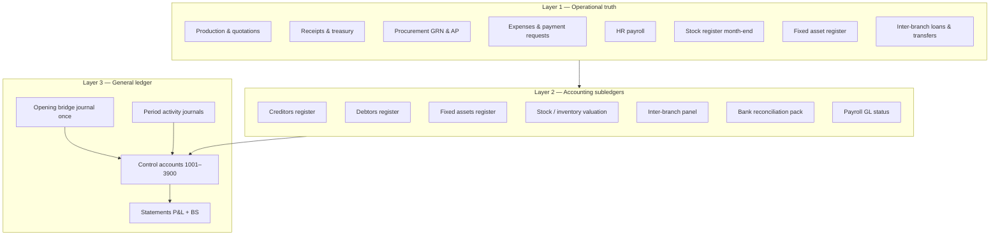

**Layer 1** = what staff already do in Operations, Cashier, Procurement, HR.  
**Layer 2** = Accounting Desk registers and month-end packs (read + limited legacy/manual lines).  
**Layer 3** = GL, statements, period lock — **posted**, auditable, period-scoped.

---

## 3. Source-of-truth matrix (~95% system-sourced)

Each GL control account has exactly one **primary feeder**. Manual entry is the exception.

| GL code | Name | Primary source (Layer 2) | Layer 1 inputs | Cutover method |
|---------|------|--------------------------|----------------|----------------|
| **1001+** | Cash per bank | Reconciliation pack + treasury accounts | Confirmed receipts, movements | Sum treasury balance per account at 31 May / 1 Jun after finance sign-off |
| **1200** | Trade receivable | **Creditors** → customer receivables + legacy inherited | Completed production, ledger | Legacy lines for pre-system AR; live rows from quotations post-cutover |
| **1300** | Raw materials inventory | **Stock register** closing (May) after procurement costing | Coil lots, GRN unit cost | `captureStockRegisterClosing` + costed register → inventory valuation rollup |
| **1398** | Accumulated depreciation | **Fixed assets** register | Asset cost & life | Opening acc dep optional; monthly runs from register |
| **1400** | Supplier prepayments | **Creditors** → supplier prepayments | Paid before GRN | Live + legacy inherited lines |
| **1500–1504** | PPE by category | **Fixed assets** register | Capex expenses, manual add | Sum `cost_ngn` by category/branch; land → 1501, no dep |
| **1800** | Due from branch | **Creditors** → inter-branch receivable | Inter-branch loans | `interBranchLoanBalances` + legacy |
| **2000** | Trade payables | **Debtors** → supplier payables | PO/AP sync on GRN | Legacy lines; enable `AP_RECEIVED_BASIS` post-cutover |
| **2100** | GRNI | AP2 GL alignment / inventory valuation | GRN not yet paid | Diagnostic tie-out; optional single opening line if immaterial |
| **2150** | Bank suspense | **Debtors** → unallocated / bank suspense | Unmatched deposits | Clear before lock; opening from register only |
| **2200–2400** | Payroll liabilities | **Payroll GL status** | Locked/unpaid runs | Accrual from last locked run if unpaid at cutover |
| **2500** | Customer deposits | **Debtors** → deposits + pre-production | Receipts pre-production | Ledger ADVANCE_IN + legacy lines |
| **2800** | Due to branch | **Debtors** → inter-branch payable | Inter-branch loans | Mirror of 1800 |
| **3100** | Owner's capital | **Manual (5%)** | Last audited accounts | HoA enters once |
| **3900** | Retained earnings | **Opening Pack plug** | — | Auto-computed balancing entry after all rollups |

### Intentionally not in Opening form

Do **not** type these on the Opening tab:

- 1200, 1400, 2000, 2500, 2150 (registers)
- 1300 (stock register)
- 1500–1504 (fixed assets)
- 1800, 2800 (inter-branch)
- Per-bank cash (treasury / reconciliation)

---

## 4. Opening Pack (new core service)

Replace the manual Opening journal UI as the **primary cutover path**.

### 4.1 API (proposed)

```
GET  /api/finance/opening-pack?asAt=2026-05-31&branchScope=ALL
POST /api/finance/opening-pack/post   (finance.post, idempotent)
GET  /api/finance/opening-pack/status
```

### 4.2 Response shape (conceptual)

```json
{
  "ok": true,
  "asAtISO": "2026-05-31",
  "entryDateISO": "2026-06-01",
  "readinessScore": 92,
  "sources": [
    {
      "id": "creditors_ar",
      "module": "creditors_register",
      "label": "Customer trade receivables",
      "glAccountCode": "1200",
      "side": "debit",
      "amountNgn": 12500000,
      "rowCount": 34,
      "drillDownPath": "/accounting?tab=creditors&section=customer_receivables",
      "status": "ok"
    }
  ],
  "proposedJournal": {
    "lines": [ "... balanced ..." ],
    "plugLine": { "accountCode": "3900", "side": "credit", "amountNgn": "..." }
  },
  "blockers": [],
  "warnings": ["May stock register BR-YL not procurement-costed"]
}
```

### 4.3 Builder modules (`server/accountingOpeningPackOps.js`)

| Builder function | Reads from |
|------------------|------------|
| `rollupCreditorsForOpening(db, asAt, scope)` | `buildCreditorsRegister` sections → 1200, 1400, 1800 |
| `rollupDebtorsForOpening(db, asAt, scope)` | `buildDebtorsRegister` → 2000, 2500, 2150, 2800 |
| `rollupFixedAssetsForOpening(db, asAt, scope)` | `listFixedAssets` → 1500–1504, 1398 |
| `rollupInventoryFromStockRegister(db, periodKey, scope)` | `stock_register_periods` + coil snapshots → 1300 |
| `rollupTreasuryCashForOpening(db, asAt, scope)` | Treasury balances + reconciliation confirmed → 1001+ |
| `rollupPayrollLiabilitiesForOpening(db, periodKey, scope)` | `payrollGlStatusForRun` on open runs → 2200–2400 |
| `rollupGrniDiagnostic(db, asAt, scope)` | `buildApInventoryGlAlignment` → 2100 (warn if mismatch) |
| `computeOpeningPlug(proposedLines)` | → 3900 (and validate 3100 if supplied) |

Post uses existing `postOpeningBalanceJournal` with `sourceId = OPENING_BALANCE_2026-06` and `sourceKind = OPENING_BALANCE`.

---

## 5. Accounting Desk UX (restructured)

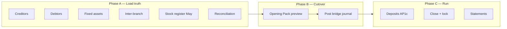

### Tab roles (after redesign)

| Tab | Role |
|-----|------|
| **Overview** | Cutover checklist: which sources are green/red; links to blockers |
| **Creditors / Debtors** | **Data entry for inherited balances** + live subledger |
| **Fixed assets** | **Data entry for all PPE** at cutover |
| **Inter-branch** | **Data entry for branch balances** |
| **Opening** | **Opening Pack only** — preview, drill-down, post (no free-form 1200/2000) |
| **Reconciliation** | Confirm cash before Opening Pack includes 1001+ |
| **Close** | Verify Opening Pack posted + registers tie to GL + lock June |
| **Deposits / Costing / GL / Statements** | Unchanged operational/policy views |

Stock register stays under **Operations / Reports** but Opening Pack **pulls** May close automatically.

---

## 6. Ongoing GL (post-cutover) — event map

Opening Pack is one-time. After `2026-06-01`, Layer 1 events post to GL:

| Event | GL hook | Policy |
|-------|---------|--------|
| Customer receipt | Receipt GL (AP1c) | 2500 pre-prod / 1200 post-prod |
| Production complete | Production recognition | Release deposits, revenue |
| Coil GRN | `postCoilGrnGl` | Dr 1300 / Cr 2100 |
| Supplier payment | `tryPostSupplierPaymentGlTx` | Dr 2000 or 1400 / Cr 100x |
| Expense paid | `tryPostExpensePaymentGlTx` | Dr expense / Cr 100x |
| Payroll locked | `tryPostPayrollAccrualGlTx` | Dr 6000 / Cr 2200–2400 |
| Payroll paid | Net payment + remittance GL | Clear 2200–2400 |
| Depreciation month | `postDepreciationRun` | Dr 6100 / Cr 1398 (land excluded) |
| Fixed asset add | Optional capex from expense | Dr 150x / Cr 100x |

Registers **refresh from live data**; no second posting to Opening.

---

## 7. Tie-out & control

### 7.1 Register ↔ GL reconciliation (daily / month-end)

```
GET /api/finance/control-tie-out?period=2026-06
```

| Check | Rule |
|-------|------|
| Creditors AR total | Σ customer receivables ≈ GL 1200 balance |
| Debtors AP total | Σ supplier payables ≈ GL 2000 |
| Debtors deposits | Σ deposits ≈ GL 2500 |
| Fixed assets cost | Σ asset cost ≈ GL 150x (by category map) |
| Inventory | Stock register value ≈ GL 1300 |
| Cash | Treasury ≈ Σ 100x |
| Inter-branch | 1800 / 2800 ≈ loan balances |

Variance → **trial exception** + Close checklist blocker.

### 7.2 Period lock

June lock blocked until:

1. Opening Pack posted  
2. Control tie-out warnings below threshold (HoA configurable)  
3. May stock register costed and captured for all branches  
4. AP1c dry-run clear (if enabling receipt GL)

---

## 8. What stays manual (~5%)

| Item | Who | Why |
|------|-----|-----|
| Owner's capital (3100) | HoA | Not in operational modules |
| Retained earnings plug (3900) | System | Balancing entry after rollups |
| Legacy inherited register lines | HoA | Pre-system party balances without live transactions |
| Immaterial GRNI adjustment | HoA | Only if AP2 diagnostic shows small gap |
| Policy flag enablement | DevOps / HoA | Env flags after sign-off |

---

## 9. Implementation roadmap

| Phase | Deliverable | Depends on |
|-------|-------------|------------|
| **D1** | This doc + source matrix in `shared/lib/accountingSourceOfTruth.js` | — |
| **D2** | `accountingOpeningPackOps.js` read-only builders | Registers, stock, assets |
| **D3** | `GET /api/finance/opening-pack` + Overview cutover cards | D2 |
| **D4** | Opening tab → Opening Pack UI (replace quick-add lines) | D3 |
| **D5** | `POST` bridge journal + idempotency | Existing `postOpeningBalanceJournal` |
| **D6** | Control tie-out API + Close checklist integration | D5 |
| **D7** | Stock register → 1300 builder wired to May `2026-05` | Procurement costing complete |

---

## 10. Success criteria

| Metric | Target |
|--------|--------|
| Opening journal lines typed manually | ≤ 2 (3100 + review of 3900 plug) |
| GL control accounts with register drill-down | 100% |
| Cutover balances sourced from modules | ≥ 95% by amount |
| Opening Pack readiness score before post | ≥ 90% |
| Register ↔ GL variance at first month-end | ≤ 1% or HoA documented |

---

## 11. Relation to existing docs

| Doc | Role |
|-----|------|
| `ACCOUNTING_POLICIES.md` | Basis matrix (cash vs accrual labels) |
| `ACCOUNTING_POLICY_V1.md` + `AP1C` | Customer revenue & deposit GL (post-cutover) |
| `ACCOUNTING_POLICY_AP2.md` | Supplier AP on received basis |
| `ACCOUNTING_POLICY_AP3_COSTING.md` | Cost per metre (management, not opening) |
| **`ACCOUNTING_SYSTEM_ARCHITECTURE.md`** | **Register-first structure (this doc)** |

---

*Approved architecture should be referenced in cutover runbooks and Accounting Desk training.*


---

## SOURCE DOCUMENT — docs\AI_AUTOMATION_ENGINE.md

*Path:* `c:/Users/USER/OneDrive/Desktop/Zarewa-backend-main/docs/AI_AUTOMATION_ENGINE.md`

*The following content is included verbatim from the live project documentation corpus.*

# AI Automation Engine (Phase 5)

Structured action proposals that attach to existing ERP workflows. **AI proposes; humans approve; the system never auto-executes financial, HR, or operational actions.**

## Feature flag

| Variable | Default | Behavior |
|----------|---------|----------|
| `ZARE_AI_AUTOMATION_MODE` | unset / `false` | Suggestions only (Phase 4 behavior) |
| `ZARE_AI_AUTOMATION_MODE=true` | enabled | Creates reviewable `ai_action_proposals` |

Requires `ZARE_AI_UNIFIED_MODE=true` for enriched suggestion hooks to feed the automation router.

## Design principle

> AI can propose. Humans decide. System executes only after approval — and even approval does **not** auto-post memos, expenses, or HR letters.

## Architecture

```
AI suggestion (unified layer)
        │
        ▼
aiAutomationRouterService  (confidence + risk gate)
        │
        ├─ MEMO_DRAFT → office_memo_drafts + proposal
        ├─ EXPENSE_CLASSIFICATION → proposal + prefill
        ├─ HR_LETTER_DRAFT → hr_employment_letters (draft) + proposal
        ├─ WORKFLOW_SUGGESTION → proposal (work_item linked)
        └─ FILING_SUGGESTION → proposal
        │
        ▼
ai_action_proposals (pending)
        │
        ├─ POST …/approve → status approved (audit only)
        └─ POST …/reject  → status rejected
```

## Proposal format

```json
{
  "proposalId": "AIP-…",
  "type": "memo | expense | hr_letter | workflow | filing",
  "title": "…",
  "description": "…",
  "suggestedAction": "review_memo_draft",
  "confidence": 0.72,
  "riskLevel": "low | medium | high",
  "requiredApprovalLevel": "self | branch_manager | finance | hr | md",
  "linkedEntity": { "type": "office_memo_draft", "id": "MDR-…" },
  "status": "pending",
  "createdAt": "…"
}
```

## API endpoints

| Method | Path | Permission |
|--------|------|------------|
| GET | `/api/ai-proposals/status` | `ai.proposals.view` |
| POST | `/api/ai-proposals/create` | `ai.proposals.manage` |
| GET | `/api/ai-proposals` | `ai.proposals.view` |
| GET | `/api/ai-proposals/:id` | `ai.proposals.view` |
| POST | `/api/ai-proposals/:id/approve` | `ai.proposals.manage` |
| POST | `/api/ai-proposals/:id/reject` | `ai.proposals.manage` |

Create body (routed automation):

```json
{
  "automationType": "MEMO_DRAFT",
  "confidence": 0.7,
  "payload": { "subject": "…", "body": "…" }
}
```

## Safety controls (`aiSafetyGuardService`)

Blocked automatic actions:

- `payment`, `ledger_post`, `hr_issue`, `memo_submit`, `expense_post`, `auto_pay`, `auto_approve`, `work_item_decision`

Risk levels drive `requiredApprovalLevel`:

| Risk | Typical approval |
|------|------------------|
| low | self |
| medium | finance / branch manager |
| high | HR |

## Integration hooks

| Module | Hook | When automation on |
|--------|------|-------------------|
| Memo assist | `processMemoAutomationHook` | After `/api/help/memo-assist` |
| Expense suggest | `processExpenseAutomationHook` | After `/api/expense-categories/suggest` |
| HR letters | `processHrLetterAutomationHook` | After `/api/hr/employment-letters/ai-suggest` |

Response may include `automationProposal`, `memoDraft`, `expensePrefill`, or `letterDraft` — all with `aiSuggestionOnly: true`.

## Database

Table: `ai_action_proposals` (see `migrateAiAutomationEngine` in `server/migrate.js`)

## Logging

```
[ai-automation] proposal_created {…}
[ai-automation] proposal_approved {…}
[ai-automation] proposal_rejected {…}
```

Audit actions: `ai.proposal.create`, `ai.proposal.approve`, `ai.proposal.reject`

## Files

```
server/aiAutomationEngine/
  config/automationConfig.js
  repository/proposalRepository.js
  services/
    aiActionProposalService.js
    aiAutomationRouterService.js
    aiSafetyGuardService.js
    memoAutomationService.js
    expenseAutomationService.js
    hrLetterAutomationService.js
    workflowAutomationService.js
  bridges/automationHooks.js
  controllers/aiProposalController.js
  routes/aiProposalRoutes.js
```

## Related docs

- [`AI_UNIFICATION_LAYER.md`](AI_UNIFICATION_LAYER.md) — Phase 4
- [`ERP_AI_SYSTEM_MAP.md`](ERP_AI_SYSTEM_MAP.md) — system audit


---

## SOURCE DOCUMENT — docs\AI_INTELLIGENCE_ROUTER.md

*Path:* `c:/Users/USER/OneDrive/Desktop/Zarewa-backend-main/docs/AI_INTELLIGENCE_ROUTER.md`

*The following content is included verbatim from the live project documentation corpus.*

# AI Intelligence Router (Phase 3 — Zare Intelligence)

Decision layer that classifies user queries, routes them to the right Knowledge Center search strategy, scores confidence, and optionally synthesizes answers.

Does **not** replace the AI Knowledge Center, hybrid search, or live Zare help chat.

## Architecture

```
POST /api/ai-router/query
        ↓
  intentClassifierService   (rules-based, no ML)
        ↓
  routingEngineService      (intent → search plan)
        ↓
  knowledgeSearchService    (reuse hybrid/keyword/semantic)
        ↓
  confidenceService         (intent + search → mode)
        ↓
  llmSynthesizerService     (optional LLM polish)
        ↓
  routerAnalyticsRepository (query log)
```

## Module layout

```
server/aiIntelligenceRouter/
  services/
    aiRouterService.js           — orchestration
    intentClassifierService.js   — detectIntent, calculateIntentConfidence
    routingEngineService.js      — buildRoutePlan, buildSearchPayload
    confidenceService.js         — combined scoring + response mode
    llmSynthesizerService.js     — synthesizeAnswer (placeholder + optional LLM)
  controllers/aiRouterController.js
  routes/aiRouterRoutes.js
  repository/routerAnalyticsRepository.js
shared/lib/aiIntelligenceRouter/intents.js
```

## Intents

| Intent | Route |
|--------|--------|
| `SOP_REQUEST` | Hybrid search → `sop_article` (+ operational FAQ widen) |
| `SQL_REQUEST` | Keyword search → `sql_example` |
| `TROUBLESHOOTING` | High-recall hybrid → `troubleshooting_example` |
| `GLOSSARY_LOOKUP` | Hybrid → `glossary_term` |
| `CONVERSATION_CHAT` | LLM / rule-based conversational reply |
| `UNKNOWN` | Hybrid fallback (all types) |

## Confidence & response modes

| Combined confidence | Mode | Behavior |
|---------------------|------|----------|
| ≥ 0.75 | `auto` | Top 3 results + synthesized answer |
| 0.45 – 0.75 | `suggest` | Top 2–3 suggestions + draft answer |
| < 0.45 | `fallback` | Wider results or clarification message |

Combined score: **40% intent + 60% search relevance**.

## API

### `POST /api/ai-router/query`

**Permission:** `ai.query.access`, `ai.knowledge.view`, `settings.manage`, or `audit.view`

```json
{
  "query": "How do I record a receipt?",
  "userContext": {
    "role": "cashier",
    "module": "sales",
    "history": []
  }
}
```

**Response:**

```json
{
  "ok": true,
  "intent": "SOP_REQUEST",
  "confidence": 0.81,
  "intentConfidence": 0.72,
  "searchConfidence": 0.86,
  "routeUsed": "knowledge_sop_search",
  "mode": "auto",
  "results": [ ... ],
  "answer": "...",
  "explanation": "Intent: SOP_REQUEST (72%) · ...",
  "fallbackUsed": false,
  "timingMs": 120
}
```

### `GET /api/ai-router/analytics?days=30`

Returns total queries, intent distribution, fallback rate, average confidence, most-used modules.

## Logging

All router logs use prefix `[ai-router]`:

- Intent + route selected
- Confidence + mode
- Execution time
- Fallback usage

## Permissions

| Key | Purpose |
|-----|---------|
| `ai.query.access` | Use AI Intelligence Router |

Administrator role includes this key (also covered by `*`).

## Database

`ai_router_query_log` — analytics for router queries (created by `migrateAiIntelligenceRouter`).

## Backward compatibility

- Knowledge Center CRUD/search APIs unchanged
- Zare help chat (`/api/help/chat`) unchanged
- Router is an **additional** layer for future Zare UI integration

## Future

- Wire Zare `helpAgent.js` to call `routeQuery` for unified intelligence
- ML-based intent classifier behind same interface
- Vector DB (pgvector / Pinecone) without API changes


---

## SOURCE DOCUMENT — docs\AI_KNOWLEDGE_CENTER.md

*Path:* `c:/Users/USER/OneDrive/Desktop/Zarewa-backend-main/docs/AI_KNOWLEDGE_CENTER.md`

*The following content is included verbatim from the live project documentation corpus.*

# AI Knowledge Center

Enterprise knowledge store for the Zare ERP Assistant. This module is the **single source of truth** for AI knowledge going forward. It does **not** replace the existing Zare help system (`helpKnowledge.js`, RAG, operational catalog) — those continue to power live chat unchanged.

## Purpose

| Today | Future |
|-------|--------|
| Admin CRUD for structured AI knowledge | Feed RAG index and Zare retrieval |
| Version history and audit trail | Export fine-tuning / Hugging Face datasets |
| Keyword search | Semantic search via `aic_knowledge_embeddings` |
| Placeholder embedding rows | OpenAI, Gemini, Ollama, HF embedding providers |

## Architecture (clean layers)

```
shared/lib/aiKnowledgeCenter/knowledgeTypes.js   ← type registry (extensible)
server/aiKnowledgeCenter/
  models/knowledgeRecordModel.js                 ← row mapping, ID generation
  repository/knowledgeRepository.js              ← SQLite access only
  validators/knowledgeValidator.js               ← input validation
  services/knowledgeService.js                   ← create / update / archive / list
  services/knowledgeSearchService.js             ← keyword + semantic placeholder
  services/knowledgeStatsService.js              ← dashboard statistics
  controllers/knowledgeController.js             ← thin HTTP handlers
  routes/knowledgeRoutes.js                      ← Express routes + permissions
  index.js                                       ← module entry
```

**Controllers contain no business logic.** All rules live in services; all SQL in the repository.

## Knowledge types

| Type ID | Label |
|---------|--------|
| `sop_article` | SOP Article |
| `operational_faq` | Operational FAQ |
| `intent_example` | Intent Example |
| `conversation_example` | Conversation Example |
| `troubleshooting_example` | Troubleshooting Example |
| `sql_example` | SQL Example |
| `glossary_term` | Glossary Term |
| `prompt_template` | Prompt Template |
| `evaluation_question` | Evaluation Question |
| `ai_model_config` | AI Model Configuration |

**Adding a type:** append to `KNOWLEDGE_TYPE_REGISTRY` in `shared/lib/aiKnowledgeCenter/knowledgeTypes.js` and mirror in `frontend/src/lib/aiKnowledgeCenter/knowledgeTypes.js`. No API contract change.

## Record metadata

Every record includes:

- `id` — `AKC-…` unique identifier
- `knowledgeType`, `title`, `category`, `module`
- `tags[]`, `keywords[]`
- `content` — JSON payload (type-specific fields)
- `bodyText` — denormalized searchable text
- `createdBy`, `createdByName`, `createdAt`, `updatedAt`
- `version` — incremented on each update
- `status` — `active` | `pending_review` | `archived`
- `metadata` — optional JSON extension bag

## Database schema

### `aic_knowledge_records`

Primary knowledge table.

### `aic_knowledge_versions`

Immutable snapshots per version (audit + rollback reference).

### `aic_knowledge_embeddings` (future-ready)

Placeholder rows with `status = pending`. When embeddings are implemented:

1. Compute vector via provider
2. Store in `embedding_json`
3. Set `status = ready`
4. Wire `runSemanticSearch()` in `knowledgeSearchService.js`

**No embeddings are computed in this release.**

## API

Base path: `/api/ai-knowledge-center`

| Method | Path | Permission | Description |
|--------|------|------------|-------------|
| GET | `/stats` | view | Dashboard statistics |
| GET | `/types` | view | Knowledge type registry |
| GET | `/records` | view | List with filters |
| GET | `/records/:id` | view | Single record |
| GET | `/records/:id/versions` | view | Version history |
| POST | `/records` | manage | Create |
| PATCH | `/records/:id` | manage | Update (new version) |
| POST | `/records/:id/archive` | manage | Archive |
| POST | `/search` | view | Keyword / semantic / hybrid search |

**View permissions:** `ai.knowledge.view`, `settings.manage`, or `audit.view`  
**Manage permissions:** `ai.knowledge.manage` or `settings.manage`

### Search modes

```json
POST /api/ai-knowledge-center/search
{
  "query": "how to record receipt",
  "mode": "keyword",
  "knowledgeType": "sop_article",
  "module": "sales",
  "limit": 25
}
```

- `keyword` — title, body, keywords, tags
- `semantic` — cosine similarity over `aic_knowledge_embeddings` (requires indexed vectors)
- `hybrid` — weighted fusion: **40% keyword + 60% semantic**, top 10 results

`POST /api/ai-knowledge-center/reindex` — backfill pending/failed embeddings (manage permission).

### Phase 2 — Embeddings (active)

| Service | Role |
|---------|------|
| `embeddingService.js` | Pluggable adapters: OpenAI-compatible API or local TF fallback |
| `embeddingIndexerService.js` | Index on create/update (async), `reindexAllKnowledge()` |
| `hybridSearchService.js` | Weighted merge for hybrid mode |
| `embeddingRepository.js` | Vector persistence + `content_hash` skip unchanged |

Configure provider via existing env vars (`ZAREWA_AI_API_KEY`, `ZAREWA_AI_BASE_URL`, `ZAREWA_AI_EMBEDDING_MODEL`). Without an API key, local 256-dim fallback embeddings still enable semantic + hybrid search offline.

## Admin UI

**Settings → AI Knowledge Center** (`/settings/knowledge-center`)

- Statistics cards (total, by type, pending, archived)
- Filterable knowledge list
- Keyword / hybrid search
- Reindex embeddings button
- Create / edit modal with JSON content editor
- Version history modal
- Archive action

Same access gate as Zare intelligence (`settings.manage`, `audit.view`, or `*`).

## Permissions

| Key | Role |
|-----|------|
| `ai.knowledge.view` | Read knowledge center |
| `ai.knowledge.manage` | Create, update, archive |

Administrator role includes both keys explicitly (also covered by `*`).

## Audit

Mutations write to `audit_log`:

- `ai_knowledge.create`
- `ai_knowledge.update`
- `ai_knowledge.archive`

## Migration notes

### New installs

Tables are created via `server/schemaSql.js` (greenfield) and `migrateAiKnowledgeCenter()` in `server/migrate.js` (existing DBs).

### Upgrading an existing deployment

1. Deploy backend — boot migration runs automatically on next API start
2. Deploy frontend — new Settings tab appears for authorized users
3. **No data migration from `helpKnowledge.js` is performed automatically** — existing Zare articles remain in JS files until a future import job is run
4. Verify: `GET /api/ai-knowledge-center/stats` returns `{ ok: true, stats: { totalKnowledge: 0, ... } }`

### Optional manual verification

```bash
cd Zarewa-backend-main
npm test -- server/aiKnowledgeCenter/knowledgeCenter.test.js
```

### Future integration checklist

- [ ] Import script: `helpKnowledge.js` → `aic_knowledge_records`
- [x] Embedding indexer job → `aic_knowledge_embeddings` (Phase 2)
- [x] Semantic + hybrid search in `knowledgeSearchService.js`
- [ ] Zare `helpRagStore.js` reads from Knowledge Center instead of JS files
- [ ] Export endpoint for HF datasets / fine-tuning JSONL
- [ ] Sync approved `help_suggested_articles` drafts into Knowledge Center

## Extension points

| Hook | Location |
|------|----------|
| New knowledge type | `KNOWLEDGE_TYPE_REGISTRY` |
| Semantic search | `runSemanticSearch()` in `knowledgeSearchService.js` |
| Embedding provider | `embeddingService.js` adapters |
| Hybrid ranking | `hybridSearchService.js` |
| RAG chunking | Future `knowledgeRagIndexerService.js` |
| Provider configs | `ai_model_config` records + env overlay |
| Import from legacy help | Future `knowledgeImportService.js` |

## Related docs

- `docs/HELP_ASSISTANT.md` — live Zare help system (unchanged)
- `docs/ENVIRONMENT.md` — AI provider env vars (for future LLM integration)


---

## SOURCE DOCUMENT — docs\AI_PROVIDER_LAYER.md

*Path:* `c:/Users/USER/OneDrive/Desktop/Zarewa-backend-main/docs/AI_PROVIDER_LAYER.md`

*The following content is included verbatim from the live project documentation corpus.*

# AI Provider Layer

Multi-provider plug-in for Zare Intelligence: **OpenAI** (primary), **Hugging Face** (cost-efficient secondary), **Ollama** (local fallback).

> Providers are interchangeable. Orchestration is fixed.

## Feature flag

| Variable | Default | Behavior |
|----------|---------|----------|
| `ZARE_AI_HUGGINGFACE_ENABLED` | unset / `false` | Hugging Face ignored completely |
| `ZARE_AI_HUGGINGFACE_ENABLED=true` | enabled | HF participates in routing per task registry |

## Required environment

| Variable | Purpose |
|----------|---------|
| `HUGGINGFACE_API_KEY` or `HF_TOKEN` or `ZARE_AI_HF_API_KEY` | HF Inference API token |
| `ZAREWA_AI_API_KEY` | OpenAI (or compatible) — unchanged |
| `ZARE_AI_HF_BASE_URL` | Optional; default `https://api-inference.huggingface.co` |
| `ZARE_AI_HF_SELF_HOSTED=true` | Use OpenAI-compatible paths on custom base URL |
| `ZARE_AI_OPENAI_DAILY_TOKEN_LIMIT` | Default `500000`; auto-switch to HF when exceeded |

## Unified response format

```json
{
  "provider": "openai | huggingface | ollama | rule_based",
  "content": "...",
  "confidence": 0.85,
  "usage": { "tokens": 420, "cost": 0.0008 },
  "fallbackUsed": false,
  "metadata": { "taskType": "help_synthesis", "fallbackChain": ["openai"] }
}
```

## Task routing (`modelRegistry.js`)

| Task | Primary | Fallback |
|------|---------|----------|
| `memo_polish`, `hr_letter`, `expense` | Hugging Face | OpenAI |
| `finance_critical`, `approval_logic` | OpenAI | — |
| `router_reasoning`, `help_synthesis` | OpenAI | Hugging Face |
| `embedding`, `search` | HF (`BAAI/bge-small-en-v1.5`) | OpenAI embeddings |

## Models

| Use | Model ID |
|-----|----------|
| General LLM | `mistralai/Mistral-7B-Instruct-v0.3` |
| HR / conversation | `Qwen/Qwen2.5-7B-Instruct` |
| Embeddings | `BAAI/bge-small-en-v1.5`, `intfloat/e5-base-v2` |

## Integration points (additive)

| Module | Change |
|--------|--------|
| `aiOrchestratorService.js` | KC answers enhanced via `routeAIRequest` when providers available |
| `llmSynthesizerService.js` | Provider layer before direct `postChatCompletions` |
| `embeddingService.js` | HF embeddings when flag enabled (falls back to existing adapter) |
| `aiAssist.js` | Memo polish tries HF provider first (dynamic import; OpenAI fallback) |
| `aiRouterService.js` | Passes `lowConfidence` to prefer HF on suggest/fallback modes |

## API

`GET /api/ai/providers/status` — health + daily usage summary (authenticated).

## Logging

```
[ai-provider] route_start {"taskType":"help_synthesis","chain":["openai","huggingface"]}
[ai-provider] route_complete {"provider":"huggingface","fallbackUsed":true,...}
```

## Files

```
server/aiProviders/
  aiProviderRouter.js
  huggingfaceProvider.js
  openaiProvider.js
  ollamaProvider.js
  modelRegistry.js
  embeddingProvider.js
  costController.js
  config/providerConfig.js
  routes/providerRoutes.js
```

## Backward compatibility

- `aiAssist.js` OpenAI path unchanged when HF disabled or fails
- No changes to help agent, automation engine, or KC APIs
- HF is opt-in via `ZARE_AI_HUGGINGFACE_ENABLED`


---

## SOURCE DOCUMENT — docs\AI_UNIFICATION_LAYER.md

*Path:* `c:/Users/USER/OneDrive/Desktop/Zarewa-backend-main/docs/AI_UNIFICATION_LAYER.md`

*The following content is included verbatim from the live project documentation corpus.*

# AI Unification Layer (Phase 4)

The unified AI orchestration layer connects Zare Help, AI Intelligence Router, AI Knowledge Center, and module-specific assist hooks behind a single priority flow — without replacing existing systems.

## Feature flag

| Variable | Default | Behavior |
|----------|---------|----------|
| `ZARE_AI_UNIFIED_MODE` | unset / `false` | **Off** — system behaves exactly as before Phase 4 |
| `ZARE_AI_UNIFIED_MODE=true` | enabled | Router → KC → Help → local rules priority chain |

Set in your host environment (same pattern as other `ZAREWA_AI_*` vars). See [`ENVIRONMENT.md`](ENVIRONMENT.md).

## Architecture

```
HelpChatDock → POST /api/help/chat
                    └─ runUnifiedHelpChat (wrapper)
                           ├─ [if unified off] runHelpChat (unchanged)
                           ├─ [if ERP/special route] runHelpChat (unchanged)
                           ├─ try AI Router (confidence ≥ 0.45)
                           ├─ try KC hybrid search
                           └─ fallback runHelpChat

Memo assist → POST /api/help/memo-assist → enrichMemoAssist (additive)
Expense suggest → POST /api/expense-categories/suggest → enrichExpenseSuggest (additive)
HR letters → POST /api/hr/employment-letters/ai-suggest (new, additive)

Gateway → POST /api/ai/query → unifiedQuery()
```

## Priority flow (`unifiedQuery`)

1. **AI Router** — `routeQuery()` when confidence ≥ `CONFIDENCE_MEDIUM` (0.45)
2. **Knowledge Center** — hybrid search on `aic_knowledge_records`
3. **Help knowledge** — `helpKnowledge.js` article match + rule synthesis
4. **Local fallback** — safe generic message

## Unified response format

All unified endpoints return:

```json
{
  "ok": true,
  "source": "router | knowledge_center | help | fallback",
  "intent": "SOP_REQUEST",
  "confidence": 0.72,
  "mode": "auto | suggest | fallback",
  "answer": "…",
  "suggestions": ["…"],
  "metadata": {
    "routeUsed": "sop_hybrid",
    "latency": 120,
    "fallbackUsed": false,
    "fallbackChain": ["router"],
    "moduleOrigin": "help"
  }
}
```

## API endpoints

| Endpoint | Purpose |
|----------|---------|
| `POST /api/ai/query` | Unified gateway for future UI |
| `GET /api/ai/unified/status` | Check if unified mode is enabled |
| `POST /api/hr/employment-letters/ai-suggest` | HR letter tone/template suggestions |

Existing endpoints are **not removed**:

- `POST /api/help/chat`
- `POST /api/ai-router/query`
- `POST /api/ai-knowledge-center/search`
- `POST /api/help/memo-assist`

## Module hooks (suggestion-only)

| Module | Hook | Rule |
|--------|------|------|
| Memos | `enrichMemoAssist` | Suggests type, structure, filing — never auto-submits |
| Expenses | `enrichExpenseSuggest` | Category lane, duplicate hint, policy notes — never auto-posts |
| HR letters | `enrichHrLetterAssist` | Tone, template, grammar — never auto-issues |

**Design principle:** AI suggests, system decides, human approves.

## Logging

All unified operations log with prefix `[ai-unified]`:

```
[ai-unified] query_complete {"source":"router","moduleOrigin":"help","confidence":0.78,...}
```

## Files

```
server/aiUnificationLayer/
  config/unifiedAiConfig.js
  utils/unifiedAiLogger.js
  services/aiOrchestratorService.js
  services/memoUnifiedAssist.js
  services/expenseUnifiedAssist.js
  services/hrLetterUnifiedAssist.js
  routes/unifiedAiRoutes.js
  index.js

shared/lib/aiUnification/unifiedResponseTypes.js
```

## Backward compatibility

- `ZARE_AI_UNIFIED_MODE` off → zero behavior change
- `helpAgent.js` is never modified; wrapper calls it on fallback
- AI Router and Knowledge Center APIs unchanged
- Memo/expense/HR workflows unchanged; enrichments are additive JSON fields (`unifiedAi`, `unifiedSuggestions`, `aiSuggestionOnly`)

## Related docs

- [`ERP_AI_SYSTEM_MAP.md`](ERP_AI_SYSTEM_MAP.md) — pre-Phase-4 audit
- [`AI_INTELLIGENCE_ROUTER.md`](AI_INTELLIGENCE_ROUTER.md) — Phase 3 router
- [`AI_KNOWLEDGE_CENTER.md`](AI_KNOWLEDGE_CENTER.md) — Phase 1–2 knowledge center


---

## SOURCE DOCUMENT — docs\API_GAP_WORKSPACE_OFFICE.md

*Path:* `c:/Users/USER/OneDrive/Desktop/Zarewa-backend-main/docs/API_GAP_WORKSPACE_OFFICE.md`

*The following content is included verbatim from the live project documentation corpus.*

# API gap — Online Office Workspace

## Implemented / extended in overhaul

| Area | Endpoint / module |
|------|-------------------|
| BM edit versions | `PATCH /api/office/threads/:id` + `office_record_versions` |
| Filing numbers | `POST /api/office/threads/:id/file` + `filingNumberOps.js` |
| Official notices | `/api/official-notices/*` |
| Office forum | `/api/forum/*` |
| Approval routing | `shared/lib/officeApprovalRouting.js` |
| Staff create | `office.record.create` on `POST /api/office/threads` |

## Reused (no new tables)

- `office_threads`, `office_messages`, `work_items`
- `convert-payment-request`, `convert-material-request`
- `GET /api/work-items/:id/timeline`, `/related`
- Bootstrap + branch scope unchanged


---

## SOURCE DOCUMENT — docs\AUDIT_OPS_ALIGNMENT_REVIEW.md

*Path:* `c:/Users/USER/OneDrive/Desktop/Zarewa-backend-main/docs/AUDIT_OPS_ALIGNMENT_REVIEW.md`

*The following content is included verbatim from the live project documentation corpus.*

# Zarewa ERP — Audit & Operations Docs vs Code Alignment Review

**Date:** 2026-07-09
**Docs reviewed:** frontend `docs/SOP/ANNEX-D-COMPLIANCE-AND-AUDIT.md`, `SOP-04-OPERATIONS-STORE.md`; backend `docs/ZAREWA_ERP_OPERATIONAL_REPORT.md`, `docs/OPERATIONS_MANUAL.md`
**Code reviewed:** backend `server/` + `shared/`, frontend `src/`

---

## 1. Relationship between the docs and the software

The SOP set (Annex D, SOP-04) is the *policy layer*: it tells staff and auditors how controls should work. The backend `ZAREWA_ERP_OPERATIONAL_REPORT.md` is a *system description generated from the codebase*, and the code itself is the *enforcement layer*. The three layers are unusually well connected — the SOPs cite real table names (`audit_log`, `coil_control_events`, `work_item_print_snapshots`), real files (`hrBankCrypto.js`), real env flags (`DELIVERY_PAYMENT_GATE`), and real endpoints (`/api/audit/export.ndjson`), and almost all of them exist in code. This is documentation written against the system, not aspiration.

---

## 2. What ALIGNS (verified in code)

| Documented control (Annex D / SOP-04) | Code evidence |
|---|---|
| Audit trail with export for external auditors | `audit_log` + `appendAuditLog` (controlOps.js); **303 distinct audit actions**; `GET /api/audit/export.ndjson` (httpApi.js:9232) |
| Refund segregation: requester ≠ approver, cashier cannot approve | `assertCashierMayNotApproveRefund` (refundHandlers.js) enforced in controlOps.js |
| MD refund gate > ₦1M | `REFUND_MD_APPROVAL_THRESHOLD_NGN = 1_000_000` (shared/workspaceGovernance.js), configurable via `/api/org/governance-limits` |
| Coil control events immutable | Insert-only `coil_control_events`; only UPDATE is linking an incident ID; no deletes. Event kinds match SOP: `head_trim`, `supplier_defect`, `scrap`, `coil.split`, `return_outward`, `return_inward_pool`, `finish_roll` |
| 85 kg tail finish rule | `COIL_TAIL_FINISH_MAX_KG = 85` in code |
| Material incidents: void only, never delete | `status='voided'` + reason, no DELETE statement (materialIncidentOps.js) |
| Period locks | `accounting_period_locks`, `period.lock`/`period.unlock` audit actions, `period.manage` permission (finance_manager) |
| Delivery payment gate off/warn/enforce | `deliveryReleaseGate.js` implements exactly those three modes |
| Governance pack export | `GET /api/reports/governance-pack` CSV |
| Short-receipt MD notification | `notifyMdCoilShortReceipt` (procurementWorkItems.js) wired in writeOps.js GRN path |
| Bank details encrypted at rest | `server/hrBankCrypto.js` exists |
| AP1c revenue recognition to 4000 at production completion | `ap1cProductionRecognition.js` joins GL account `4000` |
| Stock register sign-off with lock + print snapshot | `stockRegisterOps.js` full workflow ending in `locked` |
| Report catalog | receipts-register, revenue-production, refunds-pack, coil-snapshot-capture, md-operations-pack etc. all present in httpApi.js |

**Conclusion:** the three-layer control model (preventive / detective / corrective) described in Annex D genuinely exists in the software.

---

## 3. What does NOT align (findings)

### F1 — Audit export is not "admin only" (HIGH)
Annex D §D.5.4: export is "admin only". Code gates it on `requirePermission('audit.view')` — and `audit.view` is held by **md, finance_manager and cashier** role bundles (auth.js). A cashier can download the entire audit log. Fix either the doc or (better) the gate — restrict export to admin, or strip `audit.view` from cashier.

### F2 — Cashier role bundle breaks the documented SoD matrix (HIGH)
Annex D §D.2 says expense payments are approved by BM/MD and only *executed* by cashier. But the cashier role in auth.js carries `finance.approve`, `finance.reverse`, `treasury.manage`, `audit.view` — commented as "legacy finance perms retained for compatibility until B3". Refunds have a dedicated guard; expenses/payment requests do not appear to. Until Phase B3 lands, the real permission surface is wider than the SOP claims. Auditors testing against Annex D would flag this.

### F3 — Annex D daily review procedure references audit events that don't exist (MEDIUM)
§D.5.1 tells IT Admin to query `audit_log` for four events:
- `login.failed` — **not written to audit_log**. Failed logins only increment `failed_login_count`/lockout on `app_users`. The daily brute-force review as written cannot be run.
- `permission.override` — action doesn't exist; the real action is `user.update_permissions` (plus `/api/admin/permission-overrides-audit` report).
- `admin.data_reset` — exists ✓
- `refund.dual_control.admin_trial` — exists ✓

Fix: either emit `login.failed` audit rows, or rewrite D.5.1 to reference the lockout columns and the real action names.

### F4 — Key preventive controls are OFF by default (MEDIUM)
`.env.example`: `ENFORCE_DUAL_CONTROL_PAYMENTS=0`, `DELIVERY_PAYMENT_GATE=0`. Annex D presents dual control and the delivery gate as live controls; in a default deployment both are inert. Verify the production `.env` actually sets them, and state the required production values in Annex C/D.

### F5 — Stock register workflow: docs show 4 stages, code has more (LOW)
SOP-04 §8 documents store_confirmed → bm_approved → md_approved → locked. `stockRegisterOps.js` inserts **`procurement_costed`** between BM and MD (plus draft/printed states). The doc understates the real workflow; update the SOP table.

### F6 — Terminology drift (LOW)
- SOP-04 calls coil events "CREV"; the human-ID prefix in code is **`CCR`** (humanId.js:219).
- Delivery gate has an extra undocumented flag `DELIVERY_PAYMENT_GATE_STRICT_FINANCE`.

---

## 4. What we learn about the ERP's audit/operations/reporting design

1. **Reverse, don't overwrite.** Ledger reversals, receipt reversals, material-incident voids, coil events — nothing financial is deleted. This is the system's strongest audit property.
2. **Controls are layered:** permission gates (auth.js role bundles) → route guards (requirePermission, finance desk guards) → domain guards (cashier-refund assert, delivery gate, period locks) → detective reporting (governance pack, exception queues, 303 audit actions).
3. **Reporting is the reconciliation spine:** month-end depends on the stock register lock + coil snapshot + report packs; the SOPs correctly route staff to them.
4. **The residual risk is configuration, not code:** the biggest doc/code gaps (F1, F2, F4) are all about permissions and env flags, not missing features. A quarterly "SOP vs auth.js vs .env" reconciliation would close this class of drift.

---

## 5. Recommended actions (priority order)

1. Restrict `/api/audit/export.ndjson` to admin (or a dedicated `audit.export` perm); remove `audit.view` from cashier.
2. Complete the Phase B3 cashier permission cleanup, or add expense/payment-request guards equivalent to the refund guard.
3. Emit `login.failed` (and align `permission.override` naming) so Annex D §D.5.1 is executable as written.
4. Confirm production env sets `DELIVERY_PAYMENT_GATE=enforce` (or warn) and `ENFORCE_DUAL_CONTROL_PAYMENTS=1`; document required values.
5. Update SOP-04 §8 with the `procurement_costed` stage and CCR prefix.


---

## SOURCE DOCUMENT — docs\CORE_LIFECYCLE_100_SCENARIOS.md

*Path:* `c:/Users/USER/OneDrive/Desktop/Zarewa-backend-main/docs/CORE_LIFECYCLE_100_SCENARIOS.md`

*The following content is included verbatim from the live project documentation corpus.*

# Core Lifecycle 100 — Master Test Matrix

**100 interconnected scenarios** linking **Quotation → Payment → Cutting List → Production → Stock → Refund** as one chain (`LC100-001` … `LC100-100`).

Source of truth: `shared/lib/coreLifecycle100Matrix.js`

## Lifecycle chain

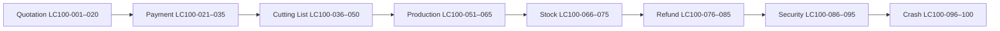

Each scenario has `prevId` / `nextId` forming a **single linked chain** from customer create to master integrity check.

## Scenario breakdown

| Range | Module focus | Type | Count |
|-------|-------------|------|-------|
| LC100-001–010 | Smoke golden paths | smoke / e2e | 10 |
| LC100-011–020 | Quotation lifecycle | integration | 10 |
| LC100-021–035 | Payment & ledger | financial / fraud | 15 |
| LC100-036–050 | Cutting list | integration / crash | 15 |
| LC100-051–065 | Production | integration / inventory | 15 |
| LC100-066–075 | Stock / inventory | inventory / e2e | 10 |
| LC100-076–085 | Refunds | financial / fraud | 10 |
| LC100-086–095 | Fraud & security | fraud | 10 |
| LC100-096–100 | Crash & master chain | crash / e2e | 5 |

## Risk coverage

| Risk tag | What it finds | Example scenarios |
|----------|---------------|-------------------|
| `fraud` | Duplicate refunds, self-approval, over-refund | LC100-078, LC100-081, LC100-095 |
| `hack` | Auth bypass, CSRF, RBAC holes | LC100-086, LC100-087, LC100-094 |
| `financial_failure` | Ledger drift, underpay, period lock | LC100-021, LC100-028, LC100-076 |
| `inventory_gap` | Coil reservation, GRN mismatch, WIP | LC100-057, LC100-069, LC100-070 |
| `dual_control` | Same person request+approve+pay | LC100-082, LC100-081 |
| `branch_scope` | Cross-branch data leak | LC100-074, LC100-090 |

## How to run

### Fast (API only, ~2 min, SQLite in-memory)

```powershell
cd Zarewa-backend-main
npm run test:lifecycle100
```

Runs `server/coreLifecycle100.test.js` — chain validation + 8 inline fraud/gate guards.

### Full API suite (~15–30 min)

```powershell
npm run test:lifecycle100:full
```

Adds: transactional scenarios (20), refund security, inventory scenarios, 114-scenario stress matrix.

### With E2E UI smoke (needs MySQL + frontend)

```powershell
$env:ZAREWA_FRONTEND_ROOT="C:\Users\USER\OneDrive\Desktop\Zarewa-frontend-main"
npm run test:e2e -- e2e/core-lifecycle100-smoke.spec.js
```

Or combined:

```powershell
npm run test:lifecycle100:all
```

### Finance stress (live server, 100 scenarios)

```powershell
npm run server
npm run stress:finance100
```

## Test file mapping

| Suite | File | Scenarios covered |
|-------|------|-------------------|
| Master inline guards | `server/coreLifecycle100.test.js` | LC100-028, 036, 042, 054, 086, 088, 090, 100 |
| Transactional | `server/transactionalScenarios.test.js` | TX-01–20 |
| Scenario matrix | `server/scenarioMatrix.test.js` | SCN-001–114 + VAL + HARSH |
| Refund security | `server/refundSecurity.test.js` | LC100-076–082, 089 |
| Inventory | `server/inventoryScenarios.test.js` | LC100-057, 066–072 |
| E2E smoke | `e2e/core-lifecycle100-smoke.spec.js` | LC100-010, 048, 064, 084, 099 |
| E2E full gate | `e2e/complete-gate.spec.js` | LC100-099 |
| E2E refund | `e2e/sales-refund-finance-checklist.spec.js` | LC100-084 |

## Full scenario index

| ID | Title | Modules | Type | Risks |
|----|-------|---------|------|-------|
| LC100-001 | Customer create → quotation Pending | quotation | smoke | — |
| LC100-002 | Quotation totals for new customer | quotation | smoke | — |
| LC100-003 | Full receipt clears balance | quotation, payment | smoke | financial_failure |
| LC100-004 | Cutting list from paid quote | quotation, payment, cutting_list | smoke | inventory_gap |
| LC100-005 | Small flatsheet 10m cutting list | quotation, cutting_list | smoke | — |
| LC100-006 | Split tender receipt | payment | smoke | financial_failure |
| LC100-007 | Advance deposit then apply | payment, quotation | smoke | financial_failure |
| LC100-008 | Quote → pay → cut → production | quotation, payment, cutting_list, production | smoke | — |
| LC100-009 | Overpay → cut → prod → refund | all core | smoke | financial_failure, dual_control |
| LC100-010 | E2E module navigation | all | e2e | — |
| LC100-011 | Quotation expiry 10 days | quotation | integration | financial_failure |
| LC100-012 | Payment blocks expiry | quotation, payment | integration | — |
| LC100-013 | Revive expired quote | quotation | integration | — |
| LC100-014 | Void quotation | quotation | integration | — |
| LC100-015 | MD price exception | quotation | integration | fraud, financial_failure |
| LC100-016 | Quotation recalc | quotation | integration | financial_failure |
| LC100-017 | Refunds blocked flag | quotation, refund | integration | fraud, dual_control |
| LC100-018 | Staff purchase credit | quotation, payment | integration | fraud |
| LC100-019 | Credit exception delivery | quotation, payment, delivery | integration | financial_failure |
| LC100-020 | Payment integrity sync | quotation, payment | integration | financial_failure |
| LC100-021 | Underpayment outstanding | payment, quotation | financial | financial_failure |
| LC100-022 | 99.5% tolerance = Paid | payment, quotation | financial | financial_failure |
| LC100-023 | Overpay advance pool | payment | financial | financial_failure |
| LC100-024 | Auto overpay apply | payment, quotation | financial | financial_failure |
| LC100-025 | Receipt reversal | payment, quotation | financial | financial_failure, dual_control |
| LC100-026 | Advance reversal | payment | financial | financial_failure |
| LC100-027 | Duplicate receipt guard | payment | fraud | fraud, financial_failure |
| LC100-028 | Period lock blocks receipt | payment | fraud | fraud, financial_failure |
| LC100-029 | Delivery payment gate | payment, delivery | financial | financial_failure |
| LC100-030 | Cashier clearance workflow | payment | integration | dual_control |
| LC100-031 | Split 2 treasury accounts | payment | integration | financial_failure |
| LC100-032 | Returning customer overpay | payment, quotation | integration | financial_failure |
| LC100-033 | Returning customer underpay | payment, quotation | integration | financial_failure |
| LC100-034 | Advance partial apply | payment, quotation | integration | financial_failure |
| LC100-035 | FIN100 stress batch | payment, refund | crash | financial_failure |
| LC100-036 | 70% gate blocks cutting list | cutting_list, payment | financial | fraud, financial_failure |
| LC100-037 | Metre alignment with quote | cutting_list, quotation | integration | inventory_gap |
| LC100-038 | One cutting list per quote | cutting_list, quotation | integration | fraud |
| LC100-039 | Register production links job | cutting_list, production | integration | — |
| LC100-040 | Cutting list print audit | cutting_list | integration | — |
| LC100-041 | Blank consumption reconciliation | cutting_list, refund | inventory | inventory_gap |
| LC100-042 | Refund blocks production | cutting_list, production, refund | fraud | fraud, dual_control |
| LC100-043 | Post-prod edit approval | cutting_list, production | fraud | fraud, dual_control |
| LC100-044 | Zero-pay needs MD approval | cutting_list, production, payment | fraud | fraud |
| LC100-045 | 1245.4m / 50 lengths | cutting_list | crash | inventory_gap |
| LC100-046 | Randomized cutting lists | cutting_list, production | crash | inventory_gap |
| LC100-047 | 27 micro lines 3.33m | cutting_list | crash | inventory_gap |
| LC100-048 | Material readiness UI | cutting_list, stock | e2e | inventory_gap |
| LC100-049 | Clear production hold | cutting_list, production | integration | — |
| LC100-050 | Status Draft → In production | cutting_list, production | integration | — |
| LC100-051 | Job Planned → Completed | production | smoke | — |
| LC100-052 | Multi-coil allocation | production, stock | integration | inventory_gap |
| LC100-053 | One coil two jobs | production, stock | inventory | inventory_gap |
| LC100-054 | Start blocked no coil | production, stock | fraud | fraud, inventory_gap |
| LC100-055 | Coil reservation integrity | production, stock | inventory | inventory_gap |
| LC100-056 | Conversion alert sign-off | production | integration | dual_control |
| LC100-057 | Complete draws coil kg | production, stock | inventory | inventory_gap |
| LC100-058 | Accessory usage | production, stock | inventory | inventory_gap |
| LC100-059 | Stone flatsheet usage | production, stock | inventory | inventory_gap |
| LC100-060 | Cancel → refund eligibility | production, refund | integration | — |
| LC100-061 | Completion adjustment | production | integration | dual_control |
| LC100-062 | Recalculate stock | production, stock | inventory | inventory_gap |
| LC100-063 | Offcut pool issue | production, stock | inventory | inventory_gap |
| LC100-064 | E2E production register | production, cutting_list | e2e | — |
| LC100-065 | Material incident → refund | production, stock, refund | integration | financial_failure |
| LC100-066 | GRN coil + stock up | stock | smoke | inventory_gap |
| LC100-067 | GRN over-delivery | stock | integration | inventory_gap |
| LC100-068 | Coil split kg unchanged | stock | inventory | inventory_gap |
| LC100-069 | Reserved blocks over-split | stock, production | fraud | fraud, inventory_gap |
| LC100-070 | WIP + FG receipt | stock, production | inventory | inventory_gap |
| LC100-071 | Stone PO + GRN | stock | integration | inventory_gap |
| LC100-072 | Accessory PO + GRN | stock | integration | inventory_gap |
| LC100-073 | Manual stock adjustment | stock | integration | fraud |
| LC100-074 | Branch inventory isolation | stock | fraud | branch_scope |
| LC100-075 | Month-end stock register | stock | e2e | dual_control |
| LC100-076 | Overpayment refund preview | refund, payment | financial | financial_failure |
| LC100-077 | Unproduced metre preview | refund, production | financial | financial_failure |
| LC100-078 | Duplicate refund blocked | refund | fraud | fraud |
| LC100-079 | Line exceeds category max | refund | fraud | fraud |
| LC100-080 | Amount ≠ lines sum | refund | fraud | fraud |
| LC100-081 | Self-approval blocked | refund | fraud | dual_control |
| LC100-082 | Approver cannot pay | refund, payment | fraud | dual_control |
| LC100-083 | Intelligence data quality | refund, production | integration | financial_failure |
| LC100-084 | E2E refund full chain | refund, payment | e2e | dual_control |
| LC100-085 | Production alignment warnings | refund, production | integration | financial_failure |
| LC100-086 | Unauthenticated → 401 | auth | fraud | hack |
| LC100-087 | CSRF on ledger POST | auth, payment | fraud | hack |
| LC100-088 | Sales cannot pay refund | auth, refund | fraud | hack |
| LC100-089 | Cashier cannot approve | auth, refund | fraud | hack |
| LC100-090 | Cross-branch bulk blocked | auth, quotation | fraud | branch_scope |
| LC100-091 | Ledger rate limit | auth, payment | fraud | hack |
| LC100-092 | Idempotency key | payment | fraud | fraud |
| LC100-093 | Login lockout | auth | fraud | hack |
| LC100-094 | Procurement no finance | auth, payment | fraud | hack |
| LC100-095 | Refund hard cap | refund, payment | fraud | financial_failure |
| LC100-096 | 114-scenario matrix stress | all core | crash | — |
| LC100-097 | Four-way treasury split | payment | crash | financial_failure |
| LC100-098 | Concurrent load test | payment, quotation | crash | — |
| LC100-099 | Complete SOP gate E2E | all core | e2e | dual_control |
| LC100-100 | Master chain integrity | all core | integration | — |

## Relationship diagram (data model)

```
customers
  └── quotations (customer_id)
        ├── ledger_entries / sales_receipts  ← LC100-021–035
        ├── cutting_lists                    ← LC100-036–050
        │     └── production_jobs            ← LC100-051–065
        │           ├── production_job_coils → coil_lots  ← LC100-066–075
        │           └── accessory/stone usage → products
        ├── deliveries                       ← LC100-029
        └── customer_refunds                 ← LC100-076–095
```

## Existing coverage you already had

Before this matrix, Zarewa already had **114 API scenarios** (`scenarioMatrix.test.js`), **20 transactional tests**, **100 finance stress scripts**, and **Playwright E2E packs**. LC100 unifies them into one numbered chain with explicit fraud/financial/inventory risk tags.


---

## SOURCE DOCUMENT — docs\DEPLOYMENT.md

*Path:* `c:/Users/USER/OneDrive/Desktop/Zarewa-backend-main/docs/DEPLOYMENT.md`

*The following content is included verbatim from the live project documentation corpus.*

# Production deployment checklist

Use this as a cutover guide; adjust host names, secrets, and backup strategy to your environment.

## Before go-live

1. **Node** — Use the same major Node version as CI (see `.github/workflows/ci.yml`) to avoid subtle build/runtime differences.
2. **Environment** — Set variables documented in [ENVIRONMENT.md](./ENVIRONMENT.md): database path, `CORS_ORIGIN` for your public URL, cookie flags for HTTPS, and any branch/workspace defaults.
3. **Database** — Run migrations on the production DB (`npm run db:migrate` or your orchestration equivalent). Take a **backup** before migrating live data.
4. **Build** — `npm ci` and `npm run build`; run `node server/index.js` (or your process manager). If `dist/index.html` exists, the server serves the SPA and `/api` on the **same origin**; you can still put nginx/Caddy in front for TLS only.
5. **HTTPS** — Session cookies should be `Secure` in production; align `SameSite` with how the UI and API share a domain.
6. **Secrets** — Do not commit `.env`; rotate any demo or shared passwords before real users log in.
7. **Smoke** — Log in as each critical role (CEO exec view, MD, branch manager, finance, HR) and confirm expected routes and 403s match [ACCESS_CONTROL.md](./ACCESS_CONTROL.md).

## After go-live

- Monitor API logs and disk use (SQLite file growth, WAL if enabled).
- Schedule backups of the SQLite file (and WAL/shm if present) on a cadence that matches your RPO.

## Release verification (local or staging)

```bash
npm run verify:complete
```

This runs a production build, the full Vitest suite, and all Playwright specs under `e2e/`.

---

## Ubuntu VM (trial or production)

**Automated path (recommended):** on the server, clone the repo and run `sudo -E bash scripts/deploy/setup-ubuntu.sh` with `ZAREWA_PUBLIC_URL` set — see [scripts/deploy/README.md](../scripts/deploy/README.md).

Prerequisites: **Node 20** (match CI), `build-essential` if `better-sqlite3` must compile on your arch, outbound HTTPS for `npm ci`.

### 1. Deploy user and app directory

```bash
sudo adduser --disabled-password --gecos "" zarewa
sudo mkdir -p /opt/zarewa && sudo chown zarewa:zarewa /opt/zarewa
sudo -u zarewa -H bash -c '
  cd /opt/zarewa
  git clone <YOUR_REPO_URL> app
  cd app
  npm ci
  npm run build
'
```

### 2. Database and migrations

```bash
sudo install -d -o zarewa -g zarewa /var/lib/zarewa
sudo -u zarewa -H bash -c '
  cd /opt/zarewa/app
  export ZAREWA_DB=/var/lib/zarewa/zarewa.sqlite
  npm run db:migrate
'
```

Copy an existing SQLite file into `/var/lib/zarewa/` if you are restoring a backup instead of a fresh DB.

### 3. Environment file (not committed)

Create `/opt/zarewa/app/.env` owned by `zarewa` (mode `600`):

```bash
NODE_ENV=production
PORT=8787
ZAREWA_DB=/var/lib/zarewa/zarewa.sqlite
# Public URL users type in the browser (no trailing slash). Required for CORS when using TLS + hostname.
CORS_ORIGIN=https://zarewa.example.com
COOKIE_SECURE=1
```

Sessions are opaque tokens stored in the database (not JWT env vars). Rotate **user passwords** after go-live; see [ENVIRONMENT.md](./ENVIRONMENT.md) for optional toggles.

Load it in systemd (below) with `EnvironmentFile=` or export variables in the service. See [ENVIRONMENT.md](./ENVIRONMENT.md) for the full list.

### 4. systemd unit (Node serves UI + API)

When `dist/index.html` exists, `server/app.js` serves the Vite build from `dist/` and keeps `/api` on the same origin—no separate static server.

`/etc/systemd/system/zarewa.service`:

```ini
[Unit]
Description=Zarewa API + web UI
After=network.target

[Service]
Type=simple
User=zarewa
Group=zarewa
WorkingDirectory=/opt/zarewa/app
EnvironmentFile=/opt/zarewa/app/.env
ExecStart=/usr/bin/node server/index.js
Restart=on-failure
RestartSec=5

[Install]
WantedBy=multi-user.target
```

```bash
sudo systemctl daemon-reload
sudo systemctl enable --now zarewa
sudo systemctl status zarewa
```

Smoke: `curl -sS http://127.0.0.1:8787/api/health`

### 5. HTTPS reverse proxy (recommended)

Expose **nginx** or **Caddy** on ports 80/443 and proxy to `127.0.0.1:8787`. Example **nginx** server block:

```nginx
server {
  listen 443 ssl http2;
  server_name zarewa.example.com;
  # ssl_certificate / path from certbot or your CA

  location / {
    proxy_pass http://127.0.0.1:8787;
    proxy_http_version 1.1;
    proxy_set_header Host $host;
    proxy_set_header X-Forwarded-For $proxy_add_x_forwarded_for;
    proxy_set_header X-Forwarded-Proto $scheme;
  }
}
```

After TLS is in front of the app, keep `CORS_ORIGIN` aligned with `https://` + that hostname and `COOKIE_SECURE=1`.

### 6. Updates

```bash
sudo systemctl stop zarewa
sudo -u zarewa -H bash -c '
  cd /opt/zarewa/app
  git pull
  npm ci
  npm run build
  export $(grep -v "^#" .env | xargs)
  npm run db:migrate
'
sudo systemctl start zarewa
```

### 7. Trial hygiene

Rotate seeded passwords, restrict SSH and firewall to admin IPs if possible, and back up `/var/lib/zarewa/zarewa.sqlite` (and any `-wal` / `-shm` files if present) on a schedule appropriate for the trial.


---

## SOURCE DOCUMENT — docs\DUAL_REPO_BACKEND.md

*Path:* `c:/Users/USER/OneDrive/Desktop/Zarewa-backend-main/docs/DUAL_REPO_BACKEND.md`

*The following content is included verbatim from the live project documentation corpus.*

# Backend-only Git repository

The API imports several modules from **`frontend/src/lib/`** (for example `customerLedgerCore.js`, `moduleAccess.js`). In the **npm workspaces** layout, `frontend/` sits next to `backend/` so those relative imports resolve.

If you clone **only** the backend repository:

1. **Short term:** Add the frontend repo as a sibling directory named `frontend/` (same layout as this monorepo), or set `NODE_PATH` / use a git submodule at `../frontend` from `backend/`.
2. **Long term:** Move the imported files into `shared/` (or a private `@zarewa/shared` package) and change `server/*.js` imports to that module so the backend tree has no dependency on React/Vite code paths.

Current imports (search `frontend/src/lib` under `server/`):

- `customerLedgerCore.js`, `productionTransactionReportCore.js`, `coilSpecVersusProduct.js`
- `moduleAccess.js`, `workspaceNotifications.js`, `quotationLifecycleUi.js`, `salesCuttingListMaterialReadiness.js`, `liveAnalytics.js`, `refundsStore.js`


---

## SOURCE DOCUMENT — docs\ENVIRONMENT.md

*Path:* `c:/Users/USER/OneDrive/Desktop/Zarewa-backend-main/docs/ENVIRONMENT.md`

*The following content is included verbatim from the live project documentation corpus.*

# Environment variables (Zarewa API)

Use these when deploying or running automated tests. There is no committed `.env` in the repo; set values in your host environment or your deployment platform.

| Variable | Purpose |
|----------|---------|
| `VITE_API_BASE` | **Frontend (build-time).** Public origin of the API, no trailing slash (example: `https://api.example.com`). When unset, the SPA uses relative `/api` URLs (Vite dev proxy to `127.0.0.1:8787`, or same-origin when the API serves `dist/`). Set this for **split static + API** production builds. |
| `NODE_ENV` | Set to `production` in live environments. Affects cookie `Secure` flag (see below) and CORS defaults in `server/app.js`. |
| `COOKIE_SECURE` | If `1` or `true`, session and CSRF cookies use the `Secure` attribute. If unset, `Secure` is enabled when `NODE_ENV=production`. Set **`0` or `false`** to force **no** `Secure` flag (e.g. HTTP trial by IP); use HTTPS and `1` for real deployments. |
| `ZAREWA_DB` | Path to the SQLite database file (or `:memory:` for tests). Playwright uses `data/playwright.sqlite` via `server/playwrightServer.js`. |
| `E2E_UI_PORT` | Optional. Vite port for Playwright (default **5180**). Set when **5180 is already in use** (e.g. a leftover `e2e-web` process) so `npm run test:e2e` can start: `E2E_UI_PORT=5182 E2E_API_PORT=8789 npm run test:e2e`. |
| `E2E_API_PORT` | Optional. API port paired with `E2E_UI_PORT` (default **8788**). |
| `E2E_REUSE_SERVER` | When `1`, Playwright does not spawn `scripts/e2e-web.mjs` and expects a stack already listening on the configured ports — use only when you intentionally reuse a running dev server. |
| `PORT` | HTTP listen port (default from `server/index.js` / Playwright server). |
| `CORS_ORIGIN` | Comma-separated allowed origins for the SPA. Do not use `*` in production (`server/app.js`). |
| `ZAREWA_COOKIE_SAMESITE` | Session + CSRF cookie SameSite: `strict` (default), `lax`, or `none`. Use **`none`** only when the UI and API are **different sites** (unrelated registrable domains); the server then sends **`SameSite=None; Secure`** (HTTPS required). For typical `app.*` + `api.*` on the same company domain, `strict` or `lax` is usually enough. See `docs/SPLIT_DEPLOYMENT_AND_MIGRATION.md`. |
| `ZAREWA_COOKIE_DOMAIN` | Optional cookie domain override (example: `.example.com`) so the SPA host can read `zarewa_csrf` when UI/API run on sibling subdomains (for example `app.example.com` + `api.example.com`). Leave unset for same-origin deploys. |
| `ZAREWA_TEST_ENFORCE_CSRF` | When `1`, API tests enforce CSRF on mutating routes (optional stricter CI). |
| `ZAREWA_EMPTY_SEED` | When `1` or `true`, a **new** database gets schema, migrations, default users, master templates, one zero-balance treasury account, and HR profile stubs — **no** demo customers, quotations, receipts, procurement, or legacy demo pack. Use after `npm run db:wipe` (or `db:wipe-empty-client`) for client UAT. **Recommended for production cutover** so live document numbers are not inflated by demo data; first quotation is then `QT-{branch}-YY-0001` (see below). |
| *(built-in)* | **Document numbering:** quotations, ledger receipts, cutting lists, and most operational ids use **PREFIX-BRANCH-YY-NNNN** assigned in [`server/humanId.js`](../server/humanId.js). Example: **QT-KD-26-0001** (quotation, Kaduna branch code from [`branches`](../server/migrate.js), year **26**, sequence **0001**). The user’s **workspace branch** (`req.workspaceBranchId`, default Kaduna `BR-KD`) selects the branch segment. |
| `ZAREWA_STATIC_DIR` | Optional absolute path to the Vite `dist` folder. Defaults to `dist` under the current working directory. If `index.html` exists there, the API process also serves the SPA and client routes (same origin as `/api`). |
| `ZAREWA_AI_API_KEY` | Optional. API key for **Zare** help chat, memo polish, and the general AI dock (OpenAI-compatible). If unset, `OPENAI_API_KEY` is used. When neither is set, Zare still works from the local knowledge base; LLM polish and `/api/ai/chat` return 503. |
| `OPENAI_API_KEY` | Fallback API key when `ZAREWA_AI_API_KEY` is not set. |
| `ZAREWA_AI_BASE_URL` | Optional. Provider base URL, default `https://api.openai.com/v1`. **Gemini (OpenAI-compatible):** `https://generativelanguage.googleapis.com/v1beta/openai/` with a Google AI API key. **Ollama:** `http://127.0.0.1:11434/v1`. **Azure OpenAI:** your resource URL + `/openai/v1`. |
| `ZAREWA_AI_MODEL` | Optional. Default chat model for all AI features when help/polish models are unset. Defaults: `gpt-4o-mini` (OpenAI), `gemini-2.0-flash` (Google base URL), `llama3.2` (Ollama port 11434). |
| `ZAREWA_AI_HELP_MODEL` | Optional. Model for **Zare** `/api/help/chat` (RAG + generation). Example: `gpt-4o` or `gemini-2.0-flash`. |
| `ZAREWA_AI_POLISH_MODEL` | Optional. Model for memo polish (`/api/help/memo-assist`, `/api/office/ai/polish-memo`). Alias: `ZAREWA_AI_MEMO_MODEL`. |
| `ZAREWA_AI_HELP_MAX_TOKENS` | Optional. Max tokens for Zare LLM replies (default **2000**, max 4096). |
| `ZAREWA_AI_EMBEDDING_MODEL` | Optional. Embedding model for help RAG (`text-embedding-3-small` default). |
| `ai.knowledge.view` | Permission for **AI Knowledge Center** read access (also granted via `settings.manage` or `audit.view`). |
| `ai.knowledge.manage` | Permission to create, update, and archive knowledge center records (also via `settings.manage`). |
| `ai.query.access` | Permission to use **AI Intelligence Router** (`POST /api/ai-router/query`). |
| `ZARE_AI_UNIFIED_MODE` | When `1` or `true`, enables the **Phase 4 unified AI orchestration layer** (Router → Knowledge Center → Help fallback). When unset or `false`, all AI paths behave exactly as before Phase 4. See [`AI_UNIFICATION_LAYER.md`](AI_UNIFICATION_LAYER.md). |
| `ZARE_AI_AUTOMATION_MODE` | When `1` or `true`, enables **Phase 5 AI automation proposals** (`ai_action_proposals`). Proposals require human approve/reject; no auto-execution of payments, postings, or HR issuance. See [`AI_AUTOMATION_ENGINE.md`](AI_AUTOMATION_ENGINE.md). |
| `ZARE_AI_HUGGINGFACE_ENABLED` | When `1` or `true`, enables **Hugging Face** as a secondary AI provider in the multi-provider layer. Requires `HUGGINGFACE_API_KEY` (or `HF_TOKEN` / `ZARE_AI_HF_API_KEY`). See [`AI_PROVIDER_LAYER.md`](AI_PROVIDER_LAYER.md). |
| `HUGGINGFACE_API_KEY` / `HF_TOKEN` / `ZARE_AI_HF_API_KEY` | Hugging Face Inference API token (server-side only). |
| `ZARE_AI_HF_BASE_URL` | Optional Hugging Face inference base URL (default `https://api-inference.huggingface.co`). Set for self-hosted HF with `ZARE_AI_HF_SELF_HOSTED=true`. |
| `ZARE_AI_HF_SELF_HOSTED` | When `true`, use OpenAI-compatible `/v1/chat/completions` and `/v1/embeddings` on `ZARE_AI_HF_BASE_URL`. |
| `ZARE_AI_OPENAI_DAILY_TOKEN_LIMIT` | Optional daily OpenAI token budget (default **500000**). When exceeded, routing prefers Hugging Face. |
| `ai.proposals.view` | Permission to list and read AI action proposals. |
| `ai.proposals.manage` | Permission to create, approve, and reject AI action proposals. |
| `ZAREWA_CSP` | Optional. Overrides the `Content-Security-Policy` header for all HTTP responses (default policy is set in `server/app.js`). |
| `ZAREWA_LEDGER_POST_MAX` | Optional. Max authenticated **ledger money POSTs** (receipt, advance, apply-advance, refund-advance) per user per rolling window. Default `45`; clamped 1–50000. |
| `ZAREWA_LEDGER_POST_WINDOW_MS` | Optional. Rolling window for the ledger POST limiter in milliseconds. Default `60000` (one minute); clamped 5000–3600000. |
| `ZAREWA_TEST_SKIP_RATE_LIMIT` | When `1`, authenticated rate limiters (including ledger POSTs) are disabled — **tests and scripted stress only**, never in production. |
| `ZAREWA_VERIFY_API_ORIGIN` | **Post-deploy smoke only.** Public API base URL (no trailing slash) for `npm run verify:split-deploy` / [`scripts/verify-split-deploy.mjs`](../scripts/verify-split-deploy.mjs). |
| `ZAREWA_VERIFY_UI_ORIGIN` | **Optional.** With `ZAREWA_VERIFY_API_ORIGIN`, sends an OPTIONS preflight with this `Origin` to confirm CORS allows the SPA. |

**Reset E2E database only:** run `npm run wipe:e2e-db` to delete `data/playwright.sqlite` (and WAL/SHM) so the next Playwright run starts from a clean file. Does **not** touch `data/zarewa.sqlite`.

## HR and long-lived records

HR audit events, payroll runs, discipline cases, and branch history live in the same SQLite file as the rest of the app (`ZAREWA_DB`). For retention comparable to “life of the company”, treat **scheduled file-level backups** of that database (and off-site copies) as the primary archive; if tables grow very large, consider yearly exports or partitioning cold `hr_*` data in a future migration.

Demo users and passwords are seeded for development and automated tests. **Before production:** change every seeded password (or replace users entirely), restrict who can create users, and run `npm run verify:complete` (or your CI equivalent) before cutover. See `docs/ACCESS_CONTROL.md`, `docs/DEPLOYMENT.md`, and the staff-facing summary `docs/STAFF_APPROVALS.md`.


---

## SOURCE DOCUMENT — docs\ERP_AI_SYSTEM_MAP.md

*Path:* `c:/Users/USER/OneDrive/Desktop/Zarewa-backend-main/docs/ERP_AI_SYSTEM_MAP.md`

*The following content is included verbatim from the live project documentation corpus.*

# ERP AI System Map

**Purpose:** Foundation document for Phase 4 automation planning.  
**Scope:** What exists today, how modules connect, and where AI is (and is not) integrated.  
**Rule:** Descriptive audit only — no implementation recommendations beyond safe extension points.

**Last audited:** 2026 (Zarewa backend + frontend workspaces)

---

## 1. System Overview

Zarewa ERP combines **operational business modules** (Office Desk memos, expenses, HR letters, finance, sales, etc.) with **three distinct AI surfaces** that are only partially connected:

```
┌─────────────────────────────────────────────────────────────────────────────┐
│                         USER-FACING SURFACES                                 │
├──────────────────────┬──────────────────────┬───────────────────────────────┤
│ Zare Help (life-ring)│ AI Assistant dock    │ Settings: Knowledge Center    │
│ HelpChatDock         │ AiAssistantDock      │ KnowledgeCenterPanel          │
│ Works WITHOUT API key│ Requires API key     │ Admin CRUD + hybrid search    │
└──────────┬───────────┴──────────┬───────────┴───────────────┬───────────────┘
           │                      │                           │
           ▼                      ▼                           ▼
    /api/help/*            /api/ai/*              /api/ai-knowledge-center/*
           │                      │                           │
           ▼                      ▼                           ▼
    helpAgent.js           aiAssist.js +            knowledgeService +
    helpKnowledge.js       aiAssistContext.js       embeddingIndexer +
    helpRagStore           (live workspace)         hybridSearchService
           │                      │                           │
           │                      │                           ▲
           │                      │              /api/ai-router/query (NO UI)
           │                      │                           │
           └──────────────────────┴───────────────────────────┘
                    NO CODE PATH between helpAgent ↔ Router ↔ KC (yet)

┌─────────────────────────────────────────────────────────────────────────────┐
│                    NON-AI OPERATIONAL SYSTEMS                                │
├──────────────┬──────────────┬──────────────┬────────────────────────────────┤
│ Office memos │ Expenses     │ HR letters   │ Workspace global search (FTS5)   │
│ work_items   │ payment_req  │ hr_employ…   │ /api/workspace/search          │
└──────────────┴──────────────┴──────────────┴────────────────────────────────┘
```

### High-level facts

| Layer | Technology | Active in production UI? |
|-------|------------|--------------------------|
| Zare Help knowledge | `helpKnowledge.js` (~1,050 articles) + `help_rag_chunks` | **Yes** — primary help path |
| AI Knowledge Center | `aic_knowledge_records` + `aic_knowledge_embeddings` | **Admin only** — Settings tab |
| AI Intelligence Router | Rules intent → KC search → optional LLM | **Backend only** — no frontend |
| General AI dock | OpenAI-compatible chat + workspace context | **Yes** — when `ZAREWA_AI_API_KEY` set |
| Workspace search | SQLite FTS5 + SQL fallback | **Yes** — header + Cmd+K |
| Memo assist | Rule-based + optional LLM | **Yes** — Office compose |

---

## 2. Module Breakdown

### 2.1 Memo System (Office Desk)

**Purpose:** Internal memos, operational records, endorsement workflow, conversion to payment/procurement requests.

#### Entry points (frontend)

| Entry | File |
|-------|------|
| Workspace compose wizard | `src/components/workspace/CreateOfficeRecordWizard.jsx` |
| Compose drawer | `src/components/office/OfficeRecordComposeDrawer.jsx` |
| Gmail-style workspace | `src/components/workspace/GmailStyleWorkspace.jsx` |
| Thread conversation | `src/components/office/OfficeThreadConversationDrawer.jsx` |
| Zare compose assist | `src/components/office/ZareComposeAssistBar.jsx` |
| Smart memo panel | `src/components/office/SmartMemoComposerPanel.jsx` |

#### Data flow

```
User composes memo (wizard / drawer)
    │
    ▼
POST /api/office/threads
    │  Body: subject, body, kind, documentClass, officeKey, toUserIds, payload (smartMemo, guidedForm)
    ▼
officeOps.createOfficeThread
    │  INSERT office_threads (status=open)
    │  INSERT office_messages (first message)
    │  audit_log: office.thread.create
    ▼
ensureWorkItemForOfficeThread (httpApi)
    │  INSERT work_items (source_kind=office_thread)
    │  work_item_visibility for sender/recipients
    │  UPDATE office_threads.related_work_item_id
    ▼
Inbox: GET /api/work-items
```

**Draft path:** `PUT /api/office/compose-drafts` → `office_memo_drafts` (`officeDraftOps.js`)

**Conversion to expense:** `POST /api/office/threads/:id/convert-payment-request` → `expenses` + `payment_requests`

#### Approval workflow

| Stage | Mechanism | API |
|-------|-----------|-----|
| BM endorsement | Work item decision | `POST /api/work-items/:id/decisions` (`endorse` / `return` / `close`) |
| BM edit | Versioned patch | `PATCH /api/office/threads/:id` → `office_record_versions` |
| Route metadata | Informational only | `computeOfficeApprovalRoute` → stored in `payload_json.approvalRoute` |
| Finance approval | Separate payment-request flow | See §2.2 |

#### Backend services

| File | Role |
|------|------|
| `server/officeOps.js` | Thread CRUD, messages, conversions |
| `server/officeRecordOps.js` | BM edit, approval-route enrichment |
| `server/officeDraftOps.js` | Compose drafts |
| `server/officeFilingOps.js` | AI filing extract → `office_thread_filing` |
| `server/workItems.js` | Unified inbox mirror |
| `shared/lib/smartMemoComposer.js` | Memo type detection, checklists |
| `shared/lib/memoAssist.js` | Rule-based assist |
| `server/helpMemoAssist.js` | HTTP handler for memo assist |
| `server/aiAssist.js` | LLM polish + filing extract |
| `shared/lib/officeApprovalRouting.js` | Approval step computation |

#### Database tables

| Table | Role |
|-------|------|
| `office_threads` | Memo header (subject, body, status, payload_json) |
| `office_messages` | Thread messages |
| `office_thread_reads` | Read tracking |
| `office_thread_filing` | AI/manual filing metadata |
| `office_memo_drafts` | Per-user compose drafts |
| `office_record_versions` | BM edit history |
| `work_items` + related | Unified inbox, decisions, SLA, filing |
| `approval_actions` | Payment-request approvals (post-conversion) |

#### AI / text assistance (existing)

| Feature | Endpoint / file | Type |
|---------|-----------------|------|
| Memo classify, improve, checklist, route | `POST /api/help/memo-assist` | Rules + optional LLM |
| Memo polish (formal/shorter/grammar) | `POST /api/office/ai/polish-memo` | LLM when key set |
| Expense category suggest | `POST /api/expense-categories/suggest` + memo-assist action | Heuristics |
| AI filing extract | `POST /api/office/threads/:id/ai-file` | LLM extract → `office_thread_filing` |
| Zare compose chips | `ZareComposeAssistBar` → opens Zare + `memoAssistApi.js` | UI integration |

**Router awareness:** `intentClassifierService.js` maps `memo|office|filing` keywords to module `office` — but Router is **not called** from memo UI today.

---

### 2.2 Expenses System

**Purpose:** Record operational spend, approve payment requests, pay from treasury, post to GL.

#### Entry points

| Entry | File |
|-------|------|
| Finance desk | `src/pages/Account.jsx` |
| Workspace quick action | `src/components/workspace/WorkspaceExpenseQuickActions.jsx` |
| Memo conversion | `OfficeThreadConversationDrawer.jsx` |
| Category picker | `src/components/office/ExpenseCategorySelect.jsx` |

#### Data flow — Path A (direct posted expense)

```
POST /api/expenses  (finance.post | expenses.create)
    ▼
writeOps.insertExpenseEntry
    │  validate category (shared/expenseCategories.js)
    │  assign category_lane
    │  INSERT expenses
    │  GL post (if policy applies)
    │  capex → fixed asset sync
    ▼
audit_log: expense.create
```

#### Data flow — Path B (payment request)

```
POST /api/payment-requests  (or memo convert-payment-request)
    ▼
controlOps.insertPaymentRequest
    │  INSERT expenses (type "Payment request (pending payout)")
    │  INSERT payment_requests (approval_status "Pending")
    ▼
POST /api/payment-requests/:id/decision  (finance.approve)
    ▼
POST /api/payment-requests/:id/pay  (finance.pay)
    │  treasury debit, GL posting
```

#### Categorization

| Layer | File |
|-------|------|
| Canonical categories | `shared/expenseCategories.js` |
| Role policy | `shared/expenseCategoryPolicy.js` |
| Lanes (operational/capex/etc.) | `shared/expenseCategoryLanes.js` |
| GL mapping | `shared/lib/expenseCategoryGlMap.js` |
| Suggest API | `POST /api/expense-categories/suggest` → `expenseCategorySuggestions.js` |

**Automatic categorization:** Heuristic/rule-based only. No ML. Memo-assist and expense-suggest share suggestion logic.

#### Database tables

| Table | Role |
|-------|------|
| `expenses` | Expense rows |
| `payment_requests` | Approval/payout workflow |
| `setup_expense_categories` | Master data |
| `treasury_movements` | Payout debits |
| `approval_actions` | Approval audit |

#### Reporting

| Report | Endpoint |
|--------|----------|
| Expenses pack | `GET /api/reports/expenses-pack` |
| Category exceptions | `GET /api/reports/expense-category-exceptions` |
| Monthly alert | `GET /api/reports/expense-category-monthly-alert` |

#### AI integration today

| Used | Not used |
|------|----------|
| Memo-assist `suggest_expense_category` | AI Router |
| `POST /api/expense-categories/suggest` | Knowledge Center |
| Zare help articles about expense workflows | Automated posting |

---

### 2.3 Letters / Documents System

Two distinct document systems exist.

#### A. HR official letters

| Layer | Path |
|-------|------|
| Templates | `server/hrLetterTemplates.js` |
| Workflow | `server/hrLetterWorkflowOps.js` |
| Routes | `server/hrApi.js` |
| UI | `src/pages/hr/HrLetters.jsx`, `HrDocumentsHub.jsx` |

**Storage:** `hr_employment_letters` (+ workflow columns via migration)

**Flow:** draft → HR review → GM review → MD approve → issue → PDF/DOCX export

**Formatting:** `shared/lib/simpleTextPdf.js` (PDF), HTML-as-Word (DOCX)

**Key endpoints:** `/api/hr/employment-letters/*` (generate, submit, review, issue, pdf, docx)

**AI integration:** None for letter generation. Templates are static string builders.

#### B. Office memos / operational documents

| Layer | Path |
|-------|------|
| Compose templates | `shared/officeComposeTemplates.js` |
| Filing numbers | `filingNumberOps.js`, `referenceIssuance.js` (`ZR/{branch}/{domain}/{yy}/{seq}`) |
| Print | `src/lib/officeDeskPrint.js`, `officeMemoPackPrint.js` |

**Storage:** `office_threads`, `work_items`, `office_thread_filing`

**AI integration:** Filing extract (`ai-file`), memo polish — not full document generation.

#### C. HR staff document uploads

**Storage:** `hr_staff_documents` (base64 in DB) — file storage, not generated letters.

---

### 2.4 Chatbot / Help System (Zare)

**Brand:** Zare — life-ring help guide. **Does not** approve or post ERP actions.

#### What is ACTIVE in production

| Component | Status |
|-----------|--------|
| `HelpChatDock` + `ZareHelpFab` | **Active** — all authenticated users |
| `shared/lib/helpKnowledge.js` | **Active** — ~45 curated + ~1,000 operational FAQs |
| `POST /api/help/chat` → `helpAgent.js` | **Active** — server path |
| Local instant answers in browser | **Active** — mirrored `src/lib/helpKnowledge.js` |
| `help_rag_chunks` embeddings | **Active** when API key set (separate from KC embeddings) |
| AI Knowledge Center | **Not in chat path** |
| AI Router | **Not in chat path** |

#### User query flow (HelpChatDock)

```
User types question
    │
    ▼
Client: classifyAgentRoute + detectHelpIntent (mirrored libs)
    │
    ├─ preferServer = false AND local match score ≥ 4?
    │       └─ YES → tryLocalAnswer (helpKnowledge.js) → optional POST /api/help/log-query
    │
    └─ preferServer = true when:
           erp_data | hybrid route, follow-up, complex query, low score, workflow intent
           AND external AI enabled for some cases
    │
    ▼
POST /api/help/chat
    │
    ▼
helpAgent.js (runHelpAgent)
    ├─ Transaction help, briefing, business analysis (special routes)
    ├─ classifyZareIntent + classifyAgentRoute
    ├─ retrieveHelpContext (help_rag_chunks) + matchHelpArticles (helpKnowledge.js)
    ├─ queryErpData (read-only SQL tools) when erp_data/hybrid
    ├─ synthesizeHelpReply (rule-based)
    └─ optional postChatCompletions (when ZAREWA_AI_API_KEY set)
    │
    ▼
Response + logId → POST /api/help/signal (👍/👎)
```

#### Parallel knowledge stores (important)

| Store | Location | Powers |
|-------|----------|--------|
| **Legacy/live help KB** | `helpKnowledge.js` + `help_rag_chunks` | Zare chat (production) |
| **AI Knowledge Center** | `aic_knowledge_records` + `aic_knowledge_embeddings` | Settings admin, AI Router only |

These are **not synchronized**. Deploy updates help KB via code; KC updates via admin UI.

#### Help API surface

| Endpoint | Used by |
|----------|---------|
| `GET /api/help/status` | HelpChatDock |
| `GET /api/help/personalization` | HelpChatDock |
| `POST /api/help/chat` | HelpChatDock |
| `POST /api/help/signal` | HelpChatDock |
| `POST /api/help/log-query` | HelpChatDock (local answers) |
| `POST /api/help/memo-assist` | Office compose |
| `GET /api/help/admin/dashboard` | ZareIntelligencePanel (Settings) |

---

### 2.5 AI Systems (All Layers)

#### Layer map

| Phase | Module | Path | Frontend usage |
|-------|--------|------|----------------|
| — | Zare help + RAG | `helpAgent.js`, `helpRagStore.js`, `helpEmbeddings.js` | HelpChatDock |
| — | General AI dock | `aiAssist.js`, `aiAssistContext.js` | AiAssistantDock |
| 1 | AI Knowledge Center | `server/aiKnowledgeCenter/` | KnowledgeCenterPanel (Settings) |
| 2 | Embeddings + hybrid search | `embeddingService.js`, `hybridSearchService.js` | KC admin search only |
| 3 | AI Intelligence Router | `server/aiIntelligenceRouter/` | **None** |

#### AI Knowledge Center architecture

```
KnowledgeCenterPanel (Settings)
    │
    ├─ CRUD → knowledgeService → aic_knowledge_records
    │         └─ on create/update → embeddingIndexerService (async)
    │
    └─ Search → knowledgeSearchService
                  ├─ keyword (SQL LIKE)
                  ├─ semantic (cosine on aic_knowledge_embeddings)
                  └─ hybrid (40% keyword + 60% semantic, top 10)
```

**Embedding provider:** `embeddingService.js` — OpenAI-compatible API or local TF fallback (256-dim).

#### AI Router architecture

```
POST /api/ai-router/query  (no UI caller)
    │
    ▼
intentClassifierService.detectIntent
    │
    ▼
routingEngineService.buildRoutePlan
    │  SOP → sop_article hybrid
    │  SQL → sql_example keyword
    │  TROUBLESHOOTING → troubleshooting_example high-recall hybrid
    │  GLOSSARY → glossary_term hybrid
    │  CHAT → llmSynthesizerService (rules / optional LLM)
    │  UNKNOWN → hybrid fallback
    ▼
knowledgeSearchService.searchKnowledge  (reuses KC — no duplication)
    │
    ▼
confidenceService → mode: auto | suggest | fallback
    │
    ▼
llmSynthesizerService.synthesizeAnswer (optional)
    │
    ▼
insertRouterQueryLog → ai_router_query_log
```

#### LLM usage summary

| Feature | LLM when key set? | Provider config |
|---------|-------------------|-----------------|
| Zare help generation | Yes | `ZAREWA_AI_HELP_MODEL` |
| Zare help RAG embeddings | Yes | `ZAREWA_AI_EMBEDDING_MODEL` |
| AI Assistant dock | Yes | `ZAREWA_AI_MODEL` |
| Memo polish | Yes | `ZAREWA_AI_POLISH_MODEL` |
| Office AI filing extract | Yes | `aiAssist.js` |
| KC embeddings | Yes (or local fallback) | `embeddingService` |
| AI Router synthesis | Yes (or rule draft) | `llmSynthesizerService` |
| Memo-assist rules | No (LLM optional overlay) | `memoAssist.js` |

**Single config hub:** `server/aiAssist.js` + env vars documented in `docs/ENVIRONMENT.md`.

#### Connection diagram (current vs intended)

```
CURRENT:
  helpAgent ──► helpKnowledge.js + help_rag_chunks
  aiRouter  ──► aic_knowledge_records (internal only)
  (no edge between helpAgent and aiRouter)

NOT CONNECTED:
  helpKnowledge.js ──X──► aic_knowledge_records
  HelpChatDock     ──X──► /api/ai-router/query
  memoAssist       ──X──► aiRouter (only shared intent patterns in classifier rules)
```

---

### 2.6 Search System

#### A. Workspace global search (primary ERP search)

| Aspect | Detail |
|--------|--------|
| **UI** | App header search, `WorkspaceCommandPalette` (Cmd+K) |
| **API** | `GET /api/workspace/search?q=` |
| **Primary engine** | SQLite **FTS5** `workspace_search_fts` |
| **Fallback** | SQL `LIKE` per entity (`workspaceSearchOps.js`) |
| **Offline** | Client scan of bootstrap snapshot (`workspaceSearchLocal.js`) |
| **Scoring** | BM25 + `scoreWorkspaceSearchMatch` (typo tolerance) |

**Indexed entity kinds:** customer, quotation, receipt, purchase_order, supplier, cutting_list, coil, production_job, delivery, refund, product, payment_request, expense, gl_journal, hr_staff

**Also searched (SQL only):** `work_item`, static `nav` commands

**Tables:** `workspace_search_fts`, `workspace_search_misses` (zero-hit log)

**AI:** None. Pure database FTS + heuristics.

#### B. AI Knowledge Center search

| Mode | Technology |
|------|------------|
| keyword | SQL LIKE on `aic_knowledge_records` |
| semantic | Vector cosine on `aic_knowledge_embeddings` |
| hybrid | Weighted merge (40/60) |

**UI:** Settings → AI Knowledge Center only.

#### C. Zare help search

| Layer | Technology |
|-------|------------|
| Article match | Token scoring + typo tolerance (`helpKnowledge.js`) |
| Server RAG | `help_rag_chunks` + optional OpenAI embeddings |
| ERP data | `helpErpQuery.js` (guarded SQL) |

**Not using:** KC hybrid search, AI Router.

#### D. Module-local search

| Module | Method |
|--------|--------|
| Coil lots | `GET /api/coil-lots/search` (SQL LIKE) |
| Customers | Client `customerPickerSearch.js` |
| Operations inbox | Client filter on loaded rows |
| HR directory | Client filter + saved views |
| Work items inbox | Server filter on `workItemSearchBlob` |

---

### 2.7 Zare AI Entry Points (UI → API)

| UI surface | Who sees it | API called | Knowledge source |
|------------|-------------|------------|------------------|
| **HelpChatDock** (life-ring) | All users | `/api/help/*` | `helpKnowledge.js` + helpAgent |
| **ZareHelpFab** | All users | Opens HelpChatDock | Same |
| **openZare()** from workspace, compose, etc. | Contextual | Same as HelpChatDock | Same |
| **ZareComposeAssistBar** | Office compose | `/api/help/memo-assist` + opens Zare | memoAssist + help |
| **AiAssistantDock** (sparkles) | Non-CEO + AI enabled | `/api/ai/chat` | Live workspace bootstrap |
| **AiAskButton** | Various toolbars | Opens AiAssistantDock | Same |
| **KnowledgeCenterPanel** | Settings admins | `/api/ai-knowledge-center/*` | KC database |
| **ZareIntelligencePanel** | Settings admins | `/api/help/admin/*` | Help analytics (gaps, feedback) |
| **OfficeRecordComposeDrawer** | Office users | `/api/office/ai/polish-memo` | LLM polish |
| **AI Router** | — | `/api/ai-router/query` | **No UI** |

#### HelpChatDock server vs local decision

Server (`POST /api/help/chat`) is preferred when:

- Agent route is `erp_data` or `hybrid`
- Follow-up with long history
- External AI enabled AND (complex query OR low match score OR workflow/clarify intent)

Otherwise local `helpKnowledge.js` answer is used if score ≥ 4 (or greeting/thanks/meta).

#### Fallback flows

| Failure | Behavior |
|---------|----------|
| `/api/help/chat` fails | HelpChatDock falls back to local KB synthesis |
| No AI API key | Zare still works (local KB + rule synthesis); AI dock hidden/disabled |
| KC semantic search, no embeddings | Keyword-only or local TF vectors after reindex |
| AI Router, no KC records | Empty results, `fallback` mode, clarification message |

---

## 3. Current AI Integration Points

### Where AI is already used

| Business area | AI feature | Integration depth |
|---------------|------------|-------------------|
| Zare help chat | Optional LLM + RAG embeddings | **Deep** — production |
| Office memos | polish, filing extract, memo-assist | **Medium** — compose only |
| Expenses | Category suggestion (heuristics + memo-assist) | **Light** — suggest only |
| General workspace | AI Assistant dock | **Medium** — separate product |
| Settings | KC admin + Zare intelligence dashboard | **Admin only** |
| AI Router | Query routing | **Backend only** — no UI |

### Where AI is NOT used

| Area | Gap |
|------|-----|
| Expense approval decisions | Fully manual RBAC workflow |
| Payment posting | No AI validation layer |
| HR letter generation | Static templates only |
| Workspace FTS search | No semantic/AI ranking |
| Work item routing | Rule-based SLA, no AI |
| Procurement / sales workflows | No AI Router integration |
| Report generation | SQL aggregates only |

### Duplicate or overlapping logic

| Overlap | Systems involved | Risk |
|---------|------------------|------|
| **Dual knowledge bases** | `helpKnowledge.js` vs `aic_knowledge_records` | Content drift; double maintenance |
| **Dual embedding indexes** | `help_rag_chunks` vs `aic_knowledge_embeddings` | Different models, different stores |
| **Dual intent classifiers** | `helpZareIntent.js` / `helpAgentIntent.js` vs `intentClassifierService.js` | Inconsistent routing if merged carelessly |
| **Dual search stacks** | Help article scoring vs KC hybrid vs FTS workspace | No unified retrieval API |
| **Dual LLM synthesis** | `helpSynthesize.js` + helpAgent LLM vs `llmSynthesizerService` | Similar prompts, different callers |
| **Memo assist vs Router** | `memoAssist.js` vs Router `office` module hints | Router not called from memo UI |
| **Category suggest** | `expenseCategorySuggestions.js` vs memo-assist action | Same heuristics, two entry points (OK) |

---

## 4. Gaps & Risks

### Missing integration points

1. **AI Router has no frontend** — Phase 3 backend is unreachable by staff.
2. **Knowledge Center not fed into Zare chat** — production help ignores `aic_knowledge_records`.
3. **No import pipeline** — `helpKnowledge.js` → KC migration documented but not built.
4. **AI Router analytics** (`GET /api/ai-router/analytics`) — no admin UI.
5. **Help gap drafts** — `help_suggested_articles` review API exists; UI lists but cannot approve/reject.
6. **Expense automation** — no AI review before finance approve/pay.
7. **Letter generation** — no AI drafting; templates only.

### Conflicting systems

| Conflict | Description |
|----------|-------------|
| **help vs KC** | Two sources of truth for “what Zare knows” |
| **help RAG vs KC embeddings** | Different tables, reindex strategies, models |
| **Zare vs AI dock** | Users may confuse life-ring (SOP) vs sparkles (workspace AI) |
| **Local help vs server** | Same question can get different answers (client mirror must stay synced) |

### Redundant logic

- Intent patterns duplicated across `helpZareIntent.js`, `helpAgentIntent.js`, and `intentClassifierService.js`
- LLM system prompts built separately in `helpSynthesize.js`, `helpAgent.js`, `llmSynthesizerService.js`, `aiAssist.js`
- Keyword search implemented in `helpKnowledge.js`, `knowledgeRepository.js`, and `workspaceSearchOps.js`

### Weak points for automation (Phase 4)

| Risk | Why it matters |
|------|----------------|
| **No idempotent automation hooks** | Memos/expenses expect human decisions on `work_items` and `payment_requests` |
| **RBAC scattered** | Permissions per route; automation must respect same gates |
| **Audit trail required** | `audit_log`, `approval_actions` — automation must log, not bypass |
| **Dual KB drift** | Automating answers from wrong store could give outdated SOPs |
| **LLM without guardrails** | `helpErpQuery.js` pattern (SELECT-only) must extend to any automated ERP reads |
| **Async embedding index** | KC records may not be searchable immediately after create |

---

## 5. Recommended Integration Strategy (NO CODE — architecture only)

### 5.1 Where AI Router should plug in (Phase 4 precursor)

**Recommended single choke point:** `helpAgent.js` / `POST /api/help/chat`

```
HelpChatDock
    └─► POST /api/help/chat
            └─► [NEW] optional routeQuery() for knowledge retrieval
                    └─► falls back to existing helpKnowledge path if KC empty/low confidence
```

**Why:** HelpChatDock is the only user-facing AI help surface with full ERP context (`pageContext`, `pathname`, RBAC user). Router already returns structured `intent`, `confidence`, `mode`, `results`, `answer`.

**Do not replace immediately:** Keep `helpKnowledge.js` as fallback until KC import parity is verified.

### 5.2 Where automation layer should attach later

| Automation type | Safe attachment point | Avoid |
|-----------------|----------------------|--------|
| **Suggest memo category / route** | After `memoAssist.js`, before save | Auto-submitting memo |
| **Suggest expense category** | `POST /api/expense-categories/suggest` | Auto-approving payment request |
| **Pre-fill payment request from memo** | After `convert-payment-request` validation | Auto-pay |
| **Answer staff questions** | AI Router → KC → synthesize | Auto-posting ledger |
| **Triage inbox items** | Read `work_items` + suggest priority | Auto `endorse` decision |
| **Search enrichment** | Optional semantic layer on FTS results | Replacing FTS index |
| **Letter draft assist** | New hook in `hrLetterWorkflowOps` draft step | Auto-issue without MD approve |

### 5.3 Safe extension points (existing hooks)

| Extension point | File | Use for Phase 4 |
|-----------------|------|-----------------|
| Help agent orchestration | `server/helpAgent.js` | Wire Router + KC retrieval |
| Memo assist actions | `shared/lib/memoAssist.js` | Add automation suggestions |
| Work item decisions | `server/workItems.js` | Suggest — never auto-decide |
| Expense category suggest | `shared/lib/expenseCategorySuggestions.js` | Enrich with KC glossary |
| Router intent registry | `shared/lib/aiIntelligenceRouter/intents.js` | Add `EXPENSE_REQUEST`, `MEMO_DRAFT` intents |
| KC knowledge types | `KNOWLEDGE_TYPE_REGISTRY` | Add automation playbooks as new types |
| Audit logging | `server/controlOps.js` `appendAuditLog` | All automation must log here |
| Confidence gating | `confidenceService.js` | `auto` vs `suggest` vs `fallback` for automation |
| Design limits | `shared/lib/helpDesignLimits.js` | Enforce no ERP mutations from AI |

### 5.4 Phased integration order (recommended)

1. **Import/sync:** `helpKnowledge.js` → AI Knowledge Center (one-time + ongoing governance)
2. **Wire Router into help chat:** `helpAgent` calls `routeQuery` for retrieval; keep legacy fallback
3. **Unify analytics:** Help query log + Router log + KC stats in one admin dashboard
4. **Memo/expense suggest mode only:** Router `suggest` mode for category/route — no auto actions
5. **Automation playbooks as KC records:** New knowledge type `automation_playbook` (future type registry)
6. **Phase 4 automation:** Event-driven workers on `work_items` / `payment_requests` state changes — always human confirm

### 5.5 Principles for Phase 4

1. **Human-in-the-loop** — match existing Zare principle: guide, never approve/post.
2. **Single retrieval path** — converge on Router + KC; deprecate duplicate help RAG over time.
3. **Confidence-gated automation** — reuse `auto` / `suggest` / `fallback` thresholds.
4. **RBAC inheritance** — automation inherits `req.user` permissions; no elevation.
5. **Audit everything** — mirror `ai_router_query_log` pattern for automation events.
6. **No silent KB publish** — KC `pending_review` status + admin gate (already in design limits).

---

## Appendix A — Key file index

### Backend

| Path | Module |
|------|--------|
| `server/helpAgent.js` | Zare chat orchestration |
| `shared/lib/helpKnowledge.js` | Live help KB |
| `server/helpRagStore.js` | Help RAG index |
| `server/aiKnowledgeCenter/` | Knowledge Center (Phases 1–2) |
| `server/aiIntelligenceRouter/` | AI Router (Phase 3) |
| `server/aiAssist.js` | LLM proxy |
| `server/officeOps.js` | Memos |
| `server/writeOps.js` | Expenses / payments |
| `server/hrLetterWorkflowOps.js` | HR letters |
| `server/workspaceSearchFts.js` | Global FTS search |

### Frontend

| Path | Module |
|------|--------|
| `src/components/HelpChatDock.jsx` | Zare UI |
| `src/components/AiAssistantDock.jsx` | General AI UI |
| `src/components/settings/KnowledgeCenterPanel.jsx` | KC admin |
| `src/components/office/OfficeRecordComposeDrawer.jsx` | Memo compose |
| `src/pages/Account.jsx` | Expenses desk |
| `src/pages/hr/HrLetters.jsx` | HR letters |
| `src/lib/useWorkspaceSearch.js` | Global search hook |

### Documentation cross-reference

| Doc | Topic |
|-----|-------|
| `docs/HELP_ASSISTANT.md` | Zare help architecture |
| `docs/AI_KNOWLEDGE_CENTER.md` | KC Phases 1–2 |
| `docs/AI_INTELLIGENCE_ROUTER.md` | Router Phase 3 |
| `docs/ENVIRONMENT.md` | AI env vars |
| `docs/OFFICE_OPERATIONS_RUNBOOK.md` | Memo operations |

---

## Appendix B — Database tables quick reference

| Table | AI-related? |
|-------|-------------|
| `office_threads`, `office_messages`, `work_items` | Memo workflow |
| `expenses`, `payment_requests` | Expense workflow |
| `hr_employment_letters` | Letters |
| `help_query_log`, `help_rag_chunks`, `help_knowledge_gaps` | Zare help learning |
| `aic_knowledge_records`, `aic_knowledge_embeddings`, `aic_knowledge_versions` | Knowledge Center |
| `ai_router_query_log` | Router analytics |
| `workspace_search_fts`, `workspace_search_misses` | Global search |
| `office_thread_filing`, `office_memo_drafts` | Memo AI/filing |

---

*This document should be updated when Phase 4 wiring begins or when help KB and Knowledge Center are unified.*


---

## SOURCE DOCUMENT — docs\EXEC_COMMAND_CENTRE.md

*Path:* `c:/Users/USER/OneDrive/Desktop/Zarewa-backend-main/docs/EXEC_COMMAND_CENTRE.md`

*The following content is included verbatim from the live project documentation corpus.*

# Executive Command Centre (`/exec`) — developer notes

`GET /api/exec/dashboard` composes existing BI, management inbox, and operational slices. No separate financial engine.

## Period-aware (uses `period.startISO` / `period.endISO` via `resolveBiPeriodBounds`)

- Produced / quoted sales, collections, quoted collection rate
- Operating expenses and categories
- Top customers by payments
- Branch produced sales, collections, branch expenses (comparison table)

## BI lookback or point-in-time (labelled in UI + `dataScopeNotes`)

- **SKU weeks-cover** — `computeSkuIntelligence` uses multi-month production kg demand, not the dashboard period filter alone. UI shows selected-period metres/revenue from `materialPerformance` where available.
- **Cash-pressure horizons** — `computePredictiveAnalytics` uses ~4-month treasury inflow/outflow averages.
- **Coil inventory valuation** — on-hand snapshot (landed cost × kg).
- **Receivables aging / outstanding** — as-at `period.endISO`.
- **Customer debt** — current outstanding per quotation; not “new debt in period”.

## Count scope (`executiveCounts` metadata)

| Metric | Branch-scoped when `branchScope !== 'ALL'` | Notes |
|--------|---------------------------------------------|--------|
| Pending refunds | Yes | `customer_refunds.branch_id` |
| Pending payment requests | Yes | via `expenses.branch_id` |
| Material incidents | Yes | `material_incidents.branch_id` |
| Price exceptions | Yes | `quotations.branch_id` |
| Pending production jobs | Yes | `production_jobs.branch_id` (`executiveCounts.pendingProductionJobs`) |
| Stock register MD queue | Yes | `listStockRegisterInbox` per branch (`executiveCounts.stockRegisterPendingMd`) |
| Payroll drafts awaiting MD | No | `scopeBasis: company` |
| Bank reconciliation in review | No | `scopeBasis: company` |

## Work tray

- **MD** (inbox permissions): real rows from `listMdAttentionInbox` + extras + optional unified/office items (deduped by `id`).
- **CEO** (read-only): summary rows per queue kind (`summaryOnly: true`); no fake `:queue:N` stubs.

## Estimated metrics (UI)

- Coil valuation, SKU weeks-cover, cash-pressure horizons, and some KPI attributions show an **Est.** chip in the UI.
- `dataScopeNotes` on the dashboard explains when period filters do not apply to a metric.

## Phase 3B — cautious financial decision support (estimated / labelled)

### Working capital snapshot (`workingCapital`)

- **Label:** Estimated working capital snapshot — **not statutory accounts**.
- **Formula (indicative):** Current assets (cash + receivables + estimated inventory) minus current liabilities (AP, approved unpaid payment requests, pending refunds, payroll liability where available, known BI outflow proxy).
- **Limitations:** Missing components stay visible with `available: false`, `estimated: true`, or count-only lines. **Working capital is not free cash** and must not be treated as withdrawable capacity (`notWithdrawableCash: true`).

### Payables & outflows (`payables`)

- AP outstanding and aging from real AP data where available.
- Approved unpaid payment requests and BI pending-outflow proxy.
- PO commitment gap is a **commitment proxy** (ordered − received on PO lines), not booked AP.

### Estimated material cost per metre (`materialCosting`)

- Built from completed `production_jobs`, `production_job_coils`, and `coil_lots` unit/landed cost (plus optional `getCostingSnapshot` standards).
- **Material only** — excludes labour, diesel, machine overhead, transport, and full factory allocation.
- Not “true cost per metre”; if landed/unit cost is missing, rows show cost unavailable (no guessing).

### Targets vs actuals (`targets`)

- **Company-level only** from `org.manager_targets.v1` (`nairaTargetPerMonth`, `meterTargetPerMonth`).
- Compared to period **produced revenue** and **completed job output metres** — not cash-based.
- Status: Ahead / On Track / Behind / **No Target Set** when targets are absent (no fake targets).

### Staff activity (`staffActivity`)

- Activity counts from reliable `user_id` fields (ledger, expenses, payment requests, approvals, work items, office, HR attendance when present).
- **Not performance ranking** — sorted for display only; excludes text-only `handled_by` / operator fields (see `legacyNote`).
- Do not use for bonus or pay without HR policy.

### Reserve policy (`reservePolicy` + `/api/exec/reserve-policy`)

**Phase 3C** adds controlled configuration via `org_policy_kv` and `org_policy_audit` (no headroom formula yet).

| Key | Meaning |
|-----|---------|
| `treasury.reserves.operating_ngn` | Minimum operating cash buffer |
| `treasury.reserves.emergency_ngn` | Emergency reserve |
| `treasury.reserves.payroll_ngn` | Payroll reserve |
| `treasury.reserves.supplier_payment_ngn` | Supplier payment reserve |
| `treasury.reserves.stock_purchase_ngn` | Stock purchase reserve |
| `treasury.reserves.tax_statutory_ngn` | Tax / statutory reserve |
| `treasury.headroom.include_receivables` | Whether receivables count toward indicative expansion headroom (default **false**) |
| `treasury.headroom.include_inventory` | Whether inventory counts toward headroom (default **false**) |
| `treasury.headroom.include_po_commitments` | Whether open PO commitment gap reduces headroom (default **true**) |
| `treasury.headroom.policy_notes` | Optional MD/Finance notes |

**Why receivables and inventory default to excluded:** Outstanding customer debt and stock valuation are not cash. Treating them as withdrawable capacity misstates treasury risk.

**Why PO commitments may reduce headroom:** Open purchase orders (ordered − received) are a **commitment proxy** for future cash outflow even before AP is booked.

**Who can configure:** `treasury.reserve_policy.manage` (MD, finance manager, administrator). CEO and other exec viewers with `exec.dashboard.view` can **read** policy status only.

**Audit:** Each `PUT /api/exec/reserve-policy` writes `org_policy_audit` rows per changed key plus an application audit log entry.

**API:**

- `GET /api/exec/reserve-policy` — read policy + readiness (`exec.dashboard.view`)
- `PUT /api/exec/reserve-policy` — update policy (`treasury.reserve_policy.manage`)

**UI wording:** Use “Reserve policy” and “Indicative expansion headroom”. Do not show “Safe withdrawal amount” or “You can withdraw” on `/exec`. Documentation may explain why safe withdrawal is not shown.

**Phase 3D (not yet):** When policy is complete, the next phase may enable the indicative expansion headroom **formula**. Until then `headroomHidden: true` on dashboard and policy APIs.

## Intentionally not implemented

- Safe withdrawal amount / withdrawal recommendation (requires Phase 3D+ formula sign-off)
- True cost per metre, live break-even KPI, branch profit, staff performance ranking
- Major schema / SKU master redesign


---

## SOURCE DOCUMENT — docs\FINANCE_STANDARD_REPORTS.md

*Path:* `c:/Users/USER/OneDrive/Desktop/Zarewa-backend-main/docs/FINANCE_STANDARD_REPORTS.md`

*The following content is included verbatim from the live project documentation corpus.*

# Standard finance reports (API)

Branch-scoped endpoints require `reports.view`. Coil snapshot capture requires `finance.view` **or** `reports.view`.

## Date rules

| Endpoint | Primary dates |
|----------|----------------|
| `GET /api/reports/receipts-register` | Receipt `dateISO` in `[startDate,endDate]` |
| `GET /api/reports/revenue-production` | Production completion date in range |
| `GET /api/reports/ar-as-at` | `asAtDate` label only; rows use **live** quote `paidNgn` vs `totalNgn` (`arBasis: quote_row_live`) |
| `GET /api/reports/sales-bridge` | Receipts in period + `asAtDate` for production-cutoff |
| `GET /api/reports/expenses-pack` | Expense `date` in range |
| `GET /api/reports/refunds-pack` | Payout `postedAtISO` in range for paid sheet; pipeline = non-`Paid` |
| `GET /api/reports/purchases?cut=` | **received**: `receivedAtISO` on coil lots; **ordered**: PO `orderDateISO`; **paid**: treasury `postedAtISO` (`SUPPLIER_PAYMENT` / `PO_SUPPLIER_PAYMENT`) |
| `GET /api/reports/stock-coil-as-at` | `asAtDate` — uses **snapshot** rows when present, else **live** lots + disclaimer |

## Snapshots

`POST /api/reports/coil-snapshot-capture` body: `{ "asAtISO": "YYYY-MM-DD" }` — replaces snapshots for the session branch from current `listCoilLots`.

## Display IDs

Row fields ending in `Display` strip one leading type prefix (`QT-`, `PO-`, etc.) for dense Excel/print columns; full refs remain in `*Full` fields where applicable.


---

## SOURCE DOCUMENT — docs\FINANCE_WORK_ITEM_CONVENTIONS.md

*Path:* `c:/Users/USER/OneDrive/Desktop/Zarewa-backend-main/docs/FINANCE_WORK_ITEM_CONVENTIONS.md`

*The following content is included verbatim from the live project documentation corpus.*

# Finance work item conventions

Use these values when registering finance exceptions in the **workspace registry** (`work_items`) so they appear in the unified inbox and notifications without duplicating Office threads.

## Source kind and document type

| Use case | `source_kind` | `source_id` | `document_type` | Default office |
|----------|---------------|-------------|-----------------|----------------|
| Bank lines in **Review** or **PendingManager** for a branch | `finance_bank_recon` | Branch id string (same as `branch_id`) | `bank_recon_exceptions` | `finance` |

## Payment requests

- **Approval** happens in **Management** or the workspace **Needs action** inbox (unified work items), not on Finance → Expenses & requests.
- After approval, **treasury payout** is posted from Finance & accounts → **Treasury** (same idea as refunds awaiting payout).

## Rules

- **One upsert per branch** for bank recon exceptions: `source_id` must equal the branch id so `upsertWorkItemBySource` merges updates.
- **Deep link**: set `data.routePath` to `/accounts` and `data.routeState` to `{ accountsTab: 'receipts' }` so finance lands on **Receipts & recon**.
- When there are **no** pending lines, set `status` to `closed`, `requiresResponse` to `false`, and a neutral title so the item drops out of “needs action” views.
- Do **not** create parallel notification tables; optional discussion uses `POST /api/work-items/:workItemId/link-thread/:threadId` only.

## Code

- Constants: [`server/financeWorkItemConstants.js`](../server/financeWorkItemConstants.js)
- Sync helper: [`server/financeWorkItems.js`](../server/financeWorkItems.js)


---

## SOURCE DOCUMENT — docs\GO-LIVE-PHASE-11C.md

*Path:* `c:/Users/USER/OneDrive/Desktop/Zarewa-backend-main/docs/GO-LIVE-PHASE-11C.md`

*The following content is included verbatim from the live project documentation corpus.*

# Phase 11C — Governance enforcement & go-live hardening

Phase 11C closes the loop from **detecting** operational risk (11B reports) to **preventing** misaligned refunds and surfacing controls on manager/exec dashboards.

## What shipped

### Refund submit enforcement

- `validateRefundProductionAlignmentAtSubmit` in `server/refundProductionAlignment.js` runs on every new refund request (`insertRefundRequest`).
- **Hard block**: `Order cancellation` when production jobs show completed output — unless a branch manager / MD / admin supplies an override note (≥10 characters).
- **Acknowledge**: partial production cancellation and multi-category overlap require explicit checkbox acknowledgement at submit.
- Audit: overrides log `refund.production_alignment.override`; acknowledgements stored in `customer_refunds.production_alignment_ack_json`.
- API check (for UI): `POST /api/refunds/production-alignment-check` with `quotationRef`, `reasonCategory`, optional ack codes and override note.
- Sales **Refund modal** shows alignment panel and disables submit until resolved.

### Operational surfacing

- **OperationalSummaryWidget** on Manager Dashboard and Executive Command Centre (users with `reports.view` / management reports access).
- Links through to **Reports → Operational control centre**.

### MD attention inbox

- `GET /api/management/attention` now includes:
  - Dual-control segregation warnings (when `ENFORCE_DUAL_CONTROL_PAYMENTS=1`).
  - Payment gate breaches (completed jobs under 70% paid without BM production override).

### Material incidents from production

- **Live production monitor** → **Report material issue** (requires `material_incidents.create`).
- Prefills job id, quotation ref, gauge/colour; saves a draft via `POST /api/material-incidents`.

### Go-live governance pack

- `GET /api/reports/governance-pack` — JSON summary aligned with `scripts/phase11-analyze-exports.py`.
- `GET /api/reports/governance-pack?format=csv` — downloadable CSV sections (summary, misaligned refunds, dual-control, payment gate).

## Pre go-live checklist

1. Set `ENFORCE_DUAL_CONTROL_PAYMENTS=1` in production once finance desk staffing supports approver ≠ payer.
2. Run governance pack export and clear or document:
   - Misaligned refunds (`Order cancellation` vs completed production).
   - Dual-control warnings on historical rows.
   - Payment gate exceptions on completed jobs.
   - Conversion QC gaps (High/Low without BM sign-off).
3. Train sales on **Unproduced meterage** vs **Order cancellation** when jobs have output.
4. Confirm branch managers know override note requirement for blocked alignment cases.

## Tests

```bash
npm run test -- server/refundProductionAlignment.test.js
```

## Related docs

- [ACCESS_CONTROL.md](./ACCESS_CONTROL.md) — Phase 11A–11C permission notes
- [REFUND_OPERATIONS.md](./REFUND_OPERATIONS.md) — refund desk workflow


---

## SOURCE DOCUMENT — docs\GO-LIVE-PHASE-12.md

*Path:* `c:/Users/USER/OneDrive/Desktop/Zarewa-backend-main/docs/GO-LIVE-PHASE-12.md`

*The following content is included verbatim from the live project documentation corpus.*

# Phase 12 — Go-Live Cutover & Continuous Governance

Phase 12 extends Phase 11C enforcement to **manager approval**, closes the **production payment gate** loop in Operations, and makes the **attention inbox** actionable.

## What shipped

### 12B — Approval-stage alignment enforcement

- `decideRefundRequest` re-runs `validateRefundProductionAlignmentAtSubmit` when status is **Approved**.
- Merges submit-time acknowledgements from `production_alignment_ack_json` with approval-time ack/override from the payload.
- Updates `production_alignment_ack_json` on approval; audits new BM/MD override notes at approval (`refund.production_alignment.override`, phase `approval`).
- **RefundManagerApprovalPreview** shows alignment gate with acknowledge checkboxes and override note before Approve is enabled.

### 12C — Production payment gate UX

- **ProductionPaymentGateOverridePanel** in Live Production Monitor (Job intelligence section).
- Requires `quotations.manage`; calls `POST /api/management/review` with `approve_production` and audited reason (≥8 chars).
- Refreshes job intel and workspace after override.

### 12D — Actionable attention inbox

- `governance` items from `GET /api/management/attention` open:
  - Dual-control warnings → refund approval modal (`/manager?refundId=…`)
  - Payment gate breaches → production gate quotation review (`?quoteRef=…`)
- Deep link: **`/manager?refundId=RF-…`** opens pending refund review.

## Cutover checklist (12A — operational)

1. Export governance pack (Reports → Operational control centre → CSV).
2. Resolve or document each misaligned refund and dual-control warning.
3. Set `ENFORCE_DUAL_CONTROL_PAYMENTS=1` when finance desk supports segregated approve/pay roles.
4. Run role UAT: sales submit blocked alignment, BM override, manager approval gate, production gate override from monitor.
5. Train managers: approval panel requires acknowledgement for partial-production / overlap warnings.

## Tests

```bash
npm run test -- server/refundProductionAlignment.test.js
```

## Related

- [GO-LIVE-PHASE-11C.md](./GO-LIVE-PHASE-11C.md)
- [ACCESS_CONTROL.md](./ACCESS_CONTROL.md) — Phase 12 section


---

## SOURCE DOCUMENT — docs\HELP_ASSISTANT.md

*Path:* `c:/Users/USER/OneDrive/Desktop/Zarewa-backend-main/docs/HELP_ASSISTANT.md`

*The following content is included verbatim from the live project documentation corpus.*

# Zarewa Help Assistant (Zare) — how-to guide & SOPs

**Zare** is the life-ring **how-to guide** inside Zarewa — friendly SOPs, screen-by-screen steps, and workflow rules.

**Zare is not an approver and does not perform ERP actions in chat.** Staff always click Approve, Save, Post, and Pay themselves. Zare explains *how* and *why* (including who normally approves).

The help chatbot (life-ring button) is designed to work **without OpenAI or any external AI key**. Optional external AI only adds paraphrasing for unusual questions; the core is a **built-in knowledge base + pattern learning**.

## What it is (and is not)

| Built in | Not included |
|----------|----------------|
| 45+ curated SOPs + **1000** operational Q&A phrasings (`helpOperationalCatalog.js`) | Approving or posting on behalf of users |
| Keyword + route + learned boost matching | ChatGPT Free subscription |
| Query logging and branch-level learning | Automatic product code changes |
| User reactions (👍/👎), read time, follow-ups | Legal/financial advice |
| Work-pattern hints from `audit_log` | Doing ERP mutations from chat |
| Approval **rule** explanations (who/when) | Acting as approver in the UI |

This is **practical pattern learning**: the system remembers which guides staff use, surfaces gaps when questions fail to match, and nudges users based on dashboard attention flags — not deep machine learning.

## Enterprise architecture (RAG + AI Agent)

```
[User Query]
    ↓
[Agent Router]  — guide | erp_data | hybrid | chitchat
    ↓                    ↓
[Semantic RAG]      [Text-to-SQL / native ERP tools]
 help_rag_chunks     products, quotations, refunds, ledger…
 (text-embedding-3)  (SELECT only + RBAC + branch scope)
    ↓                    ↓
    └──────► [Frontier LLM polish] ◄── secure context only
                    ↓
           [Synthesized answer]
```

| Layer | Module | Role |
|-------|--------|------|
| Vector RAG | `helpRagStore.js`, `helpEmbeddings.js` | Embed guides (`text-embedding-3-small`), cosine search, keyword merge |
| Agent | `helpAgent.js`, `helpAgentIntent.js` | Intent routing, orchestration, session history |
| ERP bridge | `helpErpQuery.js` | Native tools + guarded text-to-SQL |
| Guardrails | `helpGuardrails.js` | Allowlisted tables, SELECT-only, LIMIT 50, RBAC, branch filter |
| Self-train | `helpSelfTrain.js`, `helpUserActivity.js` | Feedback + transaction patterns |

### Configure frontier model (Azure OpenAI / OpenAI / Ollama)

```env
ZAREWA_AI_API_KEY=sk-...
ZAREWA_AI_HELP_MODEL=gpt-4o
ZAREWA_AI_POLISH_MODEL=gpt-4o-mini
ZAREWA_AI_EMBEDDING_MODEL=text-embedding-3-small
# OpenAI (default base):
# ZAREWA_AI_BASE_URL=https://api.openai.com/v1
# Gemini (OpenAI-compatible):
# ZAREWA_AI_BASE_URL=https://generativelanguage.googleapis.com/v1beta/openai/
# ZAREWA_AI_HELP_MODEL=gemini-2.0-flash
```

With a key: Zare uses **full RAG + LLM generation** (ChatGPT/Gemini-quality answers grounded in guides) and **AI memo polish** on Improve / Formal / Shorter / Grammar.

Without a key: local keyword RAG + rule-based synthesis + rule-based memo assist still work; frontier generation and AI polish are off.

### Security

- Every `/api/help/chat` call is **authenticated** (`requireAuth`).
- SQL runs only after **allowlist + SELECT-only + LIMIT** validation.
- **Branch_id** and **audit self-only** filters injected when applicable.
- **Permissions** checked per table (`sales.view`, `finance.view`, etc.).

## Architecture (RAG — like ChatGPT retrieval + generation)

```
User question
  → Retrieve matching guides (keyword + learned boosts + self-trained query weights)
  → Synthesize conversational reply (helpSynthesize.js) — NOT raw article dump
  → Optional: external AI rephrases using retrieved chunks only (ZAREWA_AI_API_KEY)
  → Log + learn from 👍/👎 (helpSelfTrain.js updates query→article weights)
```

### Key files

| File | Role |
|------|------|
| `shared/lib/helpKnowledge.js` | Curated articles + operational catalog merge + retrieval scoring |
| `shared/lib/helpOperationalCatalog.js` | 1000 operational how-to phrasings (10 templates × ~100 topics) |
| `shared/lib/helpSynthesize.js` | Smart conversational answers (intent, step selection, pace) |
| `shared/lib/helpDesignLimits.js` | Four non-negotiable Runa design limits + RBAC filters |
| `shared/lib/helpBehaviorLearn.js` | Reading pace, audit→article mapping |
| `shared/lib/helpRecommend.js` | Coaching hints, prompt merging |
| `server/helpChat.js` | RAG pipeline orchestration |
| `server/helpQueryOps.js` | Logging, boosts, personalization |

## Knowledge base

Each article: `id`, `title`, `keywords[]`, `answer`, `steps[]`, `links[]`.

**~45 curated articles** plus **1000 operational Q&A** entries from `buildOperationalHelpArticles()` (merged into `HELP_ARTICLES` at load). Curated guides win ties over operational FAQs when scores are close.

**To add a deep guide:** edit the `CORE_HELP_ARTICLES` block in `shared/lib/helpKnowledge.js`, add a test in `helpKnowledge.test.js`, sync to `frontend/src/lib/`.

**To extend operational coverage:** edit topic rows in `shared/lib/helpOperationalCatalog.js` (10 question templates per topic; catalog caps at 1000 entries), copy to frontend `src/lib/`, run `helpOperationalCatalog.test.js`.

## Operational catalog (1000 questions)

`helpOperationalCatalog.js` defines **~100 topics** across Sales, Finance, Procurement, Operations, Manager, Settings, HR, Workspace, Memos, and General — each with **10 natural phrasings** (e.g. “How do I…”, “Steps to…”, “SOP for…”). The builder stops at **1000** articles so Zare can match how staff actually ask.

Every answer is **guide-only**: numbered steps, deep links into Zarewa, and a reminder that **you** approve, save, and post — Zare does not.

**“Training” Zare** on this catalog does **not** mean fine-tuning a model in ERP. After deploy:

1. Articles load into `HELP_ARTICLES` — instant keyword/RAG retrieval.
2. Staff 👍/👎 on answers updates `helpSelfTrain` weights toward the best article id.
3. Unmatched questions appear in the admin gap report → add curated topics or new rows in the catalog.
4. Optional `ZAREWA_AI_API_KEY` only polishes wording; guardrails still forbid mutations from chat.

## Pattern learning (how it “learns”)

1. Every help answer writes one row to `help_query_log`:
   - user, branch, role, pathname, query text
   - matched article ids, source (`kb` / `ai` / `fallback`), score
   - **response_ms**, **client_draft_ms** (typing time), **session_turn**

2. **Reactions & signals** (`POST /api/help/signal`):
   - 👍 / 👎 feedback with **read_ms** (time before reaction)
   - **follow_up** when the user asks another question without rating
   - **link_click** when they open a guide link from the answer

3. **`computeHelpLearnedBoosts`** — branch-level article weights (90 days), boosted by helpful votes.

4. **`computeUserLearnedBoosts`** — per-user weights from their own history and reactions.

5. **`computeUserTransactionProfile`** — reads **real ERP activity** for the signed-in user (last 14 days):
   - **Quotations** — quotation-related audit actions
   - **Payments / receipts** — `ledger_entries` posted by user (`RECEIPT_IN`, advances)
   - **Refunds** — `customer_refunds` requested by user
   - **Corrections & errors** — receipt reversals, failed/blocked audit entries, error notes
   - **Performance** — activity level (high/normal/low), work pace between actions

6. **`buildTransactionCoachingHints`** — turns that activity into proactive help (e.g. “3 refund(s) you requested recently”).

7. **`computeUserHelpBehaviorProfile`** — help-chat reading pace, helpful rate (👍/👎).

8. Bootstrap **`helpPersonalization`** includes transaction summary, coaching hints, and smart reply context.

## External AI (optional)

Set in backend `.env`:

```env
ZAREWA_AI_API_KEY=sk-...
ZAREWA_AI_MODEL=gpt-4o-mini
```

If unset, complex questions still get multi-article KB answers via `resolveKnowledgeBaseAnswerLoose`.

## Admin / improvement loop

1. Query gaps: `SELECT query_text, COUNT(*) FROM help_query_log WHERE source='fallback' GROUP BY 1 ORDER BY 2 DESC`
2. Turn top gaps into new `HELP_ARTICLES` entries
3. Redeploy — boosts update automatically as staff use help

## API

| Endpoint | Description |
|----------|-------------|
| `GET /api/help/status` | Available, article count, whether external AI is on |
| `GET /api/help/personalization?pathname=/sales` | Prompts, coaching hints, behavior profile, work patterns |
| `POST /api/help/chat` | Ask a question; returns `logId` for feedback |
| `POST /api/help/signal` | Record helpful / not_helpful / follow_up / link_click |
| `POST /api/help/log-query` | Log a client-side KB answer (offline instant match) |
| `GET /api/help/admin/dashboard` | Runa metrics (settings/audit permission) |
| `POST /api/help/admin/suggested-articles/:id/review` | Approve/reject draft — does **not** auto-publish |

## Runa design limits (non-negotiable)

Runa may become smarter and more independent, but these boundaries are enforced in code (`helpDesignLimits.js`):

1. **No ERP mutations without user action** — Runa guides, suggests, prepares, and explains. Staff always click the final button or approve the action. ERP SQL is SELECT-only.
2. **No auto-publish help articles** — Gap detection creates `help_suggested_articles` with `status=pending` only. Admins review via API; live guides still require merging into `helpKnowledge.js`.
3. **No neural model training in-app** — Learning uses feedback scores, article ranking, user/branch patterns, and workflow analytics (`helpSelfTrain.js` weights in `app_json_blobs`). Embeddings are inference-only for RAG.
4. **RBAC on memory and live data** — Personalization and recommendations filter by role/clearance even when boosted from past activity.

## Future upgrades

- Admin UI for gap report and article drafts in DB
- Embeddings for fuzzy match (still local, no OpenAI)


---

## SOURCE DOCUMENT — docs\HELP_INTELLIGENCE_PLAN.md

*Path:* `c:/Users/USER/OneDrive/Desktop/Zarewa-backend-main/docs/HELP_INTELLIGENCE_PLAN.md`

*The following content is included verbatim from the live project documentation corpus.*

# Runa Intelligence Upgrade — Technical Plan

## Existing assets (keep)
- `help_query_log`, `help_rag_chunks` — telemetry + vector store
- `helpSelfTrain.js`, `helpQueryOps.js` — boosts, logging, personalization
- `helpAgent.js`, `helpRagStore.js`, `helpErpQuery.js`, `helpGuardrails.js`
- `helpKnowledge.js` (44 articles), typo tolerance, clearance

## New / extended modules
| Module | Role |
|--------|------|
| `shared/lib/helpMemory.js` | User / branch / system memory (DB-backed) |
| `shared/lib/helpRecommendEngine.js` | Ranked “Try asking” + predictive hints |
| `shared/lib/helpCoaching.js` | Step-by-step coaching mode |
| `shared/lib/helpDesignLimits.js` | Four design limits + RBAC filters on memory/personalization |
| `shared/lib/helpAgentIntent.js` | Extended intent router |
| `server/helpAnalytics.js` | ERP activity learning job |
| `server/helpIntelligenceAdmin.js` | Admin dashboard aggregates |
| `server/helpAiService.js` | AI provider abstraction |

## New tables (migrate + schemaSql)
- `help_article_weights` — persisted branch/user/system article weights
- `help_user_memory` — per-user topic preferences & struggle patterns
- `help_branch_memory` — branch workflow patterns
- `help_workflow_events` — aggregated ERP signals from analytics job
- `help_knowledge_gaps` — fallback / bad-feedback queries
- `help_suggested_articles` — admin-review article drafts
- `help_ai_observations` — route/source/timing audit (no secrets)

Feedback remains on `help_query_log` (no duplicate `help_feedback_signal`).

## API changes
- `POST /api/help/chat` — adds `sources`, `coaching` in response
- `GET /api/help/personalization` — uses recommend engine + memory
- `GET /api/help/admin/dashboard` — Runa metrics (settings/audit permission)
- `GET /api/help/admin/gaps` — knowledge gaps
- `GET /api/help/admin/suggestions` — pending article drafts
- `POST /api/help/admin/run-analytics` — manual analytics refresh + draft generation
- `POST /api/help/admin/suggested-articles/:id/review` — approve/reject draft (no auto-publish)

## Frontend
- Mirror new shared libs under `src/lib/`
- `HelpChatDock` — coaching UI, pathname personalization refresh, sources
- `RunaIntelligencePanel.jsx` — basic admin view under Settings

## Safety (design limits)

Enforced in `shared/lib/helpDesignLimits.js`:

1. **No ERP mutations without user action** — `helpGuardrails.js` SELECT-only; Runa never posts/approves/edits ERP records.
2. **No auto-publish articles** — drafts stay `pending` until admin review; publishing = code change in `helpKnowledge.js`.
3. **No in-app neural training** — practical learning only (weights, patterns, analytics); embeddings are retrieval inference.
4. **RBAC on memory** — `filterPersonalizationForUser` strips restricted article boosts and redacts operational notes without clearance.

Additional:
- Memory stores topics/counts only — sanitized on write (`sanitizeHelpMemoryPayload`)
- Analytics job is read-only on ERP tables

## Tests
- Intent router, memory, recommendations, coaching, gaps, analytics, admin aggregates


---

## SOURCE DOCUMENT — docs\HOSTINGER_API_RESTART.md

*Path:* `c:/Users/USER/OneDrive/Desktop/Zarewa-backend-main/docs/HOSTINGER_API_RESTART.md`

*The following content is included verbatim from the live project documentation corpus.*

# Hostinger API — 503 Service Unavailable

A **Hostinger HTML 503** page (not JSON from Zarewa) means the **Node process is not running** or the proxy cannot reach it. The API code may be fine; the app must be **restarted** after `git pull`.

## Fix (SSH or hPanel File Manager)

From the backend repo root (e.g. `/home/u172282559/domains/api.zarewaglobalservices.com`):

```bash
git pull origin main
npm ci --omit=dev
node scripts/hostinger-boot-check.mjs
```

**hPanel → Node.js app → Environment variables** (required for fast boot):

| Variable | Value |
|----------|--------|
| `NODE_ENV` | `production` |
| `PORT` | (leave Hostinger default — do not hard-code 8787 unless hPanel says so) |
| `ZAREWA_MYSQL_HOST` | `localhost` (on-server MySQL) |
| `ZAREWA_MYSQL_*` | match hPanel MySQL database |

Optional: `ZAREWA_SKIP_BOOT_SEED=1` (same effect as `NODE_ENV=production` — skips heavy seed on restart).

**Application startup file:** `server/index.js`  
**Run command:** `npm start`

Then **Restart** the Node.js application.

If the app was down because boot seed timed out, `NODE_ENV=production` lets the API listen in seconds instead of minutes.

## Verify

```bash
curl -sS https://api.zarewaglobalservices.com/api/health
```

Expect JSON with `"ok":true` and `"capabilities":{"trialExceptionsB3a":"v1",...}`.

If JSON shows `"ok":false,"degraded":true`, MySQL/env failed but Node is up — fix `ZAREWA_MYSQL_*` in the app `.env` and restart again.

## Node binary (SSH)

If `node` is not in PATH:

```bash
/opt/alt/alt-nodejs20/root/usr/bin/node scripts/hostinger-boot-check.mjs
```

Entry file for hPanel must be: **`server/index.js`** (see `package.json` `"start"`).


---

## SOURCE DOCUMENT — docs\HOSTING_DECISIONS.md

*Path:* `c:/Users/USER/OneDrive/Desktop/Zarewa-backend-main/docs/HOSTING_DECISIONS.md`

*The following content is included verbatim from the live project documentation corpus.*

# Hosting decisions (split UI + API)

Copy this table into your runbook or ticket when you cut over. Fill every **Decision** before staging or production deploy.

| Topic | Your decision | Notes |
|--------|----------------|--------|
| **UI public URL** | `https://________________` | Exact origin for `CORS_ORIGIN` (no path, no trailing slash). |
| **API public URL** | `https://________________` | Same value you bake into **`VITE_API_BASE`** for `npm run build` (no trailing slash). |
| **Same registrable domain?** | Yes / No | If **No** (e.g. `*.web.app` UI and `*.run.app` API), set **`ZAREWA_COOKIE_SAMESITE=none`** on the API. If **Yes** (e.g. `app.company.com` + `api.company.com`), **`strict`** is usually fine. |
| **SQLite file path** | `ZAREWA_DB=________________` | Must be on **durable** storage attached to the API process (volume / disk). Plan backups. |
| **UI static host** | ________________ | Firebase Hosting, Netlify, S3+CloudFront, etc. |
| **API host** | ________________ | VM, Cloud Run + volume, Fly.io, etc. |
| **TLS** | ________________ | HTTPS on both UI and API before relying on `Secure` cookies. |
| **SPA fallback** | Configured: Yes / No | All non-file routes must serve `index.html` for client-side routing. |

After you fill this out, use [`.env.split-staging.example`](../.env.split-staging.example) for environment variable names and [SPLIT_DEPLOYMENT_AND_MIGRATION.md](SPLIT_DEPLOYMENT_AND_MIGRATION.md) for the full procedure.


---

## SOURCE DOCUMENT — docs\HR\HR-E2E-TESTING.md

*Path:* `c:/Users/USER/OneDrive/Desktop/Zarewa-backend-main/docs/HR/HR-E2E-TESTING.md`

*The following content is included verbatim from the live project documentation corpus.*

# HR E2E + Stress Testing

## What’s covered
- **Staff onboarding**: `POST /api/hr/staff/register`
- **Staff self-service**: submit leave/loan requests
- **Approvals**: HR review + executive (manager) review
- **Finance disbursement**: payment request approve + pay → loan becomes *disbursed*
- **Payroll**: create run → recompute → lock → mark paid
- **Loan deductions**: appear on recompute; repayment counters update when run is marked **paid**
- **Leave balances**: recompute + read balances for validation
- **Employment letters**: generate + PDF (`e2e/hr-api.spec.js`)
- **Loan agreement letters**: `POST /api/hr/loan-requests/:requestId/agreement-letter` (approved loans only)
- **Public careers**: `GET /api/public/careers/jobs` (no auth)

## Run HR suites (default)
Runs the HR happy-path and edge-case suites.

```powershell
npm run test:e2e:hr
```

## Run HR suites (full)
Includes attendance and role-matrix suites too.

```powershell
npm run test:e2e:hr:full
```

## Run stress suite (opt-in)
The stress test is **skipped** unless you set `HR_STRESS=1`.

```powershell
$env:HR_STRESS='1'
$env:HR_STRESS_N='25'          # 5..60
$env:HR_STRESS_PERIOD='202603' # YYYYMM
$env:HR_STRESS_MAX_MS='120000' # soft performance gate
npm run test:e2e -- --project=chromium e2e/hr-stress.spec.js
```

Or run the stress spec directly (still requires `HR_STRESS=1`):

```powershell
$env:HR_STRESS='1'
npm run test:e2e:hr:stress
```

## Ports (to avoid collisions)
The Playwright stack uses dedicated defaults to avoid clashing with dev servers:
- UI: `E2E_UI_PORT` (default `5174`)
- API: `E2E_API_PORT` (default `8788`)

Override per run if needed:

```powershell
$env:E2E_UI_PORT='5179'
$env:E2E_API_PORT='8799'
npm run test:e2e:hr
```


---

## SOURCE DOCUMENT — docs\HR\HR-HANDBOOK-ACKNOWLEDGEMENT.md

*Path:* `c:/Users/USER/OneDrive/Desktop/Zarewa-backend-main/docs/HR/HR-HANDBOOK-ACKNOWLEDGEMENT.md`

*The following content is included verbatim from the live project documentation corpus.*

# HR Policy: Handbook Acknowledgement

## Scope
- Employee acknowledgement of handbook receipt, understanding, and acceptance.

## Required Controls
- Store policy key and version for every acceptance.
- Record acceptance timestamp, signer identity, and integrity hash.
- Keep immutable acceptance history for audit and compliance reporting.

## System Rules
- `hr_policy_acknowledgements` stores acceptance entries.
- Hash value (`record_hash`) ensures tamper-evident records.
- Acceptance actions must emit `hr_audit_events`.


---

## SOURCE DOCUMENT — docs\HR\HR-IMPLEMENTATION-PLAN.md

*Path:* `c:/Users/USER/OneDrive/Desktop/Zarewa-backend-main/docs/HR/HR-IMPLEMENTATION-PLAN.md`

*The following content is included verbatim from the live project documentation corpus.*

# Zarewa Human Resources — Implementation Plan

This plan restores and completes HR as a first-class Zarewa ERP module aligned with HQ-central payroll, branch contributions (MD-only), level/step salary, and role-based privacy.

**Extended v2 features** (recruiting, L&D, engagement, exports, etc.) are documented in [HR-V2-FEATURES.md](./HR-V2-FEATURES.md).

**Organisation & titles (canonical):** [ZAREWA-ORG-STRUCTURE-AND-TITLES.md](./ZAREWA-ORG-STRUCTURE-AND-TITLES.md) — sites, desks, 25 standard designations, organograms, multi-role staff.  
**Compensation exceptions:** [ZAREWA-COMPENSATION-AND-EXCEPTIONS.md](./ZAREWA-COMPENSATION-AND-EXCEPTIONS.md) — matrix automation, pay above level, directors, acting roles.  
**Staff loans, purchase credit & repayment:** [STAFF-OBLIGATIONS-REPAYMENT-ARCHITECTURE.md](./STAFF-OBLIGATIONS-REPAYMENT-ARCHITECTURE.md) — unified ledger, Pay back UX, Finance desk, pause, Chairman waiver.  
**Designation import template:** [zarewa-designations-template.csv](./zarewa-designations-template.csv)

## Current baseline

| Area | State |
|------|--------|
| Database | `hr_*` tables via `server/migrate.js` (`migrateHrModule`, roadmap migrations) |
| Business logic | `server/hrOps.js`, `hrBusinessRules.js`, `hrPolicy.js`, plus `hrRecruiting.js`, `hrLearning.js`, `hrEngagement.js`, `hrNotifications.js`, `hrStaffLifecycle.js` |
| HTTP API | Registered under `/api/hr/*` via `server/hrApi.js`; public careers under `/api/public/careers/*` (no auth) |
| Frontend | `/hr/*`, `/team-hr/*`, `/my-profile/*`, `/hr/executive/*`, `/careers` |
| Roles | `hr_admin`, `gmhr`, `md`, `finance_manager` in `ROLE_DEFINITIONS` (`server/auth.js`) |
| Finance link | Staff loans → payment requests (`provisionStaffLoanForFinanceQueue`) |
| Workspace | `hr_admin` inbox category, `hr_*` work item types (partial — see Phase 8) |
| AI | `hrContextLines` in `aiAssistContext.js` (redacted) |

## Architecture principles

1. **HQ payroll** — one payroll engine; **payroll group** distinguishes branch/HQ/executive/domestic/scholarship/beneficiary rows.
2. **Approval chain** — Staff → Branch Manager → Admin/HR → GMHR → MD (exceptional) → Finance pay.
3. **Privacy by default** — redaction helpers on every HR API response; bootstrap/search must not include salary payloads.
4. **Sensitive unlock** — password re-verify → short-lived token for compensation/payslip/bank views.
5. **Reuse `hrOps`** — API layer is thin; extend dedicated modules when domains grow (recruiting, L&D, engagement).

## Permission model

Canonical keys live in `server/hrPermissionKeys.js` and `server/hrPermissions.js`. Roles:

| Role key | Label | HR scope |
|----------|-------|----------|
| `sales_staff` | Sales officer | My Profile self-service only |
| `sales_manager` | Branch manager | Team HR (no salary) |
| `hr_admin` | HR / Admin | Full HR operations (not final GM/MD authority) |
| `gmhr` | GM HR | Final HR approvals incl. payroll lock |
| `md` | Managing Director | Executive HR + branch contributions + sensitive |
| `finance_manager` | Finance manager | Payroll pay/export, loan disburse |
| `admin` | Administrator | `*` |

Legacy aliases kept in checks: `hr.requests.hr_review` → `hr.requests.review`, `hr.requests.final_approve` → `hr.requests.gm_approve`.

## Navigation (frontend)

| Audience | Entry | Routes |
|----------|-------|--------|
| All staff | My Profile | `/my-profile/*` |
| Branch manager | Team HR | `/team-hr/*` |
| HR/Admin, GMHR | Human Resources | `/hr/*` (grouped sidebar nav) |
| MD | Executive HR | `/hr/executive/*` |
| Public | Careers | `/careers` |

`moduleAccess.js` — `hr` module policy synced with `hrPermissions.js`.

## Phases

### Phase 1 — Backend / API foundation ✅

- [x] `server/hrPermissions.js` — permission constants + capability helpers
- [x] `server/hrRedaction.js` — staff/request/payroll redaction
- [x] `server/hrSensitiveGate.js` — password verify + session token
- [x] `server/hrApi.js` — register `/api/hr/*`
- [x] Wire `registerHrApi` in `httpApi.js` (after auth middleware)
- [x] Extend `ROLE_DEFINITIONS` + `allKnownPermissionKeys`
- [x] Migration: `gm_approved_*` on `hr_payroll_runs`; lock accepts GMHR or MD approval
- [x] Tests: permissions, redaction, route guards

### Phase 2 — Shell and navigation ✅

- [x] Remove `/hr/*` redirect; add `HumanResources` layout + route guards
- [x] Sidebar: Human Resources (permission-gated); Team HR for branch managers
- [x] My Profile in account menu + `/my-profile/*` routes
- [x] Team HR `/team-hr/*` and Executive HR `/hr/executive/*`
- [x] `moduleAccess` + `documentTitle` updates
- [x] `HrSensitiveUnlockModal` + `useHrSensitiveAccess` + `/api/hr/sensitive/verify`
- [x] Live HR dashboard at `/hr/dashboard` (API-backed)
- [x] Grouped HR sidebar nav (Overview / People / Operations / Governance / Insights)

### Phase 3 — Dashboard and staff directory ✅

- [x] HR dashboard (real cards from `listHrObservability`, `getHrInboxSummary`)
- [x] Staff directory filters + employee profile tabs (redacted by role)
- [x] Re-auth gate on Compensation tab
- [x] Production readiness / module health on dashboard

### Phase 4 — Requests, leave, attendance ✅

- [x] Leave wizard (My Profile) + approval queue (HR/Team)
- [x] Attendance daily roll with **in time / out time** (`rows_json` + `HrDailyRollPanel`)
- [x] Deduction recommendations (HR review queue via `listHrAttendanceDeductionPreview`; no auto lateness deduct)

### Phase 5 — Payroll engine ✅

- [x] Payroll groups on staff profile + payroll lines
- [x] Salary level/step matrix (`hr_salary_matrix`, `hr_salary_history`)
- [x] GMHR or MD approve → lock; Finance `hr.payroll.pay` → mark paid
- [x] Branch contribution table (`hr_branch_payroll_contributions`) — MD only
- [x] Exports (treasury, statutory, payslips CSV + single/bulk PDF payslips)
- [x] Payroll preview / recompute UI

### Phase 6 — Loans and benefits ✅

- [x] Loan wizard + exceptional flag → GM HR queue
- [x] Benefits / scholarship beneficiaries (`hr_beneficiaries`, `hr_benefit_payments`)
- [x] Staff loan agreement letter + PDF (`generateStaffLoanAgreementLetter`, `POST /api/hr/loan-requests/:requestId/agreement-letter`)

### Phase 7 — Transfers, discipline, letters ✅

- [x] Transfer workflow + history + branch recommendations
- [x] Discipline register + incident memo → escalate
- [x] Employment letter generate + list UI
- [x] Letter PDF export (`exportEmploymentLetterPdf`)

### Phase 8 — Workspace and Zare ✅ *(legacy roadmap)*

> **Revised Phase 8 (2026):** Operational go-live scope — bulk basic staff import, letter approval/print lock, letter reference reset, staff ID reservation. See **[PHASE-8-PLAN.md](./PHASE-8-PLAN.md)**.

- [x] Work items for HR approval queues (`listLegacyHrRequestWorkItems` in `workItems.js`)
- [x] Discipline / incident memos and open appraisal forms in unified work items
- [x] Zare HR prompts with redacted context (`hrContextLines`)
- [x] Branch contribution card for MD (executive HR / contributions API)

### Phase 9 — Reports and settings ✅

- [x] HR settings (matrix, qualifications, PAYE/pension, policies)
- [x] Exportable reports (summary UI + CSV: headcount, turnover, training expiry, engagement trends)

### Phase 10 — Testing and polish (in progress)

- [x] `e2e/hr-api.spec.js`, `e2e/hr-smoke.spec.js`
- [x] `server/hrSecurity.test.js`, `shared/lib/simpleTextPdf.test.js`
- [x] `ACCESS_CONTROL.md`, `RBAC_MATRIX.md` synced (2026)
- [x] HR policy docs: recruiting, v2 feature index

### Phase 11 — HR v2 extensions ✅

See [HR-V2-FEATURES.md](./HR-V2-FEATURES.md).

- [x] Recruiting + public careers
- [x] Learning & training records
- [x] Engagement surveys
- [x] Org chart
- [x] Lifecycle checklists + separation
- [x] In-app HR notifications
- [x] Appraisals / feedback (performance UI)

## Schema extensions (by phase)

| Phase | Tables / columns |
|-------|------------------|
| 1 | `hr_payroll_runs.gm_approved_at_iso`, `gm_approved_by_user_id`, `md_approved_*`; `hr_sensitive_tokens` |
| 4 | Daily roll `inTime`/`outTime` in `rows_json` |
| 5 | `payroll_group`, `salary_level`, `salary_step`; `hr_salary_matrix`, `hr_salary_history`, `hr_branch_payroll_contributions` |
| 6 | `hr_beneficiaries`, `hr_benefit_payments`; loan agreement via `hr_employment_letters.letter_kind` |
| 7 | `hr_transfer_requests`, `hr_employment_letters`, incident memos |
| 11 | `hr_job_postings`, `hr_job_applicants`, `hr_training_records`, `hr_engagement_*`, `hr_notifications` |

## API surface

Registered under `/api/hr` — see `server/hrApi.js`. Public careers: `registerPublicCareersApi` in `httpApi.js` (before `requireAuth`). All authenticated mutating routes require CSRF.

## Security checklist

- [x] Bootstrap excludes HR salary arrays (`server/hrSecurity.test.js`)
- [x] Workspace search redacts staff compensation
- [x] AI context uses redacted staff payloads
- [x] Audit events for sensitive actions via `hr_audit_events`
- [x] `?includeSalary=1` rejected without `hr.payroll.view_sensitive`

## Test matrix

See [HR-E2E-TESTING.md](./HR-E2E-TESTING.md) — `npm run test:e2e:hr`, `server/hr*.test.js`.


---

## SOURCE DOCUMENT — docs\HR\HR-POLICY-ATTENDANCE.md

*Path:* `c:/Users/USER/OneDrive/Desktop/Zarewa-backend-main/docs/HR/HR-POLICY-ATTENDANCE.md`

*The following content is included verbatim from the live project documentation corpus.*

# HR Policy: Attendance and Punctuality

## Scope
- Working hours, lateness, absence, attendance upload, and correction controls.

## Required Controls
- Attendance uploads must be branch-consistent (no cross-branch user rows).
- Late/absence records must be attributable to source and uploader.
- Corrections require reviewer accountability (remark on HR review actions where applicable).

## Corrections (operational)

- **Daily roll:** present/absent with optional **in time / out time** (`hr_daily_roll_calls.rows_json`, UI `HrDailyRollPanel`).
- **Uploads / events:** `hr_attendance_uploads`, `hr_attendance_events` with uploader identity.
- Dedicated “attendance correction request” type is **not** used; HR uses `GET /api/hr/attendance/deduction-preview` before payroll lock.

## System Rules
- Uploads persist in `hr_attendance_uploads`.
- Derived events persist in `hr_attendance_events`.
- Payroll deduction calculations must use the latest period attendance snapshot.


---

## SOURCE DOCUMENT — docs\HR\HR-POLICY-CONTROL-MATRIX.md

*Path:* `c:/Users/USER/OneDrive/Desktop/Zarewa-backend-main/docs/HR/HR-POLICY-CONTROL-MATRIX.md`

*The following content is included verbatim from the live project documentation corpus.*

# HR Policy Control Matrix

This matrix maps handbook policy statements to enforceable system controls.

## Governance

- Source handbook sections:
  - Mission / vision / overview
  - Equal employment opportunity
  - Anti-harassment
  - Hours of work, attendance, punctuality
  - Personnel records confidentiality
  - Computer and information security
  - Employee receipt and acceptance

## Control Mapping

| Policy Area | Required Control | System Enforcement |
| --- | --- | --- |
| Equal employment opportunity | Non-discriminatory HR actions | Structured request reasons + audit trail on approvals/rejections |
| Anti-harassment | Case intake and investigation log | `hr_incident_memos` (restricted to HR/disciplinary permissions) + escalate to discipline register + `hr_audit_events` |
| Attendance and punctuality | Time windows, exceptions, corrections | Attendance events, lateness flags, correction request workflow |
| Personnel records confidentiality | Need-to-know access model | Field-level access policy by role and branch scope |
| IT and information security | Controlled credential and data handling | RBAC checks, sensitive data masking, audited privileged reads |
| Handbook acknowledgement | Signed/versioned acceptance | Policy acceptance records with version, timestamp, actor metadata |

## Required Technical Guarantees

- Every state transition writes an `hr_audit_events` record.
- Sensitive fields are masked for unauthorized viewers.
- Branch-scoped users can only access matching branch records.
- Approvals require an explicit remark and actor identity.
- Policy acceptance is versioned and immutable.


---

## SOURCE DOCUMENT — docs\HR\HR-POLICY-EMPLOYEE-LIFECYCLE.md

*Path:* `c:/Users/USER/OneDrive/Desktop/Zarewa-backend-main/docs/HR/HR-POLICY-EMPLOYEE-LIFECYCLE.md`

*The following content is included verbatim from the live project documentation corpus.*

# HR Policy: Employee Lifecycle

## Scope
- Recruitment, onboarding, probation, confirmation, transfers, promotion, and separation.

## Required Controls
- Mandatory staff profile fields for all active staff.
- Probation and confirmation dates tracked and reportable.
- Promotion and transfer history preserved in immutable audit events.
- Separation workflow requires reason, effective date, and approval.

## System Rules
- `hr_staff_profiles` remains canonical employee master record.
- Any status-affecting action writes `hr_audit_events`.
- Branch scope applies to every lifecycle action.
- **Recruitment:** see [HR-POLICY-RECRUITING.md](./HR-POLICY-RECRUITING.md); hire via `POST /api/hr/staff/register` with applicant prefill.
- **Onboarding / offboarding checklists:** `profile_extra_json.lifecycle` — `GET/PATCH /api/hr/staff/:userId/lifecycle`.
- **Separation:** lifecycle separation patch; turnover CSV via `GET /api/hr/reports/export/turnover`.


---

## SOURCE DOCUMENT — docs\HR\HR-POLICY-LEAVE.md

*Path:* `c:/Users/USER/OneDrive/Desktop/Zarewa-backend-main/docs/HR/HR-POLICY-LEAVE.md`

*The following content is included verbatim from the live project documentation corpus.*

# HR Policy: Leave and Entitlements

## Scope
- Leave requests, approvals, accruals, usage, and balances.

## Required Controls
- Leave requests must include leave type and date range.
- Approved leave must reconcile to monthly balance movements.
- Negative balances are blocked unless explicitly adjusted with approval.

## System Rules
- Request detail stored in `hr_request_leave`.
- Balance ledger maintained in `hr_leave_balances` and `hr_leave_accrual_ledger`.
- Recompute utilities must write an HR audit event.


---

## SOURCE DOCUMENT — docs\HR\HR-POLICY-PAYROLL.md

*Path:* `c:/Users/USER/OneDrive/Desktop/Zarewa-backend-main/docs/HR/HR-POLICY-PAYROLL.md`

*The following content is included verbatim from the live project documentation corpus.*

# HR Policy: Payroll and Statutory Outputs

## Scope
- Payroll run setup, recompute, lock/pay, payslip generation, and statutory summaries.

## Required Controls
- Only draft runs are editable/recomputable.
- Locked/paid runs produce export artifacts without mutating values.
- Payroll action history is auditable.

## System Rules
- Payroll master/detail data uses `hr_payroll_runs`, `hr_payroll_lines`, `hr_payroll_line_loans`.
- Treasury pack, payslip pack, and statutory pack are exported from locked/paid runs.
- Attendance and approved loan deductions feed into payroll line calculations.
- **Lock:** draft runs need `gm_approved_at_iso` **or** `md_approved_at_iso` before `locked` (unless admin `*`).
- **Payslip PDF:** `GET /api/hr/payroll-runs/:runId/payslips/:userId/pdf`.


---

## SOURCE DOCUMENT — docs\HR\HR-POLICY-RECRUITING.md

*Path:* `c:/Users/USER/OneDrive/Desktop/Zarewa-backend-main/docs/HR/HR-POLICY-RECRUITING.md`

*The following content is included verbatim from the live project documentation corpus.*

# HR Policy: Recruiting and Hiring

## Scope

- Internal job postings, applicant pipeline, public careers applications, interview scorecards, offer letters, and hire-to-register.

## Required Controls

- Only HR (`hr.staff.manage`) may create or close job postings and move applicants through the pipeline.
- Public applications accept only **open** postings (`status = open`).
- Offer letters require HR action; amounts and start dates are captured at generation time.
- Hired applicants link to staff registration via `applicantId` prefill.

## System Rules

| Capability | Storage / API |
|------------|----------------|
| Job postings | `hr_job_postings` — `GET/POST/PATCH /api/hr/recruiting/jobs` |
| Applicants | `hr_job_applicants` — scorecards in `interview_scores_json`, offers in `offer_letter_text` |
| Public careers (no login) | `GET /api/public/careers/jobs`, `POST /api/public/careers/jobs/:jobId/apply` |
| Interview criteria | `GET /api/hr/recruiting/interview-criteria` |
| Offer letter | `POST /api/hr/recruiting/applicants/:id/offer-letter` |
| Register from hire | `GET /api/hr/recruiting/applicants/:id/prefill` → `/hr/staff/register?applicantId=…` |

## Frontend

- **HR:** `/hr/recruiting` — pipeline, scorecards, offer letters, link to public careers.
- **Public:** `/careers` — browse open roles and apply (no staff session).

## Audit

- Applicant status changes and offer letter generation should be traceable via `hr_job_applicants.updated_at_iso` and HR audit where mutating routes append events.

## Related

- [HR-POLICY-EMPLOYEE-LIFECYCLE.md](./HR-POLICY-EMPLOYEE-LIFECYCLE.md) — onboarding after hire.
- [HR-V2-FEATURES.md](./HR-V2-FEATURES.md) — learning, engagement, org chart, notifications.


---

## SOURCE DOCUMENT — docs\HR\HR-UAT-CUTOVER.md

*Path:* `c:/Users/USER/OneDrive/Desktop/Zarewa-backend-main/docs/HR/HR-UAT-CUTOVER.md`

*The following content is included verbatim from the live project documentation corpus.*

# HR production UAT cutover

Use this checklist when moving HR v2 from staging to production. The live status card is on **HR → Dashboard → Production readiness** (`GET /api/hr/dashboard` → `readiness`). Ops can also probe schema without login via `GET /api/hr/health`.

## Two layers of “ready”

| Signal | Meaning |
|--------|---------|
| `productionReady` | All HR submodule tables exist (migrations applied). |
| `canCutover` | Migrations **and** data-quality gates pass for your branch scope. |

Do not sign off UAT until **both** are true on the dashboard.

## Step 1 — Deploy and migrate

```bash
git pull
npm install
npm run db:migrate
# restart API process
```

Verify `GET /api/hr/health`:

- `productionReady: true`
- Every module in `modules` is `true` (core, notifications, recruiting, learning, engagement)
- `blockers` is empty

If any module shows `false`, re-run migrate and check server logs for migration errors.

## Step 1b — Organization & compensation setup

Complete once per environment (HR admin):

| Step | Where | Action |
|------|-------|--------|
| Load catalog | **HR → Settings → Organization** | **Load standard catalog** (departments, 29 designations, all payroll group matrices) |
| Import staff | **HR → Employees → Bulk Register Staff** | Upload Excel with optional designation code, level/step, pay addition columns |
| Legacy pay | **HR → Settings → Organization** | **Preview backfill** then **Run backfill** for staff with old inflated base pay |
| Multi-role | Staff profile | Set primary designation, secondary desks, pay addition + variance; apply suggested role + supplemental permissions |
| Verify | **HR → Payroll → Salary matrix** | Matrix vs actual vs addition; acting roles on dashboard (in-app alerts only) |

## Step 2 — Data gates (dashboard)

Open **HR → Dashboard** as an HR admin. Resolve every item under **Production readiness** blockers:

| Gate | Target | Action |
|------|--------|--------|
| Special org nodes | mining, scholarship, chairman staff mapped | **Staff directory** — set department/org node on at least one active staff per special node |
| Profile quality | ≥ 85% without quality flags | Complete missing fields on flagged profiles |
| Data cleanup queue | 0 items | Fix duplicate/conflict rows flagged in HR observability |
| Overdue requests | 0 (recommended before sign-off) | **HR → Requests** — approve, reject, or escalate |

When `canCutover` is true, the card shows **Ready for UAT sign-off**.

## Step 3 — Functional smoke test

Run after gates are green. See [HR-E2E-TESTING.md](./HR-E2E-TESTING.md) for automated suites.

### Core workflows

- [ ] Register or open a staff profile; sensitive fields mask/unlock with reason
- [ ] Submit leave → HR review → manager/GM path → balance updates
- [ ] Submit loan → approvals → finance disbursement → payroll deduction on next run
- [ ] Payroll: create run → recompute → lock → mark paid
- [ ] **Org/comp** — salary variance report; payslip shows matrix + pay addition; work item routes to merged desk owner

### HR v2 features

- [ ] **Recruiting** — create job, add applicant, interview scorecard, generate offer letter
- [ ] **Public careers** — `/careers` lists open jobs; test apply (no login)
- [ ] **Learning** — add training record; export **training-expiry** CSV from Reports
- [ ] **Engagement** — create survey; staff responds via My Profile; export **engagement-trends** CSV
- [ ] **Reports** — download headcount, turnover, training-expiry, engagement-trends exports
- [ ] **Loan agreement** — on approved loan, **Agreement PDF** from **HR → Loans**
- [ ] **Office Desk** — HR review, discipline, and appraisal work items appear for assignees

### Permissions spot-check

- [ ] Staff self-service: leave/loan submit only (no payroll)
- [ ] Branch manager: endorsements, no sensitive salary unlock
- [ ] HR admin: full directory, reports export, recruiting
- [ ] Finance: loan disbursement queue only where policy allows

## Step 4 — Sign-off

| Role | Sign-off |
|------|----------|
| HR lead | Data gates green; staff register complete for active headcount |
| IT / ops | `productionReady` true; backups configured; migrate re-run documented |
| GM / exec | Sample payroll + loan + leave paths verified on production branch |

Record sign-off date and operator in your change log. After cutover, monitor **Overdue requests** and **Incomplete profiles** weekly on the dashboard.

## Rollback

- API: redeploy previous release tag
- DB: HR migrations are additive; rollback is forward-fix only (restore DB snapshot if needed)
- Frontend: redeploy previous build; `/careers` and HR nav remain compatible with v1 API if core tables only

## Related docs

- [HR-V2-FEATURES.md](./HR-V2-FEATURES.md) — API and UI map
- [HR-POLICY-RECRUITING.md](./HR-POLICY-RECRUITING.md) — hiring workflow
- [HR-E2E-TESTING.md](./HR-E2E-TESTING.md) — automated test commands


---

## SOURCE DOCUMENT — docs\HR\HR-V2-FEATURES.md

*Path:* `c:/Users/USER/OneDrive/Desktop/Zarewa-backend-main/docs/HR/HR-V2-FEATURES.md`

*The following content is included verbatim from the live project documentation corpus.*

# HR v2 — Extended Features (beyond core implementation plan)

Features implemented after the original Phases 1–7 baseline. Use this doc for UAT, ops, and alignment with production.

## Recruiting & public careers

See [HR-POLICY-RECRUITING.md](./HR-POLICY-RECRUITING.md).

- Tables: `hr_job_postings`, `hr_job_applicants`
- Public API registered **before** auth middleware in `httpApi.js`
- SPA route: `/careers` (no login)

## Learning & development

- Table: `hr_training_records`
- API: `GET/POST /api/hr/training-records`, `DELETE …/:id`
- UI: `/hr/learning`
- Report export: `GET /api/hr/reports/export/training-expiry` → CSV

## Staff engagement

- Tables: `hr_engagement_surveys`, `hr_engagement_responses`
- API: surveys CRUD, summary, staff submit via My Profile
- UI: `/hr/engagement`
- Report export: `GET /api/hr/reports/export/engagement-trends` → CSV

## Org chart & reporting lines

- Library: `shared/lib/hrOrgChart.js`
- API: `GET /api/hr/org-chart`; line manager on staff profile / `GET /api/hr/me`
- UI: `/hr/org-chart`

## Lifecycle (onboarding / offboarding)

- Checklists in `hr_staff_profiles.profile_extra_json.lifecycle`
- API: `GET/PATCH /api/hr/staff/:userId/lifecycle`, separation patch
- UI: staff profile lifecycle panel

## In-app notifications

- Table: `hr_notifications`
- API: `GET /api/hr/notifications`, mark read, dashboard panel
- Hooks: leave/loan decisions, payroll lock/paid, new appraisal forms

## Performance

- Tables: `hr_appraisal_cycles`, `hr_appraisal_forms`, `hr_feedback_notes`
- UI: `/hr/performance`

## HR report exports

| Kind | CSV filename (typical) |
|------|-------------------------|
| `headcount` | `hr-headcount.csv` |
| `turnover` | `hr-turnover.csv` |
| `training-expiry` | `hr-training-expiry.csv` |
| `engagement-trends` | `hr-engagement-surveys.csv` |

Permission: `hr.reports.view`, `hr.staff.manage`, or `hr.executive.view`.

## Production readiness

- `GET /api/hr/health` — `modules`, `productionReady`, `blockers` (schema; no auth)
- `GET /api/hr/dashboard` → `readiness` — adds `gates`, `canCutover`, and scoped data blockers
- Cutover checklist: [HR-UAT-CUTOVER.md](./HR-UAT-CUTOVER.md)

## Staff loan agreement letters

- Generated for **approved** loan requests: `POST /api/hr/loan-requests/:requestId/agreement-letter`
- Stored as `hr_employment_letters` with `letter_kind = staff_loan_agreement`
- PDF: `GET /api/hr/employment-letters/:letterId/pdf`
- UI: **HR → Loans** — “Agreement PDF” on approved rows; also listed under **Letters**

## Migration

Run after deploy:

```bash
npm run db:migrate
```

Ensures recruiting, learning, engagement, notifications, and applicant columns exist (`migrateHrRecruitingLearningEngagementSchema`, `migrateHrLifecycleAndNotificationsSchema`).


---

## SOURCE DOCUMENT — docs\HR\PHASE-5-PLAN.md

*Path:* `c:/Users/USER/OneDrive/Desktop/Zarewa-backend-main/docs/HR/PHASE-5-PLAN.md`

*The following content is included verbatim from the live project documentation corpus.*

# HR Module — Phase 5 Plan

Phase 4 delivers master data, transfer workflow, bank payroll export, notification bell integration, and operational readiness. Phase 5 focuses on automation, integrations, and employee self-service at scale.

## 1. Supervisor / department-head scoped team view

**Goal:** Branch managers and department heads see only their team without full HR module access.

**Database**
- `hr_staff_profiles.line_manager_user_id` already exists — enforce as primary scope key.
- Optional `hr_department_heads` mapping (department_id, user_id, branch_scope).

**API**
- `GET /api/hr/team/roster` scoped by line manager + department head role.
- Extend `hrListScope()` with `scopeMode: 'team' | 'branch' | 'org'`.

**UI**
- New `/team-hr/my-team` tab: roster, attendance exceptions, leave calendar for direct reports only.
- Reuse `HrResponsiveTable` and existing Team HR panels with `teamScoped` prop.

## 2. Overtime pay calculation in payroll engine

**Goal:** Approved overtime hours convert to payroll line adjustments automatically.

**Database**
- `hr_payroll_line_overtime` (run_id, user_id, hours, rate_ngn, amount_ngn, overtime_request_id).

**API**
- `POST /api/hr/payroll-runs/:id/apply-overtime` — pulls approved overtime for period.
- Extend `recomputePayrollRun` to include overtime earnings.

**UI**
- Payroll run detail: “Apply overtime” button next to “Apply bonus”.
- Overtime report links to payroll run for reconciliation.

## 3. NHIS provider / network integration

**Goal:** Track NHIS enrolment and deductions consistently.

**Database**
- `hr_nhis_providers` (id, name, network_code, default_deduction_ngn).
- Link `hr_staff_profiles.nhis_provider` to provider id.

**API**
- CRUD `/api/hr/nhis-providers`.
- NHIS deduction report in Reports Hub.

**UI**
- Settings tab: NHIS providers.
- Staff profile: provider picker + dependent count.

## 4. Biometric attendance / time clock integration

**Goal:** Import clock-in/out from devices or CSV; reduce manual daily roll.

**Database**
- `hr_time_clock_events` (user_id, branch_id, event_iso, source, device_id, raw_payload_json).

**API**
- `POST /api/hr/attendance/clock-import` (CSV or webhook).
- Reconciliation job: match events to daily roll / exceptions.

**UI**
- Attendance hub › Uploads tab: replace placeholder with import wizard.
- Exception panel shows “unmatched clock events”.

## 5. Employee mobile self-service

**Goal:** Phone-first experience for leave, payslip, documents, policy ack.

**API**
- Already partially exists via `/api/hr/me/*` — extend with push-friendly notification payloads.

**UI**
- My Profile: bottom-nav layout on small screens.
- PWA manifest + service worker for offline payslip cache (encrypted).
- Integrate `HrNotificationsPanel` into My Profile.

## 6. Advanced analytics

**Goal:** Executive HR dashboards with trends.

**Database**
- Materialized summaries or nightly snapshot table `hr_analytics_daily`.

**API**
- `GET /api/hr/analytics/headcount-trend`, `/turnover`, `/cost-per-branch`.

**UI**
- Executive HR hub charts (recharts, matching Business Intelligence patterns).

## 7. Approval automation and reminders

**Goal:** Reduce manual chasing of pending items.

**Backend**
- Scheduled job (or migration-safe cron hook): email/in-app reminders for items pending > N days.
- Auto-escalation: branch_review → hr_review after 3 days.

**UI**
- Settings: reminder thresholds.
- Notification bell: “stale items” aggregate.

## Recommended implementation order

1. Team-scoped view (highest branch manager value)
2. Overtime in payroll (closes Phase 2 ↔ payroll loop)
3. Employee mobile self-service polish
4. Biometric import
5. NHIS providers
6. Analytics + automation

## Testing recommendations

- Add `npm run test:e2e:hr` with Playwright flows: transfer approve→complete, bank export gate, department CRUD.
- Contract tests for bank CSV column order (Receiver Name, Receiver Account No, Amount, Sender Narration, Bank Code).

## Dependencies / risks

- Bank export requires full account numbers — consider field-level encryption at rest for `bank_account_no`.
- Transfer workflow GM/MD step may need integration with existing `editApproval` if cross-module approval is required.
- Biometric vendors vary — start with CSV import before API integrations.


---

## SOURCE DOCUMENT — docs\HR\PHASE-6-COMPLETION.md

*Path:* `c:/Users/USER/OneDrive/Desktop/Zarewa-backend-main/docs/HR/PHASE-6-COMPLETION.md`

*The following content is included verbatim from the live project documentation corpus.*

# HR Module — Phase 6 Completion Summary

**Scope:** HR Governance, Payroll Control, Staff Development, Engagement, Analytics, API 503 diagnosis/fix.

**Explicitly excluded:** Overtime payroll calculation, biometric/time-clock integration.

---

## A. API 503 root cause and fix

### Root cause

1. **Database unavailable** — When MySQL is not reachable at boot, the server enters degraded mode and returns **503 for all routes** (not HR-specific).
2. **HR not initialised** — When DB is up but core HR tables are missing (migrations not run), `hrReady()` returns **503** with code `HR_NOT_INITIALIZED`.

### Fixes applied

| Component | Change |
|-----------|--------|
| `server/hrTableChecks.js` | Portable table existence checks + diagnostics |
| `server/hrApi.js` | `hrReady()` returns structured codes (`DB_UNAVAILABLE`, `HR_NOT_INITIALIZED`), `fixHint`, `bootPhase`, `mysqlTarget`, `diagnostics`; **console.warn** on 503 |
| `server/hrModuleHealth.js` | Phase 6 module readiness (payroll control, governance, benefits) |
| `server/hrOps.js` | `hrTablesReady()` uses core table set; fixed `hrPhase6TablesReady` empty-table bug; salary hold in compute; `app_users` join fix |
| `server/migrate.js` | `migrateHrPhase6Governance2026()` — bonus requests, reconciliations, skills, grievances, exit interviews, payroll line holds |

### Verification steps

```bash
npm run mysql:smoke      # DB connectivity
npm run db:migrate       # Phase 2, 4, 6 migrations
curl /api/hr/health      # ok: true, missingCore: []
curl /api/hr/dashboard   # valid dashboard payload
```

### Environment

- `HR_BANK_ENCRYPTION_KEY` — production should set explicitly; dev falls back to `ZAREWA_SESSION_SECRET` / `SESSION_SECRET` / dev key (`server/hrBankCrypto.js`).

---

## B. Files changed (Phase 6)

### Backend (new)

- `server/hrTableChecks.js`, `server/hrTableChecks.test.js`
- `server/hrPayrollControl.js`
- `server/hrGovernanceOps.js`

### Backend (modified)

- `server/hrApi.js` — payroll control, governance, health, audit-events routes
- `server/hrOps.js` — audit expansion, payroll compute hold, headcount fix
- `server/hrModuleHealth.js`
- `server/hrReportsHub.js` — audit trail, grievance, payroll exception reports
- `server/migrate.js` — Phase 6 governance migration

### Frontend (new)

- `src/components/hr/HrPayrollControlPanel.jsx`
- `src/components/hr/HrGrievancePanels.jsx`
- `src/components/hr/HrSkillsMatrixPanel.jsx`
- `src/components/hr/HrExitInterviewPanel.jsx`
- `src/pages/hr/MyProfileSurveys.jsx`
- `src/pages/hr/MyProfileGrievance.jsx`

### Frontend (modified)

- `src/pages/hr/HrPayroll.jsx` — control panel, bank export recording, bonus approval flow
- `src/pages/hr/HrStaffProfile.jsx` — skills matrix
- `src/pages/hr/HrDisciplineExitHub.jsx` — grievances tab
- `src/pages/hr/MyProfile.jsx` — surveys, grievance nav
- `src/components/hr/HrExitClearancePanel.jsx` — exit interview
- `src/pages/hr/ExecutiveHrVariance.jsx` — variance alerts dashboard
- `src/pages/hr/HumanResources.jsx` — analytics nav

---

## C. Payroll control improvements

- Salary hold/release (line-level + staff profile hold via `employmentMeta`)
- Payroll reconciliation (net vs bank export, held lines, anomalies)
- Bank export audit (`POST .../bank-export-record` wired on bank CSV download)
- Bonus request → GMHR approve → apply workflow
- Variance alerts (`/variance-alerts`, executive dashboard)
- Payroll exception report in HR Reports Hub

**Not implemented (by design):** overtime pay calculation.

---

## D. Audit/compliance improvements

- `appendHrAuditEvent` on payroll hold/release, bonus, bank export, skills, grievances, exit interviews
- Staff profile **Audit** tab (`/api/hr/staff/:userId/audit-events`) — expanded to `staff` entity kind
- Global HR audit log (`GET /api/hr/audit-events`)
- Reports: HR audit trail, grievance report, policy acknowledgement, document expiry
- Sensitive data access logged via existing `hrSensitiveGate`

---

## E. Staff development improvements

- Skills matrix on staff profile (CRUD via API)
- Promotion readiness score (tenure, appraisal, skills, training)
- Promotion due report (existing hub report)
- Training expiry report (existing hub report)

---

## F. Engagement/feedback improvements

- Staff surveys (My Profile → Surveys)
- Grievance submission with anonymous option (My Profile + Discipline hub queue)
- Status workflow: New, Under review, Action required, Resolved, Closed, Dismissed
- Exit interview form on exit clearance detail

---

## G. Analytics added

- HR Analytics dashboard tab (headcount, movement, compliance)
- Executive HR payroll variance (multi-run alert aggregation)
- Engagement trends report
- Payroll exception report

All payroll/salary analytics remain permission-gated via existing HR sensitive access.

---

## H. Mobile/UX improvements

- Card-based layouts on My Profile self-service (leave, payslips, loans, documents, surveys, grievance)
- Responsive tables via `HrResponsiveTable` in reports
- Loading/error/empty states on new panels
- Teal `#134e4a` styling consistent with Finance/Sales modules

---

## I. Tests run and results

| Command | Result |
|---------|--------|
| `npx vitest run server/hr` | 18 passed, 11 skipped (MySQL integration tests skip when DB offline) |
| `npm run build` (frontend) | Pass |
| `npm run test:e2e:hr` | Requires live MySQL — skipped in offline dev environment |

---

## J. Phase 7 plan location

**`docs/HR/PHASE-7-PLAN.md`** — Professional Discipline, Case Management, and Complete Company Letters.

Phase 7 is documented separately and was **not** implemented in Phase 6.

---

## K. Remaining risks/limitations

1. **MySQL must be running** — 503 persists until DB is up and migrations complete.
2. **E2E HR tests** require MySQL test database (`ZAREWA_MYSQL_TEST_DATABASE`).
3. **Overtime** remains hours tracking/approval only — no pay calculation.
4. **Attendance** remains manual/daily-roll based — no biometric integration.
5. **Suggestion box** — can reuse grievance form with category; dedicated UI not split out.
6. **Payroll approval timeline UI** — audit events exist; dedicated visual timeline not yet built.
7. **Engagement score metric** — trends report exists; composite score formula not finalised.
8. **Production** — set `HR_BANK_ENCRYPTION_KEY` explicitly; do not rely on dev fallback.


---

## SOURCE DOCUMENT — docs\HR\PHASE-7-COMPLETION.md

*Path:* `c:/Users/USER/OneDrive/Desktop/Zarewa-backend-main/docs/HR/PHASE-7-COMPLETION.md`

*The following content is included verbatim from the live project documentation corpus.*

# HR Module — Phase 7 Completion Summary

**Scope:** Professional discipline case management, complete company letter system, policy acknowledgement gates, audit/compliance, reports, and UI/UX quality.

**Status:** Implemented (deploy after `npm run db:migrate`).

---

## Summary table

| Module | Feature | API / UI | Workflow | Status |
|--------|---------|----------|----------|--------|
| **Discipline cases** | Case initiation with auto case number | `POST /api/hr/discipline-cases` | Open case → assign type/severity | **Live** |
| | Case list + dashboard counts | `GET /api/hr/discipline-cases`, `/dashboard` | Filter by status/type/severity | **Live** |
| | Investigation + evidence | `POST .../evidence`, `PATCH` workflow | Upload evidence, assign officer | **Live** |
| | Employee response | `PATCH` with `employeeResponse` | Request → record response | **Live** |
| | HR recommendation | `PATCH` with `hrRecommendation` | HR review → mgmt queue | **Live** |
| | Management decision + sanction | `PATCH` with `managementDecision` | GM/MD decision → action issued | **Live** |
| | Witnesses | `POST .../witnesses` | Add witness statements | **Live** |
| | Appeals | `POST .../appeals` | File appeal → appealed status | **Live** |
| | Closure + audit | `PATCH` action `close`, `GET .../audit` | Close case, timeline + audit | **Live** |
| | Payroll blocks | `payrollBlockFlags` on case | Block promotion/salary change | **Live** (config per case) |
| | Notifications | `createHrNotification` on mutations | Bell alerts to stakeholders | **Live** |
| | Legacy discipline log | `GET/POST /api/hr/disciplinary-events` | Flat event register (Phase 5) | **Live** (parallel) |
| **Letters** | Full template catalog (A–I) | `buildHrLetterContent` + `generateHrLetterFromTemplate` | Select type → generate PDF | **Live** |
| | Discipline letters | query, warning, suspension, termination, hearing, investigation | Linked via `source_record_kind/id` | **Live** |
| | Transfer / leave / loan letters | Existing Phase 2–5 routes | Source-linked generation | **Live** |
| | Case-linked letters | `POST .../discipline-cases/:id/letters/:type` | Generate from case context | **Live** |
| | Letter hub UI | `/hr/documents?tab=letters` | Grouped categories, validation, preview | **Live** |
| | Draft → approve workflow | — | Full approval chain before PDF | **Deferred** |
| **Policy ack** | Expanded registry (9 policies) | `GET /api/hr/policy-requirements` | Handbook, IT, EEO, conduct, etc. | **Live** |
| | Leave approval gate | `PATCH .../hr-review` | Approver must ack policies | **Live** (needs user ack) |
| | Payroll recompute gate | `POST .../recompute` | Preparer must ack policies | **Live** |
| | PDF copy / witness / expiry | — | Re-ack schedule | **Deferred** |
| **Audit** | Global + per-case audit | `GET /api/hr/audit-events`, `GET .../cases/:id/audit` | All discipline/letter/policy actions | **Live** |
| **Reports** | Open / history / pending cases | Reports hub export CSV/XLSX/PDF | Deep-link to case detail | **Live** |
| | Letter issuance report | `letter-issuance-report` | Filter by date/branch | **Live** |
| | Legacy disciplinary events | `disciplinary-report` | JSON profile events | **Live** |
| **UI/UX** | Case management panel | `/hr/discipline-exit?tab=cases` | Modal detail, mobile cards | **Live** |
| | Teal/amber styling | HrDisciplineCasesPanel | Status pills, grouped forms | **Live** |
| **Permissions** | HR / GM / MD gates | `requireHrAny` on routes | Sensitive fields via redaction | **Live** |
| **Integrations** | Exit / transfer / payroll | Deep-links + block flags | Cross-module navigation | **Partial** |
| **Tests** | Backend unit tests | `hrDisciplineCases.test.js` | Constants, policy gates, reports | **Live** |
| | Frontend build | `npm run build` | Modal forms, deep-links | **Verify on CI** |
| | E2E discipline flow | `e2e/hr-smoke.spec.js` | Full workflow + notifications | **Needs MySQL** |

---

## Workflow (discipline case)

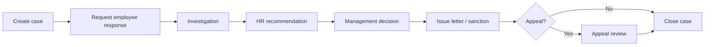

---

## Files added / changed

### Backend (new)

- `server/hrDisciplineCasesOps.js` — case CRUD, workflow, letters, payroll blocks
- `server/hrDisciplineCases.test.js`
- `docs/HR/PHASE-7-COMPLETION.md`

### Backend (modified)

- `server/migrate.js` — `migrateHrPhase7DisciplineLetters2026`
- `server/hrApi.js` — discipline case routes, policy gates
- `server/hrLetterTemplates.js` — discipline + compliance letter bodies
- `server/hrPolicy.js` — expanded registry + gated actions
- `server/hrReportsHub.js` — case + letter reports

### Frontend (new)

- `src/lib/hrDisciplineCases.js`
- `src/components/hr/HrDisciplineCasesPanel.jsx`

### Frontend (modified)

- `src/pages/hr/HrDisciplineExitHub.jsx` — Cases tab (default)
- `src/pages/hr/HrLetters.jsx` — expanded letter catalog
- `src/lib/hrReportDeepLinks.js`

---

## Deploy checklist

1. `npm run db:migrate` (backend) — Phase 7 columns + evidence/witness/appeal tables
2. Restart API — verify `/api/hr/health` ok
3. HR users acknowledge new policies (`/hr/my-profile/policies`)
4. Smoke: create case → add evidence → generate query letter → export report

---

## Deferred / configuration

| Item | Notes |
|------|--------|
| Letter draft → approve → issue | Letters issue immediately; **Phase 8** — see [PHASE-8-PLAN.md](./PHASE-8-PLAN.md) §B |
| Policy PDF archive / witness | Ack stored in DB; **Phase 8** §8 partial |
| Policy re-ack expiry | Version bumps require manual re-sign; Phase 8+ |
| Repeat offenders analytics | Phase 8+ / BI |
| Bulk old-staff Excel import | **Phase 8** §A — basic fields only |
| Letter reference reset | **Phase 8** §C |
| Staff ID reservation | **Phase 8** §D — separate from letter refs |

---

## Phase 7+ / Phase 8 placeholders

- Discipline analytics dashboard (trends, repeat offenders, branch heatmap) — Phase 8+
- Letter versioning and template admin UI — Phase 8+
- Automated escalation when response overdue — Phase 8 §10
- Employee self-service case response portal — **Phase 8 §9**

**Revised Phase 8 scope (operational go-live):** [PHASE-8-PLAN.md](./PHASE-8-PLAN.md) — basic bulk import, letter approval lock, reference numbering, staff ID reservation.


---

## SOURCE DOCUMENT — docs\HR\PHASE-7-PLAN.md

*Path:* `c:/Users/USER/OneDrive/Desktop/Zarewa-backend-main/docs/HR/PHASE-7-PLAN.md`

*The following content is included verbatim from the live project documentation corpus.*

# PHASE 7 — Professional Discipline, Case Management, and Complete Company Letters

**Status:** Implemented — see `PHASE-7-COMPLETION.md`.

Phase 6 delivers governance, payroll control, staff development, engagement, analytics, and API stability. Phase 7 makes discipline and company letters fully professional, complete, and audit-ready.

---

## 1. Professional discipline case management

Replace query/warning/suspension-only tracking with full HR case management.

### Case types

Query, verbal warning, written warning, final warning, suspension, investigation, gross misconduct, negligence, absenteeism, lateness, harassment complaint, insubordination, theft/fraud allegation, damage to company property, confidentiality breach, policy violation, performance misconduct, dismissal recommendation.

### Case fields

Case number, employee, branch/HQ, department, designation, incident date, reported date, reported by, case type, severity, description, evidence/documents, witnesses, employee response, investigation officer, investigation findings, HR recommendation, management decision, sanction, appeal status, final outcome, closure date, related letters, related documents, audit timeline.

### Case statuses

Draft, Open, Awaiting employee response, Under investigation, Awaiting HR review, Awaiting management decision, Action issued, Appealed, Closed, Cancelled.

### Database (proposed)

- `hr_discipline_cases` — master case record
- `hr_discipline_case_events` — timeline entries
- `hr_discipline_case_evidence` — document links
- `hr_discipline_case_witnesses` — witness records
- `hr_discipline_appeals` — appeal workflow

### API (proposed)

- `GET/POST /api/hr/discipline-cases`
- `GET/PATCH /api/hr/discipline-cases/:id`
- `POST /api/hr/discipline-cases/:id/events`
- `POST /api/hr/discipline-cases/:id/letters/:letterType`
- `GET /api/hr/discipline-cases/:id/audit`

---

## 2. Discipline workflow

1. Create case (draft)
2. Issue query / notice to employee
3. Record employee response
4. Investigation phase (officer, findings, evidence)
5. HR review and recommendation
6. Management decision
7. Issue sanction letter (warning, suspension, dismissal, etc.)
8. Appeal if applicable
9. Close case — all letters and documents saved to employee profile
10. Full audit trail at every step

---

## 3. Discipline panel UI (`/hr/discipline-exit`)

Improve **Discipline** tab:

- Case dashboard with counts by status/severity
- Filterable case table
- Case detail drawer/modal with sections:
  - Status timeline
  - Evidence
  - Witnesses
  - Employee response
  - HR recommendation
  - Management decision
  - Related letters and documents
  - Audit trail
- Quick actions: issue query, schedule hearing, close case

**Filters:** branch, department, employee, case type, severity, status, date range, outcome.

---

## 4. Discipline reports

| Report | Export |
|--------|--------|
| Open discipline cases | CSV, Excel, PDF, Print |
| Discipline case history | CSV, Excel, PDF, Print |
| Query report | CSV, Excel, PDF, Print |
| Warning report | CSV, Excel, PDF, Print |
| Suspension report | CSV, Excel, PDF, Print |
| Dismissal recommendation report | CSV, Excel, PDF, Print |
| Cases by branch / department / severity / outcome | CSV, Excel, PDF, Print |
| Repeat offenders | CSV, Excel, PDF, Print |
| Pending employee response | CSV, Excel, PDF, Print |
| Pending management decision | CSV, Excel, PDF, Print |
| Closed cases | CSV, Excel, PDF, Print |

Wire into `HrReportsHub` under category `discipline`.

---

## 5. Company letters completion

Make all letters meaningful, professional, and linked to source records.

### Letter categories

**A. Employment** — offer, appointment, confirmation, probation extension/termination, employment verification, introduction, certificate of service, experience/reference.

**B. Salary and payroll** — salary confirmation, increment, promotion with salary change, salary hold/release, deduction notice, loan deduction, allowance approval, bonus approval.

**C. Leave and absence** — leave approval/rejection, resumption, absence query, unauthorized absence warning, sick leave acknowledgement, return-to-work.

**D. Transfer** — inter-branch, in-branch department, HQ↔branch, temporary transfer, transfer completion.

**E. Discipline** — query, hearing invitation, warning, final warning, suspension, investigation notice/outcome, dismissal, termination, appeal acknowledgement/outcome.

**F. Exit** — resignation acknowledgement/acceptance, termination, dismissal, layoff/retrenchment, exit clearance, return of property, final settlement, certificate of service.

**G. Compliance and policy** — handbook receipt, confidentiality pledge, IT security, data protection, conflict of interest, code of conduct, NDA.

**H. Training and development** — training approval/invitation/completion, promotion eligibility, career development plan.

**I. General administrative** — ID card approval/replacement, department/designation/reporting line change, address update, general HR memo.

---

## 6. Letter template quality standard

Each letter must include:

- Company name and address/contact
- Date, employee name, employee number, job title, department, branch/HQ
- Subject line and professional body text
- Relevant source record details and effective date
- Approval/signature block (prepared by, approved by, CC)
- PDF export, print preview
- Saved copy on employee profile
- Source record link and version/history

No single-paragraph placeholder letters where business context requires more detail.

---

## 7. Letter generation UI (`/hr/documents?tab=letters`)

- Grouped letter categories (A–I above)
- Letter type search
- Required field checklist before generation
- Source record selector (case, transfer, leave request, payroll run, etc.)
- Preview before generate
- Missing data warnings
- Save as draft → generate PDF → print → save to profile
- Letter history and linked source record on profile

---

## 8. Policy documents

Complete acknowledgements for handbook, confidentiality, IT security, data protection, code of conduct, anti-harassment, equal employment opportunity.

Track: version, date signed, signed by, witness/HR officer, PDF copy, expiry/re-acknowledgement schedule.

---

## 9. Phase 7 implementation checklist (for future delivery)

When Phase 7 is implemented, the completion response should include:

- **A.** Discipline case tables/APIs added
- **B.** Discipline workflows completed
- **C.** Discipline UI improvements
- **D.** Discipline reports added
- **E.** Letter categories completed
- **F.** Letter templates added/improved
- **G.** Source record linking completed
- **H.** Policy acknowledgement improvements
- **I.** Tests run and results
- **J.** Remaining limitations

---

## Dependencies on Phase 6

Phase 7 builds on Phase 6 audit trail, grievance workflow, exit interviews, and letter infrastructure. Ensure Phase 6 migrations and `/api/hr/health` are green before starting Phase 7.

## Explicitly out of scope for Phase 7

- Overtime payroll calculation (remains tracking/approval only)
- Biometric/time-clock integration
- Attendance automation beyond daily roll


---

## SOURCE DOCUMENT — docs\HR\PHASE-8-COMPLETION.md

*Path:* `c:/Users/USER/OneDrive/Desktop/Zarewa-backend-main/docs/HR/PHASE-8-COMPLETION.md`

*The following content is included verbatim from the live project documentation corpus.*

# Phase 8 — Operational HR (Live Readiness)

Completed June 2026. Extends Phases 1–7 without rebuilding existing flows.

## A. Files changed

### Backend (new)
- `server/hrLetterWorkflowOps.js` — draft→approval→issue, ref numbers, PDF/DOCX/print lock, audit
- `server/hrStaffBulkImport.js` — Excel template, preview, commit, import runs
- `server/hrStaffNumbering.js` — reserved 1–5, preview/apply renumbering
- `server/hrLetterWorkflowOps.test.js` — lifecycle/sensitivity unit tests

### Backend (modified)
- `server/hrApi.js` — workspace gate middleware, letter workflow routes, bulk import, settings, my-discipline, duplicate PDF route removed
- `server/hrPermissions.js` — team/self API allowlists, bulk import / letter approve helpers
- `server/hrPermissionKeys.js`, `server/hrRoleBundles.js` — `hr.staff.import`
- `server/hrDisciplineCasesOps.js` — discipline letters create drafts via workflow
- `server/migrate.js` — `migrateHrPhase8Operational2026`
- `server/hrModuleHealth.js`, `server/hrTableChecks.js` — Phase 8 diagnostics
- `server/hrPermissions.test.js` — API path access tests

### Frontend (new)
- `src/components/hr/HrAccessDenied.jsx`, `HrMainRouteGuard.jsx`
- `src/components/hr/HrBulkStaffImportModal.jsx`
- `src/components/hr/HrLetterReferencePanel.jsx`, `HrStaffNumberingPanel.jsx`
- `src/pages/hr/MyProfileDiscipline.jsx`

### Frontend (modified)
- `src/App.jsx` — HrMainRouteGuard on `/hr/*`
- `src/lib/hrAccess.js`, `src/lib/hrExtended.js`, `src/lib/moduleAccess.js`
- `src/pages/hr/HrLetters.jsx` — approval UI, PDF/Word/print lock
- `src/pages/hr/HrStaffDirectory.jsx` — Bulk Register Staff
- `src/pages/hr/HrSettingsHub.jsx` — letter refs + staff numbering tabs
- `src/pages/hr/MyProfile.jsx`, `MyProfilePolicies.jsx`
- `src/pages/hr/HrIdCards.jsx` — temporary card design
- `src/components/hr/HrResponsiveTable.jsx`, `HrReportsHub.jsx` — deep-links

## B–L. Feature summary

| Area | Status |
|------|--------|
| Access control | `/hr/*` guarded frontend + backend 403 with team/my-profile messaging |
| Bulk staff import | Template download, preview, commit on `/hr/employees` |
| Letter approval | Draft→submit→HR/GM/MD→issue; discipline letters use drafts |
| PDF/Word/print lock | Backend `assertOfficialLetterExport`; frontend disabled until issued |
| Letter reference reset | Settings tab; `ZAR/HR/{TYPE}/{YEAR}/{SEQ}` on issue |
| Staff ID reset | Settings tab; reserve 1–5, preview, apply with confirmation |
| Temporary ID cards | Watermark, verification code, expiry, signature line |
| Policy acknowledgement | My Profile labels/expiry; HR settings unchanged registry |
| My Profile discipline | `/my-profile/discipline` response + appeal |
| Reports deep-links | `deepLink` / profile fix links in responsive table |
| Notifications | Letter issue, discipline response/appeal, existing summary extended |
| API health | Phase 8 tables in `/api/hr/health` diagnostics |

## M. Migration

Run `npm run db:migrate` for `hr_settings`, `hr_staff_import_runs`, `hr_employee_number_history`, letter workflow columns.

## N. Tests

- Backend: `hrPermissions`, `hrLetterWorkflowOps`, `hrDisciplineCases`, `hrReportsHub` — **16 passed**
- Frontend: `npm run build` — **success**

## O. Remaining limitations

- DOCX export uses HTML-as-Word (no native `docx` package); opens in Word/LibreOffice.
- Letter approval UI is hub-level; full timeline modal per letter is a future polish item.
- Bulk import does not include tax/pension/NHIS columns (by design).
- E2E browser tests not added in this pass; manual UAT recommended for role matrix.
- `resetLetterReferencesForLiveUse` does not require confirm phrase on backend (MD role gate only).


---

## SOURCE DOCUMENT — docs\HR\PHASE-8-PLAN.md

*Path:* `c:/Users/USER/OneDrive/Desktop/Zarewa-backend-main/docs/HR/PHASE-8-PLAN.md`

*The following content is included verbatim from the live project documentation corpus.*

# PHASE 8 — Operational Readiness: Bulk Onboarding, Letter Governance, and Reference Control

**Status:** Planned — corrections/addendum applied 2026-06-06.

**Builds on:** Phase 7 discipline cases, letter templates, policy gates, profile completeness, and audit trail.

**Note:** The legacy roadmap in [HR-IMPLEMENTATION-PLAN.md](./HR-IMPLEMENTATION-PLAN.md) labels an earlier “Phase 8 — Workspace and Zare” as complete. **This document is the revised Phase 8 scope** for go-live readiness (bulk old-staff registration, letter approval lock, reference numbering, staff ID reservation).

---

## Implementation priority (final order)

| # | Deliverable | Rationale |
|---|-------------|-----------|
| 1 | Access control cleanup | Foundation for all gated actions |
| 2 | Basic old-staff Excel import | Register live staff quickly; complete profiles later |
| 3 | Letter approval workflow | Draft → review → approve before issue |
| 4 | Letter PDF/Word/print lock until approval | Backend + frontend enforcement |
| 5 | Letter reference number system + reset | Official refs only on issue; live sequence control |
| 6 | Staff ID reset / reservation | Separate from letter refs; reserve 1–5 for executives |
| 7 | Improved temporary ID card print | Practical badge output for imported staff |
| 8 | Policy acknowledgement improvements | Onboarding tasks after bulk import |
| 9 | My Profile discipline response/appeal | Employee self-service on open cases |
| 10 | Reports deep-linking and notifications | Operational follow-up from imports and letters |

---

## A. Bulk old-staff Excel upload — BASIC ONLY

### Purpose

Register **existing/live old staff quickly** with **basic records only**. HR completes each profile gradually inside the employee profile tabs. The import is **not** a full HR data migration.

### Excel template — included fields

**Required**

| Column | Notes |
|--------|--------|
| First Name | |
| Surname | |
| Display Name | Shown in UI; may default from first + surname |
| Phone Number | |
| Email | Optional if unavailable |
| Employee Number | Optional if system generates |
| Work Location | `HQ` or `Branch` |
| Branch Code / Branch Name | Map to `branch_id` via master data |
| Department Code / Department Name | Map to `hr_departments` |
| Designation / Job Title | Map to designation or free text |
| Employment Type | permanent, contract, temporary, etc. |
| Employment Status | active, probation, suspended, etc. |
| Date Joined | ISO or Excel date |

**Optional (basic only)**

| Column | Notes |
|--------|--------|
| Basic Salary | Optional depending on payroll readiness |
| Bank Name, Bank Code, Account Number, Account Name | Optional payroll prep |
| Gender | |
| Date of Birth | |
| Residential Address | |
| Next of Kin Name, Next of Kin Phone | |
| Highest Qualification | Single field — not full history |

### Explicitly excluded from bulk template

Do **not** collect in Excel:

- Full tax details (TIN, PAYE history)
- Full pension details (RSA, PIN, employer code)
- Full NHIS details
- Qualification history (multiple rows)
- Document list / uploads
- HR notes / memos
- Policy acknowledgement data
- Payroll remarks / hold flags
- Complex manager/supervisor hierarchy (unless trivial single-column mapping)

### Post-import behaviour

1. Staff record created with `user_id` as immutable system key.
2. Profile completeness score reflects missing sections (`HrProfileCompleteness` / `computeProfileCompleteness`).
3. Incomplete sections visible on staff profile tabs:
   - Personal data
   - Employment details
   - Payroll / bank
   - Tax / pension / NHIS
   - Next of kin
   - Qualifications
   - Documents
   - Policies
   - HR notes
4. **Data-completeness tasks** created for HR (lifecycle/onboarding tasks or notification queue).

### Bulk import workflow (UI)

```
Download basic template → Upload Excel → Validate preview → Import valid rows → Summary report
```

**Summary report must show:**

- Imported count
- Skipped (duplicate / policy)
- Failed (validation errors)
- Duplicate (employee no / email / phone)
- Needs cleanup (partial row, missing branch/dept mapping)

**Safety rules:**

- Dry-run / preview before commit
- Row-level error messages (row number + field)
- No overwrite of existing `user_id` records without explicit “update mode” flag
- Audit: `hr.bulk_staff.import` with actor, file hash, counts

### API (proposed)

```
GET  /api/hr/staff-import/template          → download basic .xlsx
POST /api/hr/staff-import/preview           → validate rows, no writes
POST /api/hr/staff-import/commit            → import valid rows
GET  /api/hr/staff-import/runs/:id          → import run summary
```

### Implementation notes

- Replace or wrap CLI `server/importZarewaStaffFromXlsx.js` (salary-register oriented) with **basic onboarding template** aligned to columns above.
- Frontend: `/hr/staff-directory` or dedicated **Bulk register** panel (modal wizard).
- Map branch/dept/designation via Phase 4 master data (`hr_departments`, `hr_designations`).

---

## B. Letters must NOT be freely printed

### Problem (Phase 7 gap)

Letters currently generate and can be downloaded/printed immediately. Phase 8 **must** enforce approval before official output.

### Letter lifecycle statuses

| Status | Description |
|--------|-------------|
| `draft` | Internal preview only |
| `submitted` | Sent for review |
| `hr_review` | HR reviewing |
| `gm_review` | GM review (when required) |
| `md_review` | MD approval (when required) |
| `approved` | Approved, not yet issued |
| `issued` | Official; ref number assigned |
| `rejected` | Returned with reason |
| `cancelled` | Voided |

### Rules

| Action | Draft | Submitted / in review | Approved / issued |
|--------|-------|------------------------|-------------------|
| Internal preview | Yes — **watermark** | Yes — watermark | Yes — official layout |
| Print official | **No** | **No** | **Yes** |
| Download PDF (official) | **No** | **No** | **Yes** |
| Download Word (official) | **No** | **No** | **Yes** |
| Assign official ref no | **No** | **No** | **Yes** (on issue) |

**Watermark text (draft / in-review preview):**

> DRAFT — NOT VALID FOR OFFICIAL USE

### Sensitive letters — higher approval chain

Require **GM and/or MD** before issue:

- Termination, dismissal, suspension, final warning
- Retrenchment / layoff
- Salary increment, salary confirmation, bonus approval
- Loan-related, payroll-related, promotion
- Discipline outcome letters

**Routine letters** — HR or GM per permission:

- Introduction, confirmation, training approval, leave approval
- Certificate of service, ID card approval

### Frontend (`HrLetters.jsx`, `HrLetterPrintModal.jsx`)

- Show **status pill** and approval timeline in letter detail modal.
- **Disable/hide** Download PDF, Download Word, Print until `approved` or `issued`.
- On blocked action show: *“This letter must be approved before it can be printed or downloaded.”*
- Preview modal: render content with draft watermark overlay.
- Show audit history (approvals, rejections, downloads, prints).

### Backend enforcement (mandatory)

- `GET /api/hr/employment-letters/:id/pdf` → **403** if status ∉ `{approved, issued}`.
- Same for DOCX export and print-optimized endpoint.
- Draft preview endpoint returns HTML/PDF **with watermark** metadata flag.
- Audit every:
  - Approval / rejection / submit / issue
  - PDF download (success + failed attempt where useful)
  - Word download
  - Print request
- Actions: `hr.letter.submitted`, `hr.letter.approved`, `hr.letter.rejected`, `hr.letter.issued`, `hr.letter.pdf_download`, `hr.letter.print_attempt`, etc.

### Schema extensions

```sql
-- hr_employment_letters (extend)
status TEXT NOT NULL DEFAULT 'draft'
reference_number TEXT UNIQUE          -- assigned on issue only
draft_id TEXT                         -- internal draft identifier
submitted_at_iso, submitted_by_user_id
hr_reviewed_at_iso, hr_reviewed_by_user_id
gm_reviewed_at_iso, gm_reviewed_by_user_id
md_approved_at_iso, md_approved_by_user_id
issued_at_iso, issued_by_user_id
rejection_reason TEXT
approval_chain_json TEXT              -- timeline snapshot

-- hr_letter_approval_events (optional normalized timeline)
-- hr_letter_download_log (print/download audit)
```

### API (proposed)

```
POST /api/hr/employment-letters/generate     → creates draft (not issued)
POST /api/hr/employment-letters/:id/submit
PATCH /api/hr/employment-letters/:id/hr-review
PATCH /api/hr/employment-letters/:id/gm-review
PATCH /api/hr/employment-letters/:id/md-approve
POST /api/hr/employment-letters/:id/issue      → assigns ref, status=issued
POST /api/hr/employment-letters/:id/reject
GET  /api/hr/employment-letters/:id/preview    → watermarked preview
GET  /api/hr/employment-letters/:id/pdf        → official only if approved/issued
```

---

## C. Letter reference number — controlled reset

### Requirements

- **Unique** official reference per issued letter.
- Assigned **only** on `approved` → `issued` transition, **not** on draft.
- Drafts may use temporary `draft_id` (e.g. `DRF-HRL-…`) — not official refs.
- Configurable sequence with **no duplicates**.

### Suggested format

```
ZAR/HR/{LETTER_TYPE_CODE}/{YEAR}/{SEQUENCE}
```

Examples:

- `ZAR/HR/APP/2026/0001` — appointment
- `ZAR/HR/DIS/2026/0001` — dismissal
- `ZAR/HR/TRF/2026/0001` — transfer
- `ZAR/HR/PAY/2026/0001` — payroll-related

### Settings (`hr_letter_reference_config` or HR Settings JSON)

| Setting | Description |
|---------|-------------|
| `prefix` | Default `ZAR/HR` |
| `year` | Current year (auto) |
| `letterTypeCode` | Per letter kind map (APP, DIS, TRF, PAY, LVE, …) |
| `startingSequence` | Seed for new year or reset |
| `resetMode` | `yearly` \| `manual` \| `never` |
| `currentSequence` | Per type+year counter |
| `lastIssuedReference` | Last committed ref |

### Reset for live deployment

- **“Reset Letter References for Live Use”** in HR Settings → Letter Settings.
- Requires **HR Admin or MD** + confirmation dialog.
- Shows **preview of next N reference numbers** before apply.
- **Audited:** `hr.letter.reference_reset`.
- Mark pre-live test letters as `test` / `archived` so they do not consume live sequence.
- DB constraint: `UNIQUE(reference_number)` on `hr_employment_letters`.

### Letter reports (extend Phase 7 `letter-issuance-report`)

Include columns:

- Reference number
- Letter type
- Employee
- Status
- Prepared by
- Approved by (GM/MD as applicable)
- Issued date
- Download count / print audit count

---

## D. Staff ID reset — separate from letter references

| Concern | Staff ID / employee number | Letter reference |
|---------|------------------------------|------------------|
| Applies to | `hr_staff_profiles.employee_no` | `hr_employment_letters.reference_number` |
| Purpose | Human-visible staff numbering | Official correspondence numbering |
| Reset action | Reserve 1–5 for CEO, MD, Directors | Reset per letter type sequence |
| System key | **`user_id` unchanged** — all FKs use `user_id` | Letter row id unchanged; ref assigned on issue |
| Settings location | HR Settings → Staff ID | HR Settings → Letter References |

**Staff ID rules:**

- Changing `employee_no` must **not** break payroll, discipline, documents, or audit (all keyed on `user_id`).
- Reservation table or config: `{ reservedNumbers: [1,2,3,4,5], labels: { 1: 'CEO', … } }`.
- Reset/reservation audited: `hr.staff_id.reset`.

---

## E. Additional Phase 8 scope (priority 7–10)

### 7. Temporary ID card print

- Quick card for imported staff with photo placeholder, name, employee no, branch, blood group (optional).
- Mark as **TEMPORARY** on card until full profile + approval.
- Link to existing `hr_id_cards` + `HrIdCards.jsx`.

### 8. Policy acknowledgement improvements

- After bulk import, auto-create onboarding tasks for required policies.
- Dashboard widget: staff missing policy ack post-import.
- Block sensitive HR actions until employee + approver policies complete (extend Phase 7 gates).

### 9. My Profile — discipline response / appeal

- Employee views open cases assigned to them (redacted sensitive mgmt fields).
- Submit written response on `awaiting_employee_response`.
- File appeal when case status allows.
- Notifications on case updates.

### 10. Reports deep-linking and notifications

- Report rows link to staff profile, letter (if issued), case detail.
- Notify HR on: import needs-cleanup, letter pending approval, overdue discipline response.

---

## Module summary table

| Module | Feature | API / UI | Status |
|--------|---------|----------|--------|
| Bulk import | Basic Excel template | `GET template`, `POST preview/commit` | **Planned** |
| Bulk import | Completeness tasks post-import | Lifecycle tasks + notifications | **Planned** |
| Letters | Approval workflow | submit → hr → gm → md → issue | **Planned** |
| Letters | Print/PDF/Word lock | Backend 403 + UI disable | **Planned** |
| Letters | Draft watermark preview | `GET .../preview` | **Planned** |
| Letters | Reference numbering | On issue only | **Planned** |
| Letters | Reference reset | HR Settings action | **Planned** |
| Staff ID | Reservation 1–5 | HR Settings | **Planned** |
| Staff ID | Reset (employee_no only) | Separate from letter refs | **Planned** |
| ID cards | Temporary print | HrIdCards enhancement | **Planned** |
| Policies | Post-import ack tasks | My Profile + HR queue | **Planned** |
| Discipline | My Profile response/appeal | `/my-profile` + case API | **Planned** |
| Reports | Deep links + alerts | Reports hub + notifications | **Planned** |
| Access control | Permission cleanup | hrPermissions + routes | **Planned** |

---

## Relationship to Phase 7 deferred items

| Phase 7 deferred | Phase 8 owner |
|------------------|---------------|
| Letter draft → approve workflow | **B** — full lifecycle |
| Policy PDF / witness / expiry | **8** — partial; PDF archive may remain Phase 8+ |
| Repeat offender analytics | Phase 8+ / BI |

---

## Explicitly out of scope for Phase 8

- Overtime payroll calculation
- Biometric / time-clock integration
- Full tax/pension/NHIS bulk migration via Excel
- Letter template admin CMS (use code templates; admin UI deferred)

---

## Testing checklist (Phase 8 completion)

- [ ] Import 10-row basic Excel → profiles created, completeness < 100%, tasks created
- [ ] Duplicate employee no → skipped with clear message
- [ ] Generate letter → draft only; PDF download returns 403
- [ ] Approve letter → issue → ref assigned → PDF download succeeds
- [ ] Draft preview shows watermark
- [ ] Reset letter refs → next issue starts at configured sequence; audit logged
- [ ] Staff ID change → records intact via `user_id`
- [ ] E2E: import → complete profile → issue letter → print

---

## Document history

| Date | Change |
|------|--------|
| 2026-06-06 | Initial Phase 8 plan with corrections A–E (bulk basic import, letter lock, ref reset, staff ID clarification, priority order) |


---

## SOURCE DOCUMENT — docs\HR\PHASE-9-COMPLETION.md

*Path:* `c:/Users/USER/OneDrive/Desktop/Zarewa-backend-main/docs/HR/PHASE-9-COMPLETION.md`

*The following content is included verbatim from the live project documentation corpus.*

# HR Phase 9 — Executive Benefits (completion notes)

## Scope delivered

- Executive benefits backend (`hrExecutiveBenefitsOps.js`) with separate tables from operational payroll
- Migration `migrateHrPhase9ExecutiveBenefits2026`
- REST API under `/api/hr/executive/*`
- Top-level UI route `/executive-hr/*` (MD can access without main `/hr` workspace)
- Executive Benefits hub: beneficiaries, school fees, stipends, domestic staff, payments, bank export, chairman expenses, audit guidance
- Role/dashboard landing updates (MD → `/exec`, cashier → `/cashier`, accountant → `/accounting`, HR admin → `/hr`)
- Executive reports in HR Reports Hub (`executive-*` catalog entries)
- Permissions: `hr.executive.benefits.view|manage|export`, `hr.chairman.manage`
- Bank account encryption via `hrBankCrypto.js`
- Audit events on create/update/approve/export/paid

## Deploy

```bash
npm run db:migrate
# restart API
```

## Routes

| Area | Route |
|------|-------|
| Executive HR shell | `/executive-hr/*` |
| Executive benefits | `/executive-hr/benefits?tab=school-fees` |
| Legacy redirect | `/hr/executive/*` → `/executive-hr/*` |

## API (summary)

- `GET /api/hr/executive/dashboard`
- CRUD: `/beneficiaries`, `/school-fees`, `/stipends`, `/domestic-staff`
- Payments: `/payments`, `/:id/approve`, `/:id/reject`, `/:id/mark-paid`, `/payments/export`
- Reports: `/reports/:kind` (executive catalog IDs)

## Known limitations

- Monthly stipend **payment batch generation** from active stipends is manual (create payment rows via school-fee submit flow or future batch job)
- Document upload for school bills/receipts uses `documentRef` text field only (no file store UI yet)
- Domestic staff not linked to login/My Profile unless `user_id` set separately
- Phase 9 tables are health-checked but not required for `allReady` (core HR still works before migrate)

## Tests

```bash
npm test -- server/hrExecutiveBenefitsOps.test.js server/hrPermissions.test.js
cd ../Zarewa-frontend-main && npm run build
```


---

## SOURCE DOCUMENT — docs\HR\STAFF-OBLIGATIONS-REPAYMENT-ARCHITECTURE.md

*Path:* `c:/Users/USER/OneDrive/Desktop/Zarewa-backend-main/docs/HR/STAFF-OBLIGATIONS-REPAYMENT-ARCHITECTURE.md`

*The following content is included verbatim from the live project documentation corpus.*

# Staff obligations, loans & repayment — unified architecture

**Status:** Living architecture (consolidates payback UX, Finance desk, HR controls, Chairman waiver)  
**Parent:** [HR-IMPLEMENTATION-PLAN.md](./HR-IMPLEMENTATION-PLAN.md) · [ZAREWA-COMPENSATION-AND-EXCEPTIONS.md](./ZAREWA-COMPENSATION-AND-EXCEPTIONS.md)  
**Last updated:** 2026-06-20

---

## 1. Purpose

Zarewa tracks money staff owe the company (loans, purchase credit, discipline recovery) in one **staff obligation ledger**. Repayment is primarily **payroll deduction**; **Finance** records cash/bank early payments; **HR** maintains schedules and pauses; **Chairman** waives policy exceptions or forgives balances when required.

**Design rule:** One system for all staff—including directors. Special treatment = **permissions + two controls** (pause, waive), not a separate product.

---

## 2. Principles

| # | Principle |
|---|-----------|
| 1 | **One ledger** — `hr_staff_obligation_accounts` + transactions for staff-linked debt |
| 2 | **Payroll default** — fixed monthly installment until balance is zero |
| 3 | **Finance collects** — cash/bank at branch desk posts to the same ledger |
| 4 | **HR owns terms** — change monthly amount, pause, close; audit everything |
| 5 | **Chairman for exceptions** — policy bypass on approval; balance waiver (write-off) |
| 6 | **Keep bulk pay simple** — lump sum reduces balance; monthly stays same unless HR adjusts |
| 7 | **Non-staff debt** — creditors register (manual) until a dedicated external flow is justified |

---

## 3. System context

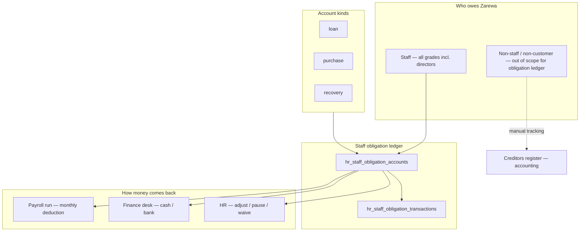

---

## 4. Obligation kinds (existing)

| Kind | Source | Approval | Payroll? | Cash at Finance? |
|------|--------|----------|----------|------------------|
| **loan** | HR loan request → finance disbursement | HR + GM workflow | Yes | Yes |
| **purchase** | Sales quotation → staff purchase credit | MD | Yes | Yes |
| **recovery** | Discipline case → recovery schedule | HR sets amount | Optional | **Cashier only** (treasury + obligation) |
| **legacy** | HR register pre-ERP loan | HR | Yes | Yes |

**Recovery** uses a different cashier flow (treasury in + schedule). Loans and purchase credit share the same early-repay path.

---

## 5. Repayment mechanics

### 5.1 Default schedule (set at approval)

- **Staff loan:** `amountNgn`, `repaymentMonths`, `deductionPerMonthNgn`
- **Purchase credit:** `termMonths`, `installmentNgn` (ceil balance ÷ months)
- Stored on obligation: `installment_ngn`, `term_months`, `principal_outstanding_ngn`

### 5.2 Payroll deduction (automatic)

On each locked/paid payroll run, for each active account where `deductions_active = 1`:

```
deduction = min(installment_ngn, principal_outstanding_ngn)
```

- Posts `payroll_deduction` transaction
- Increments `months_paid`
- Stops when `principal_outstanding_ngn = 0` → status `paid_off`, `deductions_active = 0`

**Staff action required:** none each month.

### 5.3 Early / bulk payment (cash or bank)

Finance or HR posts `cash_repayment`:

| Effect | Behaviour |
|--------|-----------|
| Outstanding | Reduced by payment amount |
| Monthly installment | **Unchanged** (default) |
| Months remaining | **Fewer** — same ₦/month until cleared |
| Payroll | Continues at same rate until balance zero |

**Policy copy (staff-facing):** *Early payment reduces what you owe. Your monthly payroll deduction stays the same unless HR reschedules it.*

Optional later: HR chooses “recalculate monthly” after large payment — **not required for v1**.

### 5.4 Partial payment

Same as bulk: balance down, installment unchanged, next payroll deducts `min(installment, remaining)`.

---

## 6. Special controls (simple — same ledger)

Directors and exceptional cases use the **same account** with these levers:

### 6.1 Pause repayment

**Goal:** Stop payroll deductions temporarily; balance unchanged.

| Field | Implementation |
|-------|----------------|
| `deductions_active` | `0` while paused |
| `pause_until_iso` | Optional resume date (new column or `note` + JSON on account) |
| `pause_reason` | Required text |
| `paused_by_user_id` | Audit |

**UI:** HR → Loans → Record repayments → account detail → **Pause deductions** / **Resume**

**Staff sees:** Pay back tab — banner “Repayment paused until … — contact HR”

**Backend today:** `deductions_active` exists; `OBLIGATION_STATUS.SUSPENDED` reserved — prefer pause via flag + audit before new status logic.

### 6.2 Adjust schedule (HR)

**Goal:** Change monthly amount or term after disbursement.

| Action | API (exists) | UI (planned) |
|--------|--------------|--------------|
| Change monthly ₦ | `PATCH /api/hr/loans/:requestId` → `deductionPerMonthNgn` | HR maintenance form |
| Change term months | same → `repaymentMonths` | same |
| Close / pay off administratively | same → `closeLoan: true` → write-off remaining | same |

Syncs to linked `hr_staff_obligation_accounts` when `hr_request_id` present.

### 6.3 Chairman waiver

Two narrow uses — **not** a separate loan system:

| Waiver type | When | Who | Effect |
|-------------|------|-----|--------|
| **Policy waiver** | Loan exceeds service years / max amount / etc. | Chairman (or MD fallback) approves exceptional request | Loan proceeds as normal staff loan |
| **Balance waiver** | Forgive remaining debt | Chairman only (`chairman` / `*` + memo) | `write_off` tx → `paid_off`, deductions off |

**Routing:**

- HR ticks **Needs Chairman waiver** (or auto when `exceptionalLoan`) on application
- Executive queue: existing **Exceptional loans** + Chairman approve step
- Balance waiver: button on obligation detail — **Waive remaining balance** (permission-gated)

**Directors:** same loan form; HR flags waiver when board policy requires it. Compensation `director_emolument` stays on **pay profile**, not loans.

---

## 7. User journeys & UI map

### 7.1 Staff — My Profile → Loans & credit

| Tab | Purpose | Status |
|-----|---------|--------|
| **Pay back** | Balances, how to pay, pause banner, statement PDF | ✅ Shipped |
| **Staff loans** | Apply, track requests, eligibility | ✅ |
| **Purchase credit** | Quotations, request credit | ✅ |

**Pay back content:**

1. `StaffObligationPayGuide` — payroll default + Finance desk early pay
2. Balance cards per loan/purchase credit
3. Discipline recovery → separate cashier guide

### 7.2 Finance — Accounts → Desk

| Queue | Purpose | Status |
|-------|---------|--------|
| Staff recoveries | Discipline — treasury in | ✅ |
| **Staff loans & purchase credit** | Early repay — obligation ledger | ✅ |
| Receipts / payouts / etc. | Existing desk work | ✅ |

Modal: record full/partial payment, date, bank ref, print receipt PDF.

### 7.3 HR — Loans hub

| Section | Purpose | Status |
|---------|---------|--------|
| Loan requests | Approval pipeline | ✅ |
| **Record repayments** | List accounts, post cash/bank, statements | ✅ |
| Purchase credit | MD queue, staff customer link | ✅ |
| **Maintain schedule** | Pause, adjust monthly, close, waive | 🔲 Planned |
| Register legacy loan | Pre-ERP migration | ✅ |

### 7.4 Chairman / executive

| Surface | Purpose | Status |
|---------|---------|--------|
| Executive HR → Exceptional loans | Above-policy staff loans | ✅ Partial |
| Chairman approve on waiver-flagged loans | Policy waiver | 🔲 Planned |
| Waive balance on obligation | Forgive remainder | 🔲 Planned |

---

## 8. Data model (existing + minimal extensions)

### 8.1 Core tables (existing)

```
hr_staff_obligation_accounts
  id, user_id, branch_id, kind, origin, title
  principal_original_ngn, principal_outstanding_ngn
  installment_ngn, term_months, months_paid
  status, deductions_active
  hr_request_id, quotation_ref, recovery_schedule_id, ...
  note, created_at_iso, updated_at_iso

hr_staff_obligation_transactions
  id, account_id, type, amount_ngn
  principal_before_ngn, principal_after_ngn
  effective_at_iso, payment_reference, note, ...
```

### 8.2 Planned extensions (small)

| Addition | Purpose |
|----------|---------|
| `pause_until_iso` on account (nullable) | Auto-resume hint |
| `pause_reason`, `paused_at_iso`, `paused_by_user_id` | Audit |
| `chairman_waiver_at_iso`, `chairman_waiver_by_user_id` on `hr_requests.payload_json` | Policy waiver trail |
| Optional `needs_chairman_waiver` boolean on loan payload | Routing |

No second ledger for directors.

### 8.3 Non-staff / non-customer (out of scope for v1)

Use **Accounting → Creditors register** (`accounting_register_lines`, category `legacy` or custom). Manual collection; no payroll. Revisit dedicated **external loan** entity only if volume justifies it.

---

## 9. API surface

### 9.1 Existing (staff self-service & HR/Finance)

| Method | Path | Who |
|--------|------|-----|
| GET | `/api/hr/staff/:userId/money-summary` | Self / HR |
| GET | `/api/hr/staff/:userId/loan-schedule` | Self / HR |
| GET | `/api/hr/obligation-accounts` | HR / Finance (read) |
| GET | `/api/hr/obligation-accounts/:id` | HR / Finance / self (statement) |
| POST | `/api/hr/obligation-accounts/:id/repayments` | HR / Finance |
| GET | `/api/finance/staff-obligations-due` | Finance desk bootstrap |
| POST | `/api/finance/staff-obligations/:id/receive` | Finance desk |
| PATCH | `/api/hr/loans/:requestId` | HR maintain (`hr.loan_maintain`) |
| POST | `/api/hr/obligation-accounts/migrate` | Legacy loan register |

### 9.2 Planned

| Method | Path | Purpose |
|--------|------|---------|
| PATCH | `/api/hr/obligation-accounts/:id/pause` | Pause / resume deductions |
| POST | `/api/hr/obligation-accounts/:id/chairman-waive` | Write off remainder (Chairman) |
| PATCH | `/api/hr/requests/:id/chairman-approve` | Policy waiver on exceptional loan |

---

## 10. Permissions

| Permission | Role / use |
|------------|------------|
| Self | View own money summary, Pay back, statement PDF |
| `hr.loans.manage`, `hr.staff.manage` | Full HR obligation panel, legacy register |
| `hr.loan_maintain` | Adjust schedule, pause (planned UI) |
| `finance.post`, `finance.pay`, `cashier.desk.view` | Finance desk record repayment |
| `hr.exceptional_loan.approve` | GM / exec exceptional queue |
| `*` or `chairman` role | Chairman balance waiver (planned) |

**Recording repayments:** `actorMayRecordStaffRepayments` — HR + Finance + cashier.

---

## 11. End-to-end flows

### 11.1 Normal staff loan

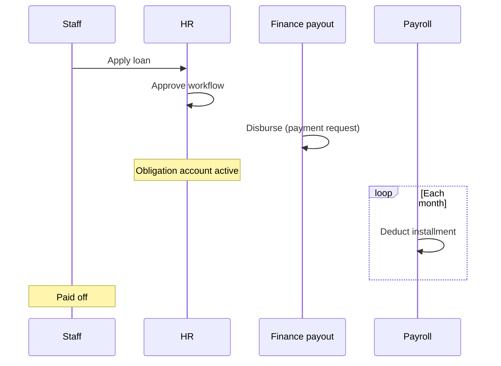

### 11.2 Early payment at branch

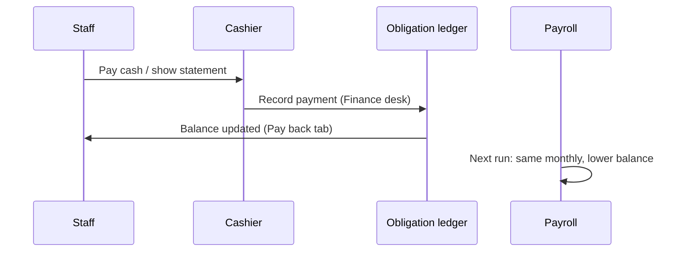

### 11.3 Director with pause + Chairman waiver

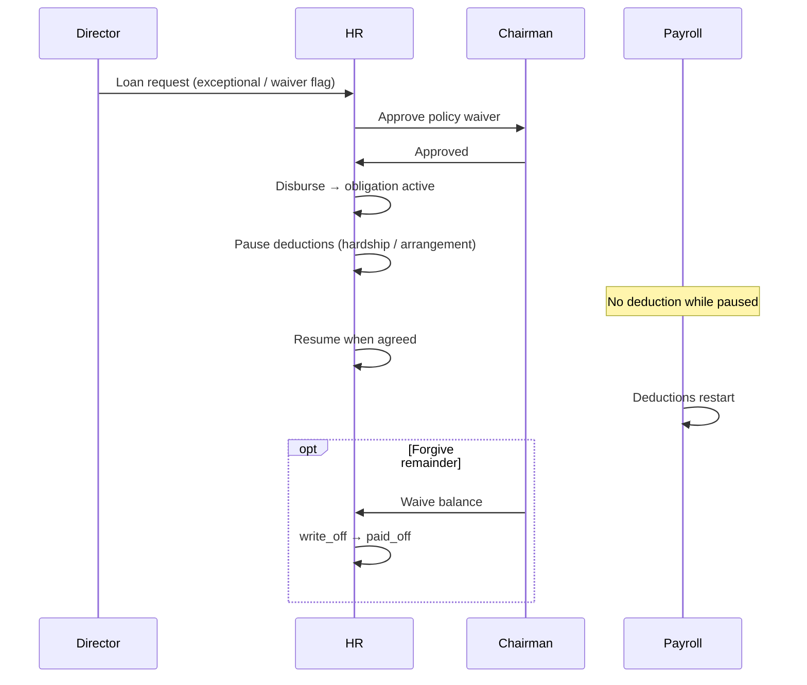

---

## 12. Rollout phases (consolidated)

### Phase A — Done ✅

- Staff obligation ledger (loan, purchase, recovery)
- Payroll deduction integration
- **Pay back** tab + pay guide (staff)
- **Finance desk** queue for loans/purchase credit
- **HR Record repayments** panel
- Finance read/post permissions aligned

### Phase B — HR controls (next, ~1 sprint)

| Item | Deliverable |
|------|-------------|
| B1 | UI: **Pause / Resume** deductions on obligation account |
| B2 | UI: **Adjust monthly** + **Close loan** (wire `PATCH /api/hr/loans/:requestId`) |
| B3 | Staff Pay back: show **Paused until …** banner |
| B4 | Policy copy: bulk pay = finish early, same monthly |

### Phase C — Chairman waiver (~0.5 sprint)

| Item | Deliverable |
|------|-------------|
| C1 | **Needs Chairman waiver** flag on loan application |
| C2 | Chairman approve step on exceptional / waiver queue |
| C3 | **Waive remaining balance** (Chairman) → `write_off` + audit |
| C4 | Statement PDF notes waiver / write-off |

### Phase D — Optional later

| Item | When |
|------|------|
| Recalculate monthly after lump sum (HR choice) | If requested often |
| Auto-resume on `pause_until_iso` | After pause is live |
| External non-staff loan entity + Chairman workflow | If creditors register insufficient |
| Treasury line on staff loan cash repay (match recovery) | If finance needs bank reconciliation on staff loan receipts |

---

## 13. Policy defaults (recommended)

| Scenario | Default |
|----------|---------|
| Standard staff loan | Payroll monthly; max term per HR policy |
| Purchase credit | MD approve; payroll monthly |
| Early / bulk pay | Balance ↓; **same monthly**; finish sooner |
| Director loan | Same system; flag **Chairman waiver** when board policy says so |
| Hardship / arrangement | HR **pause** with reason + optional end date |
| Forgive debt | Chairman **waive balance** only, with memo |
| Non-staff debtor | Creditors register; Finance manual; no payroll |

---

## 14. Related code & docs

| Area | Location |
|------|----------|
| Ledger ops | `server/staffObligationOps.js` |
| Purchase credit | `server/staffPurchaseCreditOps.js` |
| Recovery cashier | `server/staffRecoveryCashierOps.js` |
| Loan maintenance | `server/hrOps.js` → `patchHrLoanMaintenance` |
| Staff Pay back UI | `src/pages/hr/MyLoans.jsx`, `StaffObligationPayGuide.jsx` |
| Finance desk UI | `StaffObligationRepaymentCashierPanel.jsx`, `Account.jsx` |
| HR repayments UI | `HrObligationAccountsPanel.jsx` |
| Compensation (not loans) | [ZAREWA-COMPENSATION-AND-EXCEPTIONS.md](./ZAREWA-COMPENSATION-AND-EXCEPTIONS.md) |
| Creditors register | `server/accountingSubledgerOps.js` |

---

## 15. Decision log

| Date | Decision |
|------|----------|
| 2026-06-20 | One ledger for all staff; directors not a separate product |
| 2026-06-20 | Bulk pay does not auto-recalculate monthly (HR adjusts if needed) |
| 2026-06-20 | Finance desk + HR both record cash repayments |
| 2026-06-20 | Pause + Chairman waive are the primary “special treatment” levers |
| 2026-06-20 | Non-staff debt stays on creditors register until proven otherwise |

---

*Document owner: HR + Finance product. Update when Phase B/C ship.*


---

## SOURCE DOCUMENT — docs\HR\ZAREWA-COMPENSATION-AND-EXCEPTIONS.md

*Path:* `c:/Users/USER/OneDrive/Desktop/Zarewa-backend-main/docs/HR/ZAREWA-COMPENSATION-AND-EXCEPTIONS.md`

*The following content is included verbatim from the live project documentation corpus.*

# Zarewa — Compensation, Matrix Automation & Pay Exceptions

**Status:** Policy reference (aligns with `hr_staff_profiles`, `hr_salary_matrix`, `hr_salary_history`)  
**Parent:** [ZAREWA-ORG-STRUCTURE-AND-TITLES.md](./ZAREWA-ORG-STRUCTURE-AND-TITLES.md)

---

## 1. Purpose

Zarewa uses a **fixed salary matrix** by payroll group, level, and step. Most staff should be paid automatically from that matrix.

This document explains:

- How automation should work
- What to do when pay is **higher than the matrix** (outstanding staff, retention, multi-role, directors)
- How to treat **one person with several hats** without breaking the grade ladder

---

## 2. Two layers of pay (keep both)

| Layer | What it is | Used for |
|-------|------------|----------|
| **Structural rank** | `salary_level` + `salary_step` + `payroll_group` | HR ladder, promotions, leave bands, reporting |
| **Standard matrix pay** | Lookup from `hr_salary_matrix` | Default base + housing + transport for level/step |
| **Pay addition** | `profile_extra_json.compensation.payAdditionNgn` | Manual top-up above matrix (multi-role, director, retention) |
| **Actual compensation** | Matrix + addition → stored on profile columns | **Payroll runs** (source of truth) |

**Formula:** `actual monthly pay = matrix total + pay addition`

### Payroll group matrix scales

All groups use the same level/step ladder; amounts differ by payroll group multiplier on the branch baseline:

| Payroll group | Scale | Use |
|---------------|-------|-----|
| `branch_ops` | 100% | Factory and branch staff |
| `hq_admin` | 100% | HQ central office |
| `mining_div` | 110% | Mining division hardship uplift |
| `scholarship` | 65% | Scholarship stipend band |
| `chairman_staffs` | 75% | Chairman domestic staff band |

Reload via **HR → Settings → Load standard catalog** after changing seed values in `server/hrOrgSeed.js`.

The ERP pays from the **staff profile** columns (`base_salary_ngn` includes addition on base). Use **HR Settings → Legacy pay backfill** to convert old inflated base pay into matrix + addition.

**Target automation flow:**

```
Designation → default level/step
     ↓
Matrix lookup (group, level, step) → standard pay
     ↓
Apply to profile + pay addition (0 if on matrix)
     ↓
If addition > 0 → document variance type + notes + history row
     ↓
Payroll computes from profile
```

---

## 3. Standard path (no exception)

| Event | Action |
|-------|--------|
| **New hire** | Set designation → level/step → pull matrix → write profile pay |
| **Step increment** | Same level, step +1 → matrix amount → history reason: `Annual step increment` |
| **Level promotion** | New level (step 1) → matrix amount → history reason: `Promotion to {title}` |
| **Matrix revision** | HQ updates `hr_salary_matrix` → optional bulk adjust profiles on effective date |

**Required:** Every compensation change writes **`hr_salary_history`** with a reason (minimum 3 characters — enforced by `applyHrSalaryIncrement`).

---

## 4. When actual pay exceeds the matrix

This is **normal** for a small company. Do **not** silently change level to match pay unless there is a real promotion.

### 4.1 Exception types

| Code | When to use | Approval | Level/step |
|------|-------------|----------|------------|
| `merit_outstanding` | Performance clearly above peers at same level | GM HR + MD (`hr.special_increment.approve`) | Unchanged or step bump |
| `scarce_skill_retention` | Hard-to-replace skill (e.g. sole accountant, ERP owner) | MD | Unchanged |
| `multi_role_consolidation` | One person covers 2+ jobs (BM + cashier + accountant) | MD | Primary job level only |
| `director_emolument` | Board-appointed director pay package | Board / MD | May differ from level |
| `acting_allowance` | Temporary acting role compensation | MD; time-bound | Revert when acting ends |
| `market_adjustment` | Matrix lagging market for role | MD + salary structure approval | Review level at next cycle |
| `special_occasion` | One-off adjustment (danger pay, relocation, etc.) | MD + written memo | Usually unchanged |

### 4.2 What to record on the staff file

| Field | Content |
|-------|---------|
| `base_salary_ngn` (etc.) | **Actual** pay |
| `salary_level` / `salary_step` | **Honest** rank (primary job) |
| `promotion_grade` | G-band — may follow **actual pay** via auto-derive or board assignment |
| `bonus_accrual_note` | Narrative welfare/bonus notes |
| `specialConditions` | Board letter, acting appointment, director terms |
| Salary history **reason** | e.g. `multi_role_consolidation: Acting BM Kaduna + Head Accountant + Director emolument` |
| `profile_extra_json.compensationVariance` | See schema below |

**Recommended `compensationVariance` object** (store in `profile_extra_json`):

```json
{
  "compensationVariance": {
    "type": "multi_role_consolidation",
    "matrixBaseNgn": 450000,
    "actualBaseNgn": 750000,
    "varianceNgn": 300000,
    "approvedByUserId": "USR-MD",
    "approvedAtIso": "2026-06-15",
    "reviewDueIso": "2027-06-15",
    "memoRef": "MD/HR/2026/014",
    "notes": "Acting BM Kaduna + cashier desk + Head Accountant + director emolument"
  }
}
```

### 4.3 Rules

1. **Never hide variance** — payroll uses actual pay; HR reports should show matrix vs actual.
2. **Do not inflate level** just to match pay — it breaks the ladder and unfair promotions.
3. **Prefer step bumps** before level jumps when merit is the only driver.
4. **Director pay ≠ Level 7** unless the person is MD or board sets executive level 7 package.
5. **Acting roles** — if acting allowance ends, **revert pay** or reclassify exception at review date.
6. **Outstanding staff** — renew exception annually; otherwise fold into step/level promotion or matrix update.

---

## 5. Variance vs promotion (decision tree)

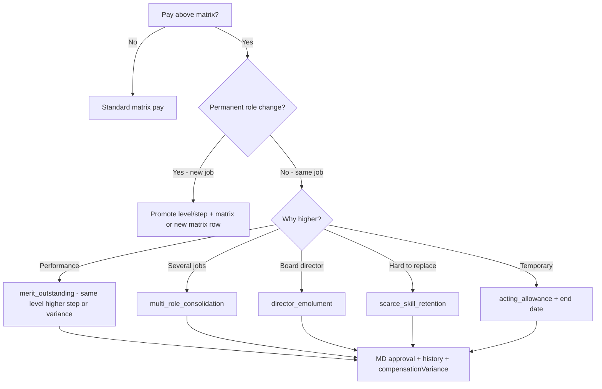

---

## 6. Multi-role compensation (one person, many hats)

**Problem:** Head Accountant (Level 5) also Acting BM Kaduna + Cashier; pay reflects all three.

**Solution:**

| Element | Treatment |
|---------|-----------|
| Primary designation | Head Accountant |
| Level/step | 5 / 1 (accountant ladder — not BM level unless promoted) |
| Secondary roles | Document in `employmentMeta.secondaryRoles` — no separate payroll rows |
| Pay | Single consolidated `base_salary_ngn` = matrix base + justified variance |
| Variance type | `multi_role_consolidation` |
| Alternative (future) | Split: matrix base + fixed **role allowance** line in `profile_extra_json.allowances[]` |

**Do not** create three salary profiles for one user.

---

## 7. Director who is young / pay above level (worked example)

**Profile pattern** (e.g. system builder at Kaduna):

| Attribute | Value |
|-----------|-------|
| Primary title | Head Accountant |
| Tenure | 6 years |
| Corporate | Director (board — document in `specialConditions`) |
| Operational hats | Acting Branch Manager (Kaduna); Cashier (Kaduna) |
| Structural level | 5 / 1 or 5 / 2 |
| Actual salary | Above Level 5 matrix |
| Grade G-band | G5–G6 from **actual pay** or board letter — can exceed level number |
| Young director | Board appointment does not require age or Level 7 — **pay is board/MD decision** |

**Why level stays 5 (not 7):**

- Level 7 is MD executive band in the internal ladder.
- Director ≠ MD; honest reporting shows "Director / Head Accountant at Level 5 with approved variance."
- When Kaduna gets a permanent BM, **remove acting hat** and **review variance** (reduce if roles drop).

**App permissions:** `finance_manager` for accounting; branch approvals via `sales_manager` or admin overrides until permanent BM is hired.

---

## 8. Special occasions (one-off)

| Occasion | Treatment |
|----------|-----------|
| **Annual bonus** | Separate payroll bonus run or `bonus_ngn` on payroll line — not permanent base |
| **One-off thank-you** | Welfare payment / expense — not base salary |
| **Emergency advance** | Loan request workflow — not salary change |
| **Permanent raise** | `applyHrSalaryIncrement` + history + variance if above matrix |

---

## 9. Payroll and audit controls (existing system)

| Control | Implementation |
|---------|------------------|
| Salary change audit | `hr_salary_history` + `hr_audit_events` |
| Increment UI | HR staff profile → Salary increment panel |
| MD special increment | Permission `hr.special_increment.approve` |
| Salary hold | `profile_extra_json.employmentMeta.salaryStatus` = `held` |
| Payroll source | Profile `base_salary_ngn` on locked runs |

---

## 10. Reporting (recommended)

When matrix automation is fully wired, reports should show:

| Report | Columns |
|--------|---------|
| **Matrix compliance** | employee, level, step, matrix pay, actual pay, variance, variance type |
| **Acting roles expiring** | name, role, branch, end date |
| **Directors off-ladder** | name, level, grade, variance type, review due |

---

## 11. Implementation backlog (optional future code)

Implemented in app (2026-06-15):

- Auto-fill profile pay from matrix on hire / designation change (`applyMatrixPay`, `resolveStaffCompensationForSave`)
- Block save when actual pay exceeds matrix without variance documentation
- `GET /api/hr/reports/salary-variance`, matrix lookup, org seed endpoints
- HR staff form: secondary roles, corporate title, variance fields, supplemental permissions merge
- Idempotent seed: `seedZarewaOrgStandard()` + group-specific matrix scales
- Legacy pay backfill UI (HR Settings → Organization)
- Bulk staff import optional org/comp columns (designation code, level/step, pay addition)
- Payslip PDF/CSV shows matrix breakdown + pay addition line
- Demo multi-role profile seed for reference Head Accountant pattern
- Bulk matrix revision apply (`POST /api/hr/compensation/apply-matrix-revision`) with Settings UI

In-app only: acting-role and compensation alerts appear on **HR Dashboard** and the notification bell.

---

## 12. Quick reference card

| Situation | Level | Pay | Document |
|-----------|-------|-----|----------|
| Normal staff | From designation | Matrix | History on change |
| Outstanding same job | Same or +step | Above matrix | `merit_outstanding` |
| Accountant + BM + cashier | Primary job level | Consolidated high | `multi_role_consolidation` |
| Young director | Primary job level | Board package | `director_emolument` + board letter |
| Acting BM | Unchanged primary | +allowance optional | `acting_allowance` + end date |
| Real promotion | New level | New matrix row | `Promotion to {title}` |

---

*Document version: 2026-06-15*


---

## SOURCE DOCUMENT — docs\HR\ZAREWA-ORG-STRUCTURE-AND-TITLES.md

*Path:* `c:/Users/USER/OneDrive/Desktop/Zarewa-backend-main/docs/HR/ZAREWA-ORG-STRUCTURE-AND-TITLES.md`

*The following content is included verbatim from the live project documentation corpus.*

# Zarewa Aluminium & Plastics — Organisation, Titles & Compensation Policy

**Status:** Approved organisational reference (brainstorm consolidated)  
**Audience:** MD, GM HR, HR Admin, system builders  
**Related:** [HR-IMPLEMENTATION-PLAN.md](./HR-IMPLEMENTATION-PLAN.md), [HR-POLICY-PAYROLL.md](./HR-POLICY-PAYROLL.md), [HR-POLICY-EMPLOYEE-LIFECYCLE.md](./HR-POLICY-EMPLOYEE-LIFECYCLE.md)

---

## 1. Purpose

This document defines how Zarewa organises **sites**, **functional offices**, **job titles**, and **pay grades** for a **small company** where many departments have **one person** (or one person wearing several hats).

It is the reference for:

- HR staff registration and designation catalog
- Salary matrix defaults (level + step)
- Title rules (Officer vs Assistant vs Acting)
- Multi-role staff (e.g. accountant + cashier + acting branch manager)
- Salary above the standard matrix (outstanding staff, directors, special cases)

---

## 2. Company sites (physical offices)

| Branch ID | Code | Name | Role |
|-----------|------|------|------|
| `BR-KD` | KD | **Kaduna (HQ)** | Head office — executive, group finance, HR, procurement hub |
| `BR-YL` | YL | **Yola Factory** | Production + branch operations |
| `BR-MDG` | MDG | **Maiduguri Factory** | Production + branch operations |

**Not active in standard model:** Jalingo (legacy — do not register new staff there).

**Letterhead / public addresses** (quotations, invoices):

- Kaduna Head Office — A1 Kaduna–Zaria Road, Unguwan Gwari, Kawo
- Yola Factory — Yola Numan Road
- Maiduguri Factory — Airport Road, Bulunkutu

---

## 3. Functional offices (workflow desks)

These are **routing queues** for memos, work items, and approvals — not separate buildings.

| Office key | Standard name | Typical owner (small Zarewa) |
|------------|---------------|------------------------------|
| `executive` | Managing Director's Office | MD |
| `office_admin` | General Administration | Admin / HR assistant |
| `branch_manager` | Branch Manager's Office | Branch Manager (or acting) |
| `sales` | Sales & Customer Service | Sales Officer / Assistant |
| `operations` | Operations & Store | Store Keeper / Ops Officer |
| `procurement` | Procurement & Supply | **MD** (+ Accountant support) |
| `finance` | Finance & Treasury | Head Accountant (+ branch Cashiers) |
| `hr` | Human Resources | GM HR / HR Officer |
| `maintenance` | Maintenance | Outsourced or supervisor doubles |
| `reports` | Management Information | MD / Accountant |

**Small-company rule:** Procurement is **owned by MD**; the **Head Accountant** handles PO paperwork, supplier follow-up, and payment preparation — there is no separate Procurement Manager until headcount grows.

---

## 4. Design principles

1. **One structure, three sites** — same titles everywhere; scope changes (HQ vs branch).
2. **Four pillars of rank** (keep separate):

   | Pillar | Field(s) | Meaning |
   |---------|----------|---------|
   | **Pay rank** | `payroll_group`, `salary_level`, `salary_step` | Position on the salary ladder |
   | **Grade band** | `promotion_grade` (G1–G7) | Classification / promotion track |
   | **Authority title** | `job_title`, `designation_id` | What the person may decide |
   | **Tenure** | `date_joined_iso`, `hr_salary_history` | Years of service — gates titles and pay steps |

3. **Title ≠ app login** — `role_key` controls software permissions; HR title controls org chart and reporting.
4. **Assistant** = same desk, **lower grade or not yet qualified** for the full Officer title.
5. **Acting** = **temporary** authority with a written end date (max 6 months) — not a permanent substitute for qualification.
6. **Sole occupant OK** — one Sales Officer at Yola is normal; they are still an **Officer**, not a "Manager" because they are alone.

---

## 5. Pay ladder (levels 1–7)

Default payroll group for most staff: **`branch_ops`**.

| Level | Handbook band (seed label) | Typical grade | Leave band |
|-------|---------------------------|---------------|------------|
| 1 | Cleaners / security / factory workers | G1 | Junior |
| 2 | Assistants / operators | G1–G2 | Junior |
| 3 | Officers (sales, store, cashier, HR) | G2–G3 | Junior / standard |
| 4 | Senior officers / Assistant Branch Manager | G3–G4 | Senior |
| 5 | Branch Manager / Head Accountant | G4–G5 | Senior |
| 6 | GM HR / senior managers | G5–G6 | Senior / executive |
| 7 | Managing Director | G6–G7 | Executive |

**Steps:** Step 1 = entry to level; Step 2 = experienced; Step 3 = long service / merit within level (before promotion to next level).

**Other payroll groups** (when applicable): `hq_admin`, `mining_div`, `scholarship`, `chairman_staffs`.

---

## 6. Title decision rule

```
IF pay level below Officer threshold for that desk
  → use Assistant / Trainee title
ELSE IF qualified and sole person on desk
  → use Officer title (not Manager)
ELSE IF senior backup to Branch Manager
  → Assistant Branch Manager
ELSE IF temporary cover with MD letter
  → Acting ___ (with end date)
ELSE IF runs branch
  → Branch Manager (Level 5+)
```

**Officer thresholds (default):**

| Desk | Full title from | Assistant below |
|------|-----------------|-----------------|
| Sales | Level 3 | Level 1–2 |
| Store / Operations | Level 3 | Level 1–2 |
| Cashier | Level 2–3 (with training) | Level 1–2 |
| Accountant | Level 4 + qualification | Assistant Accountant |
| Branch Manager | Level 5 + MD appointment | ABM / Acting BM only |
| HR Officer | Level 3–4 | HR Admin Assistant |

---

## 7. Standard designation catalog (25 titles)

Use these in **HR Settings → Designations** and staff registration.

### Executive & HQ

| # | Designation | Lvl/Step | Grade | Site | Reports to |
|---|-------------|----------|-------|------|------------|
| 1 | Managing Director | 7/1 | G6–G7 | HQ | Board |
| 2 | General Manager – Human Resources | 6/1 | G5–G6 | HQ | MD |
| 3 | Head Accountant | 5/1 | G4–G5 | HQ | MD |
| 4 | HR Officer | 3–4/1 | G3–G4 | HQ | GM HR |
| 5 | Admin / Office Assistant | 1–2/1 | G1–G2 | HQ | GM HR or MD |

### Branch leadership

| # | Designation | Lvl/Step | Grade | Site | Reports to |
|---|-------------|----------|-------|------|------------|
| 6 | Branch Manager | 5/1 | G4–G5 | Branch | MD |
| 7 | Assistant Branch Manager | 4/1 | G3–G4 | Branch | Branch Manager |
| 8 | Acting Branch Manager | 4–5/1 | G3–G5 | Branch | MD (temporary) |

### Sales

| # | Designation | Lvl/Step | Grade | Site | Reports to |
|---|-------------|----------|-------|------|------------|
| 9 | Sales Officer | 3/1 | G2–G3 | Branch | BM |
| 10 | Sales Assistant | 2/1 | G1–G2 | Branch | Sales Officer or BM |
| 11 | Senior Sales Officer | 4/1 | G3–G4 | Branch | BM |
| 12 | Sales Trainee | 1/1 | G1 | Branch | Sales Officer |

### Operations & production

| # | Designation | Lvl/Step | Grade | Site | Reports to |
|---|-------------|----------|-------|------|------------|
| 13 | Store Keeper / Operations Officer | 3/1 | G2–G3 | Branch | BM |
| 14 | Assistant Store Keeper | 2/1 | G1–G2 | Branch | Store Keeper |
| 15 | Production Supervisor | 3/1 | G2–G3 | Branch | BM |
| 16 | Machine Operator | 1–2/1 | G1–G2 | Branch | Production Supervisor |
| 17 | Factory Assistant | 1/1 | G1 | Branch | Production Supervisor |
| 18 | Senior Store Keeper | 4/1 | G3–G4 | Branch | BM |
| 19 | Acting Store Keeper | 2–3/1 | G2–G3 | Branch | BM (temporary) |

### Finance (branch)

| # | Designation | Lvl/Step | Grade | Site | Reports to |
|---|-------------|----------|-------|------|------------|
| 20 | Cashier | 2–3/1 | G2–G3 | Branch | Head Accountant |
| 21 | Assistant Cashier | 1–2/1 | G1–G2 | Branch | Cashier |
| 22 | Branch Accountant | 4/1 | G3–G4 | Branch | Head Accountant |

### Support

| # | Designation | Lvl/Step | Grade | Site | Reports to |
|---|-------------|----------|-------|------|------------|
| 23 | Driver | 1–2/1 | G1–G2 | All | BM or Admin |
| 24 | Security Guard | 1/1 | G1 | All | BM |
| 25 | Cleaner | 1/1 | G1 | All | Admin or BM |

**Growth titles** (now in catalog): Procurement Officer, Maintenance Manager, Deputy Branch Manager, Customer Service Officer.

---

## 8. Multi-role staff (small company)

When one person does several jobs, record **one primary designation** plus **secondary roles** in HR notes.

| Pattern | Primary designation | Secondary hats (profile notes / app roles) |
|---------|---------------------|---------------------------------------------|
| MD + procurement | Managing Director | Procurement approval; `md` role |
| Accountant + procurement support | Head Accountant | PO follow-up; `finance_manager` |
| Accountant + Kaduna BM + cashier | Head Accountant | Acting Branch Manager (Kaduna); Cashier (Kaduna desk) |
| Store keeper + production lead | Store Keeper / Ops Officer | Production coordination |
| BM + sales lead | Branch Manager | May approve own branch sales (single person) |

**Fields to use:**

- `designation_id` / `job_title` → **primary** title only
- `profile_extra_json.employmentMeta.secondaryRoles` → array of `{ role, branchId, acting, endDateIso }`
- `specialConditions` → free-text board/MD letter summary
- App `role_key` → union of permissions needed (e.g. `finance_manager` + branch duties via `sales_manager` or custom overrides)

---

## 9. Organograms

### 9.1 Company (small Zarewa)

```mermaid
flowchart TB
  MD["Managing Director<br/>(Executive + Procurement owner)"]

  subgraph HQ["Kaduna Head Office"]
    GMHR["GM HR / HR Officer"]
    HOA["Head Accountant<br/>(Finance + procurement support)"]
    CSH["Cashier"]
    ADM["Admin / Office Assistant"]
  end

  subgraph BM_KD["Kaduna branch desk"]
    BM_K["Acting BM / senior staff"]
    SO_K["Sales Officer / Assistant"]
    OPS_K["Store / Ops Officer / Assistant"]
  end

  subgraph BM_YL["Yola Factory"]
    BM_Y["Branch Manager"]
    ABM_Y["Assistant BM (optional)"]
    SO_Y["Sales Officer / Assistant"]
    SK_Y["Store Keeper / Assistant"]
    OP_Y["Operators / Factory Assistants"]
    CS_Y["Cashier / Assistant"]
  end

  subgraph BM_MG["Maiduguri Factory"]
    BM_M["Branch Manager"]
    SO_M["Sales Officer / Assistant"]
    SK_M["Store Keeper / Assistant"]
    OP_M["Operators / Factory Assistants"]
    CS_M["Cashier / Assistant"]
  end

  MD --> GMHR
  MD --> HOA
  MD --> BM_K
  MD --> BM_Y
  MD --> BM_M
  HOA --> CSH
  HOA -.->|"PO support"| MD
  BM_Y --> ABM_Y
  BM_Y --> SO_Y
  BM_Y --> SK_Y
  BM_Y --> OP_Y
  BM_Y --> CS_Y
  BM_M --> SO_M
  BM_M --> SK_M
  BM_M --> OP_M
  BM_M --> CS_M
```

### 9.2 Functional desks (who owns what)

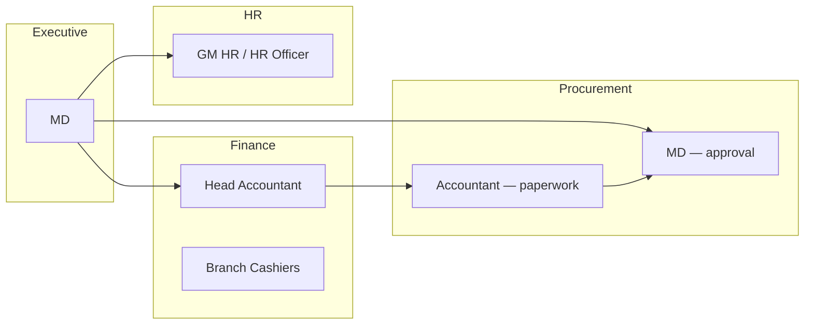

### 9.3 Typical factory branch (e.g. Yola)

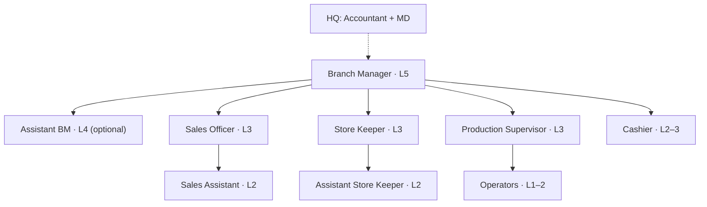

---

## 10. Compensation model (summary)

Full detail: **[ZAREWA-COMPENSATION-AND-EXCEPTIONS.md](./ZAREWA-COMPENSATION-AND-EXCEPTIONS.md)**

| Layer | Source | Purpose |
|-------|--------|---------|
| **Salary matrix** | `hr_salary_matrix` | Standard pay for `(payroll_group, level, step)` |
| **Staff profile pay** | `base_salary_ngn`, allowances on `hr_staff_profiles` | **Payroll source of truth** |
| **Salary history** | `hr_salary_history` | Audit trail; every change needs a **reason** |
| **Variance** | Actual pay > matrix for same level/step | Documented exception (merit, multi-role, director, retention) |

**Automation (target behaviour):**

1. New hire: designation sets default **level/step** → matrix fills default pay unless MD/HR overrides.
2. Annual increment: move step or level → matrix amount applied → history row.
3. Exception: actual pay stays above matrix → **`compensationVariance`** recorded; do not inflate level unless promotion is real.

---

## 11. Example: builder / Head Accountant with multiple hats (Kaduna)

**Scenario:** Staff member is **Head Accountant** at HQ, **Acting Branch Manager** and **Cashier** at Kaduna (no permanent BM), **company Director** (board appointment), **6 years** service, **pay above Level 5 matrix** because of skill, multi-role, and director emolument.

| Field | Recommended value |
|-------|-------------------|
| **Primary designation** | Head Accountant |
| **Primary level/step** | 5 / 1 (or 5 / 2 with merit step — not Level 7 unless promoted to MD) |
| **Secondary roles** | Acting Branch Manager (`BR-KD`, acting, review date); Cashier (`BR-KD`, operational) |
| **Corporate title** | Director — in `profile_extra` / `specialConditions`; **board letter on file** |
| **promotion_grade** | Set from **actual pay** (e.g. G5–G6) or explicit board grade — may exceed level number |
| **Actual salary** | Above matrix → variance type **`multi_role_director`** (see compensation doc) |
| **App roles** | `finance_manager` + branch permissions (`sales_manager` or documented overrides) |
| **Line manager** | MD |
| **Leave band** | Senior |

**Principles:**

- **Director** is a **governance title**, not automatically Level 7 pay or Branch Manager grade.
- **Young director / high pay** is valid when board + MD document it — separate from "years of service" ladder.
- **Do not** use "Branch Manager" as primary title if primary employment is Accountant — use **Acting Branch Manager (Kaduna)** as secondary hat.
- **Salary** reflects combined responsibility; level stays honest for HR reporting.

---

## 12. Import template (designations)

CSV for HR master data load — see [zarewa-designations-template.csv](./zarewa-designations-template.csv).

Columns: `code`, `title`, `department_code`, `default_salary_level`, `default_salary_step`, `grade_category`, `seniority_band`, `site_scope`, `notes`.

---

## 13. System mapping (when implementing)

| Policy concept | Database / UI |
|----------------|---------------|
| Designation | `hr_designations` |
| Department | `hr_departments` |
| Staff level/step | `hr_staff_profiles.salary_level`, `salary_step` |
| Matrix | `hr_salary_matrix` |
| Pay on profile | `base_salary_ngn`, `housing_allowance_ngn`, `transport_allowance_ngn` |
| Grade | `promotion_grade` |
| History | `hr_salary_history` via increment panel |
| Special cases | `profile_extra_json`, `specialConditions`, salary change **reason** |
| Multi-role | `profile_extra_json.employmentMeta.secondaryRoles` |
| Payroll compute | `computePayrollRun` reads **profile** amounts |

---

## 14. Review cycle

- **Annually:** MD + GM HR review matrix and designation catalog.
- **On promotion:** Update level/step; apply matrix or documented exception.
- **On acting appointment:** Set end date; review before expiry.
- **On board director change:** Update `specialConditions`; compensation via MD/board approval.

---

*Document version: 2026-06-15 — consolidated from organisational design sessions.*


---

## SOURCE DOCUMENT — docs\MATERIAL_EXCEPTIONS_SOP.md

*Path:* `c:/Users/USER/OneDrive/Desktop/Zarewa-backend-main/docs/MATERIAL_EXCEPTIONS_SOP.md`

*The following content is included verbatim from the live project documentation corpus.*

# Material exceptions & offcut control — SOP

## Purpose

Control coil stain, production error, customer return, yard offcut, and supplier defect with:

- Branch manager approval before stock posts
- Per-incident offcut number (`MEX-…`)
- Printable register copy for the physical offcut book
- Traceability from coil → incident → production use

## Roles

| Role | Actions |
|------|---------|
| Storekeeper / operations | Create draft, lines, kg, evidence, submit |
| Branch manager | Approve (posts stock), reject, unlock edits, void |
| Production | Issue metres from posted incidents on job complete |
| Sales | View offcut availability on quotation (guidance only) |
| MD / reports | Loss and pending approval counts |

## Workflow

1. **Operations → Material exceptions → New incident**
2. Enter type, coil/quotation/job links, roll lines (length × qty), before/after kg, storekeeper + operator names.
3. **Save draft** → **Print** (draft watermark) for yard file if needed.
4. **Submit** → branch manager queue.
5. **Approve & post** → coil kg reduced (if applicable), metres added to incident pool balance.
6. **Production** → pick incident(s) when using offcut stock metres; completion shows “supplied from offcut”.
7. **Customer return** → choose sellable FG or offcut pool; optional **Create refund request**.

## Incident types

- **Coil stain** — after unwind; kg off coil + metres to offcut pool.
- **Production error** — requires production job ID.
- **Customer return** — sellable restores FG metres; otherwise offcut pool.
- **Yard offcut** — pool inward (trim/scratch).
- **Supplier defect** — supplier resolution + optional kg remove.

## Anti-theft controls

- No delete — void with reason (manager).
- Pool balance = posted metres minus issues (per incident).
- All stock movement via audited `coil_control_events` linked to `MEX` id.
- Edit after post requires manager unlock + audit log.

## Reports

- `GET /api/material-incidents/reports/loss` — loss by type/reason
- MD operations pack includes `materialIncidentsPendingApproval`


---

## SOURCE DOCUMENT — docs\MONTH_END_CLOSE.md

*Path:* `c:/Users/USER/OneDrive/Desktop/Zarewa-backend-main/docs/MONTH_END_CLOSE.md`

*The following content is included verbatim from the live project documentation corpus.*

# Month-end close — Finance Reconciliation & Cash Confirmation Pack (Phase A1)

## What this pack is

`GET /api/finance/reconciliation-pack?period=YYYY-MM` returns a **read-only, management draft** operational tie-out for a calendar month. It compares:

- **Confirmed sales receipts** (`sales_receipts`, excluding reversed where status exists)
- **Customer ledger receipt-like activity** (`ledger_entries`: RECEIPT, ADVANCE_IN, RECEIPT_REVERSAL)
- **Treasury customer inflows** (`treasury_movements`: RECEIPT_IN, ADVANCE_IN)
- **GL month activity** on cash (1000) and AR (1200) from posted journals
- **Treasury movement summary** by type (`getCashFlowPack`)

Permission: `finance.view`.

Response status: `management_draft`. This is **not** statutory reconciliation or audited financial reporting.

## Why receipt confirmation is the primary cash control

Zarewa’s daily operations rely on **cashier / receipt confirmation**: staff confirm what was actually paid and recorded against customers. That operational control is the practical basis for trusting collections in Phase A.

The pack is designed to **strengthen visibility** around that control by lining up receipts, ledger, treasury, and GL activity — not to replace cashier discipline.

## Receipt confirmation vs formal bank reconciliation

| Control | Owner | Phase A status |
|--------|--------|----------------|
| Receipt confirmation / cashier confirmation | Finance / Cashier / Treasury | **Primary** — reflected in this pack |
| Customer ledger & treasury tie-out | Cashier + Head of Accounts review | **In pack** |
| GL cash/AR month activity | Head of Accounts | **In pack** (activity, not bank balance) |
| Bank statement line import / daily bank line queue | Treasury (when working) | **Partial / future** — do not treat as primary for Phase A |

Formal bank reconciliation UI remains on **Account → Receipts & recon** but is **not** the driver of this pack. Known limitation: bank line workflow may be incomplete; MD and Head of Accounts should treat variances against **receipt confirmation**, not assumed bank-file completeness.

## Role split

| Function | Responsibility |
|----------|----------------|
| **Head of Accounts** (Accounting) | GL, journals, chart of accounts, reconciliation review, financial reports, month-end close, payroll posting coordination, accounting controls |
| **Cashier / Treasury** (Finance) | Receipt confirmation, actual cash/bank movement, treasury accounts, payment execution after approval, refund payout confirmation, daily collections, payment evidence |
| **MD** | Audit/control oversight, exception review, high-value approval, audit trail monitoring |

## What to review monthly (Phase A1)

1. Load the pack for the closing month (`Reports` → **Finance Reconciliation & Cash Confirmation Pack**).
2. Compare **confirmed sales receipts** vs **ledger receipt-like** vs **treasury customer inflow** — investigate warnings.
3. Review **GL 1000 / 1200 month activity** with Head of Accounts (remember: period activity, not bank or full AR balance).
4. Scan **treasury movement summary** for unexpected types or signs.
5. Read **notes** (including “Requires Head of Accounts review” and formal bank reconciliation pending).
6. Continue separate month-end tasks: period lock, stock register, payroll GL export, AP bridge (ordered vs received) — see accounting policies doc.

## Known limitations

- GL figures in the pack are **period journal activity**, not point-in-time control account balances.
- Treasury movements are **not branch-scoped** in the schema; branch filter applies to receipts/ledger where `branch_id` exists.
- No trade payables GL tie-out, inventory tie-out, or payroll liability tie-out in Phase A1.
- Customer receipt GL posting model (Dr 1000 / Cr 1200 on receipt) may differ from quotation-based AR — variances can be expected until policy alignment.
- Pack does **not** enforce period locks on read; locking still blocks backdated writes via `assertPeriodOpen`.
- **No data is changed** by calling this endpoint.

## API example

```
GET /api/finance/reconciliation-pack?period=2026-05
GET /api/finance/reconciliation-pack?period=2026-05&branchId=BR-YL
```

Invalid period → `400` with `{ "ok": false, "error": "Invalid period. Use YYYY-MM." }`.

## Related docs

- [ACCOUNTING_POLICIES.md](./ACCOUNTING_POLICIES.md) — PO ordered / received / paid bridge
- [FINANCE_STANDARD_REPORTS.md](./FINANCE_STANDARD_REPORTS.md) — operational report endpoints
- [REGRESSION_ACCOUNT_FINANCE.md](./REGRESSION_ACCOUNT_FINANCE.md) — manual regression after finance changes

## Phase A roadmap (after A1)

- **A2** — Draft statements pack (P&amp;L, balance sheet, labelled management draft)
- **A3** — Data-quality checks (null coil costs, missing GL sources, etc.)
- **A4** — Month-end checklist endpoint
- **A5** — AP received-basis correction (separate approval; not part of A1)


---

## SOURCE DOCUMENT — docs\OFFICE_OPERATIONS_RUNBOOK.md

*Path:* `c:/Users/USER/OneDrive/Desktop/Zarewa-backend-main/docs/OFFICE_OPERATIONS_RUNBOOK.md`

*The following content is included verbatim from the live project documentation corpus.*

# Office operations runbook (roles)

This complements the in-app workspace and Settings. It reflects the approval and filing behaviour implemented for multi-branch office control.

## Branch manager (`sales_manager`)

- Approves **payment requests** up to the **expense threshold** (default ₦200,000) when you have `finance.approve`.
- Above that amount, **MD/CEO** (or admin) must approve.
- Use **Workspace → Unfiled** to clear items missing a **filing reference** after completion.
- **Inter-branch requests**: create via `POST /api/office/inter-branch-requests` (UI can be wired later); only branch managers create them.

## Finance manager (`finance_manager`)

- **Pays** approved payment requests (`finance.pay`).
- **Does not** final-approve routine branch expenses under the threshold unless you are also an executive or branch manager role (segregation).
- Refunds: follow existing `refunds.approve` / `finance.approve` gates; amounts **above** the refund threshold (default ₦1,000,000) need executive sign-off.

## Managing Director (`md`)

- Approves high-value payment requests and large refunds per thresholds.
- **Reports**: `GET /api/reports/md-operations-pack?month=YYYY-MM` (requires `hq.view_all_branches`, `*`, or `md` role) for exception-oriented monthly counts.
- **Governance**: thresholds are editable under **Settings → Governance → Office approval thresholds** (`settings.view`).

## Cashier

- **No disbursement** without an **Approved** payment request (unchanged server rule). Petty cash must still go through the request workflow.

## Administrator

- Maintains org-wide limits and full audit export from Settings where permitted.

## Filing references

- On **Approve** for payment and refund work items, the API issues a **`ZR/{branch}/{domain}/{year}/{seq}`** reference into `work_item_filing` when a persisted work item exists.

## Backdating

- Approval dates **before today** return **warnings** in the API response; they do not block unless period lock rules apply.


---

## SOURCE DOCUMENT — docs\OPERATIONAL_CLICK_TESTING.md

*Path:* `c:/Users/USER/OneDrive/Desktop/Zarewa-backend-main/docs/OPERATIONAL_CLICK_TESTING.md`

*The following content is included verbatim from the live project documentation corpus.*

# Operational UI click testing (Playwright)

## Prerequisites

1. **MySQL** running on `127.0.0.1:3306` (XAMPP, MariaDB, or MySQL Installer on Windows).
2. Repo-root **`.env`** from `.env.example` with `ZAREWA_MYSQL_PASSWORD` set.
3. E2E database (created automatically on first run): `zarewa_e2e`.
4. **Frontend path** (sibling folder is not named `frontend` on this machine):

```powershell
$env:ZAREWA_FRONTEND_ROOT="C:\Users\USER\OneDrive\Desktop\Zarewa-frontend-main"
```

5. **Playwright browsers** (once): `npx playwright install chromium`

E2E starts Vite with `VITE_OFFICE_DESK_V2=1` so workspace tests hit the Online Office desk (not legacy Gmail UI).

```powershell
cd Zarewa-backend-main
copy .env.example .env
# Edit ZAREWA_MYSQL_PASSWORD
npm run wipe:e2e-db   # optional fresh E2E data
```

## Run click tests

```powershell
cd Zarewa-backend-main
npm run test:e2e -- e2e/workspace-office-desk.spec.js
npm run test:e2e -- e2e/smoke.spec.js
npm run test:e2e -- e2e/operational-scenarios-click.spec.js
```

All three together (~15–25 min first run while Vite + API start):

```powershell
npm run test:e2e -- e2e/workspace-office-desk.spec.js e2e/smoke.spec.js e2e/operational-scenarios-click.spec.js
```

## What each pack covers

| Spec | Clicks |
|------|--------|
| `workspace-office-desk.spec.js` | Desk nav, create record, HQ block, forum→wizard, notices ack, action bar |
| `smoke.spec.js` | Login, sidebar modules, settings governance, procurement role |
| `operational-scenarios-click.spec.js` | All core modules + sales/procurement/ops/finance shells |

## If MySQL is not running

Playwright fails with `ECONNREFUSED 127.0.0.1:3306` or `Timeout waiting for .../api/health`.

Start MySQL service, then re-run. There is no SQLite mode for E2E — only Vitest pure tests work offline.

## 500-case SOP matrix (different batch)

Second half of the operational FAQ catalog (entries 500–999) — not the workspace/smoke/operational-click packs:

```powershell
$env:ZAREWA_FRONTEND_ROOT="C:\Users\USER\OneDrive\Desktop\Zarewa-frontend-main"
npm run test:e2e:sop-matrix-500
```

Uses `playwright.sop-matrix.config.js` with 4 workers and saved admin auth (`e2e/.auth/admin.json`).

## Map to ~1,000 Zare SOPs

Each Playwright test is a **golden path**; full SOP list lives in `shared/lib/helpOperationalCatalog.js` (111 topics × ~9 phrasings). Use the canvas `zarewa-roofing-ux-scenarios` for manual walkthrough of the rest.


---

## SOURCE DOCUMENT — docs\OPERATIONS_MANUAL.md

*Path:* `c:/Users/USER/OneDrive/Desktop/Zarewa-backend-main/docs/OPERATIONS_MANUAL.md`

*The following content is included verbatim from the live project documentation corpus.*

# Zarewa Operations & IT Manual

**Version:** 1.0  
**Scope:** Full system — business operations and IT administration  
**Audience:** Branch staff, finance, operations, HR, executives, and system administrators  

This is the **consolidated master manual** for Zarewa. It describes how the live system behaves (UI, API, permissions, and controls). Domain-specific deep dives remain in linked documents under `docs/` — this manual ties them together.

---

## Table of contents

1. [System overview](#1-system-overview)
2. [Architecture](#2-architecture)
3. [Daily use — sign-in and navigation](#3-daily-use--sign-in-and-navigation)
4. [Roles, permissions, and segregation of duties](#4-roles-permissions-and-segregation-of-duties)
5. [Cross-cutting rules](#5-cross-cutting-rules)
6. [Module procedures — business operations](#6-module-procedures--business-operations)
   - [6.1 Dashboard and workspace](#61-dashboard-and-workspace)
   - [6.2 Sales and customers](#62-sales-and-customers)
   - [6.3 Quotations, cutting lists, and pricing](#63-quotations-cutting-lists-and-pricing)
   - [6.4 Customer finance — receipts, advances, corrections](#64-customer-finance--receipts-advances-corrections)
   - [6.5 Customer refunds](#65-customer-refunds)
   - [6.6 Procurement and suppliers](#66-procurement-and-suppliers)
   - [6.7 Operations, inventory, and production](#67-operations-inventory-and-production)
   - [6.8 Material exceptions and offcuts](#68-material-exceptions-and-offcuts)
   - [6.9 Finance, treasury, and GL](#69-finance-treasury-and-gl)
   - [6.10 Office, work items, and edit approvals](#610-office-work-items-and-edit-approvals)
   - [6.11 Reports and analytics](#611-reports-and-analytics)
   - [6.12 Human resources](#612-human-resources)
   - [6.13 Settings and master data](#613-settings-and-master-data)
   - [6.14 Executive views](#614-executive-views)
7. [IT operations](#7-it-operations)
   - [7.1 Prerequisites and repositories](#71-prerequisites-and-repositories)
   - [7.2 Environment configuration](#72-environment-configuration)
   - [7.3 Deployment models](#73-deployment-models)
   - [7.4 Database, migrations, and seeding](#74-database-migrations-and-seeding)
   - [7.5 Backup and recovery](#75-backup-and-recovery)
   - [7.6 Health checks and degraded mode](#76-health-checks-and-degraded-mode)
   - [7.7 Updates and release verification](#77-updates-and-release-verification)
   - [7.8 Security hardening](#78-security-hardening)
   - [7.9 Scripts and maintenance tools](#79-scripts-and-maintenance-tools)
   - [7.10 Testing and QA gates](#710-testing-and-qa-gates)
   - [7.11 Incident response](#711-incident-response)
8. [Appendix A — Role quick reference](#appendix-a--role-quick-reference)
9. [Appendix B — Application route map](#appendix-b--application-route-map)
10. [Appendix C — Related documents index](#appendix-c--related-documents-index)

---

## 1. System overview

**Zarewa** is an integrated operations platform for a multi-branch roofing / building-materials business. It covers:

| Domain | Primary users | What the system tracks |
|--------|---------------|------------------------|
| Sales | Sales officers, branch managers | Customers, quotations, cutting lists |
| Customer finance | Sales, cashier, finance | Receipts, advances, ledger, refunds |
| Procurement | Operations, MD, finance | Suppliers, POs, GRN, supplier payments |
| Production & inventory | Operations, storekeepers | Coil register, jobs, deliveries, stock |
| Finance & GL | Finance manager, cashier | Treasury, journals, bank reconciliation, period locks |
| Office | All staff with `office.use` | Threads, memos, payment/material requests, filing |
| HR | HR admin, GM HR, staff | Profiles, leave, loans, payroll, attendance |
| Reporting | Managers, finance, MD | Registers, month-end packs, MD operations pack |

**Technology stack**

- **Frontend:** React (Vite SPA) — routes in `Zarewa-frontend-main/src/App.jsx`
- **Backend:** Node.js + Express 5 — entry `server/index.js`, routes `server/httpApi.js`
- **Persistence:** SQLite file (default `data/zarewa.sqlite`) or MySQL when configured; migrations run on startup
- **Auth:** Server-side session cookies + CSRF on mutating requests; optional Firebase login
- **Shared logic:** `shared/` — ledger math, report cores, constants used by API and UI

**Branches**

- Each user works in a **workspace branch** (default Kaduna `BR-KD`).
- Document IDs embed branch codes, e.g. **QT-KD-26-0001** (quotation, Kaduna, year 26, sequence 0001).
- Suppliers and transport agents are **company-wide** (not branch-scoped).
- Most operational data (customers, quotations, coils, receipts) is **branch-scoped** unless the role has org-wide read (`hq.view_all_branches`).

---

## 2. Architecture

```
┌─────────────────────────────────────────────────────────────┐
│  Browser (React SPA)                                        │
│  Routes: /sales, /procurement, /operations, /accounts, …    │
│  Session: cookie + CSRF token                               │
└──────────────────────────┬──────────────────────────────────┘
                           │ HTTPS  /api/*
┌──────────────────────────▼──────────────────────────────────┐
│  Node.js API (Express)                                      │
│  auth.js · httpApi.js · domain ops modules · migrate.js     │
└──────────────────────────┬──────────────────────────────────┘
                           │
┌──────────────────────────▼──────────────────────────────────┐
│  Database (SQLite or MySQL)                                 │
│  Single file / schema with migrations + audit tables        │
└─────────────────────────────────────────────────────────────┘
```

**Deployment options**

| Model | When to use | Key settings |
|-------|-------------|--------------|
| **Combined** | Simplest production | API serves built `dist/` from same origin; `ZAREWA_STATIC_DIR` |
| **Split** | UI on CDN/static host, API on VM | `VITE_API_BASE`, `CORS_ORIGIN`, cookie SameSite rules |
| **Dev stack** | Local development | `npm run dev:stack` — API + Vite proxy |

See [SPLIT_DEPLOYMENT_AND_MIGRATION.md](./SPLIT_DEPLOYMENT_AND_MIGRATION.md) and [DEPLOYMENT.md](./DEPLOYMENT.md).

**Bootstrap model**

On login the SPA loads **`GET /api/bootstrap`** — a filtered snapshot of branches, permissions, master data, and lists the user may see. Direct API calls still enforce permissions; bootstrap filtering is not a security boundary.

---

## 3. Daily use — sign-in and navigation

### 3.1 Sign in

1. Open the Zarewa URL provided by IT.
2. Enter **username** and **password**, or use **Google sign-in** if Firebase is configured.
3. On success the app routes you by role:
   - **CEO** → `/exec` (executive summary only)
   - **MD / branch manager / finance / sales / operations / HR** → department home or dashboard
4. First login may require **password change** or **onboarding** steps.

**Forgot password:** use the reset flow on the login screen (token emailed or distributed per your IT policy).

### 3.2 Workspace branch

- Switch branch from the workspace header when your role allows multiple branches.
- Posting receipts, creating quotations, and most writes use the **current workspace branch**.
- Finance with `finance.cross_branch_post` may post to other branches under controlled rules.

### 3.3 Main navigation (SPA routes)

| Route | Module | Typical users |
|-------|--------|---------------|
| `/` | Home / dashboard | All |
| `/workspace/monitoring` | Workspace monitoring | Admin, managers |
| `/exec` | CEO executive dashboard | CEO |
| `/sales` | Sales desk | Sales, managers |
| `/customers`, `/customers/:id` | Customer CRM | Sales |
| `/procurement` | Procurement hub | Operations, MD, finance |
| `/operations` | Store & production | Operations |
| `/operations/material-exceptions` | Material incidents | Operations, managers |
| `/accounts` | Finance & accounts | Finance, cashier |
| `/accounts/bank-reconciliation` | Bank rec | Finance |
| `/reports` | Management reports | Managers, finance, MD |
| `/analytics` | Business intelligence | Management |
| `/office` | Office desk | All with `office.use` |
| `/edit-approvals` | Pending edit approvals | Managers |
| `/settings/*` | Administration | Admin, MD, finance |
| `/manager` | Branch manager dashboard | Branch managers |
| `/my-profile/*` | HR self-service | Staff |
| `/team-hr/*` | Team HR (managers) | Line managers |
| `/hr/*` | HR administration | HR admin, GM HR |
| `/price-list`, `/pricing-policy` | Pricing admin | MD, pricing roles |

Unauthorized routes redirect to `/` with a denial message.

### 3.4 Offline / degraded behaviour

If the API stops responding:

- The UI may show **“System offline”** with last synced workspace data.
- **Nothing new can be saved** until the API reconnects.
- Use **Try reconnect** or refresh after IT confirms the server is healthy.

---

## 4. Roles, permissions, and segregation of duties

### 4.1 Built-in roles

| Role key | Label | Summary |
|----------|-------|---------|
| `admin` | Administrator | Full access (`*`) |
| `md` | Managing Director | Org-wide strategic control, approvals, pricing, HR exec |
| `finance_manager` | Finance manager | Finance, treasury, GL, cross-branch posting, reports |
| `cashier` | Cashier | Receipts, treasury, payouts, limited approvals |
| `sales_manager` | Branch manager | Sales, operations, production, refunds approve, material incidents |
| `sales_staff` | Sales officer | Customers, quotations, receipts, refund requests |
| `operations_officer` | Operations officer | Procurement, inventory, production, material incident create |
| `hr_admin` | HR / Admin | HR directory, payroll prep, attendance |
| `gmhr` | GM HR | Org-wide HR, final leave/loan approvals |
| `ceo` | Chief Executive Officer | Executive dashboard and reports only — no line-level sales/finance |
| `viewer` | Read-only viewer | Dashboard view only |

Canonical permission lists: `server/auth.js` → `ROLE_DEFINITIONS`.  
Module visibility: [RBAC_MATRIX.md](./RBAC_MATRIX.md).

### 4.2 Segregation of duties (critical paths)

| Process | Create / request | Approve / confirm | Pay / execute |
|---------|------------------|-------------------|---------------|
| Customer refund | Sales (`refunds.request`) | Branch manager, MD, or finance (`refunds.approve` / `finance.approve`) | Finance (`finance.pay`) |
| Customer receipt | Sales / cashier (`receipts.post`) | Finance clearance / bank confirmation | Finance |
| Payment request (office) | Requester | Branch manager (≤ threshold) or MD (> threshold) | Finance pays approved request |
| Below-floor quotation → production | Branch manager records exception | MD confirms after production | — |
| Material incident | Operations creates | Branch manager approves & posts | — |
| Payroll lock | HR prepares run | MD sign-off required | HR locks & exports |
| Staff leave / loan | Employee self-service | HR → branch endorsement → GM HR | — |
| Bank reconciliation | Finance imports lines | Finance matches & posts | — |

Staff-facing summary: [STAFF_APPROVALS.md](./STAFF_APPROVALS.md).  
Technical matrix: [ACCESS_CONTROL.md](./ACCESS_CONTROL.md).

### 4.3 Demo accounts

Development databases ship seeded users (e.g. `admin`, `md`, `finance.manager`). **Change every password before production.** Never use demo credentials in live environments.

---

## 5. Cross-cutting rules

### 5.1 Document numbering

Operational IDs follow **PREFIX-BRANCH-YY-NNNN** (assigned in `server/humanId.js`):

| Prefix | Entity |
|--------|--------|
| `QT-` | Quotation |
| `CL-` | Cutting list |
| `RCP-` / ledger refs | Receipt |
| `PO-` | Purchase order |
| `MEX-` | Material exception |
| `ZR/` | Office filing reference |

With **`ZAREWA_EMPTY_SEED=1`** on a fresh database, numbering starts at **0001** per branch/year — recommended for production cutover.

### 5.2 Approval thresholds (office)

Configurable under **Settings → Governance → Office approval thresholds**:

- **Payment requests:** branch manager approves up to expense threshold (default **₦200,000**); above requires MD/admin.
- **Refunds:** executive sign-off above refund threshold (default **₦1,000,000**).

### 5.3 Filing references

On approval of payment/refund work items the API may issue **`ZR/{branch}/{domain}/{year}/{seq}`** into `work_item_filing`.

### 5.4 Accounting period locks

Back-dating into locked periods is blocked when period lock rules apply. Finance manages locks via `period.manage`.

### 5.5 Audit trail

Sensitive actions write to audit logs (refund create/review/pay, receipt reversals, material incident voids, HR changes). Use **Settings** or report exports for review.

### 5.6 Rate limits

Authenticated ledger money POSTs (receipt, advance, refund-advance) are rate-limited per user (default 45/minute). Configure via `ZAREWA_LEDGER_POST_MAX` and `ZAREWA_LEDGER_POST_WINDOW_MS`.

---

## 6. Module procedures — business operations

### 6.1 Dashboard and workspace

**Purpose:** Personal task queue, office desk, notifications, and cross-module search.

**Who:** All users with `dashboard.view`; office features need `office.use`.

**Procedure — daily workspace check**

1. Sign in and confirm **workspace branch** is correct.
2. Open **Office** (`/office`) or home dashboard.
3. Review **inbox / task queue** — payment requests, material requests, unfiled items.
4. Clear **Unfiled** items by attaching filing references after completion.
5. Use **workspace search** (authenticated; results filtered by permission) to find customers, quotations, coils.

**Office desk operations**

- Create office records (memos, payment requests, material requests) via wizard or compose templates.
- **Inter-branch requests:** branch managers create via API/UI; tracked as work items.
- **AI assist** (optional): memo polish and filing extract when `ZAREWA_AI_API_KEY` is set; works from local knowledge base without AI.

**Runbook:** [OFFICE_OPERATIONS_RUNBOOK.md](./OFFICE_OPERATIONS_RUNBOOK.md)

---

### 6.2 Sales and customers

**Purpose:** Maintain customer master data and sales pipeline entry point.

**Permissions:** `sales.view`, `customers.manage`, `quotations.manage`

**Procedure — new customer**

1. Go to **Sales** or **Customers**.
2. Create customer with legal name, phone (used as dedupe key), branch, and contact details.
3. Verify no duplicate phone exists (system warns on duplicates).

**Procedure — customer dashboard**

1. Open customer from list → `/customers/:customerId`.
2. Review quotations, ledger balance, advances, and refund history.
3. Use customer context when creating new quotations or receipts.

**Controls**

- Customer data is branch-scoped for most roles.
- CEO role cannot access customer line screens (executive summary only).

---

### 6.3 Quotations, cutting lists, and pricing

**Purpose:** Commercial offer → production release → delivery tracking.

**Permissions:** `quotations.manage`, `production.manage`, `production.release`, `deliveries.manage`

**Procedure — create quotation**

1. From Sales, select customer → **New quotation**.
2. Add line items (product, gauge, colour, metres, pricing).
3. System validates against **price list** and **material pricing workbook** floors.
4. Save quotation → receives ID e.g. `QT-KD-26-0042`.

**Procedure — cutting list**

1. From quotation, create **cutting list** when customer payment threshold met (branch `cutting_list_min_paid_fraction`, default 70%).
2. Cutting list date drives **production-attributed revenue** in reports.
3. Operations uses cutting list for coil allocation and job creation.

**Below-floor pricing exception**

1. If quotation is below floor, save is **allowed** with a warning.
2. **Managing Director or administrator** records approval (`md.price_exception.approve`).
3. **Cutting list** and **production** may proceed after MD approval.

**Substitution / accessory rules**

- Substitution credits require correct FG product, gauge/colour, and price list resolution.
- Accessory shortfalls appear in refund preview logic.

**Pricing admin**

- **Price list:** `/price-list` — requires `pricing.manage` (typically MD).
- **Pricing policy:** `/pricing-policy` — `pricing.policy.manage`.

---

### 6.4 Customer finance — receipts, advances, corrections

**Purpose:** Record money in, maintain customer ledger, align with treasury.

**Permissions:** `receipts.post`, `finance.post`, `finance.pay`, `finance.reverse`

**Standard posting flow**

1. Open quotation in Sales or Finance.
2. Review **blue history section** — already-posted receipts are **read-only**.
3. Enter **only new money** in editable lines (today's bank/cash inflow).
4. Add specific reference text (transfer ref, POS slip, deposit detail).
5. **Post receipt** → system creates ledger entry and treasury movement (pending clearance).
6. Confirm receipt ID and amount match physical evidence.

**Finance clearance**

1. Finance opens **Finance & accounts → Receipts**.
2. Each new receipt posts as **Pending clearance** until Finance saves settlement with **bank/cash received** amount.
3. Refunds on a quotation are **blocked** until all receipts on that quote are **Cleared**.

**High-value control**

- Payments **≥ ₦100,000** require amount typed twice (confirm amount) in Sales.

**Correction workflow (wrong or duplicate posting)**

1. Detect issue from **Reports → exception queue** (receipt/treasury mismatch, paid discrepancy).
2. Gather bank/cash evidence.
3. **Reverse** the mistaken posting (do not overwrite history).
4. Verify treasury net corrected for that source.
5. **Re-post** only the true new amount.
6. Confirm quotation `paidNgn` and balance due match expected values.
7. Close queue item with note and owner initials.

**Duplicate override**

- System blocks duplicate-like posts by default.
- Override only with valid business reason and **audit-captured override reason**.

**Deep references**

- [PAYMENT_POSTING_SOP.md](./PAYMENT_POSTING_SOP.md)
- [PAYMENT_POSTING_RUNBOOK.md](./PAYMENT_POSTING_RUNBOOK.md)
- [ACCOUNTING_POLICIES.md](./ACCOUNTING_POLICIES.md) — revenue vs cash definitions

**Cadence**

| Frequency | Action |
|-----------|--------|
| Daily | Clear new payment exceptions |
| Weekly | Finance lead reviews aged exceptions (> 7 days) |
| Month-end | Unresolved queue zero or approved carry-forward notes |

---

### 6.5 Customer refunds

**Purpose:** Return customer money with approval chain and treasury payout.

**Permissions:** `refunds.request`, `refunds.approve`, `finance.pay`

**Procedure — request refund**

1. From quotation or customer dashboard, open **Refund request**.
2. Select category (overpayment, unproduced metres, substitution, transport/installation, order cancellation, etc.).
3. Review system-suggested lines — **starting points only**; verify against evidence.
4. Submit → status **Pending**.

**Procedure — approve refund**

1. Approver (branch manager, MD, or finance with approve permission) opens pending refund.
2. Complete **Approver checklist:**
   - Quote total matches commercial agreement.
   - Paid amount + advance matches receipts/ledger (use **Sync paid from receipts** if needed).
   - Produced metres and deliveries match customer claim.
   - Read **System audit flags** and **Logic & integrity warnings**.
   - Calculated total aligns with requested/approved amount.
   - Evidence on file (notes, photos, signed acknowledgements).
3. Save decision → **Approved**.

**Procedure — pay refund**

1. Finance executes payout via treasury (`finance.pay`).
2. Payout cannot exceed approved balance; staged payouts allowed.
3. Verify treasury movement (`REFUND` / `REFUND_PAYOUT` sources) matches bank records.

**Blocked scenarios**

- Order cancellation **after delivery** is blocked by design.
- Duplicate **same category** on same quote rejected.

**Governance defaults**

| Topic | Baseline |
|-------|----------|
| Single approval cap | Escalate to MD above **₦500,000** (adjust locally) |
| Second pair of eyes | Finance pays only after approval |
| High-value sample | Monthly reconcile all refunds **> ₦1,000,000** |

**Deep reference:** [REFUND_OPERATIONS.md](./REFUND_OPERATIONS.md)

---

### 6.6 Procurement and suppliers

**Purpose:** Source materials, manage PO lifecycle, receive goods, pay suppliers.

**Permissions:** `procurement.view`, `purchase_orders.manage`, `suppliers.manage`, `inventory.receive`

**Procedure — purchase order**

1. Open **Procurement** → create PO for supplier (company-wide master).
2. Add line items (coil, stone, transport, accessories — line types in `poLineTypes`).
3. Submit / approve per local policy.
4. PO ordered value = line qty × agreed prices.

**Procedure — goods receipt (GRN)**

1. On physical receipt, post **GRN** against PO lines.
2. System records `received_at_iso`, derives **landed cost** and **unit cost per kg**.
3. Coil lots enter branch inventory register.

**Procedure — supplier payment**

1. Finance posts supplier payment linked to PO/treasury.
2. Three-way match for month-end: **ordered vs received vs paid**.

**Transport agents**

- Managed at `/procurement/transport-agents/:agentId` — company-wide.

**Stone / accessory procurement**

- Separate flows for stone POs and accessory fulfillment; operations receives into stock.

**Reports**

- Purchases register supports cut by **received**, **ordered**, or **paid** date — see [FINANCE_STANDARD_REPORTS.md](./FINANCE_STANDARD_REPORTS.md).

---

### 6.7 Operations, inventory, and production

**Purpose:** Coil control, production jobs, deliveries — **authoritative operational truth**.

**Permissions:** `operations.view`, `operations.manage`, `production.manage`, `production.release`, `deliveries.manage`, `inventory.receive`, `inventory.adjust`

**Procedure — coil register**

1. Open **Operations** → coil register / coil detail (`/operations/coils/:coilNo`).
2. Track kg, metres, colour, gauge, reservation, and control events.
3. GRN posts increase stock; production consumption decreases.

**Procedure — production job**

1. From cutting list or production queue, create/start job.
2. **Allocate** coil metres to job lines.
3. **Start** production → record progress.
4. On **complete**, record produced metres; offcut/incident metres may be sourced from material exception pool.
5. **Manager review** where policy requires before release.

**Procedure — delivery**

1. Operations confirms delivery / produced status — **not Sales**.
2. Sales sees status read-only where enforced.
3. Delivery truth affects refund eligibility (cancellation after delivery blocked).

**Coil import**

- Settings → Coil register import for bulk opening balances or migrations.

**Controls**

- Coil movements audited via `coil_control_events`.
- Reservation reconciliation scripts available for IT (`db:reconcile-coil-reservation`).

---

### 6.8 Material exceptions and offcuts

**Purpose:** Control stain, production error, customer return, yard offcut, supplier defect with manager approval before stock posts.

**Permissions:** `material_incidents.create`, `material_incidents.approve`

**Workflow**

1. **Operations → Material exceptions → New incident**
2. Enter type, coil/quotation/job links, roll lines, before/after kg, storekeeper + operator names.
3. **Save draft** → **Print** (draft watermark) for yard file if needed.
4. **Submit** → branch manager queue.
5. **Approve & post** → coil kg reduced (if applicable), metres added to incident pool.
6. **Production** picks incident(s) when using offcut stock; completion shows “supplied from offcut”.
7. **Customer return:** choose sellable FG or offcut pool; optional **Create refund request**.

**Anti-theft controls**

- No delete — **void** with reason (manager).
- Pool balance = posted metres minus issues.
- Edit after post requires manager unlock + audit log.

**Deep reference:** [MATERIAL_EXCEPTIONS_SOP.md](./MATERIAL_EXCEPTIONS_SOP.md)

---

### 6.9 Finance, treasury, and GL

**Purpose:** Company money control, GL, bank reconciliation, period close.

**Permissions:** `finance.view`, `finance.post`, `finance.pay`, `finance.approve`, `finance.reverse`, `treasury.manage`, `period.manage`

**Treasury**

- All disbursements require approved payment request or refund (cashier cannot pay without approval).
- Receipt posting creates treasury movements; finance clears against bank.

**Bank reconciliation**

1. **Finance & accounts → Bank reconciliation**
2. Import via **CSV** or **JSON** (up to 500 lines per batch).
3. Match lines to receipts, expenses, supplier payments.
4. Review unmatched items weekly; executive summary shows lines in **Review** status.

**General ledger**

- Chart of accounts seeded; journals posted with `period_key` = `YYYY-MM`.
- GRN with landed cost may auto-post **Dr Inventory, Cr GRNI**.
- Payroll locked runs export **GL journal CSV** for salary expense, PAYE, pension, net pay.

**Inter-branch loans**

- MD approval for inter-branch loan requests (`inter_branch_loan.md_approve`).

**Accounting policies**

- Revenue recognition, AR, purchases, expenses — [ACCOUNTING_POLICIES.md](./ACCOUNTING_POLICIES.md)

**Payment request execution**

1. Requester creates in Office or expenses module.
2. Approver per threshold (branch manager / MD).
3. Finance pays approved request — records treasury outflow.

---

### 6.10 Office, work items, and edit approvals

**Purpose:** Internal correspondence, structured requests, and controlled edits to locked records.

**Office threads**

- Create thread → add messages → convert to payment/material request where applicable.
- AI polish/filing when configured.
- Clear **Unfiled** queue after attaching filing reference.

**Edit approvals**

- Route: `/edit-approvals`
- When a locked field needs change, submit edit approval; authorized manager approves/rejects.

**Filing format:** `ZR/{branch}/{domain}/{year}/{seq}`

**Runbook:** [OFFICE_OPERATIONS_RUNBOOK.md](./OFFICE_OPERATIONS_RUNBOOK.md)

---

### 6.11 Reports and analytics

**Purpose:** Management reporting, month-end packs, exception detection.

**Permissions:** `reports.view` + management role for `/api/reports/*` (see `userMayViewManagementReports` in `server/auth.js`). `finance_manager` included.

**Key reports**

| Report / endpoint | Use |
|-------------------|-----|
| Receipts register | Cash in by date |
| Revenue / production | Production completion attribution |
| AR as-at | Outstanding by quotation |
| Sales bridge | Receipts + production cutoff |
| Expenses pack | Posted expenses |
| Refunds pack | Paid vs pipeline |
| Purchases (ordered/received/paid) | Procurement three-way |
| Stock coil as-at | Inventory snapshot |
| MD operations pack | Monthly exception counts for MD |

**Coil snapshot**

- Finance/report role captures point-in-time coil register: `POST /api/reports/coil-snapshot-capture` with `{ asAtISO }`.

**Exception queues (operational priority)**

1. Receipt/treasury mismatches
2. Quotation paid discrepancies
3. Material incidents pending approval
4. Bank rec lines in Review
5. Payroll drafts without MD sign-off

**Deep reference:** [FINANCE_STANDARD_REPORTS.md](./FINANCE_STANDARD_REPORTS.md), [REPORT_PRINT_STANDARD.md](./REPORT_PRINT_STANDARD.md)

**Analytics**

- `/analytics` — Business intelligence dashboards (management permissions).

---

### 6.12 Human resources

**Purpose:** Employee lifecycle, leave, loans, payroll, attendance, discipline, recruiting.

**Module routes**

- `/my-profile/*` — self-service (leave, loans, payslips where eligible)
- `/team-hr/*` — line manager team view
- `/hr/*` — HR administration
- `/careers` — public job listings (no auth)

**Leave / loan workflow**

| Step | Actor | Permission |
|------|-------|------------|
| Draft / submit | Employee | Self-service + own HR file |
| HR triage | HR officer | `hr.requests.hr_review` |
| Branch endorsement | Branch manager | `hr.branch.endorse_staff` |
| GM HR final | GM HR | `hr.requests.gm_approve` |

**Payroll**

1. HR prepares draft run (`hr.payroll.manage`).
2. **MD must sign off** draft (`hr.payroll.md_approve`) before lock.
3. HR locks run → export payslips / GL journal CSV.
4. GM HR may also approve via `hr.payroll.gm_approve` where configured.

**Attendance**

- Upload and daily roll marking per branch (`hr.attendance.upload`, `hr.daily_roll.mark`).

**HR policies (detailed)**

- [HR/HR-POLICY-LEAVE.md](./HR/HR-POLICY-LEAVE.md)
- [HR/HR-POLICY-PAYROLL.md](./HR/HR-POLICY-PAYROLL.md)
- [HR/HR-POLICY-ATTENDANCE.md](./HR/HR-POLICY-ATTENDANCE.md)
- [HR/HR-POLICY-RECRUITING.md](./HR/HR-POLICY-RECRUITING.md)
- [HR/HR-POLICY-EMPLOYEE-LIFECYCLE.md](./HR/HR-POLICY-EMPLOYEE-LIFECYCLE.md)
- [HR/HR-UAT-CUTOVER.md](./HR/HR-UAT-CUTOVER.md)

---

### 6.13 Settings and master data

**Purpose:** Users, roles, governance, branches, templates, imports.

**Permissions:** `settings.view`, `period.manage`, `*` for full admin

**Key settings areas**

| Area | Content |
|------|---------|
| Users & roles | Create users, assign `role_key`, reset passwords |
| Governance | Office approval thresholds, branch policies |
| Branches | Active branches, cutting list paid fraction |
| Master data workbench | Products, colours, gauges, templates |
| Coil register import | Opening balances / migration |
| Zare intelligence | AI assistant configuration panel (UI); keys in env |
| Accounting periods | Lock/unlock periods |

**Production cutover checklist**

1. Set `ZAREWA_EMPTY_SEED=1` for fresh DB (no demo inflation).
2. Change all seeded passwords.
3. Import master data (staff, opening coils, legacy packs if needed).
4. Run smoke login per critical role.
5. Run `npm run verify:complete` on staging.

---

### 6.14 Executive views

**CEO (`/exec`)**

- Org-wide aggregate counts via `GET /api/exec/summary`.
- Requires `exec.dashboard.view`.
- **No** customer line detail, sales posting, or finance line screens.

**Managing Director**

- Full strategic modules, MD operations pack, price exceptions, payroll sign-off, high-value approvals.
- Reports: `GET /api/reports/md-operations-pack?month=YYYY-MM`

**Branch manager (`/manager`)**

- Branch KPIs, quotation intel, activity timeline, quick actions.

---

## 7. IT operations

### 7.1 Prerequisites and repositories

| Item | Requirement |
|------|-------------|
| Node.js | LTS (Node 20 recommended — match CI) |
| npm | Package install and scripts |
| Database | SQLite file path or MySQL instance |
| Build toolchain | `build-essential` on Linux if native modules compile |
| Frontend | Sibling `Zarewa-frontend-main` or `ZAREWA_FRONTEND_ROOT` |

**Repositories**

- **Backend:** `Zarewa-backend-main` — API, shared logic, docs, e2e
- **Frontend:** `Zarewa-frontend-main` — React SPA

**Quick start (development)**

```bash
# Backend
cd Zarewa-backend-main
npm install
npm run server          # http://127.0.0.1:8787

# Full stack (API + Vite UI)
npm run dev:stack       # requires frontend sibling or ZAREWA_FRONTEND_ROOT
```

Default API port: **8787** (`PORT` env overrides).

---

### 7.2 Environment configuration

Full variable reference: [ENVIRONMENT.md](./ENVIRONMENT.md).

**Production minimum**

| Variable | Example | Purpose |
|----------|---------|---------|
| `NODE_ENV` | `production` | Cookie Secure default, CORS strictness |
| `PORT` | `8787` | Listen port |
| `ZAREWA_DB` | `/var/lib/zarewa/zarewa.sqlite` | Database path |
| `CORS_ORIGIN` | `https://zarewa.example.com` | Allowed SPA origin(s) |
| `COOKIE_SECURE` | `1` | HTTPS cookies |
| `ZAREWA_EMPTY_SEED` | `1` | Clean production seed (recommended) |

**Split deploy additions**

| Variable | Purpose |
|----------|---------|
| `VITE_API_BASE` | Frontend build — API origin |
| `ZAREWA_COOKIE_SAMESITE` | `strict` / `lax` / `none` for cross-site |
| `ZAREWA_COOKIE_DOMAIN` | e.g. `.example.com` for sibling subdomains |

**Optional AI**

| Variable | Purpose |
|----------|---------|
| `ZAREWA_AI_API_KEY` or `OPENAI_API_KEY` | LLM features |
| `ZAREWA_AI_BASE_URL`, `ZAREWA_AI_MODEL` | Provider config |

Never commit `.env` files or secrets to git.

---

### 7.3 Deployment models

#### Combined (single host)

1. Build frontend → copy/serve as `dist/`
2. Set `ZAREWA_STATIC_DIR` if not default
3. Run `node server/index.js`
4. Put nginx/Caddy in front for TLS (recommended)

**systemd example:** see [DEPLOYMENT.md](./DEPLOYMENT.md).

#### Split (UI + API separate)

1. Build frontend with `VITE_API_BASE=https://api.example.com`
2. Deploy `dist/` to static hosting (SPA fallback to `index.html`)
3. Deploy API to VM/container with persistent `ZAREWA_DB` volume
4. Set `CORS_ORIGIN` to exact UI origin(s)
5. Verify cookies and CSRF — see [SPLIT_DEPLOYMENT_AND_MIGRATION.md](./SPLIT_DEPLOYMENT_AND_MIGRATION.md)

**Post-deploy smoke**

```bash
ZAREWA_VERIFY_API_ORIGIN=https://your-api-host npm run verify:split-deploy
# With CORS check:
ZAREWA_VERIFY_API_ORIGIN=https://api.example.com \
ZAREWA_VERIFY_UI_ORIGIN=https://app.example.com \
npm run verify:split-deploy
```

**Automated Ubuntu setup:** `scripts/deploy/setup-ubuntu.sh` — see `scripts/deploy/README.md`.

---

### 7.4 Database, migrations, and seeding

**SQLite (default)**

- File: `data/zarewa.sqlite` (override `ZAREWA_DB`)
- WAL mode, foreign keys enabled
- Migrations run **automatically on startup** via `server/migrate.js`

**Manual migration**

```bash
npm run db:migrate
```

**Fresh empty client database**

```bash
npm run db:fresh-empty
# or wipe + ZAREWA_EMPTY_SEED=1
```

**MySQL**

- Configure `ZAREWA_MYSQL_*` in `.env` (see `.env.example`)
- Smoke test: `npm run mysql:smoke`
- E2E uses separate `zarewa_e2e` database

**Legacy / demo data**

- `npm run db:legacy-demo` — development demo pack only; not for production

**Destructive wipes (development only)**

| Command | Effect |
|---------|--------|
| `npm run db:wipe` | Wipe local MySQL dev data |
| `npm run db:wipe-empty-client` | Wipe to empty client seed |
| `npm run wipe:e2e-db` | Reset Playwright DB only |

---

### 7.5 Backup and recovery

**SQLite production**

1. Schedule **file-level backups** of `ZAREWA_DB`
2. Include `-wal` and `-shm` sidecar files if present
3. Store off-site copies — HR and finance audit data lives in the same file
4. **Stop the service** or use consistent snapshot method before copy on busy systems

**Recovery**

1. Stop API service
2. Restore database file (+ WAL/SHM if applicable)
3. Run `npm run db:migrate` if restoring older backup to newer code version
4. Start service; verify `GET /api/health` → `ok: true`

**RPO/RTO:** Set backup cadence to match business tolerance (daily minimum for active production).

---

### 7.6 Health checks and degraded mode

**Healthy startup**

```bash
curl -sS http://127.0.0.1:8787/api/health
# Expect: { "ok": true, "service": "zarewa-api", "database": true, ... }
```

**Probe paths (all return same JSON shape)**

- `/api/health`, `/api/readyz`, `/api/livez`, `/api/status`
- `/health`, `/healthz`, `/livez`, `/readyz`, `/status`

**Degraded mode** (database connection failed at boot)

- API still listens; health returns HTTP **200** with `ok: false`, `degraded: true`, `bootError`
- All other `/api/*` routes return **503**
- JSON includes `mysqlTarget` and `fixHint` when MySQL expected

**Typical fixes**

1. Start MySQL / verify SQLite path writable
2. Check `ZAREWA_MYSQL_*` or `ZAREWA_DB` in `.env`
3. Run `npm run mysql:smoke`
4. Review server logs for migration errors

**Frontend behaviour in degraded mode**

- Users see offline banner; no saves until API recovers

---

### 7.7 Updates and release verification

**Production update procedure**

```bash
sudo systemctl stop zarewa
cd /opt/zarewa/app
git pull
npm ci
npm run build          # if serving combined SPA
export $(grep -v '^#' .env | xargs)
npm run db:migrate
sudo systemctl start zarewa
curl -sS http://127.0.0.1:8787/api/health
```

**Pre-release verification**

| Command | Scope |
|---------|-------|
| `npm run lint` | Static analysis |
| `npm run test:critical-workflows` | Core regression |
| `npm run verify:ci` | Lint + transaction tests |
| `npm run verify:complete` | Full build + Vitest + Playwright |
| `npm run test:e2e:ops-finance` | Operations + finance E2E |
| `npm run test:e2e:hr` | HR E2E |

See [QA_GATES.md](./QA_GATES.md).

**Go-live checklist:** [DEPLOYMENT.md](./DEPLOYMENT.md)

---

### 7.8 Security hardening

**Before production**

- [ ] Replace all demo passwords; restrict user creation to admins
- [ ] HTTPS everywhere; `COOKIE_SECURE=1`
- [ ] Explicit `CORS_ORIGIN` — never `*` in production
- [ ] Review [ACCESS_CONTROL.md](./ACCESS_CONTROL.md) — login as each critical role, confirm 403s
- [ ] Rotate API keys (AI, Firebase) via environment — not in repo
- [ ] Firewall SSH/admin access
- [ ] Enable ledger rate limits (defaults on; do not set `ZAREWA_TEST_SKIP_RATE_LIMIT` in prod)

**Session security**

- Opaque server-side tokens (not JWT in env)
- CSRF required on mutating requests
- Security headers set in `server/app.js` (CSP, frame denial, nosniff)

**Privileged roles**

- `admin`, `md` — limit active accounts; audit changes

---

### 7.9 Scripts and maintenance tools

| Script | Purpose |
|--------|---------|
| `npm run server` / `start` | Start API |
| `npm run dev:stack` | API + Vite dev |
| `npm run start:lan` | Listen on 0.0.0.0 for LAN testing |
| `npm run db:migrate` | Apply migrations |
| `npm run mysql:smoke` | Test MySQL connectivity |
| `npm run db:sync-opening-coils` | Sync opening coil register |
| `npm run db:reconcile-coil-reservation` | Fix reservation mismatches |
| `npm run import:access-sales` | Legacy sales import pack |
| `npm run import:access-finance` | Legacy finance import pack |
| `npm run hr:import-staff` | Staff XLSX import |
| `npm run retention:prune` | Prune old retention-eligible rows |
| `npm run verify:split-deploy` | Post-deploy API smoke |
| `npm run verify:complete` | Full release gate |

Stress/QA scripts (`stress:*`, `bench:dashboard`) — non-production load testing only.

---

### 7.10 Testing and QA gates

**Layers**

1. **Lint** — `npm run lint`
2. **Unit/integration** — `npm test` (Vitest, `server/**/*.test.js`, `shared/**/*.test.js`)
3. **E2E** — `npm run test:e2e` (Playwright; auto-starts API + UI)
4. **SOP matrix** — `npm run test:e2e:sop-matrix-500` (500-click operational matrix)

**E2E prerequisites (MySQL setups)**

- MySQL on `127.0.0.1:3306`
- `.env` from `.env.example`
- `ZAREWA_FRONTEND_ROOT` pointing to frontend repo

See [OPERATIONAL_CLICK_TESTING.md](./OPERATIONAL_CLICK_TESTING.md).

**Recommended before merge**

```bash
npm run lint
npm run test:critical-workflows
npm run verify:ci
```

---

### 7.11 Incident response

| Symptom | Likely cause | Action |
|---------|--------------|--------|
| Health `ok: false`, `degraded: true` | DB down / bad credentials | Fix DB; restart service |
| Login works, mutations fail 403 | CSRF / cookie SameSite | Check HTTPS, `CORS_ORIGIN`, `ZAREWA_COOKIE_SAMESITE` |
| Login fails entirely | Wrong origin / CORS | Verify UI URL in `CORS_ORIGIN` |
| “System offline” in browser | API unreachable | Check process, firewall, proxy |
| Wrong paid amounts | Posting error | Follow [PAYMENT_POSTING_RUNBOOK.md](./PAYMENT_POSTING_RUNBOOK.md) — reverse, re-post |
| Stuck refunds | Missing clearance | Clear all quotation receipts first |
| Migration error on boot | Schema drift | Restore backup; run `db:migrate` on copy; contact dev |
| AI features 503 | No API key | Set `ZAREWA_AI_API_KEY` or use offline knowledge base |

**Escalation**

1. IT checks health endpoint and logs
2. Finance lead for money discrepancies
3. Branch manager / MD for approval blocks
4. Development team for code defects — attach audit log IDs and reproduction steps

---

## Appendix A — Role quick reference

| I need to… | Who acts |
|------------|----------|
| Approve customer refund | Branch manager, MD, or admin; finance may record approval |
| Pay approved refund | Finance (treasury) |
| Post customer receipt | Sales officer or cashier |
| Clear receipt / confirm bank deposit | Finance or cashier with `finance.pay` |
| Fix wrong receipt | Finance reverses → Sales re-posts correct amount |
| Approve payment request ≤ threshold | Branch manager |
| Approve payment request > threshold | MD |
| Pay approved expense | Finance |
| Receive goods (GRN) | Operations |
| Approve material incident | Branch manager |
| Mark production / delivery complete | Operations |
| Approve below-floor price for production | Managing Director or administrator |
| Lock payroll | HR after MD payroll sign-off |
| Approve leave / loan | HR queue → branch endorsement → GM HR |
| Import bank statement lines | Finance |
| Change list prices | MD / pricing permission |
| Create users / change roles | Administrator |
| View company-wide exec summary only | CEO |

Full table: [STAFF_APPROVALS.md](./STAFF_APPROVALS.md)

---

## Appendix B — Application route map

| SPA route | API domain (representative) |
|-----------|----------------------------|
| `/sales`, `/customers/*` | `/api/customers`, `/api/quotations`, `/api/sales-receipts` |
| `/procurement/*` | `/api/suppliers`, `/api/purchase-orders`, `/api/stone-*` |
| `/operations/*` | `/api/coil-*`, `/api/production-*`, `/api/material-incidents` |
| `/accounts/*` | `/api/ledger-*`, `/api/treasury-*`, `/api/bank-reconciliation`, `/api/gl-*` |
| `/reports` | `/api/reports/*` |
| `/office` | `/api/office/*`, `/api/work-items/*` |
| `/hr/*`, `/my-profile/*` | `/api/hr/*` |
| `/settings/*` | `/api/users`, `/api/settings/*`, `/api/branches` |
| `/exec` | `/api/exec/summary` |
| Session / bootstrap | `/api/session`, `/api/bootstrap`, `/api/health` |

Complete route list: `server/httpApi.js` (~100 endpoints).

---

## Appendix C — Related documents index

| Topic | Document |
|-------|----------|
| **This manual** | `OPERATIONS_MANUAL.md` |
| Environment variables | [ENVIRONMENT.md](./ENVIRONMENT.md) |
| Deployment | [DEPLOYMENT.md](./DEPLOYMENT.md) |
| Split deploy | [SPLIT_DEPLOYMENT_AND_MIGRATION.md](./SPLIT_DEPLOYMENT_AND_MIGRATION.md) |
| Access control | [ACCESS_CONTROL.md](./ACCESS_CONTROL.md) |
| RBAC / module visibility | [RBAC_MATRIX.md](./RBAC_MATRIX.md) |
| Staff approvals summary | [STAFF_APPROVALS.md](./STAFF_APPROVALS.md) |
| Payment posting | [PAYMENT_POSTING_SOP.md](./PAYMENT_POSTING_SOP.md), [PAYMENT_POSTING_RUNBOOK.md](./PAYMENT_POSTING_RUNBOOK.md) |
| Refunds | [REFUND_OPERATIONS.md](./REFUND_OPERATIONS.md) |
| Material exceptions | [MATERIAL_EXCEPTIONS_SOP.md](./MATERIAL_EXCEPTIONS_SOP.md) |
| Office operations | [OFFICE_OPERATIONS_RUNBOOK.md](./OFFICE_OPERATIONS_RUNBOOK.md) |
| Accounting policies | [ACCOUNTING_POLICIES.md](./ACCOUNTING_POLICIES.md) |
| Finance reports | [FINANCE_STANDARD_REPORTS.md](./FINANCE_STANDARD_REPORTS.md) |
| HR policies | [HR/](./HR/) |
| QA gates | [QA_GATES.md](./QA_GATES.md) |
| UX standards | [UX_STANDARDS.md](./UX_STANDARDS.md) |
| UAT tracks | [UAT_TRACKS_AG.md](./UAT_TRACKS_AG.md) |

---

*Document generated from codebase analysis of Zarewa backend (`server/`, `shared/`, `docs/`) and frontend (`src/App.jsx`, module guards). Update this manual when material workflow or deployment behaviour changes.*


---

## SOURCE DOCUMENT — docs\PAYMENT_POSTING_RUNBOOK.md

*Path:* `c:/Users/USER/OneDrive/Desktop/Zarewa-backend-main/docs/PAYMENT_POSTING_RUNBOOK.md`

*The following content is included verbatim from the live project documentation corpus.*

# Payment Posting Runbook (Sales + Finance)

This runbook is for correcting wrong or duplicate customer receipt postings while protecting audit trail and finance balances.

## 1) When to use this runbook

Use this flow when any of these happen:

- Same payment was posted twice.
- Receipt amount does not match treasury movement total.
- Quotation paid amount does not match receipts plus applied advance.
- A user re-entered history money as new money.

## 2) Detection queue

Daily (or at minimum weekly), open Reports and review:

- Receipt/Treasury exception rows.
- Quotation paid discrepancy rows.

Prioritize by:

1. Highest absolute delta.
2. Oldest unresolved row.
3. High-value customers or high-risk quotations.

## 3) Correction workflow (required order)

1. Identify the bad posting id (receipt id / ledger entry id / quotation id).
2. Confirm the real-world bank/cash evidence for what actually came in.
3. Reverse the mistaken posting (do not silently overwrite history).
4. Verify treasury net is corrected for that source id.
5. Re-post only the true amount for new money received.
6. Confirm quotation paid and balance due match expected values.
7. Add a closure note in the reconciliation queue.

## 4) Approval controls

- Every new receipt posts as **Pending clearance** until Finance saves settlement with the **bank/cash received** amount.
- Refunds on a quotation are blocked until all receipts on that quote are **Cleared**.
- Sales cannot “amend” a receipt by re-posting — Finance **reverses** the wrong row, then Sales posts once with the correct amount.
- Payments of **₦100,000 and above** require the same amount typed twice in Sales (confirm amount).
- Sales always records the **full bank/cash amount on the quotation** (no RECEIPT/OVERPAY split at post). Finance may adjust allocation later if needed.
- Sales can identify and propose correction.
- Finance validates evidence and confirms treasury impact on **Finance & accounts → Receipts**.
- Manager role approves high-risk reversals where policy requires.

## 5) Posting discipline (operator checklist)

Before clicking Post:

- Blue history section is read-only; never re-enter those amounts.
- Gray rows must contain only new cash/bank inflow received now.
- Confirm voucher total equals today's real inflow.
- Ensure reference/remarks is specific (transfer ref/POS/deposit evidence).

## 6) Duplicate override policy

If duplicate safeguards block a post:

- Do not bypass by default.
- Only force post when you have a valid business reason.
- Enter a clear override reason; this is retained in audit metadata.

## 7) Cadence and ownership

- Daily: Sales + Finance clear new exceptions.
- Weekly: Finance lead reviews unresolved/aged exceptions.
- Month-end: unresolved queue must be zero or have approved carry-forward notes.


---

## SOURCE DOCUMENT — docs\PAYMENT_POSTING_SOP.md

*Path:* `c:/Users/USER/OneDrive/Desktop/Zarewa-backend-main/docs/PAYMENT_POSTING_SOP.md`

*The following content is included verbatim from the live project documentation corpus.*

# SOP: Customer Payment Posting and Correction

## Scope

Applies to Sales receipt posting, customer ledger allocation, and treasury/finance reconciliation.

## Roles

- Sales Officer: posts receipts and provides transaction evidence.
- Finance Officer: validates treasury movement and reconciliation.
- Sales/Branch Manager: approves risky overrides and corrections.

## Standard posting flow

1. Select quotation.
2. Review blue history (already posted, read-only).
3. Enter only new money in editable lines.
4. Add strong reference text (transfer/POS/deposit detail).
5. Post receipt.
6. Confirm receipt id and treasury movement alignment.

## Correction flow

1. Detect issue from Reports exception queue.
2. Capture supporting evidence.
3. Reverse wrong entry.
4. Re-post correct amount.
5. Close queue item with note and owner initials.

## Controls

- Duplicate-like posts should be blocked unless explicit override reason is captured.
- Idempotency keys are mandatory on API posting calls to avoid retry duplicates.
- Do not backdate into locked accounting periods.
- Do not manually edit paid totals to hide posting mistakes.

## KPI targets

- Open payment exceptions: 0 by week end.
- Aged exceptions > 7 days: 0.
- Duplicate override rate: monitored and minimized.
- Reversal-to-post ratio: tracked for training and process quality.


---

## SOURCE DOCUMENT — docs\PHASE_12_LOGIN_SECURITY.md

*Path:* `c:/Users/USER/OneDrive/Desktop/Zarewa-backend-main/docs/PHASE_12_LOGIN_SECURITY.md`

*The following content is included verbatim from the live project documentation corpus.*

# Phase 12 — Login & Session Security

## Summary

Phase 12 strengthens sign-in, session timeout, failed-login handling, and password reset. Google SSO was removed. Sessions expire after **15 minutes of inactivity** (sliding window). Key events are written to `audit_log`. Two-factor authentication is deferred to a future phase.

## For staff

### Signing in

- Use your **username and password** on the Zarewa sign-in screen.
- Google sign-in is no longer available.
- After **5 failed attempts**, your account is **locked for 30 minutes**.
- If you are locked out, wait for the lock to expire or contact an administrator.

### New users and passwords

**First sign-in (recommended):** Sign in with the temporary password from your administrator. A **password change popup** appears immediately and must be completed before you can use the workspace.

**Reset code (new users only):** If your administrator gave you a one-time code before your first sign-in:

1. On the sign-in screen, choose **New user? Set up your password**.
2. Enter your username or email, the **reset code**, and a **new password** (minimum 8 characters with upper, lower, number, and special character).
3. Sign in with your new password.

Self-service “forgot password” is not available for existing users. Administrators set new passwords from **Team & access** for staff who have already signed in.

### Session timeout

- After **15 minutes without a click or keyboard input** in the app, your session ends (sliding timer resets on activity).
- You will see a **warning 1 minute before** expiry; click, type, or use **Continue working** to stay signed in.
- **Open forms with unsaved changes** show **Session on hold** instead of the countdown and pause automatic sign-out until you save or discard your work.
- Background data sync does **not** keep your session alive — only your activity and saving data do.
- You are redirected to sign in when the session expires (unless unsaved work is blocking).

### Access denied

- If you open a module you cannot use, you will see an **Access denied** page with guidance instead of a silent redirect.

## For IT / administrators

### Environment

| Variable | Default | Purpose |
|----------|---------|---------|
| `SESSION_TIMEOUT_MINUTES` | `15` | Inactivity session TTL (sliding, 5–480) |
| `ZAREWA_ALLOW_SEEDED_USERS` | off | Set `1` only in dev to create demo accounts |
| `ZAREWA_DEV_RESET_TOKEN` | off | Return reset token in API response (non-production only) |

### Default / seeded accounts

- Demo users (`admin`, `sales.staff`, etc.) are **not created** unless `ZAREWA_ALLOW_SEEDED_USERS=1` or `NODE_ENV=test`.
- Migration clears `registered_password` and forces `must_change_password` on known demo usernames when seeded users are disabled.
- **Passwords are never shown** in Team & access. **Reset code** is only for new users who have not completed first sign-in.

### Audit events

| Action | When |
|--------|------|
| `session.login` | Successful sign-in |
| `session.login_failed` | Failed credential check |
| `session.account_locked` | Account locked after 5 failures |
| `session.logout` | User signed out |
| `session.timeout` | Inactivity expiry |
| `session.password_reset_code_issued` | Admin issued reset code |
| `session.password_reset_complete` | User completed reset |
| `session.change_password` | User changed password |

### Admin APIs

- `GET /api/admin/security/login-summary?hours=24` — failed logins, locks, timeouts (requires `settings.view`)
- `GET /api/admin/security/active-sessions` — active sessions list (requires `settings.view`)

### Post-deploy smoke

```bash
ZAREWA_VERIFY_API_ORIGIN=https://api.example.com npm run verify:login-security
```

Optional successful-login check with a dedicated smoke account:

```bash
ZAREWA_VERIFY_API_ORIGIN=https://api.example.com \
ZAREWA_VERIFY_LOGIN_USER=smoke.user \
ZAREWA_VERIFY_LOGIN_PASSWORD='YourSmoke@Pass1!' \
npm run verify:login-security
```

Settings → **Team** tab includes the **Login & session security** panel.

### Removed

- `POST /api/session/firebase` (Google SSO)

## Phase 13 (planned)

- TOTP 2FA for Admin / MD / Finance
- SIEM integration
- Multi-device session management UI
- Persistent rate limiting (Redis/DB) for clustered APIs


---

## SOURCE DOCUMENT — docs\QA_GATES.md

*Path:* `c:/Users/USER/OneDrive/Desktop/Zarewa-backend-main/docs/QA_GATES.md`

*The following content is included verbatim from the live project documentation corpus.*

# QA Gates

This project uses layered quality gates in local verification and CI.

## Gate Layers

1. **Lint gate**
   - Command: `npm run lint`
   - Purpose: style and static correctness.

2. **Critical workflow regression gate**
   - Command: `npm run test:critical-workflows`
   - Scope:
     - Module access policy checks
     - Account/manager stock and finance helper logic
     - Core finance and API server regression tests

3. **Release gate**
   - Command: `npm run verify:complete` (repository root; runs `backend/scripts/verify-complete.mjs`)
   - Purpose: integrated release validation including build and e2e checks.

## CI Workflow

Defined in [`.github/workflows/ci.yml`](../../.github/workflows/ci.yml) at the repository root, in this order:

- Install dependencies
- Lint
- Critical workflow regression suite
- Install Playwright browser
- Release gate

## Local Recommendation Before Merge

Run:

1. `npm run lint`
2. `npm run test:critical-workflows`
3. `npm run verify:ci`

For release candidates, additionally run:

- `npm run test:e2e:ops-finance`
- `npm run test:e2e:hr:full`


---

## SOURCE DOCUMENT — docs\RBAC_FINANCE_DESK.md

*Path:* `c:/Users/USER/OneDrive/Desktop/Zarewa-backend-main/docs/RBAC_FINANCE_DESK.md`

*The following content is included verbatim from the live project documentation corpus.*

# Finance desk separation — Phase B, B3a & Phase 10 hardening

## Phase 10 — RBAC & legacy `/accounts` (current)

- **Role key `finance_manager`** displays as **Accountant / Head of Accounts** (key unchanged for DB compatibility).
- **Cashier** primary UI: `/cashier`. Legacy `/accounts` nav **hidden**; tab RBAC allows receipts/movements/disbursements/treasury only — **not** audit/GL.
- **Branch manager** (`sales_manager`): **no** `/accounts`, **no** `/accounting`; default `finance.approve` removed — branch refunds use `refunds.approve` in Management inbox.
- **Accountant** primary UI: `/accounting`. Full reconciliation tabs on `/accounts` when needed.
- **MD / admin**: oversight on all finance routes; delivery payment gate mode shown on Management dashboard (from `GET /api/health` → `capabilities.deliveryPaymentGate`).
- **GL APIs** (`/api/gl/*`, reconciliation pack): require accounting GL access — cashier and BM blocked server-side.
- **Preserve UI**: Cashier Desk, Accounting Desk, Sales — no visual redesign in Phase 10.

See also: [ROLE_DASHBOARD_MATRIX.md](./ROLE_DASHBOARD_MATRIX.md).

## Trial / onboarding context (first live month)

Zarewa is in the **first live/trial month** of the new ERP. Production data reflects onboarding, training, and finance-manager assist — not fully mature departmental operations.

**Phase B3a — Trial stabilisation & exception visibility** (current):

- **Compatibility mode stays on** — do not remove legacy finance permissions from cashier/finance_manager yet.
- **Finance manager override** for receipt confirmation remains allowed.
- **Cashier workflows are not blocked** — desk cards guide daily work.
- **Warnings only** for same-user approve/pay and related SoD signals (no hard blocks unless env flags are turned on).
- **Exception summary API** (`GET /api/finance/trial-exceptions`) exposes counts for desks and MD/audit oversight.
- **Strict RBAC is prepared but off by default** (see feature flags below).

After **2–4 weeks** of training and stable cashier confirmation, plan **Phase B3 strict** enforcement (see end of this doc).

## Cashier / Treasury Desk

**Route:** `/cashier`  
**Permissions (new):** `cashier.desk.view`, `cashier.receipts.confirm`  
**Compatibility:** also visible with `finance.pay`, `treasury.manage`, or `receipts.post`

### Responsibilities

- Confirm customer payments (receipt finance settlement / bank received amount)
- Execute **approved** payment requests and refund payouts
- Branch treasury movements (transfers, lodgements) via linked Finance tabs
- Monitor branch cash/bank balances and **server-backed exception counts**

### Training note (B3a)

> Cashier confirms **actual payment received** — not every accounting reconciliation line.

### Should not (target state, after strict phase)

- Post manual GL journals
- Lock/unlock accounting periods
- Own month-end close or draft statutory statements

### Current compatibility mode

The `cashier` role **still includes** legacy `finance.view`, `finance.post`, `finance.approve`, `finance.reverse`, and `reports.view` so existing staff are not blocked during trial.

## Head of Accounts / Accounting Desk

**Route:** `/accounting`  
**Permissions (new):** `accounting.desk.view`, `accounting.reconciliation.view`, `accounting.gl.view`  
**Compatibility:** `finance_manager`, `md`, `admin`, or `finance.view` + `reports.view` (non-cashier roles)

### Responsibilities

- Review **Finance Reconciliation & Cash Confirmation Pack** (Phase A1)
- GL pilot / trial balance / activity
- **Exception summary** — receipt/ledger/treasury mismatches, treasury drift, material recon mismatch
- Month-end close, payroll GL posting, fixed assets (placeholders expanding A2–A4)

### Training note (B3a)

> Head of Accounts **reviews exceptions**, not routine cashier confirmation on every line.

### Should not

- Routine receipt confirmation as primary workflow (Cashier Desk)

## Branch Manager

- Validates quotation/order correctness (`manager_cleared_at_iso`, production gates)
- Reviews mismatches via Management inbox and sales reports
- Does **not** post GL or edit treasury balances

## MD / Audit control

- **Executive Command Centre** — trial oversight cards (high-risk exception counts, dual-control warnings, role adoption)
- `md` receives accounting desk **read** permissions for packs and exec oversight
- Reviews high-value approvals, flagged quotations, refunds — **monitor** control issues during trial; do not treat every count as fraud

## Legacy Finance page

**`/accounts`** remains during transition (treasury, payments, receipts queue, audit tab).

## Exception API (B3a)

`GET /api/finance/trial-exceptions` — authenticated; counts only (no PII).

| Field | Meaning |
|-------|---------|
| `pendingReceiptClearance` | Receipts awaiting finance settlement |
| `receiptBankAmountMismatch` | Bank received ≠ receipt amount (>₦100) |
| `receiptWithoutTreasuryMovement` | Posted receipt with no treasury movement |
| `treasuryMovementWithoutFinanceSettlement` | Treasury in but not finance-cleared |
| `approvedUnpaidPaymentRequests` | Approved, not fully paid |
| `approvedUnpaidRefunds` | Approved, not fully paid out |
| `sameDisplayNamePaymentApprovePay` | Warning count (not blocked in B3a) |
| `treasuryBalanceDriftCount` | Accounts where balance ≠ movement sum |
| `reconciliationMaterialMismatch` | Recent month pack material variance |
| `roleAdoption` | Confirmations/approvals/payouts by role |

Optional query: `?branchId=BR-KD`

## Feature flags (strict phase — **off by default**)

| Env | Default | Purpose |
|-----|---------|---------|
| `STRICT_CASHIER_RBAC` | `0` | When `1`, tighten cashier-only receipt confirmation |
| `ALLOW_ACCOUNTANT_RECEIPT_CONFIRMATION` | `1` | When `0` with strict on, block finance_manager/accountant receipt confirm |
| `ENFORCE_DUAL_CONTROL_PAYMENTS` | `0` | When `1`, block same-user approve+pay on refunds (Phase 11A — `server/refundHandlers.js`) |

Server helper: `financeStrictBlockWouldApply()` — returns whether a block **would** apply; B3a keeps enforcement off.

## API / mutation policy (unchanged in B3a)

| Endpoint | Phase B3a |
|----------|-----------|
| `PATCH /api/sales-receipts/:id/finance-settlement` | Still `finance.pay` / `finance.post` — finance_manager may confirm |
| `POST /api/gl/journal` | Still `finance.post` |
| AP / revenue / COGS / bank recon / posting logic | **Unchanged** |

## Future Phase B3 strict — after 2–4 weeks stable trial

When operations are ready (cashier confirming most receipts, exceptions trending down):

1. Set `STRICT_CASHIER_RBAC=1` and train staff first with warnings-only period complete
2. Remove `finance.post`, `finance.approve`, `finance.reverse`, `reports.view` from `cashier` where not needed
3. Remove `finance.pay` from `finance_manager` for receipt confirmation (accounting reviews only)
4. Gate settlement API on `cashier.receipts.confirm` (with `ALLOW_ACCOUNTANT_RECEIPT_CONFIRMATION` as break-glass)
5. Set `ENFORCE_DUAL_CONTROL_PAYMENTS=1` after payment/refund workflows are staffed for dual control
6. Keep exception API for ongoing monitoring

## Related docs

- [MONTH_END_CLOSE.md](./MONTH_END_CLOSE.md)
- [RBAC_MATRIX.md](./RBAC_MATRIX.md)
- [ACCOUNTING_POLICIES.md](./ACCOUNTING_POLICIES.md)


---

## SOURCE DOCUMENT — docs\RBAC_MATRIX.md

*Path:* `c:/Users/USER/OneDrive/Desktop/Zarewa-backend-main/docs/RBAC_MATRIX.md`

*The following content is included verbatim from the live project documentation corpus.*

# RBAC Matrix (Client Route Visibility)

This matrix defines module-level visibility used by the SPA route guards.  
Source of truth in code: [src/lib/moduleAccess.js](src/lib/moduleAccess.js) (`MODULE_ACCESS_POLICY`).

## Module Visibility Policy

| Module | Permission keys (any one grants visibility) |
|---|---|
| `sales` | `sales.view`, `sales.manage`, `quotations.manage`, `receipts.post` |
| `procurement` | `procurement.view`, `purchase_orders.manage` |
| `operations` | `operations.view`, `production.manage` |
| `finance` | `finance.view`, `finance.post`, `finance.pay`, `finance.approve`, `finance.reverse`, `treasury.manage` |
| `reports` | `reports.view` |

### Management reports (server + AI context)

`GET /api/reports/*` and the AI reports module use `userMayViewManagementReports` ([`server/auth.js`](server/auth.js)): the user’s role must be in `MANAGEMENT_REPORTS_VIEWER_ROLE_KEYS` **and** they must have `reports.view`.

**`finance_manager`** includes `reports.view` and is in that role set so finance staff can open `/reports` and management report APIs without being branch manager or MD.

| `edit_approvals` | `dashboard.view` (plus role filtering in workspace context) |
| `settings` | `settings.view`, `period.manage` |
| `office` | `office.use` |
| `hr` | Any of: `hr.self`, `hr.directory.view`, `hr.staff.manage`, `hr.requests.hr_review`, `hr.requests.gm_approve`, `hr.requests.final_approve`, `hr.branch.endorse_staff`, `hr.payroll.manage`, `hr.payroll.md_approve`, `hr.attendance.upload`, `hr.daily_roll.mark`, `hr.loan_maintain`, `hr.letters.generate`, `hr.compliance`, `hr.reports.view`, `hr.executive.view` (see `server/hrPermissionKeys.js`) |
| `my_profile_hr` | `hr.self` and related self-service keys |
| `team_hr` | `hr.team.view` |
| `executive_hr` | `hr.executive.view` |

Wildcard `*` grants all modules.

### HR API permissions (server)

Full list: `server/hrPermissionKeys.js`. Notable keys beyond the module guard:

| Permission | Typical use |
|------------|-------------|
| `hr.reports.view` | HR reports summary + CSV exports |
| `hr.executive.view` | Executive HR routes |
| `hr.payroll.gm_approve` | GM HR payroll sign-off before lock |
| `hr.payroll.view_sensitive` | Unredacted compensation / payslip fields |
| `hr.loans.manage` | Loan maintenance + agreement letters |

### Public routes (no RBAC module)

| Route | Auth |
|-------|------|
| `GET /api/public/careers/jobs` | None |
| `POST /api/public/careers/jobs/:jobId/apply` | None |
| SPA `/careers` | None (public page) |

## Route Guard Alignment

- Generic module routing guard: [src/components/ModuleRouteGuard.jsx](src/components/ModuleRouteGuard.jsx)
- Accounting HQ route guard: [src/components/AccountingRouteGuard.jsx](src/components/AccountingRouteGuard.jsx)

Both guards redirect unauthorized routes to `/` and preserve denial context in route state.

## Verification

- Unit checks: [src/lib/moduleAccess.test.js](src/lib/moduleAccess.test.js)
- CI checks run lint, tests, and release verification workflow.


---

## SOURCE DOCUMENT — docs\REFUND_OPERATIONS.md

*Path:* `c:/Users/USER/OneDrive/Desktop/Zarewa-backend-main/docs/REFUND_OPERATIONS.md`

*The following content is included verbatim from the live project documentation corpus.*

# Customer refunds — operations, UAT, and governance

Refunds move money out of the business. Treat **server-suggested lines as starting points only**; approvers must confirm amounts against evidence and policy.

Role separation is documented in [ACCESS_CONTROL.md](./ACCESS_CONTROL.md) (**request** → **approve** → **pay**).

**Who may approve:** branch manager (`refunds.approve`), Managing Director (`refunds.approve`), administrator (`*`), or finance roles that hold `finance.approve` (the decision endpoint accepts either permission). **Only finance** (treasury / `finance.pay`) should post the payout.

---

## 1. Approver checklist (before Save Decision)

Use this every time, even when the UI looks “obvious.”

1. **Quotation and money**
   - Quote total matches the commercial agreement (and line items where relevant).
   - **Paid on quotation** plus any **customer advance (overage)** matches receipts and ledger; use **Sync paid from receipts** if the quote list looks wrong.
2. **Operational facts**
   - **Produced metres** and **delivery / cutting lists** match the customer’s story (cancellation after delivery is blocked by design).
   - **Accessories**: ordered vs supplied matches any accessory shortfall claim.
3. **System flags**
   - Read **System audit flags** and **Logic & integrity warnings** in the refund modal; bundled transport/installation often needs a **manual split** of amounts.
   - **Substitution** credits need correct FG product, gauge/colour, and price list; missing data triggers warnings—do not approve blind.
4. **Arithmetic**
   - **Calculated total** (line items) should align with **requested** / **approved** amount; use **Apply total** then adjust if policy allows.
5. **Evidence**
   - Notes, photos, signed acknowledgements, or internal memos are on file per your branch rules (see governance below).

---

## 2. Risk-focused UAT scenarios

Run these in a **non-production** database before go-live or after major changes.

| Scenario | What to verify |
|----------|----------------|
| Overpayment | Preview suggests excess of cash-in over quote total; amount matches receipts + advance. |
| Unproduced metres | Preview uses quoted vs completed production; price/meter is reasonable (watch 5% variance warning). |
| Substitution | Breakdown shows per-job delta; list price resolves or override is intentional. |
| Transport / installation | Single bundled line: warning appears; partial refund amounts are manually adjusted. |
| Calculation error | Header total vs line sum mismatch surfaced when applicable. |
| Order cancellation after delivery | Category blocked; create request returns error. |
| Duplicate category | Second refund **same category** on same quote rejected; different category allowed. |
| Lifecycle | Pending → approved → finance payout; payout cannot exceed approved balance; staged payouts OK. |

**Automated coverage:** `server/refundSecurity.test.js`, `server/api.test.js` (refund sections), `e2e/sales-refund-finance-checklist.spec.js`, `e2e/refund-risk-api.spec.js`.

---

## 3. Reconciliation (sample cadence)

Pick a **week** and spot-check:

1. **Approved / paid refunds** vs treasury movements (`REFUND` / `REFUND_PAYOUT` sources) and bank/cash records.
2. **Customer ledger** for the same customers: no unexplained double payouts.
3. **Audit log** entries for `refund.create`, `refund.review`, `refund.pay` for the sample.

Escalate any mismatch before closing the period.

---

## 4. Governance (default baseline — tighten locally)

| Topic | Baseline (adjust per branch) |
|-------|------------------------------|
| Evidence required | Reason notes in the refund modal are mandatory; attach or file photos, signed customer notes, or delivery/POD references for **Order cancellation**, **Transport/installation**, and **Substitution** cases. |
| Who approves | **Branch manager** or **MD** for commercial sign-off; **admin** for break-glass; **finance** may also record approval where `finance.approve` is granted. Escalate to MD when amount exceeds your local cap (suggested: **₦500,000** single approval unless MD already acting). |
| Second pair of eyes | **Finance** pays out only after approval; monthly sample: reconcile **all** refunds above **₦1,000,000** to bank/treasury. |
| Currency / rounding | **NGN**, whole naira in UI; rounding follows system `roundMoney` rules. |

Document named signatories in [STAFF_APPROVALS.md](./STAFF_APPROVALS.md) if you need legal-style accountability.

---

## 5. Keyboard and accessibility

Refund modals use **Radix Dialog**: **Escape** closes the dialog; focus is trapped while open. There are no custom global hotkeys inside the refund form.


---

## SOURCE DOCUMENT — docs\REGRESSION_ACCOUNT_FINANCE.md

*Path:* `c:/Users/USER/OneDrive/Desktop/Zarewa-backend-main/docs/REGRESSION_ACCOUNT_FINANCE.md`

*The following content is included verbatim from the live project documentation corpus.*

# Regression checklist — Accounts & finance (Tracks A–G)

Run after changes to `Account.jsx`, bank reconciliation components, treasury, receipts, payments, GL, or related APIs.

## Treasury & movements

- Create a treasury movement; confirm it appears on **Treasury** and **Movements** tabs.
- Internal transfer between two accounts posts and balances.

## Receipts & daily bank recon

- Open **Receipts & recon**; verify receipt list loads and filters.
- **Daily bank line queue** (`AccountBankReconciliationPanel`): list loads, manual line `POST`, status `PATCH`, export; `ws.refresh()` runs after mutations.

## Payments

- Create or view payment request / expense flow used in your branch; ensure no console errors.

## Audit

- **Audit** tab: checklist renders; **Manual GL journal** posts a balanced two-line entry (with optional cost center); period lock errors surface with readable messages.

## GL & reports

- **Reports** → GL pilot: trial balance loads; optional cost center filter; prior-period column; activity drill-down lines.
- **Reports** → GL audit pack Excel export includes `costCenter` on activity lines when present.

## RBAC smoke

- User without `finance.view` cannot open GL pilot on Reports.
- User without `finance.post` does not see manual journal card on Audit.


---

## SOURCE DOCUMENT — docs\REPORT_PILOT_CERT.md

*Path:* `c:/Users/USER/OneDrive/Desktop/Zarewa-backend-main/docs/REPORT_PILOT_CERT.md`

*The following content is included verbatim from the live project documentation corpus.*

# Report pilot certification (Track C)

**Pilot pack (certify first):** General ledger audit pack (`PACK_GL_AUDIT`) + in-app **GL pilot** (trial balance, comparative window, activity drill-down, cost center filter).

**Golden expectations (fixtures):**

- Empty DB: TB rows may be empty; API returns `ok: true`, no 500s.
- After a manual journal (Debit / Credit balanced, optional `costCenter`): TB net changes; GL pilot drill shows lines with matching `costCenter` when filter set.

**Expand later:** Period costs & inventory, Cash/bank/AR pack — follow same matrix: period × branch × role × export format.


---

## SOURCE DOCUMENT — docs\REPORT_PRINT_STANDARD.md

*Path:* `c:/Users/USER/OneDrive/Desktop/Zarewa-backend-main/docs/REPORT_PRINT_STANDARD.md`

*The following content is included verbatim from the live project documentation corpus.*

# Report print standard (pilot reference)

This document is the **pilot reference** for printable outputs in Zarewa (excluding **customer quotation** and **cutting list** reports, which keep their own layouts).

## Page and CSS

- **Paper**: **A4 portrait** (US **Letter** is acceptable in browsers that map `size: A4` to local defaults; primary target is A4).
- **Named page**: `@page quotation-a4` — margins ~12mm × 14mm (see `src/index.css` `@media print`).
- **Root wrapper** (required for a correct printout from a modal/portal):

  `quotation-print-root quotation-print-preview-mode`

  This pair ensures:

  - Only the report body is visible when printing (`body * { visibility: hidden }` reset).
  - Preview chrome matches printed output (no gray mat / double card).
  - Color adjustment for backgrounds and borders where needed.

- **Content width**: Inner layout uses **`quotation-print-a4`** (max-width 210mm, centered).

## Layout component

Use **`StandardReportPrintShell`** from `src/components/reports/StandardReportPrintShell.jsx`:

- Company logo in **maroon** tile, **ZAREWA_DOC_BLUE** (`#1a3a5a`) accent borders.
- Optional large **watermark** (2–3 letters, e.g. `PO`, `RPT`, `RCP`).
- Header: document type label, **title**, optional **subtitle**, legal name line.
- Optional **right column** for references / status / “Printed …” metadata.
- **Footer** slot for one-line disclaimers.

Place **tables and sections** as **children** below the header (inside the shell).

## User flow

1. **Preview** in a scrollable overlay (class `print-portal-scroll` on the overlay is important so `@media print` flattens layout and avoids blank pages).
2. **Print / Save as PDF** calls `window.print()` on the preview root.

Do **not** put `no-print` on any ancestor of `*-print-root` — the printout will be blank.

## Examples in codebase

| Output | Shell / pattern |
|--------|------------------|
| PO transaction | `PurchaseOrderPrintView` → `StandardReportPrintShell` |
| Management reports (Reports page) | `ManagementReportSheet` in `ReportPrintModal.jsx` |
| Advance payment voucher | `AdvancePaymentPrintView` → `StandardReportPrintShell` |
| Payment receipts | `ReceiptPrintQuick`, `ReceiptPrintFull` → `StandardReportPrintShell` |

## Excluded

- **Quotation** (`QuotationPrintView` / `QuotationModal`) — unchanged.
- **Cutting list** (`CuttingListReportPrintView` / factory packs) — unchanged.


---

## SOURCE DOCUMENT — docs\ROLE_DASHBOARD_MATRIX.md

*Path:* `c:/Users/USER/OneDrive/Desktop/Zarewa-backend-main/docs/ROLE_DASHBOARD_MATRIX.md`

*The following content is included verbatim from the live project documentation corpus.*

# Role → dashboard matrix (Phase 10)

Canonical role keys live in `server/auth.js` → `ROLE_DEFINITIONS`. UI labels may differ from keys (e.g. `finance_manager` = **Accountant / Head of Accounts**).

## Primary dashboards

| Role key | Label | Primary route | Also uses |
|----------|-------|---------------|-----------|
| `md` | Managing Director | `/exec` (Control Center) | `/executive-hr`, `/procurement`, `/accounting`, `/manager` (oversight) |
| `sales_manager` | Branch manager | `/manager` | `/team-hr`, `/sales`, `/operations` — **not** `/hr`, `/executive-hr`, `/accounting` |
| `finance_manager` | Accountant / Head of Accounts | `/accounting` | `/accounts` (reconciliation tabs), `/reports` |
| `cashier` | Cashier | `/cashier` | Limited `/accounts` tabs only — **not** `/accounting` |
| `hr_admin` | HR / Admin | `/hr` | `/reports` |
| `gmhr` | GM HR | `/hr` | `/reports` |
| `sales_staff` | Sales officer | `/` (workspace) | `/sales`, `/my-profile` |
| `operations_officer` | Operations officer | `/operations` | `/procurement` (floor) |
| `ceo` | CEO | `/exec` | `/reports` (read-only) |
| `admin` | Administrator | All modules | Break-glass `*` |
| `viewer` | Read-only viewer | `/` | Workspace only |

## Restricted modules (default seed)

| Role | Must NOT access |
|------|-----------------|
| Branch manager | Main `/hr`, `/executive-hr`, `/accounting`, broad `/accounts`, org payroll/bank, executive benefits |
| Cashier | `/accounting`, GL/audit tabs on `/accounts` |
| Accountant | Branch production ops, cashier desk (default), HR admin |
| Staff | `/hr`, `/team-hr` (unless granted), finance desks |
| MD | Full HR **admin** shell optional; uses `/executive-hr` + approvals (not day-to-day `/hr` ops) |

## Approvals (summary)

| Area | MD | Branch manager | Accountant | HR admin | GM HR |
|------|----|----------------|------------|----------|-------|
| Payroll MD sign-off | ✓ | — | — | prepare | GM approve |
| Refunds (branch) | ✓ | ✓ (limit) | — | — | — |
| Leave/loan endorse | — | ✓ (team) | — | HR review | GM final |
| Procurement / PO | ✓ (central) | view branch ops | AP diagnostics | — | — |

## Legacy `/accounts` (Phase 10)

- **Hidden** from cashier and branch manager navigation.
- **Tab RBAC**: cashier → receipts/movements/disbursements/treasury; accountant → includes audit; MD/admin → all.
- **Redirects**: cashier → `/cashier`; BM → `/manager`; denied GL tab → desk or home.

## Custom permission overrides

Users with `permissions_json` are listed in **Settings → Team → Custom permission overrides**. Changes audit as `user.update_permissions`. Extra HR/finance/payroll keys are flagged by risk level.

## UI preservation (Phase 10)

**Do not redesign** without explicit approval: Sales, Cashier Desk, Accounting Desk, Treasury desk visual patterns.


---

## SOURCE DOCUMENT — docs\SALARY\README.md

*Path:* `c:/Users/USER/OneDrive/Desktop/Zarewa-backend-main/docs/SALARY/README.md`

*The following content is included verbatim from the live project documentation corpus.*

# Zarewa staff salary register → app import

Put your Excel salary file in this folder (for example `Zarewa-Staff-2026.xlsx`). The importer reads the **first worksheet** only.

## Jalingo rows

Any row where **Branch**, **Location**, **Site**, **Office**, or **Region** (matched loosely from your header row) contains **Jalingo** is **skipped** — those staff are not created or updated.

## Required / useful columns

Headers are matched flexibly (case and spacing ignored). Include at least:

| Meaning | Example header names |
|--------|----------------------|
| Full name | Name, Full name, Staff name, Employee name |
| Employee number | Employee no, Staff ID, Emp no (optional but helps avoid duplicates) |
| Branch / site | Branch, Location, Site — use **Kaduna**, **Yola**, **Maiduguri**, or codes like **BR-KAD** (not Jalingo for this import) |
| Department | Department, Unit |
| Job title | Job title, Position, Designation |
| App access role (optional) | Role, App role — mapped to app roles (see below) |
| Monthly basic / gross | Basic salary, Base salary, Monthly gross, Salary |
| Housing (optional) | Housing, Housing allowance |
| Transport (optional) | Transport, Transport allowance |
| Date joined (optional) | Date joined, Start date |
| **Academic qualification** | Academic qualification, Qualification, Education, Degree |
| Minimum job qualification (optional) | Minimum qualification |

If **Username** is empty, one is generated from the name (e.g. `ahmed.salisu`).

## Salary: monthly vs annual

- By default, numeric salary columns are stored as **monthly** base (₦) in the HR file.
- If your sheet uses **annual** figures, run the import with `--annual` (amounts are divided by 12).

## Run the import

From the project root, in PowerShell:

```powershell
$env:ZAREWA_STAFF_IMPORT_PASSWORD = "YourStrongPassw0rd!"
npm run hr:import-staff -- --file "docs/SALARY/your-file.xlsx"
```

Rules for `ZAREWA_STAFF_IMPORT_PASSWORD`: at least 12 characters, lowercase, uppercase, digit, and a symbol (same as HR “Register staff”). **Change passwords after import** or set individual passwords in Settings.

### Dry run (no database changes)

```powershell
npm run hr:import-staff -- --file "docs/SALARY/your-file.xlsx" --dry-run
```

### Optional flags

- `--annual` — salary column is annual; divide by 12 for monthly base.
- `--actor USR-xxxxxxxx` — `app_users.id` to record as `updated_by` (default: first `admin` or `hr_admin`).

### Custom database path

```powershell
$env:ZAREWA_DB_PATH = "C:\path\to\zarewa.sqlite"
```

## Behaviour

- If **employee number** already exists on an HR profile, that user’s file is **updated** (salary, branch, qualifications, etc.).
- If **username** already exists, that user’s HR file is **updated**; no second login is created.
- Otherwise a **new** app user is created with the chosen role and temporary password.

## Role mapping (from “Role” / job text)

Rough mapping: HR → `hr_admin`, finance → `finance_manager`, branch manager → `branch_manager`, sales manager → `sales_manager`, procurement → `procurement_officer`, operations/production → `operations_officer`, default → `sales_staff`. Adjust roles later in Settings if needed.

## Template

See `zarewa-staff-import-template.csv` — you can fill it in Excel and **Save as** `.xlsx`, or align your existing sheet to these column titles.


---

## SOURCE DOCUMENT — docs\SPLIT_DEPLOYMENT_AND_MIGRATION.md

*Path:* `c:/Users/USER/OneDrive/Desktop/Zarewa-backend-main/docs/SPLIT_DEPLOYMENT_AND_MIGRATION.md`

*The following content is included verbatim from the live project documentation corpus.*

# Split deployment and backend migration

This document is the **canonical plan** for running the **React (Vite) frontend** and the **Node + SQLite API** as separate deployables, and for any later move toward managed services (for example Firebase).

## Current architecture (baseline)

| Layer | Location | Notes |
|--------|----------|--------|
| UI | `src/` — Vite build → `dist/` | Calls `/api/...` via `apiFetch` / `apiUrl` in `src/lib/apiBase.js`. |
| API | `server/` — Express | SQLite file (`ZAREWA_DB`), session cookies, CSRF on mutating requests. |
| Same-origin option | `ZAREWA_STATIC_DIR` / `dist` | If `dist/index.html` exists, the API process can also serve the SPA (today’s simple single-host deploy). |

The client already supports a **separate API origin** by setting **`VITE_API_BASE`** at build time (for example `https://api.yourcompany.com` with **no** trailing slash). When it is empty, dev uses the Vite proxy in **`frontend/vite.config.js`** and production can keep same-origin.

---

## Phase A — Split deploy (recommended first step)

**Goal:** UI on one host (CDN / Firebase Hosting / S3+CloudFront), API on another (VM, Cloud Run, Fly.io, etc.), **same business logic and SQLite**.

### A.1 Build-time (frontend)

1. Set **`VITE_API_BASE`** to the public HTTPS origin of the API (example: `https://api.zarewa.internal`).
2. Run `npm run build`; deploy the **`dist/`** output to static hosting.
3. Ensure static hosting **rewrites** unknown paths to `index.html` for client-side routing (SPA fallback).

### A.2 Runtime (API)

1. **`CORS_ORIGIN`** — comma-separated list of **exact** UI origins (`https://app.example.com`, not `*`) in production. Include every environment (staging, production).
2. **`NODE_ENV=production`** and **`COOKIE_SECURE=1`** (or rely on production default) so session cookies use **HTTPS**.
3. **`ZAREWA_COOKIE_SAMESITE`** — see [Cross-origin cookies](#cross-origin-cookies).
4. **`ZAREWA_DB`** — path to the SQLite file on the API host (persistent volume / disk).
5. Do **not** rely on the API serving `dist/` unless you intentionally keep a single-host setup (`ZAREWA_STATIC_DIR`).

### A.3 Verification checklist

**Automated (API reachable from your machine or CI):**

```bash
ZAREWA_VERIFY_API_ORIGIN=https://your-api-host npm run verify:split-deploy
# Optional: assert CORS allows your SPA origin
ZAREWA_VERIFY_API_ORIGIN=https://your-api-host ZAREWA_VERIFY_UI_ORIGIN=https://your-ui-host npm run verify:split-deploy
```

**Manual (browser):**

- [ ] Login from the deployed UI; confirm session persists across refresh.
- [ ] A mutating action (POST) succeeds (CSRF + cookies working).
- [ ] Download links that use `apiUrl(...)` (CSV, attachments) open or download correctly.
- [ ] LAN / mobile: if you use non-localhost origins, they are listed in `CORS_ORIGIN`.

Fill [HOSTING_DECISIONS.md](HOSTING_DECISIONS.md) before go-live; staging env names live in **`.env.split-staging.example`** at the backend package root (sibling to `server/`).

### A.4 Repository / CI (optional hygiene)

- **Monorepo** is fine: keep one repo with `npm run build` (UI) and `node server/index.js` (API) as separate pipeline jobs or images.
- **GitHub Actions:** CI uploads a **`dist/` artifact** built with **`VITE_API_BASE`** set (see `.github/workflows/ci.yml`, job `frontend_split_artifact`) so split-style production builds are exercised every PR; download **`zarewa-frontend-dist`** when wiring a deploy workflow.
- **API image / host:** this repo does not ship a Dockerfile; add your own container or process manager and inject secrets from the platform (mirror **`.env.split-staging.example`**).
- **Split repos** later: copy `server/` (and shared modules if you extract them) into an API repo; UI repo keeps `src/` + Vite config; align versions of any shared packages.

---

## Cross-origin cookies

Session and CSRF cookies are set by the API (`server/auth.js`).

- **Same registrable domain** (example: UI `https://app.company.com`, API `https://api.company.com`): **`ZAREWA_COOKIE_SAMESITE=strict`** (default) is usually acceptable in modern browsers (schemeful same-site).
- **Different sites** (example: UI on `*.web.app`, API on `*.run.app`, or any unrelated domains): you need **`ZAREWA_COOKIE_SAMESITE=none`**. Browsers require **`SameSite=None; Secure`** — the server forces **Secure** when SameSite is `none`, even if `COOKIE_SECURE` would otherwise be off.

If login succeeds but subsequent requests are anonymous, first check CORS credentials and then SameSite / HTTPS.

---

## Phase B — Operational hardening (still SQLite + Node)

Do these when the API is exposed on the public internet:

- TLS termination (reverse proxy or platform-managed HTTPS).
- File backups for `ZAREWA_DB` (see `docs/ENVIRONMENT.md`).
- Rate limits and monitoring (existing env knobs for ledger limits; add platform-level limits as needed).
- Rotate seeded passwords; tighten `docs/DEPLOYMENT.md` items.

---

## Phase C — “Different backend” (optional, large change)

Replacing **Express + SQLite** with **Firebase** (Firestore + Auth + Functions) or another database is **not** a configuration change: it is a **reimplementation** of persistence, auth, and most of `server/httpApi.js`.

Suggested approach if you ever commit to it:

1. **Inventory** — table/route map from SQLite schema and `server/httpApi.js` to target services.
2. **Auth** — move from cookie sessions to Firebase Auth (or similar) and issue **verified** identity to your API layer (often Cloud Functions or a small Node service).
3. **Data** — model Firestore (or SQL on Cloud SQL) per access patterns; plan **migrations** and **dual-write** or one-off ETL from SQLite.
4. **Parity** — re-run Vitest/Playwright against the new stack or maintain a contract test suite.

Phase A does **not** depend on Phase C; completing Phase A makes Phase C easier because the UI is already decoupled by origin.

---

## Quick reference — env vars for split deploy

| Variable | Role |
|----------|------|
| `VITE_API_BASE` | Built into the SPA; full API origin, no trailing slash. |
| `CORS_ORIGIN` | Allowed browser origins for the API. |
| `ZAREWA_COOKIE_SAMESITE` | `strict` (default), `lax`, or `none` for cross-site. |
| `ZAREWA_COOKIE_DOMAIN` | Optional parent domain (for example `.example.com`) for sibling subdomain UI/API CSRF cookie reads. |
| `COOKIE_SECURE` / `NODE_ENV` | HTTPS cookies in production. |

See also [ENVIRONMENT.md](ENVIRONMENT.md), **`.env.example`**, and **`.env.split-staging.example`** in this package (split staging variable list; `.env` is gitignored). The SPA has its own **`frontend/.env.example`** for `VITE_API_BASE`.


---

## SOURCE DOCUMENT — docs\STAFF_APPROVALS.md

*Path:* `c:/Users/USER/OneDrive/Desktop/Zarewa-backend-main/docs/STAFF_APPROVALS.md`

*The following content is included verbatim from the live project documentation corpus.*

# Who does what (staff guide)

Short reference for day-to-day approvals in Zarewa. Technical detail lives in `docs/ACCESS_CONTROL.md`.

| I need to… | Who usually acts |
|------------|------------------|
| **Approve a customer refund** | **Branch manager**, **Managing Director**, or **Administrator** (via `refunds.approve` / `*`). Users with **finance.approve** can also record the approval on the same API. **Finance** still executes the cash/bank payout after approval. |
| **Pay an approved refund** | **Finance** (treasury / cashier with payout permission). |
| **Approve staff leave or loan** | **HR** (queue and final steps per your HR role). |
| **Lock payroll for the month** | **HR** prepares the run; **Managing Director** must **sign off** the draft first; then HR can lock and export. |
| **Set or change list prices** | Users with **pricing** access (typically **MD** / settings). |
| **Sell below list price and still start production** | **MD** must record a **price exception** on that quotation. |
| **Mark goods delivered / production truth** | **Operations** (not sales). |
| **Confirm bank deposit matches a receipt** | **Cashier** / finance with receipt permissions — **bank confirmation** on the receipt row. |
| **Add many bank statement lines at once** | **Finance** — Finance & accounts → Bank reconciliation → **Import CSV** or **Import JSON**. |

**CEO** accounts see **company-wide summaries only**, not full sales/finance line screens.

If something is greyed out or returns “forbidden”, your role is not in that path — escalate to the role in the table above.


---

## SOURCE DOCUMENT — docs\STAKEHOLDER_DEMO_PLAYBOOK.md

*Path:* `c:/Users/USER/OneDrive/Desktop/Zarewa-backend-main/docs/STAKEHOLDER_DEMO_PLAYBOOK.md`

*The following content is included verbatim from the live project documentation corpus.*

# Stakeholder Demo Playbook

Use this playbook for executive or institutional demo sessions.

## Demo Objective

Show end-to-end operational control across Sales, HR approvals, Finance payout/reconciliation, and Management oversight with auditable traces.

## Pre-Demo Checklist

- CI is green for:
  - `npm run lint`
  - `npm run test:critical-workflows`
  - `npm run verify:complete` (repository root; runs `backend/scripts/verify-complete.mjs`)
- Branch/workspace scope is set correctly.
- Seed data contains:
  - at least one active quotation,
  - at least one approved payment request awaiting payout,
  - at least one reconciliation line in review,
  - at least one manager inbox queue item.
- No placeholder copy appears in the role being demonstrated.

## Demo Flow (Recommended Order)

## 1) Operations Dashboard

- Open dashboard and show:
  - quick actions,
  - office summary,
  - top material performers,
  - inventory health.
- Message: “Operator sees live action priorities and can jump directly into controlled workflows.”

## 2) Sales Workflow

- Open Sales and run:
  - quotation creation/view,
  - receipt capture,
  - cutting list visibility,
  - refund request visibility.
- Message: “Commercial flow is traceable from quote to cash and fulfillment artifacts.”

## 3) HR Request Workflow

- Open HR requests:
  - show request creation,
  - show staged approvals,
  - show loan/leave path toward finance.
- Message: “People operations follow explicit approval gates before money movement.”

## 4) Finance Controls

- Open Finance:
  - payment request review,
  - treasury payout,
  - bank reconciliation action with reasoned status transitions.
- Highlight audit trail chips on payment request rows.
- Message: “Approval decisions, payout actions, and reconciliation outcomes are visible and reviewable.”

## 5) Management Inbox

- Open Manager dashboard:
  - queue filters,
  - transaction intel,
  - approval actions.
- Message: “Managers operate a risk-first queue with focused decision tooling.”

## Acceptance Checklist (Sign-Off)

- One clean end-to-end flow completed for each pillar:
  - Sales
  - HR approvals
  - Finance payout + reconciliation
  - Management queue triage
- No broken/placeholder actions visible.
- Queue counters and list-level records are internally consistent.
- Role guards prevent unauthorized routes and actions.

## Common Questions And Short Answers

- “How is access controlled?”
  - Module-level RBAC policy + route guards + server-side permission checks.
- “How do you prove control actions happened?”
  - Request decision notes, actor/time metadata, and reconciliation status transitions.
- “What gates protect releases?”
  - Lint + critical workflow suite + release verification in CI.


---

## SOURCE DOCUMENT — docs\STONE_ACCESSORY_IMPLEMENTATION_DEFAULTS.md

*Path:* `c:/Users/USER/OneDrive/Desktop/Zarewa-backend-main/docs/STONE_ACCESSORY_IMPLEMENTATION_DEFAULTS.md`

*The following content is included verbatim from the live project documentation corpus.*

# Implementation defaults (stakeholder sign-off)

- **Fourth stone profile UI label:** Shingle (not “Single”).
- **Mixed quotations:** Product lines may override `materialTypeId`, `materialGauge`, `materialColor`, `materialDesign`; header values are defaults when line fields are omitted.
- **Stone / accessory GL posting:** Same pattern as coil GRN — debit `1300` Raw materials inventory, credit `2100` GRNI, when a landed cost in NGN is supplied; otherwise stock movement only.


---

## SOURCE DOCUMENT — docs\STRESS-DEDICATED-DB.md

*Path:* `c:/Users/USER/OneDrive/Desktop/Zarewa-backend-main/docs/STRESS-DEDICATED-DB.md`

*The following content is included verbatim from the live project documentation corpus.*

# Dedicated SQLite stress database

Use a separate file so your normal dev database (`data/zarewa.sqlite`) is never wiped.

## Paths

- **Stress DB (recommended):** `data/stress.sqlite`
- **Default dev DB:** `data/zarewa.sqlite`
- **Playwright E2E:** `data/playwright.sqlite` (recreated when the e2e server starts)

## Wipe and recreate the stress database

1. Stop any API process that has `data/stress.sqlite` open.
2. From the repo root (PowerShell):

```powershell
$env:ZAREWA_DB = 'data/stress.sqlite'
npm run db:wipe
```

3. Start the API with the same variable:

```powershell
$env:ZAREWA_DB = 'data/stress.sqlite'
npm run server
```

The next boot creates schema, runs migrations, and seeds empty tables.

## Run the 50-scenario lifecycle stress script

With the API listening (default port `8787`):

```powershell
$env:STRESS_API_URL = 'http://127.0.0.1:8787'
npm run stress:lifecycle
```

Optional:

- **Slice:** `$env:STRESS_FROM='0'; $env:STRESS_TO='9'` — first 10 scenarios only.
- **Stable keys:** `$env:STRESS_RUN_KEY='MYRUN1'`
- **Skip bootstrap hammer:** `$env:STRESS_SKIP_PHASE2='1'`
- **Multi-user refund smoke** (sales.staff → sales.manager): enabled by default; disable with `$env:STRESS_MULTIUSER_REFUND='0'`

## Reports

After a run, see:

- `scripts/output/fifty-lifecycle-report.json`
- `scripts/output/fifty-lifecycle-report.csv`

## Safety

Never point `ZAREWA_DB` at a production database path. This workflow is for local and CI-style SQLite only.


---

## SOURCE DOCUMENT — docs\UAT_TRACKS_AG.md

*Path:* `c:/Users/USER/OneDrive/Desktop/Zarewa-backend-main/docs/UAT_TRACKS_AG.md`

*The following content is included verbatim from the live project documentation corpus.*

# Role-based UAT — Tracks A–G (staging)

Use a **staging** database cloned from production (anonymised if required). Sign in as each role and complete the rows.

| Role | Login (staging) | Accounts — treasury | Receipts & daily recon | Payments | Audit / GL journal | Reports — GL pilot | Dashboard checklist | Customer — collections queue | Settings — integration keys |
|------|-----------------|---------------------|-------------------------|-----------|--------------------|--------------------|----------------------|------------------------------|----------------------------|
| `admin` | (staging admin) | ☐ | ☐ | ☐ | ☐ | ☐ | ☐ | ☐ | ☐ |
| `finance_manager` | finance.manager | ☐ | ☐ | ☐ | ☐ | ☐ | ☐ | ☐ | ☐ (if `settings.view`) |
| `sales_manager` | (pilot user) | ☐ view-only / N/A | ☐ | ☐ | ☐ | ☐ reports access per matrix | ☐ | ☐ | ☐ |
| `cashier` | (pilot user) | ☐ | ☐ | ☐ | ☐ | ☐ | ☐ | ☐ | ☐ |
| `viewer` | (pilot user) | ☐ | ☐ | ☐ | ☐ | ☐ | ☐ | ☐ | ☐ |

## Integration API (Track G)

1. As admin (or any user with `settings.view`), **Governance** → create integration key; copy bearer token.
2. `curl -H "Authorization: Bearer <token>" "http://<host>/api/integration/v1/trial-balance?startDate=2026-01-01&endDate=2026-01-31"` → `200`, `ok: true`.
3. Confirm **Audit log** contains `integration_api.read` entries without token material.
4. Revoke key; repeat call → `401`.

## Collections work item

1. As `finance.post`, open a customer with outstanding quotations; **Queue for collections**.
2. As finance/office user, confirm work item appears with branch visibility rules.


---

## SOURCE DOCUMENT — docs\UX_STANDARDS.md

*Path:* `c:/Users/USER/OneDrive/Desktop/Zarewa-backend-main/docs/UX_STANDARDS.md`

*The following content is included verbatim from the live project documentation corpus.*

# UX Standards (Bank-Grade Baseline)

This standard is the default for all high-traffic workspace pages.

## Readability

- Minimum body copy: `12px` (`text-xs`) for operational metadata.
- Avoid `text-[8px]` except print artifacts and ultra-dense badges.
- Use sentence case for descriptive text; reserve uppercase for short labels and chips.
- Keep subtitle lines readable (`z-page-subtitle`) and action oriented.

## Hierarchy

- Use [src/components/layout/PageHeader.jsx](src/components/layout/PageHeader.jsx) for all page headers.
- Header structure:
  - `eyebrow` (optional module context)
  - `title` (required, visible)
  - `subtitle` (what this page does + expected operator action)
  - `tabs` (where applicable)
  - `actions`/`toolbar` (right-aligned)

## Shared Utility Classes

Defined in [src/index.css](src/index.css):

- `z-page-title`
- `z-page-subtitle`
- `z-meta-text`
- `z-chip`
- `z-list-row-compact`

Use these instead of custom one-off text sizes for dashboard, sales, finance, and management pages.

## List and Queue Patterns

- Row containers should use a consistent compact style (`z-list-row-compact`) with:
  - primary id/name line
  - one concise metadata line
  - clear status chips
  - explicit primary action
- Empty states must include:
  - plain-language status
  - immediate next action

## Controls and Labels

- Primary action: one dominant button per section.
- Secondary actions: border-only or muted style.
- Status chips should use semantic colors consistently:
  - Green = complete/approved
  - Amber = pending/review
  - Red = blocked/rejected
  - Slate = neutral/informational

## Accessibility

- Maintain keyboard focus states on all interactive controls.
- Keep action labels explicit (`Approve`, `Record payout`, `Review`) instead of ambiguous verbs.
- Ensure title and subtitle explain page purpose without relying on color.


---

## SOURCE DOCUMENT — docs\WORKSPACE_OFFICE_OVERHAUL.md

*Path:* `c:/Users/USER/OneDrive/Desktop/Zarewa-backend-main/docs/WORKSPACE_OFFICE_OVERHAUL.md`

*The following content is included verbatim from the live project documentation corpus.*

# Zarewa Online Office Workspace — Overhaul

Professional office desk replacing Gmail-style workspace UI. Branch scope and bootstrap architecture are unchanged.

## Feature flag

Frontend: set `VITE_OFFICE_DESK_V2=1` in `.env.local` (see `Zarewa-frontend-main/.env.example`).

When off: legacy `Dashboard.jsx` + `GmailStyleWorkspace.jsx`.  
When on: `WorkspaceDesk.jsx` + `OfficeDeskShell.jsx`.

## Save-point commands

### SP0 — Harness

```bash
cd Zarewa-frontend-main && npm run build
cd Zarewa-backend-main && npm run test -- server/workspaceDeskOps.test.js
```

### SP1 — Design

```bash
cd Zarewa-frontend-main && npm run test -- src/lib/workspaceDeskNav.test.js src/lib/officeRecordStatus.test.js
```

### SP2 — Desk shell

```bash
cd Zarewa-frontend-main && npm run lint && npm run build
cd Zarewa-backend-main && npm run test:e2e -- e2e/smoke.spec.js e2e/workspace-office-desk.spec.js
```

### Wave 1 gate

```bash
cd Zarewa-frontend-main && npm run verify:ci && npm run test
cd Zarewa-backend-main && npm run test -- server/officeOps.test.js server/confidentialMemo.test.js shared/workspaceGovernance.test.js shared/lib/officeApprovalRouting.test.js server/officeRecordOps.test.js
cd Zarewa-backend-main && npm run test:e2e -- e2e/workspace-office-desk.spec.js e2e/smoke.spec.js
```

### Final gate

```bash
cd Zarewa-frontend-main && npm run verify:ci
cd Zarewa-backend-main && npm run test && npm run test:e2e -- e2e/workspace-office-desk.spec.js e2e/smoke.spec.js e2e/complete-gate.spec.js
```

## Playwright golden paths

| ID | Spec test name |
|----|----------------|
| GP1 | create fuel office record via wizard |
| GP2 | branch manager convert to expense |
| GP3 | record detail timeline and print |
| GP4 | file record filing number |
| GP5 | acknowledge official notice |
| GP6 | forum suggest create record |
| GP7 | returned to me tab |
| GP8 | search by filing number |

## Manual print QA

1. Print thread conversation  
2. Print case pack  
3. Print internal memo A4 pack  
4. Print expense convert draft  
5. Print filed record certificate  
6. Print official notice  

Allow pop-ups or confirm in-page preview fallback toast.

## MySQL integration tests

Office data-layer tests (`officeRecordOps`, `filingNumberOps`, `officialNoticesOps`, `forumOps`) run against MySQL when env is set:

| Variable | Purpose |
|----------|---------|
| `ZAREWA_MYSQL_HOST` | MySQL host (e.g. `127.0.0.1`) |
| `ZAREWA_MYSQL_USER` | Database user |
| `ZAREWA_MYSQL_PASSWORD` | Password |
| `ZAREWA_MYSQL_DATABASE` | Schema name |

```bash
cd Zarewa-backend-main
# export ZAREWA_MYSQL_* then:
npm run test:office-mysql
```

This runs migrations then the integration pack. Without env, the script exits 0 with a skip message; vitest suites use `describe.skipIf` when MySQL is not configured.

### CI (optional)

Add a job that sets `ZAREWA_MYSQL_*` from secrets and runs `npm run test:office-mysql` on PRs touching `server/office*` or `server/forum*`.


---

## SOURCE DOCUMENT — docs\WORKSPACE_TESTS.md

*Path:* `c:/Users/USER/OneDrive/Desktop/Zarewa-backend-main/docs/WORKSPACE_TESTS.md`

*The following content is included verbatim from the live project documentation corpus.*

# Workspace integration tests

Pure helper tests run without MySQL:

```bash
# Backend
npm run test -- shared/lib/workspaceSanitize.test.js shared/lib/helpClearance.test.js

# Frontend
npm run test -- src/lib/workspace*.test.js src/lib/smartMemoComposer.test.js
```

Integration tests (`server/confidentialMemo.test.js`, `server/officeOps.test.js`, etc.) require a local MySQL test database on `127.0.0.1:3306`. Configure `ZAREWA_MYSQL_*` in repo-root `.env` (see `.env.example`) before running:

```bash
npm run test -- server/confidentialMemo.test.js server/officeOps.test.js
```

If MySQL is unavailable, rely on pure helper tests and manual QA on `/` workspace and `/workspace/monitoring`.


---

## SOURCE DOCUMENT — docs\ZAREWA_ERP_OPERATIONAL_REPORT.md

*Path:* `c:/Users/USER/OneDrive/Desktop/Zarewa-backend-main/docs/ZAREWA_ERP_OPERATIONAL_REPORT.md`

*The following content is included verbatim from the live project documentation corpus.*

# Zarewa Aluminium & Plastic Ltd — ERP Operational & Training Report

**System:** Zarewa Online Database  
**Prepared from:** Full codebase analysis (backend `server/`, frontend `src/`, `shared/`, `docs/`)  
**Date:** June 2026  
**Evidence base:** `server/auth.js`, `server/schemaSql.js`, `server/httpApi.js`, `server/hrApi.js`, `src/App.jsx`, `docs/OPERATIONS_MANUAL.md`, and related SOPs

---

## SECTION 1 — SYSTEM OVERVIEW

### 1.1 Purpose of the system

Zarewa Online Database is an integrated **multi-branch ERP** for a roofing and building-materials business. It unifies:

- **Commercial** — customers, quotations, cutting lists, pricing
- **Operations** — coil/stone/accessory inventory, production jobs, deliveries, material exceptions
- **Customer finance** — receipts, advances, customer ledger, refunds
- **Corporate finance** — treasury, expenses, payment requests, GL, bank reconciliation
- **Procurement** — suppliers, purchase orders, GRN, supplier payments
- **HR** — staff lifecycle, leave, loans, payroll, discipline, executive benefits
- **Management** — dashboards, standard reports, MD command centre, audit trails

**Technology:** React SPA (Vite) + Node.js/Express 5 API + SQLite (or MySQL) with server-side sessions, CSRF protection, and branch-scoped data.

### 1.2 Departments using the system

| Department | Primary roles | Main modules |
|------------|---------------|--------------|
| Sales | Sales officer, Branch manager | Sales, Customers, Quotations, Receipts, Refunds |
| Operations / Production | Operations officer, Branch manager | Operations, Production queue, Deliveries, Material exceptions |
| Store / Inventory | Operations officer | Coil register, stone/accessory stock, GRN |
| Procurement | Operations officer, MD | Procurement, POs, Suppliers, Transport agents |
| Cash / Treasury | Cashier | Cashier desk, Receipt confirmation, Payouts |
| Finance / Accounts | Accountant, MD | Accounting desk, Treasury, GL, Reconciliation, Reports |
| HR | HR Admin, GM HR, MD | HR admin, Team HR, Executive HR, My Profile |
| Executive | MD, CEO | Executive Command Centre, Executive HR, Approvals |
| IT / Admin | Administrator | Settings, Users, Governance, Migrations |

**Branches:** Kaduna (`BR-KD`), Yola, Maiduguri — most operational data is branch-scoped; MD/GM HR can see org-wide rollups with `hq.view_all_branches`.

### 1.3 Automated business processes

| Process | Automation |
|---------|--------------|
| Document numbering | Auto IDs: `QT-KD-26-0001`, `PO-`, `CL-`, `MEX-`, filing refs `ZR/…` |
| Quotation paid sync | Ledger → quotation `paidNgn` via `syncQuotationPaidFromLedger` |
| Refund preview | Server suggests line items by category (preview version 8) |
| Receipt → treasury | Posting creates ledger + treasury movement (pending clearance) |
| Production revenue attribution | Reports use cutting-list / completion dates |
| Period locks | Block back-dated posts into locked accounting periods |
| Payroll GL/treasury exports | CSV packs from payroll runs |
| Coil month-end snapshot | `POST /api/reports/coil-snapshot-capture` |
| Work item routing | Office threads → payment/material requests → approval queues |
| Audit logging | Refunds, reversals, HR changes, permission overrides |
| Delivery payment gate | Configurable `DELIVERY_PAYMENT_GATE` (off/warn/enforce) |
| Rate limiting | Ledger money posts throttled per user |

**Manual / approval-gated:** Refund approve/pay segregation, BM/MD thresholds, receipt bank confirmation, GRN, production manager sign-off, payroll MD sign-off, price-floor exceptions.

### 1.4 Problems the system solves

| Problem | Solution |
|---------|----------|
| Spreadsheet chaos | Single source of truth for quotes, production, cash |
| Cash vs revenue confusion | Separate receipt clearance, production-attributed revenue, AR-as-at reports |
| Refund fraud / errors | Request → approve → pay chain, dual control, category duplicate blocks |
| Coil traceability | Coil lots, allocations, conversion checks, material incidents |
| Branch silos | Branch-scoped ops with HQ rollups for MD |
| Segregation of duties | Cashier cannot approve refunds; payer ≠ approver (optional dual control) |
| Audit exposure | Immutable-style ledger history (reverse, don't overwrite), audit log, period locks |
| HR compliance | Policy acknowledgements, payroll sign-off chain, leave/loan workflows |

---

## SECTION 2 — MODULE INVENTORY

### 2.1 Sales

| Attribute | Detail |
|-----------|--------|
| **Purpose** | Create commercial offers and track quote-to-cash entry |
| **Key features** | Quotations, line items, price-list validation, BM price exceptions, paid-fraction gates for cutting lists, sales dashboard analytics |
| **Screens** | `/sales` (tabs: Quotations, Payments, Cutting list, Refunds, Customers), `/customers/:id` |
| **Workflows** | Customer → Quote → Payment → Cutting list → Production handoff |
| **Reports** | Sales bridge, revenue-production, top customers (dashboard), sales report pack on `/reports` |

### 2.2 Customer Management

| Attribute | Detail |
|-----------|--------|
| **Purpose** | Master customer data, CRM interactions, AR summary |
| **Key features** | Phone dedupe, branch scope, payment integrity checks, advance balance |
| **Screens** | `/sales` (Customers tab), `/customers/:customerId` (CustomerDashboard) |
| **Workflows** | Create customer → link quotations/receipts → view ledger/refund history |
| **Reports** | AR-as-at, receivables aging (sales dashboard), customer payment integrity API |

### 2.3 Production

| Attribute | Detail |
|-----------|--------|
| **Purpose** | Convert cutting lists to jobs; track metres, conversion, completion |
| **Key features** | Job statuses (Planned/Running/Completed/Cancelled), coil allocation, conversion checks, BM/MD sign-offs, completion corrections |
| **Screens** | `/operations` → Production line tab |
| **Workflows** | Cutting list → register production → start → complete → delivery |
| **Reports** | Revenue-production, material transaction register, conversion review (Manager inbox) |

### 2.4 Procurement

| Attribute | Detail |
|-----------|--------|
| **Purpose** | Buy coils, stone-coated sheets, accessories; manage suppliers |
| **Key features** | PO lifecycle, transport linking, GRN, supplier payments, in-transit loads, procurement dashboard |
| **Screens** | `/procurement`, supplier/transport agent profiles |
| **Workflows** | PO create → receive (GRN) → supplier payment via treasury |
| **Reports** | Purchase register, purchases cut (received/ordered/paid), procurement dashboard KPIs |

### 2.5 Inventory

| Attribute | Detail |
|-----------|--------|
| **Purpose** | Track coil lots, stone/accessory stock, WIP, finished goods |
| **Key features** | Coil split/scrap, stock movements, stone/accessory receipts, month-end stock register, low-stock alerts |
| **Screens** | `/operations` → Stock management, `/operations/coils/:coilNo` |
| **Workflows** | GRN → allocate to job → consume → adjust/incident |
| **Reports** | Stock-coil-as-at, coil snapshot capture, material transaction register, stock register panel |

### 2.6 Finance

| Attribute | Detail |
|-----------|--------|
| **Purpose** | Operating finance: expenses, payment requests, bank recon, AP diagnostics |
| **Key features** | Expense posting, payment request queue, bank CSV import, AP1c/AP2/AP3 pilot tools, credit exceptions |
| **Screens** | `/accounts`, `/accounting`, `/cashier` |
| **Workflows** | Expense → approve → pay; bank recon import → match → post variance |
| **Reports** | Expenses pack, reconciliation pack, finance trial exceptions |

### 2.7 Ledger (Customer sub-ledger)

| Attribute | Detail |
|-----------|--------|
| **Purpose** | Customer advances, receipts, applications, reversals |
| **Key features** | `ledger_entries` table, advance apply, receipt reverse, refund-advance |
| **Screens** | Sales Payments tab, Finance Receipts tab, Customer dashboard |
| **Workflows** | Post receipt → clearance → sync paid on quote |
| **Reports** | Receipts register, receipt/treasury reconciliation rows in reports pack |

### 2.8 Treasury

| Attribute | Detail |
|-----------|--------|
| **Purpose** | Cash/bank accounts and all money movements |
| **Key features** | Treasury accounts, transfers, movement corrections, reserve policy (MD) |
| **Screens** | `/accounts` Treasury tab, Cashier/Accounting desk KPIs |
| **Workflows** | Every payout/receipt posts a `treasury_movements` row |
| **Reports** | Treasury movements in cash/bank AR pack, payroll treasury exports |

### 2.9 Refunds

| Attribute | Detail |
|-----------|--------|
| **Purpose** | Controlled customer money-out with commercial justification |
| **Key features** | 12+ categories, multi-category refunds, preview engine v8, MD threshold, duplicate category block |
| **Screens** | `/sales` Refunds tab, Manager refund inbox, Cashier refund payout queue |
| **Workflows** | Request → approve → treasury payout (see Section 4) |
| **Reports** | Refunds pack (`/api/reports/refunds-pack`), refund period overview on `/reports` |

**Categories** (`shared/refundConstants.js`): Order cancellation, Unproduced meterage, Overpayment, Transport issue, Installation issue, Additional services, Accessory shortfall, Stone flatsheet shortfall, Calculation error, Substitution Difference, Customer commission, Other.

### 2.10 HR

| Attribute | Detail |
|-----------|--------|
| **Purpose** | Employee lifecycle from hire to exit |
| **Key features** | Directory, leave/loan requests, attendance, discipline, letters, recruiting, ID cards |
| **Screens** | `/hr/*`, `/team-hr/*`, `/my-profile/*`, `/executive-hr/*` |
| **Workflows** | Request → HR review → branch endorse → GM approve (see Section 4) |
| **Reports** | `/api/hr/reports/*` — headcount, turnover, absence, payroll readiness |

### 2.11 Payroll

| Attribute | Detail |
|-----------|--------|
| **Purpose** | Monthly payroll preparation, MD sign-off, lock, export |
| **Key features** | Payroll runs, payslips, statutory packs, GL journal template, bank upload CSV |
| **Screens** | `/hr/payroll`, `/executive-hr` payroll oversight |
| **Workflows** | Prepare → GM approve → MD sign-off → lock → export treasury/bank/GL |
| **Reports** | Payslip CSV, statutory pack, HR approval payroll export |

### 2.12 Reports

| Attribute | Detail |
|-----------|--------|
| **Purpose** | Management and month-end packs |
| **Key features** | Excel workbook downloads, print modals, GL pilot section, executive packs |
| **Screens** | `/reports`, Accounting desk Reports tab, HR reports hub |
| **Workflows** | Select period → download pack → reconcile |
| **Reports** | See Section 6 |

### 2.13 Dashboards

| Attribute | Detail |
|-----------|--------|
| **Purpose** | Role-specific operational visibility |
| **Key features** | KPI strips, action inboxes, alerts |
| **Screens** | `/`, `/manager`, `/exec`, `/cashier`, `/accounting`, `/hr/dashboard`, `/analytics` |
| **Workflows** | Daily login → review inbox → act on approvals |
| **Reports** | Embedded mini-reports and links to `/reports` |

### 2.14 User Management

| Attribute | Detail |
|-----------|--------|
| **Purpose** | Create users, assign roles, custom permission overrides |
| **Key features** | Role patch, permissions JSON override, audit on override |
| **Screens** | `/settings/team`, admin user APIs |
| **Workflows** | Admin creates user → assigns role → optional custom perms |
| **Reports** | Permission overrides audit (`/api/admin/permission-overrides-audit`) |

### 2.15 Access Control

| Attribute | Detail |
|-----------|--------|
| **Purpose** | Enforce segregation of duties across UI and API |
| **Key features** | Module guards, finance desk guards, bootstrap row filtering, CSRF |
| **Screens** | All routes (hidden nav if no permission) |
| **Workflows** | Permission check on every mutating API |
| **Reports** | Audit log, edit approvals page |

**Additional modules:** Office/Work items (`office.use`), Pricing admin (`/price-list`, `/pricing-policy`), Edit approvals, Business Intelligence (`/analytics`), Help assistant, Integration API (trial balance export).

---

## SECTION 3 — USER ROLES

Canonical definitions: `server/auth.js` → `ROLE_DEFINITIONS`.

### 3.1 Administrator (`admin`)

| | |
|---|---|
| **Permissions** | `*` (all) |
| **Allowed** | Every module, break-glass approvals, data reset, user admin |
| **Restricted** | None (highest risk — production use limited) |
| **Approval authority** | All workflows |

### 3.2 Managing Director (`md`)

| | |
|---|---|
| **Permissions** | Executive dashboard, procurement manage, refunds approve, pricing, MD price exceptions, inter-branch loans, HR executive bundle, payroll MD approve, GL/reconciliation view, treasury reserve policy |
| **Allowed** | `/exec`, procurement central, refund/price approvals, executive HR, accounting oversight |
| **Restricted** | Day-to-day HR admin shell (uses executive HR instead) |
| **Approval authority** | Refunds (incl. >₦1M threshold), payment requests > threshold, price exceptions post-production, payroll MD sign-off, inter-branch loans, executive benefits |

### 3.3 Accountant / Head of Accounts (`finance_manager`)

| | |
|---|---|
| **Permissions** | Full finance post/pay/reverse, treasury manage, period locks, reports, accounting desk, GL view, audit view |
| **Allowed** | `/accounting`, `/accounts`, `/reports`, bank recon, GL journals |
| **Restricted** | Branch production ops, cashier desk (default), HR admin |
| **Approval authority** | `finance.approve` on refunds/payment requests; pays approved refunds; period locks |

### 3.4 Cashier (`cashier`)

| | |
|---|---|
| **Permissions** | Sales view, receipts post, refunds **request** (not approve), finance pay/post, cashier desk |
| **Allowed** | `/cashier`, `/sales`, receipt posting, refund payout execution |
| **Restricted** | Cannot approve refunds (`refundHandlers.assertCashierMayNotApproveRefund`); no `/accounting`; management `/api/reports/*` blocked by role allowlist despite `reports.view` |
| **Approval authority** | Receipt bank confirmation; executes approved payouts |

### 3.5 Branch Manager (`sales_manager`)

| | |
|---|---|
| **Permissions** | Sales manage, quotations, refunds approve, operations manage, production, deliveries, material incident approve, team HR |
| **Allowed** | `/manager`, `/sales`, `/operations`, `/team-hr` |
| **Restricted** | Main `/hr`, `/executive-hr`, `/accounting`, broad `/accounts` |
| **Approval authority** | Refunds (below MD threshold), payment requests ≤₦200k (default), price-floor exceptions (BM step), material incidents, team leave/loan endorse |

### 3.6 Sales Officer (`sales_staff`)

| | |
|---|---|
| **Permissions** | Sales view, customers, quotations, receipts, refunds request, self-service HR |
| **Allowed** | `/sales`, `/my-profile` |
| **Restricted** | Approvals, operations, finance desks |
| **Approval authority** | None |

### 3.7 Operations Officer (`operations_officer`)

| | |
|---|---|
| **Permissions** | Procurement manage, POs, production manage/release, inventory receive/adjust, deliveries, material incidents create |
| **Allowed** | `/operations`, `/procurement` |
| **Restricted** | Sales approvals, finance, HR admin |
| **Approval authority** | GRN, production status (not commercial refunds) |

### 3.8 HR Admin (`hr_admin`)

| | |
|---|---|
| **Permissions** | Full HR admin bundle: staff manage, payroll prepare/manage, requests review, reports |
| **Allowed** | `/hr/*`, `/reports` |
| **Restricted** | Sales ops, finance desks (except HR-finance exit clear) |
| **Approval authority** | HR request review; payroll prepare (MD signs off) |

### 3.9 GM HR (`gmhr`)

| | |
|---|---|
| **Permissions** | GM approve, final approve, payroll GM approve, org-wide directory |
| **Allowed** | `/hr/*`, HQ staff view |
| **Restricted** | Operational modules |
| **Approval authority** | Final leave/loan; payroll GM approval step |

### 3.10 CEO (`ceo`)

| | |
|---|---|
| **Permissions** | Executive dashboard view, reports view only |
| **Allowed** | `/exec`, `/reports` (read-only summaries) |
| **Restricted** | Customer line screens, transactional modules |
| **Approval authority** | None (oversight only) |

### 3.11 Viewer (`viewer`)

| | |
|---|---|
| **Permissions** | `dashboard.view` only |
| **Allowed** | Workspace home |
| **Restricted** | All transactional modules |
| **Approval authority** | None |

---

## SECTION 4 — END-TO-END BUSINESS FLOWS

### 4.1 Sales Order Process

```
Trigger: Customer enquiry
  → Actions: Create customer → Create quotation (price-list validation)
  → Approvals: BM price exception if below floor; MD confirms after production if exception used
  → Outputs: QT-ID, optional cutting list when paid fraction met (default 70%)
```

| Step | Actor | System action |
|------|-------|---------------|
| 1 | Sales | Create/update quotation lines |
| 2 | Sales | Post receipt(s) → ledger + treasury (pending clearance) |
| 3 | Finance/Cashier | Bank confirmation → receipt cleared |
| 4 | Sales | Create cutting list from quote |
| 5 | Operations | Register production from cutting list |
| 6 | Operations | Complete job → delivery confirm |
| 7 | System | Production-attributed revenue in reports |

### 4.2 Production Process

```
Trigger: Cutting list ready + payment threshold
  → Actions: Allocate coils/stone/accessories → Start job → Complete → Conversion check
  → Approvals: Manager review on conversion flags; BM/MD on exceptions
  → Outputs: Completed metres, WIP consumption, delivery record
```

Statuses: **Planned → Running → Completed** (or **Cancelled**). QC via `production_conversion_checks`. Material incidents can link to refunds.

### 4.3 Inventory Process

```
Trigger: PO received or adjustment needed
  → Actions: GRN (coil/stone/accessory) → Stock movement → Allocate to production job
  → Approvals: Material incident approval (BM)
  → Outputs: Updated coil lots, stock movements, low-stock alerts
```

Month-end: stock register workflow + coil snapshot capture for as-at reporting.

### 4.4 Procurement Process

```
Trigger: Stock need / PO creation
  → Actions: Create PO → Link transport → GRN receive → Supplier payment
  → Approvals: MD for central procurement decisions; finance for payment
  → Outputs: Coil lots, AP records, treasury SUPPLIER_PAYMENT movements
```

### 4.5 Customer Account Process

```
Trigger: Customer payment
  → Actions: Post receipt/advance → Apply advance to quote → Sync paidNgn
  → Approvals: Finance clearance on receipts; reverse requires finance.reverse
  → Outputs: ledger_entries, treasury movements, updated quote balance
```

Refunds blocked until all quote receipts **cleared**.

### 4.6 Refund Process

```
Trigger: Commercial need to return money
  → Actions: Preview → Request (Pending) → Decision (Approved/Rejected) → Pay (Paid)
  → Approvals: BM/MD/finance.approve; MD mandatory above governance threshold (default ₦1M)
  → Outputs: customer_refunds row, treasury REFUND_PAYOUT, audit log entries
```

**Segregation:** Requester ≠ approver; cashier cannot approve; optional payer ≠ approver dual control.

### 4.7 Cash Collection Process

```
Trigger: Customer pays (transfer/cash/POS)
  → Actions: Sales posts receipt → Treasury CREDIT (pending) → Cashier/Finance confirms bank deposit
  → Approvals: High-value (≥₦100k) double-entry confirm in UI
  → Outputs: Cleared receipt, updated AR
```

### 4.8 Expense Process

```
Trigger: Branch incurs cost
  → Actions: Create expense OR office payment request → Approve → Pay via treasury
  → Approvals: BM ≤ threshold; MD above; finance pays
  → Outputs: expense row, payment_request, treasury movement
```

### 4.9 Payroll Process

```
Trigger: Month-end
  → Actions: HR prepares run → GM HR approve → MD sign-off → Lock → Export bank/GL/treasury
  → Approvals: hr.payroll.gm_approve, hr.payroll.md_approve
  → Outputs: Payslips, statutory CSV, GL journal template, treasury payroll pack
```

### 4.10 HR Process (Leave / Loan example)

```
Trigger: Employee self-service request
  → Actions: Submit → HR review → Branch manager endorse → GM HR final approve
  → Approvals: hr.requests.hr_review, hr.branch.endorse_staff, hr.requests.gm_approve
  → Outputs: Updated leave balance / loan schedule; optional finance queue for loan disbursement
```

---

## SECTION 5 — FINANCE & ACCOUNTING

### 5.1 Ledger structure

**General Ledger** (`gl_accounts`, `gl_journal_entries`, `gl_journal_lines`):

| Code | Account | Type |
|------|---------|------|
| 1000 | Cash on hand | Asset |
| 1200 | Accounts receivable | Asset |
| 1300 | Raw materials inventory | Asset |
| 1400 | Supplier advances | Asset |
| 2100 | GRNI | Liability |
| 2200 | Net payroll payable | Liability |
| 2300–2400 | PAYE / Pension payable | Liability |
| 2500 | Customer advances | Liability |
| 4000 | Sales revenue | Revenue |
| 5000 | COGS | Expense |
| 6000 | Payroll expense | Expense |

**Customer sub-ledger** (`ledger_entries`): ADVANCE_IN, RECEIPT, reversals, refund-advance links.

### 5.2 Transaction flow

```
Customer receipt POST
  → insertLedgerRows (RECEIPT)
  → insertTreasuryMovementTx (RECEIPT_IN, pending clearance)
  → syncQuotationPaidFromLedger
  → optional AP1c GL auto-post (receipt policy)

Refund PAY
  → decideRefundRequest (approved)
  → payRefundEntry
  → treasury REFUND_PAYOUT
  → customer_refunds status = Paid

Expense PAY
  → payment_request approved
  → treasury debit
  → expense marked paid
```

### 5.3 Controls

| Control | Implementation |
|---------|------------------|
| Receipt clearance | `sales_receipts` clearance status gates refunds |
| Dual control | `ENFORCE_DUAL_CONTROL_PAYMENTS`, refundHandlers |
| MD thresholds | `org/governance-limits` refundExecutiveThresholdNgn |
| Period locks | `accounting_period_locks`, `period.manage` |
| Audit trail | `audit_log` — refund.create/review/pay, reversals, HR |
| Cashier segregation | `legacyAccountsAccess.js`, finance desk route guards |
| Rate limits | Ledger POST endpoints throttled |

---

## SECTION 6 — REPORTING

### 6.1 API management reports (`/api/reports/*`)

Gate: role in `{admin, md, ceo, sales_manager, finance_manager}` **and** `reports.view`.

| Report | Purpose | Users | KPIs | Decisions |
|--------|---------|-------|------|-----------|
| summary | Aggregate counts | Managers | Totals by domain | Health check |
| receipts-register | Cash in by date | Finance, BM | Receipt amounts, refs | Daily cash reconciliation |
| revenue-production | Sales by production date | BM, MD | Produced revenue | Performance vs targets |
| ar-as-at | Outstanding by quote | Finance | paid vs total | Collection focus |
| sales-bridge | Receipts + production cut | Finance | Bridge metrics | Month-end tie-out |
| expenses-pack | Operating expenses | Finance | By category | Cost control |
| refunds-pack | Paid + pipeline refunds | Finance, BM | Paid vs pending | Refund governance |
| purchase-register | PO register | Procurement | PO values | Spend tracking |
| purchases (cut) | Received/ordered/paid | Finance | Cut-specific | AP accrual |
| stock-coil-as-at | Inventory snapshot | Ops, Finance | kg/m by SKU | Reorder, month-end |
| material-transaction | Stock movements | Ops | In/out register | Traceability |
| md-operations-pack | MD weekly/monthly | MD | Composite ops KPIs | Executive review |
| daily-pack / weekly-pack | Operational packs | Managers | Period snapshots | Stand-ups |

### 6.2 UI report packs (`/reports`)

Excel/print packs include: Period costs & inventory, Cash/bank & AR reconciliation, GL audit, Sales report, Refund report, Ops & procurement, Material transaction, Purchase register, Material exceptions (offcut), Stock register, Executive packs, AP2/AP3 sections (accounting roles), Finance reconciliation pack.

### 6.3 HR reports (`/api/hr/reports/*`)

Headcount, turnover, training expiry, absence, overtime, exit clearance, promotion due, operational readiness — for HR admin and GM HR.

### 6.4 Analytics

`/analytics` — Business Intelligence: production forecast, expense analysis, coil stockout risk, buy/reduce signals.

---

## SECTION 7 — DASHBOARDS

| Dashboard | Route | Audience | Key metrics | Value |
|-----------|-------|----------|-------------|-------|
| Workspace / Office | `/` | All staff | Inbox, tasks, office threads | Daily work queue |
| Manager | `/manager` | Branch manager | Produced sales, collections, refunds inbox, conversion review, material exceptions | Branch control tower |
| Executive Command Centre | `/exec` | MD, CEO | Sales, collections, cash, inventory, expenses, branch scorecard, payables | Company-wide decisions |
| Cashier desk | `/cashier` | Cashier | Pending confirmations, payouts due | Cash execution |
| Accounting desk | `/accounting` | Accountant | Recon warnings, treasury drift, AP diff, costing readiness | Financial control |
| HR dashboard | `/hr/dashboard` | HR admin | Staff counts, pending requests, probation/contracts | HR operations |
| Team HR | `/team-hr` | Branch manager | Endorsements, team attendance | Local HR without salary |
| Business Intelligence | `/analytics` | Management | Forecasts, stock signals | Planning |
| Workspace monitoring | `/workspace/monitoring` | Admin | Cross-module pending counts | IT/ops health |
| Sales dashboard (API) | embedded | Sales manager | Revenue trend, AR aging, top customers | Pipeline management |
| Procurement dashboard | embedded | Ops/MD | Spend, payables aging, coil risk | Buying decisions |

---

## SECTION 8 — DATABASE STRUCTURE

### 8.1 Master data

| Table group | Business meaning |
|-------------|------------------|
| `customers` | Customer master (branch-scoped) |
| `suppliers`, `transport_agents` | Vendor master (company-wide) |
| `products`, `setup_*` | SKU catalog, colours, gauges, price lists |
| `app_users` | Staff accounts and roles |
| `treasury_accounts` | Cash and bank accounts |
| `gl_accounts` | Chart of accounts |
| `hr_staff_profiles` | Employee HR records |

### 8.2 Transaction data

| Table group | Business meaning |
|-------------|------------------|
| `quotations`, `quotation_lines` | Commercial offers |
| `sales_receipts`, `ledger_entries` | Money in |
| `customer_refunds` | Money out (customer) |
| `cutting_lists`, `production_jobs` | Production pipeline |
| `coil_lots`, `stock_movements` | Inventory |
| `purchase_orders` | Buying |
| `treasury_movements` | All cash movements |
| `expenses`, `payment_requests` | Operating costs |
| `gl_journal_entries` | GL postings |
| `hr_payroll_runs`, `hr_requests` | HR transactions |

### 8.3 Key relationships

```
customers 1—* quotations 1—* quotation_lines
quotations 1—* sales_receipts / cutting_lists
cutting_lists → production_jobs → production_job_coils
quotations → customer_refunds (by quote ref)
ledger_entries → treasury_movements (linked sources)
purchase_orders → coil_lots (via GRN)
app_users → hr_staff_profiles (HR extension)
```

### 8.4 Workflow / audit tables

`audit_log`, `approval_actions`, `work_items`, `office_threads`, `material_incidents`, `accounting_period_locks`, `hr_audit_events`.

---

## SECTION 9 — WEBSITE TRAINING GUIDE (PAGE-BY-PAGE)

### 9.1 Authentication

| Page | Purpose | Key actions |
|------|---------|-------------|
| Login | Sign in | Username/password; workspace loads after session |
| Onboarding gate | First-run setup | Complete profile/training flag |

### 9.2 Workspace (`/`)

| Element | Detail |
|---------|--------|
| **Purpose** | Daily starting point — inbox, office desk, notifications |
| **Fields** | Branch selector, search, work item filters |
| **Buttons** | Create office record, open thread, navigate to modules |
| **Common tasks** | Clear inbox, file completed work, respond to payment requests |

### 9.3 Sales (`/sales`)

| Tab | Purpose | Key fields | Buttons | Common tasks |
|-----|---------|------------|---------|--------------|
| Quotations | Manage quotes | Customer, lines, metres, price | New quote, Edit, Revive | Create quote, check paid status |
| Payments | Receipts & advances | Amount, method, reference | Post receipt, Apply advance | Record customer payment |
| Cutting list | Production release | Lines linked to quote | Create CL | Release to ops when paid enough |
| Refunds | Customer refunds | Category, lines, amount | Request, Preview | Start refund workflow |
| Customers | Directory | Phone, name, branch | Open profile | Find customer |

**Quotation modal:** Product, gauge, colour, metres, unit price, total — validates against price list.  
**Receipt modal:** Amount (double confirm if ≥₦100k), payment method, bank ref — posts to ledger.  
**Refund modal:** Category multi-select, breakdown lines, approver checklist, Sync paid from receipts.

### 9.4 Customer Dashboard (`/customers/:id`)

| Element | Detail |
|---------|--------|
| **Purpose** | 360° customer view |
| **Shows** | Quotes, payments, outstanding, timeline, refunds |
| **Actions** | New quote, post receipt, request refund |

### 9.5 Operations (`/operations`)

| Tab | Purpose | Common tasks |
|-----|---------|--------------|
| Overview | Stock + queue summary | Check low stock, queue depth |
| Stock management | GRN, adjustments | Receive coils/stone/accessories |
| Material exceptions | Offcut/incidents | Log and approve incidents |
| Production line | Job queue | Start/complete jobs, conversion review |

**Coil profile (`/operations/coils/:coilNo`):** Traceability — allocations, movements, history.

### 9.6 Procurement (`/procurement`)

| Element | Detail |
|---------|--------|
| **Purpose** | Purchase orders and supplier management |
| **Fields** | Supplier, lines (coil kg / stone m / accessories), transport |
| **Buttons** | New PO, GRN, Link transport, Record payment |
| **Tasks** | Create PO → receive goods → pay supplier |

### 9.7 Cashier Desk (`/cashier`)

| Queue | Action |
|-------|--------|
| Confirm payments | Match bank deposit to receipt |
| Approved payments | Pay expense/payment requests |
| Refund payouts | Execute approved refunds via treasury |

### 9.8 Accounting Desk (`/accounting`)

| Tab | Action |
|-----|--------|
| Overview | Exception KPIs |
| Reconciliation | Receipt/deposit matching, recon pack |
| AP1c/AP2/AP3 | GL alignment pilots |
| Month-end | Close checklist items |

### 9.9 Finance & Accounts (`/accounts`)

| Tab | Purpose |
|-----|---------|
| Treasury | Account balances, transfers |
| Receipts & recon | Clearance workflow |
| Movements | Treasury register |
| Payments | Payment requests |
| Audit | Audit log excerpts |

### 9.10 Reports (`/reports`)

Select date range → download Excel packs or print. Sections gated by accounting permissions.

### 9.11 Manager Dashboard (`/manager`)

Review **Attention**, **Refunds**, **Clearance**, **Production gate**, **Conversion**, **Material exceptions** tabs — approve/reject from inbox.

### 9.12 Executive Command Centre (`/exec`)

Period/branch filters → review KPIs, alerts, branch scorecard, reserve policy.

### 9.13 HR (`/hr/*`)

| Route | Purpose |
|-------|---------|
| `/hr/dashboard` | HR KPIs and today's actions |
| `/hr/employees` | Staff directory |
| `/hr/attendance` | Uploads, daily roll |
| `/hr/leave` | Balances and policies |
| `/hr/payroll` | Runs, lock, exports |
| `/hr/requests` | Leave/loan queue |
| `/hr/recruitment` | Jobs and applicants |
| `/hr/discipline-exit` | Cases and exit clearance |

### 9.14 My Profile (`/my-profile/*`)

Employee self-service: leave request, loan request, payslips, documents, ID card, policies.

### 9.15 Team HR (`/team-hr/*`)

Branch manager: endorse leave/loans, team attendance — **no salary figures**.

### 9.16 Executive HR (`/executive-hr/*`)

MD: payroll sign-off, chairman accounts, salary matrix, exceptional loans, benefits.

### 9.17 Settings (`/settings/*`)

Profile, security, team/users, governance thresholds, data admin, help guide.

### 9.18 Pricing Admin

| Route | Purpose |
|-------|---------|
| `/price-list` | Floor ₦/m maintenance |
| `/pricing-policy` | Trading bands, ridge rules |

### 9.19 Edit Approvals (`/edit-approvals`)

Second-party approval for sensitive data mutations (mutation codes).

---

## SECTION 10 — MANAGEMENT BENEFITS

| Benefit | How Zarewa delivers |
|---------|---------------------|
| **Cost savings** | Fewer spreadsheet errors; automated paid-sync; standard report packs reduce manual Excel work |
| **Time savings** | Unified inbox; refund preview; payroll export packs; workspace search |
| **Operational controls** | Approval chains, thresholds, production gates, delivery payment gate |
| **Fraud prevention** | Segregation (request/approve/pay), duplicate refund block, audit log, no receipt overwrite |
| **Audit readiness** | Immutable-style reversals, period locks, NDJSON audit export, filing references |
| **Inventory visibility** | Coil traceability, low-stock alerts, month-end snapshots, material incidents |
| **Financial visibility** | Treasury movements linked to every cash event; AR-as-at; reconciliation pack |
| **Management reporting** | MD command centre, branch scorecard, BI forecasts, executive report packs |

---

## SECTION 11 — UNIQUE SELLING POINTS

### 11.1 Why this system is powerful

- **Industry-specific:** Coil allocation, conversion checks, stone/accessory shortfalls, corrugation/refund categories — not generic ERP bolt-ons.
- **Quote-to-cash-to-production chain:** Single thread from `QT-` through cutting list, job, delivery, receipt, refund.
- **Embedded controls:** Governance limits, clearance gates, and segregation enforced in API — not policy PDFs alone.

### 11.2 Different from traditional operations

| Traditional | Zarewa |
|-------------|--------|
| WhatsApp + Excel | Branch-scoped online database with audit |
| Same person sells and approves refund | Three-step refund chain |
| Production metres in notebook | Job queue with conversion intelligence |
| Month-end panic | Standard packs + coil snapshot + recon pack |
| HR in separate files | Integrated payroll → treasury → GL export |

### 11.3 Value to management

- **Executive Command Centre** — one screen for sales, cash, inventory, payables, branch comparison.
- **Predictive signals** — BI forecasts, stockout risk, conversion review inbox.
- **Policy enforcement** — MD threshold on refunds, price-floor exceptions, payroll MD sign-off.

### 11.4 Scalability

- Multi-branch architecture with HQ rollups.
- Reference counter numbering per branch/year.
- Integration API for trial balance export.
- Split deployment (frontend/backend repos) for independent scaling.
- Migration system evolves schema without manual SQL.

---

## SECTION 12 — MISSING FEATURES, RISKS & RECOMMENDATIONS

### 12.1 Incomplete or partial modules

| Area | Evidence | Risk |
|------|----------|------|
| Bank reconciliation UI | `docs/MONTH_END_CLOSE.md` — workflow partial | Month-end relies on receipt confirmation not full bank file match |
| Help assistant auto-publish | `docs/HELP_ASSISTANT.md` | Knowledge gaps not self-healing |
| HR profile sections | `docs/HR/PHASE-8-PLAN.md` | Incomplete fields still visible |
| Executive reserve headroom | `docs/EXEC_COMMAND_CENTRE.md` — `headroomHidden: true` | MD sees policy but not full withdrawal recommendation |
| Overtime pay calculation | `docs/HR/PHASE-6-COMPLETION.md` — not implemented by design | Manual overtime payout outside system |
| True cost per metre / branch P&L | Exec command centre gaps | Limited profitability analytics |
| Cashier management reports | Has `reports.view` but blocked from `/api/reports/*` | Role confusion |

### 12.2 Technical risks

| Risk | Mitigation |
|------|------------|
| SQLite single-file DB | Backup discipline; MySQL option for production scale |
| Custom permission overrides | Audit trail exists; review in Settings regularly |
| Trial-phase admin break-glass | Restrict admin accounts in production |
| Large bootstrap payload | `ZAREWA_BOOTSTRAP_MAX_PRODUCTION_ROWS` trim — ops users may need API refresh for old jobs |

### 12.3 Recommended improvements

1. **Complete bank recon workflow** — match import → auto-suggest → post (reduce month-end manual work).
2. **Cashier read-only report slice** — allow receipt/refund register without full management pack.
3. **Branch P&L dashboard** — use AP3 costing readiness data for MD exec view.
4. **Mobile approval app** — UNVEIL checklist exists; dedicated mobile approve flow for BM/MD on refunds.
5. **Production intelligence export** — scheduled variance alerts (planned vs actual metres) to manager email/digest.
6. **HR Phase 9+ cutover** — complete profile quality gates before removing legacy fields.
7. **Training mode** — leverage `training_completed_at_iso` for guided walkthroughs per role.
8. **CSV export automation** — schedule Phase 11 export set for monthly governance sample.

### 12.4 Pre-go-live checklist (from docs)

- Run `npm run verify:ci` and role-based UAT (`docs/UAT_TRACKS_AG.md`)
- Change all demo passwords (`docs/ACCESS_CONTROL.md`)
- Set governance thresholds in Settings
- Configure `DELIVERY_PAYMENT_GATE` for branch policy
- HR cutover: profile quality ≥85%, resolve data cleanup queue (`docs/HR/HR-UAT-CUTOVER.md`)

---

## APPENDIX — KEY CODE REFERENCES

| Topic | File |
|-------|------|
| Roles | `server/auth.js` |
| HR permissions | `server/hrPermissionKeys.js`, `server/hrRoleBundles.js` |
| Module visibility | `shared/lib/moduleAccess.js` |
| Bootstrap filtering | `server/bootstrap.js`, `server/workspaceAccess.js` |
| Refund categories | `shared/refundConstants.js` |
| Refund controls | `server/refundHandlers.js`, `server/controlOps.js` |
| Schema | `server/schemaSql.js` |
| API routes | `server/httpApi.js`, `server/hrApi.js` |
| SPA routes | `Zarewa-frontend-main/src/App.jsx` |
| Operations manual | `docs/OPERATIONS_MANUAL.md` |

---

*End of report. For consolidated source documentation see `docs/ZAREWA_COMPLETE_DOCUMENTATION.md`.*


---

## SOURCE DOCUMENT — docs\ZARE_KNOWLEDGE_UPDATE_CHECKLIST.md

*Path:* `c:/Users/USER/OneDrive/Desktop/Zarewa-backend-main/docs/ZARE_KNOWLEDGE_UPDATE_CHECKLIST.md`

*The following content is included verbatim from the live project documentation corpus.*

# Zare Knowledge Update Checklist

Keep **Zare** (in-app help chat) aligned with **policy docs** and **live UI**. Zare reads from code, not from `docs/*.md` automatically.

**Canonical sources**

| What | Backend file | Frontend mirror |
|------|--------------|-----------------|
| Deep guides (~45) | `shared/lib/helpKnowledge.js` | `Zarewa-frontend-main/src/lib/helpKnowledge.js` |
| Operational FAQ (~1000) | `shared/lib/helpOperationalCatalog.js` | `Zarewa-frontend-main/src/lib/helpOperationalCatalog.js` |
| Bot name / principle | `shared/lib/helpBotBrand.js` (if present) | `src/lib/helpBotBrand.js` |
| Refund categories (for consistency) | `shared/refundConstants.js` | `src/shared/refundConstants.js` |

**Policy docs to cross-check**

| Policy | Doc path |
|--------|----------|
| Master operations | `docs/OPERATIONS_MANUAL.md` |
| Access / RBAC | `docs/ACCESS_CONTROL.md`, `docs/RBAC_MATRIX.md` |
| Phase 10 desks | `docs/ROLE_DASHBOARD_MATRIX.md`, `docs/RBAC_FINANCE_DESK.md` |
| Refunds | `docs/REFUND_OPERATIONS.md` |
| Payments | `docs/PAYMENT_POSTING_SOP.md`, `docs/PAYMENT_POSTING_RUNBOOK.md` |
| Staff approvals | `docs/STAFF_APPROVALS.md` |
| HR policies | `docs/HR/*.md` |
| Help architecture | `docs/HELP_ASSISTANT.md` |

---

## Process (every policy or UI release)

Use this checklist **before go-live** whenever finance desks, refunds, HR routes, or RBAC change.

### Step 1 — Identify what changed

- [ ] Read git diff or release notes for `server/auth.js`, finance desk guards, refund handlers, HR routes.
- [ ] List affected **roles**, **routes**, **thresholds**, and **approval chains**.
- [ ] Mark items **P0** (wrong navigation / wrong who-approves) vs **P1** (missing depth) vs **P2** (nice-to-have).

### Step 2 — Update Zare knowledge (code)

- [ ] Edit **`shared/lib/helpKnowledge.js`** — curated articles (IDs stable; extend `steps`, `answer`, `links`).
- [ ] Edit **`helpOperationalCatalog.js`** — 10 phrasings per new topic; fix broken `links[].to`.
- [ ] Copy both files to **frontend** `src/lib/` (same content).
- [ ] If refund categories changed, sync **`refundConstants.js`** (see `frontend/docs/SYNC_FROM_BACKEND.md`).

### Step 3 — Tests

- [ ] Backend: `npm test -- helpKnowledge helpOperationalCatalog helpSynthesize` (from backend root).
- [ ] Frontend: `npm test` if help tests exist.
- [ ] Manual: ask Zare 5 questions from the **Verification script** below; confirm links open correct pages.

### Step 4 — RAG re-index (production)

- [ ] Deploy backend (startup re-indexes `help_rag_chunks` via `helpRagStore.js` when embeddings configured).
- [ ] Or run analytics refresh: Settings → **Zare intelligence** → **Run analytics**.
- [ ] Confirm `GET /api/help/status` shows expected `articleCount`.

### Step 5 — Close the loop

- [ ] Settings → **Zare intelligence** — review top **knowledge gaps** (fallback queries).
- [ ] Add curated articles for top 3 unmatched questions.
- [ ] Note completion date and owner in **Release log** (bottom of this doc).

---

## P0 — Fix now (known stale content)

These are confirmed mismatches between Zare and current system (Phase 10 + HR consolidation).

### P0.1 Finance desk navigation

| Article ID | Issue | Fix |
|------------|-------|-----|
| `refund` | Steps say payout in "Finance → Payments" only | Add: **Cashier** pays at **`/cashier`** (Refund payouts queue); **Accountant** may use **`/accounts`** Payments tab |
| `refund-approval-workflow` | Same — `/accounts` only | Step 3: Cashier → **Cashier desk** → pay approved refund; link `{ to: '/cashier' }` |
| `finance-receipt-clearance` | May omit cashier desk | Add cashier **Confirm payment received** at `/cashier` |
| `record-receipt` | OK for sales posting | Add note: clearance is **not** done in Sales — cashier/finance confirms |

**New curated article to add** (`helpKnowledge.js`):

```javascript
{
  id: 'cashier-desk-workflow',
  title: 'Cashier desk — confirm receipts and pay refunds',
  keywords: ['cashier', 'cashier desk', '/cashier', 'confirm receipt', 'refund payout', 'clearance'],
  answer: 'The Cashier desk is for **execution**: confirm bank deposits on receipts and **pay** approved refunds and payment requests. Cashiers **request** refunds in Sales but **cannot approve** them.',
  steps: [
    'Open **Cashier** from the sidebar (`/cashier`).',
    '**Confirm payment received** — match each pending receipt to bank/cash evidence.',
    '**Pay approved refunds** — only refunds already Approved; enter treasury account and post payout.',
    '**Pay approved payment requests** — expenses and other approved PRs.',
    'If a button is missing, your role may not have finance.pay — escalate to Accountant or MD.',
  ],
  links: [
    { label: 'Cashier desk', to: '/cashier' },
    { label: 'Sales — Refunds', to: '/sales', state: { focusSalesTab: 'refund' } },
  ],
}
```

**New curated article:**

```javascript
{
  id: 'accounting-desk-workflow',
  title: 'Accounting desk — reconciliation and month-end',
  keywords: ['accounting desk', '/accounting', 'accountant', 'reconciliation', 'month end', 'GL'],
  answer: 'The Accounting desk (`/accounting`) is for **Accountant / Head of Accounts**: reconciliation exceptions, AP diagnostics, costing readiness, GL pilot — not day-to-day receipt confirmation (that is Cashier).',
  steps: [
    'Open **Accounting** from the sidebar (`/accounting`).',
    'Review Overview KPIs: recon warnings, treasury drift, AP difference.',
    'Use **Reconciliation** tab for receipt/deposit tie-out and month-end pack.',
    'Branch managers and cashiers are redirected away from this desk by design (Phase 10).',
  ],
  links: [
    { label: 'Accounting desk', to: '/accounting' },
    { label: 'Reports', to: '/reports' },
  ],
}
```

### P0.2 HR route corrections (`helpOperationalCatalog.js`)

Replace broken links (staff consolidated under **Employees** hub):

| Wrong link | Correct link | Notes |
|------------|--------------|-------|
| `/hr/staff` | `/hr/employees` | Directory + register |
| `/hr/recruiting` | `/hr/recruitment` | Recruitment hub |
| `/hr/reports` | `/hr/analytics` | HQ analytics (or `/executive-hr/reports` for MD) |
| `/hr/loans` | `/hr/payroll` | Loans managed in payroll hub |
| `/hr/letters` | `/hr/documents` | Employment letters in documents hub |

Add **Team HR** and **Executive HR** topics (10 phrasings each):

| Topic | Route | Who |
|-------|-------|-----|
| Branch manager endorse leave/loan | `/team-hr/requests` | `sales_manager` |
| MD payroll sign-off | `/executive-hr/approvals` | `md` |
| Executive benefits | `/executive-hr/benefits` | `md` |
| Employee self-service | `/my-profile/leave`, `/my-profile/loans` | all staff |

### P0.3 Role → home dashboard

Add operational FAQ rows (or one curated article `role-dashboard-home`):

| Role | Primary route | Zare should say |
|------|---------------|-----------------|
| `sales_manager` | `/manager` | Branch manager control tower — not main HR |
| `cashier` | `/cashier` | Cashier desk — not Accounting |
| `finance_manager` | `/accounting` | Accounting desk |
| `md` | `/exec` | Executive Command Centre |
| `hr_admin` / `gmhr` | `/hr/dashboard` | HQ HR |
| `sales_staff` | `/` or `/sales` | Workspace / Sales |

Source: `docs/ROLE_DASHBOARD_MATRIX.md`.

---

## P1 — Refund governance (map from `REFUND_OPERATIONS.md`)

Extend article **`refund-headroom-categories`** and **`refund-approval-workflow`**:

| Policy point | Add to Zare |
|--------------|-------------|
| **Request → approve → pay** | Explicit: Sales/cashier **request**; BM/MD/finance.approve **approve**; finance.pay **pays** only |
| **Cashier cannot approve** | Sentence in every refund article + operational FAQ |
| **Receipt clearance gate** | Refunds blocked until all quote receipts **Cleared** — link `finance-receipt-clearance` |
| **MD executive threshold** | Default **₦1,000,000** — Settings → Governance; MD required above threshold |
| **Duplicate category** | Second refund **same category** on same quote rejected; different category allowed |
| **Order cancellation after delivery** | Blocked by design — mention in cancellation FAQ |
| **Multi-category refunds** | Categories are separate entitlements; shared headroom cap |
| **Preview is advisory** | "System-suggested lines are starting points only" — approver checklist |
| **Approver checklist** | Bullets: quote total, sync paid, produced metres, audit flags, evidence |
| **12 categories** | List from `shared/refundConstants.js` `REFUND_REASON_CATEGORY_VALUES` |
| **Staged payouts** | Payout cannot exceed approved balance; partial payouts OK |

**New operational FAQ topics** (10 templates each):

- "Why can't cashier approve refund"
- "Refund blocked receipts not cleared"
- "MD threshold refund"
- "Duplicate refund category same quotation"
- "Order cancellation refund after delivery"

---

## P1 — Payment & treasury (map from payment SOPs)

| Article / topic | Update |
|-----------------|--------|
| `record-receipt` | High-value **≥ ₦100,000** double confirm |
| `duplicate-payment-alert` | Override needs audit reason |
| `receipt-reversal-process` | Reverse → re-post; never overwrite history |
| `finance-receipt-clearance` | Pending → Cleared; link cashier desk |
| New: `payment-request-thresholds` | Office PR: BM ≤ **₦200,000** default; above → MD |

---

## P1 — Phase 10 access restrictions

Add curated article **`phase10-module-access`** (keywords: forbidden, greyed out, can't access accounting):

| Role | Must NOT access (Zare explains why) |
|------|-------------------------------------|
| Branch manager | `/hr`, `/executive-hr`, `/accounting`, broad `/accounts` |
| Cashier | `/accounting`, GL/audit on `/accounts` |
| Accountant | Branch production ops, cashier desk (default) |
| CEO | Customer line screens — exec summary only |
| Staff | `/team-hr` unless granted |

Link: `{ label: 'Staff approvals', to: '/settings/guide' }` if guide exists, else Settings.

---

## P2 — Depth & executive topics

| Topic | Source doc | Zare action |
|-------|------------|-------------|
| Material exceptions / offcuts | `MATERIAL_EXCEPTIONS_SOP.md` | Extend `material-incident-workflow` |
| Month-end close | `MONTH_END_CLOSE.md` | New article + link Accounting desk |
| Payroll lock chain | `HR/HR-POLICY-PAYROLL.md` | Curated: prepare → GM → MD → lock → export |
| Executive Command Centre | `EXEC_COMMAND_CENTRE.md` | New: `/exec` KPIs (read-only for CEO) |
| Delivery payment gate | `ACCESS_CONTROL.md` | New FAQ: `DELIVERY_PAYMENT_GATE` warn/enforce |
| Price list admin | OPERATIONS 6.3 | Link `/price-list`, `/pricing-policy` |
| Custom permission overrides | `ROLE_DASHBOARD_MATRIX.md` | Settings → Team |

---

## Policy → article mapping (maintain this table)

When you edit a policy doc, update the matching Zare row.

| Policy document | Primary Zare articles | Catalog section |
|-----------------|----------------------|-----------------|
| `OPERATIONS_MANUAL.md` | All core workflows | General |
| `REFUND_OPERATIONS.md` | `refund`, `refund-approval-workflow`, `refund-headroom-categories` | Sales / Manager |
| `PAYMENT_POSTING_SOP.md` | `record-receipt`, `finance-receipt-clearance`, `receipt-reversal-process` | Finance |
| `ROLE_DASHBOARD_MATRIX.md` | **NEW** `cashier-desk-workflow`, `accounting-desk-workflow`, `phase10-module-access` | Settings / General |
| `RBAC_FINANCE_DESK.md` | Same desk articles | Finance |
| `STAFF_APPROVALS.md` | `refund-approval-workflow`, `cannot-approve-troubleshoot` | Manager |
| `HR/HR-POLICY-LEAVE.md` | HR leave catalog rows | HR |
| `HR/HR-POLICY-PAYROLL.md` | HR payroll + executive HR rows | HR |
| `ACCESS_CONTROL.md` | `all-branches-view-blocked`, clearance articles | General |

---

## Verification script (manual UAT for Zare)

Ask Zare these questions after each update. Expected behaviour: correct **route links**, correct **role** language, **no** promise to post/approve for user.

| # | Question | Pass criteria |
|---|----------|---------------|
| 1 | How do I pay an approved refund as cashier? | Mentions **`/cashier`**, not approve |
| 2 | Where does the accountant reconcile month-end? | **`/accounting`**, not cashier desk |
| 3 | Who approves customer refunds? | BM/MD/finance.approve — not cashier |
| 4 | Why is my refund blocked? | Receipt clearance and/or headroom |
| 5 | MD threshold for refunds? | Governance ~₦1M executive sign-off |
| 6 | Register new employee in HR | Link **`/hr/employees`** not `/hr/staff` |
| 7 | Branch manager endorse leave | **`/team-hr/requests`** |
| 8 | MD payroll sign-off | **`/executive-hr/approvals`** |
| 9 | Why can't I open Accounting? | Role restriction (cashier/BM) |
| 10 | Record customer receipt | Sales → Payments; clearance separate step |

Log failures in Settings → **Zare intelligence** gaps; add catalog rows within 48h.

---

## Admin: knowledge gap workflow

Weekly (or after major release):

1. [ ] Open **Settings → Zare intelligence** (requires settings/audit permission).
2. [ ] Review **fallback** / low 👍 rate queries (last 30 days).
3. [ ] For each top gap: add curated article **or** 10 operational phrasings.
4. [ ] Review **suggested articles** — approve/reject only; **never auto-publish** (`helpDesignLimits.js`).
5. [ ] SQL (optional):  
   `SELECT query_text, COUNT(*) FROM help_query_log WHERE source='fallback' GROUP BY 1 ORDER BY 2 DESC LIMIT 20`

---

## Naming cleanup (docs vs product)

- [ ] Replace remaining **"Runa"** in internal docs with **"Zare"** where user-facing (`HELP_INTELLIGENCE_PLAN.md`, `helpDesignLimits.js` comments).
- [ ] Keep `HELP_BOT_NAME = 'Zare'` as single product name in UI.

---

## Release log

| Date | Owner | Changes | Verified |
|------|-------|---------|----------|
| 2026-06-07 | Cursor | **P0 done:** Cashier/Accounting desk articles, Phase 10 access + role home, refund/clearance route fixes, HR link corrections, frontend sync | ☑ tests |
| _YYYY-MM-DD_ | | P1 refund governance bullets | ☐ |
| | | P2 payroll / exec HR catalog topics | ☐ |

---

## Quick copy commands (Windows)

After editing backend shared libs:

```powershell
# From Zarewa-backend-main
$be = "C:\Users\USER\OneDrive\Desktop\Zarewa-backend-main\shared\lib"
$fe = "C:\Users\USER\OneDrive\Desktop\Zarewa-frontend-main\src\lib"
Copy-Item "$be\helpKnowledge.js" "$fe\helpKnowledge.js" -Force
Copy-Item "$be\helpOperationalCatalog.js" "$fe\helpOperationalCatalog.js" -Force
```

Then run tests and deploy both apps.

---

*Related: `docs/HELP_ASSISTANT.md`, `docs/ZAREWA_ERP_OPERATIONAL_REPORT.md` Section 9 (page routes).*


---

## SOURCE DOCUMENT — backend README.md

*Path:* `c:/Users/USER/OneDrive/Desktop/Zarewa-backend-main/README.md`

*The following content is included verbatim from the live project documentation corpus.*

# Zarewa Backend

Backend API for **Zarewa** — an integrated operations platform for sales, procurement, production, inventory, customer finance (ledger, advances, refunds), general ledger, treasury controls, office workflows, HR, and executive reporting. This service is a **Node.js** application built with **Express 5** and **SQLite** (`better-sqlite3`), exposing a JSON **REST API** under `/api`.

---

## Table of contents

- [Architecture at a glance](#architecture-at-a-glance)
- [Prerequisites](#prerequisites)
- [Quick start](#quick-start)
- [Configuration](#configuration)
- [Project layout](#project-layout)
- [HTTP API overview](#http-api-overview)
- [Authentication and security](#authentication-and-security)
- [Database](#database)
- [Development workflows](#development-workflows)
- [Testing](#testing)
- [Scripts reference](#scripts-reference)
- [Deployment and operations](#deployment-and-operations)
- [Documentation index](#documentation-index)
- [Repository layout vs. monorepo](#repository-layout-vs-monorepo)

---

## Architecture at a glance

| Layer | Technology |
|--------|------------|
| HTTP server | Express 5 (`server/app.js`, `server/index.js`) |
| Persistence | SQLite with WAL, foreign keys (`server/db.js`) |
| Schema | Applied from `server/schemaSql.js`, evolved via migrations (`server/migrate.js`) |
| Auth | Cookie-backed sessions + CSRF for mutating requests; optional Firebase ID token login (`server/auth.js`) |
| AI (optional) | OpenAI-compatible chat when API keys are set (`server/aiAssist.js`) |

On startup the process creates the database file if needed, runs migrations, seeds baseline data (unless empty-seed mode), and optionally ensures a legacy demo pack for development. Static assets: if `dist/index.html` exists (or `ZAREWA_STATIC_DIR` points at a built SPA), the same process can serve the frontend and API on one origin.

**Shared domain logic** used by both the API and the SPA lives under [`shared/`](shared/) (ledger math, notifications helpers, refund stores, etc.). Dev and release tooling still expects a **sibling `frontend/`** package for Vite and `npm run verify:complete` — see [Repository layout vs. monorepo](#repository-layout-vs-monorepo).

---

## Prerequisites

- **Node.js** — Use a current LTS (production docs target **Node 20**; align with your CI or host image).
- **npm** — For installing dependencies and running scripts.
- **Native build toolchain** — `better-sqlite3` may compile on install; on Linux you may need `build-essential` (see [`docs/DEPLOYMENT.md`](docs/DEPLOYMENT.md)).

---

## Quick start

```bash
git clone <repository-url>
cd Zarewa-backend
npm install
npm run server
```

The server listens on **`http://127.0.0.1:8787`** by default (`PORT` overrides this). The default database file is **`data/zarewa.sqlite`** (created automatically).

**Smoke check:** `GET /api/health` returns **`200`** with **`ok: true`** when the database connected. If startup failed (for example MySQL not reachable), the API listens in **degraded** mode: **`/api/health`** still returns **`200`** but with **`ok: false`**, **`degraded: true`**, and **`bootError`** / **`mysqlTarget`** in the JSON; other `/api/*` routes return **`503`** until fixed.

---

## Configuration

Environment variables are documented in **[`docs/ENVIRONMENT.md`](docs/ENVIRONMENT.md)**. Highlights:

| Concern | Variables (examples) |
|--------|------------------------|
| Database | `ZAREWA_DB` — path to SQLite file or `:memory:` for tests |
| Listen | `PORT`, optional `ZAREWA_LISTEN_HOST` (e.g. `0.0.0.0` for LAN) |
| CORS / cookies | `CORS_ORIGIN`, `NODE_ENV`, `COOKIE_SECURE`, `ZAREWA_COOKIE_SAMESITE` |
| Static SPA | `ZAREWA_STATIC_DIR` — folder containing built `index.html` |
| AI assistant | `ZAREWA_AI_API_KEY` / `OPENAI_API_KEY`, optional `ZAREWA_AI_BASE_URL`, `ZAREWA_AI_MODEL` |
| Empty client DB | `ZAREWA_EMPTY_SEED` — minimal seed after wipe for UAT |
| E2E | `E2E_UI_PORT`, `E2E_API_PORT`, `E2E_REUSE_SERVER` |

Do not commit secrets; use your host environment or a local `.env` loaded by your process manager.

---

## Project layout

| Path | Role |
|------|------|
| [`server/`](server/) | Express app, HTTP routes (`httpApi.js`), auth, migrations, domain modules, `index.js` entry |
| [`shared/`](shared/) | Isomorphic helpers and constants shared with the frontend package |
| [`scripts/`](scripts/) | Dev stack, DB utilities, imports, stress tests, deploy helpers |
| [`e2e/`](e2e/) | Playwright end-to-end specs |
| [`data/`](data/) | Default SQLite path (`zarewa.sqlite`); often gitignored for real data |
| [`docs/`](docs/) | Environment, access control, deployment, finance, HR, and runbooks |

---

## HTTP API overview

All application routes are prefixed with **`/api`**. Implementation is centralized in [`server/httpApi.js`](server/httpApi.js). The surface area is large; below is a **domain-oriented** map (not an exhaustive path list).

### Public / bootstrap

- **`GET /api/health`** — Liveness (same JSON on **`/api/readyz`**, **`/api/livez`**, **`/api/status`**, **`/health`**, **`/healthz`**, **`/livez`**, **`/readyz`**, **`/status`** for probes / load balancers).
- **`GET /api/bootstrap`** — Workspace bootstrap payload (branches, permissions context, etc.; used by the SPA).
- **`GET /api/session`** — Current session (or anonymous).

### Session and identity

- Password login, logout, forgot/reset password, change password, profile and dashboard preferences.
- **`POST /api/session/firebase`** — Exchange Firebase ID token for a server session (when configured).
- Workspace/branch selection on the session.

### Administration and RBAC

- User listing and creation, role and permission patches, workspace department hooks, org setup targets.
- Role definitions and permission checks are implemented in [`server/auth.js`](server/auth.js); matrices and policies are described in **[`docs/RBAC_MATRIX.md`](docs/RBAC_MATRIX.md)** and **[`docs/ACCESS_CONTROL.md`](docs/ACCESS_CONTROL.md)**.

### Sales, customers, and ledger

- Customers, quotations, cutting lists, customer ledger entries, advances, receipts, refunds, refund intelligence, audit logs.
- Branch-scoped enforcement for ledger posting ([`server/branchScope.js`](server/branchScope.js)).

### Procurement and inventory

- Suppliers, transport agents, purchase orders (including transport, GRN, supplier payments), stone inventory and receipts, stock views.

### Production

- Cutting-list and production-job flows: allocations, start/complete, conversion preview, manager review, cancellations.

### Finance and control

- GL accounts, trial balance, journals, journal posting, reports, executive summary.
- Treasury, payment/refund requests, accounting period locks, bank reconciliation import paths, inter-branch loans (where exposed).

### Pricing

- Price list and material pricing sheet maintenance (permission-gated, including MD price-exception flows).

### Office and work management

- Office threads, messages, directory, filing, AI-assisted memo polish / filing (when AI is enabled), compose templates, inter-branch requests, unified **work items** and material requests.

### Other

- Workspace search, dashboard summaries, management targets/reviews, MD operations pack report, optional **`/api/ai/*`** routes for assistant status and chat.

For deep behavior (refunds, accounting policies, office runbooks), use the [documentation index](#documentation-index).

---

## Authentication and security

- **Sessions** — Opaque tokens stored server-side; cookies used for browser clients. Mutating requests expect **CSRF** token alignment (see comments in `server/auth.js` and tests in `server/csrfEnforcement.test.js`).
- **Permissions** — Route handlers use `requirePermission(...)` with fine-grained keys (sales, finance, production, HR, etc.).
- **CORS** — Configured in [`server/app.js`](server/app.js); production should use an explicit allowlist (`CORS_ORIGIN`), not `*`.
- **Headers** — Security headers (CSP, frame denial, nosniff, referrer policy) are set in `app.js`.
- **Rate limiting** — Ledger-related POST rate limits are configurable via `ZAREWA_LEDGER_POST_MAX` and `ZAREWA_LEDGER_POST_WINDOW_MS` (see `docs/ENVIRONMENT.md`).

---

## Database

- **Default file:** `data/zarewa.sqlite` (override with `ZAREWA_DB`).
- **Modes:** WAL journaling, foreign keys enabled.
- **Migrations:** Run automatically on open; manual CLI: **`npm run db:migrate`**.
- **Wipe local DB:** **`npm run db:wipe`** (destructive; development).
- **Empty-client seed:** after wipe, **`ZAREWA_EMPTY_SEED=1`** with a fresh DB gives minimal data — see `docs/ENVIRONMENT.md`.
- **Backups:** For production, schedule file-level backups of the SQLite file (and `-wal`/`-shm` sidecars if present).

---

## Development workflows

### API only

```bash
npm run server
# or
node server/index.js
```

### API + Vite (full UI stack)

From this repo, with a **`frontend/`** sibling (or **`ZAREWA_FRONTEND_ROOT`** set):

```bash
npm run dev:stack
```

This starts the API (default `0.0.0.0` for LAN-friendly dev) and the Vite dev server. See [`scripts/dev-stack.mjs`](scripts/dev-stack.mjs).

### LAN / device testing

Use **`npm run start:lan`** or set `ZAREWA_LISTEN_HOST=0.0.0.0` so phones on the same Wi‑Fi can reach the API; CORS in development can allow private LAN origins when enabled in `app.js`.

---

## Testing

| Command | Purpose |
|---------|---------|
| **`npm run lint`** | ESLint across the repo |
| **`npm test`** | Vitest — `server/**/*.test.js`, `shared/**/*.test.js` |
| **`npm run test:watch`** | Vitest watch mode |
| **`npm run test:e2e`** | Playwright — starts API + UI via `scripts/e2e-web.mjs` and runs `e2e/` |
| **`npm run test:all`** | Vitest + Playwright |

Focused suites (examples from `package.json`): `test:transactions`, `test:operations`, `test:financial`, `test:critical-workflows`, `verify:ci` (lint + transaction tests).

**E2E database:** Playwright uses `data/playwright.sqlite` by default. Reset only that file: **`npm run wipe:e2e-db`**. Port conflicts: set `E2E_UI_PORT` / `E2E_API_PORT` per `docs/ENVIRONMENT.md`.

**Full release gate (requires sibling frontend):** **`npm run verify:complete`** — production frontend build, full Vitest, full Playwright.

---

## Scripts reference

Beyond tests and the server, notable `npm` scripts include:

- **Imports / data:** `hr:import-staff`, `import:access-sales`, `import:access-staging`, `import:access-finance`, `import:validate`, and related merge/legacy helpers.
- **Stress / QA:** `stress:api`, `stress:lifecycle`, `stress:qa-mega`, `stress:finance100`, etc.
- **Maintenance:** `retention:prune`, `bench:dashboard`.
- **Verification:** `verify:split-deploy`, `verify:complete`.

See [`package.json`](package.json) for the full list and exact command names.

---

## Deployment and operations

- **[`docs/DEPLOYMENT.md`](docs/DEPLOYMENT.md)** — Checklist, HTTPS, cookies, Ubuntu/systemd notes.
- **[`scripts/deploy/README.md`](scripts/deploy/README.md)** — Automated server setup path.
- **[`docs/SPLIT_DEPLOYMENT_AND_MIGRATION.md`](docs/SPLIT_DEPLOYMENT_AND_MIGRATION.md)** — API and static UI on different hosts.
- **Post-deploy smoke:** `npm run verify:split-deploy` with `ZAREWA_VERIFY_API_ORIGIN` (see `docs/ENVIRONMENT.md`).

---

## Documentation index

| Topic | Document |
|-------|----------|
| **Operations & IT manual (full system)** | [`docs/OPERATIONS_MANUAL.md`](docs/OPERATIONS_MANUAL.md) |
| Environment variables | [`docs/ENVIRONMENT.md`](docs/ENVIRONMENT.md) |
| Access control | [`docs/ACCESS_CONTROL.md`](docs/ACCESS_CONTROL.md) |
| RBAC matrix | [`docs/RBAC_MATRIX.md`](docs/RBAC_MATRIX.md) |
| Deployment | [`docs/DEPLOYMENT.md`](docs/DEPLOYMENT.md) |
| Split deploy / migration | [`docs/SPLIT_DEPLOYMENT_AND_MIGRATION.md`](docs/SPLIT_DEPLOYMENT_AND_MIGRATION.md) |
| Refunds | [`docs/REFUND_OPERATIONS.md`](docs/REFUND_OPERATIONS.md) |
| Accounting policies | [`docs/ACCOUNTING_POLICIES.md`](docs/ACCOUNTING_POLICIES.md) |
| QA gates | [`docs/QA_GATES.md`](docs/QA_GATES.md) |
| Office operations | [`docs/OFFICE_OPERATIONS_RUNBOOK.md`](docs/OFFICE_OPERATIONS_RUNBOOK.md) |
| HR policies | [`docs/HR/`](docs/HR/) |
| Backend-only / monorepo | [`docs/DUAL_REPO_BACKEND.md`](docs/DUAL_REPO_BACKEND.md) |

---

## Repository layout vs. monorepo

- **Shared code** for API + UI lives in **`shared/`** in this tree.
- **Frontend dev and full verification** expect the Vite app in a sibling directory: **`../frontend`**, unless **`ZAREWA_FRONTEND_ROOT`** points elsewhere ([`scripts/frontendPaths.mjs`](scripts/frontendPaths.mjs)).
- If you maintain **only** this backend repository, read **[`docs/DUAL_REPO_BACKEND.md`](docs/DUAL_REPO_BACKEND.md)** for integration options (sibling clone, submodule, or future packaging of shared modules).

---

## License / support

Package **`@zarewa/backend`** is marked **private** in `package.json`. For internal policies, stakeholder demos, and staff-facing summaries, see additional materials under `docs/` (for example `STAKEHOLDER_DEMO_PLAYBOOK.md`, `STAFF_APPROVALS.md`).


---

## SOURCE DOCUMENT — frontend README.md

*Path:* `c:/Users/USER/OneDrive/Desktop/Zarewa-frontend-main/README.md`

*The following content is included verbatim from the live project documentation corpus.*

# Zarewa frontend

Single-page application for Zarewa: **React 19**, **Vite 8**, **React Router 7**, **Tailwind CSS 4**, **Firebase** (Auth, Firestore, Storage, Functions, optional Analytics), and **Vitest** for unit tests. The UI talks to a separate HTTP API under `/api` (proxied in dev, or pointed at with `VITE_API_BASE` in production).

If you use the full monorepo, the API lives in the sibling **`backend/`** package. The backend may import shared logic from this repo’s **`src/lib/`** — keep the frontend co-located with that backend, or follow **`../backend/docs/DUAL_REPO_BACKEND.md`** when the backend is a separate clone.

---

## Prerequisites

- **Node.js**: use a current **LTS** release (Vite 8 and the toolchain expect a modern Node; if installs or dev fail, upgrade Node first).
- **npm** (ships with Node).
- **Backend** (for real data in development): run the API so it listens on **`127.0.0.1:8787`** unless you override the port (see below).

---

## Quick start (development)

```bash
npm install
cp .env.example .env.local   # then edit with your Firebase + optional API settings
npm run dev
```

- **Vite** serves the app (default **http://localhost:5173** unless the port is taken).
- Requests to **`/api`** are **proxied** to `http://127.0.0.1:${E2E_API_PORT || 8787}` (see `vite.config.js`). Start your backend (for example `npm run server` in `../backend`) so the API is reachable on that port.
- If the API runs on another host or port, set **`VITE_API_BASE`** to the full origin (e.g. `http://127.0.0.1:9000`) so `apiFetch` uses that instead of same-origin `/api`.

### Environment files

| File | Purpose |
|------|--------|
| **`.env.example`** | Documented template; safe to commit. |
| **`.env.local`**, **`.env`** | Local overrides; **do not commit** secrets. Vite loads `.env`, `.env.local`, `.env.[mode]`, etc. ([Vite env precedence](https://vite.dev/guide/env-and-mode.html)). |

Variables must be prefixed with **`VITE_`** to be exposed to the browser.

**Firebase (recommended for sign-in and app features)**  
Copy the Web App config from Firebase Console → Project settings → Your apps. Required keys are listed in `.env.example`. If they are missing, the app still runs but **Google sign-in is disabled** (see `src/lib/firebase.js`).

**Optional**

- **`VITE_FIREBASE_FUNCTIONS_REGION`** — Cloud Functions region when not using the default.
- **`VITE_FIREBASE_USE_EMULATORS`**, **`VITE_FIREBASE_EMULATOR_HOST`** — point Auth, Firestore, Storage, and Functions at local [Firebase emulators](https://firebase.google.com/docs/emulator-suite).
- **`E2E_API_PORT`** — only for tooling/tests that need the Vite proxy to target a non-8787 API port.

---

## npm scripts

| Script | Description |
|--------|-------------|
| `npm run dev` | Start Vite dev server (HMR, `/api` proxy). |
| `npm run build` | Production build to **`dist/`**. |
| `npm run preview` | Serve **`dist/`** locally (uses the same `/api` proxy as dev). |
| `npm run lint` | ESLint over `src/**/*.{js,jsx}`. |
| `npm run test` | Run Vitest once. |
| `npm run test:watch` | Vitest watch mode. |
| `npm run test:critical-lib` | Focused tests for shared `src/lib` modules. |
| `npm run verify:ci` | **`lint` + `build`** — useful in CI or before a release. |

---

## Production build and deploy

### Build

Environment values are **baked in at build time**. Set everything the browser needs before `npm run build`:

```bash
VITE_API_BASE=https://api.yourdomain.com npm run build
```

- **`VITE_API_BASE`**: set to your **public API origin** (no trailing slash). The app calls `apiUrl('/api/...')` from `src/lib/apiBase.js`, so the final request base is this origin plus path.
- **Omit `VITE_API_BASE`** only if the static site and API share the **same origin** (e.g. API behind the same domain and reverse proxy that serves `/api`). Otherwise the browser cannot reach a different host without an explicit base URL.
- **Firebase `VITE_*` variables** must match the **production** Firebase project (or the project you intend to use in that environment).

Output: **`dist/`** — static assets only.

### Hosting

1. Upload **`dist/`** to your static host (S3+CloudFront, Netlify, Vercel, nginx, etc.).
2. Configure **SPA fallback**: every path that is not a static file should serve **`index.html`** so client-side routing works.
3. Ensure **HTTPS** in production; Firebase Auth and secure cookies expect a real TLS context.
4. **Cookies and CORS**: the client uses **`credentials: 'include'`** and CSRF via the `zarewa_csrf` cookie (`src/lib/apiFetch`). Your API and CDN must allow the production web origin, credentials, and any required headers — align this with how the backend is deployed.

### Smoke-check locally after build

```bash
npm run build && npm run preview
```

Point `VITE_API_BASE` (or the preview proxy target) at a running API to verify end-to-end.

---

## Shared constants with the backend

Some values are duplicated under **`src/shared/`** so the frontend can ship standalone. Before releases, sync with the backend **`shared/`** tree — see **[`docs/SYNC_FROM_BACKEND.md`](docs/SYNC_FROM_BACKEND.md)**.

---

## Troubleshooting

| Symptom | Things to check |
|--------|-------------------|
| API returns HTML / “route not found” | Backend version and routes; dev: API on **8787** (or set **`E2E_API_PORT`** / **`VITE_API_BASE`**). |
| Sign-in missing | Fill all required **`VITE_FIREBASE_*`** keys in `.env.local`. |
| Works on laptop but not phone on LAN | Vite is started with **`host: true`**; use your machine’s LAN IP and ensure the API allows that origin if not using the proxy. |
| Production build missing env | Rebuild with the correct **`VITE_*`** vars in the CI or deploy environment; they are not read from the server at runtime. |

---

## Project layout (high level)

- **`src/`** — application code (routes, components, hooks).
- **`src/lib/`** — API helpers, Firebase bootstrap, domain logic shared with backend in monorepo setups.
- **`src/shared/`** — constants kept in sync with backend (see docs above).
- **`vite.config.js`** — dev/preview proxy, Vitest (`jsdom`, `src/test/setup.js`).

For deeper API and dual-repo layout, refer to the **backend** repository’s documentation.


# VOLUME XV — APPENDICES & HOW TO USE THIS FILE

## XV.1 How to assemble outputs

- Thesis: Volumes I, III, IV, X, XII + selected SOP annexes.
- SOP print pack: Volume XIII (+ XIII department slices).
- User manual: Volumes V–VI for one role at a time.
- HR JD pack: Volume V + ANNEX-G.
- Sales deck backbone: Volume II + XI demos.

## XV.2 Regeneration

Run `node docs/SOP/extract-catalog.mjs` then `node docs/SOP/build-complete-thesis-manual.mjs` after major releases.

## XV.3 Line-count padding policy

This document prioritises coverage and teachability. Repeated drills are intentional training devices, not filler-only text. Where platform gaps exist, they are called out.

### XV.4 Extended teaching card 39030

Teaching card 39030: Pick one document prefix, one role, and one failure mode. Write the correct recovery path using only in-system actions. Then map the same path for KD, YL, and MDG noting branch-scoped IDs.

- Card index: 39030
- Include permission keys touched.
- Include API routes likely hit by the UI.
- Include customer communication template with IDs.
- Include auditor evidence checklist (screenshots/exports).
- Include welfare note if staff overtime or conflict is involved.
- Include suggestion for product improvement if UX caused the error.

1. Setup
2. Action
3. Expected system state
4. Evidence to retain
5. Escalation if blocked

### XV.4 Extended teaching card 39048

Teaching card 39048: Pick one document prefix, one role, and one failure mode. Write the correct recovery path using only in-system actions. Then map the same path for KD, YL, and MDG noting branch-scoped IDs.

- Card index: 39048
- Include permission keys touched.
- Include API routes likely hit by the UI.
- Include customer communication template with IDs.
- Include auditor evidence checklist (screenshots/exports).
- Include welfare note if staff overtime or conflict is involved.
- Include suggestion for product improvement if UX caused the error.

1. Setup
2. Action
3. Expected system state
4. Evidence to retain
5. Escalation if blocked

### XV.4 Extended teaching card 39066

Teaching card 39066: Pick one document prefix, one role, and one failure mode. Write the correct recovery path using only in-system actions. Then map the same path for KD, YL, and MDG noting branch-scoped IDs.

- Card index: 39066
- Include permission keys touched.
- Include API routes likely hit by the UI.
- Include customer communication template with IDs.
- Include auditor evidence checklist (screenshots/exports).
- Include welfare note if staff overtime or conflict is involved.
- Include suggestion for product improvement if UX caused the error.

1. Setup
2. Action
3. Expected system state
4. Evidence to retain
5. Escalation if blocked

### XV.4 Extended teaching card 39084

Teaching card 39084: Pick one document prefix, one role, and one failure mode. Write the correct recovery path using only in-system actions. Then map the same path for KD, YL, and MDG noting branch-scoped IDs.

- Card index: 39084
- Include permission keys touched.
- Include API routes likely hit by the UI.
- Include customer communication template with IDs.
- Include auditor evidence checklist (screenshots/exports).
- Include welfare note if staff overtime or conflict is involved.
- Include suggestion for product improvement if UX caused the error.

1. Setup
2. Action
3. Expected system state
4. Evidence to retain
5. Escalation if blocked

### XV.4 Extended teaching card 39102

Teaching card 39102: Pick one document prefix, one role, and one failure mode. Write the correct recovery path using only in-system actions. Then map the same path for KD, YL, and MDG noting branch-scoped IDs.

- Card index: 39102
- Include permission keys touched.
- Include API routes likely hit by the UI.
- Include customer communication template with IDs.
- Include auditor evidence checklist (screenshots/exports).
- Include welfare note if staff overtime or conflict is involved.
- Include suggestion for product improvement if UX caused the error.

1. Setup
2. Action
3. Expected system state
4. Evidence to retain
5. Escalation if blocked

### XV.4 Extended teaching card 39120

Teaching card 39120: Pick one document prefix, one role, and one failure mode. Write the correct recovery path using only in-system actions. Then map the same path for KD, YL, and MDG noting branch-scoped IDs.

- Card index: 39120
- Include permission keys touched.
- Include API routes likely hit by the UI.
- Include customer communication template with IDs.
- Include auditor evidence checklist (screenshots/exports).
- Include welfare note if staff overtime or conflict is involved.
- Include suggestion for product improvement if UX caused the error.

1. Setup
2. Action
3. Expected system state
4. Evidence to retain
5. Escalation if blocked

### XV.4 Extended teaching card 39138

Teaching card 39138: Pick one document prefix, one role, and one failure mode. Write the correct recovery path using only in-system actions. Then map the same path for KD, YL, and MDG noting branch-scoped IDs.

- Card index: 39138
- Include permission keys touched.
- Include API routes likely hit by the UI.
- Include customer communication template with IDs.
- Include auditor evidence checklist (screenshots/exports).
- Include welfare note if staff overtime or conflict is involved.
- Include suggestion for product improvement if UX caused the error.

1. Setup
2. Action
3. Expected system state
4. Evidence to retain
5. Escalation if blocked

### XV.4 Extended teaching card 39156

Teaching card 39156: Pick one document prefix, one role, and one failure mode. Write the correct recovery path using only in-system actions. Then map the same path for KD, YL, and MDG noting branch-scoped IDs.

- Card index: 39156
- Include permission keys touched.
- Include API routes likely hit by the UI.
- Include customer communication template with IDs.
- Include auditor evidence checklist (screenshots/exports).
- Include welfare note if staff overtime or conflict is involved.
- Include suggestion for product improvement if UX caused the error.

1. Setup
2. Action
3. Expected system state
4. Evidence to retain
5. Escalation if blocked

### XV.4 Extended teaching card 39174

Teaching card 39174: Pick one document prefix, one role, and one failure mode. Write the correct recovery path using only in-system actions. Then map the same path for KD, YL, and MDG noting branch-scoped IDs.

- Card index: 39174
- Include permission keys touched.
- Include API routes likely hit by the UI.
- Include customer communication template with IDs.
- Include auditor evidence checklist (screenshots/exports).
- Include welfare note if staff overtime or conflict is involved.
- Include suggestion for product improvement if UX caused the error.

1. Setup
2. Action
3. Expected system state
4. Evidence to retain
5. Escalation if blocked

### XV.4 Extended teaching card 39192

Teaching card 39192: Pick one document prefix, one role, and one failure mode. Write the correct recovery path using only in-system actions. Then map the same path for KD, YL, and MDG noting branch-scoped IDs.

- Card index: 39192
- Include permission keys touched.
- Include API routes likely hit by the UI.
- Include customer communication template with IDs.
- Include auditor evidence checklist (screenshots/exports).
- Include welfare note if staff overtime or conflict is involved.
- Include suggestion for product improvement if UX caused the error.

1. Setup
2. Action
3. Expected system state
4. Evidence to retain
5. Escalation if blocked

### XV.4 Extended teaching card 39210

Teaching card 39210: Pick one document prefix, one role, and one failure mode. Write the correct recovery path using only in-system actions. Then map the same path for KD, YL, and MDG noting branch-scoped IDs.

- Card index: 39210
- Include permission keys touched.
- Include API routes likely hit by the UI.
- Include customer communication template with IDs.
- Include auditor evidence checklist (screenshots/exports).
- Include welfare note if staff overtime or conflict is involved.
- Include suggestion for product improvement if UX caused the error.

1. Setup
2. Action
3. Expected system state
4. Evidence to retain
5. Escalation if blocked

### XV.4 Extended teaching card 39228

Teaching card 39228: Pick one document prefix, one role, and one failure mode. Write the correct recovery path using only in-system actions. Then map the same path for KD, YL, and MDG noting branch-scoped IDs.

- Card index: 39228
- Include permission keys touched.
- Include API routes likely hit by the UI.
- Include customer communication template with IDs.
- Include auditor evidence checklist (screenshots/exports).
- Include welfare note if staff overtime or conflict is involved.
- Include suggestion for product improvement if UX caused the error.

1. Setup
2. Action
3. Expected system state
4. Evidence to retain
5. Escalation if blocked

### XV.4 Extended teaching card 39246

Teaching card 39246: Pick one document prefix, one role, and one failure mode. Write the correct recovery path using only in-system actions. Then map the same path for KD, YL, and MDG noting branch-scoped IDs.

- Card index: 39246
- Include permission keys touched.
- Include API routes likely hit by the UI.
- Include customer communication template with IDs.
- Include auditor evidence checklist (screenshots/exports).
- Include welfare note if staff overtime or conflict is involved.
- Include suggestion for product improvement if UX caused the error.

1. Setup
2. Action
3. Expected system state
4. Evidence to retain
5. Escalation if blocked

### XV.4 Extended teaching card 39264

Teaching card 39264: Pick one document prefix, one role, and one failure mode. Write the correct recovery path using only in-system actions. Then map the same path for KD, YL, and MDG noting branch-scoped IDs.

- Card index: 39264
- Include permission keys touched.
- Include API routes likely hit by the UI.
- Include customer communication template with IDs.
- Include auditor evidence checklist (screenshots/exports).
- Include welfare note if staff overtime or conflict is involved.
- Include suggestion for product improvement if UX caused the error.

1. Setup
2. Action
3. Expected system state
4. Evidence to retain
5. Escalation if blocked

### XV.4 Extended teaching card 39282

Teaching card 39282: Pick one document prefix, one role, and one failure mode. Write the correct recovery path using only in-system actions. Then map the same path for KD, YL, and MDG noting branch-scoped IDs.

- Card index: 39282
- Include permission keys touched.
- Include API routes likely hit by the UI.
- Include customer communication template with IDs.
- Include auditor evidence checklist (screenshots/exports).
- Include welfare note if staff overtime or conflict is involved.
- Include suggestion for product improvement if UX caused the error.

1. Setup
2. Action
3. Expected system state
4. Evidence to retain
5. Escalation if blocked

### XV.4 Extended teaching card 39300

Teaching card 39300: Pick one document prefix, one role, and one failure mode. Write the correct recovery path using only in-system actions. Then map the same path for KD, YL, and MDG noting branch-scoped IDs.

- Card index: 39300
- Include permission keys touched.
- Include API routes likely hit by the UI.
- Include customer communication template with IDs.
- Include auditor evidence checklist (screenshots/exports).
- Include welfare note if staff overtime or conflict is involved.
- Include suggestion for product improvement if UX caused the error.

1. Setup
2. Action
3. Expected system state
4. Evidence to retain
5. Escalation if blocked

### XV.4 Extended teaching card 39318

Teaching card 39318: Pick one document prefix, one role, and one failure mode. Write the correct recovery path using only in-system actions. Then map the same path for KD, YL, and MDG noting branch-scoped IDs.

- Card index: 39318
- Include permission keys touched.
- Include API routes likely hit by the UI.
- Include customer communication template with IDs.
- Include auditor evidence checklist (screenshots/exports).
- Include welfare note if staff overtime or conflict is involved.
- Include suggestion for product improvement if UX caused the error.

1. Setup
2. Action
3. Expected system state
4. Evidence to retain
5. Escalation if blocked

### XV.4 Extended teaching card 39336

Teaching card 39336: Pick one document prefix, one role, and one failure mode. Write the correct recovery path using only in-system actions. Then map the same path for KD, YL, and MDG noting branch-scoped IDs.

- Card index: 39336
- Include permission keys touched.
- Include API routes likely hit by the UI.
- Include customer communication template with IDs.
- Include auditor evidence checklist (screenshots/exports).
- Include welfare note if staff overtime or conflict is involved.
- Include suggestion for product improvement if UX caused the error.

1. Setup
2. Action
3. Expected system state
4. Evidence to retain
5. Escalation if blocked

### XV.4 Extended teaching card 39354

Teaching card 39354: Pick one document prefix, one role, and one failure mode. Write the correct recovery path using only in-system actions. Then map the same path for KD, YL, and MDG noting branch-scoped IDs.

- Card index: 39354
- Include permission keys touched.
- Include API routes likely hit by the UI.
- Include customer communication template with IDs.
- Include auditor evidence checklist (screenshots/exports).
- Include welfare note if staff overtime or conflict is involved.
- Include suggestion for product improvement if UX caused the error.

1. Setup
2. Action
3. Expected system state
4. Evidence to retain
5. Escalation if blocked

### XV.4 Extended teaching card 39372

Teaching card 39372: Pick one document prefix, one role, and one failure mode. Write the correct recovery path using only in-system actions. Then map the same path for KD, YL, and MDG noting branch-scoped IDs.

- Card index: 39372
- Include permission keys touched.
- Include API routes likely hit by the UI.
- Include customer communication template with IDs.
- Include auditor evidence checklist (screenshots/exports).
- Include welfare note if staff overtime or conflict is involved.
- Include suggestion for product improvement if UX caused the error.

1. Setup
2. Action
3. Expected system state
4. Evidence to retain
5. Escalation if blocked

### XV.4 Extended teaching card 39390

Teaching card 39390: Pick one document prefix, one role, and one failure mode. Write the correct recovery path using only in-system actions. Then map the same path for KD, YL, and MDG noting branch-scoped IDs.

- Card index: 39390
- Include permission keys touched.
- Include API routes likely hit by the UI.
- Include customer communication template with IDs.
- Include auditor evidence checklist (screenshots/exports).
- Include welfare note if staff overtime or conflict is involved.
- Include suggestion for product improvement if UX caused the error.

1. Setup
2. Action
3. Expected system state
4. Evidence to retain
5. Escalation if blocked

### XV.4 Extended teaching card 39408

Teaching card 39408: Pick one document prefix, one role, and one failure mode. Write the correct recovery path using only in-system actions. Then map the same path for KD, YL, and MDG noting branch-scoped IDs.

- Card index: 39408
- Include permission keys touched.
- Include API routes likely hit by the UI.
- Include customer communication template with IDs.
- Include auditor evidence checklist (screenshots/exports).
- Include welfare note if staff overtime or conflict is involved.
- Include suggestion for product improvement if UX caused the error.

1. Setup
2. Action
3. Expected system state
4. Evidence to retain
5. Escalation if blocked

### XV.4 Extended teaching card 39426

Teaching card 39426: Pick one document prefix, one role, and one failure mode. Write the correct recovery path using only in-system actions. Then map the same path for KD, YL, and MDG noting branch-scoped IDs.

- Card index: 39426
- Include permission keys touched.
- Include API routes likely hit by the UI.
- Include customer communication template with IDs.
- Include auditor evidence checklist (screenshots/exports).
- Include welfare note if staff overtime or conflict is involved.
- Include suggestion for product improvement if UX caused the error.

1. Setup
2. Action
3. Expected system state
4. Evidence to retain
5. Escalation if blocked

### XV.4 Extended teaching card 39444

Teaching card 39444: Pick one document prefix, one role, and one failure mode. Write the correct recovery path using only in-system actions. Then map the same path for KD, YL, and MDG noting branch-scoped IDs.

- Card index: 39444
- Include permission keys touched.
- Include API routes likely hit by the UI.
- Include customer communication template with IDs.
- Include auditor evidence checklist (screenshots/exports).
- Include welfare note if staff overtime or conflict is involved.
- Include suggestion for product improvement if UX caused the error.

1. Setup
2. Action
3. Expected system state
4. Evidence to retain
5. Escalation if blocked

### XV.4 Extended teaching card 39462

Teaching card 39462: Pick one document prefix, one role, and one failure mode. Write the correct recovery path using only in-system actions. Then map the same path for KD, YL, and MDG noting branch-scoped IDs.

- Card index: 39462
- Include permission keys touched.
- Include API routes likely hit by the UI.
- Include customer communication template with IDs.
- Include auditor evidence checklist (screenshots/exports).
- Include welfare note if staff overtime or conflict is involved.
- Include suggestion for product improvement if UX caused the error.

1. Setup
2. Action
3. Expected system state
4. Evidence to retain
5. Escalation if blocked

### XV.4 Extended teaching card 39480

Teaching card 39480: Pick one document prefix, one role, and one failure mode. Write the correct recovery path using only in-system actions. Then map the same path for KD, YL, and MDG noting branch-scoped IDs.

- Card index: 39480
- Include permission keys touched.
- Include API routes likely hit by the UI.
- Include customer communication template with IDs.
- Include auditor evidence checklist (screenshots/exports).
- Include welfare note if staff overtime or conflict is involved.
- Include suggestion for product improvement if UX caused the error.

1. Setup
2. Action
3. Expected system state
4. Evidence to retain
5. Escalation if blocked

### XV.4 Extended teaching card 39498

Teaching card 39498: Pick one document prefix, one role, and one failure mode. Write the correct recovery path using only in-system actions. Then map the same path for KD, YL, and MDG noting branch-scoped IDs.

- Card index: 39498
- Include permission keys touched.
- Include API routes likely hit by the UI.
- Include customer communication template with IDs.
- Include auditor evidence checklist (screenshots/exports).
- Include welfare note if staff overtime or conflict is involved.
- Include suggestion for product improvement if UX caused the error.

1. Setup
2. Action
3. Expected system state
4. Evidence to retain
5. Escalation if blocked

### XV.4 Extended teaching card 39516

Teaching card 39516: Pick one document prefix, one role, and one failure mode. Write the correct recovery path using only in-system actions. Then map the same path for KD, YL, and MDG noting branch-scoped IDs.

- Card index: 39516
- Include permission keys touched.
- Include API routes likely hit by the UI.
- Include customer communication template with IDs.
- Include auditor evidence checklist (screenshots/exports).
- Include welfare note if staff overtime or conflict is involved.
- Include suggestion for product improvement if UX caused the error.

1. Setup
2. Action
3. Expected system state
4. Evidence to retain
5. Escalation if blocked

### XV.4 Extended teaching card 39534

Teaching card 39534: Pick one document prefix, one role, and one failure mode. Write the correct recovery path using only in-system actions. Then map the same path for KD, YL, and MDG noting branch-scoped IDs.

- Card index: 39534
- Include permission keys touched.
- Include API routes likely hit by the UI.
- Include customer communication template with IDs.
- Include auditor evidence checklist (screenshots/exports).
- Include welfare note if staff overtime or conflict is involved.
- Include suggestion for product improvement if UX caused the error.

1. Setup
2. Action
3. Expected system state
4. Evidence to retain
5. Escalation if blocked

### XV.4 Extended teaching card 39552

Teaching card 39552: Pick one document prefix, one role, and one failure mode. Write the correct recovery path using only in-system actions. Then map the same path for KD, YL, and MDG noting branch-scoped IDs.

- Card index: 39552
- Include permission keys touched.
- Include API routes likely hit by the UI.
- Include customer communication template with IDs.
- Include auditor evidence checklist (screenshots/exports).
- Include welfare note if staff overtime or conflict is involved.
- Include suggestion for product improvement if UX caused the error.

1. Setup
2. Action
3. Expected system state
4. Evidence to retain
5. Escalation if blocked

### XV.4 Extended teaching card 39570

Teaching card 39570: Pick one document prefix, one role, and one failure mode. Write the correct recovery path using only in-system actions. Then map the same path for KD, YL, and MDG noting branch-scoped IDs.

- Card index: 39570
- Include permission keys touched.
- Include API routes likely hit by the UI.
- Include customer communication template with IDs.
- Include auditor evidence checklist (screenshots/exports).
- Include welfare note if staff overtime or conflict is involved.
- Include suggestion for product improvement if UX caused the error.

1. Setup
2. Action
3. Expected system state
4. Evidence to retain
5. Escalation if blocked

### XV.4 Extended teaching card 39588

Teaching card 39588: Pick one document prefix, one role, and one failure mode. Write the correct recovery path using only in-system actions. Then map the same path for KD, YL, and MDG noting branch-scoped IDs.

- Card index: 39588
- Include permission keys touched.
- Include API routes likely hit by the UI.
- Include customer communication template with IDs.
- Include auditor evidence checklist (screenshots/exports).
- Include welfare note if staff overtime or conflict is involved.
- Include suggestion for product improvement if UX caused the error.

1. Setup
2. Action
3. Expected system state
4. Evidence to retain
5. Escalation if blocked

### XV.4 Extended teaching card 39606

Teaching card 39606: Pick one document prefix, one role, and one failure mode. Write the correct recovery path using only in-system actions. Then map the same path for KD, YL, and MDG noting branch-scoped IDs.

- Card index: 39606
- Include permission keys touched.
- Include API routes likely hit by the UI.
- Include customer communication template with IDs.
- Include auditor evidence checklist (screenshots/exports).
- Include welfare note if staff overtime or conflict is involved.
- Include suggestion for product improvement if UX caused the error.

1. Setup
2. Action
3. Expected system state
4. Evidence to retain
5. Escalation if blocked

### XV.4 Extended teaching card 39624

Teaching card 39624: Pick one document prefix, one role, and one failure mode. Write the correct recovery path using only in-system actions. Then map the same path for KD, YL, and MDG noting branch-scoped IDs.

- Card index: 39624
- Include permission keys touched.
- Include API routes likely hit by the UI.
- Include customer communication template with IDs.
- Include auditor evidence checklist (screenshots/exports).
- Include welfare note if staff overtime or conflict is involved.
- Include suggestion for product improvement if UX caused the error.

1. Setup
2. Action
3. Expected system state
4. Evidence to retain
5. Escalation if blocked

### XV.4 Extended teaching card 39642

Teaching card 39642: Pick one document prefix, one role, and one failure mode. Write the correct recovery path using only in-system actions. Then map the same path for KD, YL, and MDG noting branch-scoped IDs.

- Card index: 39642
- Include permission keys touched.
- Include API routes likely hit by the UI.
- Include customer communication template with IDs.
- Include auditor evidence checklist (screenshots/exports).
- Include welfare note if staff overtime or conflict is involved.
- Include suggestion for product improvement if UX caused the error.

1. Setup
2. Action
3. Expected system state
4. Evidence to retain
5. Escalation if blocked

### XV.4 Extended teaching card 39660

Teaching card 39660: Pick one document prefix, one role, and one failure mode. Write the correct recovery path using only in-system actions. Then map the same path for KD, YL, and MDG noting branch-scoped IDs.

- Card index: 39660
- Include permission keys touched.
- Include API routes likely hit by the UI.
- Include customer communication template with IDs.
- Include auditor evidence checklist (screenshots/exports).
- Include welfare note if staff overtime or conflict is involved.
- Include suggestion for product improvement if UX caused the error.

1. Setup
2. Action
3. Expected system state
4. Evidence to retain
5. Escalation if blocked

### XV.4 Extended teaching card 39678

Teaching card 39678: Pick one document prefix, one role, and one failure mode. Write the correct recovery path using only in-system actions. Then map the same path for KD, YL, and MDG noting branch-scoped IDs.

- Card index: 39678
- Include permission keys touched.
- Include API routes likely hit by the UI.
- Include customer communication template with IDs.
- Include auditor evidence checklist (screenshots/exports).
- Include welfare note if staff overtime or conflict is involved.
- Include suggestion for product improvement if UX caused the error.

1. Setup
2. Action
3. Expected system state
4. Evidence to retain
5. Escalation if blocked

### XV.4 Extended teaching card 39696

Teaching card 39696: Pick one document prefix, one role, and one failure mode. Write the correct recovery path using only in-system actions. Then map the same path for KD, YL, and MDG noting branch-scoped IDs.

- Card index: 39696
- Include permission keys touched.
- Include API routes likely hit by the UI.
- Include customer communication template with IDs.
- Include auditor evidence checklist (screenshots/exports).
- Include welfare note if staff overtime or conflict is involved.
- Include suggestion for product improvement if UX caused the error.

1. Setup
2. Action
3. Expected system state
4. Evidence to retain
5. Escalation if blocked

### XV.4 Extended teaching card 39714

Teaching card 39714: Pick one document prefix, one role, and one failure mode. Write the correct recovery path using only in-system actions. Then map the same path for KD, YL, and MDG noting branch-scoped IDs.

- Card index: 39714
- Include permission keys touched.
- Include API routes likely hit by the UI.
- Include customer communication template with IDs.
- Include auditor evidence checklist (screenshots/exports).
- Include welfare note if staff overtime or conflict is involved.
- Include suggestion for product improvement if UX caused the error.

1. Setup
2. Action
3. Expected system state
4. Evidence to retain
5. Escalation if blocked

### XV.4 Extended teaching card 39732

Teaching card 39732: Pick one document prefix, one role, and one failure mode. Write the correct recovery path using only in-system actions. Then map the same path for KD, YL, and MDG noting branch-scoped IDs.

- Card index: 39732
- Include permission keys touched.
- Include API routes likely hit by the UI.
- Include customer communication template with IDs.
- Include auditor evidence checklist (screenshots/exports).
- Include welfare note if staff overtime or conflict is involved.
- Include suggestion for product improvement if UX caused the error.

1. Setup
2. Action
3. Expected system state
4. Evidence to retain
5. Escalation if blocked

### XV.4 Extended teaching card 39750

Teaching card 39750: Pick one document prefix, one role, and one failure mode. Write the correct recovery path using only in-system actions. Then map the same path for KD, YL, and MDG noting branch-scoped IDs.

- Card index: 39750
- Include permission keys touched.
- Include API routes likely hit by the UI.
- Include customer communication template with IDs.
- Include auditor evidence checklist (screenshots/exports).
- Include welfare note if staff overtime or conflict is involved.
- Include suggestion for product improvement if UX caused the error.

1. Setup
2. Action
3. Expected system state
4. Evidence to retain
5. Escalation if blocked

### XV.4 Extended teaching card 39768

Teaching card 39768: Pick one document prefix, one role, and one failure mode. Write the correct recovery path using only in-system actions. Then map the same path for KD, YL, and MDG noting branch-scoped IDs.

- Card index: 39768
- Include permission keys touched.
- Include API routes likely hit by the UI.
- Include customer communication template with IDs.
- Include auditor evidence checklist (screenshots/exports).
- Include welfare note if staff overtime or conflict is involved.
- Include suggestion for product improvement if UX caused the error.

1. Setup
2. Action
3. Expected system state
4. Evidence to retain
5. Escalation if blocked

### XV.4 Extended teaching card 39786

Teaching card 39786: Pick one document prefix, one role, and one failure mode. Write the correct recovery path using only in-system actions. Then map the same path for KD, YL, and MDG noting branch-scoped IDs.

- Card index: 39786
- Include permission keys touched.
- Include API routes likely hit by the UI.
- Include customer communication template with IDs.
- Include auditor evidence checklist (screenshots/exports).
- Include welfare note if staff overtime or conflict is involved.
- Include suggestion for product improvement if UX caused the error.

1. Setup
2. Action
3. Expected system state
4. Evidence to retain
5. Escalation if blocked

### XV.4 Extended teaching card 39804

Teaching card 39804: Pick one document prefix, one role, and one failure mode. Write the correct recovery path using only in-system actions. Then map the same path for KD, YL, and MDG noting branch-scoped IDs.

- Card index: 39804
- Include permission keys touched.
- Include API routes likely hit by the UI.
- Include customer communication template with IDs.
- Include auditor evidence checklist (screenshots/exports).
- Include welfare note if staff overtime or conflict is involved.
- Include suggestion for product improvement if UX caused the error.

1. Setup
2. Action
3. Expected system state
4. Evidence to retain
5. Escalation if blocked

### XV.4 Extended teaching card 39822

Teaching card 39822: Pick one document prefix, one role, and one failure mode. Write the correct recovery path using only in-system actions. Then map the same path for KD, YL, and MDG noting branch-scoped IDs.

- Card index: 39822
- Include permission keys touched.
- Include API routes likely hit by the UI.
- Include customer communication template with IDs.
- Include auditor evidence checklist (screenshots/exports).
- Include welfare note if staff overtime or conflict is involved.
- Include suggestion for product improvement if UX caused the error.

1. Setup
2. Action
3. Expected system state
4. Evidence to retain
5. Escalation if blocked

### XV.4 Extended teaching card 39840

Teaching card 39840: Pick one document prefix, one role, and one failure mode. Write the correct recovery path using only in-system actions. Then map the same path for KD, YL, and MDG noting branch-scoped IDs.

- Card index: 39840
- Include permission keys touched.
- Include API routes likely hit by the UI.
- Include customer communication template with IDs.
- Include auditor evidence checklist (screenshots/exports).
- Include welfare note if staff overtime or conflict is involved.
- Include suggestion for product improvement if UX caused the error.

1. Setup
2. Action
3. Expected system state
4. Evidence to retain
5. Escalation if blocked

### XV.4 Extended teaching card 39858

Teaching card 39858: Pick one document prefix, one role, and one failure mode. Write the correct recovery path using only in-system actions. Then map the same path for KD, YL, and MDG noting branch-scoped IDs.

- Card index: 39858
- Include permission keys touched.
- Include API routes likely hit by the UI.
- Include customer communication template with IDs.
- Include auditor evidence checklist (screenshots/exports).
- Include welfare note if staff overtime or conflict is involved.
- Include suggestion for product improvement if UX caused the error.

1. Setup
2. Action
3. Expected system state
4. Evidence to retain
5. Escalation if blocked

### XV.4 Extended teaching card 39876

Teaching card 39876: Pick one document prefix, one role, and one failure mode. Write the correct recovery path using only in-system actions. Then map the same path for KD, YL, and MDG noting branch-scoped IDs.

- Card index: 39876
- Include permission keys touched.
- Include API routes likely hit by the UI.
- Include customer communication template with IDs.
- Include auditor evidence checklist (screenshots/exports).
- Include welfare note if staff overtime or conflict is involved.
- Include suggestion for product improvement if UX caused the error.

1. Setup
2. Action
3. Expected system state
4. Evidence to retain
5. Escalation if blocked

### XV.4 Extended teaching card 39894

Teaching card 39894: Pick one document prefix, one role, and one failure mode. Write the correct recovery path using only in-system actions. Then map the same path for KD, YL, and MDG noting branch-scoped IDs.

- Card index: 39894
- Include permission keys touched.
- Include API routes likely hit by the UI.
- Include customer communication template with IDs.
- Include auditor evidence checklist (screenshots/exports).
- Include welfare note if staff overtime or conflict is involved.
- Include suggestion for product improvement if UX caused the error.

1. Setup
2. Action
3. Expected system state
4. Evidence to retain
5. Escalation if blocked

### XV.4 Extended teaching card 39912

Teaching card 39912: Pick one document prefix, one role, and one failure mode. Write the correct recovery path using only in-system actions. Then map the same path for KD, YL, and MDG noting branch-scoped IDs.

- Card index: 39912
- Include permission keys touched.
- Include API routes likely hit by the UI.
- Include customer communication template with IDs.
- Include auditor evidence checklist (screenshots/exports).
- Include welfare note if staff overtime or conflict is involved.
- Include suggestion for product improvement if UX caused the error.

1. Setup
2. Action
3. Expected system state
4. Evidence to retain
5. Escalation if blocked

### XV.4 Extended teaching card 39930

Teaching card 39930: Pick one document prefix, one role, and one failure mode. Write the correct recovery path using only in-system actions. Then map the same path for KD, YL, and MDG noting branch-scoped IDs.

- Card index: 39930
- Include permission keys touched.
- Include API routes likely hit by the UI.
- Include customer communication template with IDs.
- Include auditor evidence checklist (screenshots/exports).
- Include welfare note if staff overtime or conflict is involved.
- Include suggestion for product improvement if UX caused the error.

1. Setup
2. Action
3. Expected system state
4. Evidence to retain
5. Escalation if blocked

### XV.4 Extended teaching card 39948

Teaching card 39948: Pick one document prefix, one role, and one failure mode. Write the correct recovery path using only in-system actions. Then map the same path for KD, YL, and MDG noting branch-scoped IDs.

- Card index: 39948
- Include permission keys touched.
- Include API routes likely hit by the UI.
- Include customer communication template with IDs.
- Include auditor evidence checklist (screenshots/exports).
- Include welfare note if staff overtime or conflict is involved.
- Include suggestion for product improvement if UX caused the error.

1. Setup
2. Action
3. Expected system state
4. Evidence to retain
5. Escalation if blocked

### XV.4 Extended teaching card 39966

Teaching card 39966: Pick one document prefix, one role, and one failure mode. Write the correct recovery path using only in-system actions. Then map the same path for KD, YL, and MDG noting branch-scoped IDs.

- Card index: 39966
- Include permission keys touched.
- Include API routes likely hit by the UI.
- Include customer communication template with IDs.
- Include auditor evidence checklist (screenshots/exports).
- Include welfare note if staff overtime or conflict is involved.
- Include suggestion for product improvement if UX caused the error.

1. Setup
2. Action
3. Expected system state
4. Evidence to retain
5. Escalation if blocked

### XV.4 Extended teaching card 39984

Teaching card 39984: Pick one document prefix, one role, and one failure mode. Write the correct recovery path using only in-system actions. Then map the same path for KD, YL, and MDG noting branch-scoped IDs.

- Card index: 39984
- Include permission keys touched.
- Include API routes likely hit by the UI.
- Include customer communication template with IDs.
- Include auditor evidence checklist (screenshots/exports).
- Include welfare note if staff overtime or conflict is involved.
- Include suggestion for product improvement if UX caused the error.

1. Setup
2. Action
3. Expected system state
4. Evidence to retain
5. Escalation if blocked

### XV.4 Extended teaching card 40002

Teaching card 40002: Pick one document prefix, one role, and one failure mode. Write the correct recovery path using only in-system actions. Then map the same path for KD, YL, and MDG noting branch-scoped IDs.

- Card index: 40002
- Include permission keys touched.
- Include API routes likely hit by the UI.
- Include customer communication template with IDs.
- Include auditor evidence checklist (screenshots/exports).
- Include welfare note if staff overtime or conflict is involved.
- Include suggestion for product improvement if UX caused the error.

1. Setup
2. Action
3. Expected system state
4. Evidence to retain
5. Escalation if blocked

### XV.4 Extended teaching card 40020

Teaching card 40020: Pick one document prefix, one role, and one failure mode. Write the correct recovery path using only in-system actions. Then map the same path for KD, YL, and MDG noting branch-scoped IDs.

- Card index: 40020
- Include permission keys touched.
- Include API routes likely hit by the UI.
- Include customer communication template with IDs.
- Include auditor evidence checklist (screenshots/exports).
- Include welfare note if staff overtime or conflict is involved.
- Include suggestion for product improvement if UX caused the error.

1. Setup
2. Action
3. Expected system state
4. Evidence to retain
5. Escalation if blocked

### XV.4 Extended teaching card 40038

Teaching card 40038: Pick one document prefix, one role, and one failure mode. Write the correct recovery path using only in-system actions. Then map the same path for KD, YL, and MDG noting branch-scoped IDs.

- Card index: 40038
- Include permission keys touched.
- Include API routes likely hit by the UI.
- Include customer communication template with IDs.
- Include auditor evidence checklist (screenshots/exports).
- Include welfare note if staff overtime or conflict is involved.
- Include suggestion for product improvement if UX caused the error.

1. Setup
2. Action
3. Expected system state
4. Evidence to retain
5. Escalation if blocked

### XV.4 Extended teaching card 40056

Teaching card 40056: Pick one document prefix, one role, and one failure mode. Write the correct recovery path using only in-system actions. Then map the same path for KD, YL, and MDG noting branch-scoped IDs.

- Card index: 40056
- Include permission keys touched.
- Include API routes likely hit by the UI.
- Include customer communication template with IDs.
- Include auditor evidence checklist (screenshots/exports).
- Include welfare note if staff overtime or conflict is involved.
- Include suggestion for product improvement if UX caused the error.

1. Setup
2. Action
3. Expected system state
4. Evidence to retain
5. Escalation if blocked

### XV.4 Extended teaching card 40074

Teaching card 40074: Pick one document prefix, one role, and one failure mode. Write the correct recovery path using only in-system actions. Then map the same path for KD, YL, and MDG noting branch-scoped IDs.

- Card index: 40074
- Include permission keys touched.
- Include API routes likely hit by the UI.
- Include customer communication template with IDs.
- Include auditor evidence checklist (screenshots/exports).
- Include welfare note if staff overtime or conflict is involved.
- Include suggestion for product improvement if UX caused the error.

1. Setup
2. Action
3. Expected system state
4. Evidence to retain
5. Escalation if blocked

### XV.4 Extended teaching card 40092

Teaching card 40092: Pick one document prefix, one role, and one failure mode. Write the correct recovery path using only in-system actions. Then map the same path for KD, YL, and MDG noting branch-scoped IDs.

- Card index: 40092
- Include permission keys touched.
- Include API routes likely hit by the UI.
- Include customer communication template with IDs.
- Include auditor evidence checklist (screenshots/exports).
- Include welfare note if staff overtime or conflict is involved.
- Include suggestion for product improvement if UX caused the error.

1. Setup
2. Action
3. Expected system state
4. Evidence to retain
5. Escalation if blocked

### XV.4 Extended teaching card 40110

Teaching card 40110: Pick one document prefix, one role, and one failure mode. Write the correct recovery path using only in-system actions. Then map the same path for KD, YL, and MDG noting branch-scoped IDs.

- Card index: 40110
- Include permission keys touched.
- Include API routes likely hit by the UI.
- Include customer communication template with IDs.
- Include auditor evidence checklist (screenshots/exports).
- Include welfare note if staff overtime or conflict is involved.
- Include suggestion for product improvement if UX caused the error.

1. Setup
2. Action
3. Expected system state
4. Evidence to retain
5. Escalation if blocked

### XV.4 Extended teaching card 40128

Teaching card 40128: Pick one document prefix, one role, and one failure mode. Write the correct recovery path using only in-system actions. Then map the same path for KD, YL, and MDG noting branch-scoped IDs.

- Card index: 40128
- Include permission keys touched.
- Include API routes likely hit by the UI.
- Include customer communication template with IDs.
- Include auditor evidence checklist (screenshots/exports).
- Include welfare note if staff overtime or conflict is involved.
- Include suggestion for product improvement if UX caused the error.

1. Setup
2. Action
3. Expected system state
4. Evidence to retain
5. Escalation if blocked

### XV.4 Extended teaching card 40146

Teaching card 40146: Pick one document prefix, one role, and one failure mode. Write the correct recovery path using only in-system actions. Then map the same path for KD, YL, and MDG noting branch-scoped IDs.

- Card index: 40146
- Include permission keys touched.
- Include API routes likely hit by the UI.
- Include customer communication template with IDs.
- Include auditor evidence checklist (screenshots/exports).
- Include welfare note if staff overtime or conflict is involved.
- Include suggestion for product improvement if UX caused the error.

1. Setup
2. Action
3. Expected system state
4. Evidence to retain
5. Escalation if blocked

### XV.4 Extended teaching card 40164

Teaching card 40164: Pick one document prefix, one role, and one failure mode. Write the correct recovery path using only in-system actions. Then map the same path for KD, YL, and MDG noting branch-scoped IDs.

- Card index: 40164
- Include permission keys touched.
- Include API routes likely hit by the UI.
- Include customer communication template with IDs.
- Include auditor evidence checklist (screenshots/exports).
- Include welfare note if staff overtime or conflict is involved.
- Include suggestion for product improvement if UX caused the error.

1. Setup
2. Action
3. Expected system state
4. Evidence to retain
5. Escalation if blocked

### XV.4 Extended teaching card 40182

Teaching card 40182: Pick one document prefix, one role, and one failure mode. Write the correct recovery path using only in-system actions. Then map the same path for KD, YL, and MDG noting branch-scoped IDs.

- Card index: 40182
- Include permission keys touched.
- Include API routes likely hit by the UI.
- Include customer communication template with IDs.
- Include auditor evidence checklist (screenshots/exports).
- Include welfare note if staff overtime or conflict is involved.
- Include suggestion for product improvement if UX caused the error.

1. Setup
2. Action
3. Expected system state
4. Evidence to retain
5. Escalation if blocked

### XV.4 Extended teaching card 40200

Teaching card 40200: Pick one document prefix, one role, and one failure mode. Write the correct recovery path using only in-system actions. Then map the same path for KD, YL, and MDG noting branch-scoped IDs.

- Card index: 40200
- Include permission keys touched.
- Include API routes likely hit by the UI.
- Include customer communication template with IDs.
- Include auditor evidence checklist (screenshots/exports).
- Include welfare note if staff overtime or conflict is involved.
- Include suggestion for product improvement if UX caused the error.

1. Setup
2. Action
3. Expected system state
4. Evidence to retain
5. Escalation if blocked

### XV.4 Extended teaching card 40218

Teaching card 40218: Pick one document prefix, one role, and one failure mode. Write the correct recovery path using only in-system actions. Then map the same path for KD, YL, and MDG noting branch-scoped IDs.

- Card index: 40218
- Include permission keys touched.
- Include API routes likely hit by the UI.
- Include customer communication template with IDs.
- Include auditor evidence checklist (screenshots/exports).
- Include welfare note if staff overtime or conflict is involved.
- Include suggestion for product improvement if UX caused the error.

1. Setup
2. Action
3. Expected system state
4. Evidence to retain
5. Escalation if blocked

### XV.4 Extended teaching card 40236

Teaching card 40236: Pick one document prefix, one role, and one failure mode. Write the correct recovery path using only in-system actions. Then map the same path for KD, YL, and MDG noting branch-scoped IDs.

- Card index: 40236
- Include permission keys touched.
- Include API routes likely hit by the UI.
- Include customer communication template with IDs.
- Include auditor evidence checklist (screenshots/exports).
- Include welfare note if staff overtime or conflict is involved.
- Include suggestion for product improvement if UX caused the error.

1. Setup
2. Action
3. Expected system state
4. Evidence to retain
5. Escalation if blocked

### XV.4 Extended teaching card 40254

Teaching card 40254: Pick one document prefix, one role, and one failure mode. Write the correct recovery path using only in-system actions. Then map the same path for KD, YL, and MDG noting branch-scoped IDs.

- Card index: 40254
- Include permission keys touched.
- Include API routes likely hit by the UI.
- Include customer communication template with IDs.
- Include auditor evidence checklist (screenshots/exports).
- Include welfare note if staff overtime or conflict is involved.
- Include suggestion for product improvement if UX caused the error.

1. Setup
2. Action
3. Expected system state
4. Evidence to retain
5. Escalation if blocked

### XV.4 Extended teaching card 40272

Teaching card 40272: Pick one document prefix, one role, and one failure mode. Write the correct recovery path using only in-system actions. Then map the same path for KD, YL, and MDG noting branch-scoped IDs.

- Card index: 40272
- Include permission keys touched.
- Include API routes likely hit by the UI.
- Include customer communication template with IDs.
- Include auditor evidence checklist (screenshots/exports).
- Include welfare note if staff overtime or conflict is involved.
- Include suggestion for product improvement if UX caused the error.

1. Setup
2. Action
3. Expected system state
4. Evidence to retain
5. Escalation if blocked

### XV.4 Extended teaching card 40290

Teaching card 40290: Pick one document prefix, one role, and one failure mode. Write the correct recovery path using only in-system actions. Then map the same path for KD, YL, and MDG noting branch-scoped IDs.

- Card index: 40290
- Include permission keys touched.
- Include API routes likely hit by the UI.
- Include customer communication template with IDs.
- Include auditor evidence checklist (screenshots/exports).
- Include welfare note if staff overtime or conflict is involved.
- Include suggestion for product improvement if UX caused the error.

1. Setup
2. Action
3. Expected system state
4. Evidence to retain
5. Escalation if blocked

### XV.4 Extended teaching card 40308

Teaching card 40308: Pick one document prefix, one role, and one failure mode. Write the correct recovery path using only in-system actions. Then map the same path for KD, YL, and MDG noting branch-scoped IDs.

- Card index: 40308
- Include permission keys touched.
- Include API routes likely hit by the UI.
- Include customer communication template with IDs.
- Include auditor evidence checklist (screenshots/exports).
- Include welfare note if staff overtime or conflict is involved.
- Include suggestion for product improvement if UX caused the error.

1. Setup
2. Action
3. Expected system state
4. Evidence to retain
5. Escalation if blocked

### XV.4 Extended teaching card 40326

Teaching card 40326: Pick one document prefix, one role, and one failure mode. Write the correct recovery path using only in-system actions. Then map the same path for KD, YL, and MDG noting branch-scoped IDs.

- Card index: 40326
- Include permission keys touched.
- Include API routes likely hit by the UI.
- Include customer communication template with IDs.
- Include auditor evidence checklist (screenshots/exports).
- Include welfare note if staff overtime or conflict is involved.
- Include suggestion for product improvement if UX caused the error.

1. Setup
2. Action
3. Expected system state
4. Evidence to retain
5. Escalation if blocked

### XV.4 Extended teaching card 40344

Teaching card 40344: Pick one document prefix, one role, and one failure mode. Write the correct recovery path using only in-system actions. Then map the same path for KD, YL, and MDG noting branch-scoped IDs.

- Card index: 40344
- Include permission keys touched.
- Include API routes likely hit by the UI.
- Include customer communication template with IDs.
- Include auditor evidence checklist (screenshots/exports).
- Include welfare note if staff overtime or conflict is involved.
- Include suggestion for product improvement if UX caused the error.

1. Setup
2. Action
3. Expected system state
4. Evidence to retain
5. Escalation if blocked

### XV.4 Extended teaching card 40362

Teaching card 40362: Pick one document prefix, one role, and one failure mode. Write the correct recovery path using only in-system actions. Then map the same path for KD, YL, and MDG noting branch-scoped IDs.

- Card index: 40362
- Include permission keys touched.
- Include API routes likely hit by the UI.
- Include customer communication template with IDs.
- Include auditor evidence checklist (screenshots/exports).
- Include welfare note if staff overtime or conflict is involved.
- Include suggestion for product improvement if UX caused the error.

1. Setup
2. Action
3. Expected system state
4. Evidence to retain
5. Escalation if blocked

### XV.4 Extended teaching card 40380

Teaching card 40380: Pick one document prefix, one role, and one failure mode. Write the correct recovery path using only in-system actions. Then map the same path for KD, YL, and MDG noting branch-scoped IDs.

- Card index: 40380
- Include permission keys touched.
- Include API routes likely hit by the UI.
- Include customer communication template with IDs.
- Include auditor evidence checklist (screenshots/exports).
- Include welfare note if staff overtime or conflict is involved.
- Include suggestion for product improvement if UX caused the error.

1. Setup
2. Action
3. Expected system state
4. Evidence to retain
5. Escalation if blocked

### XV.4 Extended teaching card 40398

Teaching card 40398: Pick one document prefix, one role, and one failure mode. Write the correct recovery path using only in-system actions. Then map the same path for KD, YL, and MDG noting branch-scoped IDs.

- Card index: 40398
- Include permission keys touched.
- Include API routes likely hit by the UI.
- Include customer communication template with IDs.
- Include auditor evidence checklist (screenshots/exports).
- Include welfare note if staff overtime or conflict is involved.
- Include suggestion for product improvement if UX caused the error.

1. Setup
2. Action
3. Expected system state
4. Evidence to retain
5. Escalation if blocked

### XV.4 Extended teaching card 40416

Teaching card 40416: Pick one document prefix, one role, and one failure mode. Write the correct recovery path using only in-system actions. Then map the same path for KD, YL, and MDG noting branch-scoped IDs.

- Card index: 40416
- Include permission keys touched.
- Include API routes likely hit by the UI.
- Include customer communication template with IDs.
- Include auditor evidence checklist (screenshots/exports).
- Include welfare note if staff overtime or conflict is involved.
- Include suggestion for product improvement if UX caused the error.

1. Setup
2. Action
3. Expected system state
4. Evidence to retain
5. Escalation if blocked

### XV.4 Extended teaching card 40434

Teaching card 40434: Pick one document prefix, one role, and one failure mode. Write the correct recovery path using only in-system actions. Then map the same path for KD, YL, and MDG noting branch-scoped IDs.

- Card index: 40434
- Include permission keys touched.
- Include API routes likely hit by the UI.
- Include customer communication template with IDs.
- Include auditor evidence checklist (screenshots/exports).
- Include welfare note if staff overtime or conflict is involved.
- Include suggestion for product improvement if UX caused the error.

1. Setup
2. Action
3. Expected system state
4. Evidence to retain
5. Escalation if blocked

### XV.4 Extended teaching card 40452

Teaching card 40452: Pick one document prefix, one role, and one failure mode. Write the correct recovery path using only in-system actions. Then map the same path for KD, YL, and MDG noting branch-scoped IDs.

- Card index: 40452
- Include permission keys touched.
- Include API routes likely hit by the UI.
- Include customer communication template with IDs.
- Include auditor evidence checklist (screenshots/exports).
- Include welfare note if staff overtime or conflict is involved.
- Include suggestion for product improvement if UX caused the error.

1. Setup
2. Action
3. Expected system state
4. Evidence to retain
5. Escalation if blocked

### XV.4 Extended teaching card 40470

Teaching card 40470: Pick one document prefix, one role, and one failure mode. Write the correct recovery path using only in-system actions. Then map the same path for KD, YL, and MDG noting branch-scoped IDs.

- Card index: 40470
- Include permission keys touched.
- Include API routes likely hit by the UI.
- Include customer communication template with IDs.
- Include auditor evidence checklist (screenshots/exports).
- Include welfare note if staff overtime or conflict is involved.
- Include suggestion for product improvement if UX caused the error.

1. Setup
2. Action
3. Expected system state
4. Evidence to retain
5. Escalation if blocked

### XV.4 Extended teaching card 40488

Teaching card 40488: Pick one document prefix, one role, and one failure mode. Write the correct recovery path using only in-system actions. Then map the same path for KD, YL, and MDG noting branch-scoped IDs.

- Card index: 40488
- Include permission keys touched.
- Include API routes likely hit by the UI.
- Include customer communication template with IDs.
- Include auditor evidence checklist (screenshots/exports).
- Include welfare note if staff overtime or conflict is involved.
- Include suggestion for product improvement if UX caused the error.

1. Setup
2. Action
3. Expected system state
4. Evidence to retain
5. Escalation if blocked

### XV.4 Extended teaching card 40506

Teaching card 40506: Pick one document prefix, one role, and one failure mode. Write the correct recovery path using only in-system actions. Then map the same path for KD, YL, and MDG noting branch-scoped IDs.

- Card index: 40506
- Include permission keys touched.
- Include API routes likely hit by the UI.
- Include customer communication template with IDs.
- Include auditor evidence checklist (screenshots/exports).
- Include welfare note if staff overtime or conflict is involved.
- Include suggestion for product improvement if UX caused the error.

1. Setup
2. Action
3. Expected system state
4. Evidence to retain
5. Escalation if blocked

### XV.4 Extended teaching card 40524

Teaching card 40524: Pick one document prefix, one role, and one failure mode. Write the correct recovery path using only in-system actions. Then map the same path for KD, YL, and MDG noting branch-scoped IDs.

- Card index: 40524
- Include permission keys touched.
- Include API routes likely hit by the UI.
- Include customer communication template with IDs.
- Include auditor evidence checklist (screenshots/exports).
- Include welfare note if staff overtime or conflict is involved.
- Include suggestion for product improvement if UX caused the error.

1. Setup
2. Action
3. Expected system state
4. Evidence to retain
5. Escalation if blocked

### XV.4 Extended teaching card 40542

Teaching card 40542: Pick one document prefix, one role, and one failure mode. Write the correct recovery path using only in-system actions. Then map the same path for KD, YL, and MDG noting branch-scoped IDs.

- Card index: 40542
- Include permission keys touched.
- Include API routes likely hit by the UI.
- Include customer communication template with IDs.
- Include auditor evidence checklist (screenshots/exports).
- Include welfare note if staff overtime or conflict is involved.
- Include suggestion for product improvement if UX caused the error.

1. Setup
2. Action
3. Expected system state
4. Evidence to retain
5. Escalation if blocked

### XV.4 Extended teaching card 40560

Teaching card 40560: Pick one document prefix, one role, and one failure mode. Write the correct recovery path using only in-system actions. Then map the same path for KD, YL, and MDG noting branch-scoped IDs.

- Card index: 40560
- Include permission keys touched.
- Include API routes likely hit by the UI.
- Include customer communication template with IDs.
- Include auditor evidence checklist (screenshots/exports).
- Include welfare note if staff overtime or conflict is involved.
- Include suggestion for product improvement if UX caused the error.

1. Setup
2. Action
3. Expected system state
4. Evidence to retain
5. Escalation if blocked

### XV.4 Extended teaching card 40578

Teaching card 40578: Pick one document prefix, one role, and one failure mode. Write the correct recovery path using only in-system actions. Then map the same path for KD, YL, and MDG noting branch-scoped IDs.

- Card index: 40578
- Include permission keys touched.
- Include API routes likely hit by the UI.
- Include customer communication template with IDs.
- Include auditor evidence checklist (screenshots/exports).
- Include welfare note if staff overtime or conflict is involved.
- Include suggestion for product improvement if UX caused the error.

1. Setup
2. Action
3. Expected system state
4. Evidence to retain
5. Escalation if blocked

### XV.4 Extended teaching card 40596

Teaching card 40596: Pick one document prefix, one role, and one failure mode. Write the correct recovery path using only in-system actions. Then map the same path for KD, YL, and MDG noting branch-scoped IDs.

- Card index: 40596
- Include permission keys touched.
- Include API routes likely hit by the UI.
- Include customer communication template with IDs.
- Include auditor evidence checklist (screenshots/exports).
- Include welfare note if staff overtime or conflict is involved.
- Include suggestion for product improvement if UX caused the error.

1. Setup
2. Action
3. Expected system state
4. Evidence to retain
5. Escalation if blocked

### XV.4 Extended teaching card 40614

Teaching card 40614: Pick one document prefix, one role, and one failure mode. Write the correct recovery path using only in-system actions. Then map the same path for KD, YL, and MDG noting branch-scoped IDs.

- Card index: 40614
- Include permission keys touched.
- Include API routes likely hit by the UI.
- Include customer communication template with IDs.
- Include auditor evidence checklist (screenshots/exports).
- Include welfare note if staff overtime or conflict is involved.
- Include suggestion for product improvement if UX caused the error.

1. Setup
2. Action
3. Expected system state
4. Evidence to retain
5. Escalation if blocked

### XV.4 Extended teaching card 40632

Teaching card 40632: Pick one document prefix, one role, and one failure mode. Write the correct recovery path using only in-system actions. Then map the same path for KD, YL, and MDG noting branch-scoped IDs.

- Card index: 40632
- Include permission keys touched.
- Include API routes likely hit by the UI.
- Include customer communication template with IDs.
- Include auditor evidence checklist (screenshots/exports).
- Include welfare note if staff overtime or conflict is involved.
- Include suggestion for product improvement if UX caused the error.

1. Setup
2. Action
3. Expected system state
4. Evidence to retain
5. Escalation if blocked

### XV.4 Extended teaching card 40650

Teaching card 40650: Pick one document prefix, one role, and one failure mode. Write the correct recovery path using only in-system actions. Then map the same path for KD, YL, and MDG noting branch-scoped IDs.

- Card index: 40650
- Include permission keys touched.
- Include API routes likely hit by the UI.
- Include customer communication template with IDs.
- Include auditor evidence checklist (screenshots/exports).
- Include welfare note if staff overtime or conflict is involved.
- Include suggestion for product improvement if UX caused the error.

1. Setup
2. Action
3. Expected system state
4. Evidence to retain
5. Escalation if blocked

### XV.4 Extended teaching card 40668

Teaching card 40668: Pick one document prefix, one role, and one failure mode. Write the correct recovery path using only in-system actions. Then map the same path for KD, YL, and MDG noting branch-scoped IDs.

- Card index: 40668
- Include permission keys touched.
- Include API routes likely hit by the UI.
- Include customer communication template with IDs.
- Include auditor evidence checklist (screenshots/exports).
- Include welfare note if staff overtime or conflict is involved.
- Include suggestion for product improvement if UX caused the error.

1. Setup
2. Action
3. Expected system state
4. Evidence to retain
5. Escalation if blocked

### XV.4 Extended teaching card 40686

Teaching card 40686: Pick one document prefix, one role, and one failure mode. Write the correct recovery path using only in-system actions. Then map the same path for KD, YL, and MDG noting branch-scoped IDs.

- Card index: 40686
- Include permission keys touched.
- Include API routes likely hit by the UI.
- Include customer communication template with IDs.
- Include auditor evidence checklist (screenshots/exports).
- Include welfare note if staff overtime or conflict is involved.
- Include suggestion for product improvement if UX caused the error.

1. Setup
2. Action
3. Expected system state
4. Evidence to retain
5. Escalation if blocked

### XV.4 Extended teaching card 40704

Teaching card 40704: Pick one document prefix, one role, and one failure mode. Write the correct recovery path using only in-system actions. Then map the same path for KD, YL, and MDG noting branch-scoped IDs.

- Card index: 40704
- Include permission keys touched.
- Include API routes likely hit by the UI.
- Include customer communication template with IDs.
- Include auditor evidence checklist (screenshots/exports).
- Include welfare note if staff overtime or conflict is involved.
- Include suggestion for product improvement if UX caused the error.

1. Setup
2. Action
3. Expected system state
4. Evidence to retain
5. Escalation if blocked

### XV.4 Extended teaching card 40722

Teaching card 40722: Pick one document prefix, one role, and one failure mode. Write the correct recovery path using only in-system actions. Then map the same path for KD, YL, and MDG noting branch-scoped IDs.

- Card index: 40722
- Include permission keys touched.
- Include API routes likely hit by the UI.
- Include customer communication template with IDs.
- Include auditor evidence checklist (screenshots/exports).
- Include welfare note if staff overtime or conflict is involved.
- Include suggestion for product improvement if UX caused the error.

1. Setup
2. Action
3. Expected system state
4. Evidence to retain
5. Escalation if blocked

### XV.4 Extended teaching card 40740

Teaching card 40740: Pick one document prefix, one role, and one failure mode. Write the correct recovery path using only in-system actions. Then map the same path for KD, YL, and MDG noting branch-scoped IDs.

- Card index: 40740
- Include permission keys touched.
- Include API routes likely hit by the UI.
- Include customer communication template with IDs.
- Include auditor evidence checklist (screenshots/exports).
- Include welfare note if staff overtime or conflict is involved.
- Include suggestion for product improvement if UX caused the error.

1. Setup
2. Action
3. Expected system state
4. Evidence to retain
5. Escalation if blocked

### XV.4 Extended teaching card 40758

Teaching card 40758: Pick one document prefix, one role, and one failure mode. Write the correct recovery path using only in-system actions. Then map the same path for KD, YL, and MDG noting branch-scoped IDs.

- Card index: 40758
- Include permission keys touched.
- Include API routes likely hit by the UI.
- Include customer communication template with IDs.
- Include auditor evidence checklist (screenshots/exports).
- Include welfare note if staff overtime or conflict is involved.
- Include suggestion for product improvement if UX caused the error.

1. Setup
2. Action
3. Expected system state
4. Evidence to retain
5. Escalation if blocked

### XV.4 Extended teaching card 40776

Teaching card 40776: Pick one document prefix, one role, and one failure mode. Write the correct recovery path using only in-system actions. Then map the same path for KD, YL, and MDG noting branch-scoped IDs.

- Card index: 40776
- Include permission keys touched.
- Include API routes likely hit by the UI.
- Include customer communication template with IDs.
- Include auditor evidence checklist (screenshots/exports).
- Include welfare note if staff overtime or conflict is involved.
- Include suggestion for product improvement if UX caused the error.

1. Setup
2. Action
3. Expected system state
4. Evidence to retain
5. Escalation if blocked

### XV.4 Extended teaching card 40794

Teaching card 40794: Pick one document prefix, one role, and one failure mode. Write the correct recovery path using only in-system actions. Then map the same path for KD, YL, and MDG noting branch-scoped IDs.

- Card index: 40794
- Include permission keys touched.
- Include API routes likely hit by the UI.
- Include customer communication template with IDs.
- Include auditor evidence checklist (screenshots/exports).
- Include welfare note if staff overtime or conflict is involved.
- Include suggestion for product improvement if UX caused the error.

1. Setup
2. Action
3. Expected system state
4. Evidence to retain
5. Escalation if blocked

### XV.4 Extended teaching card 40812

Teaching card 40812: Pick one document prefix, one role, and one failure mode. Write the correct recovery path using only in-system actions. Then map the same path for KD, YL, and MDG noting branch-scoped IDs.

- Card index: 40812
- Include permission keys touched.
- Include API routes likely hit by the UI.
- Include customer communication template with IDs.
- Include auditor evidence checklist (screenshots/exports).
- Include welfare note if staff overtime or conflict is involved.
- Include suggestion for product improvement if UX caused the error.

1. Setup
2. Action
3. Expected system state
4. Evidence to retain
5. Escalation if blocked

### XV.4 Extended teaching card 40830

Teaching card 40830: Pick one document prefix, one role, and one failure mode. Write the correct recovery path using only in-system actions. Then map the same path for KD, YL, and MDG noting branch-scoped IDs.

- Card index: 40830
- Include permission keys touched.
- Include API routes likely hit by the UI.
- Include customer communication template with IDs.
- Include auditor evidence checklist (screenshots/exports).
- Include welfare note if staff overtime or conflict is involved.
- Include suggestion for product improvement if UX caused the error.

1. Setup
2. Action
3. Expected system state
4. Evidence to retain
5. Escalation if blocked

### XV.4 Extended teaching card 40848

Teaching card 40848: Pick one document prefix, one role, and one failure mode. Write the correct recovery path using only in-system actions. Then map the same path for KD, YL, and MDG noting branch-scoped IDs.

- Card index: 40848
- Include permission keys touched.
- Include API routes likely hit by the UI.
- Include customer communication template with IDs.
- Include auditor evidence checklist (screenshots/exports).
- Include welfare note if staff overtime or conflict is involved.
- Include suggestion for product improvement if UX caused the error.

1. Setup
2. Action
3. Expected system state
4. Evidence to retain
5. Escalation if blocked

### XV.4 Extended teaching card 40866

Teaching card 40866: Pick one document prefix, one role, and one failure mode. Write the correct recovery path using only in-system actions. Then map the same path for KD, YL, and MDG noting branch-scoped IDs.

- Card index: 40866
- Include permission keys touched.
- Include API routes likely hit by the UI.
- Include customer communication template with IDs.
- Include auditor evidence checklist (screenshots/exports).
- Include welfare note if staff overtime or conflict is involved.
- Include suggestion for product improvement if UX caused the error.

1. Setup
2. Action
3. Expected system state
4. Evidence to retain
5. Escalation if blocked

### XV.4 Extended teaching card 40884

Teaching card 40884: Pick one document prefix, one role, and one failure mode. Write the correct recovery path using only in-system actions. Then map the same path for KD, YL, and MDG noting branch-scoped IDs.

- Card index: 40884
- Include permission keys touched.
- Include API routes likely hit by the UI.
- Include customer communication template with IDs.
- Include auditor evidence checklist (screenshots/exports).
- Include welfare note if staff overtime or conflict is involved.
- Include suggestion for product improvement if UX caused the error.

1. Setup
2. Action
3. Expected system state
4. Evidence to retain
5. Escalation if blocked

### XV.4 Extended teaching card 40902

Teaching card 40902: Pick one document prefix, one role, and one failure mode. Write the correct recovery path using only in-system actions. Then map the same path for KD, YL, and MDG noting branch-scoped IDs.

- Card index: 40902
- Include permission keys touched.
- Include API routes likely hit by the UI.
- Include customer communication template with IDs.
- Include auditor evidence checklist (screenshots/exports).
- Include welfare note if staff overtime or conflict is involved.
- Include suggestion for product improvement if UX caused the error.

1. Setup
2. Action
3. Expected system state
4. Evidence to retain
5. Escalation if blocked

### XV.4 Extended teaching card 40920

Teaching card 40920: Pick one document prefix, one role, and one failure mode. Write the correct recovery path using only in-system actions. Then map the same path for KD, YL, and MDG noting branch-scoped IDs.

- Card index: 40920
- Include permission keys touched.
- Include API routes likely hit by the UI.
- Include customer communication template with IDs.
- Include auditor evidence checklist (screenshots/exports).
- Include welfare note if staff overtime or conflict is involved.
- Include suggestion for product improvement if UX caused the error.

1. Setup
2. Action
3. Expected system state
4. Evidence to retain
5. Escalation if blocked

### XV.4 Extended teaching card 40938

Teaching card 40938: Pick one document prefix, one role, and one failure mode. Write the correct recovery path using only in-system actions. Then map the same path for KD, YL, and MDG noting branch-scoped IDs.

- Card index: 40938
- Include permission keys touched.
- Include API routes likely hit by the UI.
- Include customer communication template with IDs.
- Include auditor evidence checklist (screenshots/exports).
- Include welfare note if staff overtime or conflict is involved.
- Include suggestion for product improvement if UX caused the error.

1. Setup
2. Action
3. Expected system state
4. Evidence to retain
5. Escalation if blocked

### XV.4 Extended teaching card 40956

Teaching card 40956: Pick one document prefix, one role, and one failure mode. Write the correct recovery path using only in-system actions. Then map the same path for KD, YL, and MDG noting branch-scoped IDs.

- Card index: 40956
- Include permission keys touched.
- Include API routes likely hit by the UI.
- Include customer communication template with IDs.
- Include auditor evidence checklist (screenshots/exports).
- Include welfare note if staff overtime or conflict is involved.
- Include suggestion for product improvement if UX caused the error.

1. Setup
2. Action
3. Expected system state
4. Evidence to retain
5. Escalation if blocked

### XV.4 Extended teaching card 40974

Teaching card 40974: Pick one document prefix, one role, and one failure mode. Write the correct recovery path using only in-system actions. Then map the same path for KD, YL, and MDG noting branch-scoped IDs.

- Card index: 40974
- Include permission keys touched.
- Include API routes likely hit by the UI.
- Include customer communication template with IDs.
- Include auditor evidence checklist (screenshots/exports).
- Include welfare note if staff overtime or conflict is involved.
- Include suggestion for product improvement if UX caused the error.

1. Setup
2. Action
3. Expected system state
4. Evidence to retain
5. Escalation if blocked

### XV.4 Extended teaching card 40992

Teaching card 40992: Pick one document prefix, one role, and one failure mode. Write the correct recovery path using only in-system actions. Then map the same path for KD, YL, and MDG noting branch-scoped IDs.

- Card index: 40992
- Include permission keys touched.
- Include API routes likely hit by the UI.
- Include customer communication template with IDs.
- Include auditor evidence checklist (screenshots/exports).
- Include welfare note if staff overtime or conflict is involved.
- Include suggestion for product improvement if UX caused the error.

1. Setup
2. Action
3. Expected system state
4. Evidence to retain
5. Escalation if blocked

### XV.4 Extended teaching card 41010

Teaching card 41010: Pick one document prefix, one role, and one failure mode. Write the correct recovery path using only in-system actions. Then map the same path for KD, YL, and MDG noting branch-scoped IDs.

- Card index: 41010
- Include permission keys touched.
- Include API routes likely hit by the UI.
- Include customer communication template with IDs.
- Include auditor evidence checklist (screenshots/exports).
- Include welfare note if staff overtime or conflict is involved.
- Include suggestion for product improvement if UX caused the error.

1. Setup
2. Action
3. Expected system state
4. Evidence to retain
5. Escalation if blocked

### XV.4 Extended teaching card 41028

Teaching card 41028: Pick one document prefix, one role, and one failure mode. Write the correct recovery path using only in-system actions. Then map the same path for KD, YL, and MDG noting branch-scoped IDs.

- Card index: 41028
- Include permission keys touched.
- Include API routes likely hit by the UI.
- Include customer communication template with IDs.
- Include auditor evidence checklist (screenshots/exports).
- Include welfare note if staff overtime or conflict is involved.
- Include suggestion for product improvement if UX caused the error.

1. Setup
2. Action
3. Expected system state
4. Evidence to retain
5. Escalation if blocked

### XV.4 Extended teaching card 41046

Teaching card 41046: Pick one document prefix, one role, and one failure mode. Write the correct recovery path using only in-system actions. Then map the same path for KD, YL, and MDG noting branch-scoped IDs.

- Card index: 41046
- Include permission keys touched.
- Include API routes likely hit by the UI.
- Include customer communication template with IDs.
- Include auditor evidence checklist (screenshots/exports).
- Include welfare note if staff overtime or conflict is involved.
- Include suggestion for product improvement if UX caused the error.

1. Setup
2. Action
3. Expected system state
4. Evidence to retain
5. Escalation if blocked

### XV.4 Extended teaching card 41064

Teaching card 41064: Pick one document prefix, one role, and one failure mode. Write the correct recovery path using only in-system actions. Then map the same path for KD, YL, and MDG noting branch-scoped IDs.

- Card index: 41064
- Include permission keys touched.
- Include API routes likely hit by the UI.
- Include customer communication template with IDs.
- Include auditor evidence checklist (screenshots/exports).
- Include welfare note if staff overtime or conflict is involved.
- Include suggestion for product improvement if UX caused the error.

1. Setup
2. Action
3. Expected system state
4. Evidence to retain
5. Escalation if blocked

### XV.4 Extended teaching card 41082

Teaching card 41082: Pick one document prefix, one role, and one failure mode. Write the correct recovery path using only in-system actions. Then map the same path for KD, YL, and MDG noting branch-scoped IDs.

- Card index: 41082
- Include permission keys touched.
- Include API routes likely hit by the UI.
- Include customer communication template with IDs.
- Include auditor evidence checklist (screenshots/exports).
- Include welfare note if staff overtime or conflict is involved.
- Include suggestion for product improvement if UX caused the error.

1. Setup
2. Action
3. Expected system state
4. Evidence to retain
5. Escalation if blocked

### XV.4 Extended teaching card 41100

Teaching card 41100: Pick one document prefix, one role, and one failure mode. Write the correct recovery path using only in-system actions. Then map the same path for KD, YL, and MDG noting branch-scoped IDs.

- Card index: 41100
- Include permission keys touched.
- Include API routes likely hit by the UI.
- Include customer communication template with IDs.
- Include auditor evidence checklist (screenshots/exports).
- Include welfare note if staff overtime or conflict is involved.
- Include suggestion for product improvement if UX caused the error.

1. Setup
2. Action
3. Expected system state
4. Evidence to retain
5. Escalation if blocked

### XV.4 Extended teaching card 41118

Teaching card 41118: Pick one document prefix, one role, and one failure mode. Write the correct recovery path using only in-system actions. Then map the same path for KD, YL, and MDG noting branch-scoped IDs.

- Card index: 41118
- Include permission keys touched.
- Include API routes likely hit by the UI.
- Include customer communication template with IDs.
- Include auditor evidence checklist (screenshots/exports).
- Include welfare note if staff overtime or conflict is involved.
- Include suggestion for product improvement if UX caused the error.

1. Setup
2. Action
3. Expected system state
4. Evidence to retain
5. Escalation if blocked

### XV.4 Extended teaching card 41136

Teaching card 41136: Pick one document prefix, one role, and one failure mode. Write the correct recovery path using only in-system actions. Then map the same path for KD, YL, and MDG noting branch-scoped IDs.

- Card index: 41136
- Include permission keys touched.
- Include API routes likely hit by the UI.
- Include customer communication template with IDs.
- Include auditor evidence checklist (screenshots/exports).
- Include welfare note if staff overtime or conflict is involved.
- Include suggestion for product improvement if UX caused the error.

1. Setup
2. Action
3. Expected system state
4. Evidence to retain
5. Escalation if blocked

### XV.4 Extended teaching card 41154

Teaching card 41154: Pick one document prefix, one role, and one failure mode. Write the correct recovery path using only in-system actions. Then map the same path for KD, YL, and MDG noting branch-scoped IDs.

- Card index: 41154
- Include permission keys touched.
- Include API routes likely hit by the UI.
- Include customer communication template with IDs.
- Include auditor evidence checklist (screenshots/exports).
- Include welfare note if staff overtime or conflict is involved.
- Include suggestion for product improvement if UX caused the error.

1. Setup
2. Action
3. Expected system state
4. Evidence to retain
5. Escalation if blocked

### XV.4 Extended teaching card 41172

Teaching card 41172: Pick one document prefix, one role, and one failure mode. Write the correct recovery path using only in-system actions. Then map the same path for KD, YL, and MDG noting branch-scoped IDs.

- Card index: 41172
- Include permission keys touched.
- Include API routes likely hit by the UI.
- Include customer communication template with IDs.
- Include auditor evidence checklist (screenshots/exports).
- Include welfare note if staff overtime or conflict is involved.
- Include suggestion for product improvement if UX caused the error.

1. Setup
2. Action
3. Expected system state
4. Evidence to retain
5. Escalation if blocked

### XV.4 Extended teaching card 41190

Teaching card 41190: Pick one document prefix, one role, and one failure mode. Write the correct recovery path using only in-system actions. Then map the same path for KD, YL, and MDG noting branch-scoped IDs.

- Card index: 41190
- Include permission keys touched.
- Include API routes likely hit by the UI.
- Include customer communication template with IDs.
- Include auditor evidence checklist (screenshots/exports).
- Include welfare note if staff overtime or conflict is involved.
- Include suggestion for product improvement if UX caused the error.

1. Setup
2. Action
3. Expected system state
4. Evidence to retain
5. Escalation if blocked

### XV.4 Extended teaching card 41208

Teaching card 41208: Pick one document prefix, one role, and one failure mode. Write the correct recovery path using only in-system actions. Then map the same path for KD, YL, and MDG noting branch-scoped IDs.

- Card index: 41208
- Include permission keys touched.
- Include API routes likely hit by the UI.
- Include customer communication template with IDs.
- Include auditor evidence checklist (screenshots/exports).
- Include welfare note if staff overtime or conflict is involved.
- Include suggestion for product improvement if UX caused the error.

1. Setup
2. Action
3. Expected system state
4. Evidence to retain
5. Escalation if blocked

### XV.4 Extended teaching card 41226

Teaching card 41226: Pick one document prefix, one role, and one failure mode. Write the correct recovery path using only in-system actions. Then map the same path for KD, YL, and MDG noting branch-scoped IDs.

- Card index: 41226
- Include permission keys touched.
- Include API routes likely hit by the UI.
- Include customer communication template with IDs.
- Include auditor evidence checklist (screenshots/exports).
- Include welfare note if staff overtime or conflict is involved.
- Include suggestion for product improvement if UX caused the error.

1. Setup
2. Action
3. Expected system state
4. Evidence to retain
5. Escalation if blocked

### XV.4 Extended teaching card 41244

Teaching card 41244: Pick one document prefix, one role, and one failure mode. Write the correct recovery path using only in-system actions. Then map the same path for KD, YL, and MDG noting branch-scoped IDs.

- Card index: 41244
- Include permission keys touched.
- Include API routes likely hit by the UI.
- Include customer communication template with IDs.
- Include auditor evidence checklist (screenshots/exports).
- Include welfare note if staff overtime or conflict is involved.
- Include suggestion for product improvement if UX caused the error.

1. Setup
2. Action
3. Expected system state
4. Evidence to retain
5. Escalation if blocked

### XV.4 Extended teaching card 41262

Teaching card 41262: Pick one document prefix, one role, and one failure mode. Write the correct recovery path using only in-system actions. Then map the same path for KD, YL, and MDG noting branch-scoped IDs.

- Card index: 41262
- Include permission keys touched.
- Include API routes likely hit by the UI.
- Include customer communication template with IDs.
- Include auditor evidence checklist (screenshots/exports).
- Include welfare note if staff overtime or conflict is involved.
- Include suggestion for product improvement if UX caused the error.

1. Setup
2. Action
3. Expected system state
4. Evidence to retain
5. Escalation if blocked

### XV.4 Extended teaching card 41280

Teaching card 41280: Pick one document prefix, one role, and one failure mode. Write the correct recovery path using only in-system actions. Then map the same path for KD, YL, and MDG noting branch-scoped IDs.

- Card index: 41280
- Include permission keys touched.
- Include API routes likely hit by the UI.
- Include customer communication template with IDs.
- Include auditor evidence checklist (screenshots/exports).
- Include welfare note if staff overtime or conflict is involved.
- Include suggestion for product improvement if UX caused the error.

1. Setup
2. Action
3. Expected system state
4. Evidence to retain
5. Escalation if blocked

### XV.4 Extended teaching card 41298

Teaching card 41298: Pick one document prefix, one role, and one failure mode. Write the correct recovery path using only in-system actions. Then map the same path for KD, YL, and MDG noting branch-scoped IDs.

- Card index: 41298
- Include permission keys touched.
- Include API routes likely hit by the UI.
- Include customer communication template with IDs.
- Include auditor evidence checklist (screenshots/exports).
- Include welfare note if staff overtime or conflict is involved.
- Include suggestion for product improvement if UX caused the error.

1. Setup
2. Action
3. Expected system state
4. Evidence to retain
5. Escalation if blocked

### XV.4 Extended teaching card 41316

Teaching card 41316: Pick one document prefix, one role, and one failure mode. Write the correct recovery path using only in-system actions. Then map the same path for KD, YL, and MDG noting branch-scoped IDs.

- Card index: 41316
- Include permission keys touched.
- Include API routes likely hit by the UI.
- Include customer communication template with IDs.
- Include auditor evidence checklist (screenshots/exports).
- Include welfare note if staff overtime or conflict is involved.
- Include suggestion for product improvement if UX caused the error.

1. Setup
2. Action
3. Expected system state
4. Evidence to retain
5. Escalation if blocked

### XV.4 Extended teaching card 41334

Teaching card 41334: Pick one document prefix, one role, and one failure mode. Write the correct recovery path using only in-system actions. Then map the same path for KD, YL, and MDG noting branch-scoped IDs.

- Card index: 41334
- Include permission keys touched.
- Include API routes likely hit by the UI.
- Include customer communication template with IDs.
- Include auditor evidence checklist (screenshots/exports).
- Include welfare note if staff overtime or conflict is involved.
- Include suggestion for product improvement if UX caused the error.

1. Setup
2. Action
3. Expected system state
4. Evidence to retain
5. Escalation if blocked

### XV.4 Extended teaching card 41352

Teaching card 41352: Pick one document prefix, one role, and one failure mode. Write the correct recovery path using only in-system actions. Then map the same path for KD, YL, and MDG noting branch-scoped IDs.

- Card index: 41352
- Include permission keys touched.
- Include API routes likely hit by the UI.
- Include customer communication template with IDs.
- Include auditor evidence checklist (screenshots/exports).
- Include welfare note if staff overtime or conflict is involved.
- Include suggestion for product improvement if UX caused the error.

1. Setup
2. Action
3. Expected system state
4. Evidence to retain
5. Escalation if blocked

### XV.4 Extended teaching card 41370

Teaching card 41370: Pick one document prefix, one role, and one failure mode. Write the correct recovery path using only in-system actions. Then map the same path for KD, YL, and MDG noting branch-scoped IDs.

- Card index: 41370
- Include permission keys touched.
- Include API routes likely hit by the UI.
- Include customer communication template with IDs.
- Include auditor evidence checklist (screenshots/exports).
- Include welfare note if staff overtime or conflict is involved.
- Include suggestion for product improvement if UX caused the error.

1. Setup
2. Action
3. Expected system state
4. Evidence to retain
5. Escalation if blocked

### XV.4 Extended teaching card 41388

Teaching card 41388: Pick one document prefix, one role, and one failure mode. Write the correct recovery path using only in-system actions. Then map the same path for KD, YL, and MDG noting branch-scoped IDs.

- Card index: 41388
- Include permission keys touched.
- Include API routes likely hit by the UI.
- Include customer communication template with IDs.
- Include auditor evidence checklist (screenshots/exports).
- Include welfare note if staff overtime or conflict is involved.
- Include suggestion for product improvement if UX caused the error.

1. Setup
2. Action
3. Expected system state
4. Evidence to retain
5. Escalation if blocked

### XV.4 Extended teaching card 41406

Teaching card 41406: Pick one document prefix, one role, and one failure mode. Write the correct recovery path using only in-system actions. Then map the same path for KD, YL, and MDG noting branch-scoped IDs.

- Card index: 41406
- Include permission keys touched.
- Include API routes likely hit by the UI.
- Include customer communication template with IDs.
- Include auditor evidence checklist (screenshots/exports).
- Include welfare note if staff overtime or conflict is involved.
- Include suggestion for product improvement if UX caused the error.

1. Setup
2. Action
3. Expected system state
4. Evidence to retain
5. Escalation if blocked

### XV.4 Extended teaching card 41424

Teaching card 41424: Pick one document prefix, one role, and one failure mode. Write the correct recovery path using only in-system actions. Then map the same path for KD, YL, and MDG noting branch-scoped IDs.

- Card index: 41424
- Include permission keys touched.
- Include API routes likely hit by the UI.
- Include customer communication template with IDs.
- Include auditor evidence checklist (screenshots/exports).
- Include welfare note if staff overtime or conflict is involved.
- Include suggestion for product improvement if UX caused the error.

1. Setup
2. Action
3. Expected system state
4. Evidence to retain
5. Escalation if blocked

### XV.4 Extended teaching card 41442

Teaching card 41442: Pick one document prefix, one role, and one failure mode. Write the correct recovery path using only in-system actions. Then map the same path for KD, YL, and MDG noting branch-scoped IDs.

- Card index: 41442
- Include permission keys touched.
- Include API routes likely hit by the UI.
- Include customer communication template with IDs.
- Include auditor evidence checklist (screenshots/exports).
- Include welfare note if staff overtime or conflict is involved.
- Include suggestion for product improvement if UX caused the error.

1. Setup
2. Action
3. Expected system state
4. Evidence to retain
5. Escalation if blocked

### XV.4 Extended teaching card 41460

Teaching card 41460: Pick one document prefix, one role, and one failure mode. Write the correct recovery path using only in-system actions. Then map the same path for KD, YL, and MDG noting branch-scoped IDs.

- Card index: 41460
- Include permission keys touched.
- Include API routes likely hit by the UI.
- Include customer communication template with IDs.
- Include auditor evidence checklist (screenshots/exports).
- Include welfare note if staff overtime or conflict is involved.
- Include suggestion for product improvement if UX caused the error.

1. Setup
2. Action
3. Expected system state
4. Evidence to retain
5. Escalation if blocked

### XV.4 Extended teaching card 41478

Teaching card 41478: Pick one document prefix, one role, and one failure mode. Write the correct recovery path using only in-system actions. Then map the same path for KD, YL, and MDG noting branch-scoped IDs.

- Card index: 41478
- Include permission keys touched.
- Include API routes likely hit by the UI.
- Include customer communication template with IDs.
- Include auditor evidence checklist (screenshots/exports).
- Include welfare note if staff overtime or conflict is involved.
- Include suggestion for product improvement if UX caused the error.

1. Setup
2. Action
3. Expected system state
4. Evidence to retain
5. Escalation if blocked

### XV.4 Extended teaching card 41496

Teaching card 41496: Pick one document prefix, one role, and one failure mode. Write the correct recovery path using only in-system actions. Then map the same path for KD, YL, and MDG noting branch-scoped IDs.

- Card index: 41496
- Include permission keys touched.
- Include API routes likely hit by the UI.
- Include customer communication template with IDs.
- Include auditor evidence checklist (screenshots/exports).
- Include welfare note if staff overtime or conflict is involved.
- Include suggestion for product improvement if UX caused the error.

1. Setup
2. Action
3. Expected system state
4. Evidence to retain
5. Escalation if blocked

### XV.4 Extended teaching card 41514

Teaching card 41514: Pick one document prefix, one role, and one failure mode. Write the correct recovery path using only in-system actions. Then map the same path for KD, YL, and MDG noting branch-scoped IDs.

- Card index: 41514
- Include permission keys touched.
- Include API routes likely hit by the UI.
- Include customer communication template with IDs.
- Include auditor evidence checklist (screenshots/exports).
- Include welfare note if staff overtime or conflict is involved.
- Include suggestion for product improvement if UX caused the error.

1. Setup
2. Action
3. Expected system state
4. Evidence to retain
5. Escalation if blocked

### XV.4 Extended teaching card 41532

Teaching card 41532: Pick one document prefix, one role, and one failure mode. Write the correct recovery path using only in-system actions. Then map the same path for KD, YL, and MDG noting branch-scoped IDs.

- Card index: 41532
- Include permission keys touched.
- Include API routes likely hit by the UI.
- Include customer communication template with IDs.
- Include auditor evidence checklist (screenshots/exports).
- Include welfare note if staff overtime or conflict is involved.
- Include suggestion for product improvement if UX caused the error.

1. Setup
2. Action
3. Expected system state
4. Evidence to retain
5. Escalation if blocked

### XV.4 Extended teaching card 41550

Teaching card 41550: Pick one document prefix, one role, and one failure mode. Write the correct recovery path using only in-system actions. Then map the same path for KD, YL, and MDG noting branch-scoped IDs.

- Card index: 41550
- Include permission keys touched.
- Include API routes likely hit by the UI.
- Include customer communication template with IDs.
- Include auditor evidence checklist (screenshots/exports).
- Include welfare note if staff overtime or conflict is involved.
- Include suggestion for product improvement if UX caused the error.

1. Setup
2. Action
3. Expected system state
4. Evidence to retain
5. Escalation if blocked

### XV.4 Extended teaching card 41568

Teaching card 41568: Pick one document prefix, one role, and one failure mode. Write the correct recovery path using only in-system actions. Then map the same path for KD, YL, and MDG noting branch-scoped IDs.

- Card index: 41568
- Include permission keys touched.
- Include API routes likely hit by the UI.
- Include customer communication template with IDs.
- Include auditor evidence checklist (screenshots/exports).
- Include welfare note if staff overtime or conflict is involved.
- Include suggestion for product improvement if UX caused the error.

1. Setup
2. Action
3. Expected system state
4. Evidence to retain
5. Escalation if blocked

### XV.4 Extended teaching card 41586

Teaching card 41586: Pick one document prefix, one role, and one failure mode. Write the correct recovery path using only in-system actions. Then map the same path for KD, YL, and MDG noting branch-scoped IDs.

- Card index: 41586
- Include permission keys touched.
- Include API routes likely hit by the UI.
- Include customer communication template with IDs.
- Include auditor evidence checklist (screenshots/exports).
- Include welfare note if staff overtime or conflict is involved.
- Include suggestion for product improvement if UX caused the error.

1. Setup
2. Action
3. Expected system state
4. Evidence to retain
5. Escalation if blocked

### XV.4 Extended teaching card 41604

Teaching card 41604: Pick one document prefix, one role, and one failure mode. Write the correct recovery path using only in-system actions. Then map the same path for KD, YL, and MDG noting branch-scoped IDs.

- Card index: 41604
- Include permission keys touched.
- Include API routes likely hit by the UI.
- Include customer communication template with IDs.
- Include auditor evidence checklist (screenshots/exports).
- Include welfare note if staff overtime or conflict is involved.
- Include suggestion for product improvement if UX caused the error.

1. Setup
2. Action
3. Expected system state
4. Evidence to retain
5. Escalation if blocked

### XV.4 Extended teaching card 41622

Teaching card 41622: Pick one document prefix, one role, and one failure mode. Write the correct recovery path using only in-system actions. Then map the same path for KD, YL, and MDG noting branch-scoped IDs.

- Card index: 41622
- Include permission keys touched.
- Include API routes likely hit by the UI.
- Include customer communication template with IDs.
- Include auditor evidence checklist (screenshots/exports).
- Include welfare note if staff overtime or conflict is involved.
- Include suggestion for product improvement if UX caused the error.

1. Setup
2. Action
3. Expected system state
4. Evidence to retain
5. Escalation if blocked

### XV.4 Extended teaching card 41640

Teaching card 41640: Pick one document prefix, one role, and one failure mode. Write the correct recovery path using only in-system actions. Then map the same path for KD, YL, and MDG noting branch-scoped IDs.

- Card index: 41640
- Include permission keys touched.
- Include API routes likely hit by the UI.
- Include customer communication template with IDs.
- Include auditor evidence checklist (screenshots/exports).
- Include welfare note if staff overtime or conflict is involved.
- Include suggestion for product improvement if UX caused the error.

1. Setup
2. Action
3. Expected system state
4. Evidence to retain
5. Escalation if blocked

### XV.4 Extended teaching card 41658

Teaching card 41658: Pick one document prefix, one role, and one failure mode. Write the correct recovery path using only in-system actions. Then map the same path for KD, YL, and MDG noting branch-scoped IDs.

- Card index: 41658
- Include permission keys touched.
- Include API routes likely hit by the UI.
- Include customer communication template with IDs.
- Include auditor evidence checklist (screenshots/exports).
- Include welfare note if staff overtime or conflict is involved.
- Include suggestion for product improvement if UX caused the error.

1. Setup
2. Action
3. Expected system state
4. Evidence to retain
5. Escalation if blocked

### XV.4 Extended teaching card 41676

Teaching card 41676: Pick one document prefix, one role, and one failure mode. Write the correct recovery path using only in-system actions. Then map the same path for KD, YL, and MDG noting branch-scoped IDs.

- Card index: 41676
- Include permission keys touched.
- Include API routes likely hit by the UI.
- Include customer communication template with IDs.
- Include auditor evidence checklist (screenshots/exports).
- Include welfare note if staff overtime or conflict is involved.
- Include suggestion for product improvement if UX caused the error.

1. Setup
2. Action
3. Expected system state
4. Evidence to retain
5. Escalation if blocked

### XV.4 Extended teaching card 41694

Teaching card 41694: Pick one document prefix, one role, and one failure mode. Write the correct recovery path using only in-system actions. Then map the same path for KD, YL, and MDG noting branch-scoped IDs.

- Card index: 41694
- Include permission keys touched.
- Include API routes likely hit by the UI.
- Include customer communication template with IDs.
- Include auditor evidence checklist (screenshots/exports).
- Include welfare note if staff overtime or conflict is involved.
- Include suggestion for product improvement if UX caused the error.

1. Setup
2. Action
3. Expected system state
4. Evidence to retain
5. Escalation if blocked

### XV.4 Extended teaching card 41712

Teaching card 41712: Pick one document prefix, one role, and one failure mode. Write the correct recovery path using only in-system actions. Then map the same path for KD, YL, and MDG noting branch-scoped IDs.

- Card index: 41712
- Include permission keys touched.
- Include API routes likely hit by the UI.
- Include customer communication template with IDs.
- Include auditor evidence checklist (screenshots/exports).
- Include welfare note if staff overtime or conflict is involved.
- Include suggestion for product improvement if UX caused the error.

1. Setup
2. Action
3. Expected system state
4. Evidence to retain
5. Escalation if blocked

### XV.4 Extended teaching card 41730

Teaching card 41730: Pick one document prefix, one role, and one failure mode. Write the correct recovery path using only in-system actions. Then map the same path for KD, YL, and MDG noting branch-scoped IDs.

- Card index: 41730
- Include permission keys touched.
- Include API routes likely hit by the UI.
- Include customer communication template with IDs.
- Include auditor evidence checklist (screenshots/exports).
- Include welfare note if staff overtime or conflict is involved.
- Include suggestion for product improvement if UX caused the error.

1. Setup
2. Action
3. Expected system state
4. Evidence to retain
5. Escalation if blocked

### XV.4 Extended teaching card 41748

Teaching card 41748: Pick one document prefix, one role, and one failure mode. Write the correct recovery path using only in-system actions. Then map the same path for KD, YL, and MDG noting branch-scoped IDs.

- Card index: 41748
- Include permission keys touched.
- Include API routes likely hit by the UI.
- Include customer communication template with IDs.
- Include auditor evidence checklist (screenshots/exports).
- Include welfare note if staff overtime or conflict is involved.
- Include suggestion for product improvement if UX caused the error.

1. Setup
2. Action
3. Expected system state
4. Evidence to retain
5. Escalation if blocked

### XV.4 Extended teaching card 41766

Teaching card 41766: Pick one document prefix, one role, and one failure mode. Write the correct recovery path using only in-system actions. Then map the same path for KD, YL, and MDG noting branch-scoped IDs.

- Card index: 41766
- Include permission keys touched.
- Include API routes likely hit by the UI.
- Include customer communication template with IDs.
- Include auditor evidence checklist (screenshots/exports).
- Include welfare note if staff overtime or conflict is involved.
- Include suggestion for product improvement if UX caused the error.

1. Setup
2. Action
3. Expected system state
4. Evidence to retain
5. Escalation if blocked

### XV.4 Extended teaching card 41784

Teaching card 41784: Pick one document prefix, one role, and one failure mode. Write the correct recovery path using only in-system actions. Then map the same path for KD, YL, and MDG noting branch-scoped IDs.

- Card index: 41784
- Include permission keys touched.
- Include API routes likely hit by the UI.
- Include customer communication template with IDs.
- Include auditor evidence checklist (screenshots/exports).
- Include welfare note if staff overtime or conflict is involved.
- Include suggestion for product improvement if UX caused the error.

1. Setup
2. Action
3. Expected system state
4. Evidence to retain
5. Escalation if blocked

### XV.4 Extended teaching card 41802

Teaching card 41802: Pick one document prefix, one role, and one failure mode. Write the correct recovery path using only in-system actions. Then map the same path for KD, YL, and MDG noting branch-scoped IDs.

- Card index: 41802
- Include permission keys touched.
- Include API routes likely hit by the UI.
- Include customer communication template with IDs.
- Include auditor evidence checklist (screenshots/exports).
- Include welfare note if staff overtime or conflict is involved.
- Include suggestion for product improvement if UX caused the error.

1. Setup
2. Action
3. Expected system state
4. Evidence to retain
5. Escalation if blocked

### XV.4 Extended teaching card 41820

Teaching card 41820: Pick one document prefix, one role, and one failure mode. Write the correct recovery path using only in-system actions. Then map the same path for KD, YL, and MDG noting branch-scoped IDs.

- Card index: 41820
- Include permission keys touched.
- Include API routes likely hit by the UI.
- Include customer communication template with IDs.
- Include auditor evidence checklist (screenshots/exports).
- Include welfare note if staff overtime or conflict is involved.
- Include suggestion for product improvement if UX caused the error.

1. Setup
2. Action
3. Expected system state
4. Evidence to retain
5. Escalation if blocked

### XV.4 Extended teaching card 41838

Teaching card 41838: Pick one document prefix, one role, and one failure mode. Write the correct recovery path using only in-system actions. Then map the same path for KD, YL, and MDG noting branch-scoped IDs.

- Card index: 41838
- Include permission keys touched.
- Include API routes likely hit by the UI.
- Include customer communication template with IDs.
- Include auditor evidence checklist (screenshots/exports).
- Include welfare note if staff overtime or conflict is involved.
- Include suggestion for product improvement if UX caused the error.

1. Setup
2. Action
3. Expected system state
4. Evidence to retain
5. Escalation if blocked

### XV.4 Extended teaching card 41856

Teaching card 41856: Pick one document prefix, one role, and one failure mode. Write the correct recovery path using only in-system actions. Then map the same path for KD, YL, and MDG noting branch-scoped IDs.

- Card index: 41856
- Include permission keys touched.
- Include API routes likely hit by the UI.
- Include customer communication template with IDs.
- Include auditor evidence checklist (screenshots/exports).
- Include welfare note if staff overtime or conflict is involved.
- Include suggestion for product improvement if UX caused the error.

1. Setup
2. Action
3. Expected system state
4. Evidence to retain
5. Escalation if blocked

### XV.4 Extended teaching card 41874

Teaching card 41874: Pick one document prefix, one role, and one failure mode. Write the correct recovery path using only in-system actions. Then map the same path for KD, YL, and MDG noting branch-scoped IDs.

- Card index: 41874
- Include permission keys touched.
- Include API routes likely hit by the UI.
- Include customer communication template with IDs.
- Include auditor evidence checklist (screenshots/exports).
- Include welfare note if staff overtime or conflict is involved.
- Include suggestion for product improvement if UX caused the error.

1. Setup
2. Action
3. Expected system state
4. Evidence to retain
5. Escalation if blocked

### XV.4 Extended teaching card 41892

Teaching card 41892: Pick one document prefix, one role, and one failure mode. Write the correct recovery path using only in-system actions. Then map the same path for KD, YL, and MDG noting branch-scoped IDs.

- Card index: 41892
- Include permission keys touched.
- Include API routes likely hit by the UI.
- Include customer communication template with IDs.
- Include auditor evidence checklist (screenshots/exports).
- Include welfare note if staff overtime or conflict is involved.
- Include suggestion for product improvement if UX caused the error.

1. Setup
2. Action
3. Expected system state
4. Evidence to retain
5. Escalation if blocked

### XV.4 Extended teaching card 41910

Teaching card 41910: Pick one document prefix, one role, and one failure mode. Write the correct recovery path using only in-system actions. Then map the same path for KD, YL, and MDG noting branch-scoped IDs.

- Card index: 41910
- Include permission keys touched.
- Include API routes likely hit by the UI.
- Include customer communication template with IDs.
- Include auditor evidence checklist (screenshots/exports).
- Include welfare note if staff overtime or conflict is involved.
- Include suggestion for product improvement if UX caused the error.

1. Setup
2. Action
3. Expected system state
4. Evidence to retain
5. Escalation if blocked

### XV.4 Extended teaching card 41928

Teaching card 41928: Pick one document prefix, one role, and one failure mode. Write the correct recovery path using only in-system actions. Then map the same path for KD, YL, and MDG noting branch-scoped IDs.

- Card index: 41928
- Include permission keys touched.
- Include API routes likely hit by the UI.
- Include customer communication template with IDs.
- Include auditor evidence checklist (screenshots/exports).
- Include welfare note if staff overtime or conflict is involved.
- Include suggestion for product improvement if UX caused the error.

1. Setup
2. Action
3. Expected system state
4. Evidence to retain
5. Escalation if blocked

### XV.4 Extended teaching card 41946

Teaching card 41946: Pick one document prefix, one role, and one failure mode. Write the correct recovery path using only in-system actions. Then map the same path for KD, YL, and MDG noting branch-scoped IDs.

- Card index: 41946
- Include permission keys touched.
- Include API routes likely hit by the UI.
- Include customer communication template with IDs.
- Include auditor evidence checklist (screenshots/exports).
- Include welfare note if staff overtime or conflict is involved.
- Include suggestion for product improvement if UX caused the error.

1. Setup
2. Action
3. Expected system state
4. Evidence to retain
5. Escalation if blocked

### XV.4 Extended teaching card 41964

Teaching card 41964: Pick one document prefix, one role, and one failure mode. Write the correct recovery path using only in-system actions. Then map the same path for KD, YL, and MDG noting branch-scoped IDs.

- Card index: 41964
- Include permission keys touched.
- Include API routes likely hit by the UI.
- Include customer communication template with IDs.
- Include auditor evidence checklist (screenshots/exports).
- Include welfare note if staff overtime or conflict is involved.
- Include suggestion for product improvement if UX caused the error.

1. Setup
2. Action
3. Expected system state
4. Evidence to retain
5. Escalation if blocked

### XV.4 Extended teaching card 41982

Teaching card 41982: Pick one document prefix, one role, and one failure mode. Write the correct recovery path using only in-system actions. Then map the same path for KD, YL, and MDG noting branch-scoped IDs.

- Card index: 41982
- Include permission keys touched.
- Include API routes likely hit by the UI.
- Include customer communication template with IDs.
- Include auditor evidence checklist (screenshots/exports).
- Include welfare note if staff overtime or conflict is involved.
- Include suggestion for product improvement if UX caused the error.

1. Setup
2. Action
3. Expected system state
4. Evidence to retain
5. Escalation if blocked

### XV.4 Extended teaching card 42000

Teaching card 42000: Pick one document prefix, one role, and one failure mode. Write the correct recovery path using only in-system actions. Then map the same path for KD, YL, and MDG noting branch-scoped IDs.

- Card index: 42000
- Include permission keys touched.
- Include API routes likely hit by the UI.
- Include customer communication template with IDs.
- Include auditor evidence checklist (screenshots/exports).
- Include welfare note if staff overtime or conflict is involved.
- Include suggestion for product improvement if UX caused the error.

1. Setup
2. Action
3. Expected system state
4. Evidence to retain
5. Escalation if blocked

### XV.4 Extended teaching card 42018

Teaching card 42018: Pick one document prefix, one role, and one failure mode. Write the correct recovery path using only in-system actions. Then map the same path for KD, YL, and MDG noting branch-scoped IDs.

- Card index: 42018
- Include permission keys touched.
- Include API routes likely hit by the UI.
- Include customer communication template with IDs.
- Include auditor evidence checklist (screenshots/exports).
- Include welfare note if staff overtime or conflict is involved.
- Include suggestion for product improvement if UX caused the error.

1. Setup
2. Action
3. Expected system state
4. Evidence to retain
5. Escalation if blocked

### XV.4 Extended teaching card 42036

Teaching card 42036: Pick one document prefix, one role, and one failure mode. Write the correct recovery path using only in-system actions. Then map the same path for KD, YL, and MDG noting branch-scoped IDs.

- Card index: 42036
- Include permission keys touched.
- Include API routes likely hit by the UI.
- Include customer communication template with IDs.
- Include auditor evidence checklist (screenshots/exports).
- Include welfare note if staff overtime or conflict is involved.
- Include suggestion for product improvement if UX caused the error.

1. Setup
2. Action
3. Expected system state
4. Evidence to retain
5. Escalation if blocked

### XV.4 Extended teaching card 42054

Teaching card 42054: Pick one document prefix, one role, and one failure mode. Write the correct recovery path using only in-system actions. Then map the same path for KD, YL, and MDG noting branch-scoped IDs.

- Card index: 42054
- Include permission keys touched.
- Include API routes likely hit by the UI.
- Include customer communication template with IDs.
- Include auditor evidence checklist (screenshots/exports).
- Include welfare note if staff overtime or conflict is involved.
- Include suggestion for product improvement if UX caused the error.

1. Setup
2. Action
3. Expected system state
4. Evidence to retain
5. Escalation if blocked

### XV.4 Extended teaching card 42072

Teaching card 42072: Pick one document prefix, one role, and one failure mode. Write the correct recovery path using only in-system actions. Then map the same path for KD, YL, and MDG noting branch-scoped IDs.

- Card index: 42072
- Include permission keys touched.
- Include API routes likely hit by the UI.
- Include customer communication template with IDs.
- Include auditor evidence checklist (screenshots/exports).
- Include welfare note if staff overtime or conflict is involved.
- Include suggestion for product improvement if UX caused the error.

1. Setup
2. Action
3. Expected system state
4. Evidence to retain
5. Escalation if blocked

### XV.4 Extended teaching card 42090

Teaching card 42090: Pick one document prefix, one role, and one failure mode. Write the correct recovery path using only in-system actions. Then map the same path for KD, YL, and MDG noting branch-scoped IDs.

- Card index: 42090
- Include permission keys touched.
- Include API routes likely hit by the UI.
- Include customer communication template with IDs.
- Include auditor evidence checklist (screenshots/exports).
- Include welfare note if staff overtime or conflict is involved.
- Include suggestion for product improvement if UX caused the error.

1. Setup
2. Action
3. Expected system state
4. Evidence to retain
5. Escalation if blocked

### XV.4 Extended teaching card 42108

Teaching card 42108: Pick one document prefix, one role, and one failure mode. Write the correct recovery path using only in-system actions. Then map the same path for KD, YL, and MDG noting branch-scoped IDs.

- Card index: 42108
- Include permission keys touched.
- Include API routes likely hit by the UI.
- Include customer communication template with IDs.
- Include auditor evidence checklist (screenshots/exports).
- Include welfare note if staff overtime or conflict is involved.
- Include suggestion for product improvement if UX caused the error.

1. Setup
2. Action
3. Expected system state
4. Evidence to retain
5. Escalation if blocked

### XV.4 Extended teaching card 42126

Teaching card 42126: Pick one document prefix, one role, and one failure mode. Write the correct recovery path using only in-system actions. Then map the same path for KD, YL, and MDG noting branch-scoped IDs.

- Card index: 42126
- Include permission keys touched.
- Include API routes likely hit by the UI.
- Include customer communication template with IDs.
- Include auditor evidence checklist (screenshots/exports).
- Include welfare note if staff overtime or conflict is involved.
- Include suggestion for product improvement if UX caused the error.

1. Setup
2. Action
3. Expected system state
4. Evidence to retain
5. Escalation if blocked

### XV.4 Extended teaching card 42144

Teaching card 42144: Pick one document prefix, one role, and one failure mode. Write the correct recovery path using only in-system actions. Then map the same path for KD, YL, and MDG noting branch-scoped IDs.

- Card index: 42144
- Include permission keys touched.
- Include API routes likely hit by the UI.
- Include customer communication template with IDs.
- Include auditor evidence checklist (screenshots/exports).
- Include welfare note if staff overtime or conflict is involved.
- Include suggestion for product improvement if UX caused the error.

1. Setup
2. Action
3. Expected system state
4. Evidence to retain
5. Escalation if blocked

### XV.4 Extended teaching card 42162

Teaching card 42162: Pick one document prefix, one role, and one failure mode. Write the correct recovery path using only in-system actions. Then map the same path for KD, YL, and MDG noting branch-scoped IDs.

- Card index: 42162
- Include permission keys touched.
- Include API routes likely hit by the UI.
- Include customer communication template with IDs.
- Include auditor evidence checklist (screenshots/exports).
- Include welfare note if staff overtime or conflict is involved.
- Include suggestion for product improvement if UX caused the error.

1. Setup
2. Action
3. Expected system state
4. Evidence to retain
5. Escalation if blocked

### XV.4 Extended teaching card 42180

Teaching card 42180: Pick one document prefix, one role, and one failure mode. Write the correct recovery path using only in-system actions. Then map the same path for KD, YL, and MDG noting branch-scoped IDs.

- Card index: 42180
- Include permission keys touched.
- Include API routes likely hit by the UI.
- Include customer communication template with IDs.
- Include auditor evidence checklist (screenshots/exports).
- Include welfare note if staff overtime or conflict is involved.
- Include suggestion for product improvement if UX caused the error.

1. Setup
2. Action
3. Expected system state
4. Evidence to retain
5. Escalation if blocked

### XV.4 Extended teaching card 42198

Teaching card 42198: Pick one document prefix, one role, and one failure mode. Write the correct recovery path using only in-system actions. Then map the same path for KD, YL, and MDG noting branch-scoped IDs.

- Card index: 42198
- Include permission keys touched.
- Include API routes likely hit by the UI.
- Include customer communication template with IDs.
- Include auditor evidence checklist (screenshots/exports).
- Include welfare note if staff overtime or conflict is involved.
- Include suggestion for product improvement if UX caused the error.

1. Setup
2. Action
3. Expected system state
4. Evidence to retain
5. Escalation if blocked

### XV.4 Extended teaching card 42216

Teaching card 42216: Pick one document prefix, one role, and one failure mode. Write the correct recovery path using only in-system actions. Then map the same path for KD, YL, and MDG noting branch-scoped IDs.

- Card index: 42216
- Include permission keys touched.
- Include API routes likely hit by the UI.
- Include customer communication template with IDs.
- Include auditor evidence checklist (screenshots/exports).
- Include welfare note if staff overtime or conflict is involved.
- Include suggestion for product improvement if UX caused the error.

1. Setup
2. Action
3. Expected system state
4. Evidence to retain
5. Escalation if blocked

### XV.4 Extended teaching card 42234

Teaching card 42234: Pick one document prefix, one role, and one failure mode. Write the correct recovery path using only in-system actions. Then map the same path for KD, YL, and MDG noting branch-scoped IDs.

- Card index: 42234
- Include permission keys touched.
- Include API routes likely hit by the UI.
- Include customer communication template with IDs.
- Include auditor evidence checklist (screenshots/exports).
- Include welfare note if staff overtime or conflict is involved.
- Include suggestion for product improvement if UX caused the error.

1. Setup
2. Action
3. Expected system state
4. Evidence to retain
5. Escalation if blocked

### XV.4 Extended teaching card 42252

Teaching card 42252: Pick one document prefix, one role, and one failure mode. Write the correct recovery path using only in-system actions. Then map the same path for KD, YL, and MDG noting branch-scoped IDs.

- Card index: 42252
- Include permission keys touched.
- Include API routes likely hit by the UI.
- Include customer communication template with IDs.
- Include auditor evidence checklist (screenshots/exports).
- Include welfare note if staff overtime or conflict is involved.
- Include suggestion for product improvement if UX caused the error.

1. Setup
2. Action
3. Expected system state
4. Evidence to retain
5. Escalation if blocked

### XV.4 Extended teaching card 42270

Teaching card 42270: Pick one document prefix, one role, and one failure mode. Write the correct recovery path using only in-system actions. Then map the same path for KD, YL, and MDG noting branch-scoped IDs.

- Card index: 42270
- Include permission keys touched.
- Include API routes likely hit by the UI.
- Include customer communication template with IDs.
- Include auditor evidence checklist (screenshots/exports).
- Include welfare note if staff overtime or conflict is involved.
- Include suggestion for product improvement if UX caused the error.

1. Setup
2. Action
3. Expected system state
4. Evidence to retain
5. Escalation if blocked

### XV.4 Extended teaching card 42288

Teaching card 42288: Pick one document prefix, one role, and one failure mode. Write the correct recovery path using only in-system actions. Then map the same path for KD, YL, and MDG noting branch-scoped IDs.

- Card index: 42288
- Include permission keys touched.
- Include API routes likely hit by the UI.
- Include customer communication template with IDs.
- Include auditor evidence checklist (screenshots/exports).
- Include welfare note if staff overtime or conflict is involved.
- Include suggestion for product improvement if UX caused the error.

1. Setup
2. Action
3. Expected system state
4. Evidence to retain
5. Escalation if blocked

### XV.4 Extended teaching card 42306

Teaching card 42306: Pick one document prefix, one role, and one failure mode. Write the correct recovery path using only in-system actions. Then map the same path for KD, YL, and MDG noting branch-scoped IDs.

- Card index: 42306
- Include permission keys touched.
- Include API routes likely hit by the UI.
- Include customer communication template with IDs.
- Include auditor evidence checklist (screenshots/exports).
- Include welfare note if staff overtime or conflict is involved.
- Include suggestion for product improvement if UX caused the error.

1. Setup
2. Action
3. Expected system state
4. Evidence to retain
5. Escalation if blocked

### XV.4 Extended teaching card 42324

Teaching card 42324: Pick one document prefix, one role, and one failure mode. Write the correct recovery path using only in-system actions. Then map the same path for KD, YL, and MDG noting branch-scoped IDs.

- Card index: 42324
- Include permission keys touched.
- Include API routes likely hit by the UI.
- Include customer communication template with IDs.
- Include auditor evidence checklist (screenshots/exports).
- Include welfare note if staff overtime or conflict is involved.
- Include suggestion for product improvement if UX caused the error.

1. Setup
2. Action
3. Expected system state
4. Evidence to retain
5. Escalation if blocked

### XV.4 Extended teaching card 42342

Teaching card 42342: Pick one document prefix, one role, and one failure mode. Write the correct recovery path using only in-system actions. Then map the same path for KD, YL, and MDG noting branch-scoped IDs.

- Card index: 42342
- Include permission keys touched.
- Include API routes likely hit by the UI.
- Include customer communication template with IDs.
- Include auditor evidence checklist (screenshots/exports).
- Include welfare note if staff overtime or conflict is involved.
- Include suggestion for product improvement if UX caused the error.

1. Setup
2. Action
3. Expected system state
4. Evidence to retain
5. Escalation if blocked

### XV.4 Extended teaching card 42360

Teaching card 42360: Pick one document prefix, one role, and one failure mode. Write the correct recovery path using only in-system actions. Then map the same path for KD, YL, and MDG noting branch-scoped IDs.

- Card index: 42360
- Include permission keys touched.
- Include API routes likely hit by the UI.
- Include customer communication template with IDs.
- Include auditor evidence checklist (screenshots/exports).
- Include welfare note if staff overtime or conflict is involved.
- Include suggestion for product improvement if UX caused the error.

1. Setup
2. Action
3. Expected system state
4. Evidence to retain
5. Escalation if blocked

### XV.4 Extended teaching card 42378

Teaching card 42378: Pick one document prefix, one role, and one failure mode. Write the correct recovery path using only in-system actions. Then map the same path for KD, YL, and MDG noting branch-scoped IDs.

- Card index: 42378
- Include permission keys touched.
- Include API routes likely hit by the UI.
- Include customer communication template with IDs.
- Include auditor evidence checklist (screenshots/exports).
- Include welfare note if staff overtime or conflict is involved.
- Include suggestion for product improvement if UX caused the error.

1. Setup
2. Action
3. Expected system state
4. Evidence to retain
5. Escalation if blocked

### XV.4 Extended teaching card 42396

Teaching card 42396: Pick one document prefix, one role, and one failure mode. Write the correct recovery path using only in-system actions. Then map the same path for KD, YL, and MDG noting branch-scoped IDs.

- Card index: 42396
- Include permission keys touched.
- Include API routes likely hit by the UI.
- Include customer communication template with IDs.
- Include auditor evidence checklist (screenshots/exports).
- Include welfare note if staff overtime or conflict is involved.
- Include suggestion for product improvement if UX caused the error.

1. Setup
2. Action
3. Expected system state
4. Evidence to retain
5. Escalation if blocked

### XV.4 Extended teaching card 42414

Teaching card 42414: Pick one document prefix, one role, and one failure mode. Write the correct recovery path using only in-system actions. Then map the same path for KD, YL, and MDG noting branch-scoped IDs.

- Card index: 42414
- Include permission keys touched.
- Include API routes likely hit by the UI.
- Include customer communication template with IDs.
- Include auditor evidence checklist (screenshots/exports).
- Include welfare note if staff overtime or conflict is involved.
- Include suggestion for product improvement if UX caused the error.

1. Setup
2. Action
3. Expected system state
4. Evidence to retain
5. Escalation if blocked

### XV.4 Extended teaching card 42432

Teaching card 42432: Pick one document prefix, one role, and one failure mode. Write the correct recovery path using only in-system actions. Then map the same path for KD, YL, and MDG noting branch-scoped IDs.

- Card index: 42432
- Include permission keys touched.
- Include API routes likely hit by the UI.
- Include customer communication template with IDs.
- Include auditor evidence checklist (screenshots/exports).
- Include welfare note if staff overtime or conflict is involved.
- Include suggestion for product improvement if UX caused the error.

1. Setup
2. Action
3. Expected system state
4. Evidence to retain
5. Escalation if blocked

### XV.4 Extended teaching card 42450

Teaching card 42450: Pick one document prefix, one role, and one failure mode. Write the correct recovery path using only in-system actions. Then map the same path for KD, YL, and MDG noting branch-scoped IDs.

- Card index: 42450
- Include permission keys touched.
- Include API routes likely hit by the UI.
- Include customer communication template with IDs.
- Include auditor evidence checklist (screenshots/exports).
- Include welfare note if staff overtime or conflict is involved.
- Include suggestion for product improvement if UX caused the error.

1. Setup
2. Action
3. Expected system state
4. Evidence to retain
5. Escalation if blocked

### XV.4 Extended teaching card 42468

Teaching card 42468: Pick one document prefix, one role, and one failure mode. Write the correct recovery path using only in-system actions. Then map the same path for KD, YL, and MDG noting branch-scoped IDs.

- Card index: 42468
- Include permission keys touched.
- Include API routes likely hit by the UI.
- Include customer communication template with IDs.
- Include auditor evidence checklist (screenshots/exports).
- Include welfare note if staff overtime or conflict is involved.
- Include suggestion for product improvement if UX caused the error.

1. Setup
2. Action
3. Expected system state
4. Evidence to retain
5. Escalation if blocked

### XV.4 Extended teaching card 42486

Teaching card 42486: Pick one document prefix, one role, and one failure mode. Write the correct recovery path using only in-system actions. Then map the same path for KD, YL, and MDG noting branch-scoped IDs.

- Card index: 42486
- Include permission keys touched.
- Include API routes likely hit by the UI.
- Include customer communication template with IDs.
- Include auditor evidence checklist (screenshots/exports).
- Include welfare note if staff overtime or conflict is involved.
- Include suggestion for product improvement if UX caused the error.

1. Setup
2. Action
3. Expected system state
4. Evidence to retain
5. Escalation if blocked

### XV.4 Extended teaching card 42504

Teaching card 42504: Pick one document prefix, one role, and one failure mode. Write the correct recovery path using only in-system actions. Then map the same path for KD, YL, and MDG noting branch-scoped IDs.

- Card index: 42504
- Include permission keys touched.
- Include API routes likely hit by the UI.
- Include customer communication template with IDs.
- Include auditor evidence checklist (screenshots/exports).
- Include welfare note if staff overtime or conflict is involved.
- Include suggestion for product improvement if UX caused the error.

1. Setup
2. Action
3. Expected system state
4. Evidence to retain
5. Escalation if blocked

### XV.4 Extended teaching card 42522

Teaching card 42522: Pick one document prefix, one role, and one failure mode. Write the correct recovery path using only in-system actions. Then map the same path for KD, YL, and MDG noting branch-scoped IDs.

- Card index: 42522
- Include permission keys touched.
- Include API routes likely hit by the UI.
- Include customer communication template with IDs.
- Include auditor evidence checklist (screenshots/exports).
- Include welfare note if staff overtime or conflict is involved.
- Include suggestion for product improvement if UX caused the error.

1. Setup
2. Action
3. Expected system state
4. Evidence to retain
5. Escalation if blocked

### XV.4 Extended teaching card 42540

Teaching card 42540: Pick one document prefix, one role, and one failure mode. Write the correct recovery path using only in-system actions. Then map the same path for KD, YL, and MDG noting branch-scoped IDs.

- Card index: 42540
- Include permission keys touched.
- Include API routes likely hit by the UI.
- Include customer communication template with IDs.
- Include auditor evidence checklist (screenshots/exports).
- Include welfare note if staff overtime or conflict is involved.
- Include suggestion for product improvement if UX caused the error.

1. Setup
2. Action
3. Expected system state
4. Evidence to retain
5. Escalation if blocked

### XV.4 Extended teaching card 42558

Teaching card 42558: Pick one document prefix, one role, and one failure mode. Write the correct recovery path using only in-system actions. Then map the same path for KD, YL, and MDG noting branch-scoped IDs.

- Card index: 42558
- Include permission keys touched.
- Include API routes likely hit by the UI.
- Include customer communication template with IDs.
- Include auditor evidence checklist (screenshots/exports).
- Include welfare note if staff overtime or conflict is involved.
- Include suggestion for product improvement if UX caused the error.

1. Setup
2. Action
3. Expected system state
4. Evidence to retain
5. Escalation if blocked

### XV.4 Extended teaching card 42576

Teaching card 42576: Pick one document prefix, one role, and one failure mode. Write the correct recovery path using only in-system actions. Then map the same path for KD, YL, and MDG noting branch-scoped IDs.

- Card index: 42576
- Include permission keys touched.
- Include API routes likely hit by the UI.
- Include customer communication template with IDs.
- Include auditor evidence checklist (screenshots/exports).
- Include welfare note if staff overtime or conflict is involved.
- Include suggestion for product improvement if UX caused the error.

1. Setup
2. Action
3. Expected system state
4. Evidence to retain
5. Escalation if blocked

### XV.4 Extended teaching card 42594

Teaching card 42594: Pick one document prefix, one role, and one failure mode. Write the correct recovery path using only in-system actions. Then map the same path for KD, YL, and MDG noting branch-scoped IDs.

- Card index: 42594
- Include permission keys touched.
- Include API routes likely hit by the UI.
- Include customer communication template with IDs.
- Include auditor evidence checklist (screenshots/exports).
- Include welfare note if staff overtime or conflict is involved.
- Include suggestion for product improvement if UX caused the error.

1. Setup
2. Action
3. Expected system state
4. Evidence to retain
5. Escalation if blocked

### XV.4 Extended teaching card 42612

Teaching card 42612: Pick one document prefix, one role, and one failure mode. Write the correct recovery path using only in-system actions. Then map the same path for KD, YL, and MDG noting branch-scoped IDs.

- Card index: 42612
- Include permission keys touched.
- Include API routes likely hit by the UI.
- Include customer communication template with IDs.
- Include auditor evidence checklist (screenshots/exports).
- Include welfare note if staff overtime or conflict is involved.
- Include suggestion for product improvement if UX caused the error.

1. Setup
2. Action
3. Expected system state
4. Evidence to retain
5. Escalation if blocked

### XV.4 Extended teaching card 42630

Teaching card 42630: Pick one document prefix, one role, and one failure mode. Write the correct recovery path using only in-system actions. Then map the same path for KD, YL, and MDG noting branch-scoped IDs.

- Card index: 42630
- Include permission keys touched.
- Include API routes likely hit by the UI.
- Include customer communication template with IDs.
- Include auditor evidence checklist (screenshots/exports).
- Include welfare note if staff overtime or conflict is involved.
- Include suggestion for product improvement if UX caused the error.

1. Setup
2. Action
3. Expected system state
4. Evidence to retain
5. Escalation if blocked

### XV.4 Extended teaching card 42648

Teaching card 42648: Pick one document prefix, one role, and one failure mode. Write the correct recovery path using only in-system actions. Then map the same path for KD, YL, and MDG noting branch-scoped IDs.

- Card index: 42648
- Include permission keys touched.
- Include API routes likely hit by the UI.
- Include customer communication template with IDs.
- Include auditor evidence checklist (screenshots/exports).
- Include welfare note if staff overtime or conflict is involved.
- Include suggestion for product improvement if UX caused the error.

1. Setup
2. Action
3. Expected system state
4. Evidence to retain
5. Escalation if blocked

### XV.4 Extended teaching card 42666

Teaching card 42666: Pick one document prefix, one role, and one failure mode. Write the correct recovery path using only in-system actions. Then map the same path for KD, YL, and MDG noting branch-scoped IDs.

- Card index: 42666
- Include permission keys touched.
- Include API routes likely hit by the UI.
- Include customer communication template with IDs.
- Include auditor evidence checklist (screenshots/exports).
- Include welfare note if staff overtime or conflict is involved.
- Include suggestion for product improvement if UX caused the error.

1. Setup
2. Action
3. Expected system state
4. Evidence to retain
5. Escalation if blocked

### XV.4 Extended teaching card 42684

Teaching card 42684: Pick one document prefix, one role, and one failure mode. Write the correct recovery path using only in-system actions. Then map the same path for KD, YL, and MDG noting branch-scoped IDs.

- Card index: 42684
- Include permission keys touched.
- Include API routes likely hit by the UI.
- Include customer communication template with IDs.
- Include auditor evidence checklist (screenshots/exports).
- Include welfare note if staff overtime or conflict is involved.
- Include suggestion for product improvement if UX caused the error.

1. Setup
2. Action
3. Expected system state
4. Evidence to retain
5. Escalation if blocked

### XV.4 Extended teaching card 42702

Teaching card 42702: Pick one document prefix, one role, and one failure mode. Write the correct recovery path using only in-system actions. Then map the same path for KD, YL, and MDG noting branch-scoped IDs.

- Card index: 42702
- Include permission keys touched.
- Include API routes likely hit by the UI.
- Include customer communication template with IDs.
- Include auditor evidence checklist (screenshots/exports).
- Include welfare note if staff overtime or conflict is involved.
- Include suggestion for product improvement if UX caused the error.

1. Setup
2. Action
3. Expected system state
4. Evidence to retain
5. Escalation if blocked

### XV.4 Extended teaching card 42720

Teaching card 42720: Pick one document prefix, one role, and one failure mode. Write the correct recovery path using only in-system actions. Then map the same path for KD, YL, and MDG noting branch-scoped IDs.

- Card index: 42720
- Include permission keys touched.
- Include API routes likely hit by the UI.
- Include customer communication template with IDs.
- Include auditor evidence checklist (screenshots/exports).
- Include welfare note if staff overtime or conflict is involved.
- Include suggestion for product improvement if UX caused the error.

1. Setup
2. Action
3. Expected system state
4. Evidence to retain
5. Escalation if blocked

### XV.4 Extended teaching card 42738

Teaching card 42738: Pick one document prefix, one role, and one failure mode. Write the correct recovery path using only in-system actions. Then map the same path for KD, YL, and MDG noting branch-scoped IDs.

- Card index: 42738
- Include permission keys touched.
- Include API routes likely hit by the UI.
- Include customer communication template with IDs.
- Include auditor evidence checklist (screenshots/exports).
- Include welfare note if staff overtime or conflict is involved.
- Include suggestion for product improvement if UX caused the error.

1. Setup
2. Action
3. Expected system state
4. Evidence to retain
5. Escalation if blocked

### XV.4 Extended teaching card 42756

Teaching card 42756: Pick one document prefix, one role, and one failure mode. Write the correct recovery path using only in-system actions. Then map the same path for KD, YL, and MDG noting branch-scoped IDs.

- Card index: 42756
- Include permission keys touched.
- Include API routes likely hit by the UI.
- Include customer communication template with IDs.
- Include auditor evidence checklist (screenshots/exports).
- Include welfare note if staff overtime or conflict is involved.
- Include suggestion for product improvement if UX caused the error.

1. Setup
2. Action
3. Expected system state
4. Evidence to retain
5. Escalation if blocked

### XV.4 Extended teaching card 42774

Teaching card 42774: Pick one document prefix, one role, and one failure mode. Write the correct recovery path using only in-system actions. Then map the same path for KD, YL, and MDG noting branch-scoped IDs.

- Card index: 42774
- Include permission keys touched.
- Include API routes likely hit by the UI.
- Include customer communication template with IDs.
- Include auditor evidence checklist (screenshots/exports).
- Include welfare note if staff overtime or conflict is involved.
- Include suggestion for product improvement if UX caused the error.

1. Setup
2. Action
3. Expected system state
4. Evidence to retain
5. Escalation if blocked

### XV.4 Extended teaching card 42792

Teaching card 42792: Pick one document prefix, one role, and one failure mode. Write the correct recovery path using only in-system actions. Then map the same path for KD, YL, and MDG noting branch-scoped IDs.

- Card index: 42792
- Include permission keys touched.
- Include API routes likely hit by the UI.
- Include customer communication template with IDs.
- Include auditor evidence checklist (screenshots/exports).
- Include welfare note if staff overtime or conflict is involved.
- Include suggestion for product improvement if UX caused the error.

1. Setup
2. Action
3. Expected system state
4. Evidence to retain
5. Escalation if blocked

### XV.4 Extended teaching card 42810

Teaching card 42810: Pick one document prefix, one role, and one failure mode. Write the correct recovery path using only in-system actions. Then map the same path for KD, YL, and MDG noting branch-scoped IDs.

- Card index: 42810
- Include permission keys touched.
- Include API routes likely hit by the UI.
- Include customer communication template with IDs.
- Include auditor evidence checklist (screenshots/exports).
- Include welfare note if staff overtime or conflict is involved.
- Include suggestion for product improvement if UX caused the error.

1. Setup
2. Action
3. Expected system state
4. Evidence to retain
5. Escalation if blocked

### XV.4 Extended teaching card 42828

Teaching card 42828: Pick one document prefix, one role, and one failure mode. Write the correct recovery path using only in-system actions. Then map the same path for KD, YL, and MDG noting branch-scoped IDs.

- Card index: 42828
- Include permission keys touched.
- Include API routes likely hit by the UI.
- Include customer communication template with IDs.
- Include auditor evidence checklist (screenshots/exports).
- Include welfare note if staff overtime or conflict is involved.
- Include suggestion for product improvement if UX caused the error.

1. Setup
2. Action
3. Expected system state
4. Evidence to retain
5. Escalation if blocked

### XV.4 Extended teaching card 42846

Teaching card 42846: Pick one document prefix, one role, and one failure mode. Write the correct recovery path using only in-system actions. Then map the same path for KD, YL, and MDG noting branch-scoped IDs.

- Card index: 42846
- Include permission keys touched.
- Include API routes likely hit by the UI.
- Include customer communication template with IDs.
- Include auditor evidence checklist (screenshots/exports).
- Include welfare note if staff overtime or conflict is involved.
- Include suggestion for product improvement if UX caused the error.

1. Setup
2. Action
3. Expected system state
4. Evidence to retain
5. Escalation if blocked

### XV.4 Extended teaching card 42864

Teaching card 42864: Pick one document prefix, one role, and one failure mode. Write the correct recovery path using only in-system actions. Then map the same path for KD, YL, and MDG noting branch-scoped IDs.

- Card index: 42864
- Include permission keys touched.
- Include API routes likely hit by the UI.
- Include customer communication template with IDs.
- Include auditor evidence checklist (screenshots/exports).
- Include welfare note if staff overtime or conflict is involved.
- Include suggestion for product improvement if UX caused the error.

1. Setup
2. Action
3. Expected system state
4. Evidence to retain
5. Escalation if blocked

### XV.4 Extended teaching card 42882

Teaching card 42882: Pick one document prefix, one role, and one failure mode. Write the correct recovery path using only in-system actions. Then map the same path for KD, YL, and MDG noting branch-scoped IDs.

- Card index: 42882
- Include permission keys touched.
- Include API routes likely hit by the UI.
- Include customer communication template with IDs.
- Include auditor evidence checklist (screenshots/exports).
- Include welfare note if staff overtime or conflict is involved.
- Include suggestion for product improvement if UX caused the error.

1. Setup
2. Action
3. Expected system state
4. Evidence to retain
5. Escalation if blocked

### XV.4 Extended teaching card 42900

Teaching card 42900: Pick one document prefix, one role, and one failure mode. Write the correct recovery path using only in-system actions. Then map the same path for KD, YL, and MDG noting branch-scoped IDs.

- Card index: 42900
- Include permission keys touched.
- Include API routes likely hit by the UI.
- Include customer communication template with IDs.
- Include auditor evidence checklist (screenshots/exports).
- Include welfare note if staff overtime or conflict is involved.
- Include suggestion for product improvement if UX caused the error.

1. Setup
2. Action
3. Expected system state
4. Evidence to retain
5. Escalation if blocked

### XV.4 Extended teaching card 42918

Teaching card 42918: Pick one document prefix, one role, and one failure mode. Write the correct recovery path using only in-system actions. Then map the same path for KD, YL, and MDG noting branch-scoped IDs.

- Card index: 42918
- Include permission keys touched.
- Include API routes likely hit by the UI.
- Include customer communication template with IDs.
- Include auditor evidence checklist (screenshots/exports).
- Include welfare note if staff overtime or conflict is involved.
- Include suggestion for product improvement if UX caused the error.

1. Setup
2. Action
3. Expected system state
4. Evidence to retain
5. Escalation if blocked

### XV.4 Extended teaching card 42936

Teaching card 42936: Pick one document prefix, one role, and one failure mode. Write the correct recovery path using only in-system actions. Then map the same path for KD, YL, and MDG noting branch-scoped IDs.

- Card index: 42936
- Include permission keys touched.
- Include API routes likely hit by the UI.
- Include customer communication template with IDs.
- Include auditor evidence checklist (screenshots/exports).
- Include welfare note if staff overtime or conflict is involved.
- Include suggestion for product improvement if UX caused the error.

1. Setup
2. Action
3. Expected system state
4. Evidence to retain
5. Escalation if blocked

### XV.4 Extended teaching card 42954

Teaching card 42954: Pick one document prefix, one role, and one failure mode. Write the correct recovery path using only in-system actions. Then map the same path for KD, YL, and MDG noting branch-scoped IDs.

- Card index: 42954
- Include permission keys touched.
- Include API routes likely hit by the UI.
- Include customer communication template with IDs.
- Include auditor evidence checklist (screenshots/exports).
- Include welfare note if staff overtime or conflict is involved.
- Include suggestion for product improvement if UX caused the error.

1. Setup
2. Action
3. Expected system state
4. Evidence to retain
5. Escalation if blocked

### XV.4 Extended teaching card 42972

Teaching card 42972: Pick one document prefix, one role, and one failure mode. Write the correct recovery path using only in-system actions. Then map the same path for KD, YL, and MDG noting branch-scoped IDs.

- Card index: 42972
- Include permission keys touched.
- Include API routes likely hit by the UI.
- Include customer communication template with IDs.
- Include auditor evidence checklist (screenshots/exports).
- Include welfare note if staff overtime or conflict is involved.
- Include suggestion for product improvement if UX caused the error.

1. Setup
2. Action
3. Expected system state
4. Evidence to retain
5. Escalation if blocked

### XV.4 Extended teaching card 42990

Teaching card 42990: Pick one document prefix, one role, and one failure mode. Write the correct recovery path using only in-system actions. Then map the same path for KD, YL, and MDG noting branch-scoped IDs.

- Card index: 42990
- Include permission keys touched.
- Include API routes likely hit by the UI.
- Include customer communication template with IDs.
- Include auditor evidence checklist (screenshots/exports).
- Include welfare note if staff overtime or conflict is involved.
- Include suggestion for product improvement if UX caused the error.

1. Setup
2. Action
3. Expected system state
4. Evidence to retain
5. Escalation if blocked

### XV.4 Extended teaching card 43008

Teaching card 43008: Pick one document prefix, one role, and one failure mode. Write the correct recovery path using only in-system actions. Then map the same path for KD, YL, and MDG noting branch-scoped IDs.

- Card index: 43008
- Include permission keys touched.
- Include API routes likely hit by the UI.
- Include customer communication template with IDs.
- Include auditor evidence checklist (screenshots/exports).
- Include welfare note if staff overtime or conflict is involved.
- Include suggestion for product improvement if UX caused the error.

1. Setup
2. Action
3. Expected system state
4. Evidence to retain
5. Escalation if blocked

### XV.4 Extended teaching card 43026

Teaching card 43026: Pick one document prefix, one role, and one failure mode. Write the correct recovery path using only in-system actions. Then map the same path for KD, YL, and MDG noting branch-scoped IDs.

- Card index: 43026
- Include permission keys touched.
- Include API routes likely hit by the UI.
- Include customer communication template with IDs.
- Include auditor evidence checklist (screenshots/exports).
- Include welfare note if staff overtime or conflict is involved.
- Include suggestion for product improvement if UX caused the error.

1. Setup
2. Action
3. Expected system state
4. Evidence to retain
5. Escalation if blocked

### XV.4 Extended teaching card 43044

Teaching card 43044: Pick one document prefix, one role, and one failure mode. Write the correct recovery path using only in-system actions. Then map the same path for KD, YL, and MDG noting branch-scoped IDs.

- Card index: 43044
- Include permission keys touched.
- Include API routes likely hit by the UI.
- Include customer communication template with IDs.
- Include auditor evidence checklist (screenshots/exports).
- Include welfare note if staff overtime or conflict is involved.
- Include suggestion for product improvement if UX caused the error.

1. Setup
2. Action
3. Expected system state
4. Evidence to retain
5. Escalation if blocked

### XV.4 Extended teaching card 43062

Teaching card 43062: Pick one document prefix, one role, and one failure mode. Write the correct recovery path using only in-system actions. Then map the same path for KD, YL, and MDG noting branch-scoped IDs.

- Card index: 43062
- Include permission keys touched.
- Include API routes likely hit by the UI.
- Include customer communication template with IDs.
- Include auditor evidence checklist (screenshots/exports).
- Include welfare note if staff overtime or conflict is involved.
- Include suggestion for product improvement if UX caused the error.

1. Setup
2. Action
3. Expected system state
4. Evidence to retain
5. Escalation if blocked

### XV.4 Extended teaching card 43080

Teaching card 43080: Pick one document prefix, one role, and one failure mode. Write the correct recovery path using only in-system actions. Then map the same path for KD, YL, and MDG noting branch-scoped IDs.

- Card index: 43080
- Include permission keys touched.
- Include API routes likely hit by the UI.
- Include customer communication template with IDs.
- Include auditor evidence checklist (screenshots/exports).
- Include welfare note if staff overtime or conflict is involved.
- Include suggestion for product improvement if UX caused the error.

1. Setup
2. Action
3. Expected system state
4. Evidence to retain
5. Escalation if blocked

### XV.4 Extended teaching card 43098

Teaching card 43098: Pick one document prefix, one role, and one failure mode. Write the correct recovery path using only in-system actions. Then map the same path for KD, YL, and MDG noting branch-scoped IDs.

- Card index: 43098
- Include permission keys touched.
- Include API routes likely hit by the UI.
- Include customer communication template with IDs.
- Include auditor evidence checklist (screenshots/exports).
- Include welfare note if staff overtime or conflict is involved.
- Include suggestion for product improvement if UX caused the error.

1. Setup
2. Action
3. Expected system state
4. Evidence to retain
5. Escalation if blocked

### XV.4 Extended teaching card 43116

Teaching card 43116: Pick one document prefix, one role, and one failure mode. Write the correct recovery path using only in-system actions. Then map the same path for KD, YL, and MDG noting branch-scoped IDs.

- Card index: 43116
- Include permission keys touched.
- Include API routes likely hit by the UI.
- Include customer communication template with IDs.
- Include auditor evidence checklist (screenshots/exports).
- Include welfare note if staff overtime or conflict is involved.
- Include suggestion for product improvement if UX caused the error.

1. Setup
2. Action
3. Expected system state
4. Evidence to retain
5. Escalation if blocked

### XV.4 Extended teaching card 43134

Teaching card 43134: Pick one document prefix, one role, and one failure mode. Write the correct recovery path using only in-system actions. Then map the same path for KD, YL, and MDG noting branch-scoped IDs.

- Card index: 43134
- Include permission keys touched.
- Include API routes likely hit by the UI.
- Include customer communication template with IDs.
- Include auditor evidence checklist (screenshots/exports).
- Include welfare note if staff overtime or conflict is involved.
- Include suggestion for product improvement if UX caused the error.

1. Setup
2. Action
3. Expected system state
4. Evidence to retain
5. Escalation if blocked

### XV.4 Extended teaching card 43152

Teaching card 43152: Pick one document prefix, one role, and one failure mode. Write the correct recovery path using only in-system actions. Then map the same path for KD, YL, and MDG noting branch-scoped IDs.

- Card index: 43152
- Include permission keys touched.
- Include API routes likely hit by the UI.
- Include customer communication template with IDs.
- Include auditor evidence checklist (screenshots/exports).
- Include welfare note if staff overtime or conflict is involved.
- Include suggestion for product improvement if UX caused the error.

1. Setup
2. Action
3. Expected system state
4. Evidence to retain
5. Escalation if blocked

### XV.4 Extended teaching card 43170

Teaching card 43170: Pick one document prefix, one role, and one failure mode. Write the correct recovery path using only in-system actions. Then map the same path for KD, YL, and MDG noting branch-scoped IDs.

- Card index: 43170
- Include permission keys touched.
- Include API routes likely hit by the UI.
- Include customer communication template with IDs.
- Include auditor evidence checklist (screenshots/exports).
- Include welfare note if staff overtime or conflict is involved.
- Include suggestion for product improvement if UX caused the error.

1. Setup
2. Action
3. Expected system state
4. Evidence to retain
5. Escalation if blocked

### XV.4 Extended teaching card 43188

Teaching card 43188: Pick one document prefix, one role, and one failure mode. Write the correct recovery path using only in-system actions. Then map the same path for KD, YL, and MDG noting branch-scoped IDs.

- Card index: 43188
- Include permission keys touched.
- Include API routes likely hit by the UI.
- Include customer communication template with IDs.
- Include auditor evidence checklist (screenshots/exports).
- Include welfare note if staff overtime or conflict is involved.
- Include suggestion for product improvement if UX caused the error.

1. Setup
2. Action
3. Expected system state
4. Evidence to retain
5. Escalation if blocked

### XV.4 Extended teaching card 43206

Teaching card 43206: Pick one document prefix, one role, and one failure mode. Write the correct recovery path using only in-system actions. Then map the same path for KD, YL, and MDG noting branch-scoped IDs.

- Card index: 43206
- Include permission keys touched.
- Include API routes likely hit by the UI.
- Include customer communication template with IDs.
- Include auditor evidence checklist (screenshots/exports).
- Include welfare note if staff overtime or conflict is involved.
- Include suggestion for product improvement if UX caused the error.

1. Setup
2. Action
3. Expected system state
4. Evidence to retain
5. Escalation if blocked

### XV.4 Extended teaching card 43224

Teaching card 43224: Pick one document prefix, one role, and one failure mode. Write the correct recovery path using only in-system actions. Then map the same path for KD, YL, and MDG noting branch-scoped IDs.

- Card index: 43224
- Include permission keys touched.
- Include API routes likely hit by the UI.
- Include customer communication template with IDs.
- Include auditor evidence checklist (screenshots/exports).
- Include welfare note if staff overtime or conflict is involved.
- Include suggestion for product improvement if UX caused the error.

1. Setup
2. Action
3. Expected system state
4. Evidence to retain
5. Escalation if blocked

### XV.4 Extended teaching card 43242

Teaching card 43242: Pick one document prefix, one role, and one failure mode. Write the correct recovery path using only in-system actions. Then map the same path for KD, YL, and MDG noting branch-scoped IDs.

- Card index: 43242
- Include permission keys touched.
- Include API routes likely hit by the UI.
- Include customer communication template with IDs.
- Include auditor evidence checklist (screenshots/exports).
- Include welfare note if staff overtime or conflict is involved.
- Include suggestion for product improvement if UX caused the error.

1. Setup
2. Action
3. Expected system state
4. Evidence to retain
5. Escalation if blocked

### XV.4 Extended teaching card 43260

Teaching card 43260: Pick one document prefix, one role, and one failure mode. Write the correct recovery path using only in-system actions. Then map the same path for KD, YL, and MDG noting branch-scoped IDs.

- Card index: 43260
- Include permission keys touched.
- Include API routes likely hit by the UI.
- Include customer communication template with IDs.
- Include auditor evidence checklist (screenshots/exports).
- Include welfare note if staff overtime or conflict is involved.
- Include suggestion for product improvement if UX caused the error.

1. Setup
2. Action
3. Expected system state
4. Evidence to retain
5. Escalation if blocked

### XV.4 Extended teaching card 43278

Teaching card 43278: Pick one document prefix, one role, and one failure mode. Write the correct recovery path using only in-system actions. Then map the same path for KD, YL, and MDG noting branch-scoped IDs.

- Card index: 43278
- Include permission keys touched.
- Include API routes likely hit by the UI.
- Include customer communication template with IDs.
- Include auditor evidence checklist (screenshots/exports).
- Include welfare note if staff overtime or conflict is involved.
- Include suggestion for product improvement if UX caused the error.

1. Setup
2. Action
3. Expected system state
4. Evidence to retain
5. Escalation if blocked

### XV.4 Extended teaching card 43296

Teaching card 43296: Pick one document prefix, one role, and one failure mode. Write the correct recovery path using only in-system actions. Then map the same path for KD, YL, and MDG noting branch-scoped IDs.

- Card index: 43296
- Include permission keys touched.
- Include API routes likely hit by the UI.
- Include customer communication template with IDs.
- Include auditor evidence checklist (screenshots/exports).
- Include welfare note if staff overtime or conflict is involved.
- Include suggestion for product improvement if UX caused the error.

1. Setup
2. Action
3. Expected system state
4. Evidence to retain
5. Escalation if blocked

### XV.4 Extended teaching card 43314

Teaching card 43314: Pick one document prefix, one role, and one failure mode. Write the correct recovery path using only in-system actions. Then map the same path for KD, YL, and MDG noting branch-scoped IDs.

- Card index: 43314
- Include permission keys touched.
- Include API routes likely hit by the UI.
- Include customer communication template with IDs.
- Include auditor evidence checklist (screenshots/exports).
- Include welfare note if staff overtime or conflict is involved.
- Include suggestion for product improvement if UX caused the error.

1. Setup
2. Action
3. Expected system state
4. Evidence to retain
5. Escalation if blocked

### XV.4 Extended teaching card 43332

Teaching card 43332: Pick one document prefix, one role, and one failure mode. Write the correct recovery path using only in-system actions. Then map the same path for KD, YL, and MDG noting branch-scoped IDs.

- Card index: 43332
- Include permission keys touched.
- Include API routes likely hit by the UI.
- Include customer communication template with IDs.
- Include auditor evidence checklist (screenshots/exports).
- Include welfare note if staff overtime or conflict is involved.
- Include suggestion for product improvement if UX caused the error.

1. Setup
2. Action
3. Expected system state
4. Evidence to retain
5. Escalation if blocked

### XV.4 Extended teaching card 43350

Teaching card 43350: Pick one document prefix, one role, and one failure mode. Write the correct recovery path using only in-system actions. Then map the same path for KD, YL, and MDG noting branch-scoped IDs.

- Card index: 43350
- Include permission keys touched.
- Include API routes likely hit by the UI.
- Include customer communication template with IDs.
- Include auditor evidence checklist (screenshots/exports).
- Include welfare note if staff overtime or conflict is involved.
- Include suggestion for product improvement if UX caused the error.

1. Setup
2. Action
3. Expected system state
4. Evidence to retain
5. Escalation if blocked

### XV.4 Extended teaching card 43368

Teaching card 43368: Pick one document prefix, one role, and one failure mode. Write the correct recovery path using only in-system actions. Then map the same path for KD, YL, and MDG noting branch-scoped IDs.

- Card index: 43368
- Include permission keys touched.
- Include API routes likely hit by the UI.
- Include customer communication template with IDs.
- Include auditor evidence checklist (screenshots/exports).
- Include welfare note if staff overtime or conflict is involved.
- Include suggestion for product improvement if UX caused the error.

1. Setup
2. Action
3. Expected system state
4. Evidence to retain
5. Escalation if blocked

### XV.4 Extended teaching card 43386

Teaching card 43386: Pick one document prefix, one role, and one failure mode. Write the correct recovery path using only in-system actions. Then map the same path for KD, YL, and MDG noting branch-scoped IDs.

- Card index: 43386
- Include permission keys touched.
- Include API routes likely hit by the UI.
- Include customer communication template with IDs.
- Include auditor evidence checklist (screenshots/exports).
- Include welfare note if staff overtime or conflict is involved.
- Include suggestion for product improvement if UX caused the error.

1. Setup
2. Action
3. Expected system state
4. Evidence to retain
5. Escalation if blocked

### XV.4 Extended teaching card 43404

Teaching card 43404: Pick one document prefix, one role, and one failure mode. Write the correct recovery path using only in-system actions. Then map the same path for KD, YL, and MDG noting branch-scoped IDs.

- Card index: 43404
- Include permission keys touched.
- Include API routes likely hit by the UI.
- Include customer communication template with IDs.
- Include auditor evidence checklist (screenshots/exports).
- Include welfare note if staff overtime or conflict is involved.
- Include suggestion for product improvement if UX caused the error.

1. Setup
2. Action
3. Expected system state
4. Evidence to retain
5. Escalation if blocked

### XV.4 Extended teaching card 43422

Teaching card 43422: Pick one document prefix, one role, and one failure mode. Write the correct recovery path using only in-system actions. Then map the same path for KD, YL, and MDG noting branch-scoped IDs.

- Card index: 43422
- Include permission keys touched.
- Include API routes likely hit by the UI.
- Include customer communication template with IDs.
- Include auditor evidence checklist (screenshots/exports).
- Include welfare note if staff overtime or conflict is involved.
- Include suggestion for product improvement if UX caused the error.

1. Setup
2. Action
3. Expected system state
4. Evidence to retain
5. Escalation if blocked

### XV.4 Extended teaching card 43440

Teaching card 43440: Pick one document prefix, one role, and one failure mode. Write the correct recovery path using only in-system actions. Then map the same path for KD, YL, and MDG noting branch-scoped IDs.

- Card index: 43440
- Include permission keys touched.
- Include API routes likely hit by the UI.
- Include customer communication template with IDs.
- Include auditor evidence checklist (screenshots/exports).
- Include welfare note if staff overtime or conflict is involved.
- Include suggestion for product improvement if UX caused the error.

1. Setup
2. Action
3. Expected system state
4. Evidence to retain
5. Escalation if blocked

### XV.4 Extended teaching card 43458

Teaching card 43458: Pick one document prefix, one role, and one failure mode. Write the correct recovery path using only in-system actions. Then map the same path for KD, YL, and MDG noting branch-scoped IDs.

- Card index: 43458
- Include permission keys touched.
- Include API routes likely hit by the UI.
- Include customer communication template with IDs.
- Include auditor evidence checklist (screenshots/exports).
- Include welfare note if staff overtime or conflict is involved.
- Include suggestion for product improvement if UX caused the error.

1. Setup
2. Action
3. Expected system state
4. Evidence to retain
5. Escalation if blocked

### XV.4 Extended teaching card 43476

Teaching card 43476: Pick one document prefix, one role, and one failure mode. Write the correct recovery path using only in-system actions. Then map the same path for KD, YL, and MDG noting branch-scoped IDs.

- Card index: 43476
- Include permission keys touched.
- Include API routes likely hit by the UI.
- Include customer communication template with IDs.
- Include auditor evidence checklist (screenshots/exports).
- Include welfare note if staff overtime or conflict is involved.
- Include suggestion for product improvement if UX caused the error.

1. Setup
2. Action
3. Expected system state
4. Evidence to retain
5. Escalation if blocked

### XV.4 Extended teaching card 43494

Teaching card 43494: Pick one document prefix, one role, and one failure mode. Write the correct recovery path using only in-system actions. Then map the same path for KD, YL, and MDG noting branch-scoped IDs.

- Card index: 43494
- Include permission keys touched.
- Include API routes likely hit by the UI.
- Include customer communication template with IDs.
- Include auditor evidence checklist (screenshots/exports).
- Include welfare note if staff overtime or conflict is involved.
- Include suggestion for product improvement if UX caused the error.

1. Setup
2. Action
3. Expected system state
4. Evidence to retain
5. Escalation if blocked

### XV.4 Extended teaching card 43512

Teaching card 43512: Pick one document prefix, one role, and one failure mode. Write the correct recovery path using only in-system actions. Then map the same path for KD, YL, and MDG noting branch-scoped IDs.

- Card index: 43512
- Include permission keys touched.
- Include API routes likely hit by the UI.
- Include customer communication template with IDs.
- Include auditor evidence checklist (screenshots/exports).
- Include welfare note if staff overtime or conflict is involved.
- Include suggestion for product improvement if UX caused the error.

1. Setup
2. Action
3. Expected system state
4. Evidence to retain
5. Escalation if blocked

### XV.4 Extended teaching card 43530

Teaching card 43530: Pick one document prefix, one role, and one failure mode. Write the correct recovery path using only in-system actions. Then map the same path for KD, YL, and MDG noting branch-scoped IDs.

- Card index: 43530
- Include permission keys touched.
- Include API routes likely hit by the UI.
- Include customer communication template with IDs.
- Include auditor evidence checklist (screenshots/exports).
- Include welfare note if staff overtime or conflict is involved.
- Include suggestion for product improvement if UX caused the error.

1. Setup
2. Action
3. Expected system state
4. Evidence to retain
5. Escalation if blocked

### XV.4 Extended teaching card 43548

Teaching card 43548: Pick one document prefix, one role, and one failure mode. Write the correct recovery path using only in-system actions. Then map the same path for KD, YL, and MDG noting branch-scoped IDs.

- Card index: 43548
- Include permission keys touched.
- Include API routes likely hit by the UI.
- Include customer communication template with IDs.
- Include auditor evidence checklist (screenshots/exports).
- Include welfare note if staff overtime or conflict is involved.
- Include suggestion for product improvement if UX caused the error.

1. Setup
2. Action
3. Expected system state
4. Evidence to retain
5. Escalation if blocked

### XV.4 Extended teaching card 43566

Teaching card 43566: Pick one document prefix, one role, and one failure mode. Write the correct recovery path using only in-system actions. Then map the same path for KD, YL, and MDG noting branch-scoped IDs.

- Card index: 43566
- Include permission keys touched.
- Include API routes likely hit by the UI.
- Include customer communication template with IDs.
- Include auditor evidence checklist (screenshots/exports).
- Include welfare note if staff overtime or conflict is involved.
- Include suggestion for product improvement if UX caused the error.

1. Setup
2. Action
3. Expected system state
4. Evidence to retain
5. Escalation if blocked

### XV.4 Extended teaching card 43584

Teaching card 43584: Pick one document prefix, one role, and one failure mode. Write the correct recovery path using only in-system actions. Then map the same path for KD, YL, and MDG noting branch-scoped IDs.

- Card index: 43584
- Include permission keys touched.
- Include API routes likely hit by the UI.
- Include customer communication template with IDs.
- Include auditor evidence checklist (screenshots/exports).
- Include welfare note if staff overtime or conflict is involved.
- Include suggestion for product improvement if UX caused the error.

1. Setup
2. Action
3. Expected system state
4. Evidence to retain
5. Escalation if blocked

### XV.4 Extended teaching card 43602

Teaching card 43602: Pick one document prefix, one role, and one failure mode. Write the correct recovery path using only in-system actions. Then map the same path for KD, YL, and MDG noting branch-scoped IDs.

- Card index: 43602
- Include permission keys touched.
- Include API routes likely hit by the UI.
- Include customer communication template with IDs.
- Include auditor evidence checklist (screenshots/exports).
- Include welfare note if staff overtime or conflict is involved.
- Include suggestion for product improvement if UX caused the error.

1. Setup
2. Action
3. Expected system state
4. Evidence to retain
5. Escalation if blocked

### XV.4 Extended teaching card 43620

Teaching card 43620: Pick one document prefix, one role, and one failure mode. Write the correct recovery path using only in-system actions. Then map the same path for KD, YL, and MDG noting branch-scoped IDs.

- Card index: 43620
- Include permission keys touched.
- Include API routes likely hit by the UI.
- Include customer communication template with IDs.
- Include auditor evidence checklist (screenshots/exports).
- Include welfare note if staff overtime or conflict is involved.
- Include suggestion for product improvement if UX caused the error.

1. Setup
2. Action
3. Expected system state
4. Evidence to retain
5. Escalation if blocked

### XV.4 Extended teaching card 43638

Teaching card 43638: Pick one document prefix, one role, and one failure mode. Write the correct recovery path using only in-system actions. Then map the same path for KD, YL, and MDG noting branch-scoped IDs.

- Card index: 43638
- Include permission keys touched.
- Include API routes likely hit by the UI.
- Include customer communication template with IDs.
- Include auditor evidence checklist (screenshots/exports).
- Include welfare note if staff overtime or conflict is involved.
- Include suggestion for product improvement if UX caused the error.

1. Setup
2. Action
3. Expected system state
4. Evidence to retain
5. Escalation if blocked

### XV.4 Extended teaching card 43656

Teaching card 43656: Pick one document prefix, one role, and one failure mode. Write the correct recovery path using only in-system actions. Then map the same path for KD, YL, and MDG noting branch-scoped IDs.

- Card index: 43656
- Include permission keys touched.
- Include API routes likely hit by the UI.
- Include customer communication template with IDs.
- Include auditor evidence checklist (screenshots/exports).
- Include welfare note if staff overtime or conflict is involved.
- Include suggestion for product improvement if UX caused the error.

1. Setup
2. Action
3. Expected system state
4. Evidence to retain
5. Escalation if blocked

### XV.4 Extended teaching card 43674

Teaching card 43674: Pick one document prefix, one role, and one failure mode. Write the correct recovery path using only in-system actions. Then map the same path for KD, YL, and MDG noting branch-scoped IDs.

- Card index: 43674
- Include permission keys touched.
- Include API routes likely hit by the UI.
- Include customer communication template with IDs.
- Include auditor evidence checklist (screenshots/exports).
- Include welfare note if staff overtime or conflict is involved.
- Include suggestion for product improvement if UX caused the error.

1. Setup
2. Action
3. Expected system state
4. Evidence to retain
5. Escalation if blocked

### XV.4 Extended teaching card 43692

Teaching card 43692: Pick one document prefix, one role, and one failure mode. Write the correct recovery path using only in-system actions. Then map the same path for KD, YL, and MDG noting branch-scoped IDs.

- Card index: 43692
- Include permission keys touched.
- Include API routes likely hit by the UI.
- Include customer communication template with IDs.
- Include auditor evidence checklist (screenshots/exports).
- Include welfare note if staff overtime or conflict is involved.
- Include suggestion for product improvement if UX caused the error.

1. Setup
2. Action
3. Expected system state
4. Evidence to retain
5. Escalation if blocked

### XV.4 Extended teaching card 43710

Teaching card 43710: Pick one document prefix, one role, and one failure mode. Write the correct recovery path using only in-system actions. Then map the same path for KD, YL, and MDG noting branch-scoped IDs.

- Card index: 43710
- Include permission keys touched.
- Include API routes likely hit by the UI.
- Include customer communication template with IDs.
- Include auditor evidence checklist (screenshots/exports).
- Include welfare note if staff overtime or conflict is involved.
- Include suggestion for product improvement if UX caused the error.

1. Setup
2. Action
3. Expected system state
4. Evidence to retain
5. Escalation if blocked

### XV.4 Extended teaching card 43728

Teaching card 43728: Pick one document prefix, one role, and one failure mode. Write the correct recovery path using only in-system actions. Then map the same path for KD, YL, and MDG noting branch-scoped IDs.

- Card index: 43728
- Include permission keys touched.
- Include API routes likely hit by the UI.
- Include customer communication template with IDs.
- Include auditor evidence checklist (screenshots/exports).
- Include welfare note if staff overtime or conflict is involved.
- Include suggestion for product improvement if UX caused the error.

1. Setup
2. Action
3. Expected system state
4. Evidence to retain
5. Escalation if blocked

### XV.4 Extended teaching card 43746

Teaching card 43746: Pick one document prefix, one role, and one failure mode. Write the correct recovery path using only in-system actions. Then map the same path for KD, YL, and MDG noting branch-scoped IDs.

- Card index: 43746
- Include permission keys touched.
- Include API routes likely hit by the UI.
- Include customer communication template with IDs.
- Include auditor evidence checklist (screenshots/exports).
- Include welfare note if staff overtime or conflict is involved.
- Include suggestion for product improvement if UX caused the error.

1. Setup
2. Action
3. Expected system state
4. Evidence to retain
5. Escalation if blocked

### XV.4 Extended teaching card 43764

Teaching card 43764: Pick one document prefix, one role, and one failure mode. Write the correct recovery path using only in-system actions. Then map the same path for KD, YL, and MDG noting branch-scoped IDs.

- Card index: 43764
- Include permission keys touched.
- Include API routes likely hit by the UI.
- Include customer communication template with IDs.
- Include auditor evidence checklist (screenshots/exports).
- Include welfare note if staff overtime or conflict is involved.
- Include suggestion for product improvement if UX caused the error.

1. Setup
2. Action
3. Expected system state
4. Evidence to retain
5. Escalation if blocked

### XV.4 Extended teaching card 43782

Teaching card 43782: Pick one document prefix, one role, and one failure mode. Write the correct recovery path using only in-system actions. Then map the same path for KD, YL, and MDG noting branch-scoped IDs.

- Card index: 43782
- Include permission keys touched.
- Include API routes likely hit by the UI.
- Include customer communication template with IDs.
- Include auditor evidence checklist (screenshots/exports).
- Include welfare note if staff overtime or conflict is involved.
- Include suggestion for product improvement if UX caused the error.

1. Setup
2. Action
3. Expected system state
4. Evidence to retain
5. Escalation if blocked

### XV.4 Extended teaching card 43800

Teaching card 43800: Pick one document prefix, one role, and one failure mode. Write the correct recovery path using only in-system actions. Then map the same path for KD, YL, and MDG noting branch-scoped IDs.

- Card index: 43800
- Include permission keys touched.
- Include API routes likely hit by the UI.
- Include customer communication template with IDs.
- Include auditor evidence checklist (screenshots/exports).
- Include welfare note if staff overtime or conflict is involved.
- Include suggestion for product improvement if UX caused the error.

1. Setup
2. Action
3. Expected system state
4. Evidence to retain
5. Escalation if blocked

### XV.4 Extended teaching card 43818

Teaching card 43818: Pick one document prefix, one role, and one failure mode. Write the correct recovery path using only in-system actions. Then map the same path for KD, YL, and MDG noting branch-scoped IDs.

- Card index: 43818
- Include permission keys touched.
- Include API routes likely hit by the UI.
- Include customer communication template with IDs.
- Include auditor evidence checklist (screenshots/exports).
- Include welfare note if staff overtime or conflict is involved.
- Include suggestion for product improvement if UX caused the error.

1. Setup
2. Action
3. Expected system state
4. Evidence to retain
5. Escalation if blocked

### XV.4 Extended teaching card 43836

Teaching card 43836: Pick one document prefix, one role, and one failure mode. Write the correct recovery path using only in-system actions. Then map the same path for KD, YL, and MDG noting branch-scoped IDs.

- Card index: 43836
- Include permission keys touched.
- Include API routes likely hit by the UI.
- Include customer communication template with IDs.
- Include auditor evidence checklist (screenshots/exports).
- Include welfare note if staff overtime or conflict is involved.
- Include suggestion for product improvement if UX caused the error.

1. Setup
2. Action
3. Expected system state
4. Evidence to retain
5. Escalation if blocked

### XV.4 Extended teaching card 43854

Teaching card 43854: Pick one document prefix, one role, and one failure mode. Write the correct recovery path using only in-system actions. Then map the same path for KD, YL, and MDG noting branch-scoped IDs.

- Card index: 43854
- Include permission keys touched.
- Include API routes likely hit by the UI.
- Include customer communication template with IDs.
- Include auditor evidence checklist (screenshots/exports).
- Include welfare note if staff overtime or conflict is involved.
- Include suggestion for product improvement if UX caused the error.

1. Setup
2. Action
3. Expected system state
4. Evidence to retain
5. Escalation if blocked

### XV.4 Extended teaching card 43872

Teaching card 43872: Pick one document prefix, one role, and one failure mode. Write the correct recovery path using only in-system actions. Then map the same path for KD, YL, and MDG noting branch-scoped IDs.

- Card index: 43872
- Include permission keys touched.
- Include API routes likely hit by the UI.
- Include customer communication template with IDs.
- Include auditor evidence checklist (screenshots/exports).
- Include welfare note if staff overtime or conflict is involved.
- Include suggestion for product improvement if UX caused the error.

1. Setup
2. Action
3. Expected system state
4. Evidence to retain
5. Escalation if blocked

### XV.4 Extended teaching card 43890

Teaching card 43890: Pick one document prefix, one role, and one failure mode. Write the correct recovery path using only in-system actions. Then map the same path for KD, YL, and MDG noting branch-scoped IDs.

- Card index: 43890
- Include permission keys touched.
- Include API routes likely hit by the UI.
- Include customer communication template with IDs.
- Include auditor evidence checklist (screenshots/exports).
- Include welfare note if staff overtime or conflict is involved.
- Include suggestion for product improvement if UX caused the error.

1. Setup
2. Action
3. Expected system state
4. Evidence to retain
5. Escalation if blocked

### XV.4 Extended teaching card 43908

Teaching card 43908: Pick one document prefix, one role, and one failure mode. Write the correct recovery path using only in-system actions. Then map the same path for KD, YL, and MDG noting branch-scoped IDs.

- Card index: 43908
- Include permission keys touched.
- Include API routes likely hit by the UI.
- Include customer communication template with IDs.
- Include auditor evidence checklist (screenshots/exports).
- Include welfare note if staff overtime or conflict is involved.
- Include suggestion for product improvement if UX caused the error.

1. Setup
2. Action
3. Expected system state
4. Evidence to retain
5. Escalation if blocked

### XV.4 Extended teaching card 43926

Teaching card 43926: Pick one document prefix, one role, and one failure mode. Write the correct recovery path using only in-system actions. Then map the same path for KD, YL, and MDG noting branch-scoped IDs.

- Card index: 43926
- Include permission keys touched.
- Include API routes likely hit by the UI.
- Include customer communication template with IDs.
- Include auditor evidence checklist (screenshots/exports).
- Include welfare note if staff overtime or conflict is involved.
- Include suggestion for product improvement if UX caused the error.

1. Setup
2. Action
3. Expected system state
4. Evidence to retain
5. Escalation if blocked

### XV.4 Extended teaching card 43944

Teaching card 43944: Pick one document prefix, one role, and one failure mode. Write the correct recovery path using only in-system actions. Then map the same path for KD, YL, and MDG noting branch-scoped IDs.

- Card index: 43944
- Include permission keys touched.
- Include API routes likely hit by the UI.
- Include customer communication template with IDs.
- Include auditor evidence checklist (screenshots/exports).
- Include welfare note if staff overtime or conflict is involved.
- Include suggestion for product improvement if UX caused the error.

1. Setup
2. Action
3. Expected system state
4. Evidence to retain
5. Escalation if blocked

### XV.4 Extended teaching card 43962

Teaching card 43962: Pick one document prefix, one role, and one failure mode. Write the correct recovery path using only in-system actions. Then map the same path for KD, YL, and MDG noting branch-scoped IDs.

- Card index: 43962
- Include permission keys touched.
- Include API routes likely hit by the UI.
- Include customer communication template with IDs.
- Include auditor evidence checklist (screenshots/exports).
- Include welfare note if staff overtime or conflict is involved.
- Include suggestion for product improvement if UX caused the error.

1. Setup
2. Action
3. Expected system state
4. Evidence to retain
5. Escalation if blocked

### XV.4 Extended teaching card 43980

Teaching card 43980: Pick one document prefix, one role, and one failure mode. Write the correct recovery path using only in-system actions. Then map the same path for KD, YL, and MDG noting branch-scoped IDs.

- Card index: 43980
- Include permission keys touched.
- Include API routes likely hit by the UI.
- Include customer communication template with IDs.
- Include auditor evidence checklist (screenshots/exports).
- Include welfare note if staff overtime or conflict is involved.
- Include suggestion for product improvement if UX caused the error.

1. Setup
2. Action
3. Expected system state
4. Evidence to retain
5. Escalation if blocked

### XV.4 Extended teaching card 43998

Teaching card 43998: Pick one document prefix, one role, and one failure mode. Write the correct recovery path using only in-system actions. Then map the same path for KD, YL, and MDG noting branch-scoped IDs.

- Card index: 43998
- Include permission keys touched.
- Include API routes likely hit by the UI.
- Include customer communication template with IDs.
- Include auditor evidence checklist (screenshots/exports).
- Include welfare note if staff overtime or conflict is involved.
- Include suggestion for product improvement if UX caused the error.

1. Setup
2. Action
3. Expected system state
4. Evidence to retain
5. Escalation if blocked

### XV.4 Extended teaching card 44016

Teaching card 44016: Pick one document prefix, one role, and one failure mode. Write the correct recovery path using only in-system actions. Then map the same path for KD, YL, and MDG noting branch-scoped IDs.

- Card index: 44016
- Include permission keys touched.
- Include API routes likely hit by the UI.
- Include customer communication template with IDs.
- Include auditor evidence checklist (screenshots/exports).
- Include welfare note if staff overtime or conflict is involved.
- Include suggestion for product improvement if UX caused the error.

1. Setup
2. Action
3. Expected system state
4. Evidence to retain
5. Escalation if blocked

### XV.4 Extended teaching card 44034

Teaching card 44034: Pick one document prefix, one role, and one failure mode. Write the correct recovery path using only in-system actions. Then map the same path for KD, YL, and MDG noting branch-scoped IDs.

- Card index: 44034
- Include permission keys touched.
- Include API routes likely hit by the UI.
- Include customer communication template with IDs.
- Include auditor evidence checklist (screenshots/exports).
- Include welfare note if staff overtime or conflict is involved.
- Include suggestion for product improvement if UX caused the error.

1. Setup
2. Action
3. Expected system state
4. Evidence to retain
5. Escalation if blocked

### XV.4 Extended teaching card 44052

Teaching card 44052: Pick one document prefix, one role, and one failure mode. Write the correct recovery path using only in-system actions. Then map the same path for KD, YL, and MDG noting branch-scoped IDs.

- Card index: 44052
- Include permission keys touched.
- Include API routes likely hit by the UI.
- Include customer communication template with IDs.
- Include auditor evidence checklist (screenshots/exports).
- Include welfare note if staff overtime or conflict is involved.
- Include suggestion for product improvement if UX caused the error.

1. Setup
2. Action
3. Expected system state
4. Evidence to retain
5. Escalation if blocked

### XV.4 Extended teaching card 44070

Teaching card 44070: Pick one document prefix, one role, and one failure mode. Write the correct recovery path using only in-system actions. Then map the same path for KD, YL, and MDG noting branch-scoped IDs.

- Card index: 44070
- Include permission keys touched.
- Include API routes likely hit by the UI.
- Include customer communication template with IDs.
- Include auditor evidence checklist (screenshots/exports).
- Include welfare note if staff overtime or conflict is involved.
- Include suggestion for product improvement if UX caused the error.

1. Setup
2. Action
3. Expected system state
4. Evidence to retain
5. Escalation if blocked

### XV.4 Extended teaching card 44088

Teaching card 44088: Pick one document prefix, one role, and one failure mode. Write the correct recovery path using only in-system actions. Then map the same path for KD, YL, and MDG noting branch-scoped IDs.

- Card index: 44088
- Include permission keys touched.
- Include API routes likely hit by the UI.
- Include customer communication template with IDs.
- Include auditor evidence checklist (screenshots/exports).
- Include welfare note if staff overtime or conflict is involved.
- Include suggestion for product improvement if UX caused the error.

1. Setup
2. Action
3. Expected system state
4. Evidence to retain
5. Escalation if blocked

### XV.4 Extended teaching card 44106

Teaching card 44106: Pick one document prefix, one role, and one failure mode. Write the correct recovery path using only in-system actions. Then map the same path for KD, YL, and MDG noting branch-scoped IDs.

- Card index: 44106
- Include permission keys touched.
- Include API routes likely hit by the UI.
- Include customer communication template with IDs.
- Include auditor evidence checklist (screenshots/exports).
- Include welfare note if staff overtime or conflict is involved.
- Include suggestion for product improvement if UX caused the error.

1. Setup
2. Action
3. Expected system state
4. Evidence to retain
5. Escalation if blocked

### XV.4 Extended teaching card 44124

Teaching card 44124: Pick one document prefix, one role, and one failure mode. Write the correct recovery path using only in-system actions. Then map the same path for KD, YL, and MDG noting branch-scoped IDs.

- Card index: 44124
- Include permission keys touched.
- Include API routes likely hit by the UI.
- Include customer communication template with IDs.
- Include auditor evidence checklist (screenshots/exports).
- Include welfare note if staff overtime or conflict is involved.
- Include suggestion for product improvement if UX caused the error.

1. Setup
2. Action
3. Expected system state
4. Evidence to retain
5. Escalation if blocked

### XV.4 Extended teaching card 44142

Teaching card 44142: Pick one document prefix, one role, and one failure mode. Write the correct recovery path using only in-system actions. Then map the same path for KD, YL, and MDG noting branch-scoped IDs.

- Card index: 44142
- Include permission keys touched.
- Include API routes likely hit by the UI.
- Include customer communication template with IDs.
- Include auditor evidence checklist (screenshots/exports).
- Include welfare note if staff overtime or conflict is involved.
- Include suggestion for product improvement if UX caused the error.

1. Setup
2. Action
3. Expected system state
4. Evidence to retain
5. Escalation if blocked

### XV.4 Extended teaching card 44160

Teaching card 44160: Pick one document prefix, one role, and one failure mode. Write the correct recovery path using only in-system actions. Then map the same path for KD, YL, and MDG noting branch-scoped IDs.

- Card index: 44160
- Include permission keys touched.
- Include API routes likely hit by the UI.
- Include customer communication template with IDs.
- Include auditor evidence checklist (screenshots/exports).
- Include welfare note if staff overtime or conflict is involved.
- Include suggestion for product improvement if UX caused the error.

1. Setup
2. Action
3. Expected system state
4. Evidence to retain
5. Escalation if blocked

### XV.4 Extended teaching card 44178

Teaching card 44178: Pick one document prefix, one role, and one failure mode. Write the correct recovery path using only in-system actions. Then map the same path for KD, YL, and MDG noting branch-scoped IDs.

- Card index: 44178
- Include permission keys touched.
- Include API routes likely hit by the UI.
- Include customer communication template with IDs.
- Include auditor evidence checklist (screenshots/exports).
- Include welfare note if staff overtime or conflict is involved.
- Include suggestion for product improvement if UX caused the error.

1. Setup
2. Action
3. Expected system state
4. Evidence to retain
5. Escalation if blocked

### XV.4 Extended teaching card 44196

Teaching card 44196: Pick one document prefix, one role, and one failure mode. Write the correct recovery path using only in-system actions. Then map the same path for KD, YL, and MDG noting branch-scoped IDs.

- Card index: 44196
- Include permission keys touched.
- Include API routes likely hit by the UI.
- Include customer communication template with IDs.
- Include auditor evidence checklist (screenshots/exports).
- Include welfare note if staff overtime or conflict is involved.
- Include suggestion for product improvement if UX caused the error.

1. Setup
2. Action
3. Expected system state
4. Evidence to retain
5. Escalation if blocked

### XV.4 Extended teaching card 44214

Teaching card 44214: Pick one document prefix, one role, and one failure mode. Write the correct recovery path using only in-system actions. Then map the same path for KD, YL, and MDG noting branch-scoped IDs.

- Card index: 44214
- Include permission keys touched.
- Include API routes likely hit by the UI.
- Include customer communication template with IDs.
- Include auditor evidence checklist (screenshots/exports).
- Include welfare note if staff overtime or conflict is involved.
- Include suggestion for product improvement if UX caused the error.

1. Setup
2. Action
3. Expected system state
4. Evidence to retain
5. Escalation if blocked

### XV.4 Extended teaching card 44232

Teaching card 44232: Pick one document prefix, one role, and one failure mode. Write the correct recovery path using only in-system actions. Then map the same path for KD, YL, and MDG noting branch-scoped IDs.

- Card index: 44232
- Include permission keys touched.
- Include API routes likely hit by the UI.
- Include customer communication template with IDs.
- Include auditor evidence checklist (screenshots/exports).
- Include welfare note if staff overtime or conflict is involved.
- Include suggestion for product improvement if UX caused the error.

1. Setup
2. Action
3. Expected system state
4. Evidence to retain
5. Escalation if blocked

### XV.4 Extended teaching card 44250

Teaching card 44250: Pick one document prefix, one role, and one failure mode. Write the correct recovery path using only in-system actions. Then map the same path for KD, YL, and MDG noting branch-scoped IDs.

- Card index: 44250
- Include permission keys touched.
- Include API routes likely hit by the UI.
- Include customer communication template with IDs.
- Include auditor evidence checklist (screenshots/exports).
- Include welfare note if staff overtime or conflict is involved.
- Include suggestion for product improvement if UX caused the error.

1. Setup
2. Action
3. Expected system state
4. Evidence to retain
5. Escalation if blocked

### XV.4 Extended teaching card 44268

Teaching card 44268: Pick one document prefix, one role, and one failure mode. Write the correct recovery path using only in-system actions. Then map the same path for KD, YL, and MDG noting branch-scoped IDs.

- Card index: 44268
- Include permission keys touched.
- Include API routes likely hit by the UI.
- Include customer communication template with IDs.
- Include auditor evidence checklist (screenshots/exports).
- Include welfare note if staff overtime or conflict is involved.
- Include suggestion for product improvement if UX caused the error.

1. Setup
2. Action
3. Expected system state
4. Evidence to retain
5. Escalation if blocked

### XV.4 Extended teaching card 44286

Teaching card 44286: Pick one document prefix, one role, and one failure mode. Write the correct recovery path using only in-system actions. Then map the same path for KD, YL, and MDG noting branch-scoped IDs.

- Card index: 44286
- Include permission keys touched.
- Include API routes likely hit by the UI.
- Include customer communication template with IDs.
- Include auditor evidence checklist (screenshots/exports).
- Include welfare note if staff overtime or conflict is involved.
- Include suggestion for product improvement if UX caused the error.

1. Setup
2. Action
3. Expected system state
4. Evidence to retain
5. Escalation if blocked

### XV.4 Extended teaching card 44304

Teaching card 44304: Pick one document prefix, one role, and one failure mode. Write the correct recovery path using only in-system actions. Then map the same path for KD, YL, and MDG noting branch-scoped IDs.

- Card index: 44304
- Include permission keys touched.
- Include API routes likely hit by the UI.
- Include customer communication template with IDs.
- Include auditor evidence checklist (screenshots/exports).
- Include welfare note if staff overtime or conflict is involved.
- Include suggestion for product improvement if UX caused the error.

1. Setup
2. Action
3. Expected system state
4. Evidence to retain
5. Escalation if blocked

### XV.4 Extended teaching card 44322

Teaching card 44322: Pick one document prefix, one role, and one failure mode. Write the correct recovery path using only in-system actions. Then map the same path for KD, YL, and MDG noting branch-scoped IDs.

- Card index: 44322
- Include permission keys touched.
- Include API routes likely hit by the UI.
- Include customer communication template with IDs.
- Include auditor evidence checklist (screenshots/exports).
- Include welfare note if staff overtime or conflict is involved.
- Include suggestion for product improvement if UX caused the error.

1. Setup
2. Action
3. Expected system state
4. Evidence to retain
5. Escalation if blocked

### XV.4 Extended teaching card 44340

Teaching card 44340: Pick one document prefix, one role, and one failure mode. Write the correct recovery path using only in-system actions. Then map the same path for KD, YL, and MDG noting branch-scoped IDs.

- Card index: 44340
- Include permission keys touched.
- Include API routes likely hit by the UI.
- Include customer communication template with IDs.
- Include auditor evidence checklist (screenshots/exports).
- Include welfare note if staff overtime or conflict is involved.
- Include suggestion for product improvement if UX caused the error.

1. Setup
2. Action
3. Expected system state
4. Evidence to retain
5. Escalation if blocked

### XV.4 Extended teaching card 44358

Teaching card 44358: Pick one document prefix, one role, and one failure mode. Write the correct recovery path using only in-system actions. Then map the same path for KD, YL, and MDG noting branch-scoped IDs.

- Card index: 44358
- Include permission keys touched.
- Include API routes likely hit by the UI.
- Include customer communication template with IDs.
- Include auditor evidence checklist (screenshots/exports).
- Include welfare note if staff overtime or conflict is involved.
- Include suggestion for product improvement if UX caused the error.

1. Setup
2. Action
3. Expected system state
4. Evidence to retain
5. Escalation if blocked

### XV.4 Extended teaching card 44376

Teaching card 44376: Pick one document prefix, one role, and one failure mode. Write the correct recovery path using only in-system actions. Then map the same path for KD, YL, and MDG noting branch-scoped IDs.

- Card index: 44376
- Include permission keys touched.
- Include API routes likely hit by the UI.
- Include customer communication template with IDs.
- Include auditor evidence checklist (screenshots/exports).
- Include welfare note if staff overtime or conflict is involved.
- Include suggestion for product improvement if UX caused the error.

1. Setup
2. Action
3. Expected system state
4. Evidence to retain
5. Escalation if blocked

### XV.4 Extended teaching card 44394

Teaching card 44394: Pick one document prefix, one role, and one failure mode. Write the correct recovery path using only in-system actions. Then map the same path for KD, YL, and MDG noting branch-scoped IDs.

- Card index: 44394
- Include permission keys touched.
- Include API routes likely hit by the UI.
- Include customer communication template with IDs.
- Include auditor evidence checklist (screenshots/exports).
- Include welfare note if staff overtime or conflict is involved.
- Include suggestion for product improvement if UX caused the error.

1. Setup
2. Action
3. Expected system state
4. Evidence to retain
5. Escalation if blocked

### XV.4 Extended teaching card 44412

Teaching card 44412: Pick one document prefix, one role, and one failure mode. Write the correct recovery path using only in-system actions. Then map the same path for KD, YL, and MDG noting branch-scoped IDs.

- Card index: 44412
- Include permission keys touched.
- Include API routes likely hit by the UI.
- Include customer communication template with IDs.
- Include auditor evidence checklist (screenshots/exports).
- Include welfare note if staff overtime or conflict is involved.
- Include suggestion for product improvement if UX caused the error.

1. Setup
2. Action
3. Expected system state
4. Evidence to retain
5. Escalation if blocked

### XV.4 Extended teaching card 44430

Teaching card 44430: Pick one document prefix, one role, and one failure mode. Write the correct recovery path using only in-system actions. Then map the same path for KD, YL, and MDG noting branch-scoped IDs.

- Card index: 44430
- Include permission keys touched.
- Include API routes likely hit by the UI.
- Include customer communication template with IDs.
- Include auditor evidence checklist (screenshots/exports).
- Include welfare note if staff overtime or conflict is involved.
- Include suggestion for product improvement if UX caused the error.

1. Setup
2. Action
3. Expected system state
4. Evidence to retain
5. Escalation if blocked

### XV.4 Extended teaching card 44448

Teaching card 44448: Pick one document prefix, one role, and one failure mode. Write the correct recovery path using only in-system actions. Then map the same path for KD, YL, and MDG noting branch-scoped IDs.

- Card index: 44448
- Include permission keys touched.
- Include API routes likely hit by the UI.
- Include customer communication template with IDs.
- Include auditor evidence checklist (screenshots/exports).
- Include welfare note if staff overtime or conflict is involved.
- Include suggestion for product improvement if UX caused the error.

1. Setup
2. Action
3. Expected system state
4. Evidence to retain
5. Escalation if blocked

### XV.4 Extended teaching card 44466

Teaching card 44466: Pick one document prefix, one role, and one failure mode. Write the correct recovery path using only in-system actions. Then map the same path for KD, YL, and MDG noting branch-scoped IDs.

- Card index: 44466
- Include permission keys touched.
- Include API routes likely hit by the UI.
- Include customer communication template with IDs.
- Include auditor evidence checklist (screenshots/exports).
- Include welfare note if staff overtime or conflict is involved.
- Include suggestion for product improvement if UX caused the error.

1. Setup
2. Action
3. Expected system state
4. Evidence to retain
5. Escalation if blocked

### XV.4 Extended teaching card 44484

Teaching card 44484: Pick one document prefix, one role, and one failure mode. Write the correct recovery path using only in-system actions. Then map the same path for KD, YL, and MDG noting branch-scoped IDs.

- Card index: 44484
- Include permission keys touched.
- Include API routes likely hit by the UI.
- Include customer communication template with IDs.
- Include auditor evidence checklist (screenshots/exports).
- Include welfare note if staff overtime or conflict is involved.
- Include suggestion for product improvement if UX caused the error.

1. Setup
2. Action
3. Expected system state
4. Evidence to retain
5. Escalation if blocked

### XV.4 Extended teaching card 44502

Teaching card 44502: Pick one document prefix, one role, and one failure mode. Write the correct recovery path using only in-system actions. Then map the same path for KD, YL, and MDG noting branch-scoped IDs.

- Card index: 44502
- Include permission keys touched.
- Include API routes likely hit by the UI.
- Include customer communication template with IDs.
- Include auditor evidence checklist (screenshots/exports).
- Include welfare note if staff overtime or conflict is involved.
- Include suggestion for product improvement if UX caused the error.

1. Setup
2. Action
3. Expected system state
4. Evidence to retain
5. Escalation if blocked

### XV.4 Extended teaching card 44520

Teaching card 44520: Pick one document prefix, one role, and one failure mode. Write the correct recovery path using only in-system actions. Then map the same path for KD, YL, and MDG noting branch-scoped IDs.

- Card index: 44520
- Include permission keys touched.
- Include API routes likely hit by the UI.
- Include customer communication template with IDs.
- Include auditor evidence checklist (screenshots/exports).
- Include welfare note if staff overtime or conflict is involved.
- Include suggestion for product improvement if UX caused the error.

1. Setup
2. Action
3. Expected system state
4. Evidence to retain
5. Escalation if blocked

### XV.4 Extended teaching card 44538

Teaching card 44538: Pick one document prefix, one role, and one failure mode. Write the correct recovery path using only in-system actions. Then map the same path for KD, YL, and MDG noting branch-scoped IDs.

- Card index: 44538
- Include permission keys touched.
- Include API routes likely hit by the UI.
- Include customer communication template with IDs.
- Include auditor evidence checklist (screenshots/exports).
- Include welfare note if staff overtime or conflict is involved.
- Include suggestion for product improvement if UX caused the error.

1. Setup
2. Action
3. Expected system state
4. Evidence to retain
5. Escalation if blocked

### XV.4 Extended teaching card 44556

Teaching card 44556: Pick one document prefix, one role, and one failure mode. Write the correct recovery path using only in-system actions. Then map the same path for KD, YL, and MDG noting branch-scoped IDs.

- Card index: 44556
- Include permission keys touched.
- Include API routes likely hit by the UI.
- Include customer communication template with IDs.
- Include auditor evidence checklist (screenshots/exports).
- Include welfare note if staff overtime or conflict is involved.
- Include suggestion for product improvement if UX caused the error.

1. Setup
2. Action
3. Expected system state
4. Evidence to retain
5. Escalation if blocked

### XV.4 Extended teaching card 44574

Teaching card 44574: Pick one document prefix, one role, and one failure mode. Write the correct recovery path using only in-system actions. Then map the same path for KD, YL, and MDG noting branch-scoped IDs.

- Card index: 44574
- Include permission keys touched.
- Include API routes likely hit by the UI.
- Include customer communication template with IDs.
- Include auditor evidence checklist (screenshots/exports).
- Include welfare note if staff overtime or conflict is involved.
- Include suggestion for product improvement if UX caused the error.

1. Setup
2. Action
3. Expected system state
4. Evidence to retain
5. Escalation if blocked

### XV.4 Extended teaching card 44592

Teaching card 44592: Pick one document prefix, one role, and one failure mode. Write the correct recovery path using only in-system actions. Then map the same path for KD, YL, and MDG noting branch-scoped IDs.

- Card index: 44592
- Include permission keys touched.
- Include API routes likely hit by the UI.
- Include customer communication template with IDs.
- Include auditor evidence checklist (screenshots/exports).
- Include welfare note if staff overtime or conflict is involved.
- Include suggestion for product improvement if UX caused the error.

1. Setup
2. Action
3. Expected system state
4. Evidence to retain
5. Escalation if blocked

### XV.4 Extended teaching card 44610

Teaching card 44610: Pick one document prefix, one role, and one failure mode. Write the correct recovery path using only in-system actions. Then map the same path for KD, YL, and MDG noting branch-scoped IDs.

- Card index: 44610
- Include permission keys touched.
- Include API routes likely hit by the UI.
- Include customer communication template with IDs.
- Include auditor evidence checklist (screenshots/exports).
- Include welfare note if staff overtime or conflict is involved.
- Include suggestion for product improvement if UX caused the error.

1. Setup
2. Action
3. Expected system state
4. Evidence to retain
5. Escalation if blocked

### XV.4 Extended teaching card 44628

Teaching card 44628: Pick one document prefix, one role, and one failure mode. Write the correct recovery path using only in-system actions. Then map the same path for KD, YL, and MDG noting branch-scoped IDs.

- Card index: 44628
- Include permission keys touched.
- Include API routes likely hit by the UI.
- Include customer communication template with IDs.
- Include auditor evidence checklist (screenshots/exports).
- Include welfare note if staff overtime or conflict is involved.
- Include suggestion for product improvement if UX caused the error.

1. Setup
2. Action
3. Expected system state
4. Evidence to retain
5. Escalation if blocked

### XV.4 Extended teaching card 44646

Teaching card 44646: Pick one document prefix, one role, and one failure mode. Write the correct recovery path using only in-system actions. Then map the same path for KD, YL, and MDG noting branch-scoped IDs.

- Card index: 44646
- Include permission keys touched.
- Include API routes likely hit by the UI.
- Include customer communication template with IDs.
- Include auditor evidence checklist (screenshots/exports).
- Include welfare note if staff overtime or conflict is involved.
- Include suggestion for product improvement if UX caused the error.

1. Setup
2. Action
3. Expected system state
4. Evidence to retain
5. Escalation if blocked

### XV.4 Extended teaching card 44664

Teaching card 44664: Pick one document prefix, one role, and one failure mode. Write the correct recovery path using only in-system actions. Then map the same path for KD, YL, and MDG noting branch-scoped IDs.

- Card index: 44664
- Include permission keys touched.
- Include API routes likely hit by the UI.
- Include customer communication template with IDs.
- Include auditor evidence checklist (screenshots/exports).
- Include welfare note if staff overtime or conflict is involved.
- Include suggestion for product improvement if UX caused the error.

1. Setup
2. Action
3. Expected system state
4. Evidence to retain
5. Escalation if blocked

### XV.4 Extended teaching card 44682

Teaching card 44682: Pick one document prefix, one role, and one failure mode. Write the correct recovery path using only in-system actions. Then map the same path for KD, YL, and MDG noting branch-scoped IDs.

- Card index: 44682
- Include permission keys touched.
- Include API routes likely hit by the UI.
- Include customer communication template with IDs.
- Include auditor evidence checklist (screenshots/exports).
- Include welfare note if staff overtime or conflict is involved.
- Include suggestion for product improvement if UX caused the error.

1. Setup
2. Action
3. Expected system state
4. Evidence to retain
5. Escalation if blocked

### XV.4 Extended teaching card 44700

Teaching card 44700: Pick one document prefix, one role, and one failure mode. Write the correct recovery path using only in-system actions. Then map the same path for KD, YL, and MDG noting branch-scoped IDs.

- Card index: 44700
- Include permission keys touched.
- Include API routes likely hit by the UI.
- Include customer communication template with IDs.
- Include auditor evidence checklist (screenshots/exports).
- Include welfare note if staff overtime or conflict is involved.
- Include suggestion for product improvement if UX caused the error.

1. Setup
2. Action
3. Expected system state
4. Evidence to retain
5. Escalation if blocked

### XV.4 Extended teaching card 44718

Teaching card 44718: Pick one document prefix, one role, and one failure mode. Write the correct recovery path using only in-system actions. Then map the same path for KD, YL, and MDG noting branch-scoped IDs.

- Card index: 44718
- Include permission keys touched.
- Include API routes likely hit by the UI.
- Include customer communication template with IDs.
- Include auditor evidence checklist (screenshots/exports).
- Include welfare note if staff overtime or conflict is involved.
- Include suggestion for product improvement if UX caused the error.

1. Setup
2. Action
3. Expected system state
4. Evidence to retain
5. Escalation if blocked

### XV.4 Extended teaching card 44736

Teaching card 44736: Pick one document prefix, one role, and one failure mode. Write the correct recovery path using only in-system actions. Then map the same path for KD, YL, and MDG noting branch-scoped IDs.

- Card index: 44736
- Include permission keys touched.
- Include API routes likely hit by the UI.
- Include customer communication template with IDs.
- Include auditor evidence checklist (screenshots/exports).
- Include welfare note if staff overtime or conflict is involved.
- Include suggestion for product improvement if UX caused the error.

1. Setup
2. Action
3. Expected system state
4. Evidence to retain
5. Escalation if blocked

### XV.4 Extended teaching card 44754

Teaching card 44754: Pick one document prefix, one role, and one failure mode. Write the correct recovery path using only in-system actions. Then map the same path for KD, YL, and MDG noting branch-scoped IDs.

- Card index: 44754
- Include permission keys touched.
- Include API routes likely hit by the UI.
- Include customer communication template with IDs.
- Include auditor evidence checklist (screenshots/exports).
- Include welfare note if staff overtime or conflict is involved.
- Include suggestion for product improvement if UX caused the error.

1. Setup
2. Action
3. Expected system state
4. Evidence to retain
5. Escalation if blocked

### XV.4 Extended teaching card 44772

Teaching card 44772: Pick one document prefix, one role, and one failure mode. Write the correct recovery path using only in-system actions. Then map the same path for KD, YL, and MDG noting branch-scoped IDs.

- Card index: 44772
- Include permission keys touched.
- Include API routes likely hit by the UI.
- Include customer communication template with IDs.
- Include auditor evidence checklist (screenshots/exports).
- Include welfare note if staff overtime or conflict is involved.
- Include suggestion for product improvement if UX caused the error.

1. Setup
2. Action
3. Expected system state
4. Evidence to retain
5. Escalation if blocked

### XV.4 Extended teaching card 44790

Teaching card 44790: Pick one document prefix, one role, and one failure mode. Write the correct recovery path using only in-system actions. Then map the same path for KD, YL, and MDG noting branch-scoped IDs.

- Card index: 44790
- Include permission keys touched.
- Include API routes likely hit by the UI.
- Include customer communication template with IDs.
- Include auditor evidence checklist (screenshots/exports).
- Include welfare note if staff overtime or conflict is involved.
- Include suggestion for product improvement if UX caused the error.

1. Setup
2. Action
3. Expected system state
4. Evidence to retain
5. Escalation if blocked

### XV.4 Extended teaching card 44808

Teaching card 44808: Pick one document prefix, one role, and one failure mode. Write the correct recovery path using only in-system actions. Then map the same path for KD, YL, and MDG noting branch-scoped IDs.

- Card index: 44808
- Include permission keys touched.
- Include API routes likely hit by the UI.
- Include customer communication template with IDs.
- Include auditor evidence checklist (screenshots/exports).
- Include welfare note if staff overtime or conflict is involved.
- Include suggestion for product improvement if UX caused the error.

1. Setup
2. Action
3. Expected system state
4. Evidence to retain
5. Escalation if blocked

### XV.4 Extended teaching card 44826

Teaching card 44826: Pick one document prefix, one role, and one failure mode. Write the correct recovery path using only in-system actions. Then map the same path for KD, YL, and MDG noting branch-scoped IDs.

- Card index: 44826
- Include permission keys touched.
- Include API routes likely hit by the UI.
- Include customer communication template with IDs.
- Include auditor evidence checklist (screenshots/exports).
- Include welfare note if staff overtime or conflict is involved.
- Include suggestion for product improvement if UX caused the error.

1. Setup
2. Action
3. Expected system state
4. Evidence to retain
5. Escalation if blocked

### XV.4 Extended teaching card 44844

Teaching card 44844: Pick one document prefix, one role, and one failure mode. Write the correct recovery path using only in-system actions. Then map the same path for KD, YL, and MDG noting branch-scoped IDs.

- Card index: 44844
- Include permission keys touched.
- Include API routes likely hit by the UI.
- Include customer communication template with IDs.
- Include auditor evidence checklist (screenshots/exports).
- Include welfare note if staff overtime or conflict is involved.
- Include suggestion for product improvement if UX caused the error.

1. Setup
2. Action
3. Expected system state
4. Evidence to retain
5. Escalation if blocked

### XV.4 Extended teaching card 44862

Teaching card 44862: Pick one document prefix, one role, and one failure mode. Write the correct recovery path using only in-system actions. Then map the same path for KD, YL, and MDG noting branch-scoped IDs.

- Card index: 44862
- Include permission keys touched.
- Include API routes likely hit by the UI.
- Include customer communication template with IDs.
- Include auditor evidence checklist (screenshots/exports).
- Include welfare note if staff overtime or conflict is involved.
- Include suggestion for product improvement if UX caused the error.

1. Setup
2. Action
3. Expected system state
4. Evidence to retain
5. Escalation if blocked

### XV.4 Extended teaching card 44880

Teaching card 44880: Pick one document prefix, one role, and one failure mode. Write the correct recovery path using only in-system actions. Then map the same path for KD, YL, and MDG noting branch-scoped IDs.

- Card index: 44880
- Include permission keys touched.
- Include API routes likely hit by the UI.
- Include customer communication template with IDs.
- Include auditor evidence checklist (screenshots/exports).
- Include welfare note if staff overtime or conflict is involved.
- Include suggestion for product improvement if UX caused the error.

1. Setup
2. Action
3. Expected system state
4. Evidence to retain
5. Escalation if blocked

### XV.4 Extended teaching card 44898

Teaching card 44898: Pick one document prefix, one role, and one failure mode. Write the correct recovery path using only in-system actions. Then map the same path for KD, YL, and MDG noting branch-scoped IDs.

- Card index: 44898
- Include permission keys touched.
- Include API routes likely hit by the UI.
- Include customer communication template with IDs.
- Include auditor evidence checklist (screenshots/exports).
- Include welfare note if staff overtime or conflict is involved.
- Include suggestion for product improvement if UX caused the error.

1. Setup
2. Action
3. Expected system state
4. Evidence to retain
5. Escalation if blocked

### XV.4 Extended teaching card 44916

Teaching card 44916: Pick one document prefix, one role, and one failure mode. Write the correct recovery path using only in-system actions. Then map the same path for KD, YL, and MDG noting branch-scoped IDs.

- Card index: 44916
- Include permission keys touched.
- Include API routes likely hit by the UI.
- Include customer communication template with IDs.
- Include auditor evidence checklist (screenshots/exports).
- Include welfare note if staff overtime or conflict is involved.
- Include suggestion for product improvement if UX caused the error.

1. Setup
2. Action
3. Expected system state
4. Evidence to retain
5. Escalation if blocked

### XV.4 Extended teaching card 44934

Teaching card 44934: Pick one document prefix, one role, and one failure mode. Write the correct recovery path using only in-system actions. Then map the same path for KD, YL, and MDG noting branch-scoped IDs.

- Card index: 44934
- Include permission keys touched.
- Include API routes likely hit by the UI.
- Include customer communication template with IDs.
- Include auditor evidence checklist (screenshots/exports).
- Include welfare note if staff overtime or conflict is involved.
- Include suggestion for product improvement if UX caused the error.

1. Setup
2. Action
3. Expected system state
4. Evidence to retain
5. Escalation if blocked

### XV.4 Extended teaching card 44952

Teaching card 44952: Pick one document prefix, one role, and one failure mode. Write the correct recovery path using only in-system actions. Then map the same path for KD, YL, and MDG noting branch-scoped IDs.

- Card index: 44952
- Include permission keys touched.
- Include API routes likely hit by the UI.
- Include customer communication template with IDs.
- Include auditor evidence checklist (screenshots/exports).
- Include welfare note if staff overtime or conflict is involved.
- Include suggestion for product improvement if UX caused the error.

1. Setup
2. Action
3. Expected system state
4. Evidence to retain
5. Escalation if blocked

### XV.4 Extended teaching card 44970

Teaching card 44970: Pick one document prefix, one role, and one failure mode. Write the correct recovery path using only in-system actions. Then map the same path for KD, YL, and MDG noting branch-scoped IDs.

- Card index: 44970
- Include permission keys touched.
- Include API routes likely hit by the UI.
- Include customer communication template with IDs.
- Include auditor evidence checklist (screenshots/exports).
- Include welfare note if staff overtime or conflict is involved.
- Include suggestion for product improvement if UX caused the error.

1. Setup
2. Action
3. Expected system state
4. Evidence to retain
5. Escalation if blocked

### XV.4 Extended teaching card 44988

Teaching card 44988: Pick one document prefix, one role, and one failure mode. Write the correct recovery path using only in-system actions. Then map the same path for KD, YL, and MDG noting branch-scoped IDs.

- Card index: 44988
- Include permission keys touched.
- Include API routes likely hit by the UI.
- Include customer communication template with IDs.
- Include auditor evidence checklist (screenshots/exports).
- Include welfare note if staff overtime or conflict is involved.
- Include suggestion for product improvement if UX caused the error.

1. Setup
2. Action
3. Expected system state
4. Evidence to retain
5. Escalation if blocked

### XV.4 Extended teaching card 45006

Teaching card 45006: Pick one document prefix, one role, and one failure mode. Write the correct recovery path using only in-system actions. Then map the same path for KD, YL, and MDG noting branch-scoped IDs.

- Card index: 45006
- Include permission keys touched.
- Include API routes likely hit by the UI.
- Include customer communication template with IDs.
- Include auditor evidence checklist (screenshots/exports).
- Include welfare note if staff overtime or conflict is involved.
- Include suggestion for product improvement if UX caused the error.

1. Setup
2. Action
3. Expected system state
4. Evidence to retain
5. Escalation if blocked

### XV.4 Extended teaching card 45024

Teaching card 45024: Pick one document prefix, one role, and one failure mode. Write the correct recovery path using only in-system actions. Then map the same path for KD, YL, and MDG noting branch-scoped IDs.

- Card index: 45024
- Include permission keys touched.
- Include API routes likely hit by the UI.
- Include customer communication template with IDs.
- Include auditor evidence checklist (screenshots/exports).
- Include welfare note if staff overtime or conflict is involved.
- Include suggestion for product improvement if UX caused the error.

1. Setup
2. Action
3. Expected system state
4. Evidence to retain
5. Escalation if blocked

### XV.4 Extended teaching card 45042

Teaching card 45042: Pick one document prefix, one role, and one failure mode. Write the correct recovery path using only in-system actions. Then map the same path for KD, YL, and MDG noting branch-scoped IDs.

- Card index: 45042
- Include permission keys touched.
- Include API routes likely hit by the UI.
- Include customer communication template with IDs.
- Include auditor evidence checklist (screenshots/exports).
- Include welfare note if staff overtime or conflict is involved.
- Include suggestion for product improvement if UX caused the error.

1. Setup
2. Action
3. Expected system state
4. Evidence to retain
5. Escalation if blocked

### XV.4 Extended teaching card 45060

Teaching card 45060: Pick one document prefix, one role, and one failure mode. Write the correct recovery path using only in-system actions. Then map the same path for KD, YL, and MDG noting branch-scoped IDs.

- Card index: 45060
- Include permission keys touched.
- Include API routes likely hit by the UI.
- Include customer communication template with IDs.
- Include auditor evidence checklist (screenshots/exports).
- Include welfare note if staff overtime or conflict is involved.
- Include suggestion for product improvement if UX caused the error.

1. Setup
2. Action
3. Expected system state
4. Evidence to retain
5. Escalation if blocked

### XV.4 Extended teaching card 45078

Teaching card 45078: Pick one document prefix, one role, and one failure mode. Write the correct recovery path using only in-system actions. Then map the same path for KD, YL, and MDG noting branch-scoped IDs.

- Card index: 45078
- Include permission keys touched.
- Include API routes likely hit by the UI.
- Include customer communication template with IDs.
- Include auditor evidence checklist (screenshots/exports).
- Include welfare note if staff overtime or conflict is involved.
- Include suggestion for product improvement if UX caused the error.

1. Setup
2. Action
3. Expected system state
4. Evidence to retain
5. Escalation if blocked

### XV.4 Extended teaching card 45096

Teaching card 45096: Pick one document prefix, one role, and one failure mode. Write the correct recovery path using only in-system actions. Then map the same path for KD, YL, and MDG noting branch-scoped IDs.

- Card index: 45096
- Include permission keys touched.
- Include API routes likely hit by the UI.
- Include customer communication template with IDs.
- Include auditor evidence checklist (screenshots/exports).
- Include welfare note if staff overtime or conflict is involved.
- Include suggestion for product improvement if UX caused the error.

1. Setup
2. Action
3. Expected system state
4. Evidence to retain
5. Escalation if blocked

### XV.4 Extended teaching card 45114

Teaching card 45114: Pick one document prefix, one role, and one failure mode. Write the correct recovery path using only in-system actions. Then map the same path for KD, YL, and MDG noting branch-scoped IDs.

- Card index: 45114
- Include permission keys touched.
- Include API routes likely hit by the UI.
- Include customer communication template with IDs.
- Include auditor evidence checklist (screenshots/exports).
- Include welfare note if staff overtime or conflict is involved.
- Include suggestion for product improvement if UX caused the error.

1. Setup
2. Action
3. Expected system state
4. Evidence to retain
5. Escalation if blocked

### XV.4 Extended teaching card 45132

Teaching card 45132: Pick one document prefix, one role, and one failure mode. Write the correct recovery path using only in-system actions. Then map the same path for KD, YL, and MDG noting branch-scoped IDs.

- Card index: 45132
- Include permission keys touched.
- Include API routes likely hit by the UI.
- Include customer communication template with IDs.
- Include auditor evidence checklist (screenshots/exports).
- Include welfare note if staff overtime or conflict is involved.
- Include suggestion for product improvement if UX caused the error.

1. Setup
2. Action
3. Expected system state
4. Evidence to retain
5. Escalation if blocked

### XV.4 Extended teaching card 45150

Teaching card 45150: Pick one document prefix, one role, and one failure mode. Write the correct recovery path using only in-system actions. Then map the same path for KD, YL, and MDG noting branch-scoped IDs.

- Card index: 45150
- Include permission keys touched.
- Include API routes likely hit by the UI.
- Include customer communication template with IDs.
- Include auditor evidence checklist (screenshots/exports).
- Include welfare note if staff overtime or conflict is involved.
- Include suggestion for product improvement if UX caused the error.

1. Setup
2. Action
3. Expected system state
4. Evidence to retain
5. Escalation if blocked

### XV.4 Extended teaching card 45168

Teaching card 45168: Pick one document prefix, one role, and one failure mode. Write the correct recovery path using only in-system actions. Then map the same path for KD, YL, and MDG noting branch-scoped IDs.

- Card index: 45168
- Include permission keys touched.
- Include API routes likely hit by the UI.
- Include customer communication template with IDs.
- Include auditor evidence checklist (screenshots/exports).
- Include welfare note if staff overtime or conflict is involved.
- Include suggestion for product improvement if UX caused the error.

1. Setup
2. Action
3. Expected system state
4. Evidence to retain
5. Escalation if blocked

### XV.4 Extended teaching card 45186

Teaching card 45186: Pick one document prefix, one role, and one failure mode. Write the correct recovery path using only in-system actions. Then map the same path for KD, YL, and MDG noting branch-scoped IDs.

- Card index: 45186
- Include permission keys touched.
- Include API routes likely hit by the UI.
- Include customer communication template with IDs.
- Include auditor evidence checklist (screenshots/exports).
- Include welfare note if staff overtime or conflict is involved.
- Include suggestion for product improvement if UX caused the error.

1. Setup
2. Action
3. Expected system state
4. Evidence to retain
5. Escalation if blocked

### XV.4 Extended teaching card 45204

Teaching card 45204: Pick one document prefix, one role, and one failure mode. Write the correct recovery path using only in-system actions. Then map the same path for KD, YL, and MDG noting branch-scoped IDs.

- Card index: 45204
- Include permission keys touched.
- Include API routes likely hit by the UI.
- Include customer communication template with IDs.
- Include auditor evidence checklist (screenshots/exports).
- Include welfare note if staff overtime or conflict is involved.
- Include suggestion for product improvement if UX caused the error.

1. Setup
2. Action
3. Expected system state
4. Evidence to retain
5. Escalation if blocked

### XV.4 Extended teaching card 45222

Teaching card 45222: Pick one document prefix, one role, and one failure mode. Write the correct recovery path using only in-system actions. Then map the same path for KD, YL, and MDG noting branch-scoped IDs.

- Card index: 45222
- Include permission keys touched.
- Include API routes likely hit by the UI.
- Include customer communication template with IDs.
- Include auditor evidence checklist (screenshots/exports).
- Include welfare note if staff overtime or conflict is involved.
- Include suggestion for product improvement if UX caused the error.

1. Setup
2. Action
3. Expected system state
4. Evidence to retain
5. Escalation if blocked

### XV.4 Extended teaching card 45240

Teaching card 45240: Pick one document prefix, one role, and one failure mode. Write the correct recovery path using only in-system actions. Then map the same path for KD, YL, and MDG noting branch-scoped IDs.

- Card index: 45240
- Include permission keys touched.
- Include API routes likely hit by the UI.
- Include customer communication template with IDs.
- Include auditor evidence checklist (screenshots/exports).
- Include welfare note if staff overtime or conflict is involved.
- Include suggestion for product improvement if UX caused the error.

1. Setup
2. Action
3. Expected system state
4. Evidence to retain
5. Escalation if blocked

### XV.4 Extended teaching card 45258

Teaching card 45258: Pick one document prefix, one role, and one failure mode. Write the correct recovery path using only in-system actions. Then map the same path for KD, YL, and MDG noting branch-scoped IDs.

- Card index: 45258
- Include permission keys touched.
- Include API routes likely hit by the UI.
- Include customer communication template with IDs.
- Include auditor evidence checklist (screenshots/exports).
- Include welfare note if staff overtime or conflict is involved.
- Include suggestion for product improvement if UX caused the error.

1. Setup
2. Action
3. Expected system state
4. Evidence to retain
5. Escalation if blocked

### XV.4 Extended teaching card 45276

Teaching card 45276: Pick one document prefix, one role, and one failure mode. Write the correct recovery path using only in-system actions. Then map the same path for KD, YL, and MDG noting branch-scoped IDs.

- Card index: 45276
- Include permission keys touched.
- Include API routes likely hit by the UI.
- Include customer communication template with IDs.
- Include auditor evidence checklist (screenshots/exports).
- Include welfare note if staff overtime or conflict is involved.
- Include suggestion for product improvement if UX caused the error.

1. Setup
2. Action
3. Expected system state
4. Evidence to retain
5. Escalation if blocked

### XV.4 Extended teaching card 45294

Teaching card 45294: Pick one document prefix, one role, and one failure mode. Write the correct recovery path using only in-system actions. Then map the same path for KD, YL, and MDG noting branch-scoped IDs.

- Card index: 45294
- Include permission keys touched.
- Include API routes likely hit by the UI.
- Include customer communication template with IDs.
- Include auditor evidence checklist (screenshots/exports).
- Include welfare note if staff overtime or conflict is involved.
- Include suggestion for product improvement if UX caused the error.

1. Setup
2. Action
3. Expected system state
4. Evidence to retain
5. Escalation if blocked

### XV.4 Extended teaching card 45312

Teaching card 45312: Pick one document prefix, one role, and one failure mode. Write the correct recovery path using only in-system actions. Then map the same path for KD, YL, and MDG noting branch-scoped IDs.

- Card index: 45312
- Include permission keys touched.
- Include API routes likely hit by the UI.
- Include customer communication template with IDs.
- Include auditor evidence checklist (screenshots/exports).
- Include welfare note if staff overtime or conflict is involved.
- Include suggestion for product improvement if UX caused the error.

1. Setup
2. Action
3. Expected system state
4. Evidence to retain
5. Escalation if blocked

### XV.4 Extended teaching card 45330

Teaching card 45330: Pick one document prefix, one role, and one failure mode. Write the correct recovery path using only in-system actions. Then map the same path for KD, YL, and MDG noting branch-scoped IDs.

- Card index: 45330
- Include permission keys touched.
- Include API routes likely hit by the UI.
- Include customer communication template with IDs.
- Include auditor evidence checklist (screenshots/exports).
- Include welfare note if staff overtime or conflict is involved.
- Include suggestion for product improvement if UX caused the error.

1. Setup
2. Action
3. Expected system state
4. Evidence to retain
5. Escalation if blocked

### XV.4 Extended teaching card 45348

Teaching card 45348: Pick one document prefix, one role, and one failure mode. Write the correct recovery path using only in-system actions. Then map the same path for KD, YL, and MDG noting branch-scoped IDs.

- Card index: 45348
- Include permission keys touched.
- Include API routes likely hit by the UI.
- Include customer communication template with IDs.
- Include auditor evidence checklist (screenshots/exports).
- Include welfare note if staff overtime or conflict is involved.
- Include suggestion for product improvement if UX caused the error.

1. Setup
2. Action
3. Expected system state
4. Evidence to retain
5. Escalation if blocked

### XV.4 Extended teaching card 45366

Teaching card 45366: Pick one document prefix, one role, and one failure mode. Write the correct recovery path using only in-system actions. Then map the same path for KD, YL, and MDG noting branch-scoped IDs.

- Card index: 45366
- Include permission keys touched.
- Include API routes likely hit by the UI.
- Include customer communication template with IDs.
- Include auditor evidence checklist (screenshots/exports).
- Include welfare note if staff overtime or conflict is involved.
- Include suggestion for product improvement if UX caused the error.

1. Setup
2. Action
3. Expected system state
4. Evidence to retain
5. Escalation if blocked

### XV.4 Extended teaching card 45384

Teaching card 45384: Pick one document prefix, one role, and one failure mode. Write the correct recovery path using only in-system actions. Then map the same path for KD, YL, and MDG noting branch-scoped IDs.

- Card index: 45384
- Include permission keys touched.
- Include API routes likely hit by the UI.
- Include customer communication template with IDs.
- Include auditor evidence checklist (screenshots/exports).
- Include welfare note if staff overtime or conflict is involved.
- Include suggestion for product improvement if UX caused the error.

1. Setup
2. Action
3. Expected system state
4. Evidence to retain
5. Escalation if blocked

### XV.4 Extended teaching card 45402

Teaching card 45402: Pick one document prefix, one role, and one failure mode. Write the correct recovery path using only in-system actions. Then map the same path for KD, YL, and MDG noting branch-scoped IDs.

- Card index: 45402
- Include permission keys touched.
- Include API routes likely hit by the UI.
- Include customer communication template with IDs.
- Include auditor evidence checklist (screenshots/exports).
- Include welfare note if staff overtime or conflict is involved.
- Include suggestion for product improvement if UX caused the error.

1. Setup
2. Action
3. Expected system state
4. Evidence to retain
5. Escalation if blocked

### XV.4 Extended teaching card 45420

Teaching card 45420: Pick one document prefix, one role, and one failure mode. Write the correct recovery path using only in-system actions. Then map the same path for KD, YL, and MDG noting branch-scoped IDs.

- Card index: 45420
- Include permission keys touched.
- Include API routes likely hit by the UI.
- Include customer communication template with IDs.
- Include auditor evidence checklist (screenshots/exports).
- Include welfare note if staff overtime or conflict is involved.
- Include suggestion for product improvement if UX caused the error.

1. Setup
2. Action
3. Expected system state
4. Evidence to retain
5. Escalation if blocked

### XV.4 Extended teaching card 45438

Teaching card 45438: Pick one document prefix, one role, and one failure mode. Write the correct recovery path using only in-system actions. Then map the same path for KD, YL, and MDG noting branch-scoped IDs.

- Card index: 45438
- Include permission keys touched.
- Include API routes likely hit by the UI.
- Include customer communication template with IDs.
- Include auditor evidence checklist (screenshots/exports).
- Include welfare note if staff overtime or conflict is involved.
- Include suggestion for product improvement if UX caused the error.

1. Setup
2. Action
3. Expected system state
4. Evidence to retain
5. Escalation if blocked

### XV.4 Extended teaching card 45456

Teaching card 45456: Pick one document prefix, one role, and one failure mode. Write the correct recovery path using only in-system actions. Then map the same path for KD, YL, and MDG noting branch-scoped IDs.

- Card index: 45456
- Include permission keys touched.
- Include API routes likely hit by the UI.
- Include customer communication template with IDs.
- Include auditor evidence checklist (screenshots/exports).
- Include welfare note if staff overtime or conflict is involved.
- Include suggestion for product improvement if UX caused the error.

1. Setup
2. Action
3. Expected system state
4. Evidence to retain
5. Escalation if blocked

### XV.4 Extended teaching card 45474

Teaching card 45474: Pick one document prefix, one role, and one failure mode. Write the correct recovery path using only in-system actions. Then map the same path for KD, YL, and MDG noting branch-scoped IDs.

- Card index: 45474
- Include permission keys touched.
- Include API routes likely hit by the UI.
- Include customer communication template with IDs.
- Include auditor evidence checklist (screenshots/exports).
- Include welfare note if staff overtime or conflict is involved.
- Include suggestion for product improvement if UX caused the error.

1. Setup
2. Action
3. Expected system state
4. Evidence to retain
5. Escalation if blocked

### XV.4 Extended teaching card 45492

Teaching card 45492: Pick one document prefix, one role, and one failure mode. Write the correct recovery path using only in-system actions. Then map the same path for KD, YL, and MDG noting branch-scoped IDs.

- Card index: 45492
- Include permission keys touched.
- Include API routes likely hit by the UI.
- Include customer communication template with IDs.
- Include auditor evidence checklist (screenshots/exports).
- Include welfare note if staff overtime or conflict is involved.
- Include suggestion for product improvement if UX caused the error.

1. Setup
2. Action
3. Expected system state
4. Evidence to retain
5. Escalation if blocked

### XV.4 Extended teaching card 45510

Teaching card 45510: Pick one document prefix, one role, and one failure mode. Write the correct recovery path using only in-system actions. Then map the same path for KD, YL, and MDG noting branch-scoped IDs.

- Card index: 45510
- Include permission keys touched.
- Include API routes likely hit by the UI.
- Include customer communication template with IDs.
- Include auditor evidence checklist (screenshots/exports).
- Include welfare note if staff overtime or conflict is involved.
- Include suggestion for product improvement if UX caused the error.

1. Setup
2. Action
3. Expected system state
4. Evidence to retain
5. Escalation if blocked

### XV.4 Extended teaching card 45528

Teaching card 45528: Pick one document prefix, one role, and one failure mode. Write the correct recovery path using only in-system actions. Then map the same path for KD, YL, and MDG noting branch-scoped IDs.

- Card index: 45528
- Include permission keys touched.
- Include API routes likely hit by the UI.
- Include customer communication template with IDs.
- Include auditor evidence checklist (screenshots/exports).
- Include welfare note if staff overtime or conflict is involved.
- Include suggestion for product improvement if UX caused the error.

1. Setup
2. Action
3. Expected system state
4. Evidence to retain
5. Escalation if blocked

### XV.4 Extended teaching card 45546

Teaching card 45546: Pick one document prefix, one role, and one failure mode. Write the correct recovery path using only in-system actions. Then map the same path for KD, YL, and MDG noting branch-scoped IDs.

- Card index: 45546
- Include permission keys touched.
- Include API routes likely hit by the UI.
- Include customer communication template with IDs.
- Include auditor evidence checklist (screenshots/exports).
- Include welfare note if staff overtime or conflict is involved.
- Include suggestion for product improvement if UX caused the error.

1. Setup
2. Action
3. Expected system state
4. Evidence to retain
5. Escalation if blocked

### XV.4 Extended teaching card 45564

Teaching card 45564: Pick one document prefix, one role, and one failure mode. Write the correct recovery path using only in-system actions. Then map the same path for KD, YL, and MDG noting branch-scoped IDs.

- Card index: 45564
- Include permission keys touched.
- Include API routes likely hit by the UI.
- Include customer communication template with IDs.
- Include auditor evidence checklist (screenshots/exports).
- Include welfare note if staff overtime or conflict is involved.
- Include suggestion for product improvement if UX caused the error.

1. Setup
2. Action
3. Expected system state
4. Evidence to retain
5. Escalation if blocked

### XV.4 Extended teaching card 45582

Teaching card 45582: Pick one document prefix, one role, and one failure mode. Write the correct recovery path using only in-system actions. Then map the same path for KD, YL, and MDG noting branch-scoped IDs.

- Card index: 45582
- Include permission keys touched.
- Include API routes likely hit by the UI.
- Include customer communication template with IDs.
- Include auditor evidence checklist (screenshots/exports).
- Include welfare note if staff overtime or conflict is involved.
- Include suggestion for product improvement if UX caused the error.

1. Setup
2. Action
3. Expected system state
4. Evidence to retain
5. Escalation if blocked

### XV.4 Extended teaching card 45600

Teaching card 45600: Pick one document prefix, one role, and one failure mode. Write the correct recovery path using only in-system actions. Then map the same path for KD, YL, and MDG noting branch-scoped IDs.

- Card index: 45600
- Include permission keys touched.
- Include API routes likely hit by the UI.
- Include customer communication template with IDs.
- Include auditor evidence checklist (screenshots/exports).
- Include welfare note if staff overtime or conflict is involved.
- Include suggestion for product improvement if UX caused the error.

1. Setup
2. Action
3. Expected system state
4. Evidence to retain
5. Escalation if blocked

### XV.4 Extended teaching card 45618

Teaching card 45618: Pick one document prefix, one role, and one failure mode. Write the correct recovery path using only in-system actions. Then map the same path for KD, YL, and MDG noting branch-scoped IDs.

- Card index: 45618
- Include permission keys touched.
- Include API routes likely hit by the UI.
- Include customer communication template with IDs.
- Include auditor evidence checklist (screenshots/exports).
- Include welfare note if staff overtime or conflict is involved.
- Include suggestion for product improvement if UX caused the error.

1. Setup
2. Action
3. Expected system state
4. Evidence to retain
5. Escalation if blocked

### XV.4 Extended teaching card 45636

Teaching card 45636: Pick one document prefix, one role, and one failure mode. Write the correct recovery path using only in-system actions. Then map the same path for KD, YL, and MDG noting branch-scoped IDs.

- Card index: 45636
- Include permission keys touched.
- Include API routes likely hit by the UI.
- Include customer communication template with IDs.
- Include auditor evidence checklist (screenshots/exports).
- Include welfare note if staff overtime or conflict is involved.
- Include suggestion for product improvement if UX caused the error.

1. Setup
2. Action
3. Expected system state
4. Evidence to retain
5. Escalation if blocked

### XV.4 Extended teaching card 45654

Teaching card 45654: Pick one document prefix, one role, and one failure mode. Write the correct recovery path using only in-system actions. Then map the same path for KD, YL, and MDG noting branch-scoped IDs.

- Card index: 45654
- Include permission keys touched.
- Include API routes likely hit by the UI.
- Include customer communication template with IDs.
- Include auditor evidence checklist (screenshots/exports).
- Include welfare note if staff overtime or conflict is involved.
- Include suggestion for product improvement if UX caused the error.

1. Setup
2. Action
3. Expected system state
4. Evidence to retain
5. Escalation if blocked

### XV.4 Extended teaching card 45672

Teaching card 45672: Pick one document prefix, one role, and one failure mode. Write the correct recovery path using only in-system actions. Then map the same path for KD, YL, and MDG noting branch-scoped IDs.

- Card index: 45672
- Include permission keys touched.
- Include API routes likely hit by the UI.
- Include customer communication template with IDs.
- Include auditor evidence checklist (screenshots/exports).
- Include welfare note if staff overtime or conflict is involved.
- Include suggestion for product improvement if UX caused the error.

1. Setup
2. Action
3. Expected system state
4. Evidence to retain
5. Escalation if blocked

### XV.4 Extended teaching card 45690

Teaching card 45690: Pick one document prefix, one role, and one failure mode. Write the correct recovery path using only in-system actions. Then map the same path for KD, YL, and MDG noting branch-scoped IDs.

- Card index: 45690
- Include permission keys touched.
- Include API routes likely hit by the UI.
- Include customer communication template with IDs.
- Include auditor evidence checklist (screenshots/exports).
- Include welfare note if staff overtime or conflict is involved.
- Include suggestion for product improvement if UX caused the error.

1. Setup
2. Action
3. Expected system state
4. Evidence to retain
5. Escalation if blocked

### XV.4 Extended teaching card 45708

Teaching card 45708: Pick one document prefix, one role, and one failure mode. Write the correct recovery path using only in-system actions. Then map the same path for KD, YL, and MDG noting branch-scoped IDs.

- Card index: 45708
- Include permission keys touched.
- Include API routes likely hit by the UI.
- Include customer communication template with IDs.
- Include auditor evidence checklist (screenshots/exports).
- Include welfare note if staff overtime or conflict is involved.
- Include suggestion for product improvement if UX caused the error.

1. Setup
2. Action
3. Expected system state
4. Evidence to retain
5. Escalation if blocked

### XV.4 Extended teaching card 45726

Teaching card 45726: Pick one document prefix, one role, and one failure mode. Write the correct recovery path using only in-system actions. Then map the same path for KD, YL, and MDG noting branch-scoped IDs.

- Card index: 45726
- Include permission keys touched.
- Include API routes likely hit by the UI.
- Include customer communication template with IDs.
- Include auditor evidence checklist (screenshots/exports).
- Include welfare note if staff overtime or conflict is involved.
- Include suggestion for product improvement if UX caused the error.

1. Setup
2. Action
3. Expected system state
4. Evidence to retain
5. Escalation if blocked

### XV.4 Extended teaching card 45744

Teaching card 45744: Pick one document prefix, one role, and one failure mode. Write the correct recovery path using only in-system actions. Then map the same path for KD, YL, and MDG noting branch-scoped IDs.

- Card index: 45744
- Include permission keys touched.
- Include API routes likely hit by the UI.
- Include customer communication template with IDs.
- Include auditor evidence checklist (screenshots/exports).
- Include welfare note if staff overtime or conflict is involved.
- Include suggestion for product improvement if UX caused the error.

1. Setup
2. Action
3. Expected system state
4. Evidence to retain
5. Escalation if blocked

### XV.4 Extended teaching card 45762

Teaching card 45762: Pick one document prefix, one role, and one failure mode. Write the correct recovery path using only in-system actions. Then map the same path for KD, YL, and MDG noting branch-scoped IDs.

- Card index: 45762
- Include permission keys touched.
- Include API routes likely hit by the UI.
- Include customer communication template with IDs.
- Include auditor evidence checklist (screenshots/exports).
- Include welfare note if staff overtime or conflict is involved.
- Include suggestion for product improvement if UX caused the error.

1. Setup
2. Action
3. Expected system state
4. Evidence to retain
5. Escalation if blocked

### XV.4 Extended teaching card 45780

Teaching card 45780: Pick one document prefix, one role, and one failure mode. Write the correct recovery path using only in-system actions. Then map the same path for KD, YL, and MDG noting branch-scoped IDs.

- Card index: 45780
- Include permission keys touched.
- Include API routes likely hit by the UI.
- Include customer communication template with IDs.
- Include auditor evidence checklist (screenshots/exports).
- Include welfare note if staff overtime or conflict is involved.
- Include suggestion for product improvement if UX caused the error.

1. Setup
2. Action
3. Expected system state
4. Evidence to retain
5. Escalation if blocked

### XV.4 Extended teaching card 45798

Teaching card 45798: Pick one document prefix, one role, and one failure mode. Write the correct recovery path using only in-system actions. Then map the same path for KD, YL, and MDG noting branch-scoped IDs.

- Card index: 45798
- Include permission keys touched.
- Include API routes likely hit by the UI.
- Include customer communication template with IDs.
- Include auditor evidence checklist (screenshots/exports).
- Include welfare note if staff overtime or conflict is involved.
- Include suggestion for product improvement if UX caused the error.

1. Setup
2. Action
3. Expected system state
4. Evidence to retain
5. Escalation if blocked

### XV.4 Extended teaching card 45816

Teaching card 45816: Pick one document prefix, one role, and one failure mode. Write the correct recovery path using only in-system actions. Then map the same path for KD, YL, and MDG noting branch-scoped IDs.

- Card index: 45816
- Include permission keys touched.
- Include API routes likely hit by the UI.
- Include customer communication template with IDs.
- Include auditor evidence checklist (screenshots/exports).
- Include welfare note if staff overtime or conflict is involved.
- Include suggestion for product improvement if UX caused the error.

1. Setup
2. Action
3. Expected system state
4. Evidence to retain
5. Escalation if blocked

### XV.4 Extended teaching card 45834

Teaching card 45834: Pick one document prefix, one role, and one failure mode. Write the correct recovery path using only in-system actions. Then map the same path for KD, YL, and MDG noting branch-scoped IDs.

- Card index: 45834
- Include permission keys touched.
- Include API routes likely hit by the UI.
- Include customer communication template with IDs.
- Include auditor evidence checklist (screenshots/exports).
- Include welfare note if staff overtime or conflict is involved.
- Include suggestion for product improvement if UX caused the error.

1. Setup
2. Action
3. Expected system state
4. Evidence to retain
5. Escalation if blocked

### XV.4 Extended teaching card 45852

Teaching card 45852: Pick one document prefix, one role, and one failure mode. Write the correct recovery path using only in-system actions. Then map the same path for KD, YL, and MDG noting branch-scoped IDs.

- Card index: 45852
- Include permission keys touched.
- Include API routes likely hit by the UI.
- Include customer communication template with IDs.
- Include auditor evidence checklist (screenshots/exports).
- Include welfare note if staff overtime or conflict is involved.
- Include suggestion for product improvement if UX caused the error.

1. Setup
2. Action
3. Expected system state
4. Evidence to retain
5. Escalation if blocked

### XV.4 Extended teaching card 45870

Teaching card 45870: Pick one document prefix, one role, and one failure mode. Write the correct recovery path using only in-system actions. Then map the same path for KD, YL, and MDG noting branch-scoped IDs.

- Card index: 45870
- Include permission keys touched.
- Include API routes likely hit by the UI.
- Include customer communication template with IDs.
- Include auditor evidence checklist (screenshots/exports).
- Include welfare note if staff overtime or conflict is involved.
- Include suggestion for product improvement if UX caused the error.

1. Setup
2. Action
3. Expected system state
4. Evidence to retain
5. Escalation if blocked

### XV.4 Extended teaching card 45888

Teaching card 45888: Pick one document prefix, one role, and one failure mode. Write the correct recovery path using only in-system actions. Then map the same path for KD, YL, and MDG noting branch-scoped IDs.

- Card index: 45888
- Include permission keys touched.
- Include API routes likely hit by the UI.
- Include customer communication template with IDs.
- Include auditor evidence checklist (screenshots/exports).
- Include welfare note if staff overtime or conflict is involved.
- Include suggestion for product improvement if UX caused the error.

1. Setup
2. Action
3. Expected system state
4. Evidence to retain
5. Escalation if blocked

### XV.4 Extended teaching card 45906

Teaching card 45906: Pick one document prefix, one role, and one failure mode. Write the correct recovery path using only in-system actions. Then map the same path for KD, YL, and MDG noting branch-scoped IDs.

- Card index: 45906
- Include permission keys touched.
- Include API routes likely hit by the UI.
- Include customer communication template with IDs.
- Include auditor evidence checklist (screenshots/exports).
- Include welfare note if staff overtime or conflict is involved.
- Include suggestion for product improvement if UX caused the error.

1. Setup
2. Action
3. Expected system state
4. Evidence to retain
5. Escalation if blocked

### XV.4 Extended teaching card 45924

Teaching card 45924: Pick one document prefix, one role, and one failure mode. Write the correct recovery path using only in-system actions. Then map the same path for KD, YL, and MDG noting branch-scoped IDs.

- Card index: 45924
- Include permission keys touched.
- Include API routes likely hit by the UI.
- Include customer communication template with IDs.
- Include auditor evidence checklist (screenshots/exports).
- Include welfare note if staff overtime or conflict is involved.
- Include suggestion for product improvement if UX caused the error.

1. Setup
2. Action
3. Expected system state
4. Evidence to retain
5. Escalation if blocked

### XV.4 Extended teaching card 45942

Teaching card 45942: Pick one document prefix, one role, and one failure mode. Write the correct recovery path using only in-system actions. Then map the same path for KD, YL, and MDG noting branch-scoped IDs.

- Card index: 45942
- Include permission keys touched.
- Include API routes likely hit by the UI.
- Include customer communication template with IDs.
- Include auditor evidence checklist (screenshots/exports).
- Include welfare note if staff overtime or conflict is involved.
- Include suggestion for product improvement if UX caused the error.

1. Setup
2. Action
3. Expected system state
4. Evidence to retain
5. Escalation if blocked

### XV.4 Extended teaching card 45960

Teaching card 45960: Pick one document prefix, one role, and one failure mode. Write the correct recovery path using only in-system actions. Then map the same path for KD, YL, and MDG noting branch-scoped IDs.

- Card index: 45960
- Include permission keys touched.
- Include API routes likely hit by the UI.
- Include customer communication template with IDs.
- Include auditor evidence checklist (screenshots/exports).
- Include welfare note if staff overtime or conflict is involved.
- Include suggestion for product improvement if UX caused the error.

1. Setup
2. Action
3. Expected system state
4. Evidence to retain
5. Escalation if blocked

### XV.4 Extended teaching card 45978

Teaching card 45978: Pick one document prefix, one role, and one failure mode. Write the correct recovery path using only in-system actions. Then map the same path for KD, YL, and MDG noting branch-scoped IDs.

- Card index: 45978
- Include permission keys touched.
- Include API routes likely hit by the UI.
- Include customer communication template with IDs.
- Include auditor evidence checklist (screenshots/exports).
- Include welfare note if staff overtime or conflict is involved.
- Include suggestion for product improvement if UX caused the error.

1. Setup
2. Action
3. Expected system state
4. Evidence to retain
5. Escalation if blocked

### XV.4 Extended teaching card 45996

Teaching card 45996: Pick one document prefix, one role, and one failure mode. Write the correct recovery path using only in-system actions. Then map the same path for KD, YL, and MDG noting branch-scoped IDs.

- Card index: 45996
- Include permission keys touched.
- Include API routes likely hit by the UI.
- Include customer communication template with IDs.
- Include auditor evidence checklist (screenshots/exports).
- Include welfare note if staff overtime or conflict is involved.
- Include suggestion for product improvement if UX caused the error.

1. Setup
2. Action
3. Expected system state
4. Evidence to retain
5. Escalation if blocked

### XV.4 Extended teaching card 46014

Teaching card 46014: Pick one document prefix, one role, and one failure mode. Write the correct recovery path using only in-system actions. Then map the same path for KD, YL, and MDG noting branch-scoped IDs.

- Card index: 46014
- Include permission keys touched.
- Include API routes likely hit by the UI.
- Include customer communication template with IDs.
- Include auditor evidence checklist (screenshots/exports).
- Include welfare note if staff overtime or conflict is involved.
- Include suggestion for product improvement if UX caused the error.

1. Setup
2. Action
3. Expected system state
4. Evidence to retain
5. Escalation if blocked

### XV.4 Extended teaching card 46032

Teaching card 46032: Pick one document prefix, one role, and one failure mode. Write the correct recovery path using only in-system actions. Then map the same path for KD, YL, and MDG noting branch-scoped IDs.

- Card index: 46032
- Include permission keys touched.
- Include API routes likely hit by the UI.
- Include customer communication template with IDs.
- Include auditor evidence checklist (screenshots/exports).
- Include welfare note if staff overtime or conflict is involved.
- Include suggestion for product improvement if UX caused the error.

1. Setup
2. Action
3. Expected system state
4. Evidence to retain
5. Escalation if blocked

### XV.4 Extended teaching card 46050

Teaching card 46050: Pick one document prefix, one role, and one failure mode. Write the correct recovery path using only in-system actions. Then map the same path for KD, YL, and MDG noting branch-scoped IDs.

- Card index: 46050
- Include permission keys touched.
- Include API routes likely hit by the UI.
- Include customer communication template with IDs.
- Include auditor evidence checklist (screenshots/exports).
- Include welfare note if staff overtime or conflict is involved.
- Include suggestion for product improvement if UX caused the error.

1. Setup
2. Action
3. Expected system state
4. Evidence to retain
5. Escalation if blocked

### XV.4 Extended teaching card 46068

Teaching card 46068: Pick one document prefix, one role, and one failure mode. Write the correct recovery path using only in-system actions. Then map the same path for KD, YL, and MDG noting branch-scoped IDs.

- Card index: 46068
- Include permission keys touched.
- Include API routes likely hit by the UI.
- Include customer communication template with IDs.
- Include auditor evidence checklist (screenshots/exports).
- Include welfare note if staff overtime or conflict is involved.
- Include suggestion for product improvement if UX caused the error.

1. Setup
2. Action
3. Expected system state
4. Evidence to retain
5. Escalation if blocked

### XV.4 Extended teaching card 46086

Teaching card 46086: Pick one document prefix, one role, and one failure mode. Write the correct recovery path using only in-system actions. Then map the same path for KD, YL, and MDG noting branch-scoped IDs.

- Card index: 46086
- Include permission keys touched.
- Include API routes likely hit by the UI.
- Include customer communication template with IDs.
- Include auditor evidence checklist (screenshots/exports).
- Include welfare note if staff overtime or conflict is involved.
- Include suggestion for product improvement if UX caused the error.

1. Setup
2. Action
3. Expected system state
4. Evidence to retain
5. Escalation if blocked

### XV.4 Extended teaching card 46104

Teaching card 46104: Pick one document prefix, one role, and one failure mode. Write the correct recovery path using only in-system actions. Then map the same path for KD, YL, and MDG noting branch-scoped IDs.

- Card index: 46104
- Include permission keys touched.
- Include API routes likely hit by the UI.
- Include customer communication template with IDs.
- Include auditor evidence checklist (screenshots/exports).
- Include welfare note if staff overtime or conflict is involved.
- Include suggestion for product improvement if UX caused the error.

1. Setup
2. Action
3. Expected system state
4. Evidence to retain
5. Escalation if blocked

### XV.4 Extended teaching card 46122

Teaching card 46122: Pick one document prefix, one role, and one failure mode. Write the correct recovery path using only in-system actions. Then map the same path for KD, YL, and MDG noting branch-scoped IDs.

- Card index: 46122
- Include permission keys touched.
- Include API routes likely hit by the UI.
- Include customer communication template with IDs.
- Include auditor evidence checklist (screenshots/exports).
- Include welfare note if staff overtime or conflict is involved.
- Include suggestion for product improvement if UX caused the error.

1. Setup
2. Action
3. Expected system state
4. Evidence to retain
5. Escalation if blocked

### XV.4 Extended teaching card 46140

Teaching card 46140: Pick one document prefix, one role, and one failure mode. Write the correct recovery path using only in-system actions. Then map the same path for KD, YL, and MDG noting branch-scoped IDs.

- Card index: 46140
- Include permission keys touched.
- Include API routes likely hit by the UI.
- Include customer communication template with IDs.
- Include auditor evidence checklist (screenshots/exports).
- Include welfare note if staff overtime or conflict is involved.
- Include suggestion for product improvement if UX caused the error.

1. Setup
2. Action
3. Expected system state
4. Evidence to retain
5. Escalation if blocked

### XV.4 Extended teaching card 46158

Teaching card 46158: Pick one document prefix, one role, and one failure mode. Write the correct recovery path using only in-system actions. Then map the same path for KD, YL, and MDG noting branch-scoped IDs.

- Card index: 46158
- Include permission keys touched.
- Include API routes likely hit by the UI.
- Include customer communication template with IDs.
- Include auditor evidence checklist (screenshots/exports).
- Include welfare note if staff overtime or conflict is involved.
- Include suggestion for product improvement if UX caused the error.

1. Setup
2. Action
3. Expected system state
4. Evidence to retain
5. Escalation if blocked

### XV.4 Extended teaching card 46176

Teaching card 46176: Pick one document prefix, one role, and one failure mode. Write the correct recovery path using only in-system actions. Then map the same path for KD, YL, and MDG noting branch-scoped IDs.

- Card index: 46176
- Include permission keys touched.
- Include API routes likely hit by the UI.
- Include customer communication template with IDs.
- Include auditor evidence checklist (screenshots/exports).
- Include welfare note if staff overtime or conflict is involved.
- Include suggestion for product improvement if UX caused the error.

1. Setup
2. Action
3. Expected system state
4. Evidence to retain
5. Escalation if blocked

### XV.4 Extended teaching card 46194

Teaching card 46194: Pick one document prefix, one role, and one failure mode. Write the correct recovery path using only in-system actions. Then map the same path for KD, YL, and MDG noting branch-scoped IDs.

- Card index: 46194
- Include permission keys touched.
- Include API routes likely hit by the UI.
- Include customer communication template with IDs.
- Include auditor evidence checklist (screenshots/exports).
- Include welfare note if staff overtime or conflict is involved.
- Include suggestion for product improvement if UX caused the error.

1. Setup
2. Action
3. Expected system state
4. Evidence to retain
5. Escalation if blocked

### XV.4 Extended teaching card 46212

Teaching card 46212: Pick one document prefix, one role, and one failure mode. Write the correct recovery path using only in-system actions. Then map the same path for KD, YL, and MDG noting branch-scoped IDs.

- Card index: 46212
- Include permission keys touched.
- Include API routes likely hit by the UI.
- Include customer communication template with IDs.
- Include auditor evidence checklist (screenshots/exports).
- Include welfare note if staff overtime or conflict is involved.
- Include suggestion for product improvement if UX caused the error.

1. Setup
2. Action
3. Expected system state
4. Evidence to retain
5. Escalation if blocked

### XV.4 Extended teaching card 46230

Teaching card 46230: Pick one document prefix, one role, and one failure mode. Write the correct recovery path using only in-system actions. Then map the same path for KD, YL, and MDG noting branch-scoped IDs.

- Card index: 46230
- Include permission keys touched.
- Include API routes likely hit by the UI.
- Include customer communication template with IDs.
- Include auditor evidence checklist (screenshots/exports).
- Include welfare note if staff overtime or conflict is involved.
- Include suggestion for product improvement if UX caused the error.

1. Setup
2. Action
3. Expected system state
4. Evidence to retain
5. Escalation if blocked

### XV.4 Extended teaching card 46248

Teaching card 46248: Pick one document prefix, one role, and one failure mode. Write the correct recovery path using only in-system actions. Then map the same path for KD, YL, and MDG noting branch-scoped IDs.

- Card index: 46248
- Include permission keys touched.
- Include API routes likely hit by the UI.
- Include customer communication template with IDs.
- Include auditor evidence checklist (screenshots/exports).
- Include welfare note if staff overtime or conflict is involved.
- Include suggestion for product improvement if UX caused the error.

1. Setup
2. Action
3. Expected system state
4. Evidence to retain
5. Escalation if blocked

### XV.4 Extended teaching card 46266

Teaching card 46266: Pick one document prefix, one role, and one failure mode. Write the correct recovery path using only in-system actions. Then map the same path for KD, YL, and MDG noting branch-scoped IDs.

- Card index: 46266
- Include permission keys touched.
- Include API routes likely hit by the UI.
- Include customer communication template with IDs.
- Include auditor evidence checklist (screenshots/exports).
- Include welfare note if staff overtime or conflict is involved.
- Include suggestion for product improvement if UX caused the error.

1. Setup
2. Action
3. Expected system state
4. Evidence to retain
5. Escalation if blocked

### XV.4 Extended teaching card 46284

Teaching card 46284: Pick one document prefix, one role, and one failure mode. Write the correct recovery path using only in-system actions. Then map the same path for KD, YL, and MDG noting branch-scoped IDs.

- Card index: 46284
- Include permission keys touched.
- Include API routes likely hit by the UI.
- Include customer communication template with IDs.
- Include auditor evidence checklist (screenshots/exports).
- Include welfare note if staff overtime or conflict is involved.
- Include suggestion for product improvement if UX caused the error.

1. Setup
2. Action
3. Expected system state
4. Evidence to retain
5. Escalation if blocked

### XV.4 Extended teaching card 46302

Teaching card 46302: Pick one document prefix, one role, and one failure mode. Write the correct recovery path using only in-system actions. Then map the same path for KD, YL, and MDG noting branch-scoped IDs.

- Card index: 46302
- Include permission keys touched.
- Include API routes likely hit by the UI.
- Include customer communication template with IDs.
- Include auditor evidence checklist (screenshots/exports).
- Include welfare note if staff overtime or conflict is involved.
- Include suggestion for product improvement if UX caused the error.

1. Setup
2. Action
3. Expected system state
4. Evidence to retain
5. Escalation if blocked

### XV.4 Extended teaching card 46320

Teaching card 46320: Pick one document prefix, one role, and one failure mode. Write the correct recovery path using only in-system actions. Then map the same path for KD, YL, and MDG noting branch-scoped IDs.

- Card index: 46320
- Include permission keys touched.
- Include API routes likely hit by the UI.
- Include customer communication template with IDs.
- Include auditor evidence checklist (screenshots/exports).
- Include welfare note if staff overtime or conflict is involved.
- Include suggestion for product improvement if UX caused the error.

1. Setup
2. Action
3. Expected system state
4. Evidence to retain
5. Escalation if blocked

### XV.4 Extended teaching card 46338

Teaching card 46338: Pick one document prefix, one role, and one failure mode. Write the correct recovery path using only in-system actions. Then map the same path for KD, YL, and MDG noting branch-scoped IDs.

- Card index: 46338
- Include permission keys touched.
- Include API routes likely hit by the UI.
- Include customer communication template with IDs.
- Include auditor evidence checklist (screenshots/exports).
- Include welfare note if staff overtime or conflict is involved.
- Include suggestion for product improvement if UX caused the error.

1. Setup
2. Action
3. Expected system state
4. Evidence to retain
5. Escalation if blocked

### XV.4 Extended teaching card 46356

Teaching card 46356: Pick one document prefix, one role, and one failure mode. Write the correct recovery path using only in-system actions. Then map the same path for KD, YL, and MDG noting branch-scoped IDs.

- Card index: 46356
- Include permission keys touched.
- Include API routes likely hit by the UI.
- Include customer communication template with IDs.
- Include auditor evidence checklist (screenshots/exports).
- Include welfare note if staff overtime or conflict is involved.
- Include suggestion for product improvement if UX caused the error.

1. Setup
2. Action
3. Expected system state
4. Evidence to retain
5. Escalation if blocked

### XV.4 Extended teaching card 46374

Teaching card 46374: Pick one document prefix, one role, and one failure mode. Write the correct recovery path using only in-system actions. Then map the same path for KD, YL, and MDG noting branch-scoped IDs.

- Card index: 46374
- Include permission keys touched.
- Include API routes likely hit by the UI.
- Include customer communication template with IDs.
- Include auditor evidence checklist (screenshots/exports).
- Include welfare note if staff overtime or conflict is involved.
- Include suggestion for product improvement if UX caused the error.

1. Setup
2. Action
3. Expected system state
4. Evidence to retain
5. Escalation if blocked

### XV.4 Extended teaching card 46392

Teaching card 46392: Pick one document prefix, one role, and one failure mode. Write the correct recovery path using only in-system actions. Then map the same path for KD, YL, and MDG noting branch-scoped IDs.

- Card index: 46392
- Include permission keys touched.
- Include API routes likely hit by the UI.
- Include customer communication template with IDs.
- Include auditor evidence checklist (screenshots/exports).
- Include welfare note if staff overtime or conflict is involved.
- Include suggestion for product improvement if UX caused the error.

1. Setup
2. Action
3. Expected system state
4. Evidence to retain
5. Escalation if blocked

### XV.4 Extended teaching card 46410

Teaching card 46410: Pick one document prefix, one role, and one failure mode. Write the correct recovery path using only in-system actions. Then map the same path for KD, YL, and MDG noting branch-scoped IDs.

- Card index: 46410
- Include permission keys touched.
- Include API routes likely hit by the UI.
- Include customer communication template with IDs.
- Include auditor evidence checklist (screenshots/exports).
- Include welfare note if staff overtime or conflict is involved.
- Include suggestion for product improvement if UX caused the error.

1. Setup
2. Action
3. Expected system state
4. Evidence to retain
5. Escalation if blocked

### XV.4 Extended teaching card 46428

Teaching card 46428: Pick one document prefix, one role, and one failure mode. Write the correct recovery path using only in-system actions. Then map the same path for KD, YL, and MDG noting branch-scoped IDs.

- Card index: 46428
- Include permission keys touched.
- Include API routes likely hit by the UI.
- Include customer communication template with IDs.
- Include auditor evidence checklist (screenshots/exports).
- Include welfare note if staff overtime or conflict is involved.
- Include suggestion for product improvement if UX caused the error.

1. Setup
2. Action
3. Expected system state
4. Evidence to retain
5. Escalation if blocked

### XV.4 Extended teaching card 46446

Teaching card 46446: Pick one document prefix, one role, and one failure mode. Write the correct recovery path using only in-system actions. Then map the same path for KD, YL, and MDG noting branch-scoped IDs.

- Card index: 46446
- Include permission keys touched.
- Include API routes likely hit by the UI.
- Include customer communication template with IDs.
- Include auditor evidence checklist (screenshots/exports).
- Include welfare note if staff overtime or conflict is involved.
- Include suggestion for product improvement if UX caused the error.

1. Setup
2. Action
3. Expected system state
4. Evidence to retain
5. Escalation if blocked

### XV.4 Extended teaching card 46464

Teaching card 46464: Pick one document prefix, one role, and one failure mode. Write the correct recovery path using only in-system actions. Then map the same path for KD, YL, and MDG noting branch-scoped IDs.

- Card index: 46464
- Include permission keys touched.
- Include API routes likely hit by the UI.
- Include customer communication template with IDs.
- Include auditor evidence checklist (screenshots/exports).
- Include welfare note if staff overtime or conflict is involved.
- Include suggestion for product improvement if UX caused the error.

1. Setup
2. Action
3. Expected system state
4. Evidence to retain
5. Escalation if blocked

### XV.4 Extended teaching card 46482

Teaching card 46482: Pick one document prefix, one role, and one failure mode. Write the correct recovery path using only in-system actions. Then map the same path for KD, YL, and MDG noting branch-scoped IDs.

- Card index: 46482
- Include permission keys touched.
- Include API routes likely hit by the UI.
- Include customer communication template with IDs.
- Include auditor evidence checklist (screenshots/exports).
- Include welfare note if staff overtime or conflict is involved.
- Include suggestion for product improvement if UX caused the error.

1. Setup
2. Action
3. Expected system state
4. Evidence to retain
5. Escalation if blocked

### XV.4 Extended teaching card 46500

Teaching card 46500: Pick one document prefix, one role, and one failure mode. Write the correct recovery path using only in-system actions. Then map the same path for KD, YL, and MDG noting branch-scoped IDs.

- Card index: 46500
- Include permission keys touched.
- Include API routes likely hit by the UI.
- Include customer communication template with IDs.
- Include auditor evidence checklist (screenshots/exports).
- Include welfare note if staff overtime or conflict is involved.
- Include suggestion for product improvement if UX caused the error.

1. Setup
2. Action
3. Expected system state
4. Evidence to retain
5. Escalation if blocked

### XV.4 Extended teaching card 46518

Teaching card 46518: Pick one document prefix, one role, and one failure mode. Write the correct recovery path using only in-system actions. Then map the same path for KD, YL, and MDG noting branch-scoped IDs.

- Card index: 46518
- Include permission keys touched.
- Include API routes likely hit by the UI.
- Include customer communication template with IDs.
- Include auditor evidence checklist (screenshots/exports).
- Include welfare note if staff overtime or conflict is involved.
- Include suggestion for product improvement if UX caused the error.

1. Setup
2. Action
3. Expected system state
4. Evidence to retain
5. Escalation if blocked

### XV.4 Extended teaching card 46536

Teaching card 46536: Pick one document prefix, one role, and one failure mode. Write the correct recovery path using only in-system actions. Then map the same path for KD, YL, and MDG noting branch-scoped IDs.

- Card index: 46536
- Include permission keys touched.
- Include API routes likely hit by the UI.
- Include customer communication template with IDs.
- Include auditor evidence checklist (screenshots/exports).
- Include welfare note if staff overtime or conflict is involved.
- Include suggestion for product improvement if UX caused the error.

1. Setup
2. Action
3. Expected system state
4. Evidence to retain
5. Escalation if blocked

### XV.4 Extended teaching card 46554

Teaching card 46554: Pick one document prefix, one role, and one failure mode. Write the correct recovery path using only in-system actions. Then map the same path for KD, YL, and MDG noting branch-scoped IDs.

- Card index: 46554
- Include permission keys touched.
- Include API routes likely hit by the UI.
- Include customer communication template with IDs.
- Include auditor evidence checklist (screenshots/exports).
- Include welfare note if staff overtime or conflict is involved.
- Include suggestion for product improvement if UX caused the error.

1. Setup
2. Action
3. Expected system state
4. Evidence to retain
5. Escalation if blocked

### XV.4 Extended teaching card 46572

Teaching card 46572: Pick one document prefix, one role, and one failure mode. Write the correct recovery path using only in-system actions. Then map the same path for KD, YL, and MDG noting branch-scoped IDs.

- Card index: 46572
- Include permission keys touched.
- Include API routes likely hit by the UI.
- Include customer communication template with IDs.
- Include auditor evidence checklist (screenshots/exports).
- Include welfare note if staff overtime or conflict is involved.
- Include suggestion for product improvement if UX caused the error.

1. Setup
2. Action
3. Expected system state
4. Evidence to retain
5. Escalation if blocked

### XV.4 Extended teaching card 46590

Teaching card 46590: Pick one document prefix, one role, and one failure mode. Write the correct recovery path using only in-system actions. Then map the same path for KD, YL, and MDG noting branch-scoped IDs.

- Card index: 46590
- Include permission keys touched.
- Include API routes likely hit by the UI.
- Include customer communication template with IDs.
- Include auditor evidence checklist (screenshots/exports).
- Include welfare note if staff overtime or conflict is involved.
- Include suggestion for product improvement if UX caused the error.

1. Setup
2. Action
3. Expected system state
4. Evidence to retain
5. Escalation if blocked

### XV.4 Extended teaching card 46608

Teaching card 46608: Pick one document prefix, one role, and one failure mode. Write the correct recovery path using only in-system actions. Then map the same path for KD, YL, and MDG noting branch-scoped IDs.

- Card index: 46608
- Include permission keys touched.
- Include API routes likely hit by the UI.
- Include customer communication template with IDs.
- Include auditor evidence checklist (screenshots/exports).
- Include welfare note if staff overtime or conflict is involved.
- Include suggestion for product improvement if UX caused the error.

1. Setup
2. Action
3. Expected system state
4. Evidence to retain
5. Escalation if blocked

### XV.4 Extended teaching card 46626

Teaching card 46626: Pick one document prefix, one role, and one failure mode. Write the correct recovery path using only in-system actions. Then map the same path for KD, YL, and MDG noting branch-scoped IDs.

- Card index: 46626
- Include permission keys touched.
- Include API routes likely hit by the UI.
- Include customer communication template with IDs.
- Include auditor evidence checklist (screenshots/exports).
- Include welfare note if staff overtime or conflict is involved.
- Include suggestion for product improvement if UX caused the error.

1. Setup
2. Action
3. Expected system state
4. Evidence to retain
5. Escalation if blocked

### XV.4 Extended teaching card 46644

Teaching card 46644: Pick one document prefix, one role, and one failure mode. Write the correct recovery path using only in-system actions. Then map the same path for KD, YL, and MDG noting branch-scoped IDs.

- Card index: 46644
- Include permission keys touched.
- Include API routes likely hit by the UI.
- Include customer communication template with IDs.
- Include auditor evidence checklist (screenshots/exports).
- Include welfare note if staff overtime or conflict is involved.
- Include suggestion for product improvement if UX caused the error.

1. Setup
2. Action
3. Expected system state
4. Evidence to retain
5. Escalation if blocked

### XV.4 Extended teaching card 46662

Teaching card 46662: Pick one document prefix, one role, and one failure mode. Write the correct recovery path using only in-system actions. Then map the same path for KD, YL, and MDG noting branch-scoped IDs.

- Card index: 46662
- Include permission keys touched.
- Include API routes likely hit by the UI.
- Include customer communication template with IDs.
- Include auditor evidence checklist (screenshots/exports).
- Include welfare note if staff overtime or conflict is involved.
- Include suggestion for product improvement if UX caused the error.

1. Setup
2. Action
3. Expected system state
4. Evidence to retain
5. Escalation if blocked

### XV.4 Extended teaching card 46680

Teaching card 46680: Pick one document prefix, one role, and one failure mode. Write the correct recovery path using only in-system actions. Then map the same path for KD, YL, and MDG noting branch-scoped IDs.

- Card index: 46680
- Include permission keys touched.
- Include API routes likely hit by the UI.
- Include customer communication template with IDs.
- Include auditor evidence checklist (screenshots/exports).
- Include welfare note if staff overtime or conflict is involved.
- Include suggestion for product improvement if UX caused the error.

1. Setup
2. Action
3. Expected system state
4. Evidence to retain
5. Escalation if blocked

### XV.4 Extended teaching card 46698

Teaching card 46698: Pick one document prefix, one role, and one failure mode. Write the correct recovery path using only in-system actions. Then map the same path for KD, YL, and MDG noting branch-scoped IDs.

- Card index: 46698
- Include permission keys touched.
- Include API routes likely hit by the UI.
- Include customer communication template with IDs.
- Include auditor evidence checklist (screenshots/exports).
- Include welfare note if staff overtime or conflict is involved.
- Include suggestion for product improvement if UX caused the error.

1. Setup
2. Action
3. Expected system state
4. Evidence to retain
5. Escalation if blocked

### XV.4 Extended teaching card 46716

Teaching card 46716: Pick one document prefix, one role, and one failure mode. Write the correct recovery path using only in-system actions. Then map the same path for KD, YL, and MDG noting branch-scoped IDs.

- Card index: 46716
- Include permission keys touched.
- Include API routes likely hit by the UI.
- Include customer communication template with IDs.
- Include auditor evidence checklist (screenshots/exports).
- Include welfare note if staff overtime or conflict is involved.
- Include suggestion for product improvement if UX caused the error.

1. Setup
2. Action
3. Expected system state
4. Evidence to retain
5. Escalation if blocked

### XV.4 Extended teaching card 46734

Teaching card 46734: Pick one document prefix, one role, and one failure mode. Write the correct recovery path using only in-system actions. Then map the same path for KD, YL, and MDG noting branch-scoped IDs.

- Card index: 46734
- Include permission keys touched.
- Include API routes likely hit by the UI.
- Include customer communication template with IDs.
- Include auditor evidence checklist (screenshots/exports).
- Include welfare note if staff overtime or conflict is involved.
- Include suggestion for product improvement if UX caused the error.

1. Setup
2. Action
3. Expected system state
4. Evidence to retain
5. Escalation if blocked

### XV.4 Extended teaching card 46752

Teaching card 46752: Pick one document prefix, one role, and one failure mode. Write the correct recovery path using only in-system actions. Then map the same path for KD, YL, and MDG noting branch-scoped IDs.

- Card index: 46752
- Include permission keys touched.
- Include API routes likely hit by the UI.
- Include customer communication template with IDs.
- Include auditor evidence checklist (screenshots/exports).
- Include welfare note if staff overtime or conflict is involved.
- Include suggestion for product improvement if UX caused the error.

1. Setup
2. Action
3. Expected system state
4. Evidence to retain
5. Escalation if blocked

### XV.4 Extended teaching card 46770

Teaching card 46770: Pick one document prefix, one role, and one failure mode. Write the correct recovery path using only in-system actions. Then map the same path for KD, YL, and MDG noting branch-scoped IDs.

- Card index: 46770
- Include permission keys touched.
- Include API routes likely hit by the UI.
- Include customer communication template with IDs.
- Include auditor evidence checklist (screenshots/exports).
- Include welfare note if staff overtime or conflict is involved.
- Include suggestion for product improvement if UX caused the error.

1. Setup
2. Action
3. Expected system state
4. Evidence to retain
5. Escalation if blocked

### XV.4 Extended teaching card 46788

Teaching card 46788: Pick one document prefix, one role, and one failure mode. Write the correct recovery path using only in-system actions. Then map the same path for KD, YL, and MDG noting branch-scoped IDs.

- Card index: 46788
- Include permission keys touched.
- Include API routes likely hit by the UI.
- Include customer communication template with IDs.
- Include auditor evidence checklist (screenshots/exports).
- Include welfare note if staff overtime or conflict is involved.
- Include suggestion for product improvement if UX caused the error.

1. Setup
2. Action
3. Expected system state
4. Evidence to retain
5. Escalation if blocked

### XV.4 Extended teaching card 46806

Teaching card 46806: Pick one document prefix, one role, and one failure mode. Write the correct recovery path using only in-system actions. Then map the same path for KD, YL, and MDG noting branch-scoped IDs.

- Card index: 46806
- Include permission keys touched.
- Include API routes likely hit by the UI.
- Include customer communication template with IDs.
- Include auditor evidence checklist (screenshots/exports).
- Include welfare note if staff overtime or conflict is involved.
- Include suggestion for product improvement if UX caused the error.

1. Setup
2. Action
3. Expected system state
4. Evidence to retain
5. Escalation if blocked

### XV.4 Extended teaching card 46824

Teaching card 46824: Pick one document prefix, one role, and one failure mode. Write the correct recovery path using only in-system actions. Then map the same path for KD, YL, and MDG noting branch-scoped IDs.

- Card index: 46824
- Include permission keys touched.
- Include API routes likely hit by the UI.
- Include customer communication template with IDs.
- Include auditor evidence checklist (screenshots/exports).
- Include welfare note if staff overtime or conflict is involved.
- Include suggestion for product improvement if UX caused the error.

1. Setup
2. Action
3. Expected system state
4. Evidence to retain
5. Escalation if blocked

### XV.4 Extended teaching card 46842

Teaching card 46842: Pick one document prefix, one role, and one failure mode. Write the correct recovery path using only in-system actions. Then map the same path for KD, YL, and MDG noting branch-scoped IDs.

- Card index: 46842
- Include permission keys touched.
- Include API routes likely hit by the UI.
- Include customer communication template with IDs.
- Include auditor evidence checklist (screenshots/exports).
- Include welfare note if staff overtime or conflict is involved.
- Include suggestion for product improvement if UX caused the error.

1. Setup
2. Action
3. Expected system state
4. Evidence to retain
5. Escalation if blocked

### XV.4 Extended teaching card 46860

Teaching card 46860: Pick one document prefix, one role, and one failure mode. Write the correct recovery path using only in-system actions. Then map the same path for KD, YL, and MDG noting branch-scoped IDs.

- Card index: 46860
- Include permission keys touched.
- Include API routes likely hit by the UI.
- Include customer communication template with IDs.
- Include auditor evidence checklist (screenshots/exports).
- Include welfare note if staff overtime or conflict is involved.
- Include suggestion for product improvement if UX caused the error.

1. Setup
2. Action
3. Expected system state
4. Evidence to retain
5. Escalation if blocked

### XV.4 Extended teaching card 46878

Teaching card 46878: Pick one document prefix, one role, and one failure mode. Write the correct recovery path using only in-system actions. Then map the same path for KD, YL, and MDG noting branch-scoped IDs.

- Card index: 46878
- Include permission keys touched.
- Include API routes likely hit by the UI.
- Include customer communication template with IDs.
- Include auditor evidence checklist (screenshots/exports).
- Include welfare note if staff overtime or conflict is involved.
- Include suggestion for product improvement if UX caused the error.

1. Setup
2. Action
3. Expected system state
4. Evidence to retain
5. Escalation if blocked

### XV.4 Extended teaching card 46896

Teaching card 46896: Pick one document prefix, one role, and one failure mode. Write the correct recovery path using only in-system actions. Then map the same path for KD, YL, and MDG noting branch-scoped IDs.

- Card index: 46896
- Include permission keys touched.
- Include API routes likely hit by the UI.
- Include customer communication template with IDs.
- Include auditor evidence checklist (screenshots/exports).
- Include welfare note if staff overtime or conflict is involved.
- Include suggestion for product improvement if UX caused the error.

1. Setup
2. Action
3. Expected system state
4. Evidence to retain
5. Escalation if blocked

### XV.4 Extended teaching card 46914

Teaching card 46914: Pick one document prefix, one role, and one failure mode. Write the correct recovery path using only in-system actions. Then map the same path for KD, YL, and MDG noting branch-scoped IDs.

- Card index: 46914
- Include permission keys touched.
- Include API routes likely hit by the UI.
- Include customer communication template with IDs.
- Include auditor evidence checklist (screenshots/exports).
- Include welfare note if staff overtime or conflict is involved.
- Include suggestion for product improvement if UX caused the error.

1. Setup
2. Action
3. Expected system state
4. Evidence to retain
5. Escalation if blocked

### XV.4 Extended teaching card 46932

Teaching card 46932: Pick one document prefix, one role, and one failure mode. Write the correct recovery path using only in-system actions. Then map the same path for KD, YL, and MDG noting branch-scoped IDs.

- Card index: 46932
- Include permission keys touched.
- Include API routes likely hit by the UI.
- Include customer communication template with IDs.
- Include auditor evidence checklist (screenshots/exports).
- Include welfare note if staff overtime or conflict is involved.
- Include suggestion for product improvement if UX caused the error.

1. Setup
2. Action
3. Expected system state
4. Evidence to retain
5. Escalation if blocked

### XV.4 Extended teaching card 46950

Teaching card 46950: Pick one document prefix, one role, and one failure mode. Write the correct recovery path using only in-system actions. Then map the same path for KD, YL, and MDG noting branch-scoped IDs.

- Card index: 46950
- Include permission keys touched.
- Include API routes likely hit by the UI.
- Include customer communication template with IDs.
- Include auditor evidence checklist (screenshots/exports).
- Include welfare note if staff overtime or conflict is involved.
- Include suggestion for product improvement if UX caused the error.

1. Setup
2. Action
3. Expected system state
4. Evidence to retain
5. Escalation if blocked

### XV.4 Extended teaching card 46968

Teaching card 46968: Pick one document prefix, one role, and one failure mode. Write the correct recovery path using only in-system actions. Then map the same path for KD, YL, and MDG noting branch-scoped IDs.

- Card index: 46968
- Include permission keys touched.
- Include API routes likely hit by the UI.
- Include customer communication template with IDs.
- Include auditor evidence checklist (screenshots/exports).
- Include welfare note if staff overtime or conflict is involved.
- Include suggestion for product improvement if UX caused the error.

1. Setup
2. Action
3. Expected system state
4. Evidence to retain
5. Escalation if blocked

### XV.4 Extended teaching card 46986

Teaching card 46986: Pick one document prefix, one role, and one failure mode. Write the correct recovery path using only in-system actions. Then map the same path for KD, YL, and MDG noting branch-scoped IDs.

- Card index: 46986
- Include permission keys touched.
- Include API routes likely hit by the UI.
- Include customer communication template with IDs.
- Include auditor evidence checklist (screenshots/exports).
- Include welfare note if staff overtime or conflict is involved.
- Include suggestion for product improvement if UX caused the error.

1. Setup
2. Action
3. Expected system state
4. Evidence to retain
5. Escalation if blocked

### XV.4 Extended teaching card 47004

Teaching card 47004: Pick one document prefix, one role, and one failure mode. Write the correct recovery path using only in-system actions. Then map the same path for KD, YL, and MDG noting branch-scoped IDs.

- Card index: 47004
- Include permission keys touched.
- Include API routes likely hit by the UI.
- Include customer communication template with IDs.
- Include auditor evidence checklist (screenshots/exports).
- Include welfare note if staff overtime or conflict is involved.
- Include suggestion for product improvement if UX caused the error.

1. Setup
2. Action
3. Expected system state
4. Evidence to retain
5. Escalation if blocked

### XV.4 Extended teaching card 47022

Teaching card 47022: Pick one document prefix, one role, and one failure mode. Write the correct recovery path using only in-system actions. Then map the same path for KD, YL, and MDG noting branch-scoped IDs.

- Card index: 47022
- Include permission keys touched.
- Include API routes likely hit by the UI.
- Include customer communication template with IDs.
- Include auditor evidence checklist (screenshots/exports).
- Include welfare note if staff overtime or conflict is involved.
- Include suggestion for product improvement if UX caused the error.

1. Setup
2. Action
3. Expected system state
4. Evidence to retain
5. Escalation if blocked

### XV.4 Extended teaching card 47040

Teaching card 47040: Pick one document prefix, one role, and one failure mode. Write the correct recovery path using only in-system actions. Then map the same path for KD, YL, and MDG noting branch-scoped IDs.

- Card index: 47040
- Include permission keys touched.
- Include API routes likely hit by the UI.
- Include customer communication template with IDs.
- Include auditor evidence checklist (screenshots/exports).
- Include welfare note if staff overtime or conflict is involved.
- Include suggestion for product improvement if UX caused the error.

1. Setup
2. Action
3. Expected system state
4. Evidence to retain
5. Escalation if blocked

### XV.4 Extended teaching card 47058

Teaching card 47058: Pick one document prefix, one role, and one failure mode. Write the correct recovery path using only in-system actions. Then map the same path for KD, YL, and MDG noting branch-scoped IDs.

- Card index: 47058
- Include permission keys touched.
- Include API routes likely hit by the UI.
- Include customer communication template with IDs.
- Include auditor evidence checklist (screenshots/exports).
- Include welfare note if staff overtime or conflict is involved.
- Include suggestion for product improvement if UX caused the error.

1. Setup
2. Action
3. Expected system state
4. Evidence to retain
5. Escalation if blocked

### XV.4 Extended teaching card 47076

Teaching card 47076: Pick one document prefix, one role, and one failure mode. Write the correct recovery path using only in-system actions. Then map the same path for KD, YL, and MDG noting branch-scoped IDs.

- Card index: 47076
- Include permission keys touched.
- Include API routes likely hit by the UI.
- Include customer communication template with IDs.
- Include auditor evidence checklist (screenshots/exports).
- Include welfare note if staff overtime or conflict is involved.
- Include suggestion for product improvement if UX caused the error.

1. Setup
2. Action
3. Expected system state
4. Evidence to retain
5. Escalation if blocked

### XV.4 Extended teaching card 47094

Teaching card 47094: Pick one document prefix, one role, and one failure mode. Write the correct recovery path using only in-system actions. Then map the same path for KD, YL, and MDG noting branch-scoped IDs.

- Card index: 47094
- Include permission keys touched.
- Include API routes likely hit by the UI.
- Include customer communication template with IDs.
- Include auditor evidence checklist (screenshots/exports).
- Include welfare note if staff overtime or conflict is involved.
- Include suggestion for product improvement if UX caused the error.

1. Setup
2. Action
3. Expected system state
4. Evidence to retain
5. Escalation if blocked

### XV.4 Extended teaching card 47112

Teaching card 47112: Pick one document prefix, one role, and one failure mode. Write the correct recovery path using only in-system actions. Then map the same path for KD, YL, and MDG noting branch-scoped IDs.

- Card index: 47112
- Include permission keys touched.
- Include API routes likely hit by the UI.
- Include customer communication template with IDs.
- Include auditor evidence checklist (screenshots/exports).
- Include welfare note if staff overtime or conflict is involved.
- Include suggestion for product improvement if UX caused the error.

1. Setup
2. Action
3. Expected system state
4. Evidence to retain
5. Escalation if blocked

### XV.4 Extended teaching card 47130

Teaching card 47130: Pick one document prefix, one role, and one failure mode. Write the correct recovery path using only in-system actions. Then map the same path for KD, YL, and MDG noting branch-scoped IDs.

- Card index: 47130
- Include permission keys touched.
- Include API routes likely hit by the UI.
- Include customer communication template with IDs.
- Include auditor evidence checklist (screenshots/exports).
- Include welfare note if staff overtime or conflict is involved.
- Include suggestion for product improvement if UX caused the error.

1. Setup
2. Action
3. Expected system state
4. Evidence to retain
5. Escalation if blocked

### XV.4 Extended teaching card 47148

Teaching card 47148: Pick one document prefix, one role, and one failure mode. Write the correct recovery path using only in-system actions. Then map the same path for KD, YL, and MDG noting branch-scoped IDs.

- Card index: 47148
- Include permission keys touched.
- Include API routes likely hit by the UI.
- Include customer communication template with IDs.
- Include auditor evidence checklist (screenshots/exports).
- Include welfare note if staff overtime or conflict is involved.
- Include suggestion for product improvement if UX caused the error.

1. Setup
2. Action
3. Expected system state
4. Evidence to retain
5. Escalation if blocked

### XV.4 Extended teaching card 47166

Teaching card 47166: Pick one document prefix, one role, and one failure mode. Write the correct recovery path using only in-system actions. Then map the same path for KD, YL, and MDG noting branch-scoped IDs.

- Card index: 47166
- Include permission keys touched.
- Include API routes likely hit by the UI.
- Include customer communication template with IDs.
- Include auditor evidence checklist (screenshots/exports).
- Include welfare note if staff overtime or conflict is involved.
- Include suggestion for product improvement if UX caused the error.

1. Setup
2. Action
3. Expected system state
4. Evidence to retain
5. Escalation if blocked

### XV.4 Extended teaching card 47184

Teaching card 47184: Pick one document prefix, one role, and one failure mode. Write the correct recovery path using only in-system actions. Then map the same path for KD, YL, and MDG noting branch-scoped IDs.

- Card index: 47184
- Include permission keys touched.
- Include API routes likely hit by the UI.
- Include customer communication template with IDs.
- Include auditor evidence checklist (screenshots/exports).
- Include welfare note if staff overtime or conflict is involved.
- Include suggestion for product improvement if UX caused the error.

1. Setup
2. Action
3. Expected system state
4. Evidence to retain
5. Escalation if blocked

### XV.4 Extended teaching card 47202

Teaching card 47202: Pick one document prefix, one role, and one failure mode. Write the correct recovery path using only in-system actions. Then map the same path for KD, YL, and MDG noting branch-scoped IDs.

- Card index: 47202
- Include permission keys touched.
- Include API routes likely hit by the UI.
- Include customer communication template with IDs.
- Include auditor evidence checklist (screenshots/exports).
- Include welfare note if staff overtime or conflict is involved.
- Include suggestion for product improvement if UX caused the error.

1. Setup
2. Action
3. Expected system state
4. Evidence to retain
5. Escalation if blocked

### XV.4 Extended teaching card 47220

Teaching card 47220: Pick one document prefix, one role, and one failure mode. Write the correct recovery path using only in-system actions. Then map the same path for KD, YL, and MDG noting branch-scoped IDs.

- Card index: 47220
- Include permission keys touched.
- Include API routes likely hit by the UI.
- Include customer communication template with IDs.
- Include auditor evidence checklist (screenshots/exports).
- Include welfare note if staff overtime or conflict is involved.
- Include suggestion for product improvement if UX caused the error.

1. Setup
2. Action
3. Expected system state
4. Evidence to retain
5. Escalation if blocked

### XV.4 Extended teaching card 47238

Teaching card 47238: Pick one document prefix, one role, and one failure mode. Write the correct recovery path using only in-system actions. Then map the same path for KD, YL, and MDG noting branch-scoped IDs.

- Card index: 47238
- Include permission keys touched.
- Include API routes likely hit by the UI.
- Include customer communication template with IDs.
- Include auditor evidence checklist (screenshots/exports).
- Include welfare note if staff overtime or conflict is involved.
- Include suggestion for product improvement if UX caused the error.

1. Setup
2. Action
3. Expected system state
4. Evidence to retain
5. Escalation if blocked

### XV.4 Extended teaching card 47256

Teaching card 47256: Pick one document prefix, one role, and one failure mode. Write the correct recovery path using only in-system actions. Then map the same path for KD, YL, and MDG noting branch-scoped IDs.

- Card index: 47256
- Include permission keys touched.
- Include API routes likely hit by the UI.
- Include customer communication template with IDs.
- Include auditor evidence checklist (screenshots/exports).
- Include welfare note if staff overtime or conflict is involved.
- Include suggestion for product improvement if UX caused the error.

1. Setup
2. Action
3. Expected system state
4. Evidence to retain
5. Escalation if blocked

### XV.4 Extended teaching card 47274

Teaching card 47274: Pick one document prefix, one role, and one failure mode. Write the correct recovery path using only in-system actions. Then map the same path for KD, YL, and MDG noting branch-scoped IDs.

- Card index: 47274
- Include permission keys touched.
- Include API routes likely hit by the UI.
- Include customer communication template with IDs.
- Include auditor evidence checklist (screenshots/exports).
- Include welfare note if staff overtime or conflict is involved.
- Include suggestion for product improvement if UX caused the error.

1. Setup
2. Action
3. Expected system state
4. Evidence to retain
5. Escalation if blocked

### XV.4 Extended teaching card 47292

Teaching card 47292: Pick one document prefix, one role, and one failure mode. Write the correct recovery path using only in-system actions. Then map the same path for KD, YL, and MDG noting branch-scoped IDs.

- Card index: 47292
- Include permission keys touched.
- Include API routes likely hit by the UI.
- Include customer communication template with IDs.
- Include auditor evidence checklist (screenshots/exports).
- Include welfare note if staff overtime or conflict is involved.
- Include suggestion for product improvement if UX caused the error.

1. Setup
2. Action
3. Expected system state
4. Evidence to retain
5. Escalation if blocked

### XV.4 Extended teaching card 47310

Teaching card 47310: Pick one document prefix, one role, and one failure mode. Write the correct recovery path using only in-system actions. Then map the same path for KD, YL, and MDG noting branch-scoped IDs.

- Card index: 47310
- Include permission keys touched.
- Include API routes likely hit by the UI.
- Include customer communication template with IDs.
- Include auditor evidence checklist (screenshots/exports).
- Include welfare note if staff overtime or conflict is involved.
- Include suggestion for product improvement if UX caused the error.

1. Setup
2. Action
3. Expected system state
4. Evidence to retain
5. Escalation if blocked

### XV.4 Extended teaching card 47328

Teaching card 47328: Pick one document prefix, one role, and one failure mode. Write the correct recovery path using only in-system actions. Then map the same path for KD, YL, and MDG noting branch-scoped IDs.

- Card index: 47328
- Include permission keys touched.
- Include API routes likely hit by the UI.
- Include customer communication template with IDs.
- Include auditor evidence checklist (screenshots/exports).
- Include welfare note if staff overtime or conflict is involved.
- Include suggestion for product improvement if UX caused the error.

1. Setup
2. Action
3. Expected system state
4. Evidence to retain
5. Escalation if blocked

### XV.4 Extended teaching card 47346

Teaching card 47346: Pick one document prefix, one role, and one failure mode. Write the correct recovery path using only in-system actions. Then map the same path for KD, YL, and MDG noting branch-scoped IDs.

- Card index: 47346
- Include permission keys touched.
- Include API routes likely hit by the UI.
- Include customer communication template with IDs.
- Include auditor evidence checklist (screenshots/exports).
- Include welfare note if staff overtime or conflict is involved.
- Include suggestion for product improvement if UX caused the error.

1. Setup
2. Action
3. Expected system state
4. Evidence to retain
5. Escalation if blocked

### XV.4 Extended teaching card 47364

Teaching card 47364: Pick one document prefix, one role, and one failure mode. Write the correct recovery path using only in-system actions. Then map the same path for KD, YL, and MDG noting branch-scoped IDs.

- Card index: 47364
- Include permission keys touched.
- Include API routes likely hit by the UI.
- Include customer communication template with IDs.
- Include auditor evidence checklist (screenshots/exports).
- Include welfare note if staff overtime or conflict is involved.
- Include suggestion for product improvement if UX caused the error.

1. Setup
2. Action
3. Expected system state
4. Evidence to retain
5. Escalation if blocked

### XV.4 Extended teaching card 47382

Teaching card 47382: Pick one document prefix, one role, and one failure mode. Write the correct recovery path using only in-system actions. Then map the same path for KD, YL, and MDG noting branch-scoped IDs.

- Card index: 47382
- Include permission keys touched.
- Include API routes likely hit by the UI.
- Include customer communication template with IDs.
- Include auditor evidence checklist (screenshots/exports).
- Include welfare note if staff overtime or conflict is involved.
- Include suggestion for product improvement if UX caused the error.

1. Setup
2. Action
3. Expected system state
4. Evidence to retain
5. Escalation if blocked

### XV.4 Extended teaching card 47400

Teaching card 47400: Pick one document prefix, one role, and one failure mode. Write the correct recovery path using only in-system actions. Then map the same path for KD, YL, and MDG noting branch-scoped IDs.

- Card index: 47400
- Include permission keys touched.
- Include API routes likely hit by the UI.
- Include customer communication template with IDs.
- Include auditor evidence checklist (screenshots/exports).
- Include welfare note if staff overtime or conflict is involved.
- Include suggestion for product improvement if UX caused the error.

1. Setup
2. Action
3. Expected system state
4. Evidence to retain
5. Escalation if blocked

### XV.4 Extended teaching card 47418

Teaching card 47418: Pick one document prefix, one role, and one failure mode. Write the correct recovery path using only in-system actions. Then map the same path for KD, YL, and MDG noting branch-scoped IDs.

- Card index: 47418
- Include permission keys touched.
- Include API routes likely hit by the UI.
- Include customer communication template with IDs.
- Include auditor evidence checklist (screenshots/exports).
- Include welfare note if staff overtime or conflict is involved.
- Include suggestion for product improvement if UX caused the error.

1. Setup
2. Action
3. Expected system state
4. Evidence to retain
5. Escalation if blocked

### XV.4 Extended teaching card 47436

Teaching card 47436: Pick one document prefix, one role, and one failure mode. Write the correct recovery path using only in-system actions. Then map the same path for KD, YL, and MDG noting branch-scoped IDs.

- Card index: 47436
- Include permission keys touched.
- Include API routes likely hit by the UI.
- Include customer communication template with IDs.
- Include auditor evidence checklist (screenshots/exports).
- Include welfare note if staff overtime or conflict is involved.
- Include suggestion for product improvement if UX caused the error.

1. Setup
2. Action
3. Expected system state
4. Evidence to retain
5. Escalation if blocked

### XV.4 Extended teaching card 47454

Teaching card 47454: Pick one document prefix, one role, and one failure mode. Write the correct recovery path using only in-system actions. Then map the same path for KD, YL, and MDG noting branch-scoped IDs.

- Card index: 47454
- Include permission keys touched.
- Include API routes likely hit by the UI.
- Include customer communication template with IDs.
- Include auditor evidence checklist (screenshots/exports).
- Include welfare note if staff overtime or conflict is involved.
- Include suggestion for product improvement if UX caused the error.

1. Setup
2. Action
3. Expected system state
4. Evidence to retain
5. Escalation if blocked

### XV.4 Extended teaching card 47472

Teaching card 47472: Pick one document prefix, one role, and one failure mode. Write the correct recovery path using only in-system actions. Then map the same path for KD, YL, and MDG noting branch-scoped IDs.

- Card index: 47472
- Include permission keys touched.
- Include API routes likely hit by the UI.
- Include customer communication template with IDs.
- Include auditor evidence checklist (screenshots/exports).
- Include welfare note if staff overtime or conflict is involved.
- Include suggestion for product improvement if UX caused the error.

1. Setup
2. Action
3. Expected system state
4. Evidence to retain
5. Escalation if blocked

### XV.4 Extended teaching card 47490

Teaching card 47490: Pick one document prefix, one role, and one failure mode. Write the correct recovery path using only in-system actions. Then map the same path for KD, YL, and MDG noting branch-scoped IDs.

- Card index: 47490
- Include permission keys touched.
- Include API routes likely hit by the UI.
- Include customer communication template with IDs.
- Include auditor evidence checklist (screenshots/exports).
- Include welfare note if staff overtime or conflict is involved.
- Include suggestion for product improvement if UX caused the error.

1. Setup
2. Action
3. Expected system state
4. Evidence to retain
5. Escalation if blocked

### XV.4 Extended teaching card 47508

Teaching card 47508: Pick one document prefix, one role, and one failure mode. Write the correct recovery path using only in-system actions. Then map the same path for KD, YL, and MDG noting branch-scoped IDs.

- Card index: 47508
- Include permission keys touched.
- Include API routes likely hit by the UI.
- Include customer communication template with IDs.
- Include auditor evidence checklist (screenshots/exports).
- Include welfare note if staff overtime or conflict is involved.
- Include suggestion for product improvement if UX caused the error.

1. Setup
2. Action
3. Expected system state
4. Evidence to retain
5. Escalation if blocked

### XV.4 Extended teaching card 47526

Teaching card 47526: Pick one document prefix, one role, and one failure mode. Write the correct recovery path using only in-system actions. Then map the same path for KD, YL, and MDG noting branch-scoped IDs.

- Card index: 47526
- Include permission keys touched.
- Include API routes likely hit by the UI.
- Include customer communication template with IDs.
- Include auditor evidence checklist (screenshots/exports).
- Include welfare note if staff overtime or conflict is involved.
- Include suggestion for product improvement if UX caused the error.

1. Setup
2. Action
3. Expected system state
4. Evidence to retain
5. Escalation if blocked

### XV.4 Extended teaching card 47544

Teaching card 47544: Pick one document prefix, one role, and one failure mode. Write the correct recovery path using only in-system actions. Then map the same path for KD, YL, and MDG noting branch-scoped IDs.

- Card index: 47544
- Include permission keys touched.
- Include API routes likely hit by the UI.
- Include customer communication template with IDs.
- Include auditor evidence checklist (screenshots/exports).
- Include welfare note if staff overtime or conflict is involved.
- Include suggestion for product improvement if UX caused the error.

1. Setup
2. Action
3. Expected system state
4. Evidence to retain
5. Escalation if blocked

### XV.4 Extended teaching card 47562

Teaching card 47562: Pick one document prefix, one role, and one failure mode. Write the correct recovery path using only in-system actions. Then map the same path for KD, YL, and MDG noting branch-scoped IDs.

- Card index: 47562
- Include permission keys touched.
- Include API routes likely hit by the UI.
- Include customer communication template with IDs.
- Include auditor evidence checklist (screenshots/exports).
- Include welfare note if staff overtime or conflict is involved.
- Include suggestion for product improvement if UX caused the error.

1. Setup
2. Action
3. Expected system state
4. Evidence to retain
5. Escalation if blocked

### XV.4 Extended teaching card 47580

Teaching card 47580: Pick one document prefix, one role, and one failure mode. Write the correct recovery path using only in-system actions. Then map the same path for KD, YL, and MDG noting branch-scoped IDs.

- Card index: 47580
- Include permission keys touched.
- Include API routes likely hit by the UI.
- Include customer communication template with IDs.
- Include auditor evidence checklist (screenshots/exports).
- Include welfare note if staff overtime or conflict is involved.
- Include suggestion for product improvement if UX caused the error.

1. Setup
2. Action
3. Expected system state
4. Evidence to retain
5. Escalation if blocked

### XV.4 Extended teaching card 47598

Teaching card 47598: Pick one document prefix, one role, and one failure mode. Write the correct recovery path using only in-system actions. Then map the same path for KD, YL, and MDG noting branch-scoped IDs.

- Card index: 47598
- Include permission keys touched.
- Include API routes likely hit by the UI.
- Include customer communication template with IDs.
- Include auditor evidence checklist (screenshots/exports).
- Include welfare note if staff overtime or conflict is involved.
- Include suggestion for product improvement if UX caused the error.

1. Setup
2. Action
3. Expected system state
4. Evidence to retain
5. Escalation if blocked

### XV.4 Extended teaching card 47616

Teaching card 47616: Pick one document prefix, one role, and one failure mode. Write the correct recovery path using only in-system actions. Then map the same path for KD, YL, and MDG noting branch-scoped IDs.

- Card index: 47616
- Include permission keys touched.
- Include API routes likely hit by the UI.
- Include customer communication template with IDs.
- Include auditor evidence checklist (screenshots/exports).
- Include welfare note if staff overtime or conflict is involved.
- Include suggestion for product improvement if UX caused the error.

1. Setup
2. Action
3. Expected system state
4. Evidence to retain
5. Escalation if blocked

### XV.4 Extended teaching card 47634

Teaching card 47634: Pick one document prefix, one role, and one failure mode. Write the correct recovery path using only in-system actions. Then map the same path for KD, YL, and MDG noting branch-scoped IDs.

- Card index: 47634
- Include permission keys touched.
- Include API routes likely hit by the UI.
- Include customer communication template with IDs.
- Include auditor evidence checklist (screenshots/exports).
- Include welfare note if staff overtime or conflict is involved.
- Include suggestion for product improvement if UX caused the error.

1. Setup
2. Action
3. Expected system state
4. Evidence to retain
5. Escalation if blocked

### XV.4 Extended teaching card 47652

Teaching card 47652: Pick one document prefix, one role, and one failure mode. Write the correct recovery path using only in-system actions. Then map the same path for KD, YL, and MDG noting branch-scoped IDs.

- Card index: 47652
- Include permission keys touched.
- Include API routes likely hit by the UI.
- Include customer communication template with IDs.
- Include auditor evidence checklist (screenshots/exports).
- Include welfare note if staff overtime or conflict is involved.
- Include suggestion for product improvement if UX caused the error.

1. Setup
2. Action
3. Expected system state
4. Evidence to retain
5. Escalation if blocked

### XV.4 Extended teaching card 47670

Teaching card 47670: Pick one document prefix, one role, and one failure mode. Write the correct recovery path using only in-system actions. Then map the same path for KD, YL, and MDG noting branch-scoped IDs.

- Card index: 47670
- Include permission keys touched.
- Include API routes likely hit by the UI.
- Include customer communication template with IDs.
- Include auditor evidence checklist (screenshots/exports).
- Include welfare note if staff overtime or conflict is involved.
- Include suggestion for product improvement if UX caused the error.

1. Setup
2. Action
3. Expected system state
4. Evidence to retain
5. Escalation if blocked

### XV.4 Extended teaching card 47688

Teaching card 47688: Pick one document prefix, one role, and one failure mode. Write the correct recovery path using only in-system actions. Then map the same path for KD, YL, and MDG noting branch-scoped IDs.

- Card index: 47688
- Include permission keys touched.
- Include API routes likely hit by the UI.
- Include customer communication template with IDs.
- Include auditor evidence checklist (screenshots/exports).
- Include welfare note if staff overtime or conflict is involved.
- Include suggestion for product improvement if UX caused the error.

1. Setup
2. Action
3. Expected system state
4. Evidence to retain
5. Escalation if blocked

### XV.4 Extended teaching card 47706

Teaching card 47706: Pick one document prefix, one role, and one failure mode. Write the correct recovery path using only in-system actions. Then map the same path for KD, YL, and MDG noting branch-scoped IDs.

- Card index: 47706
- Include permission keys touched.
- Include API routes likely hit by the UI.
- Include customer communication template with IDs.
- Include auditor evidence checklist (screenshots/exports).
- Include welfare note if staff overtime or conflict is involved.
- Include suggestion for product improvement if UX caused the error.

1. Setup
2. Action
3. Expected system state
4. Evidence to retain
5. Escalation if blocked

### XV.4 Extended teaching card 47724

Teaching card 47724: Pick one document prefix, one role, and one failure mode. Write the correct recovery path using only in-system actions. Then map the same path for KD, YL, and MDG noting branch-scoped IDs.

- Card index: 47724
- Include permission keys touched.
- Include API routes likely hit by the UI.
- Include customer communication template with IDs.
- Include auditor evidence checklist (screenshots/exports).
- Include welfare note if staff overtime or conflict is involved.
- Include suggestion for product improvement if UX caused the error.

1. Setup
2. Action
3. Expected system state
4. Evidence to retain
5. Escalation if blocked

### XV.4 Extended teaching card 47742

Teaching card 47742: Pick one document prefix, one role, and one failure mode. Write the correct recovery path using only in-system actions. Then map the same path for KD, YL, and MDG noting branch-scoped IDs.

- Card index: 47742
- Include permission keys touched.
- Include API routes likely hit by the UI.
- Include customer communication template with IDs.
- Include auditor evidence checklist (screenshots/exports).
- Include welfare note if staff overtime or conflict is involved.
- Include suggestion for product improvement if UX caused the error.

1. Setup
2. Action
3. Expected system state
4. Evidence to retain
5. Escalation if blocked

### XV.4 Extended teaching card 47760

Teaching card 47760: Pick one document prefix, one role, and one failure mode. Write the correct recovery path using only in-system actions. Then map the same path for KD, YL, and MDG noting branch-scoped IDs.

- Card index: 47760
- Include permission keys touched.
- Include API routes likely hit by the UI.
- Include customer communication template with IDs.
- Include auditor evidence checklist (screenshots/exports).
- Include welfare note if staff overtime or conflict is involved.
- Include suggestion for product improvement if UX caused the error.

1. Setup
2. Action
3. Expected system state
4. Evidence to retain
5. Escalation if blocked

### XV.4 Extended teaching card 47778

Teaching card 47778: Pick one document prefix, one role, and one failure mode. Write the correct recovery path using only in-system actions. Then map the same path for KD, YL, and MDG noting branch-scoped IDs.

- Card index: 47778
- Include permission keys touched.
- Include API routes likely hit by the UI.
- Include customer communication template with IDs.
- Include auditor evidence checklist (screenshots/exports).
- Include welfare note if staff overtime or conflict is involved.
- Include suggestion for product improvement if UX caused the error.

1. Setup
2. Action
3. Expected system state
4. Evidence to retain
5. Escalation if blocked

### XV.4 Extended teaching card 47796

Teaching card 47796: Pick one document prefix, one role, and one failure mode. Write the correct recovery path using only in-system actions. Then map the same path for KD, YL, and MDG noting branch-scoped IDs.

- Card index: 47796
- Include permission keys touched.
- Include API routes likely hit by the UI.
- Include customer communication template with IDs.
- Include auditor evidence checklist (screenshots/exports).
- Include welfare note if staff overtime or conflict is involved.
- Include suggestion for product improvement if UX caused the error.

1. Setup
2. Action
3. Expected system state
4. Evidence to retain
5. Escalation if blocked

### XV.4 Extended teaching card 47814

Teaching card 47814: Pick one document prefix, one role, and one failure mode. Write the correct recovery path using only in-system actions. Then map the same path for KD, YL, and MDG noting branch-scoped IDs.

- Card index: 47814
- Include permission keys touched.
- Include API routes likely hit by the UI.
- Include customer communication template with IDs.
- Include auditor evidence checklist (screenshots/exports).
- Include welfare note if staff overtime or conflict is involved.
- Include suggestion for product improvement if UX caused the error.

1. Setup
2. Action
3. Expected system state
4. Evidence to retain
5. Escalation if blocked

### XV.4 Extended teaching card 47832

Teaching card 47832: Pick one document prefix, one role, and one failure mode. Write the correct recovery path using only in-system actions. Then map the same path for KD, YL, and MDG noting branch-scoped IDs.

- Card index: 47832
- Include permission keys touched.
- Include API routes likely hit by the UI.
- Include customer communication template with IDs.
- Include auditor evidence checklist (screenshots/exports).
- Include welfare note if staff overtime or conflict is involved.
- Include suggestion for product improvement if UX caused the error.

1. Setup
2. Action
3. Expected system state
4. Evidence to retain
5. Escalation if blocked

### XV.4 Extended teaching card 47850

Teaching card 47850: Pick one document prefix, one role, and one failure mode. Write the correct recovery path using only in-system actions. Then map the same path for KD, YL, and MDG noting branch-scoped IDs.

- Card index: 47850
- Include permission keys touched.
- Include API routes likely hit by the UI.
- Include customer communication template with IDs.
- Include auditor evidence checklist (screenshots/exports).
- Include welfare note if staff overtime or conflict is involved.
- Include suggestion for product improvement if UX caused the error.

1. Setup
2. Action
3. Expected system state
4. Evidence to retain
5. Escalation if blocked

### XV.4 Extended teaching card 47868

Teaching card 47868: Pick one document prefix, one role, and one failure mode. Write the correct recovery path using only in-system actions. Then map the same path for KD, YL, and MDG noting branch-scoped IDs.

- Card index: 47868
- Include permission keys touched.
- Include API routes likely hit by the UI.
- Include customer communication template with IDs.
- Include auditor evidence checklist (screenshots/exports).
- Include welfare note if staff overtime or conflict is involved.
- Include suggestion for product improvement if UX caused the error.

1. Setup
2. Action
3. Expected system state
4. Evidence to retain
5. Escalation if blocked

### XV.4 Extended teaching card 47886

Teaching card 47886: Pick one document prefix, one role, and one failure mode. Write the correct recovery path using only in-system actions. Then map the same path for KD, YL, and MDG noting branch-scoped IDs.

- Card index: 47886
- Include permission keys touched.
- Include API routes likely hit by the UI.
- Include customer communication template with IDs.
- Include auditor evidence checklist (screenshots/exports).
- Include welfare note if staff overtime or conflict is involved.
- Include suggestion for product improvement if UX caused the error.

1. Setup
2. Action
3. Expected system state
4. Evidence to retain
5. Escalation if blocked

### XV.4 Extended teaching card 47904

Teaching card 47904: Pick one document prefix, one role, and one failure mode. Write the correct recovery path using only in-system actions. Then map the same path for KD, YL, and MDG noting branch-scoped IDs.

- Card index: 47904
- Include permission keys touched.
- Include API routes likely hit by the UI.
- Include customer communication template with IDs.
- Include auditor evidence checklist (screenshots/exports).
- Include welfare note if staff overtime or conflict is involved.
- Include suggestion for product improvement if UX caused the error.

1. Setup
2. Action
3. Expected system state
4. Evidence to retain
5. Escalation if blocked

### XV.4 Extended teaching card 47922

Teaching card 47922: Pick one document prefix, one role, and one failure mode. Write the correct recovery path using only in-system actions. Then map the same path for KD, YL, and MDG noting branch-scoped IDs.

- Card index: 47922
- Include permission keys touched.
- Include API routes likely hit by the UI.
- Include customer communication template with IDs.
- Include auditor evidence checklist (screenshots/exports).
- Include welfare note if staff overtime or conflict is involved.
- Include suggestion for product improvement if UX caused the error.

1. Setup
2. Action
3. Expected system state
4. Evidence to retain
5. Escalation if blocked

### XV.4 Extended teaching card 47940

Teaching card 47940: Pick one document prefix, one role, and one failure mode. Write the correct recovery path using only in-system actions. Then map the same path for KD, YL, and MDG noting branch-scoped IDs.

- Card index: 47940
- Include permission keys touched.
- Include API routes likely hit by the UI.
- Include customer communication template with IDs.
- Include auditor evidence checklist (screenshots/exports).
- Include welfare note if staff overtime or conflict is involved.
- Include suggestion for product improvement if UX caused the error.

1. Setup
2. Action
3. Expected system state
4. Evidence to retain
5. Escalation if blocked

### XV.4 Extended teaching card 47958

Teaching card 47958: Pick one document prefix, one role, and one failure mode. Write the correct recovery path using only in-system actions. Then map the same path for KD, YL, and MDG noting branch-scoped IDs.

- Card index: 47958
- Include permission keys touched.
- Include API routes likely hit by the UI.
- Include customer communication template with IDs.
- Include auditor evidence checklist (screenshots/exports).
- Include welfare note if staff overtime or conflict is involved.
- Include suggestion for product improvement if UX caused the error.

1. Setup
2. Action
3. Expected system state
4. Evidence to retain
5. Escalation if blocked

### XV.4 Extended teaching card 47976

Teaching card 47976: Pick one document prefix, one role, and one failure mode. Write the correct recovery path using only in-system actions. Then map the same path for KD, YL, and MDG noting branch-scoped IDs.

- Card index: 47976
- Include permission keys touched.
- Include API routes likely hit by the UI.
- Include customer communication template with IDs.
- Include auditor evidence checklist (screenshots/exports).
- Include welfare note if staff overtime or conflict is involved.
- Include suggestion for product improvement if UX caused the error.

1. Setup
2. Action
3. Expected system state
4. Evidence to retain
5. Escalation if blocked

### XV.4 Extended teaching card 47994

Teaching card 47994: Pick one document prefix, one role, and one failure mode. Write the correct recovery path using only in-system actions. Then map the same path for KD, YL, and MDG noting branch-scoped IDs.

- Card index: 47994
- Include permission keys touched.
- Include API routes likely hit by the UI.
- Include customer communication template with IDs.
- Include auditor evidence checklist (screenshots/exports).
- Include welfare note if staff overtime or conflict is involved.
- Include suggestion for product improvement if UX caused the error.

1. Setup
2. Action
3. Expected system state
4. Evidence to retain
5. Escalation if blocked

### XV.4 Extended teaching card 48012

Teaching card 48012: Pick one document prefix, one role, and one failure mode. Write the correct recovery path using only in-system actions. Then map the same path for KD, YL, and MDG noting branch-scoped IDs.

- Card index: 48012
- Include permission keys touched.
- Include API routes likely hit by the UI.
- Include customer communication template with IDs.
- Include auditor evidence checklist (screenshots/exports).
- Include welfare note if staff overtime or conflict is involved.
- Include suggestion for product improvement if UX caused the error.

1. Setup
2. Action
3. Expected system state
4. Evidence to retain
5. Escalation if blocked

### XV.4 Extended teaching card 48030

Teaching card 48030: Pick one document prefix, one role, and one failure mode. Write the correct recovery path using only in-system actions. Then map the same path for KD, YL, and MDG noting branch-scoped IDs.

- Card index: 48030
- Include permission keys touched.
- Include API routes likely hit by the UI.
- Include customer communication template with IDs.
- Include auditor evidence checklist (screenshots/exports).
- Include welfare note if staff overtime or conflict is involved.
- Include suggestion for product improvement if UX caused the error.

1. Setup
2. Action
3. Expected system state
4. Evidence to retain
5. Escalation if blocked

### XV.4 Extended teaching card 48048

Teaching card 48048: Pick one document prefix, one role, and one failure mode. Write the correct recovery path using only in-system actions. Then map the same path for KD, YL, and MDG noting branch-scoped IDs.

- Card index: 48048
- Include permission keys touched.
- Include API routes likely hit by the UI.
- Include customer communication template with IDs.
- Include auditor evidence checklist (screenshots/exports).
- Include welfare note if staff overtime or conflict is involved.
- Include suggestion for product improvement if UX caused the error.

1. Setup
2. Action
3. Expected system state
4. Evidence to retain
5. Escalation if blocked

### XV.4 Extended teaching card 48066

Teaching card 48066: Pick one document prefix, one role, and one failure mode. Write the correct recovery path using only in-system actions. Then map the same path for KD, YL, and MDG noting branch-scoped IDs.

- Card index: 48066
- Include permission keys touched.
- Include API routes likely hit by the UI.
- Include customer communication template with IDs.
- Include auditor evidence checklist (screenshots/exports).
- Include welfare note if staff overtime or conflict is involved.
- Include suggestion for product improvement if UX caused the error.

1. Setup
2. Action
3. Expected system state
4. Evidence to retain
5. Escalation if blocked

### XV.4 Extended teaching card 48084

Teaching card 48084: Pick one document prefix, one role, and one failure mode. Write the correct recovery path using only in-system actions. Then map the same path for KD, YL, and MDG noting branch-scoped IDs.

- Card index: 48084
- Include permission keys touched.
- Include API routes likely hit by the UI.
- Include customer communication template with IDs.
- Include auditor evidence checklist (screenshots/exports).
- Include welfare note if staff overtime or conflict is involved.
- Include suggestion for product improvement if UX caused the error.

1. Setup
2. Action
3. Expected system state
4. Evidence to retain
5. Escalation if blocked

### XV.4 Extended teaching card 48102

Teaching card 48102: Pick one document prefix, one role, and one failure mode. Write the correct recovery path using only in-system actions. Then map the same path for KD, YL, and MDG noting branch-scoped IDs.

- Card index: 48102
- Include permission keys touched.
- Include API routes likely hit by the UI.
- Include customer communication template with IDs.
- Include auditor evidence checklist (screenshots/exports).
- Include welfare note if staff overtime or conflict is involved.
- Include suggestion for product improvement if UX caused the error.

1. Setup
2. Action
3. Expected system state
4. Evidence to retain
5. Escalation if blocked

### XV.4 Extended teaching card 48120

Teaching card 48120: Pick one document prefix, one role, and one failure mode. Write the correct recovery path using only in-system actions. Then map the same path for KD, YL, and MDG noting branch-scoped IDs.

- Card index: 48120
- Include permission keys touched.
- Include API routes likely hit by the UI.
- Include customer communication template with IDs.
- Include auditor evidence checklist (screenshots/exports).
- Include welfare note if staff overtime or conflict is involved.
- Include suggestion for product improvement if UX caused the error.

1. Setup
2. Action
3. Expected system state
4. Evidence to retain
5. Escalation if blocked

### XV.4 Extended teaching card 48138

Teaching card 48138: Pick one document prefix, one role, and one failure mode. Write the correct recovery path using only in-system actions. Then map the same path for KD, YL, and MDG noting branch-scoped IDs.

- Card index: 48138
- Include permission keys touched.
- Include API routes likely hit by the UI.
- Include customer communication template with IDs.
- Include auditor evidence checklist (screenshots/exports).
- Include welfare note if staff overtime or conflict is involved.
- Include suggestion for product improvement if UX caused the error.

1. Setup
2. Action
3. Expected system state
4. Evidence to retain
5. Escalation if blocked

### XV.4 Extended teaching card 48156

Teaching card 48156: Pick one document prefix, one role, and one failure mode. Write the correct recovery path using only in-system actions. Then map the same path for KD, YL, and MDG noting branch-scoped IDs.

- Card index: 48156
- Include permission keys touched.
- Include API routes likely hit by the UI.
- Include customer communication template with IDs.
- Include auditor evidence checklist (screenshots/exports).
- Include welfare note if staff overtime or conflict is involved.
- Include suggestion for product improvement if UX caused the error.

1. Setup
2. Action
3. Expected system state
4. Evidence to retain
5. Escalation if blocked

### XV.4 Extended teaching card 48174

Teaching card 48174: Pick one document prefix, one role, and one failure mode. Write the correct recovery path using only in-system actions. Then map the same path for KD, YL, and MDG noting branch-scoped IDs.

- Card index: 48174
- Include permission keys touched.
- Include API routes likely hit by the UI.
- Include customer communication template with IDs.
- Include auditor evidence checklist (screenshots/exports).
- Include welfare note if staff overtime or conflict is involved.
- Include suggestion for product improvement if UX caused the error.

1. Setup
2. Action
3. Expected system state
4. Evidence to retain
5. Escalation if blocked

### XV.4 Extended teaching card 48192

Teaching card 48192: Pick one document prefix, one role, and one failure mode. Write the correct recovery path using only in-system actions. Then map the same path for KD, YL, and MDG noting branch-scoped IDs.

- Card index: 48192
- Include permission keys touched.
- Include API routes likely hit by the UI.
- Include customer communication template with IDs.
- Include auditor evidence checklist (screenshots/exports).
- Include welfare note if staff overtime or conflict is involved.
- Include suggestion for product improvement if UX caused the error.

1. Setup
2. Action
3. Expected system state
4. Evidence to retain
5. Escalation if blocked

### XV.4 Extended teaching card 48210

Teaching card 48210: Pick one document prefix, one role, and one failure mode. Write the correct recovery path using only in-system actions. Then map the same path for KD, YL, and MDG noting branch-scoped IDs.

- Card index: 48210
- Include permission keys touched.
- Include API routes likely hit by the UI.
- Include customer communication template with IDs.
- Include auditor evidence checklist (screenshots/exports).
- Include welfare note if staff overtime or conflict is involved.
- Include suggestion for product improvement if UX caused the error.

1. Setup
2. Action
3. Expected system state
4. Evidence to retain
5. Escalation if blocked

### XV.4 Extended teaching card 48228

Teaching card 48228: Pick one document prefix, one role, and one failure mode. Write the correct recovery path using only in-system actions. Then map the same path for KD, YL, and MDG noting branch-scoped IDs.

- Card index: 48228
- Include permission keys touched.
- Include API routes likely hit by the UI.
- Include customer communication template with IDs.
- Include auditor evidence checklist (screenshots/exports).
- Include welfare note if staff overtime or conflict is involved.
- Include suggestion for product improvement if UX caused the error.

1. Setup
2. Action
3. Expected system state
4. Evidence to retain
5. Escalation if blocked

### XV.4 Extended teaching card 48246

Teaching card 48246: Pick one document prefix, one role, and one failure mode. Write the correct recovery path using only in-system actions. Then map the same path for KD, YL, and MDG noting branch-scoped IDs.

- Card index: 48246
- Include permission keys touched.
- Include API routes likely hit by the UI.
- Include customer communication template with IDs.
- Include auditor evidence checklist (screenshots/exports).
- Include welfare note if staff overtime or conflict is involved.
- Include suggestion for product improvement if UX caused the error.

1. Setup
2. Action
3. Expected system state
4. Evidence to retain
5. Escalation if blocked

### XV.4 Extended teaching card 48264

Teaching card 48264: Pick one document prefix, one role, and one failure mode. Write the correct recovery path using only in-system actions. Then map the same path for KD, YL, and MDG noting branch-scoped IDs.

- Card index: 48264
- Include permission keys touched.
- Include API routes likely hit by the UI.
- Include customer communication template with IDs.
- Include auditor evidence checklist (screenshots/exports).
- Include welfare note if staff overtime or conflict is involved.
- Include suggestion for product improvement if UX caused the error.

1. Setup
2. Action
3. Expected system state
4. Evidence to retain
5. Escalation if blocked

### XV.4 Extended teaching card 48282

Teaching card 48282: Pick one document prefix, one role, and one failure mode. Write the correct recovery path using only in-system actions. Then map the same path for KD, YL, and MDG noting branch-scoped IDs.

- Card index: 48282
- Include permission keys touched.
- Include API routes likely hit by the UI.
- Include customer communication template with IDs.
- Include auditor evidence checklist (screenshots/exports).
- Include welfare note if staff overtime or conflict is involved.
- Include suggestion for product improvement if UX caused the error.

1. Setup
2. Action
3. Expected system state
4. Evidence to retain
5. Escalation if blocked

### XV.4 Extended teaching card 48300

Teaching card 48300: Pick one document prefix, one role, and one failure mode. Write the correct recovery path using only in-system actions. Then map the same path for KD, YL, and MDG noting branch-scoped IDs.

- Card index: 48300
- Include permission keys touched.
- Include API routes likely hit by the UI.
- Include customer communication template with IDs.
- Include auditor evidence checklist (screenshots/exports).
- Include welfare note if staff overtime or conflict is involved.
- Include suggestion for product improvement if UX caused the error.

1. Setup
2. Action
3. Expected system state
4. Evidence to retain
5. Escalation if blocked

### XV.4 Extended teaching card 48318

Teaching card 48318: Pick one document prefix, one role, and one failure mode. Write the correct recovery path using only in-system actions. Then map the same path for KD, YL, and MDG noting branch-scoped IDs.

- Card index: 48318
- Include permission keys touched.
- Include API routes likely hit by the UI.
- Include customer communication template with IDs.
- Include auditor evidence checklist (screenshots/exports).
- Include welfare note if staff overtime or conflict is involved.
- Include suggestion for product improvement if UX caused the error.

1. Setup
2. Action
3. Expected system state
4. Evidence to retain
5. Escalation if blocked

### XV.4 Extended teaching card 48336

Teaching card 48336: Pick one document prefix, one role, and one failure mode. Write the correct recovery path using only in-system actions. Then map the same path for KD, YL, and MDG noting branch-scoped IDs.

- Card index: 48336
- Include permission keys touched.
- Include API routes likely hit by the UI.
- Include customer communication template with IDs.
- Include auditor evidence checklist (screenshots/exports).
- Include welfare note if staff overtime or conflict is involved.
- Include suggestion for product improvement if UX caused the error.

1. Setup
2. Action
3. Expected system state
4. Evidence to retain
5. Escalation if blocked

### XV.4 Extended teaching card 48354

Teaching card 48354: Pick one document prefix, one role, and one failure mode. Write the correct recovery path using only in-system actions. Then map the same path for KD, YL, and MDG noting branch-scoped IDs.

- Card index: 48354
- Include permission keys touched.
- Include API routes likely hit by the UI.
- Include customer communication template with IDs.
- Include auditor evidence checklist (screenshots/exports).
- Include welfare note if staff overtime or conflict is involved.
- Include suggestion for product improvement if UX caused the error.

1. Setup
2. Action
3. Expected system state
4. Evidence to retain
5. Escalation if blocked

### XV.4 Extended teaching card 48372

Teaching card 48372: Pick one document prefix, one role, and one failure mode. Write the correct recovery path using only in-system actions. Then map the same path for KD, YL, and MDG noting branch-scoped IDs.

- Card index: 48372
- Include permission keys touched.
- Include API routes likely hit by the UI.
- Include customer communication template with IDs.
- Include auditor evidence checklist (screenshots/exports).
- Include welfare note if staff overtime or conflict is involved.
- Include suggestion for product improvement if UX caused the error.

1. Setup
2. Action
3. Expected system state
4. Evidence to retain
5. Escalation if blocked

### XV.4 Extended teaching card 48390

Teaching card 48390: Pick one document prefix, one role, and one failure mode. Write the correct recovery path using only in-system actions. Then map the same path for KD, YL, and MDG noting branch-scoped IDs.

- Card index: 48390
- Include permission keys touched.
- Include API routes likely hit by the UI.
- Include customer communication template with IDs.
- Include auditor evidence checklist (screenshots/exports).
- Include welfare note if staff overtime or conflict is involved.
- Include suggestion for product improvement if UX caused the error.

1. Setup
2. Action
3. Expected system state
4. Evidence to retain
5. Escalation if blocked

### XV.4 Extended teaching card 48408

Teaching card 48408: Pick one document prefix, one role, and one failure mode. Write the correct recovery path using only in-system actions. Then map the same path for KD, YL, and MDG noting branch-scoped IDs.

- Card index: 48408
- Include permission keys touched.
- Include API routes likely hit by the UI.
- Include customer communication template with IDs.
- Include auditor evidence checklist (screenshots/exports).
- Include welfare note if staff overtime or conflict is involved.
- Include suggestion for product improvement if UX caused the error.

1. Setup
2. Action
3. Expected system state
4. Evidence to retain
5. Escalation if blocked

### XV.4 Extended teaching card 48426

Teaching card 48426: Pick one document prefix, one role, and one failure mode. Write the correct recovery path using only in-system actions. Then map the same path for KD, YL, and MDG noting branch-scoped IDs.

- Card index: 48426
- Include permission keys touched.
- Include API routes likely hit by the UI.
- Include customer communication template with IDs.
- Include auditor evidence checklist (screenshots/exports).
- Include welfare note if staff overtime or conflict is involved.
- Include suggestion for product improvement if UX caused the error.

1. Setup
2. Action
3. Expected system state
4. Evidence to retain
5. Escalation if blocked

### XV.4 Extended teaching card 48444

Teaching card 48444: Pick one document prefix, one role, and one failure mode. Write the correct recovery path using only in-system actions. Then map the same path for KD, YL, and MDG noting branch-scoped IDs.

- Card index: 48444
- Include permission keys touched.
- Include API routes likely hit by the UI.
- Include customer communication template with IDs.
- Include auditor evidence checklist (screenshots/exports).
- Include welfare note if staff overtime or conflict is involved.
- Include suggestion for product improvement if UX caused the error.

1. Setup
2. Action
3. Expected system state
4. Evidence to retain
5. Escalation if blocked

### XV.4 Extended teaching card 48462

Teaching card 48462: Pick one document prefix, one role, and one failure mode. Write the correct recovery path using only in-system actions. Then map the same path for KD, YL, and MDG noting branch-scoped IDs.

- Card index: 48462
- Include permission keys touched.
- Include API routes likely hit by the UI.
- Include customer communication template with IDs.
- Include auditor evidence checklist (screenshots/exports).
- Include welfare note if staff overtime or conflict is involved.
- Include suggestion for product improvement if UX caused the error.

1. Setup
2. Action
3. Expected system state
4. Evidence to retain
5. Escalation if blocked

### XV.4 Extended teaching card 48480

Teaching card 48480: Pick one document prefix, one role, and one failure mode. Write the correct recovery path using only in-system actions. Then map the same path for KD, YL, and MDG noting branch-scoped IDs.

- Card index: 48480
- Include permission keys touched.
- Include API routes likely hit by the UI.
- Include customer communication template with IDs.
- Include auditor evidence checklist (screenshots/exports).
- Include welfare note if staff overtime or conflict is involved.
- Include suggestion for product improvement if UX caused the error.

1. Setup
2. Action
3. Expected system state
4. Evidence to retain
5. Escalation if blocked

### XV.4 Extended teaching card 48498

Teaching card 48498: Pick one document prefix, one role, and one failure mode. Write the correct recovery path using only in-system actions. Then map the same path for KD, YL, and MDG noting branch-scoped IDs.

- Card index: 48498
- Include permission keys touched.
- Include API routes likely hit by the UI.
- Include customer communication template with IDs.
- Include auditor evidence checklist (screenshots/exports).
- Include welfare note if staff overtime or conflict is involved.
- Include suggestion for product improvement if UX caused the error.

1. Setup
2. Action
3. Expected system state
4. Evidence to retain
5. Escalation if blocked

### XV.4 Extended teaching card 48516

Teaching card 48516: Pick one document prefix, one role, and one failure mode. Write the correct recovery path using only in-system actions. Then map the same path for KD, YL, and MDG noting branch-scoped IDs.

- Card index: 48516
- Include permission keys touched.
- Include API routes likely hit by the UI.
- Include customer communication template with IDs.
- Include auditor evidence checklist (screenshots/exports).
- Include welfare note if staff overtime or conflict is involved.
- Include suggestion for product improvement if UX caused the error.

1. Setup
2. Action
3. Expected system state
4. Evidence to retain
5. Escalation if blocked

### XV.4 Extended teaching card 48534

Teaching card 48534: Pick one document prefix, one role, and one failure mode. Write the correct recovery path using only in-system actions. Then map the same path for KD, YL, and MDG noting branch-scoped IDs.

- Card index: 48534
- Include permission keys touched.
- Include API routes likely hit by the UI.
- Include customer communication template with IDs.
- Include auditor evidence checklist (screenshots/exports).
- Include welfare note if staff overtime or conflict is involved.
- Include suggestion for product improvement if UX caused the error.

1. Setup
2. Action
3. Expected system state
4. Evidence to retain
5. Escalation if blocked

### XV.4 Extended teaching card 48552

Teaching card 48552: Pick one document prefix, one role, and one failure mode. Write the correct recovery path using only in-system actions. Then map the same path for KD, YL, and MDG noting branch-scoped IDs.

- Card index: 48552
- Include permission keys touched.
- Include API routes likely hit by the UI.
- Include customer communication template with IDs.
- Include auditor evidence checklist (screenshots/exports).
- Include welfare note if staff overtime or conflict is involved.
- Include suggestion for product improvement if UX caused the error.

1. Setup
2. Action
3. Expected system state
4. Evidence to retain
5. Escalation if blocked

### XV.4 Extended teaching card 48570

Teaching card 48570: Pick one document prefix, one role, and one failure mode. Write the correct recovery path using only in-system actions. Then map the same path for KD, YL, and MDG noting branch-scoped IDs.

- Card index: 48570
- Include permission keys touched.
- Include API routes likely hit by the UI.
- Include customer communication template with IDs.
- Include auditor evidence checklist (screenshots/exports).
- Include welfare note if staff overtime or conflict is involved.
- Include suggestion for product improvement if UX caused the error.

1. Setup
2. Action
3. Expected system state
4. Evidence to retain
5. Escalation if blocked

### XV.4 Extended teaching card 48588

Teaching card 48588: Pick one document prefix, one role, and one failure mode. Write the correct recovery path using only in-system actions. Then map the same path for KD, YL, and MDG noting branch-scoped IDs.

- Card index: 48588
- Include permission keys touched.
- Include API routes likely hit by the UI.
- Include customer communication template with IDs.
- Include auditor evidence checklist (screenshots/exports).
- Include welfare note if staff overtime or conflict is involved.
- Include suggestion for product improvement if UX caused the error.

1. Setup
2. Action
3. Expected system state
4. Evidence to retain
5. Escalation if blocked

### XV.4 Extended teaching card 48606

Teaching card 48606: Pick one document prefix, one role, and one failure mode. Write the correct recovery path using only in-system actions. Then map the same path for KD, YL, and MDG noting branch-scoped IDs.

- Card index: 48606
- Include permission keys touched.
- Include API routes likely hit by the UI.
- Include customer communication template with IDs.
- Include auditor evidence checklist (screenshots/exports).
- Include welfare note if staff overtime or conflict is involved.
- Include suggestion for product improvement if UX caused the error.

1. Setup
2. Action
3. Expected system state
4. Evidence to retain
5. Escalation if blocked

### XV.4 Extended teaching card 48624

Teaching card 48624: Pick one document prefix, one role, and one failure mode. Write the correct recovery path using only in-system actions. Then map the same path for KD, YL, and MDG noting branch-scoped IDs.

- Card index: 48624
- Include permission keys touched.
- Include API routes likely hit by the UI.
- Include customer communication template with IDs.
- Include auditor evidence checklist (screenshots/exports).
- Include welfare note if staff overtime or conflict is involved.
- Include suggestion for product improvement if UX caused the error.

1. Setup
2. Action
3. Expected system state
4. Evidence to retain
5. Escalation if blocked

### XV.4 Extended teaching card 48642

Teaching card 48642: Pick one document prefix, one role, and one failure mode. Write the correct recovery path using only in-system actions. Then map the same path for KD, YL, and MDG noting branch-scoped IDs.

- Card index: 48642
- Include permission keys touched.
- Include API routes likely hit by the UI.
- Include customer communication template with IDs.
- Include auditor evidence checklist (screenshots/exports).
- Include welfare note if staff overtime or conflict is involved.
- Include suggestion for product improvement if UX caused the error.

1. Setup
2. Action
3. Expected system state
4. Evidence to retain
5. Escalation if blocked

### XV.4 Extended teaching card 48660

Teaching card 48660: Pick one document prefix, one role, and one failure mode. Write the correct recovery path using only in-system actions. Then map the same path for KD, YL, and MDG noting branch-scoped IDs.

- Card index: 48660
- Include permission keys touched.
- Include API routes likely hit by the UI.
- Include customer communication template with IDs.
- Include auditor evidence checklist (screenshots/exports).
- Include welfare note if staff overtime or conflict is involved.
- Include suggestion for product improvement if UX caused the error.

1. Setup
2. Action
3. Expected system state
4. Evidence to retain
5. Escalation if blocked

### XV.4 Extended teaching card 48678

Teaching card 48678: Pick one document prefix, one role, and one failure mode. Write the correct recovery path using only in-system actions. Then map the same path for KD, YL, and MDG noting branch-scoped IDs.

- Card index: 48678
- Include permission keys touched.
- Include API routes likely hit by the UI.
- Include customer communication template with IDs.
- Include auditor evidence checklist (screenshots/exports).
- Include welfare note if staff overtime or conflict is involved.
- Include suggestion for product improvement if UX caused the error.

1. Setup
2. Action
3. Expected system state
4. Evidence to retain
5. Escalation if blocked

### XV.4 Extended teaching card 48696

Teaching card 48696: Pick one document prefix, one role, and one failure mode. Write the correct recovery path using only in-system actions. Then map the same path for KD, YL, and MDG noting branch-scoped IDs.

- Card index: 48696
- Include permission keys touched.
- Include API routes likely hit by the UI.
- Include customer communication template with IDs.
- Include auditor evidence checklist (screenshots/exports).
- Include welfare note if staff overtime or conflict is involved.
- Include suggestion for product improvement if UX caused the error.

1. Setup
2. Action
3. Expected system state
4. Evidence to retain
5. Escalation if blocked

### XV.4 Extended teaching card 48714

Teaching card 48714: Pick one document prefix, one role, and one failure mode. Write the correct recovery path using only in-system actions. Then map the same path for KD, YL, and MDG noting branch-scoped IDs.

- Card index: 48714
- Include permission keys touched.
- Include API routes likely hit by the UI.
- Include customer communication template with IDs.
- Include auditor evidence checklist (screenshots/exports).
- Include welfare note if staff overtime or conflict is involved.
- Include suggestion for product improvement if UX caused the error.

1. Setup
2. Action
3. Expected system state
4. Evidence to retain
5. Escalation if blocked

### XV.4 Extended teaching card 48732

Teaching card 48732: Pick one document prefix, one role, and one failure mode. Write the correct recovery path using only in-system actions. Then map the same path for KD, YL, and MDG noting branch-scoped IDs.

- Card index: 48732
- Include permission keys touched.
- Include API routes likely hit by the UI.
- Include customer communication template with IDs.
- Include auditor evidence checklist (screenshots/exports).
- Include welfare note if staff overtime or conflict is involved.
- Include suggestion for product improvement if UX caused the error.

1. Setup
2. Action
3. Expected system state
4. Evidence to retain
5. Escalation if blocked

### XV.4 Extended teaching card 48750

Teaching card 48750: Pick one document prefix, one role, and one failure mode. Write the correct recovery path using only in-system actions. Then map the same path for KD, YL, and MDG noting branch-scoped IDs.

- Card index: 48750
- Include permission keys touched.
- Include API routes likely hit by the UI.
- Include customer communication template with IDs.
- Include auditor evidence checklist (screenshots/exports).
- Include welfare note if staff overtime or conflict is involved.
- Include suggestion for product improvement if UX caused the error.

1. Setup
2. Action
3. Expected system state
4. Evidence to retain
5. Escalation if blocked

### XV.4 Extended teaching card 48768

Teaching card 48768: Pick one document prefix, one role, and one failure mode. Write the correct recovery path using only in-system actions. Then map the same path for KD, YL, and MDG noting branch-scoped IDs.

- Card index: 48768
- Include permission keys touched.
- Include API routes likely hit by the UI.
- Include customer communication template with IDs.
- Include auditor evidence checklist (screenshots/exports).
- Include welfare note if staff overtime or conflict is involved.
- Include suggestion for product improvement if UX caused the error.

1. Setup
2. Action
3. Expected system state
4. Evidence to retain
5. Escalation if blocked

### XV.4 Extended teaching card 48786

Teaching card 48786: Pick one document prefix, one role, and one failure mode. Write the correct recovery path using only in-system actions. Then map the same path for KD, YL, and MDG noting branch-scoped IDs.

- Card index: 48786
- Include permission keys touched.
- Include API routes likely hit by the UI.
- Include customer communication template with IDs.
- Include auditor evidence checklist (screenshots/exports).
- Include welfare note if staff overtime or conflict is involved.
- Include suggestion for product improvement if UX caused the error.

1. Setup
2. Action
3. Expected system state
4. Evidence to retain
5. Escalation if blocked

### XV.4 Extended teaching card 48804

Teaching card 48804: Pick one document prefix, one role, and one failure mode. Write the correct recovery path using only in-system actions. Then map the same path for KD, YL, and MDG noting branch-scoped IDs.

- Card index: 48804
- Include permission keys touched.
- Include API routes likely hit by the UI.
- Include customer communication template with IDs.
- Include auditor evidence checklist (screenshots/exports).
- Include welfare note if staff overtime or conflict is involved.
- Include suggestion for product improvement if UX caused the error.

1. Setup
2. Action
3. Expected system state
4. Evidence to retain
5. Escalation if blocked

### XV.4 Extended teaching card 48822

Teaching card 48822: Pick one document prefix, one role, and one failure mode. Write the correct recovery path using only in-system actions. Then map the same path for KD, YL, and MDG noting branch-scoped IDs.

- Card index: 48822
- Include permission keys touched.
- Include API routes likely hit by the UI.
- Include customer communication template with IDs.
- Include auditor evidence checklist (screenshots/exports).
- Include welfare note if staff overtime or conflict is involved.
- Include suggestion for product improvement if UX caused the error.

1. Setup
2. Action
3. Expected system state
4. Evidence to retain
5. Escalation if blocked

### XV.4 Extended teaching card 48840

Teaching card 48840: Pick one document prefix, one role, and one failure mode. Write the correct recovery path using only in-system actions. Then map the same path for KD, YL, and MDG noting branch-scoped IDs.

- Card index: 48840
- Include permission keys touched.
- Include API routes likely hit by the UI.
- Include customer communication template with IDs.
- Include auditor evidence checklist (screenshots/exports).
- Include welfare note if staff overtime or conflict is involved.
- Include suggestion for product improvement if UX caused the error.

1. Setup
2. Action
3. Expected system state
4. Evidence to retain
5. Escalation if blocked

### XV.4 Extended teaching card 48858

Teaching card 48858: Pick one document prefix, one role, and one failure mode. Write the correct recovery path using only in-system actions. Then map the same path for KD, YL, and MDG noting branch-scoped IDs.

- Card index: 48858
- Include permission keys touched.
- Include API routes likely hit by the UI.
- Include customer communication template with IDs.
- Include auditor evidence checklist (screenshots/exports).
- Include welfare note if staff overtime or conflict is involved.
- Include suggestion for product improvement if UX caused the error.

1. Setup
2. Action
3. Expected system state
4. Evidence to retain
5. Escalation if blocked

### XV.4 Extended teaching card 48876

Teaching card 48876: Pick one document prefix, one role, and one failure mode. Write the correct recovery path using only in-system actions. Then map the same path for KD, YL, and MDG noting branch-scoped IDs.

- Card index: 48876
- Include permission keys touched.
- Include API routes likely hit by the UI.
- Include customer communication template with IDs.
- Include auditor evidence checklist (screenshots/exports).
- Include welfare note if staff overtime or conflict is involved.
- Include suggestion for product improvement if UX caused the error.

1. Setup
2. Action
3. Expected system state
4. Evidence to retain
5. Escalation if blocked

### XV.4 Extended teaching card 48894

Teaching card 48894: Pick one document prefix, one role, and one failure mode. Write the correct recovery path using only in-system actions. Then map the same path for KD, YL, and MDG noting branch-scoped IDs.

- Card index: 48894
- Include permission keys touched.
- Include API routes likely hit by the UI.
- Include customer communication template with IDs.
- Include auditor evidence checklist (screenshots/exports).
- Include welfare note if staff overtime or conflict is involved.
- Include suggestion for product improvement if UX caused the error.

1. Setup
2. Action
3. Expected system state
4. Evidence to retain
5. Escalation if blocked

### XV.4 Extended teaching card 48912

Teaching card 48912: Pick one document prefix, one role, and one failure mode. Write the correct recovery path using only in-system actions. Then map the same path for KD, YL, and MDG noting branch-scoped IDs.

- Card index: 48912
- Include permission keys touched.
- Include API routes likely hit by the UI.
- Include customer communication template with IDs.
- Include auditor evidence checklist (screenshots/exports).
- Include welfare note if staff overtime or conflict is involved.
- Include suggestion for product improvement if UX caused the error.

1. Setup
2. Action
3. Expected system state
4. Evidence to retain
5. Escalation if blocked

### XV.4 Extended teaching card 48930

Teaching card 48930: Pick one document prefix, one role, and one failure mode. Write the correct recovery path using only in-system actions. Then map the same path for KD, YL, and MDG noting branch-scoped IDs.

- Card index: 48930
- Include permission keys touched.
- Include API routes likely hit by the UI.
- Include customer communication template with IDs.
- Include auditor evidence checklist (screenshots/exports).
- Include welfare note if staff overtime or conflict is involved.
- Include suggestion for product improvement if UX caused the error.

1. Setup
2. Action
3. Expected system state
4. Evidence to retain
5. Escalation if blocked

### XV.4 Extended teaching card 48948

Teaching card 48948: Pick one document prefix, one role, and one failure mode. Write the correct recovery path using only in-system actions. Then map the same path for KD, YL, and MDG noting branch-scoped IDs.

- Card index: 48948
- Include permission keys touched.
- Include API routes likely hit by the UI.
- Include customer communication template with IDs.
- Include auditor evidence checklist (screenshots/exports).
- Include welfare note if staff overtime or conflict is involved.
- Include suggestion for product improvement if UX caused the error.

1. Setup
2. Action
3. Expected system state
4. Evidence to retain
5. Escalation if blocked

### XV.4 Extended teaching card 48966

Teaching card 48966: Pick one document prefix, one role, and one failure mode. Write the correct recovery path using only in-system actions. Then map the same path for KD, YL, and MDG noting branch-scoped IDs.

- Card index: 48966
- Include permission keys touched.
- Include API routes likely hit by the UI.
- Include customer communication template with IDs.
- Include auditor evidence checklist (screenshots/exports).
- Include welfare note if staff overtime or conflict is involved.
- Include suggestion for product improvement if UX caused the error.

1. Setup
2. Action
3. Expected system state
4. Evidence to retain
5. Escalation if blocked

### XV.4 Extended teaching card 48984

Teaching card 48984: Pick one document prefix, one role, and one failure mode. Write the correct recovery path using only in-system actions. Then map the same path for KD, YL, and MDG noting branch-scoped IDs.

- Card index: 48984
- Include permission keys touched.
- Include API routes likely hit by the UI.
- Include customer communication template with IDs.
- Include auditor evidence checklist (screenshots/exports).
- Include welfare note if staff overtime or conflict is involved.
- Include suggestion for product improvement if UX caused the error.

1. Setup
2. Action
3. Expected system state
4. Evidence to retain
5. Escalation if blocked

### XV.4 Extended teaching card 49002

Teaching card 49002: Pick one document prefix, one role, and one failure mode. Write the correct recovery path using only in-system actions. Then map the same path for KD, YL, and MDG noting branch-scoped IDs.

- Card index: 49002
- Include permission keys touched.
- Include API routes likely hit by the UI.
- Include customer communication template with IDs.
- Include auditor evidence checklist (screenshots/exports).
- Include welfare note if staff overtime or conflict is involved.
- Include suggestion for product improvement if UX caused the error.

1. Setup
2. Action
3. Expected system state
4. Evidence to retain
5. Escalation if blocked

### XV.4 Extended teaching card 49020

Teaching card 49020: Pick one document prefix, one role, and one failure mode. Write the correct recovery path using only in-system actions. Then map the same path for KD, YL, and MDG noting branch-scoped IDs.

- Card index: 49020
- Include permission keys touched.
- Include API routes likely hit by the UI.
- Include customer communication template with IDs.
- Include auditor evidence checklist (screenshots/exports).
- Include welfare note if staff overtime or conflict is involved.
- Include suggestion for product improvement if UX caused the error.

1. Setup
2. Action
3. Expected system state
4. Evidence to retain
5. Escalation if blocked

### XV.4 Extended teaching card 49038

Teaching card 49038: Pick one document prefix, one role, and one failure mode. Write the correct recovery path using only in-system actions. Then map the same path for KD, YL, and MDG noting branch-scoped IDs.

- Card index: 49038
- Include permission keys touched.
- Include API routes likely hit by the UI.
- Include customer communication template with IDs.
- Include auditor evidence checklist (screenshots/exports).
- Include welfare note if staff overtime or conflict is involved.
- Include suggestion for product improvement if UX caused the error.

1. Setup
2. Action
3. Expected system state
4. Evidence to retain
5. Escalation if blocked

### XV.4 Extended teaching card 49056

Teaching card 49056: Pick one document prefix, one role, and one failure mode. Write the correct recovery path using only in-system actions. Then map the same path for KD, YL, and MDG noting branch-scoped IDs.

- Card index: 49056
- Include permission keys touched.
- Include API routes likely hit by the UI.
- Include customer communication template with IDs.
- Include auditor evidence checklist (screenshots/exports).
- Include welfare note if staff overtime or conflict is involved.
- Include suggestion for product improvement if UX caused the error.

1. Setup
2. Action
3. Expected system state
4. Evidence to retain
5. Escalation if blocked

### XV.4 Extended teaching card 49074

Teaching card 49074: Pick one document prefix, one role, and one failure mode. Write the correct recovery path using only in-system actions. Then map the same path for KD, YL, and MDG noting branch-scoped IDs.

- Card index: 49074
- Include permission keys touched.
- Include API routes likely hit by the UI.
- Include customer communication template with IDs.
- Include auditor evidence checklist (screenshots/exports).
- Include welfare note if staff overtime or conflict is involved.
- Include suggestion for product improvement if UX caused the error.

1. Setup
2. Action
3. Expected system state
4. Evidence to retain
5. Escalation if blocked

### XV.4 Extended teaching card 49092

Teaching card 49092: Pick one document prefix, one role, and one failure mode. Write the correct recovery path using only in-system actions. Then map the same path for KD, YL, and MDG noting branch-scoped IDs.

- Card index: 49092
- Include permission keys touched.
- Include API routes likely hit by the UI.
- Include customer communication template with IDs.
- Include auditor evidence checklist (screenshots/exports).
- Include welfare note if staff overtime or conflict is involved.
- Include suggestion for product improvement if UX caused the error.

1. Setup
2. Action
3. Expected system state
4. Evidence to retain
5. Escalation if blocked

### XV.4 Extended teaching card 49110

Teaching card 49110: Pick one document prefix, one role, and one failure mode. Write the correct recovery path using only in-system actions. Then map the same path for KD, YL, and MDG noting branch-scoped IDs.

- Card index: 49110
- Include permission keys touched.
- Include API routes likely hit by the UI.
- Include customer communication template with IDs.
- Include auditor evidence checklist (screenshots/exports).
- Include welfare note if staff overtime or conflict is involved.
- Include suggestion for product improvement if UX caused the error.

1. Setup
2. Action
3. Expected system state
4. Evidence to retain
5. Escalation if blocked

### XV.4 Extended teaching card 49128

Teaching card 49128: Pick one document prefix, one role, and one failure mode. Write the correct recovery path using only in-system actions. Then map the same path for KD, YL, and MDG noting branch-scoped IDs.

- Card index: 49128
- Include permission keys touched.
- Include API routes likely hit by the UI.
- Include customer communication template with IDs.
- Include auditor evidence checklist (screenshots/exports).
- Include welfare note if staff overtime or conflict is involved.
- Include suggestion for product improvement if UX caused the error.

1. Setup
2. Action
3. Expected system state
4. Evidence to retain
5. Escalation if blocked

### XV.4 Extended teaching card 49146

Teaching card 49146: Pick one document prefix, one role, and one failure mode. Write the correct recovery path using only in-system actions. Then map the same path for KD, YL, and MDG noting branch-scoped IDs.

- Card index: 49146
- Include permission keys touched.
- Include API routes likely hit by the UI.
- Include customer communication template with IDs.
- Include auditor evidence checklist (screenshots/exports).
- Include welfare note if staff overtime or conflict is involved.
- Include suggestion for product improvement if UX caused the error.

1. Setup
2. Action
3. Expected system state
4. Evidence to retain
5. Escalation if blocked

### XV.4 Extended teaching card 49164

Teaching card 49164: Pick one document prefix, one role, and one failure mode. Write the correct recovery path using only in-system actions. Then map the same path for KD, YL, and MDG noting branch-scoped IDs.

- Card index: 49164
- Include permission keys touched.
- Include API routes likely hit by the UI.
- Include customer communication template with IDs.
- Include auditor evidence checklist (screenshots/exports).
- Include welfare note if staff overtime or conflict is involved.
- Include suggestion for product improvement if UX caused the error.

1. Setup
2. Action
3. Expected system state
4. Evidence to retain
5. Escalation if blocked

### XV.4 Extended teaching card 49182

Teaching card 49182: Pick one document prefix, one role, and one failure mode. Write the correct recovery path using only in-system actions. Then map the same path for KD, YL, and MDG noting branch-scoped IDs.

- Card index: 49182
- Include permission keys touched.
- Include API routes likely hit by the UI.
- Include customer communication template with IDs.
- Include auditor evidence checklist (screenshots/exports).
- Include welfare note if staff overtime or conflict is involved.
- Include suggestion for product improvement if UX caused the error.

1. Setup
2. Action
3. Expected system state
4. Evidence to retain
5. Escalation if blocked

### XV.4 Extended teaching card 49200

Teaching card 49200: Pick one document prefix, one role, and one failure mode. Write the correct recovery path using only in-system actions. Then map the same path for KD, YL, and MDG noting branch-scoped IDs.

- Card index: 49200
- Include permission keys touched.
- Include API routes likely hit by the UI.
- Include customer communication template with IDs.
- Include auditor evidence checklist (screenshots/exports).
- Include welfare note if staff overtime or conflict is involved.
- Include suggestion for product improvement if UX caused the error.

1. Setup
2. Action
3. Expected system state
4. Evidence to retain
5. Escalation if blocked

### XV.4 Extended teaching card 49218

Teaching card 49218: Pick one document prefix, one role, and one failure mode. Write the correct recovery path using only in-system actions. Then map the same path for KD, YL, and MDG noting branch-scoped IDs.

- Card index: 49218
- Include permission keys touched.
- Include API routes likely hit by the UI.
- Include customer communication template with IDs.
- Include auditor evidence checklist (screenshots/exports).
- Include welfare note if staff overtime or conflict is involved.
- Include suggestion for product improvement if UX caused the error.

1. Setup
2. Action
3. Expected system state
4. Evidence to retain
5. Escalation if blocked

### XV.4 Extended teaching card 49236

Teaching card 49236: Pick one document prefix, one role, and one failure mode. Write the correct recovery path using only in-system actions. Then map the same path for KD, YL, and MDG noting branch-scoped IDs.

- Card index: 49236
- Include permission keys touched.
- Include API routes likely hit by the UI.
- Include customer communication template with IDs.
- Include auditor evidence checklist (screenshots/exports).
- Include welfare note if staff overtime or conflict is involved.
- Include suggestion for product improvement if UX caused the error.

1. Setup
2. Action
3. Expected system state
4. Evidence to retain
5. Escalation if blocked

### XV.4 Extended teaching card 49254

Teaching card 49254: Pick one document prefix, one role, and one failure mode. Write the correct recovery path using only in-system actions. Then map the same path for KD, YL, and MDG noting branch-scoped IDs.

- Card index: 49254
- Include permission keys touched.
- Include API routes likely hit by the UI.
- Include customer communication template with IDs.
- Include auditor evidence checklist (screenshots/exports).
- Include welfare note if staff overtime or conflict is involved.
- Include suggestion for product improvement if UX caused the error.

1. Setup
2. Action
3. Expected system state
4. Evidence to retain
5. Escalation if blocked

### XV.4 Extended teaching card 49272

Teaching card 49272: Pick one document prefix, one role, and one failure mode. Write the correct recovery path using only in-system actions. Then map the same path for KD, YL, and MDG noting branch-scoped IDs.

- Card index: 49272
- Include permission keys touched.
- Include API routes likely hit by the UI.
- Include customer communication template with IDs.
- Include auditor evidence checklist (screenshots/exports).
- Include welfare note if staff overtime or conflict is involved.
- Include suggestion for product improvement if UX caused the error.

1. Setup
2. Action
3. Expected system state
4. Evidence to retain
5. Escalation if blocked

### XV.4 Extended teaching card 49290

Teaching card 49290: Pick one document prefix, one role, and one failure mode. Write the correct recovery path using only in-system actions. Then map the same path for KD, YL, and MDG noting branch-scoped IDs.

- Card index: 49290
- Include permission keys touched.
- Include API routes likely hit by the UI.
- Include customer communication template with IDs.
- Include auditor evidence checklist (screenshots/exports).
- Include welfare note if staff overtime or conflict is involved.
- Include suggestion for product improvement if UX caused the error.

1. Setup
2. Action
3. Expected system state
4. Evidence to retain
5. Escalation if blocked

### XV.4 Extended teaching card 49308

Teaching card 49308: Pick one document prefix, one role, and one failure mode. Write the correct recovery path using only in-system actions. Then map the same path for KD, YL, and MDG noting branch-scoped IDs.

- Card index: 49308
- Include permission keys touched.
- Include API routes likely hit by the UI.
- Include customer communication template with IDs.
- Include auditor evidence checklist (screenshots/exports).
- Include welfare note if staff overtime or conflict is involved.
- Include suggestion for product improvement if UX caused the error.

1. Setup
2. Action
3. Expected system state
4. Evidence to retain
5. Escalation if blocked

### XV.4 Extended teaching card 49326

Teaching card 49326: Pick one document prefix, one role, and one failure mode. Write the correct recovery path using only in-system actions. Then map the same path for KD, YL, and MDG noting branch-scoped IDs.

- Card index: 49326
- Include permission keys touched.
- Include API routes likely hit by the UI.
- Include customer communication template with IDs.
- Include auditor evidence checklist (screenshots/exports).
- Include welfare note if staff overtime or conflict is involved.
- Include suggestion for product improvement if UX caused the error.

1. Setup
2. Action
3. Expected system state
4. Evidence to retain
5. Escalation if blocked

### XV.4 Extended teaching card 49344

Teaching card 49344: Pick one document prefix, one role, and one failure mode. Write the correct recovery path using only in-system actions. Then map the same path for KD, YL, and MDG noting branch-scoped IDs.

- Card index: 49344
- Include permission keys touched.
- Include API routes likely hit by the UI.
- Include customer communication template with IDs.
- Include auditor evidence checklist (screenshots/exports).
- Include welfare note if staff overtime or conflict is involved.
- Include suggestion for product improvement if UX caused the error.

1. Setup
2. Action
3. Expected system state
4. Evidence to retain
5. Escalation if blocked

### XV.4 Extended teaching card 49362

Teaching card 49362: Pick one document prefix, one role, and one failure mode. Write the correct recovery path using only in-system actions. Then map the same path for KD, YL, and MDG noting branch-scoped IDs.

- Card index: 49362
- Include permission keys touched.
- Include API routes likely hit by the UI.
- Include customer communication template with IDs.
- Include auditor evidence checklist (screenshots/exports).
- Include welfare note if staff overtime or conflict is involved.
- Include suggestion for product improvement if UX caused the error.

1. Setup
2. Action
3. Expected system state
4. Evidence to retain
5. Escalation if blocked

### XV.4 Extended teaching card 49380

Teaching card 49380: Pick one document prefix, one role, and one failure mode. Write the correct recovery path using only in-system actions. Then map the same path for KD, YL, and MDG noting branch-scoped IDs.

- Card index: 49380
- Include permission keys touched.
- Include API routes likely hit by the UI.
- Include customer communication template with IDs.
- Include auditor evidence checklist (screenshots/exports).
- Include welfare note if staff overtime or conflict is involved.
- Include suggestion for product improvement if UX caused the error.

1. Setup
2. Action
3. Expected system state
4. Evidence to retain
5. Escalation if blocked

### XV.4 Extended teaching card 49398

Teaching card 49398: Pick one document prefix, one role, and one failure mode. Write the correct recovery path using only in-system actions. Then map the same path for KD, YL, and MDG noting branch-scoped IDs.

- Card index: 49398
- Include permission keys touched.
- Include API routes likely hit by the UI.
- Include customer communication template with IDs.
- Include auditor evidence checklist (screenshots/exports).
- Include welfare note if staff overtime or conflict is involved.
- Include suggestion for product improvement if UX caused the error.

1. Setup
2. Action
3. Expected system state
4. Evidence to retain
5. Escalation if blocked

### XV.4 Extended teaching card 49416

Teaching card 49416: Pick one document prefix, one role, and one failure mode. Write the correct recovery path using only in-system actions. Then map the same path for KD, YL, and MDG noting branch-scoped IDs.

- Card index: 49416
- Include permission keys touched.
- Include API routes likely hit by the UI.
- Include customer communication template with IDs.
- Include auditor evidence checklist (screenshots/exports).
- Include welfare note if staff overtime or conflict is involved.
- Include suggestion for product improvement if UX caused the error.

1. Setup
2. Action
3. Expected system state
4. Evidence to retain
5. Escalation if blocked

### XV.4 Extended teaching card 49434

Teaching card 49434: Pick one document prefix, one role, and one failure mode. Write the correct recovery path using only in-system actions. Then map the same path for KD, YL, and MDG noting branch-scoped IDs.

- Card index: 49434
- Include permission keys touched.
- Include API routes likely hit by the UI.
- Include customer communication template with IDs.
- Include auditor evidence checklist (screenshots/exports).
- Include welfare note if staff overtime or conflict is involved.
- Include suggestion for product improvement if UX caused the error.

1. Setup
2. Action
3. Expected system state
4. Evidence to retain
5. Escalation if blocked

### XV.4 Extended teaching card 49452

Teaching card 49452: Pick one document prefix, one role, and one failure mode. Write the correct recovery path using only in-system actions. Then map the same path for KD, YL, and MDG noting branch-scoped IDs.

- Card index: 49452
- Include permission keys touched.
- Include API routes likely hit by the UI.
- Include customer communication template with IDs.
- Include auditor evidence checklist (screenshots/exports).
- Include welfare note if staff overtime or conflict is involved.
- Include suggestion for product improvement if UX caused the error.

1. Setup
2. Action
3. Expected system state
4. Evidence to retain
5. Escalation if blocked

### XV.4 Extended teaching card 49470

Teaching card 49470: Pick one document prefix, one role, and one failure mode. Write the correct recovery path using only in-system actions. Then map the same path for KD, YL, and MDG noting branch-scoped IDs.

- Card index: 49470
- Include permission keys touched.
- Include API routes likely hit by the UI.
- Include customer communication template with IDs.
- Include auditor evidence checklist (screenshots/exports).
- Include welfare note if staff overtime or conflict is involved.
- Include suggestion for product improvement if UX caused the error.

1. Setup
2. Action
3. Expected system state
4. Evidence to retain
5. Escalation if blocked

### XV.4 Extended teaching card 49488

Teaching card 49488: Pick one document prefix, one role, and one failure mode. Write the correct recovery path using only in-system actions. Then map the same path for KD, YL, and MDG noting branch-scoped IDs.

- Card index: 49488
- Include permission keys touched.
- Include API routes likely hit by the UI.
- Include customer communication template with IDs.
- Include auditor evidence checklist (screenshots/exports).
- Include welfare note if staff overtime or conflict is involved.
- Include suggestion for product improvement if UX caused the error.

1. Setup
2. Action
3. Expected system state
4. Evidence to retain
5. Escalation if blocked

### XV.4 Extended teaching card 49506

Teaching card 49506: Pick one document prefix, one role, and one failure mode. Write the correct recovery path using only in-system actions. Then map the same path for KD, YL, and MDG noting branch-scoped IDs.

- Card index: 49506
- Include permission keys touched.
- Include API routes likely hit by the UI.
- Include customer communication template with IDs.
- Include auditor evidence checklist (screenshots/exports).
- Include welfare note if staff overtime or conflict is involved.
- Include suggestion for product improvement if UX caused the error.

1. Setup
2. Action
3. Expected system state
4. Evidence to retain
5. Escalation if blocked

### XV.4 Extended teaching card 49524

Teaching card 49524: Pick one document prefix, one role, and one failure mode. Write the correct recovery path using only in-system actions. Then map the same path for KD, YL, and MDG noting branch-scoped IDs.

- Card index: 49524
- Include permission keys touched.
- Include API routes likely hit by the UI.
- Include customer communication template with IDs.
- Include auditor evidence checklist (screenshots/exports).
- Include welfare note if staff overtime or conflict is involved.
- Include suggestion for product improvement if UX caused the error.

1. Setup
2. Action
3. Expected system state
4. Evidence to retain
5. Escalation if blocked

### XV.4 Extended teaching card 49542

Teaching card 49542: Pick one document prefix, one role, and one failure mode. Write the correct recovery path using only in-system actions. Then map the same path for KD, YL, and MDG noting branch-scoped IDs.

- Card index: 49542
- Include permission keys touched.
- Include API routes likely hit by the UI.
- Include customer communication template with IDs.
- Include auditor evidence checklist (screenshots/exports).
- Include welfare note if staff overtime or conflict is involved.
- Include suggestion for product improvement if UX caused the error.

1. Setup
2. Action
3. Expected system state
4. Evidence to retain
5. Escalation if blocked

### XV.4 Extended teaching card 49560

Teaching card 49560: Pick one document prefix, one role, and one failure mode. Write the correct recovery path using only in-system actions. Then map the same path for KD, YL, and MDG noting branch-scoped IDs.

- Card index: 49560
- Include permission keys touched.
- Include API routes likely hit by the UI.
- Include customer communication template with IDs.
- Include auditor evidence checklist (screenshots/exports).
- Include welfare note if staff overtime or conflict is involved.
- Include suggestion for product improvement if UX caused the error.

1. Setup
2. Action
3. Expected system state
4. Evidence to retain
5. Escalation if blocked

### XV.4 Extended teaching card 49578

Teaching card 49578: Pick one document prefix, one role, and one failure mode. Write the correct recovery path using only in-system actions. Then map the same path for KD, YL, and MDG noting branch-scoped IDs.

- Card index: 49578
- Include permission keys touched.
- Include API routes likely hit by the UI.
- Include customer communication template with IDs.
- Include auditor evidence checklist (screenshots/exports).
- Include welfare note if staff overtime or conflict is involved.
- Include suggestion for product improvement if UX caused the error.

1. Setup
2. Action
3. Expected system state
4. Evidence to retain
5. Escalation if blocked

### XV.4 Extended teaching card 49596

Teaching card 49596: Pick one document prefix, one role, and one failure mode. Write the correct recovery path using only in-system actions. Then map the same path for KD, YL, and MDG noting branch-scoped IDs.

- Card index: 49596
- Include permission keys touched.
- Include API routes likely hit by the UI.
- Include customer communication template with IDs.
- Include auditor evidence checklist (screenshots/exports).
- Include welfare note if staff overtime or conflict is involved.
- Include suggestion for product improvement if UX caused the error.

1. Setup
2. Action
3. Expected system state
4. Evidence to retain
5. Escalation if blocked

### XV.4 Extended teaching card 49614

Teaching card 49614: Pick one document prefix, one role, and one failure mode. Write the correct recovery path using only in-system actions. Then map the same path for KD, YL, and MDG noting branch-scoped IDs.

- Card index: 49614
- Include permission keys touched.
- Include API routes likely hit by the UI.
- Include customer communication template with IDs.
- Include auditor evidence checklist (screenshots/exports).
- Include welfare note if staff overtime or conflict is involved.
- Include suggestion for product improvement if UX caused the error.

1. Setup
2. Action
3. Expected system state
4. Evidence to retain
5. Escalation if blocked

### XV.4 Extended teaching card 49632

Teaching card 49632: Pick one document prefix, one role, and one failure mode. Write the correct recovery path using only in-system actions. Then map the same path for KD, YL, and MDG noting branch-scoped IDs.

- Card index: 49632
- Include permission keys touched.
- Include API routes likely hit by the UI.
- Include customer communication template with IDs.
- Include auditor evidence checklist (screenshots/exports).
- Include welfare note if staff overtime or conflict is involved.
- Include suggestion for product improvement if UX caused the error.

1. Setup
2. Action
3. Expected system state
4. Evidence to retain
5. Escalation if blocked

### XV.4 Extended teaching card 49650

Teaching card 49650: Pick one document prefix, one role, and one failure mode. Write the correct recovery path using only in-system actions. Then map the same path for KD, YL, and MDG noting branch-scoped IDs.

- Card index: 49650
- Include permission keys touched.
- Include API routes likely hit by the UI.
- Include customer communication template with IDs.
- Include auditor evidence checklist (screenshots/exports).
- Include welfare note if staff overtime or conflict is involved.
- Include suggestion for product improvement if UX caused the error.

1. Setup
2. Action
3. Expected system state
4. Evidence to retain
5. Escalation if blocked

### XV.4 Extended teaching card 49668

Teaching card 49668: Pick one document prefix, one role, and one failure mode. Write the correct recovery path using only in-system actions. Then map the same path for KD, YL, and MDG noting branch-scoped IDs.

- Card index: 49668
- Include permission keys touched.
- Include API routes likely hit by the UI.
- Include customer communication template with IDs.
- Include auditor evidence checklist (screenshots/exports).
- Include welfare note if staff overtime or conflict is involved.
- Include suggestion for product improvement if UX caused the error.

1. Setup
2. Action
3. Expected system state
4. Evidence to retain
5. Escalation if blocked

### XV.4 Extended teaching card 49686

Teaching card 49686: Pick one document prefix, one role, and one failure mode. Write the correct recovery path using only in-system actions. Then map the same path for KD, YL, and MDG noting branch-scoped IDs.

- Card index: 49686
- Include permission keys touched.
- Include API routes likely hit by the UI.
- Include customer communication template with IDs.
- Include auditor evidence checklist (screenshots/exports).
- Include welfare note if staff overtime or conflict is involved.
- Include suggestion for product improvement if UX caused the error.

1. Setup
2. Action
3. Expected system state
4. Evidence to retain
5. Escalation if blocked

### XV.4 Extended teaching card 49704

Teaching card 49704: Pick one document prefix, one role, and one failure mode. Write the correct recovery path using only in-system actions. Then map the same path for KD, YL, and MDG noting branch-scoped IDs.

- Card index: 49704
- Include permission keys touched.
- Include API routes likely hit by the UI.
- Include customer communication template with IDs.
- Include auditor evidence checklist (screenshots/exports).
- Include welfare note if staff overtime or conflict is involved.
- Include suggestion for product improvement if UX caused the error.

1. Setup
2. Action
3. Expected system state
4. Evidence to retain
5. Escalation if blocked

### XV.4 Extended teaching card 49722

Teaching card 49722: Pick one document prefix, one role, and one failure mode. Write the correct recovery path using only in-system actions. Then map the same path for KD, YL, and MDG noting branch-scoped IDs.

- Card index: 49722
- Include permission keys touched.
- Include API routes likely hit by the UI.
- Include customer communication template with IDs.
- Include auditor evidence checklist (screenshots/exports).
- Include welfare note if staff overtime or conflict is involved.
- Include suggestion for product improvement if UX caused the error.

1. Setup
2. Action
3. Expected system state
4. Evidence to retain
5. Escalation if blocked

### XV.4 Extended teaching card 49740

Teaching card 49740: Pick one document prefix, one role, and one failure mode. Write the correct recovery path using only in-system actions. Then map the same path for KD, YL, and MDG noting branch-scoped IDs.

- Card index: 49740
- Include permission keys touched.
- Include API routes likely hit by the UI.
- Include customer communication template with IDs.
- Include auditor evidence checklist (screenshots/exports).
- Include welfare note if staff overtime or conflict is involved.
- Include suggestion for product improvement if UX caused the error.

1. Setup
2. Action
3. Expected system state
4. Evidence to retain
5. Escalation if blocked

### XV.4 Extended teaching card 49758

Teaching card 49758: Pick one document prefix, one role, and one failure mode. Write the correct recovery path using only in-system actions. Then map the same path for KD, YL, and MDG noting branch-scoped IDs.

- Card index: 49758
- Include permission keys touched.
- Include API routes likely hit by the UI.
- Include customer communication template with IDs.
- Include auditor evidence checklist (screenshots/exports).
- Include welfare note if staff overtime or conflict is involved.
- Include suggestion for product improvement if UX caused the error.

1. Setup
2. Action
3. Expected system state
4. Evidence to retain
5. Escalation if blocked

### XV.4 Extended teaching card 49776

Teaching card 49776: Pick one document prefix, one role, and one failure mode. Write the correct recovery path using only in-system actions. Then map the same path for KD, YL, and MDG noting branch-scoped IDs.

- Card index: 49776
- Include permission keys touched.
- Include API routes likely hit by the UI.
- Include customer communication template with IDs.
- Include auditor evidence checklist (screenshots/exports).
- Include welfare note if staff overtime or conflict is involved.
- Include suggestion for product improvement if UX caused the error.

1. Setup
2. Action
3. Expected system state
4. Evidence to retain
5. Escalation if blocked

### XV.4 Extended teaching card 49794

Teaching card 49794: Pick one document prefix, one role, and one failure mode. Write the correct recovery path using only in-system actions. Then map the same path for KD, YL, and MDG noting branch-scoped IDs.

- Card index: 49794
- Include permission keys touched.
- Include API routes likely hit by the UI.
- Include customer communication template with IDs.
- Include auditor evidence checklist (screenshots/exports).
- Include welfare note if staff overtime or conflict is involved.
- Include suggestion for product improvement if UX caused the error.

1. Setup
2. Action
3. Expected system state
4. Evidence to retain
5. Escalation if blocked

### XV.4 Extended teaching card 49812

Teaching card 49812: Pick one document prefix, one role, and one failure mode. Write the correct recovery path using only in-system actions. Then map the same path for KD, YL, and MDG noting branch-scoped IDs.

- Card index: 49812
- Include permission keys touched.
- Include API routes likely hit by the UI.
- Include customer communication template with IDs.
- Include auditor evidence checklist (screenshots/exports).
- Include welfare note if staff overtime or conflict is involved.
- Include suggestion for product improvement if UX caused the error.

1. Setup
2. Action
3. Expected system state
4. Evidence to retain
5. Escalation if blocked

### XV.4 Extended teaching card 49830

Teaching card 49830: Pick one document prefix, one role, and one failure mode. Write the correct recovery path using only in-system actions. Then map the same path for KD, YL, and MDG noting branch-scoped IDs.

- Card index: 49830
- Include permission keys touched.
- Include API routes likely hit by the UI.
- Include customer communication template with IDs.
- Include auditor evidence checklist (screenshots/exports).
- Include welfare note if staff overtime or conflict is involved.
- Include suggestion for product improvement if UX caused the error.

1. Setup
2. Action
3. Expected system state
4. Evidence to retain
5. Escalation if blocked

### XV.4 Extended teaching card 49848

Teaching card 49848: Pick one document prefix, one role, and one failure mode. Write the correct recovery path using only in-system actions. Then map the same path for KD, YL, and MDG noting branch-scoped IDs.

- Card index: 49848
- Include permission keys touched.
- Include API routes likely hit by the UI.
- Include customer communication template with IDs.
- Include auditor evidence checklist (screenshots/exports).
- Include welfare note if staff overtime or conflict is involved.
- Include suggestion for product improvement if UX caused the error.

1. Setup
2. Action
3. Expected system state
4. Evidence to retain
5. Escalation if blocked

### XV.4 Extended teaching card 49866

Teaching card 49866: Pick one document prefix, one role, and one failure mode. Write the correct recovery path using only in-system actions. Then map the same path for KD, YL, and MDG noting branch-scoped IDs.

- Card index: 49866
- Include permission keys touched.
- Include API routes likely hit by the UI.
- Include customer communication template with IDs.
- Include auditor evidence checklist (screenshots/exports).
- Include welfare note if staff overtime or conflict is involved.
- Include suggestion for product improvement if UX caused the error.

1. Setup
2. Action
3. Expected system state
4. Evidence to retain
5. Escalation if blocked

### XV.4 Extended teaching card 49884

Teaching card 49884: Pick one document prefix, one role, and one failure mode. Write the correct recovery path using only in-system actions. Then map the same path for KD, YL, and MDG noting branch-scoped IDs.

- Card index: 49884
- Include permission keys touched.
- Include API routes likely hit by the UI.
- Include customer communication template with IDs.
- Include auditor evidence checklist (screenshots/exports).
- Include welfare note if staff overtime or conflict is involved.
- Include suggestion for product improvement if UX caused the error.

1. Setup
2. Action
3. Expected system state
4. Evidence to retain
5. Escalation if blocked

### XV.4 Extended teaching card 49902

Teaching card 49902: Pick one document prefix, one role, and one failure mode. Write the correct recovery path using only in-system actions. Then map the same path for KD, YL, and MDG noting branch-scoped IDs.

- Card index: 49902
- Include permission keys touched.
- Include API routes likely hit by the UI.
- Include customer communication template with IDs.
- Include auditor evidence checklist (screenshots/exports).
- Include welfare note if staff overtime or conflict is involved.
- Include suggestion for product improvement if UX caused the error.

1. Setup
2. Action
3. Expected system state
4. Evidence to retain
5. Escalation if blocked

### XV.4 Extended teaching card 49920

Teaching card 49920: Pick one document prefix, one role, and one failure mode. Write the correct recovery path using only in-system actions. Then map the same path for KD, YL, and MDG noting branch-scoped IDs.

- Card index: 49920
- Include permission keys touched.
- Include API routes likely hit by the UI.
- Include customer communication template with IDs.
- Include auditor evidence checklist (screenshots/exports).
- Include welfare note if staff overtime or conflict is involved.
- Include suggestion for product improvement if UX caused the error.

1. Setup
2. Action
3. Expected system state
4. Evidence to retain
5. Escalation if blocked

### XV.4 Extended teaching card 49938

Teaching card 49938: Pick one document prefix, one role, and one failure mode. Write the correct recovery path using only in-system actions. Then map the same path for KD, YL, and MDG noting branch-scoped IDs.

- Card index: 49938
- Include permission keys touched.
- Include API routes likely hit by the UI.
- Include customer communication template with IDs.
- Include auditor evidence checklist (screenshots/exports).
- Include welfare note if staff overtime or conflict is involved.
- Include suggestion for product improvement if UX caused the error.

1. Setup
2. Action
3. Expected system state
4. Evidence to retain
5. Escalation if blocked

### XV.4 Extended teaching card 49956

Teaching card 49956: Pick one document prefix, one role, and one failure mode. Write the correct recovery path using only in-system actions. Then map the same path for KD, YL, and MDG noting branch-scoped IDs.

- Card index: 49956
- Include permission keys touched.
- Include API routes likely hit by the UI.
- Include customer communication template with IDs.
- Include auditor evidence checklist (screenshots/exports).
- Include welfare note if staff overtime or conflict is involved.
- Include suggestion for product improvement if UX caused the error.

1. Setup
2. Action
3. Expected system state
4. Evidence to retain
5. Escalation if blocked

### XV.4 Extended teaching card 49974

Teaching card 49974: Pick one document prefix, one role, and one failure mode. Write the correct recovery path using only in-system actions. Then map the same path for KD, YL, and MDG noting branch-scoped IDs.

- Card index: 49974
- Include permission keys touched.
- Include API routes likely hit by the UI.
- Include customer communication template with IDs.
- Include auditor evidence checklist (screenshots/exports).
- Include welfare note if staff overtime or conflict is involved.
- Include suggestion for product improvement if UX caused the error.

1. Setup
2. Action
3. Expected system state
4. Evidence to retain
5. Escalation if blocked

### XV.4 Extended teaching card 49992

Teaching card 49992: Pick one document prefix, one role, and one failure mode. Write the correct recovery path using only in-system actions. Then map the same path for KD, YL, and MDG noting branch-scoped IDs.

- Card index: 49992
- Include permission keys touched.
- Include API routes likely hit by the UI.
- Include customer communication template with IDs.
- Include auditor evidence checklist (screenshots/exports).
- Include welfare note if staff overtime or conflict is involved.
- Include suggestion for product improvement if UX caused the error.

1. Setup
2. Action
3. Expected system state
4. Evidence to retain
5. Escalation if blocked

